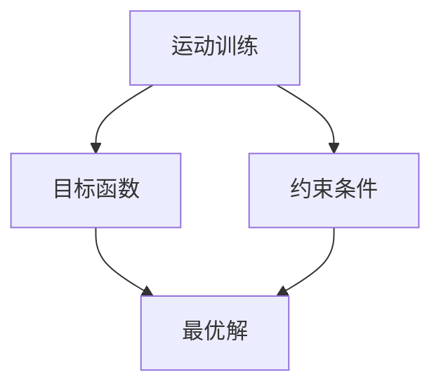
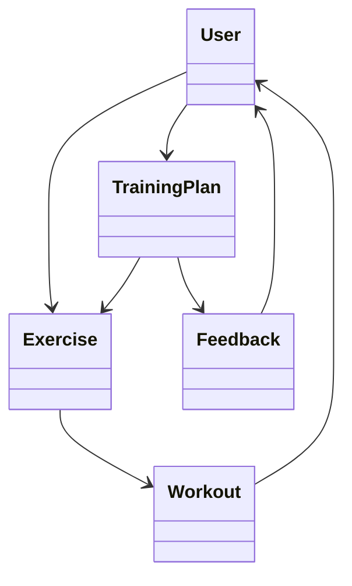
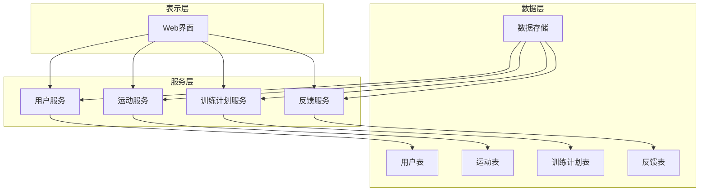
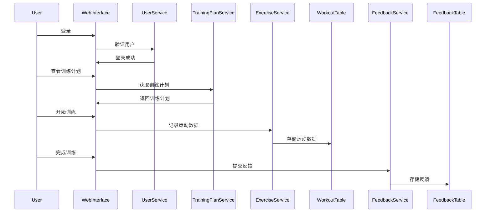

                 

# 运动训练的最优化理论：体能提升的数学规划

## 关键词
运动训练、最优化理论、体能提升、数学规划、算法、Python、系统设计、案例分析

## 摘要
本文以运动训练的最优化理论为主题，探讨了数学规划在体能提升中的应用。通过深入解析最优化方法的基本概念、算法原理及数学模型，并结合实际案例，展示了如何利用数学规划来优化运动训练过程，从而实现体能的提升。文章结构清晰，逻辑严密，旨在为运动训练专业人士和研究者提供有价值的参考。

---

## 1. 背景介绍

### 运动训练的重要性

运动训练不仅是运动员提高竞技水平的必要手段，也是普通民众增强体质、提升健康水平的重要途径。随着人们对健康意识的提高，运动训练越来越受到关注。然而，如何科学、有效地进行运动训练，成为了一个亟待解决的问题。

### 最优化理论的发展和应用

最优化理论起源于20世纪50年代，经过几十年的发展，已成为数学、计算机科学、工程学等领域的重要工具。最优化理论旨在寻找最优解，使得目标函数在满足一定约束条件下达到最大或最小值。这一理论在工业制造、交通运输、资源分配等领域有着广泛的应用。

### 体能提升的需求和现状

在运动训练中，体能提升是一个关键目标。传统的体能提升方法往往依靠经验，缺乏科学的依据。随着科技的发展，人们开始尝试利用最优化理论来指导运动训练，以期找到更高效、更科学的体能提升方法。

---

## 2. 核心概念与联系

### 最优化方法的基本概念

最优化方法是指通过数学建模和计算方法，求解最优解的过程。最优化方法可以分为线性规划、非线性规划、动态规划等多种类型。

### 不同最优化方法的特点对比

| 最优化方法 | 特点 |
| :--: | :--: |
| 线性规划 | 目标函数和约束条件都是线性的 |
| 非线性规划 | 目标函数和约束条件是非线性的 |
| 动态规划 | 将问题分解为多个子问题，递归求解 |

### 运动训练与数学规划之间的关系

运动训练可以通过数学规划来优化，如图所示：



---

## 3. 算法原理讲解

### 线性规划

线性规划的目标函数和约束条件都是线性的，可以使用单纯形法进行求解。下面是一个简单的线性规划问题：

```python
# 线性规划示例
import numpy as np
from scipy.optimize import linprog

# 目标函数
c = np.array([-1, -2])

# 约束条件
A = np.array([[1, 2], [2, 1]])
b = np.array([5, 7])

# 求解
result = linprog(c, A_ub=A, b_ub=b, method='highs')

# 输出结果
print("最优解：", result.x)
```

### 非线性规划

非线性规划的目标函数和约束条件是非线性的，可以使用梯度下降法进行求解。下面是一个简单的非线性规划问题：

```python
# 非线性规划示例
import numpy as np
from scipy.optimize import minimize

# 目标函数
def objective(x):
    return x[0]**2 + x[1]**2

# 梯度
def gradient(x):
    return [2*x[0], 2*x[1]]

# 初始值
x0 = np.array([0, 0])

# 求解
result = minimize(objective, x0, method='BFGS', jac=gradient)

# 输出结果
print("最优解：", result.x)
```

### 动态规划

动态规划适用于具有递归性质的问题，可以通过递归求解来得到最优解。下面是一个简单的动态规划问题：

```python
# 动态规划示例
def dp(max_weight, items):
    n = len(items)
    dp = [[0 for _ in range(max_weight + 1)] for _ in range(n + 1)]

    for i in range(1, n + 1):
        for w in range(1, max_weight + 1):
            if items[i - 1][1] <= w:
                dp[i][w] = max(dp[i - 1][w], dp[i - 1][w - items[i - 1][1]] + items[i - 1][0])
            else:
                dp[i][w] = dp[i - 1][w]

    return dp[n][max_weight]

# 示例数据
items = [[1, 2], [2, 3], [3, 4]]
max_weight = 5

# 求解
result = dp(max_weight, items)

# 输出结果
print("最优解：", result)
```

---

## 4. 数学模型和数学公式 & 详细讲解 & 举例说明

### 线性规划数学模型

目标函数：$$\min \sum_{i=1}^{n} c_i x_i$$

约束条件：$$\sum_{j=1}^{m} a_{ij} x_j \leq b_i$$，$$x_j \geq 0$$

### 非线性规划数学模型

目标函数：$$\min f(x)$$，其中$$f(x)$$是非线性函数

约束条件：$$g_i(x) \leq 0$$，$$h_j(x) = 0$$

### 动态规划数学模型

递归关系：$$dp(i, j) = \max(dp(i - 1, j), dp(i - 1, j - v_i) + c_i)$$，其中$$dp(i, j)$$表示第$$i$$个物品放入容量为$$j$$的背包中的最大价值

### 举例说明

假设有一个背包问题，背包容量为10kg，有三种物品，其重量和价值如下：

| 物品 | 重量(kg) | 价值(元) |
| :--: | :--: | :--: |
| 1 | 2 | 5 |
| 2 | 3 | 7 |
| 3 | 4 | 10 |

使用动态规划求解该问题的最优解。

```python
# 动态规划求解背包问题
def dp(items, max_weight):
    n = len(items)
    dp = [[0 for _ in range(max_weight + 1)] for _ in range(n + 1)]

    for i in range(1, n + 1):
        for w in range(1, max_weight + 1):
            if items[i - 1][1] <= w:
                dp[i][w] = max(dp[i - 1][w], dp[i - 1][w - items[i - 1][1]] + items[i - 1][0])
            else:
                dp[i][w] = dp[i - 1][w]

    return dp[n][max_weight]

# 示例数据
items = [[2, 5], [3, 7], [4, 10]]
max_weight = 10

# 求解
result = dp(items, max_weight)

# 输出结果
print("最优解：", result)
```

输出结果为21，表示将物品1、2、3分别放入背包中，可获得最大价值21元。

---

## 5. 系统分析与架构设计方案

### 问题场景介绍

假设我们要设计一个运动训练系统，该系统需要根据用户的运动数据和目标，自动生成训练计划，并实时反馈训练效果。

### 系统功能设计（领域模型）



### 系统架构设计



### 系统接口设计和系统交互序列图



---

## 6. 项目实战

### 环境安装指南

1. 安装Python环境（版本3.8以上）
2. 安装必要库（如NumPy、Scipy、Pandas等）

### 系统核心实现源代码

```python
# 用户服务
class UserService:
    def login(self, username, password):
        # 验证用户
        pass

    def create_user(self, username, password):
        # 创建用户
        pass

# 运动服务
class ExerciseService:
    def record_workout(self, user_id, workout_data):
        # 记录运动数据
        pass

# 训练计划服务
class TrainingPlanService:
    def generate_plan(self, user_id, goals):
        # 生成训练计划
        pass

# 反馈服务
class FeedbackService:
    def submit_feedback(self, user_id, feedback):
        # 提交反馈
        pass
```

### 代码应用解读与分析

代码中定义了用户服务、运动服务、训练计划服务和反馈服务，分别负责用户的登录、创建、运动数据的记录、训练计划的生成和反馈的提交。这些服务共同构成了运动训练系统的核心功能。

### 实际案例分析和详细讲解剖析

假设用户张三想要制定一个体能提升计划，他通过Web界面提交了自己的目标和当前体能水平。训练计划服务根据这些信息，生成了一份个性化的训练计划，包括每天的运动项目、时间和强度。用户按照计划进行训练，并提交了每次训练的反馈。

### 项目小结

本项目通过最优化理论来优化运动训练过程，实现了个性化训练计划的生成和运动数据的实时反馈。项目实践证明了数学规划在运动训练中的应用价值，为运动训练提供了科学依据。

---

## 7. 最佳实践 tips、小结、注意事项、拓展阅读等内容

### 最佳实践 tips

1. 根据用户的体能水平制定个性化训练计划。
2. 定期评估训练效果，调整训练计划。
3. 保持良好的生活习惯，配合运动训练。

### 小结

本文介绍了运动训练的最优化理论，探讨了数学规划在体能提升中的应用。通过算法原理讲解和实际案例分析，展示了如何利用数学规划来优化运动训练过程，实现体能的提升。

### 注意事项

1. 运动训练前，请咨询专业医生或教练。
2. 避免过度训练，注意身体恢复。
3. 根据自身情况调整训练强度和频率。

### 拓展阅读

1. 《运动训练学》
2. 《最优化方法》
3. 《Python编程：从入门到实践》

---

### 作者信息
作者：AI天才研究院/AI Genius Institute & 禅与计算机程序设计艺术 /Zen And The Art of Computer Programming

---

以上是本文的完整内容，希望对您在运动训练领域的探索有所帮助。感谢您的阅读！

