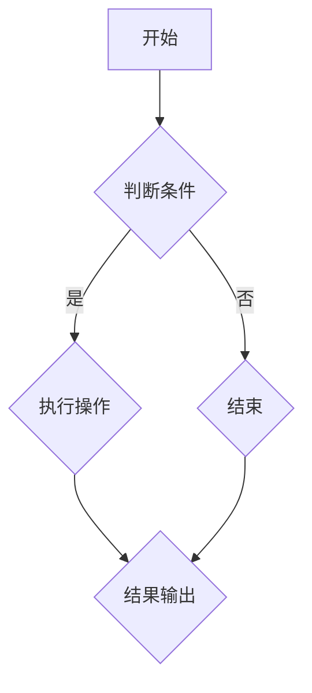

                 

# 远程协作工具在大型应用敏捷开发中的应用

> 关键词：远程协作、敏捷开发、工具、应用、协作效率

> 摘要：本文将深入探讨远程协作工具在大型应用敏捷开发中的重要性及其应用策略。通过详细分析远程协作工具的基本原理、敏捷开发的核心原则，以及如何在实际项目中高效应用这些工具，本文旨在为开发团队提供一套实用的远程协作与敏捷开发指南。

## 目录

1. 引言
   1.1 为什么要讨论远程协作工具与敏捷开发
   1.2 本文结构概述

2. 远程协作工具的基本原理
   2.1 即时通讯工具
   2.2 项目管理软件
   2.3 代码版本控制系统

3. 敏捷开发的核心原则
   3.1 敏捷开发的基本理念
   3.2 敏捷开发的流程和方法

4. 远程协作与敏捷开发的结合
   4.1 远程团队协作的挑战
   4.2 如何利用远程协作工具实现敏捷开发

5. 远程协作工具在大型应用敏捷开发中的应用实践
   5.1 团队组建与管理
   5.2 项目管理与任务跟踪
   5.3 源代码管理与版本控制

6. 案例分析
   6.1 案例背景
   6.2 案例实施
   6.3 案例总结

7. 最佳实践与注意事项
   7.1 最佳实践
   7.2 注意事项

8. 拓展阅读

## 引言

### 1.1 为什么要讨论远程协作工具与敏捷开发

在当今全球化、远程办公日益普及的背景下，远程协作工具在软件开发中的应用变得尤为重要。特别是对于大型应用项目的开发，远程协作工具不仅能够提高团队的工作效率，还能确保项目在多变的市场环境中快速响应和持续迭代。

敏捷开发作为一种以人为核心、迭代、灵活响应变化的软件开发方法，与远程协作工具的结合，能够为开发团队带来前所未有的灵活性和高效性。通过远程协作工具，团队成员可以更方便地进行沟通、协调和协作，从而更好地实践敏捷开发的核心原则。

本文将首先介绍远程协作工具的基本原理，然后探讨敏捷开发的核心原则，接着分析如何在实际项目中高效应用这些工具，并通过具体案例进行实践讲解，最后总结最佳实践与注意事项。

### 1.2 本文结构概述

本文分为七个部分：

1. 引言：阐述远程协作工具与敏捷开发的重要性。
2. 远程协作工具的基本原理：介绍即时通讯工具、项目管理软件和代码版本控制系统。
3. 敏捷开发的核心原则：讲解敏捷开发的基本理念、流程和方法。
4. 远程协作与敏捷开发的结合：分析远程团队协作的挑战及解决方案。
5. 远程协作工具在大型应用敏捷开发中的应用实践：具体介绍团队组建与管理、项目管理与任务跟踪、源代码管理与版本控制。
6. 案例分析：通过具体案例展示如何利用远程协作工具实现敏捷开发。
7. 最佳实践与注意事项：总结最佳实践，提醒注意事项。

接下来，我们将深入探讨远程协作工具的基本原理和敏捷开发的核心原则。

## 远程协作工具的基本原理

### 2.1 即时通讯工具

即时通讯工具是远程协作中不可或缺的一部分，它提供了实时沟通的便利性。常见的即时通讯工具有Slack、Microsoft Teams、WhatsApp等。这些工具不仅支持文本消息，还提供了语音、视频通话、文件共享等功能。

#### 如何使用即时通讯工具提高协作效率？

- **建立团队专用频道**：将团队成员按照功能或项目模块划分到不同的频道中，便于信息的分类和查找。
- **实时沟通与反馈**：通过即时通讯工具，团队成员可以迅速交流想法、解决问题，提高决策效率。
- **任务分配与提醒**：利用即时通讯工具中的任务管理功能，分配任务并设置提醒，确保任务按时完成。

### 2.2 项目管理软件

项目管理软件可以帮助团队更好地规划、跟踪和管理项目进展。常见的项目管理工具有Trello、Jira、Asana等。这些工具通常提供任务管理、进度跟踪、风险评估等功能。

#### 如何使用项目管理软件提高协作效率？

- **任务分解与分配**：将大型任务分解为可操作的小任务，并分配给团队成员，确保每个任务都有明确的责任人。
- **进度跟踪与报告**：实时监控项目进展，生成报告，确保项目按时交付。
- **风险管理与预警**：识别潜在风险，并提前制定应对策略，降低项目风险。

### 2.3 代码版本控制系统

代码版本控制系统（如Git）是软件开发的基石，它能够跟踪代码的变更历史，确保代码的版本控制和协作开发。Git是目前最流行的版本控制系统。

#### 如何使用代码版本控制系统提高协作效率？

- **版本控制与历史追踪**：通过代码版本控制系统，团队成员可以随时查看代码的历史版本，了解变更情况。
- **代码协同开发**：团队成员可以在各自的本地仓库上进行开发，然后提交到中央仓库，确保代码的一致性。
- **分支管理与合并**：利用分支管理，团队成员可以独立开发新功能或修复问题，最终合并到主分支，确保代码的质量和稳定性。

通过以上对远程协作工具基本原理的介绍，我们可以看到这些工具在提升远程协作效率和敏捷开发能力方面的巨大作用。接下来，我们将探讨敏捷开发的核心原则。

## 敏捷开发的核心原则

### 3.1 敏捷开发的基本理念

敏捷开发是一种以用户需求为中心、迭代、持续交付的软件开发方法。它强调团队合作、快速反馈和灵活适应变化。敏捷开发的核心理念包括：

- **用户至上**：始终将用户的需求和满意度放在首位，确保开发出的产品真正满足用户需求。
- **迭代开发**：将开发过程划分为多个短期迭代，每次迭代都提供一个可工作的软件版本，逐步完善产品功能。
- **团队合作**：鼓励团队成员之间的沟通与协作，通过共同工作和互相支持，提高团队整体效率。
- **持续交付**：通过持续集成和持续交付，确保软件始终处于可用状态，快速响应用户反馈。

### 3.2 敏捷开发的流程和方法

敏捷开发通常采用Scrum或Kanban等具体的流程和方法。以下是敏捷开发的基本流程：

- **产品待办列表**：列出所有待开发的功能点，并按优先级排序。
- **冲刺计划**：选择待办列表中的功能点，规划在一个冲刺周期（通常为2-4周）内完成。
- **每日站会**：团队成员每天进行简短的站会，讨论当日任务进展和遇到的问题。
- **冲刺评审**：在冲刺结束时，展示完成的软件版本，收集用户反馈，调整产品待办列表。
- **回顾会议**：总结冲刺过程中的经验和教训，持续改进开发流程。

通过以上对敏捷开发核心原则和流程的介绍，我们可以看到敏捷开发在提升软件开发灵活性和响应能力方面的优势。接下来，我们将探讨如何将远程协作工具与敏捷开发相结合。

## 远程协作与敏捷开发的结合

### 4.1 远程团队协作的挑战

远程团队协作面临许多挑战，如：

- **沟通障碍**：由于地理位置的差异，团队成员之间的沟通可能会受到阻碍，导致信息传递不及时。
- **协调困难**：远程团队难以实时协调工作和资源，可能导致任务进度滞后。
- **效率问题**：远程团队成员可能因为缺乏面对面交流而感到孤独和孤立，影响工作效率。

### 4.2 如何利用远程协作工具实现敏捷开发

#### 4.2.1 沟通与协调

- **即时通讯工具**：利用即时通讯工具，如Slack或Microsoft Teams，进行实时沟通和协调。建立团队专用频道，将团队成员按功能或项目模块划分，确保信息传递迅速、准确。
- **项目管理软件**：使用项目管理软件，如Jira或Trello，制定项目计划和任务分配，实时跟踪任务进度，确保团队成员的工作协调一致。

#### 4.2.2 迭代与交付

- **敏捷开发工具**：采用敏捷开发工具，如Jira或Scrumboard，进行迭代规划和任务管理。通过敏捷开发的方法，将项目划分为多个短期冲刺周期，快速迭代交付可工作的软件版本。
- **持续集成与持续交付**：利用自动化工具，如Jenkins或GitLab CI，实现持续集成和持续交付。确保每次迭代交付的软件版本都经过充分的测试和验证，提高软件质量。

#### 4.2.3 绩效与反馈

- **团队绩效评估**：通过项目管理软件和即时通讯工具，定期评估团队绩效，了解团队成员的工作状况，提供反馈和指导。
- **用户反馈收集**：通过敏捷开发工具，收集用户反馈，快速调整产品功能和方向，确保产品始终符合用户需求。

通过以上策略，远程团队可以更好地实现敏捷开发，提高协作效率和项目成功率。接下来，我们将探讨如何在实际项目中高效应用远程协作工具。

## 远程协作工具在大型应用敏捷开发中的应用实践

### 5.1 团队组建与管理

#### 5.1.1 团队组建流程

- **角色分配**：根据项目需求，明确团队成员的角色和职责，如项目经理、开发人员、测试人员等。
- **团队成员招募**：通过招聘渠道，选拔符合角色要求的专业人才，确保团队的专业素养和协作能力。
- **远程协作工具选择**：根据团队需求，选择合适的远程协作工具，如Slack、Microsoft Teams等，确保团队沟通顺畅、协作高效。

#### 5.1.2 远程团队管理策略

- **建立团队文化**：通过定期的团队活动，如线上团建、虚拟咖啡时间等，增强团队成员之间的交流和互动，建立积极的团队文化。
- **目标明确**：明确团队目标和工作计划，确保每个成员都清楚自己的任务和责任，提高团队协作效率。
- **绩效评估**：定期对团队成员进行绩效评估，了解团队成员的工作状况和贡献，提供反馈和指导，激励团队成员不断进步。

### 5.2 项目管理与任务跟踪

#### 5.2.1 项目管理流程

- **需求分析**：与客户或产品负责人进行沟通，明确项目需求和目标。
- **任务分解**：将项目需求分解为具体的任务，并分配给合适的团队成员。
- **进度跟踪**：利用项目管理软件，如Jira或Trello，实时跟踪任务进度，确保项目按时交付。

#### 5.2.2 任务跟踪策略

- **任务分配与提醒**：通过项目管理软件，将任务分配给团队成员，并设置提醒，确保任务按时完成。
- **任务状态更新**：团队成员定期更新任务状态，项目管理员及时跟进，确保任务进展透明、可控。
- **任务总结与回顾**：在每个冲刺周期结束后，对完成的任务进行总结和回顾，发现问题和改进点，为下一个冲刺周期做好准备。

### 5.3 源代码管理与版本控制

#### 5.3.1 源代码管理流程

- **代码提交**：开发人员将代码提交到代码仓库，如GitLab或GitHub。
- **代码审查**：其他团队成员对提交的代码进行审查，确保代码质量和一致性。
- **版本发布**：通过代码版本控制系统，管理不同版本的代码，确保代码的完整性和可追溯性。

#### 5.3.2 版本控制策略

- **分支管理**：利用分支管理，开发新功能或修复问题时，在独立分支上进行开发，避免影响主分支的稳定性。
- **合并策略**：在开发完成后，将分支代码合并到主分支，确保代码的一致性和完整性。
- **版本控制与文档**：记录每次代码提交的变更日志，生成版本控制文档，便于后续的代码维护和追溯。

通过以上实践，开发团队可以更好地利用远程协作工具进行大型应用敏捷开发，提高项目协作效率和开发质量。接下来，我们将通过具体案例展示如何应用远程协作工具实现敏捷开发。

## 案例分析

### 6.1 案例背景

某大型互联网公司计划开发一款社交应用，项目涉及前端、后端、数据库等多个模块，团队成员分布在不同的城市和国家。为了确保项目的高效协作和成功交付，公司决定采用远程协作工具和敏捷开发方法。

### 6.2 案例实施

#### 6.2.1 团队组建与管理

- **角色分配**：项目经理、前端开发人员、后端开发人员、测试人员等。
- **远程协作工具选择**：Slack用于即时沟通，Jira用于任务管理和进度跟踪。
- **团队文化建立**：定期组织线上团建活动，增强团队成员之间的互动和信任。

#### 6.2.2 项目管理与任务跟踪

- **需求分析**：与客户进行多次沟通，明确功能需求和用户体验。
- **任务分解**：将项目需求分解为多个小任务，分配给不同团队成员。
- **进度跟踪**：通过Jira实时跟踪任务进度，确保项目按时交付。

#### 6.2.3 源代码管理与版本控制

- **代码提交**：开发人员将代码提交到GitLab。
- **代码审查**：其他团队成员对提交的代码进行审查，确保代码质量和一致性。
- **分支管理**：开发新功能或修复问题时，在独立分支上进行开发，避免影响主分支的稳定性。

### 6.3 案例总结

通过远程协作工具和敏捷开发方法的实施，该项目在预定时间内成功交付，取得了良好的用户反馈。以下是项目成功的关键因素：

- **高效的沟通与协作**：通过Slack和Jira，团队成员能够快速沟通和协调，确保项目顺利进行。
- **灵活的任务管理**：通过Jira的任务管理和进度跟踪，项目团队能够灵活调整任务优先级，确保项目按时交付。
- **稳定的代码管理**：通过GitLab的源代码管理和版本控制，确保代码质量和一致性，提高项目稳定性。

通过本案例，我们可以看到远程协作工具和敏捷开发方法在大型应用开发中的成功应用。接下来，我们将总结最佳实践和注意事项。

## 最佳实践与注意事项

### 7.1 最佳实践

- **充分利用远程协作工具**：选择适合团队需求的远程协作工具，确保沟通、协调和协作的顺畅。
- **敏捷开发流程的实施**：严格按照敏捷开发流程进行项目管理和任务跟踪，确保项目的高效推进。
- **持续反馈与改进**：定期收集用户反馈，持续优化产品功能和开发流程。

### 7.2 注意事项

- **确保沟通顺畅**：避免因为沟通障碍导致项目延误，定期组织团队会议，确保信息传递及时。
- **注意时间差异**：跨时区协作时，注意时间差异，合理安排工作任务和会议时间。
- **保持团队士气**：通过线上团建活动，增强团队成员之间的互动和信任，保持团队士气。

## 拓展阅读

- 《敏捷软件开发：原则、实践与模式》
- 《远程工作的艺术》
- 《Git权威指南》

## 作者信息

作者：AI天才研究院/AI Genius Institute & 禅与计算机程序设计艺术 /Zen And The Art of Computer Programming

---

通过本文的详细探讨，我们了解了远程协作工具在大型应用敏捷开发中的重要性及其应用策略。我们分析了远程协作工具的基本原理、敏捷开发的核心原则，并通过实际案例展示了如何在实际项目中高效应用这些工具。希望本文能为开发团队提供有价值的参考和指导。

## 结论

在全球化远程办公日益普及的背景下，远程协作工具在大型应用敏捷开发中的作用愈发关键。通过本文的详细探讨，我们不仅了解了远程协作工具的基本原理和敏捷开发的核心原则，还通过具体案例展示了如何在实际项目中高效应用这些工具。这些工具不仅提高了团队协作效率，还确保了项目在多变的市场环境中能够快速响应和持续迭代。

未来，随着远程办公的进一步普及和技术的不断发展，远程协作工具将更加智能化和集成化。开发团队需要不断探索和适应新的协作工具和方法，以保持竞争力。同时，敏捷开发作为一种以用户需求为核心、迭代、灵活响应变化的开发方法，将继续发挥重要作用，为开发团队带来更高的灵活性和效率。

为了更好地利用远程协作工具和敏捷开发方法，开发团队应该：

1. **选择适合的工具**：根据团队的具体需求和项目特点，选择合适的远程协作工具，确保沟通、协调和协作的顺畅。
2. **严格执行敏捷开发流程**：严格按照敏捷开发流程进行项目管理和任务跟踪，确保项目的高效推进。
3. **持续反馈与改进**：定期收集用户反馈，持续优化产品功能和开发流程，以更好地满足用户需求。

通过以上措施，开发团队将能够在远程协作环境中发挥出更高的工作效率和创造力，为项目的成功交付提供有力保障。

## 附录

以下是一个简单的Mermaid流程图示例，用于展示算法流程：



以下是一个简单的Python代码示例，用于展示算法原理：

```python
def calculate_sum(a, b):
    """
    计算两个数的和
    :param a: 第一个数
    :param b: 第二个数
    :return: 两数的和
    """
    return a + b

# 测试代码
result = calculate_sum(1, 2)
print(f"The sum is: {result}")
```

以下是一个简单的LaTeX公式示例，用于展示数学模型：

$$
E = mc^2
$$

在撰写技术博客时，确保合理使用这些工具和格式，可以使文章更加专业和易于理解。通过附录提供的示例，开发团队可以更好地掌握这些工具的使用方法，提高文章的质量和可读性。

