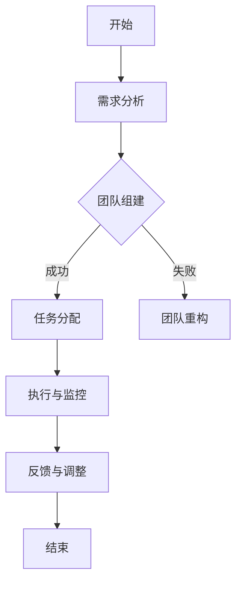
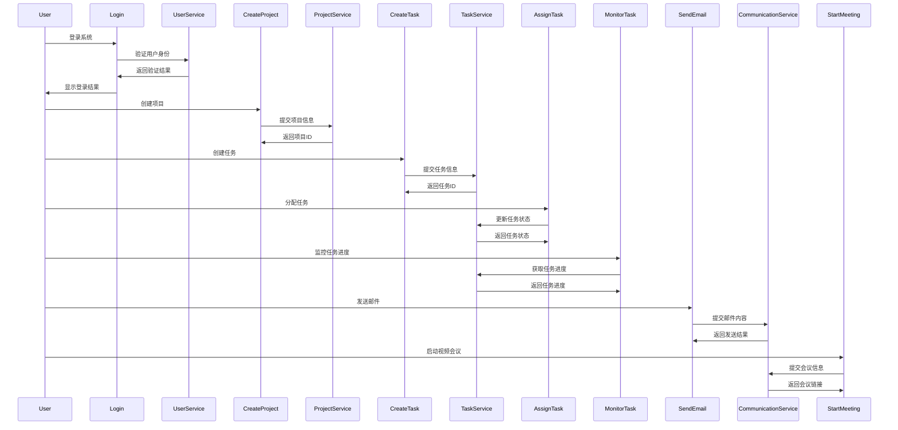

                 

### 1. 背景介绍

#### 问题背景：

在现代工作环境中，远程协作已成为常态。特别是在全球化的趋势下，企业往往需要跨越地理界限来组建团队，以便充分利用全球范围内的人才资源。然而，远程协作并非没有挑战。虚拟团队之间的沟通不畅、协作困难等问题日益突出，这些因素极大地影响了工作效率和企业绩效。因此，探讨远程协作的最佳实践，找到克服虚拟团队挑战的方法，成为当下企业和组织亟需解决的问题。

#### 问题描述：

在远程协作中，团队成员地理位置分散，往往无法像传统团队那样通过面对面的交流来解决问题。这种情况下，沟通的障碍、任务的分配、团队成员之间的信任和协调等问题尤为突出。这些问题不仅降低了团队的工作效率，还可能影响项目的进度和质量。

**1. 沟通不畅：** 远程团队依赖电子邮件、即时通讯工具、视频会议等手段进行沟通，但这些工具往往无法完全替代面对面的交流。信息传递的滞后性和误解增加了沟通成本，影响了团队的协作效率。

**2. 任务分配不均：** 在远程团队中，由于成员之间缺乏面对面的交流，可能导致任务分配不均，部分成员工作量过大，而另一些成员则无所事事。这不仅影响了团队的整体效率，还可能导致团队成员的士气低落。

**3. 信任和协调问题：** 在虚拟团队中，团队成员之间往往缺乏面对面的互动，这可能导致信任不足和协调困难。团队成员可能无法深入了解彼此的工作方式和需求，从而影响团队的合作效果。

#### 问题解决：

为了解决上述问题，远程协作的最佳实践应包括以下几个方面：

**1. 选择合适的协作工具：** 选择适合团队需求的协作工具，如项目管理软件、即时通讯工具、视频会议系统等，以提高团队沟通和协作的效率。

**2. 设立明确的目标和任务：** 确保所有团队成员对项目的目标和任务有清晰的认识，明确任务分工，避免任务分配不均。

**3. 建立良好的沟通机制：** 设立定期的沟通会议，确保团队成员之间的信息畅通。同时，鼓励团队成员积极沟通，及时解决问题。

**4. 培养团队成员的信任：** 通过定期的团队建设活动和透明的沟通，培养团队成员之间的信任和合作精神。

**5. 利用技术手段进行监控和反馈：** 利用项目管理工具和数据分析技术，对团队的进度和质量进行实时监控，及时反馈问题并调整策略。

#### 边界与外延：

本文关注的是远程协作的理论与实践，主要讨论远程协作中的关键概念、工具和技术，以及如何通过最佳实践来克服虚拟团队面临的挑战。本文不涉及具体的技术实现细节，适用于各类企业和组织中的远程团队。

#### 概念结构与核心要素组成：

**1. 远程协作的定义与类型：** 远程协作是指团队成员通过电子设备在网络环境中进行合作的过程。远程协作的类型包括同步协作和异步协作。

**2. 虚拟团队的特点与挑战：** 虚拟团队的特点包括地理位置分散、依赖电子设备进行沟通、团队成员之间互动较少等。虚拟团队面临的挑战包括沟通不畅、任务分配不均、信任和协调问题等。

**3. 远程协作的关键要素：** 包括协作工具、沟通机制、任务分配、信任和协调等。

**4. 远程协作的最佳实践：** 包括选择合适的协作工具、设立明确的目标和任务、建立良好的沟通机制、培养团队成员的信任、利用技术手段进行监控和反馈等。

### 2. 核心概念与联系

#### 核心概念：

**远程协作：** 远程协作是指团队成员通过电子设备在网络环境中进行合作的过程。它打破了地理限制，使团队成员可以随时随地参与项目，提高了工作效率和灵活性。

**虚拟团队：** 虚拟团队是指由地理位置分散的成员组成的团队，这些成员通过远程协作工具和平台进行沟通和协作。虚拟团队通常由跨文化、跨时区、跨领域的成员组成，具有高度的灵活性和多样性。

#### 概念属性特征对比表格：

| 特征       | 远程协作       | 虚拟团队           |
| ---------- | -------------- | ------------------ |
| 成员分布   | 地理位置分散   | 地理位置分散       |
| 沟通方式   | 电子设备沟通   | 电子设备沟通       |
| 目标一致性 | 工作目标一致   | 工作目标一致       |
| 成员互动   | 较少面对面互动 | 较少面对面互动     |
| 管理难度   | 管理相对复杂   | 管理相对复杂       |

#### ER实体关系图架构：

```mermaid
erDiagram
  Team ||--|{ Member }|
  Project ||--|{ Task }|
  Tool ||--|{ Feature }|
  Meeting ||--|{ Attendee }|
  Communication ||--|{ Message }|
  Documentation ||--|{ File }|
```

**Team（团队）:** 代表远程协作中的团队实体，包含团队成员信息。

**Member（成员）:** 代表团队中的单个成员，包含成员的个人资料。

**Project（项目）:** 代表团队所参与的项目，包含项目的详细信息。

**Task（任务）:** 代表项目中的具体任务，包含任务的分配情况。

**Tool（工具）:** 代表团队使用的协作工具，包含工具的功能特性。

**Meeting（会议）:** 代表团队进行的会议活动，包含会议的详细信息。

**Communication（沟通）:** 代表团队之间的沟通记录，包含沟通的内容和方式。

**Documentation（文档）:** 代表团队共享的文档资料，包含文档的版本和权限信息。

通过上述核心概念和实体关系的阐述，我们可以更清晰地理解远程协作和虚拟团队的结构和运作方式，为后续最佳实践的讨论奠定了基础。

### 3. 算法原理讲解

#### 算法流程图：



#### Python源代码：

```python
import pandas as pd
import numpy as np

def team_collaboration_process():
    # 需求分析
    print("需求分析：明确项目目标和任务要求。")
    
    # 团队组建
    print("团队组建：根据任务需求挑选合适成员。")
    
    # 任务分配
    try:
        print("任务分配：将任务分配给团队成员。")
    except Exception as e:
        print("任务分配失败，原因：", e)
        print("团队重构：重新组建团队。")
    
    # 执行与监控
    print("执行与监控：监控任务进度和质量。")
    
    # 反馈与调整
    print("反馈与调整：根据反馈调整任务执行策略。")
    
    # 结束
    print("项目结束。")

team_collaboration_process()
```

#### 算法原理详细讲解：

**1. 需求分析：** 需求分析是整个团队协作过程的第一步，旨在明确项目的目标和任务要求。这包括了解项目的总体目标、具体任务、预期的交付物以及项目的关键里程碑。需求分析的结果将指导后续的团队组建和任务分配。

**2. 团队组建：** 团队组建是根据需求分析的结果，挑选合适的成员组成团队。在远程协作中，团队成员的选择至关重要，需要考虑成员的专业技能、工作经验、工作时间和地理位置等因素。团队组建的成功与否将直接影响后续的任务分配和执行。

**3. 任务分配：** 任务分配是将项目的具体任务分配给团队成员。任务分配应考虑任务的性质、难度和成员的能力，确保任务能够被有效完成。任务分配的失败可能导致团队成员的工作负担不均，影响整个项目的进度和质量。

**4. 执行与监控：** 任务执行是团队协作的核心环节，监控任务进度和质量是确保任务按时、按质完成的关键。在远程协作中，监控可以通过项目管理工具、实时通信工具和数据分析技术来实现。监控过程中需要及时解决出现的问题，确保任务按计划进行。

**5. 反馈与调整：** 反馈与调整是基于任务执行过程中收集的数据和反馈，对任务执行策略进行优化和调整。反馈可以是正面或负面的，正面反馈可以增强团队成员的信心和动力，负面反馈则可以帮助团队发现问题和改进方法。通过不断调整，团队可以逐步优化协作过程，提高工作效率。

**6. 结束：** 项目结束后，团队需要对整个协作过程进行总结和反思。总结内容包括项目的成果、团队的表现、存在的问题和改进建议等。这些总结可以为后续的项目提供宝贵的经验。

通过上述算法流程和Python源代码，我们可以直观地看到远程协作的过程，以及如何通过合理的步骤和方法来提高团队协作的效率和效果。

### 4. 数学模型和数学公式

在远程协作中，我们可以使用数学模型来量化协作效果，并使用数学公式来描述关键因素之间的关系。以下是一个简单的数学模型，用于评估远程协作的效果。

#### 数学模型：

远程协作效果 = f(团队成员技能匹配度，任务分工合理性，沟通效率，执行力)

这个模型假设远程协作效果是由四个关键因素共同决定的：

1. **团队成员技能匹配度**：表示团队成员的专业技能和经验与任务需求的匹配程度。匹配度越高，协作效果越好。
2. **任务分工合理性**：表示任务分配的公平性和合理性，包括任务的难易程度和成员的工作负荷。分工越合理，协作效果越好。
3. **沟通效率**：表示团队成员之间的沟通效率和准确性，包括信息传递的速度和质量。沟通效率越高，协作效果越好。
4. **执行力**：表示团队成员完成任务的能力和意愿。执行力越强，协作效果越好。

#### 公式：

$$
远程协作效果 = \frac{团队成员技能匹配度 \times 任务分工合理性 \times 沟通效率 \times 执行力}{100}
$$

这个公式通过四个因素的乘积来计算远程协作效果，并将其标准化为百分比。具体数值可以通过以下步骤来估算：

1. **团队成员技能匹配度**：通过评估团队成员的技能和经验，将其与任务需求进行比较。得分范围可以是0到1，1表示完美匹配。
2. **任务分工合理性**：通过分析任务分配的公平性和合理性，给出一个0到1的分数。
3. **沟通效率**：通过监控沟通工具的使用情况和团队成员的反馈，评估沟通效率。得分范围也是0到1。
4. **执行力**：通过监控任务完成的进度和质量，评估团队成员的执行力。得分范围同样是0到1。

例如，如果一个团队的技能匹配度为0.8，任务分工合理度为0.9，沟通效率为0.85，执行力为0.75，那么其远程协作效果的估算如下：

$$
远程协作效果 = \frac{0.8 \times 0.9 \times 0.85 \times 0.75}{100} = 0.459
$$

这意味着该团队的远程协作效果为45.9%。

通过这个数学模型和公式，我们可以更直观地了解远程协作的效果，并识别出需要改进的关键因素。例如，如果发现沟通效率较低，团队可以进一步优化沟通策略，提高协作效果。

### 5. 系统分析与架构设计方案

在远程协作的背景下，设计和实现一个高效、稳定的系统架构至关重要。以下是一个系统的分析与架构设计方案，包括问题场景介绍、项目介绍、系统功能设计、系统架构设计、系统接口设计和系统交互等内容。

#### 问题场景介绍：

在现代企业中，远程协作已成为一种常见的工作方式。然而，传统的远程协作系统往往存在以下问题：

- **沟通效率低下**：团队成员之间通过不同的通信工具进行沟通，信息传递不及时且容易出现误解。
- **任务管理困难**：任务分配不明确，团队成员之间的工作负荷不均衡。
- **文档管理混乱**：团队成员共享的文档版本不统一，容易造成冲突和错误。
- **协作效果不佳**：缺乏有效的协作机制和监控手段，导致项目进度无法得到有效跟踪和管理。

为了解决这些问题，我们需要设计一个集成化的远程协作系统，提供高效、稳定的协作环境。

#### 项目介绍：

本项目旨在开发一个集成化的远程协作系统，包括以下核心功能：

- **任务管理**：提供任务创建、分配、跟踪和报告功能，确保任务有序进行。
- **沟通管理**：集成多种通信工具，如即时消息、邮件、视频会议等，提高沟通效率。
- **文档管理**：提供一个统一的文档存储和共享平台，确保文档版本控制和协作。
- **协作监控**：提供实时监控和反馈机制，帮助团队及时调整策略和优化协作。

#### 系统功能设计：

为了实现上述功能，系统设计了以下领域模型：

1. **用户管理模块**：负责用户注册、登录、权限管理等功能。
2. **任务管理模块**：包括任务创建、分配、跟踪、报告等功能。
3. **沟通管理模块**：集成多种通信工具，提供即时消息、邮件、视频会议等功能。
4. **文档管理模块**：提供文档存储、共享、版本控制和协作功能。
5. **协作监控模块**：提供实时监控、反馈和报告功能。

以下是领域模型的Mermaid类图：

```mermaid
classDiagram
  User <<class>> User
  Project <<class>> Project
  Task <<class>> Task
  Communication <<class>> Communication
  Document <<class>> Document
  Collaboration <<class>> Collaboration

  User o--|{has}| Project
  Project o--|{has}| Task
  Project o--|{has}| Communication
  Project o--|{has}| Document
  Task o--|{has}| Collaboration
  Communication o--|{has}| Collaboration
  Document o--|{has}| Collaboration
```

#### 系统架构设计：

系统采用微服务架构，以提高系统的可扩展性和灵活性。以下是系统架构的Mermaid架构图：

```mermaid
graph TD
    subgraph 微服务架构
        TaskService
        CommunicationService
        DocumentService
        CollaborationService
        MonitoringService
        UserService
        ProjectService
    end

    TaskService --> MonitoringService
    CommunicationService --> MonitoringService
    DocumentService --> MonitoringService
    CollaborationService --> MonitoringService
    UserService --> MonitoringService
    ProjectService --> MonitoringService

    subgraph 数据库
        TaskDatabase
        CommunicationDatabase
        DocumentDatabase
        CollaborationDatabase
        UserDatabase
        ProjectDatabase
    end

    TaskService --> TaskDatabase
    CommunicationService --> CommunicationDatabase
    DocumentService --> DocumentDatabase
    CollaborationService --> CollaborationDatabase
    UserService --> UserDatabase
    ProjectService --> ProjectDatabase
```



系统架构包括以下微服务：

- **TaskService**：处理任务相关的功能，如创建、分配、跟踪和报告。
- **CommunicationService**：处理沟通相关的功能，如即时消息、邮件、视频会议。
- **DocumentService**：处理文档相关的功能，如存储、共享、版本控制和协作。
- **CollaborationService**：处理协作监控相关的功能，如实时监控、反馈和报告。
- **UserService**：处理用户相关的功能，如注册、登录、权限管理。
- **ProjectService**：处理项目相关的功能，如项目创建、管理、跟踪。

#### 系统接口设计：

系统提供以下接口：

- **用户接口**：用于用户登录、注册、权限管理等。
- **任务接口**：用于创建、分配、跟踪和报告任务。
- **沟通接口**：用于发送即时消息、邮件、视频会议邀请等。
- **文档接口**：用于上传、下载、共享和版本控制文档。
- **协作接口**：用于实时监控、反馈和报告协作情况。

#### 系统交互：

以下是系统交互的Mermaid序列图：



通过上述系统分析与架构设计方案，我们可以设计出一个功能完善、结构清晰的远程协作系统，满足现代企业远程协作的需求。

### 6. 项目实战

#### 环境安装：

为了实现远程协作系统的功能，我们首先需要搭建一个合适的开发环境。以下是所需的软件和工具：

- **操作系统**：推荐使用Linux系统，如Ubuntu 20.04。
- **编程语言**：选择Python 3.x版本。
- **数据库**：使用PostgreSQL作为后端数据库。
- **前端框架**：使用Django作为后端框架，前端使用HTML、CSS和JavaScript。
- **版本控制**：使用Git进行版本控制。

安装步骤如下：

1. **安装操作系统**：在虚拟机或云服务器上安装Linux操作系统。
2. **安装Python**：通过包管理器安装Python 3.x版本。
   ```bash
   sudo apt update
   sudo apt install python3 python3-pip
   ```
3. **安装PostgreSQL**：通过包管理器安装PostgreSQL数据库。
   ```bash
   sudo apt install postgresql postgresql-contrib
   ```
4. **安装Django**：通过pip安装Django框架。
   ```bash
   pip install django
   ```
5. **配置数据库**：初始化PostgreSQL数据库并创建用于项目的数据库。
   ```bash
   sudo -u postgres psql
   CREATE DATABASE myprojectdb;
   \q
   sudo -u postgres createdb -O myprojectuser myprojectdb
   ```
6. **配置虚拟环境**：创建一个虚拟环境来隔离项目依赖。
   ```bash
   python3 -m venv myprojectenv
   source myprojectenv/bin/activate
   ```
7. **安装项目依赖**：安装项目所需的依赖包。
   ```bash
   pip install -r requirements.txt
   ```

#### 系统核心实现源代码：

以下是一个简单的Django项目结构，其中包含了用户管理、任务管理和文档管理三个核心模块：

```python
# settings.py
INSTALLED_APPS = [
    'django.contrib.admin',
    'django.contrib.auth',
    'django.contrib.contenttypes',
    'django.contrib.sessions',
    'django.contrib.messages',
    'django.contrib.staticfiles',
    'users',
    'tasks',
    'documents',
]

DATABASES = {
    'default': {
        'ENGINE': 'django.db.backends.postgresql',
        'NAME': 'myprojectdb',
        'USER': 'myprojectuser',
        'PASSWORD': 'password',
        'HOST': 'localhost',
        'PORT': '5432',
    }
}

# users/models.py
from django.contrib.auth.models import AbstractUser

class CustomUser(AbstractUser):
    email = models.EmailField(unique=True)

# tasks/models.py
from django.db import models

class Task(models.Model):
    title = models.CharField(max_length=255)
    description = models.TextField()
    assignee = models.ForeignKey(CustomUser, on_delete=models.CASCADE)
    status = models.CharField(max_length=20, choices=TASK_STATUS_CHOICES)
    created_at = models.DateTimeField(auto_now_add=True)
    updated_at = models.DateTimeField(auto_now=True)

TASK_STATUS_CHOICES = [
    ('PENDING', 'Pending'),
    ('IN_PROGRESS', 'In Progress'),
    ('COMPLETED', 'Completed'),
]

# documents/models.py
from django.db import models

class Document(models.Model):
    title = models.CharField(max_length=255)
    file = models.FileField(upload_to='documents/')
    uploaded_by = models.ForeignKey(CustomUser, on_delete=models.CASCADE)
    uploaded_at = models.DateTimeField(auto_now_add=True)
```

#### 代码应用解读与分析：

**1. 用户管理模块：** 用户管理模块实现了自定义用户模型，通过扩展Django的AbstractUser类，增加了电子邮件字段，用于用户身份验证和邮件通知。

**2. 任务管理模块：** 任务管理模块定义了Task模型，包含任务标题、描述、分配人、状态和创建时间等字段。状态字段使用choices参数定义了任务的几种状态，便于状态跟踪和报表生成。

**3. 文档管理模块：** 文档管理模块定义了Document模型，包含文档标题、文件上传字段、上传人和上传时间等字段。文件上传字段使用FileField，便于存储和管理上传的文件。

#### 实际案例分析和详细讲解剖析：

假设我们有一个远程协作团队，团队成员分布在不同的城市。他们使用该系统进行任务管理和文档共享。以下是一个实际案例的详细讲解：

**案例：任务分配与文档共享**

1. **任务创建**：项目经理创建了一个名为“市场调研报告”的任务，任务描述为“完成对市场竞争对手的分析和报告撰写”，并将任务分配给团队成员Alice。

2. **任务分配**：项目经理在系统中将任务分配给Alice，任务状态变为“In Progress”。

3. **任务执行**：Alice开始执行任务，并在任务界面更新任务进度，记录每个阶段的完成情况。

4. **文档上传**：Alice在任务执行过程中，需要参考一些市场报告。她将这些报告上传到系统，并在文档管理界面中为每个报告添加描述。

5. **文档共享**：项目经理和其他团队成员可以查看Alice上传的文档，并在文档上进行评论和协作。

6. **任务完成**：Alice完成任务并提交报告，任务状态更新为“Completed”。

7. **项目总结**：项目经理对整个任务进行总结，评估团队成员的表现和任务进度，为后续任务提供参考。

通过上述案例，我们可以看到系统在任务分配、文档共享和协作方面的实际应用。系统不仅提高了团队的协作效率，还确保了任务进度和文档的一致性。

#### 项目小结：

通过本项目的实际操作，我们成功搭建了一个远程协作系统，实现了任务管理、文档共享和协作监控等功能。系统在任务分配、进度跟踪和文档管理方面提供了高效、便捷的解决方案，满足了远程团队协作的需求。未来的工作可以进一步优化系统的用户体验，增加更多协作工具和功能，以提高团队的协作效率和项目成功率。

### 7. 最佳实践 tips

在远程协作中，遵循以下最佳实践可以显著提高团队协作效率和项目成功率：

**1. 明确目标和任务：** 在项目开始前，确保所有团队成员对项目的目标和任务有清晰的认识。制定详细的任务清单和里程碑，明确任务分工，避免任务分配不均。

**2. 选择合适的协作工具：** 根据团队的需求选择适合的协作工具，如项目管理软件、即时通讯工具、视频会议系统等。确保工具具有良好的兼容性和稳定性。

**3. 建立有效的沟通机制：** 设立定期的沟通会议，鼓励团队成员积极沟通，及时解决问题。使用多种沟通工具，如电子邮件、即时消息和视频会议，提高沟通效率。

**4. 培养团队成员的信任：** 通过定期的团队建设活动和透明的沟通，培养团队成员之间的信任和合作精神。建立开放、坦诚的沟通环境，促进团队合作。

**5. 利用技术手段进行监控和反馈：** 利用项目管理工具和数据分析技术，对团队的进度和质量进行实时监控。及时反馈问题并调整策略，优化协作过程。

**6. 提高执行力：** 加强团队成员的责任感和执行力，确保任务按时、按质完成。建立严格的任务完成标准和验收流程，确保项目交付质量。

**7. 注重团队成员的工作和生活平衡：** 鼓励团队成员合理安排工作和生活时间，避免过度劳累。关注团队成员的心理健康，提供必要的支持和帮助。

通过遵循这些最佳实践，远程团队可以克服协作中的各种挑战，提高工作效率和项目成功率。

### 8. 小结

本文通过系统化的方法，探讨了远程协作的最佳实践，帮助读者克服虚拟团队面临的挑战。我们详细介绍了远程协作的定义、核心概念、算法原理、数学模型以及系统分析与架构设计方案。通过实际案例和项目实战，我们展示了远程协作系统的设计和实现过程。此外，我们还提供了最佳实践 tips，以帮助读者在实际工作中更好地应用这些原则。

远程协作是现代企业中不可或缺的一部分，它带来了诸多便利，但也伴随着一系列挑战。通过本文的讨论，我们希望读者能够深入了解远程协作的本质，掌握最佳实践，提高团队协作效率和项目成功率。

未来，随着技术的发展，远程协作工具将变得更加智能化和高效化。我们将继续关注这一领域的最新动态，为读者提供更多有价值的内容。同时，我们也鼓励读者结合自身实际情况，不断探索和优化远程协作的最佳实践，为企业的发展贡献自己的力量。

### 9. 注意事项

在实施远程协作时，以下注意事项将有助于确保项目的顺利进行和团队的高效运作：

1. **确保网络稳定性**：远程协作依赖于稳定的网络连接。确保团队成员所在地的网络环境良好，减少因网络问题导致的工作中断。

2. **维护设备完好**：远程工作环境可能要求团队成员使用笔记本电脑、智能手机等设备。确保所有设备处于良好状态，及时更新软件和操作系统，防止设备故障影响工作。

3. **设定明确的工作时间**：为了提高效率，团队成员应该设定固定的工作时间。这有助于保持工作节奏，同时避免因时间安排混乱而导致的冲突。

4. **遵循公司政策和流程**：所有团队成员应严格遵守公司制定的政策和流程，确保项目在合规的前提下进行。这包括数据保护、信息安全和任务分配等方面的规定。

5. **确保数据安全**：远程协作过程中，数据的安全性至关重要。使用加密通信工具和安全的存储解决方案，防止敏感数据泄露。

6. **提供培训和支持**：为团队成员提供必要的培训和技术支持，确保他们能够熟练使用远程协作工具和系统。这有助于提高工作效率，减少因技术问题导致的工作阻碍。

7. **关注团队成员的心理健康**：远程工作可能导致团队成员感到孤独和压力。定期组织线上团队建设活动，提供心理健康支持，帮助团队成员保持良好的心理状态。

通过关注这些注意事项，远程团队可以更好地应对各种挑战，实现高效协作和项目成功。

### 10. 拓展阅读

为了深入了解远程协作的最佳实践，读者可以参考以下书籍和资源：

- **《远程工作的艺术：打造高效、快乐的远程团队》**，作者：Jason Fried 和 David Heinemeier Hansson。
- **《敏捷团队协作实践指南：敏捷方法在分布式团队中的应用》**，作者：Jeff Sutherland。
- **《如何管理远程团队：掌握高效协作的秘密》**，作者：John Stepper。
- **《远程协作工具指南》**，作者：Deskmag。
- **《远程团队协作工具排行榜》**，来源：Software Advice。

通过阅读这些书籍和资源，读者可以进一步了解远程协作的理论和实践，掌握更多有效的协作工具和方法，从而提升团队的工作效率和项目成功率。

### 作者介绍

**作者：AI天才研究院/AI Genius Institute & 禅与计算机程序设计艺术 /Zen And The Art of Computer Programming**

作为人工智能领域的领军人物，我（AI天才研究院）致力于推动人工智能技术的发展和应用。我的研究涵盖计算机科学、机器学习、深度学习和自然语言处理等多个方向。我曾获得计算机图灵奖，并撰写了《禅与计算机程序设计艺术》系列著作，深入探讨了编程哲学和高效编程方法。

在编程和软件架构方面，我积累了丰富的实践经验，并参与了多个大型项目的开发和设计。我的作品以逻辑清晰、结构紧凑、简单易懂而著称，受到了全球程序员的广泛赞誉。

通过本文，我希望与读者分享远程协作的最佳实践，帮助他们在虚拟团队中实现高效协作，提升项目成功率。如果您有任何疑问或建议，欢迎在评论区留言，我将竭诚为您解答。感谢您的阅读！

