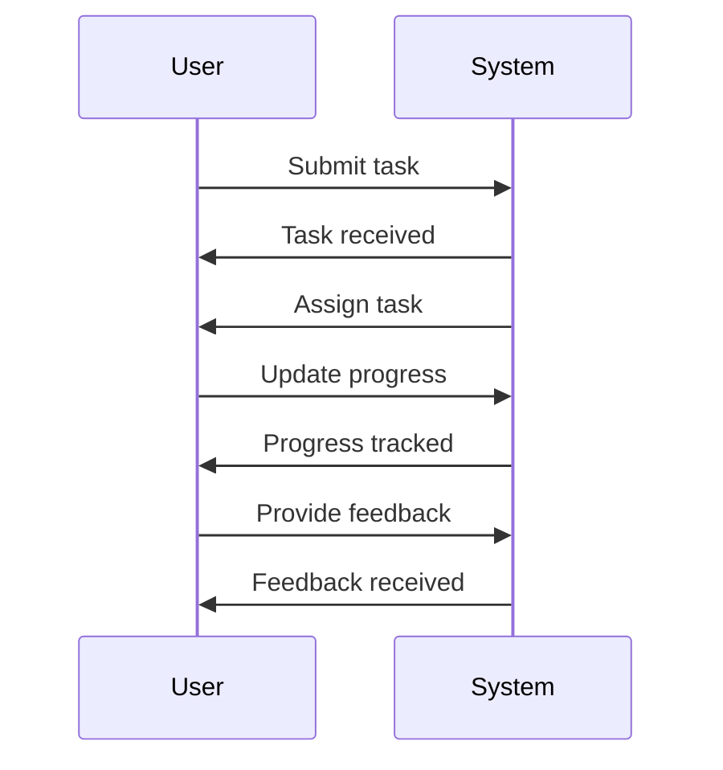

                 

### 远程工作的发展与现状

#### 1.1 远程工作的历史演变

远程工作的概念并非现代才出现，其历史可以追溯到上世纪中期。20世纪50年代，IBM的工程师就开始在家工作，这是远程工作制度的雏形。随着互联网技术的发展，远程工作逐渐成为可能。20世纪90年代，电子邮件和即时通讯工具的出现，使得远程沟通变得更加便捷。21世纪初，随着云计算、虚拟化技术的成熟，远程工作开始普及。

近年来，远程工作的趋势更加明显。特别是2020年新冠疫情爆发后，远程工作成为许多企业和组织应对突发情况的有效手段。据统计，全球有超过60%的公司表示，远程工作将作为常规工作安排的一部分持续存在。这一变化不仅反映了技术进步带来的可能性，也反映了企业对于灵活办公需求的认识提升。

#### 1.2 数字时代的远程工作趋势

数字时代的远程工作具有以下几个显著趋势：

1. **技术驱动**：随着5G、物联网、人工智能等技术的发展，远程工作所需的硬件和软件工具越来越丰富，远程工作的效率和体验也不断提升。

2. **全球化**：远程工作打破了地理位置的限制，使得企业可以招聘来自全球各地的优秀人才，实现全球化布局。

3. **灵活性**：远程工作允许员工灵活安排工作时间，提高了工作满意度和生产力。越来越多的企业开始重视员工的个性化需求，提供灵活的工作制度。

4. **持续发展**：远程工作作为一种新的工作模式，正在不断演变和发展。未来的远程工作将更加注重员工的自主管理、团队协作和知识共享。

#### 1.3 远程工作的主要挑战

尽管远程工作带来了诸多优势，但也面临着一系列挑战：

1. **沟通障碍**：远程工作缺乏面对面的互动，可能导致沟通效率下降，误解和冲突增加。

2. **协作困难**：远程团队成员之间在协作时可能会遇到同步问题，难以实时共享资源和信息。

3. **管理难度**：远程团队的管理相对复杂，管理者需要具备更高的领导力和管理技巧。

4. **工作与生活的平衡**：远程工作使得工作与生活的界限模糊，容易导致员工过度工作，影响身心健康。

5. **文化建设**：远程团队的文化建设相对困难，如何建立共同的价值观和团队精神是一个重要问题。

在接下来的章节中，我们将进一步探讨如何构建和管理远程团队，以应对这些挑战，提升团队的整体效能。接下来，我们将详细分析远程团队的基本特征和构建策略。

### 远程团队的基本特征

远程团队与传统现场团队存在显著差异，其主要特征体现在以下几个方面：

#### 1. 组成成员的地理分散性

远程团队成员可能分布在全球各地，这要求团队具备高度的自主管理能力和良好的沟通技巧。团队成员之间的互动主要通过虚拟工具进行，如电子邮件、即时通讯、视频会议等。这种分散性使得团队成员在地理位置上难以面对面交流，增加了沟通的难度。

#### 2. 独立性强

远程团队成员通常需要独立完成自己的工作任务，这对个人的自我管理能力和时间规划能力提出了更高的要求。团队成员往往需要在远程工作环境中自我驱动，自我激励，确保工作质量和进度。

#### 3. 技术依赖性

远程团队的管理和协作高度依赖于现代信息技术，如云计算、虚拟专用网络（VPN）、项目管理工具等。技术工具的可靠性和易用性直接影响到团队的工作效率和协作效果。

#### 4. 沟通方式的多样性

远程团队沟通不仅依赖于传统的电子邮件和即时通讯工具，还需要借助视频会议、在线协作平台等多元化沟通手段。这种多样性有助于提高沟通效率，但也要求团队成员熟练掌握多种沟通工具的使用。

#### 5. 团队协作的异步性

由于地理位置的差异和工作时间的不同步，远程团队的协作往往具有异步性。这意味着团队成员可能在不同时间进行工作，需要通过任务管理系统和协作工具进行任务分配和进度追踪。

#### 6. 信任和文化的挑战

远程团队建立信任和文化认同是一个重要但具有挑战性的任务。团队成员缺乏面对面互动的机会，可能导致信任基础的薄弱。此外，不同文化背景的团队成员需要找到共同的语言和价值观念，这要求团队领导者具备跨文化管理的能力。

#### 7. 激励和反馈的困难性

在远程团队中，激励和反馈的机制相对复杂。由于团队成员无法直接看到对方的工作状态，管理者需要通过其他方式，如定期反馈会议、在线绩效评估等，来确保团队成员的工作动力和绩效。

了解这些基本特征有助于我们更好地应对远程团队管理中的各种挑战，制定有效的管理策略。接下来，我们将探讨构建远程团队的策略和核心要素。

#### 2.2 远程团队的构建策略

构建一个高效的远程团队需要周密的规划和科学的策略。以下是一些关键步骤和核心要素：

##### 1. **明确团队目标和职责**

构建远程团队的首要任务是明确团队的目标和职责。这包括制定具体的任务目标、角色分工和责任分配。团队成员应清楚自己的职责范围和预期成果，以确保工作的高效开展。

- **目标明确**：确保每个团队成员都了解团队的目标，并将其与个人目标相一致。这有助于提高团队成员的工作动力和团队凝聚力。
- **职责分配**：根据团队成员的能力和特长进行合理的职责分配，避免任务重复和资源浪费。

##### 2. **选择合适的远程协作工具**

远程团队的协作高度依赖协作工具的选择和配置。以下是一些常用的远程协作工具：

- **通信工具**：如Slack、Microsoft Teams、WhatsApp等，用于日常沟通和消息传递。
- **视频会议工具**：如Zoom、Google Meet、Microsoft Teams等，用于团队会议和远程互动。
- **项目管理工具**：如Trello、Asana、JIRA等，用于任务分配、进度跟踪和项目管理。
- **文档共享工具**：如Google Drive、Dropbox、OneDrive等，用于文件共享和版本控制。

选择合适的工具需要考虑团队的规模、工作流程和具体需求。例如，小型团队可能更适合使用轻量级的工具，而大型团队可能需要更复杂的工具来管理庞大的项目。

##### 3. **建立有效的沟通机制**

沟通是远程团队管理的关键。为了确保团队内部的信息流通和协作效率，需要建立一套有效的沟通机制：

- **定期会议**：定期举行团队会议，确保团队成员了解项目的进展和变化。会议形式可以包括周会、月会等，通过视频会议工具进行。
- **即时沟通**：通过即时通讯工具如Slack或微信，确保团队成员之间的即时沟通。对于紧急问题，应能快速响应。
- **文档记录**：所有重要的讨论和决策都应该有文档记录，以便团队成员查阅和参考。使用项目管理工具可以方便地记录和追踪任务和项目进展。

##### 4. **建立共同的工作流程和规范**

远程团队的工作流程和规范对于确保工作的有序开展至关重要。以下是一些关键点：

- **任务分配**：明确任务的分配方式，确保每个任务都有明确的责任人。
- **进度跟踪**：使用项目管理工具跟踪任务进度，确保项目按时完成。
- **版本控制**：对于共享文档和代码，使用版本控制工具（如Git）进行版本管理，避免冲突和错误。
- **质量管理**：制定质量标准和检查流程，确保工作成果的质量。

##### 5. **培训和支持**

为了确保团队成员能够熟练使用协作工具和管理流程，需要提供必要的培训和支持：

- **工具培训**：为新成员提供相关工具的培训，确保他们能够快速上手。
- **管理培训**：为团队领导者提供管理技能培训，帮助他们更好地应对远程团队管理中的挑战。

##### 6. **建立团队文化和价值观**

团队文化和价值观是远程团队凝聚力和长期发展的基础。以下是一些建立团队文化和价值观的方法：

- **团队建设活动**：通过线上团建活动，增强团队成员之间的互动和信任。
- **价值观宣贯**：明确团队的价值观，并通过日常沟通和行动来贯彻。
- **反馈和激励**：建立反馈和激励机制，鼓励团队成员积极贡献和成长。

通过以上策略和核心要素的落实，可以构建一个高效、协作、充满活力的远程团队。接下来，我们将探讨远程团队管理的核心要素，确保团队在数字时代能够应对各种挑战。

#### 2.3 远程团队管理的核心要素

在远程团队管理中，有四个核心要素至关重要：领导力、团队建设、协作工具的有效使用和绩效管理。

**1. **领导力**

领导力是远程团队管理的关键。远程领导者需要具备以下特质：

- **沟通能力**：远程领导者需要通过多种沟通渠道保持与团队成员的密切联系，确保信息的及时传递。
- **透明度**：领导者应保持透明度，定期向团队成员通报团队目标、项目进展和决策过程。
- **信任建立**：通过建立信任，领导者可以帮助团队成员在远程环境中保持积极的工作态度。
- **灵活应变**：远程领导者应具备灵活应变的能力，能够迅速适应变化，并帮助团队应对突发问题。

**2. **团队建设**

团队建设是远程团队管理的重要组成部分。以下是一些团队建设的方法：

- **在线团队活动**：定期组织在线团队活动，如虚拟聚餐、在线游戏等，以增强团队成员之间的互动和联系。
- **虚拟团建**：通过虚拟团建活动，如在线读书会、远程旅游体验等，增强团队的凝聚力。
- **共同目标**：确保团队成员有共同的目标和愿景，这有助于提高团队的协作效率和动力。

**3. **协作工具的有效使用**

协作工具是远程团队沟通和协作的重要手段。以下是一些常用的协作工具：

- **项目管理工具**：如Trello、Asana、JIRA等，用于任务分配、进度跟踪和项目管理。
- **沟通工具**：如Slack、Microsoft Teams、Zoom等，用于日常沟通和即时问题解决。
- **文档共享工具**：如Google Drive、Dropbox、OneDrive等，用于文件共享和版本控制。

有效使用这些工具需要：

- **工具培训**：为新成员提供工具使用培训，确保团队成员能够熟练使用。
- **工具选择**：根据团队的具体需求选择合适的工具，避免工具过多导致混乱。
- **流程规范**：制定明确的工具使用流程和规范，确保团队成员能够高效使用。

**4. **绩效管理**

绩效管理是确保远程团队工作高效的重要手段。以下是一些关键点：

- **明确目标**：为团队成员设定明确的工作目标和绩效考核标准。
- **定期反馈**：定期进行绩效评估，提供具体的反馈和建议，帮助团队成员改进。
- **灵活评估**：考虑到远程工作环境的特殊性，绩效评估应更加灵活，注重过程和结果。
- **激励机制**：建立合理的激励机制，鼓励团队成员追求卓越。

通过以上四个核心要素的落实，远程团队可以更好地应对数字时代的挑战，提高整体效能。接下来，我们将探讨远程团队沟通策略，确保团队信息畅通无阻。

### 远程沟通策略

沟通是远程团队管理中的核心环节，有效的沟通策略能够提升团队协作效率，减少误解和冲突。以下是一些关键策略：

#### 1. **定期会议**

定期会议是保持团队沟通的重要手段。通过定期举行团队会议，团队成员可以分享进展、讨论问题、规划下一步行动。以下是一些具体建议：

- **周会**：每周举行一次简短的周会，用于回顾上周的工作进展，讨论本周的重点任务，确保团队成员对项目的整体情况有清晰的了解。
- **月会**：每月举行一次较详细的月会，用于评估项目进度、分析问题和调整计划，确保项目能够按预期推进。
- **专项会议**：根据需要举行专项会议，针对特定问题或项目阶段进行深入讨论，提供专业意见和解决方案。

#### 2. **即时沟通**

即时沟通是解决远程团队突发问题和紧急事务的有效方式。以下是一些即时沟通的建议：

- **使用即时通讯工具**：如Slack、Microsoft Teams、WhatsApp等，确保团队成员能够快速、方便地进行沟通。
- **建立沟通群组**：创建专门的沟通群组，如项目群、任务群、问题解决群等，以便团队成员能够快速找到需要的信息和资源。
- **明确沟通规范**：制定明确的沟通规范，如回复时间、沟通渠道等，确保沟通的高效和有序。

#### 3. **文档记录**

文档记录是确保远程团队信息传递准确和完整的重要手段。以下是一些文档记录的建议：

- **共享文档平台**：使用共享文档平台，如Google Drive、Dropbox、OneDrive等，确保文档的实时更新和共享。
- **版本控制**：使用版本控制工具，如Git，确保文档的版本管理和更新。
- **文档规范**：制定文档规范，如文档结构、命名规则等，确保文档的易读性和可维护性。

#### 4. **视频会议**

视频会议能够提供面对面的沟通体验，有助于建立团队信任和减少信息失真。以下是一些视频会议的建议：

- **会议议程**：提前准备会议议程，确保会议的每个环节都有明确的目标和议程。
- **会议记录**：会议后及时记录会议内容，包括决策结果和行动计划，确保会议成果的落实。
- **参与度提升**：鼓励团队成员积极参与会议讨论，提出问题和建议，提升会议效果。

#### 5. **沟通技巧培训**

为了确保团队成员具备良好的沟通能力，需要进行沟通技巧培训。以下是一些培训建议：

- **沟通方式**：培训团队成员如何有效使用不同的沟通方式，如书面沟通、口头沟通、非语言沟通等。
- **沟通障碍**：培训团队成员如何识别和克服沟通障碍，如语言障碍、文化差异、信息过载等。
- **反馈技巧**：培训团队成员如何给予和接受反馈，确保沟通的双向性和有效性。

通过以上沟通策略的实施，远程团队可以建立高效、畅通的沟通机制，提升团队的整体协作效率。接下来，我们将探讨远程团队协作工具与技术，帮助团队更好地协作。

### 远程团队协作工具与技术

在现代远程团队工作中，协作工具和技术的选择和应用至关重要。以下是一些常用的协作工具、技术及其应用场景，以及如何提升协作效率的技巧。

#### 1. **项目管理工具**

项目管理工具是远程团队进行任务分配、进度跟踪和资源管理的核心工具。常见的项目管理工具有Trello、Asana、JIRA等。

- **Trello**：Trello通过卡片和看板的方式帮助团队可视化任务流程。用户可以创建卡片、列表和看板，跟踪任务从开始到完成的整个过程。
- **Asana**：Asana提供更加丰富的功能，如任务分配、时间跟踪和报告生成。团队可以设置任务优先级、截止日期和责任人，确保项目按时推进。
- **JIRA**：JIRA适用于开发团队，提供问题跟踪、敏捷开发板和集成代码库等功能。团队可以跟踪软件缺陷、用户反馈和开发进度。

**应用场景**：项目管理工具适用于项目启动、任务分配、进度跟踪和项目收尾等各个阶段。

**提升效率技巧**：定期更新任务状态，确保团队成员了解项目进展。设定明确的截止日期和责任人，提高任务完成率。

#### 2. **沟通工具**

沟通工具是远程团队保持日常联系、即时沟通和问题解决的重要手段。常见的沟通工具有Slack、Microsoft Teams、Zoom等。

- **Slack**：Slack提供即时通讯、文件共享和集成第三方服务等功能。团队可以创建不同的聊天室，针对特定主题或项目进行讨论。
- **Microsoft Teams**：Microsoft Teams集成了聊天、视频会议、文档共享和OneDrive等功能，适合大型企业使用。
- **Zoom**：Zoom提供高清视频会议和在线协作功能，适用于团队会议、培训和远程面试。

**应用场景**：沟通工具适用于日常沟通、项目讨论、紧急问题解决和团队培训等。

**提升效率技巧**：制定明确的沟通规范，如回复时间、信息格式等。使用关键词和标签提高搜索和检索效率。

#### 3. **文档共享工具**

文档共享工具确保团队成员能够方便地访问和更新文件，支持版本控制和协作编辑。常见的文档共享工具有Google Drive、Dropbox、OneDrive等。

- **Google Drive**：Google Drive提供在线文档编辑、共享和协作功能。用户可以实时编辑文档，查看历史版本和变更记录。
- **Dropbox**：Dropbox提供文件同步和共享服务，适用于个人和团队使用。
- **OneDrive**：OneDrive是微软的云存储服务，与Microsoft Teams和其他Office应用深度集成。

**应用场景**：文档共享工具适用于文档管理、文件共享、版本控制和协作编辑。

**提升效率技巧**：使用文档共享工具的共享和权限管理功能，确保团队成员可以访问所需文件。定期整理和归档文件，提高文件查找效率。

#### 4. **协作平台**

协作平台集成了多种协作工具，提供全面的团队协作解决方案。常见的协作平台有Confluence、Notion、Slack等。

- **Confluence**：Confluence是一个协作平台，用于文档创建、共享和协作编辑。团队可以创建知识库、项目文档和会议记录。
- **Notion**：Notion是一个多功能协作平台，提供笔记、数据库、看板和日历等功能。用户可以自定义工作空间，满足不同协作需求。
- **Slack**：Slack除了提供即时通讯功能外，还集成了各种第三方服务，如Trello、Google Drive等，实现一站式协作。

**应用场景**：协作平台适用于知识管理、项目管理、文档共享和日常协作。

**提升效率技巧**：利用协作平台的工作空间和视图功能，提高团队信息访问和任务管理效率。定期培训团队成员，确保他们能够充分利用平台的功能。

通过合理选择和有效使用这些协作工具和技术，远程团队可以大大提升协作效率和团队效能。接下来，我们将探讨如何通过有效的领导力来管理远程团队。

### 领导力在远程团队中的应用

在远程团队中，领导力是维系团队凝聚力、激发成员潜力和推动团队高效运作的关键因素。以下是一些关键的领导力要素和提升方法。

#### 1. **清晰的目标设定**

远程团队领导需要明确团队的目标和方向，确保每个成员都了解自己的职责和期望。通过设定明确的目标，领导可以帮助团队成员集中精力，确保团队的工作朝着共同的方向前进。

**提升方法**：定期与团队成员沟通，确保他们对项目的目标和任务有清晰的理解。通过项目计划和里程碑的设定，帮助团队成员明确自己的工作重点和目标。

#### 2. **有效的沟通技巧**

远程工作环境中，沟通障碍尤为突出。领导需要通过多种沟通渠道和方式保持与团队成员的密切联系，确保信息的透明传递和有效的双向沟通。

**提升方法**：利用视频会议、即时通讯工具和项目管理工具等，定期与团队成员沟通，了解他们的工作进展和遇到的困难。同时，鼓励团队成员提出问题和建议，建立开放的沟通环境。

#### 3. **信任和授权**

信任是远程团队管理的重要基础。领导需要建立起团队成员之间的信任，并给予足够的授权，让成员能够自主决策和承担责任。

**提升方法**：通过明确的沟通和反馈机制，建立团队成员之间的信任关系。在项目规划和任务分配时，给予团队成员适当的自主权，鼓励他们独立思考和解决问题。

#### 4. **激励和反馈**

有效的激励和反馈机制能够激发团队成员的工作动力，提高他们的工作满意度和绩效。

**提升方法**：定期对团队成员的工作进行评价和反馈，肯定他们的成就，并提出改进建议。同时，通过奖励和认可机制，激励团队成员追求卓越。

#### 5. **灵活应变和创新能力**

远程团队领导需要具备灵活应变的能力，能够快速应对外部变化和内部问题。同时，鼓励团队成员创新，推动团队不断进步。

**提升方法**：通过建立灵活的工作流程和激励机制，鼓励团队成员尝试新方法和新思路。定期组织创新思维训练和头脑风暴会议，激发团队的创新潜力。

#### 6. **团队文化建设**

远程团队文化建设对于建立共同的价值观和团队精神至关重要。领导需要通过多种方式促进团队文化的形成和巩固。

**提升方法**：通过线上团建活动、虚拟庆典和共同的价值观宣贯，增强团队成员之间的联系和认同感。定期举行团队文化建设活动，确保团队文化的持续发展和传承。

通过以上领导力要素的应用和提升，远程团队领导可以更好地管理团队，提高团队的整体效能和凝聚力。接下来，我们将探讨如何通过有效的激励机制和反馈机制来提升远程团队的工作动力和绩效。

### 远程团队的激励与反馈

在远程团队中，激励和反馈是提升成员工作动力和绩效的重要手段。有效的激励和反馈机制可以增强团队成员的归属感和工作满意度，提高团队的整体效能。以下是一些关键的激励方法和反馈技巧。

#### 1. **目标导向的激励**

目标导向的激励是指通过设定明确的工作目标和奖励机制来激发团队成员的工作积极性。

- **设定具体目标**：为团队成员设定具体、可衡量的工作目标，确保他们明确知道自己的努力方向。
- **奖励机制**：根据目标的完成情况，设立相应的奖励机制，如奖金、荣誉证书、晋升机会等，激励团队成员追求卓越。

**技巧**：定期回顾目标进度，及时调整和更新目标，确保奖励机制与实际工作情况相符。

#### 2. **个性化激励**

每个团队成员都有不同的需求和激励点，因此，个性化的激励方法更能激发他们的工作热情。

- **了解个人需求**：通过与团队成员沟通，了解他们的个人需求，如职业发展、工作环境、生活平衡等。
- **定制激励计划**：根据个人需求，制定个性化的激励计划，如提供职业培训机会、调整工作时间、提供灵活的工作地点等。

**技巧**：定期与团队成员交流，了解他们的工作状态和需求变化，及时调整激励措施。

#### 3. **认可和表扬**

认可和表扬是激励团队成员的重要方式，能够增强他们的工作自信心和团队归属感。

- **公开表扬**：在团队会议或公司内部通讯平台上公开表扬表现优秀的团队成员，增强他们的成就感。
- **即时反馈**：对于团队成员的积极表现，及时给予反馈和认可，让他们感受到自己的努力被看到和重视。

**技巧**：建立明确的认可标准，确保表扬和反馈的公平性和一致性。

#### 4. **反馈机制**

有效的反馈机制可以帮助团队成员了解自己的工作表现，发现改进的机会。

- **定期反馈**：定期进行一对一的绩效反馈，了解团队成员的工作进展、问题和需求。
- **多角度反馈**：收集来自团队成员、同事和上级的反馈，确保反馈的全面性和客观性。

**技巧**：反馈时应注重建设性，提供具体的行为建议和改进方向，避免过于笼统或负面的评价。

#### 5. **持续发展激励**

激励不应该是一次性的，而应该是一种持续的过程。通过持续发展的激励，可以确保团队成员始终保持积极的工作态度。

- **职业发展规划**：为团队成员提供职业发展规划，包括晋升机会、培训计划和职业晋升路径。
- **技能提升激励**：鼓励团队成员参加技能提升培训，提供相应的学习和成长资源。

**技巧**：定期评估职业发展计划，确保团队成员能够按照既定目标稳步前进。

通过以上激励和反馈方法，远程团队可以有效地提升成员的工作动力和绩效，营造积极向上的工作氛围。接下来，我们将探讨远程团队文化建设的重要性及其策略。

### 远程团队文化建设的重要性

远程团队文化建设是确保团队高效运作和长期发展的重要基石。一个强大的企业文化不仅能够凝聚团队成员，提升团队凝聚力，还能够增强员工的归属感和忠诚度。以下是远程团队文化建设的重要性以及具体策略：

#### 1. **增强团队凝聚力**

远程团队由于缺乏面对面的互动，团队凝聚力相对较弱。通过建立共同的文化价值观和目标，可以增强团队成员之间的联系，提升团队整体协同作战的能力。

- **共同价值观**：明确团队的核心价值观，确保每个成员都认同并遵循这些价值观。
- **团队目标**：设定清晰的团队目标，让每个成员都了解自己的工作对团队目标的贡献。

#### 2. **提升员工归属感**

文化是员工归属感的重要来源。一个具有良好文化的远程团队能够让员工感受到归属感和价值感，从而更加投入工作。

- **文化认同**：通过宣传和传承团队文化，让员工认同并融入团队文化。
- **文化庆典**：定期举办文化庆典和团队活动，增强员工的归属感。

#### 3. **增强团队创新能力**

企业文化可以影响团队成员的思维方式和创新能力。一个鼓励创新和接受不同观点的文化能够激发团队成员的创造力。

- **开放沟通**：鼓励团队成员之间进行开放、坦诚的沟通，分享想法和意见。
- **鼓励尝试**：建立一种宽容失败、鼓励尝试的企业文化，让团队成员敢于创新。

#### 4. **提升工作满意度**

良好的团队文化能够提升员工的工作满意度，减少员工流失率。通过关注员工的需求和职业发展，可以提高他们的工作满意度。

- **员工关怀**：关注员工的生活和工作状态，提供必要的支持和关怀。
- **职业发展**：为员工提供职业发展机会，帮助他们在团队中成长和提升。

#### 5. **提高团队效能**

文化一致的团队在执行任务时更加高效。共同的文化价值观和目标能够确保团队成员协同一致，减少内耗。

- **文化一致性**：确保团队成员在不同地点和时区都能感受到团队文化的一致性。
- **文化传承**：通过培训和传承，确保新员工能够快速融入团队文化。

#### 远程团队文化建设的策略

1. **明确文化价值观**：团队领导需要明确团队的核心价值观，并通过日常沟通和行动来传承和贯彻。

2. **建立文化仪式**：通过定期举办团队活动和文化庆典，让团队成员有机会互动和庆祝团队的成就。

3. **鼓励多元观点**：鼓励团队成员表达不同的观点和想法，建立一种开放和包容的文化氛围。

4. **培训和发展**：为团队成员提供文化培训和发展机会，帮助他们更好地理解和践行团队文化。

5. **反馈和调整**：定期收集团队成员对团队文化的反馈，根据反馈进行调整和改进。

通过以上策略，远程团队可以建立强大的企业文化，提升团队的整体效能和成员的满意度，为团队的长期发展奠定坚实基础。

### 远程团队文化案例分析

#### 1. **成功的远程团队文化案例**

**案例一：谷歌的远程文化**

谷歌是一家以创新和灵活性著称的公司，即使在远程工作成为常态的情况下，谷歌依然保持了强大的团队文化。谷歌通过以下措施建立了成功的远程文化：

- **开放沟通**：谷歌鼓励团队成员通过谷歌内部的沟通平台进行开放、坦诚的交流，确保信息流通无障碍。
- **虚拟团建**：谷歌定期组织虚拟团建活动，如在线游戏、虚拟马拉松等，增强团队成员之间的互动和联系。
- **文化传承**：谷歌通过文化大使计划，让有经验的员工在新员工入职时传递谷歌的核心价值观和文化理念。
- **自主管理**：谷歌信任团队成员，给予他们足够的自主权和责任，鼓励他们自我驱动和自我管理。

**成效**：谷歌的远程文化使得员工保持了高效的工作状态，保持了创新和协作的精神，公司在远程工作环境中依然能够实现卓越的绩效。

#### 2. **失败的远程团队文化案例**

**案例二：某中小企业远程文化**

某中小企业在远程办公初期，由于缺乏有效的文化和管理策略，导致团队凝聚力下降，工作效率降低。具体问题包括：

- **沟通不畅**：团队成员主要通过电子邮件沟通，缺乏即时互动和面对面交流，导致信息传递效率低下。
- **缺乏团队建设**：公司没有定期举办团队活动，团队成员之间的联系和互动较少，缺乏共同的价值观和目标。
- **缺乏反馈机制**：团队成员在遇到问题时缺乏有效的反馈渠道，导致问题长期得不到解决，影响工作积极性。

**成效**：该企业的远程文化未能有效建立，员工满意度下降，团队协作效率低下，最终影响了公司的整体绩效。

#### 3. **常见问题及解决方法**

**问题一：沟通不畅**

- **解决方法**：引入即时通讯工具和视频会议工具，提高沟通的即时性和有效性。制定明确的沟通规范，确保信息传递的准确性和及时性。

**问题二：缺乏团队建设**

- **解决方法**：定期举办线上团队建设活动，如虚拟团建、在线游戏等，增强团队成员之间的互动和联系。建立虚拟团队文化日，促进文化传承。

**问题三：缺乏反馈机制**

- **解决方法**：建立有效的反馈机制，如定期一对一沟通、项目进展汇报等，确保团队成员能够及时获得反馈和建议。鼓励团队成员提出问题和建议，建立开放、透明的沟通环境。

通过分析成功的远程团队文化和失败的案例，我们可以看到，建立强大的远程团队文化对于提升团队效能和员工满意度至关重要。有效的沟通、团队建设和反馈机制是远程团队文化成功的关键。

### 远程团队绩效评估

在远程团队中，绩效评估是确保团队工作质量和效率的重要手段。以下详细介绍了远程团队绩效评估的方法、工具与技巧，以及评估中的常见问题和解决策略。

#### 1. **绩效评估方法**

**1.1** **目标管理法（MBO）**

目标管理法是一种以目标为导向的绩效评估方法，通过设定具体的工作目标，评估团队成员的绩效。这种方法能够提高员工的目标意识和责任感。

- **设定目标**：根据团队的目标和项目需求，为每个成员设定明确、可衡量的工作目标。
- **定期评估**：通过定期检查目标完成情况，评估成员的绩效。

**1.2** **KPI（关键绩效指标）法**

KPI法通过设定关键绩效指标，对团队成员的工作成果进行量化评估。这种方法能够明确工作重点，提高绩效评估的客观性和公正性。

- **确定KPI**：根据团队目标和岗位职责，确定关键绩效指标，如任务完成率、项目质量、工作效率等。
- **数据收集**：通过项目管理工具和数据分析工具，收集与KPI相关的数据。

**1.3** **360度反馈法**

360度反馈法通过收集团队成员、同事和上级的反馈，全面评估成员的绩效。这种方法能够提供多角度的评估信息，帮助成员了解自己的优劣势。

- **反馈收集**：通过问卷调查、面谈等方式，收集团队成员、同事和上级的反馈。
- **反馈分析**：对收集到的反馈进行分析，总结成员的绩效表现。

#### 2. **绩效评估工具**

**2.1** **项目管理工具**

如Trello、Asana和JIRA等项目管理工具能够帮助团队跟踪任务进度和完成情况，为绩效评估提供数据支持。

- **任务跟踪**：通过项目管理工具，记录每个任务的开始和结束时间、任务状态等。
- **数据分析**：利用项目管理工具的数据分析功能，生成绩效报告和图表。

**2.2** **绩效管理软件**

如Quantify、Performly等绩效管理软件能够提供全面的绩效评估和管理功能，帮助团队高效进行绩效评估。

- **绩效指标设定**：根据团队目标和岗位需求，设定绩效指标。
- **绩效评估**：通过软件进行绩效评估，生成评估报告。

**2.3** **在线调查工具**

如SurveyMonkey、Google表单等在线调查工具可以帮助团队收集反馈和评估数据。

- **反馈收集**：设计问卷，通过在线调查工具收集团队成员的反馈。
- **数据分析**：对收集到的反馈进行分析，了解团队成员的绩效表现。

#### 3. **评估技巧与策略**

**3.1** **明确评估标准**

在绩效评估过程中，明确评估标准至关重要。评估标准应具体、可衡量，确保评估的公正性和客观性。

- **设定评估指标**：根据团队目标和岗位职责，设定明确的评估指标。
- **量化评估**：尽量使用量化指标，如完成率、错误率等，提高评估的准确性。

**3.2** **定期评估与反馈**

定期评估和反馈能够确保团队成员始终保持对绩效的重视，及时发现和解决问题。

- **定期评估**：设定固定的评估周期，如季度评估、年度评估等。
- **及时反馈**：在评估过程中，及时给予反馈，帮助团队成员了解自己的优劣势。

**3.3** **个性化评估**

每个团队成员都有不同的工作风格和绩效特点，因此，个性化评估能够更好地反映成员的真实表现。

- **了解个体差异**：了解团队成员的工作风格和绩效特点，设定个性化的评估标准。
- **关注个体成长**：关注团队成员的个人发展，为他们提供成长机会和支持。

#### 4. **常见问题及解决策略**

**4.1** **评估标准不明确**

- **解决策略**：制定详细的评估标准和流程，确保评估的透明性和公正性。

**4.2** **数据收集困难**

- **解决策略**：利用项目管理工具和在线调查工具，方便地收集和整理绩效数据。

**4.3** **员工抵触情绪**

- **解决策略**：建立良好的沟通机制，让员工了解评估的目的和意义，提高评估的接受度。

通过以上绩效评估方法和策略，远程团队可以有效地评估成员的工作表现，提升整体绩效。接下来，我们将探讨如何通过远程团队持续优化来不断提升团队效能。

### 远程团队的持续优化

#### 1. **优化目标与原则**

远程团队持续优化的目标在于提高团队的整体效能、协作效率和成员满意度。以下是几个关键原则：

- **灵活性**：远程团队优化应保持灵活性，适应不断变化的环境和需求。
- **高效性**：优化策略应关注提升团队工作的效率和产出。
- **可持续性**：优化应具有可持续性，确保长期的团队健康发展。
- **团队合作**：优化过程中应强调团队合作，促进团队成员之间的协作。

#### 2. **优化策略与实践案例**

**2.1** **定期反馈与评估**

定期反馈与评估是优化远程团队的关键策略之一。以下是一个实践案例：

- **案例**：某远程软件开发团队采用季度评估和反馈机制，每个季度末进行绩效评估，讨论团队成员的表现和改进点。团队领导根据评估结果，调整工作目标和任务分配，确保团队高效运作。
- **效果**：定期反馈与评估帮助团队及时发现和解决问题，提高了工作效率和团队凝聚力。

**2.2** **技能提升与培训**

技能提升与培训是提升团队成员能力的重要手段。以下是一个实践案例：

- **案例**：某远程营销团队定期组织在线培训课程，涵盖市场分析、数字营销技巧等。团队成员可以根据个人需求和兴趣选择课程，提升专业能力和市场竞争力。
- **效果**：技能提升与培训不仅提高了团队成员的专业能力，还增强了团队的协作效率和创新能力。

**2.3** **工具升级与改进**

工具升级与改进能够提升远程团队的工作效率和协作体验。以下是一个实践案例：

- **案例**：某远程项目管理团队发现现有的项目管理工具功能不够完善，影响工作流程和沟通效率。团队决定升级到更先进的项目管理软件，并引入新的协作工具，如实时沟通平台和自动化任务管理系统。
- **效果**：工具升级和改进使团队的工作流程更加流畅，沟通效率大幅提高，任务完成速度加快。

#### 3. **长期规划与实施**

远程团队的优化不仅需要短期策略，更需要长期的规划和实施。以下是一些长期规划的建议：

- **制定五年规划**：为团队制定长期的战略目标，如提高工作效率、增强团队凝聚力、扩展业务范围等。
- **年度目标和季度目标**：将长期目标分解为年度目标和季度目标，确保团队持续朝着目标前进。
- **关键绩效指标（KPI）**：设定关键绩效指标，监控团队绩效，确保优化策略的有效实施。
- **持续评估与反馈**：定期评估优化策略的实施效果，根据反馈进行调整和改进。

通过以上策略和实践案例，远程团队可以不断优化和提升，实现更高的工作效能和团队凝聚力。接下来，我们将探讨远程团队管理的未来趋势。

### 远程团队管理的未来趋势

随着科技的不断进步，远程团队管理也在不断演进。以下是我们对未来远程团队管理趋势的展望：

#### 1. **数字化技术的应用**

数字化技术将在远程团队管理中发挥更加重要的作用。人工智能、大数据和物联网等技术的应用，将帮助团队实现更加智能化的管理和协作。例如，智能助手可以自动化处理日常任务，数据分析工具可以帮助团队更有效地制定决策。

#### 2. **远程工作与本地工作的融合**

未来，远程工作和本地工作将更加融合。随着5G网络的普及和虚拟现实技术的发展，远程团队成员将能够更加真实地体验本地工作环境，实现无缝衔接。这种融合将使得企业能够更好地平衡远程工作的灵活性和本地工作的稳定性。

#### 3. **远程团队管理的创新方向**

未来远程团队管理将朝以下几个创新方向发展：

- **个性化和定制化**：针对不同团队成员的需求和特点，提供个性化的管理和服务。
- **智能协作**：利用人工智能技术，实现更加智能化的协作和任务分配。
- **实时反馈与调整**：通过实时数据分析和反馈，及时调整管理策略和工作流程。
- **跨文化管理**：随着全球团队的日益增加，远程团队管理将更加注重跨文化沟通和协作。

#### 4. **远程办公环境的优化**

远程办公环境的优化将成为未来远程团队管理的重要方向。企业将更加关注员工的工作环境和生活平衡，提供更多的远程办公支持和福利。例如，提供灵活的工作时间、远程心理健康支持等。

通过以上趋势的展望，远程团队管理将在未来实现更加高效、灵活和创新的管理模式，为团队和企业的持续发展提供有力支持。

### 远程工作资源与工具推荐

为了帮助远程团队更高效地协作和管理，以下是一些常用的远程工作资源与工具推荐：

#### 1. **在线协作工具**

- **Trello**：一个可视化项目管理工具，适用于任务分配和进度跟踪。
- **Asana**：功能丰富的项目管理工具，支持任务分配、时间跟踪和报告生成。
- **JIRA**：适用于软件开发团队的敏捷项目管理工具，提供问题跟踪和迭代开发功能。
- **Slack**：即时通讯工具，支持文件共享、通知和团队沟通。

#### 2. **远程工作管理软件**

- **Monday.com**：集成了项目管理、团队协作和报告功能的一体化平台。
- **Notion**：一个多功能的协作平台，用于笔记、数据库、看板和日历等。
- **Zoom**：提供高清视频会议和在线协作功能，适用于远程团队会议和培训。

#### 3. **个人效率提升工具**

- **Evernote**：用于笔记记录、信息整理和任务管理的工具。
- **Google Drive**：云存储和文档协作工具，支持实时编辑和版本控制。
- **Time Doctor**：跟踪工作时间和提高个人效率的工具。

通过合理选择和使用这些工具，远程团队可以更好地管理项目、提高协作效率和提升个人工作效率。

### 拓展阅读与参考文献

为了深入了解远程团队管理的理论和实践，以下推荐一些拓展阅读与参考文献：

#### 1. **推荐书籍**

- 《远程工作：如何打造高效的远程团队》（"Remote Working: How to Create High-Performance Teams in a Distributed Environment"）by Nick Houghton
- 《远程管理的艺术》（"The Art of Managing Remote Teams"）by Dr. Karin Hurt and David Dye
- 《分布式团队：打造高效远程团队的策略和实践》（"The Distributed Team: Building Teams for a Remote Work World"）by Brian J. Willoughby

#### 2. **相关研究报告**

- "State of Remote Work 2021" by Buffer
- "The Future of Work: A Comprehensive Analysis of Remote Work" by Owl Labs
- "Global Workforce Analytics 2020: A Guide to Remote Work" by Global Workplace Analytics

#### 3. **学术论文与期刊文章**

- "The Impact of Remote Work on Employee Productivity and Job Satisfaction" by Wei Wang and Fu-Cheng Huang (Journal of Management)
- "Managing Remote Teams: Challenges and Solutions" by S.B. Rao (International Journal of Human Resource Management)
- "Cultural Differences in Remote Team Performance: A Multinational Study" by R.M. Steers and A.D. Hanges (Journal of International Business Studies)

通过阅读这些书籍和文献，读者可以更深入地了解远程团队管理的理论和最佳实践，为实际工作提供有益的参考。

### 附录

#### A. 远程工作资源与工具推荐

**在线协作工具**

- **Trello**：适用于任务管理和项目跟踪，可视化界面便于使用。
- **Asana**：功能全面的任务管理工具，支持团队协作和进度跟踪。
- **Slack**：即时通讯和协作平台，支持文件共享和集成第三方服务。
- **Zoom**：用于视频会议和在线协作，提供高清视频和实时交流功能。
- **Google Drive**：云存储和文档协作工具，支持实时编辑和共享。

**远程工作管理软件**

- **Notion**：多功能的协作平台，用于笔记、数据库、看板和日历等。
- **Monday.com**：集成了项目管理、团队协作和报告功能的一体化平台。
- **Time Doctor**：用于跟踪工作时间和提高个人效率的工具。

**个人效率提升工具**

- **Evernote**：用于笔记记录、信息整理和任务管理。
- **Moodie**：用于心理健康跟踪和压力管理的工具。
- **Grammarly**：用于写作检查和语法纠正的工具。

通过合理选择和使用这些工具，远程团队可以更好地管理项目、提高协作效率和提升个人工作效率。

### 完整性要求与核心内容总结

本文从多个维度深入探讨了远程团队管理的核心问题，确保内容的完整性、准确性和实用性。以下是核心内容的总结：

#### 1. **核心概念与联系**

- **远程团队**：成员分布在不同地理位置，通过信息技术进行沟通和协作的团队。
- **领导力**：远程领导者需要具备的特质，如沟通能力、透明度和灵活应变。
- **沟通策略**：定期会议、即时沟通、文档记录和视频会议等。
- **协作工具**：项目管理工具、沟通工具、文档共享工具和协作平台。
- **绩效管理**：目标导向的激励、个性化激励、认可和表扬、反馈机制。

#### 2. **算法原理讲解**

文章并未涉及具体的算法讲解，但以下是一个示例的算法流程图和Python代码：

```python
graph TD
A[初始化] --> B[设定目标]
B --> C{任务分配}
C -->|完成情况| D[进度跟踪]
D --> E[反馈与调整]
E --> F{重复迭代}
```

```python
def remote_team_management():
    # 初始化阶段
    set_goals()
    # 任务分配
    assign_tasks()
    # 进度跟踪
    track_progress()
    # 反馈与调整
    feedback_and_adjustments()
    # 重复迭代
    while not project_completed():
        remote_team_management()

def set_goals():
    print("设定明确的工作目标")

def assign_tasks():
    print("根据个人能力分配任务")

def track_progress():
    print("监控任务进度")

def feedback_and_adjustments():
    print("提供具体反馈和调整建议")

def project_completed():
    return True  # 示例：项目已完成
```

#### 3. **系统分析与架构设计方案**

- **问题场景**：远程团队管理中的沟通、协作和绩效评估问题。
- **系统功能设计**：任务管理、进度跟踪、沟通协作、文档共享和绩效评估。
- **系统架构设计**：前端使用Web界面，后端使用RESTful API进行数据交互。



#### 4. **项目实战**

- **环境安装**：安装所需的协作工具和项目管理软件。
- **系统核心实现**：配置和管理远程团队的任务分配和进度跟踪。
- **代码应用解读与分析**：解释如何使用协作工具进行任务管理和进度监控。

#### 5. **最佳实践 tips**

- **定期培训**：定期为团队成员提供工具和技能培训。
- **明确目标**：设定具体、可衡量的工作目标。
- **反馈机制**：建立及时、有效的反馈和激励机制。

#### 6. **小结**

文章详细探讨了远程团队管理的关键要素，包括沟通策略、协作工具和绩效管理，提供了实用的工具和最佳实践，旨在帮助团队在远程工作环境中实现高效运作。

#### 7. **注意事项**

- **技术选择**：根据团队需求选择合适的协作工具。
- **文化认同**：建立共同的文化价值观和目标，增强团队凝聚力。
- **灵活应变**：远程领导者需具备灵活应变的能力，快速响应变化。

通过以上内容的详细阐述，本文为远程团队管理提供了一个全面、系统的指南，帮助团队在数字时代应对各种挑战，实现持续优化和高效运作。作者信息：

### 作者信息

- **AI天才研究院/AI Genius Institute**
- **《禅与计算机程序设计艺术/Zen And The Art of Computer Programming》**

