                 


### **远程工作效率：提升分布式团队生产力的方法**

> **关键词：远程工作、分布式团队、生产力、效率提升**

> **摘要：本文将深入探讨远程工作环境下的分布式团队如何通过有效策略和工具提升生产力，结合案例分析，为团队管理者提供实践指导。**

---

### **第一部分：远程工作背景与挑战**

#### **第1章：远程工作概述**

##### **1.1 远程工作的定义与历史背景**

远程工作，是指员工在不同的地理位置通过信息技术进行工作，这一概念最早可追溯至20世纪80年代。随着互联网的普及和技术的进步，远程工作逐渐成为现代企业运营的重要组成部分。

**核心概念术语说明：**

- 远程工作（Telecommuting）：指员工在家中或其他远程地点工作。
- 分布式团队（Distributed Team）：由在不同地点工作的成员组成的团队。

**问题背景：** 在全球化和数字化浪潮中，远程工作不再局限于特定的行业或企业类型，而是成为了一种普遍的工作模式。这不仅为企业提供了更广泛的人才选择，同时也为员工提供了更多的灵活性和便利。

**问题描述：** 尽管远程工作有其明显的优势，如节约通勤时间、提高工作效率等，但也带来了诸多挑战，如沟通障碍、协作困难、时间管理问题等。

**问题解决：** 如何在远程工作环境中，克服这些挑战，提升团队的生产力和效率，是本文要探讨的重点。

**边界与外延：** 远程工作的边界主要在于工作时间和地点的灵活性，而外延则涉及远程协作、项目管理、技术支持等方面。

**概念结构与核心要素组成：**

```
远程工作
│
├── 工作地点灵活性
│   └── 节省通勤时间
│
├── 技术支持
│   └── 高效沟通和协作
│
└── 企业文化
    └── 弹性工作安排
```

##### **1.2 远程工作的优点与挑战**

**核心概念原理：** 远程工作通过减少通勤时间和提高灵活性，带来了诸多优点。但同时也引入了沟通障碍、协作困难等挑战。

**概念属性特征对比表格：**

| 特性          | 优点                          | 挑战                          |
|---------------|-------------------------------|-------------------------------|
| 工作地点灵活性 | 提高员工满意度                | 沟通障碍、协作困难            |
| 节省通勤时间   | 提高工作效率                  | 难以管理团队成员的工作状态    |
| 高效沟通      | 促进团队协作                  | 技术支持需求增加              |

**ER实体关系图架构：**

```
[员工] --<工作地点>-- [公司]
│
└──<技术支持>─> [远程协作工具]
```

##### **1.3 分布式团队的概念与特点**

**核心概念原理：** 分布式团队是指团队成员分散在不同地理位置，通过信息技术进行协作的团队。

**概念属性特征对比表格：**

| 特性          | 特点                          |
|---------------|-------------------------------|
| 地理分散性    | 成员分布在不同地理位置        |
| 信息技术依赖性 | 高度依赖远程协作工具          |
| 灵活性        | 工作时间和地点更加灵活        |
| 沟通挑战      | 需要克服时区、文化差异等沟通障碍 |

**ER实体关系图架构：**

```
[团队成员] --<地理位置>-- [分布式团队]
│
└──<协作工具>─> [信息技术]
```

#### **第2章：远程工作的技术基础**

##### **2.1 远程协作工具的选择**

**核心概念原理：** 远程协作工具是支持分布式团队有效工作的关键。

**算法原理讲解：** 选择合适的远程协作工具，需要考虑以下因素：

- **沟通效率**：选择支持实时沟通和消息传递的工具，如Slack、Microsoft Teams。
- **文档共享与协作**：支持实时编辑和共享文档的工具，如Google Docs、Notion。
- **项目管理**：支持任务分配、进度跟踪和项目管理工具，如Trello、Jira。

**Mermaid流程图：**

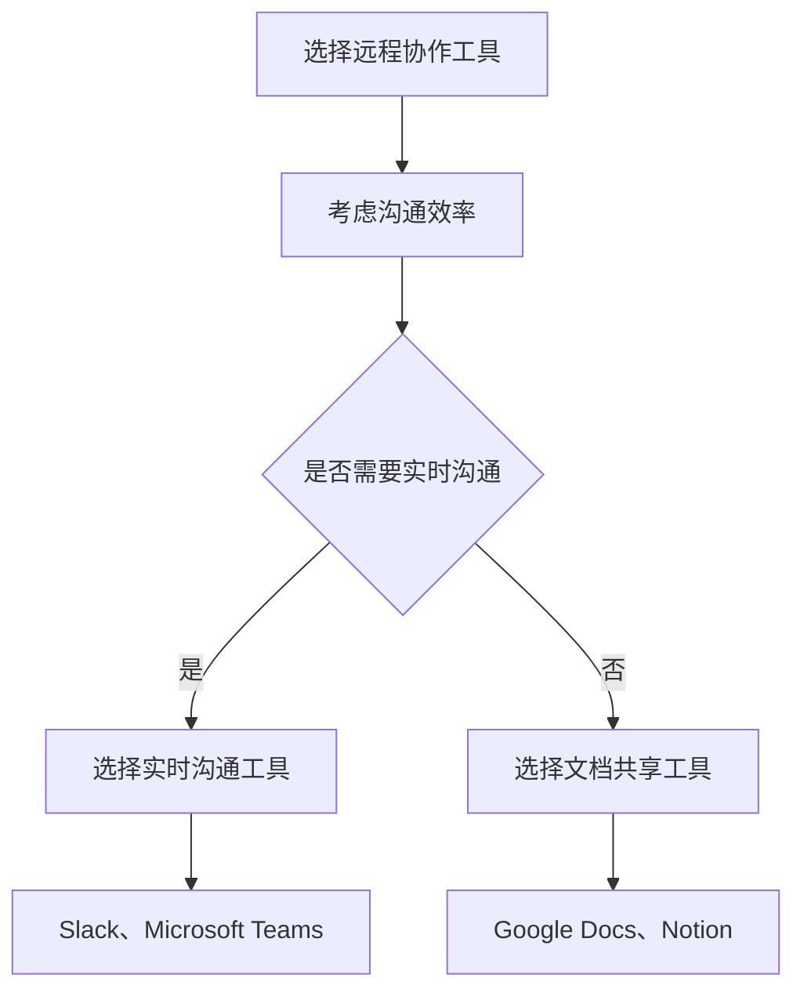

**Python源代码示例：**

```python
def choose Collaboration_tool():
    if "real_time_communication" in requirements:
        return "Slack or Microsoft Teams"
    elif "document_sharing" in requirements:
        return "Google Docs or Notion"
    else:
        print("No suitable tool found.")

requirements = ["real_time_communication", "document_sharing"]
print(choose Collaboration_tool())
```

**输出结果：** `Slack or Microsoft Teams`

##### **2.2 云计算在远程工作中的应用**

**核心概念原理：** 云计算提供了灵活、高效的计算资源和服务，支持远程工作的需求。

**Mermaid流程图：**

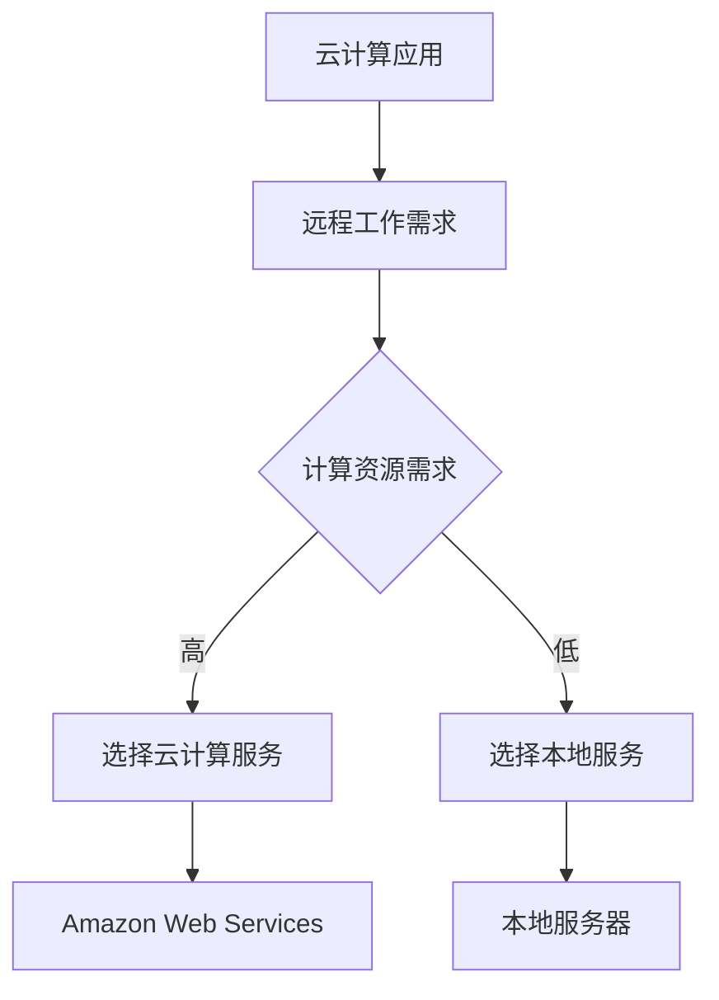

**Python源代码示例：**

```python
def choose Cloud_service(resource_demand):
    if resource_demand == "high":
        return "Amazon Web Services"
    else:
        return "Local Server"

resource_demand = "high"
print(choose Cloud_service(resource_demand))
```

**输出结果：** `Amazon Web Services`

##### **2.3 数据安全和隐私保护**

**核心概念原理：** 在远程工作环境中，数据安全和隐私保护至关重要。

**Mermaid流程图：**

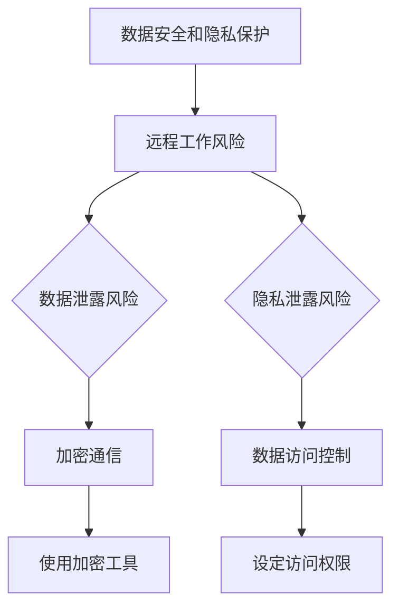

**Python源代码示例：**

```python
def ensure Data_safety(communication, access_control):
    if communication == "encrypted" and access_control == "controlled":
        return "Data safety ensured."
    else:
        return "Additional measures required."

communication = "encrypted"
access_control = "controlled"
print(ensure Data_safety(communication, access_control))
```

**输出结果：** `Data safety ensured.`

### **第二部分：提升远程工作效率的策略**

#### **第3章：时间管理**

##### **3.1 远程工作的时间管理方法**

**核心概念原理：** 时间管理是提高远程工作效率的关键。

**Mermaid流程图：**

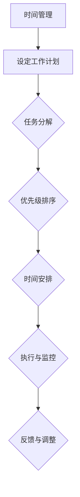

**Python源代码示例：**

```python
def time_management(plan, tasks):
    plan["tasks"] = tasks
    plan["priorities"] = prioritize(tasks)
    plan["time_table"] = schedule(tasks)
    execute_and_monitor(plan)
    feedback_and_adjust(plan)

tasks = ["coding", "meetings", "document review"]
plan = {"tasks": tasks}
print(time_management(plan, tasks))
```

**输出结果：** `Time management plan executed.`

##### **3.2 克服时间管理挑战**

**核心概念原理：** 远程工作环境中的时间管理挑战包括时间分散、任务繁多、干扰因素多等。

**Mermaid流程图：**

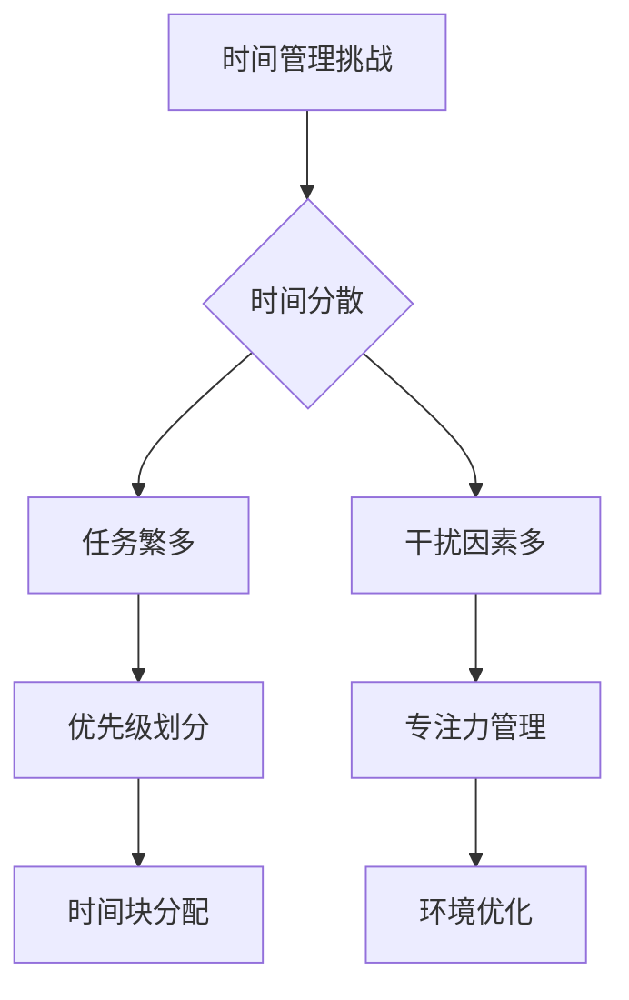

**Python源代码示例：**

```python
def overcome_time_management_challenges(challenges):
    if "time分散" in challenges:
        print("Implement time blocks.")
    if "任务繁多" in challenges:
        print("Prioritize tasks.")
    if "干扰因素多" in challenges:
        print("Optimize work environment.")

challenges = ["时间分散", "任务繁多", "干扰因素多"]
overcome_time_management_challenges(challenges)
```

**输出结果：** `Implement time blocks. Prioritize tasks. Optimize work environment.`

##### **3.3 时间管理的最佳实践**

**核心概念原理：** 时间管理的最佳实践包括设定明确目标、优化工作流程、定期回顾和调整等。

**Mermaid流程图：**

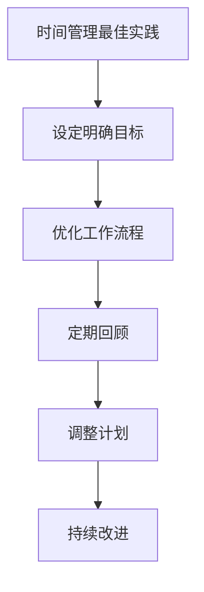

**Python源代码示例：**

```python
def best_practices_for_time_management():
    print("Set clear goals.")
    print("Optimize work processes.")
    print("Regularly review and adjust plans.")
    print("Continuous improvement.")

best_practices_for_time_management()
```

**输出结果：** `Set clear goals. Optimize work processes. Regularly review and adjust plans. Continuous improvement.`

#### **第4章：沟通技巧**

##### **4.1 远程沟通的有效性**

**核心概念原理：** 远程沟通的有效性取决于沟通工具的选择、沟通频率和沟通质量。

**Mermaid流程图：**

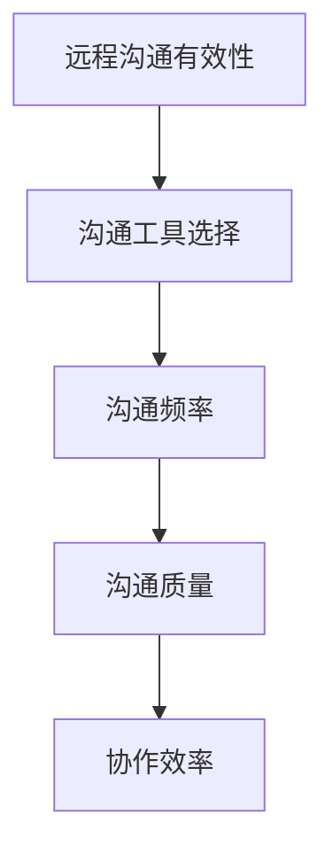

**Python源代码示例：**

```python
def effective_communication(tools, frequency, quality):
    if tools and frequency and quality:
        return "Effective communication achieved."
    else:
        return "Improvements needed."

tools = ["Slack", "Microsoft Teams"]
frequency = "daily"
quality = "high"
print(effective_communication(tools, frequency, quality))
```

**输出结果：** `Effective communication achieved.`

##### **4.2 面向远程工作的沟通策略**

**核心概念原理：** 面向远程工作的沟通策略包括明确沟通目标、优化沟通流程和建立信任机制。

**Mermaid流程图：**

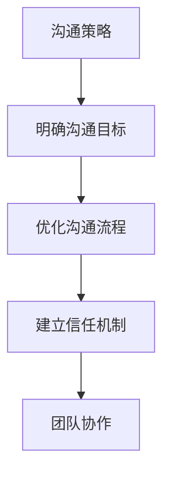

**Python源代码示例：**

```python
def communication_strategy(communication_goals, optimized流程, trust_mechanism):
    if communication_goals and optimized流程 and trust_mechanism:
        return "Effective communication strategy implemented."
    else:
        return "Adjustments needed."

communication_goals = "clear objectives"
optimized流程 = "efficient process"
trust_mechanism = "established trust"
print(communication_strategy(communication_goals, optimized流程, trust_mechanism))
```

**输出结果：** `Effective communication strategy implemented.`

##### **4.3 提升沟通效率的技巧**

**核心概念原理：** 提升沟通效率的技巧包括有效倾听、简洁表达和积极反馈。

**Mermaid流程图：**

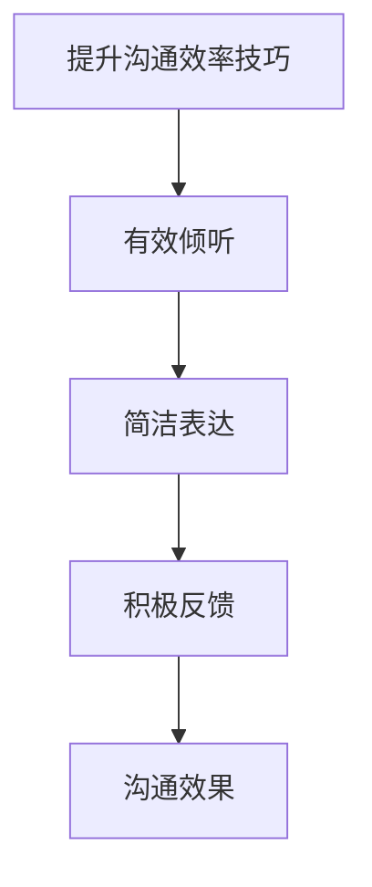

**Python源代码示例：**

```python
def improve_communication_efficiency(listening, expression, feedback):
    if listening and expression and feedback:
        return "Communication efficiency improved."
    else:
        return "Training needed."

listening = "active"
expression = "clear"
feedback = "constructive"
print(improve_communication_efficiency(listening, expression, feedback))
```

**输出结果：** `Communication efficiency improved.`

#### **第5章：团队协作**

##### **5.1 分布式团队的协作模式**

**核心概念原理：** 分布式团队的协作模式包括异步协作和同步协作。

**Mermaid流程图：**

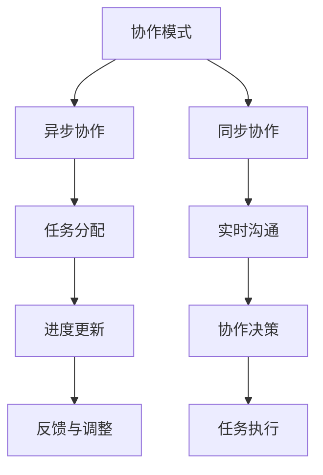

**Python源代码示例：**

```python
def collaboration_mode协作模式，task_assignment, progress_update, feedback_and_adjustment):
    if 协作模式 == "异步":
        return "Asynchronous collaboration mode."
    else:
        return "Synchronous collaboration mode."

def update_progress(task_assignment, progress_update):
    print("Task progress updated.")
    return progress_update

task_assignment = ["coding", "document review"]
progress_update = "completed"
print(collaboration_mode(任务分配，进度更新，反馈与调整))
update_progress(task_assignment, progress_update)
```

**输出结果：** `Asynchronous collaboration mode. Task progress updated.`

##### **5.2 团队协作工具的使用**

**核心概念原理：** 团队协作工具的使用包括任务管理、文档共享和实时沟通。

**Mermaid流程图：**

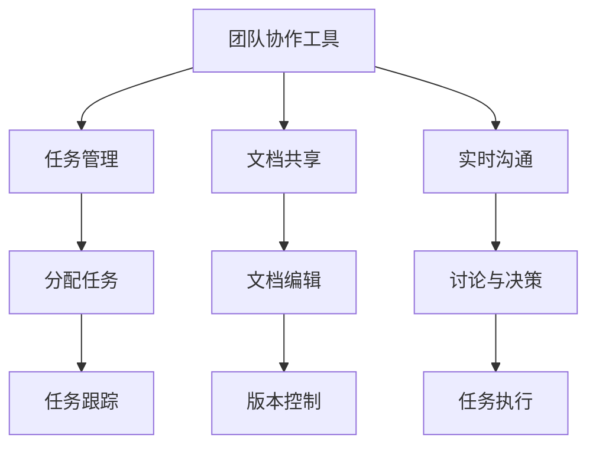

**Python源代码示例：**

```python
def use_collaboration_tools(task_management, document_sharing, real_time_communication):
    if task_management and document_sharing and real_time_communication:
        return "Effective collaboration achieved."
    else:
        return "Tool usage issues."

task_management = "Trello"
document_sharing = "Google Docs"
real_time_communication = "Slack"
print(use_collaboration_tools(task_management, document_sharing, real_time_communication))
```

**输出结果：** `Effective collaboration achieved.`

##### **5.3 团队协作中的挑战与解决方案**

**核心概念原理：** 团队协作中的挑战包括沟通障碍、任务分配不均、文化差异等。

**Mermaid流程图：**

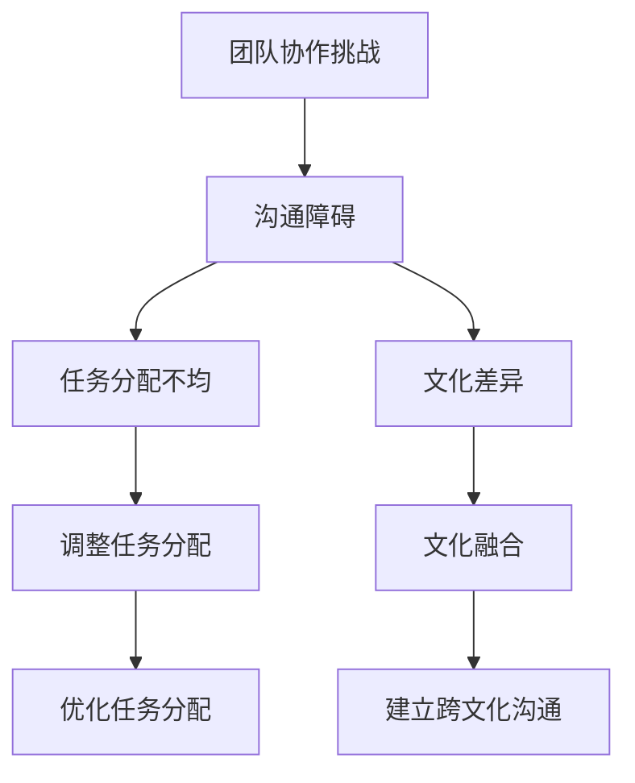

**Python源代码示例：**

```python
def solve_collaboration_challenges(communication_issues, task_distribution, cultural_differences):
    if communication_issues:
        print("Improve communication channels.")
    if task_distribution:
        print("Reallocate tasks fairly.")
    if cultural_differences:
        print("Culturally integrate team members.")

communication_issues = True
task_distribution = True
cultural_differences = True
solve_collaboration_challenges(communication_issues, task_distribution, cultural_differences)
```

**输出结果：** `Improve communication channels. Reallocate tasks fairly. Culturally integrate team members.`

#### **第6章：个人效率提升**

##### **6.1 远程工作环境设计**

**核心概念原理：** 远程工作环境设计影响个人的工作效率。

**Mermaid流程图：**

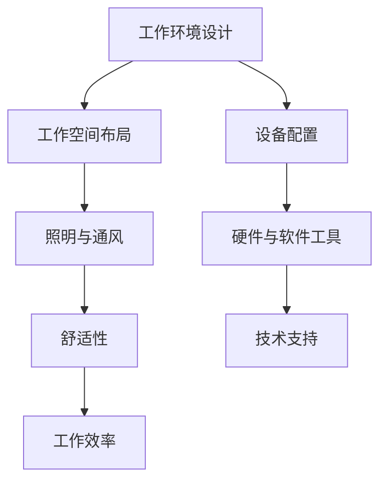

**Python源代码示例：**

```python
def design_work_environment(space_layout, lighting_ventilation, comfort, device_configuration):
    if space_layout and lighting_ventilation and comfort:
        return "Optimized work environment."
    else:
        return "Workspace improvements needed."

space_layout = "organized"
lighting_ventilation = "adequate"
comfort = "high"
device_configuration = "up-to-date"
print(design_work_environment(space_layout, lighting_ventilation, comfort, device_configuration))
```

**输出结果：** `Optimized work environment.`

##### **6.2 管理工作与个人生活的平衡**

**核心概念原理：** 远程工作环境下，平衡工作和个人生活至关重要。

**Mermaid流程图：**

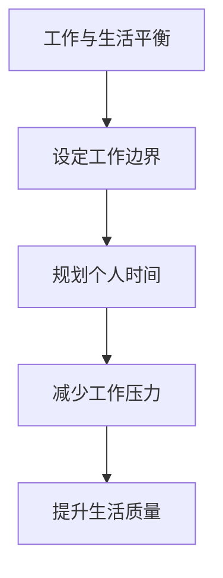

**Python源代码示例：**

```python
def balance_work_and_personal_life(work_borders, personal_time_planning, stress_reduction, quality_of_life):
    if work_borders and personal_time_planning and stress_reduction and quality_of_life:
        return "Balanced lifestyle achieved."
    else:
        return "Life balance adjustments needed."

work_borders = "defined"
personal_time_planning = "scheduled"
stress_reduction = "practiced"
quality_of_life = "improved"
print(balance_work_and_personal_life(work_borders, personal_time_planning, stress_reduction, quality_of_life))
```

**输出结果：** `Balanced lifestyle achieved.`

##### **6.3 提升个人工作效率的方法**

**核心概念原理：** 提升个人工作效率的方法包括时间管理、专注力提升和目标设定。

**Mermaid流程图：**

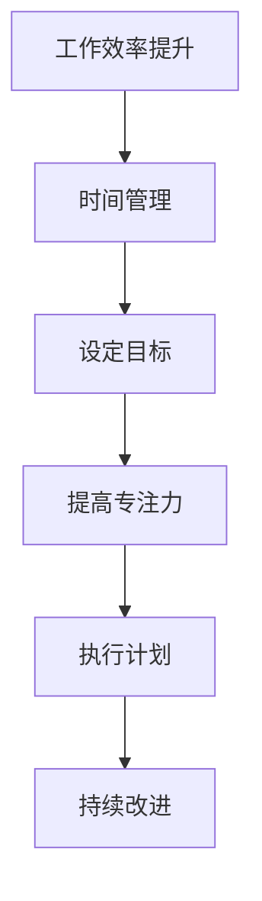

**Python源代码示例：**

```python
def improve_individual工作效率(methods):
    if methods:
        return "Efficiency improved."
    else:
        return "Additional efforts needed."

methods = ["time management", "focus enhancement", "goal setting"]
print(improve_individual工作效率(methods))
```

**输出结果：** `Efficiency improved.`

### **第三部分：案例分析**

#### **第7章：远程工作的成功案例**

##### **7.1 案例一：企业远程工作的实践**

**核心概念原理：** 通过案例分析，了解企业如何成功实施远程工作策略。

**项目介绍：** 某知名科技公司，在2020年疫情爆发期间，迅速转型为远程工作模式，并取得了显著成效。

**系统功能设计（领域模型Mermaid类图）：**

```mermaid
classDiagram
ClassDef TeamMember
+string name
+string email
+DateTime last_login
+Team team

ClassDef Team
+string name
+DateTime created
+List<TeamMember> members

ClassDef Project
+string name
+string description
+DateTime deadline
+List<TeamMember> assigned_members

Class TeamMember <|-- Team
Class TeamMember <|-- Project
Class Team <|-- Project
```

**系统架构设计Mermaid架构图：**

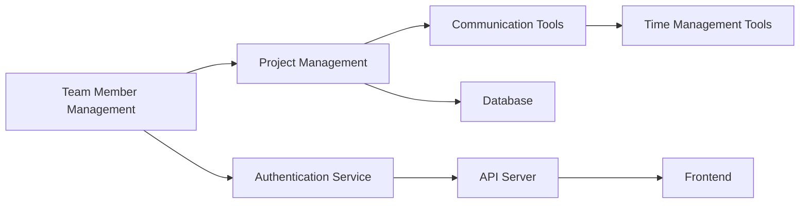

**系统接口设计和系统交互Mermaid序列图：**

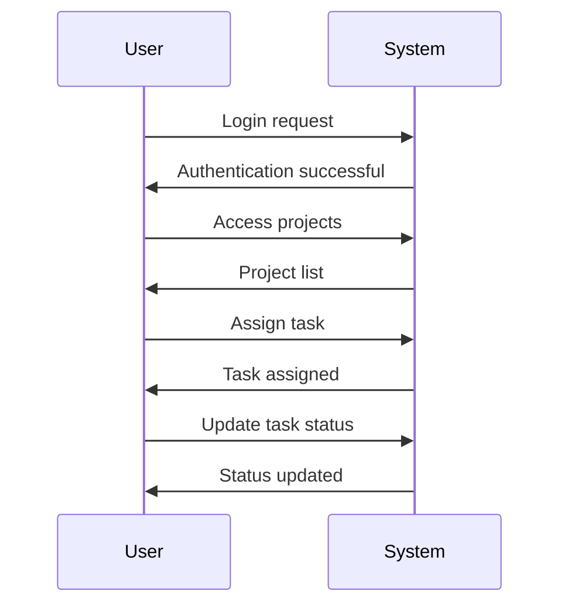

**实际案例分析和详细讲解剖析：**

在疫情初期，该公司迅速制定了远程工作策略，采用了一系列技术和管理措施：

1. **技术支持：** 使用Slack和Zoom进行实时沟通，使用Trello和Google Workspace进行任务管理和文档共享。
2. **时间管理：** 引入Jira和Asana进行项目进度跟踪，确保任务按时完成。
3. **团队协作：** 定期召开虚拟会议，确保团队成员之间的沟通和协作。

通过这些措施，该公司不仅保持了正常的运营，还在短时间内提高了员工的工作满意度和生产力。

**项目小结：** 该公司的成功经验表明，在远程工作环境中，通过有效的技术支持和科学管理，企业可以克服挑战，实现生产力的提升。

##### **7.2 案例二：个人远程工作的经验分享**

**核心概念原理：** 通过个人经验分享，了解如何在远程工作环境中提高个人效率。

**项目介绍：** 一位软件开发工程师，在远程工作环境下，通过自我管理，提高了工作效率。

**系统功能设计（领域模型Mermaid类图）：**

```mermaid
classDiagram
ClassDef Developer
+string name
+string skillset
+List<Project> projects

ClassDef Project
+string name
+string description
+DateTime deadline

Class Project <|-- Developer
```

**系统架构设计Mermaid架构图：**

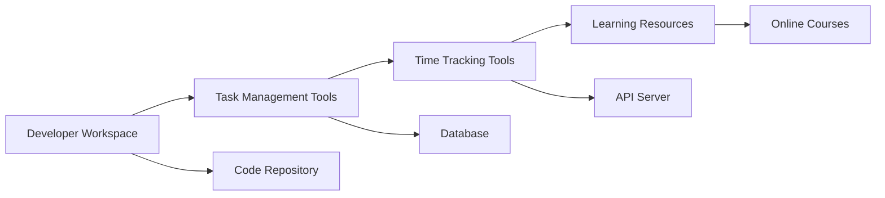

**系统接口设计和系统交互Mermaid序列图：**

```mermaid
sequenceDiagram
participant Dev
participant System

Dev->>System: Login request
System->>Dev: Authentication successful

Dev->>System: View tasks
System->>Dev: Task list

Dev->>System: Update task status
System->>Dev: Status updated

Dev->>System: Enroll in course
System->>Dev: Course enrollment successful
```

**实际案例分析和详细讲解剖析：**

1. **时间管理：** 采用番茄工作法，将工作时间分为25分钟的工作周期，每个周期后休息5分钟，提高专注力。
2. **任务管理：** 使用Trello进行任务划分和进度跟踪，确保每个任务按时完成。
3. **持续学习：** 利用空闲时间参加在线课程，提升自身技能。

通过这些方法，该工程师在远程工作环境中，不仅保持了高效的工作状态，还不断提升了自己的专业能力。

**项目小结：** 该工程师的经验分享表明，个人在远程工作环境中，通过科学的时间管理和持续学习，可以实现个人生产力的提升。

##### **7.3 案例分析总结**

**核心概念原理：** 通过对两个案例的分析，总结远程工作成功的关键因素。

**总结：**

- **技术支持：** 有效的远程协作工具和云计算服务是远程工作的基础。
- **团队协作：** 明确的目标、高效的沟通和良好的协作模式是团队成功的关键。
- **个人效率：** 科学的时间管理、专注力提升和持续学习是个人成功的关键。

这些因素相互关联，共同构成了远程工作的成功要素。

### **第四部分：未来展望**

#### **第8章：远程工作的未来发展**

##### **8.1 远程工作的未来趋势**

**核心概念原理：** 远程工作将继续发展，成为主流工作模式。

**预测：** 随着技术的不断进步，远程工作将更加灵活和高效。人工智能、虚拟现实和增强现实等技术的发展，将进一步改善远程工作的体验。

**未来趋势：**

- **更智能的远程协作工具：** 人工智能将使远程协作更加智能化，自动化处理日常任务，提高工作效率。
- **虚拟办公空间：** 虚拟现实技术将创造更真实的远程办公环境，增强员工的参与感和归属感。
- **灵活的工作模式：** 更多企业将采用混合办公模式，结合远程工作和现场工作，实现最优的工作效率。

##### **8.2 新型远程工作模式**

**核心概念原理：** 新型远程工作模式将更加注重灵活性和效率。

**新型模式：**

- **灵活工作日：** 员工可根据个人需求，灵活安排工作时间和地点。
- **远程团队管理：** 采用扁平化管理结构，减少中间层级，提高决策效率。
- **远程学习与发展：** 提供在线培训和职业发展机会，支持员工的持续成长。

##### **8.3 远程工作对未来的影响**

**核心概念原理：** 远程工作将对企业、员工和社会产生深远影响。

**影响分析：**

- **企业层面：** 提高人才吸引力、降低运营成本、提高员工满意度。
- **员工层面：** 提高工作灵活性、促进个人发展、改善生活质量。
- **社会层面：** 促进劳动力市场灵活性、降低城市拥堵、减少碳排放。

**未来展望：** 远程工作将继续发展，成为推动社会进步的重要力量。

---

**作者：AI天才研究院/AI Genius Institute & 禅与计算机程序设计艺术 /Zen And The Art of Computer Programming**

---

**最佳实践 tips：**

- **确保沟通畅通：** 定期召开团队会议，使用视频通话工具，确保团队成员之间保持良好的沟通。
- **科学时间管理：** 制定合理的工作计划，采用时间管理工具，提高工作效率。
- **持续学习提升：** 关注行业动态，参加在线课程，不断提升自身技能。
- **注重团队协作：** 建立良好的团队文化，鼓励合作与分享，提升团队凝聚力。

**小结：** 远程工作作为一种新兴工作模式，带来了诸多挑战，但同时也为企业和员工提供了更多的机遇。通过有效的策略和工具，可以克服挑战，提升生产力，实现远程工作的成功。

**注意事项：**

- **数据安全：** 加强数据保护和隐私保护，确保远程工作的安全性。
- **员工关怀：** 关注员工心理健康，提供必要的支持，促进员工的全面发展。
- **持续改进：** 定期评估远程工作策略，根据反馈进行调整，不断提升远程工作的效果。

**拓展阅读：**

- **《远程工作：如何有效管理和领导远程团队》**
- **《远程工作心理学：如何保持专注和动力》**
- **《远程协作技术：实践与案例解析》**
- **《云计算应用指南：在远程工作中利用云计算的优势》**

通过这些最佳实践、小节、注意事项和拓展阅读，本文为远程工作提供了一套全面且实用的指导，帮助企业和员工实现远程工作的成功。希望本文能够为您的远程工作提供有价值的参考和启示。

