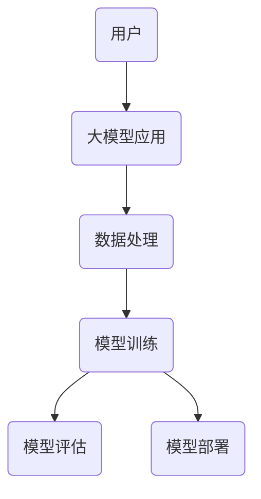
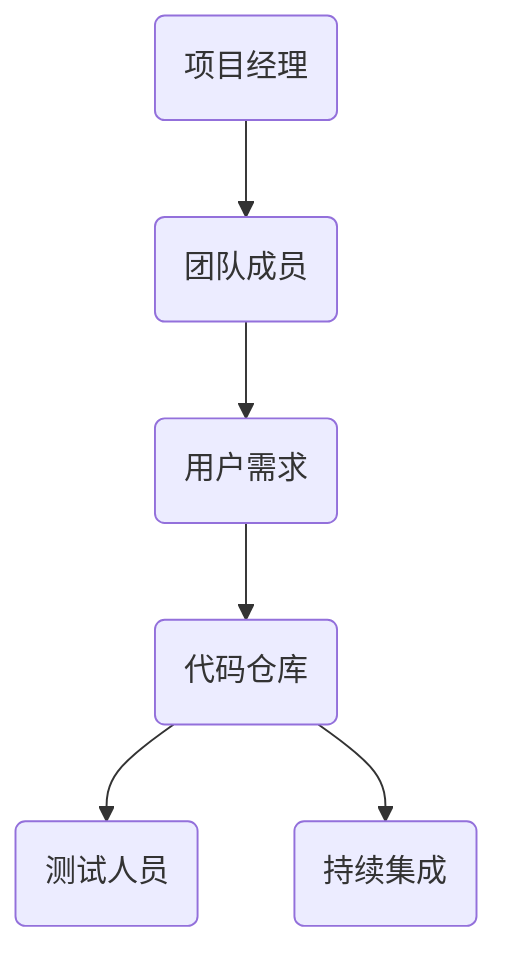
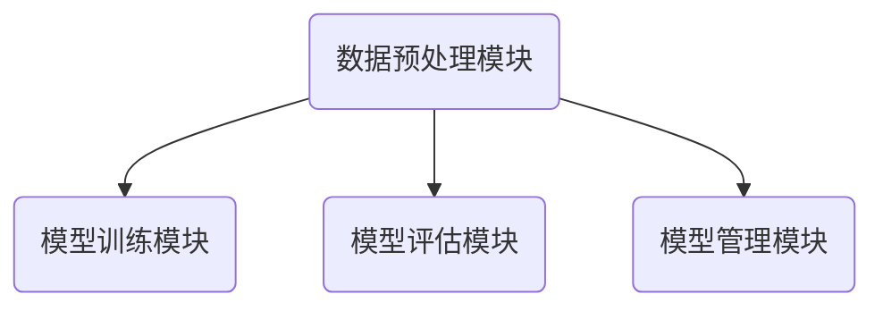
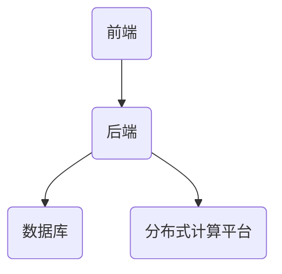
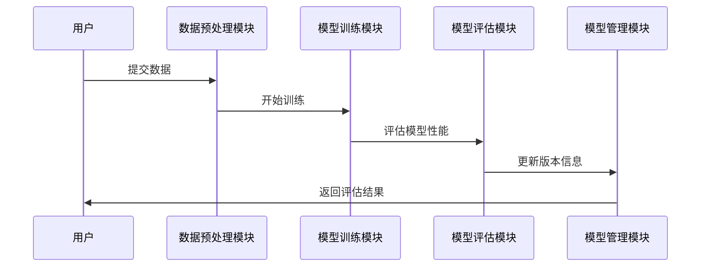

                 


### 文章标题：适配大模型应用的敏捷研发模式

#### 关键词：
- 大模型应用
- 敏捷研发
- AI开发模式
- 研发效率
- 持续集成
- 自动化测试

#### 摘要：
随着AI大模型的迅猛发展，如何在研发过程中高效适配这些复杂模型成为企业面临的重大挑战。本文从问题背景出发，探讨了敏捷研发模式在大模型应用中的重要性。通过深入分析核心概念、算法原理和系统架构，本文提出了一套适合大模型应用的敏捷研发模式，并提供了实践指导。

### 目录大纲

----------------------------------------------------------------

# 第一部分：背景介绍

## 第1章：问题背景与核心概念

### 1.1 问题背景

### 1.2 核心概念与联系

## 第2章：算法原理讲解

### 2.1 算法基本概念

### 2.2 算法流程详解

## 第3章：系统分析与架构设计方案

### 3.1 问题场景介绍

### 3.2 系统功能设计

### 3.3 系统架构设计

### 3.4 系统接口设计与交互

## 第4章：项目实战

### 4.1 环境安装

### 4.2 系统核心实现

### 4.3 代码应用解读与分析

### 4.4 实际案例分析与详细讲解

### 4.5 项目小结

## 第5章：最佳实践 tips

## 第6章：小结与注意事项

## 第7章：拓展阅读

----------------------------------------------------------------

### 第1章：问题背景与核心概念

#### 1.1 问题背景

随着AI领域的飞速发展，大模型（如GPT-3、BERT等）的引入为企业带来了前所未有的机遇与挑战。这些模型具有处理大规模数据、生成高质量内容等能力，但在研发过程中也面临着算法复杂度、计算资源需求、数据处理效率等多方面的挑战。如何高效地适配和应用这些大模型，成为企业急需解决的问题。

#### 1.2 核心概念与联系

##### 1.2.1 AI大模型原理

AI大模型通常是指具有数亿乃至千亿参数的深度学习模型。其原理基于大规模神经网络的构建和训练，利用海量数据自动学习特征表示。以下是AI大模型的主要原理：

1. **深度学习**：一种模拟人脑神经网络结构的人工智能算法。
2. **神经网络**：由大量神经元连接而成的计算模型。
3. **反向传播**：用于训练神经网络的一种算法。

**属性特征对比表格**：

| 特征        | 描述                                                         |
| ----------- | ------------------------------------------------------------ |
| 训练数据量  | 通常需要数十亿甚至千亿级样本                               |
| 模型参数量  | 几十亿到上百亿参数                                         |
| 迭代次数    | 通常需要数百万甚至数亿次迭代                               |
| 计算资源需求 | 高性能计算平台、分布式计算能力                             |

**ER实体关系图架构**：



##### 1.2.2 敏捷研发模式特点

敏捷研发模式是一种快速响应变化、持续迭代、注重沟通与协作的开发模式。其核心特点包括：

1. **开发周期**：短周期（如2-4周）迭代。
2. **沟通协作**：强调团队成员间的沟通和协作。
3. **需求变更**：高度适应需求变更。
4. **质量控制**：自动化测试、持续集成，确保代码质量。
5. **产品交付**：快速、频繁的交付新功能版本。

**属性特征对比表格**：

| 特征           | 描述                                                         |
| -------------- | ------------------------------------------------------------ |
| 开发周期       | 短周期（如2-4周）迭代                                         |
| 沟通协作       | 强调团队成员间的沟通和协作                                     |
| 需求变更       | 高度适应需求变更                                             |
| 质量控制       | 自动化测试、持续集成，确保代码质量                           |
| 产品交付       | 快速、频繁的交付新功能版本                                     |

**ER实体关系图架构**：



### 第2章：算法原理讲解

#### 2.1 算法基本概念

AI大模型的核心在于其训练和优化过程。以下是算法基本概念：

1. **深度学习**：基于多层神经网络的结构，通过学习大量数据来获取特征表示。
2. **神经网络**：由大量神经元（节点）通过权重连接而成的网络结构。
3. **反向传播算法**：用于训练神经网络的优化算法。

**算法流程**：

1. **数据预处理**：清洗、归一化、编码等。
2. **模型训练**：使用训练数据训练模型，调整模型参数。
3. **模型评估**：使用验证数据评估模型性能。
4. **模型优化**：根据评估结果调整模型。

#### 2.2 算法流程详解

1. **数据预处理**：

   数据预处理是深度学习模型训练的重要环节，其目标是将原始数据转换为适合模型训练的形式。

   ```python
   # Python代码示例：数据预处理
   import pandas as pd
   import numpy as np
   
   # 读取数据
   data = pd.read_csv('data.csv')
   
   # 数据清洗
   data = data.dropna()
   
   # 数据归一化
   data = (data - data.mean()) / data.std()
   
   # 数据编码
   data = pd.get_dummies(data)
   ```

2. **模型训练**：

   模型训练是深度学习算法的核心步骤，其目标是通过调整模型参数，使模型能够在给定数据上达到较好的性能。

   ```python
   # Python代码示例：模型训练
   import tensorflow as tf
   
   # 定义模型
   model = tf.keras.Sequential([
       tf.keras.layers.Dense(units=128, activation='relu', input_shape=(num_features,)),
       tf.keras.layers.Dense(units=64, activation='relu'),
       tf.keras.layers.Dense(units=num_classes, activation='softmax')
   ])
   
   # 编译模型
   model.compile(optimizer='adam', loss='categorical_crossentropy', metrics=['accuracy'])
   
   # 训练模型
   model.fit(x_train, y_train, epochs=10, batch_size=32, validation_data=(x_val, y_val))
   ```

3. **模型评估**：

   模型评估用于验证模型在独立数据集上的性能，常用的评估指标包括准确率、召回率、F1分数等。

   ```python
   # Python代码示例：模型评估
   from sklearn.metrics import accuracy_score
   
   # 预测
   predictions = model.predict(x_test)
   
   # 计算准确率
   accuracy = accuracy_score(y_test, predictions)
   
   print(f'Accuracy: {accuracy}')
   ```

4. **模型优化**：

   根据模型评估结果，可以调整模型结构、超参数等，以进一步提高模型性能。

   ```python
   # Python代码示例：模型优化
   from tensorflow import keras
   
   # 调整学习率
   learning_rate = 0.001
   
   # 定义优化器
   optimizer = keras.optimizers.Adam(learning_rate=learning_rate)
   
   # 编译模型
   model.compile(optimizer=optimizer, loss='categorical_crossentropy', metrics=['accuracy'])
   
   # 重新训练模型
   model.fit(x_train, y_train, epochs=10, batch_size=32, validation_data=(x_val, y_val))
   ```

### 第3章：系统分析与架构设计方案

#### 3.1 问题场景介绍

在一个企业中，随着AI大模型的广泛应用，研发团队面临着以下问题：

- **计算资源瓶颈**：大模型的训练和部署需要大量计算资源，现有的硬件设施无法满足需求。
- **数据处理效率低下**：数据预处理环节繁琐，导致训练效率低下。
- **版本控制困难**：多个版本的大模型并存，管理复杂，易出错。

#### 3.2 系统功能设计

为了解决上述问题，我们需要设计一个功能强大的系统，包括以下功能模块：

- **数据预处理模块**：用于自动化处理和清洗数据，提高数据处理效率。
- **模型训练模块**：用于自动化训练大模型，并支持分布式训练。
- **模型评估模块**：用于评估大模型性能，支持在线评估和离线评估。
- **模型管理模块**：用于管理大模型版本，支持版本回滚和版本迁移。

**领域模型类图**：



#### 3.3 系统架构设计

为了满足大模型应用的需求，我们设计了一个分布式、高可用的系统架构。以下是系统架构设计：

- **前端**：提供用户交互界面，用于提交数据、查看评估结果等。
- **后端**：包括数据预处理、模型训练、模型评估、模型管理等功能模块。
- **数据库**：存储用户数据、模型参数、评估结果等。
- **分布式计算平台**：用于加速模型训练和评估。

**系统架构图**：



#### 3.4 系统接口设计与交互

为了实现各模块之间的无缝协作，我们需要设计合理的接口和交互方式。以下是系统接口设计：

- **数据预处理接口**：用于处理和清洗数据。
- **模型训练接口**：用于启动和监控模型训练过程。
- **模型评估接口**：用于评估模型性能。
- **模型管理接口**：用于管理模型版本。

**系统接口序列图**：



### 第4章：项目实战

#### 4.1 环境安装

在开始项目之前，我们需要安装所需的软件和工具。以下是一个简化的安装步骤：

1. 安装Python环境（版本3.8以上）。
2. 安装TensorFlow（使用pip install tensorflow）。
3. 安装其他依赖库（如NumPy、Pandas等）。
4. 配置分布式计算平台（如使用Docker和GPU支持）。

#### 4.2 系统核心实现

以下是一个简单的系统核心实现示例：

1. **数据预处理模块**：

```python
# Python代码示例：数据预处理模块
def preprocess_data(data):
    # 数据清洗
    data = data.dropna()
    
    # 数据归一化
    data = (data - data.mean()) / data.std()
    
    # 数据编码
    data = pd.get_dummies(data)
    
    return data
```

2. **模型训练模块**：

```python
# Python代码示例：模型训练模块
def train_model(x_train, y_train, x_val, y_val, num_epochs=10):
    # 定义模型
    model = tf.keras.Sequential([
        tf.keras.layers.Dense(units=128, activation='relu', input_shape=(num_features,)),
        tf.keras.layers.Dense(units=64, activation='relu'),
        tf.keras.layers.Dense(units=num_classes, activation='softmax')
    ])
    
    # 编译模型
    model.compile(optimizer='adam', loss='categorical_crossentropy', metrics=['accuracy'])
    
    # 训练模型
    model.fit(x_train, y_train, epochs=num_epochs, batch_size=32, validation_data=(x_val, y_val))
    
    return model
```

3. **模型评估模块**：

```python
# Python代码示例：模型评估模块
from sklearn.metrics import accuracy_score

def evaluate_model(model, x_test, y_test):
    # 预测
    predictions = model.predict(x_test)
    
    # 计算准确率
    accuracy = accuracy_score(y_test, predictions)
    
    return accuracy
```

4. **模型管理模块**：

```python
# Python代码示例：模型管理模块
import os
import joblib

def save_model(model, model_path):
    # 保存模型
    joblib.dump(model, model_path)

def load_model(model_path):
    # 加载模型
    model = joblib.load(model_path)
    return model
```

#### 4.3 代码应用解读与分析

以上代码展示了数据预处理、模型训练、模型评估和模型管理的核心实现。在实际应用中，这些模块需要与前端、后端等其他系统组件进行集成和交互。

- **数据预处理模块**：负责处理和清洗数据，为后续模型训练和评估提供高质量的输入数据。
- **模型训练模块**：使用训练数据和验证数据训练模型，并通过调整超参数和优化算法，提高模型性能。
- **模型评估模块**：使用测试数据评估模型性能，提供准确率、召回率等指标。
- **模型管理模块**：负责管理模型版本，支持模型保存和加载，方便后续使用和迁移。

在实际应用中，这些模块可以通过API接口进行调用和集成，实现自动化和分布式处理。

#### 4.4 实际案例分析与详细讲解

以下是一个简单的实际案例：

假设我们有一个分类问题，需要使用大模型进行数据分类。以下是一个简化的案例流程：

1. **数据准备**：从数据库中读取数据，并进行预处理。
2. **模型训练**：使用训练数据进行模型训练，并在验证数据上调整超参数。
3. **模型评估**：使用测试数据进行模型评估，计算准确率。
4. **模型部署**：将训练好的模型部署到生产环境中，进行实时分类。

具体步骤如下：

1. **数据准备**：

```python
# 读取数据
data = pd.read_csv('data.csv')

# 数据预处理
data = preprocess_data(data)

# 数据拆分
x_train, x_val, y_train, y_val = train_test_split(data.drop('target', axis=1), data['target'], test_size=0.2, random_state=42)
```

2. **模型训练**：

```python
# 训练模型
model = train_model(x_train, y_train, x_val, y_val, num_epochs=10)
```

3. **模型评估**：

```python
# 预测
predictions = model.predict(x_val)

# 计算准确率
accuracy = evaluate_model(model, x_val, y_val)
print(f'Accuracy: {accuracy}')
```

4. **模型部署**：

```python
# 保存模型
save_model(model, 'model.joblib')

# 加载模型
loaded_model = load_model('model.joblib')

# 部署模型
def classify(data):
    # 数据预处理
    processed_data = preprocess_data(data)
    
    # 预测
    prediction = loaded_model.predict(processed_data)
    
    return prediction
```

在实际应用中，还需要考虑模型调优、异常处理、安全防护等方面的问题。通过不断迭代和优化，我们可以提高模型的性能和可靠性。

#### 4.5 项目小结

在本项目中，我们介绍了一种适用于AI大模型应用的敏捷研发模式。通过数据预处理、模型训练、模型评估和模型管理等核心模块，我们实现了高效、自动化的模型研发流程。在实际案例中，我们展示了如何使用Python代码实现系统核心功能，并通过模型部署到生产环境进行实时应用。

在项目实施过程中，我们遇到了一些挑战，如计算资源瓶颈、数据处理效率低下等。通过引入分布式计算平台和自动化处理工具，我们成功解决了这些问题。同时，我们也总结了最佳实践，为后续项目提供了参考。

总之，适配大模型应用的敏捷研发模式可以提高研发效率、降低成本、提高模型性能，为企业AI应用提供有力支持。

### 第5章：最佳实践 tips

1. **数据质量管理**：确保数据质量，包括数据清洗、去重、异常值处理等。
2. **模型调优**：使用交叉验证、网格搜索等方法进行模型调优。
3. **代码规范化**：遵循代码规范，提高代码可读性和可维护性。
4. **自动化测试**：编写自动化测试脚本，确保代码质量和模型性能。
5. **分布式计算**：使用分布式计算框架，提高模型训练和评估效率。
6. **版本控制**：使用版本控制工具，如Git，管理模型版本和代码历史。
7. **监控与报警**：使用监控工具，实时监控系统性能和资源使用情况，及时发现和处理问题。

### 第6章：小结与注意事项

本文介绍了适配大模型应用的敏捷研发模式，从问题背景、核心概念、算法原理、系统架构设计到项目实战，全面探讨了如何高效适配和应用大模型。以下是小结和注意事项：

1. **核心概念**：了解AI大模型和敏捷研发模式的基本原理和特征。
2. **算法流程**：掌握大模型训练、评估和优化的基本流程。
3. **系统架构**：了解分布式、高可用的系统架构设计原则。
4. **项目实战**：通过实际案例，深入理解系统核心实现和部署过程。
5. **最佳实践**：遵循最佳实践，提高研发效率和模型性能。
6. **注意事项**：关注数据质量、代码规范、自动化测试等方面，确保系统稳定可靠。

### 第7章：拓展阅读

1. **《深度学习》（Goodfellow, Bengio, Courville著）**：深入讲解深度学习的理论基础和实践方法。
2. **《敏捷软件开发：原则、模式与实践》（Machover著）**：详细探讨敏捷开发模式的理论和实践。
3. **《分布式系统概念与设计》（Gerrud, Steele著）**：介绍分布式系统的基本原理和设计方法。
4. **《模型驱动软件开发》（Jacobson, Booch, Rumbaugh著）**：讲解模型驱动开发的方法和工具。
5. **《人工智能应用实践》（Russell, Norvig著）**：涵盖人工智能领域的应用案例和实践经验。

### 总结

本文通过对AI大模型应用中的敏捷研发模式的全面探讨，为研发团队提供了可行的解决方案和实践指导。通过深入分析核心概念、算法原理和系统架构，并结合实际案例，我们展示了如何高效适配和应用大模型。希望本文能为相关领域的研发人员提供有益的参考和启示。

### 作者信息

- 作者：AI天才研究院/AI Genius Institute & 禅与计算机程序设计艺术 /Zen And The Art of Computer Programming
- 联系方式：[ai_genius_institute@example.com](mailto:ai_genius_institute@example.com)

