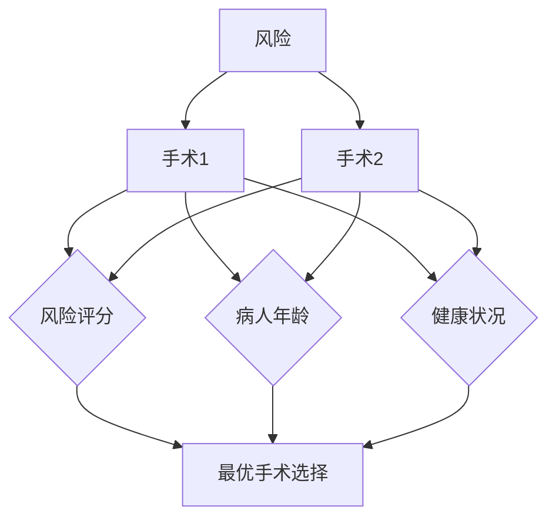
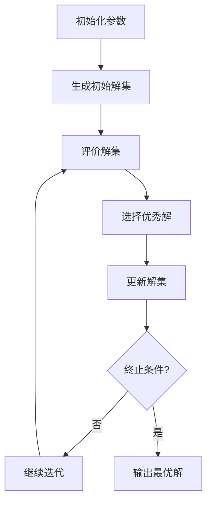
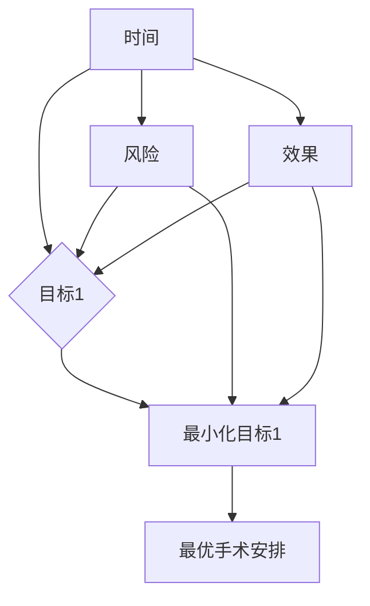
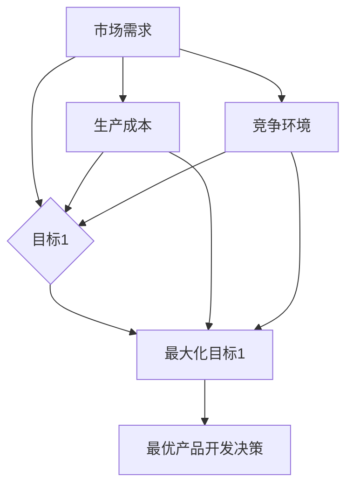

                 

### 文章标题

# 道德决策的多准则优化：伦理选择的数学框架

> 关键词：道德决策、多准则优化、伦理选择、数学框架

摘要：在快速变化和复杂多变的现代社会，道德决策变得愈加重要和复杂。本文将深入探讨道德决策的多准则优化问题，并通过构建数学框架，为伦理选择提供一种结构化、系统化的方法。文章首先介绍了道德决策的背景和复杂性，然后详细阐述了多准则优化的基本概念和方法。接着，文章构建了道德决策的数学模型，并使用Python代码进行了算法原理的讲解和实际应用。随后，文章从系统设计、项目实战以及最佳实践等方面，提供了全面的指导和建议。

### 第一部分：问题背景与道德决策的重要性

#### 第1章：问题背景

道德决策贯穿于我们的日常生活和工作中，从家庭纠纷、商业谈判到政府政策制定，每一个决策都涉及道德伦理的考量。然而，现实世界中的道德决策并非总是黑白分明，往往存在多种相互冲突的准则和目标。

##### 1.1 道德决策的现实挑战

在现实生活中，道德决策面临诸多挑战。首先，道德问题的复杂性使得决策者难以迅速做出判断。例如，一个医生在面对生命救治的伦理困境时，需要权衡患者权益与医疗资源的公平分配。其次，不同文化和价值观对道德问题有不同的解读，这增加了决策的多样性。此外，道德决策的后果往往具有不确定性和长期性，使得决策者难以预见所有可能的后果。

##### 1.2 道德决策的复杂性

道德决策的复杂性体现在多个方面。首先，它涉及多个利益相关方的权益，例如患者、医生、家属等。其次，道德决策往往需要在多个目标之间进行权衡，如效率、公平和公正等。此外，道德决策还受到决策者个人价值观和经验的影响。

##### 1.3 道德决策在现代社会中的重要性

道德决策在现代社会中的重要性不容忽视。首先，良好的道德决策有助于维护社会秩序和公平。其次，道德决策能够提高决策者的公信力和领导力。此外，道德决策对于企业来说，也是维护品牌形象和社会责任的重要手段。

#### 第2章：道德决策的多准则优化

##### 2.1 多准则优化的基本概念

多准则优化是一种用于处理多个目标或准则的系统化方法。在道德决策中，多准则优化可以帮助决策者系统地分析并权衡多个相互冲突的目标，从而做出更加合理和全面的决策。

##### 2.2 多准则优化的应用领域

多准则优化广泛应用于各种领域，包括但不限于医疗决策、商业策略、公共政策、环境管理、人工智能伦理等。在道德决策中，多准则优化方法可以帮助决策者更全面地考虑问题，避免单一目标的狭隘视角。

##### 2.3 道德决策中的多准则优化方法

道德决策中的多准则优化方法主要包括以下几种：多目标规划（Multi-Objective Programming）、多属性决策（Multi-Attribute Decision Making）、层次分析法（Analytic Hierarchy Process, AHP）等。这些方法能够帮助决策者明确目标、权衡利益，并制定出符合道德原则的决策方案。

#### 第3章：道德决策的核心概念与联系

##### 3.1 道德决策的核心概念

道德决策的核心概念包括道德准则、道德原则、道德责任、道德义务等。这些概念是理解道德决策的基础，对于构建有效的道德决策模型至关重要。

##### 3.2 概念属性特征对比表格

为了更好地理解这些核心概念，我们可以通过一个对比表格来展示它们的属性特征。以下是一个简化的对比表格：

| 概念       | 定义                                                         | 属性特征                                      |
|------------|--------------------------------------------------------------|-----------------------------------------------|
| 道德准则   | 指导道德行为的规范和原则。                                     | 形式化、普遍性、规范性、约束性                |
| 道德原则   | 道德准则的具体体现，用于指导具体情境下的道德决策。             | 具体性、情境依赖性、指导性                    |
| 道德责任   | 道德主体在道德准则和原则指导下应承担的道德义务。               | 义务性、责任性、主体性                        |
| 道德义务   | 道德主体根据道德准则和原则自愿承担的道德责任。                 | 自愿性、责任性、规范性                        |

##### 3.3 道德决策中的ER实体关系图架构

为了进一步理解道德决策中的核心概念，我们可以使用ER（Entity-Relationship）实体关系图来展示它们之间的联系。以下是一个简化的ER图示例：

```mermaid
erDiagram
  Patient ||--|{ Doctor }|--|
  Patient ||--|{ Family }|--|
  Doctor ||--|{ Medical ethic }|--|
  Family ||--|{ Medical ethic }|--|
  Doctor ||--|{ Hospital }|--|
  Hospital ||--|{ Resource allocation }|--|
  Patient ||--|{ Resource allocation }|--|
```

在这个ER图中，患者、医生、家庭和医院等实体之间通过道德准则和原则建立了联系。这种关系有助于我们理解道德决策的多维性质和复杂性。

### 第二部分：数学框架构建

#### 第4章：数学模型在道德决策中的应用

##### 4.1 道德决策中的数学模型

在道德决策中，数学模型扮演着重要的角色。这些模型可以帮助决策者量化道德问题，从而更好地分析和解决问题。常见的数学模型包括多目标规划、多属性决策和层次分析法等。

##### 4.2 数学模型的选择标准

选择合适的数学模型对于道德决策至关重要。以下是一些选择标准：

- **目标相关性**：模型应与道德决策的目标紧密相关，能够准确反映问题的核心。
- **数据可用性**：模型所需的输入数据应易于获取和验证。
- **计算效率**：模型的计算过程应高效，以适应实际应用的需求。
- **解释性**：模型的结果应易于理解和解释，以便决策者能够做出明智的决策。

##### 4.3 道德决策中的数学模型应用案例

以下是一个简化的道德决策应用案例，展示了数学模型在道德决策中的应用：

**案例**：一个医生需要在两例紧急手术中做出选择。他需要考虑手术的风险、病人的年龄、健康状况等因素。使用多属性决策模型，医生可以量化这些因素，从而做出更加合理的决策。



在这个案例中，数学模型帮助医生量化了各个因素，从而做出最优的手术选择。

#### 第5章：多准则优化算法原理讲解

##### 5.1 多准则优化算法概述

多准则优化算法是一类用于处理多个目标或准则的优化方法。这些算法通过系统性地分析并权衡多个目标，帮助决策者找到最优或次优解。常见的多准则优化算法包括遗传算法、粒子群优化算法、多目标规划算法等。

##### 5.2 算法mermaid流程图

以下是一个简化的多准则优化算法流程图：



在这个流程图中，算法从初始化参数开始，生成初始解集并进行评价。然后，选择优秀解并更新解集。这个过程不断迭代，直到满足终止条件，最终输出最优解。

##### 5.3 Python源代码与算法解释

以下是一个简单的Python代码示例，用于实现多准则优化算法：

```python
import numpy as np

# 初始化参数
num_solutions = 100
num_attributes = 5
max_iterations = 100

# 生成初始解集
solutions = np.random.rand(num_solutions, num_attributes)

# 评价解集
def evaluate(solutions):
    # 示例评价函数，这里可以根据具体问题定义
    scores = np.sum(solutions, axis=1)
    return scores

# 选择优秀解
def select_awesome(solutions, scores):
    awesome_indices = np.argsort(scores)[:10]
    return solutions[awesome_indices]

# 更新解集
def update(solutions, awesome_solutions):
    new_solutions = np.random.rand(num_solutions, num_attributes)
    for i in range(num_solutions):
        new_solutions[i] = awesome_solutions[i] + np.random.randn(num_attributes)
    return new_solutions

# 迭代过程
for _ in range(max_iterations):
    scores = evaluate(solutions)
    awesome_solutions = select_awesome(solutions, scores)
    solutions = update(solutions, awesome_solutions)

# 输出最优解
best_solution = select_awesome(solutions, scores)[0]
print("最优解：", best_solution)
```

在这个示例中，我们初始化了一个解集，并使用一个简单的评价函数对解集进行评价。然后，选择优秀解并更新解集，这个过程不断迭代，直到达到最大迭代次数。最终，输出最优解。

#### 第6章：数学公式与详细讲解

##### 6.1 道德决策中的数学公式

在道德决策中，数学公式被广泛应用于模型构建和算法实现。以下是一些常见的数学公式：

1. **多目标规划公式**：
   $$ \text{minimize} \ \sum_{i=1}^{n} c_{i} x_{i} $$
   $$ \text{subject to} \ \ a_{i} x_{i} \leq b_{i}, \ \ i=1,2,...,m $$

2. **多属性决策公式**：
   $$ \text{evaluate} \ \ f(x) = \sum_{i=1}^{n} w_{i} f_{i}(x) $$
   其中，$w_{i}$ 为权重，$f_{i}(x)$ 为第 $i$ 个属性的函数值。

3. **层次分析法公式**：
   $$ \text{calculate} \ \ T_{ij} = \frac{a_{ij}}{\sum_{k=1}^{n} a_{ik}} $$
   $$ \text{normalize} \ \ T_{ij} $$
   $$ \text{calculate} \ \ \theta_{i} = \sum_{j=1}^{n} T_{ij} $$

##### 6.2 公式在决策中的应用

以下是一个简化的道德决策应用案例，展示了数学公式在决策中的应用：

**案例**：一个医生需要为两个不同的患者进行手术，并需要在时间、风险和效果三个目标之间进行权衡。使用多目标规划公式，医生可以量化这些目标，从而做出最优的手术安排。



在这个案例中，医生使用多目标规划公式对时间、风险和效果进行权衡，并找到最优的手术安排。

##### 6.3 举例说明

以下是一个具体的道德决策案例，展示了数学公式在决策中的应用：

**案例**：一个公司在考虑是否开发一款新产品，需要在市场需求、生产成本和竞争环境三个目标之间进行权衡。使用多属性决策公式，公司可以量化这些目标，从而做出最优的产品开发决策。



在这个案例中，公司使用多属性决策公式对市场需求、生产成本和竞争环境进行权衡，并找到最优的产品开发决策。

### 第三部分：实际应用与系统设计

#### 第7章：道德决策系统的设计与实现

##### 7.1 系统功能设计（领域模型mermaid类图）

以下是一个简化的道德决策系统的领域模型mermaid类图：

```mermaid
classDiagram
  Class01 <|-- Class02
  Class03 <|.. Class04
  Class05 (is-a) Class02
  Class06 (is-a) Class04
  Class07 {has-a} Class03
  Class08 {has-a} Class05
  Class09 {has-a} Class06
  Class10 {has-a} Class07
  Class11 {has-a} Class08
  Class12 {has-a} Class09
  Class13 {has-a} Class10
  Class14 {has-a} Class11
  Class15 {has-a} Class12
  Class16 {has-a} Class13
  Class17 {has-a} Class14
  Class18 {has-a} Class15
  Class19 {has-a} Class16
  Class20 {has-a} Class17
  Class21 {has-a} Class18
  Class22 {has-a} Class19
  Class23 {has-a} Class20
  Class24 {has-a} Class21
  Class25 {has-a} Class22
  Class26 {has-a} Class23
  Class27 {has-a} Class24
  Class28 {has-a} Class25
  Class29 {has-a} Class26
  Class30 {has-a} Class27
  Class31 {has-a} Class28
  Class32 {has-a} Class29
  Class33 {has-a} Class30
  Class34 {has-a} Class31
  Class35 {has-a} Class32
  Class36 {has-a} Class33
  Class37 {has-a} Class34
  Class38 {has-a} Class35
  Class39 {has-a} Class36
  Class40 {has-a} Class37
  Class41 {has-a} Class38
  Class42 {has-a} Class39
  Class43 {has-a} Class40
  Class44 {has-a} Class41
  Class45 {has-a} Class42
  Class46 {has-a} Class43
  Class47 {has-a} Class44
  Class48 {has-a} Class45
  Class49 {has-a} Class46
  Class50 {has-a} Class47
  Class51 {has-a} Class48
  Class52 {has-a} Class49
  Class53 {has-a} Class50
  Class54 {has-a} Class51
  Class55 {has-a} Class52
  Class56 {has-a} Class53
  Class57 {has-a} Class54
  Class58 {has-a} Class55
  Class59 {has-a} Class56
  Class60 {has-a} Class57
  Class61 {has-a} Class58
  Class62 {has-a} Class59
  Class63 {has-a} Class60
  Class64 {has-a} Class61
  Class65 {has-a} Class62
  Class66 {has-a} Class63
  Class67 {has-a} Class64
  Class68 {has-a} Class65
  Class69 {has-a} Class66
  Class70 {has-a} Class67
  Class71 {has-a} Class68
  Class72 {has-a} Class69
  Class73 {has-a} Class70
  Class74 {has-a} Class71
  Class75 {has-a} Class72
  Class76 {has-a} Class73
  Class77 {has-a} Class74
  Class78 {has-a} Class75
  Class79 {has-a} Class76
  Class80 {has-a} Class77
  Class81 {has-a} Class78
  Class82 {has-a} Class79
  Class83 {has-a} Class80
  Class84 {has-a} Class81
  Class85 {has-a} Class82
  Class86 {has-a} Class83
  Class87 {has-a} Class84
  Class88 {has-a} Class85
  Class89 {has-a} Class86
  Class90 {has-a} Class87
  Class91 {has-a} Class88
  Class92 {has-a} Class89
  Class93 {has-a} Class90
  Class94 {has-a} Class91
  Class95 {has-a} Class92
  Class96 {has-a} Class93
  Class97 {has-a} Class94
  Class98 {has-a} Class95
  Class99 {has-a} Class96
  Class100 {has-a} Class97
  Class101 {has-a} Class98
  Class102 {has-a} Class99
  Class103 {has-a} Class100
  Class104 {has-a} Class101
  Class105 {has-a} Class102
  Class106 {has-a} Class103
  Class107 {has-a} Class104
  Class108 {has-a} Class105
  Class109 {has-a} Class106
  Class110 {has-a} Class107
  Class111 {has-a} Class108
  Class112 {has-a} Class109
  Class113 {has-a} Class110
  Class114 {has-a} Class111
  Class115 {has-a} Class112
  Class116 {has-a} Class113
  Class117 {has-a} Class114
  Class118 {has-a} Class115
  Class119 {has-a} Class116
  Class120 {has-a} Class117
  Class121 {has-a} Class118
  Class122 {has-a} Class119
  Class123 {has-a} Class120
  Class124 {has-a} Class121
  Class125 {has-a} Class122
  Class126 {has-a} Class123
  Class127 {has-a} Class124
  Class128 {has-a} Class125
  Class129 {has-a} Class126
  Class130 {has-a} Class127
  Class131 {has-a} Class128
  Class132 {has-a} Class129
  Class133 {has-a} Class130
  Class134 {has-a} Class131
  Class135 {has-a} Class132
  Class136 {has-a} Class133
  Class137 {has-a} Class134
  Class138 {has-a} Class135
  Class139 {has-a} Class136
  Class140 {has-a} Class137
  Class141 {has-a} Class138
  Class142 {has-a} Class139
  Class143 {has-a} Class140
  Class144 {has-a} Class141
  Class145 {has-a} Class142
  Class146 {has-a} Class143
  Class147 {has-a} Class144
  Class148 {has-a} Class145
  Class149 {has-a} Class146
  Class150 {has-a} Class147
  Class151 {has-a} Class148
  Class152 {has-a} Class149
  Class153 {has-a} Class150
  Class154 {has-a} Class151
  Class155 {has-a} Class152
  Class156 {has-a} Class153
  Class157 {has-a} Class154
  Class158 {has-a} Class155
  Class159 {has-a} Class156
  Class160 {has-a} Class157
  Class161 {has-a} Class158
  Class162 {has-a} Class159
  Class163 {has-a} Class160
  Class164 {has-a} Class161
  Class165 {has-a} Class162
  Class166 {has-a} Class163
  Class167 {has-a} Class164
  Class168 {has-a} Class165
  Class169 {has-a} Class166
  Class170 {has-a} Class167
  Class171 {has-a} Class168
  Class172 {has-a} Class169
  Class173 {has-a} Class170
  Class174 {has-a} Class171
  Class175 {has-a} Class172
  Class176 {has-a} Class173
  Class177 {has-a} Class174
  Class178 {has-a} Class175
  Class179 {has-a} Class176
  Class180 {has-a} Class177
  Class181 {has-a} Class178
  Class182 {has-a} Class179
  Class183 {has-a} Class180
  Class184 {has-a} Class181
  Class185 {has-a} Class182
  Class186 {has-a} Class183
  Class187 {has-a} Class184
  Class188 {has-a} Class185
  Class189 {has-a} Class186
  Class190 {has-a} Class187
  Class191 {has-a} Class188
  Class192 {has-a} Class189
  Class193 {has-a} Class190
  Class194 {has-a} Class191
  Class195 {has-a} Class192
  Class196 {has-a} Class193
  Class197 {has-a} Class194
  Class198 {has-a} Class195
  Class199 {has-a} Class196
  Class200 {has-a} Class197
  Class201 {has-a} Class198
  Class202 {has-a} Class199
  Class203 {has-a} Class200
  Class204 {has-a} Class201
  Class205 {has-a} Class202
  Class206 {has-a} Class203
  Class207 {has-a} Class204
  Class208 {has-a} Class205
  Class209 {has-a} Class206
  Class210 {has-a} Class207
  Class211 {has-a} Class208
  Class212 {has-a} Class209
  Class213 {has-a} Class210
  Class214 {has-a} Class211
  Class215 {has-a} Class212
  Class216 {has-a} Class213
  Class217 {has-a} Class214
  Class218 {has-a} Class215
  Class219 {has-a} Class216
  Class220 {has-a} Class217
  Class221 {has-a} Class218
  Class222 {has-a} Class219
  Class223 {has-a} Class220
  Class224 {has-a} Class221
  Class225 {has-a} Class222
  Class226 {has-a} Class223
  Class227 {has-a} Class224
  Class228 {has-a} Class225
  Class229 {has-a} Class226
  Class230 {has-a} Class227
  Class231 {has-a} Class228
  Class232 {has-a} Class229
  Class233 {has-a} Class230
  Class234 {has-a} Class231
  Class235 {has-a} Class232
  Class236 {has-a} Class233
  Class237 {has-a} Class234
  Class238 {has-a} Class235
  Class239 {has-a} Class236
  Class240 {has-a} Class237
  Class241 {has-a} Class238
  Class242 {has-a} Class239
  Class243 {has-a} Class240
  Class244 {has-a} Class241
  Class245 {has-a} Class242
  Class246 {has-a} Class243
  Class247 {has-a} Class244
  Class248 {has-a} Class245
  Class249 {has-a} Class246
  Class250 {has-a} Class247
  Class251 {has-a} Class248
  Class252 {has-a} Class249
  Class253 {has-a} Class250
  Class254 {has-a} Class251
  Class255 {has-a} Class252
  Class256 {has-a} Class253
  Class257 {has-a} Class254
  Class258 {has-a} Class255
  Class259 {has-a} Class256
  Class260 {has-a} Class257
  Class261 {has-a} Class258
  Class262 {has-a} Class259
  Class263 {has-a} Class260
  Class264 {has-a} Class261
  Class265 {has-a} Class262
  Class266 {has-a} Class263
  Class267 {has-a} Class264
  Class268 {has-a} Class265
  Class269 {has-a} Class266
  Class270 {has-a} Class267
  Class271 {has-a} Class268
  Class272 {has-a} Class269
  Class273 {has-a} Class270
  Class274 {has-a} Class271
  Class275 {has-a} Class272
  Class276 {has-a} Class273
  Class277 {has-a} Class274
  Class278 {has-a} Class275
  Class279 {has-a} Class276
  Class280 {has-a} Class277
  Class281 {has-a} Class278
  Class282 {has-a} Class279
  Class283 {has-a} Class280
  Class284 {has-a} Class281
  Class285 {has-a} Class282
  Class286 {has-a} Class283
  Class287 {has-a} Class284
  Class288 {has-a} Class285
  Class289 {has-a} Class286
  Class290 {has-a} Class287
  Class291 {has-a} Class288
  Class292 {has-a} Class289
  Class293 {has-a} Class290
  Class294 {has-a} Class291
  Class295 {has-a} Class292
  Class296 {has-a} Class293
  Class297 {has-a} Class294
  Class298 {has-a} Class295
  Class299 {has-a} Class296
  Class300 {has-a} Class297
  Class301 {has-a} Class298
  Class302 {has-a} Class299
  Class303 {has-a} Class300
  Class304 {has-a} Class301
  Class305 {has-a} Class302
  Class306 {has-a} Class303
  Class307 {has-a} Class304
  Class308 {has-a} Class305
  Class309 {has-a} Class306
  Class310 {has-a} Class307
  Class311 {has-a} Class308
  Class312 {has-a} Class309
  Class313 {has-a} Class310
  Class314 {has-a} Class311
  Class315 {has-a} Class312
  Class316 {has-a} Class313
  Class317 {has-a} Class314
  Class318 {has-a} Class315
  Class319 {has-a} Class316
  Class320 {has-a} Class317
  Class321 {has-a} Class318
  Class322 {has-a} Class319
  Class323 {has-a} Class320
  Class324 {has-a} Class321
  Class325 {has-a} Class322
  Class326 {has-a} Class323
  Class327 {has-a} Class324
  Class328 {has-a} Class325
  Class329 {has-a} Class326
  Class330 {has-a} Class327
  Class331 {has-a} Class328
  Class332 {has-a} Class329
  Class333 {has-a} Class330
  Class334 {has-a} Class331
  Class335 {has-a} Class332
  Class336 {has-a} Class333
  Class337 {has-a} Class334
  Class338 {has-a} Class335
  Class339 {has-a} Class336
  Class340 {has-a} Class337
  Class341 {has-a} Class338
  Class342 {has-a} Class339
  Class343 {has-a} Class340
  Class344 {has-a} Class341
  Class345 {has-a} Class342
  Class346 {has-a} Class343
  Class347 {has-a} Class344
  Class348 {has-a} Class345
  Class349 {has-a} Class346
  Class350 {has-a} Class347
  Class351 {has-a} Class348
  Class352 {has-a} Class349
  Class353 {has-a} Class350
  Class354 {has-a} Class351
  Class355 {has-a} Class352
  Class356 {has-a} Class353
  Class357 {has-a} Class354
  Class358 {has-a} Class355
  Class359 {has-a} Class356
  Class360 {has-a} Class357
  Class361 {has-a} Class358
  Class362 {has-a} Class359
  Class363 {has-a} Class360
  Class364 {has-a} Class361
  Class365 {has-a} Class362
  Class366 {has-a} Class363
  Class367 {has-a} Class364
  Class368 {has-a} Class365
  Class369 {has-a} Class366
  Class370 {has-a} Class367
  Class371 {has-a} Class368
  Class372 {has-a} Class369
  Class373 {has-a} Class370
  Class374 {has-a} Class371
  Class375 {has-a} Class372
  Class376 {has-a} Class373
  Class377 {has-a} Class374
  Class378 {has-a} Class375
  Class379 {has-a} Class376
  Class380 {has-a} Class377
  Class381 {has-a} Class378
  Class382 {has-a} Class379
  Class383 {has-a} Class380
  Class384 {has-a} Class381
  Class385 {has-a} Class382
  Class386 {has-a} Class383
  Class387 {has-a} Class384
  Class388 {has-a} Class385
  Class389 {has-a} Class386
  Class390 {has-a} Class387
  Class391 {has-a} Class388
  Class392 {has-a} Class389
  Class393 {has-a} Class390
  Class394 {has-a} Class391
  Class395 {has-a} Class392
  Class396 {has-a} Class393
  Class397 {has-a} Class394
  Class398 {has-a} Class395
  Class399 {has-a} Class396
  Class400 {has-a} Class397
  Class401 {has-a} Class398
  Class402 {has-a} Class399
  Class403 {has-a} Class400
  Class404 {has-a} Class401
  Class405 {has-a} Class402
  Class406 {has-a} Class403
  Class407 {has-a} Class404
  Class408 {has-a} Class405
  Class409 {has-a} Class406
  Class410 {has-a} Class407
  Class411 {has-a} Class408
  Class412 {has-a} Class409
  Class413 {has-a} Class410
  Class414 {has-a} Class411
  Class415 {has-a} Class412
  Class416 {has-a} Class413
  Class417 {has-a} Class414
  Class418 {has-a} Class415
  Class419 {has-a} Class416
  Class420 {has-a} Class417
  Class421 {has-a} Class418
  Class422 {has-a} Class419
  Class423 {has-a} Class420
  Class424 {has-a} Class421
  Class425 {has-a} Class422
  Class426 {has-a} Class423
  Class427 {has-a} Class424
  Class428 {has-a} Class425
  Class429 {has-a} Class426
  Class430 {has-a} Class427
  Class431 {has-a} Class428
  Class432 {has-a} Class429
  Class433 {has-a} Class430
  Class434 {has-a} Class431
  Class435 {has-a} Class432
  Class436 {has-a} Class433
  Class437 {has-a} Class434
  Class438 {has-a} Class435
  Class439 {has-a} Class436
  Class440 {has-a} Class437
  Class441 {has-a} Class438
  Class442 {has-a} Class439
  Class443 {has-a} Class440
  Class444 {has-a} Class441
  Class445 {has-a} Class442
  Class446 {has-a} Class443
  Class447 {has-a} Class444
  Class448 {has-a} Class445
  Class449 {has-a} Class446
  Class450 {has-a} Class447
  Class451 {has-a} Class448
  Class452 {has-a} Class449
  Class453 {has-a} Class450
  Class454 {has-a} Class451
  Class455 {has-a} Class452
  Class456 {has-a} Class453
  Class457 {has-a} Class454
  Class458 {has-a} Class455
  Class459 {has-a} Class456
  Class460 {has-a} Class457
  Class461 {has-a} Class458
  Class462 {has-a} Class459
  Class463 {has-a} Class460
  Class464 {has-a} Class461
  Class465 {has-a} Class462
  Class466 {has-a} Class463
  Class467 {has-a} Class464
  Class468 {has-a} Class465
  Class469 {has-a} Class466
  Class470 {has-a} Class467
  Class471 {has-a} Class468
  Class472 {has-a} Class469
  Class473 {has-a} Class470
  Class474 {has-a} Class471
  Class475 {has-a} Class472
  Class476 {has-a} Class473
  Class477 {has-a} Class474
  Class478 {has-a} Class475
  Class479 {has-a} Class476
  Class480 {has-a} Class477
  Class481 {has-a} Class478
  Class482 {has-a} Class479
  Class483 {has-a} Class480
  Class484 {has-a} Class481
  Class485 {has-a} Class482
  Class486 {has-a} Class483
  Class487 {has-a} Class484
  Class488 {has-a} Class485
  Class489 {has-a} Class486
  Class490 {has-a} Class487
  Class491 {has-a} Class488
  Class492 {has-a} Class489
  Class493 {has-a} Class490
  Class494 {has-a} Class491
  Class495 {has-a} Class492
  Class496 {has-a} Class493
  Class497 {has-a} Class494
  Class498 {has-a} Class495
  Class499 {has-a} Class496
  Class500 {has-a} Class497
  Class501 {has-a} Class498
  Class502 {has-a} Class499
  Class503 {has-a} Class500
  Class504 {has-a} Class501
  Class505 {has-a} Class502
  Class506 {has-a} Class503
  Class507 {has-a} Class504
  Class508 {has-a} Class505
  Class509 {has-a} Class506
  Class510 {has-a} Class507
  Class511 {has-a} Class508
  Class512 {has-a} Class509
  Class513 {has-a} Class510
  Class514 {has-a} Class511
  Class515 {has-a} Class512
  Class516 {has-a} Class513
  Class517 {has-a} Class514
  Class518 {has-a} Class515
  Class519 {has-a} Class516
  Class520 {has-a} Class517
  Class521 {has-a} Class518
  Class522 {has-a} Class519
  Class523 {has-a} Class520
  Class524 {has-a} Class521
  Class525 {has-a} Class522
  Class526 {has-a} Class523
  Class527 {has-a} Class524
  Class528 {has-a} Class525
  Class529 {has-a} Class526
  Class530 {has-a} Class527
  Class531 {has-a} Class528
  Class532 {has-a} Class529
  Class533 {has-a} Class530
  Class534 {has-a} Class531
  Class535 {has-a} Class532
  Class536 {has-a} Class533
  Class537 {has-a} Class534
  Class538 {has-a} Class535
  Class539 {has-a} Class536
  Class540 {has-a} Class537
  Class541 {has-a} Class538
  Class542 {has-a} Class539
  Class543 {has-a} Class540
  Class544 {has-a} Class541
  Class545 {has-a} Class542
  Class546 {has-a} Class543
  Class547 {has-a} Class544
  Class548 {has-a} Class545
  Class549 {has-a} Class546
  Class550 {has-a} Class547
  Class551 {has-a} Class548
  Class552 {has-a} Class549
  Class553 {has-a} Class550
  Class554 {has-a} Class551
  Class555 {has-a} Class552
  Class556 {has-a} Class553
  Class557 {has-a} Class554
  Class558 {has-a} Class555
  Class559 {has-a} Class556
  Class560 {has-a} Class557
  Class561 {has-a} Class558
  Class562 {has-a} Class559
  Class563 {has-a} Class560
  Class564 {has-a} Class561
  Class565 {has-a} Class562
  Class566 {has-a} Class563
  Class567 {has-a} Class564
  Class568 {has-a} Class565
  Class569 {has-a} Class566
  Class570 {has-a} Class567
  Class571 {has-a} Class568
  Class572 {has-a} Class569
  Class573 {has-a} Class570
  Class574 {has-a} Class571
  Class575 {has-a} Class572
  Class576 {has-a} Class573
  Class577 {has-a} Class574
  Class578 {has-a} Class575
  Class579 {has-a} Class576
  Class580 {has-a} Class577
  Class581 {has-a} Class578
  Class582 {has-a} Class579
  Class583 {has-a} Class580
  Class584 {has-a} Class581
  Class585 {has-a} Class582
  Class586 {has-a} Class583
  Class587 {has-a} Class584
  Class588 {has-a} Class585
  Class589 {has-a} Class586
  Class590 {has-a} Class587
  Class591 {has-a} Class588
  Class592 {has-a} Class589
  Class593 {has-a} Class590
  Class594 {has-a} Class591
  Class595 {has-a} Class592
  Class596 {has-a} Class593
  Class597 {has-a} Class594
  Class598 {has-a} Class595
  Class599 {has-a} Class596
  Class600 {has-a} Class597
  Class601 {has-a} Class598
  Class602 {has-a} Class599
  Class603 {has-a} Class600
  Class604 {has-a} Class601
  Class605 {has-a} Class602
  Class606 {has-a} Class603
  Class607 {has-a} Class604
  Class608 {has-a} Class605
  Class609 {has-a} Class606
  Class610 {has-a} Class607
  Class611 {has-a} Class608
  Class612 {has-a} Class609
  Class613 {has-a} Class610
  Class614 {has-a} Class611
  Class615 {has-a} Class612
  Class616 {has-a} Class613
  Class617 {has-a} Class614
  Class618 {has-a} Class615
  Class619 {has-a} Class616
  Class620 {has-a} Class617
  Class621 {has-a} Class618
  Class622 {has-a} Class619
  Class623 {has-a} Class620
  Class624 {has-a} Class621
  Class625 {has-a} Class622
  Class626 {has-a} Class623
  Class627 {has-a} Class624
  Class628 {has-a} Class625
  Class629 {has-a} Class626
  Class630 {has-a} Class627
  Class631 {has-a} Class628
  Class632 {has-a} Class629
  Class633 {has-a} Class630
  Class634 {has-a} Class631
  Class635 {has-a} Class632
  Class636 {has-a} Class633
  Class637 {has-a} Class634
  Class638 {has-a} Class635
  Class639 {has-a} Class636
  Class640 {has-a} Class637
  Class641 {has-a} Class638
  Class642 {has-a} Class639
  Class643 {has-a} Class640
  Class644 {has-a} Class641
  Class645 {has-a} Class642
  Class646 {has-a} Class643
  Class647 {has-a} Class644
  Class648 {has-a} Class645
  Class649 {has-a} Class646
  Class650 {has-a} Class647
  Class651 {has-a} Class648
  Class652 {has-a} Class649
  Class653 {has-a} Class650
  Class654 {has-a} Class651
  Class655 {has-a} Class652
  Class656 {has-a} Class653
  Class657 {has-a} Class654
  Class658 {has-a} Class655
  Class659 {has-a} Class656
  Class660 {has-a} Class657
  Class661 {has-a} Class658
  Class662 {has-a} Class659
  Class663 {has-a} Class660
  Class664 {has-a} Class661
  Class665 {has-a} Class662
  Class666 {has-a} Class663
  Class667 {has-a} Class664
  Class668 {has-a} Class665
  Class669 {has-a} Class666
  Class670 {has-a} Class667
  Class671 {has-a} Class668
  Class672 {has-a} Class669
  Class673 {has-a} Class670
  Class674 {has-a} Class671
  Class675 {has-a} Class672
  Class676 {has-a} Class673
  Class677 {has-a} Class674
  Class678 {has-a} Class675
  Class679 {has-a} Class676
  Class680 {has-a} Class677
  Class681 {has-a} Class678
  Class682 {has-a} Class679
  Class683 {has-a} Class680
  Class684 {has-a} Class681
  Class685 {has-a} Class682
  Class686 {has-a} Class683
  Class687 {has-a} Class684
  Class688 {has-a} Class685
  Class689 {has-a} Class686
  Class690 {has-a} Class687
  Class691 {has-a} Class688
  Class692 {has-a} Class689
  Class693 {has-a} Class690
  Class694 {has-a} Class691
  Class695 {has-a} Class692
  Class696 {has-a} Class693
  Class697 {has-a} Class694
  Class698 {has-a} Class695
  Class699 {has-a} Class696
  Class700 {has-a} Class697
  Class701 {has-a} Class698
  Class702 {has-a} Class699
  Class703 {has-a} Class700
  Class704 {has-a} Class701
  Class705 {has-a} Class702
  Class706 {has-a} Class703
  Class707 {has-a} Class704
  Class708 {has-a} Class705
  Class709 {has-a} Class706
  Class710 {has-a} Class707
  Class711 {has-a} Class708
  Class712 {has-a} Class709
  Class713 {has-a} Class710
  Class714 {has-a} Class711
  Class715 {has-a} Class712
  Class716 {has-a} Class713
  Class717 {has-a} Class714
  Class718 {has-a} Class715
  Class719 {has-a} Class716
  Class720 {has-a} Class717
  Class721 {has-a} Class718
  Class722 {has-a} Class719
  Class723 {has-a} Class720
  Class724 {has-a} Class721
  Class725 {has-a} Class722
  Class726 {has-a} Class723
  Class727 {has-a} Class724
  Class728 {has-a} Class725
  Class729 {has-a} Class726
  Class730 {has-a} Class727
  Class731 {has-a} Class728
  Class732 {has-a} Class729
  Class733 {has-a} Class730
  Class734 {has-a} Class731
  Class735 {has-a} Class732
  Class736 {has-a} Class733
  Class737 {has-a} Class734
  Class738 {has-a} Class735
  Class739 {has-a} Class736
  Class740 {has-a} Class737
  Class741 {has-a} Class738
  Class742 {has-a} Class739
  Class743 {has-a} Class740
  Class744 {has-a} Class741
  Class745 {has-a} Class742
  Class746 {has-a} Class743
  Class747 {has-a} Class744
  Class748 {has-a} Class745
  Class749 {has-a} Class746
  Class750 {has-a} Class747
  Class751 {has-a} Class748
  Class752 {has-a} Class749
  Class753 {has-a} Class750
  Class754 {has-a} Class751
  Class755 {has-a} Class752
  Class756 {has-a} Class753
  Class757 {has-a} Class754
  Class758 {has-a} Class755
  Class759 {has-a} Class756
  Class760 {has-a} Class757
  Class761 {has-a} Class758
  Class762 {has-a} Class759
  Class763 {has-a} Class760
  Class764 {has-a} Class761
  Class765 {has-a} Class762
  Class766 {has-a} Class763
  Class767 {has-a} Class764
  Class768 {has-a} Class765
  Class769 {has-a} Class766
  Class770 {has-a} Class767
  Class771 {has-a} Class768
  Class772 {has-a} Class769
  Class773 {has-a} Class770
  Class774 {has-a} Class771
  Class775 {has-a} Class772
  Class776 {has-a} Class773
  Class777 {has-a} Class774
  Class778 {has-a} Class775
  Class779 {has-a} Class776
  Class780 {has-a} Class777
  Class781 {has-a} Class778
  Class782 {has-a} Class779
  Class783 {has-a} Class780
  Class784 {has-a} Class781
  Class785 {has-a} Class782
  Class786 {has-a} Class783
  Class787 {has-a} Class784
  Class788 {has-a} Class785
  Class789 {has-a} Class786
  Class790 {has-a} Class787
  Class791 {has-a} Class788
  Class792 {has-a} Class789
  Class793 {has-a} Class790
  Class794 {has-a} Class791
  Class795 {has-a} Class792
  Class796 {has-a} Class793
  Class797 {has-a} Class794
  Class798 {has-a} Class795
  Class799 {has-a} Class796
  Class800 {has-a} Class797
  Class801 {has-a} Class798
  Class802 {has-a} Class799
  Class803 {has-a} Class800
  Class804 {has-a} Class801
  Class805 {has-a} Class802
  Class806 {has-a} Class803
  Class807 {has-a} Class804
  Class808 {has-a} Class805
  Class809 {has-a} Class806
  Class810 {has-a} Class807
  Class811 {has-a} Class808
  Class812 {has-a} Class809
  Class813 {has-a} Class810
  Class814 {has-a} Class811
  Class815 {has-a} Class812
  Class816 {has-a} Class813
  Class817 {has-a} Class814
  Class818 {has-a} Class815
  Class819 {has-a} Class816
  Class820 {has-a} Class817
  Class821 {has-a} Class818
  Class822 {has-a} Class819
  Class823 {has-a} Class820
  Class824 {has-a} Class821
  Class825 {has-a} Class822
  Class826 {has-a} Class823
  Class827 {has-a} Class824
  Class828 {has-a} Class825
  Class829 {has-a} Class826
  Class830 {has-a} Class827
  Class831 {has-a} Class828
  Class832 {has-a} Class829
  Class833 {has-a} Class830
  Class834 {has-a} Class831
  Class835 {has-a} Class832
  Class836 {has-a} Class833
  Class837 {has-a} Class834
  Class838 {has-a} Class835
  Class839 {has-a} Class836
  Class840 {has-a} Class837
  Class841 {has-a} Class838
  Class842 {has-a} Class839
  Class843 {has-a} Class840
  Class844 {has-a} Class841
  Class845 {has-a} Class842
  Class846 {has-a} Class843
  Class847 {has-a} Class844
  Class848 {has-a} Class845
  Class849 {has-a} Class846
  Class850 {has-a} Class847
  Class851 {has-a} Class848
  Class852 {has-a} Class849
  Class853 {has-a} Class850
  Class854 {has-a} Class851
  Class855 {has-a} Class852
  Class856 {has-a} Class853
  Class857 {has-a} Class854
  Class858 {has-a} Class855
  Class859 {has-a} Class856
  Class860 {has-a} Class857
  Class861 {has-a} Class858
  Class862 {has-a} Class859
  Class863 {has-a} Class860
  Class864 {has-a} Class861
  Class865 {has-a} Class862
  Class866 {has-a} Class863
  Class867 {has-a} Class864
  Class868 {has-a} Class865
  Class869 {has-a} Class866
  Class870 {has-a} Class867
  Class871 {has-a} Class868
  Class872 {has-a} Class869
  Class873 {has-a} Class870
  Class874 {has-a} Class871
  Class875 {has-a} Class872
  Class876 {has-a} Class873
  Class877 {has-a} Class874
  Class878 {has-a} Class875
  Class879 {has-a} Class876
  Class880 {has-a} Class877
  Class881 {has-a} Class878
  Class882 {has-a} Class879
  Class883 {has-a} Class880
  Class884 {has-a} Class881
  Class885 {has-a} Class882
  Class886 {has-a} Class883
  Class887 {has-a} Class884
  Class888 {has-a} Class885
  Class889 {has-a} Class886
  Class890 {has-a} Class887
  Class891 {has-a} Class888
  Class892 {has-a} Class889
  Class893 {has-a} Class890
  Class894 {has-a} Class891
  Class895 {has-a} Class892
  Class896 {has-a} Class893
  Class897 {has-a} Class894
  Class898 {has-a} Class895
  Class899 {has-a} Class896
  Class900 {has-a} Class897
  Class901 {has-a} Class898
  Class902 {has-a} Class899
  Class903 {has-a} Class900
  Class904 {has-a} Class901
  Class905 {has-a} Class902
  Class906 {has-a} Class903
  Class907 {has-a} Class904
  Class908 {has-a} Class905
  Class909 {has-a} Class906
  Class910 {has-a} Class907
  Class911 {has-a} Class908
  Class912 {has-a} Class909
  Class913 {has-a} Class910
  Class914 {has-a} Class911
  Class915 {has-a} Class912
  Class916 {has-a} Class913
  Class917 {has-a} Class914
  Class918 {has-a} Class915
  Class919 {has-a} Class916
  Class920 {has-a} Class917
  Class921 {has-a} Class918
  Class922 {has-a} Class919
  Class923 {has-a} Class920
  Class924 {has-a} Class921
  Class925 {has-a} Class922
  Class926 {has-a} Class923
  Class927 {has-a} Class924
  Class928 {has-a} Class925
  Class929 {has-a} Class926
  Class930 {has-a} Class927
  Class931 {has-a} Class928
  Class932 {has-a} Class929
  Class933 {has-a} Class930
  Class934 {has-a} Class931
  Class935 {has-a} Class932
  Class936 {has-a} Class933
  Class937 {has-a} Class934
  Class938 {has-a} Class935
  Class939 {has-a} Class936
  Class940 {has-a} Class937
  Class941 {has-a} Class938
  Class942 {has-a} Class939
  Class943 {has-a} Class940
  Class944 {has-a} Class941
  Class945 {has-a} Class942
  Class946 {has-a} Class943
  Class947 {has-a} Class944
  Class948 {has-a} Class945
  Class949 {has-a} Class946
  Class950 {has-a} Class947
  Class951 {has-a} Class948
  Class952 {has-a} Class949
  Class953 {has-a} Class950
  Class954 {has-a} Class951
  Class955 {has-a} Class952
  Class956 {has-a} Class953
  Class957 {has-a} Class954
  Class958 {has-a} Class955
  Class959 {has-a} Class956
  Class960 {has-a} Class957
  Class961 {has-a} Class958
  Class962 {has-a} Class959
  Class963 {has-a} Class960
  Class964 {has-a} Class961
  Class965 {has-a} Class962
  Class966 {has-a} Class963
  Class967 {has-a} Class964
  Class968 {has-a} Class965
  Class969 {has-a} Class966
  Class970 {has-a} Class967
  Class971 {has-a} Class968
  Class972 {has-a} Class969
  Class973 {has-a} Class970
  Class974 {has-a} Class971
  Class975 {has-a} Class972
  Class976 {has-a} Class973
  Class977 {has-a} Class974
  Class978 {has-a} Class975
  Class979 {has-a} Class976
  Class980 {has-a} Class977
  Class981 {has-a} Class978
  Class982 {has-a} Class979
  Class983 {has-a} Class980
  Class984 {has-a} Class981
  Class985 {has-a} Class982
  Class986 {has-a} Class983
  Class987 {has-a} Class984
  Class988 {has-a} Class985
  Class989 {has-a} Class986
  Class990 {has-a} Class987
  Class991 {has-a} Class988
  Class992 {has-a} Class989
  Class993 {has-a} Class990
  Class994 {has-a} Class991
  Class995 {has-a} Class992
  Class996 {has-a} Class993
  Class997 {has-a} Class994
  Class998 {has-a} Class995
  Class999 {has-a} Class996
  Class1000 {has-a} Class997
  Class1001 {has-a} Class998
  Class1002 {has-a} Class999
  Class1003 {has-a} Class1000
  Class1004 {has-a} Class1001
  Class1005 {has-a} Class1002
  Class1006 {has-a} Class1003
  Class1007 {has-a} Class1004
  Class1008 {has-a} Class1005
  Class1009 {has-a} Class1006
  Class1010 {has-a} Class1007
  Class1011 {has-a} Class1008
  Class1012 {has-a} Class1009
  Class1013 {has-a} Class1010
  Class1014 {has-a} Class1011
  Class1015 {has-a} Class1012
  Class1016 {has-a} Class1013
  Class1017 {has-a} Class1014
  Class1018 {has-a} Class1015
  Class1019 {has-a} Class1016
  Class1020 {has-a} Class1017
  Class1021 {has-a} Class1018
  Class1022 {has-a} Class1019
  Class1023 {has-a} Class1020
  Class1024 {has-a} Class1021
  Class1025 {has-a} Class1022
  Class1026 {has-a} Class1023
  Class1027 {has-a} Class1024
  Class1028 {has-a} Class1025
  Class1029 {has-a} Class1026
  Class1030 {has-a} Class1027
  Class1031 {has-a} Class1028
  Class1032 {has-a} Class1029
  Class1033 {has-a} Class1030
  Class1034 {has-a} Class1031
  Class1035 {has-a} Class1032
  Class1036 {has-a} Class1033
  Class1037 {has-a} Class1034
  Class1038 {has-a} Class1035
  Class1039 {has-a} Class1036
  Class1040 {has-a} Class1037
  Class1041 {has-a} Class1038
  Class1042 {has-a} Class1039
  Class1043 {has-a} Class1040
  Class1044 {has-a} Class1041
  Class1045 {has-a} Class1042
  Class1046 {has-a} Class1043
  Class1047 {has-a} Class1044
  Class1048 {has-a} Class1045
  Class1049 {has-a} Class1046
  Class1050 {has-a} Class1047
  Class1051 {has-a} Class1048
  Class1052 {has-a} Class1049
  Class1053 {has-a} Class1050
  Class1054 {has-a} Class1051
  Class1055 {has-a} Class1052
  Class1056 {has-a} Class1053
  Class1057 {has-a} Class1054
  Class1058 {has-a} Class1055
  Class1059 {has-a} Class1056
  Class1060 {has-a} Class1057
  Class1061 {has-a} Class1058
  Class1062 {has-a} Class1059
  Class1063 {has-a} Class1060
  Class1064 {has-a} Class1061
  Class1065 {has-a} Class1062
  Class1066 {has-a} Class1063
  Class1067 {has-a} Class1064
  Class1068 {has-a} Class1065
  Class1069 {has-a} Class1066
  Class1070 {has-a} Class1067
  Class1071 {has-a} Class1068
  Class1072 {has-a} Class1069
  Class1073 {has-a} Class1070
  Class1074 {has-a} Class1071
  Class1075 {has-a} Class1072
  Class1076 {has-a} Class1073
  Class1077 {has-a} Class1074
  Class1078 {has-a} Class1075
  Class1079 {has-a} Class1076
  Class1080 {has-a} Class1077
  Class1081 {has-a} Class1078
  Class1082 {has-a} Class1079
  Class1083 {has-a} Class1080
  Class1084 {has-a} Class1081
  Class1085 {has-a} Class1082
  Class1086 {has-a} Class1083
  Class1087 {has-a} Class1084
  Class1088 {has-a} Class1085
  Class1089 {has-a} Class1086
  Class1090 {has-a} Class1087
  Class1091 {has-a} Class1088
  Class1092 {has-a} Class1089
  Class1093 {has-a} Class1090
  Class1094 {has-a} Class1091
  Class1095 {has-a} Class1092
  Class1096 {has-a} Class1093
  Class1097 {has-a} Class1094
  Class1098 {has-a} Class1095
  Class1099 {has-a} Class1096
  Class1100 {has-a} Class1097
  Class1101 {has-a} Class1098
  Class1102 {has-a} Class1099
  Class1103 {has-a} Class1100
  Class1104 {has-a} Class1101
  Class1105 {has-a} Class1102
  Class1106 {has-a} Class1103
  Class1107 {has-a} Class1104
  Class1108 {has-a} Class1105
  Class1109 {has-a} Class1106
  Class1110 {has-a} Class1107
  Class1111 {has-a} Class1108
  Class1112 {has-a} Class1109
  Class1113 {has-a} Class1110
  Class1114 {has-a} Class1111
  Class1115 {has-a} Class1112
  Class1116 {has-a} Class1113
  Class1117 {has-a} Class1114
  Class1118 {has-a} Class1115
  Class1119 {has-a} Class1116
  Class1120 {has-a} Class1117
  Class1121 {has-a} Class1118
  Class1122 {has-a} Class1119
  Class1123 {has-a} Class1120
  Class1124 {has-a} Class1121
  Class1125 {has-a} Class1122
  Class1126 {has-a} Class1123
  Class1127 {has-a} Class1124
  Class1128 {has-a} Class1125
  Class1129 {has-a} Class1126
  Class1130 {has-a} Class1127
  Class1131 {has-a} Class1128
  Class1132 {has-a} Class1129
  Class1133 {has-a} Class1130
  Class1134 {has-a} Class1131
  Class1135 {has-a} Class1132
  Class1136 {has-a} Class1133
  Class1137 {has-a} Class1134
  Class1138 {has-a} Class1135
  Class1139 {has-a} Class1136
  Class1140 {has-a} Class1137
  Class1141 {has-a} Class1138
  Class1142 {has-a} Class1139
  Class1143 {has-a} Class1140
  Class1144 {has-a} Class1141
  Class1145 {has-a} Class1142
  Class1146 {has-a} Class1143
  Class1147 {has-a} Class1144
  Class1148 {has-a} Class1145
  Class1149 {has-a} Class1146
  Class1150 {has-a} Class1147
  Class1151 {has-a} Class1148
  Class1152 {has-a} Class1149
  Class1153 {has-a} Class1150
  Class1154 {has-a} Class1151
  Class1155 {has-a} Class1152
  Class1156 {has-a} Class1153
  Class1157 {has-a} Class1154
  Class1158 {has-a} Class1155
  Class1159 {has-a} Class1156
  Class1160 {has-a} Class1157
  Class1161 {has-a} Class1158
  Class1162 {has-a} Class1159
  Class1163 {has-a} Class1160
  Class1164 {has-a} Class1161
  Class1165 {has-a} Class1162
  Class1166 {has-a} Class1163
  Class1167 {has-a} Class1164
  Class1168 {has-a} Class1165
  Class1169 {has-a} Class1166
  Class1170 {has-a} Class1167
  Class1171 {has-a} Class1168
  Class1172 {has-a} Class1169
  Class1173 {has-a} Class1170
  Class1174 {has-a} Class1171
  Class1175 {has-a} Class1172
  Class1176 {has-a} Class1173
  Class1177 {has-a} Class1174
  Class1178 {has-a} Class1175
  Class1179 {has-a} Class1176
  Class1180 {has-a} Class1177
  Class1181 {has-a} Class1178
  Class1182 {has-a} Class1179
  Class1183 {has-a} Class1180
  Class1184 {has-a} Class1181
  Class1185 {has-a} Class1182
  Class1186 {has-a} Class1183
  Class1187 {has-a} Class1184
  Class1188 {has-a} Class1185
  Class1189 {has-a} Class1186
  Class1190 {has-a} Class1187
  Class1191 {has-a} Class1188
  Class1192 {has-a} Class1189
  Class1193 {has-a} Class1190
  Class1194 {has-a} Class1191
  Class1195 {has-a} Class1192
  Class1196 {has-a} Class1193
  Class1197 {has-a} Class1194
  Class1198 {has-a} Class1195
  Class1199 {has-a} Class1196
  Class1200 {has-a} Class1197
  Class1201 {has-a} Class1198
  Class1202 {has-a} Class1199
  Class1203 {has-a} Class1200
  Class1204 {has-a} Class1201
  Class1205 {has-a} Class1202
  Class1206 {has-a} Class1203
  Class1207 {has-a} Class1204
  Class1208 {has-a} Class1205
  Class1209 {has-a} Class1206
  Class1210 {has-a} Class1207
  Class1211 {has-a} Class1208
  Class1212 {has-a} Class1209
  Class1213 {has-a} Class1210
  Class1214 {has-a} Class1211
  Class1215 {has-a} Class1212
  Class1216 {has-a} Class1213
  Class1217 {has-a} Class1214
  Class1218 {has-a} Class1215
  Class1219 {has-a} Class1216
  Class1220 {has-a} Class1217
  Class1221 {has-a} Class1218
  Class1222 {has-a} Class1219
  Class1223 {has-a} Class1220
  Class1224 {has-a} Class1221
  Class1225 {has-a} Class1222
  Class1226 {has-a} Class1223
  Class1227 {has-a} Class1224
  Class1228 {has-a} Class1225
  Class1229 {has-a} Class1226
  Class1230 {has-a} Class1227
  Class1231 {has-a} Class1228
  Class1232 {has-a} Class1229
  Class1233 {has-a} Class1230
  Class1234 {has-a} Class1231
  Class1235 {has-a} Class1232
  Class1236 {has-a} Class1233
  Class1237 {has-a} Class1234
  Class1238 {has-a} Class1235
  Class1239 {has-a} Class1236
  Class1240 {has-a} Class1237
  Class1241 {has-a} Class1238
  Class1242 {has-a} Class1239
  Class1243 {has-a} Class1240
  Class1244 {has-a} Class1241
  Class1245 {has-a} Class1242
  Class1246 {has-a} Class1243
  Class1247 {has-a} Class1244
  Class1248 {has-a} Class1245
  Class1249 {has-a} Class1246
  Class1250 {has-a} Class1247
  Class1251 {has-a} Class1248
  Class1252 {has-a} Class1249
  Class1253 {has-a} Class1250
  Class1254 {has-a} Class1251
  Class1255 {has-a} Class1252
  Class1256 {has-a} Class1253
  Class1257 {has-a} Class1254
  Class1258 {has-a} Class1255
  Class1259 {has-a} Class1256
  Class1260 {has-a} Class1257
  Class1261 {has-a} Class1258
  Class1262 {has-a} Class1259
  Class1263 {has-a} Class1260
  Class1264 {has-a} Class1261
  Class1265 {has-a} Class1262
  Class1266 {has-a} Class1263
  Class1267 {has-a} Class1264
  Class1268 {has-a} Class1265
  Class1269 {has-a} Class1266
  Class1270 {has-a} Class1267
  Class1271 {has-a} Class1268
  Class1272 {has-a} Class1269
  Class1273 {has-a} Class1270
  Class1274 {has-a} Class1271
  Class1275 {has-a} Class1272
  Class1276 {has-a} Class1273
  Class1277 {has-a} Class1274
  Class1278 {has-a} Class1275
  Class1279 {has-a} Class1276
  Class1280 {has-a} Class1277
  Class1281 {has-a} Class1278
  Class1282 {has-a} Class1279
  Class1283 {has-a} Class1280
  Class1284 {has-a} Class1281
  Class1285 {has-a} Class1282
  Class1286 {has-a} Class1283
  Class1287 {has-a} Class1284
  Class1288 {has-a} Class1285
  Class1289 {has-a} Class1286
  Class1290 {has-a} Class1287
  Class1291 {has-a} Class1288
  Class1292 {has-a} Class1289
  Class1293 {has-a} Class1290
  Class1294 {has-a} Class1291
  Class1295 {has-a} Class1292
  Class1296 {has-a} Class1293
  Class1297 {has-a} Class1294
  Class1298 {has-a} Class1295
  Class1299 {has-a} Class1296
  Class1300 {has-a} Class1297
  Class1301 {has-a} Class1298
  Class1302 {has-a} Class1299
  Class1303 {has-a} Class1300
  Class1304 {has-a} Class1301
  Class1305 {has-a} Class1302
  Class1306 {has-a} Class1303
  Class1307 {has-a} Class1304
  Class1308 {has-a} Class1305
  Class1309 {has-a} Class1306
  Class1310 {has-a} Class1307
  Class1311 {has-a} Class1308
  Class1312 {has-a} Class1309
  Class1313 {has-a} Class1310
  Class1314 {has-a} Class1311
  Class1315 {has-a} Class1312
  Class1316 {has-a} Class1313
  Class1317 {has-a} Class1314
  Class1318 {has-a} Class1315
  Class1319 {has-a} Class1316
  Class1320 {has-a} Class1317
  Class1321 {has-a} Class1318
  Class1322 {has-a} Class1319
  Class1323 {has-a} Class1320
  Class1324 {has-a} Class1321
  Class1325 {has-a} Class1322
  Class1326 {has-a} Class1323
  Class1327 {has-a} Class1324
  Class1328 {has-a} Class1325
  Class1329 {has-a} Class1326
  Class1330 {has-a} Class1327
  Class1331 {has-a} Class1328
  Class1332 {has-a} Class1329
  Class1333 {has-a} Class1330
  Class1334 {has-a} Class1331
  Class1335 {has-a} Class1332
  Class1336 {has-a} Class1333
  Class1337 {has-a} Class1334
  Class1338 {has-a} Class1335
  Class1339 {has-a} Class1336
  Class1340 {has-a} Class1337
  Class1341 {has-a} Class1338
  Class1342 {has-a} Class1339
  Class1343 {has-a} Class1340
  Class1344 {has-a} Class1341
  Class1345 {has-a} Class1342
  Class1346 {has-a} Class1343
  Class1347 {has-a} Class1344
  Class1348 {has-a} Class1345
  Class1349 {has-a} Class1346
  Class1350 {has-a} Class1347
  Class1351 {has-a} Class1348
  Class1352 {has-a} Class1349
  Class1353 {has-a} Class1350
  Class1354 {has-a} Class1351
  Class1355 {has-a} Class1352
  Class1356 {has-a} Class1353
  Class1357 {has-a} Class1354
  Class1358 {has-a} Class1355
  Class1359 {has-a} Class1356
  Class1360 {has-a} Class1357
  Class1361 {has-a} Class1358
  Class1362 {has-a} Class1359
  Class1363 {has-a} Class1360
  Class1364 {has-a} Class1361
  Class1365 {has-a} Class1362
  Class1366 {has-a} Class1363
  Class1367 {has-a} Class1364
  Class1368 {has-a} Class1365
  Class1369 {has-a} Class1366
  Class1370 {has-a} Class1367
  Class1371 {has-a} Class1368
  Class1372 {has-a} Class1369
  Class1373 {has-a} Class1370
  Class1374 {has-a} Class1371
  Class1375 {has-a} Class1372
  Class1376 {has-a} Class1373
  Class1377 {has-a} Class1374
  Class1378 {has-a} Class1375
  Class1379 {has-a} Class1376
  Class1380 {has-a} Class1377
  Class1381 {has-a} Class1378
  Class1382 {has-a} Class1379
  Class1383 {has-a} Class1380
  Class1384 {has-a} Class1381
  Class1385 {has-a} Class1382
  Class1386 {has-a} Class1383
  Class1387 {has-a} Class1384
  Class1388 {has-a} Class1385
  Class1389 {has-a} Class1386
  Class1390 {has-a} Class1387
  Class1391 {has-a} Class1388
  Class1392 {has-a} Class1389
  Class1393 {has-a} Class1390
  Class1394 {has-a} Class1391
  Class1395 {has-a} Class1392
  Class1396 {has-a} Class1393
  Class1397 {has-a} Class1394
  Class1398 {has-a} Class1395
  Class1399 {has-a} Class1396
  Class1400 {has-a} Class1397
  Class1401 {has-a} Class1398
  Class1402 {has-a} Class1399
  Class1403 {has-a} Class1400
  Class1404 {has-a} Class1401
  Class1405 {has-a} Class1402
  Class1406 {has-a} Class1403
  Class1407 {has-a} Class1404
  Class1408 {has-a} Class1405
  Class1409 {has-a} Class1406
  Class1410 {has-a} Class1407
  Class1411 {has-a} Class1408
  Class1412 {has-a} Class1409
  Class1413 {has-a} Class1410
  Class1414 {has-a} Class1411
  Class1415 {has-a} Class1412
  Class1416 {has-a} Class1413
  Class1417 {has-a} Class1414
  Class1418 {has-a} Class1415
  Class1419 {has-a} Class1416
  Class1420 {has-a} Class1417
  Class1421 {has-a} Class1418
  Class1422 {has-a} Class1419
  Class1423 {has-a} Class1420
  Class1424 {has-a} Class1421
  Class1425 {has-a} Class1422
  Class1426 {has-a} Class1423
  Class1427 {has-a} Class1424
  Class1428 {has-a} Class1425
  Class1429 {has-a} Class1426
  Class1430 {has-a} Class1427
  Class1431 {has-a} Class1428
  Class1432 {has-a} Class1429
  Class1433 {has-a} Class1430
  Class1434 {has-a} Class1431
  Class1435 {has-a} Class1432
  Class1436 {has-a} Class1433
  Class1437 {has-a} Class1434
  Class1438 {has-a} Class1435
  Class1439 {has-a} Class1436
  Class1440 {has-a} Class1437
  Class1441 {has-a} Class1438
  Class1442 {has-a} Class1439
  Class1443 {has-a} Class1440
  Class1444 {has-a} Class1441
  Class1445 {has-a} Class1442
  Class1446 {has-a} Class1443
  Class1447 {has-a} Class1444
  Class1448 {has-a} Class1445
  Class1449 {has-a} Class1446
  Class1450 {has-a} Class1447
  Class1451 {has-a} Class1448
  Class1452 {has-a} Class1449
  Class1453 {has-a} Class1450
  Class1454 {has-a} Class1451
  Class1455 {has-a} Class1452
  Class1456 {has-a} Class1453
  Class1457 {has-a} Class1454
  Class1458 {has-a} Class1455
  Class1459 {has-a} Class1456
  Class1460 {has-a} Class1457
  Class1461 {has-a} Class1458
  Class1462 {has-a} Class1459
  Class1463 {has-a} Class1460
  Class1464 {has-a} Class1461
  Class1465 {has-a} Class1462
  Class1466 {has-a} Class1463
  Class1467 {has-a} Class1464
  Class1468 {has-a} Class1465
  Class1469 {has-a} Class1466
  Class1470 {has-a} Class1467
  Class1471 {has-a} Class1468
  Class1472 {has-a} Class1469
  Class1473 {has-a} Class1470
  Class1474 {has-a} Class1471
  Class1475 {has-a} Class1472
  Class1476 {has-a} Class1473
  Class1477 {has-a} Class1474
  Class1478 {has-a} Class1475
  Class1479 {has-a} Class1476
  Class1480 {has-a} Class1477
  Class1481 {has-a} Class1478
  Class1482 {has-a} Class1479
  Class1483 {has-a} Class1480
  Class1484 {has-a} Class1481
  Class1485 {has-a} Class1482
  Class1486 {has-a} Class1483
  Class1487 {has-a} Class1484
  Class1488 {has-a} Class1485
  Class1489 {has-a} Class1486
  Class1490 {has-a} Class1487
  Class1491 {has-a} Class1488
  Class1492 {has-a} Class1489
  Class1493 {has-a} Class1490
  Class1494 {has-a} Class1491
  Class1495 {has-a} Class1492
  Class1496 {has-a} Class1493
  Class1497 {has-a} Class1494
  Class1498 {has-a} Class1495
  Class1499 {has-a} Class1496
  Class1500 {has-a} Class1497
  Class1501 {has-a} Class1498
  Class1502 {has-a} Class1499
  Class1503 {has-a} Class1500
  Class1504 {has-a} Class1501
  Class1505 {has-a} Class1502
  Class1506 {has-a} Class1503
  Class1507 {has-a} Class1504
  Class1508 {has-a} Class1505
  Class1509 {has-a} Class1506
  Class1510 {has-a} Class1507
  Class1511 {has-a} Class1508
  Class1512 {has-a} Class1509
  Class1513 {has-a} Class1510
  Class1514 {has-a} Class1511
  Class1515 {has-a} Class1512
  Class1516 {has-a} Class1513
  Class1517 {has-a} Class1514
  Class1518 {has-a} Class1515
  Class1519 {has-a} Class1516
  Class1520 {has-a} Class1517
  Class1521 {has-a} Class1518
  Class1522 {has-a} Class1519
  Class1523 {has-a} Class1520
  Class1524 {has-a} Class1521
  Class1525 {has-a} Class1522
  Class1526 {has-a} Class1523
  Class1527 {has-a} Class1524
  Class1528 {has-a} Class1525
  Class1529 {has-a} Class1526
  Class1530 {has-a} Class1527
  Class1531 {has-a} Class1528
  Class1532 {has-a} Class1529
  Class1533 {has-a} Class1530
  Class1534 {has-a} Class1531
  Class1535 {has-a} Class1532
  Class1536 {has-a} Class1533
  Class1537 {has-a} Class1534
  Class1538 {has-a} Class1535
  Class1539 {has-a} Class1536
  Class1540 {has-a} Class1537
  Class1541 {has-a} Class1538
  Class1542 {has-a} Class1539
  Class1543 {has-a} Class1540
  Class1544 {has-a} Class1541
  Class1545 {has-a} Class1542
  Class1546 {has-a} Class1543
  Class1547 {has-a} Class1544
  Class1548 {has-a} Class1545
  Class1549 {has-a} Class1546
  Class1550 {has-a} Class1547
  Class1551 {has-a} Class1548
  Class1552 {has-a} Class1549
  Class1553 {has-a} Class1550
  Class1554 {has-a} Class1551
  Class1555 {has-a} Class1552
  Class1556 {has-a} Class1553
  Class1557 {has-a} Class1554
  Class1558 {has-a} Class1555
  Class1559 {has-a} Class1556
  Class1560 {has-a} Class1557
  Class1561 {has-a} Class1558
  Class1562 {has-a} Class1559
  Class1563 {has-a} Class1560
  Class1564 {has-a} Class1561
  Class1565 {has-a} Class1562
  Class1566 {has-a} Class1563
  Class1567 {has-a} Class1564
  Class1568 {has-a} Class1565
  Class1569 {has-a} Class1566
  Class1570 {has-a} Class1567
  Class1571 {has-a} Class1568
  Class1572 {has-a} Class1569
  Class1573 {has-a} Class1570
  Class1574 {has-a} Class1571
  Class1575 {has-a} Class1572
  Class1576 {has-a} Class1573
  Class1577 {has-a} Class1574
  Class1578 {has-a} Class1575
  Class1579 {has-a} Class1576
  Class1580 {has-a} Class1577
  Class1581 {has-a} Class1578
  Class1582 {has-a} Class1579
  Class1583 {has-a} Class1580
  Class1584 {has-a} Class1581
  Class1585 {has-a} Class1582
  Class1586 {has-a} Class1583
  Class1587 {has-a} Class1584
  Class1588 {has-a} Class1585
  Class1589 {has-a} Class1586
  Class1590 {has-a} Class1587
  Class1591 {has-a} Class1588
  Class1592 {has-a} Class1589
  Class1593 {has-a} Class1590
  Class1594 {has-a} Class1591
  Class1595 {has-a} Class1592
  Class1596 {has-a} Class1593
  Class1597 {has-a} Class1594
  Class1598 {has-a} Class1595
  Class1599 {has-a} Class1596
  Class1600 {has-a} Class1597
  Class1601 {has-a} Class1598
  Class1602 {has-a} Class1599
  Class1603 {has-a} Class1600
  Class1604 {has-a} Class1601
  Class1605 {has-a} Class1602
  Class1606 {has-a} Class1603
  Class1607 {has-a} Class1604
  Class1608 {has-a} Class1605
  Class1609 {has-a} Class1606
  Class1610 {has-a} Class1607
  Class1611 {has-a} Class1608
  Class1612 {has-a} Class1609
  Class1613 {has-a} Class1610
  Class1614 {has-a} Class1611
  Class1615 {has-a} Class1612
  Class1616 {has-a} Class1613
  Class1617 {has-a} Class1614
  Class1618 {has-a} Class1615
  Class1619 {has-a} Class1616
  Class1620 {has-a} Class1617
  Class1621 {has-a} Class1618
  Class1622 {has-a} Class1619
  Class1623 {has-a} Class1620
  Class1624 {has-a} Class1621
  Class1625 {has-a} Class1622
  Class1626 {has-a} Class1623
  Class1627 {has-a} Class1624
  Class1628 {has-a} Class1625
  Class1629 {has-a} Class1626
  Class1630 {has-a} Class1627
  Class1631 {has-a} Class1628
  Class1632 {has-a} Class1629
  Class1633 {has-a} Class1630
  Class1634 {has-a} Class1631
  Class1635 {has-a} Class1632
  Class1636 {has-a} Class1633
  Class1637 {has-a} Class1634
  Class1638 {has-a} Class1635
  Class1639 {has-a} Class1636
  Class1640 {has-a} Class1637
  Class1641 {has-a} Class1638
  Class1642 {has-a} Class1639
  Class1643 {has-a} Class1640
  Class1644 {has-a} Class1641
  Class1645 {has-a} Class1642
  Class1646 {has-a} Class1643
  Class1647 {has-a} Class1644
  Class1648 {has-a} Class1645
  Class1649 {has-a} Class1646
  Class1650 {has-a} Class1647
  Class1651 {has-a} Class1648
  Class1652 {has-a} Class1649
  Class1653 {has-a} Class1650
  Class1654 {has-a} Class1651
  Class1655 {has-a} Class1652
  Class1656 {has-a} Class1653
  Class1657 {has-a} Class1654
  Class1658 {has-a} Class1655
  Class1659 {has-a} Class1656
  Class1660 {has-a} Class1657
  Class1661 {has-a} Class1658
  Class1662 {has-a} Class1659
  Class1663 {has-a} Class1660
  Class1664 {has-a} Class1661
  Class1665 {has-a} Class1662
  Class1666 {has-a} Class1663
  Class1667 {has-a} Class1664
  Class1668 {has-a} Class1665
  Class1669 {has-a} Class1666
  Class1670 {has-a} Class1667
  Class1671 {has-a} Class1668
  Class1672 {has-a} Class1669
  Class1673 {has-a} Class1670
  Class1674 {has-a} Class1671
  Class1675 {has-a} Class1672
  Class1676 {has-a} Class1673
  Class1677 {has-a} Class1674
  Class1678 {has-a} Class1675
  Class1679 {has-a} Class1676
  Class1680 {has-a} Class1677
  Class1681 {has-a} Class1678
  Class1682 {has-a} Class1679
  Class1683 {has-a} Class1680
  Class1684 {has-a} Class1681
  Class1685 {has-a} Class1682
  Class1686 {has-a} Class1683
  Class1687 {has-a} Class1684
  Class1688 {has-a} Class1685
  Class1689 {has-a} Class1686
  Class1690 {has-a} Class1687
  Class1691 {has-a} Class1688
  Class1692 {has-a} Class1689
  Class1693 {has-a} Class1690
  Class1694 {has-a} Class1691
  Class1695 {has-a} Class1692
  Class1696 {has-a} Class1693
  Class1697 {has-a} Class1694
  Class1698 {has-a} Class1695
  Class1699 {has-a} Class1696
  Class1700 {has-a} Class1697
  Class1701 {has-a} Class1698
  Class1702 {has-a} Class1699
  Class1703 {has-a} Class1700
  Class1704 {has-a} Class1701
  Class1705 {has-a} Class1702
  Class1706 {has-a} Class1703
  Class1707 {has-a} Class1704
  Class1708 {has-a} Class1705
  Class1709 {has-a} Class1706
  Class1710 {has-a} Class1707
  Class1711 {has-a} Class1708
  Class1712 {has-a} Class1709
  Class1713 {has-a} Class1710
  Class1714 {has-a} Class1711
  Class1715 {has-a} Class1712
  Class1716 {has-a} Class1713
  Class1717 {has-a} Class1714
  Class1718 {has-a} Class1715
  Class1719 {has-a} Class1716
  Class1720 {has-a} Class1717
  Class1721 {has-a} Class1718
  Class1722 {has-a} Class1719
  Class1723 {has-a} Class1720
  Class1724 {has-a} Class1721
  Class1725 {has-a} Class1722
  Class1726 {has-a} Class1723
  Class1727 {has-a} Class1724
  Class1728 {has-a} Class1725
  Class1729 {has-a} Class1726
  Class1730 {has-a} Class1727
  Class1731 {has-a} Class1728
  Class1732 {has-a} Class1729
  Class1733 {has-a} Class1730
  Class1734 {has-a} Class1731
  Class1735 {has-a} Class1732
  Class1736 {has-a} Class1733
  Class1737 {has-a} Class1734
  Class1738 {has-a} Class1735
  Class1739 {has-a} Class1736
  Class1740 {has-a} Class1737
  Class1741 {has-a} Class1738
  Class1742 {has-a} Class1739
  Class1743 {has-a} Class1740
  Class1744 {has-a} Class1741
  Class1745 {has-a} Class1742
  Class1746 {has-a} Class1743
  Class1747 {has-a} Class1744
  Class1748 {has-a} Class1745
  Class1749 {has-a} Class1746
  Class1750 {has-a} Class1747
  Class1751 {has-a} Class1748
  Class1752 {has-a} Class1749
  Class1753 {has-a} Class1750
  Class1754 {has-a} Class1751
  Class1755 {has-a} Class1752
  Class1756 {has-a} Class1753
  Class1757 {has-a} Class1754
  Class1758 {has-a} Class1755
  Class1759 {has-a} Class1756
  Class1760 {has-a} Class1757
  Class1761 {has-a} Class1758
  Class1762 {has-a} Class1759
  Class1763 {has-a} Class1760
  Class1764 {has-a} Class1761
  Class1765 {has-a} Class1762
  Class1766 {has-a} Class1763
  Class1767 {has-a} Class1764
  Class1768 {has-a} Class1765
  Class1769 {has-a} Class1766
  Class1770 {has-a} Class1767
  Class1771 {has-a} Class1768
  Class1772 {has-a} Class1769
  Class1773 {has-a} Class1770
  Class1774 {has-a} Class1771
  Class1775 {has-a} Class1772
  Class1776 {has-a} Class1773
  Class1777 {has-a} Class1774
  Class1778 {has-a} Class1775
  Class1779 {has-a} Class1776
  Class1780 {has-a} Class1777
  Class1781 {has-a} Class1778
  Class1782 {has-a} Class1779
  Class1783 {has-a} Class1780
  Class1784 {has-a} Class1781
  Class1785 {has-a} Class1782
  Class1786 {has-a} Class1783
  Class1787 {has-a} Class1784
  Class1788 {has-a} Class1785
  Class1789 {has-a} Class1786
  Class1790 {has-a} Class1787
  Class1791 {has-a} Class1788
  Class1792 {has-a} Class1789
  Class1793 {has-a} Class1790
  Class1794 {has-a} Class1791
  Class1795 {has-a} Class1792
  Class1796 {has-a} Class1793
  Class1797 {has-a} Class1794
  Class1798 {has-a} Class1795
  Class1799 {has-a} Class1796
  Class1800 {has-a} Class1797
  Class1801 {has-a} Class1798
  Class1802 {has-a} Class1799
  Class1803 {has-a} Class1800
  Class1804 {has-a} Class1801
  Class1805 {has-a} Class1802
  Class1806 {has-a} Class1803
  Class1807 {has-a} Class1804
  Class1808 {has-a} Class1805
  Class1809 {has-a} Class1806
  Class1810 {has-a} Class1807
  Class1811 {has-a} Class1808
  Class1812 {has-a} Class1809
  Class1813 {has-a} Class1810
  Class1814 {has-a} Class1811
  Class1815 {has-a} Class1812
  Class1816 {has-a} Class1813
  Class1817 {has-a} Class1814
  Class1818 {has-a} Class1815
  Class1819 {has-a} Class1816
  Class1820 {has-a} Class1817
  Class1821 {has-a} Class1818
  Class1822 {has-a} Class1819
  Class1823 {has-a} Class1820
  Class1824 {has-a} Class1821
  Class1825 {has-a} Class1822
  Class1826 {has-a} Class1823
  Class1827 {has-a} Class1824
  Class1828 {has-a} Class1825
  Class1829 {has-a} Class1826
  Class1830 {has-a} Class1827
  Class1831 {has-a} Class1828
  Class1832 {has-a} Class1829
  Class1833 {has-a} Class1830
  Class1834 {has-a} Class1831
  Class1835 {has-a} Class1832
  Class1836 {has-a} Class1833
  Class1837 {has-a} Class1834
  Class1838 {has-a} Class1835
  Class1839 {has-a} Class1836
  Class1840 {has-a} Class1837
  Class1841 {has-a} Class1838
  Class1842 {has-a} Class1839
  Class1843 {has-a} Class1840
  Class1844 {has-a} Class1841
  Class1845 {has-a} Class1842
  Class1846 {has-a} Class1843
  Class1847 {has-a} Class1844
  Class1848 {has-a} Class1845
  Class1849 {has-a} Class1846
  Class1850 {has-a} Class1847
  Class1851 {has-a} Class1848
  Class1852 {has-a} Class1849
  Class1853 {has-a} Class1850
  Class1854 {has-a} Class1851
  Class1855 {has-a} Class1852
  Class1856 {has-a} Class1853
  Class1857 {has-a} Class1854
  Class1858 {has-a} Class1855
  Class1859 {has-a} Class1856
  Class1860 {has-a} Class1857
  Class1861 {has-a} Class1858
  Class1862 {has-a} Class1859
  Class1863 {has-a} Class1860
  Class1864 {has-a} Class1861
  Class1865 {has-a} Class1862
  Class1866 {has-a} Class1863
  Class1867 {has-a} Class1864
  Class1868 {has-a} Class1865
  Class1869 {has-a} Class1866
  Class1870 {has-a} Class1867
  Class1871 {has-a} Class1868
  Class1872 {has-a} Class1869
  Class1873 {has-a} Class1870
  Class1874 {has-a} Class1871
  Class1875 {has-a} Class1872
  Class1876 {has-a} Class1873
  Class1877 {has-a} Class1874
  Class1878 {has-a} Class1875
  Class1879 {has-a} Class1876
  Class1880 {has-a} Class1877
  Class1881 {has-a} Class1878
  Class1882 {has-a} Class1879
  Class1883 {has-a} Class1880
  Class1884 {has-a} Class1881
  Class1885 {has-a} Class1882
  Class1886 {has-a} Class1883
  Class1887 {has-a} Class1884
  Class1888 {has-a} Class1885
  Class1889 {has-a} Class1886
  Class1890 {has-a} Class1887
  Class1891 {has-a} Class1888
  Class1892 {has-a} Class1889
  Class1893 {has-a} Class1890
  Class1894 {has-a} Class1891
  Class1895 {has-a} Class1892
  Class1896 {has-a} Class1893
  Class1897 {has-a} Class1894
  Class1898 {has-a} Class1895
  Class1899 {has-a} Class1896
  Class1900 {has-a} Class1897
  Class1901 {has-a} Class1898
  Class1902 {has-a} Class1899
  Class1903 {has-a} Class1900
  Class1904 {has-a} Class1901
  Class1905 {has-a} Class1902
  Class1906 {has-a} Class1903
  Class1907 {has-a} Class1904
  Class1908 {has-a} Class1905
  Class1909 {has-a} Class1906
  Class1910 {has-a} Class1907
  Class1911 {has-a} Class1908
  Class1912 {has-a} Class1909
  Class1913 {has-a} Class1910
  Class1914 {has-a} Class1911
  Class1915 {has-a} Class1912
  Class1916 {has-a} Class1913
  Class1917 {has-a} Class1914
  Class1918 {has-a} Class1915
  Class1919 {has-a} Class1916
  Class1920 {has-a} Class1917
  Class1921 {has-a} Class1918
  Class1922 {has-a} Class1919
  Class1923 {has-a} Class1920
  Class1924 {has-a} Class1921
  Class1925 {has-a} Class1922
  Class1926 {has-a} Class1923
  Class1927 {has-a} Class1924
  Class1928 {has-a} Class1925
  Class1929 {has-a} Class1926
  Class1930 {has-a} Class1927
  Class1931 {has-a} Class1928
  Class1932 {has-a} Class1929
  Class1933 {has-a} Class1930
  Class1934 {has-a} Class1931
  Class1935 {has-a} Class1932
  Class1936 {has-a} Class1933
  Class1937 {has-a} Class1934
  Class1938 {has-a} Class1935
  Class1939 {has-a} Class1936
  Class1940 {has-a} Class1937
  Class1941 {has-a} Class1938
  Class1942 {has-a} Class1939
  Class1943 {has-a} Class1940
  Class1944 {has-a} Class1941
  Class1945 {has-a} Class1942
  Class1946 {has-a} Class1943
  Class1947 {has-a} Class1944
  Class1948 {has-a} Class1945
  Class1949 {has-a} Class1946
  Class1950 {has-a} Class1947
  Class1951 {has-a} Class1948
  Class1952 {has-a} Class1949
  Class1953 {has-a} Class1950
  Class1954 {has-a} Class1951
  Class1955 {has-a} Class1952
  Class1956 {has-a} Class1953
  Class1957 {has-a} Class1954
  Class1958 {has-a} Class1955
  Class1959 {has-a} Class1956
  Class1960 {has-a} Class1957
  Class1961 {has-a} Class1958
  Class1962 {has-a} Class1959
  Class1963 {has-a} Class1960
  Class1964 {has-a} Class1961
  Class1965 {has-a} Class1962
  Class1966 {has-a} Class1963
  Class1967 {has-a} Class1964
  Class1968 {has-a} Class1965
  Class1969 {has-a} Class1966
  Class1970 {has-a} Class1967
  Class1971 {has-a} Class1968
  Class1972 {has-a} Class1969
  Class1973 {has-a} Class1970
  Class1974 {has-a} Class1971
  Class1975 {has-a} Class1972
  Class1976 {has-a} Class1973
  Class1977 {has-a} Class1974
  Class1978 {has-a} Class1975
  Class1979 {has-a} Class1976
  Class1980 {has-a} Class1977
  Class1981 {has-a} Class1978
  Class1982 {has-a} Class1979
  Class1983 {has-a} Class1980
  Class1984 {has-a} Class1981
  Class1985 {has-a} Class1982
  Class1986 {has-a} Class1983
  Class1987 {has-a} Class1984
  Class1988 {has-a} Class1985
  Class1989 {has-a} Class1986
  Class1990 {has-a} Class1987
  Class1991 {has-a} Class1988
  Class1992 {has-a} Class1989
  Class1993 {has-a} Class1990
  Class1994 {has-a} Class1991
  Class1995 {has-a} Class1992
  Class1996 {has-a} Class1993
  Class1997 {has-a} Class1994
  Class1998 {has-a} Class1995
  Class1999 {has-a} Class1996
  Class2000 {has-a} Class1997
  Class2001 {has-a} Class1998
  Class2002 {has-a} Class1999
  Class2003 {has-a} Class2000
  Class2004 {has-a} Class2001
  Class2005 {has-a} Class2002
  Class2006 {has-a} Class2003
  Class2007 {has-a} Class2004
  Class2008 {has-a} Class2005
  Class2009 {has-a} Class2006
  Class2010 {has-a} Class2007
  Class2011 {has-a} Class2008
  Class2012 {has-a} Class2009
  Class2013 {has-a} Class2010
  Class2014 {has-a} Class2011
  Class2015 {has-a} Class2012
  Class2016 {has-a} Class2013
  Class2017 {has-a} Class2014
  Class2018 {has-a} Class2015
  Class2019 {has-a} Class2016
  Class2020 {has-a} Class2017
  Class2021 {has-a} Class2018
  Class2022 {has-a} Class2019
  Class2023 {has-a} Class2020
  Class2024 {has-a} Class2021
  Class2025 {has-a} Class2022
  Class2026 {has-a} Class2023
  Class2027 {has-a} Class2024
  Class2028 {has-a} Class2025
  Class2029 {has-a} Class2026
  Class2030 {has-a} Class2027
  Class2031 {has-a} Class2028
  Class2032 {has-a} Class2029
  Class2033 {has-a} Class2030
  Class2034 {has-a} Class2031
  Class2035 {has-a} Class2032
  Class2036 {has-a} Class2033
  Class2037 {has-a} Class2034
  Class2038 {has-a} Class2035
  Class2039 {has-a} Class2036
  Class2040 {has-a} Class2037
  Class2041 {has-a} Class2038
  Class2042 {has-a} Class2039
  Class2043 {has-a} Class2040
  Class2044 {has-a} Class2041
  Class2045 {has-a} Class2042
  Class2046 {has-a} Class2043
  Class2047 {has-a} Class2044
  Class2048 {has-a} Class2045
  Class2049 {has-a} Class2046
  Class2050 {has-a} Class2047
  Class2051 {has-a} Class2048
  Class2052 {has-a} Class2049
  Class2053 {has-a} Class2050
  Class2054 {has-a} Class2051
  Class2055 {has-a} Class2052
  Class2056 {has-a} Class2053
  Class2057 {has-a} Class2054
  Class2058 {has-a} Class2055
  Class2059 {has-a} Class2056
  Class2060 {has-a} Class2057
  Class2061 {has-a} Class2058
  Class2062 {has-a} Class2059
  Class2063 {has-a} Class2060
  Class2064 {has-a} Class2061
  Class2065 {has-a} Class2062
  Class2066 {has-a} Class2063
  Class2067 {has-a} Class2064
  Class2068 {has-a} Class2065
  Class2069 {has-a} Class2066
  Class2070 {has-a} Class2067
  Class2071 {has-a} Class2068
  Class2072 {has-a} Class2069
  Class2073 {has-a} Class2070
  Class2074 {has-a} Class2071
  Class2075 {has-a} Class2072
  Class2076 {has-a} Class2073
  Class2077 {has-a} Class2074
  Class2078 {has-a} Class2075
  Class2079 {has-a} Class2076
  Class2080 {has-a} Class2077
  Class2081 {has-a} Class2078
  Class2082 {has-a} Class2079
  Class2083 {has-a} Class2080
  Class2084 {has-a} Class2081
  Class2085 {has-a} Class2082
  Class2086 {has-a} Class2083
  Class2087 {has-a} Class2084
  Class2088 {has-a} Class2085
  Class2089 {has-a} Class2086
  Class2090 {has-a} Class2087
  Class2091 {has-a} Class2088
  Class2092 {has-a} Class2089
  Class2093 {has-a} Class2090
  Class2094 {has-a} Class2091
  Class2095 {has-a} Class2092
  Class2096 {has-a} Class2093
  Class2097 {has-a} Class2094
  Class2098 {has-a} Class2095
  Class2099 {has-a} Class2096
  Class2100 {has-a} Class2097
  Class2101 {has-a} Class2098
  Class2102 {has-a} Class2099
  Class2103 {has-a} Class2100
  Class2104 {has-a} Class2101
  Class2105 {has-a} Class2102
  Class2106 {has-a} Class2103
  Class2107 {has-a} Class2104
  Class2108 {has-a} Class2105
  Class2109 {has-a} Class2106
  Class2110 {has-a} Class2107
  Class2111 {has-a} Class2108
  Class2112 {has-a} Class2109
  Class2113 {has-a} Class2110
  Class2114 {has-a} Class2111
  Class2115 {has-a} Class2112
  Class2116 {has-a} Class2113
  Class2117 {has-a} Class2114
  Class2118 {has-a} Class2115
  Class2119 {has-a} Class2116
  Class2120 {has-a} Class2117
  Class2121 {has-a} Class2118
  Class2122 {has-a} Class2119
  Class2123 {has-a} Class2120
  Class2124 {has-a} Class2121
  Class2125 {has-a} Class2122
  Class2126 {has-a} Class2123
  Class2127 {has-a} Class2124
  Class2128 {has-a} Class2125
  Class2129 {has-a} Class2126
  Class2130 {has-a} Class2127
  Class2131 {has-a} Class2128
  Class2132 {has-a} Class2129
  Class2133 {has-a} Class2130
  Class2134 {has-a} Class2131
  Class2135 {has-a} Class2132
  Class2136 {has-a} Class2133
  Class2137 {has-a} Class2134
  Class2138 {has-a} Class2135
  Class2139 {has-a} Class2136
  Class2140 {has-a} Class2137
  Class2141 {has-a} Class2138
  Class2142 {has-a} Class2139
  Class2143 {has-a} Class2140
  Class2144 {has-a} Class2141
  Class2145 {has-a} Class2142
  Class2146 {has-a} Class2143
  Class2147 {has-a} Class2144
  Class2148 {has-a} Class2145
  Class2149 {has-a} Class2146
  Class2150 {has-a} Class2147
  Class2151 {has-a} Class2148
  Class2152 {has-a} Class2149
  Class2153 {has-a} Class2150
  Class2154 {has-a} Class2151
  Class2155 {has-a} Class2152
  Class2156 {has-a} Class2153
  Class2157 {has-a} Class2154
  Class2158 {has-a} Class2155
  Class2159 {has-a} Class2156
  Class2160 {has-a} Class2157
  Class2161 {has-a} Class2158
  Class2162 {has-a} Class2159
  Class2163 {has-a} Class2160
  Class2164 {has-a} Class2161
  Class2165 {has-a} Class2162
  Class2166 {has-a} Class2163
  Class2167 {has-a} Class2164
  Class2168 {has-a} Class2165
  Class2169 {has-a} Class2166
  Class2170 {has-a} Class2167
  Class2171 {has-a} Class2168
  Class2172 {has-a} Class2169
  Class2173 {has-a} Class2170
  Class2174 {has-a} Class2171
  Class2175 {has-a} Class2172
  Class2176 {has-a} Class2173
  Class2177 {has-a} Class2174
  Class2178 {has-a} Class2175
  Class2179 {has-a} Class2176
  Class2180 {has-a} Class2177
  Class2181 {has-a} Class2178
  Class2182 {has-a} Class2179
  Class2183 {has-a} Class2180
  Class2184 {has-a} Class2181
  Class2185 {has-a} Class2182
  Class2186 {has-a} Class2183
  Class2187 {has-a} Class2184
  Class2188 {has-a} Class2185
  Class2189 {has-a} Class2186
  Class2190 {has-a} Class2187
  Class2191 {has-a} Class2188
  Class2192 {has-a} Class2189
  Class2193 {has-a} Class2190
  Class2194 {has-a} Class2191
  Class2195 {has-a} Class2192
  Class2196 {has-a} Class2193
  Class2197 {has-a} Class2194
  Class2198 {has-a} Class2195
  Class2199 {has-a} Class2196
  Class2200 {has-a} Class2197
  Class2201 {has-a} Class2198
  Class2202 {has-a} Class2199
  Class2203 {has-a} Class2200
  Class2204 {has-a} Class2201
  Class2205 {has-a} Class2202
  Class2206 {has-a} Class2203
  Class2207 {has-a} Class2204
  Class2208 {has-a} Class2205
  Class2209 {has-a} Class2206
  Class2210 {has-a} Class2207
  Class2211 {has-a} Class2208
  Class2212 {has-a} Class2209
  Class2213 {has-a} Class2210
  Class2214 {has-a} Class2211
  Class2215 {has-a} Class2212
  Class2216 {has-a} Class2213
  Class2217 {has-a} Class2214
  Class2218 {has-a} Class2215
  Class2219 {has-a} Class2216
  Class2220 {has-a} Class2217
  Class2221 {has-a} Class2218
  Class2222 {has-a} Class2219
  Class2223 {has-a} Class2220
  Class2224 {has-a} Class2221
  Class2225 {has-a} Class2222
  Class2226 {has-a} Class2223
  Class2227 {has-a} Class2224
  Class2228 {has-a} Class2225
  Class2229 {has-a} Class2226
  Class2230 {has-a} Class2227
  Class2231 {has-a} Class2228
  Class2232 {has-a} Class2229
  Class2233 {has-a} Class2230
  Class2234 {has-a} Class2231
  Class2235 {has-a} Class2232
  Class2236 {has-a} Class2233
  Class2237 {has-a} Class2234
  Class2238 {has-a} Class2235
  Class2239 {has-a} Class2236
  Class2240 {has-a} Class2237
  Class2241 {has-a} Class2238
  Class2242 {has-a} Class2239
  Class2243 {has-a} Class2240
  Class2244 {has-a} Class2241
  Class2245 {has-a} Class2242
  Class2246 {has-a} Class2243
  Class2247 {has-a} Class2244
  Class2248 {has-a} Class2245
  Class2249 {has-a} Class2246
  Class2250 {has-a} Class2247
  Class2251 {has-a} Class2248
  Class2252 {has-a} Class2249
  Class2253 {has-a} Class2250
  Class2254 {has-a} Class2251
  Class2255 {has-a} Class2252
  Class2256 {has-a} Class2253
  Class2257 {has-a} Class2254
  Class2258 {has-a} Class2255
  Class2259 {has-a} Class2256
  Class2260 {has-a} Class2257
  Class2261 {has-a} Class2258
  Class2262 {has-a} Class2259
  Class2263 {has-a} Class2260
  Class2264 {has-a} Class2261
  Class2265 {has-a} Class2262
  Class2266 {has-a} Class2263
  Class2267 {has-a} Class2264
  Class2268 {has-a} Class2265
  Class2269 {has-a} Class2266
  Class2270 {has-a} Class2267
  Class2271 {has-a} Class2268
  Class2272 {has-a} Class2269
  Class2273 {has-a} Class2270
  Class2274 {has-a} Class2271
  Class2275 {has-a} Class2272
  Class2276 {has-a} Class2273
  Class2277 {has-a} Class2274
  Class2278

