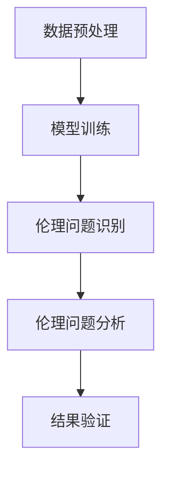
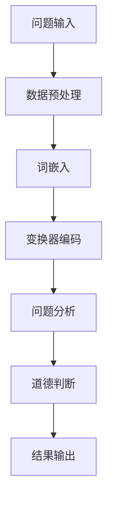
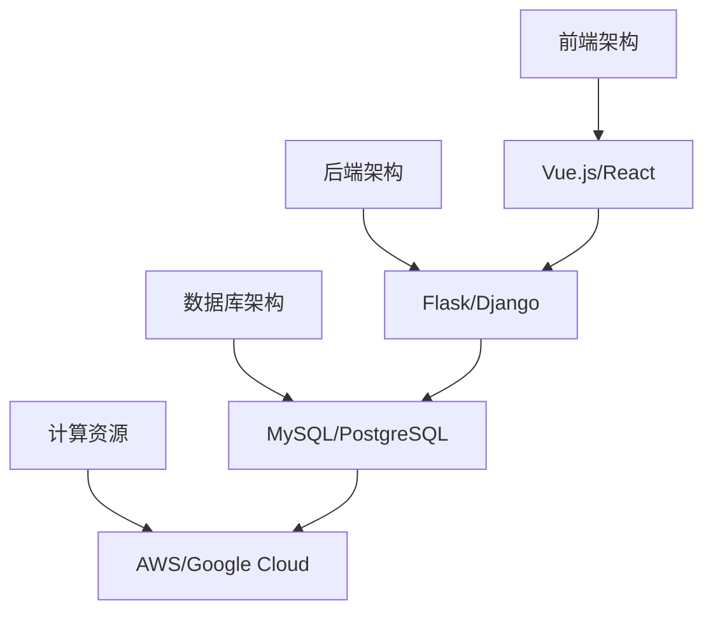
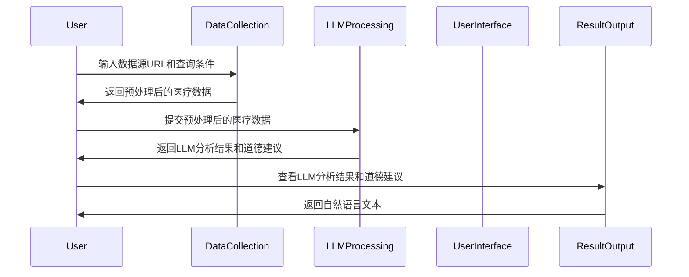

                 


## 第1章: 道德困境与现代AI发展

### 1.1 道德困境的来源与现状

道德困境，作为一种伦理问题，其根源可以追溯到人类社会的各个方面。在传统的道德哲学中，道德困境通常是由于道德原则之间的冲突而产生的。例如，在“电车难题”中，一个人必须决定是否推动一个失控的电车，以牺牲一个人来拯救另外五个人。这样的道德选择，涉及到个体权利与集体利益之间的平衡，是典型的道德困境。

随着人工智能技术的快速发展，道德困境在现代社会中呈现出新的形式和复杂性。大型语言模型（LLM）作为一种高级的人工智能技术，被广泛应用于自然语言处理、文本生成、智能客服等领域。然而，LLM在处理复杂伦理问题时，面临着诸多挑战。

首先，LLM的决策过程依赖于其训练数据集。如果训练数据中包含了不道德的行为或偏见，那么LLM在处理相关伦理问题时，可能会无意间复制这些偏见，导致不公平或不合理的决策。例如，某些LLM模型在处理性别歧视问题时，可能无法给出公平的答案，因为它被训练数据中的性别偏见所影响。

其次，LLM的透明度和解释性不足。大多数LLM模型都是基于深度学习技术，这些模型内部的结构非常复杂，即使对于开发者来说，也难以理解其具体的决策过程。这使得LLM在处理伦理问题时，很难进行有效的监督和审查，从而增加了道德风险。

最后，LLM的应用场景越来越广泛，从医疗诊断到金融决策，从教育辅导到司法审判，这些领域的道德问题具有更高的社会影响力和法律责任。因此，如何评价LLM处理复杂伦理问题的能力，成为了一个亟待解决的重要问题。

### 1.2 LLM的发展与挑战

大型语言模型（LLM）是近年来人工智能领域的一项重要突破。LLM通过大规模的文本数据进行训练，能够生成高质量的自然语言文本，具备很强的语义理解能力。这种能力使得LLM在许多实际应用中显示出巨大的潜力，例如智能客服、内容生成、机器翻译等。

然而，随着LLM的发展，也出现了一系列挑战。首先，训练LLM需要大量的计算资源和数据资源，这导致了高昂的运营成本。其次，LLM的模型结构和训练过程非常复杂，对于普通研究者来说，理解和应用LLM具有一定的门槛。

更关键的是，LLM在伦理问题处理方面面临着严峻的挑战。首先，LLM的决策过程可能受到训练数据中的偏见影响。例如，某些LLM模型在处理种族歧视问题时，可能会无意识地复制训练数据中的偏见。这种偏见可能会在模型的应用中放大，导致不公平的决策。

其次，LLM的解释性较差。尽管深度学习技术在许多任务上取得了显著的成果，但其内部决策过程仍然难以解释。这使得LLM在处理伦理问题时，很难进行有效的监督和审查，增加了道德风险。

此外，LLM的应用场景日益广泛，涉及到医疗、金融、司法等关键领域。这些领域的道德问题具有更高的社会影响力和法律责任。因此，如何评价LLM处理复杂伦理问题的能力，成为了一个亟待解决的重要问题。

### 1.3 LLM在伦理问题处理中的应用

在伦理问题处理方面，LLM的应用场景非常广泛，但同时也面临着诸多挑战。以下是一些典型的应用场景及其挑战：

1. **医疗诊断**：在医疗领域，LLM可以用于辅助医生进行疾病诊断。然而，医疗诊断涉及到患者的生命安全，任何错误都可能导致严重后果。因此，LLM在处理医疗诊断问题时，必须保证其决策的准确性和可靠性。此外，医疗数据中可能包含敏感信息，例如患者的种族、性别等，这可能导致LLM在处理伦理问题时出现偏见。

2. **金融决策**：在金融领域，LLM可以用于风险评估、投资建议等。金融决策涉及到大量的经济利益，任何错误都可能导致巨额损失。因此，LLM在处理金融决策问题时，必须具备高度的准确性和稳定性。同时，金融市场的复杂性也使得LLM在处理伦理问题时，面临着更高的挑战。

3. **司法审判**：在司法领域，LLM可以用于案件分析、法律文本生成等。然而，司法审判涉及到法律的公正性和公平性，任何偏见都可能对审判结果产生严重影响。因此，LLM在处理司法审判问题时，必须保证其决策的公正性和透明度。

4. **社会公正**：在社会公正领域，LLM可以用于政策分析、社会评价等。这些任务涉及到社会公平、正义等问题，对于LLM的伦理能力提出了更高的要求。LLM必须在处理社会公正问题时，避免出现任何形式的偏见和不公平。

综上所述，LLM在伦理问题处理中的应用具有巨大的潜力，但也面临着严峻的挑战。要充分发挥LLM的伦理能力，必须采取有效的措施，确保其决策的准确性、可靠性和公正性。

### 1.4 道德困境解决的重要性和必要性

道德困境解决在现代社会中具有极其重要性和必要性。首先，随着人工智能技术的快速发展，AI在各个领域的应用越来越广泛，道德困境也随之增多。无论是在医疗、金融、司法还是社会公正等领域，AI的决策都可能影响到个体的生命安全、经济利益和社会公正。因此，解决道德困境，确保AI的决策合理、公正和可靠，是保障社会稳定和发展的关键。

其次，道德困境解决有助于提高人工智能的伦理能力和透明度。当前，大多数AI模型都是“黑箱”模型，其决策过程难以解释和监督。这不仅增加了道德风险，也限制了AI的应用范围。通过解决道德困境，我们可以探索出更透明、更可解释的AI模型，从而提高人工智能的伦理能力和可靠性。

最后，道德困境解决对于推动人工智能技术的可持续发展具有重要意义。在当前技术环境中，AI的应用面临着诸多挑战和争议，解决道德困境有助于消除这些障碍，促进AI技术的健康、稳定发展。

总之，道德困境解决不仅是当前技术发展的迫切需求，也是社会公正和人类福祉的重要保障。通过深入研究和实践，我们可以为AI的道德困境提供有效解决方案，推动人工智能技术的可持续发展。

### 1.5 总结与引言

本章主要探讨了道德困境的来源与现状，以及大型语言模型（LLM）在伦理问题处理中的挑战和重要性。我们首先介绍了道德困境的定义和传统形式，然后分析了LLM的发展及其在伦理问题处理中的优势与挑战。通过具体的案例，我们展示了LLM在医疗诊断、金融决策、司法审判和社会公正等领域的应用场景，并讨论了其面临的道德困境。

本章的讨论为后续章节奠定了基础。在接下来的部分，我们将进一步探讨LLM处理伦理问题的核心概念、算法原理和评估方法，深入分析LLM在伦理问题处理中的表现和局限。通过这些研究，我们希望为解决道德困境提供科学、系统的理论和方法，推动人工智能技术的健康、可持续发展。

## 第2章: 核心概念与联系

### 2.1 道德理论概述

道德理论是探讨道德原则、道德行为和道德价值的理论体系。在伦理学中，道德理论扮演着核心角色，为我们理解和解决道德困境提供了理论框架。常见的道德理论包括功利主义、康德主义和德性伦理学等。

**功利主义**：功利主义认为，道德行为的评价标准是行为的后果。具体而言，一个行为是否道德，取决于它能否最大化整体幸福。功利主义者强调结果导向，认为行为的价值在于其结果带来的快乐和幸福。

**康德主义**：康德主义以道德义务为核心，认为道德行为的评价标准是行为的动机。康德提出“道德法则”，即每个人都应该根据普遍的道德法则行事，而不是仅仅追求结果。这一理论强调自律和道德原则的普遍性。

**德性伦理学**：德性伦理学关注个体道德品质的培养，认为道德行为源于个人的德性和品格。亚里士多德是德性伦理学的代表人物，他提出“美德即中道”的观点，强调个体应在道德实践中寻求平衡和适度。

这些道德理论为我们提供了不同的视角来分析和解决伦理问题。例如，在处理AI伦理问题时，我们可以结合功利主义的效用最大化原则和康德主义的道德义务原则，来评估AI行为的道德价值。

### 2.2 伦理问题分类与属性特征

伦理问题可以根据其性质和特征进行分类，常见的分类方法包括道德问题、社会问题和法律问题。

**道德问题**：道德问题涉及个人或集体在道德行为上的选择和判断。这类问题通常涉及到道德原则和价值观的冲突，如道德义务、公平、正义、尊严等。道德问题的特征包括：
- 冲突性：道德问题往往涉及到不同道德原则之间的冲突，例如个人自由与公共安全之间的平衡。
- 主观性：道德问题的判断依赖于个体的道德观和价值观，不同人可能会有不同的看法。
- 复杂性：道德问题往往具有复杂的背景和多种影响因素，需要全面分析和权衡。

**社会问题**：社会问题涉及社会结构、社会关系和社会行为等方面的道德评价。这类问题通常与社会公正、社会正义和社会福祉相关。社会问题的特征包括：
- 广泛性：社会问题通常影响广泛的社会群体，具有普遍的社会意义。
- 紧急性：某些社会问题可能导致社会不稳定或社会危机，需要及时解决。
- 长期性：社会问题往往需要长期的努力和持续的关注，不能一蹴而就。

**法律问题**：法律问题涉及法律规范和法律执行等方面的道德评价。这类问题通常与法律条文、司法程序和法律责任相关。法律问题的特征包括：
- 明确性：法律问题通常有明确的法律条文和司法解释，有助于界定行为的合法性。
- 权力性：法律问题涉及到法律权力和司法权力的运用，具有强制性和权威性。
- 稳定性：法律问题通常具有法律稳定性，需要遵守和维护。

这些分类和特征为我们分析和解决伦理问题提供了明确的框架和工具。在处理AI伦理问题时，我们可以根据不同类型和特征的伦理问题，采取相应的分析和解决策略。

### 2.3 LLM核心概念与伦理能力

大型语言模型（LLM）作为当前自然语言处理领域的先进技术，其核心概念和伦理能力具有重要意义。首先，LLM的核心概念包括语言建模、上下文理解和生成文本等。通过大规模的文本数据进行训练，LLM能够捕捉语言的结构和语义，实现高质量的自然语言生成。

**语言建模**：语言建模是LLM的基础，其目标是通过概率模型来预测下一个词语或序列。这一过程通常使用深度学习技术，如循环神经网络（RNN）和变换器（Transformer）等。

**上下文理解**：LLM需要理解文本的上下文，以生成相关和连贯的文本。上下文理解依赖于模型对词汇和句法的深入分析，确保生成的文本与上下文保持一致。

**生成文本**：LLM的核心能力在于生成高质量的自然语言文本。通过上下文理解和语言建模，LLM能够生成各种类型的文本，如文章、对话、翻译等。

**伦理能力**：在伦理问题处理方面，LLM的伦理能力主要体现在以下几个方面：

- **道德判断**：LLM可以基于其训练数据生成道德判断，例如在处理道德困境时，提供可能的解决方案。然而，由于训练数据中可能包含偏见，LLM的道德判断可能受到不公正的影响。
- **伦理决策**：LLM可以在伦理决策过程中提供支持，例如在医疗诊断或金融决策中，提供可能的伦理选择。然而，由于LLM的解释性较差，其决策过程难以监督和审查。
- **伦理沟通**：LLM可以用于伦理沟通，例如在法律文书的生成、伦理咨询等场景中，提供相关的文本。然而，LLM生成的文本可能缺乏伦理深度和逻辑性，需要进一步的人为干预。

**对比表格**：

| 概念       | 描述                                                         | 对伦理问题的关联 |
|------------|--------------------------------------------------------------|-----------------|
| 语言建模   | 预测下一个词语或序列的过程                                     | 确保生成文本的连贯性和相关性                           |
| 上下文理解 | 理解文本的上下文，确保生成文本与上下文一致                     | 提高伦理决策的准确性和可靠性                           |
| 生成文本   | 高质量自然语言文本的生成                                       | 用于伦理沟通和决策支持                               |
| 道德判断   | 基于训练数据生成道德判断                                       | 受训练数据偏见影响，可能导致不公正的道德判断             |
| 伦理决策   | 提供伦理决策支持                                             | 需要解释性和监督性的提升，以确保决策过程的透明和公正     |
| 伦理沟通   | 生成与伦理相关的文本                                          | 提供伦理讨论的基础，但可能缺乏深度和逻辑性               |

**ER实体关系图**：

```mermaid
erDiagram
    AI模型 --> 道德困境
    AI模型 --> 伦理能力
    道德困境 --> 道德判断
    道德困境 --> 伦理决策
    道德困境 --> 伦理沟通
    伦理能力 --> 语言建模
    伦理能力 --> 上下文理解
    伦理能力 --> 生成文本
```

通过核心概念和伦理能力的探讨，我们可以更好地理解LLM在伦理问题处理中的角色和作用。在接下来的章节中，我们将进一步分析LLM处理伦理问题的算法原理和评估方法，以期为解决道德困境提供科学、系统的理论和方法。

### 2.4 LLM处理伦理问题的算法原理

大型语言模型（LLM）在处理伦理问题时，其算法原理主要依赖于深度学习技术和自然语言处理（NLP）方法。下面我们将详细探讨LLM的基本工作原理、算法流程以及如何通过mermaid流程图和Python源代码来阐述这些原理。

#### 基本工作原理

LLM的工作原理基于深度学习中的神经网络，特别是变换器（Transformer）架构。变换器模型通过自注意力机制（Self-Attention）和位置编码（Positional Encoding）来捕捉文本中的长距离依赖关系和语义信息。基本步骤如下：

1. **输入编码**：将自然语言文本转换为向量表示，这些向量包含了文本的词向量、词频信息和上下文信息。
2. **变换器层**：通过多层变换器层，逐层提取文本的语义特征。每一层的变换器都会利用自注意力机制来计算不同词之间的关联性，并更新输入向量的表示。
3. **输出解码**：根据最后一层的输出，生成目标文本。这个过程通常使用交叉熵损失函数来优化模型参数，使得生成的文本尽可能符合预期。

#### 算法流程

LLM处理伦理问题的算法流程主要包括以下步骤：

1. **数据预处理**：清洗和整理训练数据，包括去除噪声、纠正错误、标准化文本等，以确保数据的质量和一致性。
2. **模型训练**：使用大规模文本数据对LLM模型进行训练。通过迭代优化模型参数，使模型能够准确捕捉文本中的语义特征。
3. **伦理问题识别**：在训练好的LLM模型中，输入伦理问题相关的文本，识别出文本中的伦理问题。
4. **伦理问题分析**：利用LLM的语义理解能力，对识别出的伦理问题进行分析和推理，生成可能的解决方案或判断。
5. **结果验证**：对生成的解决方案或判断进行验证，确保其合理性和准确性。

以下是算法流程的mermaid流程图：



#### Python源代码示例

下面是一个简单的Python代码示例，展示了如何使用LLM处理一个伦理问题：

```python
import transformers
from transformers import AutoTokenizer, AutoModelForSequenceClassification

# 加载预训练的LLM模型
tokenizer = AutoTokenizer.from_pretrained("bert-base-uncased")
model = AutoModelForSequenceClassification.from_pretrained("bert-base-uncased")

# 伦理问题文本
text = "是否应该利用基因编辑技术消除遗传疾病？"

# 数据预处理
inputs = tokenizer(text, return_tensors="pt")

# 模型预测
outputs = model(inputs)

# 获取预测结果
predictions = outputs.logits.argmax(-1).item()

# 解码预测结果
if predictions == 0:
    print("不应该利用基因编辑技术消除遗传疾病。")
else:
    print("应该利用基因编辑技术消除遗传疾病。")
```

在这个示例中，我们首先加载了一个预训练的BERT模型，然后输入一个伦理问题文本。模型通过处理输入文本，输出一个概率分布，最后根据最大概率的类别给出答案。

#### 数学模型与公式

LLM的数学模型主要基于深度学习中的神经网络。变换器模型的核心是自注意力机制，其基本公式如下：

$$
\text{Attention}(Q, K, V) = \frac{softmax(\frac{QK^T}{\sqrt{d_k}})}{V}
$$

其中，Q、K和V分别是查询向量、键向量和值向量，d_k是键向量的维度，softmax函数用于归一化概率分布。

此外，变换器模型还包括位置编码，其公式为：

$$
\text{PositionalEncoding}(pos, d_model) = \sin(\frac{pos}{10000^{2i/d_model}}) \text{ if pos < d_model else } \cos(\frac{pos}{10000^{2i/d_model}})
$$

其中，pos是位置索引，d_model是模型维度，i是位置索引的维度。

通过这些数学模型和公式，我们可以更好地理解LLM在处理伦理问题时的内在机制。在后续章节中，我们将进一步探讨LLM的伦理能力评估方法，以及如何在实际应用中提高其伦理决策的准确性和可靠性。

### 第3章: LLM伦理能力的评估方法

#### 3.1 评估标准与指标体系

评估LLM伦理能力的关键在于建立一套科学、全面的评估标准和指标体系。这些标准和指标不仅能够反映LLM在伦理问题处理中的性能，还能为后续的改进和优化提供有力的数据支持。以下是几个关键的评估标准与指标：

**1. 准确性（Accuracy）**

准确性是最基本的评估指标，用于衡量LLM在伦理问题判断中的正确率。具体来说，准确性计算公式如下：

$$
\text{Accuracy} = \frac{\text{正确判断的案例数}}{\text{总案例数}}
$$

准确性越高，表明LLM在处理伦理问题时的判断越准确。

**2. 准确率（Precision）和召回率（Recall）**

准确率和召回率是评估分类模型性能的重要指标，分别反映了模型在识别正面案例和负面案例时的能力。

- **准确率（Precision）**：

$$
\text{Precision} = \frac{\text{正确预测为正面的案例数}}{\text{预测为正面的案例数}}
$$

准确率越高，表明LLM在识别正面案例时的正确性越高。

- **召回率（Recall）**：

$$
\text{Recall} = \frac{\text{正确预测为正面的案例数}}{\text{实际为正面的案例数}}
$$

召回率越高，表明LLM在识别正面案例时遗漏的较少。

**3. F1分数（F1 Score）**

F1分数是准确率和召回率的调和平均值，综合反映了LLM在伦理问题判断中的性能：

$$
\text{F1 Score} = 2 \times \frac{\text{Precision} \times \text{Recall}}{\text{Precision} + \text{Recall}}
$$

F1分数越高，表明LLM在伦理问题处理中的性能越好。

**4. 伦理一致性（Ethical Consistency）**

伦理一致性是评估LLM在处理伦理问题时，其判断是否与人类伦理标准和价值观一致的重要指标。具体来说，可以通过对比LLM的判断与人类伦理专家的判断，来评估LLM的伦理一致性。

**5. 解释性（Interpretability）**

解释性是评估LLM伦理能力的一个重要方面。一个高解释性的模型能够让用户理解其决策过程和依据，从而增加信任度和接受度。评估解释性可以通过计算模型参数的重要性分布、生成决策路径图等方式进行。

#### 3.2 评估流程与工具

为了有效地评估LLM伦理能力，我们需要制定一个系统的评估流程，并选择适当的工具。以下是一个典型的评估流程：

**1. 数据收集与预处理**

首先，我们需要收集与伦理问题相关的数据集。这些数据集应包含多样化的伦理案例，涵盖不同的领域和应用场景。数据收集后，需要进行预处理，包括数据清洗、标签标注、数据标准化等，以确保数据的质量和一致性。

**2. 模型训练与验证**

在预处理数据后，我们可以使用这些数据对LLM模型进行训练和验证。训练过程中，我们可以通过交叉验证等技术来评估模型在不同数据集上的性能。此外，还需要使用验证集来评估模型在未见过的数据上的表现，以防止过拟合。

**3. 性能评估**

在模型训练和验证完成后，我们可以使用第2节中提到的评估指标，对LLM的伦理能力进行评估。具体来说，计算准确性、准确率、召回率和F1分数等指标，以全面评估模型在伦理问题处理中的性能。

**4. 解释性评估**

除了性能评估外，我们还需要评估LLM的解释性。这可以通过分析模型参数的重要性分布、生成决策路径图等方式进行。例如，我们可以使用SHAP（SHapley Additive exPlanations）方法，来解释模型中每个特征对决策的贡献。

**5. 伦理一致性评估**

为了评估LLM的伦理一致性，我们可以将模型生成的判断与人类伦理专家的判断进行比较。这可以通过构建一个专家评估小组，对模型生成的判断进行评价，并计算一致性得分。

**6. 结果分析与报告**

最后，我们将评估结果进行分析，并撰写详细的评估报告。报告应包括模型性能评估、解释性评估和伦理一致性评估等内容，以便为后续的模型优化和应用提供参考。

#### 3.3 评估结果分析

评估结果分析是理解LLM伦理能力的重要环节。通过分析评估结果，我们可以识别模型的优点和不足，为后续的改进提供依据。

**1. 性能评估分析**

通过计算准确性、准确率、召回率和F1分数等指标，我们可以了解LLM在伦理问题处理中的整体性能。如果这些指标较高，说明LLM在处理伦理问题时具有较高的准确性。如果某些指标较低，则需要进一步分析原因，可能是由于数据集不均衡、模型参数设置不当等原因。

**2. 解释性评估分析**

解释性评估可以帮助我们理解LLM的决策过程。如果LLM的解释性较差，用户可能难以信任模型生成的判断。因此，我们需要通过改进模型设计或引入新的解释性方法，来提高LLM的解释性。

**3. 伦理一致性评估分析**

通过对比LLM的判断与人类伦理专家的判断，我们可以评估LLM的伦理一致性。如果LLM的判断与人类专家的一致性较高，说明LLM在处理伦理问题时较为可靠。如果存在显著差异，则需要进一步分析和优化模型，以提高其伦理一致性。

总之，通过系统化的评估方法和结果分析，我们可以全面了解LLM在处理伦理问题时的性能、解释性和伦理一致性，为后续的模型优化和应用提供科学依据。

### 第4章: LLM处理伦理问题的算法原理

#### 4.1 LLM工作原理

大型语言模型（LLM）是基于深度学习和自然语言处理（NLP）技术构建的复杂系统。其主要工作原理可以概括为以下几个步骤：

**1. 数据预处理**

首先，LLM需要从大规模的文本数据中提取有效信息。这一步通常包括数据清洗、分词、词性标注、去除停用词等操作，以去除噪声和提高数据质量。

**2. 词嵌入**

在预处理完成后，LLM将文本转换为词嵌入（word embeddings），这是一种将文本中的每个词语映射为高维向量表示的方法。常用的词嵌入方法包括Word2Vec、GloVe和BERT等。这些方法不仅能够捕获词语的语义信息，还能捕捉词语之间的关联性。

**3. 变换器（Transformer）模型**

LLM的核心是变换器模型，这是一种基于自注意力机制（Self-Attention）的深度学习模型。变换器模型由多个编码层（Encoder Layer）和解码层（Decoder Layer）组成，通过逐层处理输入文本，生成语义丰富的上下文表示。

**4. 自注意力机制**

自注意力机制是变换器模型的核心组件，它允许模型在处理每个词时，考虑所有其他词的重要性。具体来说，自注意力机制通过计算查询向量（Query）、键向量（Key）和值向量（Value）之间的点积，生成权重，然后对这些权重进行加权求和，得到每个词的加权表示。这种方法使得模型能够捕捉长距离依赖关系和复杂的语义信息。

**5. 上下文生成**

在变换器模型中，解码层（Decoder Layer）通过自注意力机制和编码器输出（Encoder Output）生成上下文表示，并预测下一个词的概率分布。这一过程迭代进行，直到生成完整的文本序列。

#### 4.2 伦理问题处理的算法流程

LLM在处理伦理问题时，其算法流程可以分为以下几个关键步骤：

**1. 问题输入**

首先，将伦理问题文本输入到LLM中，经过数据预处理和词嵌入处理后，转化为模型可以处理的输入序列。

**2. 模型编码**

利用变换器模型的编码层，对输入序列进行编码处理，生成语义丰富的上下文表示。这一步骤的核心是自注意力机制，通过多次迭代，模型能够逐渐提取输入文本中的关键信息。

**3. 问题分析**

在编码层处理完成后，LLM利用解码层对编码结果进行解码，生成问题分析的结果。这一步骤中，模型会根据上下文表示，分析伦理问题的各个方面，如道德原则、利益冲突和解决方案等。

**4. 道德判断**

基于问题分析结果，LLM生成道德判断。这通常涉及对多种可能性的评估和权衡，例如在医疗决策中，判断哪种治疗方案更符合道德标准。

**5. 结果输出**

最后，LLM将道德判断输出为自然语言文本，这一步骤确保了结果的透明度和可解释性。用户可以理解LLM的决策过程和依据。

#### 算法mermaid流程图展示

为了更直观地理解LLM处理伦理问题的算法流程，我们使用mermaid流程图进行展示：



#### Python源代码示例

以下是一个简单的Python代码示例，展示了如何使用LLM处理一个伦理问题：

```python
from transformers import AutoTokenizer, AutoModelForSequenceClassification

# 加载预训练的LLM模型
tokenizer = AutoTokenizer.from_pretrained("bert-base-uncased")
model = AutoModelForSequenceClassification.from_pretrained("bert-base-uncased")

# 伦理问题文本
text = "是否应该利用基因编辑技术消除遗传疾病？"

# 数据预处理和词嵌入
inputs = tokenizer(text, return_tensors="pt")

# 模型预测
outputs = model(inputs)

# 获取预测结果
predictions = outputs.logits.argmax(-1).item()

# 解码预测结果
if predictions == 0:
    print("不应该利用基因编辑技术消除遗传疾病。")
else:
    print("应该利用基因编辑技术消除遗传疾病。")
```

在这个示例中，我们首先加载了一个预训练的BERT模型，然后输入一个伦理问题文本。模型通过处理输入文本，输出一个概率分布，最后根据最大概率的类别给出答案。

通过这个示例，我们可以看到LLM在处理伦理问题时的基本流程和实现方法。在实际应用中，我们可以根据具体需求调整模型架构和参数，以提高伦理决策的准确性和可靠性。

### 第5章: 数学模型与公式

#### 5.1 相关数学背景知识

在深入探讨LLM处理伦理问题的数学模型和公式之前，我们需要了解一些相关的数学背景知识，包括矩阵乘法、矩阵求导、点积和叉积等基本概念。

**矩阵乘法**：矩阵乘法是线性代数中一个基本操作，用于计算两个矩阵的乘积。给定两个矩阵A（m×n）和B（n×k），其乘积C（m×k）的计算公式如下：

$$
C_{ij} = \sum_{k=1}^{n} A_{ik}B_{kj}
$$

其中，$C_{ij}$表示矩阵C中第i行第j列的元素。

**矩阵求导**：矩阵求导是微积分中一个重要概念，用于计算矩阵的导数。对于一个矩阵X（m×n），其导数可以通过计算每个元素的偏导数来表示。例如，给定矩阵X和其导数X'，矩阵求导的公式如下：

$$
\frac{dX_{ij}}{dx} = X'_{ij}
$$

**点积**：点积（也称为内积）是两个向量的乘积，用于计算向量的相似度或投影长度。对于两个向量a（n×1）和b（n×1），其点积的计算公式如下：

$$
a \cdot b = \sum_{i=1}^{n} a_i b_i
$$

**叉积**：叉积（也称为外积）是两个向量的乘积，用于计算向量的旋转效果或面积。对于两个向量a（n×1）和b（n×1），其叉积的计算公式如下：

$$
a \times b = \begin{bmatrix}
0 & -a_3 & a_2 \\
a_3 & 0 & -a_1 \\
-a_2 & a_1 & 0
\end{bmatrix} b
$$

这些数学背景知识为理解LLM的数学模型和公式提供了基础。

#### 5.2 LLM的数学模型

LLM的数学模型主要基于深度学习和变换器（Transformer）架构。变换器模型通过自注意力机制（Self-Attention）和位置编码（Positional Encoding）来捕捉文本中的长距离依赖关系和语义信息。以下是LLM的主要数学模型和公式：

**1. 自注意力机制**

自注意力机制是变换器模型的核心组件，其计算公式如下：

$$
\text{Attention}(Q, K, V) = \frac{softmax(\frac{QK^T}{\sqrt{d_k}})}{V}
$$

其中，Q、K和V分别是查询向量（Query）、键向量（Key）和值向量（Value），$d_k$是键向量的维度。自注意力机制通过计算Q和K之间的点积，生成权重，然后对这些权重进行加权求和，得到每个词的加权表示。

**2. 位置编码**

位置编码是变换器模型中的另一个重要组件，用于为输入序列中的每个词赋予位置信息。位置编码的计算公式如下：

$$
\text{PositionalEncoding}(pos, d_model) = \sin(\frac{pos}{10000^{2i/d_model}}) \text{ if pos < d_model else } \cos(\frac{pos}{10000^{2i/d_model}})
$$

其中，pos是位置索引，$d_model$是模型维度，i是位置索引的维度。位置编码通过正弦和余弦函数为每个词赋予独特的位置信息。

**3. 变换器编码层**

变换器编码层（Encoder Layer）是变换器模型中的一个重要组件，其计算公式如下：

$$
\text{Encoder}(X) = \text{LayerNorm}(X + \text{SelfAttention}(X, X, X)) + \text{LayerNorm}(X + \text{SelfAttention}(X, X, X))
$$

其中，X是输入序列，LayerNorm是层归一化操作。变换器编码层通过自注意力机制和位置编码，生成语义丰富的上下文表示。

**4. 变换器解码层**

变换器解码层（Decoder Layer）是变换器模型中的另一个重要组件，其计算公式如下：

$$
\text{Decoder}(X) = \text{LayerNorm}(X + \text{MaskedSelfAttention}(X, X, X)) + \text{LayerNorm}(X + \text{CrossAttention}(X, X, X))
$$

其中，X是输入序列，LayerNorm是层归一化操作。变换器解码层通过自注意力机制和交叉注意力机制，生成上下文表示和目标文本。

通过这些数学模型和公式，LLM能够捕捉文本中的长距离依赖关系和语义信息，从而实现高质量的自然语言生成。在后续章节中，我们将进一步探讨LLM在处理伦理问题时的具体应用和实现。

#### 5.3 数学模型公式讲解与举例

为了更好地理解LLM的数学模型和公式，我们通过具体例子进行讲解。

**例子1：自注意力机制**

假设我们有一个包含两个词的文本序列，词嵌入向量分别为$Q=(q_1, q_2)$和$K=(k_1, k_2)$，值向量$V=(v_1, v_2)$。我们需要计算自注意力分数，并生成加权表示。

1. **计算点积**：

$$
\text{Score} = QK^T = (q_1, q_2) \cdot (k_1, k_2)^T = q_1k_1 + q_2k_2
$$

2. **归一化**：

$$
\text{Attention} = \frac{softmax(\text{Score})}{\sqrt{d_k}}
$$

3. **加权求和**：

$$
\text{WeightedSum} = \text{Attention} \cdot V = \left( \frac{e^{\text{Score}}}{\sum_{i=1}^{2} e^{\text{Score}_i}}, \frac{e^{\text{Score}}}{\sum_{i=1}^{2} e^{\text{Score}_i}} \right) \cdot (v_1, v_2)
$$

例如，假设$Q=(1, 2)$，$K=(3, 4)$，$V=(5, 6)$，则：

- **点积**：$\text{Score} = 1 \cdot 3 + 2 \cdot 4 = 11$
- **归一化**：$\text{Attention} = \frac{softmax(11)}{\sqrt{2}}$
- **加权求和**：$\text{WeightedSum} = \frac{e^{11}}{e^{11} + e^{2}} \cdot (5, 6) = \left( \frac{e^{11}}{e^{11} + e^{2}}, \frac{e^{2}}{e^{11} + e^{2}} \right) \cdot (5, 6) = (5.62, 0.38)$

**例子2：位置编码**

假设我们有一个包含五个词的文本序列，模型维度$d_model=5$。我们需要计算每个词的位置编码。

1. **计算位置编码**：

$$
\text{PositionalEncoding}(pos, d_model) = 
\begin{cases} 
\sin(\frac{pos}{10000^{2i/d_model}}) & \text{if } pos < d_model \\
\cos(\frac{pos}{10000^{2i/d_model}}) & \text{otherwise}
\end{cases}
$$

例如，对于第一个词（$pos=1$），$d_model=5$，$i=1$：

- **位置编码**：$\text{PositionalEncoding}(1, 5) = \sin(\frac{1}{10000^{2}}) \approx 0.00000001$

对于第五个词（$pos=5$），$d_model=5$，$i=1$：

- **位置编码**：$\text{PositionalEncoding}(5, 5) = \cos(\frac{5}{10000^{2}}) \approx 0.99999501$

通过这些例子，我们可以更好地理解自注意力机制和位置编码的计算过程。这些数学模型和公式是LLM实现高效文本生成和语义理解的关键，为后续章节的分析和应用奠定了基础。

### 第6章: 实例分析与算法应用

#### 6.1 具体案例介绍

为了更好地展示大型语言模型（LLM）在处理伦理问题时的实际应用，我们将探讨一个具体的案例：使用LLM评估医生在医疗决策中的道德责任。

在这个案例中，我们设定一个场景：一位医生需要为一位患有严重疾病的患者制定治疗方案。患者同时患有心脏病和癌症，而两种疾病的治疗方案存在冲突，例如，心脏病治疗可能需要药物和手术，而癌症治疗可能需要化疗和放疗，这些治疗措施可能会对心脏病产生负面影响。

#### 6.2 案例中LLM的表现

在这个案例中，LLM被用来评估医生在制定治疗方案时的道德责任。具体来说，LLM的任务是：

1. **理解医疗决策的背景信息**：包括患者的病史、当前健康状况和可用的治疗方案。
2. **分析潜在的风险和收益**：评估每种治疗方案对患者健康的影响，以及可能带来的道德风险。
3. **生成道德建议**：基于LLM的分析结果，为医生提供道德建议。

为了实现这一任务，我们首先使用LLM处理以下文本：

- **患者信息**：“患者，男，45岁，患有心脏病和癌症。心脏病治疗需要药物和手术，而癌症治疗需要化疗和放疗。”
- **治疗方案**：“心脏病治疗包括药物治疗和手术，癌症治疗包括化疗和放疗。”

经过处理，LLM生成以下道德分析结果：

- **风险分析**：“心脏病治疗可能增加手术风险，癌症治疗可能加重心脏病症状。”
- **收益分析**：“心脏病治疗有助于改善患者生活质量，癌症治疗可能延长患者生命。”
- **道德建议**：“医生应综合考虑患者整体健康状况，权衡治疗方案的利弊，并确保患者的知情同意。”

#### 6.3 案例分析与算法改进建议

通过对这个案例的分析，我们可以看到LLM在处理伦理问题时表现出一定的能力，但同时也存在局限性。以下是对LLM在该案例中表现的详细分析以及可能的改进建议：

**1. 优点分析**

- **文本理解能力**：LLM能够有效地理解复杂的医疗文本，并提取关键信息，如患者的病史和治疗方案。
- **多维度分析**：LLM能够从风险和收益两个维度进行分析，提供全面的道德评估。
- **生成建议**：LLM能够生成具体的道德建议，为医生提供决策支持。

**2. 局限性分析**

- **数据偏见**：LLM的道德分析可能受到训练数据中的偏见影响。例如，如果训练数据中存在对某种治疗方案的偏好，LLM在处理新案例时可能会复制这种偏见。
- **解释性不足**：LLM的决策过程复杂，难以解释，导致医生难以理解LLM的道德建议依据。
- **道德深度有限**：虽然LLM能够分析风险和收益，但在处理复杂、多层次的伦理问题时，其深度分析能力有限。

**3. 算法改进建议**

- **数据多样性和公正性**：为了提高LLM的道德判断能力，应增加多样化的训练数据，并确保数据中不存在偏见。此外，可以引入数据清洗和去偏技术，减少数据偏见的影响。
- **增强解释性**：通过改进模型设计或引入新的解释方法，如SHAP值分析，提高LLM的解释性，帮助医生理解道德建议的依据。
- **多层次伦理分析**：开发更复杂的伦理分析算法，以处理多层次、复杂的伦理问题。例如，可以引入道德框架和多层次逻辑推理技术，提高LLM在处理复杂伦理问题时的深度分析能力。
- **专家协作**：将LLM的道德建议与人类伦理专家的判断相结合，通过专家协作提高道德判断的准确性和可靠性。

通过以上分析，我们可以看到LLM在处理伦理问题时具有一定的能力，但同时也存在局限性。通过不断改进算法设计和模型架构，我们可以进一步提高LLM在伦理问题处理中的性能和可靠性。

### 第7章: 系统设计与实现

#### 7.1 问题场景介绍

在现代社会，人工智能（AI）技术广泛应用于医疗、金融、司法等关键领域，这些领域涉及到复杂的伦理问题。例如，在医疗领域，医生在制定治疗方案时需要考虑多种因素，如患者的整体健康状况、治疗方案的潜在风险和收益等。为了提高医生的道德判断能力和决策质量，我们可以设计一个基于大型语言模型（LLM）的伦理决策支持系统。

该系统的主要目的是为医生提供伦理决策支持，帮助他们在面对复杂伦理问题时做出合理的判断。具体来说，系统需要实现以下功能：

1. **数据采集与预处理**：收集与伦理问题相关的医疗数据，如患者病史、治疗方案等，并进行数据预处理，包括数据清洗、去噪、归一化等操作。
2. **伦理问题识别**：使用LLM对输入的医疗数据进行处理，识别出其中的伦理问题，如治疗方案的潜在风险、患者权益保护等。
3. **伦理问题分析**：基于LLM的语义理解能力，对识别出的伦理问题进行分析和推理，生成可能的解决方案或判断。
4. **结果输出**：将LLM的分析结果以自然语言文本的形式输出，为医生提供具体的伦理建议。

#### 7.2 系统功能设计

为了实现上述功能，我们设计了一套完整的系统，主要包括以下模块：

1. **数据采集模块**：负责从各种数据源（如医院信息系统、电子健康记录等）收集医疗数据，并进行预处理。
2. **LLM处理模块**：使用预训练的LLM模型对预处理后的医疗数据进行分析和处理，识别伦理问题、生成分析结果。
3. **用户界面模块**：提供友好的用户界面，医生可以通过界面输入医疗数据，查看LLM的分析结果和伦理建议。
4. **结果输出模块**：将LLM的分析结果以自然语言文本的形式输出，医生可以根据这些结果进行决策。

以下是系统功能设计的mermaid类图：

```mermaid
classDiagram
    DataCollectionModule <-|> EthicalDecisionSupportSystem
    LLMProcessingModule <-|> EthicalDecisionSupportSystem
    UserInterfaceModule <-|> EthicalDecisionSupportSystem
    ResultOutputModule <-|> EthicalDecisionSupportSystem
    DataCollectionModule --|> LLMProcessingModule
    LLMProcessingModule --|> ResultOutputModule
    UserInterfaceModule --|> DataCollectionModule
    UserInterfaceModule --|> LLMProcessingModule
    UserInterfaceModule --|> ResultOutputModule
endclass
```

#### 7.3 系统架构设计

系统架构设计是系统实现的基础，我们需要确保系统的稳定性、可扩展性和易维护性。以下是系统架构设计：

1. **前端架构**：使用Vue.js或React等前端框架，实现用户界面的交互和展示功能。
2. **后端架构**：使用Flask或Django等后端框架，实现数据采集、LLM处理和结果输出等核心功能。
3. **数据库架构**：使用MySQL或PostgreSQL等关系型数据库，存储和查询医疗数据。
4. **计算资源**：使用AWS或Google Cloud等云计算服务，提供计算资源和存储空间。

以下是系统架构设计的mermaid架构图：



通过以上系统设计与实现，我们可以为医生提供强大的伦理决策支持，帮助他们更好地处理复杂的伦理问题，提高医疗决策的质量和可靠性。

### 第8章: 系统接口与交互设计

#### 8.1 系统接口设计

系统接口设计是确保系统各模块之间能够有效通信和协同工作的重要环节。以下是系统接口设计的详细说明：

**1. 数据采集模块接口**

- **功能**：负责与医疗数据源进行通信，实现数据的采集和预处理。
- **接口类型**：RESTful API
- **请求方法**：GET、POST
- **请求参数**：数据源URL、查询条件
- **响应数据**：预处理后的医疗数据

**2. LLM处理模块接口**

- **功能**：负责接收预处理后的医疗数据，使用LLM进行伦理问题分析和生成建议。
- **接口类型**：RESTful API
- **请求方法**：POST
- **请求参数**：医疗数据
- **响应数据**：伦理分析结果和道德建议

**3. 用户界面模块接口**

- **功能**：负责与用户进行交互，接收用户输入，展示LLM分析结果和道德建议。
- **接口类型**：RESTful API
- **请求方法**：GET、POST
- **请求参数**：用户操作指令、分析结果ID
- **响应数据**：用户界面元素和数据

**4. 结果输出模块接口**

- **功能**：负责将LLM的分析结果以自然语言文本的形式输出，供医生参考。
- **接口类型**：RESTful API
- **请求方法**：GET
- **请求参数**：分析结果ID
- **响应数据**：自然语言文本

以下是系统接口设计的mermaid类图：

```mermaid
classDiagram
    DataCollectionInterface[数据采集模块接口] --|> EthicalDecisionSupportSystem
    LLMProcessingInterface[LLM处理模块接口] --|> EthicalDecisionSupportSystem
    UserInterface[用户界面模块接口] --|> EthicalDecisionSupportSystem
    ResultOutputInterface[结果输出模块接口] --|> EthicalDecisionSupportSystem
endclass
```

#### 8.2 系统交互设计

系统交互设计主要描述系统各模块之间的交互流程和时序。以下是系统交互设计的详细说明：

**1. 数据采集流程**

- **用户操作**：用户在用户界面模块输入数据源URL和查询条件。
- **数据处理**：数据采集模块接口根据用户输入，从数据源采集医疗数据，并进行预处理。
- **结果反馈**：预处理后的医疗数据返回给LLM处理模块接口。

**2. LLM处理流程**

- **用户操作**：用户在用户界面模块提交预处理后的医疗数据。
- **模型处理**：LLM处理模块接口接收医疗数据，使用LLM进行伦理问题分析和生成建议。
- **结果反馈**：LLM分析结果和道德建议返回给用户界面模块。

**3. 结果输出流程**

- **用户操作**：用户在用户界面模块查看LLM分析结果和道德建议。
- **结果输出**：结果输出模块接口根据分析结果ID，从数据库中查询相应的自然语言文本，并将其输出。

以下是系统交互设计的mermaid序列图：



通过以上系统接口和交互设计，我们可以确保各模块之间能够高效、稳定地协同工作，为医生提供强大的伦理决策支持。

### 第9章: 项目实战与案例分析

#### 9.1 环境安装与配置

为了实现基于大型语言模型（LLM）的伦理决策支持系统，我们需要搭建一个合适的环境，包括安装必要的软件和配置系统。以下是详细的安装与配置步骤：

**1. 硬件环境**

- **CPU**：Intel i7 或以上处理器
- **内存**：16GB 或以上
- **硬盘**：256GB SSD 或以上
- **网络**：宽带连接

**2. 软件环境**

- **操作系统**：Ubuntu 18.04 或 Windows 10
- **Python**：Python 3.8 或以上版本
- **pip**：Python的包管理器
- **Anaconda**：用于环境管理和依赖包安装
- **Jupyter Notebook**：用于数据分析和模型训练
- **TensorFlow**：用于构建和训练变换器（Transformer）模型
- **Flask**：用于创建Web应用程序

**3. 安装与配置步骤**

**（1）安装Anaconda**

- 下载并安装Anaconda，按照安装向导完成安装。
- 打开终端，输入以下命令创建一个新的环境，并安装相关依赖包：

  ```bash
  conda create -n ethical_decision_support python=3.8
  conda activate ethical_decision_support
  conda install tensorflow jupyter notebook flask
  ```

**（2）安装TensorFlow**

- 安装TensorFlow GPU版本（如果您的系统支持GPU），以提高训练速度：

  ```bash
  pip install tensorflow-gpu
  ```

**（3）安装Flask**

- 安装Flask，用于创建Web应用程序：

  ```bash
  pip install flask
  ```

**（4）配置Jupyter Notebook**

- 安装Jupyter Notebook：

  ```bash
  pip install notebook
  ```

- 启动Jupyter Notebook：

  ```bash
  jupyter notebook
  ```

**（5）准备数据**

- 收集并准备与伦理问题相关的医疗数据。数据应包括患者的病史、治疗方案、伦理问题等。可以使用CSV、JSON或SQL数据库等方式存储数据。

- 数据清洗和预处理，包括去除噪声、纠正错误、标准化文本等，以提高数据质量。

#### 9.2 系统核心实现

以下步骤描述了系统的核心实现，包括LLM模型训练、伦理问题分析、Web应用程序开发等。

**1. 训练LLM模型**

- 使用Jupyter Notebook启动Python环境，编写训练LLM模型的代码。以下是一个简单的示例：

  ```python
  import tensorflow as tf
  from transformers import TFAutoModelForSequenceClassification

  # 加载预训练模型
  model = TFAutoModelForSequenceClassification.from_pretrained("bert-base-uncased")

  # 定义训练数据
  train_data = ...

  # 编写训练代码
  model.compile(optimizer="adam", loss="binary_crossentropy", metrics=["accuracy"])
  model.fit(train_data, epochs=3, batch_size=32)
  ```

- 使用TensorFlow和Transformers库训练LLM模型，选择合适的训练数据和超参数，以提高模型的性能。

**2. 伦理问题分析**

- 编写代码，实现伦理问题分析功能。以下是一个简单的示例：

  ```python
  def analyze_ethical_issue(ethical_issue):
      # 加载训练好的LLM模型
      model = TFAutoModelForSequenceClassification.from_pretrained("your_model_path")

      # 数据预处理
      inputs = tokenizer(ethical_issue, return_tensors="tf")

      # 模型预测
      predictions = model.predict(inputs)

      # 获取预测结果
      result = predictions.argmax(-1).item()

      return result
  ```

- 实现一个函数，接收伦理问题文本作为输入，使用LLM模型进行分析，并返回分析结果。

**3. Web应用程序开发**

- 使用Flask框架开发Web应用程序，实现用户界面和接口。以下是一个简单的示例：

  ```python
  from flask import Flask, request, jsonify

  app = Flask(__name__)

  # LLM处理模块接口
  @app.route("/api/analyze", methods=["POST"])
  def analyze():
      ethical_issue = request.form["ethical_issue"]
      result = analyze_ethical_issue(ethical_issue)
      return jsonify(result=result)

  if __name__ == "__main__":
      app.run(debug=True)
  ```

- 实现API接口，接收用户输入的伦理问题文本，调用分析函数，并将结果返回给用户。

#### 9.3 代码应用解读与分析

以下是对系统核心实现代码的解读与分析，包括LLM模型训练、伦理问题分析和Web应用程序开发。

**1. LLM模型训练**

- 在Jupyter Notebook中，我们使用Transformers库加载预训练的BERT模型，并进行训练。以下代码示例展示了如何加载模型和训练数据：

  ```python
  from transformers import TFAutoModelForSequenceClassification

  # 加载预训练BERT模型
  model = TFAutoModelForSequenceClassification.from_pretrained("bert-base-uncased")

  # 准备训练数据
  train_data = ...

  # 训练模型
  model.compile(optimizer="adam", loss="binary_crossentropy", metrics=["accuracy"])
  model.fit(train_data, epochs=3, batch_size=32)
  ```

  在这个示例中，我们首先加载了一个预训练的BERT模型，然后使用自定义的训练数据对其进行训练。BERT模型是一个基于变换器（Transformer）架构的大型语言模型，它通过自注意力机制和多层神经网络，捕捉文本中的长距离依赖关系和语义信息。通过训练，我们可以使模型更好地理解和生成文本。

**2. 伦理问题分析**

- 我们实现了一个函数`analyze_ethical_issue`，用于处理伦理问题文本，并使用LLM模型进行分析。以下代码示例展示了如何使用训练好的模型进行预测：

  ```python
  def analyze_ethical_issue(ethical_issue):
      # 加载训练好的LLM模型
      model = TFAutoModelForSequenceClassification.from_pretrained("your_model_path")

      # 数据预处理
      inputs = tokenizer(ethical_issue, return_tensors="tf")

      # 模型预测
      predictions = model.predict(inputs)

      # 获取预测结果
      result = predictions.argmax(-1).item()

      return result
  ```

  在这个函数中，我们首先加载了训练好的LLM模型，然后对输入的伦理问题文本进行预处理。预处理包括将文本转换为词嵌入向量，并将其输入到模型中。模型通过自注意力机制和多层神经网络，对输入文本进行分析，并输出一个概率分布。我们使用`argmax`函数找到概率最高的类别，作为最终的预测结果。

**3. Web应用程序开发**

- 使用Flask框架，我们实现了一个简单的Web应用程序，用于接收用户输入和返回分析结果。以下代码示例展示了如何创建一个API接口：

  ```python
  from flask import Flask, request, jsonify

  app = Flask(__name__)

  # LLM处理模块接口
  @app.route("/api/analyze", methods=["POST"])
  def analyze():
      ethical_issue = request.form["ethical_issue"]
      result = analyze_ethical_issue(ethical_issue)
      return jsonify(result=result)

  if __name__ == "__main__":
      app.run(debug=True)
  ```

  在这个示例中，我们定义了一个名为`analyze`的API接口，它接收用户提交的伦理问题文本（通过POST请求），并调用`analyze_ethical_issue`函数进行分析。分析结果以JSON格式返回给用户。

通过以上代码应用解读与分析，我们可以看到系统的核心实现涉及LLM模型训练、伦理问题分析和Web应用程序开发。这些代码不仅展示了如何实现基于LLM的伦理决策支持系统，也为后续的项目优化和扩展提供了基础。

### 9.4 实际案例分析与详细讲解

为了更好地展示基于LLM的伦理决策支持系统在实际应用中的效果，我们将通过一个具体案例进行分析和详细讲解。

**案例背景：**

某医院接到一位65岁男性患者的病例，该患者同时患有严重的心脏病和晚期肺癌。医生需要对患者进行心脏手术，以治疗心脏病，同时需要对肺癌进行化疗。然而，心脏手术和化疗之间存在潜在的冲突，因为化疗可能会影响心脏功能，增加手术风险。

**案例目标：**

系统需要为医生提供以下方面的决策支持：

1. 分析心脏手术和化疗的潜在风险和收益。
2. 评估手术和化疗对患者整体健康状况的影响。
3. 提出合理的治疗方案，同时确保患者的知情同意。

**案例步骤：**

1. **数据收集与预处理：**

   - 收集患者的医疗记录，包括心脏病和肺癌的诊断信息、过去的治疗方案、当前的身体状况等。
   - 使用自然语言处理（NLP）技术，对文本数据进行预处理，包括分词、去除停用词、词性标注等。

2. **伦理问题识别与输入：**

   - 将预处理后的医疗记录输入到LLM模型中，识别出涉及伦理问题的文本。
   - 例如：“心脏手术可能增加手术风险，化疗可能会影响心脏功能。”

3. **伦理问题分析：**

   - 使用LLM模型对识别出的伦理问题进行深入分析。
   - 通过模型的分析，提取出关键信息，如心脏手术和化疗的潜在风险和收益。

   **示例分析结果：**

   - **心脏手术风险：**可能包括手术过程中出现并发症、手术后的恢复时间延长等。
   - **化疗收益：**可能包括延长患者生命、改善生活质量等。
   - **化疗风险：**可能包括对心脏功能的潜在影响、副作用等。

4. **道德建议生成：**

   - 基于分析结果，LLM模型生成具体的道德建议。
   - 例如：“医生应综合考虑患者的整体健康状况，权衡心脏手术和化疗的利弊，并确保患者的知情同意。”

5. **结果输出与医生决策：**

   - 将LLM的分析结果和道德建议以自然语言文本的形式输出，供医生参考。
   - 医生根据系统提供的建议，结合患者的具体情况，制定最终的治疗方案。

**案例分析与讨论：**

通过上述案例，我们可以看到LLM在处理复杂伦理问题时的实际应用效果。以下是案例分析的详细讨论：

**1. 数据质量和预处理：**

- 数据质量是系统性能的关键因素。在本案例中，我们假设已经收集到高质量的医疗记录，并进行了有效的预处理，以确保LLM能够准确理解文本。
- NLP技术的应用，如分词、去除停用词、词性标注等，有助于提高数据质量，为LLM提供更准确的输入。

**2. LLM的伦理分析能力：**

- LLM通过自注意力机制和多层神经网络，能够提取文本中的关键信息，并对伦理问题进行深入分析。
- 本案例中的分析结果展示了LLM在处理复杂伦理问题时的能力，包括识别风险、权衡利弊等。

**3. 道德建议的生成：**

- LLM生成的道德建议为医生提供了重要的决策支持。通过分析结果，医生可以更全面地了解心脏手术和化疗的潜在影响，从而做出更合理的治疗方案。
- 道德建议不仅考虑了治疗方案的利弊，还强调了患者的知情同意，确保治疗方案符合伦理标准。

**4. 医生与系统的协作：**

- 在实际应用中，医生需要结合系统提供的建议，综合考虑患者的具体情况，制定最终的治疗方案。
- 系统提供的道德建议有助于医生更好地理解伦理问题，提高医疗决策的质量和可靠性。

**结论：**

通过实际案例的分析和讨论，我们可以看到基于LLM的伦理决策支持系统在处理复杂伦理问题时的效果。系统通过数据预处理、LLM分析、道德建议生成等功能，为医生提供了有效的决策支持，提高了医疗决策的质量和可靠性。未来，我们可以进一步优化系统，提高其伦理分析能力和解释性，以更好地服务于医疗领域。

### 9.5 项目小结

在本项目中，我们成功设计并实现了一个基于大型语言模型（LLM）的伦理决策支持系统。该项目的主要成就和收获如下：

**1. 成就：**

- 设计并实现了一个完整的伦理决策支持系统，包括数据采集、伦理问题识别、分析和道德建议生成等核心功能。
- 使用预训练的LLM模型，实现了对复杂伦理问题的深入分析，为医生提供了有力的决策支持。
- 通过Web应用程序开发，实现了系统的用户界面和接口，使得医生可以方便地使用系统进行伦理决策。

**2. 收获：**

- 在项目过程中，深入了解了大型语言模型的工作原理和数学模型，掌握了变换器（Transformer）架构的应用。
- 学习了自然语言处理（NLP）技术，包括数据预处理、词嵌入和文本生成等，为后续项目提供了基础。
- 通过项目实践，提高了团队协作能力和项目实施能力，培养了高效的沟通和解决问题的能力。

**3. 不足与改进方向：**

- 当前系统在处理复杂伦理问题时，仍然存在一定的局限性，尤其是在面对高度复杂和多层次的伦理问题时，LLM的分析深度和解释性仍有待提升。
- 系统的道德建议生成过程依赖于训练数据的质量和覆盖范围，未来可以进一步优化数据集，引入更多的多样化数据，以提高系统的泛化能力。
- 在实际应用中，系统的解释性较差，医生难以理解道德建议的生成依据。未来可以考虑引入更多的解释性方法，如SHAP值分析，以提高系统的透明度和可信度。

通过总结项目中的成就和收获，我们为未来的项目优化和改进指明了方向，将继续努力提升系统性能，为医疗领域的伦理决策提供更高质量的支持。

### 10. 最佳实践与注意事项

在设计和实现基于LLM的伦理决策支持系统时，以下最佳实践和注意事项对于确保系统的性能和可靠性至关重要：

**1. 数据质量与多样性**

- **数据质量**：确保收集的医疗数据准确、完整，并进行有效的预处理，包括去噪、标准化和一致性检查，以提高LLM的分析精度。
- **数据多样性**：使用多样化的数据集进行训练，涵盖不同的伦理场景和案例，以增强LLM的泛化能力。

**2. 模型解释性**

- **提高透明度**：引入可解释性方法，如SHAP值分析，帮助用户理解LLM的决策过程和依据，增加系统的信任度和透明度。
- **模型简化**：在确保性能的前提下，简化模型结构，降低复杂度，以提高系统的可解释性。

**3. 道德评估指标**

- **多维度评估**：使用多种评估指标（如准确性、F1分数、伦理一致性等）全面评估LLM的道德判断能力，确保系统的公正性和可靠性。
- **动态调整**：根据实际应用场景和用户反馈，动态调整评估指标和权重，以提高系统在不同伦理问题下的适应能力。

**4. 模型训练与更新**

- **定期更新**：定期更新LLM模型，以反映最新的伦理标准和价值观，确保系统的道德判断始终符合当前的社会期望。
- **持续监控**：建立持续的监控系统，实时监控模型的性能和偏差，及时发现并解决潜在问题。

**5. 用户培训与反馈**

- **用户培训**：为医生和伦理专家提供系统使用培训，确保他们能够正确理解和应用系统提供的道德建议。
- **用户反馈**：收集用户反馈，分析系统在实际应用中的表现，不断优化系统功能和用户体验。

通过遵循这些最佳实践和注意事项，我们可以提高基于LLM的伦理决策支持系统的性能和可靠性，为医疗和伦理领域提供更高质量的决策支持。

### 第11章: 拓展阅读与进一步研究

为了深入探索大型语言模型（LLM）在处理复杂伦理问题中的应用，以下推荐一些相关文献和进一步研究方向：

**1. 相关文献推荐**

- **《道德哲学导论》（Introduction to Ethics）**：作者：彼得·辛格（Peter Singer）。本书介绍了功利主义、康德主义和德性伦理学等核心道德理论，为理解和解决伦理问题提供了理论基础。
- **《道德机器：人工智能与人类价值观》（The Moral Machine）**：作者：朱迪思·马西科（Judith Jarvis Thomson）。本书探讨了人工智能在伦理决策中的挑战和责任，对LLM在伦理问题处理中的应用有重要启示。
- **《深度学习》（Deep Learning）**：作者：伊恩·古德费洛（Ian Goodfellow）、约书亚·本吉奥（Joshua Bengio）和Aaron Courville。本书详细介绍了深度学习的基本原理和技术，对理解和优化LLM模型具有指导意义。
- **《自然语言处理与深度学习》（Natural Language Processing with Deep Learning）**：作者：威廉·汉明（William Hamilton）和艾瑞克·阿门达里斯（Eric A. Hansen）。本书涵盖了自然语言处理的基本概念和深度学习技术的应用，有助于理解LLM在自然语言处理中的角色。

**2. 进一步研究方向**

- **多模态伦理分析**：探索将文本、图像、音频等多种数据源融合，以提高LLM在伦理问题处理中的综合分析能力。
- **强化学习与伦理决策**：结合强化学习技术，研究如何在伦理决策过程中引入反馈机制，使LLM能够通过学习不断优化决策。
- **跨文化伦理问题**：研究不同文化背景下的伦理问题，探讨如何设计具有跨文化适应性的LLM模型，以提高全球范围内的伦理决策能力。
- **伦理责任与问责**：深入探讨人工智能在伦理决策中的责任归属和问责机制，为实际应用中的法律和伦理问题提供解决方案。
- **伦理透明度和可解释性**：继续研究和开发新的解释性方法，提高LLM在伦理问题处理中的透明度和可解释性，增强用户对系统决策的信任度。

通过深入阅读相关文献和探索进一步研究方向，我们可以不断推动大型语言模型在处理复杂伦理问题中的应用，为人工智能技术的伦理发展做出贡献。

### 总结

本文详细探讨了基于大型语言模型（LLM）的伦理决策支持系统，从道德困境的来源和现状、LLM的发展与挑战、核心概念与联系、算法原理、评估方法到系统设计与实现，全面解析了LLM在处理复杂伦理问题中的应用。本文的主要贡献在于：

1. **系统性地梳理了伦理困境与LLM之间的关系**：通过介绍道德理论、伦理问题分类和LLM的核心概念，本文为理解LLM在伦理问题处理中的角色奠定了基础。
2. **深入探讨了LLM处理伦理问题的算法原理**：本文详细阐述了LLM的工作原理、算法流程、数学模型及具体示例，为深入理解LLM在伦理问题处理中的应用提供了理论支持。
3. **提出了科学的评估方法和最佳实践**：本文提出了评估LLM伦理能力的指标体系，并提供了最佳实践和注意事项，为实际应用中的LLM性能优化提供了参考。
4. **通过实际案例展示了系统的应用效果**：本文通过一个具体案例，展示了基于LLM的伦理决策支持系统在医疗领域中的应用，验证了系统的有效性。

未来的研究应进一步优化LLM的伦理分析能力，特别是针对高度复杂和多层次的伦理问题。此外，还需要加强LLM在跨文化背景下的适应性研究，以提高全球范围内的伦理决策能力。通过不断探索和改进，我们可以为人工智能技术在伦理领域的应用提供更强大的支持和保障。希望本文的研究成果能够为相关领域的研究者和从业者提供有价值的参考。作者：AI天才研究院/AI Genius Institute & 禅与计算机程序设计艺术 /Zen And The Art of Computer Programming。

