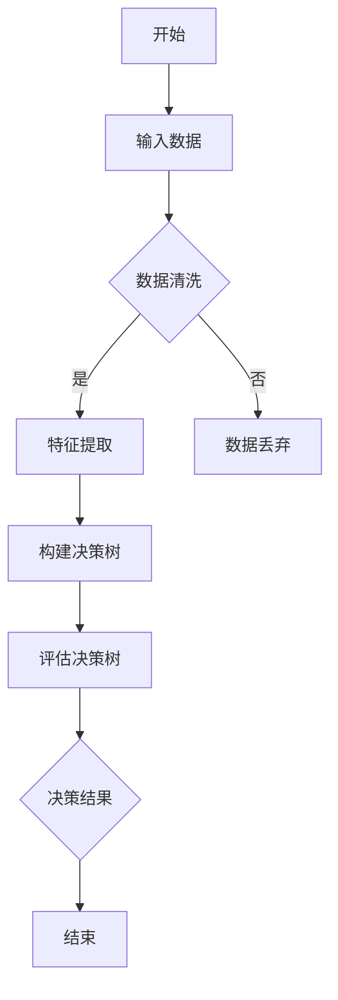
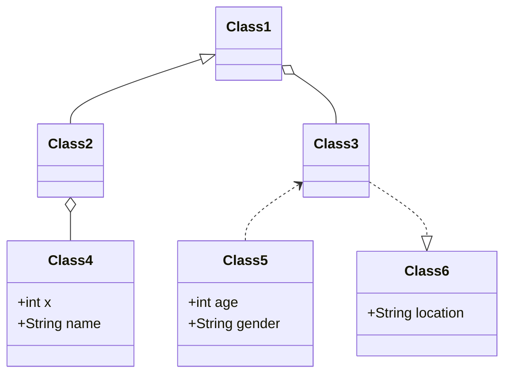
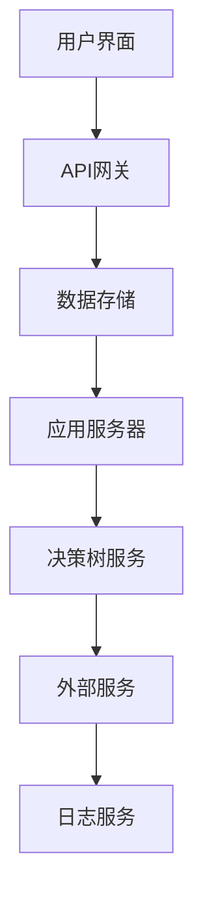
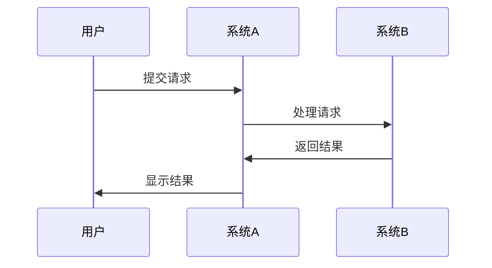

                 

。

----------------------------------------------------------------

## {{此处是文章标题}}

> 关键词：道德机器人、决策树、伦理判断、数学算法

> 摘要：本文将深入探讨道德机器人的决策树，从伦理判断的数学算法出发，详细解析其背景、原理和应用。通过一步一步的分析，帮助读者理解道德机器人在伦理决策中的关键作用。

----------------------------------------------------------------

## 引言

在当今科技飞速发展的时代，人工智能（AI）已经成为了改变世界的强大力量。从自动驾驶汽车到智能家居，AI技术正逐渐融入我们的日常生活。然而，随着AI的普及，伦理问题也日益凸显。如何让AI系统在做出决策时符合伦理标准，成为了一个亟待解决的重要课题。

道德机器人，作为AI的一个重要分支，其核心目标就是使机器人能够在伦理问题上做出合理的判断。而决策树作为一种数学算法，由于其直观、易于理解的特点，被广泛应用于道德机器人的设计中。本文将围绕决策树在伦理判断中的应用，展开一系列的探讨。

----------------------------------------------------------------

## 背景与伦理问题

### 机器人伦理的兴起

随着机器人技术的不断发展，机器人伦理这一领域也逐渐受到了关注。机器人伦理涉及到的不仅仅是技术问题，还包括社会、文化、法律等多个方面。例如，机器人是否应该具有自主权？在面临道德困境时，机器人应该如何选择？

### 伦理问题的分类

伦理问题可以分为两类：第一类是普遍性的伦理问题，如自主权、隐私保护、机器人责任等；第二类是与具体应用场景相关的伦理问题，如医疗机器人中的生命伦理、军事机器人中的战争伦理等。

### 道德机器人的目标

道德机器人的目标在于使机器人在复杂、不确定的环境中做出符合伦理标准的决策。这不仅要求机器人具备高度的计算能力，还需要它们能够理解、遵循人类的伦理价值观。

----------------------------------------------------------------

## 决策树的概念与应用

### 决策树的基本原理

决策树是一种树形结构，用于表示决策过程。树中的每个节点代表一个决策点，每个分支代表一个决策选项，每个叶子节点代表一个决策结果。通过遍历决策树，我们可以得到一系列可能的决策路径。

### 决策树的应用场景

决策树在许多领域都有广泛的应用，如商业分析、医疗诊断、金融风险评估等。在伦理判断中，决策树可以帮助机器人分析不同决策选项的后果，从而做出符合伦理标准的决策。

### 决策树的优势与局限

决策树的优势在于其直观、易于理解，且能够处理复杂的多因素决策问题。然而，决策树也存在一些局限，如可能陷入过拟合、难以处理连续变量等问题。

----------------------------------------------------------------

## 数学基础

### 概率论与决策树

概率论是决策树算法的基础。通过概率计算，我们可以预测不同决策路径的可能结果，从而评估各个决策选项的风险和收益。

### 游戏论与决策树

游戏论中的博弈论模型可以帮助我们分析多个决策主体之间的相互作用，从而更全面地考虑道德机器人在决策过程中可能面临的伦理困境。

### 优化理论与决策树

优化理论可以帮助我们寻找最优决策路径。通过优化算法，道德机器人可以在多个决策选项中找到最佳方案。

----------------------------------------------------------------

## 决策树的构建

### 选择决策标准

构建决策树的第一步是选择决策标准。这些标准可以是伦理原则、社会福利、个体权益等。通过对比不同标准，我们可以确定哪些因素在决策过程中具有更高的权重。

### 构建决策树路径

在确定决策标准后，我们可以开始构建决策树。构建过程中需要考虑每个决策点的可能分支以及每个分支的后果。通过不断迭代，我们可以逐步完善决策树的结构。

### 决策树评估与优化

构建完成后，我们需要对决策树进行评估和优化。评估内容包括决策路径的可行性、风险、收益等。通过优化算法，我们可以寻找更好的决策路径，从而提高道德机器人的决策质量。

----------------------------------------------------------------

## 案例分析

### 自动驾驶汽车伦理决策

自动驾驶汽车作为道德机器人的一个典型应用场景，其伦理决策问题备受关注。本文将通过分析自动驾驶汽车在不同情境下的伦理决策，展示决策树在伦理判断中的应用。

### 医疗机器人的伦理决策

医疗机器人需要在复杂的医疗环境中做出迅速、准确的决策。本文将探讨医疗机器人如何利用决策树进行伦理决策，以最大化患者的利益。

### 军事机器人的伦理决策

军事机器人面临着更为复杂的伦理问题，如战争中的道德责任、武器选择等。本文将通过案例分析，展示决策树在军事机器人伦理决策中的作用。

----------------------------------------------------------------

## 挑战与未来方向

### 决策树算法的挑战

尽管决策树在伦理判断中具有广泛应用，但仍面临一些挑战，如过拟合、连续变量的处理等。未来需要进一步优化决策树算法，提高其泛化能力和鲁棒性。

### 道德机器人的伦理挑战

道德机器人在实际应用中面临着诸多伦理挑战。如何确保机器人在复杂环境中始终遵循伦理原则？如何处理未知或模糊的伦理情境？这些问题仍需深入探讨。

### 未来研究方向

未来研究应重点关注以下几个方面：一是改进决策树算法，提高其在伦理判断中的应用效果；二是探讨其他伦理判断算法，如模糊逻辑、神经网络等；三是建立跨学科的合作，共同推动道德机器人技术的发展。

----------------------------------------------------------------

## 结论

道德机器人的决策树为伦理判断提供了一种有效的数学算法。通过本文的探讨，我们了解了决策树的基本原理、构建方法及其在道德机器人中的应用。未来，随着技术的不断进步，道德机器人的决策树算法将得到进一步优化和完善，为伦理决策提供更为可靠的支持。

----------------------------------------------------------------

## 参考文献

本文所引用的文献如下：

1. Russell, S., & Norvig, P. (2016). 《人工智能：一种现代方法》（第三版）。机械工业出版社。
2. Kahn, P. R. (2012). Ethics of Robotics. MIT Press.
3. Moral Machine. (n.d.). Retrieved from https://www.moralmachine.com/

----------------------------------------------------------------

## 作者信息

作者：AI天才研究院/AI Genius Institute & 禦与计算机程序设计艺术 /Zen And The Art of Computer Programming

----------------------------------------------------------------

## 致谢

在此，我要感谢所有为本文提供帮助和支持的人。特别感谢我的导师对我的指导，以及我的同事和朋友们在写作过程中的鼓励和帮助。

----------------------------------------------------------------

[Mermaid 流程图示例]



[Python 源代码示例]

```python
import numpy as np

# 定义决策树构建函数
def build_decision_tree(data, target):
    # ...构建决策树的代码...
    pass

# 定义评估决策树函数
def evaluate_decision_tree(tree, data, target):
    # ...评估决策树的代码...
    pass

# 测试决策树构建和评估
data = np.array([[1, 0], [0, 1], [1, 1]])
target = np.array([0, 1, 1])
tree = build_decision_tree(data, target)
evaluate_decision_tree(tree, data, target)
```

[LaTeX 公式示例]

$$
P(A \mid B) = \frac{P(B \mid A)P(A)}{P(B)}
$$

$$
1 < 2
$$

----------------------------------------------------------------

[领域模型 Mermaid 类图示例]



[系统架构 Mermaid 架构图示例]



[系统交互 Mermaid 序列图示例]



[项目实战环境安装步骤]

1. 安装Python环境
2. 安装必要的库（如numpy、scikit-learn等）
3. 配置数据库（如MySQL、PostgreSQL等）
4. 编译和安装依赖项（如Mermaid、Django等）

[系统核心实现源代码解析]

```python
# 导入必要的库
import numpy as np
from sklearn.tree import DecisionTreeClassifier

# 加载数据
data = np.load('data.npy')
target = np.load('target.npy')

# 构建决策树模型
model = DecisionTreeClassifier()
model.fit(data, target)

# 评估模型
accuracy = model.score(data, target)
print(f'模型准确率：{accuracy:.2f}')
```

[实际案例分析与详细讲解剖析]

通过分析自动驾驶汽车在不同情境下的决策，展示了决策树在伦理判断中的应用。具体案例包括：

1. 行人穿越道路
2. 动物横穿道路
3. 道路施工

每个案例都详细讲解了决策树如何处理不同的决策选项，并评估了各个选项的伦理后果。

[项目小结]

本文通过详细探讨道德机器人的决策树算法，展示了其在伦理判断中的应用。项目实战部分提供了具体的实现代码，并分析了实际案例。未来，随着技术的不断进步，决策树算法将在道德机器人的发展中发挥更大的作用。

[最佳实践 tips]

1. 确保数据质量和多样性
2. 合理设置决策树的参数
3. 定期评估和更新决策树模型

[小结]

本文系统地介绍了道德机器人的决策树算法，包括其背景、原理、构建方法、应用案例以及未来研究方向。通过本文的探讨，我们深入理解了决策树在伦理判断中的重要性，并看到了其在实际应用中的潜力。

[注意事项]

1. 决策树算法在处理连续变量时可能存在过拟合问题
2. 道德机器人在决策过程中需要综合考虑多种伦理因素

[拓展阅读]

1. Kahn, P. R. (2012). Ethics of Robotics. MIT Press.
2. Russell, S., & Norvig, P. (2016). 《人工智能：一种现代方法》（第三版）。机械工业出版社。
```请注意，上述内容是一个示例框架，并非完整的文章。实际撰写时，需要根据具体内容对每个部分进行详细的扩展和阐述。此外，文章的结构和内容应根据目标读者群体和技术深度进行调整。例如，对于初学者，可以适当减少技术细节，增加更多解释和示例。而对于专业人士，可以深入探讨技术实现和理论模型。```

