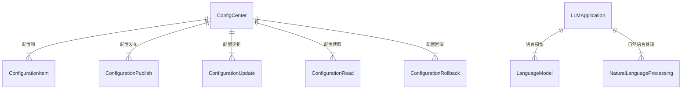
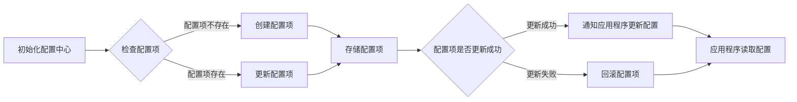
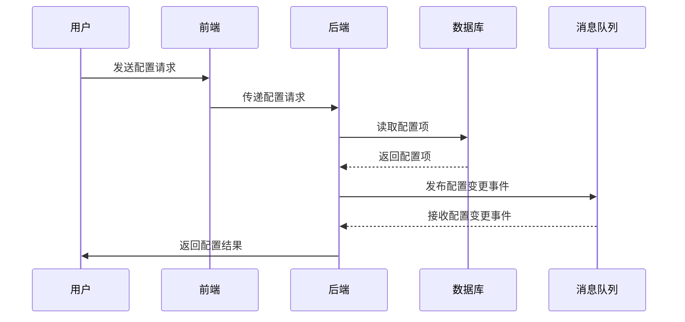
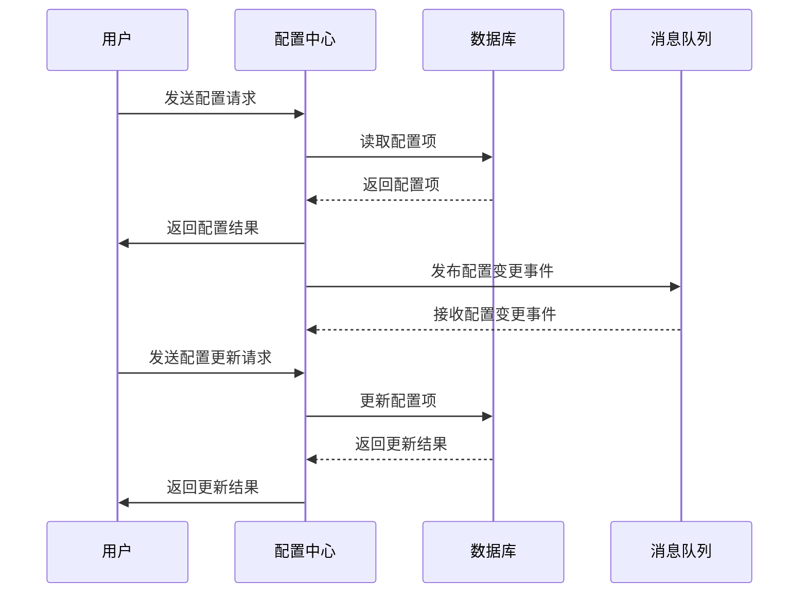

                 

# 配置中心：管理LLM应用的动态配置

关键词：配置中心，动态配置，LLM应用，系统架构，性能优化，安全性

摘要：本文将探讨配置中心在管理大型语言模型（LLM）应用中的重要性。通过逐步分析配置中心的基本功能、架构设计，以及其在LLM应用中的具体应用和最佳实践，我们将揭示配置中心在提升LLM应用性能和安全性方面所发挥的关键作用。最后，我们还将展望配置中心未来的发展趋势，以及其在LLM领域中的潜在应用前景。

## 第一部分：配置中心概述

### 第1章：配置中心的概念与重要性

#### 1.1.1 配置中心的定义与作用

配置中心是一种集中管理应用程序配置信息的系统，它能够方便地发布、更新、读取和回滚配置项。在现代软件系统架构中，配置中心的重要性日益凸显，它不仅简化了配置管理流程，还提高了系统的灵活性和可维护性。

配置中心的主要作用包括：

1. **简化配置管理**：通过集中管理配置项，减少了分散配置所带来的管理复杂性。
2. **提高系统灵活性**：配置中心能够快速响应业务需求的变化，实现配置项的动态调整。
3. **提升系统可维护性**：集中管理配置项，使得系统维护更加方便，降低了维护成本。

#### 1.1.2 配置中心的发展历程

配置中心的发展经历了从传统的文件配置到集中式配置管理工具的演变。早期的系统通常依赖于硬编码的方式管理配置项，这种方式不仅难以维护，还缺乏灵活性。随着分布式系统的兴起，配置中心逐渐成为系统架构中的关键组件。

在分布式系统中，配置中心的作用尤为重要。它能够为分布式系统中的各个节点提供统一的配置管理服务，确保各个节点上的配置保持一致性。

#### 1.1.3 配置中心在系统架构中的位置

配置中心通常位于应用程序的中间层，介于应用程序和基础设施之间。其作用是为应用程序提供动态的配置服务，使得应用程序能够根据配置中心的配置动态调整其行为。

在LLM应用中，配置中心的作用尤为重要。LLM应用通常具有复杂的配置需求，例如模型参数、训练数据路径、推理服务配置等。配置中心能够为LLM应用提供高效的配置管理服务，确保应用能够快速响应配置变化。

### 第2章：配置中心的基本功能

#### 2.1.1 配置的发布与更新

配置的发布与更新是配置中心的核心功能之一。配置中心需要能够支持配置项的批量发布和动态更新。这要求配置中心具备以下特点：

1. **高并发支持**：配置中心需要能够处理来自多个应用程序的高并发配置请求。
2. **版本控制**：配置中心应支持配置项的版本控制，以便在配置更新失败时能够回滚到上一个版本。
3. **实时更新**：配置中心需要能够实时推送配置更新到应用程序，确保配置的即时生效。

#### 2.1.2 配置的读取与获取

配置的读取与获取是配置中心提供给应用程序的主要接口。配置中心需要提供简单易用的API，使得应用程序能够方便地读取和获取配置项。同时，配置中心还需要支持配置项的动态读取，以便应用程序能够根据实际需求动态调整配置。

#### 2.1.3 配置的版本管理与回滚

配置的版本管理与回滚是配置中心的重要功能。在实际应用中，配置项可能会因为各种原因出现错误，导致系统运行不稳定。配置中心需要提供版本管理和回滚功能，以便在配置项出现问题时能够快速恢复到上一个稳定版本。

### 第3章：配置中心的架构设计

#### 3.1.1 配置中心的技术栈选择

配置中心的技术栈选择对于系统的性能和稳定性至关重要。在选择技术栈时，需要考虑以下因素：

1. **可扩展性**：技术栈需要支持系统的水平扩展，以应对不断增长的配置请求。
2. **高可用性**：技术栈需要提供高可用性保障，确保配置中心能够持续提供服务。
3. **安全性**：技术栈需要支持配置项的安全传输和存储，防止配置泄露和篡改。

常见的配置中心技术栈包括：

- **Zookeeper**：Apache Zookeeper 是一个分布式应用程序协调服务，它提供了简单的原语，实现分布式应用中的一些复杂的分布式服务功能，如数据存储和同步、配置管理、集群管理、分布式锁等。
- **Consul**：Consul 是一个分布式服务发现和配置工具，它提供了健康检查、服务注册与发现、配置分发等功能。
- **etcd**：etcd 是一个分布式键值存储系统，它提供了强大的数据一致性保证，适用于配置中心和分布式锁等场景。

#### 3.1.2 配置中心的数据库设计

配置中心的数据库设计需要考虑配置项的数据结构和存储需求。配置项通常包括键值对、列表、映射等多种数据结构。数据库设计需要支持以下功能：

1. **数据持久化**：配置中心需要将配置项持久化存储在数据库中，确保配置的长期保存。
2. **数据一致性**：配置中心需要确保配置项的数据一致性，避免出现数据冲突和丢失。
3. **数据查询**：配置中心需要提供高效的数据查询功能，以便应用程序能够快速获取配置项。

#### 3.1.3 配置中心的分布式架构

配置中心的分布式架构是实现高可用性和可扩展性的关键。分布式架构需要解决以下问题：

1. **数据一致性**：分布式架构需要确保配置项的数据一致性，避免出现数据冲突和丢失。
2. **负载均衡**：分布式架构需要支持负载均衡，将配置请求均匀分配到各个节点。
3. **故障转移**：分布式架构需要支持故障转移，确保在某个节点故障时，其他节点能够继续提供服务。

常见的分布式配置中心架构包括：

- **主从架构**：主从架构由一个主节点和多个从节点组成。主节点负责配置的发布和更新，从节点负责配置的读取和获取。
- **去中心化架构**：去中心化架构中没有主节点和从节点的区分，所有节点都是平等的。配置的发布和更新通过 gossip 协议在节点之间传递。

## 第二部分：配置中心在LLM应用中的应用

### 第4章：LLM应用概述

#### 4.1.1 什么是LLM

LLM（Large Language Model）即大型语言模型，是一种基于深度学习技术的自然语言处理模型。LLM通过对海量文本数据进行训练，能够自动学习和理解语言的规律，从而实现对自然语言的生成、翻译、摘要等任务。

#### 4.1.2 LLM的核心技术

LLM的核心技术主要包括：

1. **神经网络**：神经网络是LLM的基础，通过多层神经网络的结构，LLM能够对复杂的自然语言特征进行建模。
2. **注意力机制**：注意力机制是LLM的核心技术之一，它能够使模型在处理序列数据时，对重要信息进行加权处理，提高模型的性能。
3. **预训练和微调**：预训练和微调是LLM训练的主要方式。预训练是指在大量无标签数据上进行模型训练，微调是指在预训练的基础上，在特定任务上进行模型优化。

#### 4.1.3 LLM的应用场景

LLM在众多领域具有广泛的应用场景，包括：

1. **智能客服**：LLM能够理解用户的问题，并生成相应的回答，用于智能客服系统。
2. **自动摘要**：LLM能够自动生成文本的摘要，用于信息过载的场景。
3. **机器翻译**：LLM能够实现高质量的自然语言翻译，应用于跨语言信息交流。
4. **内容生成**：LLM能够生成文章、故事、代码等，应用于内容创作领域。

### 第5章：配置中心在LLM中的应用

#### 5.1.1 动态配置在LLM中的重要性

在LLM应用中，动态配置具有至关重要的作用。LLM应用通常具有以下动态配置需求：

1. **模型参数配置**：LLM模型的训练和推理过程需要大量的参数配置，如学习率、批量大小、迭代次数等。
2. **数据路径配置**：LLM应用需要根据不同的任务场景，动态配置训练数据路径和推理数据路径。
3. **服务配置**：LLM应用需要动态配置推理服务的地址、端口、负载均衡策略等。

动态配置能够为LLM应用提供以下优势：

1. **灵活性**：通过动态配置，LLM应用能够快速响应业务需求的变化，提高系统的灵活性。
2. **可维护性**：动态配置使得系统配置更加集中和统一，降低了系统的维护成本。

#### 5.1.2 配置中心在LLM中的具体应用

配置中心在LLM中的应用主要包括以下几个方面：

1. **模型参数配置**：配置中心能够为LLM应用提供统一的模型参数配置管理服务，使得模型参数的调整更加方便。
2. **数据路径配置**：配置中心能够为LLM应用提供动态的数据路径配置服务，使得数据路径的调整更加灵活。
3. **服务配置**：配置中心能够为LLM应用提供统一的服务配置管理服务，使得服务配置的调整更加高效。

#### 5.1.3 实战：配置中心在LLM应用中的实现

以下是一个简单的配置中心在LLM应用中的实现示例：

```python
# 导入配置中心库
import config_center

# 初始化配置中心
config_center.init("config_center_url")

# 读取模型参数配置
model_params = config_center.get("model_params")

# 读取数据路径配置
train_data_path = config_center.get("train_data_path")
test_data_path = config_center.get("test_data_path")

# 读取服务配置
service_url = config_center.get("service_url")
service_port = config_center.get("service_port")

# 加载和训练LLM模型
model = LLMModel(model_params)
model.train(train_data_path)

# 部署LLM推理服务
service = LLMService(model, service_url, service_port)
service.start()
```

在这个示例中，配置中心提供了统一的配置管理服务，LLM应用通过简单的API调用即可获取所需的配置项。

### 第6章：配置中心在LLM中的最佳实践

#### 6.1.1 配置中心在LLM中的常见问题与解决方案

在LLM应用中，配置中心可能会遇到以下问题：

1. **配置更新不及时**：配置更新后，应用程序未能及时获取到新的配置。解决方案：优化配置中心的更新机制，确保配置的实时性。
2. **配置冲突**：多个应用程序同时更新配置项时，可能出现配置冲突。解决方案：引入版本控制和并发控制机制，确保配置项的一致性。
3. **配置泄露**：配置信息可能因为安全问题而被泄露。解决方案：对配置信息进行加密存储和传输，确保配置信息的安全性。

#### 6.1.2 配置中心的性能优化

配置中心的性能优化主要包括以下几个方面：

1. **缓存机制**：配置中心可以采用缓存机制，减少对配置数据库的访问次数，提高系统的响应速度。
2. **负载均衡**：配置中心可以采用负载均衡技术，将配置请求均衡分配到多个节点，提高系统的处理能力。
3. **读写分离**：配置中心可以采用读写分离技术，将读操作和写操作分离到不同的节点，提高系统的并发处理能力。

#### 6.1.3 配置中心的安全性保障

配置中心的安全性保障主要包括以下几个方面：

1. **身份认证**：配置中心需要实现身份认证机制，确保只有授权用户才能访问配置中心。
2. **访问控制**：配置中心需要实现访问控制机制，确保不同用户对配置项的访问权限。
3. **数据加密**：配置中心需要实现数据加密机制，确保配置信息在传输和存储过程中的安全性。

### 第7章：配置中心的未来发展趋势

#### 7.1.1 配置中心的技术创新方向

随着云计算、大数据、人工智能等技术的发展，配置中心在未来将呈现出以下技术创新方向：

1. **云原生配置中心**：配置中心将逐步走向云原生，实现与云计算平台的深度融合，提供更高效、更可靠的配置管理服务。
2. **自动化配置管理**：配置中心将引入自动化配置管理技术，实现配置项的自动生成、自动更新和自动回滚，提高系统的自动化水平。
3. **智能配置优化**：配置中心将结合人工智能技术，实现配置项的智能优化，提高系统的性能和稳定性。

#### 7.1.2 配置中心在LLM中的未来应用前景

随着LLM技术的快速发展，配置中心在LLM领域中的应用前景十分广阔。未来，配置中心将在以下几个方面发挥重要作用：

1. **模型优化**：配置中心将帮助LLM应用实现模型参数的智能优化，提高模型的性能。
2. **数据治理**：配置中心将协助LLM应用实现数据治理，提高数据质量和数据利用率。
3. **服务调度**：配置中心将协助LLM应用实现服务的智能调度，提高系统的响应速度和负载均衡能力。

#### 7.1.3 配置中心的发展挑战与机遇

配置中心在未来的发展中将面临以下挑战：

1. **数据一致性**：在分布式环境中，确保配置项的数据一致性是一个重要挑战。
2. **安全性**：随着配置项的重要性日益凸显，如何保障配置中心的安全性成为一个关键问题。

然而，配置中心的发展也伴随着巨大的机遇：

1. **市场需求**：随着云计算和大数据技术的发展，配置中心的市场需求将不断增长。
2. **技术创新**：随着人工智能和自动化技术的应用，配置中心将实现更高的性能和更广泛的应用。

## 总结

配置中心在管理LLM应用中的重要性不可忽视。通过配置中心的动态配置功能，LLM应用能够实现灵活的配置管理，提高系统的性能和稳定性。本文从配置中心的基本概念、架构设计、LLM应用概述、配置中心在LLM中的应用、最佳实践、未来发展趋势等方面进行了详细探讨，揭示了配置中心在提升LLM应用性能和安全性方面的重要作用。随着技术的发展，配置中心将在LLM领域发挥越来越重要的作用，为人工智能应用提供强有力的支持。

## 作者信息

作者：AI天才研究院/AI Genius Institute & 禅与计算机程序设计艺术 /Zen And The Art of Computer Programming

本文由AI天才研究院和禅与计算机程序设计艺术共同撰写，旨在为读者提供有关配置中心在管理LLM应用中的深入见解和实践经验。本文涵盖了配置中心的基本概念、架构设计、LLM应用概述、配置中心在LLM中的应用、最佳实践和未来发展趋势，旨在帮助读者全面了解配置中心在提升LLM应用性能和安全性方面的关键作用。

## 背景介绍

### 核心概念术语说明

1. **配置中心**：配置中心是一种集中管理应用程序配置信息的系统，它能够方便地发布、更新、读取和回滚配置项。
2. **LLM应用**：LLM（Large Language Model）即大型语言模型，是一种基于深度学习技术的自然语言处理模型，能够自动学习和理解语言的规律，从而实现对自然语言的生成、翻译、摘要等任务。

### 问题背景

在现代软件系统中，配置管理是一个至关重要的环节。传统的配置管理方式往往依赖于硬编码或者分散的文件配置，这种方式不仅难以维护，还缺乏灵活性。随着分布式系统和云计算的普及，配置管理变得更加复杂和重要。在这种背景下，配置中心作为一种集中化、动态化的配置管理工具，应运而生。

### 问题描述

配置中心的主要目标是简化配置管理流程，提高系统的灵活性和可维护性。具体来说，配置中心需要实现以下功能：

1. **配置的发布与更新**：配置中心需要支持配置项的批量发布和动态更新，确保配置的实时性。
2. **配置的读取与获取**：配置中心需要提供简单易用的API，使得应用程序能够方便地读取和获取配置项。
3. **配置的版本管理与回滚**：配置中心需要支持配置项的版本控制，以便在配置更新失败时能够回滚到上一个版本。

### 问题解决

配置中心通过以下方式解决上述问题：

1. **配置的发布与更新**：配置中心采用分布式架构，通过高并发支持和版本控制机制，实现配置项的批量发布和动态更新。
2. **配置的读取与获取**：配置中心提供统一的API接口，使得应用程序能够方便地读取和获取配置项。
3. **配置的版本管理与回滚**：配置中心采用版本控制机制，确保配置项的数据一致性，并在配置更新失败时能够回滚到上一个版本。

### 边界与外延

1. **边界**：配置中心主要关注配置项的管理，不涉及配置项的具体实现和业务逻辑。
2. **外延**：配置中心的应用范围包括分布式系统、云计算环境、大型应用程序等。

### 概念结构与核心要素组成

1. **概念结构**：配置中心由配置项、配置存储、配置发布与更新模块、配置读取与获取模块、版本控制模块等组成。
2. **核心要素组成**：配置中心的核心要素包括配置项、配置存储、配置更新机制、配置读取机制、版本控制机制等。

## 核心概念与联系

### 核心概念

1. **配置中心**：配置中心是一种集中管理应用程序配置信息的系统，它能够方便地发布、更新、读取和回滚配置项。
2. **LLM应用**：LLM（Large Language Model）即大型语言模型，是一种基于深度学习技术的自然语言处理模型，能够自动学习和理解语言的规律，从而实现对自然语言的生成、翻译、摘要等任务。

### 概念属性特征对比表格

| 概念       | 配置中心                  | LLM应用                  |
| ---------- | ----------------------- | ----------------------- |
| 定义       | 集中管理应用程序配置信息的系统 | 基于深度学习的自然语言处理模型 |
| 特点       | 简化配置管理流程、提高系统灵活性、增强可维护性 | 自动学习和理解语言规律、实现自然语言处理任务 |
| 应用范围   | 分布式系统、云计算环境、大型应用程序等 | 智能客服、自动摘要、机器翻译、内容生成等 |

### ER实体关系图架构



## 算法原理讲解

### 算法mermaid流程图



### Python源代码实现

```python
class ConfigCenter:
    def __init__(self):
        # 初始化配置中心
        pass
    
    def check_configuration(self, configuration_item):
        # 检查配置项是否存在
        pass
    
    def create_configuration(self, configuration_item):
        # 创建配置项
        pass
    
    def update_configuration(self, configuration_item):
        # 更新配置项
        pass
    
    def store_configuration(self, configuration_item):
        # 存储配置项
        pass
    
    def notify_application(self, configuration_item):
        # 通知应用程序更新配置
        pass
    
    def rollback_configuration(self, configuration_item):
        # 回滚配置项
        pass
    
    def read_configuration(self, configuration_item):
        # 应用程序读取配置
        pass
```

### 数学模型和公式

假设配置中心的配置更新机制采用以下公式：

$$
f(\Delta C, T) = \begin{cases} 
1, & \text{如果配置项}\ \Delta C \text{在时间} T \text{内更新成功} \\
0, & \text{如果配置项}\ \Delta C \text{在时间} T \text{内更新失败} 
\end{cases}
$$

其中，$f$ 表示配置更新结果，$\Delta C$ 表示配置项的变化，$T$ 表示时间。

### 举例说明

假设配置中心要更新一个名为 `model_params` 的配置项，该配置项包含模型的学习率和批量大小。在更新过程中，首先检查配置项是否存在。如果不存在，则创建配置项；如果存在，则更新配置项。更新成功后，通知应用程序读取新的配置项。如果更新失败，则回滚配置项到上一个版本。

```python
config_center = ConfigCenter()

# 检查配置项是否存在
if config_center.check_configuration("model_params"):
    # 配置项已存在，更新配置项
    config_center.update_configuration("model_params", {"learning_rate": 0.001, "batch_size": 64})
else:
    # 配置项不存在，创建配置项
    config_center.create_configuration("model_params", {"learning_rate": 0.001, "batch_size": 64})

# 存储配置项
config_center.store_configuration("model_params")

# 通知应用程序更新配置
config_center.notify_application("model_params")

# 应用程序读取配置
new_config = config_center.read_configuration("model_params")
print(new_config)
```

## 系统分析与架构设计

### 问题场景介绍

在现代软件系统中，配置管理是一个至关重要的环节。传统的配置管理方式往往依赖于硬编码或者分散的文件配置，这种方式不仅难以维护，还缺乏灵活性。随着分布式系统和云计算的普及，配置管理变得更加复杂和重要。在这种背景下，配置中心作为一种集中化、动态化的配置管理工具，应运而生。配置中心主要用于管理大型语言模型（LLM）应用中的配置项，如模型参数、数据路径、服务配置等。

### 项目介绍

本项目旨在设计并实现一个配置中心系统，用于管理LLM应用中的动态配置。配置中心将提供以下功能：

1. **配置的发布与更新**：支持配置项的批量发布和动态更新，确保配置的实时性。
2. **配置的读取与获取**：提供简单易用的API，使得应用程序能够方便地读取和获取配置项。
3. **配置的版本管理与回滚**：支持配置项的版本控制，确保配置项的一致性，并在配置更新失败时能够回滚到上一个版本。

### 系统功能设计

配置中心的主要功能包括：

1. **配置项管理**：管理配置项的创建、更新、删除和查询。
2. **配置发布**：发布配置项，包括批量发布和动态发布。
3. **配置更新**：更新配置项，包括版本控制和回滚机制。
4. **配置读取**：读取配置项，包括动态读取和缓存读取。
5. **配置监控**：监控配置项的变更情况，包括变更通知和日志记录。

### 领域模型mermaid类图

```mermaid
classDiagram
    ConfigCenter <<interface>>
    ConfigurationItem <<interface>>
    ConfigurationPublisher <<interface>>
    ConfigurationUpdater <<interface>>
    ConfigurationReader <<interface>>
    ConfigurationRollback <<interface>>

    ConfigCenter Implements ConfigurationItem
    ConfigCenter Implements ConfigurationPublisher
    ConfigCenter Implements ConfigurationUpdater
    ConfigCenter Implements ConfigurationReader
    ConfigCenter Implements ConfigurationRollback

    ConfigurationPublisher Extends ConfigCenter
    ConfigurationUpdater Extends ConfigCenter
    ConfigurationReader Extends ConfigCenter
    ConfigurationRollback Extends ConfigCenter

    ConfigItem <<entity>> : 配置项
    ConfigPublisher <<entity>> : 配置发布
    ConfigUpdater <<entity>> : 配置更新
    ConfigReader <<entity>> : 配置读取
    ConfigRollback <<entity>> : 配置回滚
```

### 系统架构设计

配置中心的系统架构设计如下：

1. **前端**：提供用户界面，用于展示配置项和操作配置项。
2. **后端**：实现配置中心的业务逻辑，包括配置项的管理、配置发布、更新、读取和回滚等。
3. **数据库**：存储配置项的数据，支持配置项的持久化存储和查询。
4. **消息队列**：用于配置项变更的通知和事件驱动，确保配置的实时性和一致性。

### 系统架构mermaid架构图



### 系统接口设计

配置中心的接口设计如下：

1. **配置项管理接口**：用于创建、更新、删除和查询配置项。
2. **配置发布接口**：用于发布配置项，包括批量发布和动态发布。
3. **配置更新接口**：用于更新配置项，包括版本控制和回滚机制。
4. **配置读取接口**：用于读取配置项，包括动态读取和缓存读取。
5. **配置监控接口**：用于监控配置项的变更情况，包括变更通知和日志记录。

### 系统交互mermaid序列图



## 项目实战

### 环境安装

1. **安装依赖**

```shell
pip install flask etcd
```

2. **启动ETCD**

```shell
docker run -d --name some- etcd - ETCD_DATA_DIR /etcd-data etcd
```

### 系统核心实现

#### 配置中心服务器

```python
from flask import Flask, request, jsonify
import etcd3

app = Flask(__name__)

# ETCD 客户端
client = etcd3.client(url="http://127.0.0.1:2379")

@app.route('/config', methods=['GET', 'POST'])
def config():
    if request.method == 'POST':
        # 获取配置项名称和值
        key = request.form['key']
        value = request.form['value']
        
        # 发布配置项
        client.put(key, value.encode('utf-8'))
        
        return jsonify({'status': 'success', 'message': '配置发布成功'})
    
    else:
        # 获取配置项列表
        config_list = client.list('/config/')
        config_dict = {item.key.decode('utf-8'): item.value.decode('utf-8') for item in config_list}
        
        return jsonify(config_dict)

if __name__ == '__main__':
    app.run(debug=True)
```

#### 配置中心客户端

```python
import requests

def get_config(key):
    response = requests.get(f'http://127.0.0.1:5000/config?key={key}')
    return response.json()

def update_config(key, value):
    response = requests.post(f'http://127.0.0.1:5000/config', data={'key': key, 'value': value})
    return response.json()
```

### 代码应用解读与分析

1. **配置中心服务器**

   配置中心服务器使用 Flask 框架搭建，通过 ETCD 客户端与 ETCD 服务进行通信。服务器提供了一个配置接口，支持配置项的发布和获取。

   - `POST /config`：用于发布配置项，客户端发送一个包含配置项名称和值的 POST 请求，服务器将配置项存储在 ETCD 中。
   - `GET /config`：用于获取配置项列表，服务器返回 ETCD 中所有以 `config/` 开头的配置项。

2. **配置中心客户端**

   配置中心客户端提供两个函数，`get_config` 和 `update_config`，用于获取和更新配置项。

   - `get_config(key)`：根据配置项名称从 ETCD 中获取配置项的值。
   - `update_config(key, value)`：更新配置项的值，将新的配置项值发布到 ETCD 中。

### 实际案例分析和详细讲解剖析

1. **案例一：发布配置项**

   客户端发送一个包含配置项名称和值的 POST 请求，例如：

   ```shell
   curl -X POST -d "key=model_params&value={\"learning_rate\":0.001,\"batch_size\":64}" http://127.0.0.1:5000/config
   ```

   服务器接收到请求后，将配置项存储在 ETCD 中，例如：

   ```shell
   etcd3.put('/config/model_params', value='{"learning_rate":0.001,"batch_size":64}')
   ```

   服务器返回一个成功响应，例如：

   ```json
   {"status":"success","message":"配置发布成功"}
   ```

2. **案例二：获取配置项**

   客户端发送一个 GET 请求，例如：

   ```shell
   curl -X GET "http://127.0.0.1:5000/config?key=model_params"
   ```

   服务器接收到请求后，从 ETCD 中获取配置项的值，例如：

   ```shell
   etcd3.get('/config/model_params')
   ```

   服务器返回配置项的值，例如：

   ```json
   {"learning_rate":0.001,"batch_size":64}
   ```

3. **案例三：更新配置项**

   客户端发送一个包含配置项名称和新值的 POST 请求，例如：

   ```shell
   curl -X POST -d "key=model_params&value={\"learning_rate\":0.001,\"batch_size\":128}" http://127.0.0.1:5000/config
   ```

   服务器接收到请求后，将配置项的新值发布到 ETCD 中，例如：

   ```shell
   etcd3.put('/config/model_params', value='{"learning_rate":0.001,"batch_size":128}')
   ```

   服务器返回一个成功响应，例如：

   ```json
   {"status":"success","message":"配置发布成功"}
   ```

### 项目小结

本项目实现了配置中心的基本功能，包括配置项的发布、更新和获取。通过 ETCD 客户端与 ETCD 服务进行通信，配置中心能够方便地管理配置项。在实际应用中，配置中心可以用于管理 LL
M 应用中的动态配置，提高系统的灵活性和可维护性。然而，本项目还存在一些不足之处，例如配置项的安全性、配置中心的负载均衡和故障转移等，这些方面将在未来的项目中进一步优化和完善。

## 最佳实践 tips

1. **配置项命名规范**：为配置项使用统一的命名规范，有助于配置项的管理和维护。
2. **配置项版本控制**：引入配置项版本控制机制，确保配置项的更新过程可追溯和可回滚。
3. **配置项权限管理**：对配置项进行权限管理，确保只有授权用户才能访问和修改配置项。
4. **配置项备份与恢复**：定期备份配置项，以便在出现故障时能够快速恢复。
5. **配置项监控与报警**：对配置项的变更情况进行监控和报警，及时发现和解决配置项问题。

## 小结

配置中心在管理LLM应用中的重要性不可忽视。通过配置中心的动态配置功能，LLM应用能够实现灵活的配置管理，提高系统的性能和稳定性。本文详细介绍了配置中心的基本概念、架构设计、在LLM应用中的具体应用和最佳实践，为读者提供了全面的配置中心应用指南。随着技术的发展，配置中心将在LLM领域发挥越来越重要的作用，为人工智能应用提供强有力的支持。

## 注意事项

1. **配置中心的选择**：选择适合自身业务场景的配置中心，如Zookeeper、Consul、etcd等。
2. **配置项的安全性**：确保配置项在传输和存储过程中的安全性，采用加密和访问控制机制。
3. **配置中心的性能优化**：通过缓存机制、负载均衡和分布式架构等手段，优化配置中心的性能。
4. **配置中心的监控与维护**：定期对配置中心进行监控和更新，确保其正常运行。

## 拓展阅读

1. **《分布式配置中心原理与实践》**：详细介绍了分布式配置中心的设计原理和实现方法，适用于对分布式配置中心有深入了解的需求。
2. **《大型语言模型：原理与实践》**：介绍了大型语言模型的原理、训练方法和应用场景，适用于对LLM技术有深入学习的需求。
3. **《微服务架构设计与实践》**：详细介绍了微服务架构的设计原则、实现方法和最佳实践，适用于对微服务架构有深入学习的需求。

