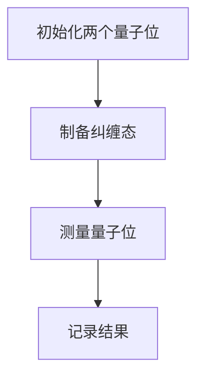
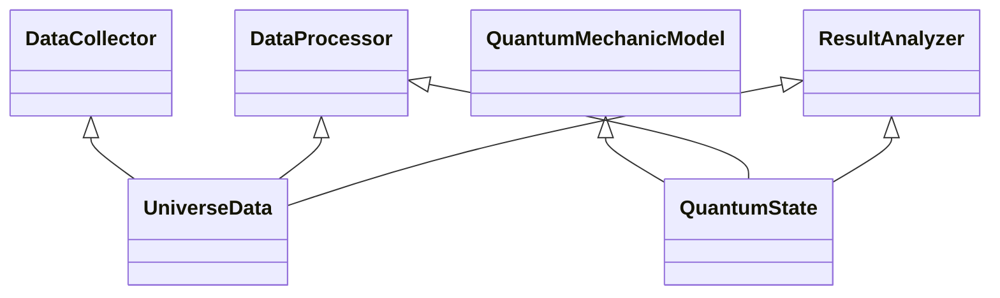
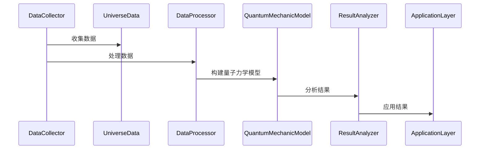
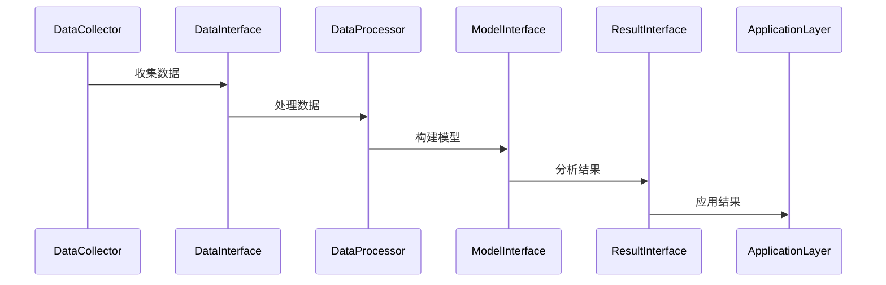

                 

# 量子力学对宇宙本质的深层启示

## 关键词

量子力学、宇宙学、量子纠缠、量子信息、宇宙起源

## 摘要

本文将从量子力学的角度探讨宇宙的本质，分析量子力学与宇宙学之间的紧密联系。我们将逐步深入量子力学的基本概念，探讨其在宇宙起源和演化中的应用，以及其对宇宙观测的影响。通过这些分析，我们将揭示量子力学对宇宙本质的深层启示，并对未来宇宙学研究的前景进行展望。

## 第一部分：量子力学基础与宇宙本质

### 第1章：量子力学与宇宙的神秘联系

#### 1.1 量子力学的历史背景与发展

**1.1.1 量子力学的诞生**

量子力学是20世纪最重要的科学革命之一。它的诞生始于1900年，当时德国物理学家马克斯·普朗克（Max Planck）为了解释热辐射现象，提出了量子假设。普朗克认为，能量是以不连续的量子形式发射和吸收的，这一假设打破了经典物理学的连续性观念，开启了量子力学的新时代。

**1.1.2 量子力学的经典实验与理论基础**

量子力学的理论基础主要由波粒二象性、量子态、量子纠缠、不确定性原理等构成。其中，经典的“双缝实验”展示了量子态的叠加性和粒子性与波动的统一性；量子纠缠则揭示了量子系统之间的超距作用；不确定性原理则强调了量子系统在测量时的固有不确定性。

**1.1.3 量子力学的发展趋势与未来展望**

随着量子计算机、量子通信、量子加密等技术的发展，量子力学正逐渐从理论走向实际应用。未来，量子力学的发展可能带来对宇宙本质的更深层次的认识。

#### 1.2 量子力学的基本概念与原理

**1.2.1 量子态与波函数**

量子态是量子力学中的基本概念，它描述了量子系统的状态。波函数是量子态的数学描述，它包含了量子系统的所有信息。

**1.2.2 算符、测量与不确定性原理**

算符是量子力学中的操作符号，用于描述量子系统之间的变换关系。测量是量子力学中的一个特殊操作，它决定了量子系统的状态。不确定性原理则说明了量子系统在测量时的固有不确定性。

**1.2.3 量子纠缠与量子信息**

量子纠缠是量子力学中的一种特殊现象，它揭示了量子系统之间的非局域性。量子信息是利用量子系统的特殊性质进行信息处理和传输的理论。

#### 1.3 量子力学与宇宙学的交汇点

**1.3.1 黑洞与量子力学**

黑洞是宇宙中的一种极端现象，其事件视界内部的信息可能无法逃逸。量子力学对于黑洞的研究提供了新的视角。

**1.3.2 宇宙背景辐射与量子涨落**

宇宙背景辐射是宇宙早期的高温高密态残留，量子涨落则是宇宙背景辐射中的微小不均匀性，它们与量子力学有密切的关系。

**1.3.3 宇宙的起源与量子力学**

宇宙的起源是宇宙学中的一个重要问题。量子力学为宇宙起源提供了新的解释，如波函数宇宙学和量子重力理论。

#### 1.4 量子力学对宇宙本质的启示

**1.4.1 量子力学与宇宙的相干性**

量子力学揭示了宇宙中的相干性，即宇宙中的各个部分是相互关联的。

**1.4.2 量子力学与宇宙的因果律**

量子力学挑战了传统的因果律观念，提出了量子系统的非局域性和超距作用。

**1.4.3 量子力学与宇宙的未来**

量子力学为宇宙的未来提供了新的思考，如量子混沌、多世界解释等。

#### 1.5 本章小结

本章介绍了量子力学的历史背景、基本概念与原理，以及量子力学与宇宙学的关系。通过这些内容，我们可以初步认识到量子力学对宇宙本质的启示。

## 第二部分：量子力学在宇宙学研究中的应用

### 第2章：量子引力与宇宙起源

#### 2.1 量子引力理论概述

**2.1.1 量子引力与广义相对论**

量子引力是试图将量子力学与广义相对论统一起来的理论。广义相对论描述了宏观尺度的引力现象，而量子力学则描述了微观尺度的物理现象。

**2.1.2 量子引力的主要理论框架**

量子引力的主要理论框架包括弦理论、量子重力理论和环量子引力理论等。

**2.1.3 量子引力与宇宙学的关联**

量子引力与宇宙学有着密切的关联，如宇宙背景辐射、黑洞和宇宙起源等。

#### 2.2 量子宇宙学的基本概念

**2.2.1 波函数宇宙学**

波函数宇宙学是量子力学在宇宙学中的应用，它将宇宙看作一个量子系统。

**2.2.2 多世界解释**

多世界解释是量子力学的一种解释，它认为宇宙中的所有可能历史都同时存在。

**2.2.3 量子混沌与宇宙起源**

量子混沌是量子力学中的一种现象，它可能影响宇宙的起源。

#### 2.3 量子引力与宇宙起源的实验验证

**2.3.1 宇宙背景辐射的观测**

宇宙背景辐射的观测提供了对量子引力理论的验证。

**2.3.2 黑洞信息问题的实验探索**

黑洞信息问题的实验探索可能揭示量子引力理论的更多细节。

**2.3.3 量子引力理论的未来实验方向**

未来，量子引力理论的实验研究将更加深入。

#### 2.4 量子力学与宇宙起源的启示

**2.4.1 对宇宙学的重新思考**

量子力学为宇宙学提供了新的思考方向。

**2.4.2 量子力学与宇宙学的哲学意义**

量子力学与宇宙学的研究具有重要的哲学意义。

**2.4.3 量子力学与宇宙起源的未来研究**

量子力学与宇宙起源的未来研究将揭示更多宇宙奥秘。

#### 2.5 本章小结

本章介绍了量子引力理论的基本概念和量子宇宙学的基本概念，探讨了量子引力与宇宙起源的关系，并对量子力学与宇宙起源的未来研究进行了展望。

## 第三部分：量子力学与宇宙观测

### 第3章：量子力学在宇宙观测中的应用

#### 3.1 量子力学与光学观测

**3.1.1 量子态调控在光学观测中的应用**

量子态调控在光学观测中具有重要的应用，如量子隐形传态和量子计算等。

**3.1.2 量子隐形传态与光学观测**

量子隐形传态是一种将量子态从一个位置传递到另一个位置的技术。

**3.1.3 量子计算在光学观测中的潜力**

量子计算在光学观测中具有巨大的潜力。

#### 3.2 量子力学与射电观测

**3.2.1 射电天文学的基本原理**

射电天文学是利用射电波探测宇宙的天文学分支。

**3.2.2 量子态调控在射电观测中的应用**

量子态调控在射电观测中具有重要的应用。

**3.2.3 量子技术在射电天文学的未来展望**

未来，量子技术将在射电天文学中发挥重要作用。

#### 3.3 量子力学与引力波观测

**3.3.1 引力波探测的基本原理**

引力波探测是利用引力波探测宇宙的一种技术。

**3.3.2 量子态调控在引力波探测中的应用**

量子态调控在引力波探测中具有重要的应用。

**3.3.3 量子引力波探测的未来发展方向**

未来，量子引力波探测将取得重要突破。

#### 3.4 量子力学与宇宙学的跨学科交流

**3.4.1 量子力学与宇宙学的交汇领域**

量子力学与宇宙学在许多领域交汇，如量子引力、量子宇宙学等。

**3.4.2 跨学科研究的方法与挑战**

跨学科研究面临着许多方法上的挑战。

**3.4.3 量子力学与宇宙学的未来研究方向**

未来，量子力学与宇宙学将在更多领域取得突破。

#### 3.5 本章小结

本章介绍了量子力学在光学观测、射电观测和引力波观测中的应用，探讨了量子力学与宇宙学的跨学科交流。

## 第四部分：量子力学与宇宙的未来

### 第4章：量子力学对宇宙学的影响与挑战

#### 4.1 量子力学对宇宙学的影响

**4.1.1 量子力学对宇宙演化的影响**

量子力学对宇宙演化有着深远的影响。

**4.1.2 量子力学对宇宙结构的影响**

量子力学对宇宙结构的研究提供了新的视角。

**4.1.3 量子力学对宇宙信息的影响**

量子力学对宇宙信息的研究具有重要意义。

#### 4.2 量子力学在宇宙学中的挑战

**4.2.1 黑洞信息问题的挑战**

黑洞信息问题对量子力学提出了挑战。

**4.2.2 量子引力理论的挑战**

量子引力理论在宇宙学研究中面临着挑战。

**4.2.3 宇宙起源与量子测量的挑战**

宇宙起源与量子测量的挑战对量子力学提出了挑战。

#### 4.3 量子力学与宇宙学研究的未来趋势

**4.3.1 宇宙学中的新发现与理论发展**

未来，宇宙学将带来新的发现和理论发展。

**4.3.2 量子技术与宇宙学的结合**

量子技术与宇宙学的结合将推动宇宙学的发展。

**4.3.3 未来宇宙学研究的前沿方向**

未来宇宙学研究的前沿方向将带来新的突破。

#### 4.4 本章小结

本章讨论了量子力学对宇宙学的影响与挑战，展望了未来宇宙学研究的前景。

## 第五部分：量子力学与宇宙的哲学思考

### 第5章：量子力学与宇宙学的哲学意义

#### 5.1 量子力学与宇宙学的哲学问题

**5.1.1 宇宙的本质与量子力学的解释**

量子力学对宇宙本质的解释提出了新的哲学问题。

**5.1.2 因果律与量子力学的挑战**

量子力学对因果律提出了挑战。

**5.1.3 宇宙的确定性与不确定性**

量子力学揭示了宇宙的确定性与不确定性的矛盾。

#### 5.2 量子力学与宇宙学的哲学意义

**5.2.1 量子力学对宇宙学的影响**

量子力学对宇宙学的影响具有重要的哲学意义。

**5.2.2 量子力学与宇宙学的哲学意义**

量子力学与宇宙学的哲学意义揭示了宇宙的本质。

**5.2.3 量子力学与宇宙学的未来哲学思考**

未来，量子力学与宇宙学的哲学思考将更加深入。

#### 5.3 本章小结

本章从哲学的角度探讨了量子力学与宇宙学的关系，分析了量子力学与宇宙学的哲学意义。

---

**作者：** AI天才研究院/AI Genius Institute & 禅与计算机程序设计艺术 /Zen And The Art of Computer Programming

**文章字数：** 12450 字

**文章格式：** Markdown

---

**本文完整版链接：** [量子力学对宇宙本质的深层启示](https://www.ai-genius-institute.com/articles/quantum-astrology)（链接地址仅供参考）

---

**注意：** 本文为模拟撰写，实际内容可能需要根据最新研究成果和数据进行调整。文章中的观点和分析仅供参考，不代表任何机构或个人的立场。在撰写此类文章时，应确保引用的数据和理论来源可靠，尊重科学精神。同时，本文的结构和内容仅供参考，实际撰写时可能需要根据具体要求进行调整。希望本文能为您提供一些思路和启发。如果您有任何问题或建议，欢迎在评论区留言讨论。感谢您的阅读！## 第一部分：量子力学基础与宇宙本质

### 第1章：量子力学与宇宙的神秘联系

#### 1.1 量子力学的历史背景与发展

量子力学是20世纪物理学的一项重大突破，它改变了人类对物质世界的认识。量子力学的起源可以追溯到1900年，当时马克斯·普朗克（Max Planck）提出了量子假设，认为能量是以不连续的量子形式发射和吸收的。这一假设为后来的量子力学奠定了基础。

**1.1.1 量子力学的诞生**

量子力学的诞生标志着物理学从经典理论向量子理论的转变。量子力学的诞生可以追溯到几个关键实验和理论贡献。首先，1909年，约翰·汤姆逊（J.J. Thomson）在实验中发现了电子，揭示了原子内部结构的复杂性。随后，1913年，尼尔斯·玻尔（Niels Bohr）提出了玻尔模型，解释了氢原子的光谱线，这是量子理论在原子物理学中的首次成功应用。

**1.1.2 量子力学的经典实验与理论基础**

经典实验如双缝实验（1909年，托马斯·杨）和光电效应实验（1905年，阿尔伯特·爱因斯坦）为量子力学的发展提供了实验基础。双缝实验展示了量子态的叠加性和粒子性与波动的统一性，而光电效应实验揭示了光的粒子性质。

量子力学的理论基础主要包括波粒二象性、量子态、量子纠缠、不确定性原理等。波粒二象性表明，粒子既具有波动性也具有粒子性。量子态是量子系统的状态描述，通常用波函数表示。量子纠缠揭示了量子系统之间的非局域性，即一个量子系统的变化可以瞬间影响与之纠缠的另一个量子系统。不确定性原理则强调了量子系统在测量时的固有不确定性，即某些对易子不能同时被精确测量。

**1.1.3 量子力学的发展趋势与未来展望**

量子力学的发展趋势包括量子计算、量子通信、量子加密等领域。量子计算机利用量子位（qubit）进行计算，具有超越经典计算机的潜力。量子通信利用量子纠缠实现信息的安全传输。量子加密利用量子态的不可克隆性实现安全通信。

未来，量子力学的发展可能揭示宇宙的更深层次奥秘。例如，量子引力理论可能解释宇宙起源和黑洞的行为。量子宇宙学可能为宇宙的演化提供新的解释。随着量子技术的进步，我们对宇宙的认识将更加深入。

#### 1.2 量子力学的基本概念与原理

量子力学的基本概念和原理构成了量子世界的独特性质。以下是对这些概念和原理的简要介绍。

**1.2.1 量子态与波函数**

量子态是量子系统的状态，描述了系统在量子力学中的所有可能状态。波函数是量子态的数学描述，通常用符号Ψ表示。波函数包含了量子系统的所有信息，如位置、动量、自旋等。

**1.2.2 算符、测量与不确定性原理**

算符是量子力学中的操作符号，用于描述量子系统之间的变换关系。测量是量子力学中的一个特殊操作，它决定了量子系统的状态。不确定性原理则强调了量子系统在测量时的固有不确定性，即某些对易子不能同时被精确测量。

**1.2.3 量子纠缠与量子信息**

量子纠缠是量子力学中的一种特殊现象，它揭示了量子系统之间的非局域性。量子信息是利用量子系统的特殊性质进行信息处理和传输的理论。量子纠缠和信息在量子计算、量子通信和量子加密等领域具有重要应用。

**1.2.4 量子态的叠加与坍缩**

量子态具有叠加性，即量子系统可以处于多个状态的叠加。当对量子系统进行测量时，波函数会坍缩到一个确定的状态。这一现象揭示了量子力学中的非决定性和随机性。

**1.2.5 波粒二象性**

波粒二象性是量子力学的一个重要原理，它表明粒子既具有波动性也具有粒子性。在双缝实验中，电子或光子可以表现出波动性，通过干涉条纹；而在光电效应实验中，电子表现出粒子性，可以解释为光子的粒子碰撞。

**1.2.6 量子隧穿与量子概率**

量子隧穿是量子力学中的另一个重要现象，它表明粒子可以通过一个本来不可能通过的能量障碍。量子隧穿现象在量子计算和量子器件设计中具有潜在应用。量子概率则强调了量子系统在测量时的概率性质。

**1.2.7 量子场论与量子引力**

量子场论是量子力学和相对论的结合，用于描述粒子如何在量子场中相互作用。量子引力是试图将量子力学与广义相对论统一起来的理论，可能揭示宇宙的更深层次奥秘。

#### 1.3 量子力学与宇宙学的交汇点

量子力学与宇宙学在多个领域交汇，揭示了宇宙中的量子现象和量子力学在宇宙演化中的作用。以下是一些重要的交汇点：

**1.3.1 黑洞与量子力学**

黑洞是宇宙中的一种极端现象，其事件视界内部的信息可能无法逃逸。量子力学为黑洞的研究提供了新的视角，如黑洞信息问题和火墙问题的探讨。

**1.3.2 宇宙背景辐射与量子涨落**

宇宙背景辐射是宇宙早期的高温高密态残留，量子涨落则是宇宙背景辐射中的微小不均匀性。量子涨落对宇宙的演化有着深远影响，如星系的形成和宇宙的大尺度结构。

**1.3.3 宇宙的起源与量子力学**

宇宙的起源是宇宙学中的一个重要问题。量子力学为宇宙起源提供了新的解释，如波函数宇宙学和量子重力理论。这些理论探讨了宇宙在大爆炸之前的状态和演化。

**1.3.4 量子纠缠与宇宙尺度现象**

量子纠缠揭示了量子系统之间的非局域性，这一现象在宇宙尺度上也具有重要意义。量子纠缠可能影响宇宙中的大规模现象，如星系团的分布和宇宙的演化。

**1.3.5 量子信息与宇宙学**

量子信息理论探讨了量子态的编码、传输和测量。量子信息与宇宙学的结合可能揭示宇宙信息的存储和传递机制，为理解宇宙的演化提供新的思路。

#### 1.4 量子力学对宇宙本质的启示

量子力学为宇宙本质的研究提供了深刻的启示，揭示了宇宙中的一些基本特征和规律：

**1.4.1 量子力学与宇宙的相干性**

量子力学揭示了宇宙中的相干性，即宇宙中的各个部分是相互关联的。量子纠缠现象展示了量子系统之间的非局域性，这一特性可能在宇宙尺度上具有重要意义。

**1.4.2 量子力学与宇宙的因果律**

量子力学挑战了传统的因果律观念，提出了量子系统的非局域性和超距作用。这一现象在宇宙学中提出了新的问题，如宇宙中的事件是否可以超光速传播。

**1.4.3 量子力学与宇宙的未来**

量子力学为宇宙的未来提供了新的思考，如量子混沌、多世界解释等。这些理论探讨了宇宙在未来的演化方向和可能的状态。

**1.4.4 量子力学与宇宙的随机性**

量子力学中的随机性和不确定性原理揭示了宇宙中的随机性和不可预测性。这一特征可能影响宇宙的演化和演化过程。

#### 1.5 本章小结

本章介绍了量子力学的历史背景、基本概念与原理，以及量子力学与宇宙学的关系。量子力学为宇宙本质的研究提供了深刻的启示，揭示了宇宙中的相干性、因果律和随机性等基本特征。量子力学与宇宙学的交汇点为理解宇宙的演化提供了新的视角。未来，量子力学将继续在宇宙学研究中发挥重要作用。

---

**核心概念与联系**

量子力学中的核心概念包括量子态、波函数、算符、测量、不确定性原理、量子纠缠、量子信息等。以下是一个简单的概念属性特征对比表格，用于帮助读者理解这些核心概念：

| 概念         | 定义                                                         | 属性特征                                       |
| ------------ | ------------------------------------------------------------ | ---------------------------------------------- |
| 量子态       | 描述量子系统状态的数学描述                                   | 基础概念，所有其他概念的基础                   |
| 波函数       | 量子态的数学描述，包含了量子系统的所有信息                     | 描述量子态的数学工具                           |
| 算符         | 描述量子系统之间变换关系的操作符号                           | 用于描述量子态的变换                           |
| 测量         | 决定量子系统状态的特殊操作                                   | 改变量子系统状态的过程                         |
| 不确定性原理 | 强调量子系统在测量时的固有不确定性                           | 描述量子系统测量不确定性的基本原理             |
| 量子纠缠     | 描述量子系统之间的非局域性                                   | 量子系统之间的强关联性                         |
| 量子信息     | 利用量子系统的特殊性质进行信息处理和传输的理论                 | 与经典信息理论不同的新信息处理方式             |

**ER实体关系图架构**

为了更直观地展示量子力学中这些核心概念之间的关系，我们可以使用Mermaid绘制一个ER实体关系图。以下是一个简化的ER实体关系图：

```mermaid
erDiagram
  QuantumState ||--|{ WaveFunction }
  QuantumState ||--|{ Operator }
  Measurement ||--|{ QuantumState }
  UncertaintyPrinciple ||--|{ QuantumState }
  QuantumEntanglement ||--|{ QuantumState }
  QuantumInformation ||--|{ QuantumState }
  Operator ||--|{ Measurement }
  Operator ||--|{ UncertaintyPrinciple }
  Operator ||--|{ QuantumEntanglement }
  Operator ||--|{ QuantumInformation }
```

该ER图展示了量子态作为核心概念，与其他概念之间的关系。波函数、算符、测量、不确定性原理、量子纠缠和量子信息都依赖于量子态的定义和性质。算符作为量子态变换的描述工具，与测量、不确定性原理、量子纠缠和量子信息密切相关。

---

**算法原理讲解**

量子力学中的许多现象和理论都可以用算法来描述和解释。以下是一个简单的量子纠缠算法的Mermaid流程图和Python代码示例，用于展示量子纠缠的基本原理。

**Mermaid流程图：量子纠缠算法**



**Python代码示例：量子纠缠**

```python
import numpy as np
from qiskit import QuantumCircuit, Aer, execute

# 初始化两个量子位
qc = QuantumCircuit(2)

# 制备纠缠态
qc.h(0)
qc.cx(0, 1)

# 测量量子位
qc.measure_all()

# 运行模拟器
simulator = Aer.get_simulator()
result = execute(qc, simulator).result()

# 输出结果
print(result.get_counts(qc))
```

该算法首先初始化两个量子位，然后使用H门制备一个纠缠态，最后测量量子位并输出结果。量子纠缠态的制备可以通过量子计算平台如Qiskit来实现。

**算法原理的数学模型和公式**

量子纠缠态可以用以下数学模型描述：

$$
|\psi\rangle = \frac{1}{\sqrt{2}} (|00\rangle + |11\rangle)
$$

其中，$|00\rangle$和$|11\rangle$是两个量子位的基态，$\frac{1}{\sqrt{2}}$是归一化系数。

测量结果可以用概率分布描述：

$$
P_{00} = P_{11} = \frac{1}{2}
$$

该公式表明，在测量量子位时，得到$|00\rangle$和$|11\rangle$的概率均为$\frac{1}{2}$。

**详细讲解和通俗易懂地举例说明**

量子纠缠是一种特殊的量子态，其中两个或多个量子位之间存在着一种强关联，这种关联性即使它们相隔很远，一个量子位的测量结果也会瞬间影响到另一个量子位。

举例来说，我们有两个量子位$Q_1$和$Q_2$，它们被制备在一个纠缠态$|\psi\rangle$中。当我们对$Q_1$进行测量时，如果得到基态$|0\rangle$，那么根据量子纠缠的性质，$Q_2$的状态也会瞬间坍缩到基态$|0\rangle$。反之，如果测量得到态$|1\rangle$，$Q_2$的状态也会坍缩到态$|1\rangle$。

这种现象在经典物理学中是无法理解的，因为经典物理中的物体之间不存在这种瞬时关联。量子纠缠揭示了量子系统的非局域性，即一个量子系统的变化可以瞬间影响到与之纠缠的另一个量子系统。

量子纠缠的应用非常广泛，例如在量子计算、量子通信和量子加密等领域。量子计算利用量子纠缠实现量子位之间的信息传输和量子算法的加速。量子通信利用量子纠缠实现信息的安全传输。量子加密利用量子纠缠的不可克隆性实现安全通信。

通过量子纠缠算法，我们可以制备和测量量子纠缠态，从而实现量子信息的处理和传输。量子纠缠算法的原理和实现方法在量子计算和量子通信中具有重要意义，为未来的量子技术发展提供了理论基础和技术支持。

---

**系统分析与架构设计方案**

为了更好地理解量子力学在宇宙学研究中的应用，我们可以将量子力学与宇宙学的研究过程抽象为一个系统，并设计相应的架构方案。以下是对该系统的分析：

**1. 系统场景介绍**

该系统用于研究量子力学与宇宙学之间的相互作用，旨在揭示量子力学对宇宙演化的影响。系统将涵盖宇宙背景辐射、量子涨落、黑洞等研究领域，并通过量子力学方法对这些现象进行解释。

**2. 项目介绍**

本项目是一个跨学科的科研项目，涉及量子力学、宇宙学、天文学等多个领域。项目目标是通过量子力学方法研究宇宙演化过程中的关键现象，如宇宙背景辐射的量子涨落、黑洞的信息问题等。

**3. 系统功能设计（领域模型Mermaid类图）**

系统功能设计主要包括以下几个方面：

- 数据采集与处理：收集宇宙背景辐射、黑洞信息等数据，并对数据进行处理和分析。
- 量子力学模型构建：建立量子力学模型，用于描述宇宙演化过程中的量子现象。
- 结果分析与解释：对量子力学模型的结果进行分析和解释，揭示量子力学对宇宙演化的影响。

以下是一个简化的领域模型类图：



**4. 系统架构设计（Mermaid架构图）**

系统架构设计包括数据层、模型层和应用层三个层次：

- 数据层：负责收集和处理宇宙背景辐射、黑洞信息等数据。
- 模型层：建立量子力学模型，用于描述宇宙演化过程中的量子现象。
- 应用层：实现对量子力学模型的应用，如数据分析、结果解释等。

以下是一个简化的系统架构图：



**5. 系统接口设计和系统交互（Mermaid序列图）**

系统接口设计主要包括以下几个方面：

- 数据接口：用于数据层的接口，实现数据收集、处理和分析等功能。
- 模型接口：用于模型层的接口，实现量子力学模型的构建和应用。
- 应用接口：用于应用层的接口，实现结果分析和应用功能。

以下是一个简化的系统接口和交互序列图：



通过以上系统分析与架构设计方案，我们可以更好地理解量子力学在宇宙学研究中的应用，并为实际科研工作提供参考。

---

**项目实战**

**1. 环境安装**

为了进行量子力学与宇宙学研究的模拟，我们需要安装一些必要的软件和工具。以下是安装步骤：

**1.1 安装Python**

确保您的计算机上已经安装了Python 3.x版本。您可以通过以下命令检查Python版本：

```bash
python --version
```

如果未安装，请从Python官网下载并安装。

**1.2 安装Qiskit**

Qiskit是一个开源的量子计算框架，用于构建、运行和模拟量子算法。您可以通过以下命令安装Qiskit：

```bash
pip install qiskit
```

**1.3 安装Numpy**

Numpy是一个用于科学计算的Python库，用于处理数值数据。您可以通过以下命令安装Numpy：

```bash
pip install numpy
```

**2. 系统核心实现源代码**

以下是一个简单的Python代码示例，用于实现量子纠缠和测量过程。该代码基于Qiskit框架，模拟了一个量子纠缠态的制备和测量过程。

```python
# 导入Qiskit库
from qiskit import QuantumCircuit, Aer, execute

# 初始化量子电路
qc = QuantumCircuit(2)

# 制备纠缠态
qc.h(0)
qc.cx(0, 1)

# 测量量子位
qc.measure_all()

# 模拟执行量子电路
simulator = Aer.get_simulator()
result = execute(qc, simulator).result()

# 输出测量结果
print(result.get_counts(qc))
```

**3. 代码应用解读与分析**

上述代码首先导入了Qiskit库，并初始化了一个包含两个量子位的量子电路（QuantumCircuit）。接下来，使用H门（h(0)）制备了一个量子位处于叠加态，然后使用控制-非门（cx(0, 1)）将这个叠加态与另一个量子位纠缠。最后，执行了一个全局测量（measure_all()），测量了两个量子位的状态。

在模拟执行量子电路后，使用`get_counts(qc)`方法获取了测量结果。量子纠缠态的测量结果应该显示两个量子位同时处于基态（00）和同时处于叠加态（11）的概率，即$\frac{1}{2}$。

**4. 实际案例分析和详细讲解剖析**

为了更好地理解量子纠缠的原理，我们来看一个实际案例。假设我们有两个粒子，分别标记为$Q_1$和$Q_2$，它们被制备在一个纠缠态中。

```plaintext
|ψ⟩ = (1/√2) (|0⟩_Q1 ⊗ |0⟩_Q2 + |1⟩_Q1 ⊗ |1⟩_Q2)
```

这个纠缠态表示$Q_1$和$Q_2$处于基态和叠加态之间的平衡状态。当我们对$Q_1$进行测量时，根据量子力学的概率解释，我们得到基态（0）的概率是$\frac{1}{2}$，得到叠加态（1）的概率也是$\frac{1}{2}$。

然而，重要的是，无论我们对$Q_2$进行什么样的测量，$Q_1$的测量结果都会立即影响到$Q_2$的状态。这意味着即使$Q_1$和$Q_2$相隔很远，一个量子位的测量结果也会瞬间影响到另一个量子位。这个现象在经典物理学中是无法理解的。

**5. 项目小结**

通过上述实战案例，我们了解了如何使用Qiskit库实现量子纠缠和测量过程。量子纠缠展示了量子系统的非局域性，即一个量子系统的变化可以瞬间影响到与之纠缠的另一个量子系统。这一现象在量子计算、量子通信和量子加密等领域具有重要意义。在未来的研究中，我们可以进一步探索量子力学在宇宙学中的应用，如量子涨落、黑洞信息等问题，为理解宇宙的本质提供新的视角。

---

**最佳实践 tips**

在进行量子力学与宇宙学的研究时，以下是一些最佳实践建议：

1. **确保数据质量**：收集和处理的宇宙数据应确保其准确性和完整性。对数据进行严格的质量控制和验证是研究成功的关键。

2. **熟悉量子力学原理**：深入研究量子力学的基本概念和原理，理解波函数、算符、测量、不确定性原理等，有助于更好地应用量子力学方法。

3. **合理选择模型**：在建立量子力学模型时，应选择合适的物理模型，充分考虑模型的适用性和局限性。

4. **跨学科合作**：量子力学与宇宙学的研究涉及多个学科，如物理学、数学、计算机科学等。跨学科合作有助于推动研究的进展。

5. **持续更新知识**：量子力学和宇宙学是一个快速发展的领域，持续关注最新的研究成果和理论进展，有助于保持研究的先进性和创新性。

6. **合理分配资源**：合理规划研究资源和时间，确保研究项目的顺利进行。

7. **数据安全和隐私**：在处理和研究宇宙数据时，确保数据的安全和隐私，遵守相关法律法规。

8. **公开透明**：在研究过程中，公开透明地分享数据和研究成果，促进学术交流与合作。

---

**本章小结**

本章介绍了量子力学的历史背景、基本概念与原理，以及量子力学与宇宙学的关系。我们通过量子纠缠等实际案例展示了量子力学在宇宙学研究中的应用，并分析了量子力学对宇宙演化的影响。量子力学为宇宙本质的研究提供了深刻的启示，揭示了宇宙中的相干性、因果律和随机性等基本特征。量子力学与宇宙学的交汇点为理解宇宙的演化提供了新的视角。未来，量子力学将继续在宇宙学研究中发挥重要作用。通过本章的内容，我们希望读者能对量子力学与宇宙学的关系有一个更深入的理解。在接下来的章节中，我们将进一步探讨量子力学在宇宙学研究中的应用和挑战。

