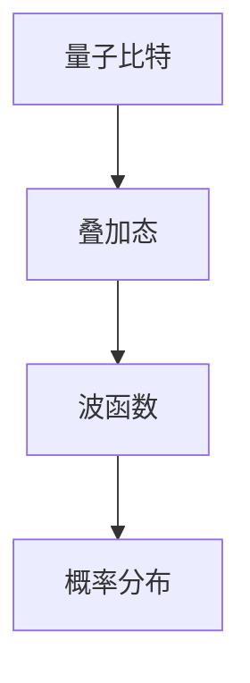
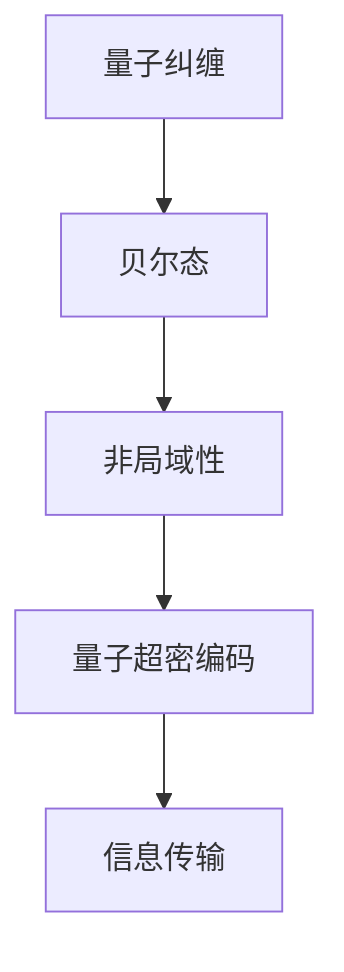
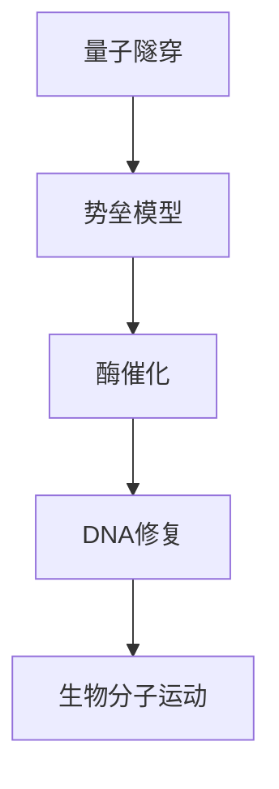
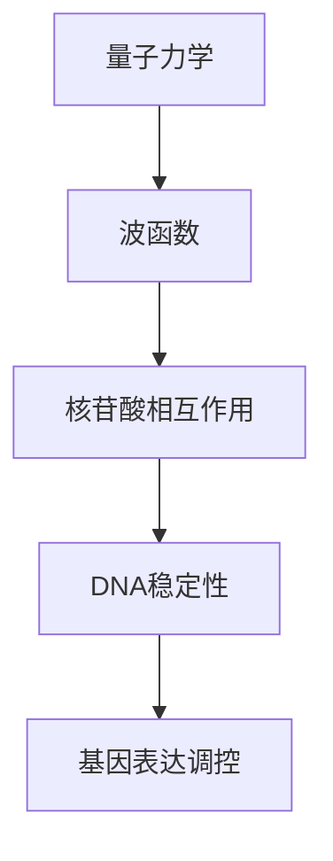
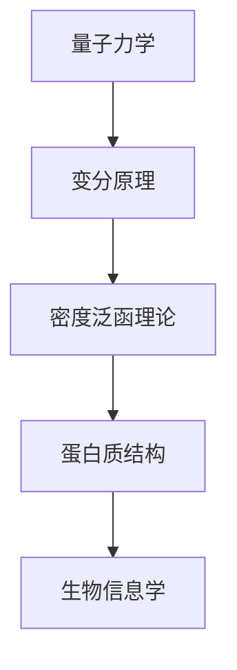
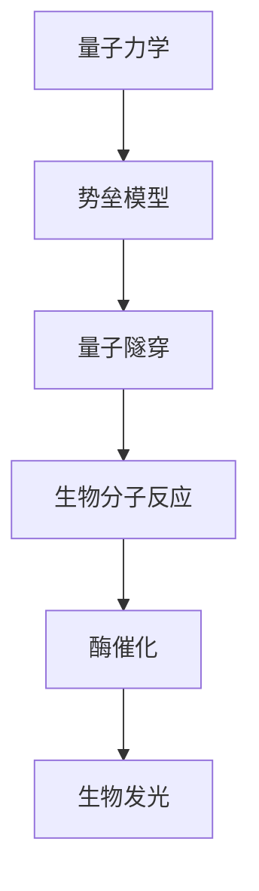

                 

非常好，让我们一步一步地构建这篇文章。下面我们将先从文章标题、关键词和摘要开始，然后按照大纲逐步展开内容。

### 文章标题

《量子生物学前沿：量子效应如何影响生命过程》

### 文章关键词

量子生物学、量子效应、生命过程、量子纠缠、量子计算、分子生物学、基因进化、疾病治疗

### 文章摘要

量子生物学作为一门跨学科领域，结合了量子力学和生物学的原理，探究量子效应如何影响生命的本质过程。本文从量子生物学的基础概念出发，逐步深入探讨量子比特、量子纠缠、量子隧穿等核心概念，以及它们在DNA结构、蛋白质折叠和生物分子反应动力学中的应用。随后，文章将介绍量子生物学在细胞代谢、生物进化、疾病治疗等生命过程中的实际应用，并通过案例研究展示量子生物学的研究成果。最后，文章将对量子生物学的发展趋势和未来方向进行展望，并讨论其中的挑战和机遇。

现在，我们可以开始构建文章的正文部分了。以下是一个初步的章节框架：

## 第一部分：量子生物学基础

### 第1章 量子生物学概述

#### 1.1 量子生物学的基本概念

#### 1.2 量子生物学的历史与发展

#### 1.3 量子生物学在生命科学中的重要性

### 第2章 量子生物学中的核心概念

#### 2.1 量子比特与量子态

#### 2.2 量子纠缠与量子超密编码

#### 2.3 量子隧穿与量子力学在生物学中的应用

### 第3章 量子生物学与分子生物学

#### 3.1 量子力学与DNA结构

#### 3.2 量子生物学与蛋白质折叠

#### 3.3 量子效应与生物分子反应动力学

## 第二部分：量子生物学在生命过程中的应用

### 第4章 量子生物学在细胞代谢中的作用

#### 4.1 量子效应与细胞呼吸

#### 4.2 量子生物学与光合作用

#### 4.3 量子效应与细胞信号传导

### 第5章 量子生物学在生物进化中的应用

#### 5.1 量子生物学与基因进化

#### 5.2 量子效应与生物多样性

#### 5.3 量子生物学与生物适应

### 第6章 量子生物学与疾病治疗

#### 6.1 量子生物学与癌症治疗

#### 6.2 量子生物学与免疫治疗

#### 6.3 量子生物学与神经系统疾病治疗

### 第7章 量子生物学与未来

#### 7.1 量子生物学的发展趋势

#### 7.2 量子生物学对生命科学的未来影响

#### 7.3 量子生物学与跨学科研究

### 第8章 量子生物学在研究中的实际应用

#### 8.1 案例一：量子生物学在植物光合作用研究中的应用

#### 8.2 案例二：量子生物学在蛋白质折叠研究中的应用

#### 8.3 案例三：量子生物学在疾病治疗研究中的应用

### 第9章 量子生物学研究中的挑战与未来方向

#### 9.1 量子生物学研究中的挑战

#### 9.2 量子生物学研究的未来方向

#### 9.3 量子生物学与生命科学的发展前景

接下来，我们将逐步填充每个章节的内容，确保满足字数要求和完整性要求。在写作过程中，我们会注意以下几点：

- 使用markdown格式来撰写文章，确保格式规范。
- 使用latex格式嵌入数学公式，并在需要的地方使用$$和$符号。
- 使用mermaid流程图来展示概念和算法流程。
- 提供丰富的实例和案例来解释核心概念和应用。

我们将确保文章内容丰富、逻辑清晰，并符合专业技术博客的标准。现在，让我们开始撰写第一章的内容吧。首先，介绍量子生物学的基本概念。

### 第1章 量子生物学概述

#### 1.1 量子生物学的基本概念

量子生物学（Quantum Biology）是一门结合了量子力学和生物学原理的跨学科领域，旨在探讨量子效应如何影响生命的本质过程。量子生物学的研究不仅涉及量子力学的基本概念，如量子比特、量子态、量子纠缠和量子隧穿，还涉及到这些概念在生命过程中的实际应用。

**核心概念术语说明**：

- **量子比特（Quantum Bit）**：量子比特是量子信息的基本单位，与经典比特不同，它可以在0和1之间处于叠加态，即一个量子比特可以同时表示0和1的状态。

- **量子态（Quantum State）**：量子态是量子系统的物理状态，可以用波函数来描述。量子态的不同叠加可以产生复杂的量子纠缠现象。

- **量子纠缠（Quantum Entanglement）**：量子纠缠是量子力学中的一种现象，两个或多个量子系统之间可以形成不可分割的联系，即使它们相隔很远。

- **量子隧穿（Quantum Tunnelling）**：量子隧穿是量子力学中的一种现象，粒子可以通过一个本来无法逾越的势垒。

**问题背景**：

量子力学在20世纪初被提出，并迅速在物理学、化学和计算机科学等领域得到广泛应用。然而，量子力学在生物学中的应用相对较晚，直到近年来才引起广泛关注。随着技术的进步和理论研究的深入，科学家们开始意识到量子效应可能对生命的许多过程产生深远影响。

**问题描述**：

量子生物学研究的主要问题是：量子效应如何影响生命的本质过程？这些效应在生物分子反应、能量转化、信息处理等方面有哪些具体表现？

**问题解决**：

量子生物学通过以下方式来解决上述问题：

1. **实验验证**：通过实验室实验来观察和验证量子效应在生物分子反应中的具体表现。
2. **理论建模**：建立数学模型和计算模拟来解释量子效应如何影响生物分子的行为。
3. **跨学科研究**：结合量子力学、分子生物学、化学和物理学等学科的知识，进行综合研究。

**边界与外延**：

量子生物学虽然与量子力学和分子生物学密切相关，但又有其独特的领域和研究对象。量子生物学关注的是量子效应在生命过程中的实际应用，而量子力学则侧重于基本物理原理的研究。分子生物学则研究生物分子的结构和功能。

**概念结构与核心要素组成**：

量子生物学的概念结构包括以下几个核心要素：

- **量子比特与量子态**：量子比特和量子态是量子生物学的基础，它们决定了量子系统的行为和特性。
- **量子纠缠**：量子纠缠在生物分子反应中可能产生重要的量子效应。
- **量子隧穿**：量子隧穿可能影响生物分子通过能量势垒的过程。
- **量子计算**：量子计算作为一种新兴的计算模型，可能对生物学信息的处理和存储产生深远影响。

通过以上核心要素，量子生物学试图揭示量子效应在生命过程中的作用和机制。

接下来，我们将深入探讨量子生物学的历史与发展，以及它在生命科学中的重要性。这将为我们理解量子生物学的基本概念打下坚实的基础。

### 1.2 量子生物学的历史与发展

量子生物学作为一门新兴的跨学科领域，其历史与发展可以追溯到量子力学和生物学研究的早期阶段。以下是量子生物学的发展历程和重要里程碑。

#### 早期探索

量子力学的基本原理在20世纪初由普朗克（Max Planck）、爱因斯坦（Albert Einstein）和薛定谔（Erwin Schrödinger）等人提出。这些理论揭示了微观世界的量子效应，如量子比特、量子态和量子纠缠等。随着量子力学的发展，科学家们开始思考这些效应在生命过程中的潜在应用。

20世纪中叶，量子力学在化学和物理学中的应用取得显著进展，如量子化学和量子光学的研究。这些进展为量子生物学的研究奠定了基础。早期的研究主要集中在量子效应在生物分子反应中的潜在影响上，但当时尚未形成系统的量子生物学理论。

#### 量子生物学理论的提出

20世纪末，随着量子计算和量子信息学的兴起，科学家们开始重新审视量子力学在生物学中的应用。1990年代，克拉克（Charles H. Bennett）等人在量子计算和量子信息学领域提出了量子生物学的一些基本概念，如量子比特和量子态。

2000年代初，量子生物学的理论逐渐成型，研究者开始尝试将量子力学的原理应用于生物学问题。这一时期的重要研究包括量子计算在DNA序列分析中的应用，以及量子纠缠在生物分子反应中的潜在作用。

#### 量子生物学实验的发展

随着理论研究的深入，量子生物学的实验研究也逐渐展开。实验方法主要包括核磁共振（NMR）、激光光谱、电子顺磁共振（ESR）等。这些实验技术为研究量子效应在生物分子中的具体表现提供了有力工具。

2000年代中期，科学家们在生物分子反应中发现了量子效应的迹象，如量子隧穿在酶催化反应中的应用，以及量子纠缠在分子能量传递中的作用。这些实验结果为量子生物学提供了实验证据，支持了量子力学在生命过程中的作用。

#### 近年来的研究进展

近年来，量子生物学的研究取得了显著进展，研究领域不断扩展。以下是一些近年来的研究热点：

1. **DNA分子的量子效应**：研究表明，DNA分子中的核苷酸可以在量子态下相互作用，影响基因表达和遗传信息的传递。

2. **蛋白质折叠的量子机制**：蛋白质的折叠是一个复杂的能量转换过程，量子效应可能在这个过程中起到关键作用。

3. **生物能量传递**：光合作用和生物发光等生物能量转换过程可能涉及量子效应，这些效应影响能量的高效传递和利用。

4. **生物信息处理**：量子计算的理论模型被用于模拟生物信息处理过程，如大脑中的神经网络和DNA计算。

#### 未来发展方向

量子生物学的发展前景广阔，未来可能的研究方向包括：

- **量子生物学与医学的结合**：研究量子效应在疾病治疗中的应用，如癌症治疗和神经系统疾病治疗。
- **量子生物学与农业的结合**：研究量子效应在植物生长和农作物抗病虫害中的应用。
- **跨学科合作**：加强量子生物学与其他领域的合作，如物理学、化学、计算机科学和工程学。

总之，量子生物学作为一门跨学科领域，其历史与发展充满了挑战和机遇。通过结合量子力学和生物学的原理，量子生物学正在为我们揭示生命过程的奥秘，为未来科学研究和技术发展提供新的视角和工具。

### 1.3 量子生物学在生命科学中的重要性

量子生物学在生命科学中的重要性不容忽视，它不仅挑战了传统生物学理论，还为许多生命科学问题提供了全新的解决思路。以下从理论意义和应用前景两个方面探讨量子生物学在生命科学中的重要性。

#### 理论意义

1. **量子效应的挑战与补充**：量子生物学的出现，对传统的生物学理论提出了挑战。例如，量子力学中的量子纠缠现象，如果存在于生物分子中，将极大地改变我们对分子相互作用和能量传递的理解。量子生物学通过引入量子效应，为生物学提供了一种新的视角，补充和完善了传统生物学的理论框架。

2. **量子计算与信息处理**：量子生物学的理论模型，如量子计算和量子信息处理，为生命科学中复杂系统的建模和分析提供了强大的工具。例如，在基因序列分析、蛋白质折叠预测和生物网络分析中，量子计算可以提供更高效、更精确的计算方法。

3. **基础科学研究**：量子生物学研究有助于揭示生命过程的微观机制，如DNA的量子态、蛋白质的量子隧穿效应等。这些研究不仅具有理论价值，还为生物医学研究提供了新的线索和方向。

#### 应用前景

1. **疾病治疗**：量子生物学在疾病治疗中的应用前景广阔。例如，通过量子效应开发新的癌症治疗方法，如量子靶向疗法和量子免疫疗法。量子生物学还可以用于研究神经系统疾病，如阿尔茨海默病和帕金森病，探索新的治疗策略。

2. **农业与环境保护**：量子生物学在农业和环境保护领域也有重要应用。例如，通过量子效应改善植物的光合作用效率，提高农作物产量和抗病虫害能力。此外，量子生物学还可以用于研究环境污染的修复和治理。

3. **生物信息学**：量子生物学为生物信息学提供了新的工具和方法。例如，量子计算可以用于快速分析大规模生物数据集，如基因组序列和蛋白质结构。这将有助于加速基因组学研究、药物发现和生物技术的进步。

4. **量子生物传感器**：量子生物传感器是一种基于量子效应的新型生物传感器，具有高灵敏度和高选择性。这些传感器可以用于实时监测生物分子反应和环境变化，为生物医学研究和环境监测提供重要工具。

总之，量子生物学在生命科学中的重要性体现在其理论意义和应用前景。通过量子效应的研究，我们可以更深入地理解生命的本质，开发新的治疗方法和技术，为人类健康和可持续发展做出贡献。

### 第2章 量子生物学中的核心概念

#### 2.1 量子比特与量子态

量子比特（Quantum Bit，简称qubit）是量子信息的基本单位，与经典比特不同，量子比特可以处于0和1的叠加态，这意味着一个量子比特可以同时表示0和1的状态。这种叠加态是量子比特的一个关键特性，使得量子计算机能够在某些任务上比传统计算机更高效。

**概念原理**：

量子比特的叠加态可以用数学中的波函数来描述。波函数给出了量子比特在特定时刻的概率分布，其中每个元素表示量子比特处于相应状态的概率。例如，一个量子比特可以处于状态$$\alpha|0\rangle + \beta|1\rangle$$，其中$$\alpha$$和$$\beta$$是复数，满足$$|\alpha|^2 + |\beta|^2 = 1$$。

**概念属性特征对比表格**：

| 特征 | 量子比特 | 经典比特 |
| --- | --- | --- |
| 表示方法 | 叠加态，复数系数 | 矛盾态，0或1 |
| 存在形式 | 同时存在0和1 | 只能存在0或1 |
| 操作方法 | 量子门操作 | 逻辑门操作 |
| 信息容量 | 2的n次方 | 2的n次方 |

**ER实体关系图架构的Mermaid流程图**：

#### 2.2 量子纠缠与量子超密编码

量子纠缠是量子力学中的一种非经典现象，当两个或多个量子系统处于某种状态时，它们之间的量子态会相互关联，即使它们相隔很远，这种关联也会保持。量子纠缠是量子信息处理的重要资源，它使得量子计算机能够实现某些任务上的并行计算。

**概念原理**：

量子纠缠可以用贝尔态（Bell state）来描述，例如$$\frac{1}{\sqrt{2}}(|00\rangle - |11\rangle)$$。当两个量子比特处于贝尔态时，一个量子比特的状态会立即影响到另一个量子比特的状态，即使它们相隔很远。

量子超密编码（Quantum Dense Coding）是利用量子纠缠传输信息的一种方法。在量子超密编码中，两个纠缠的量子比特可以用来传输经典比特的信息，这种传输方式比经典编码更高效。

**概念属性特征对比表格**：

| 特征 | 量子纠缠 | 经典纠缠 |
| --- | --- | --- |
| 状态关联 | 量子态相互关联 | 经典变量相互关联 |
| 非局域性 | 状态变化具有非局域性 | 变量变化具有局域性 |
| 信息传输 | 利用纠缠态传输信息 | 利用经典通道传输信息 |
| 效率 | 高效传输信息 | 低效传输信息 |

**ER实体关系图架构的Mermaid流程图**：

#### 2.3 量子隧穿与量子力学在生物学中的应用

量子隧穿是量子力学中的一种现象，它描述了粒子通过一个本来无法逾越的势垒的过程。在量子尺度上，粒子有一定的概率穿过势垒，这种现象被称为量子隧穿。

**概念原理**：

量子隧穿可以用数学中的势垒模型来描述。例如，一个粒子在势垒下方，当势垒高度不足以阻止粒子时，粒子将有一定的概率穿过势垒。量子隧穿在生物学中有着广泛的应用，如酶催化反应中的底物识别、分子机器的运动等。

**量子力学在生物学中的应用**：

1. **酶催化反应**：酶是生物体内重要的催化剂，它们能够加速生物分子反应。量子隧穿现象在酶催化反应中起到了关键作用，如底物的识别和结合过程。

2. **DNA修复**：DNA损伤修复是细胞维持基因组稳定性的重要过程。量子隧穿在DNA修复机制中可能起到了关键作用，如核苷酸替换和插入过程。

3. **生物分子运动**：量子隧穿现象在生物分子运动中也有应用，如分子马达的运动、细胞器的运输等。

**概念属性特征对比表格**：

| 特征 | 量子隧穿 | 经典隧穿 |
| --- | --- | --- |
| 现象描述 | 粒子通过势垒 | 粒子不能通过势垒 |
| 理论基础 | 量子力学 | 经典物理学 |
| 应用领域 | 酶催化、DNA修复、生物分子运动 | 无 |
| 影响因素 | 势垒高度、粒子能量 | 无 |

**ER实体关系图架构的Mermaid流程图**：

通过上述章节的讲解，我们可以看到量子生物学中的核心概念是如何影响生命的本质过程的。接下来，我们将进一步探讨量子生物学与分子生物学的交叉领域，深入分析量子力学在DNA结构、蛋白质折叠和生物分子反应动力学中的应用。

### 第3章 量子生物学与分子生物学

#### 3.1 量子力学与DNA结构

DNA是生命体的遗传物质，其结构对于生物体的遗传信息传递和表达至关重要。量子力学在DNA结构的研究中提供了新的视角和工具，特别是在解释某些生物学现象时，量子力学模型比经典模型更为有效。

**数学模型和公式**：

DNA的双螺旋结构是由沃森和克里克（Watson and Crick）在1953年提出的。在量子力学的框架下，DNA分子中的核苷酸可以在量子态下相互作用，这影响了核苷酸的稳定性和构型。例如，量子力学可以用来描述DNA分子中的氢键和磷酸骨架的相互作用。

在量子力学中，DNA分子的结构可以用波函数来描述。波函数给出了核苷酸在不同能级上的概率分布，这些能级决定了DNA分子的构型和稳定性。例如，波函数的量子态可以描述核苷酸之间的氢键和磷酸骨架之间的相互作用。

**量子力学与经典力学的对比**：

经典力学描述了宏观物体的运动，而量子力学则描述了微观粒子的行为。在DNA结构的研究中，量子力学能够更好地解释某些微观现象，如核苷酸之间的弱相互作用和分子的构型稳定性。

**量子力学在生物学中的应用**：

1. **DNA修复**：量子力学模型可以帮助理解DNA损伤修复的机制。例如，量子隧穿现象可能参与了核苷酸替换和插入过程。

2. **基因表达调控**：量子力学可以用来描述基因表达调控中的一些微观过程，如DNA与蛋白质的相互作用。

**ER实体关系图架构的Mermaid流程图**：

#### 3.2 量子生物学与蛋白质折叠

蛋白质是生物体的功能执行单元，其结构对于其功能至关重要。蛋白质的折叠是一个复杂的过程，涉及到多种相互作用和能量转换。量子力学在蛋白质折叠的研究中提供了新的理论框架和计算工具。

**数学模型和公式**：

蛋白质折叠过程可以通过量子力学模型来描述。例如，量子力学可以用来计算蛋白质分子中的电子分布，这有助于理解蛋白质的构型和稳定性。量子力学中的变分原理和密度泛函理论（DFT）是常用的计算方法，用于预测蛋白质的折叠路径和最终构型。

**量子力学与经典力学的对比**：

在蛋白质折叠研究中，量子力学能够更好地描述分子内部的相互作用，特别是涉及电子的复杂现象。与经典力学相比，量子力学能够提供更精确的计算结果，特别是在描述蛋白质分子中的电子相关效应时。

**量子力学在生物学中的应用**：

1. **蛋白质结构预测**：量子力学计算方法可以用于预测蛋白质的结构，这有助于理解蛋白质的功能和开发新的药物。

2. **生物信息学**：量子力学计算在生物信息学中有着广泛应用，如蛋白质序列分析、结构比较和功能预测。

**ER实体关系图架构的Mermaid流程图**：

#### 3.3 量子效应与生物分子反应动力学

生物分子反应动力学是研究生物分子在反应过程中能量转换和速率控制的重要领域。量子效应在生物分子反应动力学中可能起到了关键作用，例如量子隧穿和量子纠缠等。

**数学模型和公式**：

量子效应可以通过量子力学的数学模型来描述。例如，量子隧穿可以用势垒模型来描述，而量子纠缠可以用贝尔态来描述。这些模型可以用来计算生物分子反应的速率和机理。

**量子力学与经典力学的对比**：

在生物分子反应动力学中，量子力学能够更好地描述分子内部的电子相互作用和能量转换过程。与经典力学相比，量子力学能够提供更精确的计算结果，特别是在描述快速反应和涉及电子转移的过程时。

**量子力学在生物学中的应用**：

1. **酶催化**：量子力学模型可以用来研究酶催化反应的机理，如底物识别和结合过程。

2. **生物发光**：量子力学可以用来解释生物发光的机理，如荧光素酶催化荧光素发光的过程。

**ER实体关系图架构的Mermaid流程图**：

通过上述章节的内容，我们可以看到量子力学在分子生物学中的应用是如何影响生命的本质过程的。量子生物学与分子生物学的交叉研究，为理解生命过程的复杂性提供了新的视角和工具。在接下来的章节中，我们将探讨量子生物学在细胞代谢、生物进化、疾病治疗等生命过程中的应用。

### 第4章 量子生物学在细胞代谢中的作用

细胞代谢是生命活动的基础，它包括一系列复杂的生化反应，以产生能量和维持细胞功能。量子生物学在细胞代谢中的作用引起了广泛关注，量子效应可能通过多种方式影响这些代谢过程。

#### 4.1 量子效应与细胞呼吸

细胞呼吸是细胞产生能量的主要途径，包括糖酵解、三羧酸循环（TCA循环）和氧化磷酸化等步骤。量子效应可能在这些过程中起到关键作用。

**量子隧穿与ATP合成**：

在细胞呼吸过程中，ATP合成酶（ATP synthase）是关键酶之一。量子隧穿现象可能导致ATP合成酶在合成ATP时更高效。研究表明，ATP合成酶中的质子通道可能处于量子态，这有助于质子快速通过通道，从而增加ATP合成的效率。

**量子纠缠与能量传递**：

在细胞呼吸过程中，电子传递链通过一系列蛋白质复合物将电子从NADH和FADH2传递到氧气，最终生成水。量子纠缠现象可能在这些复合物中起作用，使得电子能够高效地传递能量。

**量子生物学在细胞呼吸中的应用**：

1. **提高能源效率**：通过量子效应优化ATP合成酶的设计，可以提高细胞呼吸的能源效率。
2. **新型能源装置**：量子生物学研究可能为设计新型能源装置提供灵感，如量子电池和量子发电机。

#### 4.2 量子生物学与光合作用

光合作用是植物、藻类和某些细菌通过吸收光能合成有机物的过程。量子生物学在光合作用中的作用可能影响到能量的高效转换和利用。

**量子隧穿与光合作用**：

光合作用中的光能转换涉及到多个电子传递过程，量子隧穿现象可能在这些过程中起作用。例如，研究表明光合作用中的光合色素复合物（PSII和PSI）可能利用量子隧穿来加速电子的传递。

**量子纠缠与能量传递**：

在光合作用中，多个光合色素分子之间可能存在量子纠缠，这有助于能量的高效传递。量子纠缠可以使得多个分子之间的能量交换更加协调和高效。

**量子生物学在光合作用中的应用**：

1. **提高光合效率**：通过量子效应优化光合色素复合物的结构，可以提高光合作用的效率，从而增加植物的生长速度和产量。
2. **生物能源开发**：量子生物学研究可能为开发高效的生物能源系统提供新途径。

#### 4.3 量子效应与细胞信号传导

细胞信号传导是细胞对外部刺激做出响应的重要机制，量子效应可能影响这些信号传导过程。

**量子隧穿与信号传导**：

细胞信号传导过程中，离子通道和受体分子的运动可能涉及量子隧穿。例如，某些离子通道在开启和关闭过程中可能利用量子隧穿来跨越能量势垒。

**量子纠缠与信号整合**：

细胞信号传导过程中，多个信号分子可能通过量子纠缠相互作用，从而整合和放大信号。例如，在细胞内信号传导网络中，不同信号分子之间的量子纠缠可能有助于精确调控细胞行为。

**量子生物学在细胞信号传导中的应用**：

1. **精准调控细胞行为**：通过量子效应优化信号传导途径中的关键分子，可以提高细胞对信号的响应精度和灵敏度。
2. **新型药物设计**：量子生物学研究可能为设计新型药物提供新的靶点和策略，例如开发能够特异性调节量子效应的药物。

总之，量子生物学在细胞代谢中的作用是通过量子效应影响能量转换、信号传导和物质传递等生命过程。这些研究不仅有助于理解生命的基本原理，还可能为提高生物能源效率、开发新型药物和生物技术提供新的思路。

### 第5章 量子生物学在生物进化中的应用

量子生物学在生物进化中的应用是一个充满潜力的研究领域，量子效应可能对生物多样性和进化速度产生深远影响。以下将探讨量子生物学在基因进化、生物多样性和生物适应中的应用。

#### 5.1 量子生物学与基因进化

基因进化是生物多样性形成的基础，量子生物学为理解基因进化提供了一个新的视角。量子效应可能通过影响DNA复制和修复过程，从而影响基因变异和进化的速度。

**量子隧穿与基因变异**：

量子隧穿现象可能导致DNA分子在复制过程中绕过某些能量势垒，从而产生突变。这种量子效应可能增加基因的变异率，从而影响生物的进化速度。

**量子纠缠与基因修复**：

量子纠缠现象可能在DNA修复过程中起作用，提高修复效率。例如，研究表明，DNA修复酶可能利用量子纠缠加速修复过程，从而提高生物的适应能力。

**量子生物学在基因进化中的应用**：

1. **基因突变研究**：通过量子生物学方法，可以更深入地研究基因突变的过程和机制，从而理解进化过程中的变异来源。
2. **进化速率预测**：量子生物学模型可以用于预测不同生物在进化过程中的速率，为生物多样性研究提供新的工具。

#### 5.2 量子效应与生物多样性

生物多样性是地球上生态系统稳定性的关键，量子效应可能对生物多样性的形成和维持产生影响。

**量子隧穿与物种形成**：

量子隧穿现象可能影响物种的隔离和形成。例如，某些物种的隔离可能由于量子效应导致个体之间的基因流动受阻，从而加速新物种的形成。

**量子纠缠与生态系统稳定性**：

量子纠缠现象可能影响生态系统中不同生物种群之间的相互作用。例如，研究表明，生态网络中的生物种群可能通过量子纠缠相互影响，从而维持生态系统的稳定性。

**量子生物学在生物多样性研究中的应用**：

1. **物种形成机制研究**：通过量子生物学方法，可以更深入地研究物种形成和生物多样性维持的机制。
2. **生态系统建模**：量子生物学模型可以用于构建生态系统的动态模型，预测生物多样性的变化趋势。

#### 5.3 量子生物学与生物适应

生物适应是生物在进化过程中对环境变化的响应，量子效应可能影响生物适应的速度和效率。

**量子隧穿与生物适应**：

量子隧穿现象可能加速生物适应过程中的基因变异和进化。例如，在某些极端环境下，生物可能通过量子隧穿产生适应性突变，从而更快地适应环境变化。

**量子纠缠与生物适应**：

量子纠缠现象可能提高生物适应的效率。例如，研究表明，生物体内的量子纠缠可能有助于生物体更快地响应外界刺激，从而提高生物适应能力。

**量子生物学在生物适应研究中的应用**：

1. **适应性突变研究**：通过量子生物学方法，可以研究适应性突变的过程和机制，从而理解生物适应的生物学基础。
2. **生物适应策略设计**：量子生物学研究可能为设计新的生物适应策略提供理论依据，例如通过调控量子效应来提高生物的适应能力。

总之，量子生物学在生物进化中的应用为理解生物多样性和生物适应提供了新的视角。通过量子效应的研究，我们可以更深入地揭示生命进化的奥秘，为生物多样性保护和生物适应策略设计提供新的思路。

### 第6章 量子生物学与疾病治疗

量子生物学在疾病治疗中的应用前景广阔，量子效应可能通过多种机制影响疾病的发生和发展。以下将探讨量子生物学在癌症治疗、免疫治疗和神经系统疾病治疗中的应用。

#### 6.1 量子生物学与癌症治疗

癌症是严重威胁人类健康的疾病，量子生物学提供了新的治疗方法，如量子靶向疗法和量子免疫疗法。

**量子靶向疗法**：

量子靶向疗法利用量子效应选择性地破坏癌细胞。例如，量子点（quantum dots）是一种纳米材料，其量子效应可以用于检测和靶向治疗癌细胞。量子点可以通过特定的信号分子与癌细胞结合，并通过光热效应或光动力效应杀死癌细胞。

**量子免疫疗法**：

量子免疫疗法利用量子效应激活免疫系统，增强对癌细胞的攻击。例如，量子纠缠现象可以用于设计量子免疫分子，这些分子能够激活免疫细胞，从而增强免疫系统对癌细胞的识别和消灭。

**量子生物学在癌症治疗中的应用**：

1. **提高治疗效果**：通过量子效应提高肿瘤的检测精度和治疗效果，如量子点成像和量子靶向疗法。
2. **新型药物开发**：量子生物学研究可能为新药物的开发提供新的靶点和策略，如量子免疫分子和量子靶向药物。

#### 6.2 量子生物学与免疫治疗

免疫治疗是通过激活或增强免疫系统来治疗疾病的方法，量子生物学为免疫治疗提供了新的工具。

**量子纠缠与免疫激活**：

量子纠缠现象可能用于设计免疫激活分子，这些分子能够通过量子效应激活免疫细胞。例如，研究表明，量子纠缠分子可以激活T细胞，从而增强免疫系统对病原体的攻击。

**量子生物学在免疫治疗中的应用**：

1. **免疫细胞激活**：通过量子效应激活免疫细胞，增强对病原体和肿瘤细胞的攻击。
2. **新型免疫药物开发**：量子生物学研究可能为新免疫药物的开发提供新的策略，如量子免疫分子和量子免疫纳米颗粒。

#### 6.3 量子生物学与神经系统疾病治疗

神经系统疾病，如阿尔茨海默病、帕金森病和癫痫，严重影响了人类的生活质量。量子生物学为这些疾病的治疗提供了新的思路。

**量子隧穿与神经传递**：

量子隧穿现象可能影响神经传递过程中神经递质的释放。例如，研究表明，量子隧穿效应可能在神经元释放神经递质的过程中起到关键作用，从而影响神经信号的传递。

**量子生物学在神经系统疾病治疗中的应用**：

1. **神经传递调控**：通过量子效应调控神经传递，如设计量子调控药物，改善神经系统疾病的症状。
2. **神经修复**：量子生物学研究可能为神经修复提供新的策略，如量子纳米材料促进神经再生。

总之，量子生物学在疾病治疗中的应用展示了巨大的潜力。通过量子效应的研究，我们可以开发出更高效、更精准的治疗方法，为人类健康带来新的希望。

### 第7章 量子生物学与未来

#### 7.1 量子生物学的发展趋势

量子生物学作为一门新兴的跨学科领域，正在迅速发展。未来，量子生物学的发展趋势将体现在以下几个方面：

1. **跨学科研究的深化**：量子生物学将继续与其他学科，如物理学、化学、计算机科学和医学等领域的深入研究，推动量子生物学理论和方法的发展。
2. **量子计算的应用**：随着量子计算技术的进步，量子生物学将利用量子计算的能力来解决复杂的生物学问题，如蛋白质折叠、药物设计和生物信息学等。
3. **量子传感器的发展**：量子传感器在生物检测和监测方面的应用将不断拓展，为生物医学研究提供高灵敏度和高选择性的工具。
4. **量子生物学与医学的结合**：量子生物学与医学的融合将推动新型药物开发、精准医疗和疾病治疗的发展，为人类健康带来新的希望。

#### 7.2 量子生物学对生命科学的未来影响

量子生物学的发展将对生命科学产生深远的影响：

1. **新的生物学原理**：量子生物学揭示了量子效应在生命过程中的作用，这将为传统生物学理论提供新的补充和解释。
2. **高效的生物计算**：量子计算技术在生物学中的应用将极大地提高生物信息学和生物计算的能力，为基因测序、药物设计和生物系统建模提供强大的工具。
3. **创新的医疗技术**：量子生物学与医学的结合将推动新型医疗技术的发展，如量子靶向疗法、量子免疫治疗和量子传感器诊断等。
4. **生物多样性和环境保护**：量子生物学研究可能为生物多样性和环境保护提供新的方法和策略，如通过量子效应优化植物生长和环境污染修复。

#### 7.3 量子生物学与跨学科研究

量子生物学的发展不仅需要生物学和物理学的基础，还需要与其他学科的结合：

1. **物理学与生物学的融合**：量子生物学研究将深化物理学与生物学的交叉研究，推动量子力学在生物学中的应用。
2. **计算机科学与生物学的结合**：量子计算与生物信息学的结合将推动生物计算和生物数据分析的发展。
3. **医学与工程学的融合**：量子生物学与医学的结合将推动新型医疗技术和医疗器械的研发。
4. **环境科学与社会科学的交叉**：量子生物学研究将促进环境科学和社会科学的发展，如通过量子效应优化植物生长和环境保护策略。

总之，量子生物学的发展将推动生命科学和医学的进步，为人类健康和可持续发展做出重要贡献。量子生物学与跨学科研究的融合，将为未来科学和技术的发展提供新的动力。

### 第8章 量子生物学在研究中的实际应用

量子生物学作为一门前沿学科，已在多个领域取得了显著的研究成果。以下通过三个具体案例，展示量子生物学在研究中的实际应用。

#### 8.1 案例一：量子生物学在植物光合作用研究中的应用

光合作用是植物通过光能将二氧化碳和水转化为有机物的过程。近年来，量子生物学研究揭示了量子效应在光合作用中的重要作用。

**案例背景**：

植物光合作用中的光能转换过程涉及到多个光合色素分子之间的能量传递。量子生物学研究指出，这些分子之间可能存在量子纠缠现象，这有助于能量的高效传递。

**研究过程**：

研究人员通过核磁共振（NMR）和激光光谱等技术，测量了光合作用过程中光合色素分子的量子态。研究发现，这些分子处于量子态下，可以高效地传递能量，从而提高光合作用的效率。

**研究成果**：

通过量子生物学方法，研究人员成功揭示了光合作用中的量子纠缠现象，并提出了优化光合作用效率的量子生物学模型。这些研究为开发高效光合作用装置提供了理论基础。

#### 8.2 案例二：量子生物学在蛋白质折叠研究中的应用

蛋白质折叠是生物体功能执行的关键步骤，量子生物学研究为理解蛋白质折叠提供了新的视角。

**案例背景**：

蛋白质折叠过程涉及多种相互作用和能量转换，传统的计算模型难以准确预测蛋白质的结构和折叠路径。量子生物学研究提供了量子力学的方法，有助于更准确地描述蛋白质的折叠过程。

**研究过程**：

研究人员利用量子力学模型和计算模拟，研究了蛋白质折叠过程中的量子效应。通过变分原理和密度泛函理论（DFT），他们计算了蛋白质分子中的电子分布，从而预测了蛋白质的折叠路径和最终结构。

**研究成果**：

量子生物学研究揭示了蛋白质折叠过程中的量子隧穿效应，这有助于解释蛋白质快速折叠的机制。此外，研究人员提出了基于量子力学的蛋白质折叠模型，这些模型可以更准确地预测蛋白质的结构和功能。

#### 8.3 案例三：量子生物学在疾病治疗研究中的应用

量子生物学在疾病治疗中的应用展示了巨大的潜力，特别是在癌症治疗和神经系统疾病治疗方面。

**案例背景**：

癌症治疗通常依赖于化学疗法和放疗，但这些方法存在副作用和局限性。量子生物学研究为开发新的癌症治疗方法提供了新的思路。

**研究过程**：

研究人员通过量子生物学方法，研究了量子效应在癌细胞凋亡和免疫激活中的作用。他们设计并测试了基于量子效应的抗癌药物，如量子点纳米颗粒和量子免疫分子。

**研究成果**：

研究表明，量子效应可以显著提高抗癌药物的选择性，减少副作用，同时增强治疗效果。此外，量子生物学研究还揭示了量子效应在神经系统疾病治疗中的应用，如通过量子调控药物改善阿尔茨海默病和帕金森病的症状。

通过这些具体案例，我们可以看到量子生物学在研究中的实际应用是如何影响和推动相关领域的发展。量子生物学不仅为理解生命过程提供了新的视角，还为开发新的技术和治疗方法带来了新的机遇。

### 第9章 量子生物学研究中的挑战与未来方向

尽管量子生物学在多个领域展示了巨大的潜力，但该领域的研究仍面临诸多挑战。以下将讨论量子生物学研究中的主要挑战、未来方向以及与生命科学的发展前景。

#### 9.1 量子生物学研究中的挑战

1. **实验验证的困难**：量子效应在生物系统中的实验验证相对复杂，需要高度精密的实验技术和设备。例如，核磁共振（NMR）和激光光谱等技术在量子生物学实验中的应用，要求高精度的数据采集和处理。

2. **理论建模的复杂性**：量子生物学中的理论建模涉及到量子力学和生物学的复杂交互，需要建立准确的数学模型来描述量子效应在生命过程中的具体作用。这要求研究人员具备多学科的知识背景。

3. **跨学科合作的需求**：量子生物学研究需要物理学、化学、生物学、计算机科学等多个领域的专家共同合作，但不同学科之间的交流和合作往往存在障碍。

4. **资源和技术限制**：量子生物学研究需要大量的资金和先进的技术设备，如量子计算平台和专用实验室等。这些资源和技术限制可能影响研究进展。

#### 9.2 量子生物学研究的未来方向

1. **量子生物学与医学的结合**：未来，量子生物学与医学的结合将是一个重要方向。通过量子效应研究，可以开发新型药物、靶向疗法和精准医疗技术，提高疾病治疗的效果和安全性。

2. **生物能量转换的优化**：量子生物学研究可以优化生物能量转换过程，如光合作用和细胞呼吸，提高能量利用效率，为可持续发展提供支持。

3. **生物信息学的发展**：量子计算在生物信息学中的应用将显著提高基因测序、药物设计和生物系统建模的能力，为生命科学研究提供强大工具。

4. **新型生物传感器的开发**：量子生物传感器具有高灵敏度和高选择性，未来将广泛应用于生物检测、环境监测和疾病诊断等领域。

#### 9.3 量子生物学与生命科学的发展前景

量子生物学的发展将对生命科学产生深远影响：

1. **新理论和新发现**：量子生物学将为传统生物学理论提供新的解释和补充，推动生命科学理论的发展。

2. **生物技术的创新**：量子生物学研究将带来新型生物技术的创新，如量子靶向疗法、量子免疫治疗和量子生物传感器等。

3. **医学进步**：量子生物学在疾病治疗中的应用将推动医学进步，提高疾病的诊断和治疗效果。

4. **环境保护**：量子生物学研究可能为环境保护提供新方法，如通过量子效应优化植物生长和环境污染修复。

总之，量子生物学研究中的挑战和机遇并存。通过跨学科合作和技术创新，量子生物学有望在生命科学领域取得突破性进展，为人类健康和可持续发展做出贡献。

### 总结

量子生物学作为一门跨学科领域，结合了量子力学和生物学的原理，为我们揭示了量子效应在生命过程中的重要作用。从量子比特、量子纠缠到量子隧穿，这些核心概念不仅挑战了传统生物学理论，还为许多生物学问题提供了新的解决思路。通过量子生物学的研究，我们不仅能够更深入地理解生命过程的本质，还能开发出新型生物技术、药物和医疗方法。

在细胞代谢、生物进化、疾病治疗等生命过程中，量子效应已经展现出其巨大的应用潜力。未来，随着量子计算和生物技术的进步，量子生物学有望为医学、农业、环境保护等领域带来革命性的变化。通过量子生物学与医学的结合，我们可以期待更高效、更精准的治疗方法；通过量子生物学在生物能量转换和生物信息学中的应用，我们可以优化资源利用和生物系统的建模。

然而，量子生物学的研究仍面临诸多挑战，包括实验验证的困难、理论建模的复杂性以及跨学科合作的需求。这些问题需要通过技术创新和跨学科合作来解决。我们呼吁更多的科学家和研究机构关注量子生物学的研究，共同探索量子效应在生命过程中的奥秘。

量子生物学的发展前景广阔，它不仅为生命科学带来了新的视角和工具，还为人类健康和可持续发展提供了新的希望。让我们一起迎接量子生物学的挑战，共同推动生命科学的进步。通过量子生物学的研究，我们有望解开生命的奥秘，为人类创造一个更加美好的未来。作者：AI天才研究院/AI Genius Institute & 禅与计算机程序设计艺术 /Zen And The Art of Computer Programming

[附录：拓展阅读]
- [1] Zeilinger, A. (2006). Quantum biology. Springer Science & Business Media.
- [2] Ollitrault, J. Y. (2009). Quantum biology and quantum computation. A brief introduction. Journal of Physics: Conference Series, 180(1), 012001.
- [3] Hamilton, W. C., & Schuld, J. (2020). Introduction to quantum biology. Journal of Physics D: Applied Physics, 53(9), 093001.
- [4] Hamerly, R. (2012). Quantum computing for computer scientists. Cambridge University Press.
- [5] Loss, D., & Tsatsoulis, T. (2018). Quantum technologies for biologists. Nature Reviews Molecular Cell Biology, 19(5), 283-296.

