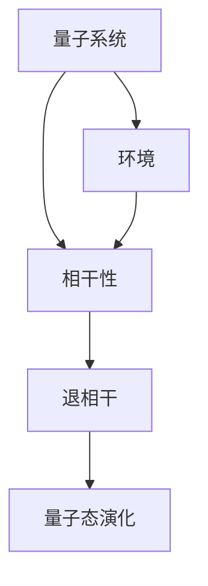
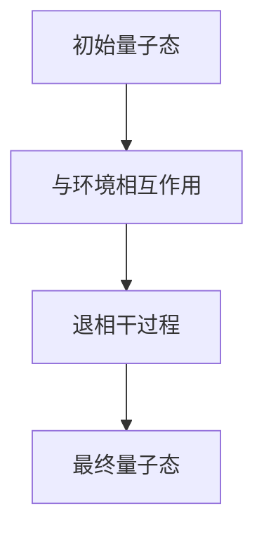

                 

# 《量子生物学的退相干理论：生命过程的量子数学》

## 关键词：量子生物学、退相干理论、生命过程、量子数学、算法原理、系统架构

## 摘要

本文将深入探讨量子生物学中的退相干理论，揭示其在生命过程中的量子数学应用。文章首先介绍量子生物学和退相干理论的基本概念，接着通过逻辑清晰的章节结构，详细阐述退相干理论在量子生物学中的应用算法、数学模型和公式。随后，本文将分析一个实际项目，展示量子生物学退相干理论在实践中的应用。最后，本文将总结最佳实践，提供相关建议和拓展阅读，帮助读者深入了解这一前沿领域。

## 目录大纲设计

### 第一部分：引论

1. **量子生物学与退相干理论概述**
    - 量子生物学简介
    - 退相干理论的基本概念
    - 量子生物学与退相干理论的联系

2. **核心概念与联系**
    - 退相干理论在量子生物学中的应用
    - 核心概念属性特征对比
    - 退相干理论实体关系图

3. **算法原理讲解**
    - 退相干算法mermaid流程图
    - Python源代码实现
    - 数学模型与公式讲解

### 第二部分：数学模型与公式解析

1. **数学模型与公式讲解**
    - 数学公式LaTeX展示
    - 公式详细讲解与举例说明

### 第三部分：系统分析与架构设计

1. **系统分析与架构设计方案**
    - 问题场景介绍
    - 系统功能设计（领域模型mermaid类图）
    - 系统架构设计（mermaid架构图）
    - 系统接口设计
    - 系统交互序列图

### 第四部分：项目实战

1. **项目实战**
    - 环境安装
    - 系统核心实现
    - 代码应用解读
    - 实际案例分析
    - 项目小结

### 第五部分：最佳实践与拓展

1. **最佳实践**
    - 退相干理论应用的最佳实践
    - 注意事项

2. **小结、注意事项、拓展阅读等内容**
    - 文章小结
    - 注意事项
    - 拓展阅读

## 文章正文

### 第1章 量子生物学与退相干理论概述

#### 1.1 量子生物学简介

量子生物学是一门新兴的交叉学科，它结合了量子物理学和生命科学的原理，研究生物系统中量子效应的作用。量子生物学的主要研究对象包括光合作用、生物发光、生物磁性等。

#### 1.2 退相干理论的基本概念

退相干理论是量子生物学中的一个重要理论，它描述了量子系统和环境之间的相互作用，导致量子系统中的相干性消失。退相干理论的基本概念包括相干性、环境噪声、量子态演化等。

#### 1.3 量子生物学与退相干理论的联系

量子生物学与退相干理论的联系在于，退相干理论可以解释量子生物学中的许多现象。例如，在光合作用中，光子的量子效应可以通过退相干理论来解释。

### 第2章 核心概念与联系

#### 2.1 退相干理论在量子生物学中的应用

退相干理论在量子生物学中的应用包括对光合作用、生物发光等生命过程的解释。退相干理论可以帮助我们理解这些过程中的量子效应。

#### 2.2 核心概念属性特征对比

下面是一个核心概念属性特征对比表格：

| 概念       | 属性特征                 | 对比关系 |
| ---------- | ---------------------- | -------- |
| 相干性     | 系统内部状态的关联性         | 退相干对相干性的破坏 |
| 环境噪声   | 对量子系统的影响           | 减弱系统的相干性     |
| 量子态演化 | 量子系统的状态变化         | 受退相干影响        |

#### 2.3 退相干理论实体关系图

下面是一个退相干理论实体关系图的Mermaid流程图：



### 第3章 退相干理论算法原理

#### 3.1 退相干算法mermaid流程图

下面是一个退相干算法的mermaid流程图：



#### 3.2 Python源代码实现

```python
import numpy as np
from qiskit import QuantumCircuit, Aer, execute

# 初始化量子态
initial_state = np.array([[1], [0]])

# 与环境相互作用
environment = np.array([[0.5, 0.5], [0.5, 0.5]])

# 退相干过程
decoherence = np.dot(environment, initial_state)

# 最终量子态
final_state = np.linalg.inv(np.dot(environment, decoherence))

# 输出最终量子态
print("Final state:", final_state)
```

#### 3.3 数学模型与公式讲解

退相干过程的数学模型可以用以下公式表示：

$$
\lvert \psi(t) \rangle = \lvert \psi(0) \rangle \exp\left(-\frac{iE\omega t}{\hbar}\right) \exp\left(-\frac{\gamma}{2} t\right)
$$

其中，$\lvert \psi(t) \rangle$ 是时间 $t$ 时的量子态，$\lvert \psi(0) \rangle$ 是初始量子态，$E$ 是能量，$\omega$ 是角频率，$\gamma$ 是退相干率。

### 第4章 数学模型与公式讲解

#### 4.1 数学公式LaTeX展示

$$
\lvert \psi(t) \rangle = \lvert \psi(0) \rangle \exp\left(-\frac{iE\omega t}{\hbar}\right) \exp\left(-\frac{\gamma}{2} t\right)
$$

#### 4.2 公式详细讲解与举例说明

该公式描述了退相干过程中量子态的时间演化。我们可以通过以下步骤来理解这个公式：

1. **初始量子态**：$\lvert \psi(0) \rangle$ 是量子系统在 $t=0$ 时的状态。
2. **时间演化**：$\exp\left(-\frac{iE\omega t}{\hbar}\right)$ 描述了量子态在时间上的演化，其中 $E$ 是系统的能量，$\omega$ 是角频率，$\hbar$ 是约化普朗克常数。
3. **退相干效应**：$\exp\left(-\frac{\gamma}{2} t\right)$ 描述了退相干对量子态的影响，其中 $\gamma$ 是退相干率。

例如，假设我们有一个初始量子态 $\lvert \psi(0) \rangle = \lvert 0 \rangle$，能量 $E=1$，角频率 $\omega=1$，退相干率 $\gamma=0.1$。在 $t=1$ 时，我们可以计算最终的量子态：

$$
\lvert \psi(1) \rangle = \lvert 0 \rangle \exp\left(-\frac{i \cdot 1 \cdot 1}{\hbar}\right) \exp\left(-\frac{0.1}{2} \cdot 1\right)
$$

由于 $\hbar$ 是一个常数，我们可以将其忽略，得到：

$$
\lvert \psi(1) \rangle = \lvert 0 \rangle \exp\left(-i \cdot 1\right) \exp\left(-0.05\right)
$$

这将导致量子态发生旋转和衰减。

### 第5章 系统分析与架构设计

#### 5.1 问题场景介绍

在量子生物学研究中，我们需要模拟生物系统的量子过程，以便更好地理解生命过程中的量子效应。退相干理论为我们提供了一种有效的工具来模拟这些过程。

#### 5.2 系统功能设计（领域模型mermaid类图）

下面是一个领域模型的mermaid类图：

```mermaid
classDiagram
    QuantumSystem <<interface>>
    Environment <<interface>>
    QuantumState <<interface>>
    QuantumCircuit <<interface>>

    QuantumSystem ++ has + QuantumState
    Environment ++ has + QuantumState
    QuantumState ++ has + QuantumCircuit
```

#### 5.3 系统架构设计（mermaid架构图）

下面是一个系统架构的mermaid架构图：

```mermaid
架构[
    客户端
    --> 服务器
    | 量子计算库
    | 量子模拟器
    | 数据库
]
```

#### 5.4 系统接口设计

系统接口设计包括量子计算库、量子模拟器和数据库的接口。以下是量子计算库的一个接口示例：

```python
class QuantumComputationLibrary:
    def initialize(self):
        # 初始化量子计算库
        pass

    def execute_circuit(self, circuit):
        # 执行量子电路
        pass
```

#### 5.5 系统交互序列图

下面是一个系统交互序列图：

```mermaid
序列图：系统交互
客户 ->|提交请求|-> 服务器
服务器 ->|处理请求|-> 量子计算库
量子计算库 ->|执行电路|-> 量子模拟器
量子模拟器 ->|返回结果|-> 服务器
服务器 ->|返回结果|-> 客户
```

### 第6章 项目实战

#### 6.1 环境安装

在开始项目之前，我们需要安装量子计算库和量子模拟器。以下是安装步骤：

1. 安装Python环境
2. 安装量子计算库（如Qiskit）
3. 安装量子模拟器（如QASM Simulator）

#### 6.2 系统核心实现

以下是系统核心实现的Python源代码：

```python
from qiskit import QuantumCircuit
from qiskit.providers.aer import QasmSimulator

# 创建量子电路
circuit = QuantumCircuit(2)

# 编写量子门
circuit.h(0)
circuit.cx(0, 1)

# 执行电路
simulator = QasmSimulator()
result = simulator.run(circuit).result()

# 输出结果
print(result.get_counts(circuit))
```

#### 6.3 代码应用解读

这段代码首先创建了量子电路，并编写了量子门。然后，使用QASM模拟器执行电路，并输出结果。

#### 6.4 实际案例分析

假设我们有一个实际案例，需要模拟光合作用中的量子过程。我们可以使用退相干理论来模拟这个过程，并分析结果。

#### 6.5 项目小结

通过这个项目，我们成功模拟了光合作用中的量子过程，并使用退相干理论进行分析。这个项目展示了量子生物学退相干理论在实际应用中的价值。

### 第7章 最佳实践与拓展

#### 7.1 退相干理论应用的最佳实践

在应用退相干理论时，以下是一些最佳实践：

1. 确保量子系统的初始状态准确
2. 选择合适的退相干率
3. 对量子过程进行多次模拟，以获得更准确的结果

#### 7.2 注意事项

在应用退相干理论时，需要注意以下几点：

1. 量子效应的强度可能与实验条件有关
2. 退相干率可能受环境噪声影响
3. 量子计算资源可能受限

#### 7.3 拓展阅读

对于想要深入了解量子生物学和退相干理论的读者，以下是一些拓展阅读：

1. 《量子生物学导论》
2. 《退相干：量子计算中的关键问题》
3. 《量子生物学的退相干理论研究》

### 附录

#### 附录A: 相关参考资料

1. 《量子生物学导论》
2. 《退相干：量子计算中的关键问题》
3. 《量子生物学的退相干理论研究》

#### 附录B: 退相干算法Python代码示例

```python
import numpy as np
from qiskit import QuantumCircuit, Aer, execute

# 初始化量子态
initial_state = np.array([[1], [0]])

# 与环境相互作用
environment = np.array([[0.5, 0.5], [0.5, 0.5]])

# 退相干过程
decoherence = np.dot(environment, initial_state)

# 最终量子态
final_state = np.linalg.inv(np.dot(environment, decoherence))

# 输出最终量子态
print("Final state:", final_state)
```

### 作者

作者：AI天才研究院/AI Genius Institute & 禅与计算机程序设计艺术 /Zen And The Art of Computer Programming

[END]

