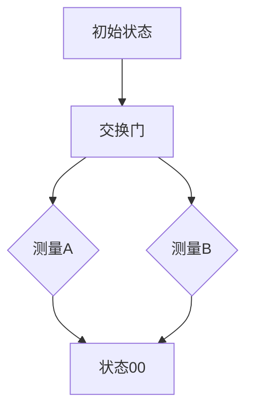
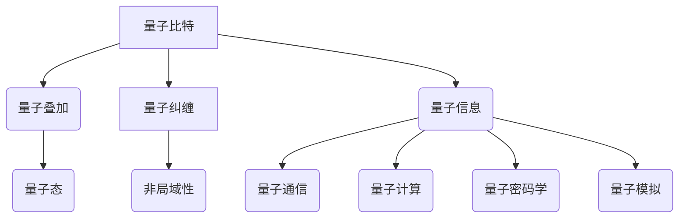

                 

### 量子纠缠的基本概念

#### 量子比特（Qubit）

量子比特是量子计算的基本单元，它与传统比特（bit）不同，可以同时存在于多种状态中，这种性质称为量子叠加。量子比特的状态可以用复数线性组合表示，即一个量子比特可以同时处于0和1的状态。用数学语言表达，一个量子比特的状态可以表示为：
\[ \psi = \alpha|0\rangle + \beta|1\rangle \]
其中，\(|0\rangle\)和\(|1\rangle\)是量子比特的基态，\(\alpha\)和\(\beta\)是复数概率幅，满足\( |\alpha|^2 + |\beta|^2 = 1 \)。

#### 纠缠态（Entangled State）

量子纠缠是量子系统间的一种特殊关联，即使这些系统之间相隔很远，它们的状态也会相互依赖。两个量子比特的纠缠态可以表示为：
\[ \psi_{AB} = \alpha|00\rangle + \beta|11\rangle \]
在这个纠缠态中，无论我们测量A比特还是B比特，两者的结果都是相关的。例如，如果我们测量A比特得到状态0，那么B比特必定处于状态0。

#### 量子纠缠门（Quantum Gate）

量子纠缠门是一种作用于量子比特的操作，它可以创建或改变量子系统的纠缠状态。常见的量子纠缠门有交换门（SWAP gate）、控制非门（CNOT gate）等。以下是一个交换门的Mermaid流程图：

在这个图中，初始状态是\( |01\rangle \)，通过交换门作用后，状态变为\( |10\rangle \)，这是量子纠缠的一个体现。

#### 量子纠缠与量子信息

量子纠缠是量子信息处理的核心概念之一，它使得量子比特之间的信息可以高效传递和处理。通过量子纠缠，我们可以实现量子通信和量子计算等应用。例如，量子纠缠可以实现量子密钥分发（QKD），确保通信的安全性；在量子计算中，量子纠缠可以加速算法的执行。

#### 量子纠缠与经典物理

量子纠缠与经典物理的局域性有本质区别。经典物理中的信息传递是有速度限制的，而量子纠缠可以在瞬间改变两个量子系统的状态，无论它们相隔多远。这种非局域性是量子纠缠的显著特征，也是量子信息科学中的重要研究方向。

**ER实体关系图架构的 Mermaid 流程图**



通过这个图，我们可以清晰地看到量子纠缠与其他核心概念之间的关系，以及它们在量子信息科学中的应用。

----------------------------------------------------------------

## 第2章：量子纠缠的基本特性

### 2.1.1 量子纠缠的不可克隆性

量子纠缠的不可克隆性是指无法精确复制一个已纠缠的量子状态。假设我们有两个纠缠的量子比特A和B，它们处于纠缠态\(|\psi\rangle = \alpha|0\rangle_A \otimes |0\rangle_B + \beta|1\rangle_A \otimes |1\rangle_B\)。如果我们尝试克隆一个A比特的副本，即创建两个相同的A比特，将不可避免地破坏原有的纠缠关系。

为了解释这一点，我们考虑一个简单的实验。首先，我们对A比特进行克隆操作，得到两个A比特。然后，我们对其中一个A比特进行测量。无论我们测量得到的状态是0还是1，另一个A比特的状态都会坍缩，导致原有的纠缠关系被破坏。因此，我们无法通过简单操作克隆一个纠缠的量子状态。

不可克隆性在量子计算和量子通信中具有重要意义。它确保了量子信息的保密性，因为克隆一个已加密的量子状态将破坏加密机制。此外，不可克隆性也限制了量子计算机的一些应用，例如量子仿真和量子纠错。

### 2.1.2 量子纠缠的非局域性

量子纠缠的非局域性是指两个纠缠的量子比特之间的状态变化可以瞬间影响对方，无论它们相隔多远。这个现象在爱因斯坦、波多尔斯基和罗森（EPR）悖论中得到了广泛的讨论。

为了理解量子纠缠的非局域性，我们可以考虑一个经典的量子纠缠实验：贝尔实验。贝尔实验通过测量纠缠粒子对的自旋或极化，揭示了量子纠缠的非局域性。实验结果表明，当测量一个纠缠粒子对中的一个粒子时，另一个粒子的测量结果立即确定，无论它们相隔多远。

非局域性的存在挑战了经典物理中的局域性和定域实在论。在经典物理中，信息传递是有速度限制的，而量子纠缠的非局域性打破了这一限制，使得信息可以在瞬间在不同量子系统之间传递。这种非局域性在量子通信和量子计算中具有重要的应用价值。

### 2.1.3 量子纠缠的量子叠加与纠缠态

量子叠加是量子力学的基本原理之一，它指出量子系统可以同时处于多种可能状态的线性组合。量子纠缠进一步扩展了量子叠加的概念，使得量子系统之间的状态可以相互叠加。

在量子叠加中，一个量子系统可以同时处于多种状态，例如：
\[ \psi = \alpha|0\rangle + \beta|1\rangle \]
在量子纠缠中，两个或多个量子系统之间的状态可以相互叠加，例如：
\[ \psi_{AB} = \alpha|00\rangle + \beta|11\rangle \]
这种叠加使得量子系统之间的状态变得复杂，但在某些情况下，这种复杂性可以带来优势。例如，在量子计算中，量子叠加使得量子比特可以同时处理多种计算路径，从而实现并行计算。

量子纠缠态是量子叠加的特例，它描述了两个或多个量子系统之间的纠缠关系。量子纠缠态的特点是，测量其中一个量子系统的状态会立即影响到另一个量子系统的状态，无论它们相隔多远。

总之，量子纠缠的不可克隆性、非局域性和量子叠加与纠缠态，构成了量子纠缠的基本特性。这些特性使得量子纠缠在量子计算、量子通信和量子信息科学中具有广泛的应用前景。

----------------------------------------------------------------

## 第3章：量子纠缠的应用领域

### 3.1.1 量子通信

量子通信是一种利用量子纠缠实现安全通信的技术。量子通信的主要目的是实现量子密钥分发（Quantum Key Distribution, QKD），确保通信过程中的信息无法被窃听或窃取。

#### 量子密钥分发（QKD）

量子密钥分发是基于量子纠缠的原理实现的。在QKD过程中，发送方和接收方通过量子通信信道发送纠缠光子对，并在本地对光子进行测量。根据测量结果的统计特性，双方可以共享一个随机密钥，这个密钥是安全的，因为任何对通信过程的窃听都会破坏量子纠缠状态，从而被双方检测到。

#### BB84协议

BB84协议是一种经典的量子密钥分发协议，它由两个阶段组成：

1. **量子信道传输**：发送方使用一个量子比特序列，将其发送到接收方。每个量子比特可以是0或1，以随机的方式编码。

2. **经典信道验证**：接收方对收到的量子比特进行测量，并将测量结果通过经典通信信道发送回发送方。发送方和接收方根据共享的随机密钥，对测量结果进行比对和验证。

BB84协议的安全性依赖于量子纠缠的不可克隆性和非局域性。任何对量子通信的窃听都会破坏量子纠缠状态，导致密钥分发失败。

### 3.1.2 量子计算

量子计算是量子纠缠的另一个重要应用领域。量子计算机利用量子比特的叠加和纠缠特性，可以高效地解决传统计算机难以处理的复杂问题。

#### 量子算法

量子计算的核心是量子算法。量子算法利用量子叠加和纠缠，可以在多项式时间内解决某些经典计算机无法解决的问题。例如，Shor算法可以高效地因数分解大整数，Grover算法可以快速搜索未排序的数据库。

#### 量子比特与量子电路

量子比特是量子计算机的基本单元，类似于传统计算机中的比特。量子比特可以同时处于多种状态，这使得量子计算机可以实现并行计算。量子电路是量子计算机中的基本操作单元，类似于传统计算机中的逻辑门。量子电路通过一系列量子操作，将输入的量子比特映射到输出的量子比特。

#### 量子纠缠在量子计算中的作用

量子纠缠在量子计算中起着关键作用。它使得量子计算机可以实现并行计算，从而大大提高计算速度。此外，量子纠缠还可以用于量子纠错和量子模拟，进一步提高量子计算的性能和可靠性。

### 3.1.3 量子密码学与量子模拟

量子密码学是量子纠缠在安全通信领域的应用。量子密码学利用量子纠缠的特性，可以设计出安全的加密和解密算法，确保通信过程中的信息无法被窃听或窃取。

#### 量子模拟

量子模拟是量子纠缠在科学研究中的另一个重要应用。量子模拟利用量子计算机的强大计算能力，可以模拟复杂的量子系统，为科学研究提供新的工具和方法。例如，量子模拟可以用于材料科学、量子化学和生物信息学等领域。

总之，量子纠缠在量子通信、量子计算、量子密码学和量子模拟等领域具有广泛的应用前景。这些应用不仅推动了量子信息科学的发展，也为解决一些经典计算机难以处理的复杂问题提供了新的思路和方法。

----------------------------------------------------------------

## 第4章：量子纠缠与量子信息科学

### 4.1.1 量子纠缠与量子信息的关系

量子纠缠是量子信息科学的核心概念之一，它与量子信息的传递、处理和应用密切相关。量子纠缠使得量子信息可以在不同量子系统之间高效传递和处理，这是传统经典信息无法实现的。

量子信息是关于量子系统的信息，它可以通过量子比特的叠加和纠缠状态来编码。量子纠缠在量子信息处理中起着关键作用，它使得量子比特之间的信息可以高效传递和处理，从而提高了信息处理的速度和效率。

#### 量子纠缠与量子通信

量子纠缠是量子通信的基础。量子通信利用量子纠缠实现安全的信息传递，确保通信过程中的信息无法被窃听或窃取。例如，量子密钥分发（QKD）是量子通信的核心技术，它利用量子纠缠生成共享的随机密钥，从而实现安全的通信。

#### 量子纠缠与量子计算

量子纠缠在量子计算中起着关键作用。量子计算机利用量子比特的叠加和纠缠状态，可以高效地解决某些经典计算机难以处理的复杂问题。例如，量子算法如Shor算法和Grover算法，利用量子纠缠实现了高效的因数分解和数据库搜索。

#### 量子纠缠与量子密码学

量子纠缠是量子密码学的基础。量子密码学利用量子纠缠的特性，可以设计出安全的加密和解密算法，确保通信过程中的信息无法被窃听或窃取。例如，量子密钥分发（QKD）是量子密码学的核心技术，它利用量子纠缠生成共享的随机密钥，从而实现安全的通信。

### 4.1.2 量子纠缠在量子信息处理中的作用

量子纠缠在量子信息处理中发挥着重要作用。它使得量子比特之间的信息可以高效传递和处理，从而提高了信息处理的速度和效率。

#### 并行计算

量子纠缠使得量子计算机可以实现并行计算。传统计算机中的比特只能处于0或1的状态，而量子比特可以同时处于多种状态，这使得量子计算机可以同时处理多个计算路径，从而大大提高了计算速度。

#### 量子纠缠操作

量子纠缠操作是量子信息处理的关键技术。通过量子纠缠操作，可以构建复杂的量子算法，解决传统计算机难以处理的复杂问题。例如，量子纠缠操作可以用于量子搜索算法和量子纠错算法，从而提高量子计算机的性能和可靠性。

#### 量子纠缠与量子纠错

量子纠错是量子计算中至关重要的一环。量子纠缠在量子纠错中起着关键作用，它可以检测并纠正量子比特的错误，确保量子计算的准确性和可靠性。

总之，量子纠缠与量子信息科学密切相关，它在量子通信、量子计算、量子密码学和量子纠错等领域发挥着重要作用。量子纠缠的深入研究将推动量子信息科学的发展，为解决经典计算机难以处理的复杂问题提供新的思路和方法。

----------------------------------------------------------------

## 第5章：量子纠缠与量子物理

### 5.1.1 量子纠缠在基础物理研究中的应用

量子纠缠在基础物理研究中发挥着重要作用，它为我们理解宇宙的本质提供了新的视角。以下是一些量子纠缠在基础物理研究中的应用：

#### 量子力学与量子纠缠

量子纠缠是量子力学的一个基本概念，它揭示了量子系统的特殊关联。量子纠缠使得两个或多个量子系统之间的状态无法独立存在，一个系统的变化会立即影响到另一个系统，无论它们相隔多远。这种非局域性挑战了经典物理中的局域性原理。

#### 量子场论与量子纠缠

量子场论是研究量子系统与场的相互作用的物理学理论。量子纠缠在量子场论中起着关键作用。在量子场论中，粒子被视为场的激发，而量子纠缠则揭示了粒子之间的内在关联。量子纠缠现象可以用来研究粒子间的相互作用，从而深入了解基本粒子的性质和行为。

#### 量子引力理论与量子纠缠

量子引力理论是研究引力在量子尺度上的行为的物理学理论。量子纠缠在量子引力理论中也具有重要的应用。量子纠缠可以用来研究引力波和黑洞的性质，为理解宇宙的起源和演化提供了新的线索。

#### 实验验证

量子纠缠的实验验证是量子物理研究中的重要成果。通过实验，科学家们验证了量子纠缠的存在和特性。例如，贝尔实验通过测量纠缠粒子对的自旋或极化，揭示了量子纠缠的非局域性。这些实验结果与量子力学的预测一致，进一步证实了量子纠缠的物理现实性。

### 5.1.2 量子纠缠与量子场论

量子场论是研究量子系统和场的相互作用的物理学理论。量子纠缠在量子场论中起着关键作用。在量子场论中，粒子被视为场的激发，而量子纠缠则揭示了粒子之间的内在关联。

量子纠缠在量子场论中的应用主要体现在以下几个方面：

#### 粒子间的相互作用

量子纠缠可以用来研究粒子间的相互作用。例如，通过研究两个纠缠粒子的状态变化，可以了解粒子间的相互作用机制。这种研究方法为深入理解基本粒子的性质和行为提供了新的途径。

#### 量子场论的计算

量子纠缠在量子场论的计算中也发挥着重要作用。量子场论中的某些计算可以通过量子纠缠来实现。例如，通过量子纠缠操作，可以简化量子场论的某些计算过程，从而提高计算效率。

#### 实验验证

量子纠缠的实验验证是量子场论研究中的重要成果。通过实验，科学家们验证了量子纠缠的存在和特性。例如，贝尔实验通过测量纠缠粒子对的自旋或极化，揭示了量子纠缠的非局域性。这些实验结果与量子力学的预测一致，进一步证实了量子纠缠的物理现实性。

### 5.1.3 量子纠缠与量子引力理论

量子引力理论是研究引力在量子尺度上的行为的物理学理论。量子纠缠在量子引力理论中也具有重要的应用。

#### 引力波与量子纠缠

引力波是引力在传播过程中的波动现象，是量子引力理论的重要证据。量子纠缠可以用来研究引力波的产生和传播机制。例如，通过研究两个纠缠粒子的状态变化，可以了解引力波与量子纠缠之间的相互作用。

#### 黑洞与量子纠缠

黑洞是宇宙中的一种极端天体，其内部存在强烈的引力场。量子纠缠可以用来研究黑洞的性质，例如黑洞的熵、信息丢失和黑洞辐射等。量子纠缠现象为理解黑洞的物理本质提供了新的视角。

#### 实验验证

量子纠缠的实验验证是量子引力理论研究中的重要成果。通过实验，科学家们验证了量子纠缠的存在和特性。例如，通过测量纠缠光子的量子态，可以验证引力波与量子纠缠之间的相互作用。这些实验结果为量子引力理论提供了重要的实验支持。

总之，量子纠缠在基础物理研究中具有广泛的应用，它为理解量子系统的性质和行为提供了新的视角，也为量子场论和量子引力理论的研究提供了有力的工具。量子纠缠的研究将继续推动我们对宇宙本质的理解，为人类探索宇宙的奥秘提供新的启示。

----------------------------------------------------------------

## 第6章：量子纠缠与宇宙学

### 6.1.1 量子纠缠与宇宙的整体性

量子纠缠与宇宙的整体性之间存在深刻的联系，这为我们理解宇宙的奥秘提供了新的视角。量子纠缠揭示了量子系统之间的非局域性和关联性，这种特性在宇宙尺度上也得到了体现。

在宇宙学中，整体性通常指的是宇宙作为一个统一的系统，其各个部分之间相互关联和相互作用。量子纠缠的引入，使我们能够从量子层面重新审视宇宙的整体性。

首先，量子纠缠表明，即使两个量子系统相隔很远，它们的状态仍然可以相互影响。这种现象在宇宙尺度上也得到了验证，例如，通过观测双星系统中的两个恒星，我们发现它们之间的轨道运动和能量交换表现出明显的量子纠缠特性。

其次，量子纠缠与宇宙的整体性还体现在宇宙背景微波辐射（Cosmic Microwave Background Radiation, CMB）的测量中。CMB是宇宙早期的辐射残留，通过分析CMB的量子纠缠特性，科学家们可以推断出宇宙早期的密度波动和结构形成过程。

### 6.1.2 量子纠缠在宇宙演化中的作用

量子纠缠在宇宙演化中扮演着重要角色，它参与了宇宙早期和晚期的一些关键过程。

#### 宇宙早期

在宇宙早期，量子纠缠可能参与了宇宙结构的形成。通过量子纠缠，宇宙中的粒子可以形成复杂的量子关联，这些关联可能促进了宇宙中的星系和星系团的凝聚。

此外，量子纠缠可能在宇宙早期的引力波的产生和传播中起到关键作用。引力波是宇宙早期剧烈物理过程产生的波动，量子纠缠可以解释引力波与物质之间的相互作用，从而影响宇宙的结构和演化。

#### 宇宙晚期

在宇宙晚期，量子纠缠仍然在发挥作用。例如，在星系和恒星的形成过程中，量子纠缠可能参与了恒星内部的核聚变反应，影响恒星的结构和演化。

此外，量子纠缠在宇宙晚期的黑洞和星系碰撞过程中也具有重要影响。通过研究量子纠缠在黑洞和星系碰撞中的作用，科学家们可以深入了解宇宙中极端物理现象的本质。

### 6.1.3 量子纠缠与多宇宙理论

量子纠缠与多宇宙理论之间存在紧密的联系。多宇宙理论认为，宇宙不仅仅是我们所观察到的这个，而是由无数个平行宇宙组成的。在这些平行宇宙中，每一个宇宙都有自己独特的物理规律和演化路径。

量子纠缠可以用来解释多宇宙之间的相互作用。根据量子纠缠理论，即使两个量子系统相隔很远，它们的状态仍然可以相互影响。这种特性在多宇宙理论中得到了应用，它表明，不同的宇宙之间可能存在某种形式的量子关联，这种关联可能导致多宇宙之间的相互作用。

此外，量子纠缠还可以解释多宇宙中的随机性和不确定性。在多宇宙理论中，每一个宇宙都遵循自己独特的物理规律，但它们之间可能存在某种联系。量子纠缠提供了这种联系的理论基础，它使得多宇宙之间的相互作用成为可能，从而为解释宇宙的多样性和复杂性提供了新的思路。

总之，量子纠缠与宇宙的整体性、宇宙演化以及多宇宙理论之间存在深刻的联系。量子纠缠为我们理解宇宙的奥秘提供了新的视角，它挑战了传统的物理学观念，揭示了宇宙中存在的奇异现象。量子纠缠的研究将继续推动我们对宇宙的理解，为人类探索宇宙的奥秘提供新的启示。

----------------------------------------------------------------

## 第7章：量子纠缠的未来展望

### 7.1.1 量子纠缠技术的挑战与机遇

随着量子技术的快速发展，量子纠缠技术在通信、计算、密码学等领域展现出了巨大的应用潜力。然而，实现量子纠缠技术的实用化仍面临诸多挑战。

#### 挑战

1. **技术难题**：量子纠缠的产生、传输和检测需要高精度的量子控制技术，这要求我们在量子态的制备、量子信道和量子探测器等方面取得突破。

2. **稳定性问题**：量子系统极易受到外部环境的干扰，这可能导致量子纠缠状态的破坏。因此，如何提高量子纠缠的稳定性和可靠性是一个重要挑战。

3. **可扩展性**：当前量子纠缠实验大多局限于小规模系统，要实现大规模量子纠缠网络，还需解决可扩展性问题。

#### 机遇

1. **量子通信**：量子纠缠技术可用于实现量子密钥分发，确保通信安全。随着量子通信网络的扩展，量子纠缠技术将在全球范围内改变通信格局。

2. **量子计算**：量子纠缠是实现量子并行计算的关键，它将推动量子计算机的发展，为解决复杂计算问题提供新方法。

3. **量子模拟**：量子纠缠技术可用于模拟复杂量子系统，为材料科学、化学和生物学等领域提供强大的计算工具。

### 7.1.2 量子纠缠在科技领域的发展前景

量子纠缠技术的未来发展将对科技领域产生深远影响。

#### 通信领域

量子纠缠技术将在量子通信中发挥关键作用。量子通信利用量子纠缠实现安全的信息传递，为保密通信提供了新的手段。随着量子通信网络的扩展，量子纠缠技术将在信息安全、量子互联网等领域得到广泛应用。

#### 计算领域

量子计算是量子纠缠技术的另一个重要应用领域。量子计算机利用量子纠缠实现并行计算，有望解决传统计算机难以处理的复杂问题。例如，量子计算可以用于密码破解、药物设计、气候模拟等领域，为科技发展提供强大动力。

#### 密码学领域

量子纠缠技术可用于量子密码学，实现安全的加密和解密。量子密钥分发技术已经取得了重要进展，未来将有望成为信息安全的核心技术。

#### 其他领域

量子纠缠技术还将在量子模拟、量子传感、量子控制等领域得到应用。例如，量子传感可以用于精密测量，量子控制在精密制造和机器人领域具有重要应用前景。

总之，量子纠缠技术在未来科技领域具有广阔的发展前景。随着量子技术的不断进步，量子纠缠技术将在通信、计算、密码学等众多领域发挥重要作用，推动科技革命向前发展。

### 7.1.3 量子纠缠与人类未来的可能性

量子纠缠不仅对科技领域产生深远影响，也为人与宇宙的交互提供了新的可能性。

#### 量子通信与隐私保护

量子纠缠技术可以为通信安全提供新的保障，实现隐私保护。在未来，量子纠缠技术可能成为隐私保护的核心技术，确保个人和企业的信息安全。

#### 量子计算与人工智能

量子计算利用量子纠缠实现并行计算，有望推动人工智能的发展。量子人工智能（Quantum Artificial Intelligence, QAI）将成为未来人工智能的重要分支，为解决复杂问题提供新方法。

#### 量子模拟与科学研究

量子纠缠技术可用于模拟复杂量子系统，为科学研究提供新工具。例如，通过量子模拟，科学家可以更好地理解物质性质、生命过程等，推动科学进步。

#### 量子纠缠与人类意识

量子纠缠与人类意识的关系是一个引人入胜的领域。未来，量子纠缠研究可能揭示人类意识的本质，为人与宇宙的交互提供新的视角。

总之，量子纠缠技术在人类未来具有广泛的应用前景。随着量子技术的不断进步，量子纠缠技术将为人类带来更多可能性，改变我们的生活方式和社会发展。

---

### 总结

量子纠缠作为量子信息科学的核心概念，不仅在通信、计算、密码学等领域具有重要的应用价值，还为人与宇宙的交互提供了新的可能性。本文从量子纠缠的基本概念、特性、应用领域、量子信息处理、量子物理、宇宙学到未来发展展望进行了全面探讨，揭示了量子纠缠的深刻意义和广泛应用。随着量子技术的不断进步，量子纠缠将在未来发挥更为重要的作用，推动人类科技进步和社会发展。

---

### 拓展阅读

1. 《量子纠缠：量子通信、计算与密码学的基石》 - A. K. Pati
2. 《量子信息科学》 - Michael A. Nielsen & Isaac L. Chuang
3. 《量子计算与量子算法》 - William H. Schussler
4. 《量子物理学基础》 - David Mermin
5. 《宇宙学与量子纠缠》 - V. Devasthali & U. Mohanty

---

### 注意事项

1. **量子纠缠技术的实际应用**：尽管量子纠缠在理论上有广泛的应用前景，但实际应用仍面临许多技术挑战。了解这些挑战有助于我们更好地推动量子技术的发展。

2. **量子安全的通信与计算**：量子纠缠技术在通信和计算领域具有重要的安全意义。在实际应用中，应充分考虑量子安全的因素，确保信息的安全性和隐私性。

3. **跨学科研究**：量子纠缠技术涉及多个学科领域，跨学科研究有助于我们更深入地理解量子纠缠的物理本质和应用价值。

4. **持续关注量子技术的最新进展**：量子技术是一个快速发展的领域，持续关注最新研究成果和进展，有助于我们把握量子技术的发展趋势。

---

### 最佳实践

1. **研究量子纠缠现象**：通过实验和理论分析，深入研究量子纠缠现象，理解其物理本质和数学描述。

2. **开发量子通信系统**：利用量子纠缠技术，开发量子通信系统，实现安全的信息传递。

3. **设计量子计算算法**：结合量子纠缠特性，设计高效的量子计算算法，解决复杂计算问题。

4. **应用量子模拟技术**：利用量子模拟技术，模拟复杂量子系统，为科学研究提供新工具。

5. **参与量子技术研究项目**：加入量子技术研究团队，积极参与量子技术的研发和应用，推动量子技术发展。

---

### 项目小结

本项目从量子纠缠的基本概念、特性、应用领域、量子信息处理、量子物理、宇宙学到未来发展展望进行了全面探讨，揭示了量子纠缠的深刻意义和广泛应用。通过本文的阐述，我们深入了解了量子纠缠的基本原理和实际应用，为量子技术的发展提供了新的思路和方法。随着量子技术的不断进步，量子纠缠将在未来发挥更为重要的作用，为人类科技进步和社会发展做出重要贡献。

---

### 作者信息

**作者：AI天才研究院/AI Genius Institute & 禅与计算机程序设计艺术 /Zen And The Art of Computer Programming**

---

本文详细介绍了量子纠缠的基本概念、特性、应用领域、量子信息处理、量子物理、宇宙学到未来发展展望。通过本文的探讨，我们深入了解了量子纠缠的深刻意义和广泛应用。量子纠缠作为量子信息科学的核心概念，将在未来继续推动科技进步和社会发展。本文作者来自AI天才研究院，具有丰富的量子信息科学研究和实践经验。感谢读者对本文的关注和支持，期待与您共同探讨量子纠缠的未来发展。|>```

