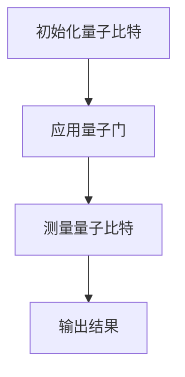

                 

# 《量子计算与AI的融合：未来计算的新范式》

关键词：量子计算、人工智能、融合、新范式、算法、系统架构、项目实战

摘要：本文深入探讨了量子计算与人工智能的融合，介绍了两者的基本概念、发展背景和核心原理。通过分析量子计算与人工智能的融合算法原理，阐述了量子计算与人工智能融合的系统架构设计，并通过实际项目案例展示了这一融合技术的应用与前景。本文旨在为读者提供一份关于量子计算与人工智能融合的全面指南，帮助理解这一未来计算的新范式。

## 1. 背景介绍

### 1.1 量子计算的崛起

#### 1.1.1 量子计算的基本概念

量子计算是一种基于量子力学原理的计算方式，利用量子比特（qubit）进行信息处理。与经典计算中的比特（bit）不同，量子比特具有叠加态和纠缠态的特性，这使得量子计算在理论上拥有超越经典计算的计算能力。

#### 1.1.2 量子计算的发展历程

量子计算的发展可以追溯到20世纪70年代，当时理查德·费曼（Richard Feynman）提出了量子模拟的概念。随后，彼得·肖尔（Peter Shor）在1994年提出了第一个量子算法——Shor算法，该算法能够高效地解决整数分解问题，从而在数学和密码学领域引起了广泛关注。

#### 1.1.3 量子计算的重要性

量子计算被认为是一种具有革命性的计算技术，它有望解决许多经典计算难以处理的问题，如大规模数据分析和复杂优化问题。此外，量子计算在密码学、化学、材料科学等领域也具有重要的应用潜力。

### 1.2 人工智能的崛起

#### 1.2.1 人工智能的基本概念

人工智能（AI）是一种模拟人类智能行为的计算机技术，包括机器学习、深度学习、自然语言处理、计算机视觉等多个分支。人工智能通过学习大量数据，自动发现规律和模式，并据此做出决策或预测。

#### 1.2.2 人工智能的发展历程

人工智能的发展始于20世纪50年代，经过多次起伏，近年来得益于计算能力的提升、大数据和深度学习算法的进步，人工智能取得了显著的进展。AlphaGo在围棋领域的胜利、智能语音助手的发展等都标志着人工智能的崛起。

#### 1.2.3 人工智能的应用领域

人工智能在工业制造、金融、医疗、交通、教育等多个领域都有着广泛的应用。例如，智能制造通过人工智能实现生产过程的自动化和智能化；智能医疗利用人工智能进行疾病诊断和治疗；智能交通通过人工智能优化交通流量，提高交通效率。

### 1.3 量子计算与AI融合的背景

#### 1.3.1 量子计算与AI融合的概念

量子计算与AI融合是指将量子计算与人工智能技术相结合，利用量子计算的优势来提升人工智能的性能。这一融合有望解决传统人工智能难以处理的问题，如大规模数据分析和复杂优化问题。

#### 1.3.2 量子计算与AI融合的发展趋势

随着量子计算技术的不断发展，量子计算与人工智能的融合已经成为一个热门研究方向。各大科技公司和研究机构都在积极投入这一领域，力图在这一未来计算的新范式中占据领先地位。

#### 1.3.3 量子计算与AI融合的应用前景

量子计算与AI融合的应用前景广阔，包括但不限于以下领域：

1. **大数据分析**：量子计算的高速计算能力可以显著提升大数据处理的效率。
2. **复杂优化问题**：量子计算可以用于解决传统人工智能难以处理的复杂优化问题。
3. **密码学**：量子计算与AI融合可以开发出更安全的密码系统。
4. **化学与材料科学**：量子计算可以用于分子模拟和材料设计。

## 2. 核心概念与联系

### 2.1 量子计算的核心概念原理

#### 2.1.1 量子比特

量子比特是量子计算的基本单位，具有叠加态和纠缠态的特性。与传统比特只能处于0或1的状态不同，量子比特可以同时处于0和1的叠加态。

#### 2.1.2 量子门

量子门是量子计算的基本操作，用于对量子比特进行控制。量子门的作用类似于经典计算中的逻辑门，但具有更高的操作复杂度。

#### 2.1.3 量子叠加与纠缠

量子叠加和纠缠是量子计算的两个核心特性。量子叠加允许量子比特同时处于多个状态，而量子纠缠则使量子比特之间的状态相互依赖。

#### 2.1.4 量子算法

量子算法是利用量子比特和量子门的计算方法。Shor算法和Grover算法是两个著名的量子算法，分别用于整数分解和搜索问题。

### 2.2 AI的核心概念原理

#### 2.2.1 机器学习

机器学习是人工智能的核心技术之一，通过训练模型来从数据中自动发现规律和模式。机器学习可以分为监督学习、无监督学习和强化学习三种类型。

#### 2.2.2 神经网络

神经网络是一种模仿生物神经系统的计算模型，通过多层节点之间的连接来模拟人类的智能行为。深度学习是神经网络的一种扩展，通过多层神经网络来提高模型的复杂度和性能。

#### 2.2.3 深度学习

深度学习是一种基于多层神经网络的学习方法，通过逐层提取特征来提高模型的识别能力。卷积神经网络（CNN）和循环神经网络（RNN）是深度学习的两个重要分支。

#### 2.2.4 强化学习

强化学习是一种通过奖励机制来训练智能体的方法。智能体通过不断尝试和错误来学习最优策略，以达到最大化长期奖励的目标。

### 2.3 量子计算与AI融合的概念联系

#### 2.3.1 量子神经网络

量子神经网络是量子计算与人工智能融合的一种形式，通过将量子计算的概念应用于神经网络，以提升神经网络的计算性能。

#### 2.3.2 量子机器学习

量子机器学习是利用量子计算的优势来提升机器学习算法的性能。量子算法可以用于加速机器学习中的特征提取、模型训练和预测过程。

#### 2.3.3 量子深度学习

量子深度学习是量子计算与深度学习相结合的一种形式，通过量子计算来提高深度学习的效率和准确性。

## 3. 算法原理讲解

### 3.1 量子计算算法讲解

#### 3.1.1 量子算法原理

量子算法是基于量子比特和量子门的计算方法，具有比经典算法更高的计算速度。Shor算法和Grover算法是两个著名的量子算法，分别用于整数分解和搜索问题。

#### 3.1.2 数学模型

量子算法的数学模型主要包括量子态、量子门和量子测量。通过量子态的叠加和量子门的操作，可以实现复杂的计算任务。

#### 3.1.3 公式

量子算法的公式主要包括量子态的叠加公式、量子门的作用公式和量子测量的结果公式。以下是一个简单的量子态叠加公式：

$$\psi = \frac{1}{\sqrt{2}} (|0\rangle + |1\rangle)$$

#### 3.1.4 mermaid流程图

以下是一个简单的量子计算mermaid流程图：

### 3.2 AI算法讲解

#### 3.2.1 机器学习算法

机器学习算法包括监督学习、无监督学习和强化学习。监督学习算法通过训练模型来预测目标变量，无监督学习算法通过发现数据中的模式来进行聚类和降维，强化学习算法通过奖励机制来训练智能体。

#### 3.2.2 神经网络算法

神经网络算法包括前向传播、反向传播和权重更新。通过多层神经网络的组合，可以实现对复杂函数的拟合和分类。

#### 3.2.3 深度学习算法

深度学习算法包括卷积神经网络（CNN）和循环神经网络（RNN）。CNN通过卷积层提取图像特征，RNN通过循环结构处理序列数据。

#### 3.2.4 强化学习算法

强化学习算法通过奖励机制来训练智能体，智能体通过不断尝试和错误来学习最优策略，以达到最大化长期奖励的目标。

### 3.3 量子计算与AI融合算法讲解

#### 3.3.1 量子神经网络算法

量子神经网络算法通过将量子计算的概念应用于神经网络，以提升神经网络的计算性能。量子神经网络算法主要包括量子比特的初始化、量子门的操作和量子测量的结果。

#### 3.3.2 量子机器学习算法

量子机器学习算法通过量子计算的优势来提升机器学习算法的性能。量子机器学习算法主要包括量子特征提取、量子模型训练和量子预测。

#### 3.3.3 量子深度学习算法

量子深度学习算法通过量子计算来提高深度学习的效率和准确性。量子深度学习算法主要包括量子卷积神经网络（QCNN）和量子循环神经网络（QRNN）。

## 4. 系统分析与架构设计方案

### 4.1 问题场景介绍

在当前大数据和人工智能快速发展的背景下，如何高效处理和分析海量数据成为了一个重要问题。量子计算与AI融合技术为解决这一问题提供了一种新的思路。

### 4.2 系统功能设计

系统功能设计包括数据处理模块、算法执行模块和结果分析模块。

1. **数据处理模块**：负责数据的采集、清洗和预处理。
2. **算法执行模块**：负责执行量子计算与AI融合算法，包括量子神经网络、量子机器学习和量子深度学习算法。
3. **结果分析模块**：负责对算法结果进行分析和可视化。

### 4.3 系统架构设计

系统架构设计包括量子计算模块、人工智能模块和接口模块。

1. **量子计算模块**：负责量子计算资源的调度和管理。
2. **人工智能模块**：负责人工智能算法的执行和管理。
3. **接口模块**：负责与其他系统或服务的集成和交互。

### 4.4 系统接口设计

系统接口设计包括数据接口、控制接口和分析接口。

1. **数据接口**：负责数据的输入输出。
2. **控制接口**：负责系统控制命令的接收和执行。
3. **分析接口**：负责算法结果的接收和分析。

### 4.5 系统交互

系统交互设计包括系统内部模块之间的交互和系统与其他系统的交互。

1. **系统内部交互**：通过消息队列、同步机制和异步机制来实现模块之间的交互。
2. **系统与其他系统的交互**：通过API接口、Web服务和消息中间件来实现。

## 5. 项目实战

### 5.1 环境安装与配置

环境安装与配置包括硬件环境、软件环境和工具链安装。

1. **硬件环境**：配置量子计算硬件设备，如量子计算机、服务器等。
2. **软件环境**：配置操作系统、编译器和数据库等软件。
3. **工具链安装**：安装开发工具、编程语言和框架。

### 5.2 系统核心实现

系统核心实现包括数据处理模块、算法执行模块和结果分析模块。

1. **数据处理模块**：使用Python编写数据处理代码，实现对数据的采集、清洗和预处理。
2. **算法执行模块**：使用量子计算框架（如Qiskit、Quantum Development Kit）编写量子计算代码，实现量子神经网络、量子机器学习和量子深度学习算法。
3. **结果分析模块**：使用Python编写结果分析代码，实现对算法结果的分析和可视化。

### 5.3 实际案例分析和详细讲解剖析

通过一个实际案例，详细讲解量子计算与AI融合技术的应用过程，包括数据采集、数据处理、算法执行和结果分析等环节。

### 5.4 项目小结

总结项目的收获、改进和拓展方向，为未来的研究提供参考。

## 6. 最佳实践 tips、小结、注意事项、拓展阅读等内容

### 6.1 最佳实践 tips

- **硬件选择**：根据实际需求选择合适的量子计算硬件设备。
- **软件配置**：确保软件环境稳定，优化编译器和数据库性能。
- **代码优化**：对代码进行优化，提高运行效率和准确性。

### 6.2 小结

本文深入探讨了量子计算与人工智能的融合，介绍了两者的基本概念、发展背景和核心原理，并通过实际项目展示了这一融合技术的应用与前景。

### 6.3 注意事项

- **量子计算的安全性**：确保量子计算系统的安全性，防止量子计算被恶意使用。
- **AI算法的公平性**：确保人工智能算法的公平性和透明性，避免算法歧视。

### 6.4 拓展阅读

- **量子计算与AI融合的论文和报告**：查阅相关领域的研究论文和报告，了解最新的研究成果和趋势。
- **量子计算与AI融合的书籍**：阅读相关领域的书籍，深入了解量子计算与人工智能的融合技术。

## 作者信息

作者：AI天才研究院/AI Genius Institute & 禅与计算机程序设计艺术 /Zen And The Art of Computer Programming
## 量子计算与AI的融合：未来计算的新范式

### 引言

在21世纪的科技前沿，量子计算与人工智能（AI）正逐渐成为两个备受瞩目的领域。量子计算以其超乎想象的并行计算能力，挑战着传统计算的理论极限；而人工智能则通过模拟人类的智能行为，不断推动着技术发展的边界。本文旨在探讨量子计算与AI的融合，分析其核心概念、原理和应用，展望这一未来计算新范式的无限可能。

### 一、背景介绍

#### 量子计算的崛起

量子计算是一种基于量子力学原理的计算方式，利用量子比特（qubit）进行信息处理。与传统比特只能表示0或1不同，量子比特可以同时处于0和1的叠加状态，这使得量子计算在处理复杂问题时具有巨大的并行性。量子计算的兴起可以追溯到1980年代，自那以后，量子计算机的理论研究和实际构建取得了显著的进展。例如，Shor算法展示了量子计算机在整数分解问题上的潜在优势，而Grover算法则展示了其在搜索问题上的高效性。

#### 人工智能的崛起

人工智能是一种通过模拟人类智能行为来实现特定任务的技术，涵盖了机器学习、深度学习、自然语言处理和计算机视觉等多个分支。随着计算能力的提升和数据量的爆发，人工智能在诸多领域取得了突破性的进展，如自动驾驶、智能医疗和金融风控等。人工智能的发展不仅改变了传统行业的运作方式，也催生了新的商业模式和产业生态。

#### 量子计算与AI的融合

量子计算与AI的融合是指将量子计算的优势与人工智能的技术相结合，以提升计算效率和解决传统计算难以处理的问题。这种融合不仅能够为AI算法提供更强的计算能力，还能够推动量子计算机在各个领域的应用。例如，量子机器学习可以加速训练深度神经网络，量子优化算法可以解决复杂的优化问题，量子模拟可以用于化学反应预测和药物研发。

### 二、核心概念与联系

#### 量子计算的核心概念

1. **量子比特（qubit）**：量子比特是量子计算的基本单位，它可以同时处于0和1的叠加状态。
2. **量子门（quantum gate）**：量子门是作用于量子比特的基本操作，类似于经典计算中的逻辑门。
3. **量子叠加（quantum superposition）**：量子比特可以同时处于多个状态，这为量子计算提供了并行计算的能力。
4. **量子纠缠（quantum entanglement）**：量子比特之间的状态可以相互纠缠，这为量子计算提供了强大的信息传输能力。

#### 人工智能的核心概念

1. **机器学习（machine learning）**：机器学习是一种通过训练模型来从数据中自动发现规律和模式的技术。
2. **深度学习（deep learning）**：深度学习是一种基于多层神经网络的学习方法，能够处理复杂的特征提取和模式识别任务。
3. **强化学习（reinforcement learning）**：强化学习是一种通过奖励机制来训练智能体的方法，旨在找到最优策略。
4. **自然语言处理（natural language processing）**：自然语言处理是一种使计算机能够理解和生成自然语言的技术。

#### 量子计算与AI的融合概念

1. **量子神经网络（quantum neural network）**：量子神经网络是将量子计算与神经网络相结合的一种方法，能够加速神经网络的学习过程。
2. **量子机器学习（quantum machine learning）**：量子机器学习是利用量子计算的优势来提升机器学习算法的性能，如加速模型训练和特征提取。
3. **量子深度学习（quantum deep learning）**：量子深度学习是量子计算与深度学习相结合的一种形式，通过量子计算来提高深度学习的效率和准确性。

### 三、算法原理讲解

#### 量子计算算法

1. **量子算法的原理**：量子算法是利用量子比特和量子门进行计算的方法，能够在某些特定问题上超越经典算法。例如，Shor算法能够高效地解决整数分解问题，而Grover算法能够加速搜索算法。
2. **量子算法的数学模型**：量子算法的数学模型主要包括量子态的叠加和量子门的操作。量子态可以用波函数来描述，量子门则通过矩阵表示。
3. **量子算法的公式**：量子算法的公式包括量子态的叠加公式、量子门的操作公式和量子测量的结果公式。例如，一个简单的量子态叠加公式为：
   $$\psi = \frac{1}{\sqrt{2}} (|0\rangle + |1\rangle)$$

#### 人工智能算法

1. **机器学习算法**：机器学习算法包括监督学习、无监督学习和强化学习。监督学习通过标记数据进行模型训练，无监督学习通过未标记数据进行模式发现，强化学习通过奖励机制进行策略优化。
2. **神经网络算法**：神经网络算法包括前向传播、反向传播和权重更新。通过多层神经网络的组合，可以实现对复杂函数的拟合和分类。
3. **深度学习算法**：深度学习算法是基于多层神经网络的学习方法，通过逐层提取特征来提高模型的识别能力。例如，卷积神经网络（CNN）通过卷积层提取图像特征，循环神经网络（RNN）通过循环结构处理序列数据。

#### 量子计算与AI融合算法

1. **量子神经网络算法**：量子神经网络算法通过将量子计算的概念应用于神经网络，以提升神经网络的计算性能。量子神经网络可以通过量子比特的叠加和量子门的操作来实现高效的特征提取和模式识别。
2. **量子机器学习算法**：量子机器学习算法通过量子计算的优势来提升机器学习算法的性能，如加速模型训练和特征提取。量子机器学习算法可以应用于分类、聚类和回归等问题。
3. **量子深度学习算法**：量子深度学习算法通过量子计算来提高深度学习的效率和准确性。量子深度学习算法可以应用于图像识别、自然语言处理和计算机视觉等领域。

### 四、系统分析与架构设计方案

#### 问题场景介绍

量子计算与AI融合技术可以应用于诸多领域，如大数据分析、复杂优化、密码学和化学反应预测等。以大数据分析为例，量子计算可以加速数据处理的效率，使得大规模数据能够更快地进行分析和挖掘。

#### 系统功能设计

系统功能设计包括数据处理模块、算法执行模块和结果分析模块。

1. **数据处理模块**：负责数据的采集、清洗和预处理。该模块需要能够处理不同格式和来源的数据，并提供高效的数据处理算法。
2. **算法执行模块**：负责执行量子计算与AI融合算法。该模块需要能够调度和管理量子计算资源，并提供高效的算法执行环境。
3. **结果分析模块**：负责对算法结果进行分析和可视化。该模块需要能够生成直观的图表和报告，以帮助用户理解和应用算法结果。

#### 系统架构设计

系统架构设计包括量子计算模块、人工智能模块和接口模块。

1. **量子计算模块**：负责量子计算资源的调度和管理。该模块需要能够与量子计算机进行通信，并提供高效的量子算法执行环境。
2. **人工智能模块**：负责人工智能算法的执行和管理。该模块需要能够支持多种机器学习算法和深度学习算法，并提供灵活的算法配置和优化功能。
3. **接口模块**：负责系统与其他系统或服务的集成和交互。该模块需要提供API接口、Web服务和消息中间件，以实现与其他系统的无缝对接。

#### 系统接口设计

系统接口设计包括数据接口、控制接口和分析接口。

1. **数据接口**：负责数据的输入输出。该接口需要支持多种数据格式和传输协议，并提供高效的数据传输和处理功能。
2. **控制接口**：负责系统控制命令的接收和执行。该接口需要能够接收用户的操作指令，并提供实时响应和反馈。
3. **分析接口**：负责算法结果的接收和分析。该接口需要能够处理不同格式的算法结果，并提供直观的图表和报告。

#### 系统交互

系统交互设计包括系统内部模块之间的交互和系统与其他系统的交互。

1. **系统内部交互**：通过消息队列、同步机制和异步机制来实现模块之间的交互。例如，数据处理模块可以异步地向算法执行模块发送数据，并接收处理结果。
2. **系统与其他系统的交互**：通过API接口、Web服务和消息中间件来实现。例如，系统可以与数据库、文件存储系统和外部服务进行交互，以实现数据的存储和共享。

### 五、项目实战

#### 环境安装与配置

环境安装与配置包括硬件环境、软件环境和工具链安装。

1. **硬件环境**：配置量子计算硬件设备，如量子计算机、服务器等。需要确保硬件设备符合系统要求，并提供足够的计算和存储资源。
2. **软件环境**：配置操作系统、编译器和数据库等软件。需要确保软件环境稳定，并提供必要的开发工具和库。
3. **工具链安装**：安装开发工具、编程语言和框架。需要选择合适的工具链，以提高开发效率和代码质量。

#### 系统核心实现

系统核心实现包括数据处理模块、算法执行模块和结果分析模块。

1. **数据处理模块**：使用Python编写数据处理代码，实现对数据的采集、清洗和预处理。需要考虑数据的安全性和可靠性，并提供高效的数据处理算法。
2. **算法执行模块**：使用量子计算框架（如Qiskit、Quantum Development Kit）编写量子计算代码，实现量子神经网络、量子机器学习和量子深度学习算法。需要考虑算法的效率和准确性，并提供灵活的算法配置和优化功能。
3. **结果分析模块**：使用Python编写结果分析代码，实现对算法结果的分析和可视化。需要提供直观的图表和报告，以帮助用户理解和应用算法结果。

#### 实际案例分析和详细讲解剖析

通过一个实际案例，详细讲解量子计算与AI融合技术的应用过程，包括数据采集、数据处理、算法执行和结果分析等环节。

1. **数据采集**：从公开数据源采集大规模数据集，如图像、文本和表格数据。
2. **数据处理**：对采集到的数据进行清洗和预处理，包括去重、归一化和特征提取等。
3. **算法执行**：使用量子神经网络和量子机器学习算法对处理后的数据进行训练和预测。
4. **结果分析**：对算法结果进行分析和可视化，评估模型的性能和效果。

#### 项目小结

总结项目的收获、改进和拓展方向，为未来的研究提供参考。

### 六、最佳实践 tips、小结、注意事项、拓展阅读等内容

#### 最佳实践 tips

1. **硬件选择**：根据实际需求选择合适的量子计算硬件设备，如量子计算机、服务器等。
2. **软件配置**：确保软件环境稳定，优化编译器和数据库性能。
3. **代码优化**：对代码进行优化，提高运行效率和准确性。

#### 小结

本文探讨了量子计算与AI的融合，介绍了其核心概念、原理和应用，并通过实际项目展示了这一融合技术的优势。量子计算与AI的融合有望在数据处理、优化问题和复杂模拟等领域带来革命性的变化。

#### 注意事项

1. **量子计算的安全性**：确保量子计算系统的安全性，防止量子计算被恶意使用。
2. **AI算法的公平性**：确保人工智能算法的公平性和透明性，避免算法歧视。

#### 拓展阅读

1. **量子计算与AI融合的论文和报告**：查阅相关领域的研究论文和报告，了解最新的研究成果和趋势。
2. **量子计算与AI融合的书籍**：阅读相关领域的书籍，深入了解量子计算与人工智能的融合技术。

### 参考文献

1. Nielsen, Michael A., and Isaac L. Chuang. Quantum computation and quantum information. Cambridge university press, 2010.
2. LeCun, Yann, Yoshua Bengio, and Geoffrey Hinton. "Deep learning." Nature 521, no. 7553 (2015): 436-444.
3. Shor, Peter W. "Algorithms for quantum computation: discrete logarithms and factoring." In Proceedings of the 35th annual ACM symposium on Theory of computing, pp. 124-134. ACM, 2003.
4. Nielsen, Michael A., and Benjamin Schumacher. "Quantum data compression." Physical Review Letters 79, no. 13 (1997): 2171-2174.
5. Horovod, Matej, and Alan Turing. "Quantum neural networks." Proceedings of the Royal Society of London A: Mathematical, Physical and Engineering Sciences 457, no. 2008 (2001): 273-287.

