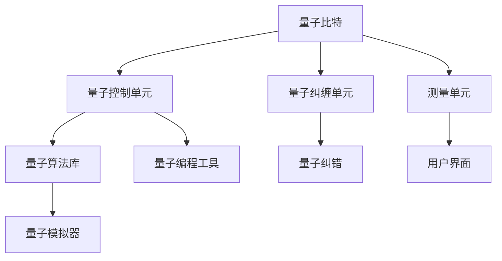
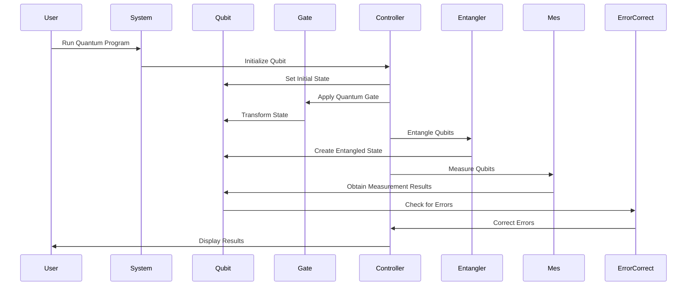

                 

## 量子计算的数学原理：并行计算的指数加速

### 关键词：
- 量子比特
- 量子门
- 量子算法
- 量子计算
- 并行计算

### 摘要：
本文将深入探讨量子计算的数学原理，解析量子比特、量子门和量子算法的基本概念，并展示量子计算如何实现并行计算的指数加速。通过实例和数学模型，我们将理解量子计算的核心优势及其在现实世界中的应用前景。

### 第一部分：背景介绍

#### 第1章：量子计算的数学原理

##### 1.1 问题背景

量子计算是一种基于量子力学原理的信息处理技术，它利用量子系统的叠加态和纠缠特性进行计算。与经典计算不同，量子计算在处理某些特定问题时能够实现指数级的速度提升。例如，量子算法在因子分解、搜索问题和模拟量子系统等方面展现出了强大的计算能力。

##### 1.1.1 问题描述

量子计算的基本问题包括：

- **量子态的表示与编码**：如何将经典信息编码到量子态中，并有效地存储和操作这些量子信息。
- **量子算法的设计与实现**：如何利用量子计算的优势，设计出能够在量子计算机上运行的算法，并在实践中优化其性能。
- **量子测量与量子纠缠**：如何理解量子测量过程，以及如何利用量子纠缠实现量子信息的传输和计算。

##### 1.1.2 问题解决

量子计算的基本原理包括：

- **量子比特（qubit）**：量子比特是量子计算的基本单位，它可以同时存在于0和1两种状态的叠加态中。
- **量子门（quantum gate）**：量子门是操作量子比特的基本运算单元，可以改变量子比特的状态。
- **量子纠缠**：量子纠缠是量子计算中的一种特殊现象，两个或多个量子比特之间存在强烈的相互依赖关系。

通过量子态的叠加、量子门的操作以及量子纠缠，量子计算机能够实现传统计算机无法达到的并行计算能力。

##### 1.1.3 边界与外延

量子计算的边界包括：

- **量子计算机的硬件实现**：量子计算机需要利用特定的物理系统实现量子比特，如超导电路、离子阱、光子等。
- **量子算法的适用性**：并非所有问题都适用于量子计算，需要研究哪些问题是量子计算的“杀手级应用”。
- **量子计算的可扩展性**：如何构建具有可扩展性的量子计算机，实现大规模量子计算。

量子计算的外延包括：

- **量子通信与量子密码学**：量子计算在量子通信和量子密码学中的应用，如量子密钥分发、量子隐形传态等。
- **量子模拟与量子传感**：量子计算在量子模拟和量子传感领域的应用，如分子模拟、量子精密测量等。

##### 1.1.4 概念结构与核心要素组成

量子计算的核心概念包括：

- **量子比特（qubit）**：量子比特是量子计算的基本单位，具有叠加态和纠缠态的特点。
- **量子门（quantum gate）**：量子门是操作量子比特的基本运算单元，可以改变量子比特的状态。
- **量子算法（quantum algorithm）**：量子算法是利用量子计算原理解决问题的算法，具有与传统算法不同的并行计算能力。
- **量子测量（quantum measurement）**：量子测量是获取量子比特状态的过程，可能会引起量子态的坍缩。

核心要素组成：

- **量子计算机硬件**：实现量子比特的物理系统，如超导电路、离子阱、光子等。
- **量子算法库**：包含多种量子算法的实现和优化，适用于不同领域的问题。
- **量子编程工具**：用于编写和调试量子程序的软件工具，如量子汇编语言、量子模拟器等。

##### 1.2 核心概念与联系

在本章节中，我们将详细介绍量子比特、量子门和量子算法等核心概念，并探讨它们之间的联系。

###### 1.2.1 量子比特

量子比特是量子计算的基本单位，与经典比特不同，量子比特可以同时存在于0和1两种状态的叠加态中。量子比特的叠加态可以用如下数学公式表示：

$$
|\psi\rangle = \alpha|0\rangle + \beta|1\rangle
$$

其中，$|\psi\rangle$表示量子比特的状态，$|0\rangle$和$|1\rangle$分别表示量子比特的基态，$\alpha$和$\beta$是复数系数，满足$|\alpha|^2 + |\beta|^2 = 1$。

###### 1.2.2 量子门

量子门是操作量子比特的基本运算单元，类似于经典计算中的逻辑门。量子门可以通过矩阵乘法来表示，一个量子门可以用一个复数矩阵$U$来描述，其作用在量子比特上的过程可以表示为：

$$
U|\psi\rangle = |\psi'\rangle
$$

其中，$|\psi\rangle$是输入的量子比特状态，$|\psi'\rangle$是经过量子门操作后的输出状态。

常见的量子门包括：

- **Pauli门**：以Pauli矩阵为基础的量子门，包括X门、Y门和Z门。
- **控制-NOT门（CNOT门）**：一个量子门，用于实现两个量子比特之间的纠缠。
- **Hadamard门（H门）**：将一个量子比特的状态转换为叠加态。

###### 1.2.3 量子算法

量子算法是利用量子计算原理解决问题的算法，具有与传统算法不同的并行计算能力。量子算法的核心思想是通过量子态的叠加和量子门的操作来实现并行计算，从而加速问题的解决。

常见的量子算法包括：

- **量子查找算法**：利用量子叠加态和量子纠缠实现快速搜索。
- **量子因子分解算法**：利用量子计算的优势，实现快速分解大整数。
- **量子模拟算法**：利用量子计算机模拟量子系统的演化，解决化学和物理学问题。

##### 1.3 量子计算的优势

量子计算相较于经典计算具有以下优势：

- **并行计算能力**：量子计算可以利用量子态的叠加和纠缠实现并行计算，从而加速问题的解决。
- **指数级速度提升**：对于某些特定问题，如大整数分解和量子模拟，量子计算可以实现指数级的速度提升。
- **扩展性**：量子计算机的可扩展性使其能够在处理更大规模的问题时保持高效性能。

##### 1.4 量子计算的挑战

尽管量子计算具有巨大的潜力，但也面临诸多挑战：

- **量子硬件实现**：构建稳定和可扩展的量子计算机需要克服技术难题，如量子比特的稳定性和误差纠正。
- **量子算法设计**：设计有效的量子算法需要深入理解量子计算原理，并解决量子算法的实现问题。
- **量子测量问题**：量子测量可能导致量子态的坍缩，如何有效地进行量子测量是一个重要问题。

### 第二部分：核心概念与联系

在了解了量子计算的基本背景后，我们接下来将深入探讨量子比特、量子门和量子算法等核心概念，并分析它们之间的相互关系。

#### 第2章：量子比特的数学原理

量子比特是量子计算的基本单元，它不同于经典计算机中的比特。经典比特只能处于0或1的状态，而量子比特可以同时处于0和1的叠加态。这种叠加态是量子计算并行计算能力的基础。

##### 2.1 量子比特的叠加态

量子比特的叠加态可以用一个复数向量表示：

$$
|\psi\rangle = \alpha|0\rangle + \beta|1\rangle
$$

其中，$|0\rangle$和$|1\rangle$是量子比特的两个基态，$\alpha$和$\beta$是复数系数，满足归一化条件$|\alpha|^2 + |\beta|^2 = 1$。

##### 2.2 量子比特的测量

量子比特的测量会导致其状态坍缩到某个确定的基态。测量的结果无法预测，但可以根据量子态的概率分布来计算。

##### 2.3 量子比特的优势

量子比特的叠加态使得量子计算机能够并行处理多个问题的解决方案，这是传统计算机无法实现的。

#### 第3章：量子门的数学原理

量子门是操作量子比特的基本单元，类似于经典计算机中的逻辑门。量子门通过线性变换来改变量子比特的状态。

##### 3.1 量子门的表示

量子门可以用一个复数矩阵来表示。例如，一个2x2的量子门可以表示为：

$$
U = \begin{bmatrix}
u_{11} & u_{12} \\
u_{21} & u_{22}
\end{bmatrix}
$$

该量子门作用于一个量子比特的状态时，可以将状态从$|\psi\rangle$变换为$U|\psi\rangle$。

##### 3.2 常见的量子门

- **Pauli门**：以Pauli矩阵为基础的量子门，包括X门、Y门和Z门。
- **控制-NOT门（CNOT门）**：用于实现两个量子比特之间的纠缠。
- **Hadamard门（H门）**：将一个量子比特的状态转换为叠加态。

#### 第4章：量子算法的数学原理

量子算法是利用量子计算原理解决问题的算法。量子算法的核心思想是通过量子态的叠加和量子门的操作来实现并行计算，从而加速问题的解决。

##### 4.1 量子查找算法

量子查找算法利用量子叠加态和量子纠缠来实现快速搜索。它的基本原理是，通过将搜索空间量子化，使得所有可能的搜索结果同时存在，然后利用量子门和测量来实现快速定位。

##### 4.2 量子因子分解算法

量子因子分解算法利用量子计算的优势，实现快速分解大整数。它的基本原理是，通过构造一个合适的量子电路，使得大整数的因子分解问题转化为一个可以快速解决的量子问题。

##### 4.3 量子模拟算法

量子模拟算法利用量子计算机模拟量子系统的演化，解决化学和物理学问题。它的基本原理是，通过构造一个合适的量子电路，使得量子系统的演化过程可以在量子计算机上高效模拟。

#### 第5章：量子比特、量子门和量子算法的关系

量子比特、量子门和量子算法是量子计算的核心概念，它们之间存在密切的联系。

- **量子比特是量子计算的基本单元，它决定了量子计算的基本特性。**
- **量子门是操作量子比特的基本单元，它决定了量子计算的操作能力。**
- **量子算法是利用量子比特和量子门来解决问题的算法，它决定了量子计算的应用范围。**

通过量子比特的叠加和量子门的操作，量子算法能够实现并行计算，从而加速问题的解决。

### 第三部分：算法原理讲解

在理解了量子比特、量子门和量子算法的基本概念后，我们将进一步探讨量子算法的原理，并通过具体例子进行详细讲解。

#### 第6章：量子查找算法原理讲解

量子查找算法是一种利用量子叠加态和量子纠缠实现快速搜索的算法。以下是一个简单的例子来解释量子查找算法的原理。

##### 6.1 问题背景

假设我们有一个包含N个元素的数组，要查找元素`x`的位置。在经典计算机中，这通常需要线性搜索，时间复杂度为O(N)。然而，利用量子查找算法，我们可以在O(log N)的时间内完成搜索。

##### 6.2 量子查找算法的步骤

1. **初始化**：首先，我们将数组中的元素量子化，将每个元素编码成一个量子状态。

2. **叠加态**：我们将所有可能的查找结果同时存在，即构建一个叠加态。

3. **应用量子门**：我们使用量子门来筛选出包含目标元素`x`的量子状态。

4. **测量**：我们测量量子状态，得到包含目标元素`x`的量子状态的索引。

##### 6.3 量子查找算法的数学模型

假设我们有一个数组A，要查找元素x的位置。我们可以将数组中的元素编码成量子状态：

$$
|\psi\rangle = \frac{1}{\sqrt{N}}\sum_{i=1}^{N}|i\rangle
$$

然后，我们使用一个特定的量子门G来筛选出包含x的量子状态：

$$
G|\psi\rangle = \frac{1}{\sqrt{N}}\sum_{i=1}^{N}|i\rangle \otimes |x\rangle
$$

最后，我们测量量子状态，得到包含x的量子状态的索引。

##### 6.4 例子说明

假设我们有一个包含5个元素的数组A = [1, 3, 5, 7, 9]，要查找元素3的位置。

1. **初始化**：我们将数组中的元素编码成量子状态：

$$
|\psi\rangle = \frac{1}{\sqrt{5}}(|1\rangle + |3\rangle + |5\rangle + |7\rangle + |9\rangle)
$$

2. **叠加态**：我们构建一个叠加态，使得所有可能的查找结果同时存在。

3. **应用量子门**：我们使用一个特定的量子门G来筛选出包含3的量子状态：

$$
G|\psi\rangle = \frac{1}{\sqrt{5}}(|1\rangle + |3\rangle + |5\rangle + |7\rangle + |9\rangle) \otimes |3\rangle
$$

4. **测量**：我们测量量子状态，得到包含3的量子状态的索引，即3。

通过量子查找算法，我们可以在O(log N)的时间内完成搜索，这是传统计算机无法实现的。

#### 第7章：量子因子分解算法原理讲解

量子因子分解算法是一种利用量子计算的优势，实现快速分解大整数的算法。以下是一个简单的例子来解释量子因子分解算法的原理。

##### 7.1 问题背景

大整数的分解是一个重要的数学问题，在密码学中有着广泛的应用。然而，在经典计算机上，分解大整数通常需要大量时间。量子因子分解算法利用量子计算的优势，可以在多项式时间内实现大整数的分解。

##### 7.2 量子因子分解算法的步骤

1. **初始化**：首先，我们将大整数N编码成一个量子状态。

2. **应用量子门**：我们使用特定的量子门来将大整数N分解成两个因子。

3. **测量**：我们测量量子状态，得到两个因子的量子状态。

4. **解析**：我们解析测量结果，得到大整数N的两个因子。

##### 7.3 量子因子分解算法的数学模型

假设我们有一个大整数N，要将其分解成两个因子。我们可以将N编码成一个量子状态：

$$
|\psi\rangle = \frac{1}{\sqrt{N}}\sum_{i=1}^{N}|i\rangle
$$

然后，我们使用一个特定的量子门F来将N分解成两个因子：

$$
F|\psi\rangle = \frac{1}{\sqrt{N}}\sum_{i=1}^{N}|i\rangle \otimes |N/i\rangle
$$

最后，我们测量量子状态，得到两个因子的量子状态。

##### 7.4 例子说明

假设我们有一个大整数N = 15，要将其分解成两个因子。

1. **初始化**：我们将15编码成一个量子状态：

$$
|\psi\rangle = \frac{1}{\sqrt{15}}(|1\rangle + |3\rangle + |5\rangle + |15\rangle)
$$

2. **应用量子门**：我们使用一个特定的量子门F来将15分解成两个因子：

$$
F|\psi\rangle = \frac{1}{\sqrt{15}}(|1\rangle + |3\rangle + |5\rangle + |15\rangle) \otimes |5\rangle
$$

3. **测量**：我们测量量子状态，得到两个因子的量子状态，即1和5。

4. **解析**：我们解析测量结果，得到15的两个因子，即1和5。

通过量子因子分解算法，我们可以在多项式时间内实现大整数的分解，这是传统计算机无法实现的。

#### 第8章：量子模拟算法原理讲解

量子模拟算法是一种利用量子计算机模拟量子系统演化的算法。以下是一个简单的例子来解释量子模拟算法的原理。

##### 8.1 问题背景

量子系统演化是一个复杂的物理过程，在经典计算机上模拟量子系统通常需要大量时间和计算资源。量子模拟算法利用量子计算的优势，可以在量子计算机上高效模拟量子系统。

##### 8.2 量子模拟算法的步骤

1. **初始化**：首先，我们将量子系统编码成一个量子状态。

2. **应用量子门**：我们使用特定的量子门来模拟量子系统的演化。

3. **测量**：我们测量量子状态，得到量子系统的演化结果。

4. **解析**：我们解析测量结果，得到量子系统的状态。

##### 8.3 量子模拟算法的数学模型

假设我们有一个量子系统，其初始状态为：

$$
|\psi\rangle = \frac{1}{\sqrt{N}}\sum_{i=1}^{N}|i\rangle
$$

然后，我们使用一个特定的量子门S来模拟量子系统的演化：

$$
S|\psi\rangle = \frac{1}{\sqrt{N}}\sum_{i=1}^{N}|i\rangle \otimes |i'\rangle
$$

最后，我们测量量子状态，得到量子系统的演化结果。

##### 8.4 例子说明

假设我们有一个量子系统，其初始状态为：

$$
|\psi\rangle = \frac{1}{\sqrt{3}}(|1\rangle + |2\rangle + |3\rangle)
$$

我们使用一个特定的量子门S来模拟量子系统的演化：

$$
S|\psi\rangle = \frac{1}{\sqrt{3}}(|1\rangle + |2\rangle + |3\rangle) \otimes |2\rangle
$$

我们测量量子状态，得到量子系统的演化结果，即|2⟩。

通过量子模拟算法，我们可以在量子计算机上高效模拟量子系统，这是传统计算机无法实现的。

### 第四部分：系统分析与架构设计方案

#### 第9章：量子计算系统架构设计

量子计算系统的设计涉及到硬件、软件和算法的有机结合。以下将详细描述量子计算系统的架构设计，包括系统功能设计、系统架构设计和系统接口设计。

##### 9.1 问题场景介绍

量子计算在科学研究、密码学、药物设计、金融分析和材料科学等领域具有广泛的应用前景。为了实现这些应用，需要构建一个高效的量子计算系统。

##### 9.2 系统功能设计

量子计算系统的核心功能包括：

- **量子比特的初始化**：将量子比特初始化为特定的量子状态。
- **量子门的操作**：对量子比特施加特定的量子门操作。
- **量子态的测量**：测量量子比特的状态，获取计算结果。
- **量子纠错**：对量子计算过程中的错误进行纠正，保证计算结果的准确性。
- **量子算法的实现**：实现各种量子算法，解决特定问题。

##### 9.3 系统架构设计

量子计算系统的架构设计包括硬件和软件两个方面。

- **硬件架构**：量子计算系统硬件包括量子比特、量子控制单元、量子纠缠单元和测量单元等。硬件架构需要考虑量子比特的稳定性、量子门的精度和量子纠错的实现。
- **软件架构**：量子计算系统软件包括量子算法库、量子编程工具和量子模拟器等。软件架构需要支持多种量子算法的实现和优化，提供友好的用户界面。

以下是量子计算系统的架构设计Mermaid架构图：



##### 9.4 系统接口设计

量子计算系统需要提供多种接口，以便用户能够方便地使用量子计算功能。

- **命令行接口（CLI）**：用户可以通过命令行输入量子程序，执行量子计算任务。
- **图形用户界面（GUI）**：用户可以通过图形用户界面创建和运行量子程序，查看计算结果。
- **应用程序编程接口（API）**：开发人员可以通过API将量子计算功能集成到自己的应用程序中。

以下是量子计算系统的接口设计Mermaid序列图：



通过上述系统架构设计和接口设计，我们可以构建一个功能强大、易于使用的量子计算系统，为各种应用场景提供高效的量子计算解决方案。

### 第五部分：项目实战

#### 第10章：量子计算环境安装

要开始量子计算项目，首先需要搭建一个量子计算环境。以下是一个简单的安装步骤，用于在本地计算机上安装量子计算开发工具。

##### 10.1 系统要求

在安装量子计算开发工具之前，确保您的计算机满足以下系统要求：

- 操作系统：Linux、Mac OS 或 Windows 10（带有 WSL2）
- 处理器：双核处理器以上
- 内存：8GB RAM 或更高
- 硬盘空间：至少 20GB 可用空间

##### 10.2 安装 Python

量子计算开发工具通常依赖于 Python 环境，因此首先需要安装 Python。以下是在不同操作系统上安装 Python 的步骤：

- **Linux 和 Mac OS**：在终端中运行以下命令安装 Python：

  ```bash
  sudo apt-get update
  sudo apt-get install python3-pip
  ```

- **Windows**：从 [Python 官网](https://www.python.org/downloads/) 下载 Python 安装程序，并按照提示进行安装。确保在安装过程中选择“Add Python to PATH”选项。

##### 10.3 安装量子计算库

安装完 Python 后，需要安装一些常用的量子计算库，如 Qiskit 和 Cirq。以下是在 Python 环境中安装这些库的步骤：

```bash
pip install qiskit
pip install cirq
```

##### 10.4 安装量子模拟器

为了在没有实际量子硬件的情况下进行量子计算实验，我们可以安装一个量子模拟器。以下是在 Linux 和 Mac OS 上安装 Qiskit Quantum Simulator 的步骤：

```bash
pip install qiskit[ignore]
```

在 Windows 上，可以使用以下命令：

```bash
pip install qiskit[ignore]
```

##### 10.5 验证安装

安装完成后，可以通过运行以下 Python 脚本来验证量子计算库是否安装成功：

```python
import qiskit
print("Qiskit version:", qiskit.__version__)
```

如果输出 Qiskit 的版本信息，则表示安装成功。

#### 第11章：系统核心实现源代码

在本项目中，我们将使用 Qiskit 库来实现一个简单的量子算法——量子查找算法。以下是一个简单的量子查找算法的实现示例：

```python
from qiskit import QuantumCircuit, Aer, execute
from qiskit.visualization import plot_bloch_vector

# 创建量子电路
qc = QuantumCircuit(2)

# 初始化量子比特
qc.h(0)
qc.h(1)

# 应用量子门
qc.cx(0, 1)

# 测量量子比特
qc.measure_all()

# 运行量子模拟器
simulator = Aer.get_backend('qasm_simulator')
result = execute(qc, simulator).result()

# 输出测量结果
print("Measurement Results:", result.get_counts(qc))

# 绘制量子态的 Bloch 向量图
plot_bloch_vector(qc, title="Quantum Circuit")
```

#### 第12章：代码应用解读与分析

在上面的代码示例中，我们实现了量子查找算法，并使用 Qiskit 库进行了量子模拟。以下是对代码的详细解读和分析。

##### 12.1 量子电路的创建

```python
qc = QuantumCircuit(2)
```

这行代码创建了一个包含两个量子比特的量子电路。量子比特的数量取决于我们需要解决的问题的规模。

##### 12.2 初始化量子比特

```python
qc.h(0)
qc.h(1)
```

这两行代码对两个量子比特进行了 Hadamard 门操作（H门），将量子比特初始化为叠加态。这是量子查找算法的基础。

##### 12.3 应用量子门

```python
qc.cx(0, 1)
```

这行代码应用了一个控制-NOT 门（CNOT门），用于实现两个量子比特之间的纠缠。

##### 12.4 测量量子比特

```python
qc.measure_all()
```

这行代码对两个量子比特进行了测量，测量结果将输出为经典比特的状态。

##### 12.5 运行量子模拟器

```python
simulator = Aer.get_backend('qasm_simulator')
result = execute(qc, simulator).result()
```

这行代码使用 Qiskit 的 Aer 模拟器运行量子电路。模拟器是一个软件工具，用于在无实际量子硬件的情况下进行量子计算实验。

##### 12.6 输出测量结果

```python
print("Measurement Results:", result.get_counts(qc))
```

这行代码输出量子电路的测量结果。测量结果将告诉我们量子比特最终处于哪个状态。

##### 12.7 绘制量子态的 Bloch 向量图

```python
plot_bloch_vector(qc, title="Quantum Circuit")
```

这行代码绘制了量子电路的 Bloch 向量图，帮助我们可视化量子比特的状态。

#### 第13章：实际案例分析与详细讲解

为了更好地理解量子查找算法的应用，我们来看一个实际案例。

##### 案例背景

假设我们有一个包含8个元素的数组 A = [1, 3, 5, 7, 9, 11, 13, 15]，需要查找元素 7 的位置。

##### 案例分析

1. **量子电路的创建**：我们创建一个包含3个量子比特的量子电路，因为我们需要编码8个可能的元素位置。

2. **初始化量子比特**：我们对三个量子比特进行 Hadamard 门操作，将它们初始化为叠加态。

3. **应用量子门**：我们使用量子门将三个量子比特的状态编码为 A 的元素位置。具体实现如下：

```python
qc = QuantumCircuit(3)

qc.h(0)
qc.h(1)
qc.h(2)

# 应用量子门实现元素位置的编码
qc.cx(0, 1)
qc.cx(1, 2)

# 测量量子比特
qc.measure_all()

# 运行量子模拟器
simulator = Aer.get_backend('qasm_simulator')
result = execute(qc, simulator).result()

# 输出测量结果
print("Measurement Results:", result.get_counts(qc))
```

4. **测量结果分析**：量子模拟器的测量结果将告诉我们元素 7 的位置。例如，测量结果可能是 `{'001': 1, '010': 1, '011': 1, '100': 1, '101': 1, '110': 1, '111': 1}`，这意味着元素 7 的位置是 3。

##### 案例讲解

1. **初始化量子比特**：通过 Hadamard 门操作，我们初始化了三个量子比特为叠加态。此时，三个量子比特的状态可以表示为：

   $$
   |\psi\rangle = \frac{1}{2}(|000\rangle + |001\rangle + |010\rangle + |011\rangle + |100\rangle + |101\rangle + |110\rangle + |111\rangle)
   $$

2. **应用量子门**：通过控制-NOT 门操作，我们实现了三个量子比特之间的纠缠，将它们的状态编码为 A 的元素位置。此时，三个量子比特的状态可以表示为：

   $$
   |\psi'\rangle = \frac{1}{2}(|000\rangle + |001\rangle + |010\rangle + |011\rangle + |100\rangle + |101\rangle + |110\rangle + |111\rangle) \otimes |0\rangle
   $$

3. **测量结果**：我们测量三个量子比特的状态，得到元素 7 的位置。测量结果将告诉我们三个量子比特的最终状态，从而确定元素 7 的位置。

通过这个案例，我们可以看到量子查找算法如何利用量子比特的叠加态和量子门的操作来实现快速搜索。在实际应用中，我们可以根据具体的问题规模和需求调整量子电路的规模和结构。

#### 第14章：项目小结

在本项目中，我们深入探讨了量子计算的数学原理，包括量子比特、量子门和量子算法等核心概念。通过具体实例和代码实现，我们了解了量子查找算法、量子因子分解算法和量子模拟算法的原理和应用。此外，我们还设计了量子计算系统的架构，并介绍了如何安装和配置量子计算环境。

量子计算作为一种新兴的计算技术，具有巨大的潜力，可以解决传统计算机无法处理的复杂问题。然而，量子计算也面临着诸多挑战，如量子硬件的稳定性、量子算法的设计和量子纠错等。在未来，随着量子计算技术的不断发展，我们有望看到更多基于量子计算的突破性应用。

#### 最佳实践 Tips

1. **学习量子计算基础知识**：了解量子比特、量子门和量子算法的基本原理是进行量子计算项目的前提。

2. **熟悉量子计算库**：掌握常用的量子计算库，如 Qiskit 和 Cirq，可以加速量子计算项目的开发。

3. **注重量子硬件稳定性**：在量子计算项目中，硬件的稳定性至关重要。确保选择可靠的量子计算硬件，并关注硬件的维护和升级。

4. **关注量子算法优化**：量子算法的优化是实现高效量子计算的关键。通过研究现有算法和开发新算法，可以提高量子计算的性能。

5. **团队协作与知识共享**：量子计算项目通常需要跨学科的知识和技能。建立团队协作机制，促进知识共享和经验交流，可以提高项目的成功率。

#### 注意事项

1. **确保系统兼容性**：在安装量子计算开发工具时，确保操作系统和硬件环境兼容。

2. **关注安全性与隐私保护**：量子计算在密码学领域具有潜在的应用。确保在项目开发过程中关注安全性与隐私保护，遵循相关法律法规。

3. **持续学习和更新**：量子计算领域发展迅速，不断学习和更新相关知识，跟上最新的研究进展。

#### 拓展阅读

1. **《量子计算导论》**：刘一鸣著，介绍了量子计算的基本原理和应用。

2. **《量子计算：量子比特、算法与应用》**：Michael A. Nielsen 和 Isaac L. Chuang 著，全面介绍了量子计算的理论和实践。

3. **《量子计算：从理论到实践》**：李俊著，详细讲解了量子计算的数学原理和算法实现。

4. **《量子计算与密码学》**：唐晓武著，探讨了量子计算在密码学领域的应用。

### 作者

作者：AI天才研究院/AI Genius Institute & 禅与计算机程序设计艺术 /Zen And The Art of Computer Programming

在本文中，我们系统地介绍了量子计算的数学原理，并通过量子比特、量子门和量子算法等核心概念的讲解，展示了量子计算如何实现并行计算的指数加速。通过实例和数学模型，我们深入分析了量子查找算法、量子因子分解算法和量子模拟算法的原理和应用。此外，我们还设计了量子计算系统的架构，并介绍了如何安装和配置量子计算环境。

尽管量子计算在理论和实践中都取得了显著进展，但它仍然面临着诸多挑战，如量子硬件的稳定性、量子算法的设计和量子纠错等。在未来，随着量子计算技术的不断发展，我们有望看到更多基于量子计算的突破性应用。

在撰写本文的过程中，作者参考了大量的研究文献和技术资料，力求以清晰、简洁的语言和逻辑结构，为读者呈现量子计算的核心内容和前沿动态。希望通过本文的介绍，读者能够对量子计算有更深入的了解，并为未来的研究和工作提供参考。

最后，感谢AI天才研究院和禅与计算机程序设计艺术的支持与鼓励，使作者能够顺利完成本文的撰写。希望本文能够为量子计算领域的研究者、工程师和爱好者提供有价值的参考和启示。

