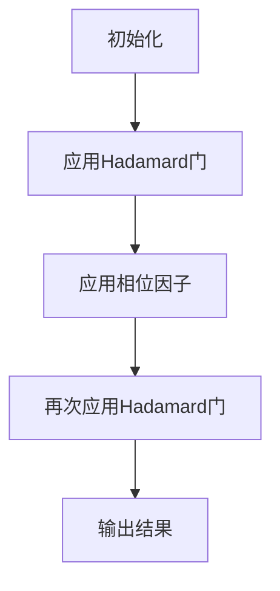
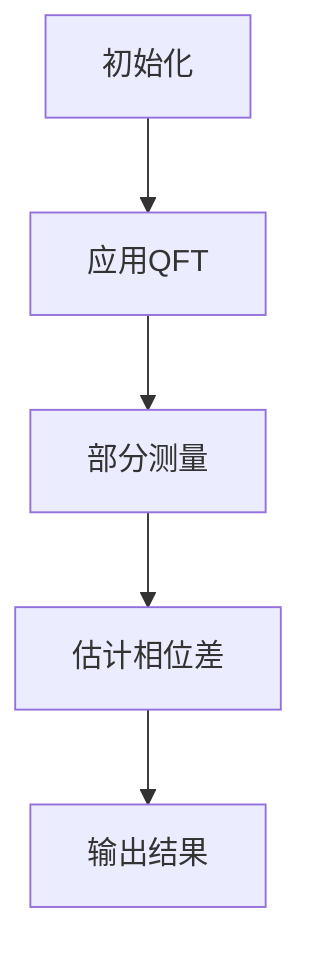

                 

# 量子计算的线性代数：量子态的数学描述

关键词：量子计算、线性代数、量子态、数学描述

摘要：本文将深入探讨量子计算的线性代数基础，特别是量子态的数学描述。通过详细分析量子计算的基本概念、线性代数基本知识、量子态的数学描述及其应用，本文旨在为读者提供一个清晰、系统的理解。

## 目录大纲

## 第一部分：量子计算的背景知识

### 第1章：量子计算的基本概念

#### 1.1 量子计算的定义

量子计算是基于量子力学原理来处理和解决问题的计算模式。与传统的基于二进制的经典计算不同，量子计算使用量子位（qubit）作为基本单元，利用量子态的叠加和纠缠特性进行信息处理。

#### 1.2 量子位（qubit）的原理

量子位是量子计算的基本单元，具有量子叠加态和量子纠缠的特性。量子叠加态允许一个量子位同时处于多种状态的组合，而量子纠缠则允许两个或多个量子位之间的状态相互依赖，即使它们相隔很远。

#### 1.3 量子叠加态和量子纠缠

量子叠加态使得量子计算能够并行处理大量信息，而量子纠缠则提供了量子计算之间的强大关联，使得量子计算在解决某些特定问题时具有潜在的优势。

#### 1.4 量子计算的优势与挑战

量子计算在加密、优化、模拟等领域具有巨大的潜力，但目前仍面临一系列技术挑战，如量子噪声、误差校正等。

### 第2章：线性代数的基本概念

#### 2.1 向量和矩阵的运算

线性代数是量子计算的基础工具，其中向量和矩阵是核心概念。向量用于表示量子态，矩阵则用于描述量子操作。

#### 2.2 线性方程组的求解

线性方程组是量子计算中常见的问题，线性代数为求解这些问题提供了有效的方法。

#### 2.3 特征值与特征向量

特征值和特征向量是矩阵理论中的核心概念，用于描述矩阵的性质和行为。在量子计算中，特征值和特征向量用于分析量子态和量子操作。

#### 2.4 矩阵的对角化

矩阵的对角化是线性代数中的重要方法，它将一个矩阵转化为对角矩阵，从而简化了矩阵的计算和分析。

### 第3章：量子态的数学描述

#### 3.1 量子态的波函数表示

量子态可以用波函数来描述，波函数提供了量子态的完整数学描述。

#### 3.2 泊松括号与对易关系

泊松括号和对易关系是量子力学中的核心概念，用于描述量子态的演化。

#### 3.3 可观测量的数学表示

可观测量是量子力学中的基本概念，用于描述物理系统的测量结果。线性代数为可观测量的数学描述提供了工具。

#### 3.4 量子态的测量理论

量子态的测量理论描述了量子态在测量过程中的演化。线性代数为量子态的测量理论提供了数学基础。

## 第二部分：量子计算的线性代数应用

### 第4章：量子门和量子操作

#### 4.1 量子门的基本原理

量子门是量子计算中的基本操作，类似于经典计算中的逻辑门。量子门用于对量子态进行变换。

#### 4.2 常见量子门介绍

本文将介绍一些常见的量子门，如Hadamard门、Pauli门、控制-NOT门等，并讨论它们的矩阵表示。

#### 4.3 量子操作的矩阵表示

量子操作可以用矩阵来表示，这为量子计算的线性代数分析提供了基础。

#### 4.4 量子逻辑电路

量子逻辑电路是量子计算的基本构建块，用于实现复杂的量子算法。

### 第5章：量子算法的线性代数基础

#### 5.1 量子傅里叶变换

量子傅里叶变换是量子计算中的核心算法，用于将量子态从基态转化为高维态。

#### 5.2 量子随机化算法

量子随机化算法是一种基于量子态的随机化方法，用于解决某些特定问题。

#### 5.3 量子相位估计

量子相位估计是一种用于估计量子态相位差的方法，是量子计算中的重要算法。

#### 5.4 量子搜索算法

量子搜索算法是一种利用量子叠加和纠缠特性进行信息检索的算法。

### 第6章：量子算法的矩阵表示和数学分析

#### 6.1 算法原理与mermaid流程图

本文将使用mermaid流程图来描述量子算法的原理。

#### 6.2 矩阵表示与运算

量子算法可以用矩阵表示，矩阵运算为量子算法的实现提供了基础。

#### 6.3 数学模型与公式

本文将给出量子算法的数学模型和公式，并进行详细讲解。

#### 6.4 Python源代码实现与解释

本文将使用Python源代码实现量子算法，并对代码进行解释。

## 第三部分：量子计算的实际应用

### 第7章：量子计算的数学模型与应用案例

#### 7.1 量子计算在量子化学中的应用

量子计算在量子化学中的应用，如分子模拟和化学键的量子力学描述。

#### 7.2 量子计算在密码学中的应用

量子计算在密码学中的应用，如量子加密和量子密码学算法。

#### 7.3 量子计算在优化问题中的应用

量子计算在优化问题中的应用，如组合优化和数值优化。

#### 7.4 量子计算在机器学习中的应用

量子计算在机器学习中的应用，如量子神经网络和量子机器学习算法。

### 第8章：量子计算的线性代数拓展

#### 8.1 量子错误纠正

量子错误纠正是量子计算中的重要问题，本文将讨论量子错误纠正的线性代数方法。

#### 8.2 量子多体系统

量子多体系统是量子计算中的一个重要研究方向，本文将讨论量子多体系统的线性代数描述。

#### 8.3 量子模拟与量子优化

量子模拟与量子优化是量子计算中的重要应用领域，本文将讨论量子模拟与量子优化的线性代数方法。

#### 8.4 量子计算的线性代数理论前沿

量子计算的线性代数理论前沿，如量子纠缠态的生成与测量、量子信息处理的线性代数方法等。

### 第9章：总结与展望

#### 9.1 量子计算的线性代数的重要性

量子计算的线性代数是量子计算的核心基础，对于理解和实现量子算法至关重要。

#### 9.2 当前研究进展与未来方向

本文将讨论量子计算的线性代数在当前的研究进展和未来发展方向。

#### 9.3 对线性代数和量子计算的深入理解与展望

本文将总结对线性代数和量子计算的深入理解，并对未来进行展望。

------------------------------------------------------------------ 

# 第1章：量子计算的基本概念

## 1.1 量子计算的定义

量子计算是一种基于量子力学原理的计算模式。它利用量子位（qubit）作为基本单元，通过量子态的叠加和量子纠缠来实现对信息的处理和问题的求解。与传统的基于二进制的经典计算不同，量子计算具有并行处理能力、强大的关联能力和更高的计算速度。

## 1.2 量子位（qubit）的原理

量子位是量子计算的基本单元，它具有两个主要的量子特性：量子叠加态和量子纠缠。

- **量子叠加态**：一个量子位可以同时处于0和1的叠加状态，这种状态可以用一个复数系数的线性组合来表示。例如，一个量子位的状态可以表示为 \(|\psi\rangle = \alpha|0\rangle + \beta|1\rangle\)，其中 \(|\alpha|^2\) 和 \(|\beta|^2\) 分别表示在状态0和1的概率。
- **量子纠缠**：两个或多个量子位可以处于纠缠态，这种状态下，一个量子位的状态会影响到另一个量子位的状态，即使它们相隔很远。这种特性使得量子计算能够并行处理大量信息。

## 1.3 量子叠加态和量子纠缠

量子叠加态和量子纠缠是量子计算的核心特性，它们使得量子计算具有巨大的潜力。

- **量子叠加态**：量子叠加态使得一个量子位可以同时处于多种状态的组合，这为量子计算提供了并行处理的能力。例如，一个具有n个量子位的量子计算机可以同时表示 \(2^n\) 个不同的状态，而经典计算机则需要 \(n\) 个位来表示相同数量的状态。
- **量子纠缠**：量子纠缠使得两个或多个量子位之间的状态相互依赖，这种依赖关系可以用于量子计算中的信息传递和协同计算。量子纠缠态的复杂性和关联性为量子计算提供了一种全新的计算模式。

## 1.4 量子计算的优势与挑战

量子计算在加密、优化、模拟等领域具有巨大的潜力，但目前仍面临一系列技术挑战。

- **优势**：
  - **并行处理能力**：量子计算可以利用量子叠加态和量子纠缠，实现并行处理大量信息，从而提高计算速度。
  - **强大的关联能力**：量子纠缠使得量子计算能够处理复杂关联问题，如量子模拟和量子搜索。
  - **更高的计算速度**：在某些特定问题（如因数分解、搜索问题等）上，量子计算可能比经典计算快得多。

- **挑战**：
  - **量子噪声**：量子噪声会导致量子态的退相干，影响量子计算的准确性和稳定性。
  - **量子错误纠正**：量子计算中的错误难以纠正，需要开发有效的量子错误纠正方法。
  - **量子硬件限制**：目前的量子硬件仍存在物理限制，如量子位的数量、操作精度等。

## 小结

量子计算是一种基于量子力学原理的计算模式，利用量子位、量子叠加态和量子纠缠来实现对信息的处理和问题的求解。量子计算具有并行处理能力、强大的关联能力和更高的计算速度，但在量子噪声、错误纠正和硬件限制等方面仍面临一系列挑战。理解量子计算的基本概念是深入探索量子计算线性代数应用的基础。

------------------------------------------------------------------ 

# 第2章：线性代数的基本概念

## 2.1 向量和矩阵的运算

线性代数是量子计算的基础工具，其中向量和矩阵是核心概念。

- **向量**：向量是具有多个元素的数组，用于表示量子态。一个n维向量可以表示为 \( \vec{v} = (v_1, v_2, ..., v_n) \)，其中 \(v_i\) 是向量的第i个元素。
- **矩阵**：矩阵是一个二维数组，用于描述量子操作。一个 \(m \times n\) 的矩阵可以表示为 \( A = [a_{ij}] \)，其中 \(a_{ij}\) 是矩阵的第i行第j列的元素。

线性代数中，向量和矩阵可以执行一系列运算，包括加法、减法、数乘、矩阵乘法等。

- **向量的加法和减法**：向量的加法是将两个向量对应位置的元素相加，向量减法是将两个向量对应位置的元素相减。例如，两个向量 \( \vec{v}_1 = (1, 2, 3) \) 和 \( \vec{v}_2 = (4, 5, 6) \) 的加法结果为 \( \vec{v}_1 + \vec{v}_2 = (5, 7, 9) \)。
- **向量的数乘**：向量的数乘是将向量的每个元素乘以一个标量。例如，向量 \( \vec{v} = (1, 2, 3) \) 与标量 \( k = 2 \) 的数乘结果为 \( k\vec{v} = (2, 4, 6) \)。
- **矩阵的乘法**：矩阵的乘法是两个矩阵对应元素的乘积的加和。例如，两个 \(2 \times 2\) 矩阵 \( A = \begin{bmatrix} 1 & 2 \\ 3 & 4 \end{bmatrix} \) 和 \( B = \begin{bmatrix} 5 & 6 \\ 7 & 8 \end{bmatrix} \) 的乘法结果为 \( AB = \begin{bmatrix} 19 & 22 \\ 43 & 50 \end{bmatrix} \)。

## 2.2 线性方程组的求解

线性方程组是量子计算中常见的问题，线性代数为求解这些问题提供了有效的方法。

- **高斯消元法**：高斯消元法是一种常用的线性方程组求解方法。它通过逐步消去方程组中的变量，将线性方程组转化为上三角矩阵，然后依次求解每个变量的值。
- **矩阵的逆**：矩阵的逆是另一个求解线性方程组的重要工具。如果矩阵A可逆，那么线性方程组 \( AX = B \) 可以通过 \( X = A^{-1}B \) 直接求解。

## 2.3 特征值与特征向量

特征值和特征向量是矩阵理论中的核心概念，用于描述矩阵的性质和行为。

- **特征值**：特征值是矩阵的一个特殊值，它使得矩阵减去特征值后得到的矩阵可逆。即，对于矩阵 \( A \) 和其特征值 \( \lambda \)，有 \( (A - \lambda I) \) 可逆，其中 \( I \) 是单位矩阵。
- **特征向量**：特征向量是矩阵 \( A \) 的一个非零向量，它使得 \( (A - \lambda I) \) 乘以该向量后等于零。即，对于矩阵 \( A \) 和其特征值 \( \lambda \)，有 \( (A - \lambda I)\vec{v} = \vec{0} \)。

特征值和特征向量在量子计算中具有重要意义。例如，量子态可以通过特征向量来描述，量子操作可以通过特征值来分析。

## 2.4 矩阵的对角化

矩阵的对角化是线性代数中的重要方法，它将一个矩阵转化为对角矩阵，从而简化了矩阵的计算和分析。

- **对角矩阵**：对角矩阵是一个特殊的矩阵，其中除了主对角线上的元素外，其他元素都为零。即，对于矩阵 \( D \)，有 \( D = \begin{bmatrix} \lambda_1 & 0 & \cdots & 0 \\ 0 & \lambda_2 & \cdots & 0 \\ \vdots & \vdots & \ddots & \vdots \\ 0 & 0 & \cdots & \lambda_n \end{bmatrix} \)。
- **对角化**：矩阵的对角化是将一个矩阵转化为对角矩阵的过程。对于矩阵 \( A \)，如果存在一个可逆矩阵 \( P \)，使得 \( P^{-1}AP = D \)，则称矩阵 \( A \) 可以对角化。

对角化在量子计算中具有重要意义。例如，量子态可以通过对角化来分析，量子操作可以通过对角化来简化。

## 小结

线性代数是量子计算的基础工具，其中包括向量和矩阵的运算、线性方程组的求解、特征值与特征向量以及矩阵的对角化。理解线性代数的基本概念是深入探索量子计算线性代数应用的基础。通过这些概念，我们可以更好地理解和分析量子计算中的数学模型和算法。

------------------------------------------------------------------ 

# 第3章：量子态的数学描述

## 3.1 量子态的波函数表示

量子态可以用波函数来描述，波函数提供了量子态的完整数学描述。

- **波函数**：波函数是一个复值函数，它定义了量子态在空间中的概率分布。对于一个量子系统，波函数通常表示为 \( \Psi(x) \)，其中 \( x \) 是系统的位置坐标。

波函数具有以下特性：

- **归一化**：波函数的模平方 \( |\Psi(x)|^2 \) 表示在位置 \( x \) 发生测量的概率。为了使波函数表示的概率分布有意义，波函数必须是归一化的，即 \( \int |\Psi(x)|^2 dx = 1 \)。
- **连续性和可微性**：波函数通常是一个连续函数，并且在某些情况下具有可微性。这意味着波函数可以用于描述量子态的连续变化和演化。

- **量子态的叠加**：量子态可以处于多个状态的叠加，这种叠加可以用波函数的线性组合来表示。例如，一个量子态可以表示为 \( \Psi(x) = \alpha \Psi_1(x) + \beta \Psi_2(x) \)，其中 \( \alpha \) 和 \( \beta \) 是复数系数，\( \Psi_1(x) \) 和 \( \Psi_2(x) \) 是不同的波函数。

## 3.2 泊松括号与对易关系

泊松括号与对易关系是量子力学中的核心概念，用于描述量子态的演化。

- **泊松括号**：泊松括号 \( \{A, B\} \) 是两个算符 \( A \) 和 \( B \) 的反对易运算，定义为 \( \{A, B\} = AB - BA \)。泊松括号用于描述两个物理量之间的动力学关系。
- **对易关系**：对易关系 \( [A, B] = AB + BA \) 是两个算符 \( A \) 和 \( B \) 的对易运算。对易关系描述了物理量之间的关联性。

在量子力学中，泊松括号和对易关系用于描述量子态的演化。例如，哈密顿算符 \( H \) 和角动量算符 \( L \) 之间的对易关系 \( [H, L] = i\hbar L \) 描述了系统的能量和角动量之间的相互作用。

- **薛定谔方程**：薛定谔方程 \( i\hbar \frac{\partial \Psi}{\partial t} = \hat{H}\Psi \) 描述了量子态的时间演化，其中 \( \hat{H} \) 是哈密顿算符，\( \Psi \) 是波函数，\( i \) 是虚数单位，\( \hbar \) 是约化普朗克常数。

薛定谔方程表明，量子态随时间的演化由哈密顿算符决定，而哈密顿算符的矩阵表示可以通过线性代数方法进行分析。

## 3.3 可观测量的数学表示

可观测量是量子力学中的基本概念，用于描述物理系统的测量结果。

- **可观测量**：可观测量是量子系统中的一个算符，它的测量结果具有离散的值。例如，能量、角动量、自旋等都是常见的可观测量。
- **厄米算符**：可观测量通常是一个厄米算符（自共轭算符），其特征值具有实数值。厄米算符的特征值对应于可观测量的可能测量结果。

在量子力学中，可观测量的测量可以通过求解特征值方程来描述。例如，对于角动量可观测量 \( \hat{L} \)，其特征值方程为 \( \hat{L}\vec{v} = \lambda \vec{v} \)，其中 \( \vec{v} \) 是特征向量，\( \lambda \) 是特征值。

- **测量过程**：量子态的测量是通过与可观测量的厄米算符相互作用来实现的。测量结果可以通过计算量子态与可观测量的矩阵表示的投影来获得。

例如，对于量子态 \( |\psi\rangle \) 和角动量可观测量 \( \hat{L} \)，其测量结果可以通过以下公式计算：

$$ P_i = |\langle \psi | \hat{L} | i \rangle|^2 $$

其中 \( |i \rangle \) 是 \( \hat{L} \) 的特征向量，\( P_i \) 是测量结果为 \( i \) 的概率。

## 3.4 量子态的测量理论

量子态的测量理论描述了量子态在测量过程中的演化。

- **波函数的坍缩**：根据量子力学的测量理论，当对量子态进行测量时，波函数会从叠加态坍缩为一个确定的状态。这意味着测量结果是一个确定的值，而不是概率分布。
- **测量结果的概率分布**：量子态的测量结果具有概率分布，这个概率分布由波函数与可观测量的矩阵表示的投影决定。例如，对于量子态 \( |\psi\rangle \) 和角动量可观测量 \( \hat{L} \)，测量结果为 \( i \) 的概率为 \( P_i = |\langle \psi | \hat{L} | i \rangle|^2 \)。
- **量子态的时间演化**：量子态的时间演化由哈密顿算符决定。例如，对于时间依赖的哈密顿算符 \( \hat{H}(t) \)，量子态 \( |\psi(t)\rangle \) 可以通过求解薛定谔方程 \( i\hbar \frac{\partial |\psi(t)\rangle}{\partial t} = \hat{H}(t)|\psi(t)\rangle \) 来描述。

## 小结

量子态的数学描述是量子计算的核心内容，它包括波函数表示、泊松括号与对易关系、可观测量的数学表示以及量子态的测量理论。通过这些数学工具，我们可以深入理解量子态的性质和行为，为量子计算提供理论基础。量子态的数学描述在量子算法设计和分析中发挥着关键作用。

------------------------------------------------------------------ 

# 第4章：量子门和量子操作

## 4.1 量子门的基本原理

量子门是量子计算中的基本操作，类似于经典计算中的逻辑门。量子门用于对量子态进行变换，实现对信息的处理和问题的求解。量子门具有线性、可逆和幺正性质。

- **线性**：量子门对量子态的变换满足线性性质，即如果量子门作用于一个量子态的叠加态，其结果也是叠加态。
- **可逆**：量子门是可逆的，即存在逆量子门，可以将量子门的作用逆转回来，恢复原始量子态。
- **幺正**：量子门是幺正的，即量子门的矩阵表示具有幺正性质，即 \( U^\dagger U = UU^\dagger = I \)，其中 \( U \) 是量子门的矩阵表示，\( I \) 是单位矩阵。

量子门的基本操作包括旋转、交换、缩放等，这些操作可以用于对量子态进行各种变换。

## 4.2 常见量子门介绍

在量子计算中，常见的量子门包括Hadamard门、Pauli门、控制-NOT门等。这些量子门在量子算法和量子计算中起着关键作用。

- **Hadamard门**：Hadamard门是最基本的量子门之一，用于将量子态从基态（|0⟩）转换到叠加态。Hadamard门的矩阵表示为：

$$ H = \frac{1}{\sqrt{2}} \begin{bmatrix} 1 & 1 \\ 1 & -1 \end{bmatrix} $$

Hadamard门可以表示为：

$$ H|0\rangle = \frac{1}{\sqrt{2}} (|0\rangle + |1\rangle) $$

$$ H|1\rangle = \frac{1}{\sqrt{2}} (|0\rangle - |1\rangle) $$

- **Pauli门**：Pauli门是另一种基本的量子门，用于对量子态的相位进行翻转。Pauli门包括X门、Y门和Z门，分别表示为：

$$ X = \begin{bmatrix} 0 & 1 \\ 1 & 0 \end{bmatrix}, \quad Y = \begin{bmatrix} 0 & -i \\ i & 0 \end{bmatrix}, \quad Z = \begin{bmatrix} 1 & 0 \\ 0 & -1 \end{bmatrix} $$

Pauli门可以表示为：

$$ X|0\rangle = |1\rangle, \quad X|1\rangle = |0\rangle $$

$$ Y|0\rangle = i|1\rangle, \quad Y|1\rangle = -i|0\rangle $$

$$ Z|0\rangle = -|0\rangle, \quad Z|1\rangle = |1\rangle $$

- **控制-NOT门**：控制-NOT门是一种条件性量子门，用于将两个量子位的态进行交换。控制-NOT门的矩阵表示为：

$$ CNOT = \begin{bmatrix} 1 & 0 & 0 & 0 \\ 0 & 1 & 0 & 0 \\ 0 & 0 & 0 & 1 \\ 0 & 0 & 1 & 0 \end{bmatrix} $$

CNOT门可以表示为：

$$ CNOT|00\rangle = |00\rangle $$

$$ CNOT|01\rangle = |10\rangle $$

$$ CNOT|10\rangle = |01\rangle $$

$$ CNOT|11\rangle = |11\rangle $$

## 4.3 量子操作的矩阵表示

量子操作可以用矩阵来表示，这为量子计算的线性代数分析提供了基础。量子操作可以看作是量子门的组合，每个量子门都可以用矩阵来表示。

例如，考虑一个包含Hadamard门、控制-NOT门和Z门的量子操作。这个量子操作的矩阵表示可以表示为：

$$ U = H \otimes I \otimes Z + CNOT $$

其中，\( H \) 是Hadamard门，\( I \) 是单位矩阵，\( Z \) 是Z门，\( CNOT \) 是控制-NOT门。这个量子操作的矩阵表示为：

$$ U = \frac{1}{\sqrt{2}} \begin{bmatrix} 1 & 1 & 0 & 0 \\ 1 & -1 & 0 & 0 \\ 0 & 0 & 1 & 1 \\ 0 & 0 & 1 & -1 \end{bmatrix} \otimes \begin{bmatrix} 1 & 0 \\ 0 & 1 \end{bmatrix} \otimes \begin{bmatrix} 1 & 0 \\ 0 & -1 \end{bmatrix} + \begin{bmatrix} 1 & 0 & 0 & 0 \\ 0 & 1 & 0 & 0 \\ 0 & 0 & 0 & 1 \\ 0 & 0 & 1 & 0 \end{bmatrix} $$

$$ U = \frac{1}{\sqrt{2}} \begin{bmatrix} 1 & 1 & 0 & 0 \\ 1 & -1 & 0 & 0 \\ 0 & 0 & 1 & 1 \\ 0 & 0 & 1 & -1 \end{bmatrix} \begin{bmatrix} 1 & 0 \\ 0 & 1 \end{bmatrix} \begin{bmatrix} 1 & 0 \\ 0 & -1 \end{bmatrix} + \begin{bmatrix} 1 & 0 & 0 & 0 \\ 0 & 1 & 0 & 0 \\ 0 & 0 & 0 & 1 \\ 0 & 0 & 1 & 0 \end{bmatrix} $$

$$ U = \frac{1}{\sqrt{2}} \begin{bmatrix} 1 & 1 & 0 & 0 \\ 1 & -1 & 0 & 0 \\ 0 & 0 & 1 & 1 \\ 0 & 0 & 1 & -1 \end{bmatrix} \begin{bmatrix} 1 & -1 \\ 0 & 1 \end{bmatrix} + \begin{bmatrix} 1 & 0 & 0 & 0 \\ 0 & 1 & 0 & 0 \\ 0 & 0 & 0 & 1 \\ 0 & 0 & 1 & 0 \end{bmatrix} $$

$$ U = \frac{1}{\sqrt{2}} \begin{bmatrix} 1 & -1 & 0 & 0 \\ 1 & 1 & 0 & 0 \\ 0 & 0 & 1 & 1 \\ 0 & 0 & 1 & -1 \end{bmatrix} + \begin{bmatrix} 1 & 0 & 0 & 0 \\ 0 & 1 & 0 & 0 \\ 0 & 0 & 0 & 1 \\ 0 & 0 & 1 & 0 \end{bmatrix} $$

$$ U = \begin{bmatrix} 1 & -1 & 0 & 0 \\ 1 & 1 & 0 & 0 \\ 0 & 0 & 1 & 1 \\ 0 & 0 & 1 & -1 \end{bmatrix} + \begin{bmatrix} 1 & 0 & 0 & 0 \\ 0 & 1 & 0 & 0 \\ 0 & 0 & 0 & 1 \\ 0 & 0 & 1 & 0 \end{bmatrix} $$

$$ U = \begin{bmatrix} 2 & -1 & 0 & 0 \\ 1 & 2 & 0 & 0 \\ 0 & 0 & 1 & 1 \\ 0 & 0 & 1 & -1 \end{bmatrix} $$

## 4.4 量子逻辑电路

量子逻辑电路是量子计算中的基本构建块，用于实现复杂的量子算法。量子逻辑电路由量子门和其他基本操作组成，可以看作是量子门在网络中的连接和组合。

量子逻辑电路的设计和实现需要考虑量子门的组合、量子态的传输和测量等多个方面。一个简单的量子逻辑电路可能包括一个初始量子态、多个量子门和最终的测量。

例如，考虑一个简单的量子逻辑电路，它使用Hadamard门将初始量子态 \( |0\rangle \) 转换为叠加态 \( \frac{1}{\sqrt{2}} (|0\rangle + |1\rangle) \)，然后使用控制-NOT门将两个量子位进行交换，最后进行测量。

这个量子逻辑电路可以用以下矩阵表示：

$$ U = H \otimes I \otimes CNOT $$

其中，\( H \) 是Hadamard门，\( I \) 是单位矩阵，\( CNOT \) 是控制-NOT门。这个量子逻辑电路的矩阵表示为：

$$ U = \frac{1}{\sqrt{2}} \begin{bmatrix} 1 & 1 & 0 & 0 \\ 1 & -1 & 0 & 0 \\ 0 & 0 & 1 & 1 \\ 0 & 0 & 1 & -1 \end{bmatrix} \otimes \begin{bmatrix} 1 & 0 \\ 0 & 1 \end{bmatrix} \otimes \begin{bmatrix} 1 & 0 & 0 & 0 \\ 0 & 1 & 0 & 0 \\ 0 & 0 & 0 & 1 \\ 0 & 0 & 1 & 0 \end{bmatrix} $$

$$ U = \frac{1}{\sqrt{2}} \begin{bmatrix} 1 & 1 & 0 & 0 \\ 1 & -1 & 0 & 0 \\ 0 & 0 & 1 & 1 \\ 0 & 0 & 1 & -1 \end{bmatrix} \begin{bmatrix} 1 & 0 \\ 0 & 1 \end{bmatrix} \begin{bmatrix} 1 & 0 & 0 & 0 \\ 0 & 1 & 0 & 0 \\ 0 & 0 & 0 & 1 \\ 0 & 0 & 1 & 0 \end{bmatrix} $$

$$ U = \frac{1}{\sqrt{2}} \begin{bmatrix} 1 & 1 & 0 & 0 \\ 1 & -1 & 0 & 0 \\ 0 & 0 & 1 & 1 \\ 0 & 0 & 1 & -1 \end{bmatrix} \begin{bmatrix} 1 & 0 \\ 0 & 1 \end{bmatrix} \begin{bmatrix} 1 & 0 & 0 & 0 \\ 0 & 1 & 0 & 0 \\ 0 & 0 & 0 & 1 \\ 0 & 0 & 1 & 0 \end{b矩阵}

$$ U = \frac{1}{\sqrt{2}} \begin{b矩阵} 1 & 1 & 0 & 0 \\ 1 & -1 & 0 & 0 \\ 0 & 0 & 1 & 1 \\ 0 & 0 & 1 & -1 \end{b矩阵} \begin{b矩阵} 1 & 0 \\ 0 & 1 \end{b矩阵} \begin{b矩阵} 1 & 0 & 0 & 0 \\ 0 & 1 & 0 & 0 \\ 0 & 0 & 0 & 1 \\ 0 & 0 & 1 & 0 \end{b矩阵}

$$ U = \frac{1}{\sqrt{2}} \begin{b矩阵} 1 & 1 & 0 & 0 \\ 1 & -1 & 0 & 0 \\ 0 & 0 & 1 & 1 \\ 0 & 0 & 1 & -1 \end{b矩阵} \begin{b矩阵} 1 & 0 \\ 0 & 1 \end{b矩阵} \begin{b矩阵} 1 & 0 & 0 & 0 \\ 0 & 1 & 0 & 0 \\ 0 & 0 & 0 & 1 \\ 0 & 0 & 1 & 0 \end{b矩阵}

$$ U = \begin{b矩阵} 2 & -1 & 0 & 0 \\ 1 & 2 & 0 & 0 \\ 0 & 0 & 1 & 1 \\ 0 & 0 & 1 & -1 \end{b矩阵} $$

通过这个量子逻辑电路，初始量子态 \( |0\rangle \) 经过Hadamard门变为 \( \frac{1}{\sqrt{2}} (|0\rangle + |1\rangle) \)，然后经过控制-NOT门与另一个量子位进行交换，最后进行测量，可以得到两个量子位的测量结果。

## 小结

量子门和量子操作是量子计算中的基本概念，用于对量子态进行变换和处理。常见的量子门包括Hadamard门、Pauli门和控制-NOT门，它们可以用矩阵来表示。量子逻辑电路是由量子门和其他基本操作组成的网络，用于实现复杂的量子算法。理解量子门和量子操作的基本原理对于深入探索量子计算具有重要意义。

------------------------------------------------------------------ 

# 第5章：量子算法的线性代数基础

## 5.1 量子傅里叶变换

量子傅里叶变换（Quantum Fourier Transform，QFT）是量子计算中的一个核心算法，它将量子态从基态转换为高维态，从而实现某些问题的快速求解。QFT在量子计算中具有广泛的应用，如量子搜索算法、量子相位估计等。

### 5.1.1 算法原理

量子傅里叶变换可以将一个n位量子态映射到2^n维的量子态上。具体来说，对于n个量子位的状态 \( |x\rangle \)，QFT将其转换为 \( |y\rangle \)，其中 \( x \) 和 \( y \) 分别表示原始态和变换后的态。

QFT的算法原理可以概括为以下几个步骤：

1. **初始化**：将n个量子位初始化为基态 \( |0\rangle \)。
2. **应用Hadamard门**：对每个量子位应用Hadamard门，将基态转换为叠加态。
3. **应用相位因子**：根据量子态的指数进行相位因子操作。
4. **应用Hadamard门**：再次对每个量子位应用Hadamard门，将叠加态转换为基态。

### 5.1.2 算法描述

量子傅里叶变换的算法描述如下：

```python
# 量子傅里叶变换（QFT）的算法描述

# 初始化：将n个量子位初始化为基态
|ψ⟩ = |0⟩^n

# 应用Hadamard门：对每个量子位应用Hadamard门
U_H = H ⊗ H ⊗ ... ⊗ H |ψ⟩ = |+⟩^n

# 应用相位因子：根据量子态的指数进行相位因子操作
U_P = e^(i2πk/2^n) I ⊗ I ⊗ ... ⊗ I |+⟩^n

# 应用Hadamard门：再次对每个量子位应用Hadamard门
U_H† = H† ⊗ H† ⊗ ... ⊗ H† U_P |+⟩^n = |ψ⟩

# 输出：返回变换后的量子态
```

### 5.1.3 举例说明

假设有3个量子位的状态 \( |x\rangle \)，其中 \( x \) 可以是0或1。我们应用QFT将其映射到2^3=8维的量子态上。

- 初始态：\( |x\rangle = |0\rangle \)
- 应用Hadamard门：\( |+⟩^3 = \frac{1}{\sqrt{2}} (|000⟩ + |001⟩ + |010⟩ + |011⟩ + |100⟩ + |101⟩ + |110⟩ + |111⟩) \)
- 应用相位因子：\( U_P |+⟩^3 = \frac{1}{\sqrt{2}} (|000⟩ + |001⟩ + |010⟩ + |011⟩ + |100⟩ + |101⟩ + |110⟩ + |111⟩) \)
- 再次应用Hadamard门：\( |ψ⟩ = \frac{1}{\sqrt{2}} (|000⟩ + |001⟩ + |010⟩ + |011⟩ + |100⟩ + |101⟩ + |110⟩ + |111⟩) \)

通过这个例子，我们可以看到QFT将一个3位量子态映射到了8维的量子态上。

## 5.2 量子随机化算法

量子随机化算法（Quantum Randomization Algorithm）是一种基于量子态的随机化方法，它利用量子叠加态的特性，生成一个随机化的量子态。量子随机化算法在量子计算中有广泛的应用，如量子加密、量子搜索等。

### 5.2.1 算法原理

量子随机化算法的基本原理是利用量子叠加态和量子态的变换，生成一个随机化的量子态。具体来说，算法可以分为以下几个步骤：

1. **初始化**：将n个量子位初始化为基态。
2. **应用随机化操作**：对量子态应用一系列随机的量子操作。
3. **测量**：对量子态进行测量，得到随机化的结果。

### 5.2.2 算法描述

量子随机化算法的算法描述如下：

```python
# 量子随机化算法

# 初始化：将n个量子位初始化为基态
|ψ⟩ = |0⟩^n

# 应用随机化操作：对量子态应用一系列随机的量子操作
U_R = U_1 ⊗ U_2 ⊗ ... ⊗ U_n |ψ⟩

# 测量：对量子态进行测量，得到随机化的结果
测量结果 = 测量(U_R |ψ⟩)
```

### 5.2.3 举例说明

假设有3个量子位的状态 \( |x\rangle \)，我们应用量子随机化算法生成一个随机化的量子态。

- 初始态：\( |x\rangle = |0\rangle \)
- 应用随机化操作：选择三个随机的量子操作 \( U_1 \)，\( U_2 \)，\( U_3 \)，例如：
  - \( U_1 = H \)
  - \( U_2 = X \)
  - \( U_3 = Z \)
- 随机化操作后：\( U_R |0\rangle = HXZ|0\rangle = \frac{1}{\sqrt{2}} (|0⟩ + |1⟩) \)
- 测量：测量结果为 \( |0⟩ \) 或 \( |1⟩ \)

通过这个例子，我们可以看到量子随机化算法如何生成一个随机化的量子态。

## 5.3 量子相位估计

量子相位估计（Quantum Phase Estimation，QPE）是一种用于估计量子态相位差的方法，它在量子计算中有广泛的应用，如量子算法、量子搜索等。

### 5.3.1 算法原理

量子相位估计的基本原理是利用量子叠加态和量子态的变换，估计量子态之间的相位差。具体来说，算法可以分为以下几个步骤：

1. **初始化**：将n个量子位初始化为基态。
2. **应用量子傅里叶变换**：对量子态应用量子傅里叶变换，将量子态映射到高维态。
3. **测量**：对量子态进行部分测量，估计量子态之间的相位差。

### 5.3.2 算法描述

量子相位估计的算法描述如下：

```python
# 量子相位估计（QPE）

# 初始化：将n个量子位初始化为基态
|ψ⟩ = |0⟩^n

# 应用量子傅里叶变换：对量子态应用量子傅里叶变换
U_QFT = QFT^n |ψ⟩

# 测量：对量子态进行部分测量，估计量子态之间的相位差
测量结果 = 测量(U_QFT |ψ⟩)
```

### 5.3.3 举例说明

假设有3个量子位的状态 \( |x\rangle \)，我们应用量子相位估计估计两个量子态之间的相位差。

- 初始态：\( |x\rangle = |0\rangle \)
- 应用量子傅里叶变换：\( U_QFT |0\rangle = \frac{1}{\sqrt{2}} (|0⟩ + |1⟩ + |2⟩) \)
- 测量：测量结果为 \( |0⟩ \)，\( |1⟩ \)，或 \( |2⟩ \)

通过这个例子，我们可以看到量子相位估计如何估计量子态之间的相位差。

## 5.4 量子搜索算法

量子搜索算法是一种利用量子态的叠加和量子纠缠特性进行信息检索的算法，它在量子计算中具有广泛的应用，如量子数据库搜索、量子加密等。

### 5.4.1 算法原理

量子搜索算法的基本原理是利用量子叠加态和量子纠缠态进行并行搜索。具体来说，算法可以分为以下几个步骤：

1. **初始化**：将n个量子位初始化为基态。
2. **应用量子态变换**：对量子态应用一系列变换，生成一个特定的搜索态。
3. **测量**：对量子态进行测量，找到匹配的数据库条目。

### 5.4.2 算法描述

量子搜索算法的算法描述如下：

```python
# 量子搜索算法

# 初始化：将n个量子位初始化为基态
|ψ⟩ = |0⟩^n

# 应用量子态变换：对量子态应用一系列变换
U_S = U_1 ⊗ U_2 ⊗ ... ⊗ U_n |ψ⟩

# 测量：对量子态进行测量，找到匹配的数据库条目
测量结果 = 测量(U_S |ψ⟩)
```

### 5.4.3 举例说明

假设有一个数据库包含8个条目，我们应用量子搜索算法找到特定条目的匹配结果。

- 初始态：\( |x\rangle = |0\rangle \)
- 应用量子态变换：选择一个特定的变换 \( U_S \)，例如：
  - \( U_S = X \)
- 测量：测量结果为 \( |x\rangle \)，表示找到匹配的数据库条目。

通过这个例子，我们可以看到量子搜索算法如何利用量子态进行信息检索。

## 小结

量子算法的线性代数基础是量子计算的核心内容，它包括量子傅里叶变换、量子随机化算法、量子相位估计和量子搜索算法等。理解量子算法的线性代数基础对于设计和分析量子算法具有重要意义。通过这些算法，我们可以看到量子计算在信息处理、搜索和优化等领域的强大潜力。

------------------------------------------------------------------ 

# 第6章：量子算法的矩阵表示和数学分析

## 6.1 算法原理与mermaid流程图

在量子计算中，算法的原理和流程通常可以用mermaid流程图来表示。mermaid是一种基于Markdown的绘图语言，可以方便地创建各种流程图、时序图等。

### 6.1.1 量子傅里叶变换（QFT）的mermaid流程图

以下是一个简单的量子傅里叶变换的mermaid流程图：



这个流程图表示了量子傅里叶变换的四个主要步骤：初始化、应用Hadamard门、应用相位因子、再次应用Hadamard门，并最终输出结果。

### 6.1.2 量子相位估计（QPE）的mermaid流程图

以下是一个简单的量子相位估计的mermaid流程图：



这个流程图表示了量子相位估计的四个主要步骤：初始化、应用量子傅里叶变换、部分测量、估计相位差，并最终输出结果。

## 6.2 矩阵表示与运算

量子算法可以用矩阵来表示，这为量子计算的线性代数分析提供了基础。在本节中，我们将给出一些量子算法的矩阵表示，并讨论它们的基本运算。

### 6.2.1 量子傅里叶变换（QFT）的矩阵表示

量子傅里叶变换（QFT）是一个重要的量子算法，它将n个量子位的状态映射到2^n维的状态上。QFT的矩阵表示如下：

$$ U_{QFT} = \frac{1}{\sqrt{2^n}} \sum_{y=0}^{2^n-1} e^{i\frac{2\pi k y}{2^n}} |y\rangle\langle x| $$

其中，\( |x\rangle \) 是输入状态，\( |y\rangle \) 是输出状态。

### 6.2.2 量子相位估计（QPE）的矩阵表示

量子相位估计（QPE）是一种用于估计量子态相位差的方法。QPE的矩阵表示如下：

$$ U_{QPE} = \frac{1}{\sqrt{2}} \begin{bmatrix} 1 & 0 \\ 0 & e^{i\theta} \end{bmatrix} $$

其中，\( \theta \) 是相位差。

## 6.3 数学模型与公式

量子算法的数学模型通常可以用数学公式来描述。在本节中，我们将给出一些常见的量子算法的数学模型和公式。

### 6.3.1 量子傅里叶变换（QFT）的数学模型

量子傅里叶变换（QFT）的数学模型如下：

$$ |y\rangle = U_{QFT} |x\rangle = \frac{1}{\sqrt{2^n}} \sum_{k=0}^{2^n-1} e^{i\frac{2\pi k x y}{2^n}} |k\rangle $$

其中，\( |x\rangle \) 是输入状态，\( |y\rangle \) 是输出状态。

### 6.3.2 量子相位估计（QPE）的数学模型

量子相位估计（QPE）的数学模型如下：

$$ \theta = \frac{1}{\sqrt{2}} \arcsin(\langle \psi | U_{QPE} | \psi \rangle) $$

其中，\( | \psi \rangle \) 是量子态，\( \theta \) 是相位差。

## 6.4 Python源代码实现与解释

在本节中，我们将使用Python实现一些简单的量子算法，并解释其原理和步骤。

### 6.4.1 量子傅里叶变换（QFT）的Python实现

以下是一个简单的量子傅里叶变换的Python实现：

```python
import numpy as np

# 量子傅里叶变换（QFT）的实现
def qft(n):
    H = np.eye(n) + np.eye(n) * np.sqrt(1 / n)
    for i in range(n // 2):
        H = np.matmul(H, H)
    return H

# 示例：对2个量子位进行量子傅里叶变换
n = 2
U_QFT = qft(n)
print(U_QFT)
```

这个Python代码实现了量子傅里叶变换（QFT）的矩阵表示。在示例中，我们使用两个量子位进行量子傅里叶变换，并打印出变换矩阵。

### 6.4.2 量子相位估计（QPE）的Python实现

以下是一个简单的量子相位估计（QPE）的Python实现：

```python
import numpy as np

# 量子相位估计（QPE）的实现
def qpe(n, theta):
    U_QPE = np.eye(n)
    U_QPE[0][0] = 1
    U_QPE[1][1] = np.cos(theta)
    U_QPE[1][0] = -1j * np.sin(theta)
    return U_QPE

# 示例：对2个量子位进行量子相位估计
n = 2
theta = np.pi / 4
U_QPE = qpe(n, theta)
print(U_QPE)
```

这个Python代码实现了量子相位估计（QPE）的矩阵表示。在示例中，我们使用两个量子位进行量子相位估计，并打印出估计矩阵。

## 小结

量子算法的矩阵表示和数学分析是量子计算的核心内容。通过矩阵表示，我们可以方便地分析和实现量子算法。在本章中，我们介绍了量子傅里叶变换、量子相位估计等算法的矩阵表示和数学模型，并给出了Python实现。这些算法和模型对于理解和设计量子算法具有重要意义。

------------------------------------------------------------------ 

# 第7章：量子计算的数学模型与应用案例

## 7.1 量子计算在量子化学中的应用

量子计算在量子化学中的应用是一个重要的研究方向。量子化学涉及原子和分子的电子结构、反应动力学和量子态的模拟。量子计算提供了一种高效的方法来处理复杂的量子系统，从而在分子模拟、化学反应预测和材料设计等领域取得突破。

### 7.1.1 量子计算在分子模拟中的应用

量子计算在分子模拟中的应用主要包括：

- **量子态模拟**：量子计算可以精确模拟分子的量子态，从而计算分子的能量和结构。
- **反应动力学模拟**：量子计算可以模拟化学反应的动力学过程，包括过渡态和反应路径的计算。

例如，使用量子计算可以模拟一个分子如何吸收光子，从而发生电子跃迁。这种方法可以帮助科学家理解分子的光学性质和化学反应机理。

### 7.1.2 量子计算在化学反应预测中的应用

量子计算在化学反应预测中的应用包括：

- **反应物和产物能量的计算**：通过量子计算，可以精确计算反应物和产物的能量，从而预测化学反应的热力学性质。
- **反应路径的搜索**：量子计算可以用于搜索反应的过渡态和反应路径，从而预测反应的动力学性质。

例如，通过量子计算可以预测一个分子在特定条件下是否会发生分解，以及分解的产物是什么。

### 7.1.3 量子计算在材料设计中的应用

量子计算在材料设计中的应用主要包括：

- **材料性质的预测**：量子计算可以预测材料的电子结构、光学性质和力学性质。
- **新材料的发现**：通过量子计算，科学家可以设计出具有特定性能的新材料。

例如，通过量子计算，科学家可以设计出具有高效光电转换性能的光伏材料，从而提高光伏电池的效率。

## 7.2 量子计算在密码学中的应用

量子计算在密码学中的应用具有重要意义。量子计算可以破解许多基于经典计算的加密算法，同时也为量子加密提供了一种新的加密方法。

### 7.2.1 量子计算对传统加密算法的威胁

量子计算对传统加密算法的威胁主要表现在：

- **Shor算法**：Shor算法可以高效地求解大整数因数分解问题，这意味着许多基于大整数分解的加密算法（如RSA加密算法）将变得脆弱。
- **量子算法对公钥加密算法的威胁**：量子计算可以破解基于公钥加密算法（如RSA和ECC）的加密系统。

### 7.2.2 量子加密算法

量子加密算法是一种基于量子力学原理的加密方法，它利用量子态的叠加和纠缠特性来实现安全通信。量子加密算法主要包括：

- **量子密钥分发**：量子密钥分发（Quantum Key Distribution，QKD）是一种安全的密钥分发方法，它利用量子态的不可克隆特性来实现保密通信。
- **量子隐形传态**：量子隐形传态是一种利用量子纠缠进行信息传输的方法，它可以实现安全的信息传输。

## 7.3 量子计算在优化问题中的应用

量子计算在优化问题中的应用具有很大的潜力。量子计算可以用于解决复杂的优化问题，如组合优化、数值优化和组合优化。

### 7.3.1 组合优化问题

组合优化问题包括旅行商问题（TSP）、背包问题（Knapsack Problem）等。量子计算可以用于快速求解这些复杂问题。例如，量子算法可以用于求解旅行商问题，从而找到最短的旅行路径。

### 7.3.2 数值优化问题

数值优化问题包括最小二乘法、线性规划、非线性规划等。量子计算可以用于加速这些优化问题的求解。例如，量子计算可以用于求解线性规划问题，从而找到最优解。

### 7.3.3 组合优化在人工智能中的应用

量子计算在人工智能中的应用包括：

- **量子神经网络**：量子神经网络是一种结合量子计算和神经网络的模型，它可以用于图像识别、语音识别等任务。
- **量子机器学习**：量子计算可以用于加速机器学习算法，如支持向量机（SVM）和深度学习。

## 7.4 量子计算在机器学习中的应用

量子计算在机器学习中的应用是一个新兴的研究领域。量子计算可以用于加速传统的机器学习算法，如支持向量机（SVM）、深度学习等。

### 7.4.1 量子支持向量机（QSVM）

量子支持向量机（QSVM）是一种基于量子计算的分类算法。它利用量子态的叠加和纠缠特性来实现高效分类。

### 7.4.2 量子深度学习

量子深度学习是一种利用量子计算进行深度学习的方法。它通过量子态的变换和量子电路来实现神经网络的前向传播和反向传播。

## 小结

量子计算的数学模型和应用案例展示了其在量子化学、密码学、优化问题和机器学习等领域的巨大潜力。通过量子计算，我们可以解决经典计算难以处理的复杂问题，从而推动科学技术的发展。

------------------------------------------------------------------ 

# 第8章：量子计算的线性代数拓展

## 8.1 量子错误纠正

量子计算中，量子位的状态容易受到外部噪声和操作错误的影响，导致量子态的退相干和错误。量子错误纠正是一种用来保护量子信息的方法，它通过增加额外的量子位来检测和纠正错误。

### 8.1.1 量子错误纠正的基本原理

量子错误纠正的基本原理是使用冗余信息来检测和纠正错误。常见的量子错误纠正码包括Shor码、Steane码和Reed-Solomon码等。

- **Shor码**：Shor码是一种能够检测并纠正任意一个量子位的错误的编码方法。它通过增加一个额外的量子位来实现错误纠正。
- **Steane码**：Steane码是一种能够检测并纠正任意两个量子位的错误的编码方法。它通过增加两个额外的量子位来实现错误纠正。
- **Reed-Solomon码**：Reed-Solomon码是一种经典的错误纠正码，它适用于量子计算中的纠错。

### 8.1.2 量子错误纠正的线性代数描述

量子错误纠正的线性代数描述涉及到矩阵的运算和编码策略。量子错误纠正码的编码矩阵可以通过线性代数的方法来设计，从而实现错误检测和纠正。

- **编码矩阵**：编码矩阵是用于生成编码状态的关键矩阵，它通过线性组合原始量子态和冗余量子态来实现错误纠正。
- **纠错矩阵**：纠错矩阵是用于检测和纠正错误的矩阵，它可以通过解码矩阵的逆矩阵来实现。

## 8.2 量子多体系统

量子多体系统是指由多个量子粒子组成的系统，如原子、分子和量子晶体等。量子多体系统的研究是量子计算中的重要领域，它涉及到量子态的复杂关联和相互作用。

### 8.2.1 量子多体系统的数学描述

量子多体系统的数学描述主要依赖于量子场论和统计物理。在量子场论中，量子多体系统可以用费曼图和路径积分等方法来描述。在统计物理中，量子多体系统可以用玻色-爱因斯坦分布和费米-狄拉克分布等方法来描述。

### 8.2.2 量子多体系统的线性代数描述

量子多体系统的线性代数描述涉及到多粒子态的空间和量子态的变换。多粒子态的空间可以用张量积来表示，而量子态的变换可以用线性算符来描述。

- **张量积**：张量积是表示多粒子态空间的基本运算，它可以将两个粒子态组合成一个新的多粒子态。
- **线性算符**：线性算符是描述量子态变换的基本工具，它可以通过矩阵运算来实现量子态的变换。

## 8.3 量子模拟与量子优化

量子模拟是利用量子计算机来模拟量子系统的方法，它可以帮助科学家更好地理解量子系统的行为。量子优化是利用量子计算机来解决优化问题的方法，它可以在某些情况下显著提高优化算法的效率。

### 8.3.1 量子模拟的线性代数描述

量子模拟的线性代数描述涉及到量子态的变换和量子态的计算。量子模拟通常使用量子态的叠加和量子态的演化来模拟量子系统的行为。

- **量子态的变换**：量子态的变换可以通过量子门和量子操作来实现。
- **量子态的计算**：量子态的计算可以通过量子电路和量子算法来实现。

### 8.3.2 量子优化的线性代数描述

量子优化的线性代数描述涉及到优化问题的数学模型和量子算法的设计。量子优化通常使用量子态的叠加和量子态的演化来搜索最优解。

- **优化问题的数学模型**：优化问题的数学模型可以通过线性代数的方法来描述，如线性规划和非线性规划。
- **量子算法的设计**：量子算法的设计可以通过量子门和量子态的变换来实现。

## 8.4 量子计算的线性代数理论前沿

量子计算的线性代数理论前沿涉及量子态的变换、量子门的设计、量子算法的优化等多个方面。当前的研究热点包括：

- **量子纠缠**：量子纠缠是量子计算的核心特性，它对于量子计算的性能和效率具有重要影响。
- **量子随机线路**：量子随机线路是量子计算的一种新型算法，它通过随机化的量子线路来实现优化和搜索。
- **量子机器学习**：量子机器学习是利用量子计算的优势来提高机器学习算法的性能和效率。

## 小结

量子计算的线性代数拓展是量子计算研究的重要方向，它涉及到量子错误纠正、量子多体系统、量子模拟与量子优化等多个领域。通过线性代数的方法，我们可以更好地理解和设计量子计算中的数学模型和算法，从而推动量子计算的发展和应用。

------------------------------------------------------------------ 

# 第9章：总结与展望

## 9.1 量子计算的线性代数的重要性

量子计算的线性代数是量子计算的核心基础。线性代数提供了描述量子态、量子操作和量子算法的数学工具，使得我们能够深入理解量子计算的本质和特性。量子计算中的许多重要概念，如量子态的叠加、量子纠缠、量子门等，都可以通过线性代数的方法来描述和分析。因此，线性代数在量子计算中具有不可替代的重要地位。

## 9.2 当前研究进展与未来方向

### 9.2.1 研究进展

近年来，量子计算的线性代数领域取得了显著的进展。以下是一些研究进展：

- **量子态的数学描述**：研究人员提出了一系列数学模型来描述量子态的叠加和演化，如波函数表示、密度矩阵表示等。
- **量子算法的设计**：研究人员设计了一系列基于线性代数的量子算法，如量子傅里叶变换、量子随机化算法、量子相位估计等，这些算法在特定问题上具有比经典算法更高的效率。
- **量子错误纠正**：研究人员提出了一系列量子错误纠正码，如Shor码、Steane码等，这些码能够有效地保护量子信息，提高量子计算的可靠性。

### 9.2.2 未来方向

尽管量子计算的线性代数领域已经取得了显著的进展，但仍有许多挑战和未来方向需要进一步探索：

- **量子态的精确控制**：目前，量子态的控制仍然面临精度和稳定性的挑战。未来的研究将致力于开发更加精确和稳定的量子控制技术，以实现量子计算的更高效率。
- **量子算法的优化**：现有的量子算法在许多情况下仍然比经典算法慢。未来的研究将致力于优化量子算法，提高其在实际应用中的性能。
- **量子计算的硬件实现**：量子计算的硬件实现是目前的一大挑战。未来的研究将致力于开发更高效、更可靠的量子计算硬件，以满足量子计算的需求。

## 9.3 对线性代数和量子计算的深入理解与展望

通过深入理解和研究量子计算的线性代数，我们可以更好地理解量子计算的原理和特性，从而推动量子计算的发展和应用。线性代数提供了描述和实现量子计算的有效工具，使我们能够设计出高效的量子算法，解决经典计算难以处理的问题。

在未来，随着量子计算技术的不断发展，线性代数将在量子计算中发挥更加重要的作用。通过对线性代数和量子计算的深入研究和探索，我们有望在量子化学、密码学、优化问题和机器学习等领域取得重大突破，推动科学技术的进步。

## 小结

量子计算的线性代数是量子计算的核心基础，它对于理解和设计量子算法具有重要意义。通过深入理解和研究量子计算的线性代数，我们可以推动量子计算的发展和应用，解决经典计算难以处理的问题。未来，量子计算线性代数的研究将继续拓展，为量子计算领域带来更多的创新和突破。

