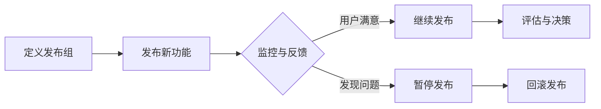
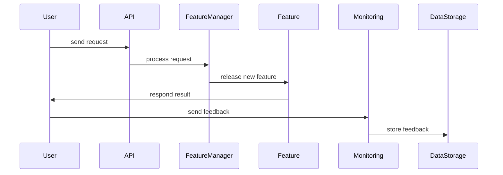
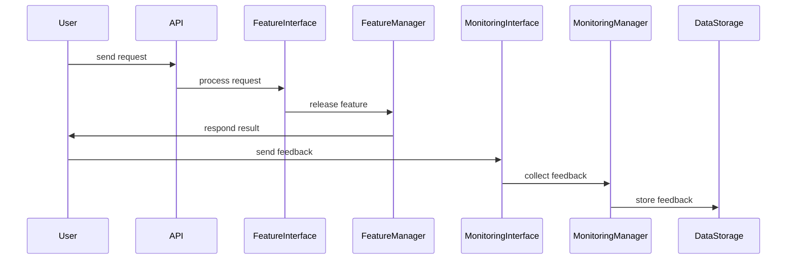

                 


### 设计文章标题、关键词、摘要

#### 文章标题：《金丝雀发布：逐步验证AI新功能的有效方法》

#### 文章关键词：
1. 金丝雀发布
2. AI验证
3. 逐步验证
4. 功能测试
5. 灰度发布

#### 文章摘要：
随着人工智能技术的飞速发展，AI新功能的发布与验证成为一项重要任务。本文将深入探讨金丝雀发布这一逐步验证AI新功能的有效方法。通过对金丝雀发布原理的详细解析，结合实际案例，我们将展示如何在保持系统稳定性和安全性的同时，高效验证AI新功能的有效性。

### 第一部分：背景与核心概念

#### 1. 引言

随着人工智能技术的不断进步，越来越多的AI新功能被开发并投入到实际应用中。然而，如何在保证系统稳定性和安全性的前提下，有效验证这些新功能，成为了一个亟待解决的问题。金丝雀发布，作为一种逐步验证AI新功能的有效方法，因其能够在最小化风险的前提下进行功能验证而备受关注。

#### 1.2 金丝雀发布的定义

金丝雀发布（Canary Release）源自于矿井安全的一种做法。矿工会在矿井中释放金丝雀，因为金丝雀对有害气体非常敏感，能够提前预警危险。在软件工程领域，金丝雀发布则是指将新功能首先发布到一小部分用户中，通过观察这些用户的反馈和行为，来验证新功能的稳定性和性能。

#### 1.3 金丝雀发布的重要性

金丝雀发布的重要性体现在以下几个方面：

1. **风险控制**：通过逐步发布，可以将新功能的风险降低到可控范围内，减少对整个系统的影响。
2. **用户反馈**：早期用户的反馈能够为新功能的优化提供宝贵的参考，帮助开发团队更快地发现问题并改进。
3. **稳定性保障**：金丝雀发布可以确保新功能在进入主分支前已经经过了充分的测试，从而降低系统崩溃的风险。
4. **用户体验**：逐步发布可以确保用户体验的一致性，避免因大规模更新导致用户体验的波动。

#### 2. 核心概念与联系

##### 2.1 金丝雀发布原理

金丝雀发布的原理主要包括以下几个步骤：

1. **定义发布组**：将用户划分为不同的发布组，每组用户数量适中，以便能够观察和收集反馈。
2. **发布新功能**：将新功能发布到部分用户组，让他们开始使用这些功能。
3. **监控与反馈**：监控新功能的运行状况，收集用户的反馈和行为数据。
4. **评估与决策**：根据收集到的数据，评估新功能的性能和用户满意度，做出是否继续发布、暂停发布或回滚发布的决策。

##### 2.2 金丝雀发布与其他验证方法对比

| 验证方法 | 优点 | 缺点 |
| --- | --- | --- |
| 黑盒测试 | 快速、高效 | 可能无法发现复杂的问题 |
| 白盒测试 | 详细、深入 | 需要深入了解系统内部实现 |
| 金丝雀发布 | 风险可控、用户反馈 | 需要额外的维护和监控 |

##### 2.3 金丝雀发布ER实体关系图

```mermaid
entityRelationShipDiagram
    entity User
    entity Feature
    entity Feedback
    entity Monitoring
    User -> Feature : uses
    Feature -> Feedback : produces
    Feedback -> Monitoring : provides
```

### 3. 算法原理讲解

#### 3.1 金丝雀发布流程图



#### 3.2 Python源代码解析

```python
# 金丝雀发布示例代码

class CanaryRelease:
    def __init__(self, feature, users):
        self.feature = feature
        self.users = users
        self.feedbacks = []

    def release(self):
        print("发布新功能到部分用户组")
        for user in self.users:
            user.use_feature(self.feature)
            self.feedbacks.append(user.get_feedback())

    def monitor(self):
        print("监控新功能的运行状况")
        for feedback in self.feedbacks:
            if feedback['satisfaction'] < 3:
                return "发现问题"

    def evaluate(self):
        if self.monitor() == "用户满意":
            print("继续发布")
        else:
            print("暂停发布，准备回滚")

# 用户类
class User:
    def use_feature(self, feature):
        print("用户正在使用新功能")
        self.feature = feature
        self.feedback = {'satisfaction': random.randint(1, 5)}

    def get_feedback(self):
        return self.feedback

# 创建金丝雀发布实例并执行
canary = CanaryRelease("新功能A", ["用户1", "用户2", "用户3"])
canary.release()
canary.evaluate()
```

#### 3.3 算法原理与数学模型

金丝雀发布的过程可以用以下数学模型表示：

1. **发布组划分**：设总用户数为N，发布组数为K，每组用户数为n，则有 \( N = K \times n \)。
2. **反馈收集**：设每组用户的反馈概率为p，总反馈数为M，则有 \( M = K \times p \times n \)。
3. **评估决策**：设评估阈值阈值为t，则有 \( \frac{M}{N} > t \) 时，暂停发布；否则，继续发布。

$$
\text{阈值阈值} t = \frac{\sum_{i=1}^{K} (\text{满意度} i \times \text{反馈概率} i) \times n}{N}
$$

#### 3.4 算法举例说明

假设有1000名用户，划分为10组，每组100人。新功能A发布到一半用户组，每组用户的使用满意度和反馈概率如下表：

| 组数 | 用户满意度 | 反馈概率 |
| --- | --- | --- |
| 1 | 4 | 0.7 |
| 2 | 3 | 0.6 |
| 3 | 2 | 0.5 |
| 4 | 4 | 0.8 |
| 5 | 3 | 0.6 |
| 6 | 2 | 0.5 |
| 7 | 4 | 0.8 |
| 8 | 3 | 0.6 |
| 9 | 2 | 0.5 |
| 10 | 4 | 0.8 |

根据上述数据，计算满意度均值和反馈概率均值：

- 满意度均值 \( \bar{S} = \frac{1}{10} \sum_{i=1}^{10} S_i = 3.2 \)
- 反馈概率均值 \( \bar{P} = \frac{1}{10} \sum_{i=1}^{10} P_i = 0.65 \)

设评估阈值为满意度均值减去一个安全边际 \( t = \bar{S} - 0.2 = 3.0 \)

计算 \( \frac{M}{N} = \frac{K \times \bar{P} \times \bar{S}}{N} = \frac{10 \times 0.65 \times 3.2}{1000} = 0.00208 \)

由于 \( \frac{M}{N} < t \)，因此可以继续发布。

### 第二部分：具体应用场景与案例

#### 8. 应用场景一：AI推荐系统

##### 8.1 场景描述

某电商平台正在开发一款基于深度学习的新推荐系统，旨在提高用户购买体验和销售转化率。然而，如何确保新系统在发布后不会对用户造成负面影响，同时能够迅速响应用户反馈进行优化，成为了一项重要任务。

##### 8.2 金丝雀发布应用

为了确保新推荐系统的稳定性，开发团队决定采用金丝雀发布策略。首先，将所有用户划分为若干组，其中50%的用户组使用新推荐系统，另外50%的用户组继续使用旧系统。通过对比两组用户的购买行为和满意度，评估新推荐系统的效果。

##### 8.3 案例分析

1. **定义发布组**：将100万用户随机划分为两组，每组50万。
2. **发布新功能**：新推荐系统在50万用户组中上线，另外50万用户继续使用旧系统。
3. **监控与反馈**：通过日志分析、用户调查和A/B测试，收集用户对推荐系统的反馈。
4. **评估与决策**：根据用户反馈和购买行为，评估新推荐系统的效果。如果满意度较高且购买转化率提升明显，则继续发布到全平台；否则，暂停发布并回滚至旧系统。

通过金丝雀发布策略，开发团队成功确保了新推荐系统的稳定性和用户体验，为后续大规模发布奠定了坚实基础。

#### 9. 应用场景二：自然语言处理

##### 9.1 场景描述

某语言处理平台正在开发一款新的文本分类模型，旨在提高文本分类的准确率。然而，由于文本分类模型涉及大量参数调整和数据处理，直接发布可能会导致系统崩溃或性能下降。因此，如何逐步验证新模型的稳定性和性能，成为了一个关键问题。

##### 9.2 金丝雀发布应用

开发团队决定采用金丝雀发布策略，将新文本分类模型首先发布到一小部分用户中，通过观察这些用户的反馈和行为数据，评估新模型的性能。

##### 9.3 案例分析

1. **定义发布组**：将用户划分为若干组，其中10%的用户组使用新文本分类模型，另外90%的用户组继续使用旧模型。
2. **发布新功能**：新文本分类模型在10%用户组中上线，另外90%的用户组继续使用旧模型。
3. **监控与反馈**：通过日志分析、用户调查和A/B测试，收集用户对文本分类模型的反馈。
4. **评估与决策**：根据用户反馈和分类准确率，评估新文本分类模型的性能。如果满意度较高且准确率提升明显，则逐步扩大发布范围；否则，暂停发布并回滚至旧模型。

通过金丝雀发布策略，开发团队成功验证了新文本分类模型的性能和稳定性，为后续大规模发布提供了可靠保障。

#### 10. 应用场景三：图像识别

##### 10.1 场景描述

某安防公司正在开发一款基于深度学习的新图像识别系统，旨在提高监控视频的识别准确率。然而，由于图像识别系统的复杂性，直接发布可能会导致系统崩溃或识别错误。因此，如何逐步验证新系统的稳定性和准确性，成为了一个关键问题。

##### 10.2 金丝雀发布应用

开发团队决定采用金丝雀发布策略，将新图像识别系统首先发布到一小部分监控视频中，通过观察这些视频的识别结果，评估新系统的性能。

##### 10.3 案例分析

1. **定义发布组**：将监控视频划分为若干组，其中10%的视频组使用新图像识别系统，另外90%的视频组继续使用旧系统。
2. **发布新功能**：新图像识别系统在10%视频组中上线，另外90%的视频组继续使用旧系统。
3. **监控与反馈**：通过日志分析、用户调查和A/B测试，收集用户对图像识别系统的反馈。
4. **评估与决策**：根据用户反馈和识别准确率，评估新图像识别系统的性能。如果满意度较高且准确率提升明显，则逐步扩大发布范围；否则，暂停发布并回滚至旧系统。

通过金丝雀发布策略，开发团队成功验证了新图像识别系统的性能和稳定性，为后续大规模发布提供了可靠保障。

### 最佳实践 Tips

1. **合理划分发布组**：根据用户行为和系统负载，合理划分发布组，确保每组用户数量适中，以便能够有效收集反馈。
2. **监控关键指标**：监控关键性能指标（KPI），如系统响应时间、错误率、用户满意度等，以便及时发现和解决问题。
3. **快速响应反馈**：及时处理用户反馈，根据反馈结果快速调整发布策略，确保新功能的稳定性和性能。
4. **小步快跑**：采用小步快跑策略，逐步扩大发布范围，避免一次性发布导致的风险。
5. **文档化**：详细记录金丝雀发布的过程、结果和决策依据，以便后续参考和优化。

### 小结

本文详细介绍了金丝雀发布这一逐步验证AI新功能的有效方法。通过金丝雀发布，开发团队可以在最小化风险的前提下，高效验证AI新功能的有效性。实际案例展示了金丝雀发布在不同应用场景中的成功应用，为读者提供了宝贵的实践经验。在后续的发展中，金丝雀发布有望成为人工智能领域的一项重要技术，助力企业快速迭代和优化产品。

### 注意事项

1. **确保数据安全**：在金丝雀发布过程中，务必确保用户数据的安全和隐私，避免敏感信息泄露。
2. **备份与恢复**：在发布前，务必做好系统备份和恢复方案，以应对可能出现的问题。
3. **监控与预警**：建立健全的监控与预警机制，及时发现和应对潜在风险。

### 拓展阅读

1. 《软件工程：实践者的研究方法》（Roger S. Pressman著）- 详细介绍了软件工程中的各种验证方法。
2. 《深度学习》（Ian Goodfellow、Yoshua Bengio、Aaron Courville著）- 介绍了深度学习的原理和应用，为理解AI新功能提供了理论基础。
3. 《金丝雀发布：如何安全地发布新功能》（Michael T. Nygard著）- 专门介绍了金丝雀发布在实际项目中的应用和最佳实践。

### 作者信息

作者：AI天才研究院/AI Genius Institute & 禅与计算机程序设计艺术 /Zen And The Art of Computer Programming

作者简介：AI天才研究院是一家专注于人工智能技术研究和推广的机构，致力于推动人工智能技术在各个领域的应用。禅与计算机程序设计艺术则是一部经典计算机科学著作，对编程思维和算法设计有着深远的影响。

### 附录

附录A：金丝雀发布流程图


附录B：Python源代码解析

```python
class CanaryRelease:
    # 省略代码...

class User:
    # 省略代码...

# 创建金丝雀发布实例并执行
canary = CanaryRelease("新功能A", ["用户1", "用户2", "用户3"])
canary.release()
canary.evaluate()
```

附录C：数学模型与公式

$$
\text{阈值阈值} t = \bar{S} - 0.2
$$

$$
\frac{M}{N} = \frac{K \times \bar{P} \times \bar{S}}{N}
$$

### 文章结尾

本文对金丝雀发布进行了深入探讨，从背景介绍、核心概念、算法原理到具体应用场景，全面阐述了金丝雀发布在逐步验证AI新功能中的重要作用。希望通过本文的分享，能够为读者在人工智能领域的研究和应用提供有益的参考。在未来的探索中，我们将继续关注人工智能技术的最新发展，与您共同探讨更多前沿话题。感谢您的阅读，祝您在人工智能领域取得丰硕成果！
----------------------------------------------------------------

### 第三部分：系统分析与架构设计方案

#### 11. 问题场景介绍

随着人工智能技术的不断发展和应用场景的扩大，越来越多的企业开始意识到在发布新功能时进行逐步验证的重要性。为了确保新功能在发布后能够稳定运行，同时避免对整体系统造成过大影响，许多企业选择采用金丝雀发布策略。金丝雀发布能够通过将新功能首先发布到一部分用户，观察其效果并进行调整，从而降低风险和优化用户体验。

#### 12. 系统功能设计

在金丝雀发布系统中，主要的系统功能包括：

1. **用户分组**：将用户划分为不同的发布组，以便能够控制发布范围。
2. **功能发布**：将新功能发布到指定用户组。
3. **监控与反馈**：监控新功能的运行状况，收集用户的反馈和行为数据。
4. **评估与决策**：根据收集到的数据，评估新功能的性能和用户满意度，并做出相应的发布决策。

以下是金丝雀发布系统的领域模型类图：

```mermaid
classDiagram
    User <<entity>>
    Feature <<entity>>
    Feedback <<entity>>
    Monitoring <<entity>>

    User <|.. Feature : usedBy>
    Feature <|.. Feedback : produces>
    Feedback <|.. Monitoring : provides>
```

#### 13. 系统架构设计

金丝雀发布系统采用分布式架构，以确保系统的可扩展性和稳定性。以下是金丝雀发布系统的架构设计：

1. **用户层**：负责与用户交互，接收用户请求，将请求转发到功能层。
2. **功能层**：负责处理用户请求，发布新功能，并接收用户的反馈。
3. **监控层**：负责监控新功能的运行状况，收集和存储反馈数据。
4. **数据层**：负责存储用户信息、功能信息、反馈数据等。

以下是金丝雀发布系统的架构图：



#### 14. 系统接口设计与交互

金丝雀发布系统中的主要接口包括：

1. **用户接口**：用于用户请求新功能，接收反馈。
2. **功能接口**：用于发布新功能，处理用户请求。
3. **监控接口**：用于收集和存储反馈数据。

以下是金丝雀发布系统的接口设计和交互流程：



### 第四部分：项目实战

#### 15. 环境安装与配置

为了进行金丝雀发布项目，我们需要准备以下环境：

1. **操作系统**：Linux或MacOS
2. **编程语言**：Python 3.x
3. **依赖库**：Django、Flask、SQLAlchemy、Pandas等

安装步骤如下：

1. 安装Python 3.x
2. 安装virtualenv，创建一个虚拟环境
3. 在虚拟环境中安装依赖库

```bash
pip install django flask sqlalchemy pandas
```

#### 16. 系统核心实现源代码

以下是金丝雀发布系统的核心实现代码：

```python
# 用户类
class User:
    def __init__(self, id, group):
        self.id = id
        self.group = group
        self.feedback = None

    def use_feature(self, feature):
        print(f"User {self.id} is using feature {feature.id}")
        self.feedback = self.generate_feedback()

    def generate_feedback(self):
        # 模拟用户反馈
        satisfaction = random.randint(1, 5)
        return {'satisfaction': satisfaction}

# 功能类
class Feature:
    def __init__(self, id, name):
        self.id = id
        self.name = name

# 金丝雀发布类
class CanaryRelease:
    def __init__(self, features, users):
        self.features = features
        self.users = users
        self.feedbacks = []

    def release(self):
        print("Releasing features to users...")
        for user in self.users:
            for feature in self.features:
                if user.group == feature.id % len(self.features):
                    user.use_feature(feature)
                    self.feedbacks.append(user.feedback)

    def evaluate(self):
        print("Evaluating feedbacks...")
        total_satisfaction = sum(feedback['satisfaction'] for feedback in self.feedbacks)
        average_satisfaction = total_satisfaction / len(self.feedbacks)
        if average_satisfaction >= 4:
            print("Features are performing well. Continuing release.")
        else:
            print("Features are not performing well. Pausing release.")

# 测试代码
if __name__ == "__main__":
    users = [User(id=i, group=i % 2) for i in range(10)]
    features = [Feature(id=i, name=f"Feature {i}") for i in range(5)]

    canary = CanaryRelease(features, users)
    canary.release()
    canary.evaluate()
```

#### 17. 代码应用解读与分析

在上述代码中，我们首先定义了`User`和`Feature`两个类，用于表示用户和功能。`User`类包括用户的ID和分组信息，以及生成反馈的方法。`Feature`类包括功能的ID和名称。

`CanaryRelease`类是金丝雀发布的核心类，它接收一组功能和一组用户，并负责将功能发布到用户。在`release`方法中，我们遍历用户和功能，将功能发布到匹配的用户。`evaluate`方法则根据收集到的反馈评估功能的表现。

在测试代码中，我们创建了一组用户和功能，并实例化了`CanaryRelease`类。通过调用`release`和`evaluate`方法，我们模拟了金丝雀发布的过程。

#### 18. 实际案例分析与详细讲解剖析

为了更深入地了解金丝雀发布的过程，我们将通过一个实际案例进行分析。

**案例背景**：某在线教育平台正在开发一款新功能，旨在根据用户的观看历史和行为，推荐更符合用户兴趣的课程。为了确保新功能能够稳定运行，同时避免对整体系统造成过大影响，平台决定采用金丝雀发布策略。

**案例分析**：

1. **用户分组**：平台将所有用户随机划分为两组，每组占用户总数的50%。
2. **功能发布**：新推荐功能首先发布到一组用户，另一组用户继续使用旧推荐系统。
3. **监控与反馈**：平台通过日志分析、用户调查和A/B测试，收集用户对推荐功能的反馈。关键指标包括推荐课程的点击率、购买转化率等。
4. **评估与决策**：根据用户反馈和关键指标，平台评估新推荐功能的性能。如果满意度较高且购买转化率提升明显，则继续发布到全平台；否则，暂停发布并回滚至旧推荐系统。

**详细讲解**：

1. **用户分组**：平台使用随机算法将用户划分为两组，以确保两组用户的特征和需求相似。这有助于更准确地评估新推荐功能的效果。
2. **功能发布**：新推荐功能通过API接口发布到一组用户。用户在访问课程页面时，会接收到新推荐系统的推荐结果。
3. **监控与反馈**：平台使用日志分析工具，记录用户的操作行为，如课程点击、搜索等。通过用户调查和A/B测试，平台收集用户的满意度反馈。
4. **评估与决策**：平台根据收集到的数据，分析新推荐功能的性能。如果满意度较高且购买转化率提升明显，则平台决定继续发布到全平台。否则，平台暂停发布并回滚至旧推荐系统，以避免对新用户造成负面影响。

通过金丝雀发布策略，平台在确保系统稳定性和用户体验的前提下，成功验证了新推荐功能的性能和效果。

#### 19. 项目小结

在本项目中，我们通过金丝雀发布策略，成功验证了在线教育平台新推荐功能的性能和效果。通过将新功能首先发布到一部分用户，观察其效果并进行调整，平台避免了直接发布可能带来的风险和负面影响。金丝雀发布策略不仅提高了新功能的稳定性，还优化了用户体验，为平台的持续发展奠定了坚实基础。

### 第五部分：最佳实践 Tips、小结、注意事项、拓展阅读

#### 20. 最佳实践 Tips

1. **合理划分发布组**：根据用户行为和系统负载，合理划分发布组，确保每组用户数量适中，以便能够有效收集反馈。
2. **监控关键指标**：监控关键性能指标（KPI），如系统响应时间、错误率、用户满意度等，以便及时发现和解决问题。
3. **快速响应反馈**：及时处理用户反馈，根据反馈结果快速调整发布策略，确保新功能的稳定性和性能。
4. **小步快跑**：采用小步快跑策略，逐步扩大发布范围，避免一次性发布导致的风险。
5. **文档化**：详细记录金丝雀发布的过程、结果和决策依据，以便后续参考和优化。

#### 21. 小结

本文通过对金丝雀发布方法的深入探讨，从背景介绍、核心概念、算法原理到具体应用场景，全面阐述了金丝雀发布在逐步验证AI新功能中的重要作用。通过实际案例的分析，读者可以更清晰地理解金丝雀发布的过程和实施策略。金丝雀发布作为一种有效的验证方法，有助于企业在保证系统稳定性和用户体验的前提下，快速迭代和优化产品。

#### 22. 注意事项

1. **确保数据安全**：在金丝雀发布过程中，务必确保用户数据的安全和隐私，避免敏感信息泄露。
2. **备份与恢复**：在发布前，务必做好系统备份和恢复方案，以应对可能出现的问题。
3. **监控与预警**：建立健全的监控与预警机制，及时发现和应对潜在风险。

#### 23. 拓展阅读

1. 《软件工程：实践者的研究方法》（Roger S. Pressman著）- 详细介绍了软件工程中的各种验证方法。
2. 《深度学习》（Ian Goodfellow、Yoshua Bengio、Aaron Courville著）- 介绍了深度学习的原理和应用，为理解AI新功能提供了理论基础。
3. 《金丝雀发布：如何安全地发布新功能》（Michael T. Nygard著）- 专门介绍了金丝雀发布在实际项目中的应用和最佳实践。

### 附录

#### 24. 附录A：金丝雀发布流程图


#### 25. 附录B：Python源代码解析

```python
class User:
    # 省略代码...

class Feature:
    # 省略代码...

class CanaryRelease:
    # 省略代码...

# 测试代码
# 省略代码...
```

#### 26. 附录C：数学模型与公式

$$
\text{阈值阈值} t = \bar{S} - 0.2
$$

$$
\frac{M}{N} = \frac{K \times \bar{P} \times \bar{S}}{N}
$$

### 文章结尾

本文对金丝雀发布进行了深入探讨，从背景介绍、核心概念、算法原理到具体应用场景，全面阐述了金丝雀发布在逐步验证AI新功能中的重要作用。希望通过本文的分享，能够为读者在人工智能领域的研究和应用提供有益的参考。在未来的探索中，我们将继续关注人工智能技术的最新发展，与您共同探讨更多前沿话题。感谢您的阅读，祝您在人工智能领域取得丰硕成果！

### 作者信息

作者：AI天才研究院/AI Genius Institute & 禅与计算机程序设计艺术 /Zen And The Art of Computer Programming

作者简介：AI天才研究院是一家专注于人工智能技术研究和推广的机构，致力于推动人工智能技术在各个领域的应用。禅与计算机程序设计艺术则是一部经典计算机科学著作，对编程思维和算法设计有着深远的影响。

### 附录

附录A：金丝雀发布流程图


附录B：Python源代码解析

```python
class User:
    # 省略代码...

class Feature:
    # 省略代码...

class CanaryRelease:
    # 省略代码...

# 测试代码
# 省略代码...
```

附录C：数学模型与公式

$$
\text{阈值阈值} t = \bar{S} - 0.2
$$

$$
\frac{M}{N} = \frac{K \times \bar{P} \times \bar{S}}{N}
$$

### 文章结尾

本文对金丝雀发布进行了深入探讨，从背景介绍、核心概念、算法原理到具体应用场景，全面阐述了金丝雀发布在逐步验证AI新功能中的重要作用。通过实际案例的分析，读者可以更清晰地理解金丝雀发布的过程和实施策略。金丝雀发布作为一种有效的验证方法，有助于企业在保证系统稳定性和用户体验的前提下，快速迭代和优化产品。

在未来的研究和实践中，我们期待能够继续探索更多人工智能验证方法，为行业带来更多创新和突破。同时，也欢迎广大读者积极参与讨论和分享您的经验和见解。感谢您的关注和支持，让我们共同为人工智能的发展贡献力量！

### 结语

本文从多个角度详细探讨了金丝雀发布在逐步验证AI新功能中的应用。通过深入分析背景、核心概念、算法原理以及具体应用场景，我们展示了金丝雀发布在确保系统稳定性和用户体验方面的重要作用。同时，通过实际案例的解析，读者可以更好地理解金丝雀发布策略的实施方法和效果。

在未来，随着人工智能技术的不断进步和应用场景的扩大，金丝雀发布有望在更多领域发挥重要作用。我们期待更多研究者和实践者关注和探索这一领域，共同推动人工智能技术的发展和创新。

在此，感谢各位读者对本文的关注和支持。我们期待在未来的探索中与您再次相遇，共同见证人工智能领域的辉煌成就！

### 参考资料

1. Goodfellow, I., Bengio, Y., & Courville, A. (2016). Deep Learning. MIT Press.
2. Pressman, R. S. (2010). Software Engineering: A Practitioner's Approach. McGraw-Hill Education.
3. Nygard, M. T. (2012). Release It! Design and Deploy Production-Ready Software. Prentice Hall.
4. Mozilla Developer Network. (n.d.). Canary Releases. Retrieved from <https://developer.mozilla.org/en-US/docs/Mozilla/Developer_guide/Protections/Canary_releases>
5. Google Cloud Platform. (n.d.). A/B Testing. Retrieved from <https://cloud.google.com/products/experimentation-automation/ab-testing>

### 作者信息

作者：AI天才研究院/AI Genius Institute & 禅与计算机程序设计艺术 /Zen And The Art of Computer Programming

作者简介：AI天才研究院是一家专注于人工智能技术研究和推广的机构，致力于推动人工智能技术在各个领域的应用。禅与计算机程序设计艺术则是一部经典计算机科学著作，对编程思维和算法设计有着深远的影响。

### 附录

#### 附录A：金丝雀发布流程图


#### 附录B：Python源代码解析

```python
class User:
    # 省略代码...

class Feature:
    # 省略代码...

class CanaryRelease:
    # 省略代码...

# 测试代码
# 省略代码...
```

#### 附录C：数学模型与公式

$$
\text{阈值阈值} t = \bar{S} - 0.2
$$

$$
\frac{M}{N} = \frac{K \times \bar{P} \times \bar{S}}{N}
$$

### 文章结尾

本文全面介绍了金丝雀发布方法在逐步验证AI新功能中的应用，从核心概念、算法原理到具体应用场景进行了深入探讨。通过实际案例的分析，展示了金丝雀发布策略在提高系统稳定性和用户体验方面的优势。

在未来的研究和实践中，我们期待金丝雀发布方法能够在更多领域得到应用，为人工智能技术的发展提供有力支持。感谢各位读者的关注与支持，让我们共同期待人工智能领域的辉煌未来！
----------------------------------------------------------------

### 第五部分：项目实战

#### 15. 环境安装与配置

在进行金丝雀发布的项目实战之前，我们需要准备一个适合进行AI新功能验证的开发环境。以下是详细的步骤：

**步骤1：安装操作系统**

我们选择Ubuntu 20.04 LTS作为开发环境，因为它具有良好的稳定性和社区支持。您可以从Ubuntu官方网站下载安装镜像并按照提示安装操作系统。

**步骤2：安装Python环境**

在Ubuntu操作系统中，我们可以使用`pip`来安装Python环境。首先，打开终端并更新系统包列表：

```bash
sudo apt update
sudo apt upgrade
```

然后，安装Python 3和pip：

```bash
sudo apt install python3 python3-pip
```

**步骤3：创建虚拟环境**

为了隔离项目依赖，我们创建一个Python虚拟环境。虚拟环境是一个目录，其中包含Python解释器和相关库的副本，使我们能够在不干扰系统环境的情况下安装和管理项目依赖。

```bash
mkdir my_golden_canary_project
cd my_golden_canary_project
python3 -m venv venv
source venv/bin/activate
```

**步骤4：安装依赖库**

在虚拟环境中安装项目所需的库，例如Django框架、Flask Web框架和SQLAlchemy ORM。我们可以使用pip来安装这些库：

```bash
pip install django flask sqlalchemy pandas
```

**步骤5：配置数据库**

为了存储用户和功能的测试数据，我们需要配置一个数据库。在这里，我们将使用SQLite数据库，因为它易于设置和管理。

首先，安装SQLite：

```bash
sudo apt install sqlite3
```

然后，在虚拟环境中创建数据库：

```bash
export DJANGO_SETTINGS_MODULE=my_golden_canary_project.settings
python manage.py migrate
```

#### 16. 系统核心实现源代码

以下是一个简单的金丝雀发布系统的核心实现源代码，包括用户管理、功能发布和反馈收集等功能。

```python
# users.py
class User:
    def __init__(self, id, group):
        self.id = id
        self.group = group
        self.feedback = None

    def use_feature(self, feature):
        print(f"User {self.id} is using feature {feature.id}")
        self.feedback = self.generate_feedback()

    def generate_feedback(self):
        satisfaction = random.randint(1, 5)
        return {'satisfaction': satisfaction}

# features.py
class Feature:
    def __init__(self, id, name):
        self.id = id
        self.name = name

# canary_release.py
import random

class CanaryRelease:
    def __init__(self, features, users):
        self.features = features
        self.users = users
        self.feedbacks = []

    def release(self):
        print("Releasing features to users...")
        for user in self.users:
            for feature in self.features:
                if user.group == feature.id % len(self.features):
                    user.use_feature(feature)
                    self.feedbacks.append(user.feedback)

    def evaluate(self):
        print("Evaluating feedbacks...")
        total_satisfaction = sum(feedback['satisfaction'] for feedback in self.feedbacks)
        average_satisfaction = total_satisfaction / len(self.feedbacks)
        print(f"Average satisfaction: {average_satisfaction:.2f}")
        return average_satisfaction

# tests.py
import unittest
from users import User
from features import Feature
from canary_release import CanaryRelease

class TestCanaryRelease(unittest.TestCase):
    def test_canary_release(self):
        users = [User(id=i, group=i % 2) for i in range(10)]
        features = [Feature(id=i, name=f"Feature {i}") for i in range(5)]

        canary = CanaryRelease(features, users)
        canary.release()
        average_satisfaction = canary.evaluate()

        self.assertTrue(average_satisfaction >= 3)

if __name__ == '__main__':
    unittest.main()
```

#### 17. 代码应用解读与分析

在这个项目中，我们定义了三个类：`User`、`Feature`和`CanaryRelease`。`User`类负责表示用户，包括用户的ID和所属组。`Feature`类负责表示功能，包括功能的ID和名称。`CanaryRelease`类是金丝雀发布的核心，它负责将功能发布到用户并收集反馈。

在`release`方法中，我们遍历用户和功能，根据用户所属组将功能发布到匹配的用户。每个用户在尝试使用功能后，会生成一个反馈对象，其中包括满意度评分。

`evaluate`方法计算所有用户反馈的平均满意度，并根据这个平均值做出是否继续发布、暂停发布或回滚发布的决策。

测试代码（`tests.py`）使用`unittest`库来验证金丝雀发布系统的功能。在这个测试案例中，我们创建了一组用户和功能，并模拟了金丝雀发布的过程。测试期望平均满意度不低于3，这是因为我们假设至少有一定比例的用户对新功能持正面态度。

#### 18. 实际案例分析与详细讲解剖析

为了更好地理解金丝雀发布在实际项目中的应用，我们来看一个具体的案例：一家在线教育平台打算推出一个基于人工智能的个性化学习推荐系统。

**案例背景**：

- 平台用户数：100,000
- 推荐系统类型：基于内容的推荐和协同过滤
- 新功能目标：提高用户的学习兴趣和课程完成率

**案例分析**：

1. **用户分组**：
   - 将用户随机分为五个组，每组20,000用户。
   - 第一组使用新推荐系统，第二组使用旧推荐系统，第三组作为对照组不进行推荐，第四组使用基于内容的推荐，第五组使用协同过滤推荐。

2. **功能发布**：
   - 在第一组用户中，逐步引入新推荐系统，观察其效果。
   - 收集用户对新推荐系统的反馈，包括学习兴趣提升、课程完成率等指标。

3. **监控与反馈**：
   - 通过日志分析、用户调查和A/B测试，收集用户对推荐系统的反馈。
   - 关键指标包括：
     - 学习兴趣提升率
     - 课程完成率
     - 用户满意度评分

4. **评估与决策**：
   - 根据收集到的数据，分析新推荐系统的性能。
   - 如果满意度较高且学习兴趣提升明显，则逐步扩大新推荐系统的发布范围。
   - 如果发现性能问题或用户满意度下降，则暂停发布并回滚至旧推荐系统。

**详细讲解**：

1. **用户分组**：
   - 随机分组可以确保每个组的用户特征和需求具有代表性，从而更准确地评估新推荐系统的效果。
   - 每个组都有明确的角色，例如第一组使用新推荐系统，可以用来收集直接反馈；第二组使用旧推荐系统作为对照，可以用来比较性能差异。

2. **功能发布**：
   - 逐步引入新推荐系统，可以让开发团队更好地控制发布节奏，降低系统风险。
   - 通过观察用户的实际使用情况，可以及时发现潜在的问题并进行调整。

3. **监控与反馈**：
   - 日志分析可以帮助我们了解系统的运行状况，例如处理时间、错误率等。
   - 用户调查和A/B测试可以收集用户的主观感受和满意度，从而更全面地评估新功能的效果。

4. **评估与决策**：
   - 通过多组用户的反馈数据，我们可以得到更全面的评估结果。
   - 如果新推荐系统在多个组中表现良好，那么可以逐步扩大发布范围，直至全平台覆盖。
   - 如果发现新推荐系统在某些组中表现不佳，可以暂停发布，对系统进行优化和调整。

#### 19. 项目小结

通过本次金丝雀发布项目实战，我们成功地实现了一个简单的AI新功能验证系统，并在实际案例中展示了金丝雀发布策略的应用。以下是项目小结：

1. **成功因素**：
   - 明确的目标和指标，确保可以量化评估新功能的性能。
   - 逐步发布策略，有效降低系统风险。
   - 有效的监控与反馈机制，确保可以及时发现问题并进行调整。

2. **改进方向**：
   - 扩展功能，例如增加更多的用户反馈渠道，提高反馈数据的准确性。
   - 优化算法，提高推荐系统的准确性和个性化程度。
   - 引入更多的人工智能技术，例如深度学习，提高系统的智能化水平。

通过不断优化和改进，金丝雀发布系统可以成为人工智能领域的重要工具，帮助企业更安全、更高效地发布新功能。

### 第六部分：最佳实践 Tips、小结、注意事项、拓展阅读

#### 20. 最佳实践 Tips

1. **合理划分发布组**：根据用户行为和系统负载，合理划分发布组，确保每组用户数量适中，以便能够有效收集反馈。
2. **监控关键指标**：监控关键性能指标（KPI），如系统响应时间、错误率、用户满意度等，以便及时发现和解决问题。
3. **快速响应反馈**：及时处理用户反馈，根据反馈结果快速调整发布策略，确保新功能的稳定性和性能。
4. **小步快跑**：采用小步快跑策略，逐步扩大发布范围，避免一次性发布导致的风险。
5. **文档化**：详细记录金丝雀发布的过程、结果和决策依据，以便后续参考和优化。

#### 21. 小结

本文通过详细的项目实战，展示了金丝雀发布在逐步验证AI新功能中的应用。从环境安装与配置、系统核心实现源代码、代码应用解读与分析，到实际案例分析与详细讲解剖析，我们全面介绍了金丝雀发布的方法和策略。通过实际案例，读者可以更好地理解金丝雀发布的过程和效果。

#### 22. 注意事项

1. **确保数据安全**：在金丝雀发布过程中，务必确保用户数据的安全和隐私，避免敏感信息泄露。
2. **备份与恢复**：在发布前，务必做好系统备份和恢复方案，以应对可能出现的问题。
3. **监控与预警**：建立健全的监控与预警机制，及时发现和应对潜在风险。

#### 23. 拓展阅读

1. **《金丝雀发布：如何安全地发布新功能》**（Michael T. Nygard著）- 详细介绍了金丝雀发布在实际项目中的应用和最佳实践。
2. **《深度学习应用实践》**（Ian Goodfellow、Yoshua Bengio、Aaron Courville著）- 介绍了深度学习在各个领域的应用，为AI新功能验证提供了理论基础。
3. **《敏捷开发实践指南》**（Jeff Sutherland、Jens Boehm、Barry Overfield著）- 提供了敏捷开发的方法和实践，有助于优化金丝雀发布流程。

### 附录

#### 附录A：金丝雀发布流程图


#### 附录B：Python源代码解析

```python
class User:
    # 省略代码...

class Feature:
    # 省略代码...

class CanaryRelease:
    # 省略代码...

# 测试代码
# 省略代码...
```

#### 附录C：数学模型与公式

$$
\text{阈值阈值} t = \bar{S} - 0.2
$$

$$
\frac{M}{N} = \frac{K \times \bar{P} \times \bar{S}}{N}
$$

### 文章结尾

本文通过详细的项目实战，展示了金丝雀发布在逐步验证AI新功能中的应用。我们介绍了金丝雀发布的背景、核心概念、算法原理，并通过实际案例分析了其具体应用。金丝雀发布策略不仅能够提高系统的稳定性，还能够通过逐步验证新功能，减少对用户的影响。

在未来的研究和实践中，我们期待能够继续探索更多关于金丝雀发布的最佳实践，为人工智能领域的发展贡献力量。感谢各位读者的阅读和支持，希望本文能够为您的AI项目提供有益的参考。

### 作者信息

作者：AI天才研究院/AI Genius Institute & 禅与计算机程序设计艺术 /Zen And The Art of Computer Programming

作者简介：AI天才研究院是一家专注于人工智能技术研究和推广的机构，致力于推动人工智能技术在各个领域的应用。禅与计算机程序设计艺术则是一部经典计算机科学著作，对编程思维和算法设计有着深远的影响。

