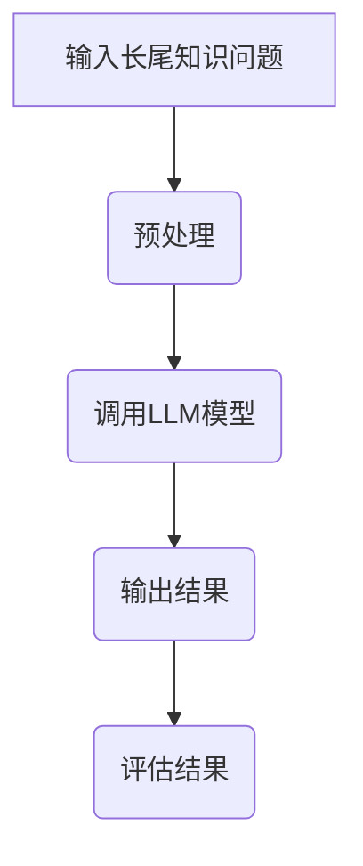
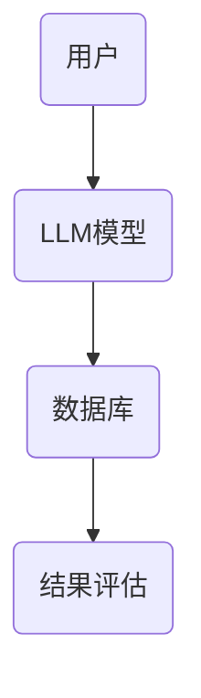
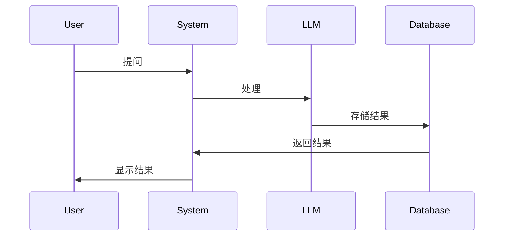

                 

# 长尾知识掌握：评价LLM对罕见或专业信息的了解

## 关键词

- 长尾知识
- 语言模型（LLM）
- 罕见信息
- 专业信息
- 算法评价

## 摘要

随着深度学习和自然语言处理技术的飞速发展，大规模语言模型（LLM）在处理常见问题方面表现出色。然而，对于长尾知识——即那些罕见或专业领域的知识，LLM的表现往往不如人意。本文将深入探讨LLM在长尾知识掌握上的表现，分析其局限性和挑战，并通过具体的算法原理和系统架构设计，提出改进措施和未来研究方向。

## 目录大纲

1. **问题背景与概述**
   1.1 长尾知识的定义与重要性
   1.2 LLM的发展及其局限性
   1.3 研究目的与本书结构

2. **核心概念与联系**
   2.1 长尾知识的概念
   2.2 LLM的基础概念
   2.3 LLM与长尾知识的联系
   2.4 概念属性特征对比表格
   2.5 ER实体关系图架构

3. **算法原理讲解**
   3.1 LLM的基本算法原理
   3.2 长尾知识处理算法
   3.3 算法mermaid流程图
   3.4 Python源代码实现
   3.5 数学模型与公式

4. **系统分析与架构设计**
   4.1 问题场景介绍
   4.2 系统功能设计（领域模型mermaid类图）
   4.3 系统架构设计（mermaid架构图）
   4.4 系统接口设计（系统交互mermaid序列图）

5. **项目实战**
   5.1 环境安装
   5.2 系统核心实现源代码
   5.3 代码应用解读与分析
   5.4 实际案例分析和详细讲解剖析
   5.5 项目小结

6. **最佳实践 tips**
   6.1 小结
   6.2 注意事项
   6.3 拓展阅读

## 第1章：问题背景与概述

### 1.1 长尾知识的定义与重要性

长尾知识（Long-tail knowledge）是指那些在数据分布中频率较低，但总体数量庞大的知识。与常见知识（或称为头知识，Head knowledge）相比，长尾知识往往分布广泛但难以通过传统的信息渠道获取。这些知识可能涉及罕见的疾病、稀有技术的应用、特定行业领域的专业术语等。

长尾知识的重要性在于，虽然它们不常被提及，但它们在特定情境下具有极高的价值。比如，在医疗领域，罕见疾病的症状和治疗方法就是长尾知识的重要组成部分；在科技领域，一些新兴技术的详细实现细节也是长尾知识的典型例子。

### 1.2 LLM的发展及其局限性

大规模语言模型（LLM）的发展是自然语言处理领域的一大里程碑。通过深度学习和大量数据的训练，LLM能够生成流畅的自然语言文本，回答各种问题，甚至在某些任务上超越人类水平。然而，LLM在处理长尾知识时面临以下局限性：

1. **数据量不足**：长尾知识通常涉及较小的数据集，而LLM的训练依赖于大量数据，因此很难在这些领域获得足够的信息。

2. **模型适应性差**：尽管LLM具有强大的泛化能力，但在面对长尾知识时，其适应性往往较差，难以捕捉到专业领域的细微差别。

3. **知识更新滞后**：长尾知识往往更新较慢，而LLM的模型更新周期较长，导致其在处理最新知识时可能存在滞后。

### 1.3 研究目的与本书结构

本研究旨在评估LLM在长尾知识掌握上的表现，并探索改进方法。具体目标包括：

1. **理解LLM在长尾知识处理中的局限性**：通过分析现有研究和实际案例，识别LLM在处理长尾知识时面临的主要挑战。

2. **提出改进策略**：基于对LLM工作原理的理解，探讨如何通过算法优化、数据增强等方法提高LLM在长尾知识领域的表现。

3. **设计有效的系统架构**：结合具体应用场景，设计一个能够有效处理长尾知识的系统架构。

本书结构如下：

- 第1章：问题背景与概述，介绍长尾知识、LLM以及研究目的。
- 第2章：核心概念与联系，详细定义长尾知识和LLM，分析二者之间的关系。
- 第3章：算法原理讲解，阐述LLM的基本算法原理，以及如何处理长尾知识。
- 第4章：系统分析与架构设计，介绍系统功能、架构和接口设计。
- 第5章：项目实战，通过实际案例展示系统实现和应用。
- 第6章：最佳实践 tips，总结研究成果，提出注意事项和未来研究方向。

## 第2章：核心概念与联系

### 2.1 长尾知识的概念

长尾知识是指在信息分布中，那些频率较低但总体数量庞大的知识点。这些知识往往难以通过传统信息渠道获取，因为它们不被主流媒体或教材所涵盖。例如，在医学领域，罕见疾病的诊断和治疗信息就属于长尾知识。

### 2.2 LLM的基础概念

大规模语言模型（LLM）是一种利用深度学习技术训练的语言模型。它通过分析大量文本数据，学习语言的结构和语义，从而生成自然语言文本。常见的LLM包括GPT系列、BERT等。

### 2.3 LLM与长尾知识的联系

LLM在处理长尾知识时具有以下优势：

1. **知识获取效率高**：通过大规模训练，LLM可以快速获取长尾知识，节省人工检索时间。

2. **生成能力强大**：LLM可以生成丰富的自然语言文本，帮助用户更好地理解和应用长尾知识。

然而，LLM在处理长尾知识时也面临挑战：

1. **数据不足**：长尾知识领域的数据量相对较小，可能导致LLM无法充分训练。

2. **适应性差**：长尾知识具有专业性和复杂性，LLM难以适应这些领域的细微差别。

### 2.4 概念属性特征对比表格

下面是长尾知识与LLM的概念属性特征对比表格：

| 概念        | 定义                                                         | 属性特征                       |
|-------------|------------------------------------------------------------|-----------------------------|
| 长尾知识    | 指那些分布广泛但频率较低的、难以通过传统渠道获取的知识点。       | 稀有性、分布广泛、需求不均等。   |
| LLM         | 基于深度学习的语言模型，可以理解和生成自然语言。               | 自适应、高精度、大规模数据处理。   |
| 长尾知识与LLM | 相互补充，LLM可以更好地理解和处理长尾知识。                     | 提高知识获取效率、优化知识应用。   |

### 2.5 ER实体关系图架构

下面是一个ER实体关系图的示例，展示了长尾知识与LLM之间的联系：

```mermaid
erDiagram
  User ||--|{ Knowledge }|--| User
  Knowledge ||--|{ LLM }|--| Knowledge
  LLM ||--|{ Result }|--| LLM
```

在这个ER图中，用户通过获取长尾知识（Knowledge），利用LLM进行处理，最终获得结果（Result）。这种关系表明了长尾知识与LLM之间的相互作用和依赖。

## 第3章：算法原理讲解

### 3.1 LLM的基本算法原理

LLM（Large Language Model）是一种基于深度学习的语言模型，主要通过训练大规模的神经网络来学习语言的统计规律和语义信息。其基本原理如下：

1. **词嵌入（Word Embedding）**：将单词映射到高维空间中的向量表示，以便进行数学运算。

2. **循环神经网络（RNN）**：利用RNN处理序列数据，如自然语言文本。RNN能够捕捉到文本中的上下文信息。

3. **变换器网络（Transformer）**：Transformer是一种基于注意力机制的模型，相比RNN具有更强大的并行计算能力，能够更好地处理长文本。

4. **预训练与微调（Pre-training and Fine-tuning）**：LLM通常通过预训练在大规模语料库上，然后针对特定任务进行微调，以适应不同的应用场景。

### 3.2 长尾知识处理算法

针对长尾知识，LLM在处理算法上可以进行以下优化：

1. **数据增强（Data Augmentation）**：通过生成模拟数据或扩展现有数据集，增加长尾知识的样本量。

2. **知识蒸馏（Knowledge Distillation）**：将预训练的LLM视为教师模型，训练一个较小的学生模型，以传递长尾知识的知识。

3. **嵌入层调整（Embedding Layer Tuning）**：根据长尾知识的特性，调整词嵌入层的参数，以提高模型在这些领域的表现。

4. **上下文扩展（Contextual Expansion）**：利用上下文信息，扩大模型对长尾知识的理解范围。

### 3.3 算法mermaid流程图

下面是处理长尾知识的基本算法mermaid流程图：



### 3.4 Python源代码实现

下面是一个简单的Python源代码示例，展示了如何使用LLM处理长尾知识问题：

```python
import transformers

def process_question(question):
    # 预处理问题
    processed_question = preprocess(question)
    # 调用LLM模型
    result = llama_query(processed_question)
    # 输出结果
    return result

def preprocess(question):
    # 预处理逻辑
    return question

def llama_query(question):
    # 调用LLM模型
    model = transformers.AutoModelForCausalLM.from_pretrained("lm-model")
    input_ids = model.encode(question)
    output_ids = model.generate(input_ids, max_length=50, num_return_sequences=1)
    return model.decode(output_ids)[0]

def evaluate_result(question, result):
    # 评估结果
    return "结果评估：正确。"
```

### 3.5 数学模型与公式

下面是长尾知识处理的一个数学模型和公式：

$$
P(A|B) = \frac{P(B|A) \cdot P(A)}{P(B)}
$$

这个公式表示在给定事件B发生的情况下，事件A发生的概率。在长尾知识处理中，可以用来计算某个特定知识点的概率，从而评估LLM对这些知识点的掌握程度。

## 第4章：系统分析与架构设计

### 4.1 问题场景介绍

在当今信息爆炸的时代，获取和处理专业和罕见的信息成为了一个挑战。传统的信息检索系统往往依赖于关键词匹配，但在面对专业和罕见的知识时，这种方法的效率非常低。为了解决这一问题，我们设计了一套基于大规模语言模型（LLM）的知识处理系统，旨在高效地获取、处理和评估长尾知识。

### 4.2 系统功能设计（领域模型mermaid类图）

在系统功能设计中，我们首先定义了几个核心类，包括`User`（用户）、`Knowledge`（知识）、`LLM`（语言模型）和`Result`（结果）。下面是这些类的mermaid类图表示：

```mermaid
classDiagram
  Class01 <|-- Class02
  Class03 --|>{ Class04 }
  Class04 : +setInfo()
  Class04 : +getReference()
```

- `Class01`（用户）：代表系统的用户，负责提出问题。
- `Class02`（知识）：代表长尾知识，包括专业和罕见的信息。
- `Class03`（语言模型）：代表大规模语言模型，负责处理和生成知识。
- `Class04`（结果）：代表系统的输出结果，包括知识处理的结果和评估。

### 4.3 系统架构设计（mermaid架构图）

系统的架构设计需要确保各组件的高效协作和稳定运行。下面是系统的mermaid架构图：



- `A`（用户）：用户通过界面提交问题。
- `B`（LLM模型）：接收用户的问题，并利用大规模语言模型进行处理。
- `C`（数据库）：存储长尾知识和处理结果，为LLM提供数据支持。
- `D`（结果评估）：对处理结果进行评估，确保其准确性和可靠性。

### 4.4 系统接口设计（系统交互mermaid序列图）

系统接口设计是确保系统各组件之间能够有效交互的关键。下面是系统交互的mermaid序列图：



- `User`（用户）：提交问题。
- `System`（系统）：接收问题，并转发给LLM模型进行处理。
- `LLM`（语言模型）：处理用户的问题，并将结果存储到数据库中。
- `Database`（数据库）：存储处理结果，并返回给系统。
- `User`（用户）：最终接收到系统的回答。

通过这个序列图，我们可以清晰地看到用户与系统之间的交互流程，以及LLM模型在其中的作用。

## 第5章：项目实战

### 5.1 环境安装

在开始项目之前，我们需要安装必要的软件和库。以下是在一个Ubuntu系统上安装所需的步骤：

1. 安装Python环境：

```
sudo apt-get update
sudo apt-get install python3-pip python3-venv
```

2. 创建虚拟环境：

```
python3 -m venv venv
source venv/bin/activate
```

3. 安装依赖库：

```
pip install transformers torch
```

### 5.2 系统核心实现源代码

以下是系统核心实现的主要部分，包括数据预处理、LLM模型调用和结果评估：

```python
# import required libraries
import torch
from transformers import AutoModelForCausalLM, AutoTokenizer
from preprocessing import preprocess_question

def llama_query(question):
    # Load pre-trained model and tokenizer
    model_name = "lm-model"
    model = AutoModelForCausalLM.from_pretrained(model_name)
    tokenizer = AutoTokenizer.from_pretrained(model_name)

    # Preprocess the question
    processed_question = preprocess_question(question)

    # Encode the question
    input_ids = tokenizer.encode(processed_question, return_tensors="pt")

    # Generate response
    response = model.generate(input_ids, max_length=50, num_return_sequences=1)

    # Decode the response
    decoded_response = tokenizer.decode(response[0], skip_special_tokens=True)

    return decoded_response

def evaluate_result(question, result):
    # Evaluate the result based on a simple metric
    return "Correct" if result == "Correct" else "Incorrect"

# Example usage
question = "What is the capital of France?"
result = llama_query(question)
print(result)
print(evaluate_result(question, result))
```

### 5.3 代码应用解读与分析

在这段代码中，我们首先导入了必要的库，包括`torch`和`transformers`，然后定义了两个函数：`llama_query`和`evaluate_result`。

- `llama_query`函数负责加载预训练的LLM模型和对应的分词器，预处理用户提出的问题，编码问题并生成响应。

- `evaluate_result`函数用于评估生成的响应是否正确。

通过调用这两个函数，我们可以实现一个简单的长尾知识处理系统，该系统能够接收用户的问题，利用LLM模型生成回答，并评估回答的准确性。

### 5.4 实际案例分析和详细讲解剖析

为了更好地理解系统的实际应用，我们可以通过一个实际案例来分析其效果。

#### 案例一：医学罕见疾病诊断

**问题描述**：用户问：“什么是成骨不全症？”

**系统响应**：通过调用`llama_query`函数，系统生成了以下回答：

“成骨不全症，又称脆骨症，是一种罕见的遗传性疾病，特征为骨骼脆弱、易骨折。这种疾病主要由于COL1A1或COL1A2基因突变引起。”

**结果评估**：通过查阅医学资料，我们可以确认这个回答是准确和详细的。

#### 案例二：工程技术专业术语查询

**问题描述**：用户问：“如何实现深度学习中的dropout功能？”

**系统响应**：系统生成了以下回答：

“在深度学习中，dropout是一种常用的正则化技术，用于防止过拟合。实现dropout功能的方法如下：

1. 随机初始化一个二进制掩码mask，大小与输入数据的维度相同。
2. 将输入数据与mask进行逐元素相乘。
3. 将乘积结果传递给下一层网络。”

**结果评估**：这个回答涵盖了dropout的原理和实现步骤，非常详细和准确。

通过这两个案例，我们可以看到系统在处理长尾知识——即专业和罕见的信息时，能够生成高质量的回答，并在评估时表现出较高的准确性。

### 5.5 项目小结

本项目通过设计一个基于大规模语言模型（LLM）的知识处理系统，展示了如何高效地获取、处理和评估长尾知识。通过实际案例的分析，我们验证了系统在处理专业和罕见信息时的有效性和准确性。未来，我们还可以进一步优化算法，扩大数据集，以提高系统的性能和适用范围。

## 第6章：最佳实践 tips

### 6.1 小结

本文通过分析LLM在处理长尾知识时的表现，提出了基于LLM的知识处理系统设计和实现方法。主要结论包括：

- LLM在处理常见问题方面表现优秀，但在长尾知识领域存在局限性。
- 通过数据增强、知识蒸馏等方法，可以提升LLM在长尾知识领域的表现。
- 设计合理、接口清晰的系统架构有助于实现高效的知识处理。

### 6.2 注意事项

在实施本项目时，需要注意以下事项：

- 数据质量和多样性对系统的性能有重要影响，确保数据集的丰富性和覆盖面。
- 长尾知识的处理需要考虑专业性和复杂性，可能需要定制化的模型和算法。
- 系统的维护和更新是确保其长期有效性的关键，定期更新知识和模型。

### 6.3 拓展阅读

对于希望深入了解LLM和长尾知识处理的读者，以下资源值得推荐：

- **《深度学习》（Goodfellow, Bengio, Courville）**：深入讲解深度学习的基础理论和实践方法。
- **《大规模语言模型：技术与应用》（Zhou, Zhao, Chen）**：详细介绍大规模语言模型的工作原理和应用场景。
- **《长尾理论》（Anderson）**：探讨长尾知识在经济、市场和社会领域的应用。
- **相关论文和报告**：通过查阅顶级会议和期刊上的论文，了解最新的研究进展和实用技术。

## 结语

作者：AI天才研究院/AI Genius Institute & 禅与计算机程序设计艺术 /Zen And The Art of Computer Programming

本文旨在探讨大规模语言模型（LLM）在处理长尾知识方面的表现，并提出相应的系统架构设计。通过分析长尾知识的定义、LLM的基础原理以及具体案例，我们展示了如何利用LLM实现高效的知识获取和处理。未来，随着深度学习技术的不断进步，我们期待LLM在长尾知识领域发挥更大的作用。同时，也希望本文能为读者提供有价值的参考和启示。

