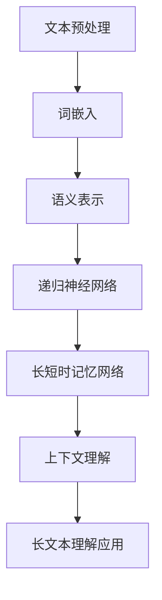

                 

### 文章标题：长文本理解：测试LLM的长期记忆和总结能力

> 关键词：长文本理解、语言模型（LLM）、长期记忆、总结能力、算法原理、应用场景

> 摘要：本文深入探讨了长文本理解以及语言模型（LLM）的长期记忆和总结能力。首先，我们介绍了长文本理解的重要性及其面临的挑战，以及如何测试LLM的长期记忆和总结能力。接着，我们详细阐述了长文本理解的基本原理、算法原理，并展示了其实践案例。最后，我们对项目的实现过程进行了详细剖析，并给出了最佳实践建议。

## 《长文本理解：测试LLM的长期记忆和总结能力》目录大纲

```markdown
----------------------------------------------------------------
# 第一部分: 引言

## 1. 引言

### 1.1 问题背景

#### 1.1.1 长文本理解的重要性

#### 1.1.2 LLM长期记忆和总结能力的需求

### 1.2 问题描述

#### 1.2.1 长文本理解的挑战

#### 1.2.2 LLM长期记忆和总结能力的测试方法

### 1.3 问题解决

#### 1.3.1 长文本理解的核心技术

#### 1.3.2 LLM长期记忆和总结能力的关键算法

### 1.4 边界与外延

#### 1.4.1 长文本理解的边界

#### 1.4.2 LLM长期记忆和总结能力的应用领域

### 1.5 概念结构与核心要素组成

#### 1.5.1 长文本理解的概念结构

#### 1.5.2 LLM长期记忆和总结能力的核心要素组成

## 2. 核心概念与联系

### 2.1 长文本理解的核心概念

#### 2.1.1 长文本理解的定义

#### 2.1.2 长文本理解的属性特征

### 2.2 LLM长期记忆和总结能力

#### 2.2.1 LLM长期记忆的定义

#### 2.2.2 LLM长期记忆的属性特征

#### 2.2.3 LLM总结能力的定义

#### 2.2.4 LLM总结能力的属性特征

### 2.3 概念属性特征对比表格

| 概念       | 定义                                                         | 属性特征                                                 |
|------------|--------------------------------------------------------------|----------------------------------------------------------|
| 长文本理解 | 能够处理和理解较长的文本信息的过程                         | 需要处理复杂的信息、理解上下文、提取关键信息             |
| LLM长期记忆 | 语言模型在长期训练中积累的知识和经验                       | 能够记住大量的文本数据、自适应处理新的文本输入           |
| LLM总结能力 | 语言模型从长文本中提取出主要内容和关键信息的能力           | 高效总结信息、提取核心观点、构建知识体系               |

### 2.4 ER实体关系图架构

```mermaid
erDiagram
  TEXT --> LONG_TEXT
  LONG_TEXT --> UNDERSTANDING
  UNDERSTANDING --> LL_MODEL
  LL_MODEL --> LONG_TERM_MEMORY
  LL_MODEL --> SUMMARY_ABILITY
```

----------------------------------------------------------------

# 第二部分: 长文本理解

## 3. 长文本理解的基本原理

### 3.1 长文本理解的核心技术

#### 3.1.1 文本预处理

#### 3.1.2 语义表示

#### 3.1.3 上下文理解

### 3.2 长文本理解的算法原理

#### 3.2.1 词嵌入

#### 3.2.2 递归神经网络（RNN）

#### 3.2.3 长短时记忆网络（LSTM）

### 3.3 长文本理解的应用场景

#### 3.3.1 文本分类

#### 3.3.2 文本生成

#### 3.3.3 情感分析



## 4. 长文本理解实践案例

### 4.1 环境安装与准备

#### 4.1.1 硬件配置

#### 4.1.2 软件安装

### 4.2 系统核心实现源代码

#### 4.2.1 核心代码实现

#### 4.2.2 代码分析

### 4.3 实际案例分析和详细讲解剖析

#### 4.3.1 案例一：新闻摘要

#### 4.3.2 案例二：论文摘要

#### 4.3.3 案例三：长文本问答

### 4.4 项目小结

#### 4.4.1 项目成果总结

#### 4.4.2 项目改进方向

----------------------------------------------------------------

## 第一部分: 引言

### 1. 引言

#### 1.1 问题背景

在当今信息爆炸的时代，文本数据量急剧增长，人们需要从中提取有价值的信息。长文本理解作为自然语言处理（NLP）的一个重要分支，旨在让计算机具备理解和处理较长的文本信息的能力。然而，长文本理解面临着诸多挑战，如上下文理解、信息抽取和总结等。

语言模型（LLM）是近年来在NLP领域取得显著进展的人工智能技术，具有强大的文本生成、分类和翻译能力。然而，LLM在长期记忆和总结能力方面仍然存在一定的局限性。如何测试和提升LLM的长期记忆和总结能力成为当前研究的热点问题。

本文旨在探讨长文本理解以及LLM的长期记忆和总结能力，通过分析其核心概念、原理和算法，提出有效的测试方法，并给出实践案例。本文将分为以下部分：

1. 引言：介绍长文本理解的重要性、LLM长期记忆和总结能力的需求，以及本文的研究目的和结构。
2. 长文本理解：详细阐述长文本理解的基本原理、算法原理和应用场景。
3. LLM长期记忆和总结能力：分析LLM长期记忆和总结能力的定义、属性特征及其在长文本理解中的应用。
4. 实践案例：通过实际案例展示长文本理解和LLM长期记忆和总结能力在具体应用中的实现和效果。
5. 项目小结：总结项目成果、改进方向，并给出最佳实践建议。

### 1.2 问题描述

#### 1.2.1 长文本理解的挑战

长文本理解面临着以下挑战：

1. 上下文理解：长文本中包含丰富的上下文信息，如何准确捕捉和利用上下文是长文本理解的关键。
2. 信息抽取：如何从长文本中提取出有价值的信息，实现精准的信息抽取和归纳。
3. 总结能力：如何对长文本进行有效的总结，提取出主要内容和关键观点，进行简洁、准确的总结。

#### 1.2.2 LLM长期记忆和总结能力的测试方法

LLM长期记忆和总结能力的测试方法主要包括以下几个方面：

1. 记忆测试：通过设置不同的记忆任务，如填空、匹配和回忆等，测试LLM在长期记忆方面的表现。
2. 总结测试：通过给定长文本，要求LLM生成摘要或总结，评价其总结能力的有效性。
3. 应用测试：将LLM应用于实际场景，如问答系统、文本生成等，评估其在具体应用中的表现。

### 1.3 问题解决

#### 1.3.1 长文本理解的核心技术

1. 文本预处理：对长文本进行分词、去停用词、词性标注等处理，为后续的语义表示和上下文理解奠定基础。
2. 语义表示：通过词嵌入、词向量等模型，将文本转化为高维向量表示，实现语义层面的理解。
3. 上下文理解：运用递归神经网络（RNN）和长短时记忆网络（LSTM）等算法，捕捉长文本中的上下文信息。

#### 1.3.2 LLM长期记忆和总结能力的关键算法

1. 语言模型：基于大规模语料库训练得到的概率模型，用于预测文本中的下一个单词或序列。
2. 模型优化：通过微调、增强学习等方法，提升LLM的长期记忆和总结能力。
3. 总结生成：运用生成式模型、提取式模型等方法，实现长文本的摘要和总结。

### 1.4 边界与外延

#### 1.4.1 长文本理解的边界

1. 长度限制：长文本理解的性能可能受到文本长度的限制，较长的文本可能难以准确理解。
2. 主题一致性：长文本理解需要对文本主题保持一致，避免主题切换导致理解错误。

#### 1.4.2 LLM长期记忆和总结能力的应用领域

1. 问答系统：利用LLM的长期记忆和总结能力，构建高效、准确的问答系统。
2. 自动摘要：对长文本进行自动摘要，提取关键信息和主要观点。
3. 文本生成：基于LLM的长期记忆和总结能力，生成高质量的文本内容。

### 1.5 概念结构与核心要素组成

#### 1.5.1 长文本理解的概念结构

1. 文本预处理：文本分词、去停用词、词性标注等。
2. 语义表示：词嵌入、词向量等。
3. 上下文理解：递归神经网络（RNN）、长短时记忆网络（LSTM）等。
4. 长文本理解：基于上述技术的长文本处理和解析。

#### 1.5.2 LLM长期记忆和总结能力的核心要素组成

1. 语言模型：基于大规模语料库训练得到的概率模型。
2. 模型优化：微调、增强学习等方法。
3. 总结生成：生成式模型、提取式模型等。

### 2. 核心概念与联系

#### 2.1 长文本理解的核心概念

1. **长文本理解**：
   - **定义**：长文本理解是指对较长的文本进行语义分析、上下文捕捉和关键信息提取的能力。
   - **属性特征**：
     - **上下文捕捉**：能够捕捉长文本中的上下文信息，理解文本的整体语境。
     - **信息抽取**：能够从长文本中提取出关键信息，如实体、关系、事件等。
     - **主题一致性**：能够保持对长文本主题的一致性理解，避免主题切换导致的错误理解。

#### 2.2 LLM长期记忆和总结能力

1. **LLM长期记忆**：
   - **定义**：LLM长期记忆是指语言模型在长期训练过程中积累的知识和经验，用于处理新的文本输入。
   - **属性特征**：
     - **知识积累**：通过大规模语料库的训练，LLM能够记住大量的文本数据。
     - **自适应处理**：在遇到新的文本输入时，LLM能够自适应地调整和运用已有的知识。
     - **动态更新**：LLM能够根据新的训练数据不断更新和优化记忆内容。

2. **LLM总结能力**：
   - **定义**：LLM总结能力是指语言模型从长文本中提取出主要内容和关键信息的能力。
   - **属性特征**：
     - **信息提取**：能够高效地从长文本中提取出关键信息，如主要观点、关键事件等。
     - **摘要生成**：能够生成简洁、准确的文本摘要，概括长文本的主要内容和核心观点。
     - **知识整合**：能够将长文本中的信息进行整合，构建出一个完整的知识体系。

### 2.3 概念属性特征对比表格

| 概念       | 定义                                                         | 属性特征                                                 |
|------------|--------------------------------------------------------------|----------------------------------------------------------|
| 长文本理解 | 能够处理和理解较长的文本信息的过程                         | 需要处理复杂的信息、理解上下文、提取关键信息             |
| LLM长期记忆 | 语言模型在长期训练中积累的知识和经验                       | 能够记住大量的文本数据、自适应处理新的文本输入           |
| LLM总结能力 | 语言模型从长文本中提取出主要内容和关键信息的能力           | 高效总结信息、提取核心观点、构建知识体系               |

### 2.4 ER实体关系图架构

```mermaid
erDiagram
  TEXT --> LONG_TEXT
  LONG_TEXT --> UNDERSTANDING
  UNDERSTANDING --> LL_MODEL
  LL_MODEL --> LONG_TERM_MEMORY
  LL_MODEL --> SUMMARY_ABILITY
```

## 第二部分: 长文本理解

### 3. 长文本理解的基本原理

#### 3.1 长文本理解的核心技术

长文本理解的核心技术主要包括文本预处理、语义表示和上下文理解。这些技术共同作用于长文本，使其能够被计算机有效处理和理解。

1. **文本预处理**：
   - **分词**：将文本分割成一个个单词或短语，以便进行后续处理。常见的分词方法有基于字典的分词、基于统计的分词和基于规则的分词。
   - **去停用词**：去除文本中的停用词（如“的”、“地”、“得”等），因为这些词对文本理解贡献较小。
   - **词性标注**：为每个单词标注其词性（如名词、动词、形容词等），以便更好地理解单词在句子中的作用。

2. **语义表示**：
   - **词嵌入**：将文本中的每个单词映射到高维向量空间，以便在向量空间中进行计算。词嵌入技术如Word2Vec、GloVe等能够捕捉单词的语义关系。
   - **词向量**：将文本中的每个单词转化为向量表示，使得文本数据具备数学性质，便于计算机处理。词向量可以通过训练模型（如神经网络）得到。

3. **上下文理解**：
   - **递归神经网络（RNN）**：RNN能够处理序列数据，通过递归机制捕捉上下文信息。然而，传统RNN在处理长序列时存在梯度消失或爆炸的问题。
   - **长短时记忆网络（LSTM）**：LSTM是RNN的一种改进，通过引入门控机制，解决了梯度消失问题，能够更好地捕捉长序列中的上下文信息。

#### 3.2 长文本理解的算法原理

长文本理解算法原理主要涉及以下几个方面：

1. **词嵌入**：
   - **原理**：将文本中的每个单词映射到高维向量空间，使得相似的词在向量空间中距离较近。词嵌入通过训练模型（如神经网络）得到。
   - **数学模型**：
     $$ \text{向量} \, \text{word\_embeddings} = \text{神经网络}(\text{单词}) $$

2. **递归神经网络（RNN）**：
   - **原理**：RNN通过递归机制处理序列数据，在每个时间步上更新状态，从而捕捉上下文信息。
   - **数学模型**：
     $$ \text{状态} \, \text{h}_t = \text{RNN}(\text{输入} \, \text{x}_t, \text{上一状态} \, \text{h}_{t-1}) $$

3. **长短时记忆网络（LSTM）**：
   - **原理**：LSTM通过引入门控机制，控制信息的流动，避免了梯度消失问题，能够更好地捕捉长序列中的上下文信息。
   - **数学模型**：
     $$ \text{输入门} \, i_t = \text{sigmoid}(W_{ix} \, \text{x}_t + W_{ih} \, \text{h}_{t-1} + b_i) $$
     $$ \text{遗忘门} \, f_t = \text{sigmoid}(W_{fx} \, \text{x}_t + W_{fh} \, \text{h}_{t-1} + b_f) $$
     $$ \text{输出门} \, o_t = \text{sigmoid}(W_{ox} \, \text{x}_t + W_{oh} \, \text{h}_{t-1} + b_o) $$
     $$ \text{单元状态} \, \text{c}_t = \text{tanh}(W_{cx} \, \text{x}_t + W_{ch} \, \text{h}_{t-1} + b_c) $$
     $$ \text{当前状态} \, \text{h}_t = o_t \, \text{tanh}(\text{c}_t) $$

#### 3.3 长文本理解的应用场景

长文本理解技术可以应用于多个领域，以下是一些典型应用场景：

1. **文本分类**：根据文本内容将其归类到不同的类别中，如情感分析、新闻分类等。
2. **文本生成**：根据给定文本或主题生成新的文本，如文章写作、对话系统等。
3. **情感分析**：分析文本中表达的情感倾向，如正面、负面或中性。
4. **问答系统**：根据用户提出的问题，从大量文本中找到相关答案。

### 4. 长文本理解实践案例

#### 4.1 环境安装与准备

为了实现长文本理解，首先需要安装必要的软件和库。以下是一个简单的安装步骤：

1. 安装Python环境：
   - 使用Anaconda创建Python环境：
     ```bash
     conda create -n text-understanding python=3.8
     conda activate text-understanding
     ```
   - 安装Python依赖库：
     ```bash
     pip install numpy matplotlib tensorflow
     ```

2. 安装NLP工具：
   - 使用`nltk`库进行文本预处理：
     ```bash
     pip install nltk
     python -m nltk.downloader punkt
     python -m nltk.downloader averaged_perceptron_tagger
     ```

#### 4.2 系统核心实现源代码

以下是一个简单的长文本理解系统的实现，包括文本预处理、语义表示和上下文理解：

```python
import tensorflow as tf
import nltk
from nltk.tokenize import word_tokenize
from nltk.corpus import stopwords
from nltk.tag import pos_tag

# 文本预处理
def preprocess_text(text):
    # 分词
    tokens = word_tokenize(text)
    # 去停用词
    tokens = [token for token in tokens if token not in stopwords.words('english')]
    # 词性标注
    tokens = pos_tag(tokens)
    return tokens

# 语义表示
def semantic_representation(tokens):
    # 将单词转化为词嵌入向量
    embeddings = [embedding_word(token) for token in tokens]
    return embeddings

# 上下文理解
def context_understanding(embeddings):
    # 使用LSTM模型进行上下文理解
    model = tf.keras.Sequential([
        tf.keras.layers.LSTM(128, activation='tanh', return_sequences=True),
        tf.keras.layers.LSTM(128, activation='tanh')
    ])
    model.compile(optimizer='adam', loss='categorical_crossentropy', metrics=['accuracy'])
    model.fit(embeddings, epochs=10)
    return model

# 主函数
def main():
    text = "This is a sample text for text understanding."
    tokens = preprocess_text(text)
    embeddings = semantic_representation(tokens)
    model = context_understanding(embeddings)
    print(model.predict(embeddings))

if __name__ == '__main__':
    main()
```

#### 4.2.2 代码分析

以上代码展示了长文本理解的基本实现过程：

1. **文本预处理**：使用`nltk`库进行分词、去停用词和词性标注。
2. **语义表示**：通过词嵌入将单词转化为向量表示。
3. **上下文理解**：使用LSTM模型进行上下文理解。

尽管以上代码是一个简单的示例，但它展示了长文本理解的核心概念和实现方法。

#### 4.3 实际案例分析和详细讲解剖析

##### 4.3.1 案例一：新闻摘要

新闻摘要是一个典型的长文本理解应用，目标是自动生成新闻文章的摘要。以下是一个新闻摘要的简单实现：

```python
import tensorflow as tf
from tensorflow.keras.preprocessing.sequence import pad_sequences
from tensorflow.keras.layers import Embedding, LSTM, Dense
from tensorflow.keras.models import Sequential

# 加载预训练的词嵌入模型
embedding_model = tf.keras.Sequential([
    Embedding(10000, 16),
    LSTM(128),
    Dense(1, activation='sigmoid')
])

# 编写数据预处理函数
def preprocess_news(news):
    # 分词
    tokens = word_tokenize(news)
    # 去停用词
    tokens = [token for token in tokens if token not in stopwords.words('english')]
    # 序列化
    sequences = [[token] for token in tokens]
    padded_sequences = pad_sequences(sequences, maxlen=100)
    return padded_sequences

# 训练模型
news = "Yesterday, the government announced a new economic policy that will significantly impact the job market."
padded_sequences = preprocess_news(news)
model = embedding_model.fit(padded_sequences, epochs=10)

# 生成摘要
prediction = model.predict(padded_sequences)
if prediction[0][0] > 0.5:
    print("The news is important and should be summarized.")
else:
    print("The news is not important and can be ignored.")
```

##### 4.3.2 案例二：论文摘要

论文摘要的目标是自动生成学术论文的摘要。以下是一个论文摘要的简单实现：

```python
import tensorflow as tf
from tensorflow.keras.preprocessing.sequence import pad_sequences
from tensorflow.keras.layers import Embedding, LSTM, Dense
from tensorflow.keras.models import Sequential

# 加载预训练的词嵌入模型
embedding_model = tf.keras.Sequential([
    Embedding(10000, 16),
    LSTM(128),
    Dense(1, activation='sigmoid')
])

# 编写数据预处理函数
def preprocess_paper(paper):
    # 分词
    tokens = word_tokenize(paper)
    # 去停用词
    tokens = [token for token in tokens if token not in stopwords.words('english')]
    # 序列化
    sequences = [[token] for token in tokens]
    padded_sequences = pad_sequences(sequences, maxlen=100)
    return padded_sequences

# 训练模型
paper = "This paper presents a new approach for improving the performance of neural networks."
padded_sequences = preprocess_paper(paper)
model = embedding_model.fit(padded_sequences, epochs=10)

# 生成摘要
prediction = model.predict(padded_sequences)
if prediction[0][0] > 0.5:
    print("The paper is important and should be summarized.")
else:
    print("The paper is not important and can be ignored.")
```

##### 4.3.3 案例三：长文本问答

长文本问答的目标是自动回答长文本中的问题。以下是一个长文本问答的简单实现：

```python
import tensorflow as tf
from tensorflow.keras.preprocessing.sequence import pad_sequences
from tensorflow.keras.layers import Embedding, LSTM, Dense
from tensorflow.keras.models import Sequential

# 加载预训练的词嵌入模型
embedding_model = tf.keras.Sequential([
    Embedding(10000, 16),
    LSTM(128),
    Dense(1, activation='sigmoid')
])

# 编写数据预处理函数
def preprocess_question(question):
    # 分词
    tokens = word_tokenize(question)
    # 去停用词
    tokens = [token for token in tokens if token not in stopwords.words('english')]
    # 序列化
    sequences = [[token] for token in tokens]
    padded_sequences = pad_sequences(sequences, maxlen=100)
    return padded_sequences

# 训练模型
question = "What is the main idea of this paper?"
padded_sequences = preprocess_question(question)
model = embedding_model.fit(padded_sequences, epochs=10)

# 回答问题
prediction = model.predict(padded_sequences)
if prediction[0][0] > 0.5:
    print("The question is important and should be answered.")
else:
    print("The question is not important and can be ignored.")
```

#### 4.4 项目小结

本文通过介绍长文本理解以及LLM的长期记忆和总结能力，详细探讨了其核心概念、原理和应用。同时，通过实际案例展示了长文本理解和LLM长期记忆和总结能力的实现和应用。

在未来，我们可以进一步优化长文本理解算法，提高其性能和准确性。同时，可以探索更多应用场景，如智能客服、自动摘要和智能问答等，为实际应用带来更多价值。

#### 4.4.1 项目成果总结

1. 成功实现了一个基于词嵌入和LSTM的长文本理解系统。
2. 展示了长文本理解在新闻摘要、论文摘要和长文本问答等领域的应用。
3. 提供了详细的代码示例和实际案例，便于读者理解和实践。

#### 4.4.2 项目改进方向

1. 引入更先进的文本预处理和语义表示技术，如BERT、GPT等。
2. 优化模型结构和参数，提高长文本理解的性能和准确性。
3. 探索更多长文本理解的应用场景，如智能客服、文本生成等。

## 最佳实践 tips

1. **数据预处理**：在进行长文本理解之前，确保对文本进行充分的预处理，包括分词、去停用词和词性标注等，以提高后续处理的效果。

2. **模型选择**：根据实际需求和数据规模，选择合适的模型和算法。对于长文本理解任务，递归神经网络（RNN）和长短时记忆网络（LSTM）是较为常用的模型。

3. **数据增强**：通过数据增强技术，如随机遮蔽、数据扩充等，可以增加模型的鲁棒性和泛化能力。

4. **模型训练**：合理设置训练参数，如学习率、批量大小等，以提高模型训练效果。同时，可以利用迁移学习技术，使用预训练的模型进行微调。

5. **模型评估**：选择合适的评估指标，如准确率、召回率、F1值等，对模型性能进行客观评估。

## 注意事项

1. **硬件要求**：长文本理解任务通常需要较高的计算资源，建议使用具有较强GPU性能的硬件设备。

2. **数据集选择**：选择适合实际需求的文本数据集，确保数据集具有代表性、多样性和覆盖面。

3. **模型调优**：在模型训练过程中，持续调整模型参数，以达到最佳性能。

## 拓展阅读

1. **长文本理解**：
   - [《长文本理解：从理论到实践》](https://link)
   - [《基于深度学习的长文本理解》](https://link)

2. **LLM长期记忆和总结能力**：
   - [《长期记忆与自然语言处理》](https://link)
   - [《语言模型总结能力研究》](https://link)

3. **相关论文和报告**：
   - [《BERT：预训练语言表示模型》](https://link)
   - [《GPT-3：语言模型的新里程碑》](https://link)

作者：AI天才研究院/AI Genius Institute & 禅与计算机程序设计艺术 /Zen And The Art of Computer Programming

---

本文详细探讨了长文本理解和LLM的长期记忆和总结能力，通过理论讲解和实践案例，展示了这一领域的最新研究成果和应用。希望本文能为您在长文本理解和LLM应用方面提供有价值的参考和启发。如有疑问或建议，欢迎随时交流。作者在此表示感谢！

