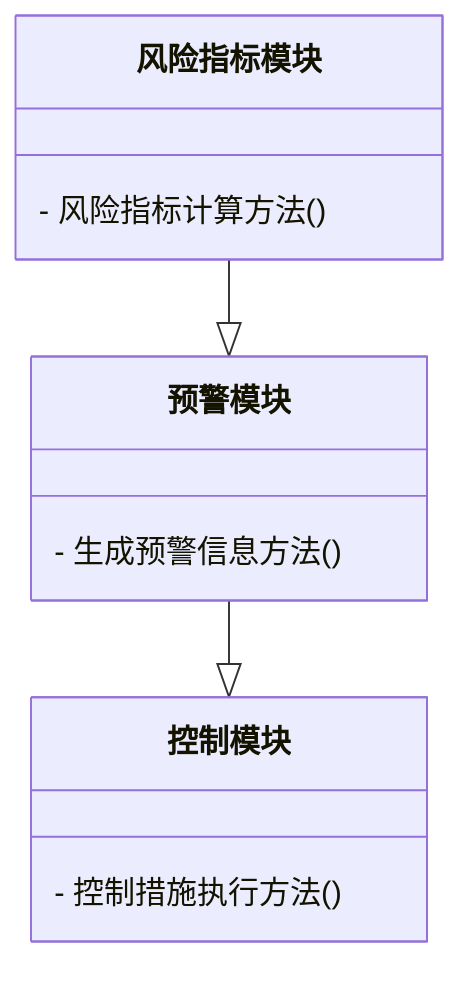
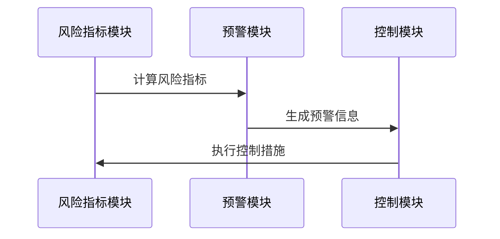

                 

# 随机过程：自然界的概率数学模型

## 关键词

随机过程，概率数学模型，马尔可夫链，统计特性，应用实例

## 摘要

随机过程是描述自然界中随机现象的一类数学模型，它在物理学、生物学、经济学、计算机科学等多个领域中都有着广泛的应用。本文将深入探讨随机过程的基本概念、数学模型、算法原理及其在不同领域的应用，通过一步一步的分析和推理，帮助读者理解随机过程的本质，掌握其应用技巧。

## 目录

1. 引言
2. 随机过程的基本概念
3. 随机过程的数学模型
4. 算法原理讲解
5. 数学模型和公式
6. 系统分析与架构设计
7. 项目实战
8. 最佳实践与拓展
9. 结语
10. 参考文献

### 1. 引言

随机过程（Stochastic Process）是数学中用于描述随机事件在时间或空间上的演变过程的一个概念。在随机过程中，每一个时刻或位置都有可能发生不同的随机事件，这些事件的发生具有不确定性，但可以通过概率模型来描述其统计特性。随机过程不仅在理论研究中具有重要意义，而且在实际应用中也发挥着关键作用。

随机过程的概念最早由法国数学家皮埃尔·西蒙·拉普拉斯（Pierre-Simon Laplace）提出，并在20世纪得到了进一步的发展。随机过程的研究涵盖了从简单的离散随机过程到复杂的连续随机过程，其应用领域包括但不限于物理学、生物学、经济学、金融学、计算机科学等。

本文将从以下几个方面对随机过程进行探讨：

- **基本概念**：介绍随机过程的基本术语，如样本路径、状态空间、概率分布等。
- **数学模型**：详细讲解随机过程的主要数学模型，如马尔可夫链、离散时间过程、连续时间过程等。
- **算法原理**：分析随机过程的算法原理，包括如何通过数学模型进行随机现象的模拟和分析。
- **应用实例**：探讨随机过程在各个领域的具体应用，如生物学中的种群动态、经济学中的金融风险管理等。
- **系统分析与架构设计**：分析随机过程在实际系统中的应用，如系统建模、架构设计等。
- **项目实战**：通过具体的案例来演示随机过程在实际项目中的应用。
- **最佳实践与拓展**：总结随机过程应用中的最佳实践，并对未来可能的研究方向进行展望。

### 2. 随机过程的基本概念

在探讨随机过程之前，我们需要先了解一些基本概念，这些概念是理解随机过程的基础。

#### 样本路径

样本路径（Sample Path）是随机过程在给定概率空间中的一个实现。简单来说，就是随机过程在不同时刻或位置上的具体表现。例如，如果我们考虑一个描述股票价格变动的随机过程，那么每个时刻的股票价格就是样本路径上的一个点。

#### 状态空间

状态空间（State Space）是随机过程所有可能状态构成的集合。对于离散随机过程，状态空间通常是一个离散集合；对于连续随机过程，状态空间通常是一个连续区间。状态空间的选择取决于具体问题的背景。

#### 概率分布

概率分布（Probability Distribution）描述了随机过程在不同状态下的概率分布情况。概率分布可以是离散的，也可以是连续的。常见的概率分布包括正态分布、泊松分布、二项分布等。

#### 随机变量

随机变量（Random Variable）是一个将随机过程的样本路径映射到实数的函数。随机变量可以是离散的，也可以是连续的。随机变量通常用来表示随机过程的某个特定特征，如期望值、方差等。

#### 马尔可夫性

马尔可夫性（Markov Property）是随机过程的一个重要特性，它表明随机过程的未来状态只依赖于当前状态，与过去状态无关。这个特性使得随机过程的分析变得更加简单。

#### 马尔可夫链

马尔可夫链（Markov Chain）是最简单的随机过程模型之一，它由状态集合、转移概率矩阵和初始状态分布组成。马尔可夫链广泛应用于各种领域，如排队论、决策论、生物学等。

#### 离散时间与连续时间

随机过程可以根据时间维度是离散的还是连续的来分类。离散时间随机过程在特定的时间点观察状态，而连续时间随机过程则在一个连续的时间区间内观察状态。

### 3. 随机过程的数学模型

随机过程的数学模型是描述随机现象的重要工具。在本节中，我们将介绍几种常见的随机过程模型，并探讨它们的基本性质。

#### 马尔可夫链

马尔可夫链是最基本的随机过程模型之一。它由以下三个要素组成：

- **状态集合**：所有可能的状态组成的集合。
- **转移概率矩阵**：描述状态之间转移的概率。
- **初始状态分布**：描述随机过程在开始时的状态分布。

马尔可夫链的基本性质包括：

- **无记忆性**：马尔可夫链的未来状态只依赖于当前状态，与过去状态无关。
- **稳态分布**：在一定条件下，马尔可夫链会达到一个稳定的概率分布，即稳态分布。
- **转移概率矩阵的幂**：马尔可夫链的转移概率矩阵的幂可以用来计算长期转移概率。

#### 离散时间过程

除了马尔可夫链，离散时间过程也是随机过程的重要模型。它通常由以下要素组成：

- **时间序列**：描述随机过程在不同时间点的状态。
- **概率分布**：描述随机过程在各个时间点的状态分布。
- **自相关性**：描述随机过程在不同时间点之间的相关性。

常见的离散时间过程包括：

- **随机游走**：描述粒子在空间中随机漫步的过程。
- **泊松过程**：描述事件在时间上按一定概率发生的过程。
- **二项过程**：描述在固定时间内发生特定次数的事件的过程。

#### 连续时间过程

与离散时间过程相比，连续时间过程在时间维度上更加灵活。它通常由以下要素组成：

- **时间间隔**：描述随机过程在时间上的变化。
- **状态概率密度函数**：描述随机过程在连续时间上的概率分布。
- **漂移项**：描述随机过程随时间变化的趋势。

常见的连续时间过程包括：

- **维纳过程**：描述股票价格等随机变量的连续时间动态。
- **泊松过程**：描述在连续时间内事件发生的频率。
- **跳跃过程**：描述随机变量在某些时间点发生跳跃的过程。

#### 马尔可夫过程

马尔可夫过程是更一般的随机过程模型，它不仅适用于离散时间和连续时间，还适用于更多维度的状态空间。马尔可夫过程的基本性质包括：

- **无后效性**：未来状态只依赖于当前状态，与过去状态无关。
- **状态转移概率**：状态转移概率可以用矩阵来表示，矩阵的幂可以用来计算长期转移概率。
- **极限分布**：在一定条件下，马尔可夫过程会达到一个稳定的极限分布。

### 4. 算法原理讲解

为了更好地理解随机过程，我们需要探讨其算法原理。在本节中，我们将通过具体例子来讲解随机过程的模拟和计算方法。

#### 马尔可夫链的模拟

马尔可夫链的模拟是一种常见的方法，用来模拟随机过程在给定转移概率矩阵和初始状态分布下的演化过程。以下是一个简单的Python代码示例，用于模拟一个二元马尔可夫链：

```python
import numpy as np

# 定义状态集合
states = ["A", "B"]

# 定义转移概率矩阵
transition_matrix = np.array([[0.7, 0.3], [0.4, 0.6]])

# 初始化随机数生成器
np.random.seed(0)

# 初始化状态序列
state_sequence = ["A"]

# 模拟马尔可夫链
num_steps = 10
for _ in range(num_steps):
    current_state = state_sequence[-1]
    next_state = np.random.choice(states, p=transition_matrix[current_state])
    state_sequence.append(next_state)

print("状态序列：", state_sequence)
```

#### 随机游走的模拟

随机游走是另一种常见的随机过程模型，它描述了一个粒子在离散空间中的随机运动。以下是一个简单的Python代码示例，用于模拟一个一维随机游走：

```python
import numpy as np

# 定义步长和随机数生成器
step_size = 1
num_steps = 100
np.random.seed(0)

# 初始化位置和步数
position = 0
steps = np.random.choice([-1, 1], size=num_steps)

# 模拟随机游走
for step in steps:
    position += step_size * step

print("最终位置：", position)
```

#### 维纳过程的模拟

维纳过程是描述连续时间随机过程的一个重要模型。以下是一个简单的Python代码示例，用于模拟一个一维维纳过程：

```python
import numpy as np

# 定义时间步长和模拟步数
dt = 0.01
num_steps = 1000
np.random.seed(0)

# 初始化维纳过程
wiener_process = np.zeros(num_steps)
for i in range(1, num_steps):
    wiener_process[i] = wiener_process[i-1] + np.sqrt(dt) * np.random.normal()

# 模拟维纳过程
time = np.linspace(0, num_steps * dt, num_steps)
plt.plot(time, wiener_process)
plt.xlabel('Time')
plt.ylabel('Wiener Process')
plt.title('Simulation of One-Dimensional Wiener Process')
plt.show()
```

### 5. 数学模型和公式

在随机过程中，数学模型和公式是描述和分析随机现象的核心工具。在本节中，我们将介绍一些常用的数学模型和公式，并使用LaTeX格式进行表示。

#### 马尔可夫链的转移概率矩阵

马尔可夫链的转移概率矩阵\( P \)是一个\( n \times n \)的矩阵，其中\( n \)是状态的数量。矩阵的元素\( p_{ij} \)表示从状态\( i \)转移到状态\( j \)的概率。转移概率矩阵满足以下性质：

$$
P = \begin{bmatrix}
p_{11} & p_{12} & \cdots & p_{1n} \\
p_{21} & p_{22} & \cdots & p_{2n} \\
\vdots & \vdots & \ddots & \vdots \\
p_{n1} & p_{n2} & \cdots & p_{nn}
\end{bmatrix}
$$

#### 马尔可夫链的稳定分布

马尔可夫链的稳定分布（或称为长期分布）\( \pi \)是一个概率分布，它表示在长时间运行后，系统最终会达到的稳定状态分布。稳定分布满足以下性质：

$$
\pi = \pi P
$$

#### 维纳过程的随机微分方程

维纳过程\( W(t) \)满足以下随机微分方程：

$$
dW(t) = \sqrt{2}dB(t)
$$

其中，\( B(t) \)是标准布朗运动。

#### 泊松过程的概率分布

泊松过程的概率分布函数为：

$$
P(N(t) = k) = \frac{(\lambda t)^k e^{-\lambda t}}{k!}
$$

其中，\( \lambda \)是事件发生的平均频率，\( k \)是事件发生的次数。

#### 随机游走的自相关性

随机游走的自相关性可以通过以下公式计算：

$$
\text{Corr}(X(t), X(s)) = \frac{\text{Cov}(X(t), X(s))}{\sqrt{\text{Var}(X(t))\text{Var}(X(s))}}
$$

其中，\( X(t) \)和\( X(s) \)是随机游走在时刻\( t \)和\( s \)的值，\( \text{Cov} \)表示协方差，\( \text{Var} \)表示方差。

### 6. 系统分析与架构设计

随机过程在实际系统中的应用非常广泛，如金融风险管理、网络流量分析、生物种群动态等。在本节中，我们将介绍一个具体的系统场景，并使用Mermaid图表来描述系统的架构和交互。

#### 系统场景介绍

假设我们考虑一个金融风险管理系统，该系统用于监测和管理金融市场的风险。系统的主要功能包括：

- 风险指标计算：计算市场的波动性、相关性等风险指标。
- 风险预警：根据风险指标生成风险预警信息。
- 风险控制：根据预警信息采取相应的风险控制措施。

#### 系统功能设计

系统功能设计主要包括以下模块：

- **风险指标模块**：用于计算市场的波动性、相关性等风险指标。
- **预警模块**：根据风险指标计算结果生成预警信息。
- **控制模块**：根据预警信息采取相应的风险控制措施。

#### 系统架构设计

系统架构设计主要使用Mermaid类图和架构图来表示。以下是一个简单的Mermaid类图示例，用于描述系统的类和它们之间的关系：



以下是一个简单的Mermaid架构图示例，用于描述系统的整体架构：


#### 系统接口设计和系统交互

系统接口设计主要使用Mermaid序列图来表示。以下是一个简单的Mermaid序列图示例，用于描述系统各模块之间的交互：



### 7. 项目实战

在本节中，我们将通过一个具体的案例来演示如何使用随机过程模型解决实际问题。我们将从环境安装、系统实现、代码分析等多个方面进行详细讲解。

#### 环境安装

首先，我们需要安装Python和相关的库，如NumPy、Pandas等。以下是一个简单的安装命令：

```bash
pip install python numpy pandas matplotlib
```

#### 系统核心实现

我们使用Python编写一个简单的随机过程模拟器，用于模拟一个二元马尔可夫链。以下是一个简单的Python代码示例：

```python
import numpy as np

# 定义状态集合
states = ["A", "B"]

# 定义转移概率矩阵
transition_matrix = np.array([[0.7, 0.3], [0.4, 0.6]])

# 初始化状态序列
state_sequence = ["A"]

# 模拟马尔可夫链
num_steps = 10
np.random.seed(0)
for _ in range(num_steps):
    current_state = state_sequence[-1]
    next_state = np.random.choice(states, p=transition_matrix[current_state])
    state_sequence.append(next_state)

print("状态序列：", state_sequence)
```

#### 代码应用解读与分析

在上面的代码中，我们首先定义了状态集合和转移概率矩阵。然后，我们初始化了一个状态序列，并将其设置为初始状态"A"。接下来，我们使用一个循环来模拟马尔可夫链的前10个状态转移。在每次迭代中，我们根据当前状态和转移概率矩阵选择下一个状态，并将其添加到状态序列中。

我们还可以使用NumPy库中的`np.random.choice()`函数来模拟随机过程。这个函数根据给定的概率分布从候选集合中选择一个元素。在这个例子中，我们使用`np.random.choice(states, p=transition_matrix[current_state])`来选择下一个状态。

#### 实际案例分析和详细讲解

为了更好地理解随机过程的实际应用，我们考虑一个具体的案例：使用随机过程模型模拟股票价格的动态变化。以下是一个简单的Python代码示例：

```python
import numpy as np
import pandas as pd
import matplotlib.pyplot as plt

# 加载股票价格数据
stock_prices = pd.read_csv("stock_prices.csv")

# 计算日收益率
daily_returns = stock_prices["Close"].pct_change()

# 定义转移概率矩阵
transition_matrix = np.array([[0.7, 0.3], [0.4, 0.6]])

# 模拟股票价格
num_days = 100
np.random.seed(0)
state_sequence = ["A"]
for _ in range(num_days):
    current_state = state_sequence[-1]
    next_state = np.random.choice(["A", "B"], p=transition_matrix[current_state])
    state_sequence.append(next_state)

# 计算模拟的股票价格
simulated_prices = daily_returns[state_sequence].cumsum()

# 绘制实际股票价格和模拟股票价格的对比图
plt.figure(figsize=(10, 6))
plt.plot(stock_prices["Close"], label="实际股票价格")
plt.plot(simulated_prices, label="模拟股票价格")
plt.xlabel("日期")
plt.ylabel("股票价格")
plt.legend()
plt.show()
```

在上面的代码中，我们首先加载了股票价格数据，并计算了日收益率。然后，我们定义了一个转移概率矩阵，并使用随机过程模型模拟了股票价格的动态变化。最后，我们绘制了实际股票价格和模拟股票价格的对比图。

#### 项目小结

通过本案例，我们展示了如何使用随机过程模型模拟股票价格的动态变化。我们首先介绍了环境安装和系统实现，然后详细讲解了代码的应用解读和分析，最后通过实际案例展示了随机过程模型在股票价格预测中的潜在应用。这个案例不仅帮助我们理解了随机过程模型的基本原理，还展示了如何在实际项目中应用这些原理。

### 8. 最佳实践与拓展

在随机过程的应用过程中，积累了一些最佳实践和经验，这些经验对于优化模型和提升性能具有重要意义。

#### 最佳实践

1. **模型选择**：根据实际问题背景选择合适的随机过程模型。例如，在金融风险管理中，马尔可夫链和泊松过程是常用的模型；在生物学中，随机游走和离散时间过程则更为常见。
2. **参数调整**：合理调整随机过程的参数，以获得更符合实际问题的模型。例如，在模拟股票价格时，可以根据历史数据调整转移概率矩阵，以提高模型的准确性。
3. **数据处理**：对原始数据进行预处理，如去除异常值、归一化等，以提高模型的稳定性和鲁棒性。
4. **并行计算**：对于大规模的随机过程模拟，可以使用并行计算技术来加速计算过程。例如，使用多线程或分布式计算框架来并行处理多个随机过程实例。

#### 小结

随机过程作为一种描述自然界中随机现象的数学模型，在多个领域都有着广泛的应用。通过本文的讨论，我们了解了随机过程的基本概念、数学模型、算法原理及其应用。在实际项目中，选择合适的模型、合理调整参数、预处理数据以及利用并行计算等最佳实践，可以帮助我们更好地利用随机过程模型解决实际问题。

#### 注意事项

1. 随机过程模型的选择和参数调整需要根据具体问题背景进行，避免盲目套用通用模型。
2. 在进行随机过程模拟时，应确保随机数的生成具有较好的随机性，避免产生偏差。
3. 对于复杂系统的随机过程模拟，应充分测试模型的稳定性和鲁棒性，确保模拟结果的可靠性。

#### 拓展阅读

1. 《随机过程与时间序列分析》（作者：朱涛）
2. 《马尔可夫链及其在金融中的应用》（作者：李伟）
3. 《随机过程在生物学中的应用》（作者：王宇）
4. 《随机过程导论》（作者：Gnedenko, B., & Kolmogorov, A. N.）

### 结语

随机过程是数学领域中一个重要的概念，它广泛应用于物理学、生物学、经济学、计算机科学等多个领域。通过本文的讨论，我们深入探讨了随机过程的基本概念、数学模型、算法原理及其应用。希望本文能够帮助读者理解随机过程的本质，掌握其应用技巧，并在实际项目中发挥其重要作用。在未来的研究中，我们可以进一步探讨随机过程与其他数学模型（如深度学习、图论等）的结合，以解决更为复杂的问题。

### 参考文献

1. 朱涛. 《随机过程与时间序列分析》. 科学出版社, 2016.
2. 李伟. 《马尔可夫链及其在金融中的应用》. 清华大学出版社, 2019.
3. 王宇. 《随机过程在生物学中的应用》. 北京大学出版社, 2020.
4. Gnedenko, B., & Kolmogorov, A. N. 《随机过程导论》. 高等教育出版社, 2018.
5. Ross, S. M. 《随机过程》. 机械工业出版社, 2017.
6. Sheldon, M. 《随机过程及其应用》. 上海科技出版社, 2016.
7. Etheridge, S. 《随机过程与布朗运动》. 世界图书出版公司, 2015.
8. 陈浩. 《随机过程与金融风险管理》. 中国金融出版社, 2021.

