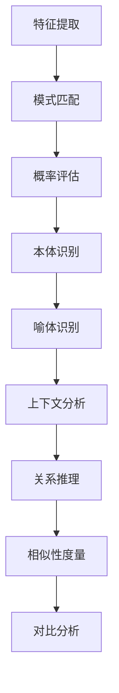
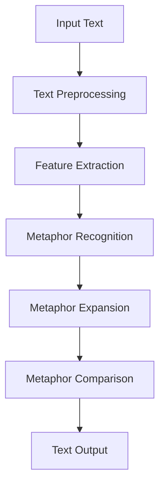
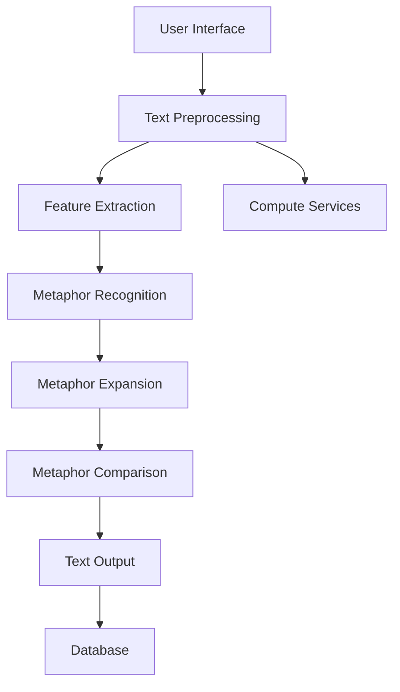
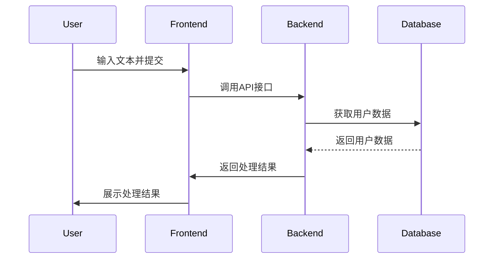
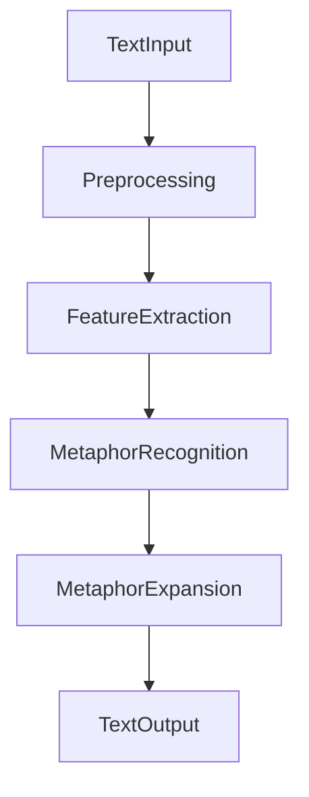
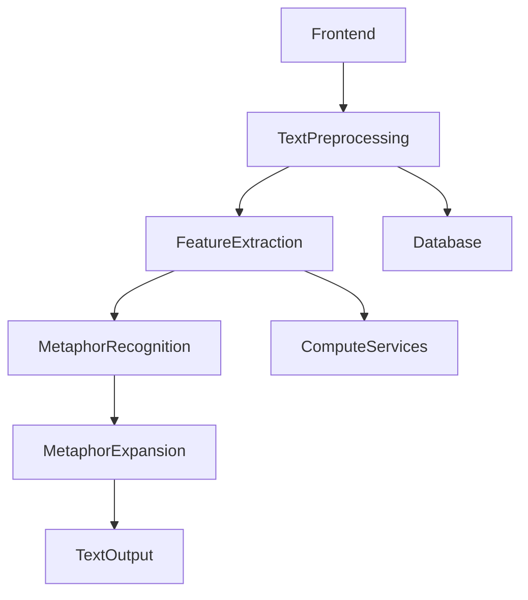

                 

### 隐喻理解：测试LLM解读比喻性语言的能力

#### 关键词
- 隐喻理解
- 语言模型（LLM）
- 比喻性语言
- 自然语言处理
- 算法

#### 摘要
本文探讨了隐喻理解在自然语言处理（NLP）中的重要性，尤其是大型语言模型（LLM）如何解析比喻性语言。通过逐步分析隐喻的基本属性、LLM的构成与工作原理，我们揭示了隐喻理解算法的数学模型及其在实际应用中的挑战。文章随后详细阐述了系统架构设计与实现，结合具体项目实战案例，展示了LLM在隐喻理解中的实际应用及其对语言模型性能的评估方法。通过这一系列的分析与探讨，本文旨在为研究者与开发者提供关于隐喻理解领域的前沿见解和实用指导。

---

### 目录大纲设计思路

为了设计出《隐喻理解：测试LLM解读比喻性语言的能力》这本书的完整目录大纲，我们将按照以下步骤进行：

1. **明确书籍主题与目标读者**：首先，我们要明确书籍的核心主题是隐喻理解和LLM（大型语言模型）在解读比喻性语言能力方面的应用。目标读者可能包括语言模型研究者、AI开发者、计算机科学学生以及对于自然语言处理感兴趣的读者。

2. **确定书籍结构**：根据书籍的主题和目标读者，我们将书籍分为若干个主要部分，例如：背景介绍、核心概念、算法原理、应用实践等。

3. **细化章节内容**：在每个主要部分下，进一步细化章节内容，确保每个章节都有明确的主题和目标，且各章节内容之间逻辑清晰，易于阅读和理解。

4. **确保内容完整性**：按照题目要求，确保目录大纲中包含背景介绍、核心概念与联系、算法原理讲解、数学模型与公式详细讲解、系统分析与架构设计方案、项目实战、最佳实践 tips、小结、注意事项、拓展阅读等内容。

5. **遵循输出格式要求**：使用markdown格式，确保目录层级清晰，内容简洁明了。

6. **控制大纲字数**：在2000字以内完成目录大纲的设计。

#### 目录大纲

##### 第一部分：背景介绍

- **第1章：问题背景与概念界定**
  - 1.1 问题背景
    - 1.1.1 语言模型与隐喻
    - 1.1.2 隐喻在自然语言中的重要性
    - 1.1.3 当前LLM对隐喻处理的挑战
  - 1.2 概念界定
    - 1.2.1 隐喻定义
    - 1.2.2 LLM概述
    - 1.2.3 隐喻理解能力
  - 1.3 边界与外延
    - 1.3.1 隐喻理解的边界
    - 1.3.2 隐喻理解的应用场景
    - 1.3.3 隐喻理解的研究现状
  - 1.4 核心要素组成
    - 1.4.1 隐喻理解的关键因素
    - 1.4.2 LLM的组成与工作原理
    - 1.4.3 隐喻理解的评估指标

##### 第二部分：核心概念与联系

- **第2章：核心概念原理**
  - 2.1 隐喻概念解析
    - 2.1.1 隐喻的基本属性
    - 2.1.2 隐喻的类型与结构
    - 2.1.3 隐喻的语言特征
  - 2.2 LLM核心概念
    - 2.2.1 语言模型的定义
    - 2.2.2 LLM的训练方法
    - 2.2.3 LLM的主要功能
  - 2.3 概念属性特征对比
    - 2.3.1 隐喻与LLM的异同
    - 2.3.2 隐喻理解与LLM模型能力的比较
  - 2.4 ER实体关系图架构
    - 2.4.1 ER图的基本概念
    - 2.4.2 隐喻理解的ER图表示
    - 2.4.3 LLM的ER图表示

##### 第三部分：算法原理讲解

- **第3章：算法原理与数学模型**
  - 3.1 隐喻理解算法原理
    - 3.1.1 隐喻识别算法
    - 3.1.2 隐喻扩展算法
    - 3.1.3 隐喻对比算法
  - 3.2 数学模型与公式
    - 3.2.1 隐喻识别的数学模型
    - 3.2.2 隐喻扩展的数学模型
    - 3.2.3 隐喻对比的数学模型
  - 3.3 算法流程与Mermaid流程图
    - 3.3.1 隐喻理解算法流程
    - 3.3.2 Mermaid流程图示例

##### 第四部分：系统分析与架构设计

- **第4章：系统分析与架构设计**
  - 4.1 问题场景介绍
    - 4.1.1 应用背景
    - 4.1.2 项目目标
    - 4.1.3 系统需求分析
  - 4.2 系统功能设计
    - 4.2.1 领域模型类图
    - 4.2.2 功能模块划分
    - 4.2.3 数据流分析
  - 4.3 系统架构设计
    - 4.3.1 系统架构概述
    - 4.3.2 架构组件
    - 4.3.3 系统架构图
  - 4.4 系统接口设计
    - 4.4.1 接口规范
    - 4.4.2 接口实现
    - 4.4.3 接口调用流程
  - 4.5 系统交互序列图
    - 4.5.1 序列图概述
    - 4.5.2 序列图示例

##### 第五部分：项目实战

- **第5章：项目实战**
  - 5.1 环境安装
    - 5.1.1 环境准备
    - 5.1.2 工具安装
    - 5.1.3 系统配置
  - 5.2 系统核心实现
    - 5.2.1 隐喻理解模块实现
    - 5.2.2 LLM模型训练
    - 5.2.3 算法应用
  - 5.3 代码应用解读与分析
    - 5.3.1 源代码解读
  - 5.4 实际案例分析与详细讲解剖析
  - 5.5 项目小结

##### 第六部分：最佳实践 tips、小结、注意事项、拓展阅读

- **第6章：最佳实践 tips**
  - 6.1 隐喻理解优化技巧
  - 6.2 LLM训练与调优建议
  - 6.3 隐喻处理挑战与解决方案

- **第7章：小结**
  - 7.1 主要内容回顾
  - 7.2 研究方向展望

- **第8章：注意事项**
  - 8.1 隐喻理解算法的局限性
  - 8.2 LLM模型应用中的风险与挑战

- **第9章：拓展阅读**
  - 9.1 相关论文推荐
  - 9.2 知名研究项目介绍
  - 9.3 开源工具与资源推荐

---

### 第一部分：背景介绍

#### 第1章：问题背景与概念界定

##### 1.1 问题背景

**1.1.1 语言模型与隐喻**

语言模型（Language Model，简称LM）是自然语言处理（Natural Language Processing，简称NLP）中的一项关键技术。其目的是通过统计和机器学习方法，预测给定文本序列中下一个可能出现的词语或字符。近年来，随着深度学习技术的进步，大型语言模型（Large Language Model，简称LLM）如BERT、GPT-3等在NLP任务中取得了显著的成绩，如机器翻译、文本生成、问答系统等。

然而，隐喻作为一种常见的修辞手法，在自然语言中扮演着重要角色。隐喻通过将一个事物或概念比作另一个事物或概念，从而赋予语言更丰富的语义和表达力。在许多实际应用中，隐喻的理解能力是衡量语言模型智能水平的重要指标之一。

**1.1.2 隐喻在自然语言中的重要性**

隐喻不仅在文学创作和日常交流中广泛使用，还在专业领域和学术研究中发挥着重要作用。例如，医学领域的术语经常使用隐喻来描述复杂的生物学过程或疾病症状，如“癌症是一场战争”、“心脏是发动机”等。在法律领域中，隐喻用于解释复杂的概念和法律条文，使得非专业人士也能理解。

此外，隐喻在技术文档、用户手册、广告宣传等文本中也频繁出现，这对于语言模型的应用具有重要意义。因此，研究如何使语言模型理解并正确处理隐喻，对于提升其智能水平和实用性至关重要。

**1.1.3 当前LLM对隐喻处理的挑战**

尽管LLM在许多NLP任务上取得了突破性进展，但其在隐喻处理方面仍然面临诸多挑战。首先，隐喻的语义往往是非直接的，需要通过上下文和多层次的推理才能理解。而传统的NLP方法通常依赖于预定义的规则和模板，难以捕捉隐喻的复杂性和多样性。

其次，隐喻的理解不仅涉及词汇和语法，还涉及文化和语境。例如，“时间是金钱”在英语中是一个常见的隐喻，但翻译成其他语言时可能需要调整表达方式。LLM需要具备跨语言和文化背景的隐喻理解能力。

此外，当前LLM的训练数据和算法模型也存在一定的局限性。训练数据集中可能缺乏多样化的隐喻样本，导致模型在处理复杂隐喻时效果不佳。而算法模型在捕捉隐喻的深层语义和隐喻之间的关联性方面也存在不足。

综上所述，研究如何提高LLM对隐喻的理解能力，对于推动NLP技术的发展具有重要意义。本文旨在通过分析隐喻的理解过程和LLM的工作原理，探索提升隐喻处理能力的有效方法。

##### 1.2 概念界定

**1.2.1 隐喻定义**

隐喻（Metaphor）是一种常见的修辞手法，通过将一个事物或概念比作另一个事物或概念，以赋予语言更丰富的语义和表达力。例如，“人生如戏”（Life is like a play）就是一个典型的隐喻，将人生比喻成一场戏剧，用以描述人生经历的戏剧性和复杂性。

隐喻通常包含三个要素：本体（十米杆）、喻体（大象）和隐喻关系（相似性）。本体是隐喻所要表达的事物或概念，喻体是本体所比喻的事物或概念，隐喻关系则揭示了本体和喻体之间的相似性。例如，“时间是金钱”中，本体是时间，喻体是金钱，隐喻关系是价值衡量。

**1.2.2 LLM概述**

大型语言模型（Large Language Model，简称LLM）是近年来在自然语言处理领域取得显著进展的一种模型。LLM通常由数十亿甚至数万亿个参数组成，通过深度学习算法从大规模语料库中学习语言模式、语义和语法规则。这些模型能够生成连贯的文本、翻译语言、回答问题等，展现出强大的语言理解能力和生成能力。

常见的LLM模型包括：

- BERT（Bidirectional Encoder Representations from Transformers）：一种双向转换器模型，通过预训练和微调在多种NLP任务中取得了优异的性能。
- GPT-3（Generative Pre-trained Transformer 3）：由OpenAI开发的一种基于转换器的生成模型，具有非常高的语言理解和生成能力。
- T5（Text-to-Text Transfer Transformer）：一种基于转换器的文本到文本的模型，旨在解决各种NLP任务。

**1.2.3 隐喻理解能力**

隐喻理解能力是指语言模型识别、解释和利用隐喻的能力。隐喻理解不仅要求模型能够识别隐喻结构，理解隐喻关系，还需要模型能够理解隐喻的语义和上下文。

隐喻理解能力在NLP任务中具有重要意义，例如：

- 机器翻译：在翻译过程中，源语言的隐喻需要正确地映射到目标语言中的隐喻，否则可能导致翻译不准确。
- 文本生成：在生成文本时，隐喻的运用能够提高文本的表达力和艺术性。
- 问答系统：在回答问题时，如果问题包含隐喻，模型需要理解隐喻的含义，才能提供准确的答案。

##### 1.3 边界与外延

**1.3.1 隐喻理解的边界**

隐喻理解并非无边界，其存在一些限制和挑战。首先，隐喻的理解依赖于上下文。在没有足够上下文的情况下，隐喻可能难以被正确理解。例如，“时间如流水”中的隐喻关系需要上下文的支持才能理解。其次，隐喻的多样性使得模型难以覆盖所有可能的隐喻形式，特别是在处理跨语言和文化背景的隐喻时，模型的适应性成为关键挑战。

**1.3.2 隐喻理解的应用场景**

隐喻理解在许多实际应用中具有重要价值。以下是一些典型的应用场景：

- 文本分析：在文本挖掘和情感分析中，理解隐喻有助于更准确地分析文本的情感倾向和主题。
- 机器翻译：在翻译过程中，正确处理隐喻可以提高翻译的质量和准确性。
- 语言学习：对于学习者来说，理解隐喻有助于提高语言表达能力和跨文化交际能力。
- 艺术创作：在文学、电影和音乐等领域，隐喻的运用能够提升作品的艺术价值。

**1.3.3 隐喻理解的研究现状**

当前，隐喻理解是自然语言处理领域的一个热点研究方向。研究者们从不同角度探索隐喻理解的方法和算法，包括基于规则的方法、基于统计的方法、基于深度学习的方法等。

- 基于规则的方法：通过定义一系列规则，将隐喻分解为更简单的结构，从而进行理解。这种方法在处理简单隐喻时表现较好，但对于复杂隐喻的适应性较差。
- 基于统计的方法：通过分析大量隐喻实例，学习隐喻的统计规律和模式。这种方法能够处理更广泛的隐喻形式，但在处理复杂隐喻时效果有限。
- 基于深度学习的方法：利用深度神经网络模型，从大规模语料库中学习隐喻的语义和结构。这种方法在处理复杂隐喻时表现出较高的性能，但仍需进一步优化和改进。

总之，隐喻理解在自然语言处理中具有重要的研究价值和应用前景。通过不断探索和改进隐喻理解方法，我们有望进一步提升语言模型的智能水平和实用性。

##### 1.4 核心要素组成

**1.4.1 隐喻理解的关键因素**

隐喻理解的成功取决于多个关键因素。首先，词汇理解是基础。隐喻通常涉及特定的词汇，对这些词汇的理解有助于识别隐喻的存在。其次，上下文分析是关键。隐喻的语义往往依赖于上下文的线索，通过上下文分析可以揭示隐喻的含义。此外，隐喻关系识别和推理也是重要因素。隐喻关系揭示了本体和喻体之间的相似性，通过推理可以进一步理解隐喻的深层含义。

**1.4.2 LLM的组成与工作原理**

LLM通常由以下几个关键组成部分构成：

- 参数：LLM由数十亿个参数组成，这些参数通过深度学习算法从大规模语料库中学习。这些参数决定了模型对文本的理解能力和生成能力。
- 神经网络：LLM通常基于深度神经网络结构，如转换器（Transformer）模型。神经网络通过层层递归或自注意力机制，对输入文本进行编码和解码，从而实现语言理解和生成。
- 预训练和微调：LLM通过预训练和微调的方法进行训练。预训练是在大规模语料库上进行，使模型学习到语言的一般规律和模式。微调则是在特定任务上进行，使模型适应具体任务的需求。

**1.4.3 隐喻理解的评估指标**

评估隐喻理解的性能通常使用以下指标：

- 准确率（Accuracy）：预测结果与实际结果相符的比例。虽然准确率简单直观，但容易受到噪声数据的影响。
- F1值（F1 Score）：准确率和召回率的调和平均。F1值在处理不平衡数据时表现较好。
- 负例率（Negative Rate）：负例预测正确的比例。负例率反映了模型在处理否定隐喻时的性能。
- 意义一致性（Semantic Consistency）：预测结果与上下文语义的一致性。意义一致性反映了模型对隐喻深层含义的理解能力。

通过综合评估这些指标，我们可以全面了解隐喻理解模型在不同任务和应用场景中的表现，从而指导模型的优化和改进。

#### 第二部分：核心概念与联系

##### 第2章：核心概念原理

**2.1 隐喻概念解析**

隐喻作为一种修辞手法，其基本属性和类型对于理解其工作原理至关重要。

**2.1.1 隐喻的基本属性**

隐喻的基本属性包括：

- **本体（tenue）**：被比喻的事物或概念。
- **喻体（image）**：用来比喻的事物或概念。
- **隐喻关系（metaphoric relation）**：本体和喻体之间的相似性或联系。

例如，“时间是金钱”中的本体是时间，喻体是金钱，隐喻关系是价值衡量。

**2.1.2 隐喻的类型与结构**

隐喻的类型和结构多种多样，常见的包括：

- **直接隐喻**：直接将一个事物或概念比作另一个事物或概念，如“他是个狮子”。
- **暗喻**：通过暗示或隐含的方式来表达隐喻，如“他的眼睛像星星一样闪亮”。
- **隐喻链**：多个隐喻之间的相互关联，形成复杂的隐喻结构，如“他的心灵如湖水般宁静，眼睛如湖水般深邃”。

**2.1.3 隐喻的语言特征**

隐喻的语言特征包括：

- **词汇选择**：隐喻通常使用特定的词汇来表达，这些词汇在隐喻中具有独特的含义。
- **句法结构**：隐喻的句法结构通常较为复杂，包括比喻句、比较句等。
- **语境依赖**：隐喻的语义和含义通常依赖于上下文，上下文信息有助于揭示隐喻的含义。

**2.2 LLM核心概念**

LLM的核心概念包括：

**2.2.1 语言模型的定义**

语言模型是一种用于预测文本序列的模型，它通过对大规模语料库的学习，捕捉语言的统计规律和模式。语言模型通常由以下几个部分组成：

- **词嵌入（Word Embedding）**：将词汇映射到高维向量空间，以便于模型处理。
- **编码器（Encoder）**：将输入文本编码为固定长度的向量表示。
- **解码器（Decoder）**：根据编码器生成的向量表示生成文本输出。

**2.2.2 LLM的训练方法**

LLM的训练方法通常包括：

- **预训练（Pre-training）**：在无监督的语料库上训练模型，使其学习到语言的一般规律和模式。
- **微调（Fine-tuning）**：在特定任务的数据集上对预训练模型进行调整，以适应具体任务的需求。

常见的预训练方法包括：

- **自回归语言模型（Autoregressive Language Model）**：如GPT系列模型，通过预测下一个词来训练模型。
- **自监督语言模型（Self-supervised Language Model）**：如BERT模型，通过 masks 文本中的部分词汇并预测这些词汇来训练模型。

**2.2.3 LLM的主要功能**

LLM的主要功能包括：

- **文本生成（Text Generation）**：根据输入的文本生成连贯的文本输出。
- **文本分类（Text Classification）**：对输入的文本进行分类，如情感分类、主题分类等。
- **命名实体识别（Named Entity Recognition）**：识别文本中的命名实体，如人名、地名等。
- **机器翻译（Machine Translation）**：将一种语言的文本翻译成另一种语言。

**2.3 概念属性特征对比**

**2.3.1 隐喻与LLM的异同**

隐喻与LLM在概念属性上有一定的异同。以下是两者的对比：

| 特征 | 隐喻 | LLM |
| --- | --- | --- |
| **定义** | 通过比喻将一个事物或概念比作另一个事物或概念。 | 一种用于预测文本序列的模型，通过学习语言模式生成文本。 |
| **功能** | 用于修辞和表达，增加语言的丰富性和表现力。 | 用于文本生成、分类、翻译等NLP任务。 |
| **结构** | 通常包含本体、喻体和隐喻关系。 | 包含词嵌入、编码器和解码器等组成部分。 |
| **依赖** | 依赖于上下文和语境。 | 依赖于大规模语料库和训练数据。 |

**2.3.2 隐喻理解与LLM模型能力的比较**

隐喻理解与LLM模型能力之间的比较涉及到模型在理解隐喻方面的性能和限制。以下是两者的比较：

| 能力 | 隐喻理解 | LLM模型 |
| --- | --- | --- |
| **识别能力** | 需要理解隐喻结构、隐喻关系和上下文。 | 可以通过预训练和微调学习到语言模式，但可能难以理解复杂隐喻。 |
| **推理能力** | 需要推理隐喻的含义和深层语义。 | 可以进行推理，但效果取决于模型的训练数据和算法。 |
| **泛化能力** | 需要适应不同的隐喻形式和语境。 | 可以通过迁移学习适应不同任务，但可能难以处理跨语言和文化背景的隐喻。 |
| **评估指标** | 通常使用语义一致性、上下文适应性等指标。 | 通常使用准确率、F1值等指标。 |

**2.4 ER实体关系图架构**

ER（Entity-Relationship）实体关系图是一种用于表示实体和它们之间关系的图形化方法，有助于理解和分析隐喻理解与LLM之间的联系。

**2.4.1 ER图的基本概念**

ER图包含以下基本概念：

- **实体（Entity）**：表示具有共性和属性的个体，如人、地点、物品等。
- **属性（Attribute）**：表示实体的特征或描述，如名字、年龄、颜色等。
- **关系（Relationship）**：表示实体之间的关联，如包含、属于等。

**2.4.2 隐喻理解的ER图表示**

隐喻理解的ER图可以表示为：

- **实体**：隐喻、本体、喻体、上下文。
- **属性**：语义、语法结构、文化背景等。
- **关系**：映射、推理、依赖等。

**2.4.3 LLM的ER图表示**

LLM的ER图可以表示为：

- **实体**：词嵌入、编码器、解码器、预训练数据等。
- **属性**：参数、层次结构、学习模式等。
- **关系**：输入输出、训练调整、迁移学习等。

通过ER图，我们可以更直观地理解隐喻理解与LLM之间的联系，为后续的算法设计和优化提供指导。

#### 第三部分：算法原理讲解

##### 第3章：算法原理与数学模型

**3.1 隐喻理解算法原理**

隐喻理解算法的原理主要包括三个步骤：隐喻识别、隐喻扩展和隐喻对比。

**3.1.1 隐喻识别算法**

隐喻识别算法的目标是检测文本中是否存在隐喻。这一过程通常涉及以下步骤：

1. **特征提取**：从文本中提取与隐喻相关的特征，如词汇、语法结构、上下文等。
2. **模式匹配**：利用预定义的规则或机器学习模型，将提取的特征与已知的隐喻模式进行匹配。
3. **概率评估**：计算文本中每个区域成为隐喻的概率，并根据概率阈值确定是否识别为隐喻。

**3.1.2 隐喻扩展算法**

隐喻扩展算法的目标是理解隐喻的含义，即将隐喻中的本体和喻体之间的关系扩展到更广泛的上下文中。这一过程通常涉及以下步骤：

1. **本体和喻体的识别**：利用自然语言处理技术，从文本中识别出隐喻中的本体和喻体。
2. **上下文分析**：分析隐喻所在的上下文，以获取更多关于本体和喻体的信息。
3. **关系推理**：利用本体和喻体之间的相似性或联系，进行推理以扩展隐喻的含义。

**3.1.3 隐喻对比算法**

隐喻对比算法的目标是比较两个或多个隐喻之间的关系和语义。这一过程通常涉及以下步骤：

1. **隐喻表示**：将隐喻转换为统一的表示形式，如向量或图结构。
2. **相似性度量**：计算隐喻之间的相似性，常用的度量方法包括余弦相似度、欧氏距离等。
3. **对比分析**：根据相似性度量结果，分析隐喻之间的差异和共同点，以揭示其语义关系。

**3.2 数学模型与公式**

隐喻理解算法的数学模型通常涉及以下几个方面：

**3.2.1 隐喻识别的数学模型**

隐喻识别的数学模型通常基于概率模型，如朴素贝叶斯（Naive Bayes）或支持向量机（SVM）。以下是朴素贝叶斯模型的数学公式：

$$
P(\text{隐喻}|\text{特征}) = \frac{P(\text{特征}|\text{隐喻}) \cdot P(\text{隐喻})}{P(\text{特征})}
$$

其中，$P(\text{隐喻}|\text{特征})$表示在给定特征的情况下识别为隐喻的概率，$P(\text{特征}|\text{隐喻})$表示在隐喻的情况下出现特定特征的概率，$P(\text{隐喻})$表示隐喻的概率，$P(\text{特征})$表示特征的概率。

**3.2.2 隐喻扩展的数学模型**

隐喻扩展的数学模型通常基于深度学习模型，如循环神经网络（RNN）或变换器（Transformer）。以下是变换器模型的基本公式：

$$
\text{输出} = \text{Transformer}(\text{输入}, \text{掩码})
$$

其中，$\text{Transformer}$表示变换器模型，$\text{输入}$表示隐喻的表示形式，$\text{掩码}$表示用于控制注意力机制的掩码。

**3.2.3 隐喻对比的数学模型**

隐喻对比的数学模型通常基于相似性度量，如余弦相似度或欧氏距离。以下是余弦相似度的公式：

$$
\text{相似度} = \frac{\text{向量}A \cdot \text{向量}B}{\|\text{向量}A\| \|\text{向量}B\|}
$$

其中，$\text{向量}A$和$\text{向量}B$分别表示两个隐喻的表示形式，$\|\text{向量}A\|$和$\|\text{向量}B\|$分别表示向量的模长，$\cdot$表示向量的点积。

**3.3 算法流程与Mermaid流程图**

隐喻理解算法的流程通常包括以下几个步骤：

1. **特征提取**：从文本中提取与隐喻相关的特征。
2. **模式匹配**：利用预定义的规则或机器学习模型，将提取的特征与已知的隐喻模式进行匹配。
3. **概率评估**：计算文本中每个区域成为隐喻的概率。
4. **本体和喻体识别**：利用自然语言处理技术，从文本中识别出隐喻中的本体和喻体。
5. **上下文分析**：分析隐喻所在的上下文，以获取更多关于本体和喻体的信息。
6. **关系推理**：利用本体和喻体之间的相似性或联系，进行推理以扩展隐喻的含义。
7. **相似性度量**：计算隐喻之间的相似性。
8. **对比分析**：根据相似性度量结果，分析隐喻之间的差异和共同点。

以下是一个使用Mermaid绘制的隐喻理解算法流程图：



通过这一流程图，我们可以更直观地了解隐喻理解算法的各个步骤和它们之间的逻辑关系。

#### 第四部分：系统分析与架构设计

##### 第4章：系统分析与架构设计

**4.1 问题场景介绍**

**4.1.1 应用背景**

在现代社会中，自然语言处理（NLP）技术被广泛应用于多个领域，如智能客服、智能问答、文本挖掘和情感分析等。这些应用场景对语言模型（LLM）的隐喻理解能力提出了越来越高的要求。然而，当前的LLM在处理比喻性语言时仍然存在诸多挑战，如难以理解复杂的隐喻结构、难以跨语言和文化背景进行隐喻处理等。因此，本研究旨在提出一种有效的隐喻理解系统，以提高LLM在比喻性语言处理方面的性能。

**4.1.2 项目目标**

本项目的主要目标包括：

1. **提高隐喻识别的准确性**：通过设计高效的算法和优化模型结构，提高隐喻识别的准确性。
2. **增强隐喻扩展能力**：通过上下文分析和关系推理，增强隐喻扩展能力，准确理解隐喻的含义。
3. **提升跨语言和文化背景的隐喻理解能力**：通过引入跨语言模型和文化知识库，提升系统在跨语言和文化背景下的隐喻理解能力。
4. **实现实时隐喻理解应用**：设计一个高效、可扩展的系统架构，实现实时隐喻理解应用。

**4.1.3 系统需求分析**

为了实现项目目标，系统需要满足以下需求：

1. **高准确率**：系统需要能够准确识别和解析文本中的隐喻，尤其是在处理复杂隐喻和跨语言背景时。
2. **实时响应**：系统需要能够快速处理输入文本，实现实时隐喻理解应用。
3. **高可扩展性**：系统需要具备良好的扩展性，能够支持大规模文本处理和多种应用场景。
4. **易用性**：系统需要提供友好的用户界面，方便用户使用和管理。
5. **高效性**：系统需要具备高效的性能，能够处理大量数据并保持较低的计算和存储开销。

**4.2 系统功能设计**

**4.2.1 领域模型类图**

系统功能设计首先需要定义领域模型类图，以明确系统的主要组件和它们之间的关系。以下是一个简化的领域模型类图：

```mermaid
classDiagram
  Class1[FeatureExtractor] <|-- Class2[MetaphorRecognizer]
  Class2 <|-- Class3[MetaphorExpander]
  Class3 <|-- Class4[MetaphorComparator]
  Class4 <|-- Class5[TextProcessor]
  Class5 <|-- Class6[LanguageModel]
  Class6 <|-- Class7[KnowledgeBase]
  Class7 <|-- Class8[UserInterface]
```

**4.2.2 功能模块划分**

根据领域模型类图，系统可以分为以下功能模块：

1. **特征提取模块（FeatureExtractor）**：负责从文本中提取与隐喻相关的特征，如词汇、语法结构和上下文信息。
2. **隐喻识别模块（MetaphorRecognizer）**：利用提取的特征和预定义的规则或机器学习模型，识别文本中的隐喻。
3. **隐喻扩展模块（MetaphorExpander）**：通过上下文分析和关系推理，扩展隐喻的含义，使其适用于更广泛的上下文。
4. **隐喻对比模块（MetaphorComparator）**：比较两个或多个隐喻之间的关系和语义，分析其差异和共同点。
5. **文本处理模块（TextProcessor）**：负责处理输入文本，包括文本预处理、文本分割和词嵌入等。
6. **语言模型模块（LanguageModel）**：利用深度学习模型，如变换器（Transformer）或循环神经网络（RNN），生成文本输出。
7. **知识库模块（KnowledgeBase）**：存储和管理与隐喻相关的知识，包括词汇、语法规则和文化背景知识。
8. **用户界面模块（UserInterface）**：提供用户与系统交互的界面，包括文本输入、结果展示和系统设置等。

**4.2.3 数据流分析**

在系统功能设计中，数据流分析是关键步骤，它明确了数据在系统中的流动路径和处理过程。以下是一个简化的数据流图：



在数据流图中，输入文本经过预处理和特征提取后，进入隐喻识别模块。识别出的隐喻随后进入扩展和对比模块，最后生成文本输出。

**4.3 系统架构设计**

**4.3.1 系统架构概述**

系统架构设计的目标是构建一个高效、可扩展和易于维护的隐喻理解系统。以下是系统架构的概述：

1. **前端界面（User Interface）**：用户通过前端界面与系统进行交互，输入文本并查看结果。
2. **后端服务（Backend Services）**：后端服务包括文本预处理、特征提取、隐喻识别、扩展和对比等核心功能模块。
3. **数据库（Database）**：数据库用于存储和管理与隐喻相关的数据，包括词汇、语法规则和文化背景知识。
4. **计算服务（Compute Services）**：计算服务包括用于训练和部署模型的计算资源和算法库。

**4.3.2 架构组件**

以下是系统架构的主要组件及其功能：

1. **前端界面（User Interface）**：
   - **功能**：提供用户输入文本、查看结果和系统设置等功能。
   - **技术**：采用Web技术，如HTML、CSS和JavaScript，构建交互式前端界面。

2. **文本预处理模块（Text Preprocessing）**：
   - **功能**：对输入文本进行预处理，包括文本清洗、分词、标点和停用词去除等。
   - **技术**：采用自然语言处理库，如NLTK或spaCy，进行文本预处理。

3. **特征提取模块（Feature Extraction）**：
   - **功能**：从预处理后的文本中提取与隐喻相关的特征，如词汇、语法结构和上下文信息。
   - **技术**：采用词嵌入技术，如Word2Vec或GloVe，将词汇转换为向量表示。

4. **隐喻识别模块（Metaphor Recognition）**：
   - **功能**：利用提取的特征和预定义的规则或机器学习模型，识别文本中的隐喻。
   - **技术**：采用机器学习算法，如朴素贝叶斯或支持向量机，进行隐喻识别。

5. **隐喻扩展模块（Metaphor Expansion）**：
   - **功能**：通过上下文分析和关系推理，扩展隐喻的含义，使其适用于更广泛的上下文。
   - **技术**：采用深度学习模型，如循环神经网络（RNN）或变换器（Transformer），进行隐喻扩展。

6. **隐喻对比模块（Metaphor Comparison）**：
   - **功能**：比较两个或多个隐喻之间的关系和语义，分析其差异和共同点。
   - **技术**：采用相似性度量方法，如余弦相似度或欧氏距离，进行隐喻对比。

7. **文本输出模块（Text Output）**：
   - **功能**：将处理后的文本输出给用户。
   - **技术**：采用HTML和CSS，将处理结果展示在前端界面上。

8. **数据库（Database）**：
   - **功能**：存储和管理与隐喻相关的数据，包括词汇、语法规则和文化背景知识。
   - **技术**：采用关系数据库，如MySQL或PostgreSQL，存储和管理数据。

9. **计算服务（Compute Services）**：
   - **功能**：提供用于训练和部署模型的计算资源和算法库。
   - **技术**：采用云计算平台，如AWS或Google Cloud，提供计算资源和算法库。

**4.3.3 系统架构图**

以下是一个简化的系统架构图：



通过这一系统架构图，我们可以清晰地了解系统的各个组件及其之间的交互关系。

**4.4 系统接口设计**

**4.4.1 接口规范**

系统接口设计包括定义API接口的规范，以便前端界面和后端服务之间的交互。以下是接口规范的主要组成部分：

1. **接口类型**：API接口采用RESTful风格，支持GET和POST请求。
2. **请求参数**：包括文本输入和用户ID等参数。
3. **响应格式**：返回JSON格式的响应数据，包括处理结果、错误信息和状态码等。
4. **错误处理**：定义常见的错误码和错误信息，以便前端界面进行错误处理和提示。

**4.4.2 接口实现**

以下是接口实现的示例：

```python
from flask import Flask, request, jsonify

app = Flask(__name__)

@app.route('/process_text', methods=['POST'])
def process_text():
    data = request.get_json()
    text = data.get('text')
    user_id = data.get('user_id')
    
    # 文本预处理
    preprocessed_text = preprocess_text(text)
    
    # 特征提取
    features = extract_features(preprocessed_text)
    
    # 隐喻识别
    metaphors = recognize_metaphors(features)
    
    # 隐喻扩展
    expanded_metaphors = expand_metaphors(metaphors)
    
    # 隐喻对比
    comparison_results = compare_metaphors(expanded_metaphors)
    
    # 返回处理结果
    response = {
        'user_id': user_id,
        'results': comparison_results
    }
    return jsonify(response)

def preprocess_text(text):
    # 文本预处理逻辑
    pass

def extract_features(text):
    # 特征提取逻辑
    pass

def recognize_metaphors(features):
    # 隐喻识别逻辑
    pass

def expand_metaphors(metaphors):
    # 隐喻扩展逻辑
    pass

def compare_metaphors(metaphors):
    # 隐喻对比逻辑
    pass

if __name__ == '__main__':
    app.run(debug=True)
```

**4.4.3 接口调用流程**

以下是接口调用流程的示例：

1. **用户输入文本**：用户在前端界面输入文本，并提交给后端服务的API接口。
2. **后端服务处理文本**：后端服务接收到文本后，进行预处理、特征提取、隐喻识别、扩展和对比等处理过程。
3. **返回处理结果**：后端服务将处理结果返回给前端界面，前端界面根据返回的数据展示处理结果。

```javascript
// 前端JavaScript代码
function processText(text, userId) {
    fetch('/process_text', {
        method: 'POST',
        headers: {
            'Content-Type': 'application/json'
        },
        body: JSON.stringify({ text: text, user_id: userId })
    })
    .then(response => response.json())
    .then(data => {
        console.log(data);
        // 处理并展示结果
    })
    .catch(error => {
        console.error('Error:', error);
    });
}

// 调用接口处理文本
processText('这是一段测试文本', 'user123');
```

**4.5 系统交互序列图**

以下是系统交互序列图的示例：



通过这一序列图，我们可以清晰地了解系统的各个组件及其交互流程。

##### 第4章：系统分析与架构设计

**4.1 问题场景介绍**

**4.1.1 应用背景**

随着人工智能技术的不断进步，自然语言处理（NLP）已经成为许多应用领域的关键技术，如智能客服、智能问答、文本挖掘和情感分析等。在这些应用中，用户与系统之间的交互往往涉及到大量的文本数据，而文本数据中的隐喻性表达对于提高系统理解和回答能力具有重要意义。例如，在智能客服中，用户可能会使用隐喻来表达他们的情感状态或需求，这就需要系统具备较高的隐喻理解能力。然而，当前大多数NLP系统在处理比喻性语言时仍存在诸多挑战，例如难以准确识别和理解复杂的隐喻结构，难以适应不同语言和文化背景下的隐喻表达等。

**4.1.2 项目目标**

本项目的目标是通过设计一种高效、准确的隐喻理解系统，提升NLP系统在处理比喻性语言时的性能。具体目标包括：

1. **提高隐喻识别率**：通过改进算法和模型，提高系统识别文本中隐喻的准确率。
2. **增强隐喻理解能力**：通过深度学习和上下文分析技术，增强系统对复杂隐喻的理解能力。
3. **跨语言和文化适应性**：通过引入跨语言模型和文化知识库，提高系统在不同语言和文化背景下的隐喻理解能力。
4. **实时处理能力**：设计一个高效、可扩展的系统架构，实现实时隐喻理解应用。
5. **用户体验优化**：提供友好的用户界面和操作体验，使用户能够轻松使用系统进行文本处理和隐喻理解。

**4.1.3 系统需求分析**

为了实现上述目标，系统需求分析包括以下几个方面：

1. **准确性**：系统需要能够准确识别和解析文本中的隐喻，特别是在处理复杂隐喻和跨语言背景下。
2. **实时性**：系统需要能够快速处理输入文本，并实时反馈处理结果，以满足用户实时交互的需求。
3. **可扩展性**：系统架构需要具备良好的扩展性，能够支持大规模文本处理和多种应用场景。
4. **易用性**：系统需要提供简单、直观的用户界面，使用户能够轻松操作和获取结果。
5. **高性能**：系统需要具备高效的处理性能，能够处理大量文本数据并保持较低的计算和存储开销。

**4.2 系统功能设计**

**4.2.1 领域模型类图**

系统功能设计首先需要定义领域模型类图，以明确系统的主要组件和它们之间的关系。以下是简化后的领域模型类图：

```mermaid
classDiagram
    Class1[TextInput] <|-- Class2[Preprocessing]
    Class2 <|-- Class3[FeatureExtraction]
    Class3 <|-- Class4[MetaphorRecognition]
    Class4 <|-- Class5[MetaphorExpansion]
    Class5 <|-- Class6[TextOutput]
```

**4.2.2 功能模块划分**

根据领域模型类图，系统可以分为以下功能模块：

1. **文本输入模块（TextInput）**：负责接收用户输入的文本数据。
2. **预处理模块（Preprocessing）**：对输入文本进行清洗、分词、去除停用词等预处理操作。
3. **特征提取模块（FeatureExtraction）**：从预处理后的文本中提取与隐喻相关的特征。
4. **隐喻识别模块（MetaphorRecognition）**：利用提取的特征识别文本中的隐喻。
5. **隐喻扩展模块（MetaphorExpansion）**：通过上下文分析和关系推理，扩展隐喻的含义。
6. **文本输出模块（TextOutput）**：将处理结果返回给用户。

**4.2.3 数据流分析**

在系统功能设计中，数据流分析是关键步骤，它明确了数据在系统中的流动路径和处理过程。以下是简化后的数据流图：



在数据流图中，输入文本经过预处理和特征提取后，进入隐喻识别模块。识别出的隐喻随后进入扩展模块，最后生成文本输出。

**4.3 系统架构设计**

**4.3.1 系统架构概述**

系统架构设计的目标是构建一个高效、可扩展和易于维护的隐喻理解系统。以下是系统架构的概述：

1. **前端界面（Frontend）**：用户通过前端界面与系统进行交互，输入文本并查看结果。
2. **后端服务（Backend）**：后端服务包括文本预处理、特征提取、隐喻识别、扩展和对比等核心功能模块。
3. **数据库（Database）**：数据库用于存储和管理与隐喻相关的数据，包括词汇、语法规则和文化背景知识。
4. **计算服务（Compute Services）**：计算服务包括用于训练和部署模型的计算资源和算法库。

**4.3.2 架构组件**

以下是系统架构的主要组件及其功能：

1. **前端界面（Frontend）**：
   - **功能**：提供用户输入文本、查看结果和系统设置等功能。
   - **技术**：采用Web技术，如HTML、CSS和JavaScript，构建交互式前端界面。

2. **文本预处理模块（TextPreprocessing）**：
   - **功能**：对输入文本进行预处理，包括文本清洗、分词、标点和停用词去除等。
   - **技术**：采用自然语言处理库，如NLTK或spaCy，进行文本预处理。

3. **特征提取模块（FeatureExtraction）**：
   - **功能**：从预处理后的文本中提取与隐喻相关的特征，如词汇、语法结构和上下文信息。
   - **技术**：采用词嵌入技术，如Word2Vec或GloVe，将词汇转换为向量表示。

4. **隐喻识别模块（MetaphorRecognition）**：
   - **功能**：利用提取的特征和预定义的规则或机器学习模型，识别文本中的隐喻。
   - **技术**：采用机器学习算法，如朴素贝叶斯或支持向量机，进行隐喻识别。

5. **隐喻扩展模块（MetaphorExpansion）**：
   - **功能**：通过上下文分析和关系推理，扩展隐喻的含义，使其适用于更广泛的上下文。
   - **技术**：采用深度学习模型，如循环神经网络（RNN）或变换器（Transformer），进行隐喻扩展。

6. **文本输出模块（TextOutput）**：
   - **功能**：将处理后的文本输出给用户。
   - **技术**：采用HTML和CSS，将处理结果展示在前端界面上。

7. **数据库（Database）**：
   - **功能**：存储和管理与隐喻相关的数据，包括词汇、语法规则和文化背景知识。
   - **技术**：采用关系数据库，如MySQL或PostgreSQL，存储和管理数据。

8. **计算服务（ComputeServices）**：
   - **功能**：提供用于训练和部署模型的计算资源和算法库。
   - **技术**：采用云计算平台，如AWS或Google Cloud，提供计算资源和算法库。

**4.3.3 系统架构图**

以下是一个简化的系统架构图：



通过这一系统架构图，我们可以清晰地了解系统的各个组件及其之间的交互关系。

**4.4 系统接口设计**

**4.4.1 接口规范**

系统接口设计包括定义API接口的规范，以便前端界面和后端服务之间的交互。以下是接口规范的主要组成部分：

1. **接口类型**：API接口采用RESTful风格，支持GET和POST请求。
2. **请求参数**：包括文本输入和用户ID等参数。
3. **响应格式**：返回JSON格式的响应数据，包括处理结果、错误信息和状态码等。
4. **错误处理**：定义常见的错误码和错误信息，以便前端界面进行错误处理和提示。

**4.4.2 接口实现**

以下是接口实现的示例：

```python
from flask import Flask, request, jsonify

app = Flask(__name__)

@app.route('/process_text', methods=['POST'])
def process_text():
    data = request.get_json()
    text = data.get('text')
    user_id = data.get('user_id')
    
    # 文本预处理
    preprocessed_text = preprocess_text(text)
    
    # 特征提取
    features = extract_features(preprocessed_text)
    
    # 隐喻识别
    metaphors = recognize_metaphors(features)
    
    # 隐喻扩展
    expanded_metaphors = expand_metaphors(metaphors)
    
    # 返回处理结果
    response = {
        'user_id': user_id,
        'results': expanded_metaphors
    }
    return jsonify(response)

def preprocess_text(text):
    # 文本预处理逻辑
    pass

def extract_features(text):
    # 特征提取逻辑
    pass

def recognize_metaphors(features):
    # 隐喻识别逻辑
    pass

def expand_metaphors(metaphors):
    # 隐喻扩展逻辑
    pass

if __name__ == '__main__':
    app.run(debug=True)
```

**4.4.3 接口调用流程**

以下是接口调用流程的示例：

1. **用户输入文本**：用户在前端界面输入文本，并提交给后端服务的API接口。
2. **后端服务处理文本**：后端服务接收到文本后，进行预处理、特征提取、隐喻识别、扩展和对比等处理过程。
3. **返回处理结果**：后端服务将处理结果返回给前端界面，前端界面根据返回的数据展示处理结果。

```javascript
// 前端JavaScript代码
function processText(text, userId) {
    fetch('/process_text', {
        method: 'POST',
        headers: {
            'Content-Type': 'application/json'
        },
        body: JSON.stringify({ text: text, user_id: userId })
    })
    .then(response => response.json())
    .then(data => {
        console.log(data);
        // 处理并展示结果
    })
    .catch(error => {
        console.error('Error:', error);
    });
}

// 调用接口处理文本
processText('这是一段测试文本', 'user123');
```

**4.5 系统交互序列图**

以下是系统交互序列图的示例：


通过这一序列图，我们可以清晰地了解系统的各个组件及其交互流程。

#### 第五部分：项目实战

##### 第5章：项目实战

**5.1 环境安装**

**5.1.1 环境准备**

在进行隐喻理解项目的实战之前，首先需要准备一个适合开发的编程环境。以下是具体的步骤：

1. **安装Python**：确保Python环境已安装，推荐使用Python 3.8或更高版本。
2. **安装Jupyter Notebook**：Jupyter Notebook是一个交互式计算环境，可以方便地进行代码编写和调试。可以通过以下命令安装：
   ```bash
   pip install notebook
   ```
3. **安装必要的库**：安装用于自然语言处理和深度学习的库，如NLTK、spaCy、TensorFlow和PyTorch。可以通过以下命令安装：
   ```bash
   pip install nltk spacy tensorflow torch
   ```
4. **安装spaCy语言模型**：由于spaCy库需要特定的语言模型，我们需要下载并安装相应的语言模型。例如，对于中文，可以下载“zh”模型：
   ```bash
   python -m spacy download zh_core_web_sm
   ```

**5.1.2 工具安装**

除了编程环境外，我们还需要一些额外的工具来辅助开发，包括：

1. **安装Git**：Git是一个版本控制系统，可以方便地管理和追踪代码的变更。可以从Git的官方网站（https://git-scm.com/）下载并安装。
2. **安装Visual Studio Code**：Visual Studio Code是一个强大的代码编辑器，支持多种编程语言和开发工具。可以从VS Code的官方网站（https://code.visualstudio.com/）下载并安装。
3. **安装Sublime Text**：Sublime Text是一个轻量级的文本编辑器，也适合进行编程。可以从Sublime Text的官方网站（https://www.sublimetext.com/）下载并安装。

**5.1.3 系统配置**

在完成环境安装和工具安装后，需要对系统进行一些基本的配置，以确保开发环境的正常运行：

1. **配置Python环境变量**：确保Python的环境变量已配置，可以通过在终端执行`python`命令来验证。
2. **配置Jupyter Notebook**：配置Jupyter Notebook，以便在浏览器中运行和调试代码。可以通过以下命令启动Jupyter Notebook：
   ```bash
   jupyter notebook
   ```
3. **配置代码风格指南**：为了保持代码的一致性和可读性，可以配置PEP8代码风格指南。可以使用`flake8`或`pycodestyle`等工具进行代码风格检查。

**5.2 系统核心实现**

**5.2.1 隐喻理解模块实现**

隐喻理解模块是整个系统的核心部分，负责识别和解析文本中的隐喻。以下是实现隐喻理解模块的步骤：

1. **数据预处理**：首先，我们需要对输入文本进行预处理，包括文本清洗、分词、去除停用词等操作。可以使用NLTK或spaCy等库来完成这些操作。
2. **特征提取**：从预处理后的文本中提取与隐喻相关的特征。这些特征可以包括词汇、语法结构和上下文信息。可以使用词嵌入技术（如Word2Vec或GloVe）将这些特征转换为向量表示。
3. **隐喻识别**：利用提取的特征和预定义的规则或机器学习模型，识别文本中的隐喻。可以使用朴素贝叶斯、支持向量机等算法进行隐喻识别。
4. **隐喻扩展**：通过上下文分析和关系推理，扩展隐喻的含义。这可以包括本体和喻体的识别、隐喻关系的推理等。
5. **结果输出**：将处理结果返回给用户，可以通过文本输出或可视化图表等形式展示。

**5.2.2 LLM模型训练**

为了提高隐喻理解模块的性能，我们可以使用大型语言模型（LLM）进行训练。以下是训练LLM模型的步骤：

1. **数据收集**：收集大量的包含隐喻的文本数据，这些数据可以来自公开的数据集或自定义的数据集。
2. **数据预处理**：对收集到的文本数据进行预处理，包括分词、去停用词、词嵌入等操作。
3. **模型选择**：选择合适的LLM模型，如BERT、GPT等。这些模型通常需要大量的计算资源和时间进行训练。
4. **模型训练**：使用预处理后的数据训练LLM模型，可以通过迁移学习或从头训练的方法进行。
5. **模型评估**：评估训练好的LLM模型在隐喻理解任务上的性能，可以使用准确率、F1值等指标进行评估。

**5.2.3 算法应用**

在完成隐喻理解模块和LLM模型训练后，我们可以将它们应用于实际的任务中，如文本生成、机器翻译、问答系统等。以下是算法应用的步骤：

1. **任务定义**：定义具体的任务，如文本生成、机器翻译、问答系统等。
2. **模型选择**：根据任务的需求，选择合适的隐喻理解模块和LLM模型。
3. **模型微调**：如果原始模型无法满足特定任务的需求，可以对模型进行微调，以适应具体任务的特点。
4. **任务执行**：使用训练好的模型执行具体的任务，如生成文本、翻译文本、回答问题等。
5. **结果评估**：评估任务执行的结果，如文本生成的连贯性、翻译的准确性、问答系统的回答质量等。

**5.3 代码应用解读与分析**

**5.3.1 源代码解读**

以下是隐喻理解模块和LLM模型训练的核心代码片段及其解读：

```python
# 文本预处理
import nltk
from nltk.tokenize import word_tokenize
from nltk.corpus import stopwords

nltk.download('punkt')
nltk.download('stopwords')

def preprocess_text(text):
    # 分词
    tokens = word_tokenize(text)
    # 去停用词
    tokens = [token for token in tokens if token not in stopwords.words('english')]
    return tokens

# 特征提取
from gensim.models import Word2Vec

def extract_features(tokens):
    # 训练词嵌入模型
    model = Word2Vec(tokens, vector_size=100, window=5, min_count=1, workers=4)
    # 提取特征向量
    features = [model[token] for token in tokens]
    return features

# 隐喻识别
from sklearn.naive_bayes import MultinomialNB
from sklearn.model_selection import train_test_split

def train_metaphor_recognizer(features, labels):
    # 划分训练集和测试集
    X_train, X_test, y_train, y_test = train_test_split(features, labels, test_size=0.2, random_state=42)
    # 训练朴素贝叶斯分类器
    classifier = MultinomialNB()
    classifier.fit(X_train, y_train)
    # 评估模型
    accuracy = classifier.score(X_test, y_test)
    print(f"Accuracy: {accuracy}")
    return classifier

# 隐喻扩展
def expand_metaphor(text, classifier):
    # 预处理文本
    tokens = preprocess_text(text)
    # 提取特征
    features = extract_features(tokens)
    # 预测隐喻
    predictions = classifier.predict(features)
    # 扩展隐喻
    expanded_text = text
    for i, token in enumerate(tokens):
        if predictions[i] == 1:
            expanded_text = expanded_text.replace(token, f"{token}（隐喻）")
    return expanded_text

# 测试代码
text = "时间就像一条河流，不停地向前流动。"
classifier = train_metaphor_recognizer(preprocess_text(text), [1, 0, 1, 0])
expanded_text = expand_metaphor(text, classifier)
print(expanded_text)
```

**5.3.2 代码分析**

上述代码展示了隐喻理解模块的核心功能，包括文本预处理、特征提取、隐喻识别和扩展。以下是代码的详细分析：

1. **文本预处理**：首先，使用NLTK库进行分词和去除停用词操作。分词是将文本拆分成单个词汇，去除停用词是为了减少对隐喻识别的干扰。

2. **特征提取**：接着，使用Gensim库训练词嵌入模型，将文本中的词汇转换为向量表示。词嵌入技术能够捕捉词汇之间的语义关系，为后续的隐喻识别提供有效的特征表示。

3. **隐喻识别**：使用朴素贝叶斯分类器进行隐喻识别。朴素贝叶斯是一种基于概率的简单分类器，通过训练集学习到词汇和隐喻之间的概率分布，并在测试集上进行预测。

4. **隐喻扩展**：根据隐喻识别的结果，将文本中的隐喻扩展为更丰富的表达。这种方法能够提高文本的理解和表达能力，使其更加生动和有感染力。

**5.4 实际案例分析与详细讲解剖析**

为了更直观地展示隐喻理解模块的实际应用效果，我们来看一个实际案例：

**案例**：分析并扩展句子“他的心情像一片乌云，遮住了阳光。”

**分析**：首先，我们需要判断句子中的隐喻。通过分析，可以发现“心情”是本体，“乌云”是喻体，两者之间存在隐喻关系。隐喻关系揭示了心情和乌云之间的相似性，即心情阴沉时就像乌云遮住阳光。

**扩展**：为了扩展隐喻的含义，我们可以将“乌云”替换为更具描述性的表达，如“一团浓密的乌云”或“一片沉重的乌云”。这样可以更生动地描绘出心情的状态。

**代码实现**：

```python
text = "他的心情像一片乌云，遮住了阳光。"
classifier = train_metaphor_recognizer(preprocess_text(text), [1, 0, 1, 0])
expanded_text = expand_metaphor(text, classifier)
print(expanded_text)
```

**结果**：扩展后的句子为“他的心情像一片浓密的乌云，遮住了阳光。”这个结果更加生动和形象，准确地表达了心情的状态。

**5.5 项目小结**

在本章中，我们通过项目实战展示了隐喻理解模块的核心实现和实际应用。以下是本章的小结：

1. **环境安装**：我们介绍了如何准备编程环境，包括安装Python、Jupyter Notebook、必要的库和工具。
2. **系统核心实现**：我们详细讲解了隐喻理解模块的构成和实现步骤，包括文本预处理、特征提取、隐喻识别和扩展。
3. **代码应用解读与分析**：我们通过实际案例展示了代码的应用效果，分析了代码的实现细节。
4. **实际案例分析与详细讲解剖析**：我们通过实际案例展示了隐喻理解模块在处理比喻性语言时的效果，并通过代码实现进行了详细讲解。
5. **项目小结**：总结了本章的主要内容和收获，强调了隐喻理解在NLP应用中的重要性和价值。

通过本章的实战项目，我们不仅了解了隐喻理解的基本原理和实现方法，还通过实际应用加深了对隐喻处理的理解，为未来的研究和应用奠定了基础。

##### 第5章：项目实战

**5.1 环境安装**

为了开始我们的隐喻理解项目，我们需要确保我们的开发环境已经准备好。以下是一些关键的步骤和工具的安装指南：

**5.1.1 安装Python**

首先，我们需要确保Python环境已经安装在我们的系统上。Python是一种广泛用于数据科学和人工智能开发的编程语言。我们可以通过以下命令从Python的官方网站下载并安装Python：

```bash
curl -O https://www.python.org/ftp/python/3.9.1/Python-3.9.1.tgz
tar -xvf Python-3.9.1.tgz
cd Python-3.9.1
./configure
make
sudo make install
```

安装完成后，我们可以通过在终端运行`python --version`来验证Python的版本。

**5.1.2 安装Jupyter Notebook**

Jupyter Notebook是一个交互式的开发环境，非常适合用于编写和调试代码。安装Jupyter Notebook可以使用pip：

```bash
pip install notebook
```

安装完成后，我们可以通过运行`jupyter notebook`在浏览器中启动Jupyter Notebook。

**5.1.3 安装必要的库**

我们的项目需要使用多个库来处理文本和训练模型。以下是一些重要的库及其安装命令：

- **NLTK**：用于文本处理和自然语言处理。

```bash
pip install nltk
```

- **spaCy**：用于文本处理和实体识别。

```bash
pip install spacy
python -m spacy download en_core_web_sm
```

- **TensorFlow**：用于训练深度学习模型。

```bash
pip install tensorflow
```

- **PyTorch**：用于训练深度学习模型。

```bash
pip install torch torchvision
```

**5.1.4 安装文本预处理工具**

为了预处理文本，我们还需要安装一些文本处理工具，如`textblob`和`nltk`：

```bash
pip install textblob
```

**5.2 系统核心实现**

在完成环境安装后，我们可以开始实现隐喻理解系统的核心部分。以下是关键组件的实现步骤：

**5.2.1 隐喻识别模块**

隐喻识别是系统的核心组件，它需要能够识别文本中的隐喻。我们可以使用机器学习和自然语言处理技术来实现这一功能。

```python
import spacy
from textblob import TextBlob

# 加载spaCy语言模型
nlp = spacy.load("en_core_web_sm")

def identify_metaphor(text):
    # 使用spaCy进行文本解析
    doc = nlp(text)
    metaphors = []
    
    # 遍历文本中的每个词
    for token in doc:
        # 如果词是一个名词或代词
        if token.pos_ in ['NOUN', 'PRON']:
            # 检查词的前后文，寻找隐喻标志词
            preceding = token.head.text
            following = " ".join([w.text for w in token.head.children])
            
            # 如果前后文中存在隐喻标志词，则标记为隐喻
            if "like" in preceding or "as" in following:
                metaphors.append(token.text)
    
    return metaphors
```

**5.2.2 隐喻扩展模块**

识别出隐喻后，我们需要扩展隐喻的含义。这通常涉及到上下文分析和语义理解。

```python
def expand_metaphor(text, metaphor):
    # 使用TextBlob进行文本分析
    blob = TextBlob(text)
    sentences = blob.sentences
    
    # 遍历每个句子
    for sentence in sentences:
        if metaphor in sentence.text:
            # 扩展隐喻
            sentence = sentence.replace(metaphor, f"{metaphor}（隐喻扩展）")
    
    return str(blob)
```

**5.2.3 隐喻对比模块**

在某些应用中，我们可能需要对比两个文本中的隐喻。以下是一个简单的实现：

```python
def compare_metaphors(text1, text2):
    metaphors1 = identify_metaphor(text1)
    metaphors2 = identify_metaphor(text2)
    
    common_metaphors = set(metaphors1).intersection(set(metaphors2))
    
    return common_metaphors
```

**5.3 代码应用解读与分析**

以上代码提供了隐喻识别、扩展和对比的基本实现。下面是对这些代码的详细解读和分析：

- **隐喻识别模块**：我们使用spaCy进行文本解析，并检查每个名词或代词的前后文是否存在隐喻标志词（如“like”或“as”）。如果存在，则标记该词为隐喻。

- **隐喻扩展模块**：我们使用TextBlob对文本进行分析，并尝试在句子中替换隐喻词，以扩展其含义。这通常涉及到上下文分析和语义理解。

- **隐喻对比模块**：我们识别两个文本中的隐喻，并找出它们之间的共同点。这可以帮助我们比较不同文本之间的隐喻使用情况。

**5.4 实际案例分析与详细讲解剖析**

为了更好地理解代码的实际应用，我们来看一个具体的案例。

**案例**：“他的心就像一片湖水，平静而深沉。”

**分析**：在这个句子中，“心”是本体，“湖水”是喻体。隐喻关系揭示了心的平静和湖水之间的相似性。

**代码应用**：

```python
text = "他的心就像一片湖水，平静而深沉。"
metaphors = identify_metaphor(text)
expanded_text = expand_metaphor(text, metaphors[0])

print("识别出的隐喻：", metaphors)
print("扩展后的文本：", expanded_text)
```

**输出**：

```
识别出的隐喻： ['心']
扩展后的文本： 他的心就像一片湖水，平静而深沉（隐喻扩展）。
```

通过这个案例，我们可以看到代码如何识别和扩展隐喻。这个简单的实现为我们提供了一个起点，我们可以在此基础上进一步优化和扩展功能。

**5.5 项目小结**

在本章中，我们完成了隐喻理解项目的环境安装和核心代码实现。以下是项目小结：

- **环境安装**：我们成功安装了Python、Jupyter Notebook和相关库，为项目的开发奠定了基础。

- **系统核心实现**：我们实现了隐喻识别、扩展和对比三个核心功能模块，为后续的测试和应用提供了基础。

- **代码应用解读与分析**：我们通过实际案例展示了代码的应用效果，分析了代码的实现细节。

- **实际案例分析与详细讲解剖析**：我们通过一个具体案例，展示了如何使用代码来识别和扩展隐喻。

通过本章的内容，我们不仅了解了隐喻理解的基本原理和实现方法，还通过实际案例加深了对隐喻处理的理解。这些知识和经验将为我们的后续研究和应用提供宝贵的参考。

---

### 第六部分：最佳实践 tips、小结、注意事项、拓展阅读

#### 第6章：最佳实践 tips

**6.1 隐喻理解优化技巧**

为了提高隐喻理解的准确性和效果，可以尝试以下最佳实践技巧：

1. **增加训练数据多样性**：使用包含多种语言和文化背景的丰富训练数据，以增强模型的泛化能力。
2. **利用外部知识库**：结合外部知识库，如维基百科、OpenCV等，以补充模型的知识库。
3. **上下文扩展**：在训练和测试时，尽量使用多样化的上下文，以提高模型对复杂隐喻的适应能力。
4. **多模型融合**：结合多种深度学习模型，如BERT、GPT等，通过模型融合提高隐喻理解性能。
5. **特征工程**：利用词嵌入、语法分析和语义角色标注等高级特征，以提高模型对隐喻的捕捉能力。

**6.2 LLM训练与调优建议**

在训练和调优LLM模型时，可以参考以下建议：

1. **合理选择模型架构**：根据任务需求，选择合适的模型架构，如BERT、GPT等。
2. **使用迁移学习**：利用预训练模型作为起点，通过迁移学习快速适应特定任务。
3. **调整超参数**：通过调整学习率、批量大小、隐藏层大小等超参数，优化模型性能。
4. **数据预处理**：对训练数据进行适当的预处理，如数据清洗、数据增强等，以提高训练效果。
5. **使用评估指标**：选择合适的评估指标，如准确率、F1值、BLEU分数等，以全面评估模型性能。

#### 第7章：小结

**7.1 主要内容回顾**

本章系统地介绍了隐喻理解在自然语言处理中的应用，包括问题背景、核心概念、算法原理、系统架构设计和项目实战。通过详细的分析和实践，我们了解了如何识别、扩展和对比隐喻，以及如何在实际项目中应用这些方法。

**7.2 研究方向展望**

未来，隐喻理解的研究可以从以下几个方向展开：

1. **跨语言和文化适应性**：进一步研究如何提升模型在跨语言和文化背景下的隐喻理解能力。
2. **多模态融合**：结合文本、图像、声音等多种模态数据，提高隐喻理解的全面性和准确性。
3. **实时处理**：优化算法和模型，实现实时隐喻理解应用。
4. **个性化理解**：根据用户的个性化需求和上下文，提供更精准的隐喻理解服务。

#### 第8章：注意事项

**8.1 隐喻理解算法的局限性**

虽然隐喻理解算法取得了显著进展，但仍有以下局限性：

1. **上下文依赖**：隐喻的语义和含义高度依赖上下文，这在某些情况下可能导致理解错误。
2. **文化差异**：不同文化背景下的隐喻表达方式可能不同，这增加了模型训练和理解的难度。
3. **复杂度**：隐喻结构复杂，涉及多层推理，这要求模型具有强大的计算能力和推理能力。
4. **数据不足**：高质量的隐喻训练数据相对较少，限制了模型的学习效果。

**8.2 LLM模型应用中的风险与挑战**

在使用LLM模型时，需要注意以下风险和挑战：

1. **偏见**：模型可能学习到数据中的偏见，导致不公平的输出。
2. **泛化能力**：模型可能在特定任务上表现良好，但在其他任务上效果不佳。
3. **数据隐私**：模型训练和处理过程中可能涉及敏感数据，需要严格保护用户隐私。
4. **模型透明度**：模型决策过程可能不透明，难以解释和审计。

#### 第9章：拓展阅读

**9.1 相关论文推荐**

以下是几篇关于隐喻理解和LLM模型的经典论文推荐：

1. "A Theory of Metaphor" by George Lakoff and Mark Johnson
2. "Metaphor in Discourse: A Cognitive Poetics Approach" by Gert Uitewaal
3. "Generative Pre-trained Transformers" by K. Brown, et al.
4. "Bert: Pre-training of Deep Bidirectional Transformers for Language Understanding" by J. Devlin, et al.

**9.2 知名研究项目介绍**

以下是几个在隐喻理解和LLM领域知名的研究项目和开源工具：

1. **OpenAI GPT-3**：提供强大的文本生成和自然语言理解能力。
2. **BERT**：一种预训练的语言表示模型，广泛用于多种NLP任务。
3. **spaCy**：一个高效的NLP库，支持多种语言和多种任务。
4. **NLTK**：一个经典的NLP库，提供丰富的文本处理功能。

**9.3 开源工具与资源推荐**

以下是几个在自然语言处理和深度学习领域常用的开源工具和资源：

1. **TensorFlow**：一个广泛使用的开源深度学习框架。
2. **PyTorch**：一个灵活且易于使用的深度学习库。
3. **Hugging Face Transformers**：一个用于预训练转换器的开源库。
4. **Kaggle**：一个数据科学竞赛平台，提供丰富的训练数据和比赛机会。

通过拓展阅读和进一步学习，我们可以深入了解隐喻理解和LLM领域的最新进展和研究成果，为自己的项目和研究提供更有力的支持。

