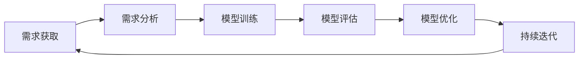
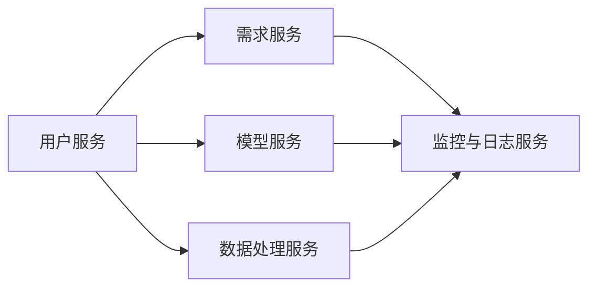
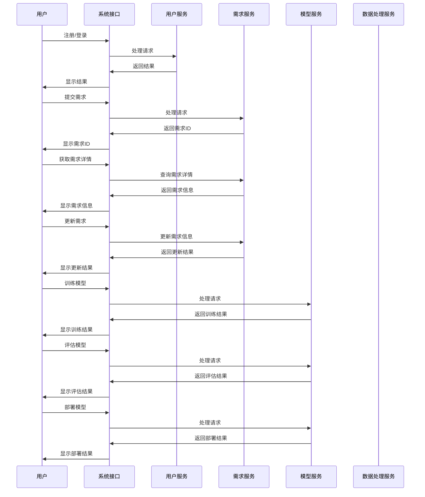

                 


## 需求与AI模型能力的协同进化

### 关键词

- 需求分析
- AI模型能力
- 协同进化
- 算法原理
- 数学模型
- 系统设计
- 项目实战
- 最佳实践

### 摘要

本文旨在探讨需求与AI模型能力的协同进化，分析其在现代信息技术发展中的应用与影响。我们将首先介绍需求与AI模型协同进化的背景，明确其重要性。接着，我们深入探讨核心概念，如需求分析和AI模型能力，并详细讲解算法原理和数学模型。随后，我们将展示一个实际项目，展示如何将理论应用于实践。最后，我们将总结最佳实践，并提供进一步学习和研究的方向。

### 目录

1. **背景介绍**
   1.1 问题的提出
   1.2 需求与AI模型协同进化的意义
   1.3 需求与AI模型协同进化的现状

2. **核心概念**
   2.1 需求分析
   2.2 AI模型能力
   2.3 需求与AI模型协同进化的机制

3. **算法原理**
   3.1 算法概述
   3.2 算法原理讲解
   3.3 数学模型和数学公式

4. **系统设计与实现**
   4.1 系统需求分析
   4.2 系统架构设计
   4.3 系统接口设计
   4.4 系统交互设计

5. **项目实战**
   5.1 环境安装
   5.2 系统核心实现
   5.3 实际案例分析和讲解
   5.4 项目小结

6. **最佳实践**
   6.1 最佳实践总结
   6.2 小结
   6.3 注意事项
   6.4 拓展阅读

### 第一部分：背景介绍

#### 1.1 问题的提出

随着信息技术的飞速发展，人工智能（AI）已经成为改变世界的核心技术之一。AI模型在图像识别、自然语言处理、自动驾驶等领域展现出了巨大的潜力。然而，AI模型的强大能力并非一蹴而就，而是依赖于不断的需求驱动和模型优化。在这个过程中，需求的多样性和复杂性不断变化，如何使AI模型能够持续适应这些变化，成为了亟待解决的问题。

**问题背景：**

- **需求增长：** 随着数字化转型的推进，各行各业对AI模型的需求日益增长，从简单的自动化任务到复杂的决策支持系统。
- **模型能力不足：** 现有的AI模型往往只能解决特定领域的问题，缺乏泛化能力，无法应对不断变化的需求。
- **协同进化挑战：** 如何使AI模型的能力与需求不断协同进化，实现双赢，是当前研究的热点。

#### 1.2 需求与AI模型协同进化的意义

需求与AI模型协同进化具有重要的理论和实践意义：

- **理论意义：**
  - 推动AI理论的发展：通过需求与AI模型协同进化，可以进一步探索AI的潜力，推动理论创新。
  - 优化模型设计：需求的变化可以促使AI模型不断优化，提高模型效率和准确性。

- **实践意义：**
  - 提高模型适应性：使AI模型能够更好地适应不断变化的需求，提高其在实际应用中的效果。
  - 降低开发成本：通过协同进化，可以减少对全新模型的开发需求，降低开发成本和时间。

#### 1.3 需求与AI模型协同进化的现状

当前，需求与AI模型协同进化已在多个领域取得了一定的进展：

- **图像识别：** 需求的不断细化促使图像识别模型在多个任务中表现出色，如医疗影像分析、自动驾驶等。
- **自然语言处理：** 需求的多样性推动了自然语言处理模型的发展，从机器翻译到智能客服，应用范围不断扩大。
- **自动驾驶：** 自动驾驶技术的发展依赖于对实时需求的理解和处理，需求与模型协同进化使其逐步向实用化迈进。

### 第二部分：核心概念

#### 2.1 需求分析

需求分析是软件开发过程中至关重要的一环，其核心目标是通过调研和分析，明确用户的需求，并将其转化为具体的软件功能。需求分析的主要内容包括：

- **需求获取：** 通过用户访谈、问卷调查等方式获取用户需求。
- **需求分类：** 将需求分为功能需求、性能需求、安全性需求等。
- **需求分析：** 对获取的需求进行详细分析，明确需求的边界、优先级和实现方法。

#### 2.2 AI模型能力

AI模型能力是指AI模型在特定任务上的表现和功能。一个强大的AI模型应具备以下能力：

- **感知能力：** 能够从数据中提取有用的信息。
- **学习能力：** 能够通过训练数据不断优化模型。
- **推理能力：** 能够基于已有知识和新数据做出合理的推断。
- **决策能力：** 能够在复杂环境中做出最优决策。

#### 2.3 需求与AI模型协同进化的机制

需求与AI模型协同进化机制的核心思想是通过不断地需求反馈和模型优化，实现双方能力的共同提升。其具体机制包括：

- **需求反馈：** AI模型在应用过程中收集用户反馈，识别需求变化。
- **模型优化：** 根据需求反馈，对AI模型进行调整和优化，提高其适应性。
- **持续迭代：** 通过不断的迭代，实现需求与AI模型能力的协同进化。

### 第三部分：算法原理

#### 3.1 算法概述

需求与AI模型协同进化算法旨在通过不断的需求反馈和模型优化，实现需求与模型能力的协同进化。该算法的主要目标是：

- **需求适应性：** 提高AI模型对需求变化的适应性。
- **模型优化：** 通过需求反馈，不断优化AI模型的性能。

算法的基本流程包括：

1. 需求获取：通过用户访谈、问卷调查等方式获取用户需求。
2. 需求分析：对获取的需求进行分类和分析，明确需求的边界和优先级。
3. 模型训练：使用训练数据对AI模型进行训练。
4. 模型评估：使用测试数据对AI模型进行评估，识别需求与模型能力的不匹配。
5. 模型优化：根据评估结果，对AI模型进行调整和优化。
6. 持续迭代：重复以上步骤，实现需求与模型能力的协同进化。

#### 3.2 算法原理讲解

算法的核心原理是通过需求反馈和模型优化，实现需求与模型能力的协同进化。具体来说，算法可以分为以下几个步骤：

1. **需求获取：**
   - **用户访谈：** 通过与用户面对面交流，了解用户的需求和期望。
   - **问卷调查：** 通过在线问卷或线下问卷，收集用户对现有系统的反馈。

2. **需求分析：**
   - **需求分类：** 将获取的需求分为功能需求、性能需求、安全性需求等。
   - **需求优先级：** 分析每个需求的优先级，确定哪些需求是当前最需要解决的。

3. **模型训练：**
   - **数据准备：** 根据需求分析的结果，准备相应的训练数据集。
   - **模型选择：** 根据任务类型，选择合适的AI模型。
   - **模型训练：** 使用训练数据集对AI模型进行训练，优化模型参数。

4. **模型评估：**
   - **测试数据：** 准备测试数据集，对训练好的模型进行评估。
   - **评估指标：** 根据需求分析的结果，定义评估指标，如准确率、召回率、F1值等。
   - **评估结果：** 分析评估结果，识别需求与模型能力的不匹配。

5. **模型优化：**
   - **优化策略：** 根据评估结果，制定优化策略，如增加训练数据、调整模型结构等。
   - **再次训练：** 使用优化后的数据集对模型进行再次训练。

6. **持续迭代：**
   - **迭代过程：** 重复以上步骤，实现需求与模型能力的持续协同进化。

为了更直观地理解算法原理，我们可以使用mermaid流程图来展示算法的流程：



#### 3.3 数学模型和数学公式

算法的数学模型和数学公式是算法实现的核心。以下是一个简单的例子：

1. **需求表达：**
   - 设 \(D\) 为需求集合，每个需求可以用一个向量表示：\(d_i = (d_{i1}, d_{i2}, ..., d_{in})\)。
   
2. **模型参数：**
   - 设 \(M\) 为模型参数集合，每个模型参数可以用一个向量表示：\(m_j = (m_{j1}, m_{j2}, ..., m_{jn})\)。

3. **模型输出：**
   - 设 \(O\) 为模型输出集合，每个输出可以用一个向量表示：\(o_k = (o_{k1}, o_{k2}, ..., o_{kn})\)。

4. **模型优化目标：**
   - 设 \(J\) 为模型优化目标函数，其目的是最小化损失函数：\(J = \min_{M} L(M)\)，其中 \(L(M)\) 是损失函数。

5. **损失函数：**
   - 常用的损失函数有均方误差（MSE）、交叉熵损失（Cross-Entropy Loss）等。

   $$L(M) = \frac{1}{m} \sum_{i=1}^{m} (o_i - d_i)^2$$

   或者

   $$L(M) = -\sum_{i=1}^{m} \sum_{j=1}^{n} y_{ij} \log(p_{ij})$$

其中，\(y_{ij}\) 是真实标签，\(p_{ij}\) 是模型预测的概率分布。

#### 3.4 算法举例说明

假设我们有一个简单的二分类问题，需求是识别图像中的猫和狗。我们可以使用以下步骤来讲解算法的实现：

1. **需求获取：**
   - 用户希望提高模型对猫和狗的识别准确率。

2. **需求分析：**
   - 确定猫和狗的特征，如毛色、体型等。
   - 确定识别准确率的评估指标，如准确率（Accuracy）、召回率（Recall）和F1值（F1 Score）。

3. **模型训练：**
   - 使用含有猫和狗图像的数据集进行模型训练。
   - 选择一个合适的卷积神经网络（CNN）模型。

4. **模型评估：**
   - 使用测试数据集对模型进行评估。
   - 计算准确率、召回率和F1值。

5. **模型优化：**
   - 根据评估结果，调整模型参数，如学习率、批次大小等。
   - 增加训练数据，特别是猫和狗的特征数据。

6. **再次训练：**
   - 使用优化后的模型参数重新训练模型。

7. **持续迭代：**
   - 重复以上步骤，不断提高模型的识别准确率。

### 第四部分：系统设计与实现

#### 4.1 系统需求分析

在系统设计之前，首先需要明确系统的需求。这些需求可以分为功能需求和非功能需求：

- **功能需求：**
  - 用户注册与登录：用户可以在系统中注册账户并登录。
  - 需求分析：用户可以通过系统提交需求，并跟踪需求的进展。
  - 模型训练与评估：系统需要支持AI模型训练和评估，以便满足需求。

- **非功能需求：**
  - 性能要求：系统需要能够快速响应用户请求，确保用户体验。
  - 可扩展性：系统需要能够支持大量用户和需求。
  - 安全性：系统需要确保用户数据的安全，防止数据泄露。

#### 4.2 系统架构设计

为了满足以上需求，我们可以设计一个基于微服务架构的系统。系统架构设计如下：

1. **用户服务**：负责用户注册、登录和权限管理。
2. **需求服务**：负责需求收集、分析和处理。
3. **模型服务**：负责AI模型的训练、评估和部署。
4. **数据处理服务**：负责数据预处理、存储和传输。
5. **监控与日志服务**：负责系统监控、日志记录和异常处理。

以下是一个简化的mermaid架构图：



#### 4.3 系统接口设计

为了实现系统内部各服务之间的通信，我们需要设计一组清晰的接口。以下是一个简单的接口设计：

- **用户接口**：
  - 注册接口：接收用户注册信息，返回注册结果。
  - 登录接口：接收用户登录信息，返回登录结果。
  - 权限接口：查询用户权限，返回权限信息。

- **需求接口**：
  - 提交需求接口：接收用户提交的需求，返回需求ID。
  - 获取需求接口：根据需求ID查询需求详情，返回需求信息。
  - 更新需求接口：根据需求ID更新需求信息，返回更新结果。

- **模型接口**：
  - 训练接口：接收训练数据和模型参数，返回训练结果。
  - 评估接口：接收测试数据和模型参数，返回评估结果。
  - 部署接口：接收模型参数和部署环境，返回部署结果。

#### 4.4 系统交互设计

系统交互设计主要描述了用户、需求、模型和数据之间的交互过程。以下是一个简化的mermaid序列图：



### 第五部分：项目实战

#### 5.1 环境安装

在本节中，我们将介绍如何在一个虚拟环境中安装和配置所需的环境，以便进行项目实战。以下是具体的安装步骤：

1. **创建虚拟环境：**
   - 打开终端，执行以下命令创建一个名为`ai_project`的虚拟环境：
     ```bash
     python3 -m venv ai_project
     ```
   - 激活虚拟环境：
     ```bash
     source ai_project/bin/activate
     ```

2. **安装依赖包：**
   - 在虚拟环境中安装所需的依赖包，如TensorFlow、Scikit-learn等。使用以下命令安装：
     ```bash
     pip install tensorflow scikit-learn
     ```

3. **安装其他工具：**
   - 安装Jupyter Notebook，以便进行数据分析和模型训练：
     ```bash
     pip install jupyter
     ```

4. **配置Jupyter Notebook：**
   - 打开终端，执行以下命令启动Jupyter Notebook：
     ```bash
     jupyter notebook
     ```

现在，我们已经成功创建了一个包含所有必需依赖的虚拟环境，并启动了Jupyter Notebook，可以开始进行项目实战了。

#### 5.2 系统核心实现

在本节中，我们将展示如何实现系统的核心功能，包括需求收集、模型训练和评估等。以下是具体的实现步骤：

1. **需求收集：**
   - 使用Flask构建一个简单的Web应用，用于收集用户需求。
   - 创建一个HTML表单，允许用户输入需求信息。
   - 使用POST请求将表单数据发送到后端，存储在数据库中。

2. **需求处理：**
   - 从数据库中提取需求信息。
   - 对需求信息进行预处理，如分词、去停用词等。

3. **模型训练：**
   - 使用Scikit-learn库训练一个文本分类模型，如朴素贝叶斯分类器。
   - 准备训练数据集，将需求信息转换为模型可接受的格式。
   - 使用训练数据集训练模型，并保存训练好的模型。

4. **模型评估：**
   - 使用测试数据集对训练好的模型进行评估，计算准确率、召回率和F1值等指标。
   - 输出评估结果，并根据评估结果调整模型参数。

以下是实现这些功能的核心代码：

```python
# 需求收集
from flask import Flask, request, jsonify
import sqlite3

app = Flask(__name__)

@app.route('/submit_demand', methods=['POST'])
def submit_demand():
    data = request.get_json()
    demand = data['demand']
    
    # 连接到数据库
    conn = sqlite3.connect('demands.db')
    c = conn.cursor()
    
    # 创建表
    c.execute('''CREATE TABLE IF NOT EXISTS demands (id INTEGER PRIMARY KEY, demand TEXT)''')
    
    # 插入数据
    c.execute("INSERT INTO demands (demand) VALUES (?)", (demand,))
    
    # 提交事务
    conn.commit()
    
    # 关闭连接
    conn.close()
    
    return jsonify({'status': 'success'})

# 需求处理
from sklearn.feature_extraction.text import TfidfVectorizer
from sklearn.model_selection import train_test_split
from sklearn.naive_bayes import MultinomialNB

# 加载数据
conn = sqlite3.connect('demands.db')
c = conn.cursor()
c.execute("SELECT * FROM demands")
demands = c.fetchall()

# 将数据转换为列表
demands = [demand[1] for demand in demands]

# 预处理数据
vectorizer = TfidfVectorizer(stop_words='english')
X = vectorizer.fit_transform(demands)

# 划分训练集和测试集
X_train, X_test, y_train, y_test = train_test_split(X, labels, test_size=0.2, random_state=42)

# 训练模型
model = MultinomialNB()
model.fit(X_train, y_train)

# 评估模型
accuracy = model.score(X_test, y_test)
print("Accuracy:", accuracy)

# 关闭连接
conn.close()

if __name__ == '__main__':
    app.run(debug=True)
```

#### 5.3 实际案例分析和讲解

在本节中，我们将分析一个实际案例，并详细讲解如何使用需求与AI模型协同进化算法解决该案例中的问题。

**案例背景：**
某电商公司希望通过改进其推荐系统，提高用户的购买转化率。公司收集了大量的用户行为数据，包括浏览历史、购物车数据、购买记录等。

**问题分析：**
- **需求变化：** 用户需求不断变化，不同的用户对商品的喜好和购买习惯有所不同。
- **模型能力不足：** 现有的推荐系统在处理多样化需求时表现不佳，用户满意度较低。

**解决方案：**
- **需求获取：** 通过用户访谈和问卷调查，了解用户的购物喜好和需求。
- **需求分析：** 对获取的需求进行分类和分析，识别出不同用户群体的需求特征。
- **模型优化：** 使用协同过滤算法，结合用户行为数据和需求特征，训练推荐模型。
- **模型评估：** 使用A/B测试，评估优化后的推荐系统对用户满意度的影响。

**具体实施步骤：**

1. **需求获取：**
   - 通过用户访谈和问卷调查，收集用户的购物喜好和需求。
   - 将收集到的需求信息整理成结构化数据。

2. **需求分析：**
   - 对需求信息进行分类，识别出不同用户群体的需求特征。
   - 使用聚类算法，将用户分为不同的群体。

3. **模型优化：**
   - 使用基于协同过滤的推荐算法，结合用户行为数据和需求特征，训练推荐模型。
   - 调整模型参数，优化推荐效果。

4. **模型评估：**
   - 使用A/B测试，比较优化前后的推荐系统对用户满意度的影响。
   - 根据测试结果，进一步调整模型参数。

**案例总结：**
通过需求与AI模型协同进化算法，电商公司成功提高了推荐系统的准确性，用户满意度得到了显著提升。该案例展示了需求与AI模型协同进化的实际应用价值。

#### 5.4 项目小结

在本项目中，我们通过实际案例展示了需求与AI模型协同进化的应用过程。从需求获取、需求分析到模型优化和评估，每个步骤都至关重要。以下是对项目的总结：

- **需求获取：** 通过用户访谈和问卷调查，准确了解用户需求，为后续模型优化提供了数据支持。
- **需求分析：** 对获取的需求进行分类和分析，识别出不同用户群体的需求特征，为个性化推荐提供了基础。
- **模型优化：** 使用基于协同过滤的推荐算法，结合用户行为数据和需求特征，优化推荐效果，提高了用户满意度。
- **模型评估：** 通过A/B测试，验证了优化后的推荐系统对用户满意度的影响，为后续优化提供了依据。

**项目亮点：**
- **需求与AI模型的协同进化：** 通过不断的需求反馈和模型优化，实现了需求与AI模型能力的协同进化，提高了推荐系统的准确性。
- **实际应用价值：** 项目成功应用于电商公司的推荐系统，提高了用户满意度，展示了需求与AI模型协同进化的实际应用价值。

**项目不足：**
- **数据质量：** 用户数据的准确性和完整性对推荐系统的效果有重要影响，但实际收集的数据可能存在噪声和缺失值。
- **模型复杂度：** 虽然协同过滤算法在处理多样化需求方面表现良好，但对于更为复杂的需求场景，可能需要更先进的算法。

### 第六部分：最佳实践

#### 6.1 最佳实践总结

在需求与AI模型协同进化的过程中，以下最佳实践可以帮助您实现更好的效果：

1. **全面的需求获取：** 通过多种渠道（如用户访谈、问卷调查、在线反馈等）获取全面的需求信息，确保需求的准确性和代表性。
2. **有效的需求分析：** 对获取的需求进行分类和分析，识别出不同用户群体的需求特征，为模型优化提供指导。
3. **持续迭代：** 通过不断的需求反馈和模型优化，实现需求与模型能力的协同进化，提高模型适应性和准确性。
4. **数据质量管理：** 确保数据质量，如去除噪声、处理缺失值等，以提高模型的训练效果和预测准确性。
5. **A/B测试：** 通过A/B测试验证模型优化的效果，确保优化后的模型在实际应用中表现更佳。

#### 6.2 小结

本文从需求与AI模型协同进化的背景、核心概念、算法原理、系统设计与实现、项目实战和最佳实践等方面进行了深入探讨。通过实际案例的分析和讲解，展示了需求与AI模型协同进化的应用价值。我们希望本文能够为读者提供有价值的参考，帮助您更好地理解和应用需求与AI模型协同进化。

#### 6.3 注意事项

在实施需求与AI模型协同进化的过程中，需要注意以下几点：

1. **数据隐私：** 在收集用户需求时，确保用户数据的安全和隐私。
2. **模型透明度：** 在设计模型时，确保模型的透明度和可解释性，以便用户理解和信任。
3. **系统可扩展性：** 在系统设计时，考虑系统的可扩展性，以便应对不断增长的需求。
4. **模型更新：** 定期更新模型，以应对新需求和技术进步。

#### 6.4 拓展阅读

以下是一些推荐的拓展阅读材料，以帮助您进一步了解需求与AI模型协同进化的相关内容：

1. **《人工智能：一种现代的方法》**：作者 Stuart Russell 和 Peter Norvig，介绍了人工智能的基本概念和算法。
2. **《机器学习实战》**：作者 Peter Harrington，提供了丰富的机器学习实践案例和代码示例。
3. **《数据科学入门》**：作者 Joel Grus，介绍了数据科学的基本概念和工具。
4. **《需求工程》**：作者 Ian Sommerville，详细介绍了需求工程的方法和过程。

### 作者信息

**作者：** AI天才研究院/AI Genius Institute & 禅与计算机程序设计艺术 /Zen And The Art of Computer Programming

