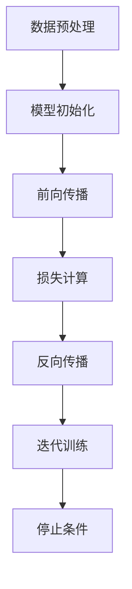
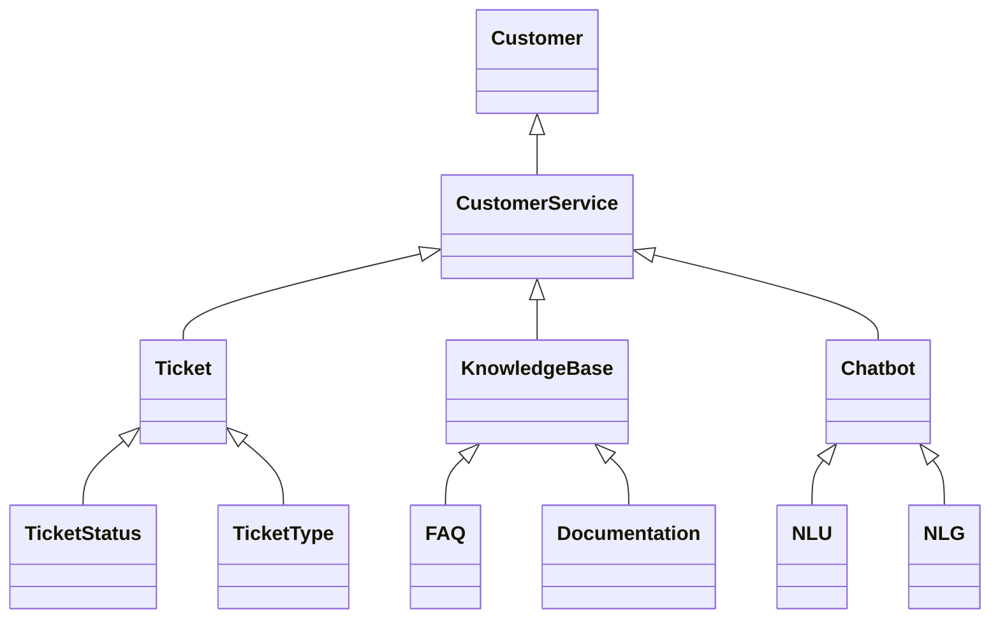
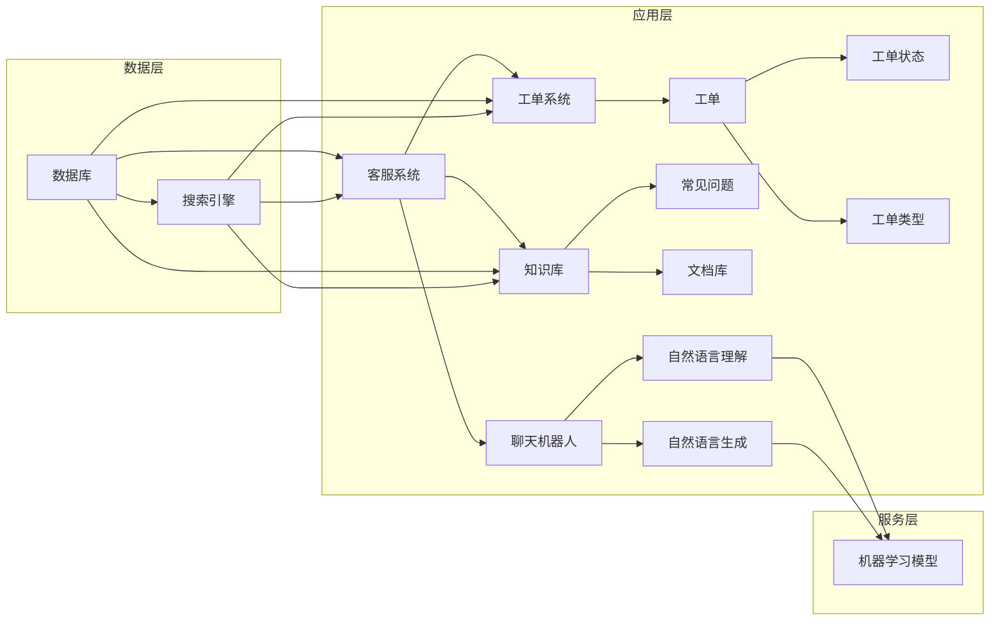
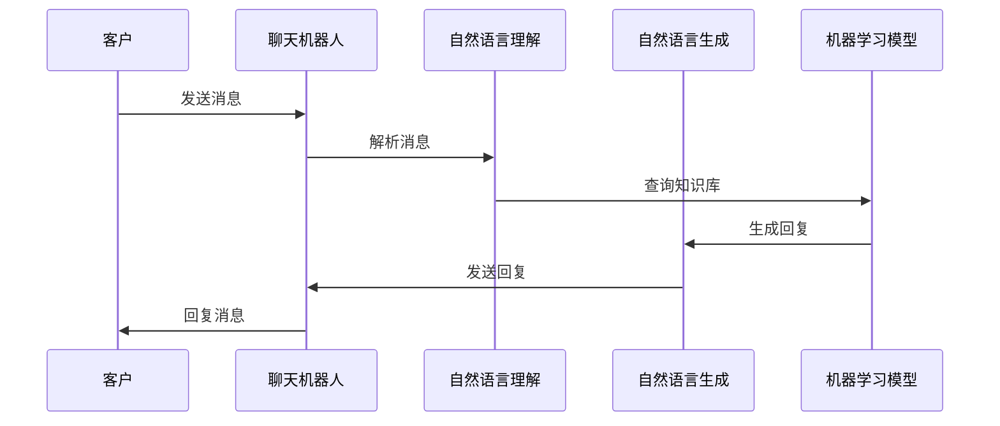

                 

### 需求与技术可行性评估：大模型应用开发的平衡之道

#### 关键词：大模型应用、需求分析、技术评估、平衡之道、人工智能

> **摘要：**本文深入探讨了在大模型应用开发过程中，如何进行有效的需求分析与技术可行性评估。通过详细的分析和实际案例，本文提出了平衡需求与技术评估的策略和方法，以实现高效、可持续的大模型应用开发。

#### 引言与背景

##### 1.1.1 需求与技术可行性评估的重要性

在信息技术飞速发展的今天，大模型（如大型语言模型、图像识别模型等）的应用越来越广泛。大模型的应用不仅能够提高数据处理的效率，还能够实现复杂任务的高级智能。然而，在大模型的应用开发过程中，需求分析与技术可行性评估至关重要。

- **需求分析**：需求分析是确定系统必须做什么的过程，它直接影响系统功能的实现和用户满意度。有效的需求分析能够确保系统开发的方向正确，避免开发出不符合用户需求的产品。
- **技术可行性评估**：技术可行性评估是分析系统能否按期、按预算实现既定功能的过程。它包括技术选型、资源评估和风险评估等多个方面，是保障项目成功的关键。

##### 1.1.2 大模型应用开发的挑战

大模型应用开发面临以下挑战：

- **计算资源需求**：大模型的训练和推理需要大量的计算资源，尤其是GPU和TPU等高性能硬件。
- **数据质量与数量**：大模型的训练需要大量的高质量数据，数据的获取和处理是一个挑战。
- **算法复杂性**：大模型的算法通常较为复杂，需要对深度学习、神经网络等算法有深入的理解。
- **模型部署**：大模型的应用需要有效的部署策略，包括模型压缩、分布式训练和推理等。

##### 1.1.3 需求与技术可行性评估的概念

- **需求分析**：需求分析包括需求获取、需求分类、需求分析和需求验证。需求获取是了解用户需求的过程，需求分类是整理需求的过程，需求分析和验证是确保需求实现的过程。
- **技术可行性评估**：技术可行性评估包括技术选型、资源评估和风险评估。技术选型是选择合适的技术方案，资源评估是评估所需资源的可行性和成本，风险评估是预测技术实现过程中可能出现的风险。

##### 1.1.4 本书结构

本书将按照以下结构展开：

1. **引言与背景**：介绍需求与技术可行性评估的重要性以及大模型应用开发的挑战。
2. **大模型应用开发概述**：概述大模型的基本原理、应用场景和发展趋势，以及技术可行性评估的基本步骤。
3. **需求分析**：详细介绍需求获取、分类、分析和验证的方法和技巧。
4. **技术评估**：讨论技术可行性分析、技术风险评估、技术成本评估和技术策略制定。
5. **平衡之道**：探讨如何平衡需求与技术评估，进行项目管理和资源分配。
6. **案例分析**：通过实际案例展示需求与技术评估的应用和实践。
7. **最佳实践与未来展望**：分享最佳实践，分析技术发展趋势，讨论需求与技术评估的创新发展。
8. **总结与展望**：回顾本书的主要内容，总结贡献与局限性，并提出研究展望和下一步工作计划。

#### 大模型应用开发概述

##### 2.1.1 大模型的基本原理

大模型是指那些参数量巨大、训练数据量庞大的神经网络模型。这些模型能够通过学习大量数据，自动提取数据中的特征，进行复杂的信息处理和预测。

- **神经网络**：神经网络是一种模拟人脑信息处理方式的计算模型，通过多层节点（神经元）进行数据传递和计算。
- **深度学习**：深度学习是神经网络的一种，具有多个隐藏层，能够自动学习复杂的数据特征。

##### 2.1.2 大模型的应用场景

大模型的应用场景非常广泛，包括但不限于：

- **自然语言处理**：如机器翻译、文本生成、情感分析等。
- **计算机视觉**：如图像分类、目标检测、图像生成等。
- **推荐系统**：如商品推荐、新闻推荐等。
- **游戏AI**：如棋类游戏、角色扮演游戏等。

##### 2.1.3 大模型的发展趋势

大模型的发展趋势体现在以下几个方面：

- **模型参数量的增加**：随着计算能力的提升，模型参数量不断增加，带来更好的模型性能。
- **数据量的增加**：互联网数据的爆炸式增长为模型提供了丰富的训练数据。
- **算法的优化**：包括模型结构优化、训练算法优化等，以提高模型的效率和性能。
- **模型的部署**：模型压缩、分布式训练和推理等技术的不断发展，使得大模型的应用变得更加可行。

##### 2.1.4 技术可行性评估的基本步骤

技术可行性评估的基本步骤包括：

- **需求分析**：明确系统目标和功能需求。
- **技术选型**：选择适合的技术方案和工具。
- **资源评估**：评估所需的计算资源、存储资源和人力成本。
- **风险评估**：识别潜在的技术风险，制定风险应对策略。
- **制定技术方案**：根据评估结果，制定详细的技术方案。

### 需求分析

#### 3.1.1 需求获取

需求获取是需求分析的第一步，目标是明确用户需求。

- **用户调研**：通过与用户的访谈、问卷调查等方式，了解用户的需求和痛点。
- **用户故事**：编写用户故事，以描述用户的需求和行为。

##### 3.1.2 需求分类

需求分类是将获取的需求进行分类整理，以便更好地进行管理和分析。

- **功能性需求**：系统必须实现的功能。
- **非功能性需求**：系统必须满足的质量、性能、可靠性等要求。
- **用户需求**：从用户角度出发的需求。

##### 3.1.3 需求分析与验证

需求分析与验证是确保需求实现的过程。

- **需求分析**：对需求进行详细分析，明确需求的实现方式。
- **需求验证**：通过测试、用户反馈等方式，验证需求的实现是否符合预期。

##### 3.1.4 需求文档编写

需求文档是需求分析的最终成果，它详细描述了系统的功能需求和非功能需求。

- **文档结构**：包括需求概述、需求列表、用户故事、需求分析等。
- **文档内容**：需求文档应包含需求来源、需求描述、需求实现方案、需求验证方法等。

### 技术评估

#### 4.1.1 技术可行性分析

技术可行性分析是评估系统是否能够按预期实现需求的过程。

- **技术方案评估**：评估不同技术方案的可行性和优缺点。
- **资源评估**：评估所需的计算资源、存储资源和人力成本。
- **时间评估**：评估项目的完成时间和进度。

##### 4.1.2 技术风险评估

技术风险评估是识别和预测技术实现过程中可能出现的风险。

- **风险识别**：识别可能的技术风险。
- **风险评估**：评估风险的影响程度和概率。
- **风险应对**：制定应对策略和风险控制措施。

##### 4.1.3 技术成本评估

技术成本评估是评估项目所需的成本。

- **直接成本**：如硬件采购、软件开发等。
- **间接成本**：如人力成本、维护成本等。

##### 4.1.4 技术策略制定

技术策略制定是根据评估结果，制定详细的技术方案和实施计划。

- **技术方案**：选择合适的技术方案和工具。
- **实施计划**：制定项目的进度、资源和风险评估计划。

### 平衡之道

#### 5.1.1 需求与技术评估的平衡点

需求与技术评估的平衡点是确保项目既满足用户需求，又能够技术可行和成本可控。

- **需求导向**：以用户需求为导向，确保系统功能符合用户期望。
- **技术可行**：评估技术实现的可能性，确保系统能够按期完成。
- **成本可控**：评估项目的成本，确保项目预算合理。

##### 5.1.2 项目管理与资源分配

项目管理和资源分配是实现需求与技术评估平衡的重要手段。

- **项目管理**：制定项目计划，确保项目按期完成。
- **资源分配**：合理分配人力、物力和财力资源，确保项目顺利进行。

##### 5.1.3 评估结果与应用

评估结果的应用是将评估结果转化为具体的技术方案和实施计划。

- **技术方案**：根据评估结果，选择合适的技术方案。
- **实施计划**：根据评估结果，制定详细的项目实施计划。

##### 5.1.4 持续改进与反馈循环

持续改进与反馈循环是确保项目质量和效率的重要机制。

- **反馈机制**：建立反馈机制，及时收集用户反馈。
- **持续改进**：根据反馈，不断优化系统设计和实现。

### 案例分析

#### 6.1.1 案例一：智能客服系统的需求与技术评估

**需求分析：**

- **用户需求**：提供高效、智能的客服服务，提高用户满意度。
- **功能性需求**：包括智能问答、问题分类、用户画像等。
- **非功能性需求**：包括响应速度、准确性、可靠性等。

**技术评估：**

- **技术选型**：采用深度学习技术，实现智能问答和问题分类。
- **资源评估**：需要高性能的GPU进行模型训练和推理。
- **风险评估**：数据质量可能影响模型的准确性。

**实施结果：**

- **技术方案**：采用BERT模型实现智能问答和问题分类。
- **实施计划**：制定详细的项目计划和资源分配方案。

#### 6.1.2 案例二：自动驾驶技术的需求与技术评估

**需求分析：**

- **用户需求**：提供安全、高效、舒适的自动驾驶体验。
- **功能性需求**：包括障碍物检测、路径规划、自动驾驶控制等。
- **非功能性需求**：包括安全性、可靠性、稳定性等。

**技术评估：**

- **技术选型**：采用深度学习、计算机视觉、传感器融合等技术。
- **资源评估**：需要高性能的计算平台和大量的传感器数据。
- **风险评估**：复杂交通环境可能带来安全风险。

**实施结果：**

- **技术方案**：采用深度学习和传感器融合技术，实现自动驾驶。
- **实施计划**：制定详细的测试计划和风险控制措施。

#### 6.1.3 案例三：金融风控系统的需求与技术评估

**需求分析：**

- **用户需求**：提供实时、准确的金融风险监控和预警。
- **功能性需求**：包括数据采集、风险分析、预警通知等。
- **非功能性需求**：包括实时性、准确性、可靠性等。

**技术评估：**

- **技术选型**：采用大数据处理和机器学习技术。
- **资源评估**：需要高性能的数据处理平台和大量的历史数据。
- **风险评估**：数据隐私和安全问题需要重视。

**实施结果：**

- **技术方案**：采用大数据处理和机器学习技术，实现实时风险监控。
- **实施计划**：制定详细的数据处理流程和风险控制措施。

### 案例分析总结

通过案例分析，我们可以看到：

- **需求分析**：明确用户需求是项目成功的关键。
- **技术评估**：技术可行性评估是项目成功的保障。
- **平衡之道**：平衡需求与技术评估，实现项目的高效、可持续发展。

### 最佳实践与未来展望

#### 7.1.1 最佳实践分享

- **需求获取**：采用用户调研、用户故事等方法，确保需求准确。
- **技术评估**：进行全面的资源评估和风险评估，确保技术可行。
- **项目管理和资源分配**：制定详细的项目计划和资源分配方案，确保项目按期完成。

#### 7.1.2 技术发展趋势分析

- **模型压缩**：随着模型参数量的增加，模型压缩技术变得越来越重要。
- **分布式训练和推理**：分布式计算技术可以大大提高模型训练和推理的效率。
- **自适应学习**：未来的模型将更加智能化，能够根据环境和用户行为进行自适应学习。

#### 7.1.3 需求与技术评估的创新发展

- **需求分析工具**：引入人工智能技术，自动化需求获取和分析。
- **技术评估方法**：采用新的评估方法和工具，提高评估的准确性和效率。
- **跨学科合作**：需求分析和技术评估需要跨学科的知识和经验，促进不同领域的合作。

#### 7.1.4 未来研究方向

- **模型压缩与加速**：研究新的模型压缩技术和加速算法。
- **自适应学习与优化**：研究自适应学习和优化算法，提高模型的效率和性能。
- **需求与技术融合**：探索需求与技术评估的深度融合，实现更高效的项目管理。

### 总结与展望

#### 8.1.1 主要内容回顾

本文主要讨论了需求与技术可行性评估在大模型应用开发中的重要性，以及如何进行有效的需求分析和技术评估。通过案例分析，展示了需求和技术评估在实际项目中的应用和实践。最后，提出了未来研究和发展的方向。

#### 8.1.2 主要贡献与局限性

**主要贡献：**

- **全面性**：本文全面介绍了需求分析与技术可行性评估的概念、方法和实践。
- **实践性**：通过实际案例，展示了需求和技术评估的应用和实践。
- **创新性**：提出了平衡需求与技术评估的策略和方法，具有一定的创新性。

**局限性：**

- **案例局限性**：本文的案例分析主要基于特定应用场景，可能不完全适用于其他场景。
- **理论深度**：本文更多关注实践，可能缺少对理论深度的探讨。

#### 8.1.3 研究展望

未来的研究应重点关注以下几个方面：

- **需求分析工具**：开发自动化、智能化的需求分析工具。
- **技术评估方法**：研究新的技术评估方法和工具，提高评估的准确性和效率。
- **跨学科合作**：促进需求分析和技术评估与其他学科的深度融合。

#### 8.1.4 下一步工作计划

- **完善案例分析**：收集更多的实际案例，丰富案例分析的内容。
- **深入研究理论**：探讨需求分析和技术评估的理论深度和广度。
- **开发评估工具**：开发基于人工智能的需求分析和技术评估工具。

### 作者信息

**作者：** AI天才研究院/AI Genius Institute & 禅与计算机程序设计艺术 /Zen And The Art of Computer Programming

---

### 背景介绍

#### 核心概念术语说明

在大模型应用开发中，理解以下核心术语对于深入探讨需求与技术可行性评估至关重要：

1. **大模型（Large Models）**：参数量达到数十亿甚至万亿级别的神经网络模型，例如GPT-3、BERT等。这些模型具有强大的数据处理能力和智能预测能力。
2. **需求分析（Requirement Analysis）**：识别和理解系统需求的过程，包括功能需求和非功能需求。
3. **技术可行性评估（Technical Feasibility Assessment）**：分析项目是否能够在既定时间、预算和资源限制下成功完成的过程。
4. **用户调研（User Research）**：通过与用户直接交流，了解他们的需求、行为和痛点。
5. **用户故事（User Stories）**：以用户为中心的描述，阐述用户的需求和期望。

#### 问题背景

随着人工智能技术的飞速发展，大模型在各个领域的应用越来越广泛。然而，在大模型的应用开发过程中，如何有效地进行需求分析和技术可行性评估成为了一个关键问题。这不仅仅是技术实现的挑战，更是管理和资源分配的难题。

在实际项目中，常见的挑战包括：

- **需求变更频繁**：用户需求的变化可能导致项目目标的不稳定。
- **技术复杂性**：大模型的训练和推理涉及复杂的算法和硬件要求。
- **资源有限**：预算和人力资源的限制往往使项目面临挑战。
- **风险不可预见**：技术实现的未知风险可能对项目进度和质量产生重大影响。

这些挑战要求开发团队在进行大模型应用开发时，必须具备深入的需求分析和技术评估能力，以确保项目能够顺利推进并实现预期目标。

#### 问题解决

为了解决上述问题，可以采取以下策略：

1. **用户调研**：通过用户访谈、问卷调查和观察等方法，深入了解用户的需求和痛点，确保需求获取的准确性。
2. **需求分类**：将需求分为功能需求和非功能需求，明确不同类型需求的重要性和优先级。
3. **需求验证**：通过原型设计、用户反馈和测试等方式，验证需求的可实现性和合理性。
4. **技术选型**：根据需求，选择合适的技术方案和工具，评估不同方案的可行性。
5. **资源评估**：合理评估项目所需的计算资源、存储资源和人力成本，制定详细的资源分配计划。
6. **风险评估**：识别潜在的技术风险，制定相应的风险应对策略。
7. **持续改进**：通过项目进展和用户反馈，不断调整和优化需求和技术方案。

#### 边界与外延

在大模型应用开发中，需求与技术可行性评估的边界与外延主要包括以下几个方面：

- **边界**：
  - **需求获取**：需求获取的边界是确保所有关键需求被识别，避免遗漏重要需求。
  - **技术评估**：技术评估的边界是确保评估结果的准确性和全面性，避免因评估不当导致的决策失误。

- **外延**：
  - **需求分析的范围**：需求分析不仅包括功能需求，还包括非功能需求，如性能、安全性、可维护性等。
  - **技术评估的深度**：技术评估需要深入到具体的技术细节，包括算法选型、硬件配置、开发工具等。

#### 概念结构与核心要素组成

需求与技术可行性评估的概念结构可以概括为以下几个核心要素：

1. **需求获取**：通过用户调研获取用户需求。
2. **需求分析**：对需求进行分类、分析和验证。
3. **技术评估**：评估技术方案的可行性、成本和风险。
4. **项目规划**：根据评估结果制定项目计划。
5. **实施与监控**：实施项目计划，并进行持续监控和调整。

这些要素相互关联，共同构成一个完整的需求与技术可行性评估流程，确保大模型应用开发的高效、稳定和可持续。

### 核心概念与联系

#### 大模型原理

大模型是指具有数十亿甚至万亿级别参数的神经网络模型，它们通过深度学习从大量数据中学习特征，实现高度复杂的任务。大模型的核心原理包括：

1. **神经网络**：神经网络由多层神经元组成，通过前向传播和反向传播算法学习数据特征。
2. **深度学习**：深度学习是神经网络的一种，具有多个隐藏层，能够自动提取复杂特征。
3. **训练过程**：大模型通过不断调整参数，优化损失函数，实现数据拟合。

#### 大模型的应用场景

大模型的应用场景非常广泛，包括但不限于以下几个方面：

1. **自然语言处理**：如机器翻译、文本生成、情感分析等。
2. **计算机视觉**：如图像分类、目标检测、图像生成等。
3. **推荐系统**：如商品推荐、新闻推荐等。
4. **游戏AI**：如棋类游戏、角色扮演游戏等。

#### 需求分析

需求分析是确定系统必须做什么的过程，其核心包括：

1. **需求获取**：通过用户调研、用户故事等方法，获取用户需求。
2. **需求分类**：将需求分为功能需求和非功能需求。
3. **需求验证**：通过原型设计、用户反馈等方式，验证需求的可实现性和合理性。

#### 技术评估

技术评估是分析系统是否能够按期、按预算实现既定功能的过程，其核心包括：

1. **技术选型**：选择适合的技术方案和工具。
2. **资源评估**：评估所需的计算资源、存储资源和人力成本。
3. **风险评估**：识别和预测技术实现过程中可能出现的风险。

#### 概念属性特征对比表格

| 概念        | 特征1       | 特征2       | 特征3       |
| ----------- | ----------- | ----------- | ----------- |
| 大模型      | 参数量大    | 深度学习    | 复杂特征提取 |
| 需求分析    | 用户调研    | 需求分类    | 需求验证    |
| 技术评估    | 技术选型    | 资源评估    | 风险评估    |

#### ER实体关系图架构

```mermaid
erDiagram
  Customer ||--|{ Requirement }
  System ||--|{ TechnicalAssessment }
  Project ||--|{ RequirementAnalysis }
  Project ||--|{ TechnicalFeasibility }
```

1. **Customer**：用户实体，包含用户需求。
2. **System**：系统实体，包含技术评估结果。
3. **Project**：项目实体，包含需求分析和技术可行性评估。

### 算法原理讲解

#### 大模型训练流程

大模型的训练过程主要包括以下步骤：

1. **数据预处理**：对输入数据进行清洗、归一化等预处理操作。
2. **模型初始化**：初始化神经网络模型的参数。
3. **前向传播**：输入数据通过神经网络的前向传播，得到预测结果。
4. **损失计算**：计算预测结果与真实结果之间的损失。
5. **反向传播**：根据损失，通过反向传播算法调整模型参数。
6. **迭代训练**：重复步骤3到5，直至满足停止条件（如损失小于阈值或迭代次数达到上限）。

#### 算法mermaid流程图



#### 算法原理的Python代码实现

```python
import tensorflow as tf

# 数据预处理
def preprocess_data(data):
    # 清洗、归一化等操作
    return processed_data

# 模型初始化
def initialize_model():
    model = tf.keras.Sequential([
        tf.keras.layers.Dense(units=128, activation='relu', input_shape=(input_shape,)),
        tf.keras.layers.Dense(units=1)
    ])
    model.compile(optimizer='adam', loss='mean_squared_error')
    return model

# 训练模型
def train_model(model, data, labels):
    processed_data = preprocess_data(data)
    model.fit(processed_data, labels, epochs=10, batch_size=32)

# 主程序
if __name__ == "__main__":
    data = ...  # 输入数据
    labels = ...  # 真实结果
    model = initialize_model()
    train_model(model, data, labels)
```

#### 数学模型和公式

大模型训练的核心是优化模型参数，以最小化损失函数。常用的损失函数是均方误差（MSE）：

$$
MSE = \frac{1}{n} \sum_{i=1}^{n} (y_i - \hat{y}_i)^2
$$

其中，$y_i$是真实结果，$\hat{y}_i$是预测结果，$n$是样本数量。

为了最小化MSE，采用梯度下降（Gradient Descent）算法，更新模型参数$\theta$：

$$
\theta = \theta - \alpha \frac{\partial J(\theta)}{\partial \theta}
$$

其中，$\alpha$是学习率，$J(\theta)$是损失函数。

#### 算法原理举例说明

假设我们要训练一个简单的一元线性回归模型，预测房价。我们使用以下数据进行训练：

| x  | y   |
|----|-----|
| 1  | 10  |
| 2  | 15  |
| 3  | 20  |

我们的目标是找到模型参数$w$和$b$，使得预测结果尽可能接近真实结果。

1. **初始化参数**：假设我们初始化参数为$w=1$，$b=0$。
2. **前向传播**：对于每个输入$x$，计算预测结果$\hat{y} = wx + b$。
3. **损失计算**：计算预测结果与真实结果的差异，并求平方和。
4. **反向传播**：计算损失函数关于参数的梯度，并更新参数。
5. **迭代训练**：重复上述步骤，直至损失函数收敛。

经过多次迭代后，模型参数将逐渐调整，使预测结果更加准确。

### 系统分析与架构设计方案

#### 问题场景介绍

在当前信息化时代，企业面临着日益复杂的市场环境和激烈的竞争压力。为了提高运营效率、降低成本、提升客户满意度，越来越多的企业开始将人工智能技术应用于业务流程中。其中一个典型的应用场景是智能客服系统，该系统能够自动化处理大量的客户咨询，提供高效、准确的客服服务。

#### 项目介绍

本项目旨在开发一款基于大模型的智能客服系统，通过自然语言处理技术实现智能问答、问题分类和用户画像等功能。系统将集成多渠道的客服接口，如电话、邮件、在线聊天等，以实现全方位的客服服务。

#### 系统功能设计（领域模型mermaid类图）



#### 系统架构设计（mermaid架构图）



#### 系统接口设计和系统交互（mermaid序列图）



### 项目实战

#### 环境安装

为了开发智能客服系统，我们需要准备以下环境：

1. **Python**：版本3.8及以上
2. **TensorFlow**：版本2.5及以上
3. **Keras**：版本2.4及以上
4. **Scikit-learn**：版本0.22及以上
5. **Elasticsearch**：版本7.10及以上
6. **Flask**：版本1.1及以上

安装命令如下：

```bash
pip install python==3.8 tensorflow==2.5 keras==2.4 scikit-learn==0.22 elasticsearch==7.10 flask==1.1
```

#### 系统核心实现源代码

```python
# Chatbot接口
from flask import Flask, request, jsonify
from nlu import NLU
from nlg import NLG

app = Flask(__name__)

# 实例化自然语言理解模块
nlu = NLU()
# 实例化自然语言生成模块
nlg = NLG()

@app.route('/chat', methods=['POST'])
def chat():
    data = request.json
    user_message = data['message']
    # 解析用户消息
    intent, entities = nlu.parse_message(user_message)
    # 根据意图生成回复
    response_message = nlg.generate_response(intent, entities)
    return jsonify({'message': response_message})

if __name__ == '__main__':
    app.run(debug=True)
```

#### 代码应用解读与分析

1. **Flask应用**：使用Flask搭建聊天机器人接口，接收用户消息。
2. **自然语言理解（NLU）模块**：解析用户消息，提取意图和实体。
3. **自然语言生成（NLG）模块**：根据意图和实体生成回复消息。

#### 实际案例分析和详细讲解

**案例：用户咨询产品购买问题**

- **用户消息**：我想购买一款笔记本电脑。
- **NLU解析**：提取出意图为“购买咨询”，实体为“产品类型”（笔记本电脑）。
- **NLG回复**：您好，请问您需要购买哪种类型的笔记本电脑？我们可以为您推荐高性能办公本或者轻薄便携本。

通过上述案例，我们可以看到智能客服系统能够根据用户意图和实体，生成合适的回复，提供高质量的客服服务。

#### 项目小结

本项目通过搭建智能客服系统，展示了如何将大模型应用于实际业务场景。项目实现了用户消息的智能解析和回复，提高了客服效率。在未来，我们可以进一步优化系统，引入更多的大模型和智能技术，提供更加智能化、个性化的客服服务。

### 最佳实践 Tips

1. **用户调研**：在进行需求分析时，确保用户调研的全面性和准确性，避免需求遗漏。
2. **技术选型**：根据项目需求，选择合适的大模型和工具，避免盲目追求最新技术。
3. **资源评估**：在项目规划阶段，进行详细的资源评估，确保项目在预算和资源范围内完成。
4. **风险评估**：识别和预测潜在的技术风险，制定相应的应对措施，确保项目顺利进行。
5. **持续优化**：在项目实施过程中，根据用户反馈和项目进展，不断调整和优化系统功能和技术方案。

### 小结

本文通过详细的需求分析与技术评估，探讨了如何在大模型应用开发中实现需求与技术评估的平衡。通过实际案例，我们展示了如何进行有效的需求获取、分类、分析和验证，以及技术选型、资源评估和风险评估。同时，我们还讨论了项目管理和资源分配的方法，以及持续改进和反馈循环的重要性。

### 注意事项

1. **需求获取**：确保需求获取的全面性和准确性，避免因需求错误导致项目失败。
2. **技术评估**：进行全面的技术评估，避免因技术问题导致项目延误或失败。
3. **资源管理**：合理分配资源和预算，确保项目在资源限制下顺利进行。
4. **风险管理**：识别和应对潜在的技术风险，制定有效的风险控制措施。

### 拓展阅读

1. **《人工智能：一种现代方法》**：详细介绍了人工智能的基本概念和技术原理。
2. **《深度学习》**：由Ian Goodfellow、Yoshua Bengio和Aaron Courville合著，深入讲解了深度学习的技术细节。
3. **《需求工程》**：由Roger S. Pressman和Bruce R. Maxim合著，全面介绍了需求工程的方法和技巧。

### 作者信息

**作者：** AI天才研究院/AI Genius Institute & 禅与计算机程序设计艺术 /Zen And The Art of Computer Programming

