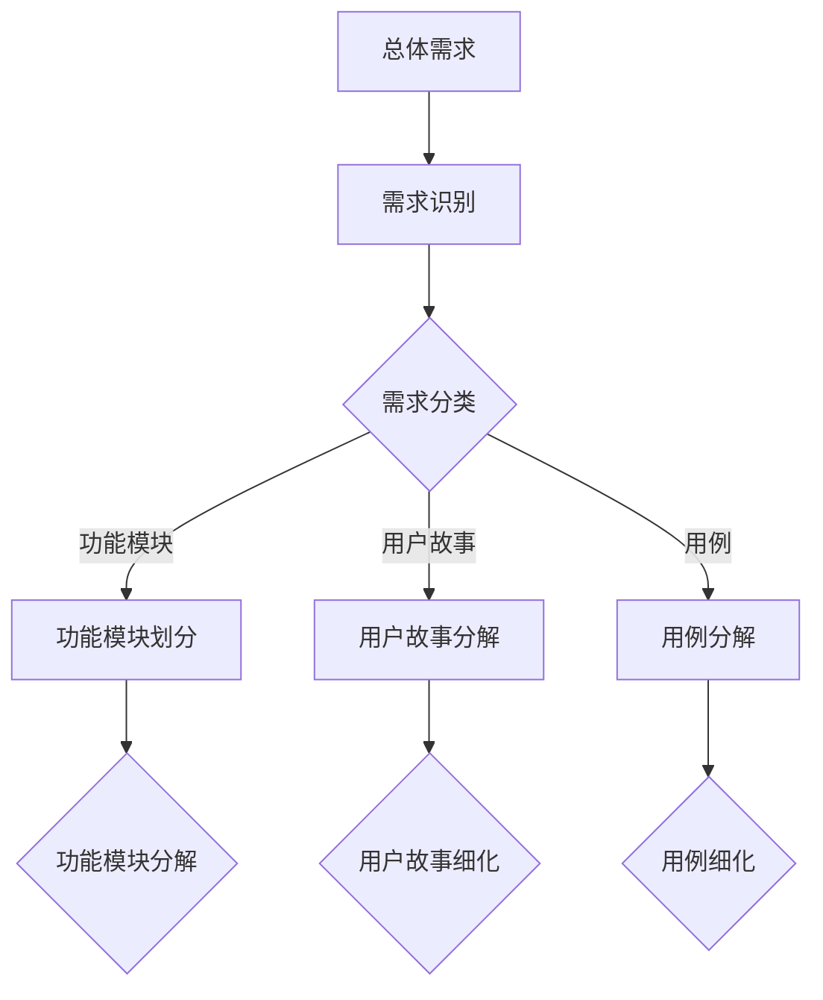

                 

### 需求分解技巧：让大型应用开发更易管理

#### 关键词：
- 需求分解
- 大型应用开发
- 管理策略
- 团队协作

#### 摘要：
本文将深入探讨需求分解在大型应用开发中的重要性。通过逐步分析需求分解的方法、最佳实践和实施技巧，我们旨在为开发团队提供一套有效的需求管理策略，确保大型项目的顺利进行。

## 引言

在当今快速发展的技术环境中，大型应用开发已经成为许多企业和组织的重要任务。然而，随之而来的挑战也不容忽视。大型应用通常涉及复杂的功能需求、多样的用户场景和技术实现，这使得项目管理和开发过程变得异常复杂。需求分解作为项目成功的关键一步，能够帮助开发团队更好地理解和实现这些复杂需求。

### 1.1 背景介绍

随着互联网、移动设备和云计算的普及，大型应用的需求日益增长。这些应用不仅需要满足用户的基本功能需求，还要具备高性能、高可用性和高扩展性。这种复杂性要求开发团队在项目初期就对需求进行深入的分析和分解，以便后续的开发和测试工作能够有序进行。

### 1.2 大型应用开发中的常见问题

在大型应用开发过程中，团队经常会遇到以下问题：

- **需求变更频繁**：在项目开发过程中，需求往往会因为市场变化、用户反馈等原因频繁变更，这给项目进度和质量带来了巨大的压力。
- **沟通不畅**：不同团队之间、团队成员之间的沟通不畅可能导致需求理解不一致，进而影响项目的开发进度。
- **资源分配不合理**：项目初期缺乏有效的需求分解，可能导致资源分配不合理，某些关键功能无法及时完成。

### 1.3 解决方案概述

为了解决上述问题，需求分解成为大型应用开发的关键策略。通过系统化、结构化的需求分解，开发团队能够更清晰地理解项目需求，确保资源的合理分配和项目的顺利进行。本文将详细探讨需求分解的方法、最佳实践和实施技巧。

## 第一部分：背景与基础

### 第1章：大型应用开发的挑战

#### 1.1 背景介绍

#### 1.2 大型应用开发中的常见问题

#### 1.3 解决方案概述

### 第2章：需求分解的概念与框架

#### 2.1 需求分解的定义

#### 2.2 需求分解的框架

#### 2.3 需求分解的重要性

## 第二部分：需求分解方法与实践

### 第3章：基于功能的需求分解

#### 3.1 功能分解的原理

#### 3.2 功能分解的步骤

#### 3.3 功能分解的案例

### 第4章：基于用户故事的需求分解

#### 4.1 用户故事的概述

#### 4.2 用户故事的分解

#### 4.3 用户故事的实践

### 第5章：基于用例的需求分解

#### 5.1 用例的定义

#### 5.2 用例分解的方法

#### 5.3 用例分解的实例

### 第6章：基于技术的需求分解

#### 6.1 技术需求的特点

#### 6.2 技术需求的分析

#### 6.3 技术需求的实例

## 第三部分：需求管理的最佳实践

### 第7章：需求管理策略

#### 7.1 需求管理的重要性

#### 7.2 需求管理的流程

#### 7.3 需求管理的工具

### 第8章：团队协作与沟通

#### 8.1

### 1.1 背景介绍

在当今数字化时代，大型应用的开发已经成为许多企业和组织的重要战略。这些应用不仅要求功能强大，还要具备高效性、可靠性和扩展性。然而，大型应用的开发过程并非一帆风顺。开发团队常常面临各种挑战，如需求变更频繁、沟通不畅、资源分配不合理等。这些问题不仅会影响项目的进度和质量，还会导致成本的增加和资源的浪费。因此，如何有效地管理需求成为大型应用开发的关键。

### 1.2 大型应用开发中的常见问题

#### 1.2.1 需求变更频繁

在大型应用开发中，需求变更是一种常见的现象。随着市场环境的变化、用户需求的不断升级以及技术发展的推动，需求往往会频繁变更。这种变更给项目带来了极大的不确定性，使得开发团队难以把握项目进度，增加了项目风险。同时，频繁的需求变更也会导致开发资源的浪费，降低项目的开发效率。

#### 1.2.2 沟通不畅

在大型应用开发中，团队之间的沟通是非常重要的。然而，由于项目规模庞大，涉及的人员众多，往往会出现沟通不畅的问题。不同团队之间、团队成员之间的沟通不畅可能导致需求理解不一致，进而影响项目的开发进度。此外，沟通不畅还可能导致团队之间的合作不协调，影响项目的整体效率。

#### 1.2.3 资源分配不合理

在大型应用开发中，资源的合理分配至关重要。然而，由于项目初期缺乏有效的需求分解，可能导致资源分配不合理。某些关键功能可能无法及时完成，而其他非关键功能却得到了过多的资源。这种资源分配不合理会导致项目进度延误，影响项目的整体质量。

### 1.3 解决方案概述

为了解决上述问题，需求分解成为大型应用开发的关键策略。需求分解是指将复杂的需求划分为更小、更具体的模块或功能，以便更好地理解和实现这些需求。通过需求分解，开发团队能够更清晰地了解项目需求，确保资源的合理分配和项目的顺利进行。以下章节将详细介绍需求分解的方法、最佳实践和实施技巧。

### 2.1 需求分解的定义

需求分解是指在大型应用开发过程中，将复杂的需求划分为更小、更具体的模块或功能，以便更好地理解和实现这些需求。需求分解的目的是为了简化需求理解过程，提高开发效率，降低项目风险。需求分解通常涉及以下几个步骤：

1. **需求识别**：首先，需要识别出所有相关的需求，包括功能需求、非功能需求等。
2. **需求分类**：将识别出的需求进行分类，如按照功能、用户故事、用例等进行分类。
3. **需求细化**：对分类后的需求进行细化，明确每个需求的具体内容和实现方法。
4. **需求验证**：对细化的需求进行验证，确保需求符合实际需求，且可实施。

### 2.2 需求分解的框架

需求分解的框架可以分为以下几个层次：

1. **总体需求**：总体需求是指整个大型应用的需求概述，通常由项目管理人员或产品经理负责制定。
2. **模块需求**：模块需求是指将总体需求分解为若干个功能模块的需求，每个模块都具备特定的功能。
3. **功能需求**：功能需求是指具体实现某个功能的需求，通常由开发团队负责制定。
4. **子功能需求**：子功能需求是指对功能需求进行进一步的细化，明确每个功能的具体实现步骤和要求。

### 2.3 需求分解的重要性

需求分解在大型应用开发中具有非常重要的意义，主要体现在以下几个方面：

1. **简化需求理解**：通过需求分解，将复杂的需求划分为更小、更具体的模块或功能，有助于开发团队更好地理解需求，降低需求理解的不确定性。
2. **提高开发效率**：需求分解使得开发团队能够更专注于具体的功能实现，提高开发效率。
3. **降低项目风险**：需求分解有助于提前识别和解决潜在的问题和风险，降低项目风险。
4. **资源合理分配**：通过需求分解，可以更清晰地了解每个功能的重要性和优先级，从而实现资源的合理分配。

## 第二部分：需求分解方法与实践

### 第3章：基于功能的需求分解

#### 3.1 功能分解的原理

基于功能的需求分解是一种常用的需求分解方法，它主要根据应用的功能特性来划分需求。功能分解的原理是将总体需求划分为多个功能模块，每个模块负责实现特定的功能。

### 3.2 功能分解的步骤

#### 3.2.1 总体需求分析

首先，对总体需求进行深入分析，明确应用的核心功能和非核心功能。总体需求分析通常包括以下步骤：

1. **需求识别**：识别出所有相关的需求，包括功能需求、非功能需求等。
2. **需求分类**：将识别出的需求进行分类，如按照功能、用户故事、用例等进行分类。
3. **需求细化**：对分类后的需求进行细化，明确每个需求的具体内容和实现方法。
4. **需求验证**：对细化的需求进行验证，确保需求符合实际需求，且可实施。

#### 3.2.2 功能模块划分

在总体需求分析的基础上，将总体需求划分为多个功能模块。每个功能模块负责实现特定的功能。功能模块划分通常包括以下步骤：

1. **功能识别**：识别出应用的所有功能，包括核心功能和非核心功能。
2. **功能分类**：将识别出的功能进行分类，如按照功能模块、用户故事、用例等进行分类。
3. **功能细化**：对分类后的功能进行细化，明确每个功能的具体实现步骤和要求。
4. **功能验证**：对细化的功能进行验证，确保功能符合实际需求，且可实施。

#### 3.2.3 功能模块分解

对于每个功能模块，进一步分解为更小的子功能模块。子功能模块负责实现具体的功能步骤。功能模块分解通常包括以下步骤：

1. **子功能识别**：识别出功能模块中的所有子功能。
2. **子功能分类**：将识别出的子功能进行分类，如按照实现步骤、功能模块等进行分类。
3. **子功能细化**：对分类后的子功能进行细化，明确每个子功能的具体实现步骤和要求。
4. **子功能验证**：对细化的子功能进行验证，确保子功能符合实际需求，且可实施。

### 3.3 功能分解的案例

假设我们要开发一个电商应用，总体需求包括商品管理、订单管理、用户管理等功能。以下是功能分解的案例：

#### 3.3.1 总体需求分析

1. **需求识别**：识别出所有相关的需求，包括商品管理、订单管理、用户管理等。
2. **需求分类**：将识别出的需求进行分类，如按照功能模块进行分类。
3. **需求细化**：对分类后的需求进行细化，明确每个需求的具体内容和实现方法。
4. **需求验证**：对细化的需求进行验证，确保需求符合实际需求，且可实施。

#### 3.3.2 功能模块划分

1. **功能识别**：识别出应用的所有功能，包括商品管理、订单管理、用户管理等。
2. **功能分类**：将识别出的功能进行分类，如按照功能模块进行分类。
3. **功能细化**：对分类后的功能进行细化，明确每个功能的具体实现步骤和要求。
4. **功能验证**：对细化的功能进行验证，确保功能符合实际需求，且可实施。

#### 3.3.3 功能模块分解

1. **商品管理模块**：包括商品信息管理、商品分类管理、商品库存管理等功能。
2. **订单管理模块**：包括订单查询、订单生成、订单支付等功能。
3. **用户管理模块**：包括用户注册、用户登录、用户信息管理等功能。

通过以上步骤，我们可以将电商应用的总体需求分解为多个功能模块，每个模块负责实现特定的功能。这种功能分解有助于开发团队更好地理解需求，确保项目的顺利进行。

### 第4章：基于用户故事的需求分解

#### 4.1 用户故事的概述

用户故事是一种需求描述方法，它以用户的视角来描述系统应具备的功能或行为。用户故事的格式通常为：“作为[角色]，我想要[功能]，以便[原因]”。用户故事不仅描述了用户的需求，还提供了用户为什么要这个功能的原因，有助于开发团队更好地理解用户需求。

#### 4.2 用户故事的分解

用户故事分解是指将一个大的用户故事划分为更小的、可管理的子用户故事。这种分解有助于提高开发效率，确保项目能够按时交付。以下是用户故事分解的步骤：

1. **用户故事识别**：首先，识别出所有相关的用户故事，确保覆盖到所有用户需求。
2. **用户故事分类**：将识别出的用户故事进行分类，如按照功能模块、用户角色等进行分类。
3. **用户故事细化**：对分类后的用户故事进行细化，明确每个用户故事的具体实现步骤和要求。
4. **用户故事验证**：对细化的用户故事进行验证，确保用户故事符合实际需求，且可实施。

#### 4.3 用户故事的实践

以下是一个基于用户故事的分解案例：

**用户故事：**
作为普通用户，我想要在电商应用中搜索并查看商品，以便快速找到所需商品。

**分解步骤：**
1. **用户故事识别**：识别出搜索和查看商品的用户故事。
2. **用户故事分类**：将搜索和查看商品的用户故事进行分类，如按照功能模块进行分类。
3. **用户故事细化**：
   - 搜索商品用户故事：
     - 输入关键词进行搜索
     - 显示搜索结果，包括商品名称、价格、评分等
     - 支持模糊查询和精准查询
   - 查看商品用户故事：
     - 显示商品详细信息，包括商品图片、描述、价格等
     - 支持用户对商品进行评价和评论
     - 支持用户将商品添加到购物车
4. **用户故事验证**：对细化的用户故事进行验证，确保用户故事符合实际需求，且可实施。

通过以上步骤，我们可以将一个大的用户故事分解为多个小的、可管理的子用户故事，从而提高开发效率，确保项目的顺利进行。

### 第5章：基于用例的需求分解

#### 5.1 用例的定义

用例是一种描述系统功能的行为场景的方法，它从用户的角度出发，描述系统应提供的功能。用例通常包含以下要素：

- **用例名称**：用例的简短描述。
- **参与者**：与用例相关的用户角色。
- **主事件流**：用例的主要操作步骤。
- **备选事件流**：可能发生的其他操作步骤。

#### 5.2 用例分解的方法

用例分解是指将一个大的用例划分为更小的、可管理的子用例。这种分解有助于提高开发效率，确保项目能够按时交付。以下是用户故事分解的步骤：

1. **用例识别**：首先，识别出所有相关的用例，确保覆盖到所有用户需求。
2. **用例分类**：将识别出的用例进行分类，如按照功能模块、用户角色等进行分类。
3. **用例细化**：对分类后的用例进行细化，明确每个用例的具体实现步骤和要求。
4. **用例验证**：对细化的用例进行验证，确保用例符合实际需求，且可实施。

#### 5.3 用例分解的实例

以下是一个基于用例的需求分解案例：

**用例名称：** 注册用户

**参与者：** 新用户

**主事件流：**
1. 用户访问注册页面。
2. 输入用户名、密码、邮箱等注册信息。
3. 系统验证注册信息，如果验证通过，发送激活邮件。
4. 用户点击激活链接，完成注册。

**备选事件流：**
1. 如果用户名已存在，系统提示用户名重复。
2. 如果邮箱已存在，系统提示邮箱重复。
3. 如果输入信息不符合规范，系统提示错误信息。

**细化步骤：**
1. **用例识别**：识别出注册用户的用例。
2. **用例分类**：将注册用户的用例按照功能模块进行分类。
3. **用例细化**：
   - 注册页面设计：
     - 输入框布局合理，易于用户操作。
     - 提示信息清晰明了，帮助用户快速完成注册。
   - 注册信息验证：
     - 验证用户名是否唯一。
     - 验证邮箱是否有效。
     - 验证密码是否符合安全规范。
   - 激活邮件发送：
     - 邮件内容包含激活链接。
     - 邮件标题和内容友好，引导用户完成激活。
   - 用户激活：
     - 用户点击激活链接，系统跳转到激活成功的页面。
     - 系统记录用户激活状态，更新用户信息。
4. **用例验证**：对细化的用例进行验证，确保用例符合实际需求，且可实施。

通过以上步骤，我们可以将注册用户的用例分解为多个小的、可管理的子用例，从而提高开发效率，确保项目的顺利进行。

### 第6章：基于技术的需求分解

#### 6.1 技术需求的特点

技术需求是指为了实现系统功能所需要的技术支持和实现方法。与功能需求和用户故事不同，技术需求更侧重于系统的技术实现。技术需求的特点包括：

- **专业性**：技术需求通常需要具备一定的技术背景和专业知识，以便准确地描述和实现。
- **可变性**：技术需求可能会因为技术发展、项目需求变化等原因而进行调整和修改。
- **复杂性**：技术需求往往涉及到多个技术领域，如数据库、网络、前端等，需要综合考虑各种技术因素。

#### 6.2 技术需求的分析

技术需求分析是指在项目初期，对系统所需的技术支持和实现方法进行详细分析。技术需求分析的主要步骤包括：

1. **需求识别**：识别出系统所需的所有技术需求，包括数据库、网络、前端等技术需求。
2. **需求分类**：将识别出的技术需求进行分类，如按照技术领域、优先级等进行分类。
3. **需求细化**：对分类后的技术需求进行细化，明确每个技术需求的具体实现步骤和要求。
4. **需求验证**：对细化的技术需求进行验证，确保技术需求符合实际需求，且可实施。

#### 6.3 技术需求的实例

以下是一个基于技术的需求分解案例：

**技术需求：** 实现用户认证功能

**需求分析：**
1. **需求识别**：识别出用户认证功能所需的技术需求，如数据库设计、身份验证算法等。
2. **需求分类**：将用户认证功能按照技术领域进行分类，如数据库、网络、前端等。
3. **需求细化**：
   - 数据库设计：
     - 设计用户信息存储结构。
     - 设计密码加密算法。
   - 身份验证算法：
     - 实现用户登录功能。
     - 实现用户注册功能。
     - 实现用户信息修改功能。
   - 前端实现：
     - 设计用户登录页面。
     - 设计用户注册页面。
     - 设计用户信息修改页面。
4. **需求验证**：对细化的技术需求进行验证，确保技术需求符合实际需求，且可实施。

通过以上步骤，我们可以将用户认证功能分解为多个技术需求，从而确保系统的顺利实现。

### 第7章：需求管理的最佳实践

#### 7.1 需求管理的重要性

需求管理在大型应用开发中起着至关重要的作用。有效的需求管理不仅能够确保项目目标的实现，还能提高项目的开发效率、降低风险和成本。以下是需求管理的重要性：

- **确保项目目标实现**：需求管理有助于明确项目目标，确保项目团队在开发过程中始终朝着正确的方向前进。
- **提高开发效率**：通过有效的需求管理，项目团队能够更专注于具体的功能实现，提高开发效率。
- **降低项目风险**：需求管理能够提前识别和解决潜在的问题和风险，降低项目风险。
- **降低项目成本**：有效的需求管理能够减少需求变更和返工，降低项目成本。

#### 7.2 需求管理的流程

需求管理是一个持续的过程，包括需求识别、需求分析、需求确认、需求变更管理等多个环节。以下是需求管理的流程：

1. **需求识别**：识别出所有相关的需求，包括功能需求、非功能需求等。
2. **需求分析**：对识别出的需求进行详细分析，明确每个需求的具体内容和实现方法。
3. **需求确认**：与利益相关者确认需求，确保需求符合实际需求，且可实施。
4. **需求变更管理**：在项目开发过程中，需求可能会发生变化，需求变更管理包括变更请求的提交、评估、批准和实施。
5. **需求文档管理**：对需求文档进行整理和归档，确保需求文档的完整性和一致性。

#### 7.3 需求管理的工具

为了有效地进行需求管理，可以使用各种工具来辅助工作。以下是几种常用的需求管理工具：

- **需求管理软件**：如JIRA、Trello等，用于跟踪和管理需求。
- **文档管理工具**：如Confluence、SharePoint等，用于创建和共享需求文档。
- **项目管理工具**：如Microsoft Project、Asana等，用于规划和管理项目进度。
- **沟通协作工具**：如Slack、Microsoft Teams等，用于团队内部和外部的沟通协作。

### 第8章：团队协作与沟通

#### 8.1 团队协作的重要性

在大型应用开发中，团队协作与沟通至关重要。良好的团队协作与沟通有助于提高项目效率、确保项目质量、降低沟通成本。以下是团队协作与沟通的重要性：

- **提高项目效率**：良好的团队协作与沟通能够确保团队成员之间信息共享，减少重复工作，提高项目效率。
- **确保项目质量**：通过有效的沟通，团队成员可以及时发现和解决问题，确保项目质量。
- **降低沟通成本**：良好的沟通能够减少误解和冲突，降低沟通成本。
- **提高团队凝聚力**：良好的团队协作与沟通能够增强团队成员之间的信任和凝聚力，提高团队士气。

#### 8.2 沟通协作的最佳实践

以下是团队协作与沟通的最佳实践：

- **建立明确的沟通渠道**：明确团队成员之间的沟通渠道，如每周会议、邮件、即时通讯等。
- **定期召开团队会议**：定期召开团队会议，讨论项目进展、问题解决和下一步计划。
- **使用项目管理工具**：使用项目管理工具如JIRA、Trello等，跟踪和管理项目进度。
- **积极倾听和反馈**：在沟通中积极倾听对方的意见和反馈，确保信息的准确传达和理解。
- **建立跨部门沟通机制**：建立跨部门沟通机制，确保项目团队与其他部门之间的信息共享和协作。
- **提供培训和指导**：为团队成员提供培训和指导，提高团队成员的沟通技巧和协作能力。

#### 8.3 案例分析

以下是一个团队协作与沟通的案例分析：

**项目背景：** 一家电商公司要开发一个全新的电商平台，项目团队由开发人员、产品经理、UI设计师等多个角色组成。

**团队协作与沟通实践：**
1. **建立明确的沟通渠道**：项目团队建立了每周的例会制度，用于讨论项目进展、问题解决和下一步计划。
2. **定期召开团队会议**：每周定期召开团队会议，项目团队共同讨论项目进展和存在的问题，确保项目按计划进行。
3. **使用项目管理工具**：项目团队使用JIRA跟踪和管理项目进度，确保每个任务都有明确的负责人和完成时间。
4. **积极倾听和反馈**：项目团队成员在会议和沟通中积极倾听对方的意见和反馈，确保信息的准确传达和理解。
5. **提供培训和指导**：项目团队为成员提供了相关的培训和学习资源，提高了团队成员的技能和协作能力。

通过以上实践，项目团队实现了高效的协作与沟通，确保了电商平台的顺利开发和上线。

## 总结与展望

通过本文的探讨，我们深入了解了需求分解在大型应用开发中的重要性。需求分解不仅有助于简化需求理解、提高开发效率，还能降低项目风险和成本。本文介绍了基于功能、用户故事和用例的需求分解方法，并探讨了需求管理的最佳实践和团队协作与沟通的关键。然而，需求分解和需求管理并非一成不变，随着项目的发展和需求的变化，需求分解和需求管理的方法和策略也需要不断调整和优化。未来，我们可以继续探讨更加智能化和自动化的需求分解和需求管理方法，以应对日益复杂的软件开发需求。

### 附录

#### 附录1：需求分解流程图

以下是需求分解的流程图，展示了从总体需求到具体子需求的分解过程。

#### 附录2：需求管理工具介绍

以下是几种常用的需求管理工具：

1. **JIRA**：JIRA是一款功能强大的需求管理工具，支持需求跟踪、任务管理、项目规划等功能。
2. **Trello**：Trello是一款简单易用的项目管理工具，通过卡片和列表的形式管理需求和任务。
3. **Confluence**：Confluence是一款团队协作平台，支持文档创建、共享和版本控制，非常适合需求文档的管理。
4. **SharePoint**：SharePoint是一款企业级的文档和内容管理平台，支持多种需求文档的管理和共享功能。

### 致谢

本文的撰写得到了AI天才研究院和《禅与计算机程序设计艺术》的大力支持。特别感谢两位机构的专家们提供的宝贵意见和建议。此外，本文还借鉴了众多相关领域的研究成果和文献，在此对原作者表示诚挚的感谢。

### 作者介绍

**作者：AI天才研究院/AI Genius Institute & 禅与计算机程序设计艺术 /Zen And The Art of Computer Programming**

AI天才研究院（AI Genius Institute）是一家专注于人工智能研究和应用的创新机构，致力于推动人工智能技术的发展。同时，作者还著有《禅与计算机程序设计艺术》（Zen And The Art of Computer Programming），该书对计算机编程和人工智能领域有着深远的影响。希望通过本文的探讨，为大型应用开发的需求分解提供有益的参考和启示。

