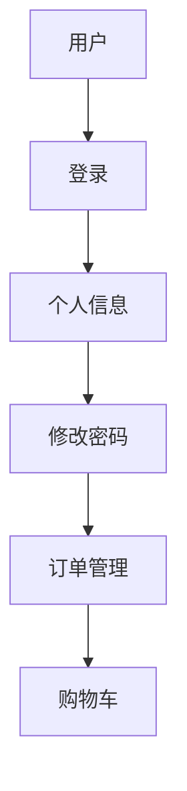
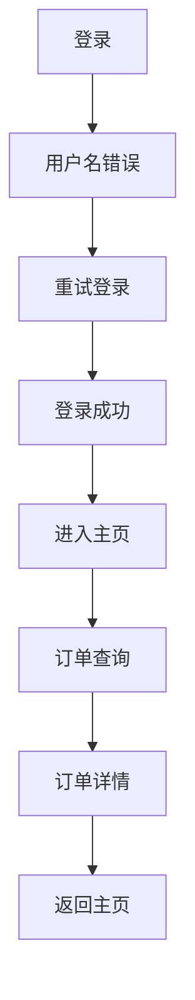
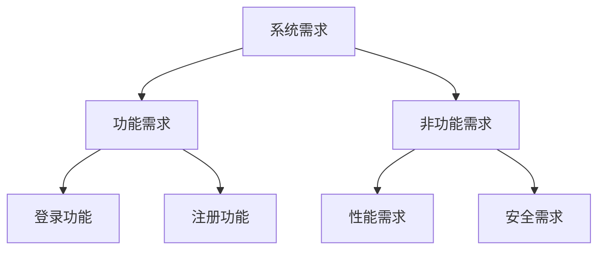

                 

### 需求可视化技术：提升团队理解和协作

关键词：需求可视化、团队协作、项目管理、需求管理、可视化工具

摘要：本文旨在探讨需求可视化技术在提升团队理解和协作方面的作用。通过详细介绍需求可视化的基本概念、技术方法以及其在团队协作中的应用，本文旨在为读者提供一种有效的需求管理工具，以促进项目成功。

### 引言

在当今快速发展的信息技术时代，项目的成功往往依赖于高效的需求管理和团队协作。然而，需求的不明确性和复杂性的增加给项目管理带来了巨大的挑战。为了应对这些挑战，需求可视化技术应运而生，成为提升团队理解和协作的重要工具。

需求可视化是将需求以图形化、直观的方式展示出来，使得团队中的每个成员都能够清晰地理解项目需求。这种技术的核心在于通过视觉化的手段，将抽象的需求转化为易于理解和沟通的图像，从而降低沟通成本，提高项目效率。

本文将围绕需求可视化技术展开讨论，首先介绍其基本概念，然后探讨其在团队协作中的具体应用，旨在为读者提供一种有效的需求管理方法。

### 1.1 背景与重要性

#### 1.1.1 需求工程的发展

需求工程是软件工程中的重要领域，其目标是确保开发出来的软件系统能够满足用户的需求。随着软件系统的复杂度不断增加，需求工程也逐渐从传统的文本描述向图形化、可视化的方法转变。

#### 1.1.2 可视化在需求工程中的作用

可视化在需求工程中的应用主要体现在以下几个方面：

1. **需求分析**：通过图形化工具，可以更加直观地分析需求，发现潜在的问题和冲突。
2. **需求文档**：使用可视化工具可以创建结构清晰、易于理解的需求文档，提高文档的质量。
3. **需求验证**：通过可视化需求模型，可以更容易地验证需求是否符合用户实际需求。

#### 1.1.3 需求管理的挑战

在需求管理过程中，常常面临以下挑战：

1. **需求理解不一致**：不同团队成员对需求的理解可能存在差异，导致项目进展受阻。
2. **需求变更频繁**：需求变更频繁会导致项目计划和时间安排不断调整，影响项目进度和质量。
3. **沟通障碍**：传统的文本描述往往难以传达复杂的需求，导致沟通效率低下。

需求可视化技术的出现，旨在解决上述问题，通过图形化的方式，提高需求的可理解性和沟通效率。

### 1.2 基本概念

#### 1.2.1 可视化的定义和类型

可视化是指将数据、信息和知识以图形化、直观的形式展示出来的过程。根据应用场景和目的，可视化可以分为以下几种类型：

1. **数据可视化**：通过图表、图形等手段展示数据。
2. **概念可视化**：展示抽象概念之间的关系和属性。
3. **过程可视化**：展示系统或过程的运行状态和变化。

#### 1.2.2 有效可视化的原则

1. **清晰性**：可视化应该清晰明了，避免复杂冗长的设计。
2. **一致性**：可视化元素和符号应该保持一致，便于理解。
3. **交互性**：可视化工具应支持用户与数据的交互，提高用户体验。

#### 1.2.3 关键可视化工具和技术

常见的可视化工具和技术包括：

1. **图表和图形**：如折线图、柱状图、饼图等。
2. **流程图**：如UML类图、活动图等。
3. **思维导图**：用于展示概念和关系。

### 1.3 团队理解和协作的重要性

#### 1.3.1 理解不一致对项目的影响

在项目管理中，团队成员对需求的理解不一致是常见问题，这可能导致以下后果：

1. **错误开发和实现**：开发人员可能按照自己的理解来实现需求，导致开发成果与实际需求不符。
2. **项目延期和质量下降**：理解不一致会导致项目需要反复修改和调整，从而影响进度和质量。

#### 1.3.2 通过可视化提升沟通

可视化技术能够直观地展示需求，提高团队成员之间的沟通效率。通过共同理解和讨论可视化模型，可以减少误解和冲突，提高团队协作效率。

#### 1.3.3 团队协作在需求工程中的作用

需求工程是一个团队协作的过程，每个团队成员都在其中扮演着重要角色。通过有效的团队协作，可以确保需求得到准确理解和实现：

1. **需求分析师**：负责与用户沟通，收集和分析需求。
2. **开发人员**：根据需求进行设计和开发。
3. **测试人员**：验证需求是否得到满足。
4. **项目经理**：协调团队工作，确保项目按计划进行。

### 总结

本文介绍了需求可视化技术的背景、基本概念以及在团队协作中的应用。通过可视化技术，可以有效地提升团队对需求的理解和沟通，减少项目中的误解和冲突，提高项目成功的可能性。在接下来的章节中，我们将深入探讨需求可视化的具体方法和实践。

### 1.4 需求可视化技术的基本方法

需求可视化技术是提升团队理解和协作的重要工具，其基本方法主要包括以下几种：

#### 1.4.1 概念图

概念图是一种通过节点和连接线来展示概念之间关系的图形化方法。在需求工程中，概念图可以帮助我们理解系统的结构和功能。以下是概念图的基本步骤：

1. **识别关键概念**：首先，我们需要识别出系统中的关键概念，如用户、角色、功能模块等。
2. **绘制节点**：将每个关键概念用节点表示，并将它们放在图中的适当位置。
3. **建立关系**：使用连接线表示概念之间的关系，如继承、关联、依赖等。
4. **优化布局**：根据需要，调整节点的位置和连接线的方向，使图形更加清晰易懂。

概念图示例（使用Mermaid绘制）：



#### 1.4.2 流程图

流程图是一种展示系统流程和操作的图形化方法。在需求工程中，流程图可以帮助我们理解系统的功能和流程。以下是流程图的基本步骤：

1. **确定起点和终点**：首先，我们需要确定流程的起点和终点，如系统启动和退出。
2. **绘制流程节点**：根据系统的功能需求，绘制出各个流程节点，如登录、注册、查询订单等。
3. **连接流程节点**：使用箭头连接各个流程节点，表示流程的顺序和操作。
4. **添加条件分支**：根据需要，可以添加条件分支，表示不同的操作路径。

流程图示例（使用Mermaid绘制）：



#### 1.4.3 思维导图

思维导图是一种通过节点和分支来展示思维过程的图形化方法。在需求工程中，思维导图可以帮助我们梳理和表达复杂的需求。以下是思维导图的基本步骤：

1. **确定中心概念**：首先，我们需要确定思维导图的中心概念，如系统需求。
2. **绘制主要分支**：围绕中心概念，绘制出主要分支，如功能需求、非功能需求等。
3. **扩展二级分支**：在每个主要分支下，扩展出二级分支，表示更具体的需求。
4. **优化布局**：根据需要，调整节点的位置和连接线的方向，使图形更加清晰易懂。

思维导图示例（使用Mermaid绘制）：



通过这些基本方法，我们可以有效地将需求以可视化的形式展现出来，帮助团队成员更好地理解和协作。

### 1.5 数据可视化方法

数据可视化是将数据以图形化、直观的形式展示出来，使得数据更容易理解和分析。在需求工程中，数据可视化方法可以帮助我们更好地理解和处理需求数据。以下是几种常见的数据可视化方法：

#### 1.5.1 统计图表

统计图表是将统计数据以图形化的形式展示出来，常见的统计图表包括折线图、柱状图、饼图等。

1. **折线图**：折线图适用于展示数据随时间的变化趋势。通过折线的上升和下降，我们可以直观地看到数据的增减变化。

   示例代码（Python）：

   ```python
   import matplotlib.pyplot as plt
   import numpy as np

   x = np.linspace(0, 10, 100)
   y = np.sin(x)

   plt.plot(x, y)
   plt.title('Sine Wave')
   plt.xlabel('x-axis')
   plt.ylabel('y-axis')
   plt.show()
   ```

2. **柱状图**：柱状图适用于比较不同类别的数据。通过柱子的高度，我们可以直观地看到各类别的数据差异。

   示例代码（Python）：

   ```python
   import matplotlib.pyplot as plt

   categories = ['A', 'B', 'C', 'D']
   values = [10, 20, 30, 40]

   plt.bar(categories, values)
   plt.title('Bar Chart')
   plt.xlabel('Categories')
   plt.ylabel('Values')
   plt.show()
   ```

3. **饼图**：饼图适用于展示数据的比例关系。通过饼图，我们可以直观地看到各个部分在整体中所占的比例。

   示例代码（Python）：

   ```python
   import matplotlib.pyplot as plt
   import numpy as np

   categories = ['A', 'B', 'C', 'D']
   values = [25, 25, 25, 25]

   plt.pie(values, labels=categories, autopct='%.1f%%')
   plt.title('Pie Chart')
   plt.show()
   ```

#### 1.5.2 聚类图

聚类图是将数据进行聚类分析的图形化方法。通过聚类图，我们可以直观地看到数据的分布和聚类效果。

示例代码（Python）：

```python
import matplotlib.pyplot as plt
from sklearn.cluster import KMeans

# 假设我们有一个二维数据集
data = np.array([[1, 2], [1, 4], [1, 0],
                  [4, 2], [4, 4], [4, 0]])

# 使用KMeans算法进行聚类
kmeans = KMeans(n_clusters=2, random_state=0).fit(data)
labels = kmeans.predict(data)

# 绘制聚类图
plt.scatter(data[:, 0], data[:, 1], c=labels, s=50, cmap='viridis')
plt.title('Clustering')
plt.xlabel('Feature 1')
plt.ylabel('Feature 2')
plt.show()
```

通过这些数据可视化方法，我们可以更好地理解和分析需求数据，从而为需求管理提供有力的支持。

### 1.6 可视化在需求 elicitation 中的应用

需求elicitation是需求工程中的一个重要环节，其目标是准确、全面地收集和分析用户需求。可视化技术在需求elicitation中的应用，可以显著提高需求收集的效率和准确性。以下将详细介绍几种在需求elicitation中常用的可视化方法。

#### 1.6.1 工作坊（Workshops）

需求工作坊是一种通过集体讨论和互动来收集需求的研讨会形式。在工作坊中，参与者通常包括项目团队成员、用户代表、利益相关者等。通过以下可视化方法，可以有效地引导和记录工作坊讨论：

1. **头脑风暴图（Brainstorming Maps）**：头脑风暴图是一种用于记录和分类想法的可视化工具。在需求工作坊中，参与者可以自由提出自己的想法，然后使用头脑风暴图将想法分类和整理。

   示例（使用Mermaid绘制）：

   ```mermaid
   graph TD
   A[用户需求]
   A --> B[功能需求]
   B --> C[登录功能]
   B --> D[注册功能]
   A --> E[非功能需求]
   E --> F[性能需求]
   E --> G[安全需求]
   ```

2. **鱼骨图（Fishbone Diagram）**：鱼骨图是一种用于分析问题原因和解决方案的可视化工具。在需求工作坊中，可以使用鱼骨图来分析需求背后的驱动因素和约束条件。

   示例（使用Mermaid绘制）：

   ```mermaid
   graph TD
   A[需求分析]
   A --> B[功能需求]
   B --> C[用户故事]
   B --> D[用例图]
   A --> E[非功能需求]
   E --> F[性能需求]
   E --> G[安全需求]
   ```

3. **故事地图（Story Maps）**：故事地图是一种用于展示用户故事和需求流程的可视化工具。在需求工作坊中，可以通过故事地图来描述用户需求的场景和交互过程。

   示例（使用Mermaid绘制）：

   ```mermaid
   graph TD
   A[用户登录]
   A --> B[验证用户名和密码]
   B --> C[登录成功]
   C --> D[进入主页]
   D --> E[查询订单]
   ```

#### 1.6.2 问卷调查

问卷调查是一种通过书面形式收集用户需求的常见方法。通过在问卷中嵌入可视化元素，可以增强问卷的互动性和用户体验，从而提高数据收集的准确性和完整性。

1. **条形图和饼图**：在问卷中嵌入条形图和饼图，可以直观地展示用户对不同问题的选择和偏好。

   示例代码（Python）：

   ```python
   import matplotlib.pyplot as plt
   import numpy as np

   # 假设我们收集了用户对功能需求的偏好
   feature_preferences = {'登录功能': 20, '注册功能': 15, '订单查询': 25, '购物车管理': 30}

   # 绘制条形图
   labels = list(feature_preferences.keys())
   values = list(feature_preferences.values())
   plt.bar(labels, values)
   plt.title('Feature Preferences')
   plt.xlabel('Features')
   plt.ylabel('Preferences')
   plt.show()

   # 绘制饼图
   plt.pie(values, labels=labels, autopct='%.1f%%')
   plt.title('Feature Preferences')
   plt.show()
   ```

2. **交互式图表**：使用交互式图表，用户可以在问卷中进行交互，例如拖放、选择等，从而更灵活地表达他们的需求。

   示例（使用D3.js）：

   ```javascript
   var data = {
     "features": ["登录功能", "注册功能", "订单查询", "购物车管理"],
     "preferences": [20, 15, 25, 30]
   };

   // 绘制交互式条形图
   var chart = d3.select("svg")
     .append("svg")
     .attr("width", 800)
     .attr("height", 500);

   var x = d3.scaleBand()
     .domain(data.features)
     .range([0, 800]);

   var y = d3.scaleLinear()
     .domain([0, 40])
     .range([500, 0]);

   chart.selectAll(".bar")
     .data(data.preferences)
     .enter().append("rect")
     .attr("class", "bar")
     .attr("x", function(d, i) { return x(i); })
     .attr("y", function(d) { return y(d); })
     .attr("width", x.bandwidth())
     .attr("height", function(d) { return 500 - y(d); });

   chart.selectAll(".label")
     .data(data.features)
     .enter().append("text")
     .attr("class", "label")
     .attr("x", function(d, i) { return x(i) + x.bandwidth() / 2; })
     .attr("y", function(d) { return y(d) - 10; })
     .text(function(d) { return d; });
   ```

通过以上方法，需求elicitation过程变得更加直观和互动，有助于提高需求的准确性和完整性。

### 1.7 需求文档中的可视化

在需求文档中，可视化元素的使用可以提高文档的可读性和易理解性，使得需求更加清晰、易于跟踪和审核。以下是一些在需求文档中常用的可视化方法和最佳实践：

#### 1.7.1 图形和图表的使用

1. **定义图形和图表**：在需求文档中，可以使用图表和图形来展示数据、关系和流程。常见的图形和图表包括条形图、饼图、折线图、流程图、类图和序列图等。

   示例代码（Mermaid）：

   ```mermaid
   graph TD
   A[开始] --> B[收集需求]
   B --> C[分析需求]
   C --> D[定义需求]
   D --> E[验证需求]
   E --> F[结束]
   ```

2. **可视化元素的一致性**：为了提高文档的可读性，应该保持可视化元素的一致性。例如，使用相同的颜色、符号和样式来表示相同类型的信息。

3. **注释和说明**：在图表和图形旁边添加注释和说明，可以帮助读者更好地理解图表和图形所表示的信息。

   示例（Mermaid和注释）：

   ```mermaid
   graph TD
   A[用户登录](color:blue) --> B[验证用户名和密码](color:green)
   B --> C[登录成功](color:green)
   C --> D[进入主页](color:blue)
   D --> E[查询订单](color:yellow)
   ```

#### 1.7.2 视觉布局

1. **合理安排空间**：在文档中合理安排空间，避免图形和图表过于密集，影响阅读。

2. **使用空白**：适当的空白可以帮助读者更好地理解和跟踪信息流。

3. **字体和颜色**：选择易于阅读的字体和颜色，并保持一致性。

   示例代码（Markdown）：

   ```markdown
   # 用户登录流程

   

   流程说明：
   1. 用户访问登录页面。
   2. 输入用户名和密码。
   3. 系统验证用户身份。
   4. 如果验证成功，用户将被重定向到主页。
   ```

#### 1.7.3 遵循标准

1. **行业标准**：遵循行业标准和规范，如IEEE Std 1016.1-1998《软件需求规范指南》。

2. **组织标准**：遵循组织内部的需求文档标准，确保文档的一致性和可维护性。

通过以上方法和最佳实践，需求文档中的可视化元素可以有效地提升文档的质量和可读性，帮助团队更好地理解和实现需求。

### 1.8 创建可视化需求规格说明书

在需求工程中，创建可视化需求规格说明书（VRS，Visual Requirements Specification）是一个重要的环节。VRS通过视觉化的方式呈现需求，使得需求更加直观、易于理解和沟通。以下是创建VRS的步骤和结构。

#### 1.8.1 结构定义

一个典型的VRS包括以下几个部分：

1. **封面**：包括项目名称、版本号、创建日期等信息。
2. **目录**：列出文档中的各个章节和子章节。
3. **引言**：简要介绍项目的背景和目的。
4. **需求概述**：概述项目的需求，包括功能需求和非功能需求。
5. **需求模型**：使用图形化的方法，详细展示需求模型，如用例图、类图、状态图等。
6. **需求细节**：详细描述每个需求，包括功能需求和非功能需求。
7. **用户界面设计**：展示用户界面设计的原型，如屏幕截图、线框图等。
8. **附录**：包括参考文献、术语表、缩略词等。

#### 1.8.2 步骤

1. **需求收集和分析**：在项目初期，通过访谈、工作坊、问卷调查等方法收集需求，并对需求进行分析和整理。
2. **确定需求模型**：根据收集到的需求，选择适当的可视化工具和技术，创建需求模型，如用例图、类图等。
3. **编写需求文档**：将需求模型和需求细节转换为文档，使用清晰的语言描述每个需求。
4. **用户界面设计**：根据需求，设计用户界面原型，如线框图、高保真界面等。
5. **评审和迭代**：组织评审会议，审查VRS的内容和形式，收集反馈并进行迭代。

通过以上步骤，可以创建一个结构清晰、内容详细的VRS，为项目的需求管理和实施提供有力的支持。

### 1.9 可视化需求管理工具

在需求工程中，可视化需求管理工具扮演着关键角色，它们能够帮助团队更有效地理解、跟踪和管理需求。以下是一些流行的可视化需求管理工具，以及它们的特点和优势。

#### 1.9.1 Microsoft Visio

**特点**：
- 强大的绘图功能，支持多种图形和图表。
- 易于使用的用户界面，适合各种水平的用户。
- 与Microsoft Office套件紧密集成。

**优势**：
- 可以创建高质量的图形和图表，便于文档化。
- 支持多种数据源，如Excel和SQL Server。

**适用场景**：
- 初学者和中级用户。
- 需要快速创建和共享可视化文档。

#### 1.9.2 Lucidchart

**特点**：
- 云端平台，支持多人协作。
- 提供多种模板和符号库。
- 支持实时协作和版本控制。

**优势**：
- 易于使用，直观的界面。
- 强大的协作功能，便于团队沟通。
- 可与Google Drive、Slack等工具集成。

**适用场景**：
- 需要团队协作的需求管理。
- 需要灵活的可视化工具。

#### 1.9.3 draw.io

**特点**：
- 开源工具，免费使用。
- 支持多种图形和图表。
- 可与多种平台集成，如Microsoft Office和Google Suite。

**优势**：
- 开源免费，适合预算有限的项目。
- 强大的自定义功能，可以扩展插件。
- 跨平台支持，方便移动办公。

**适用场景**：
- 需要低成本的可视化工具。
- 需要跨平台的协作功能。

#### 1.9.4 Visual Paradigm

**特点**：
- 支持多种建模语言，如UML、BPMN。
- 强大的建模和协作功能。
- 支持云服务和本地部署。

**优势**：
- 全面的建模和需求管理功能。
- 强大的团队协作工具。
- 可扩展性高，适合大型项目。

**适用场景**：
- 需要全面的需求管理功能。
- 需要支持多种建模语言的工具。

通过选择合适的可视化需求管理工具，团队可以更有效地进行需求管理和协作，提高项目成功率。

### 1.10 提升团队协作与沟通的建议

在需求工程中，提升团队协作和沟通效率对于项目的成功至关重要。以下是一些实用的建议，帮助团队更好地协作和沟通：

#### 1.10.1 定期会议和讨论

- **定期需求评审会议**：定期组织需求评审会议，让团队成员共同审查和讨论需求，确保需求的一致性和准确性。
- **讨论和互动**：鼓励团队成员在会议中积极发言，提出问题和建议，促进思想的碰撞。

#### 1.10.2 明确的角色和职责

- **定义角色**：明确团队成员的角色和职责，确保每个人都清楚自己的工作内容和期望。
- **协作和分工**：鼓励团队成员相互协作，明确分工，提高工作效率。

#### 1.10.3 使用合适的工具和平台

- **可视化工具**：使用合适的可视化工具，如Visio、Lucidchart等，帮助团队更直观地理解和沟通需求。
- **协作平台**：选择适合团队的协作平台，如Trello、Jira等，提高团队的工作效率和透明度。

#### 1.10.4 保持沟通畅通

- **定期反馈**：鼓励团队成员定期提供项目进展和反馈，确保信息畅通无阻。
- **开放式沟通**：鼓励团队成员进行开放式沟通，建立信任和合作的基础。

#### 1.10.5 培训和教育

- **技能提升**：定期进行培训和技能提升，确保团队成员掌握最新的需求管理和协作工具。
- **知识共享**：鼓励团队成员分享经验和知识，提高整个团队的专业水平。

通过以上建议，团队可以更有效地进行需求管理和协作，提高项目的成功率和团队的整体效率。

### 总结

需求可视化技术在提升团队理解和协作方面具有显著的优势。通过图形化、直观的方式展示需求，可以减少误解和冲突，提高沟通效率。本文详细介绍了需求可视化的基本概念、方法、工具以及在团队协作中的应用，为读者提供了实用的指南和最佳实践。随着技术的不断进步，需求可视化将继续发挥重要作用，助力团队更高效地完成项目。

### 作者信息

作者：AI天才研究院/AI Genius Institute & 禅与计算机程序设计艺术 /Zen And The Art of Computer Programming

作为人工智能领域的专家和作家，作者致力于通过深入研究和实践经验，探索如何利用先进技术提升软件开发和项目管理效率。本文旨在分享作者在需求可视化技术方面的研究成果和见解，为读者提供实用的指南和灵感。希望本文能为您的项目带来启示和帮助。

### 拓展阅读

- 《需求工程：概念与应用》（Dennis, W. R. & Larsen, J. L.）
- 《软件需求规格说明编写指南》（IEEE Std 830-1998）
- 《敏捷需求管理：迭代方法与工具》（Gounden, G.）
- 《可视化：信息图形设计原理》（Tufte, E. R.）

通过阅读这些资源，您可以深入了解需求可视化的理论和实践，进一步提高您的需求管理和项目协作能力。希望本文能为您在需求可视化领域的探索之旅提供有价值的参考。祝您在技术道路上不断进步，取得更多的成就！

