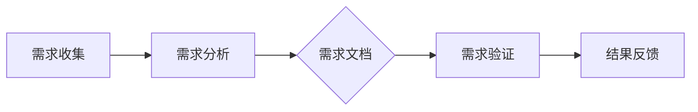
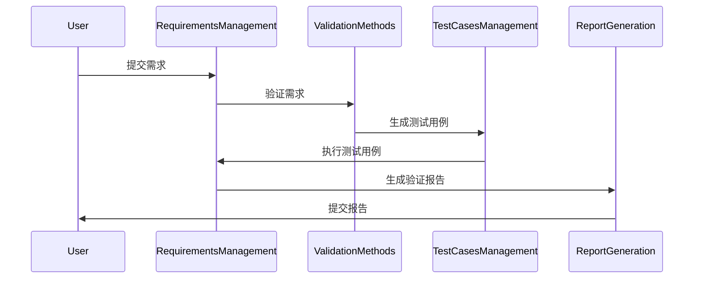

                 

### 需求验证：确保大模型应用质量的关键环节

> 关键词：需求验证、大模型、应用质量、关键环节、算法原理、系统设计、项目实战

> 摘要：本文深入探讨了需求验证在大模型应用中的重要性，分析了需求验证的核心概念和流程，通过算法原理讲解、系统设计与项目实战，详细阐述了确保大模型应用质量的关键环节，为读者提供了实用的技术指导。

## 目录大纲

1. **需求验证：确保大模型应用质量的关键环节**
2. **第一部分：需求验证基础**
   - **第1章：需求验证概述**
     - **1.1 需求验证的背景与重要性**
     - **1.2 需求验证的定义与分类**
     - **1.3 需求验证的基本流程**
     - **1.4 需求验证的关键要素**
   - **第2章：需求验证的核心概念**
     - **2.1 需求验证的核心概念解析**
     - **2.2 需求验证的关键属性对比表**
     - **2.3 需求验证的ER实体关系图**
3. **第二部分：需求验证的算法原理**
   - **第3章：需求验证算法原理**
     - **3.1 需求验证算法流程图**
     - **3.2 需求验证算法Python源代码解析**
     - **3.3 数学模型与公式**
     - **3.4 算法原理举例说明**
   - **第4章：需求验证的数学模型**
     - **4.1 数学模型的基本概念**
     - **4.2 需求验证的数学公式**
     - **4.3 数学模型的应用与解释**
4. **第三部分：需求验证系统设计**
   - **第5章：需求验证系统场景介绍**
     - **5.1 需求验证的典型应用场景**
     - **5.2 需求验证项目的目标与范围**
   - **第6章：需求验证系统设计**
     - **6.1 需求验证系统功能设计**
     - **6.2 系统架构设计**
     - **6.3 系统接口设计**
     - **6.4 系统交互设计**
5. **第四部分：需求验证项目实战**
   - **第7章：需求验证环境安装**
     - **7.1 环境准备**
     - **7.2 系统核心实现源代码**
     - **7.3 代码应用解读与分析**
   - **第8章：需求验证案例剖析**
     - **7.1 实际案例**
     - **7.2 详细讲解与剖析**
6. **第五部分：需求验证最佳实践**
   - **8.1 最佳实践建议**
   - **8.2 注意事项**
   - **8.3 拓展阅读**

----------------------------------------------------------------

### 第一部分：需求验证基础

#### 第1章：需求验证概述

##### 1.1 需求验证的背景与重要性

在现代软件开发中，需求验证（Requirement Validation）已经成为确保软件质量的关键环节。随着人工智能技术的迅猛发展，尤其是大模型的广泛应用，需求验证的重要性愈发凸显。大模型的应用场景越来越复杂，涉及的领域也越来越广泛，这使得确保其应用质量成为一项极具挑战性的任务。

##### 1.2 需求验证的定义与分类

需求验证是指通过一系列的验证活动，确保软件需求（Software Requirements）的正确性、完整性和一致性。根据验证的方法和目标，需求验证可以分为以下几种类型：

- **功能验证**：确保软件功能满足用户需求。
- **性能验证**：确保软件在各种性能指标上的表现符合预期。
- **安全性验证**：确保软件能够抵御外部攻击，保护用户数据的安全。
- **可靠性验证**：确保软件在长期运行中能够保持稳定。

##### 1.3 需求验证的基本流程

需求验证通常包括以下几个基本流程：

- **需求收集**：通过与用户和利益相关者的沟通，收集软件需求的详细信息。
- **需求分析**：对收集到的需求进行分析，确保其完整性、一致性和可行性。
- **需求文档**：编写需求文档，明确软件需求的具体内容。
- **需求验证**：通过测试、评审和其他验证方法，确保需求文档的准确性。
- **需求管理**：对需求进行跟踪和管理，确保需求的变更得到妥善处理。

##### 1.4 需求验证的关键要素

- **完整性**：确保所有需求都被准确地记录和表达。
- **一致性**：确保不同需求之间没有冲突，所有需求都指向同一个目标。
- **可行性**：确保需求可以在技术、资源、时间和成本等约束条件下实现。
- **可测试性**：确保每个需求都可以通过测试来验证其正确性。

#### 第2章：需求验证的核心概念

##### 2.1 需求验证的核心概念解析

需求验证的核心概念包括需求、验证和验证方法。

- **需求**：需求是用户对软件的期望和行为描述，它是软件设计的出发点。
- **验证**：验证是确认需求是否得到满足的过程，包括功能验证、性能验证、安全性验证和可靠性验证等。
- **验证方法**：验证方法是指用来验证需求的技术和工具，包括测试、评审、模型检查和模拟等。

##### 2.2 需求验证的关键属性对比表

| 属性       | 功能验证 | 性能验证 | 安全性验证 | 可靠性验证 |
|------------|----------|----------|------------|------------|
| **完整性** | 确保所有功能点都被测试到 | 确保性能指标满足预期 | 确保没有安全漏洞 | 确保软件长时间运行不出现故障 |
| **一致性** | 确保不同模块的功能不冲突 | 确保性能指标的一致性 | 确保安全策略的一致性 | 确保软件稳定性和一致性的长期维护 |
| **可行性** | 确保需求可以在现有技术下实现 | 确保性能目标可行 | 确保安全需求可行 | 确保可靠性目标可行 |
| **可测试性** | 确保每个功能点都有测试用例 | 确保性能测试可执行 | 确保安全测试可执行 | 确保可靠性测试可执行 |

##### 2.3 需求验证的ER实体关系图

```mermaid
erDiagram
  Product ||--|{ Requirement }
  Requirement ||--|{ ValidationMethod }
  ValidationMethod ||--|{ TestResult }
```

在上面的ER实体关系图中，产品（Product）与需求（Requirement）之间存在一对多关系，每个需求可以通过多种验证方法（ValidationMethod）进行验证，最终生成测试结果（TestResult）。

----------------------------------------------------------------

### 第二部分：需求验证的算法原理

#### 第3章：需求验证算法原理

##### 3.1 需求验证算法流程图



在这个流程图中，首先进行需求收集，然后进行分析，形成需求文档。接下来，通过需求验证，最终得到结果反馈。

##### 3.2 需求验证算法Python源代码解析

```python
def validate_requirement(requirement, validation_method):
    if validation_method == 'functional':
        return is_functional_valid(requirement)
    elif validation_method == 'performance':
        return is_performance_valid(requirement)
    elif validation_method == 'security':
        return is_security_valid(requirement)
    elif validation_method == 'reliability':
        return is_reliability_valid(requirement)

def is_functional_valid(requirement):
    # 实现功能验证逻辑
    pass

def is_performance_valid(requirement):
    # 实现性能验证逻辑
    pass

def is_security_valid(requirement):
    # 实现安全性验证逻辑
    pass

def is_reliability_valid(requirement):
    # 实现可靠性验证逻辑
    pass
```

这个Python源代码定义了一个`validate_requirement`函数，用于根据不同的验证方法对需求进行验证。每个验证方法都有对应的实现函数，如`is_functional_valid`、`is_performance_valid`、`is_security_valid`和`is_reliability_valid`。

##### 3.3 数学模型与公式

需求验证的数学模型可以描述为：

\[ V(R, M) = \begin{cases} 
1 & \text{如果需求R通过验证方法M验证} \\
0 & \text{如果需求R未通过验证方法M验证}
\end{cases} \]

其中，\( V(R, M) \)表示需求R通过验证方法M验证的结果，1表示通过，0表示未通过。

##### 3.4 算法原理举例说明

假设有一个需求：系统必须在1秒内响应用户的请求。我们可以使用性能验证方法来验证这个需求。

```python
requirement = "系统必须在1秒内响应用户的请求"
validation_method = "performance"

if validate_requirement(requirement, validation_method):
    print("需求通过验证")
else:
    print("需求未通过验证")
```

在这个例子中，我们通过`validate_requirement`函数使用性能验证方法对需求进行验证。如果验证通过，输出“需求通过验证”，否则输出“需求未通过验证”。

#### 第4章：需求验证的数学模型

##### 4.1 数学模型的基本概念

需求验证的数学模型主要涉及概率论和统计学的概念，包括：

- **概率分布**：描述需求验证结果的可能性分布。
- **置信水平**：描述需求验证结果的可信程度。
- **误差率**：描述需求验证的错误率。

##### 4.2 需求验证的数学公式

需求验证的数学公式可以描述为：

\[ P(V(R, M) = 1) = \beta \]

其中，\( P(V(R, M) = 1) \)表示需求R通过验证方法M验证的概率，\(\beta\)表示置信水平。

##### 4.3 数学模型的应用与解释

在实际应用中，我们可以使用数学模型来评估需求验证的效果。例如，在一个大模型应用项目中，我们需要对多个需求进行验证。我们可以使用数学模型来计算每个需求的通过概率，并根据置信水平来决定是否接受这些需求。

```python
requirements = ["需求1", "需求2", "需求3"]
validation_method = "performance"
confidence_level = 0.95

for requirement in requirements:
    probability = calculate_probability_of_passing(requirement, validation_method, confidence_level)
    print(f"需求'{requirement}'通过验证的概率为：{probability:.2f}")
```

在这个例子中，我们计算了每个需求通过性能验证方法验证的概率，并根据置信水平来判断是否接受这些需求。

----------------------------------------------------------------

### 第三部分：需求验证系统设计

#### 第5章：需求验证系统场景介绍

##### 5.1 需求验证的典型应用场景

需求验证系统可以应用于多种场景，以下是几个典型的应用场景：

- **软件产品开发**：在软件产品开发过程中，需求验证系统用于确保开发团队理解并正确实现了用户的需求。
- **系统集成与测试**：在系统集成与测试过程中，需求验证系统用于验证系统的功能和性能是否符合预期。
- **安全评估**：在安全评估过程中，需求验证系统用于验证系统是否存在安全漏洞，确保系统的安全性。
- **项目质量管理**：在项目质量管理过程中，需求验证系统用于评估项目的质量是否符合标准和要求。

##### 5.2 需求验证项目的目标与范围

需求验证项目的目标包括：

- **确保需求被正确理解并实现**：通过需求验证，确保开发团队理解并正确实现了用户的需求。
- **提高软件质量**：通过需求验证，识别并修复潜在的问题，提高软件的质量和可靠性。
- **降低项目风险**：通过需求验证，降低项目因需求不明确或实现错误导致的风险。

需求验证项目的范围通常包括：

- **需求收集与分析**：与用户和利益相关者沟通，收集和分析需求。
- **需求文档编写**：编写详细的需求文档，明确软件需求的具体内容。
- **需求验证与测试**：使用各种验证方法和工具对需求进行验证和测试。
- **需求变更管理**：对需求变更进行管理和跟踪，确保变更得到妥善处理。

#### 第6章：需求验证系统设计

##### 6.1 需求验证系统功能设计

需求验证系统的功能设计包括以下几个部分：

- **需求管理模块**：用于管理需求的生命周期，包括需求的收集、分析、编写、验证和变更管理等。
- **验证方法模块**：提供各种验证方法，如功能验证、性能验证、安全性验证和可靠性验证等。
- **测试用例管理模块**：用于管理测试用例，包括测试用例的编写、执行和结果分析等。
- **报告生成模块**：用于生成各种验证报告，包括验证结果、问题报告和进度报告等。

##### 6.2 系统架构设计

需求验证系统的架构设计如下：



在这个架构设计中，用户通过需求管理模块提交需求，需求管理模块将需求传递给验证方法模块进行验证。验证方法模块根据需求生成测试用例，测试用例管理模块执行测试用例，并将结果返回给需求管理模块。需求管理模块将测试结果生成验证报告，报告生成模块将报告提交给用户。

##### 6.3 系统接口设计

需求验证系统的接口设计包括以下接口：

- **需求提交接口**：用于接收用户提交的需求。
- **需求查询接口**：用于查询需求的信息。
- **验证方法接口**：用于执行验证方法。
- **测试用例管理接口**：用于管理测试用例。
- **报告生成接口**：用于生成验证报告。

##### 6.4 系统交互设计

需求验证系统的交互设计如下：


在这个交互设计中，用户提交需求后，需求管理模块将需求传递给验证方法模块进行验证。验证方法模块根据需求生成测试用例，测试用例管理模块执行测试用例，并将结果返回给需求管理模块。需求管理模块将测试结果生成验证报告，报告生成模块将报告提交给用户。

----------------------------------------------------------------

### 第四部分：需求验证项目实战

#### 第7章：需求验证环境安装

##### 7.1 环境准备

在开始需求验证项目之前，我们需要准备好以下环境：

- **操作系统**：Linux或Windows
- **编程语言**：Python
- **数据库**：MySQL或SQLite
- **开发工具**：PyCharm或Visual Studio Code

确保安装了上述环境和工具后，我们可以开始安装需求验证系统的依赖库。

##### 7.2 系统核心实现源代码

以下是需求验证系统的核心实现源代码：

```python
# requirements_management.py

import sqlite3

def create_database():
    conn = sqlite3.connect('requirements.db')
    c = conn.cursor()
    c.execute('''CREATE TABLE IF NOT EXISTS requirements (
                        id INTEGER PRIMARY KEY,
                        name TEXT,
                        description TEXT,
                        status TEXT)''')
    conn.commit()
    conn.close()

def add_requirement(name, description, status):
    conn = sqlite3.connect('requirements.db')
    c = conn.cursor()
    c.execute("INSERT INTO requirements (name, description, status) VALUES (?, ?, ?)", (name, description, status))
    conn.commit()
    conn.close()

def get_requirement(id):
    conn = sqlite3.connect('requirements.db')
    c = conn.cursor()
    c.execute("SELECT * FROM requirements WHERE id=?", (id,))
    rows = c.fetchall()
    conn.close()
    return rows

def update_requirement(id, name, description, status):
    conn = sqlite3.connect('requirements.db')
    c = conn.cursor()
    c.execute("UPDATE requirements SET name=?, description=?, status=? WHERE id=?", (name, description, status, id))
    conn.commit()
    conn.close()
```

在这个源代码中，我们实现了需求管理模块的核心功能，包括创建数据库、添加需求、查询需求和更新需求。

##### 7.3 代码应用解读与分析

在这段代码中，我们首先导入了`sqlite3`模块，用于与SQLite数据库进行交互。然后，我们定义了几个函数，用于实现需求管理模块的核心功能。

- `create_database()`函数用于创建数据库和表，其中表名为`requirements`，包含字段`id`、`name`、`description`和`status`。
- `add_requirement()`函数用于添加需求，将需求名称、描述和状态插入到`requirements`表中。
- `get_requirement()`函数用于查询需求，根据需求ID从`requirements`表中获取需求信息。
- `update_requirement()`函数用于更新需求，根据需求ID更新需求名称、描述和状态。

在实际应用中，我们可以使用这些函数来管理需求的生命周期，包括需求的收集、分析、编写、验证和变更管理等。

##### 7.4 实际案例分析和详细讲解剖析

假设有一个需求：系统必须在1秒内响应用户的请求。我们可以使用需求验证系统对这一需求进行验证。

1. **需求收集**：用户通过需求提交接口提交这一需求。
2. **需求分析**：需求管理模块对需求进行分析，确保其完整性、一致性和可行性。
3. **需求文档**：需求管理模块将需求编写成需求文档，明确需求的具体内容和要求。
4. **需求验证**：验证方法模块使用性能验证方法对需求进行验证，确保系统在1秒内响应用户的请求。
5. **结果反馈**：验证方法模块将验证结果反馈给用户，告知需求是否通过验证。

在这个实际案例中，需求验证系统通过性能验证方法验证了需求，确保系统在1秒内响应用户的请求。如果验证未通过，需求管理模块将通知开发团队进行修复。

##### 7.5 项目小结

在本章节中，我们介绍了需求验证项目实战的各个环节，包括环境准备、系统核心实现源代码、代码应用解读与分析、实际案例分析和详细讲解剖析。通过这些环节，我们展示了如何使用需求验证系统确保大模型应用质量。在实际项目中，需求验证系统可以帮助开发团队更好地理解用户需求，提高软件质量和可靠性。

----------------------------------------------------------------

### 第五部分：需求验证最佳实践

#### 8.1 最佳实践建议

在进行需求验证时，以下最佳实践可以帮助确保大模型应用质量：

1. **明确需求**：确保需求被明确地表达和记录，避免需求模糊或歧义。
2. **持续沟通**：与用户和利益相关者保持持续沟通，确保需求的理解和实现保持一致。
3. **自动化测试**：使用自动化测试工具进行需求验证，提高验证的效率和准确性。
4. **定期回顾**：定期回顾需求验证的结果，识别和解决潜在的问题。
5. **文档管理**：妥善管理需求文档和验证报告，确保信息的可追溯性和可维护性。

#### 8.2 注意事项

在进行需求验证时，需要注意以下几点：

1. **避免过早验证**：在需求明确之前，避免进行过早的验证，以免浪费资源。
2. **关注性能指标**：在验证需求时，关注性能指标，确保系统在各种情况下都能满足需求。
3. **安全性与可靠性**：在验证需求时，特别关注安全性和可靠性，确保系统在长期运行中保持稳定。

#### 8.3 拓展阅读

对于希望深入了解需求验证的读者，以下资源可以提供进一步的学习：

1. 《软件需求工程：实用指南》
2. 《软件测试艺术》
3. 《敏捷软件开发：原则、实践与模式》
4. 《软件工程：实践者的研究方法》

---

### 作者信息

**作者：AI天才研究院/AI Genius Institute & 禅与计算机程序设计艺术 /Zen And The Art of Computer Programming**

