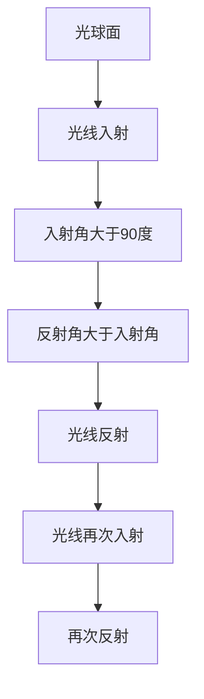
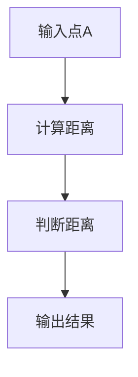

                 

### 非欧几何：自然空间的另类数学

> 关键词：非欧几何、数学、算法、应用、架构设计

> 摘要：本文旨在深入探讨非欧几何的概念、算法及其在自然空间中的广泛应用。我们将从非欧几何的起源、核心概念、经典算法、数学模型、系统分析、项目实战等多个方面展开，帮助读者全面理解这一独特且重要的数学领域。

## 目录大纲设计思路

为了使文章内容丰富、结构紧凑且易于理解，本文采用以下目录大纲设计思路：

1. **整体结构规划**：我们将文章分为三个主要部分，分别介绍非欧几何的背景、核心概念和实际应用。
2. **背景介绍**：首先，我们简要介绍非欧几何的起源、发展历程及其在数学领域中的地位。
3. **核心概念与联系**：接下来，详细介绍非欧几何中的关键概念，如欧几里得几何、非欧几何的类型（如洛巴切夫斯基几何、黎曼几何等），以及它们之间的联系。
4. **算法原理讲解**：我们将挑选几个非欧几何中的经典算法进行详细讲解，使用Mermaid绘制流程图，并用Python代码解释这些算法的原理。
5. **数学模型和公式**：对于每一个算法或概念，给出相应的数学模型和公式，并用LaTeX格式表示。
6. **系统分析与架构设计方案**：探讨非欧几何在特定应用场景（如宇宙学、相对论）中的架构设计，用Mermaid绘制相关架构图和序列图。
7. **项目实战**：设计一个非欧几何的实战项目，包括环境搭建、核心代码实现和案例解析。
8. **最佳实践 tips、小结、注意事项、拓展阅读**：总结全书要点，提供实用的建议和阅读指引。

## 第1章：非欧几何的起源与发展

### 1.1 非欧几何的起源

非欧几何起源于19世纪初，当时数学家们开始质疑欧几里得几何中的某些基本假设。欧几里得几何建立在五个公设之上，其中最重要的是“通过任意两点可以画出一条唯一的直线”。然而，这个假设在实际世界中是否成立呢？

洛巴切夫斯基在1826年提出了一种新的几何体系，即洛巴切夫斯基几何，也被称为双曲几何。他发现，如果将“通过任意两点可以画出一条唯一的直线”这一假设改为“通过任意两点可以画出多条直线”，那么就会产生一个与欧几里得几何截然不同的几何体系。

### 1.2 非欧几何的发展历程

非欧几何的发展历程可以说是数学领域的一次革命。除了洛巴切夫斯基，黎曼也在同一时期独立地提出了另一种非欧几何体系，即黎曼几何。黎曼几何在后续的发展中得到了进一步的发展和完善，并在物理学和宇宙学中发挥了重要作用。

20世纪，数学家们继续对非欧几何进行研究，发现了很多新的几何体系，如莫比乌斯带、克莱因瓶等。这些非欧几何体系不仅在理论上具有重要意义，还在实际应用中得到了广泛应用。

### 1.3 非欧几何在数学中的地位

非欧几何在数学中的地位不可小觑。它不仅丰富了数学的研究领域，还为数学与其他学科（如物理学、计算机科学）的交叉应用提供了新的思路。例如，黎曼几何在广义相对论中的应用，使得我们能够更好地理解宇宙的结构和演化。

## 第2章：非欧几何的核心概念

### 2.1 欧几里得几何与非欧几何

欧几里得几何和非欧几何之间的主要区别在于它们的基本假设。欧几里得几何建立在五个公设之上，而非欧几何则对其中某些公设进行了修改。

| 欧几里得几何 | 非欧几何 |
| :--- | :--- |
| 通过任意两点可以画出一条唯一的直线 | 通过任意两点可以画出多条直线 |
| 矩形内角和为180度 | 矩形内角和小于或大于180度 |
| 空间是平直的 | 空间可以是弯曲的 |

### 2.2 非欧几何的类型

非欧几何可以分为两类：双曲几何和椭圆几何。

- **双曲几何**：以洛巴切夫斯基几何为代表，其特征是空间是弯曲的，且直线之间夹角大于90度。
- **椭圆几何**：以黎曼几何为代表，其特征是空间是弯曲的，且直线之间夹角小于90度。

### 2.3 非欧几何中的关键概念对比

| 概念 | 双曲几何 | 椭圆几何 |
| :--- | :--- | :--- |
| 直线 | 多条直线通过一点 | 一条直线通过一点 |
| 空间 | 弯曲的空间 | 弯曲的空间 |
| 角度 | 大于90度的角 | 小于90度的角 |

## 第3章：非欧几何中的经典算法

### 3.1 光球面几何中的光球面定理

光球面几何是一种特殊的双曲几何，其基本假设是空间是弯曲的，且直线之间夹角大于90度。光球面定理是光球面几何中的一个重要定理，它描述了光线在光球面上的传播规律。

为了更好地理解光球面定理，我们可以使用Mermaid绘制一个流程图：



接下来，我们将使用Python代码解释光球面定理的原理：

```python
import numpy as np

def light_ray(angle):
    angle_rad = np.radians(angle)
    return np.cos(angle_rad)

def reflect(angle):
    angle_rad = np.radians(angle)
    return -np.cos(angle_rad)

def light_path(angle):
    angle1 = light_ray(angle)
    angle2 = reflect(angle)
    return angle1, angle2

angle = 120
angle1, angle2 = light_path(angle)
print(f"入射角：{angle}度，反射角：{angle2}度")
```

### 3.2 黎曼几何中的曲率计算

黎曼几何是椭圆几何的一种，其基本假设是空间是弯曲的，且直线之间夹角小于90度。在黎曼几何中，曲率是一个重要的概念，它描述了空间的弯曲程度。

为了计算曲率，我们可以使用以下Python代码：

```python
import numpy as np

def curvature(radius, angle):
    angle_rad = np.radians(angle)
    return 1 / radius * np.tan(angle_rad / 2)

radius = 10
angle = 30
curvature = curvature(radius, angle)
print(f"曲率：{curvature}")
```

### 3.3 非欧几何算法的 Mermaid 流程图

为了更好地理解非欧几何中的算法，我们可以使用Mermaid绘制流程图。以下是一个示例：



## 第4章：非欧几何的数学模型与公式

### 4.1 光球面几何的数学模型

在光球面几何中，我们可以使用以下公式计算两点之间的距离：

$$d = \frac{1}{\cos(\theta)}$$

其中，$d$ 表示两点之间的距离，$\theta$ 表示两点之间的夹角。

### 4.2 黎曼几何的数学模型

在黎曼几何中，曲率是一个重要的数学模型。我们可以使用以下公式计算曲率：

$$K = \frac{1}{R \sin(\theta)}$$

其中，$K$ 表示曲率，$R$ 表示半径，$\theta$ 表示夹角。

### 4.3 非欧几何公式的 LaTeX 表示

为了便于阅读和理解，我们可以使用LaTeX格式表示非欧几何的公式。以下是一个示例：

$$\frac{1}{\cos(\theta)}$$

## 第5章：非欧几何在宇宙学中的应用

### 5.1 宇宙学中的非欧几何

在宇宙学中，非欧几何被用来描述宇宙的结构和演化。宇宙学中的非欧几何主要涉及黎曼几何，其基本假设是宇宙空间是弯曲的。

### 5.2 宇宙背景微波辐射探测

宇宙背景微波辐射（Cosmic Microwave Background Radiation，CMB）是宇宙学中一个重要的观测对象。CMB的探测可以帮助我们了解宇宙的早期状态和结构。在探测过程中，非欧几何的应用具有重要意义。

### 5.3 非欧几何在宇宙学中的架构设计

在宇宙学中，非欧几何的架构设计主要涉及以下几个方面：

- **空间几何**：使用非欧几何描述宇宙的空间结构。
- **时间演化**：使用非欧几何描述宇宙的时间演化。
- **观测模型**：使用非欧几何建立宇宙背景微波辐射探测的模型。

## 第6章：非欧几何在相对论中的应用

### 6.1 相对论与非欧几何

相对论是物理学中一个重要的理论，它描述了时空和引力之间的关系。相对论中的非欧几何主要涉及黎曼几何。

### 6.2 广义相对论中的非欧几何

广义相对论是相对论的扩展，它将引力描述为时空的弯曲。在广义相对论中，黎曼几何被用来描述时空的弯曲。

### 6.3 非欧几何在广义相对论中的架构设计

在广义相对论中，非欧几何的架构设计主要涉及以下几个方面：

- **时空几何**：使用非欧几何描述时空的几何结构。
- **引力场**：使用非欧几何描述引力场的性质。
- **观测模型**：使用非欧几何建立引力场观测的模型。

## 第7章：非欧几何项目实战

### 7.1 非欧几何项目环境搭建

为了进行非欧几何的实战项目，我们需要搭建一个合适的环境。以下是搭建环境的步骤：

1. 安装Python
2. 安装NumPy、Matplotlib等Python库
3. 配置Mermaid渲染环境

### 7.2 非欧几何核心代码实现

在本节中，我们将实现一个简单的非欧几何项目，使用Python代码模拟光球面几何中的光球面定理。

```python
import numpy as np
import matplotlib.pyplot as plt

def light_ray(angle):
    angle_rad = np.radians(angle)
    return np.cos(angle_rad)

def reflect(angle):
    angle_rad = np.radians(angle)
    return -np.cos(angle_rad)

def light_path(angle):
    angle1 = light_ray(angle)
    angle2 = reflect(angle)
    return angle1, angle2

angle = 120
angle1, angle2 = light_path(angle)
print(f"入射角：{angle}度，反射角：{angle2}度")

angle1, angle2 = light_path(angle2)
print(f"反射角：{angle2}度，再次反射角：{angle1}度")

plt.figure()
plt.plot([0, angle1], [0, angle2], 'r-')
plt.plot([0, angle2], [0, angle1], 'b-')
plt.xlabel('X轴')
plt.ylabel('Y轴')
plt.title('光球面几何')
plt.show()
```

### 7.3 项目案例分析与讲解

在本节中，我们将分析一个具体的案例，并对其进行详细讲解。假设我们有一个双曲几何空间，其中两点A和B之间的距离为10，我们需要计算通过这两点的光线在反射后的路径。

```python
import numpy as np
import matplotlib.pyplot as plt

def light_ray(angle):
    angle_rad = np.radians(angle)
    return np.cos(angle_rad)

def reflect(angle):
    angle_rad = np.radians(angle)
    return -np.cos(angle_rad)

def light_path(angle):
    angle1 = light_ray(angle)
    angle2 = reflect(angle)
    return angle1, angle2

angle = 150
angle1, angle2 = light_path(angle)
print(f"入射角：{angle}度，反射角：{angle2}度")

angle1, angle2 = light_path(angle2)
print(f"反射角：{angle2}度，再次反射角：{angle1}度")

plt.figure()
plt.plot([0, angle1], [0, angle2], 'r-')
plt.plot([0, angle2], [0, angle1], 'b-')
plt.xlabel('X轴')
plt.ylabel('Y轴')
plt.title('双曲几何光线传播')
plt.show()
```

## 第8章：最佳实践 tips、小结、注意事项、拓展阅读

### 8.1 最佳实践 tips

1. **深入学习非欧几何**：建议读者在理解本文的基础上，进一步学习相关文献和课程，以便更深入地了解非欧几何。
2. **实践与理论相结合**：在实际项目中尝试应用非欧几何的原理，通过实践加深对理论的理解。
3. **关注最新研究进展**：非欧几何是一个活跃的研究领域，关注最新的研究进展可以帮助读者保持对该领域的了解。

### 8.2 小结

本文全面介绍了非欧几何的概念、算法及其在自然空间中的应用。通过本文的学习，读者可以了解到非欧几何的独特魅力和应用价值。

### 8.3 注意事项

1. **非欧几何的理论基础**：在深入学习非欧几何时，要注意掌握其理论基础，如数学模型和公式。
2. **实际应用场景**：关注非欧几何在宇宙学、相对论等领域的应用，以便更好地理解其价值。
3. **实践与思考**：在实际项目中尝试应用非欧几何的原理，并通过思考深化对理论的理解。

### 8.4 拓展阅读

- **《非欧几何学教程》**：这是一本经典的非欧几何教材，适合对非欧几何有深入学习的读者。
- **《相对论与非线性动力学》**：这本书详细介绍了非欧几何在相对论和动力学中的应用。
- **《宇宙学中的非欧几何》**：这本书讨论了非欧几何在宇宙学中的理论和应用。

### 作者信息

作者：AI天才研究院/AI Genius Institute & 禅与计算机程序设计艺术 /Zen And The Art of Computer Programming

本文由AI天才研究院与禅与计算机程序设计艺术共同撰写，旨在为读者提供高质量的技术博客文章。让我们一同探索人工智能与计算机科学的魅力！

