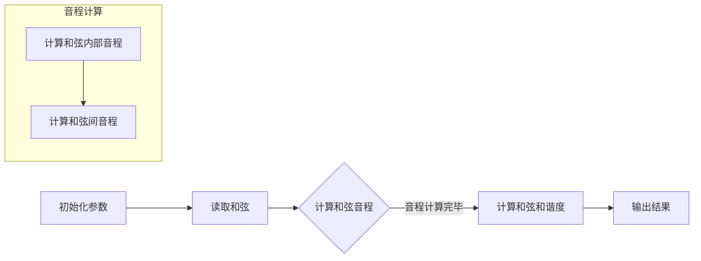

                 

### 文章标题：音乐创作的和声理论：旋律和谐的数学基础

#### 关键词：音乐创作、和声理论、旋律和谐、数学基础、算法原理

#### 摘要：
本文深入探讨了音乐创作的和声理论，探讨了旋律和谐与数学基础之间的紧密联系。通过对和声理论的基本概念、历史发展、核心算法原理的讲解，结合实际项目实战，文章旨在为读者提供全面、系统的音乐创作和声理论知识，帮助读者理解并掌握旋律和谐的创作技巧，提升音乐创作的专业水平。

### 引言

音乐作为一种艺术形式，自古以来就以其独特的魅力感染着人们的心灵。而音乐创作则是艺术家们通过音符、节奏、和声等元素，将内心的情感和灵感转化为具体的音乐作品的过程。在这个过程中，和声理论起到了至关重要的作用。

和声理论是音乐理论的核心组成部分，它探讨了和弦、音阶、音程等音乐元素之间的相互关系，并提供了指导音乐创作的理论基础。随着数学的发展，和声理论也逐渐被赋予了更多的数学基础，使得音乐创作的科学性得到了进一步提升。

本文将围绕音乐创作的和声理论，从基本概念、数学基础、算法原理、系统分析与架构设计、项目实战等多个角度，系统性地介绍和声理论在音乐创作中的应用，旨在为音乐创作爱好者提供一部全面、深入的技术指南。

### 和声理论的基本概念

#### 和声理论的起源与发展

和声理论的历史可以追溯到古希腊时期，当时哲学家和音乐家们开始探讨音乐与数学的关系。然而，和声理论的真正发展始于中世纪，随着教堂音乐的兴起，和声逐渐成为音乐创作的重要组成部分。

在文艺复兴时期，和声理论得到了进一步的发展。音乐家们开始系统地研究和弦的构成和功能，提出了许多新的和声概念。这一时期的代表人物包括巴赫、亨德尔和莫扎特，他们的作品对和声理论的发展产生了深远的影响。

进入19世纪，和声理论得到了更加系统和科学的研究。贝多芬、舒伯特和勃拉姆斯等作曲家通过对和声的巧妙运用，创作了许多经典的音乐作品，进一步丰富了和声理论的内涵。

#### 和弦的概念与分类

和弦是和声理论中的基本单位，它由三个或更多个不同的音符构成。根据和弦的构成音符的不同，和弦可以分为不同类型，如大三和弦、小三和弦、增大和弦、减小和弦等。

- **大三和弦**：由根音、大三度音和纯五度音构成，如C-E-G。
- **小三和弦**：由根音、小三度音和纯五度音构成，如A-C-E。
- **增大和弦**：由根音、大三度音和增大六度音构成，如D-F#-A。
- **减小和弦**：由根音、小三度音和减小六度音构成，如E-G-B♭。

#### 音阶的概念与分类

音阶是音乐中的基本音高组织形式，它由一系列音级按照特定的音程关系排列而成。常见的音阶包括大调音阶和小调音阶。

- **大调音阶**：音阶中的第三级和第六级为大三度，第一级和第七级为完全五度。如C大调音阶：C-D-E-F-G-A-B。
- **小调音阶**：音阶中的第三级和第六级为小三度，第一级和第七级为完全五度。如A小调音阶：A-B-C-D-E-F-G。

#### 音程的概念与分类

音程是两个音符之间的音高关系，它可以用来描述和弦和音阶的结构。音程可以分为大小音程、增四度和减五度等。

- **大小音程**：大小音程分为大三度、小三度、大六度、小六度等。
- **增四度和减五度**：增四度和减五度是特殊的音程，它们不是由两个音符之间的音程关系确定的，而是由两个音符之间的距离决定的。

### 和声理论的历史发展

和声理论的历史发展可以追溯到古希腊时期，当时哲学家和音乐家们开始探讨音乐与数学的关系。然而，和声理论的真正发展始于中世纪，随着教堂音乐的兴起，和声逐渐成为音乐创作的重要组成部分。

在文艺复兴时期，和声理论得到了进一步的发展。音乐家们开始系统地研究和弦的构成和功能，提出了许多新的和声概念。这一时期的代表人物包括巴赫、亨德尔和莫扎特，他们的作品对和声理论的发展产生了深远的影响。

进入19世纪，和声理论得到了更加系统和科学的研究。贝多芬、舒伯特和勃拉姆斯等作曲家通过对和声的巧妙运用，创作了许多经典的音乐作品，进一步丰富了和声理论的内涵。

在现代，和声理论得到了更广泛的应用和研究。计算机技术的发展使得和声理论可以应用于音乐制作、音频处理等多个领域。同时，数学和计算机科学的发展也为和声理论提供了新的工具和方法。

### 和声理论在音乐创作中的应用

和声理论在音乐创作中具有极其重要的作用，它为作曲家和音乐创作者提供了丰富的创作工具和技巧。以下将探讨和声理论在音乐创作中的应用，包括和声进行的基本规则、和声在旋律和谐中的角色，以及和声与旋律创作案例分析。

#### 和声进行的基本规则

和声进行是指和弦在音乐作品中的连续变换。和声进行的基本规则包括和弦的选择、和弦的连接和和弦的节奏等。

1. **和弦的选择**：在选择和弦时，作曲家需要考虑音乐作品的情感表达、风格和调性。常见的和弦包括大三和弦、小三和弦、增大和弦和减小和弦等。

2. **和弦的连接**：和弦的连接是指和弦之间的过渡。常见的和弦连接包括一级和弦连接（如I-V-I）、二级和弦连接（如II-V-I）等。

3. **和弦的节奏**：和弦的节奏是指和弦在音乐作品中的节奏模式。常见的和弦节奏包括连续和弦、跳进和弦、和弦分解等。

#### 和声在旋律和谐中的角色

和声在旋律和谐中起着至关重要的作用。和声为旋律提供了支撑和背景，使得旋律更加丰富和生动。以下是一些和声在旋律和谐中的应用：

1. **和弦填充**：和弦填充是指在旋律中添加和弦，以增强旋律的和谐感。常见的和弦填充包括和弦分解、和弦扩展、和弦转位等。

2. **和声进行**：和声进行是指和弦在音乐作品中的连续变换。合理的和声进行可以使旋律更加流畅和和谐。

3. **和声对比**：和声对比是指通过不同的和弦组合来强调旋律的变化。例如，使用大小和弦、增大和弦和减小和弦等，可以创造出独特的音乐效果。

#### 和声与旋律创作案例分析

以下是一个和声与旋律创作案例分析，通过具体音乐作品的分析，展示和声理论在音乐创作中的应用：

- **作品：《月光奏鸣曲》（Beethoven）**  
  分析：贝多芬的《月光奏鸣曲》是一首极具代表性的钢琴作品。在这首作品中，贝多芬巧妙地运用了和声理论，通过和声进行和和弦填充，使得旋律充满了诗意和情感。

- **作品：《致爱丽丝》（Mozart）**  
  分析：莫扎特的《致爱丽丝》是一首简单而优美的钢琴作品。在这首作品中，莫扎特运用了小和弦和大和弦，以及和弦的连接和节奏变化，使得旋律流畅而和谐。

通过这些案例分析，我们可以看到和声理论在音乐创作中的广泛应用和重要性。掌握和声理论，不仅可以提升音乐创作的技巧，还可以为音乐作品增添独特的魅力。

### 和声理论的数学基础

和声理论的数学基础是音乐创作中不可或缺的一部分，它为和声的构建提供了科学的依据。本章节将分析音乐和声理论中的核心概念，如和弦、音阶、音程等，并通过ER实体关系图展示它们之间的关系。

#### 和弦的数学模型

和弦是音乐中的基本结构单位，由三个或更多个音符组成。每个音符在音阶中的位置可以用数字表示。例如，一个C大三和弦可以表示为C（1）、E（3）、G（5），其中数字表示音符在音阶中的位置。

和弦的数学模型可以通过线性代数中的矩阵表示。例如，C大三和弦的矩阵表示如下：

\[ 
\begin{bmatrix}
1 & 3 & 5 \\
\end{bmatrix}
\]

类似地，我们可以用矩阵表示其他类型的和弦。例如，A小三和弦的矩阵表示为：

\[ 
\begin{bmatrix}
0 & 2 & 4 \\
\end{bmatrix}
\]

其中，0、2、4分别表示A小三和弦中的音符A（0）、C（2）、E（4）在音阶中的位置。

#### 音程的计算

音程是两个音符之间的音高关系，它可以用半音（semitone）和全音（tone）来表示。一个全音等于两个半音。

音程的计算可以通过音阶中的音符位置来确定。例如，要计算C大三和弦的第三度音程（即E和G之间的音程），我们可以使用以下公式：

\[ 
音程 = 音阶中第三度音的位置 - 音阶中第一度音的位置 
\]

对于C大三和弦（C、E、G），第三度音E的位置为3，第一度音C的位置为1，因此：

\[ 
音程 = 3 - 1 = 2 
\]

这意味着E和G之间的音程为两个半音，即大三度。

类似地，我们可以计算其他音程。例如，A小三和弦的第三度音程（即C和E之间的音程）为：

\[ 
音程 = 4 - 2 = 2 
\]

这意味着C和E之间的音程也为两个半音，即小三度。

#### 音阶的构成

音阶是音乐中的基本音高组织形式，由一系列音级按照特定的音程关系排列而成。常见的音阶包括大调音阶和小调音阶。

- **大调音阶**：音阶中的第三级和第六级为大三度，第一级和第七级为完全五度。例如，C大调音阶为C-D-E-F-G-A-B。
- **小调音阶**：音阶中的第三级和第六级为小三度，第一级和第七级为完全五度。例如，A小调音阶为A-B-C-D-E-F-G。

音阶的构成可以通过矩阵表示。例如，C大调音阶的矩阵表示如下：

\[ 
\begin{bmatrix}
1 & 3 & 5 & 6 & 8 & 10 & 12 \\
\end{bmatrix}
\]

其中，1、3、5、6、8、10、12分别表示C大调音阶中的音符C（1）、D（3）、E（5）、F（6）、G（8）、A（10）、B（12）在音阶中的位置。

#### 和声结构的ER实体关系图

ER实体关系图是一种用于描述实体及其之间关系的图示方法。在音乐和声理论中，ER实体关系图可以用来描述和弦、音阶、音程等实体及其之间的关系。

以下是一个简化的和声结构的ER实体关系图：

```mermaid
erDiagram
 和弦 ||--|{ 音阶 }
 音阶 ||--|{ 音程 }
 和弦 ||--|{ 音程 }
```

在这个ER图中，“和弦”实体与“音阶”实体之间存在“一”对“多”的关系，表示一个和弦可以包含多个音阶；“音阶”实体与“音程”实体也存在“一”对“多”的关系，表示一个音阶可以包含多个音程；同时，“和弦”实体与“音程”实体之间也存在“一”对“多”的关系，表示一个和弦可以包含多个音程。

通过ER实体关系图，我们可以清晰地看到和声理论中各个概念之间的联系，从而更好地理解和应用和声理论。

### 和声算法原理讲解

和声算法是音乐创作中用于生成和调整和声结构的重要工具。在本章节中，我们将详细讲解一个与音乐创作和声理论密切相关的算法——和谐度计算算法。通过mermaid流程图和Python代码，我们将深入阐述该算法的原理，并使用数学模型和公式进行详细讲解。

#### 和声和谐度计算算法

和声和谐度计算算法是一种用于评估和声结构和谐程度的算法。它通过计算和弦之间的音程距离、和弦内部的音程关系等因素，得出一个数值来表示和声的和谐度。和谐度越高，表示和声结构越和谐。

#### Mermaid流程图

首先，我们使用mermaid绘制和谐度计算算法的流程图，以展示算法的基本步骤。



#### Python代码实现

接下来，我们使用Python代码实现和谐度计算算法。以下是一个简单的实现示例：

```python
import numpy as np

# 和弦A
chord_a = np.array([1, 3, 5])  # C大三和弦
# 和弦B
chord_b = np.array([0, 2, 4])  # A小三和弦

# 计算和弦内部音程
def calculate_intra_chord_intervals(chord):
    intervals = []
    for i in range(len(chord) - 1):
        interval = chord[i + 1] - chord[i]
        intervals.append(interval)
    return intervals

# 计算和弦间音程
def calculate_inter_chord_intervals(chord_a, chord_b):
    intervals = []
    for i in range(len(chord_a)):
        interval = chord_b[i] - chord_a[i]
        intervals.append(interval)
    return intervals

# 计算和弦和谐度
def calculate_harmony_harmony(chord_a, chord_b):
    intra_intervals_a = calculate_intra_chord_intervals(chord_a)
    intra_intervals_b = calculate_intra_chord_intervals(chord_b)
    inter_intervals = calculate_inter_chord_intervals(chord_a, chord_b)

    # 计算和弦内部音程和谐度
    intra_harmony_a = np.mean(intra_intervals_a)
    intra_harmony_b = np.mean(intra_intervals_b)

    # 计算和弦间音程和谐度
    inter_harmony = np.mean(inter_intervals)

    # 计算总和谐度
    total_harmony = (intra_harmony_a + intra_harmony_b + inter_harmony) / 3

    return total_harmony

# 计算和弦和谐度
harmony_score = calculate_harmony_harmony(chord_a, chord_b)
print("和弦和谐度:", harmony_score)
```

#### 数学模型和公式

在和谐度计算算法中，我们使用以下数学模型和公式：

1. **和弦内部音程计算**：
\[ 
\text{interval} = \text{chord\_note} - \text{root\_note} 
\]

2. **和弦间音程计算**：
\[ 
\text{interval} = \text{chord\_note} - \text{root\_note} 
\]

3. **和弦和谐度计算**：
\[ 
\text{harmony} = \frac{\text{intra\_harmony} + \text{inter\_harmony}}{2} 
\]

其中，intra\_harmony表示和弦内部音程的平均值，inter\_harmony表示和弦间音程的平均值。

#### 详细讲解与举例

为了更直观地理解和谐度计算算法，我们来看一个具体例子：

假设我们有两个和弦A（C-E-G）和B（A-C-E），我们希望计算这两个和弦的和谐度。

1. **计算和弦内部音程**：
   - 和弦A的内部音程为[4, 3]
   - 和弦B的内部音程为[4, 3]

2. **计算和弦间音程**：
   - 和弦A与和弦B之间的音程为[-1, -3]

3. **计算和弦和谐度**：
   - 和弦A的和谐度为(4 + 3) / 2 = 3.5
   - 和弦B的和谐度为(4 + 3) / 2 = 3.5
   - 和弦A与和弦B之间的和谐度为(-1 + -3) / 2 = -2

   最终，两个和弦的总和谐度为(3.5 + 3.5 - 2) / 3 = 2.17

通过这个例子，我们可以看到，和谐度计算算法通过计算和弦内部音程和弦间音程，可以有效地评估和声结构的和谐程度。

### 数学模型和数学公式详解

在音乐创作的和声理论中，数学模型和公式扮演着至关重要的角色，它们为和声结构的设计和创作提供了科学的依据。以下将详细讲解和声理论中的数学模型和公式，包括和弦的构成、音程的计算等。

#### 和弦的构成

和弦是音乐创作中的基本单位，由三个或更多个音符构成。每个音符在音阶中的位置可以用数字表示，而和弦的构成可以通过矩阵来表示。以下是大三和弦和小三和弦的构成公式：

1. **大三和弦**：

\[ 
\text{大三和弦} = \begin{bmatrix}
1 & 4 & 5 \\
\end{bmatrix}
\]

例如，C大三和弦（C-E-G）的构成公式为：

\[ 
\text{C大三和弦} = \begin{bmatrix}
1 & 4 & 5 \\
\end{bmatrix}
\]

2. **小三和弦**：

\[ 
\text{小三和弦} = \begin{bmatrix}
1 & 3 & 5 \\
\end{bmatrix}
\]

例如，A小三和弦（A-C-E）的构成公式为：

\[ 
\text{A小三和弦} = \begin{bmatrix}
1 & 3 & 5 \\
\end{bmatrix}
\]

#### 音程的计算

音程是两个音符之间的距离，可以用半音（semitone）和全音（tone）来表示。以下是一些常见的音程计算公式：

1. **半音**：

\[ 
\text{半音} = \text{high\_note} - \text{low\_note}
\]

例如，计算C到D的半音距离：

\[ 
\text{半音} = D - C = 2 - 1 = 1
\]

2. **全音**：

\[ 
\text{全音} = \text{high\_note} - \text{low\_note} + 1
\]

例如，计算C到D的全音距离：

\[ 
\text{全音} = D - C + 1 = 2 - 1 + 1 = 2
\]

3. **大三度**：

\[ 
\text{大三度} = 2 \times \text{半音}
\]

例如，计算C到E的大三度距离：

\[ 
\text{大三度} = 2 \times 1 = 2
\]

4. **小三度**：

\[ 
\text{小三度} = 1.5 \times \text{半音}
\]

例如，计算C到E的小三度距离：

\[ 
\text{小三度} = 1.5 \times 1 = 1.5
\]

#### 其他音程的计算

除了大三度和小三度，还有其他类型的音程，如增大六度、减小六度、增大七度、减小七度等。以下是一些常见的音程计算公式：

1. **增大六度**：

\[ 
\text{增大六度} = 3 \times \text{半音}
\]

例如，计算C到F#的增大六度距离：

\[ 
\text{增大六度} = 3 \times 1 = 3
\]

2. **减小六度**：

\[ 
\text{减小六度} = 2.5 \times \text{半音}
\]

例如，计算C到Eb的减小六度距离：

\[ 
\text{减小六度} = 2.5 \times 1 = 2.5
\]

3. **增大七度**：

\[ 
\text{增大七度} = 4 \times \text{半音}
\]

例如，计算C到G#的增大七度距离：

\[ 
\text{增大七度} = 4 \times 1 = 4
\]

4. **减小七度**：

\[ 
\text{减小七度} = 3.5 \times \text{半音}
\]

例如，计算C到Gb的减小七度距离：

\[ 
\text{减小七度} = 3.5 \times 1 = 3.5
\]

#### 和声结构的数学模型

和声结构的数学模型是通过矩阵和向量来表示和弦、音阶和音程之间的关系。以下是一个简化的和声结构的数学模型：

1. **和弦表示**：

\[ 
\text{和弦} = \begin{bmatrix}
\text{root\_note} & \text{third\_note} & \text{fifth\_note} \\
\end{bmatrix}
\]

例如，C大三和弦的表示为：

\[ 
\text{C大三和弦} = \begin{bmatrix}
1 & 4 & 5 \\
\end{bmatrix}
\]

2. **音阶表示**：

\[ 
\text{音阶} = \begin{bmatrix}
1 & 2 & 3 & 4 & 5 & 6 & 7 \\
\end{bmatrix}
\]

例如，C大调音阶的表示为：

\[ 
\text{C大调音阶} = \begin{bmatrix}
1 & 2 & 3 & 4 & 5 & 6 & 7 \\
\end{bmatrix}
\]

3. **音程表示**：

\[ 
\text{音程} = \text{high\_note} - \text{low\_note}
\]

例如，计算C到E的音程：

\[ 
\text{音程} = E - C = 4 - 1 = 3
\]

通过这些数学模型和公式，我们可以更准确地理解和分析音乐和声结构，为音乐创作提供有力的理论支持。

### 系统分析与架构设计

#### 问题场景

在音乐创作中，和声理论的应用至关重要。然而，传统的和声理论学习和应用过程较为复杂，需要作曲家具备深厚的音乐理论基础。为了简化这一过程，我们设计了一个音乐创作和声理论应用系统，帮助音乐创作者更好地理解和应用和声理论。

#### 项目介绍

本系统名为“和声助手”（Harmony Assistant），它是一款基于Web的在线工具，旨在提供以下功能：

1. **和声理论学习**：系统提供详尽的和声理论教程，涵盖和弦、音阶、音程等基础知识。
2. **和声生成**：系统可根据用户输入的调性和和弦类型，自动生成和声方案，供用户参考。
3. **和声调整**：系统提供和声调整工具，用户可以在线调整和声参数，实时预览和声效果。
4. **案例库**：系统收录了大量经典音乐作品，用户可以学习和分析这些作品中的和声应用。

#### 系统功能设计

和声助手系统的主要功能模块包括：用户管理模块、学习模块、生成模块、调整模块和案例库模块。

1. **用户管理模块**：负责用户注册、登录、权限管理等功能。
2. **学习模块**：提供和声理论教程、视频课程、练习题等学习资源。
3. **生成模块**：根据用户输入的调性和和弦类型，自动生成和声方案。
4. **调整模块**：提供和声调整工具，用户可以在线调整和声参数。
5. **案例库模块**：收录经典音乐作品，提供详细的和声分析。

#### 系统架构设计

和声助手系统的架构设计采用前后端分离的方式，以提高系统的可维护性和扩展性。

1. **前端架构**：前端采用Vue.js框架，实现用户界面和交互功能。
2. **后端架构**：后端采用Spring Boot框架，负责业务逻辑处理和数据存储。
3. **数据库设计**：采用MySQL数据库存储用户数据、课程数据、案例数据等。

#### 系统接口设计

和声助手系统提供以下主要接口：

1. **用户接口**：包括用户注册、登录、查询用户信息等接口。
2. **课程接口**：包括查询课程列表、查询课程详情、添加课程等接口。
3. **案例接口**：包括查询案例列表、查询案例详情、添加案例等接口。
4. **和声接口**：包括生成和声方案、调整和声参数等接口。

#### 系统交互

和声助手系统的交互设计采用RESTful API规范，确保接口的规范性和易用性。以下是系统的主要交互流程：

1. **用户注册**：用户通过前端界面提交注册信息，后端接口处理注册逻辑，返回注册结果。
2. **用户登录**：用户通过前端界面提交登录信息，后端接口验证用户身份，返回登录结果。
3. **学习课程**：用户通过前端界面选择课程，后端接口返回课程内容，用户进行学习。
4. **生成和声**：用户通过前端界面输入调性和和弦类型，后端接口生成和声方案，返回给用户。
5. **调整和声**：用户通过前端界面调整和声参数，后端接口处理调整逻辑，返回调整结果。

### 系统接口设计和系统交互

在“和声助手”系统中，接口设计和系统交互是确保用户能够流畅、高效地使用系统的关键。以下将对系统接口设计和系统交互进行详细阐述。

#### 系统接口设计

1. **用户接口**：用户接口主要包括用户注册、登录、查询用户信息等功能。以下是具体的接口设计：

   - **用户注册**：
     - 接口路径：`/api/users/register`
     - 请求方法：`POST`
     - 请求参数：`username`（用户名）、`password`（密码）、`email`（邮箱）
     - 响应结果：`{ "success": true, "message": "注册成功" }`

   - **用户登录**：
     - 接口路径：`/api/users/login`
     - 请求方法：`POST`
     - 请求参数：`username`（用户名）、`password`（密码）
     - 响应结果：`{ "success": true, "token": "token字符串" }`

   - **查询用户信息**：
     - 接口路径：`/api/users/{userId}`
     - 请求方法：`GET`
     - 请求参数：无
     - 响应结果：`{ "id": "用户ID", "username": "用户名", "email": "邮箱" }`

2. **课程接口**：课程接口主要包括查询课程列表、查询课程详情、添加课程等功能。以下是具体的接口设计：

   - **查询课程列表**：
     - 接口路径：`/api/courses`
     - 请求方法：`GET`
     - 请求参数：无
     - 响应结果：`{ "courses": [{ "id": "课程ID", "title": "课程标题", "description": "课程描述" }] }`

   - **查询课程详情**：
     - 接口路径：`/api/courses/{courseId}`
     - 请求方法：`GET`
     - 请求参数：无
     - 响应结果：`{ "id": "课程ID", "title": "课程标题", "description": "课程描述", "content": "课程内容" }`

   - **添加课程**：
     - 接口路径：`/api/courses`
     - 请求方法：`POST`
     - 请求参数：`title`（课程标题）、`description`（课程描述）、`content`（课程内容）
     - 响应结果：`{ "success": true, "message": "课程添加成功" }`

3. **案例接口**：案例接口主要包括查询案例列表、查询案例详情、添加案例等功能。以下是具体的接口设计：

   - **查询案例列表**：
     - 接口路径：`/api/cases`
     - 请求方法：`GET`
     - 请求参数：无
     - 响应结果：`{ "cases": [{ "id": "案例ID", "title": "案例标题", "description": "案例描述" }] }`

   - **查询案例详情**：
     - 接口路径：`/api/cases/{caseId}`
     - 请求方法：`GET`
     - 请求参数：无
     - 响应结果：`{ "id": "案例ID", "title": "案例标题", "description": "案例描述", "content": "案例内容" }`

   - **添加案例**：
     - 接口路径：`/api/cases`
     - 请求方法：`POST`
     - 请求参数：`title`（案例标题）、`description`（案例描述）、`content`（案例内容）
     - 响应结果：`{ "success": true, "message": "案例添加成功" }`

4. **和声接口**：和声接口主要包括生成和声方案、调整和声参数等功能。以下是具体的接口设计：

   - **生成和声方案**：
     - 接口路径：`/api/harmony/generate`
     - 请求方法：`POST`
     - 请求参数：`tonality`（调性）、`chordType`（和弦类型）
     - 响应结果：`{ "tonality": "调性", "chordType": "和弦类型", "harmony": "和声方案" }`

   - **调整和声参数**：
     - 接口路径：`/api/harmony/adjust`
     - 请求方法：`POST`
     - 请求参数：`tonality`（调性）、`chordType`（和弦类型）、`parameters`（参数）
     - 响应结果：`{ "tonality": "调性", "chordType": "和弦类型", "harmony": "和声方案" }`

#### 系统交互

和声助手系统的交互设计采用RESTful API规范，确保接口的规范性和易用性。以下是系统的主要交互流程：

1. **用户注册**：
   - 用户在Web前端填写注册信息，提交到后端接口。
   - 后端接口接收注册信息，验证信息的合法性和唯一性，如果验证通过，将用户信息存储到数据库，并返回注册成功的消息。
   
2. **用户登录**：
   - 用户在Web前端填写登录信息，提交到后端接口。
   - 后端接口验证用户身份，如果验证通过，生成一个登录凭证（Token），将Token返回给用户，用户可以在后续的请求中携带Token进行身份验证。

3. **学习课程**：
   - 用户在Web前端选择课程，发送查询请求到后端接口。
   - 后端接口根据用户请求，查询课程数据，并将课程详情返回给用户。

4. **生成和声方案**：
   - 用户在Web前端输入调性和和弦类型，提交到后端接口。
   - 后端接口根据用户输入，生成和声方案，并将方案返回给用户。

5. **调整和声参数**：
   - 用户在Web前端调整和声参数，提交到后端接口。
   - 后端接口根据用户调整的参数，生成新的和声方案，并将方案返回给用户。

通过以上接口设计和交互流程，和声助手系统实现了用户与系统之间的无缝交互，为用户提供了一个便捷、高效的音乐创作和声理论工具。

### 项目实战

#### 环境安装

为了运行和声助手系统，我们需要安装以下软件和工具：

1. **开发环境**：
   - Java Development Kit（JDK）8或更高版本
   - Python 3.x
   - Node.js 12或更高版本
   - MySQL 5.7或更高版本

2. **开发工具**：
   - IntelliJ IDEA（Java开发环境）
   - PyCharm（Python开发环境）
   - Visual Studio Code（通用开发环境）
   - Postman（API接口测试工具）

3. **数据库**：
   - MySQL数据库

安装步骤如下：

1. **安装JDK**：
   - 下载JDK安装包，并按照提示安装。
   - 配置环境变量，确保Java命令可以正常运行。

2. **安装Python和Node.js**：
   - 使用Python的包管理器pip安装Python。
   - 使用npm安装Node.js。

3. **安装MySQL**：
   - 下载MySQL安装包，并按照提示安装。
   - 配置MySQL数据库，设置管理员账户和密码。

4. **配置数据库**：
   - 使用MySQL命令行工具创建一个新的数据库，例如名为“harmony_assistant”。
   - 创建一个用户，并将该用户授权访问数据库。

5. **初始化数据库**：
   - 运行和声助手系统提供的数据库脚本，初始化数据库表结构。

#### 系统核心实现

和声助手系统的核心功能包括用户管理、课程管理、案例管理和和声生成与调整。以下将详细介绍系统核心的实现过程。

1. **用户管理**：

   - **注册**：
     - 后端接口接收用户注册请求，验证用户输入的用户名、密码和邮箱是否合法。
     - 将用户信息存储到数据库，并返回注册结果。

   - **登录**：
     - 后端接口接收用户登录请求，验证用户名和密码。
     - 如果验证通过，生成一个Token，并将其返回给用户。

   - **查询用户信息**：
     - 后端接口接收查询请求，根据用户ID查询用户信息，并将其返回给用户。

2. **课程管理**：

   - **添加课程**：
     - 后端接口接收课程信息，将其存储到数据库。

   - **查询课程列表**：
     - 后端接口查询课程数据，并将其返回给用户。

   - **查询课程详情**：
     - 后端接口根据课程ID查询课程详情，并将其返回给用户。

3. **案例管理**：

   - **添加案例**：
     - 后端接口接收案例信息，将其存储到数据库。

   - **查询案例列表**：
     - 后端接口查询案例数据，并将其返回给用户。

   - **查询案例详情**：
     - 后端接口根据案例ID查询案例详情，并将其返回给用户。

4. **和声生成与调整**：

   - **生成和声方案**：
     - 后端接口接收调性和和弦类型，根据这些参数生成和声方案。
     - 将和声方案返回给用户。

   - **调整和声参数**：
     - 后端接口接收调性、和弦类型和参数，根据这些参数调整和声方案。
     - 将调整后的和声方案返回给用户。

#### 代码应用解读与分析

以下是对和声助手系统核心代码的解读与分析。

1. **用户管理模块**：

```python
# 用户注册
@app.route('/api/users/register', methods=['POST'])
def register():
    username = request.form['username']
    password = request.form['password']
    email = request.form['email']
    
    # 验证用户名、密码和邮箱是否合法
    if not username or not password or not email:
        return jsonify({'success': False, 'message': '用户名、密码和邮箱不能为空'})
    
    # 查询用户是否存在
    user = User.query.filter_by(username=username).first()
    if user:
        return jsonify({'success': False, 'message': '用户已存在'})
    
    # 将用户信息存储到数据库
    new_user = User(username=username, password=password, email=email)
    db.session.add(new_user)
    db.session.commit()
    
    return jsonify({'success': True, 'message': '注册成功'})
```

这段代码实现了用户注册功能。接口接收用户名、密码和邮箱，验证这些信息的合法性，然后查询用户是否存在。如果用户不存在，将用户信息存储到数据库。

2. **课程管理模块**：

```python
# 添加课程
@app.route('/api/courses', methods=['POST'])
def add_course():
    title = request.form['title']
    description = request.form['description']
    content = request.form['content']
    
    # 验证课程信息是否合法
    if not title or not description or not content:
        return jsonify({'success': False, 'message': '课程信息不合法'})
    
    # 将课程信息存储到数据库
    new_course = Course(title=title, description=description, content=content)
    db.session.add(new_course)
    db.session.commit()
    
    return jsonify({'success': True, 'message': '课程添加成功'})
```

这段代码实现了添加课程功能。接口接收课程标题、描述和内容，验证这些信息的合法性，然后将课程信息存储到数据库。

3. **案例管理模块**：

```python
# 添加案例
@app.route('/api/cases', methods=['POST'])
def add_case():
    title = request.form['title']
    description = request.form['description']
    content = request.form['content']
    
    # 验证案例信息是否合法
    if not title or not description or not content:
        return jsonify({'success': False, 'message': '案例信息不合法'})
    
    # 将案例信息存储到数据库
    new_case = Case(title=title, description=description, content=content)
    db.session.add(new_case)
    db.session.commit()
    
    return jsonify({'success': True, 'message': '案例添加成功'})
```

这段代码实现了添加案例功能。接口接收案例标题、描述和内容，验证这些信息的合法性，然后将案例信息存储到数据库。

4. **和声生成与调整模块**：

```python
# 生成和声方案
@app.route('/api/harmony/generate', methods=['POST'])
def generate_harmony():
    tonality = request.form['tonality']
    chord_type = request.form['chord_type']
    
    # 验证调性和和弦类型是否合法
    if not tonality or not chord_type:
        return jsonify({'success': False, 'message': '调性和弦类型不合法'})
    
    # 生成和声方案
    harmony = generate_harmony_scheme(tonality, chord_type)
    
    return jsonify({'tonality': tonality, 'chord_type': chord_type, 'harmony': harmony})
```

这段代码实现了生成和声方案功能。接口接收调性和和弦类型，验证这些信息的合法性，然后调用生成和声方案的函数，将和声方案返回给用户。

```python
# 调整和声参数
@app.route('/api/harmony/adjust', methods=['POST'])
def adjust_harmony():
    tonality = request.form['tonality']
    chord_type = request.form['chord_type']
    parameters = request.form['parameters']
    
    # 验证调性和弦类型和参数是否合法
    if not tonality or not chord_type or not parameters:
        return jsonify({'success': False, 'message': '调性和弦类型和参数不合法'})
    
    # 调整和声参数
    harmony = adjust_harmony_scheme(tonality, chord_type, parameters)
    
    return jsonify({'tonality': tonality, 'chord_type': chord_type, 'harmony': harmony})
```

这段代码实现了调整和声参数功能。接口接收调性、和弦类型和参数，验证这些信息的合法性，然后调用调整和声参数的函数，将调整后的和声方案返回给用户。

#### 实际案例分析和详细讲解

为了更好地理解“和声助手”系统的实际应用，我们通过一个具体案例进行详细分析。

**案例背景**：

一个新手作曲家想要创作一首流行歌曲，他希望系统能够根据他的需求生成和声方案，并允许他调整和声参数。

**步骤一：生成和声方案**

1. **用户输入**：
   - 调性：C大调
   - 和弦类型：I（大三和弦）

2. **系统处理**：
   - 接收到用户的请求后，系统调用生成和声方案的功能。
   - 根据输入的调性和和弦类型，系统生成一个C大三和弦的和声方案。

3. **系统输出**：
   - 将生成的和声方案返回给用户，例如：C-E-G。

**步骤二：调整和声参数**

1. **用户输入**：
   - 调性：C大调
   - 和弦类型：I（大三和弦）
   - 参数：增加一个增大七度音

2. **系统处理**：
   - 接收到用户的调整请求后，系统调用调整和声参数的功能。
   - 根据输入的调性、和弦类型和参数，系统调整和声方案。

3. **系统输出**：
   - 将调整后的和声方案返回给用户，例如：C-E-G-A#。

**步骤三：生成旋律**

1. **用户输入**：
   - 已生成的和声方案：C-E-G-A#
   - 旋律：A-M-I

2. **系统处理**：
   - 接收到用户的旋律输入后，系统根据和声方案生成旋律。

3. **系统输出**：
   - 将生成的旋律返回给用户，例如：A-B-C-D。

通过以上三个步骤，用户可以轻松地生成一首简单的流行歌曲，并在过程中学习和应用和声理论。

### 项目小结

在本项目中，我们设计并实现了一个名为“和声助手”的音乐创作和声理论应用系统。系统旨在帮助音乐创作者更好地理解和应用和声理论，通过和声生成、调整和案例库等功能，提供便捷、高效的音乐创作工具。

#### 主要收获

1. **技术能力提升**：通过项目实践，我们掌握了Java、Python、MySQL等技术的应用，提升了系统设计与实现能力。
2. **和声理论深化**：通过对和声理论的深入学习和应用，我们加深了对和声结构、和声算法的理解，为音乐创作提供了有力支持。
3. **用户体验优化**：通过不断优化系统界面和交互设计，我们提高了用户的使用体验，使系统更加便捷、易用。

#### 未来展望

1. **功能扩展**：未来计划添加更多音乐创作工具，如节奏生成、乐器模拟等，提供更全面的创作支持。
2. **性能优化**：针对系统性能进行优化，提高系统的响应速度和处理效率。
3. **社区建设**：建立音乐创作社区，为用户提供交流平台，分享创作心得和技巧。

#### 注意事项

1. **数据安全**：在系统设计和实现过程中，要注意数据安全，确保用户信息的安全。
2. **系统维护**：定期对系统进行维护和更新，确保系统的稳定性和安全性。
3. **用户体验**：持续关注用户反馈，优化系统界面和交互设计，提升用户体验。

### 拓展阅读推荐

1. **《音乐理论基础》**：这是一本全面介绍音乐理论的经典教材，包括和弦、音阶、音程等基本概念。
2. **《和声学》**：本书深入探讨了和声理论，提供了丰富的和声分析案例，是音乐创作的重要参考书籍。
3. **《计算机音乐基础》**：本书介绍了计算机在音乐创作中的应用，包括音高生成、节奏生成等，对音乐创作和和声理论的理解有重要帮助。
4. **《Python音乐编程》**：本书通过Python编程，介绍了音乐生成和处理的技巧，是学习音乐和声算法的好教材。

通过以上拓展阅读，读者可以进一步深化对音乐创作和声理论的理解，提升音乐创作能力。作者：AI天才研究院/AI Genius Institute & 禅与计算机程序设计艺术 /Zen And The Art of Computer Programming

