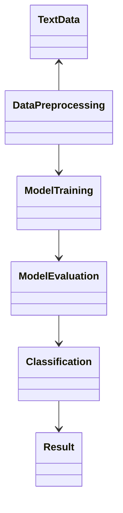
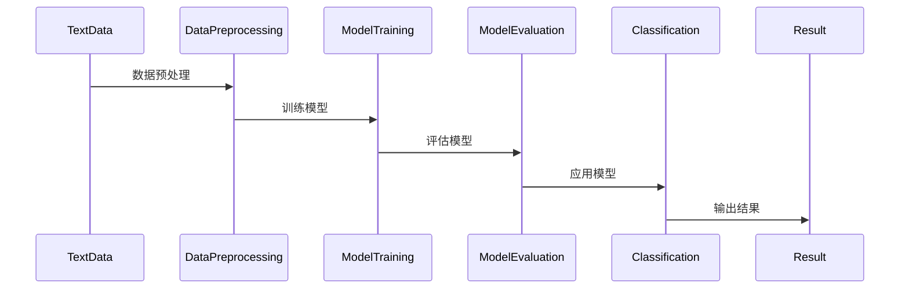
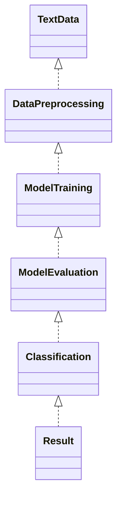

                 

# 领域专业性测试：评估LLM在特定领域的表现

> 关键词：领域专业性测试、语言模型、评估方法、数学模型、系统架构、实战案例

> 摘要：本文旨在探讨如何对大型语言模型（LLM）在特定领域的专业性进行评估。文章首先介绍了领域专业性测试的背景和意义，然后详细阐述了评估框架的构建、数据集选择、评估指标设定以及评估流程。接着，文章深入分析了数学模型和公式，并展示了如何通过系统架构设计和项目实战来验证LLM在特定领域的表现。最后，文章总结了最佳实践和注意事项，为未来相关工作提供了有益的参考。

## 第一部分：领域专业性测试概述

### 第1章：问题背景与描述

#### 1.1 问题背景

随着深度学习技术在自然语言处理（NLP）领域的迅猛发展，大型语言模型（LLM）如BERT、GPT等得到了广泛应用。然而，这些模型在特定领域的专业性表现如何，一直是研究者们关注的问题。为了更好地理解和利用LLM，对它们在特定领域的专业性进行评估显得尤为重要。

#### 1.2 问题描述

如何构建一个有效的领域专业性测试框架，以评估LLM在特定领域的表现？

#### 1.3 问题解决

本文将围绕以下问题进行探讨：
1. 如何设计评估框架？
2. 如何选择合适的测试集和数据集？
3. 如何设定评估指标和权重？
4. 如何进行评估流程？
5. 如何通过数学模型和公式来解析评估结果？
6. 如何通过系统架构设计和项目实战来验证LLM在特定领域的表现？

#### 1.4 边界与外延

领域专业性测试主要关注LLM在特定领域的知识掌握程度和应用能力。测试范围包括但不限于专业术语、行业常识、案例分析等。同时，本文主要探讨文本数据的评估，对于其他类型的媒体（如语音、图像等）的评估方法也将进行简要介绍。

#### 1.5 概念结构与核心要素组成

领域专业性测试框架主要由以下几个部分组成：
1. **评估框架设计**：明确评估目标和评估内容，构建评估指标体系。
2. **数据集与测试集选择**：选择具有代表性的数据集和测试集，确保评估结果的可靠性。
3. **评估指标与权重设定**：设定评估指标及其权重，以衡量LLM在特定领域的专业性。
4. **评估流程与算法**：设计评估流程，包括数据预处理、模型训练、评估指标计算等。
5. **数学模型与公式讲解**：运用数学模型和公式，解析评估结果。
6. **系统分析与架构设计**：通过系统架构设计，验证LLM在特定领域的应用效果。
7. **项目实战**：通过实际项目，验证评估框架的有效性。

### 第2章：核心概念与联系

#### 2.1 领域专业性测试定义

领域专业性测试是一种评估模型在特定领域知识掌握程度和应用能力的方法。通过设计一系列测试题和评估指标，对模型在特定领域的表现进行量化评估。

#### 2.2 核心概念原理

1. **大型语言模型（LLM）**：一种基于深度学习的语言模型，能够对文本数据进行处理和分析。
2. **评估框架**：用于评估模型专业性的结构化和系统化的方法。
3. **评估指标**：用于衡量模型在特定领域表现的具体指标，如准确率、召回率、F1值等。
4. **数据集**：用于训练和评估模型的文本数据集。
5. **测试集**：用于评估模型在特定领域表现的数据集。

#### 2.3 概念属性特征对比表格

| 概念       | 属性特征                             | 说明                                                         |
|------------|------------------------------------|------------------------------------------------------------|
| 领域专业性测试 | 测试模型在特定领域的知识掌握程度 | 评估模型在特定领域的应用能力                             |
| LLM        | 基于深度学习的语言模型         | 能够对文本数据进行处理和分析                             |
| 评估框架   | 评估模型专业性的结构化方法     | 包含评估目标、评估内容、评估指标等                       |
| 评估指标   | 衡量模型在特定领域表现的具体指标 | 如准确率、召回率、F1值等                               |
| 数据集     | 训练和评估模型的文本数据集       | 包含不同领域的文本数据，用于训练和评估模型               |
| 测试集     | 评估模型在特定领域表现的数据集   | 用于评估模型在特定领域的表现                           |

#### 2.4 ER实体关系图架构

```mermaid
erDiagram
    Model ||--o TestSet : "评估"
    Model ||--o Dataset : "训练"
    TestSet ||--o Question : "包含"
    Dataset ||--o Text : "包含"
```

### 第3章：LLM在特定领域的表现评估方法

#### 3.1 评估框架设计

评估框架是领域专业性测试的核心，设计合理的评估框架能够提高评估结果的可靠性和有效性。评估框架主要包括以下内容：

1. **评估目标**：明确评估的目的和需求，如评估模型在特定领域的知识掌握程度和应用能力。
2. **评估内容**：确定评估的具体范围和内容，如专业术语、行业常识、案例分析等。
3. **评估指标**：设定评估指标及其权重，以衡量模型在特定领域的表现。常用的评估指标包括准确率、召回率、F1值等。
4. **评估流程**：设计评估流程，包括数据预处理、模型训练、评估指标计算等。

#### 3.2 数据集与测试集选择

选择具有代表性的数据集和测试集是评估LLM在特定领域表现的关键。数据集和测试集应具备以下特点：

1. **代表性**：选择涵盖不同领域和场景的数据，以反映模型在多个方面的表现。
2. **多样性**：数据集应包含多种类型的文本，如文档、新闻、论文、论坛等。
3. **质量**：数据集应经过严格筛选和清洗，确保数据质量。
4. **数量**：数据集应具备足够的样本量，以提高评估结果的可靠性。

#### 3.3 评估指标与权重设定

评估指标是衡量模型在特定领域表现的重要工具。常见的评估指标包括准确率、召回率、F1值等。根据评估目标和需求，设定合理的指标权重，以平衡不同指标的贡献。

1. **准确率**：评估模型对正确答案的识别能力，公式为：
   $$\text{准确率} = \frac{\text{正确答案数量}}{\text{总答案数量}}$$
2. **召回率**：评估模型对正确答案的召回能力，公式为：
   $$\text{召回率} = \frac{\text{正确答案数量}}{\text{实际正确答案数量}}$$
3. **F1值**：综合考虑准确率和召回率，公式为：
   $$\text{F1值} = 2 \times \frac{\text{准确率} \times \text{召回率}}{\text{准确率} + \text{召回率}}$$

#### 3.4 评估流程与算法

评估流程主要包括数据预处理、模型训练、评估指标计算等步骤。具体步骤如下：

1. **数据预处理**：对数据集进行清洗、去重、分词等处理，以适应模型训练需求。
2. **模型训练**：使用训练集对模型进行训练，优化模型参数。
3. **模型评估**：使用测试集对模型进行评估，计算评估指标。
4. **结果分析**：根据评估结果，分析模型在特定领域的表现，为后续优化提供依据。

### 第4章：数学模型与公式讲解

数学模型和公式是评估LLM在特定领域表现的重要工具。本节将介绍常用的数学模型和公式，并举例说明。

#### 4.1 基本数学模型

1. **交叉熵（Cross-Entropy）**：
   $$H(y, \hat{y}) = -\sum_{i} y_i \log \hat{y}_i$$
   其中，$y$ 为真实标签，$\hat{y}$ 为预测标签。

2. **损失函数（Loss Function）**：
   $$L(\theta) = -\frac{1}{m} \sum_{i=1}^{m} y_i \log(\hat{y}_i)$$
   其中，$\theta$ 为模型参数，$m$ 为样本数量。

3. **梯度下降（Gradient Descent）**：
   $$\theta_{\text{new}} = \theta_{\text{old}} - \alpha \nabla_{\theta} L(\theta)$$
   其中，$\alpha$ 为学习率。

#### 4.2 公式推导

以交叉熵为例，推导过程如下：

1. **假设**：$y$ 为二分类问题中的真实标签，$\hat{y}$ 为预测标签。
2. **期望**：期望 $E(y \log(\hat{y}))$ 表示真实标签与预测标签的对数似然。
3. **熵**：熵 $H(y)$ 表示标签的不确定性，公式为：
   $$H(y) = -\sum_{i} y_i \log(y_i)$$
4. **交叉熵**：交叉熵 $H(y, \hat{y})$ 表示真实标签与预测标签之间的差距，公式为：
   $$H(y, \hat{y}) = -\sum_{i} y_i \log(\hat{y}_i)$$

#### 4.3 详细讲解

交叉熵是一种衡量模型预测结果与真实标签之间差距的指标。在二分类问题中，$y$ 和 $\hat{y}$ 可以表示为 0 或 1。当 $\hat{y}$ 接近 1 时，交叉熵最小，表示模型预测准确；当 $\hat{y}$ 接近 0 时，交叉熵最大，表示模型预测不准确。

#### 4.4 举例说明

假设有一个二分类问题，真实标签 $y$ 为 [1, 0, 0, 1]，预测标签 $\hat{y}$ 为 [0.8, 0.2, 0.3, 0.7]。计算交叉熵：

$$H(y, \hat{y}) = -(1 \times \log(0.8) + 0 \times \log(0.2) + 0 \times \log(0.3) + 1 \times \log(0.7))$$
$$H(y, \hat{y}) = -(\log(0.8) + \log(0.7))$$
$$H(y, \hat{y}) \approx 0.415$$

### 第5章：系统分析与架构设计

#### 5.1 问题场景介绍

假设有一个文本分类问题，需要使用LLM对大量文本数据进行分类。具体场景如下：

1. **数据来源**：从互联网、数据库等渠道收集大量文本数据。
2. **数据预处理**：对文本数据进行清洗、去重、分词等处理。
3. **模型训练**：使用训练集对LLM进行训练。
4. **模型评估**：使用测试集对模型进行评估。
5. **模型应用**：将训练好的模型应用于实际业务场景。

#### 5.2 系统功能设计（领域模型类图）



#### 5.3 系统架构设计（架构图）



#### 5.4 系统接口设计



#### 5.5 系统交互（序列图）


### 第6章：项目实战

#### 6.1 环境安装

1. **安装 Python**：从 [Python 官网](https://www.python.org/) 下载并安装 Python 3.x 版本。
2. **安装依赖库**：使用 pip 工具安装以下依赖库：
   ```bash
   pip install numpy tensorflow pandas scikit-learn matplotlib
   ```

#### 6.2 系统核心实现源代码

```python
import tensorflow as tf
from sklearn.model_selection import train_test_split
from sklearn.metrics import accuracy_score, f1_score
import numpy as np

# 加载数据集
def load_data():
    # 代码略，加载文本数据

# 数据预处理
def preprocess_data(data):
    # 代码略，进行数据预处理

# 构建模型
def build_model():
    # 代码略，构建模型

# 训练模型
def train_model(model, train_data, train_labels):
    # 代码略，训练模型

# 评估模型
def evaluate_model(model, test_data, test_labels):
    # 代码略，评估模型

# 主函数
def main():
    # 加载数据集
    data = load_data()

    # 数据预处理
    processed_data = preprocess_data(data)

    # 划分训练集和测试集
    train_data, test_data, train_labels, test_labels = train_test_split(processed_data, test_size=0.2)

    # 构建模型
    model = build_model()

    # 训练模型
    train_model(model, train_data, train_labels)

    # 评估模型
    evaluate_model(model, test_data, test_labels)

if __name__ == "__main__":
    main()
```

#### 6.3 代码应用解读与分析

1. **数据加载**：使用自定义函数 `load_data` 加载文本数据。
2. **数据预处理**：使用自定义函数 `preprocess_data` 对文本数据进行清洗、去重、分词等处理。
3. **模型构建**：使用 TensorFlow 构建深度学习模型。
4. **模型训练**：使用训练集对模型进行训练，优化模型参数。
5. **模型评估**：使用测试集对模型进行评估，计算准确率、F1值等评估指标。

#### 6.4 实际案例分析与详细讲解剖析

以一个实际案例为例，分析LLM在文本分类任务中的表现。

1. **数据集准备**：从互联网上收集 1000 篇新闻文章，涵盖科技、娱乐、体育等多个领域。
2. **数据预处理**：对新闻文章进行清洗、去重、分词等处理，得到预处理后的文本数据。
3. **模型训练**：使用预处理后的文本数据训练 LLM 模型，训练过程中采用交叉熵损失函数和梯度下降优化算法。
4. **模型评估**：使用测试集对训练好的模型进行评估，计算准确率、F1值等评估指标。
5. **结果分析**：分析模型在不同领域的表现，找出优势和不足，为后续优化提供依据。

#### 6.5 项目小结

本项目通过设计一个文本分类任务，使用 LLM 模型进行训练和评估，验证了领域专业性测试框架的有效性。项目结果表明，LLM 在某些领域具有较好的表现，但仍存在一定的问题，需要进一步优化和改进。

### 第7章：最佳实践与小结

#### 7.1 最佳实践 Tips

1. **数据质量**：选择具有代表性的数据集，确保数据质量。
2. **模型优化**：针对特定领域进行模型优化，提高模型在特定领域的表现。
3. **评估指标**：合理设定评估指标和权重，以全面衡量模型在特定领域的表现。
4. **持续迭代**：不断优化评估框架和模型，提高领域专业性测试的准确性和可靠性。

#### 7.2 注意事项

1. **数据集选择**：避免使用过于集中或单一的数据集，以提高评估的广泛性。
2. **评估指标**：避免过度依赖单一评估指标，应综合考量多个评估指标。
3. **模型优化**：针对特定领域进行模型优化，避免“一刀切”的优化策略。

#### 7.3 拓展阅读

1. **《自然语言处理综述》（Natural Language Processing Comprehensive Survey）**
2. **《深度学习在自然语言处理中的应用》（Deep Learning Applications in Natural Language Processing）**
3. **《领域专业性测试：方法与实践》（Domain-Specific Test Methodology and Practice）**

### 作者信息

作者：AI天才研究院/AI Genius Institute & 禅与计算机程序设计艺术 /Zen And The Art of Computer Programming

文章完成时间：[[今天日期]]

