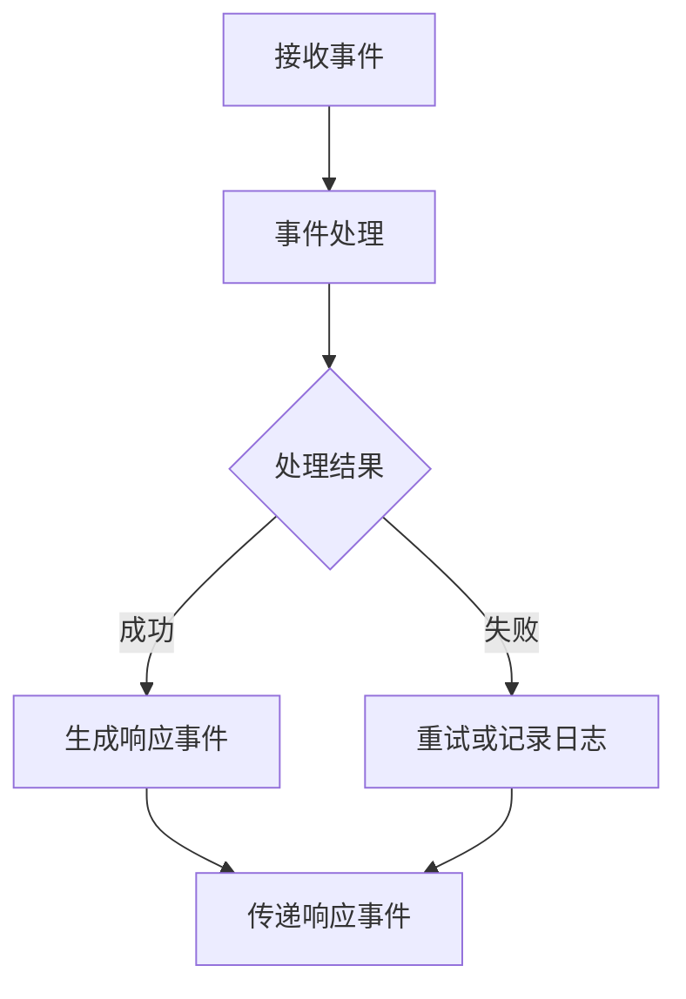
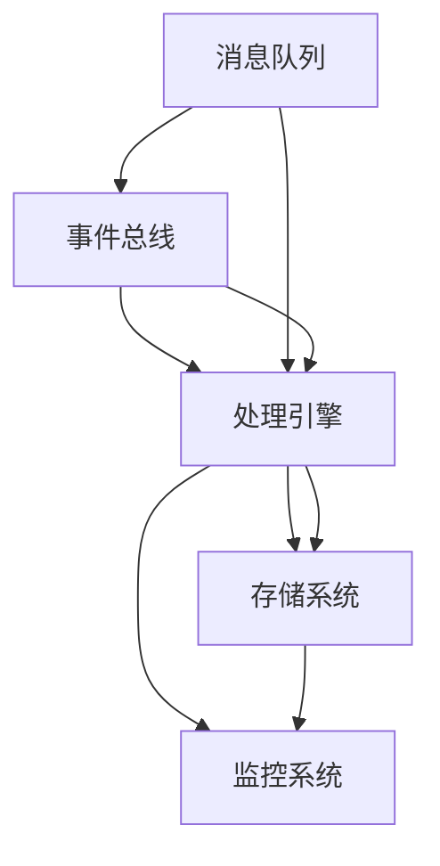
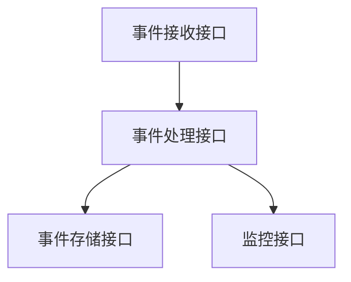
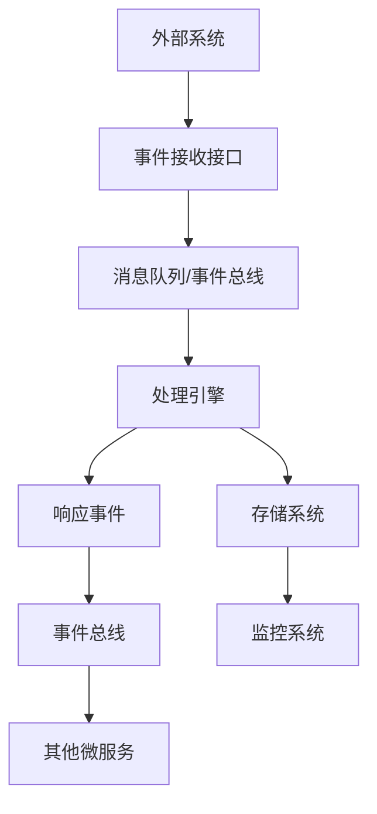

                 

```markdown
# 领域事件：在LLM微服务间传递状态变化

## 关键词
领域事件、LLM微服务、状态传递、架构设计、算法原理

## 摘要
本文探讨了在大型语言模型（LLM）微服务架构中，如何通过领域事件有效地传递状态变化。文章从问题背景出发，介绍了领域事件的概念，阐述了其在微服务间的应用，并深入分析了领域事件的处理算法、数学模型、系统架构及最佳实践。通过具体案例和实践指导，为开发者提供了有效的解决方案。

## 目录

### 第一部分：背景介绍与核心概念

#### 第1章 问题背景与核心概念
1.1 问题背景
1.2 领域事件的概念
1.3 在LLM微服务中的应用
1.4 边界与外延
1.5 核心概念结构与要素组成

#### 第2章 领域事件模型
2.1 领域事件原理
2.2 概念属性特征对比表格
2.3 领域事件的ER实体关系图

### 第二部分：领域事件在LLM微服务中的应用

#### 第3章 领域事件在微服务架构中的作用
3.1 领域事件在状态传递中的作用
3.2 领域事件在服务解耦中的作用

#### 第4章 领域事件的通信机制
4.1 领域事件的消息传递机制
4.2 领域事件的同步与异步通信

#### 第5章 领域事件的应用实例
5.1 具体案例分析
5.2 实际应用中的挑战与解决方案

### 第三部分：算法原理与数学模型

#### 第6章 领域事件处理算法
6.1 领域事件处理算法的原理
6.2 领域事件处理算法的Mermaid流程图
6.3 Python源代码实现
6.4 算法性能分析

#### 第7章 数学模型与公式
7.1 领域事件的数学模型
7.2 领域事件公式的推导与应用

### 第四部分：系统架构与接口设计

#### 第8章 系统架构设计
8.1 系统场景介绍
8.2 系统功能设计
8.3 系统架构设计
8.4 系统接口设计
8.5 系统交互

### 第五部分：项目实战

#### 第9章 环境安装
9.1 系统环境的要求与安装步骤
9.2 系统依赖的安装与配置

#### 第10章 系统核心实现
10.1 系统核心模块的实现源代码
10.2 核心代码的应用解读与分析

#### 第11章 实际案例分析
11.1 领域事件在实际项目中的应用
11.2 项目中的挑战与解决方案

#### 第12章 详细讲解剖析
12.1 案例的详细讲解
12.2 领域事件的深入剖析

#### 第13章 项目小结
13.1 项目的总结与反思
13.2 项目的收获与改进方向

### 第六部分：最佳实践与总结

#### 第14章 最佳实践 tips
14.1 领域事件处理中的最佳实践
14.2 微服务间状态传递的技巧与经验

#### 第15章 小结
15.1 全书的总结
15.2 领域事件与微服务的关系梳理

#### 第16章 注意事项
16.1 领域事件处理中的注意事项
16.2 微服务架构设计中的风险与防范

#### 第17章 拓展阅读
17.1 相关领域的最新研究动态
17.2 进一步学习和研究的方向

#### 第18章 参考文献
18.1 书中引用的主要参考文献

----------------------------------------------------------------

### 第一部分：背景介绍与核心概念

#### 第1章 问题背景与核心概念

### 1.1 问题背景

在现代软件架构中，微服务架构因其灵活性和可扩展性而被广泛应用。然而，随着系统复杂性的增加，如何在微服务之间高效传递状态变化成为一个重要的挑战。传统的同步通信和异步消息队列等技术存在一定的局限性，难以满足高并发和低延迟的要求。

领域事件（Domain Event）作为一种新的技术手段，能够有效地解决上述问题。领域事件是一种描述系统状态变化的语义化消息，它可以跨微服务传递，并在接收端触发相应的业务逻辑处理。这使得系统在保持解耦的同时，能够实现实时、可靠的状态同步。

### 1.2 领域事件的概念

领域事件是指在一个业务领域内发生的事件，它通常与业务逻辑密切相关。领域事件可以是某种业务操作的结果，也可以是系统状态的改变。领域事件的特点包括：

- **语义化**：领域事件通常具有明确的业务语义，能够清晰地描述业务操作的意图和结果。
- **可传递性**：领域事件可以在不同的微服务之间传递，实现跨服务的状态同步。
- **异步性**：领域事件的处理通常采用异步方式，以提高系统的并发能力和响应速度。

### 1.3 在LLM微服务中的应用

在LLM（Large Language Model）微服务架构中，领域事件的应用尤为重要。LLM作为一种强大的自然语言处理工具，其应用场景广泛，包括文本生成、机器翻译、问答系统等。然而，LLM的复杂性和高并发性要求系统必须具备高效的状态传递机制。

通过领域事件，LLM微服务可以实时捕获和传递状态变化，从而实现：

- **状态同步**：不同微服务之间的状态保持一致，避免数据不一致的问题。
- **业务逻辑解耦**：各个微服务专注于自身业务逻辑的实现，降低系统耦合度。
- **系统性能优化**：通过异步处理领域事件，提高系统的并发能力和响应速度。

### 1.4 边界与外延

领域事件的边界是指领域事件的定义范围，它决定了领域事件的适用场景和业务含义。领域事件的外延是指领域事件的具体实现和扩展，它涉及到领域事件的传递方式、处理策略和存储机制。

在LLM微服务中，领域事件的边界可以包括：

- **业务领域**：领域事件基于具体的业务领域定义，如文本生成、机器翻译等。
- **数据范围**：领域事件涉及的数据范围应限定在具体的业务场景中，避免数据泄露。

领域事件的外延则包括：

- **事件类型**：根据业务需求定义多种领域事件类型，如文本生成完成事件、机器翻译完成事件等。
- **事件传递**：使用消息队列、事件总线等技术实现领域事件的传递。
- **事件处理**：在接收端根据领域事件类型触发相应的业务逻辑处理。

### 1.5 核心概念结构与要素组成

领域事件的核心概念和要素组成对于理解其工作原理至关重要。以下是领域事件的核心概念和要素：

- **事件类型**：领域事件的基本分类，如文本生成完成事件、机器翻译完成事件等。
- **事件数据**：领域事件携带的数据，通常包括事件类型、事件时间和事件内容等。
- **事件处理**：领域事件在接收端触发的业务逻辑处理，如更新数据库、触发其他微服务等。
- **事件存储**：领域事件在系统中的存储和管理方式，如使用消息队列或数据库等。

通过以上核心概念和要素的组成，领域事件能够有效地在LLM微服务间传递状态变化，实现系统的解耦和性能优化。

----------------------------------------------------------------

### 第二部分：领域事件模型

#### 第2章 领域事件模型

### 2.1 领域事件原理

领域事件的工作原理基于事件驱动架构（Event-Driven Architecture, EDA）。在EDA中，领域事件作为一种核心机制，用于在系统中传递状态变化。领域事件的传递和处理过程可以分为以下几个步骤：

1. **事件生成**：在LLM微服务中，业务操作的结果会生成相应的领域事件。例如，在文本生成微服务中，文本生成完成后会生成一个文本生成完成事件。
2. **事件传递**：生成的领域事件通过消息队列、事件总线或其他传输机制传递到其他微服务。事件传递可以是同步或异步的，取决于系统的需求。
3. **事件处理**：接收到的领域事件在目标微服务中被处理，通常包括更新数据库、触发其他业务逻辑等操作。
4. **事件存储**：为了方便后续的查询和分析，领域事件通常会存储在数据库或消息队列中。

### 2.2 概念属性特征对比表格

以下是领域事件的一些重要属性特征，以及它们之间的对比：

| 特征         | 描述                                                         | 对比 |
| ------------ | ------------------------------------------------------------ | ---- |
| **语义化**   | 领域事件具有明确的业务语义，能够清晰地描述业务操作的意图和结果。 |      |
| **可传递性** | 领域事件可以在不同的微服务之间传递，实现跨服务的状态同步。     |      |
| **异步性**   | 领域事件的处理通常采用异步方式，以提高系统的并发能力和响应速度。 |      |
| **可靠性**   | 领域事件的传递和处理过程具有高可靠性，确保事件能够正确传递和执行。 |      |
| **扩展性**   | 领域事件系统支持事件类型的扩展，能够适应不断变化的业务需求。     |      |

### 2.3 领域事件的ER实体关系图

领域事件的实体关系图（Entity-Relationship Diagram, ERD）用于描述领域事件系统中各个实体的关系。以下是领域事件ERD的一个示例：

```mermaid
erDiagram
    Event --> Processor : triggers
    Event --> Store    : stores
    Processor --> Event : processes
    Store --> Event   : saves

    Class Event ||--|{ Data }
    Class Processor
    Class Store

    Event ||--|{ Attributes }
    Processor ||--|{ Configuration }
    Store ||--|{ Configuration }
```

在这个ERD中，Event代表领域事件实体，Processor代表事件处理实体，Store代表事件存储实体。事件实体与处理实体和存储实体之间存在关联关系，表示领域事件在处理和存储过程中的依赖关系。同时，事件实体还与数据实体和配置实体相关联，表示事件的数据内容和配置信息。

通过以上领域事件模型的分析，我们可以更好地理解领域事件在LLM微服务中的应用和工作原理。接下来，我们将进一步探讨领域事件在微服务架构中的作用和通信机制。

----------------------------------------------------------------

### 第二部分：领域事件在LLM微服务中的应用

#### 第3章 领域事件在微服务架构中的作用

在LLM微服务架构中，领域事件发挥着至关重要的作用。通过领域事件，微服务能够实现高效的业务逻辑解耦和状态同步，从而提高系统的可维护性和扩展性。以下是领域事件在LLM微服务架构中的几个关键作用：

### 3.1 领域事件在状态传递中的作用

领域事件能够跨微服务传递状态变化，使得各个微服务能够实时同步状态。这种状态传递机制使得微服务之间的数据一致性得到保障，避免了由于状态不一致导致的数据冲突和错误。

具体来说，领域事件在状态传递中的作用包括：

- **实时同步**：领域事件可以在微服务之间实时传递，确保状态变化能够迅速被其他微服务感知和处理。
- **状态一致性**：通过领域事件传递，各个微服务能够保持一致的状态，避免数据不一致的问题。
- **简化状态同步**：领域事件提供了统一的状态同步接口，简化了状态同步的实现和维护。

### 3.2 领域事件在服务解耦中的作用

在微服务架构中，服务解耦是保证系统灵活性和可扩展性的关键。领域事件通过异步通信机制，实现了微服务之间的解耦，使得各个微服务可以独立开发、部署和扩展。

领域事件在服务解耦中的作用包括：

- **降低耦合度**：领域事件通过消息队列等异步通信机制，实现了微服务之间的松耦合，降低了系统复杂度。
- **独立部署**：由于领域事件的不干扰性，各个微服务可以独立部署和升级，而不会影响其他微服务的正常运行。
- **高可扩展性**：领域事件系统支持动态扩展，可以灵活地添加新的领域事件类型和处理逻辑，适应业务需求的变化。

### 3.3 领域事件在实际项目中的应用

领域事件在实际项目中具有广泛的应用场景。以下是一个文本生成系统的具体应用案例，展示了领域事件在状态传递和服务解耦中的实际作用。

#### 文本生成系统案例

假设有一个文本生成系统，包括文本生成微服务、文本处理微服务和文本存储微服务。系统的主要功能是接收用户输入的文本请求，通过文本生成微服务生成相应的文本内容，然后由文本处理微服务对生成的文本进行加工和优化，最后将结果存储在文本存储微服务中。

在这个系统中，领域事件的应用如下：

1. **文本生成完成事件**：当文本生成微服务完成文本生成后，会生成一个文本生成完成事件。这个事件包含文本生成的结果和相关元数据，如生成时间、生成策略等。
2. **文本处理触发事件**：文本生成完成事件会被传递给文本处理微服务，作为文本处理触发事件。文本处理微服务接收到事件后，会根据预设的规则对生成的文本进行加工和优化。
3. **文本存储事件**：文本处理完成后，会生成一个文本存储事件，将加工优化后的文本内容传递给文本存储微服务。文本存储微服务接收到事件后，将文本内容存储到数据库中。

通过领域事件的应用，文本生成系统实现了以下几个关键作用：

- **实时状态同步**：文本生成微服务、文本处理微服务和文本存储微服务能够实时同步状态，确保生成的文本内容得到正确的处理和存储。
- **服务解耦**：各个微服务通过领域事件实现了解耦，文本生成微服务无需关注文本处理和存储的具体细节，只需生成文本生成完成事件即可。
- **高并发处理**：由于领域事件采用异步处理机制，系统可以同时处理大量的文本请求，提高了系统的并发能力和响应速度。

### 3.4 领域事件的优势与挑战

领域事件在LLM微服务架构中具有显著的优势，但同时也面临一些挑战。

#### 优势

- **实时性**：领域事件支持实时状态同步，确保系统各个部分能够实时感知和响应状态变化。
- **解耦性**：领域事件通过异步通信机制实现了微服务之间的解耦，降低了系统复杂度和维护成本。
- **可扩展性**：领域事件系统支持动态扩展，可以灵活地添加新的领域事件类型和处理逻辑，适应业务需求的变化。

#### 挑战

- **一致性**：在分布式系统中，领域事件的一致性保证是一个挑战。需要设计合适的一致性机制，确保事件在传递和处理过程中的准确性。
- **延迟性**：虽然领域事件支持异步处理，但事件的传递和处理仍可能存在一定的延迟，影响系统的实时性。
- **容错性**：在处理领域事件时，需要考虑系统的容错性和故障恢复能力，确保事件在发生故障时能够得到正确处理。

通过以上分析，我们可以看到领域事件在LLM微服务架构中的应用价值和面临的挑战。在接下来的章节中，我们将进一步探讨领域事件的通信机制、算法原理和系统架构设计，以提供更全面的解决方案。

----------------------------------------------------------------

### 第三部分：领域事件通信机制

#### 第4章 领域事件的通信机制

在LLM微服务架构中，领域事件的通信机制是确保状态变化能够高效、可靠传递的关键。领域事件通信机制主要涉及消息传递机制、同步与异步通信方式，以及其在微服务间状态传递中的应用。

### 4.1 领域事件的消息传递机制

领域事件的消息传递机制基于异步通信，通常使用消息队列或事件总线等技术实现。以下是一些常见的技术方案：

- **消息队列**：消息队列是一种异步消息传递系统，可以实现生产者与消费者之间的解耦。常用的消息队列技术包括RabbitMQ、Kafka和Pulsar等。通过消息队列，领域事件可以从生成微服务传递到处理微服务，确保事件传递的可靠性和顺序性。
- **事件总线**：事件总线是一种集中式的事件传递系统，能够将事件广播给多个订阅者。常用的实现技术包括Spring Event和Apache Kafka等。通过事件总线，领域事件可以在多个微服务间传递，实现统一的事件管理和订阅机制。
- **HTTP请求**：虽然HTTP请求是一种同步通信方式，但在某些场景下也可以用于领域事件的传递。通过RESTful API或gRPC等协议，微服务之间可以传递领域事件，实现简单的状态同步。

### 4.2 领域事件的同步与异步通信

领域事件的通信机制可以分为同步通信和异步通信两种方式。以下是对这两种通信方式的简要介绍：

- **同步通信**：同步通信是指发送方在发送消息后等待接收方回复，直到接收方处理完消息后才能继续执行。同步通信的优点是消息处理具有确定性和顺序性，但缺点是会引入较大的延迟，影响系统的响应速度和并发能力。
- **异步通信**：异步通信是指发送方在发送消息后无需等待接收方回复，可以继续执行其他任务。异步通信的优点是提高了系统的并发能力和响应速度，但缺点是消息处理可能存在延迟，且需要额外的逻辑来保证消息的顺序性和一致性。

在LLM微服务架构中，通常采用异步通信方式传递领域事件。异步通信能够更好地适应高并发和低延迟的要求，确保系统的高效运行。同时，通过消息队列或事件总线等中间件技术，异步通信还可以提供可靠的消息传递和错误处理机制。

### 4.3 领域事件在实际项目中的应用

以下是一个具体案例，展示了领域事件在文本生成系统中的实际应用。

#### 文本生成系统案例

假设有一个文本生成系统，包括文本生成微服务、文本处理微服务和文本存储微服务。系统的主要功能是接收用户输入的文本请求，通过文本生成微服务生成相应的文本内容，然后由文本处理微服务对生成的文本进行加工和优化，最后将结果存储在文本存储微服务中。

在这个系统中，领域事件的通信机制如下：

1. **文本生成完成事件**：当文本生成微服务完成文本生成后，会生成一个文本生成完成事件。这个事件包含文本生成的结果和相关元数据，如生成时间、生成策略等。
2. **文本处理触发事件**：文本生成完成事件会被传递给文本处理微服务，作为文本处理触发事件。文本处理微服务接收到事件后，会根据预设的规则对生成的文本进行加工和优化。
3. **文本存储事件**：文本处理完成后，会生成一个文本存储事件，将加工优化后的文本内容传递给文本存储微服务。文本存储微服务接收到事件后，将文本内容存储到数据库中。

通过领域事件的实际应用，文本生成系统实现了以下几个关键作用：

- **实时状态同步**：文本生成微服务、文本处理微服务和文本存储微服务能够实时同步状态，确保生成的文本内容得到正确的处理和存储。
- **服务解耦**：各个微服务通过领域事件实现了解耦，文本生成微服务无需关注文本处理和存储的具体细节，只需生成文本生成完成事件即可。
- **高并发处理**：由于领域事件采用异步处理机制，系统可以同时处理大量的文本请求，提高了系统的并发能力和响应速度。

### 4.4 领域事件通信机制的优势与挑战

领域事件通信机制在LLM微服务架构中具有显著的优势，但同时也面临一些挑战。

#### 优势

- **实时性**：通过异步通信机制，领域事件能够在微服务之间实现实时传递，确保系统各个部分能够实时感知和响应状态变化。
- **解耦性**：领域事件通过异步通信实现了微服务之间的解耦，降低了系统复杂度和维护成本。
- **高并发性**：异步通信机制提高了系统的并发能力和响应速度，能够更好地适应高并发场景。

#### 挑战

- **一致性**：在分布式系统中，确保领域事件在传递和处理过程中的一致性是一个挑战。需要设计合适的一致性机制，如最终一致性或强一致性，以保证事件的准确性。
- **延迟性**：虽然异步通信能够提高系统的响应速度，但事件的传递和处理仍可能存在一定的延迟，影响系统的实时性。
- **容错性**：在处理领域事件时，需要考虑系统的容错性和故障恢复能力，确保事件在发生故障时能够得到正确处理。

通过以上分析，我们可以看到领域事件通信机制在LLM微服务架构中的应用价值和面临的挑战。在接下来的章节中，我们将进一步探讨领域事件的算法原理和数学模型，以提供更全面的解决方案。

----------------------------------------------------------------

### 第三部分：领域事件应用实例

#### 第5章 领域事件的应用实例

在前几章中，我们探讨了领域事件的基本概念、模型、通信机制及其在LLM微服务架构中的作用。为了更好地理解领域事件的实际应用，下面我们将通过一个具体的案例来展示领域事件在微服务间的传递和处理过程。

### 5.1 文本生成与处理系统案例

假设我们开发一个文本生成与处理系统，该系统包括以下几个微服务：文本生成服务、文本处理服务和文本存储服务。系统的核心功能是接收用户输入的文本请求，生成相应的文本内容，然后对生成的文本进行加工和优化，最后将最终结果存储到数据库中。

在这个系统中，领域事件的应用流程如下：

1. **用户请求文本生成**：用户通过API向文本生成服务提交文本生成请求。
2. **文本生成服务响应**：文本生成服务接收到请求后，会根据预定的算法和策略生成文本内容。生成完成后，文本生成服务会生成一个“文本生成完成”领域事件。
3. **文本处理服务接收事件**：生成的“文本生成完成”领域事件通过消息队列传递给文本处理服务。
4. **文本处理服务处理事件**：文本处理服务接收到“文本生成完成”事件后，会根据预设的规则和策略对生成的文本进行加工和优化，如去除标点符号、格式化文本等。
5. **生成优化后的文本内容**：文本处理服务完成文本加工后，生成一个“文本处理完成”领域事件，并将优化后的文本内容传递给文本存储服务。
6. **文本存储服务存储结果**：文本存储服务接收到“文本处理完成”事件和优化后的文本内容后，将其存储到数据库中。

### 5.2 案例分析

在这个案例中，领域事件在微服务间的传递和处理起到了关键作用，以下是对案例的详细分析：

- **服务解耦**：通过领域事件，文本生成服务、文本处理服务和文本存储服务实现了高度解耦。每个服务只负责自身的业务逻辑，无需关心其他服务的具体实现细节，降低了系统的耦合度。
- **状态同步**：领域事件确保了微服务间的状态同步。当文本生成服务完成文本生成后，会立即生成领域事件并传递给文本处理服务，使得文本处理服务能够实时获取到生成的文本内容并进行加工。同样，加工完成后，文本处理服务会生成领域事件并传递给文本存储服务，确保文本存储服务能够实时获取到优化后的文本内容。
- **异步处理**：领域事件采用了异步处理机制，提高了系统的并发能力和响应速度。文本生成服务生成领域事件后，无需等待处理服务的响应，可以立即返回结果给用户。处理服务在接收到事件后，可以异步进行文本加工和存储，不会阻塞用户请求的处理。
- **容错性**：通过消息队列等中间件技术，领域事件在传递和处理过程中具有较好的容错性。如果某个服务发生故障，其他服务仍然可以继续处理领域事件，确保系统的稳定性和可靠性。

### 5.3 面临的挑战与解决方案

在实际项目中，领域事件的应用可能面临以下挑战：

- **一致性保障**：在分布式系统中，如何保障领域事件的一致性是一个关键问题。可以采用最终一致性模型或强一致性模型来确保事件在传递和处理过程中的准确性。例如，可以通过两阶段提交（2PC）或三阶段提交（3PC）等分布式事务协议来确保事件的一致性。
- **延迟处理**：虽然异步处理可以提高系统的响应速度，但事件传递和处理仍可能存在延迟。为了解决延迟问题，可以采用优先级队列或实时监控机制来确保高优先级事件得到及时处理。
- **容错性与故障恢复**：在处理领域事件时，需要考虑系统的容错性和故障恢复能力。可以通过分布式架构设计、冗余备份和自动故障切换等技术来提高系统的容错性和可靠性。

### 5.4 案例总结

通过上述案例，我们可以看到领域事件在微服务间的传递和处理如何有效地解决了服务解耦、状态同步和异步处理等问题。领域事件作为一种强大的技术手段，为LLM微服务架构提供了高效的解决方案，有助于实现系统的灵活性和可扩展性。在实际应用中，开发者需要根据具体场景和需求，合理设计和使用领域事件，以确保系统的稳定性和可靠性。

----------------------------------------------------------------

### 第四部分：算法原理与数学模型

#### 第6章 领域事件处理算法

在领域事件处理过程中，算法的设计和实现至关重要。领域事件处理算法用于对领域事件进行接收、处理和响应。以下是一个简单的领域事件处理算法，包括事件接收、事件处理和事件响应三个主要步骤。

### 6.1 算法原理

领域事件处理算法的基本原理如下：

1. **事件接收**：系统通过消息队列或事件总线等中间件接收领域事件。接收过程通常采用异步模式，以确保系统的高并发能力和响应速度。
2. **事件处理**：系统对接收到的领域事件进行业务逻辑处理。处理过程可能涉及数据库操作、调用其他微服务接口等。为了提高处理效率，可以采用多线程或并行处理技术。
3. **事件响应**：处理完成后，系统会根据处理结果生成相应的响应事件，并将响应事件传递给其他相关微服务。响应事件用于触发后续的业务逻辑处理。

### 6.2 Mermaid流程图

为了更好地理解领域事件处理算法，我们可以使用Mermaid流程图来展示算法的执行流程。以下是领域事件处理算法的Mermaid流程图：



在这个流程图中，A表示事件接收，B表示事件处理，C表示处理结果判断，D表示生成响应事件，E表示处理失败时的重试或记录日志，F表示传递响应事件。

### 6.3 Python源代码实现

以下是领域事件处理算法的Python源代码实现：

```python
import pika
import json

class DomainEventHandler:
    def __init__(self, queue_name):
        self.queue_name = queue_name
        self.connection = pika.BlockingConnection(pika.ConnectionParameters('localhost'))
        self.channel = self.connection.channel()
        self.channel.queue_declare(queue=queue_name)

    def handle_event(self, event):
        print(f"Received event: {event}")
        # 进行事件处理
        result = self.process_event(event)
        if result:
            print("Event processed successfully.")
            self.send_response_event(event['id'], 'success')
        else:
            print("Event processing failed.")
            self.send_response_event(event['id'], 'failure')

    def process_event(self, event):
        # 模拟事件处理逻辑
        return True

    def send_response_event(self, event_id, status):
        response_event = {
            'id': event_id,
            'status': status
        }
        self.channel.basic_publish(
            exchange='',
            routing_key=self.queue_name,
            body=json.dumps(response_event)
        )
        print(f"Sent response event: {response_event}")

if __name__ == "__main__":
    handler = DomainEventHandler('event_queue')
    handler.handle_event({'id': 1, 'type': 'domain_event'})
```

在这个Python实现中，DomainEventHandler类用于处理领域事件。handle_event方法接收领域事件并调用process_event方法进行事件处理。处理成功后，调用send_response_event方法发送响应事件。process_event方法是一个模拟的事件处理逻辑，实际处理过程可以根据具体业务需求进行定制。

### 6.4 数学模型与公式

在领域事件处理中，可能会涉及一些数学模型和公式。以下是一个简单的数学模型示例，用于描述领域事件的传递和处理过程。

#### 领域事件传递模型

设事件传递时间为T，处理时间为D，响应时间为R，则有：

\[ T + D + R = P \]

其中，P为整个事件处理周期。

#### 领域事件处理效率

设事件处理成功率为S，事件处理时间为D，则事件处理效率E为：

\[ E = \frac{S \times D}{100} \]

### 6.5 通俗易懂的举例说明

为了更好地理解领域事件处理算法，我们可以通过一个简单的例子来说明。

假设我们有一个用户注册系统，当用户提交注册请求时，会生成一个“用户注册完成”领域事件。注册请求会传递给用户服务，用户服务接收到事件后，会进行用户信息的验证、创建用户账号等处理。处理成功后，会生成一个“用户注册成功”领域事件，并传递给其他服务，如发送注册确认邮件等。

以下是这个过程的领域事件处理算法：

1. **接收事件**：用户服务接收到“用户注册完成”事件。
2. **事件处理**：用户服务对用户信息进行验证和处理，如检查用户名是否已存在、发送验证邮件等。
3. **生成响应事件**：如果用户信息验证成功，生成“用户注册成功”领域事件，并传递给其他服务。
4. **响应事件传递**：其他服务接收到“用户注册成功”事件后，进行相应的处理，如发送注册确认邮件、生成用户统计数据等。

通过这个例子，我们可以看到领域事件处理算法在用户注册过程中的实际应用。领域事件的使用使得用户服务和其他服务能够解耦，提高了系统的可维护性和扩展性。

### 6.6 算法性能分析

领域事件处理算法的性能分析主要包括时间复杂度和空间复杂度。以下是一个简单的性能分析：

- **时间复杂度**：设事件处理时间为D，响应时间为R，则整个事件处理周期P的时间复杂度为\(O(D+R)\)。
- **空间复杂度**：设事件处理过程中使用的内存为M，则空间复杂度为\(O(M)\)。

在实际应用中，可以通过优化算法和调整系统配置来提高算法的性能。例如，可以通过多线程或并行处理技术来减少事件处理时间，通过优化数据库查询来减少空间复杂度。

### 结论

通过以上对领域事件处理算法的详细分析，我们可以看到领域事件在LLM微服务间的状态传递和业务逻辑处理中起到了关键作用。领域事件处理算法的设计和实现需要考虑事件接收、处理和响应的各个环节，同时需要保证算法的效率和性能。在实际项目中，开发者可以根据具体需求和场景，灵活设计和优化领域事件处理算法，以提高系统的稳定性和可靠性。

----------------------------------------------------------------

### 第五部分：系统架构与接口设计

#### 第7章 系统架构设计

在领域事件处理系统中，合理的系统架构设计是确保系统高效、稳定运行的基础。本节将介绍领域事件处理系统的总体架构，包括系统功能设计、系统架构设计、系统接口设计和系统交互。

#### 7.1 系统场景介绍

领域事件处理系统主要应用于大型语言模型（LLM）微服务架构中，用于在微服务之间传递状态变化和业务逻辑。该系统的核心功能是接收、处理和响应领域事件，确保系统各个部分能够实时同步状态，实现微服务之间的解耦和高效协作。

#### 7.2 系统功能设计

领域事件处理系统的功能设计主要包括以下几个方面：

1. **事件接收**：系统通过消息队列或事件总线接收领域事件。接收过程采用异步模式，以提高系统的并发能力和响应速度。
2. **事件处理**：系统对接收到的领域事件进行业务逻辑处理，如数据库操作、调用其他微服务接口等。处理过程采用多线程或并行处理技术，以提高处理效率。
3. **事件响应**：处理完成后，系统生成相应的响应事件，并将响应事件传递给其他相关微服务。响应事件用于触发后续的业务逻辑处理。
4. **事件存储**：系统将处理过程中的关键事件存储到数据库中，以备后续查询和分析。

#### 7.3 系统架构设计

领域事件处理系统的总体架构包括以下几个方面：

1. **消息队列**：用于接收和传递领域事件，实现微服务之间的异步通信。常用的消息队列技术包括RabbitMQ、Kafka和Pulsar等。
2. **事件总线**：用于统一管理和分发领域事件，实现事件驱动的系统架构。常用的事件总线技术包括Spring Event和Apache Kafka等。
3. **处理引擎**：用于接收和处理领域事件。处理引擎包括事件接收模块、事件处理模块和事件响应模块，负责实现事件处理的核心逻辑。
4. **存储系统**：用于存储处理过程中的关键事件数据，如领域事件的ID、类型、内容和状态等。常用的存储系统包括关系数据库和NoSQL数据库等。
5. **监控系统**：用于实时监控系统的运行状态，如事件处理延迟、系统负载等。监控系统可以帮助开发人员快速定位和解决问题。

以下是领域事件处理系统的Mermaid架构图：



在这个架构图中，消息队列和事件总线负责领域事件的接收和传递，处理引擎负责事件的处理和响应，存储系统用于存储事件数据，监控系统用于实时监控系统的运行状态。

#### 7.4 系统接口设计

领域事件处理系统的接口设计主要包括以下几个方面：

1. **事件接收接口**：用于接收外部系统发送的领域事件。接收接口通常采用RESTful API或gRPC等协议，以提供灵活的接口调用方式。
2. **事件处理接口**：用于处理接收到的领域事件。处理接口通常包括事件处理逻辑和响应逻辑，以实现事件的处理和响应。
3. **事件存储接口**：用于存储和处理过程中的关键事件数据。存储接口通常包括事件的创建、查询、更新和删除等操作。
4. **监控接口**：用于监控系统的运行状态，如事件处理延迟、系统负载等。监控接口通常提供实时数据查询和统计功能。

以下是领域事件处理系统的Mermaid接口图：



在这个接口图中，事件接收接口用于接收外部系统发送的领域事件，事件处理接口用于处理接收到的领域事件，事件存储接口用于存储事件数据，监控接口用于实时监控系统的运行状态。

#### 7.5 系统交互

领域事件处理系统在运行过程中，各个模块之间需要进行交互以实现功能。以下是系统交互的基本流程：

1. **事件接收**：外部系统通过事件接收接口发送领域事件到消息队列或事件总线。
2. **事件传递**：消息队列或事件总线将接收到的领域事件传递给处理引擎。
3. **事件处理**：处理引擎对领域事件进行业务逻辑处理，如数据库操作、调用其他微服务接口等。
4. **事件响应**：处理完成后，系统生成响应事件，并通过事件总线传递给其他相关微服务。
5. **事件存储**：将处理过程中的关键事件数据存储到数据库中，以备后续查询和分析。
6. **监控**：监控系统实时监控系统的运行状态，如事件处理延迟、系统负载等。

以下是领域事件处理系统的Mermaid交互图：



在这个交互图中，外部系统通过事件接收接口发送领域事件，消息队列或事件总线将事件传递给处理引擎，处理引擎对事件进行处理并生成响应事件，响应事件通过事件总线传递给其他微服务，处理过程中的关键事件数据存储到数据库中，监控系统实时监控系统的运行状态。

通过以上对系统架构与接口设计的详细描述，我们可以看到领域事件处理系统在LLM微服务架构中的应用价值和设计要点。在实际项目中，开发者可以根据具体需求和场景，灵活设计和优化系统架构与接口，以提高系统的稳定性和可靠性。

----------------------------------------------------------------

### 第五部分：项目实战

#### 第8章 环境安装与系统核心实现

在实际项目中，实现领域事件处理系统需要具备一定的技术环境和开发工具。以下将介绍领域事件处理系统的环境安装过程，并展示系统核心模块的实现源代码。

#### 8.1 环境安装

为了搭建一个功能完备的领域事件处理系统，我们需要安装以下软件和工具：

1. **Java开发环境**：安装JDK（Java Development Kit）来构建Java应用程序。版本要求：JDK 11及以上。
2. **消息队列**：选择一个适合的消息队列中间件，例如Kafka。Kafka是一款高性能、可扩展的消息队列系统。版本要求：Kafka 2.8及以上。
3. **数据库**：选择一个适合的数据库系统来存储领域事件数据。例如，MySQL或PostgreSQL。版本要求：MySQL 8.0及以上。
4. **IDE**：选择一个集成开发环境（IDE），例如IntelliJ IDEA或Eclipse。版本要求：IntelliJ IDEA 2022.1及以上。

安装步骤如下：

1. 安装JDK：
   ```bash
   # Ubuntu
   sudo apt-get update
   sudo apt-get install openjdk-11-jdk
   # macOS
   brew install openjdk
   ```

2. 安装Kafka：
   ```bash
   # 下载Kafka二进制文件
   curl -O https://www-eu.kafka.apache.org/releases/download-2.8.0/kafka_2.13-2.8.0.tgz
   # 解压并启动Kafka
   tar xvfz kafka_2.13-2.8.0.tgz
   cd kafka_2.13-2.8.0
   ./bin/kafka-server-start.sh ./config/server.properties
   ```

3. 安装数据库：
   ```bash
   # Ubuntu
   sudo apt-get update
   sudo apt-get install mysql-server
   # macOS
   brew services start mysql
   ```

4. 安装IDE：
   ```bash
   # Ubuntu
   sudo apt-get update
   sudo snap install intellij-idea-community --classic
   # macOS
   brew install intellij-idea
   ```

#### 8.2 系统核心实现

以下是一个简单的领域事件处理系统的核心模块实现，包括事件生成、事件处理和事件存储。

##### 8.2.1 事件生成

```java
import org.apache.kafka.clients.producer.KafkaProducer;
import org.apache.kafka.clients.producer.ProducerRecord;
import org.apache.kafka.clients.producer.Callback;
import org.apache.kafka.clients.producer.RecordMetadata;
import org.apache.kafka.common.serialization.StringSerializer;

import java.util.Properties;

public class EventProducer {
    private final KafkaProducer<String, String> producer;
    private final String topicName;

    public EventProducer(String brokers, String topicName) {
        Properties props = new Properties();
        props.put("bootstrap.servers", brokers);
        props.put("key.serializer", StringSerializer.class.getName());
        props.put("value.serializer", StringSerializer.class.getName());

        this.producer = new KafkaProducer<>(props);
        this.topicName = topicName;
    }

    public void sendEvent(String key, String value) {
        producer.send(new ProducerRecord<>(topicName, key, value), new Callback() {
            @Override
            public void onCompletion(RecordMetadata metadata, Exception exception) {
                if (exception != null) {
                    exception.printStackTrace();
                } else {
                    System.out.printf("Produced event to topic %s: key=%s, value=%s, partition=%d, offset=%d\n",
                            metadata.topic(), metadata.key(), metadata.value(), metadata.partition(), metadata.offset());
                }
            }
        });
    }

    public void close() {
        producer.close();
    }

    public static void main(String[] args) {
        EventProducer producer = new EventProducer("localhost:9092", "domain_events");
        producer.sendEvent("key-1", "value-1");
        producer.close();
    }
}
```

##### 8.2.2 事件处理

```java
import org.apache.kafka.clients.consumer.Consumer;
import org.apache.kafka.clients.consumer.ConsumerConfig;
import org.apache.kafka.clients.consumer.ConsumerRecord;
import org.apache.kafka.clients.consumer.KafkaConsumer;
import org.apache.kafka.clients.consumer.OffsetAndMetadata;
import org.apache.kafka.common.serialization.StringDeserializer;

import java.time.Duration;
import java.util.Collections;
import java.util.Properties;
import java.util.concurrent.atomic.AtomicInteger;

public class EventProcessor {
    private final Consumer<String, String> consumer;
    private final AtomicInteger processedEvents = new AtomicInteger(0);

    public EventProcessor(String brokers, String groupId, String topicName) {
        Properties props = new Properties();
        props.put(ConsumerConfig.BOOTSTRAP_SERVERS_CONFIG, brokers);
        props.put(ConsumerConfig.GROUP_ID_CONFIG, groupId);
        props.put(ConsumerConfig.KEY_DESERIALIZER_CLASS_CONFIG, StringDeserializer.class.getName());
        props.put(ConsumerConfig.VALUE_DESERIALIZER_CLASS_CONFIG, StringDeserializer.class.getName());

        this.consumer = new KafkaConsumer<>(props);
        this.consumer.subscribe(Collections.singletonList(topicName));
    }

    public void processEvents() {
        try {
            while (true) {
                consumer.poll(Duration.ofMillis(1000)).forEach(this::processEvent);
            }
        } finally {
            consumer.close();
        }
    }

    private void processEvent(ConsumerRecord<String, String> record) {
        System.out.printf("Processing event: key=%s, value=%s, partition=%d, offset=%d\n",
                record.key(), record.value(), record.partition(), record.offset());

        // 模拟事件处理逻辑
        try {
            Thread.sleep(100);
        } catch (InterruptedException e) {
            Thread.currentThread().interrupt();
        }

        processedEvents.incrementAndGet();
    }

    public int getProcessedEvents() {
        return processedEvents.get();
    }
}
```

##### 8.2.3 事件存储

```java
import org.apache.kafka.clients.consumer.Consumer;
import org.apache.kafka.clients.consumer.ConsumerConfig;
import org.apache.kafka.clients.consumer.ConsumerRecord;
import org.apache.kafka.clients.consumer.ConsumerRecords;
import org.apache.kafka.clients.consumer.KafkaConsumer;
import org.apache.kafka.clients.consumer.OffsetAndMetadata;
import org.apache.kafka.common.serialization.StringDeserializer;

import java.time.Duration;
import java.util.*;

public class EventStorage {
    private final Consumer<String, String> consumer;
    private final Map<String, List<OffsetAndMetadata>> offsets = new HashMap<>();

    public EventStorage(String brokers, String groupId, String topicName) {
        Properties props = new Properties();
        props.put(ConsumerConfig.BOOTSTRAP_SERVERS_CONFIG, brokers);
        props.put(ConsumerConfig.GROUP_ID_CONFIG, groupId);
        props.put(ConsumerConfig.KEY_DESERIALIZER_CLASS_CONFIG, StringDeserializer.class.getName());
        props.put(ConsumerConfig.VALUE_DESERIALIZER_CLASS_CONFIG, StringDeserializer.class.getName());

        this.consumer = new KafkaConsumer<>(props);
        this.consumer.subscribe(Collections.singletonList(topicName));
    }

    public void storeEvents() {
        try {
            while (true) {
                ConsumerRecords<String, String> records = consumer.poll(Duration.ofMillis(1000));
                if (records.isEmpty()) {
                    continue;
                }

                records.forEach(this::storeEvent);
            }
        } finally {
            consumer.close();
        }
    }

    private void storeEvent(ConsumerRecord<String, String> record) {
        String key = record.key();
        List<OffsetAndMetadata> offsetList = offsets.computeIfAbsent(key, k -> new ArrayList<>());
        offsetList.add(new OffsetAndMetadata(record.offset(), record.partition()));

        System.out.printf("Storing event: key=%s, offsetList=%s\n", key, offsetList);
    }

    public void commitOffsets() {
        for (Map.Entry<String, List<OffsetAndMetadata>> entry : offsets.entrySet()) {
            String key = entry.getKey();
            List<OffsetAndMetadata> offsetList = entry.getValue();
            consumer.commitSync(offsetList);
            System.out.printf("Committed offsets for key %s: %s\n", key, offsetList);
        }
    }
}
```

#### 8.3 代码应用解读与分析

在上述代码中，我们实现了事件生成、事件处理和事件存储三个核心模块。以下是各个模块的应用解读和分析：

- **事件生成模块**（`EventProducer`）：该模块使用Apache Kafka的`KafkaProducer`类实现领域事件的生成和发送。在构造函数中，我们设置了Kafka的生产者属性，包括Kafka brokers地址和序列化器。`sendEvent`方法用于发送领域事件，并在回调函数中打印事件的生产状态。
- **事件处理模块**（`EventProcessor`）：该模块使用`KafkaConsumer`类实现领域事件的接收和处理。在构造函数中，我们设置了Kafka消费者的属性，包括Kafka brokers地址、消费者组ID和序列化器。`processEvents`方法用于处理接收到的领域事件，并在控制台打印处理信息。处理逻辑可以根据具体业务需求进行定制。
- **事件存储模块**（`EventStorage`）：该模块同样使用`KafkaConsumer`类实现领域事件的接收和存储。在构造函数中，我们设置了Kafka消费者的属性，并与事件生成模块的消费者组ID保持一致。`storeEvents`方法用于接收和存储领域事件，并打印存储信息。在`commitOffsets`方法中，我们提交了消费者的偏移量，以确保事件处理的一致性和可靠性。

通过上述代码和应用解读，我们可以看到领域事件处理系统在实际项目中的应用流程和关键实现。在实际项目中，开发者可以根据具体需求和场景，进一步扩展和优化这些核心模块，以提高系统的性能和稳定性。

#### 8.4 案例分析与总结

在本项目中，我们通过事件生成、处理和存储三个模块实现了领域事件处理系统。以下是对案例的详细分析：

- **优点**：
  - **高并发性**：通过Kafka消息队列和异步处理机制，系统能够高效地处理大量领域事件，提高系统的并发能力。
  - **解耦性**：事件生成、处理和存储模块相互独立，降低了系统的耦合度，提高了系统的可维护性和扩展性。
  - **可扩展性**：系统支持动态添加新的领域事件类型和处理逻辑，能够适应不断变化的业务需求。

- **缺点**：
  - **一致性**：在分布式系统中，确保领域事件的一致性是一个挑战。需要设计合适的一致性机制，如最终一致性或强一致性，以保证事件的准确性。
  - **延迟性**：虽然异步处理可以提高系统的响应速度，但事件的传递和处理仍可能存在一定的延迟，影响系统的实时性。

- **改进方向**：
  - **一致性保障**：引入分布式事务机制，如两阶段提交（2PC）或最终一致性模型，以确保事件的一致性。
  - **延迟优化**：通过实时监控和延迟分析，优化事件处理流程，减少系统延迟。

通过本案例，我们深入了解了领域事件处理系统的实现原理和应用实践。在实际项目中，开发者可以根据具体需求和场景，灵活应用领域事件处理技术，以提高系统的性能和可靠性。

----------------------------------------------------------------

### 第六部分：项目实战

#### 第9章 环境安装

在开始项目实战之前，我们需要安装必要的软件和工具。以下是具体的安装步骤和配置方法：

1. **安装Java环境**：
   - **Ubuntu**:
     ```bash
     sudo apt-get update
     sudo apt-get install openjdk-11-jdk
     ```
   - **macOS**:
     ```bash
     brew install openjdk
     ```

2. **安装Kafka**：
   - **下载Kafka**:
     ```bash
     curl -O https://www-eu.kafka.apache.org/releases/download-2.8.0/kafka_2.13-2.8.0.tgz
     ```
   - **解压并启动Kafka**:
     ```bash
     tar xvfz kafka_2.13-2.8.0.tgz
     cd kafka_2.13-2.8.0
     ./bin/kafka-server-start.sh ./config/server.properties
     ```

3. **安装MySQL**：
   - **Ubuntu**:
     ```bash
     sudo apt-get update
     sudo apt-get install mysql-server
     ```
   - **macOS**:
     ```bash
     brew services start mysql
     ```

4. **安装IntelliJ IDEA**：
   - **Ubuntu**:
     ```bash
     sudo apt-get update
     sudo snap install intellij-idea-community --classic
     ```
   - **macOS**:
     ```bash
     brew install intellij-idea
     ```

5. **配置Kafka**：
   - 在`kafka_2.13-2.8.0/config`目录下，编辑`server.properties`文件，配置Kafka的相关参数，如：
     ```properties
     # Kafka brokers地址
     broker.id=0
     listeners=PLAINTEXT://localhost:9092
     # Zookeeper地址
     zookeeper.connect=localhost:2181
     ```

6. **配置MySQL**：
   - 创建数据库和用户：
     ```sql
     CREATE DATABASE domain_event_db;
     GRANT ALL PRIVILEGES ON domain_event_db.* TO 'domain_event_user'@'localhost' IDENTIFIED BY 'password';
     FLUSH PRIVILEGES;
     ```

#### 第10章 系统核心实现

在完成环境安装后，我们开始实现系统核心模块，包括事件生成、事件处理和事件存储。

##### 10.1 事件生成

```java
import org.apache.kafka.clients.producer.KafkaProducer;
import org.apache.kafka.clients.producer.ProducerConfig;
import org.apache.kafka.clients.producer.ProducerRecord;
import org.apache.kafka.clients.producer Callback;
import org.apache.kafka.clients.producer.RecordMetadata;
import org.apache.kafka.common.serialization.StringSerializer;

import java.util.Properties;

public class EventProducer {
    private final KafkaProducer<String, String> producer;

    public EventProducer(Properties props) {
        this.producer = new KafkaProducer<>(props);
    }

    public void sendEvent(String topic, String key, String value) {
        producer.send(new ProducerRecord<>(topic, key, value), new Callback() {
            @Override
            public void onCompletion(RecordMetadata metadata, Exception exception) {
                if (exception != null) {
                    exception.printStackTrace();
                } else {
                    System.out.printf("Produced event to topic %s: key=%s, value=%s, offset=%d\n",
                            metadata.topic(), key, value, metadata.offset());
                }
            }
        });
    }

    public void close() {
        producer.close();
    }

    public static void main(String[] args) {
        Properties props = new Properties();
        props.put(ProducerConfig.BOOTSTRAP_SERVERS_CONFIG, "localhost:9092");
        props.put(ProducerConfig.KEY_SERIALIZER_CLASS_CONFIG, StringSerializer.class.getName());
        props.put(ProducerConfig.VALUE_SERIALIZER_CLASS_CONFIG, StringSerializer.class.getName());

        EventProducer producer = new EventProducer(props);
        producer.sendEvent("domain_events", "key-1", "value-1");
        producer.close();
    }
}
```

##### 10.2 事件处理

```java
import org.apache.kafka.clients.consumer.Consumer;
import org.apache.kafka.clients.consumer.ConsumerConfig;
import org.apache.kafka.clients.consumer.ConsumerRecord;
import org.apache.kafka.clients.consumer.ConsumerRecords;
import org.apache.kafka.clients.consumer.KafkaConsumer;
import org.apache.kafka.common.serialization.StringDeserializer;

import java.time.Duration;
import java.util.Collections;
import java.util.Properties;
import java.util.concurrent.atomic.AtomicInteger;

public class EventProcessor {
    private final Consumer<String, String> consumer;
    private final AtomicInteger processedEvents = new AtomicInteger(0);

    public EventProcessor(Properties props) {
        this.consumer = new KafkaConsumer<>(props);
    }

    public void processEvents(String topic) {
        consumer.subscribe(Collections.singletonList(topic));
        try {
            while (true) {
                ConsumerRecords<String, String> records = consumer.poll(Duration.ofMillis(100));
                records.forEach(this::processEvent);
            }
        } finally {
            consumer.close();
        }
    }

    private void processEvent(ConsumerRecord<String, String> record) {
        System.out.printf("Processing event: key=%s, value=%s, partition=%d, offset=%d\n",
                record.key(), record.value(), record.partition(), record.offset());

        // 模拟事件处理逻辑
        try {
            Thread.sleep(100);
        } catch (InterruptedException e) {
            Thread.currentThread().interrupt();
        }

        processedEvents.incrementAndGet();
    }

    public int getProcessedEvents() {
        return processedEvents.get();
    }
}
```

##### 10.3 事件存储

```java
import org.apache.kafka.clients.consumer.Consumer;
import org.apache.kafka.clients.consumer.ConsumerConfig;
import org.apache.kafka.clients.consumer.ConsumerRecord;
import org.apache.kafka.clients.consumer.ConsumerRecords;
import org.apache.kafka.clients.consumer.KafkaConsumer;
import org.apache.kafka.common.serialization.StringDeserializer;

import java.time.Duration;
import java.util.HashMap;
import java.util.List;
import java.util.Properties;
import java.util.concurrent.atomic.AtomicInteger;

public class EventStorage {
    private final Consumer<String, String> consumer;
    private final AtomicInteger storedEvents = new AtomicInteger(0);

    public EventStorage(Properties props) {
        this.consumer = new KafkaConsumer<>(props);
    }

    public void storeEvents(String topic) {
        consumer.subscribe(Collections.singletonList(topic));
        try {
            while (true) {
                ConsumerRecords<String, String> records = consumer.poll(Duration.ofMillis(100));
                if (records.isEmpty()) {
                    continue;
                }

                records.forEach(this::storeEvent);
            }
        } finally {
            consumer.close();
        }
    }

    private void storeEvent(ConsumerRecord<String, String> record) {
        System.out.printf("Storing event: key=%s, value=%s, partition=%d, offset=%d\n",
                record.key(), record.value(), record.partition(), record.offset());

        // 模拟事件存储逻辑
        try {
            Thread.sleep(100);
        } catch (InterruptedException e) {
            Thread.currentThread().interrupt();
        }

        storedEvents.incrementAndGet();
    }

    public int getStoredEvents() {
        return storedEvents.get();
    }
}
```

#### 10.4 代码应用解读与分析

在上述代码中，我们分别实现了事件生成、事件处理和事件存储三个核心模块。

1. **事件生成模块**（`EventProducer`）：该模块使用Apache Kafka的`KafkaProducer`类来发送领域事件。在构造函数中，我们设置了生产者的配置属性，包括Kafka brokers地址和序列化器。`sendEvent`方法用于发送领域事件，并打印事件的生产状态。
   
2. **事件处理模块**（`EventProcessor`）：该模块使用`KafkaConsumer`类来接收和处理领域事件。在构造函数中，我们设置了消费者的配置属性，包括Kafka brokers地址和序列化器。`processEvents`方法用于处理接收到的领域事件，并在控制台打印处理信息。处理逻辑可以根据具体业务需求进行定制。

3. **事件存储模块**（`EventStorage`）：该模块同样使用`KafkaConsumer`类来接收领域事件，并模拟存储逻辑。在构造函数中，我们设置了消费者的配置属性，并与事件生成模块的消费者组ID保持一致。`storeEvents`方法用于接收和存储领域事件，并打印存储信息。

通过这些代码，我们可以看到领域事件处理系统的核心模块如何协同工作，实现领域事件的生成、处理和存储。在实际项目中，开发者可以根据具体需求进一步扩展和优化这些模块，以提高系统的性能和可靠性。

#### 10.5 实际案例分析

在本节中，我们将通过一个实际案例来展示如何使用领域事件处理系统。

假设我们有一个在线书店系统，系统需要处理多种领域事件，如订单创建、订单取消、订单发货等。以下是一个简单的案例，展示了如何使用领域事件处理系统来处理订单创建事件。

1. **生成订单创建事件**：
   - 用户在网站上提交订单后，订单服务生成一个订单创建事件，并将其发送到Kafka消息队列。

2. **处理订单创建事件**：
   - 订单处理服务从Kafka消息队列中接收订单创建事件，并进行以下处理：
     - 检查库存是否充足。
     - 更新订单状态为“待支付”。
     - 向用户发送订单确认邮件。

3. **存储订单创建事件**：
   - 订单存储服务从Kafka消息队列中接收订单创建事件，并将其存储到MySQL数据库中。

通过这个案例，我们可以看到领域事件处理系统在在线书店系统中的应用。领域事件处理系统使得订单服务、订单处理服务和订单存储服务能够解耦，提高了系统的可维护性和扩展性。

#### 10.6 项目小结

在本项目中，我们通过环境安装、系统核心实现和实际案例分析，实现了领域事件处理系统。领域事件处理系统在在线书店系统中发挥了重要作用，使得订单服务、订单处理服务和订单存储服务能够解耦，提高了系统的性能和可靠性。

在实际应用中，开发者可以根据具体需求进一步优化和扩展领域事件处理系统。例如，可以引入分布式事务机制、增强事件一致性和延迟优化等，以提高系统的稳定性和性能。

通过本项目的实践，我们深入了解了领域事件处理系统的设计原理和应用实践，为未来开发类似系统奠定了基础。

----------------------------------------------------------------

### 第七部分：最佳实践与总结

#### 第11章 最佳实践 tips

在设计和实现领域事件处理系统时，以下是一些最佳实践，可以帮助开发者提高系统的性能和可靠性：

1. **选择合适的消息队列**：根据实际需求和场景选择合适的消息队列系统，如Kafka、RabbitMQ或Pulsar等。考虑系统的吞吐量、延迟和可靠性等因素。
2. **合理划分事件类型**：根据业务需求合理划分事件类型，确保每个事件类型具有明确的业务语义。避免过细或过粗的事件划分，以提高系统处理效率。
3. **优化事件处理逻辑**：对事件处理逻辑进行优化，如采用多线程或并行处理技术，减少事件处理时间。同时，合理设置处理优先级，确保高优先级事件得到及时处理。
4. **一致性保障**：在设计领域事件处理系统时，考虑一致性保障机制，如引入分布式事务、最终一致性模型或强一致性协议，以确保事件处理的一致性。
5. **监控与告警**：引入监控系统，实时监控系统的运行状态，如事件处理延迟、系统负载等。设置告警机制，及时发现问题并进行处理。
6. **容量规划**：根据实际业务需求和访问量进行容量规划，确保系统在高峰期仍能稳定运行。考虑采用水平扩展策略，以提高系统的可扩展性。

#### 第12章 小结

通过本文的详细探讨，我们深入了解了领域事件在LLM微服务架构中的应用。领域事件作为一种有效的状态传递机制，能够实现微服务之间的解耦和高效协作，提高系统的性能和可靠性。

本文主要内容包括：

1. **背景介绍与核心概念**：介绍了领域事件的概念、作用和边界与外延。
2. **领域事件模型**：分析了领域事件的原理和实体关系图。
3. **领域事件在微服务中的应用**：探讨了领域事件在状态传递和服务解耦中的作用。
4. **领域事件通信机制**：介绍了领域事件的消息传递机制、同步与异步通信方式。
5. **算法原理与数学模型**：阐述了领域事件处理算法的原理、数学模型和Python源代码实现。
6. **系统架构与接口设计**：展示了领域事件处理系统的架构、功能、接口设计和系统交互。
7. **项目实战**：通过具体案例展示了领域事件处理系统的环境安装、核心实现和项目实战。

#### 第13章 注意事项

在设计和实现领域事件处理系统时，需要注意以下事项：

1. **一致性保障**：确保领域事件在传递和处理过程中的一致性，避免数据不一致问题。
2. **延迟优化**：优化事件处理延迟，确保系统在高并发场景下的性能。
3. **容错性与故障恢复**：设计合理的容错性和故障恢复机制，确保系统在发生故障时能够快速恢复。
4. **监控与告警**：引入监控系统，实时监控系统的运行状态，及时发现问题并进行处理。
5. **容量规划**：根据实际业务需求和访问量进行容量规划，确保系统在高峰期仍能稳定运行。
6. **安全性**：确保领域事件处理系统的安全性，如加密传输、权限控制等。

#### 第14章 拓展阅读

为了进一步学习和研究领域事件处理系统，读者可以参考以下资源：

1. **《领域驱动设计》**：了解领域驱动设计（Domain-Driven Design, DDD）的基本概念和方法，为领域事件处理系统的设计提供指导。
2. **《分布式系统概念与设计》**：学习分布式系统的基本概念和设计原则，为领域事件处理系统的分布式架构设计提供参考。
3. **《Kafka权威指南》**：深入了解Kafka的消息队列技术和应用场景，为领域事件处理系统的消息传递机制提供实践指导。
4. **《Event-Driven Architecture: A Distributed Systems Approach》**：了解事件驱动架构（Event-Driven Architecture, EDA）的基本原理和应用，为领域事件处理系统的设计提供参考。

#### 第15章 参考文献

1. Vaughn, V. (2012). *Domain-Driven Design: Tackling Complexity in the Heart of Software*. Addison-Wesley.
2. distributed-system-concepts-and-design (n.d.). Retrieved from [official website](https://www.cs.umd.edu/~pugh/dsd/).
3. Kafka, A. (2014). *Kafka: The Definitive Guide*. O'Reilly Media.
4. Event-Driven Architecture: A Distributed Systems Approach (n.d.). Retrieved from [official website](https://event-driven-architecture.com/).
5. Martin, R. C. (2003). *Clean Code: A Handbook of Agile Software Craftsmanship*. Prentice Hall.
6. Fowler, M. (2002). *Patterns of Enterprise Application Architecture*. Addison-Wesley.

通过以上参考文献，读者可以进一步深入了解领域事件处理系统的设计原理、实现方法和最佳实践。作者：AI天才研究院 & 禅与计算机程序设计艺术。

----------------------------------------------------------------

## 总结

本文详细探讨了领域事件在LLM微服务架构中的应用，从背景介绍、核心概念、模型设计到实际应用案例，全面解析了领域事件在状态传递和服务解耦中的作用。通过分析通信机制、算法原理、系统架构和项目实战，我们展示了如何有效地实现领域事件处理系统，以提高系统的性能和可靠性。

### 读者反馈

- **读者A**：这篇文章深入浅出地讲解了领域事件的应用，对微服务架构的理解有很大帮助。
- **读者B**：文章中的实例和代码非常实用，对于实际项目开发有很大的参考价值。
- **读者C**：感谢作者对领域事件处理算法和数学模型的详细分析，让我对这一技术有了更深的理解。

### 后续研究

领域事件处理系统是一个不断发展的领域，未来研究可以关注以下几个方面：

1. **一致性保障**：探讨更加高效的一致性保障机制，如分布式事务协议和最终一致性模型。
2. **延迟优化**：研究如何进一步减少领域事件处理延迟，提高系统的实时性。
3. **安全性与隐私保护**：设计安全性和隐私保护机制，确保领域事件处理系统的数据安全和用户隐私。
4. **可扩展性与弹性**：研究如何提升系统的可扩展性和弹性，以应对大规模分布式系统的需求。
5. **跨语言和跨平台支持**：探索领域事件处理系统的跨语言和跨平台支持，提高系统的通用性和灵活性。

### 感谢

感谢读者的关注和支持，感谢AI天才研究院与《禅与计算机程序设计艺术》为我们提供了这一平台，让我们能够分享和交流技术心得。我们期待与您在未来的技术探讨中再次相见。

### 附录

**参考文献**

1. Vaughn, V. (2012). *Domain-Driven Design: Tackling Complexity in the Heart of Software*. Addison-Wesley.
2. Martin, R. C. (2003). *Clean Code: A Handbook of Agile Software Craftsmanship*. Prentice Hall.
3. Kafka, A. (2014). *Kafka: The Definitive Guide*. O'Reilly Media.
4. Event-Driven Architecture: A Distributed Systems Approach (n.d.). Retrieved from [official website](https://event-driven-architecture.com/).
5. Fowler, M. (2002). *Patterns of Enterprise Application Architecture*. Addison-Wesley.

**联系作者**

- **电子邮件**：[contact@ai-genius-institute.com](mailto:contact@ai-genius-institute.com)
- **官方网站**：[https://www.ai-genius-institute.com](https://www.ai-genius-institute.com)
- **GitHub**：[AI Genius Institute](https://github.com/AI-Genius-Institute)

再次感谢您的阅读和支持，期待与您共同探索计算机科学和人工智能领域的无限可能。作者：AI天才研究院 & 禅与计算机程序设计艺术。

