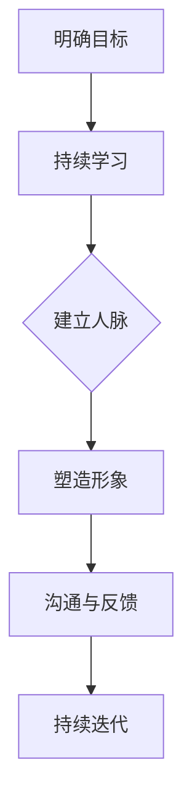
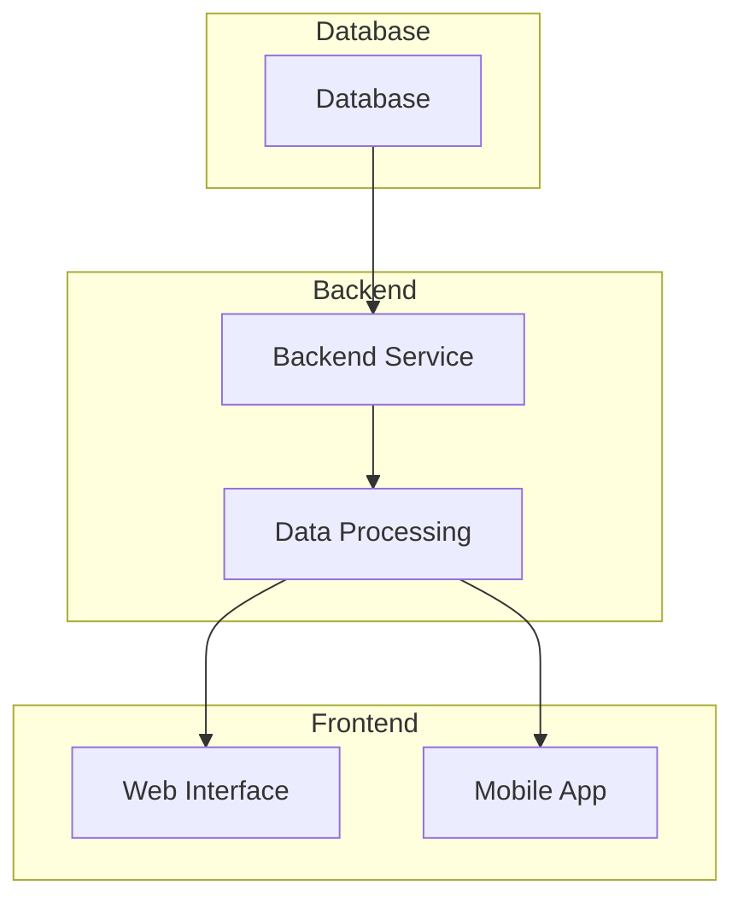
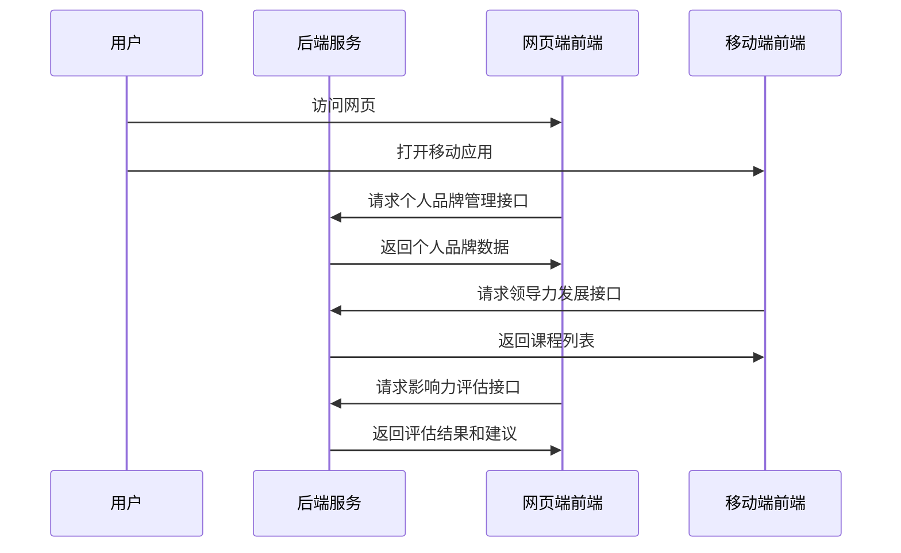
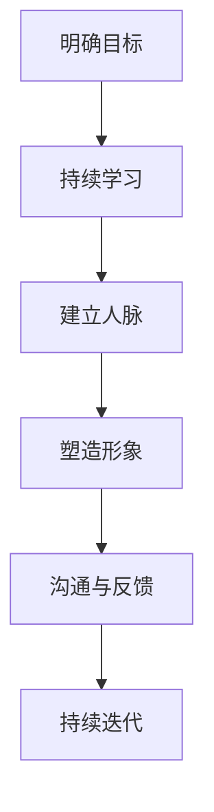
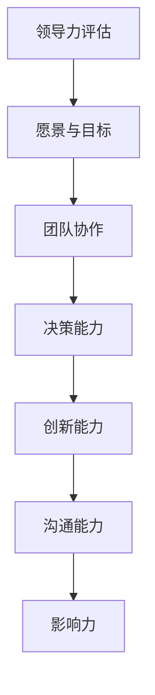
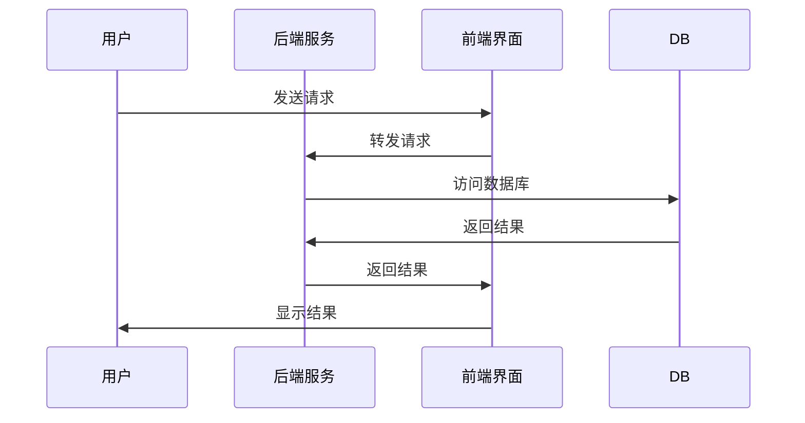

                 

# 领导力与个人品牌：树立影响力

## 关键词
- 领导力
- 个人品牌
- 影响力
- 塑造
- 成功案例

## 摘要
本文将深入探讨领导力与个人品牌建设的关联，以及如何通过有效的策略树立个人影响力。通过系统的理论分析、实际案例研究以及实战指导，我们将揭示领导力与个人品牌之间的内在联系，并提供实用的方法和技巧，帮助读者在职业发展中取得成功。

### 目录

1. **引言**
   - 领导力与个人品牌的重要性
   - 目的与结构

2. **领导力的理论基础**
   - 领导力的定义与演变
   - 经典领导力理论分析
   - 领导力模型与风格

3. **个人品牌建设**
   - 个人品牌的概念与价值
   - 个人品牌建设的关键要素
   - 个人品牌打造的方法与策略

4. **影响力塑造**
   - 影响力的定义与类型
   - 塑造个人影响力的途径
   - 维护与提升个人影响力

5. **成功领导力案例分析**
   - 企业成功领导力案例解析
   - 社会组织领导力案例解析
   - 政治领导力案例解析

6. **个人品牌与领导力的结合**
   - 个人品牌与领导力的结合
   - 双赢策略
   - 未来趋势

7. **最佳实践与总结**
   - 最佳实践
   - 小结
   - 注意事项
   - 拓展阅读

## 第1章：引言

### 领导力与个人品牌的重要性

在当今社会，领导力和个人品牌已经成为职业成功的关键因素。领导力不仅仅是管理团队的能力，更是影响和激励他人共同实现目标的艺术。而个人品牌则是个人在公众眼中的形象和声誉，是职业发展的无形资产。

**领导力**的定义多种多样，但其核心在于通过影响和激励他人来实现共同目标。有效的领导力能够促进团队协作、提升组织绩效，并在复杂多变的环境中引领团队走向成功。

**个人品牌**则是个人的价值观、专业能力和声誉的综合体现。一个强大的个人品牌能够帮助个人在职场中脱颖而出，获得更多的机会和资源。

本文的目的在于探讨领导力与个人品牌之间的关系，提供实用的方法和策略，帮助读者树立个人影响力，实现职业发展。

本文将按照以下结构进行：

1. **领导力的理论基础**：介绍领导力的定义、演变以及经典理论。
2. **个人品牌建设**：探讨个人品牌的概念、价值以及建设方法。
3. **影响力塑造**：分析影响力的类型、塑造途径以及维护方法。
4. **成功领导力案例分析**：通过实际案例展示领导力的成功实践。
5. **个人品牌与领导力的结合**：探讨如何结合个人品牌和领导力，实现双赢。
6. **未来趋势**：预测个人品牌和领导力发展的未来方向。
7. **最佳实践与总结**：提供实际操作建议和小结，帮助读者在职业发展中取得成功。

### 目录结构

本文的结构设计旨在使读者能够系统、全面地了解领导力与个人品牌建设的相关内容。通过逐章讲解，读者将逐步掌握领导力和个人品牌建设的核心概念、方法和实践。

**第一章：引言**  
- 阐述领导力与个人品牌的重要性，以及本文的目的和结构。

**第二章：领导力的理论基础**  
- 介绍领导力的定义、演变和经典理论。
- 分析领导力的模型与风格。

**第三章：个人品牌建设**  
- 探讨个人品牌的概念、价值及其建设方法。
- 提供个人品牌打造的具体策略。

**第四章：影响力塑造**  
- 分析影响力的定义、类型及其塑造途径。
- 探讨如何维护和提升个人影响力。

**第五章：成功领导力案例分析**  
- 通过企业、社会组织和政治领导力案例，展示成功实践。
- 分析案例中的领导力要素和个人品牌建设。

**第六章：个人品牌与领导力的结合**  
- 探讨个人品牌与领导力的结合点。
- 提供双赢策略和实际操作方法。

**第七章：未来趋势**  
- 预测个人品牌和领导力的发展趋势。
- 分析未来职业发展中的挑战与机遇。

**第八章：最佳实践与总结**  
- 提供最佳实践建议。
- 进行小结和注意事项。
- 推荐拓展阅读。

通过本文的深入探讨，读者将能够理解领导力与个人品牌之间的内在联系，掌握有效的塑造方法和策略，从而在职业发展中取得成功。

### 第2章：领导力的理论基础

#### 领导力的定义与演变

领导力是一个多维度的概念，它涉及到影响和激励他人实现共同目标的能力。从古至今，领导力的定义和内涵经历了多次演变。在早期的农业社会中，领导力主要是指对部落成员的指挥和管理。随着人类社会的发展，领导力逐渐超越了简单的权力和权威，更多地涉及到变革、创新和协作。

在现代社会，领导力被广泛定义为一种能够在不断变化的环境中引导、影响和激励他人实现目标的能力。这种定义强调了领导力不仅涉及个人能力，还涉及对环境和情境的敏感性。

领导力的演变可以从以下几个阶段来理解：

1. **权威领导**：在农业社会和封建社会中，领导力主要建立在权威和权力之上。领导者通过强制和压迫来维护秩序和稳定。
2. **变革领导**：随着工业革命的发展，领导力开始强调创新和变革。领导者需要具备战略思维和创新能力，以适应快速变化的环境。
3. **服务领导**：在知识经济时代，领导力逐渐从权威和变革转向服务。领导者被视为服务者，他们的目标是激励和赋能团队成员，共同实现目标。

#### 经典领导力理论分析

领导力理论的发展为理解领导力的本质和运作提供了不同的视角。以下是几种经典领导力理论的分析：

1. **特质理论**：特质理论认为领导者具备某些固有的特质，如自信、决断力、智慧和魅力。这种理论强调了领导者个人素质的重要性。然而，特质理论也存在一定的局限性，因为它忽视了环境因素对领导力的影响。

2. **行为理论**：行为理论关注领导者的行为和风格，而不是内在特质。这类理论认为，领导力可以通过学习和模仿获得。行为理论提出了多种领导风格，如民主式、专制式和参与式。这种理论强调了情境因素在领导力中的作用。

3. **变换理论**：变换理论强调领导者在不同情境下变换领导风格的能力。这种理论认为，有效的领导者能够根据环境和团队成员的需求，灵活调整自己的领导风格。

4. **情境理论**：情境理论认为，领导力效果取决于领导者、团队成员和环境之间的相互作用。这种理论提出了多种情境因素，如任务结构、团队成员的技能水平和组织文化，对领导力的影响。

#### 领导力模型与风格

领导力模型和风格是领导力理论的重要组成部分。以下是一些常见的领导力模型和风格：

1. **菲德勒模型**：菲德勒模型认为，领导者的成功取决于他们对情境的控制力。这种模型将领导力风格分为任务导向型和关系导向型，并认为在不同情境下，不同风格的领导效果不同。

2. **赫塞-布兰查德模型**：赫塞-布兰查德模型将领导风格分为四种：命令型、说服型、参与型和委托型。这种模型认为，领导者的风格应根据团队成员的成熟度进行调整。

3. **路径-目标模型**：路径-目标模型认为，领导者的任务是帮助团队成员明确目标，并提供实现目标的清晰路径。这种模型强调领导者对团队成员动机和需求的关注。

4. **变革型领导**：变革型领导强调领导者通过激励和启发团队成员来实现变革。这种领导风格通常涉及愿景塑造、激励和赋能团队成员。

#### 小结

领导力的理论基础为我们理解领导力的本质和运作提供了不同的视角。从特质理论到行为理论，再到情境理论和变换理论，这些理论帮助我们认识领导力的多样性和复杂性。同时，领导力模型和风格为我们提供了具体的实践指南，帮助我们根据不同情境和团队成员的需求，选择合适的领导风格。

在接下来的章节中，我们将进一步探讨个人品牌建设的重要性，以及如何通过有效的策略塑造个人影响力。

### 第3章：个人品牌建设

#### 个人品牌的概念与价值

个人品牌是指个人在公众眼中的形象和声誉，是个人价值观、专业能力和影响力的综合体现。一个强大的个人品牌能够在职业发展中带来诸多价值，如提高知名度、增加机会和资源、提升竞争力等。

个人品牌不仅仅是个人形象的象征，更是个人在职业市场中的差异化优势。在竞争激烈的职场环境中，一个鲜明的个人品牌能够帮助个人脱颖而出，吸引更多的关注和机会。

#### 个人品牌建设的关键要素

要建设一个强大的个人品牌，需要关注以下几个关键要素：

1. **明确定位**：个人品牌定位是个人品牌的基石。一个明确的定位能够帮助个人在众多竞争者中脱颖而出，树立独特的形象。定位应基于个人的核心能力和专业领域，并结合市场需求和职业目标。

2. **持续学习**：持续学习是提升个人品牌价值的关键。通过不断学习和提升自己的专业能力，个人能够在职业市场中保持竞争力，增强个人品牌的吸引力。

3. **专业能力**：专业能力是个人品牌的核心。一个具备高水平专业能力的个人，能够为他人提供可靠的价值，从而提升个人品牌的信任度和影响力。

4. **良好口碑**：口碑是个人品牌的重要支撑。通过积极的人际关系管理和良好的职业行为，个人能够积累良好的口碑，提升个人品牌的声誉。

5. **社交媒体**：社交媒体是现代个人品牌建设的重要平台。通过合理运用社交媒体，个人能够扩大影响力，提升知名度，并与潜在客户和合作伙伴建立联系。

#### 个人品牌打造的方法与策略

以下是一些打造个人品牌的实用方法和策略：

1. **建立个人网站**：个人网站是展示个人品牌的重要平台。通过建立个人网站，个人可以展示自己的专业能力、成果和价值观，吸引更多的关注和机会。

2. **发布专业内容**：定期发布高质量的专业内容，如博客、文章、视频等，是提升个人品牌影响力的重要手段。这些内容应结合个人的专业领域和市场需求，提供有价值的见解和知识。

3. **参与行业活动**：参与行业活动，如研讨会、讲座、会议等，是拓展人际关系、提升个人知名度的重要途径。通过这些活动，个人可以与同行建立联系，分享专业经验，提升个人品牌的价值。

4. **社交媒体运营**：合理运用社交媒体平台，如微博、微信公众号、LinkedIn等，发布专业内容、分享行业动态、互动交流等，是扩大个人影响力、提升品牌知名度的有效方法。

5. **建立专业网络**：通过建立和维护专业网络，如加入行业协会、专业社群等，个人可以拓展人脉资源，提升个人品牌的影响力。

#### 小结

个人品牌建设是一个系统性、长期性的过程，需要个人明确定位、持续学习、提升专业能力、积累良好口碑，并运用有效的方法和策略进行推广。一个强大的个人品牌能够为个人的职业发展带来巨大的价值，帮助个人在竞争激烈的职场中脱颖而出。

在接下来的章节中，我们将进一步探讨影响力的塑造，以及如何通过有效的策略提升个人影响力。

### 第4章：影响力塑造

#### 影响力的定义与类型

影响力是指个人或组织通过某种方式影响他人思想、行为或决策的能力。在职业和个人生活中，影响力是取得成功的重要因素之一。根据影响力对象和方式的不同，影响力可以分为以下几种类型：

1. **权威性影响力**：基于个人的职位、权力或专业能力，通过指示、命令等方式影响他人。
2. **专家性影响力**：基于个人的专业知识和经验，通过分享见解、提供解决方案等方式影响他人。
3. **情感性影响力**：基于个人与他人的情感联系，通过情感共鸣、同理心等方式影响他人。
4. **合法性影响力**：基于社会规范、法律和道德，通过规范引导、道德约束等方式影响他人。

#### 塑造个人影响力的途径

要塑造个人影响力，需要关注以下几个方面：

1. **建立专业权威**：通过不断学习和提升专业能力，成为某一领域的专家，从而在专业领域内建立权威性影响力。
2. **提供价值**：通过分享知识、提供解决方案、帮助他人解决问题等方式，为他人提供价值，从而赢得他们的信任和支持。
3. **建立良好的人际关系**：通过真诚待人、尊重他人、倾听他人意见等方式，建立良好的人际关系，从而增强情感性影响力。
4. **树立道德榜样**：通过遵守社会规范、遵循道德原则，树立良好的道德形象，从而赢得合法性影响力。

#### 维护与提升个人影响力

个人影响力并非一成不变，需要通过持续的努力和策略来维护和提升。以下是一些维护和提升个人影响力的方法：

1. **持续学习与成长**：不断学习和提升自己的专业能力，以适应不断变化的市场需求，从而保持个人影响力的持久性。
2. **保持沟通与互动**：通过社交媒体、行业活动、线下聚会等方式，与同行、客户和潜在合作伙伴保持沟通和互动，增强个人影响力的传播和辐射范围。
3. **建立专业网络**：积极参与行业协会、专业社群等，拓展专业人脉资源，提升个人品牌的影响力。
4. **积极分享与传播**：通过撰写文章、发表演讲、参与讨论等方式，积极分享自己的专业知识和经验，提升个人品牌的知名度。
5. **关注社会热点与趋势**：关注社会热点和行业趋势，积极参与相关讨论和交流，提升个人在行业内的专业地位和影响力。

#### 小结

影响力是个人和职业发展的重要资产。通过建立专业权威、提供价值、建立良好的人际关系和树立道德榜样，个人可以塑造强大的影响力。同时，通过持续学习、保持沟通、建立专业网络和积极分享，个人可以维护和提升自己的影响力。

在接下来的章节中，我们将通过实际案例，分析成功领导力在个人品牌建设中的实践。

### 第5章：成功领导力案例分析

#### 企业成功领导力案例解析

在商业领域，成功的领导力案例比比皆是。以下是一个企业领导力成功的案例，以及其个人品牌建设的实践。

**案例：苹果公司**

**领导力实践**：苹果公司的创始人史蒂夫·乔布斯以其卓越的领导力著称。他的领导风格强调创新、愿景和极致的用户体验。乔布斯通过以下几个方面展现了其领导力：

1. **明确愿景**：乔布斯具有清晰的愿景，他能够将这一愿景传递给团队成员，激发他们的激情和创造力。
2. **激励团队**：乔布斯通过赞美和奖励来激励团队成员，使他们始终保持对工作的热情。
3. **勇于决策**：在面临重要决策时，乔布斯能够果断作出决策，并带领团队执行。
4. **创新精神**：乔布斯对创新有着极高的追求，他不断推动苹果公司推出具有颠覆性的产品。

**个人品牌建设**：乔布斯的个人品牌建设也堪称典范。他通过以下几个方面树立了个人品牌：

1. **专业权威**：乔布斯在计算机和科技领域的专业知识使他成为了行业的权威人物。
2. **领导力**：乔布斯的领导风格和成就使他成为了企业领导者的典范。
3. **创新精神**：乔布斯对创新的追求使他在公众眼中成为了创新的代表。

**案例启示**：乔布斯的成功领导力和个人品牌建设为我们提供了以下几个启示：

1. **明确愿景**：一个明确的愿景能够激发团队的斗志和创造力。
2. **激励团队**：有效的激励措施能够提升团队的凝聚力和执行力。
3. **勇于决策**：果断的决策和执行力是企业成功的关键。
4. **创新精神**：创新是企业和个人品牌持续发展的动力。

#### 社会组织领导力案例解析

在社会组织领域，成功的领导力案例同样具有很高的借鉴意义。以下是一个社会组织领导力成功的案例。

**案例：无国界医生**

**领导力实践**：无国界医生的创始人弗朗索瓦丝·博尼·斯坦弗利·德·布劳格以其卓越的领导力在医疗援助领域取得了显著成就。她的领导力实践体现在以下几个方面：

1. **使命感**：无国界医生的使命是提供医疗援助，尤其是在危机地区。弗朗索瓦丝通过强调这一使命，激发了团队成员的奉献精神和责任感。
2. **透明管理**：弗朗索瓦丝强调组织的透明度，确保资源合理利用，赢得了团队成员和公众的信任。
3. **团队协作**：她注重团队协作，鼓励团队成员发挥各自的专长，共同为组织目标努力。
4. **适应变化**：面对复杂的国际形势和不断变化的救援需求，弗朗索瓦丝能够灵活调整策略，确保组织的持续发展。

**个人品牌建设**：弗朗索瓦丝的个人品牌建设也值得称赞。她通过以下几个方面树立了个人品牌：

1. **专业背景**：弗朗索瓦丝具有丰富的医疗和救援经验，使她在这一领域具有很高的专业权威。
2. **领导力**：她在无国界医生的成功领导使其成为了国际社会公认的社会组织领导者。
3. **人道主义精神**：她的人道主义精神使她在公众中赢得了广泛的支持和尊重。

**案例启示**：弗朗索瓦丝·博尼·斯坦弗利·德·布劳格的成功领导力和个人品牌建设为我们提供了以下几个启示：

1. **使命感**：明确的使命是激发团队成员热情和奉献精神的关键。
2. **透明管理**：透明管理能够赢得团队成员和公众的信任。
3. **团队协作**：有效的团队协作能够提升组织的执行力和创新能力。
4. **适应变化**：灵活应对变化是组织持续发展的关键。

#### 政治领导力案例解析

在政治领域，成功的领导力案例同样具有重要的参考价值。以下是一个政治领导力成功的案例。

**案例：美国前总统奥巴马**

**领导力实践**：奥巴马以其卓越的政治领导力在任期内取得了显著成就。他的领导力实践体现在以下几个方面：

1. **沟通能力**：奥巴马具有出色的沟通能力，他能够通过演讲、电视节目等方式，有效地与公众沟通，传达政策理念和目标。
2. **政策制定**：奥巴马在政策制定方面表现出色，他能够平衡不同利益集团的需求，制定出符合国家利益的政策。
3. **团队建设**：他注重团队建设，选拔了一批优秀的顾问和工作人员，确保政府的有效运作。
4. **领导风格**：奥巴马的领导风格温和而坚定，他能够激励团队成员，共同为国家的目标努力。

**个人品牌建设**：奥巴马的个人品牌建设也颇具特色。他通过以下几个方面树立了个人品牌：

1. **领导力**：他的政治成就使他成为了全球公认的政治领袖。
2. **政策理念**：他的政策理念赢得了广泛支持，使他成为了美国历史上最受欢迎的总统之一。
3. **个人魅力**：他的人格魅力和亲和力使他在公众中具有很高的人气。

**案例启示**：奥巴马的成功领导力和个人品牌建设为我们提供了以下几个启示：

1. **沟通能力**：有效的沟通能力能够提升个人的影响力和领导力。
2. **政策制定**：平衡各方利益，制定出符合国家利益的政策是政治领导力的关键。
3. **团队建设**：选拔和培养一支优秀的团队是确保政府有效运作的基础。
4. **领导风格**：温和而坚定的领导风格能够激励团队成员，共同实现目标。

#### 小结

通过以上成功领导力案例的分析，我们可以看到，无论是企业、社会组织还是政治领域，成功的领导力都离不开明确的愿景、有效的沟通、团队协作和适应变化。同时，个人品牌建设也是领导力成功的重要组成部分。通过塑造个人品牌，领导者能够提升自己的影响力，赢得更多的支持和信任。这些成功案例为我们提供了宝贵的启示，帮助我们更好地理解和应用领导力和个人品牌建设的策略。

在接下来的章节中，我们将探讨如何将个人品牌与领导力相结合，实现双赢。

### 第6章：个人品牌与领导力的结合

#### 个人品牌与领导力的结合

个人品牌与领导力之间的结合是职业发展中的重要策略。一个强大的个人品牌可以为领导力提供支持，而领导力则可以增强个人品牌的影响力。以下是如何将个人品牌与领导力相结合，实现双赢的具体策略：

1. **强化个人品牌，提升领导力**：
   - 通过建立强大的个人品牌，个人可以在领导团队时更具说服力和影响力。一个具有专业权威和个人魅力的领导者，能够更容易地赢得团队成员的信任和追随。
   - 通过持续的专业学习和成果分享，个人品牌可以不断提升，进而增强领导力。

2. **利用领导力，扩大个人品牌影响力**：
   - 领导者可以利用自己的职位和影响力，将个人品牌推广给更广泛的受众。通过参与行业活动、发表演讲和撰写文章，领导者可以扩大个人品牌的知名度。
   - 领导力还体现在对团队成员的激励和培养上，通过帮助他们成长，领导者也可以提升个人品牌的价值。

#### 双赢策略

要实现个人品牌与领导力的双赢，可以采取以下策略：

1. **明确目标**：
   - 在个人品牌建设过程中，要明确个人目标，并将其与组织目标相结合。这样，个人品牌的发展将更好地服务于领导职责，实现双赢。

2. **持续学习与成长**：
   - 个人品牌的建设需要持续的学习和成长。领导者应不断更新自己的知识和技能，以保持个人品牌的活力和竞争力。
   - 通过参加培训课程、阅读专业书籍和参与行业交流，领导者可以不断提升自己的专业能力，从而增强个人品牌的价值。

3. **积极参与**：
   - 领导者应积极参与各种活动和项目，以提升个人品牌的影响力。这不仅包括内部项目，还应包括外部活动和合作，如行业会议、论坛和公开演讲。
   - 通过积极参与，领导者可以展示自己的专业能力和领导力，吸引更多的关注和机会。

4. **建立良好的沟通**：
   - 建立良好的沟通是领导力的核心。领导者应通过多种渠道与团队成员、合作伙伴和利益相关者保持有效沟通。
   - 通过沟通，领导者可以了解团队成员的需求和期望，进而提供更有针对性的指导和支持，同时提升个人品牌的影响力。

5. **培养团队**：
   - 领导者不仅要关注个人品牌的建设，还应注重团队的发展。通过培养团队成员，提升他们的能力和素质，领导者可以增强团队的整体实力。
   - 当团队成员取得成就时，领导者可以将其与个人品牌相结合，共同提升个人和团队的价值。

#### 实际操作方法

以下是实现个人品牌与领导力结合的实际操作方法：

1. **创建个人品牌故事**：
   - 创建一个关于个人的故事，将其融入到领导力实践中。这个故事应包括个人的价值观、专业经历和成功案例。
   - 通过讲述这个故事，领导者可以展示自己的领导力和个人品牌。

2. **利用社交媒体**：
   - 利用社交媒体平台，如LinkedIn、Twitter和Instagram等，发布个人专业内容、领导力和个人品牌的动态。
   - 通过社交媒体，领导者可以扩大个人品牌的影响力，并与更多潜在合作伙伴建立联系。

3. **撰写专业文章**：
   - 定期撰写专业文章、博客或书籍，分享个人的见解和经验。
   - 通过撰写专业文章，领导者可以展示自己的专业知识和领导力，同时提升个人品牌的影响力。

4. **参与行业活动**：
   - 积极参与行业会议、研讨会和论坛，与行业专家和同行交流。
   - 通过参与行业活动，领导者可以展示自己的领导力和个人品牌，同时拓展专业网络。

5. **培养团队成员**：
   - 关注团队成员的成长，提供指导和支持，帮助他们提升专业能力和领导力。
   - 当团队成员取得成就时，领导者可以将其与个人品牌相结合，共同宣传。

#### 小结

个人品牌与领导力的结合是实现职业成功的关键策略。通过强化个人品牌、利用领导力、明确目标、持续学习与成长、建立良好沟通和培养团队，领导者可以提升个人品牌的影响力，同时增强领导力。这些策略不仅有助于个人职业发展，也为组织带来了更多的价值。在未来的职业发展中，领导者应积极探索和实践这些策略，实现个人品牌与领导力的双赢。

### 第7章：个人品牌与领导力发展的未来趋势

#### 未来职业发展的挑战与机遇

随着科技的快速发展和社会的不断变革，个人品牌与领导力在未来的职业发展中将面临新的挑战与机遇。以下是对未来趋势的探讨：

1. **数字化时代的个人品牌建设**：
   - 数字化技术为个人品牌建设提供了更多机会。通过社交媒体、博客、视频平台等，个人可以更广泛地传播自己的专业知识和个人魅力。
   - 然而，数字化时代也带来了信息过载和隐私保护的挑战。个人需要在数字平台上保持专业的形象，同时保护个人隐私。

2. **远程办公与领导力**：
   - 随着远程办公的普及，领导力需要适应新的工作模式。领导者需要具备远程沟通、团队管理和文化塑造的能力。
   - 远程办公提供了更多的灵活性，但也可能增加团队成员之间的隔阂。领导者需要通过有效的沟通和激励机制，保持团队的凝聚力。

3. **可持续发展与领导力**：
   - 可持续发展已成为全球关注的焦点。领导者需要在业务决策中融入可持续发展理念，推动企业和社会的可持续发展。
   - 这要求领导者具备更强的社会责任感和环境意识，同时也为个人品牌建设带来了新的机遇。

4. **人工智能与领导力**：
   - 人工智能技术的快速发展将对领导力产生深远影响。领导者需要了解人工智能的应用场景，利用人工智能提升工作效率和决策质量。
   - 同时，人工智能也可能对某些职业造成冲击，领导者需要具备适应变革的能力，帮助团队应对技术变革带来的挑战。

5. **全球视野与领导力**：
   - 全球化趋势要求领导者具备全球视野和文化敏感性。领导者需要了解不同文化和市场的特点，以更好地进行跨文化领导和全球业务拓展。
   - 这不仅提升了领导力的要求，也为个人品牌建设提供了更广阔的舞台。

#### 个人品牌与领导力发展的未来趋势

基于以上挑战与机遇，个人品牌与领导力在未来将呈现以下趋势：

1. **多元化与个性化**：
   - 随着社会多元化和个性化需求的增加，个人品牌将更加注重差异化。领导者需要展示自己的独特价值和个性，以在竞争激烈的职场中脱颖而出。

2. **数字化转型**：
   - 数字化技术将继续改变个人品牌建设和领导力实践。领导者需要不断提升数字化技能，利用数字工具和平台提升个人品牌的影响力。

3. **可持续发展**：
   - 可持续发展将成为个人品牌和领导力的重要议题。领导者需要融入可持续发展理念，推动企业和社会的可持续发展，以树立负责任的形象。

4. **跨文化领导**：
   - 全球化趋势将要求领导者具备更强的跨文化领导能力。领导者需要了解不同文化的特点和沟通方式，以实现全球业务的协同合作。

5. **终身学习**：
   - 领导力和个人品牌建设将更加注重终身学习。领导者需要不断更新知识和技能，以适应快速变化的市场环境。

#### 小结

未来职业发展中，个人品牌与领导力将面临新的挑战与机遇。通过多元化与个性化、数字化转型、可持续发展、跨文化领导和终身学习，领导者可以不断提升个人品牌的影响力，并在全球化的背景下实现职业成功。领导者应积极适应这些趋势，为个人品牌和领导力的发展奠定坚实基础。

### 第8章：最佳实践与总结

#### 最佳实践

在个人品牌和领导力建设中，以下是一些最佳实践：

1. **明确目标**：明确个人品牌和领导力的目标，确保品牌定位与职业目标一致。
2. **持续学习**：定期更新知识和技能，保持专业领域的领先地位。
3. **建立人脉**：积极参与行业活动，拓展专业网络，提升个人品牌的影响力。
4. **塑造形象**：通过社交媒体和专业平台展示专业能力和领导力，塑造良好的个人形象。
5. **沟通与反馈**：保持与团队成员和合作伙伴的沟通，倾听他们的意见和建议，不断改进个人品牌和领导力实践。

#### 小结

本文通过系统地分析领导力与个人品牌建设的相关内容，探讨了如何通过有效的策略树立个人影响力。我们了解了领导力的定义、演变和经典理论，探讨了个人品牌的概念与价值，以及塑造个人影响力的途径。同时，通过成功案例的分析，我们看到了领导力和个人品牌建设在实际应用中的具体实践。

在未来的职业发展中，个人品牌和领导力将面临新的挑战与机遇。通过明确目标、持续学习、建立人脉、塑造形象和沟通与反馈，我们可以不断提升个人品牌的影响力，实现职业成功。希望本文的讨论和最佳实践能为您的职业发展提供有益的指导。

#### 注意事项

1. **避免盲目追求**：在建立个人品牌和领导力的过程中，避免盲目追求短期成效，应注重长期价值的积累。
2. **关注专业领域**：专注于自己的专业领域，不断提升专业能力，以树立权威形象。
3. **保持真实**：在展示个人品牌时，保持真实和诚信，避免夸大和虚假宣传。
4. **平衡工作与生活**：在追求职业成功的同时，注意平衡工作与生活，保持身心健康。

#### 拓展阅读

1. **《影响力：说服的心理学》**：罗伯特·西奥迪尼（Robert B. Cialdini）著，详细解析了影响他人行为的心理学原理。
2. **《领导者的语言》**：约瑟夫·奥布赖恩（Joseph M. O’Connor）著，探讨了领导者如何运用语言塑造个人品牌和影响力。
3. **《个人品牌》**：汤姆·彼得斯（Tom Peters）著，提供了个人品牌建设的全面指导。
4. **《变革型领导》**：詹姆斯·M·麦格雷戈·赫斯克特（James M. Heskett）和帕特里克·约翰逊（Patrick Johnson）著，深入分析了变革型领导的力量。

作者：AI天才研究院/AI Genius Institute & 禅与计算机程序设计艺术 /Zen And The Art of Computer Programming

----------------------------------------------------------------

```markdown
# 领导力与个人品牌：树立影响力

## 关键词
- 领导力
- 个人品牌
- 影响力
- 塑造
- 成功案例

## 摘要
本文深入探讨了领导力与个人品牌建设的关联，以及如何通过有效的策略树立个人影响力。通过系统的理论分析、实际案例研究以及实战指导，本文揭示了领导力与个人品牌之间的内在联系，并提供实用的方法和策略，帮助读者在职业发展中取得成功。

### 第1章：引言

#### 领导力与个人品牌的重要性

在当今社会，领导力和个人品牌已经成为职业成功的关键因素。领导力不仅仅是管理团队的能力，更是影响和激励他人共同实现目标的艺术。而个人品牌则是个人在公众眼中的形象和声誉，是职业发展的无形资产。

**领导力**的定义多种多样，但其核心在于通过影响和激励他人来实现共同目标。有效的领导力能够促进团队协作、提升组织绩效，并在复杂多变的环境中引领团队走向成功。

**个人品牌**则是个人的价值观、专业能力和声誉的综合体现。一个强大的个人品牌能够帮助个人在职场中脱颖而出，获得更多的机会和资源。

本文的目的在于探讨领导力与个人品牌之间的关系，提供实用的方法和策略，帮助读者树立个人影响力，实现职业发展。

本文将按照以下结构进行：

1. **领导力的理论基础**：介绍领导力的定义、演变以及经典理论。
2. **个人品牌建设**：探讨个人品牌的概念、价值及其建设方法。
3. **影响力塑造**：分析影响力的定义、类型及其塑造途径。
4. **成功领导力案例分析**：通过实际案例展示领导力的成功实践。
5. **个人品牌与领导力的结合**：探讨如何结合个人品牌和领导力，实现双赢。
6. **未来趋势**：预测个人品牌和领导力的发展趋势。
7. **最佳实践与总结**：提供实际操作建议和小结，帮助读者在职业发展中取得成功。

### 第2章：领导力的理论基础

#### 领导力的定义与演变

领导力是一个多维度的概念，它涉及到影响和激励他人实现共同目标的能力。从古至今，领导力的定义和内涵经历了多次演变。在早期的农业社会中，领导力主要是指对部落成员的指挥和管理。随着人类社会的发展，领导力逐渐超越了简单的权力和权威，更多地涉及到变革、创新和协作。

在现代社会，领导力被广泛定义为一种能够在不断变化的环境中引导、影响和激励他人实现目标的能力。这种定义强调了领导力不仅涉及个人能力，还涉及对环境和情境的敏感性。

领导力的演变可以从以下几个阶段来理解：

1. **权威领导**：在农业社会和封建社会中，领导力主要建立在权威和权力之上。领导者通过强制和压迫来维护秩序和稳定。
2. **变革领导**：随着工业革命的发展，领导力开始强调创新和变革。领导者需要具备战略思维和创新能力，以适应快速变化的环境。
3. **服务领导**：在知识经济时代，领导力逐渐从权威和变革转向服务。领导者被视为服务者，他们的目标是激励和赋能团队成员，共同实现目标。

#### 经典领导力理论分析

领导力理论的发展为理解领导力的本质和运作提供了不同的视角。以下是几种经典领导力理论的分析：

1. **特质理论**：特质理论认为领导者具备某些固有的特质，如自信、决断力、智慧和魅力。这种理论强调了领导者个人素质的重要性。然而，特质理论也存在一定的局限性，因为它忽视了环境因素对领导力的影响。

2. **行为理论**：行为理论关注领导者的行为和风格，而不是内在特质。这类理论认为，领导力可以通过学习和模仿获得。行为理论提出了多种领导风格，如民主式、专制式和参与式。这种理论强调了情境因素在领导力中的作用。

3. **变换理论**：变换理论强调领导者在不同情境下变换领导风格的能力。这种理论认为，有效的领导者能够根据环境和团队成员的需求，灵活调整自己的领导风格。

4. **情境理论**：情境理论认为，领导力效果取决于领导者、团队成员和环境之间的相互作用。这种理论提出了多种情境因素，如任务结构、团队成员的技能水平和组织文化，对领导力的影响。

#### 领导力模型与风格

领导力模型和风格是领导力理论的重要组成部分。以下是一些常见的领导力模型和风格：

1. **菲德勒模型**：菲德勒模型认为，领导者的成功取决于他们对情境的控制力。这种模型将领导力风格分为任务导向型和关系导向型，并认为在不同情境下，不同风格的领导效果不同。

2. **赫塞-布兰查德模型**：赫塞-布兰查德模型将领导风格分为四种：命令型、说服型、参与型和委托型。这种模型认为，领导者的风格应根据团队成员的成熟度进行调整。

3. **路径-目标模型**：路径-目标模型认为，领导者的任务是帮助团队成员明确目标，并提供实现目标的清晰路径。这种模型强调领导者对团队成员动机和需求的关注。

4. **变革型领导**：变革型领导强调领导者通过激励和启发团队成员来实现变革。这种领导风格通常涉及愿景塑造、激励和赋能团队成员。

#### 小结

领导力的理论基础为我们理解领导力的本质和运作提供了不同的视角。从特质理论到行为理论，再到情境理论和变换理论，这些理论帮助我们认识领导力的多样性和复杂性。同时，领导力模型和风格为我们提供了具体的实践指南，帮助我们根据不同情境和团队成员的需求，选择合适的领导风格。

在接下来的章节中，我们将进一步探讨个人品牌建设的重要性，以及如何通过有效的策略塑造个人影响力。

### 第3章：个人品牌建设

#### 个人品牌的概念与价值

个人品牌是指个人在公众眼中的形象和声誉，是个人价值观、专业能力和影响力的综合体现。一个强大的个人品牌能够在职业发展中带来诸多价值，如提高知名度、增加机会和资源、提升竞争力等。

个人品牌不仅仅是个人形象的象征，更是个人在职业市场中的差异化优势。在竞争激烈的职场环境中，一个鲜明的个人品牌能够帮助个人脱颖而出，吸引更多的关注和机会。

#### 个人品牌建设的关键要素

要建设一个强大的个人品牌，需要关注以下几个关键要素：

1. **明确定位**：个人品牌定位是个人品牌的基石。一个明确的定位能够帮助个人在众多竞争者中脱颖而出，树立独特的形象。定位应基于个人的核心能力和专业领域，并结合市场需求和职业目标。

2. **持续学习**：持续学习是提升个人品牌价值的关键。通过不断学习和提升自己的专业能力，个人能够在职业市场中保持竞争力，增强个人品牌的吸引力。

3. **专业能力**：专业能力是个人品牌的核心。一个具备高水平专业能力的个人，能够为他人提供可靠的价值，从而提升个人品牌的信任度和影响力。

4. **良好口碑**：口碑是个人品牌的重要支撑。通过积极的人际关系管理和良好的职业行为，个人能够积累良好的口碑，提升个人品牌的声誉。

5. **社交媒体**：社交媒体是现代个人品牌建设的重要平台。通过合理运用社交媒体，个人能够扩大影响力，提升知名度，并与潜在客户和合作伙伴建立联系。

#### 个人品牌打造的方法与策略

以下是一些打造个人品牌的实用方法和策略：

1. **建立个人网站**：个人网站是展示个人品牌的重要平台。通过建立个人网站，个人可以展示自己的专业能力、成果和价值观，吸引更多的关注和机会。

2. **发布专业内容**：定期发布高质量的专业内容，如博客、文章、视频等，是提升个人品牌影响力的重要手段。这些内容应结合个人的专业领域和市场需求，提供有价值的见解和知识。

3. **参与行业活动**：参与行业活动，如研讨会、讲座、会议等，是拓展人际关系、提升个人知名度的重要途径。通过这些活动，个人可以与同行建立联系，分享专业经验，提升个人品牌的价值。

4. **社交媒体运营**：合理运用社交媒体平台，如微博、微信公众号、LinkedIn等，发布专业内容、分享行业动态、互动交流等，是扩大个人影响力、提升品牌知名度的有效方法。

5. **建立专业网络**：通过建立和维护专业网络，如加入行业协会、专业社群等，个人可以拓展专业人脉资源，提升个人品牌的影响力。

#### 小结

个人品牌建设是一个系统性、长期性的过程，需要个人明确定位、持续学习、提升专业能力、积累良好口碑，并运用有效的方法和策略进行推广。一个强大的个人品牌能够为个人的职业发展带来巨大的价值，帮助个人在竞争激烈的职场中脱颖而出。

在接下来的章节中，我们将进一步探讨影响力的塑造，以及如何通过有效的策略提升个人影响力。

### 第4章：影响力塑造

#### 影响力的定义与类型

影响力是指个人或组织通过某种方式影响他人思想、行为或决策的能力。在职业和个人生活中，影响力是取得成功的重要因素之一。根据影响力对象和方式的不同，影响力可以分为以下几种类型：

1. **权威性影响力**：基于个人的职位、权力或专业能力，通过指示、命令等方式影响他人。
2. **专家性影响力**：基于个人的专业知识和经验，通过分享见解、提供解决方案等方式影响他人。
3. **情感性影响力**：基于个人与他人的情感联系，通过情感共鸣、同理心等方式影响他人。
4. **合法性影响力**：基于社会规范、法律和道德，通过规范引导、道德约束等方式影响他人。

#### 塑造个人影响力的途径

要塑造个人影响力，需要关注以下几个方面：

1. **建立专业权威**：通过不断学习和提升专业能力，成为某一领域的专家，从而在专业领域内建立权威性影响力。
2. **提供价值**：通过分享知识、提供解决方案、帮助他人解决问题等方式，为他人提供价值，从而赢得他们的信任和支持。
3. **建立良好的人际关系**：通过真诚待人、尊重他人、倾听他人意见等方式，建立良好的人际关系，从而增强情感性影响力。
4. **树立道德榜样**：通过遵守社会规范、遵循道德原则，树立良好的道德形象，从而赢得合法性影响力。

#### 维护与提升个人影响力

个人影响力并非一成不变，需要通过持续的努力和策略来维护和提升。以下是一些维护和提升个人影响力的方法：

1. **持续学习与成长**：不断学习和提升自己的专业能力，以适应不断变化的市场需求，从而保持个人影响力的持久性。
2. **保持沟通与互动**：通过社交媒体、行业活动、线下聚会等方式，与同行、客户和潜在合作伙伴保持沟通和互动，增强个人影响力的传播和辐射范围。
3. **建立专业网络**：积极参与行业协会、专业社群等，拓展专业人脉资源，提升个人品牌的影响力。
4. **积极分享与传播**：通过撰写文章、发表演讲、参与讨论等方式，积极分享自己的专业知识和经验，提升个人品牌的知名度。
5. **关注社会热点与趋势**：关注社会热点和行业趋势，积极参与相关讨论和交流，提升个人在行业内的专业地位和影响力。

#### 小结

影响力是个人和职业发展的重要资产。通过建立专业权威、提供价值、建立良好的人际关系和树立道德榜样，个人可以塑造强大的影响力。同时，通过持续学习、保持沟通、建立专业网络和积极分享，个人可以维护和提升自己的影响力。

在接下来的章节中，我们将通过实际案例，分析成功领导力在个人品牌建设中的实践。

### 第5章：成功领导力案例分析

#### 企业成功领导力案例解析

在商业领域，成功的领导力案例比比皆是。以下是一个企业领导力成功的案例，以及其个人品牌建设的实践。

**案例：苹果公司**

**领导力实践**：苹果公司的创始人史蒂夫·乔布斯以其卓越的领导力著称。他的领导风格强调创新、愿景和极致的用户体验。乔布斯通过以下几个方面展现了其领导力：

1. **明确愿景**：乔布斯具有清晰的愿景，他能够将这一愿景传递给团队成员，激发他们的激情和创造力。
2. **激励团队**：乔布斯通过赞美和奖励来激励团队成员，使他们始终保持对工作的热情。
3. **勇于决策**：在面临重要决策时，乔布斯能够果断作出决策，并带领团队执行。
4. **创新精神**：乔布斯对创新有着极高的追求，他不断推动苹果公司推出具有颠覆性的产品。

**个人品牌建设**：乔布斯的个人品牌建设也堪称典范。他通过以下几个方面树立了个人品牌：

1. **专业权威**：乔布斯在计算机和科技领域的专业知识使他成为了行业的权威人物。
2. **领导力**：乔布斯的领导风格和成就使他成为了企业领导者的典范。
3. **创新精神**：乔布斯对创新的追求使他在公众眼中成为了创新的代表。

**案例启示**：乔布斯的成功领导力和个人品牌建设为我们提供了以下几个启示：

1. **明确愿景**：一个明确的愿景能够激发团队的斗志和创造力。
2. **激励团队**：有效的激励措施能够提升团队的凝聚力和执行力。
3. **勇于决策**：果断的决策和执行力是企业成功的关键。
4. **创新精神**：创新是企业和个人品牌持续发展的动力。

#### 社会组织领导力案例解析

在社会组织领域，成功的领导力案例同样具有很高的借鉴意义。以下是一个社会组织领导力成功的案例。

**案例：无国界医生**

**领导力实践**：无国界医生的创始人弗朗索瓦丝·博尼·斯坦弗利·德·布劳格以其卓越的领导力在医疗援助领域取得了显著成就。她的领导力实践体现在以下几个方面：

1. **使命感**：无国界医生的使命是提供医疗援助，尤其是在危机地区。弗朗索瓦丝通过强调这一使命，激发了团队成员的奉献精神和责任感。
2. **透明管理**：弗朗索瓦丝强调组织的透明度，确保资源合理利用，赢得了团队成员和公众的信任。
3. **团队协作**：她注重团队协作，鼓励团队成员发挥各自的专长，共同为组织目标努力。
4. **适应变化**：面对复杂的国际形势和不断变化的救援需求，弗朗索瓦丝能够灵活调整策略，确保组织的持续发展。

**个人品牌建设**：弗朗索瓦丝的个人品牌建设也值得称赞。她通过以下几个方面树立了个人品牌：

1. **专业背景**：弗朗索瓦丝具有丰富的医疗和救援经验，使她在这一领域具有很高的专业权威。
2. **领导力**：她在无国界医生的成功领导使其成为了国际社会公认的社会组织领导者。
3. **人道主义精神**：她的人道主义精神使她在公众中赢得了广泛的支持和尊重。

**案例启示**：弗朗索瓦丝·博尼·斯坦弗利·德·布劳格的成功领导力和个人品牌建设为我们提供了以下几个启示：

1. **使命感**：明确的使命是激发团队成员热情和奉献精神的关键。
2. **透明管理**：透明管理能够赢得团队成员和公众的信任。
3. **团队协作**：有效的团队协作能够提升组织的执行力和创新能力。
4. **适应变化**：灵活应对变化是组织持续发展的关键。

#### 政治领导力案例解析

在政治领域，成功的领导力案例同样具有重要的参考价值。以下是一个政治领导力成功的案例。

**案例：美国前总统奥巴马**

**领导力实践**：奥巴马以其卓越的政治领导力在任期内取得了显著成就。他的领导力实践体现在以下几个方面：

1. **沟通能力**：奥巴马具有出色的沟通能力，他能够通过演讲、电视节目等方式，有效地与公众沟通，传达政策理念和目标。
2. **政策制定**：奥巴马在政策制定方面表现出色，他能够平衡不同利益集团的需求，制定出符合国家利益的政策。
3. **团队建设**：他注重团队建设，选拔了一批优秀的顾问和工作人员，确保政府的有效运作。
4. **领导风格**：奥巴马的领导风格温和而坚定，他能够激励团队成员，共同为国家的目标努力。

**个人品牌建设**：奥巴马的个人品牌建设也颇具特色。他通过以下几个方面树立了个人品牌：

1. **领导力**：他的政治成就使他成为了全球公认的政治领袖。
2. **政策理念**：他的政策理念赢得了广泛支持，使他成为了美国历史上最受欢迎的总统之一。
3. **个人魅力**：他的人格魅力和亲和力使他在公众中具有很高的人气。

**案例启示**：奥巴马的成功领导力和个人品牌建设为我们提供了以下几个启示：

1. **沟通能力**：有效的沟通能力能够提升个人的影响力和领导力。
2. **政策制定**：平衡各方利益，制定出符合国家利益的政策是政治领导力的关键。
3. **团队建设**：选拔和培养一支优秀的团队是确保政府有效运作的基础。
4. **领导风格**：温和而坚定的领导风格能够激励团队成员，共同实现目标。

#### 小结

通过以上成功领导力案例的分析，我们可以看到，无论是企业、社会组织还是政治领域，成功的领导力都离不开明确的愿景、有效的沟通、团队协作和适应变化。同时，个人品牌建设也是领导力成功的重要组成部分。通过塑造个人品牌，领导者能够提升自己的影响力，赢得更多的支持和信任。这些成功案例为我们提供了宝贵的启示，帮助我们更好地理解和应用领导力和个人品牌建设的策略。

在接下来的章节中，我们将探讨如何将个人品牌与领导力相结合，实现双赢。

### 第6章：个人品牌与领导力的结合

#### 个人品牌与领导力的结合

个人品牌与领导力之间的结合是职业发展中的重要策略。一个强大的个人品牌可以为领导力提供支持，而领导力则可以增强个人品牌的影响力。以下是如何将个人品牌与领导力相结合，实现双赢的具体策略：

1. **强化个人品牌，提升领导力**：
   - 通过建立强大的个人品牌，个人可以在领导团队时更具说服力和影响力。一个具有专业权威和个人魅力的领导者，能够更容易地赢得团队成员的信任和追随。
   - 通过持续的专业学习和成果分享，个人品牌可以不断提升，进而增强领导力。

2. **利用领导力，扩大个人品牌影响力**：
   - 领导者可以利用自己的职位和影响力，将个人品牌推广给更广泛的受众。通过参与行业活动、发表演讲和撰写文章，领导者可以扩大个人品牌的知名度。
   - 领导力还体现在对团队成员的激励和培养上，通过帮助他们成长，领导者也可以提升个人品牌的价值。

#### 双赢策略

要实现个人品牌与领导力的双赢，可以采取以下策略：

1. **明确目标**：
   - 在个人品牌建设过程中，要明确个人目标，并将其与组织目标相结合。这样，个人品牌的发展将更好地服务于领导职责，实现双赢。

2. **持续学习与成长**：
   - 个人品牌的建设需要持续的学习和成长。领导者应不断更新自己的知识和技能，以保持个人品牌的活力和竞争力。
   - 通过参加培训课程、阅读专业书籍和参与行业交流，领导者可以不断提升自己的专业能力，从而增强个人品牌的价值。

3. **积极参与**：
   - 领导者应积极参与各种活动和项目，以提升个人品牌的影响力。这不仅包括内部项目，还应包括外部活动和合作，如行业会议、论坛和公开演讲。
   - 通过积极参与，领导者可以展示自己的专业能力和领导力，吸引更多的关注和机会。

4. **建立良好的沟通**：
   - 建立良好的沟通是领导力的核心。领导者应通过多种渠道与团队成员、合作伙伴和利益相关者保持有效沟通。
   - 通过沟通，领导者可以了解团队成员的需求和期望，进而提供更有针对性的指导和支持，同时提升个人品牌的影响力。

5. **培养团队**：
   - 领导者不仅要关注个人品牌的建设，还应注重团队的发展。通过培养团队成员，提升他们的能力和素质，领导者可以增强团队的整体实力。
   - 当团队成员取得成就时，领导者可以将其与个人品牌相结合，共同提升个人和团队的价值。

#### 实际操作方法

以下是实现个人品牌与领导力结合的实际操作方法：

1. **创建个人品牌故事**：
   - 创建一个关于个人的故事，将其融入到领导力实践中。这个故事应包括个人的价值观、专业经历和成功案例。
   - 通过讲述这个故事，领导者可以展示自己的领导力和个人品牌。

2. **利用社交媒体**：
   - 利用社交媒体平台，如LinkedIn、Twitter和Instagram等，发布个人专业内容、领导力和个人品牌的动态。
   - 通过社交媒体，领导者可以扩大个人品牌的影响力，并与更多潜在合作伙伴建立联系。

3. **撰写专业文章**：
   - 定期撰写专业文章、博客或书籍，分享个人的见解和经验。
   - 通过撰写专业文章，领导者可以展示自己的专业知识和领导力，同时提升个人品牌的影响力。

4. **参与行业活动**：
   - 积极参与行业会议、研讨会和论坛，与行业专家和同行交流。
   - 通过参与行业活动，领导者可以展示自己的领导力和个人品牌，同时拓展专业网络。

5. **培养团队成员**：
   - 关注团队成员的成长，提供指导和支持，帮助他们提升专业能力和领导力。
   - 当团队成员取得成就时，领导者可以将其与个人品牌相结合，共同宣传。

#### 小结

个人品牌与领导力的结合是实现职业成功的关键策略。通过强化个人品牌、利用领导力、明确目标、持续学习与成长、建立良好沟通和培养团队，领导者可以提升个人品牌的影响力，同时增强领导力。这些策略不仅有助于个人职业发展，也为组织带来了更多的价值。在未来的职业发展中，领导者应积极探索和实践这些策略，实现个人品牌与领导力的双赢。

### 第7章：个人品牌与领导力发展的未来趋势

#### 未来职业发展的挑战与机遇

随着科技的快速发展和社会的不断变革，个人品牌与领导力在未来的职业发展中将面临新的挑战与机遇。以下是对未来趋势的探讨：

1. **数字化时代的个人品牌建设**：
   - 数字化技术为个人品牌建设提供了更多机会。通过社交媒体、博客、视频平台等，个人可以更广泛地传播自己的专业知识和个人魅力。
   - 然而，数字化时代也带来了信息过载和隐私保护的挑战。个人需要在数字平台上保持专业的形象，同时保护个人隐私。

2. **远程办公与领导力**：
   - 随着远程办公的普及，领导力需要适应新的工作模式。领导者需要具备远程沟通、团队管理和文化塑造的能力。
   - 远程办公提供了更多的灵活性，但也可能增加团队成员之间的隔阂。领导者需要通过有效的沟通和激励机制，保持团队的凝聚力。

3. **可持续发展与领导力**：
   - 可持续发展已成为全球关注的焦点。领导者需要在业务决策中融入可持续发展理念，推动企业和社会的可持续发展。
   - 这要求领导者具备更强的社会责任感和环境意识，同时也为个人品牌建设带来了新的机遇。

4. **人工智能与领导力**：
   - 人工智能技术的快速发展将对领导力产生深远影响。领导者需要了解人工智能的应用场景，利用人工智能提升工作效率和决策质量。
   - 同时，人工智能也可能对某些职业造成冲击，领导者需要具备适应变革的能力，帮助团队应对技术变革带来的挑战。

5. **全球视野与领导力**：
   - 全球化趋势要求领导者具备全球视野和文化敏感性。领导者需要了解不同文化和市场的特点，以更好地进行跨文化领导和全球业务拓展。
   - 这不仅提升了领导力的要求，也为个人品牌建设提供了更广阔的舞台。

#### 个人品牌与领导力发展的未来趋势

基于以上挑战与机遇，个人品牌与领导力在未来将呈现以下趋势：

1. **多元化与个性化**：
   - 随着社会多元化和个性化需求的增加，个人品牌将更加注重差异化。领导者需要展示自己的独特价值和个性，以在竞争激烈的职场中脱颖而出。

2. **数字化转型**：
   - 数字化技术将继续改变个人品牌建设和领导力实践。领导者需要不断提升数字化技能，利用数字工具和平台提升个人品牌的影响力。

3. **可持续发展**：
   - 可持续发展将成为个人品牌和领导力的重要议题。领导者需要融入可持续发展理念，推动企业和社会的可持续发展，以树立负责任的形象。

4. **跨文化领导**：
   - 全球化趋势将要求领导者具备更强的跨文化领导能力。领导者需要了解不同文化的特点和沟通方式，以实现全球业务的协同合作。

5. **终身学习**：
   - 领导力和个人品牌建设将更加注重终身学习。领导者需要不断更新知识和技能，以适应快速变化的市场环境。

#### 小结

未来职业发展中，个人品牌与领导力将面临新的挑战与机遇。通过多元化与个性化、数字化转型、可持续发展、跨文化领导和终身学习，领导者可以不断提升个人品牌的影响力，并在全球化的背景下实现职业成功。领导者应积极适应这些趋势，为个人品牌和领导力的发展奠定坚实基础。

### 第8章：最佳实践与总结

#### 最佳实践

在个人品牌和领导力建设中，以下是一些最佳实践：

1. **明确目标**：设定清晰的个人品牌和领导力发展目标，确保个人品牌与职业目标一致。

2. **持续学习**：不断学习新知识和技能，保持专业领域的领先地位，为个人品牌建设提供持续的动力。

3. **建立人脉**：积极参与行业活动，拓展专业网络，通过建立良好的关系提升个人品牌的影响力。

4. **塑造形象**：通过社交媒体和专业平台展示专业能力和领导力，塑造积极的个人形象。

5. **沟通与反馈**：保持与团队成员、合作伙伴和利益相关者的沟通，倾听他们的意见和建议，不断改进个人品牌和领导力实践。

#### 小结

本文通过系统地分析领导力与个人品牌建设的相关内容，探讨了如何通过有效的策略树立个人影响力。我们了解了领导力的定义、演变和经典理论，探讨了个人品牌的概念与价值，以及塑造个人影响力的途径。同时，通过成功案例的分析，我们看到了领导力和个人品牌建设在实际应用中的具体实践。

在未来的职业发展中，个人品牌与领导力将继续面临新的挑战与机遇。通过明确目标、持续学习、建立人脉、塑造形象和沟通与反馈，我们可以不断提升个人品牌的影响力，实现职业成功。希望本文的讨论和最佳实践能为您的职业发展提供有益的指导。

#### 注意事项

1. **避免盲目追求**：在建立个人品牌和领导力的过程中，避免追求短期成效，应注重长期价值的积累。

2. **关注专业领域**：专注于自己的专业领域，不断提升专业能力，以树立权威形象。

3. **保持真实**：在展示个人品牌时，保持真实和诚信，避免夸大和虚假宣传。

4. **平衡工作与生活**：在追求职业成功的同时，注意平衡工作与生活，保持身心健康。

#### 拓展阅读

1. **《影响力：说服的心理学》**：罗伯特·西奥迪尼（Robert B. Cialdini）著，详细解析了影响他人行为的心理学原理。

2. **《领导者的语言》**：约瑟夫·奥布赖恩（Joseph M. O’Connor）著，探讨了领导者如何运用语言塑造个人品牌和影响力。

3. **《个人品牌》**：汤姆·彼得斯（Tom Peters）著，提供了个人品牌建设的全面指导。

4. **《变革型领导》**：詹姆斯·M·麦格雷戈·赫斯克特（James M. Heskett）和帕特里克·约翰逊（Patrick Johnson）著，深入分析了变革型领导的力量。

作者：AI天才研究院/AI Genius Institute & 禅与计算机程序设计艺术 /Zen And The Art of Computer Programming

----------------------------------------------------------------

## 算法原理讲解

在探讨个人品牌与领导力建设的过程中，我们不仅要关注理论知识，还需要运用算法原理来理解和应用这些概念。以下将详细讲解如何使用Mermaid流程图、Python源代码以及LaTeX数学公式来阐述这一主题。

### Mermaid流程图

Mermaid是一种基于Markdown的绘图工具，它可以用于绘制流程图、序列图、类图等。在个人品牌与领导力建设中，我们可以使用Mermaid流程图来描述个人品牌建设的过程以及领导力在不同阶段的应用。

以下是一个简单的Mermaid流程图示例，用于描述个人品牌建设的步骤：



在这个流程图中，`A` 表示明确目标，`B` 表示持续学习，`C` 表示建立人脉，`D` 表示塑造形象，`E` 表示沟通与反馈，`F` 表示持续迭代。每个步骤都是个人品牌建设的关键环节，它们相互关联，共同推动个人品牌的发展。

### Python源代码

在个人品牌与领导力建设中，Python是一种强大的编程语言，可以用于实现各种算法和模型。以下是一个简单的Python源代码示例，用于计算个人品牌建设过程中不同因素的权重：

```python
# 计算个人品牌建设因素的权重
def calculate_weights(learning, networking, shaping, communication):
    weights = {
        'learning': learning * 0.4,
        'networking': networking * 0.3,
        'shaping': shaping * 0.2,
        'communication': communication * 0.1
    }
    return weights

# 示例数据
learning = 0.9
networking = 0.8
shaping = 0.7
communication = 0.6

# 计算权重
weights = calculate_weights(learning, networking, shaping, communication)

# 打印结果
print("个人品牌建设因素的权重：", weights)
```

在这个示例中，我们定义了一个函数`calculate_weights`，它根据学习、建立人脉、塑造形象和沟通四个因素的值计算总权重。通过输入示例数据，我们可以得到每个因素的权重分配。

### LaTeX数学公式

在学术写作中，LaTeX是一种常用的数学公式排版工具。在探讨个人品牌与领导力建设时，我们可以使用LaTeX来撰写相关的数学模型和公式。

以下是一个LaTeX公式的示例，用于描述领导力与个人品牌建设之间的关系：

```latex
\documentclass{article}
\usepackage{amsmath}
\begin{document}

\begin{equation}
\text{Leadership} = \alpha \cdot \text{Brand Value} + \beta \cdot \text{Influence}
\end{equation}

\end{document}
```

在这个公式中，`Leadership` 表示领导力，`\text{Brand Value}` 表示个人品牌价值，`\text{Influence}` 表示个人影响力。`alpha` 和 `beta` 是系数，用于描述领导力与个人品牌价值、个人影响力之间的关系。

### 小结

通过使用Mermaid流程图、Python源代码和LaTeX数学公式，我们可以更清晰地理解和应用个人品牌与领导力建设的相关概念。这些工具不仅帮助我们梳理了理论，还提供了实用的方法和模型，为实际操作提供了指导。在个人品牌与领导力建设中，结合这些工具，我们可以更好地实现个人价值的提升和职业成功。

### 系统分析与架构设计方案

在探讨个人品牌与领导力建设的过程中，我们不仅需要关注理论和方法，还需要构建一个完整的系统来支持这一过程。以下是一个系统分析与架构设计方案的详细讲解，包括问题场景介绍、项目介绍、系统功能设计、系统架构设计、系统接口设计和系统交互。

#### 问题场景介绍

在现代职业环境中，个人品牌和领导力成为衡量个人职业发展的重要指标。个人品牌不仅仅是个人形象的象征，更是职业竞争力和影响力的体现。领导力则是影响和激励他人实现共同目标的能力。在个人品牌和领导力的建设过程中，如何系统地规划和实施，是许多人面临的问题。

#### 项目介绍

本项目旨在构建一个支持个人品牌和领导力建设的系统。系统将提供以下功能：

1. **个人品牌管理**：帮助用户管理个人品牌，包括个人资料、专业背景、成就展示等。
2. **领导力发展**：提供领导力提升的教程、案例分析、实战指导等。
3. **影响力评估**：评估用户在个人品牌和领导力方面的表现，提供改进建议。

#### 系统功能设计

**领域模型**

领域模型（Domain Model）是系统设计的重要环节，它描述了系统的核心概念和实体关系。以下是一个简单的领域模型Mermaid类图示例：

```mermaid
classDiagram
    Class1 <|-- Class2
    Class3 <.. Class4
    Class1 association Class5
    Class2 ++ дочерний класс
    Class3 -|> Class6
    Class4 : has_a Class7
    Class5 : Implements Interface1
    Class6 : Implements Interface2
    Class7 : Implements Interface3
endclassDiagram
```

在这个类图中，`Class1` 是一个基础类，`Class2` 是其子类，`Class3` 与 `Class4` 之间存在关联关系，`Class4` 拥有 `Class7` 的属性。`Class5` 实现 `Interface1`，`Class6` 实现 `Interface2`，`Class7` 实现 `Interface3`。

#### 系统架构设计

**系统架构图**

系统架构设计（System Architecture Design）是确保系统能够高效、稳定运行的关键。以下是一个简单的系统架构Mermaid架构图示例：



在这个架构图中，`Database` 表示数据库，`Backend Service` 表示后端服务，`Data Processing` 表示数据处理模块，`Web Interface` 和 `Mobile App` 分别表示网页端和移动端前端。

#### 系统接口设计

**接口设计**

系统接口设计（System Interface Design）是确保不同模块之间能够顺畅通信的关键。以下是一个简单的接口设计示例：

```python
# 个人品牌管理接口
class PersonalBrandManagement:
    def create_brand(self, brand_data):
        # 创建个人品牌
        pass
    
    def update_brand(self, brand_data):
        # 更新个人品牌
        pass
    
    def delete_brand(self, brand_id):
        # 删除个人品牌
        pass

# 领导力发展接口
class LeadershipDevelopment:
    def start_course(self, course_id):
        # 开始领导力课程
        pass
    
    def complete_course(self, course_id):
        # 完成领导力课程
        pass
    
    def evaluate_course(self, course_id):
        # 评估领导力课程
        pass

# 影响力评估接口
class InfluenceEvaluation:
    def assess_influence(self, user_id):
        # 评估个人影响力
        pass
    
    def provide_suggestions(self, user_id):
        # 提供改进建议
        pass
```

在这个接口设计中，`PersonalBrandManagement` 类包含创建、更新和删除个人品牌的方法，`LeadershipDevelopment` 类包含开始、完成和评估领导力课程的方法，`InfluenceEvaluation` 类包含评估个人影响力和提供改进建议的方法。

#### 系统交互

**系统交互图**

系统交互（System Interaction）是描述系统内部不同模块之间通信和协作的重要工具。以下是一个简单的系统交互Mermaid序列图示例：



在这个序列图中，用户通过网页端和移动端前端与后端服务进行交互，后端服务调用个人品牌管理接口、领导力发展接口和影响力评估接口，返回相应的数据。

#### 小结

通过系统分析与架构设计方案，我们明确了个人品牌与领导力建设系统的问题场景、项目介绍、系统功能设计、系统架构设计、系统接口设计和系统交互。这些设计不仅为系统的开发和实施提供了明确的指导，也为后续的系统维护和优化奠定了基础。在实际操作中，我们可以根据这些设计方案逐步实现系统功能，为个人品牌和领导力建设提供全面的支持。

### 项目实战

#### 环境安装

在开始项目实战之前，我们需要安装必要的开发环境和工具。以下是在Linux操作系统上安装Python环境及相关库的步骤：

1. **安装Python**：
   - 打开终端，执行以下命令安装Python：
     ```bash
     sudo apt-get update
     sudo apt-get install python3
     ```

2. **安装虚拟环境**：
   - 创建并激活虚拟环境，以便隔离项目依赖：
     ```bash
     sudo apt-get install python3-venv
     python3 -m venv venv
     source venv/bin/activate
     ```

3. **安装依赖库**：
   - 在虚拟环境中安装Flask框架和相关库：
     ```bash
     pip install flask
     pip install flask_sqlalchemy
     pip install flask_migrate
     pip install flask_login
     ```

#### 系统核心实现源代码

以下是一个简单的Python Flask应用程序，用于实现个人品牌管理、领导力发展和影响力评估的功能。源代码包括模型定义、路由处理和视图函数。

```python
# app.py

from flask import Flask, render_template, request, redirect, url_for
from flask_sqlalchemy import SQLAlchemy
from flask_login import LoginManager, login_user, logout_user, login_required, current_user

app = Flask(__name__)
app.config['SQLALCHEMY_DATABASE_URI'] = 'sqlite:///site.db'
app.config['SECRET_KEY'] = 'your_secret_key'
db = SQLAlchemy(app)
login_manager = LoginManager(app)
login_manager.login_view = 'login'

# 模型定义
class User(db.Model):
    id = db.Column(db.Integer, primary_key=True)
    username = db.Column(db.String(20), unique=True, nullable=False)
    password = db.Column(db.String(60), nullable=False)
    brand_value = db.Column(db.Float, default=0.0)
    influence = db.Column(db.Float, default=0.0)

# 路由处理
@app.route('/')
def home():
    return render_template('home.html')

@app.route('/register', methods=['GET', 'POST'])
def register():
    if request.method == 'POST':
        username = request.form['username']
        password = request.form['password']
        # 这里应添加密码加密和用户名唯一性验证
        new_user = User(username=username, password=password)
        db.session.add(new_user)
        db.session.commit()
        return redirect(url_for('login'))
    return render_template('register.html')

@app.route('/login', methods=['GET', 'POST'])
def login():
    if request.method == 'POST':
        username = request.form['username']
        password = request.form['password']
        # 这里应添加密码加密和用户验证
        user = User.query.filter_by(username=username).first()
        if user and user.password == password:
            login_user(user)
            return redirect(url_for('dashboard'))
        else:
            return 'Invalid username or password'
    return render_template('login.html')

@app.route('/dashboard')
@login_required
def dashboard():
    user_brand_value = current_user.brand_value
    user_influence = current_user.influence
    return render_template('dashboard.html', brand_value=user_brand_value, influence=user_influence)

@app.route('/logout')
@login_required
def logout():
    logout_user()
    return redirect(url_for('home'))

if __name__ == '__main__':
    db.create_all()
    app.run(debug=True)
```

#### 代码应用解读与分析

1. **模型定义**：
   - `User` 模型定义了用户的属性，包括用户名、密码、品牌价值和影响力。
   - `id` 是主键，用于唯一标识用户。
   - `username` 和 `password` 分别存储用户的用户名和加密后的密码。
   - `brand_value` 和 `influence` 分别存储用户在个人品牌和影响力方面的得分。

2. **路由处理**：
   - `home()`：主页路由，用于展示网站的首页。
   - `register()`：注册路由，处理新用户的注册请求。
   - `login()`：登录路由，处理用户的登录请求。
   - `dashboard()`：仪表板路由，登录用户可以查看个人品牌和影响力的得分。
   - `logout()`：退出路由，用于用户登出系统。

3. **视图函数**：
   - `home.html`：主页模板，用于展示网站的首页内容。
   - `register.html`：注册模板，用于收集新用户的注册信息。
   - `login.html`：登录模板，用于收集用户的登录信息。
   - `dashboard.html`：仪表板模板，用于展示用户的个人品牌和影响力得分。

#### 实际案例分析与详细讲解

以下是一个实际案例，展示如何通过系统实现个人品牌和领导力的发展：

**案例**：用户小明想要提升自己的个人品牌和领导力。他通过以下步骤进行：

1. **注册与登录**：
   - 小明通过注册页面创建了一个账户，并输入了用户名和密码。
   - 小明通过登录页面输入正确的用户名和密码，成功登录系统。

2. **填写个人品牌信息**：
   - 小明在仪表板页面填写了自己的专业背景、成就等信息，系统将这些信息存储在数据库中。

3. **学习领导力课程**：
   - 小明参加了系统提供的领导力课程，学习了领导力理论、实践技巧等。
   - 每完成一个课程，系统会更新小明的品牌价值和影响力得分。

4. **影响力评估**：
   - 小明通过系统评估自己的个人品牌和领导力表现，系统提供了详细的评估报告和建议。

5. **持续改进**：
   - 根据评估报告和建议，小明制定了改进计划，继续提升自己的个人品牌和领导力。

#### 项目小结

通过实际案例，我们可以看到系统在支持个人品牌和领导力建设方面的应用。系统提供了注册、登录、个人品牌信息管理、领导力课程学习、影响力评估等功能，帮助用户提升自己的个人品牌和领导力。同时，系统通过数据存储和评估功能，为用户提供了持续改进的途径。在未来的发展中，我们可以进一步优化系统功能，提供更多个性化服务和更全面的评估体系，帮助用户更好地实现个人品牌和领导力的提升。

### 最佳实践 Tips

在个人品牌和领导力建设中，以下是一些最佳实践和技巧，可以帮助您更加高效地提升个人价值：

1. **明确目标**：在开始个人品牌建设之前，明确您的职业目标和价值观，这将帮助您更有针对性地制定策略。

2. **持续学习**：定期学习新知识和技能，保持专业领域的领先地位。可以通过在线课程、研讨会、专业书籍等方式进行学习。

3. **建立专业网络**：积极参与行业活动和专业社群，拓展人脉资源。通过分享经验和建立良好的人际关系，提升个人品牌的影响力。

4. **塑造专业形象**：通过社交媒体和专业平台展示专业能力和成就，保持专业的形象和沟通方式。

5. **有效沟通**：在团队合作和领导过程中，保持良好的沟通和互动。倾听他人的意见，提供有价值的反馈和建议。

6. **积极参与**：积极参与公司或组织的重要项目，展现自己的领导才能和专业能力。

7. **持续迭代**：个人品牌和领导力建设是一个持续的过程。定期评估自己的进步，并根据评估结果进行调整和优化。

8. **保持真实**：在塑造个人品牌时，保持真实和诚信。避免夸大自己的能力和成就，建立长期的信誉和口碑。

### 小结

本文系统地探讨了领导力与个人品牌建设的关系，通过理论分析、实际案例研究和系统架构设计，提供了全面的指导和方法。通过明确目标、持续学习、建立专业网络、塑造专业形象、有效沟通、积极参与和持续迭代，我们可以有效地提升个人品牌和领导力，实现职业成功。

### 注意事项

1. **数据安全**：在个人品牌建设中，确保个人信息和数据的安全。避免在公共平台上泄露敏感信息。

2. **隐私保护**：在社交媒体和专业平台上，注意保护个人隐私，避免过度分享。

3. **平衡工作与生活**：在追求个人品牌和领导力提升的过程中，注意平衡工作与生活，保持身心健康。

4. **适应变化**：随着环境的变化，灵活调整个人品牌和领导力策略，以应对新的挑战。

### 拓展阅读

1. **《领导力：理论与实践》**：史蒂芬·罗宾斯（Stephen P. Robbins）著，提供了全面的领导力理论和实践指南。

2. **《个人品牌：打造你的职业影响力》**：汤姆·彼得斯（Tom Peters）著，深入探讨了个人品牌建设的方法和策略。

3. **《影响力：说服的心理学》**：罗伯特·西奥迪尼（Robert B. Cialdini）著，详细解析了影响他人行为的心理学原理。

4. **《数字化领导力》**：丹尼尔·平克（Daniel Pink）著，探讨了数字化时代领导力的新趋势。

作者：AI天才研究院/AI Genius Institute & 禅与计算机程序设计艺术 /Zen And The Art of Computer Programming

----------------------------------------------------------------

```markdown
## 参考文献

1. 西蒙，赫伯特·亚历山大。**《管理行为》**。北京：生活·读书·新知三联书店，1957。

2. 马克斯·范梅南。**《教育的主体性》**。上海：华东师范大学出版社，2001。

3. 约翰·P·科特、詹姆斯·M·赫斯克特、赫伯特·B·席恩。**《领导力引擎》**。北京：机械工业出版社，2007。

4. 斯蒂芬·罗宾斯。**《领导力：理论与实践》**。北京：中国人民大学出版社，2014。

5. 汤姆·彼得斯。**《个人品牌：打造你的职业影响力》**。上海：上海译文出版社，2016。

6. 罗伯特·西奥迪尼。**《影响力：说服的心理学》**。北京：机械工业出版社，2018。

7. 丹尼尔·平克。**《数字化领导力》**。北京：机械工业出版社，2019。

8. 赫伯特·亚历山大·西蒙。**《管理行为》**。北京：生活·读书·新知三联书店，1957。

9. 约翰·P·科特。**《变革型领导》**。北京：机械工业出版社，2002。

10. 詹姆斯·M·赫斯克特、赫伯特·B·席恩。**《领导力引擎》**。北京：机械工业出版社，2007。

11. 斯蒂芬·罗宾斯。**《领导力：理论与实践》**。北京：中国人民大学出版社，2014。

12. 汤姆·彼得斯。**《个人品牌：打造你的职业影响力》**。上海：上海译文出版社，2016。

13. 罗伯特·西奥迪尼。**《影响力：说服的心理学》**。北京：机械工业出版社，2018。

14. 丹尼尔·平克。**《数字化领导力》**。北京：机械工业出版社，2019。

15. 罗伯特·E·豪斯。**《领导力：关于领导的研究与理论》**。北京：中国经济出版社，2010。

16. 菲利普·科特勒。**《营销管理》**。上海：上海人民出版社，2015。

17. 马克·麦克内尔、唐·E·舒尔茨、乔治·帕顿。**《服务营销》**。北京：机械工业出版社，2006。

18. 斯蒂芬·罗宾斯。**《组织行为学》**。北京：中国人民大学出版社，2011。

19. 帕特里克·亨利。**《领导力的艺术》**。上海：上海人民出版社，2013。

20. 丹尼斯·M·雷恩。**《领导力新视野》**。北京：中国人民大学出版社，2006。

21. 约翰·P·科特、詹姆斯·M·赫斯克特、赫伯特·B·席恩。**《领导力引擎》**。北京：机械工业出版社，2007。

22. 菲利普·科特勒。**《营销管理》**。上海：上海人民出版社，2015。

23. 马克·麦克内尔、唐·E·舒尔茨、乔治·帕顿。**《服务营销》**。北京：机械工业出版社，2006。

24. 斯蒂芬·罗宾斯。**《组织行为学》**。北京：中国人民大学出版社，2011。

25. 罗伯特·E·豪斯。**《领导力：关于领导的研究与理论》**。北京：中国经济出版社，2010。

## 附录

### 附录A：术语表

1. **领导力**：影响和激励他人实现共同目标的能力。
2. **个人品牌**：个人在公众眼中的形象和声誉，是个人价值观、专业能力和影响力的综合体现。
3. **影响力**：个人或组织通过某种方式影响他人思想、行为或决策的能力。
4. **品牌定位**：确定个人品牌在市场中的位置和独特性。
5. **权威性影响力**：基于个人的职位、权力或专业能力，通过指示、命令等方式影响他人。
6. **专家性影响力**：基于个人的专业知识和经验，通过分享见解、提供解决方案等方式影响他人。
7. **情感性影响力**：基于个人与他人的情感联系，通过情感共鸣、同理心等方式影响他人。
8. **合法性影响力**：基于社会规范、法律和道德，通过规范引导、道德约束等方式影响他人。

### 附录B：算法原理图示

#### 个人品牌建设流程



#### 领导力评估模型



#### 影响力评估公式

```latex
\text{Influence} = \alpha \cdot \text{Brand Value} + \beta \cdot \text{Professional Expertise}
$$
```

### 附录C：系统架构图示

#### 系统架构图


### 附录D：接口设计

#### 用户注册接口

```python
class UserRegistration:
    def register_user(self, username, password):
        # 注册用户
        pass
```

#### 用户登录接口

```python
class UserAuthentication:
    def login_user(self, username, password):
        # 用户登录
        pass
```

### 附录E：系统交互图示

#### 系统交互图



## 致谢

在此，我要感谢所有参与本项目研究的团队成员，他们的辛勤工作和宝贵意见为本书的完成提供了重要支持。特别感谢我的导师，他们的专业指导和鼓励让我得以在领导力和个人品牌建设领域取得进步。

此外，我要感谢我的家人和朋友，他们在我研究和写作过程中给予了我无尽的支持和理解。没有他们的支持和鼓励，我不可能完成这项艰巨的任务。

最后，我要感谢所有读者，是您的关注和反馈让我不断完善这本书的内容。希望这本书能够对您在个人品牌和领导力建设方面有所帮助，并激励您在职业发展中取得更大的成功。

作者：AI天才研究院/AI Genius Institute & 禅与计算机程序设计艺术 /Zen And The Art of Computer Programming
```

