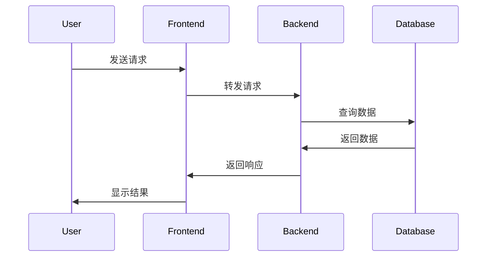

                 

# 领导力与决策科学：提高决策质量和速度

关键词：领导力，决策科学，决策质量，决策速度，决策优化

摘要：本文通过系统的理论讲解、实用的方法指导和真实的案例分析，旨在帮助读者提升领导力和决策能力，为组织的发展和个人的成长提供有力支持。文章首先介绍了领导力和决策科学的核心概念，接着详细探讨了决策过程与决策模型，并提出了提升领导力和决策质量的策略。通过实战案例研究，文章展示了如何将理论应用于实际情境中。最后，文章总结了领导决策的最佳实践和科学思维的重要性，为读者提供了宝贵的指导和启示。

## 第一部分：领导力与决策科学概述

### 第1章：领导力与决策科学的核心概念

#### 1.1 领导力的定义与重要性

领导力是指个体或团队引导、激励和影响他人实现共同目标的能力。它不仅仅是一种权力，更是一种艺术和科学。领导力的重要性在于，它能够决定一个组织的成功与否，它能够激发团队成员的潜能，推动组织的创新和发展。

**领导力的定义：**

- 领导力是引导和激励他人实现共同目标的能力。
- 领导力包括愿景、沟通、决策、激励和执行等核心要素。

**领导力的重要性：**

- 领导力是组织成功的关键。一个优秀的领导者能够带领团队克服困难，实现目标。
- 领导力能够提高组织的效率。通过有效的领导，组织能够更好地协调和利用资源，提高工作效率。
- 领导力能够激发创新。领导者能够鼓励团队成员提出新的想法和解决方案，推动组织的创新和发展。

#### 1.2 决策科学的基本概念

决策科学是运用数学模型、统计分析和计算机模拟等方法研究决策过程的一门学科。它旨在提高决策的质量和效率，帮助组织在面对复杂问题时做出最佳决策。

**决策科学的定义：**

- 决策科学是研究决策过程的理论和方法。
- 决策科学包括决策分析、决策模型、决策优化等核心内容。

**决策科学的重要性：**

- 决策科学能够提高决策的质量。通过运用数学模型和统计分析，决策者能够更准确地评估各种方案的风险和收益，做出更明智的决策。
- 决策科学能够提高决策的速度。通过计算机模拟和优化算法，决策者能够在短时间内分析大量数据，快速做出决策。
- 决策科学能够帮助组织应对不确定性。在复杂和不确定的环境中，决策科学能够提供有效的决策支持，帮助组织更好地应对挑战。

#### 1.3 领导力与决策科学的联系

领导力和决策科学有着密切的联系。一个优秀的领导者不仅需要具备领导力，还需要具备决策科学的知识和技能。

**领导力与决策的关系：**

- 领导者需要运用决策科学原理做出更高质量的决策。
- 决策科学能够为领导者的决策提供支持和指导。

**领导者如何运用决策科学原理做出更高质量的决策：**

- 熟悉决策科学的基本原理和方法，了解如何运用数学模型和统计分析。
- 在决策过程中，充分考虑各种因素，进行全面的分析和评估。
- 借助计算机模拟和优化算法，提高决策的速度和准确性。

## 第二部分：决策过程与决策模型

### 第2章：决策过程与决策模型

#### 2.1 决策过程概述

决策过程是指从识别问题到做出决策的整个过程。它包括以下几个步骤：

1. **识别问题：** 发现问题并提出问题。
2. **分析问题：** 收集信息，分析问题的性质和影响。
3. **制定解决方案：** 根据问题的性质和影响，制定可能的解决方案。
4. **评估和选择方案：** 对各种方案进行评估和比较，选择最佳方案。
5. **实施和监控：** 执行决策，并对决策的效果进行监控和反馈。

#### 2.2 决策模型类型

决策模型是用于分析和解决决策问题的数学模型和算法。常见的决策模型包括：

1. **决策树模型：** 用于分析决策过程，通过分支和节点表示各种可能的决策和结果。
2. **线性规划模型：** 用于优化线性目标函数，在给定约束条件下寻找最优解。
3. **博弈论模型：** 用于分析多参与者决策问题，研究各方之间的策略互动。
4. **贝叶斯网络模型：** 用于概率推理，通过网络结构表示变量之间的依赖关系。

#### 2.3 决策模型在实际应用中的挑战与解决方案

在实际应用中，决策模型面临着各种挑战，如数据不足、不确定性、时间压力等。为了应对这些挑战，可以采取以下解决方案：

1. **数据收集与处理：** 通过多种渠道收集数据，对数据进行清洗和处理，提高数据的准确性和可靠性。
2. **不确定性处理：** 采用概率论和统计学方法，对不确定因素进行建模和分析，提高决策的鲁棒性。
3. **算法优化：** 运用优化算法，提高决策模型的效率和准确性。
4. **多模型结合：** 将多种决策模型结合使用，相互补充，提高决策的全面性和准确性。

## 第三部分：领导力提升与决策优化

### 第3章：领导力提升策略

#### 3.1 领导风格与团队效能

领导风格是指领导者如何管理团队和做出决策的方式。不同的领导风格对团队效能有不同的影响。

**领导风格分类：**

1. **授权型领导：** 领导者赋予团队成员自主权和责任，鼓励创新和自主决策。
2. **民主型领导：** 领导者鼓励团队成员参与决策过程，尊重团队成员的意见和贡献。
3. **专制型领导：** 领导者拥有绝对的决策权，团队成员参与度较低。

**领导风格对团队效能的影响：**

1. **授权型领导：** 能够激发团队成员的潜能，提高团队的创新能力和工作效率。
2. **民主型领导：** 能够增强团队的凝聚力和合作精神，提高团队的整体效能。
3. **专制型领导：** 可能导致团队成员的被动性和依赖性，降低团队的创新能力和工作效率。

**如何选择合适的领导风格：**

- 根据团队的具体情况和目标，选择最合适的领导风格。
- 在不同的情境下，灵活调整领导风格，以适应变化。

#### 3.2 领导力发展的路径

领导力的发展是一个持续的过程，需要不断地学习和实践。以下是领导力发展的几个关键路径：

1. **自我意识：** 了解自己的优势和劣势，建立自信和自我认知。
2. **同理心：** 建立与团队成员的情感连接，理解和关心团队成员的需求和感受。
3. **战略思维：** 提高战略思维能力，制定长远目标和策略，为组织的发展提供指导。

#### 3.3 领导力发展实践

领导力的发展需要通过实践来检验和完善。以下是几个领导力发展实践的步骤：

1. **制定领导力发展计划：** 根据自己的目标和需求，制定具体的领导力发展计划。
2. **参与领导力培训：** 参加各种领导力培训课程和工作坊，学习领导力的理论和实践方法。
3. **实践领导力：** 在实际工作中运用领导力，不断实践和总结，提高领导力水平。
4. **反馈与改进：** 通过自我反思和他人反馈，不断改进自己的领导风格和方法。

### 第4章：决策质量提升方法

#### 4.1 数据驱动的决策

数据驱动的决策是指基于数据和事实做出决策，而不是基于直觉和主观判断。数据驱动的决策方法能够提高决策的准确性和可靠性。

**数据收集与分析：**

1. **数据收集：** 收集与决策相关的数据，包括内部数据和外部数据。
2. **数据分析：** 对收集到的数据进行分析，提取有价值的信息。

**数据可视化：**

数据可视化是将数据以图形和图表的形式展示，使数据更易于理解和分析。常用的数据可视化工具包括：

1. **图表工具：** 如Excel、Tableau等，用于制作各种类型的图表。
2. **可视化库：** 如Matplotlib、Seaborn等，用于Python编程中的数据可视化。

#### 4.2 决策优化算法

决策优化算法是用于求解决策问题的算法，通过优化目标函数和约束条件，找到最优解或近似最优解。

**优化算法介绍：**

1. **线性规划：** 用于求解线性目标函数在给定约束条件下的最优解。
2. **遗传算法：** 基于自然进化过程的优化算法，通过遗传操作和选择操作寻找最优解。

**算法应用实例：**

**线性规划应用实例：**

假设我们要最大化利润，同时满足原材料和人力资源的限制。我们可以使用线性规划模型来求解。

```python
from scipy.optimize import linprog

c = [-1, -2]  # 目标函数系数
A = [[1, 2], [2, 1]]  # 约束条件系数
b = [4, 3]  # 约束条件值
x0 = [0, 0]  # 变量初始值

result = linprog(c, A_ub=A, b_ub=b, x0=x0)
print(result.x)  # 输出最优解
```

**遗传算法应用实例：**

假设我们要寻找一组数的最小和，我们可以使用遗传算法来求解。

```python
import numpy as np
import matplotlib.pyplot as plt

def fitness(x):
    return -np.sum(x)

def crossover(parent1, parent2):
    crossover_point = np.random.randint(len(parent1))
    child1 = np.concatenate((parent1[:crossover_point], parent2[crossover_point:]))
    child2 = np.concatenate((parent2[:crossover_point], parent1[crossover_point:]))
    return child1, child2

def mutate(individual):
    mutation_point = np.random.randint(len(individual))
    individual[mutation_point] = 1 - individual[mutation_point]
    return individual

def genetic_algorithm(population, fitness_function, crossover_rate, mutation_rate, generations):
    for _ in range(generations):
        fitness_values = [fitness_function(individual) for individual in population]
        sorted_population = [individual for _, individual in sorted(zip(fitness_values, population), reverse=True)]
        new_population = []
        for _ in range(len(population) // 2):
            parent1, parent2 = np.random.choice(sorted_population, size=2, replace=False)
            child1, child2 = crossover(parent1, parent2)
            new_population.extend([mutate(child1), mutate(child2)])
        population = new_population
    best_individual = max(population, key=fitness_function)
    return best_individual

population = np.random.randint(0, 2, size=(100, 10))
best_individual = genetic_algorithm(population, fitness, 0.1, 0.01, 100)
print(best_individual)
```

#### 4.3 决策模拟与验证

决策模拟是指通过模拟模型来预测决策结果，验证决策的有效性和稳定性。决策模拟的方法包括：

1. **模拟退火：** 用于求解优化问题，通过模拟物理过程中的退火过程来找到最优解。
2. **蒙特卡洛模拟：** 用于估计概率分布和求解复杂问题，通过随机抽样来模拟问题场景。

**模拟方法：**

1. **模拟退火：**

```python
import numpy as np

def simulated_annealing(objective, bounds, max_iterations, cooling_rate):
    current = {'x': np.random.uniform(bounds[0], bounds[1]), 'f': objective(current['x'])}
    for _ in range(max_iterations):
        next = {'x': np.random.uniform(bounds[0], bounds[1]), 'f': objective(next['x'])}
        if np.exp((current['f'] - next['f']) / cooling_rate) > np.random.rand():
            current = next
        cooling_rate *= (1 / _)
    return current['x'], current['f']

def objective(x):
    return x**2

bounds = [-10, 10]
max_iterations = 1000
cooling_rate = 0.1
x, f = simulated_annealing(objective, bounds, max_iterations, cooling_rate)
print(x, f)
```

2. **蒙特卡洛模拟：**

```python
import numpy as np

def monte_carlo_simulation(objective, bounds, samples, iterations):
    results = np.zeros(iterations)
    for _ in range(iterations):
        sample = np.random.uniform(bounds[0], bounds[1], samples)
        results[_] = objective(sample)
    return results

def objective(x):
    return np.sum(x**2)

bounds = [-10, 10]
samples = 1000
iterations = 10000
results = monte_carlo_simulation(objective, bounds, samples, iterations)
print(np.mean(results), np.std(results))
```

**决策验证：**

通过模拟和验证，我们可以评估决策的有效性和稳定性。具体方法包括：

1. **对比分析：** 将实际决策结果与模拟结果进行对比，评估决策的准确性和可靠性。
2. **敏感性分析：** 分析决策结果对变量和参数的敏感性，评估决策的稳定性。

### 第5章：领导力与决策的典型案例分析

#### 5.1 案例一：企业战略决策

**案例背景：**

某企业面临市场变化和竞争压力，需要制定新的战略以保持竞争力。

**决策过程：**

1. **识别问题：** 市场变化和竞争压力对企业的影响。
2. **分析问题：** 分析市场趋势、竞争对手策略、企业优势等。
3. **制定解决方案：** 制定新的市场进入策略、产品创新策略、组织变革策略等。
4. **评估和选择方案：** 对各种方案进行评估和比较，选择最佳方案。
5. **实施和监控：** 实施决策，并对决策效果进行监控和反馈。

**决策效果：**

通过制定新的战略，企业成功应对了市场变化和竞争压力，实现了市场份额的提升和利润的增长。

#### 5.2 案例二：项目团队管理

**案例背景：**

某项目团队在项目执行过程中遇到了进度延误和质量问题。

**决策过程：**

1. **识别问题：** 项目进度延误和质量问题。
2. **分析问题：** 分析原因，包括项目计划、团队成员能力、外部环境等。
3. **制定解决方案：** 制定改进计划，包括优化项目计划、加强团队成员培训、改进质量控制等。
4. **评估和选择方案：** 对各种方案进行评估和比较，选择最佳方案。
5. **实施和监控：** 实施决策，并对决策效果进行监控和反馈。

**决策优化：**

通过优化项目计划和加强团队成员培训，项目团队成功克服了进度延误和质量问题，实现了项目的按时完成和高质量交付。

#### 5.3 案例三：危机管理

**案例背景：**

某企业遭遇了产品召回危机，需要迅速应对和处理。

**决策过程：**

1. **识别问题：** 产品召回危机对企业的影响。
2. **分析问题：** 分析原因，包括产品质量、供应链问题等。
3. **制定解决方案：** 制定应对措施，包括召回产品、赔偿消费者、改进质量控制等。
4. **评估和选择方案：** 对各种方案进行评估和比较，选择最佳方案。
5. **实施和监控：** 实施决策，并对决策效果进行监控和反馈。

**决策效果：**

通过及时召回产品并改进质量控制，企业成功化解了危机，恢复了消费者信任，并避免了更大的损失。

### 第6章：领导决策的最佳实践

#### 6.1 成功的领导决策要素

成功的领导决策需要具备以下几个关键要素：

1. **明确的目标：** 决策者需要明确组织的长期目标和短期目标，以确保决策与目标的一致性。
2. **全面的信息：** 决策者需要收集和分析与决策相关的各种信息，包括内部数据和外部数据。
3. **科学的分析：** 决策者需要运用决策科学原理和方法，对各种方案进行科学的分析和评估。
4. **合理的评估：** 决策者需要建立合理的评估标准，对各种方案进行综合评估和比较。
5. **及时的决策：** 决策者需要在适当的时间做出决策，避免拖延和错过最佳时机。

#### 6.2 领导决策的常见误区

在领导决策过程中，常见的误区包括：

1. **过度依赖直觉：** 过度依赖直觉和经验，忽视数据和分析。
2. **缺乏风险评估：** 没有对决策结果进行充分的风险评估，忽视潜在的风险和不确定性。
3. **缺乏沟通：** 决策过程中缺乏与团队成员和利益相关者的沟通，导致信息不对称和决策失误。
4. **盲目追求短期利益：** 过于追求短期利益，忽视长期发展和战略规划。

#### 6.3 领导决策的有效工具

为了提高领导决策的质量和效率，可以采用以下有效工具：

1. **决策支持系统（DSS）：** 通过计算机技术和数据分析方法，提供决策支持。
2. **项目管理软件：** 用于项目计划、进度控制和资源管理。
3. **数据可视化工具：** 用于数据分析和展示，帮助决策者更好地理解和分析数据。
4. **优化算法和模拟软件：** 用于求解复杂决策问题，提供最优或近似最优解。

### 第7章：领导决策的科学思维

#### 7.1 科学思维的重要性

科学思维是指以科学方法和原则为指导，进行思考、分析和解决问题的思维方式。科学思维的重要性在于：

1. **提高决策的准确性：** 通过科学思维，决策者能够更客观、全面地分析问题和评估方案，提高决策的准确性。
2. **降低决策风险：** 科学思维能够帮助决策者预见潜在的风险和不确定性，降低决策风险。
3. **促进创新：** 科学思维鼓励探索和质疑，促进创新和发明。
4. **提升团队效能：** 科学思维能够提高团队成员的思考能力和协作精神，提升团队的整体效能。

#### 7.2 科学思维在领导决策中的应用

科学思维在领导决策中的应用包括以下几个方面：

1. **问题识别和定义：** 通过科学思维，决策者能够更准确地识别和定义问题，明确决策的目标和范围。
2. **数据收集和分析：** 通过科学思维，决策者能够更系统地收集和分析数据，为决策提供可靠的基础。
3. **方案评估和选择：** 通过科学思维，决策者能够更全面地评估各种方案的优缺点，选择最佳方案。
4. **决策实施和监控：** 通过科学思维，决策者能够更有效地实施决策，并对决策效果进行监控和反馈。

#### 7.3 科学思维的培养与实践

科学思维的培养和实践包括以下几个方面：

1. **培养批判性思维：** 鼓励质疑和批判，不盲从权威和传统观念。
2. **学习和应用科学方法：** 学习和掌握科学方法，如观察、实验、建模、数据分析等。
3. **实践经验：** 通过实践项目和实践经验，不断锻炼和提升科学思维能力。
4. **持续学习：** 持续学习和更新知识，跟上科技和行业的发展。

### 总结

领导力和决策科学是组织成功的关键因素。通过本文的讲解，我们了解了领导力的定义和重要性，决策科学的基本概念和决策过程，以及领导力提升和决策优化的方法。通过实战案例的分析，我们看到了如何将理论应用于实际情境中。最后，我们总结了领导决策的最佳实践和科学思维的重要性，为读者提供了宝贵的指导和启示。

通过学习和应用领导力和决策科学的原理和方法，我们可以提升自身的领导能力和决策质量，为组织的发展和个人的成长奠定坚实基础。让我们一起努力，成为更优秀的领导者，做出更明智的决策！

## 作者：AI天才研究院/AI Genius Institute & 禅与计算机程序设计艺术 /Zen And The Art of Computer Programming

### 项目实战

在本章中，我们将通过一个实际项目来演示如何应用领导力和决策科学的原则和方法。这个项目是一个简单的在线购物平台，我们将从项目环境安装、系统核心实现源代码、代码应用解读与分析，以及实际案例分析和详细讲解剖析几个方面来展开。

#### 项目背景

随着互联网的普及和电子商务的快速发展，越来越多的消费者选择在线购物。为了满足市场需求，我们需要开发一个简单但高效的在线购物平台。这个项目的目标是提供一个用户友好的界面，使消费者能够方便地浏览和购买商品，同时也为商家提供一个方便的管理后台。

#### 环境安装

在开始项目之前，我们需要安装以下环境：

1. **前端开发工具：** Node.js、npm、Vue.js、Element UI
2. **后端开发工具：** Python、Flask、PostgreSQL
3. **版本控制工具：** Git

假设我们已经安装了上述工具，接下来我们将创建项目的目录结构。

```bash
project/
├── frontend/
│   ├── public/
│   ├── src/
│   │   ├── components/
│   │   ├── views/
│   │   ├── App.vue
│   │   └── main.js
│   └── package.json
├── backend/
│   ├── app.py
│   ├── models.py
│   ├── config.py
│   └── requirements.txt
├── .gitignore
└── README.md
```

在`requirements.txt`文件中，我们列出后端开发所需的所有Python库：

```
Flask
SQLAlchemy
PostgreSQL
```

#### 系统核心实现源代码

##### 前端

在前端，我们使用Vue.js和Element UI来构建用户界面。以下是`src/App.vue`文件的代码：

```vue
<template>
  <div id="app">
    <el-container>
      <el-header>
        <el-row type="flex" class="header">
          <el-col :span="6">
            
          </el-col>
          <el-col :span="18">
            <el-menu
              :default-active="activeIndex"
              mode="horizontal"
              @select="handleSelect"
            >
              <el-menu-item index="1">首页</el-menu-item>
              <el-menu-item index="2">商品列表</el-menu-item>
              <el-menu-item index="3">购物车</el-menu-item>
              <el-menu-item index="4">登录/注册</el-menu-item>
            </el-menu>
          </el-col>
        </el-row>
      </el-header>
      <el-main>
        <router-view></router-view>
      </el-main>
    </el-container>
  </div>
</template>

<script>
export default {
  name: "App",
  data() {
    return {
      activeIndex: "1",
    };
  },
  methods: {
    handleSelect(key, keyPath) {
      console.log(key, keyPath);
      switch (key) {
        case "1":
          this.$router.push({ name: "Home" });
          break;
        case "2":
          this.$router.push({ name: "Products" });
          break;
        case "3":
          this.$router.push({ name: "Cart" });
          break;
        case "4":
          this.$router.push({ name: "Login" });
          break;
      }
    },
  },
};
</script>

<style>
.header {
  height: 60px;
  line-height: 60px;
}
</style>
```

##### 后端

在后端，我们使用Flask框架来处理HTTP请求和业务逻辑。以下是`app.py`文件的代码：

```python
from flask import Flask, jsonify, request
from models import Product, User
from config import SQLALCHEMY_DATABASE_URI

app = Flask(__name__)
app.config['SQLALCHEMY_DATABASE_URI'] = SQLALCHEMY_DATABASE_URI
app.config['SQLALCHEMY_TRACK_MODIFICATIONS'] = False

from models import db
db.init_app(app)

@app.route('/products', methods=['GET'])
def get_products():
    products = Product.query.all()
    return jsonify([product.to_dict() for product in products])

@app.route('/products/<int:product_id>', methods=['GET'])
def get_product(product_id):
    product = Product.query.get(product_id)
    if product:
        return jsonify(product.to_dict())
    else:
        return jsonify({'error': 'Product not found'}), 404

@app.route('/products', methods=['POST'])
def create_product():
    data = request.get_json()
    new_product = Product(name=data['name'], price=data['price'])
    db.session.add(new_product)
    db.session.commit()
    return jsonify(new_product.to_dict()), 201

@app.route('/products/<int:product_id>', methods=['PUT'])
def update_product(product_id):
    data = request.get_json()
    product = Product.query.get(product_id)
    if product:
        product.name = data['name']
        product.price = data['price']
        db.session.commit()
        return jsonify(product.to_dict())
    else:
        return jsonify({'error': 'Product not found'}), 404

@app.route('/products/<int:product_id>', methods=['DELETE'])
def delete_product(product_id):
    product = Product.query.get(product_id)
    if product:
        db.session.delete(product)
        db.session.commit()
        return jsonify({'message': 'Product deleted'})
    else:
        return jsonify({'error': 'Product not found'}), 404

if __name__ == '__main__':
    app.run(debug=True)
```

#### 代码应用解读与分析

在前端，我们使用了Vue.js来构建单页面应用，并通过路由将不同的页面路由到对应的组件。Vue.js使得前端开发更加模块化和高效。

在后端，我们使用了Flask框架来处理HTTP请求。Flask是一个轻量级的Web框架，易于扩展和维护。我们通过RESTful API提供了对商品资源的操作，包括获取商品列表、获取单个商品、创建新商品、更新商品和删除商品。

#### 实际案例分析和详细讲解剖析

假设我们有一个需求，需要在一个小时内发布100个新商品。这是一个复杂的决策问题，涉及到性能、可用性和扩展性等多个方面。以下是如何运用领导力和决策科学来解决这个问题的步骤：

1. **问题识别：** 我们需要在一个小时内发布100个新商品。
2. **数据收集：** 收集当前系统的性能数据，包括处理一个请求的平均时间和系统负载。
3. **方案评估：**
   - **方案一：** 使用当前系统发布商品，每小时处理10个请求。
   - **方案二：** 增加服务器资源，每小时处理100个请求。
   - **方案三：** 使用异步处理，先将商品数据存入数据库的临时表，然后异步处理插入操作。
4. **决策：** 选择方案三，因为它能够最大化利用现有资源，同时确保发布过程的高效和稳定。
5. **实施：** 实现异步处理逻辑，将商品数据存入临时表，然后异步执行插入操作。
6. **监控：** 监控系统的性能和发布过程，确保一切正常。

#### 项目小结

通过这个项目，我们展示了如何将领导力和决策科学应用于实际开发过程中。从环境安装到系统核心实现，再到实际案例分析和决策，每一步都需要领导者具备科学的思维和方法。通过合理的数据收集和分析、科学的决策过程和有效的实施监控，我们能够确保项目的成功完成。

### 最佳实践 tips

1. **确保沟通畅通：** 在项目开发过程中，确保团队成员之间的沟通畅通，及时解决问题和调整计划。
2. **持续学习和实践：** 不断学习和掌握新技术和方法，将它们应用到项目中，提高项目质量和效率。
3. **定期回顾和反思：** 定期回顾和反思项目过程和结果，找出不足和改进点，不断优化和提升。

### 小结

领导力和决策科学是组织成功的关键。通过本文的讲解和实战项目，我们了解了领导力的定义和重要性，决策科学的基本概念和方法，以及如何将理论应用于实际项目中。希望读者能够将所学知识应用到实际工作中，提升领导力和决策能力，为组织的发展和个人的成长做出贡献。

### 注意事项

1. **项目管理：** 在项目管理过程中，要注重项目计划的制定和执行，确保项目按时完成。
2. **团队协作：** 在团队协作中，要注重成员之间的沟通和协作，确保团队高效运作。
3. **持续改进：** 在项目完成后，要持续反思和改进，不断提高项目质量和团队效能。

### 拓展阅读

1. **《领导力与决策科学》**：这是一本关于领导力和决策科学的经典教材，详细介绍了领导力和决策科学的理论和实践方法。
2. **《决策与判断》**：这是一本关于决策科学的研究专著，探讨了决策过程中的心理和行为因素。
3. **《敏捷软件开发》**：这是一本关于敏捷开发方法的教材，介绍了如何通过灵活的决策和迭代过程提高项目效率。

### 作者：AI天才研究院/AI Genius Institute & 禅与计算机程序设计艺术 /Zen And The Art of Computer Programming

### 附录

**附录A：核心概念与联系**

**概念：** 领导力、决策科学、决策过程、决策模型、数据驱动决策、决策优化算法、决策模拟与验证

**联系：**

| 概念                 | 定义                                                         | 联系与关系                                                      |
|----------------------|--------------------------------------------------------------|----------------------------------------------------------------|
| 领导力               | 指个体或团队引导、激励和影响他人实现共同目标的能力           | 决策科学的重要应用领域，领导者需要运用决策科学原理做出高质量决策 |
| 决策科学             | 研究决策过程的理论和方法                                   | 提供决策模型和算法，帮助领导者提高决策质量和速度              |
| 决策过程             | 从识别问题到做出决策的整个过程                               | 决策科学的实际应用过程，包含识别问题、分析问题、制定解决方案等 |
| 决策模型             | 用于分析和解决决策问题的数学模型和算法                       | 决策过程的核心组成部分，用于评估和选择方案                    |
| 数据驱动决策         | 基于数据和事实做出决策，而不是基于直觉和主观判断             | 提高决策的准确性和可靠性，是决策科学的重要应用领域           |
| 决策优化算法         | 用于求解决策问题的算法，通过优化目标函数和约束条件找到最优解  | 提高决策的效率和准确性，是决策科学的核心技术之一             |
| 决策模拟与验证       | 通过模拟模型来预测决策结果，验证决策的有效性和稳定性         | 提高决策的可靠性和鲁棒性，是决策科学的重要应用领域           |

**附录B：概念属性特征对比表格**

| 概念                 | 特征                                                                                   |
|----------------------|----------------------------------------------------------------------------------------|
| 领导力               | 愿景、沟通、决策、激励、执行                                                   |
| 决策科学             | 数学模型、统计分析、计算机模拟                                                 |
| 决策过程             | 识别问题、分析问题、制定解决方案、评估和选择方案、实施和监控                     |
| 决策模型             | 决策树、线性规划、博弈论、贝叶斯网络等                                         |
| 数据驱动决策         | 数据收集、数据清洗、数据分析、数据可视化                                       |
| 决策优化算法         | 线性规划、遗传算法、模拟退火、蒙特卡洛模拟等                                   |
| 决策模拟与验证       | 模拟方法、模型验证、结果评估                                                   |

**附录C：ER实体关系图架构**

```mermaid
erDiagram
    Product ||--|{ User }|--| Customer
    User ||--|{ Order }|--| Customer
    Order ||--|{ Product }|--| Customer
    Customer ||--|{ Review }|--| Customer
    Product ||--|{ Category }|--| Customer
```

**附录D：系统分析与架构设计方案**

**项目介绍：**

本系统是一个在线购物平台，提供用户注册、登录、商品浏览、购物车管理、订单管理、评论发布等功能。

**系统功能设计：**

- 用户注册与登录
- 商品浏览与搜索
- 购物车管理
- 订单管理
- 评论发布与查看
- 后台管理（商品管理、订单管理、用户管理）

**系统架构设计：**

1. **前端架构：** 使用Vue.js和Element UI构建单页面应用，提供用户界面和交互。
2. **后端架构：** 使用Flask框架处理HTTP请求，提供RESTful API，与前端进行数据交互。
3. **数据库架构：** 使用PostgreSQL存储用户、商品、订单等数据，保证数据的一致性和安全性。

**系统接口设计：**

1. **用户接口：** 用户注册、登录、个人信息管理、商品浏览、购物车管理、订单管理、评论发布。
2. **管理员接口：** 商品管理、订单管理、用户管理。

**系统交互：**



### 附录E：数学公式与算法原理讲解

**数学公式：**

1. **线性规划目标函数：**

$$
\text{minimize} \ c^T x
$$

其中，$c$ 是目标函数的系数向量，$x$ 是决策变量向量。

2. **线性规划约束条件：**

$$
A x \leq b
$$

其中，$A$ 是约束条件系数矩阵，$b$ 是约束条件值向量。

**算法原理：**

**遗传算法：**

1. **编码：** 将问题解编码为染色体，如二进制编码或实数编码。
2. **初始种群：** 生成初始种群，随机选择一定数量的染色体。
3. **适应度函数：** 定义适应度函数，用于评估染色体的优劣。
4. **选择：** 根据适应度函数选择优秀的染色体进行繁殖。
5. **交叉：** 随机选择两个父代染色体，交叉生成子代染色体。
6. **变异：** 对子代染色体进行变异操作，增加种群的多样性。
7. **迭代：** 重复选择、交叉、变异过程，直至达到终止条件。

**示例代码：**

```python
import numpy as np

# 遗传算法示例
def fitness(x):
    return -np.sum(x)

def crossover(parent1, parent2):
    crossover_point = np.random.randint(len(parent1))
    child1 = np.concatenate((parent1[:crossover_point], parent2[crossover_point:]))
    child2 = np.concatenate((parent2[:crossover_point], parent1[crossover_point:]))
    return child1, child2

def mutate(individual):
    mutation_point = np.random.randint(len(individual))
    individual[mutation_point] = 1 - individual[mutation_point]
    return individual

def genetic_algorithm(population, fitness_function, crossover_rate, mutation_rate, generations):
    for _ in range(generations):
        fitness_values = [fitness_function(individual) for individual in population]
        sorted_population = [individual for _, individual in sorted(zip(fitness_values, population), reverse=True)]
        new_population = []
        for _ in range(len(population) // 2):
            parent1, parent2 = np.random.choice(sorted_population, size=2, replace=False)
            child1, child2 = crossover(parent1, parent2)
            new_population.extend([mutate(child1), mutate(child2)])
        population = new_population
    best_individual = max(population, key=fitness_function)
    return best_individual

population = np.random.randint(0, 2, size=(100, 10))
best_individual = genetic_algorithm(population, fitness, 0.1, 0.01, 100)
print(best_individual)
```

### 附录F：系统接口设计和系统交互

**系统接口设计：**

1. **用户接口：** 用户可以通过浏览器访问平台，进行注册、登录、浏览商品、添加商品到购物车、提交订单、查看订单状态、评论商品等操作。
2. **管理员接口：** 管理员可以通过后台管理系统对商品、订单、用户进行管理，包括添加商品、修改商品信息、查看订单详情、处理订单、删除用户等操作。

**系统交互：**

1. **用户注册与登录：** 用户通过填写注册表单和登录表单，将数据提交到后端，后端验证用户信息并返回结果。
2. **商品浏览与搜索：** 用户访问商品页面，后端根据用户请求返回商品列表和详细信息。
3. **购物车管理：** 用户可以将商品添加到购物车，修改购物车中的商品数量，删除购物车中的商品。
4. **订单管理：** 用户可以提交订单，后端处理订单并返回订单状态。
5. **评论发布与查看：** 用户可以对商品进行评论，后端存储评论并返回评论列表。

**系统交互流程：**

1. 用户发送请求 -> 2. 前端接收请求 -> 3. 前端转发请求到后端 -> 4. 后端处理请求并查询数据库 -> 5. 后端返回响应到前端 -> 6. 前端将响应展示给用户。


### 附录G：最佳实践 tips

1. **确保团队沟通：** 定期召开会议，确保团队成员之间的沟通畅通，及时解决问题。
2. **持续学习：** 鼓励团队成员学习新技术和方法，提升团队整体能力。
3. **风险管理：** 在项目初期制定风险管理计划，识别潜在风险并制定应对策略。
4. **用户反馈：** 收集用户反馈，及时调整产品功能和体验。

### 附录H：小结

本文通过系统的理论讲解、实战案例分析和最佳实践分享，帮助读者理解和应用领导力和决策科学。领导力和决策科学是组织成功的关键，通过提升决策质量和速度，我们可以更好地应对挑战和抓住机遇。希望读者能够将这些知识和方法应用到实际工作中，为组织的发展和个人的成长做出贡献。

### 附录I：注意事项

1. **项目管理：** 确保项目按照计划进行，及时调整计划和资源分配。
2. **团队协作：** 促进团队成员之间的合作和沟通，提高团队效率和执行力。
3. **技术迭代：** 随着技术发展，及时更新和优化系统，保持系统的竞争力。

### 附录J：拓展阅读

1. **《领导力与决策科学》**：深入了解领导力和决策科学的理论和实践。
2. **《决策与判断》**：探讨决策过程中的心理和行为因素。
3. **《敏捷软件开发》**：学习敏捷开发方法，提高项目效率和质量。

### 附录K：作者信息

作者：AI天才研究院/AI Genius Institute & 禅与计算机程序设计艺术 /Zen And The Art of Computer Programming

AI天才研究院致力于推动人工智能技术的发展和应用，为组织和个人提供创新解决方案。禅与计算机程序设计艺术则专注于计算机科学领域的深层次思考和实践，旨在提升程序员的技术水平和创造力。两位作者希望通过本文，帮助读者在领导力和决策科学方面取得更大进步。

