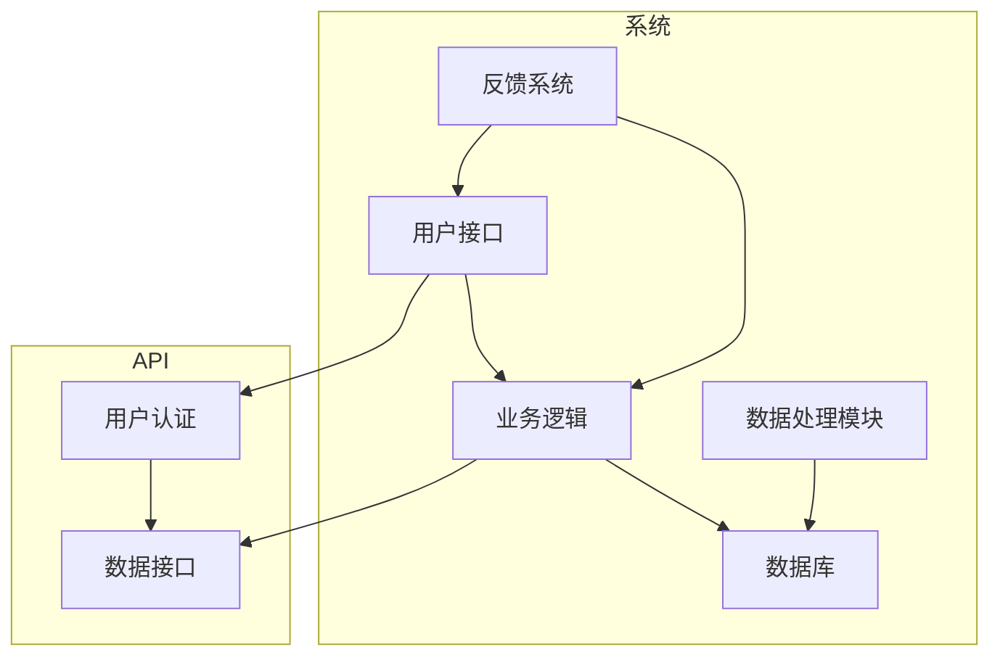

                 


## 引言：领导力与创新思维的重要性

在信息技术飞速发展的今天，企业面临的竞争环境日益激烈，创新能力成为企业持续发展的关键因素。而在这背后，领导力起到了至关重要的作用。领导力不仅关乎企业的生存与发展，更是推动团队创新、实现突破的核心能力。因此，探讨领导力与创新思维的关系，对于提升企业竞争力具有重要的意义。

### 关键词

- 领导力
- 创新思维
- 团队突破
- 企业发展

### 摘要

本文将从领导力的定义、类型、实践与创新思维的关系等多方面展开，深入探讨领导力与创新思维在团队突破中的重要作用。通过阐述领导力与创新思维的融合，分析如何通过领导力提升团队的创新能力，最终实现企业的持续发展。

## 第1章 领导力的定义与类型

### 1.1 领导力的概念

领导力是一种影响力，是领导者通过激励和引导他人，实现组织目标的能力。领导力不仅仅体现在领导者个人的行为上，更是一种系统的力量，它通过领导者与团队成员的互动，共同推动组织的发展。

#### 1.1.1 领导力的边界

领导力并非无处不在，它有一定的边界。首先，领导力发生在组织中，是组织成员之间的互动。其次，领导力是在实现组织目标的过程中体现出来的，没有目标就没有领导力的发挥空间。

#### 1.1.2 领导力的作用

领导力的作用主要体现在以下几个方面：

1. **激励和引导**：领导者通过激励和引导，激发团队成员的积极性，提高团队的整体表现。
2. **决策和协调**：领导者是决策的核心，需要协调各方资源，确保组织目标的实现。
3. **创新和突破**：领导者在推动组织变革和创新中发挥着关键作用，是实现团队突破的核心力量。

### 1.2 领导力的类型

领导力可以分为传统领导力和现代领导力两种类型。

#### 1.2.1 传统领导力

传统领导力主要依赖于权威和命令，领导者拥有绝对的权力，团队成员需要无条件服从。这种领导力在一定程度上能够迅速实现组织的目标，但在长期来看，容易导致团队成员的被动和缺乏创造力。

#### 1.2.2 现代领导力

现代领导力强调互动和合作，领导者不再是权威的象征，而是团队的引导者和支持者。现代领导力更注重激发团队成员的潜力，通过沟通和协作，实现组织的目标。

### 1.3 领导力与管理的区别

领导力和管理是两个不同的概念，但又密切相关。

#### 1.3.1 领导与管理的联系

领导力是管理的重要组成部分，没有有效的领导力，管理无法真正发挥作用。同时，管理也为领导力提供了基础和支持。

#### 1.3.2 领导与管理的区别

领导力强调的是激励和引导，注重激发团队成员的潜力和积极性；而管理则更注重组织和协调，确保资源的有效利用。

### 1.4 领导力的核心要素

领导力不是单一的能力，而是一个复杂的系统。以下是领导力的核心要素：

#### 1.4.1 沟通能力

沟通能力是领导者最重要的能力之一。有效的沟通能够建立信任，增强团队凝聚力，推动组织目标的实现。

#### 1.4.2 决策能力

领导者需要具备良好的决策能力，能够在复杂多变的环境中做出正确的决策，确保组织目标的实现。

#### 1.4.3 激励能力

领导者需要能够激励团队成员，激发他们的潜力和积极性，推动团队的创新和发展。

## 第2章 领导力模型与理论

### 2.1 领导力模型概述

领导力模型是研究领导力的基础，它通过理论化的方式，将复杂的领导现象进行抽象和归纳。

#### 2.1.1 领导力模型的发展历程

领导力模型的发展经历了几个阶段：

1. **传统领导力模型**：主要关注领导者的个人特质和能力。
2. **行为领导力模型**：强调领导者的行为模式，如领导者行为理论。
3. **情景领导力模型**：考虑领导者的行为与情境的互动。
4. **变革型领导力模型**：强调领导者的变革和创新作用。

#### 2.1.2 领导力模型的分类

根据领导力模型的不同特点，可以分为以下几类：

1. **特质领导力模型**：强调领导者的个人特质。
2. **行为领导力模型**：关注领导者的行为模式。
3. **情景领导力模型**：考虑领导者的行为与情境的互动。
4. **变革型领导力模型**：强调领导者的变革和创新作用。

### 2.2 经典领导力理论

经典领导力理论是领导力研究的基石，包括以下几个主要理论：

#### 2.2.1 领导行为理论

领导行为理论主要研究领导者的行为模式，如领导风格和行为特征。

#### 2.2.2 领导风格理论

领导风格理论关注领导者的行为风格，如何影响团队的表现。

#### 2.2.3 领导过程理论

领导过程理论研究领导者的行为过程，包括领导行为的发生、发展和结果。

### 2.3 现代领导力理论

随着时代的发展，现代领导力理论不断丰富和完善。

#### 2.3.1 权变理论

权变理论强调领导者的行为与情境的互动，认为不同的情境需要不同的领导行为。

#### 2.3.2 领导者-成员交换理论

领导者-成员交换理论认为领导者与团队成员之间存在一种特殊的关系，领导者对关键成员的特殊关注能够提升团队的绩效。

#### 2.3.3 变革型领导理论

变革型领导理论强调领导者的变革和创新作用，通过激发团队成员的潜力，实现组织的变革和发展。

### 2.4 领导力与文化的互动

领导力与组织文化密切相关，领导力对组织文化的影响和互动机制是领导力研究的重要方向。

#### 2.4.1 组织文化的概念

组织文化是指组织在长期发展过程中形成的共同价值观、行为准则和制度规范。

#### 2.4.2 领导力与组织文化的关系

领导力与组织文化相互影响，领导者的行为和决策会塑造组织文化，而组织文化也会影响领导力的实施效果。

#### 2.4.3 领导力对组织文化的影响

领导力通过塑造组织的价值观、行为准则和制度规范，对组织文化产生深远的影响。

## 第3章 领导力实践：沟通与协作

### 3.1 领导者沟通技巧

有效的沟通是领导力的核心要素之一，领导者需要具备良好的沟通技巧。

#### 3.1.1 沟通障碍与克服方法

沟通障碍包括语言障碍、文化差异、心理障碍等，领导者需要采取有效的方法克服这些障碍。

#### 3.1.2 高效沟通的策略

高效沟通需要领导者具备倾听、表达、反馈等能力，同时要善于运用沟通技巧，如提问、倾听、反馈等。

#### 3.1.3 情景沟通案例分析

通过案例分析，领导者可以更好地理解和应用沟通技巧，提高沟通效果。

### 3.2 团队协作与领导

团队协作是领导力的重要组成部分，领导者需要关注团队协作的机制和策略。

#### 3.2.1 团队的定义与特征

团队是由多个成员组成的，共同实现某一目标的组织形式。团队的特征包括共同目标、相互依赖、共同责任等。

#### 3.2.2 领导者在团队协作中的作用

领导者在团队协作中扮演着协调者、引导者、支持者的角色，需要关注团队成员的需求和协作过程。

#### 3.2.3 团队协作的挑战与应对策略

团队协作面临许多挑战，如沟通障碍、协调困难、利益冲突等，领导者需要采取有效的策略应对这些挑战。

### 3.3 领导力在组织变革中的角色

组织变革是推动企业发展的关键，领导者在组织变革中发挥着重要的作用。

#### 3.3.1 变革的动因

组织变革的动因包括外部环境的变化、内部管理的需要、企业发展的需求等。

#### 3.3.2 变革的过程

组织变革是一个复杂的过程，包括准备期、实施期、评估期等阶段。

#### 3.3.3 领导者在变革中的策略

领导者在组织变革中需要采取一系列策略，如沟通协调、激励员工、解决问题等，确保变革的顺利进行。

## 第4章 创新思维：激发团队创造力

### 4.1 创新思维的概念

创新思维是一种能够发现新问题、提出新观点、创造新方法的思维方式。它不仅仅是发明和创新，更是一种思维方法和行为习惯。

#### 4.1.1 创新的定义

创新是指在现有基础上，通过新的想法、方法或技术，创造出新的价值或解决新的问题。

#### 4.1.2 创新思维的重要性

创新思维是企业持续发展的动力，是推动社会进步的关键因素。创新思维能够激发团队的创造力，提升企业的竞争力。

### 4.2 创新思维的类型

创新思维可以分为以下几种类型：

#### 4.2.1 分析型创新思维

分析型创新思维是通过逻辑分析和系统思考，发现潜在的问题和机会，并提出解决方案。

#### 4.2.2 集成型创新思维

集成型创新思维是将不同的想法、技术或方法进行整合，创造出新的价值。

#### 4.2.3 突破型创新思维

突破型创新思维是突破传统的限制，通过全新的思路和方法，实现前所未有的创新。

### 4.3 激发创新思维的方法

激发创新思维需要从多个方面进行努力：

#### 4.3.1 培养创新意识

培养创新意识是激发创新思维的基础，领导者需要鼓励团队成员敢于尝试、勇于创新。

#### 4.3.2 创新思维的训练

创新思维的训练包括逻辑思维、发散思维、逆向思维等，通过训练提高团队成员的创新思维水平。

#### 4.3.3 创新思维的实践应用

创新思维的实践应用是将创新思维转化为实际行动，通过实践检验和创新思维的有效性。

### 4.4 创新案例分析与启示

通过分析国内外创新案例，可以得出以下启示：

#### 4.4.1 国内外创新案例介绍

介绍国内外一些具有代表性的创新案例，如苹果公司的创新产品、谷歌的创新项目等。

#### 4.4.2 创新案例的启示

从这些创新案例中，可以总结出一些共同的规律和启示，如重视人才、鼓励创新、勇于尝试等。

## 第5章 领导力与创新思维的融合

### 5.1 领导力与创新思维的关系

领导力与创新思维是相辅相成的，领导力为创新思维提供支持，创新思维为领导力提供动力。

#### 5.1.1 领导力对创新思维的影响

领导力对创新思维的影响主要体现在以下几个方面：

1. **激励和引导**：领导者通过激励和引导，激发团队成员的创新思维。
2. **资源支持**：领导者为创新思维提供必要的资源支持，如时间、资金、人力等。
3. **文化氛围**：领导者塑造积极创新的文化氛围，鼓励团队成员敢于创新、勇于尝试。

#### 5.1.2 创新思维对领导力的促进作用

创新思维对领导力的促进作用主要体现在以下几个方面：

1. **提高领导力水平**：创新思维能够提高领导者的思维水平，使领导者更具前瞻性和创新能力。
2. **优化领导行为**：创新思维能够帮助领导者发现新的领导方法和策略，优化领导行为。
3. **提升团队绩效**：创新思维能够提升团队的绩效，实现团队的突破和发展。

### 5.2 领导力与创新思维的协同作用

领导力与创新思维的协同作用是实现团队突破的关键。通过以下几个方面，可以充分发挥领导力与创新思维的协同作用：

1. **建立创新机制**：领导者需要建立一套创新机制，为团队成员提供创新的机会和支持。
2. **培养创新人才**：领导者需要关注人才的培养，特别是创新人才的培养，提升团队的整体创新能力。
3. **激励创新行为**：领导者需要激励团队成员的创新行为，营造鼓励创新、宽容失败的氛围。

通过领导力与创新思维的融合，企业可以更好地应对市场变化，实现持续发展。

## 结语

领导力与创新思维是企业发展的关键，领导者需要不断提升自身的领导力和创新能力，激发团队的创造力和活力。通过领导力与创新思维的融合，企业可以更好地应对挑战，实现突破和发展。在未来的发展中，领导力与创新思维将继续发挥重要作用，成为企业持续发展的动力源泉。

### 关键词

- 领导力
- 创新思维
- 团队突破
- 企业发展
- 沟通与协作
- 变革型领导
- 创新意识
- 文化氛围

### 摘要

本文系统地探讨了领导力与创新思维在团队突破中的重要性。通过分析领导力的定义、类型、核心要素以及领导力模型，我们了解了领导力在组织中的关键作用。同时，本文详细阐述了创新思维的概念、类型和激发方法，揭示了创新思维在提升团队创造力中的核心地位。通过讨论领导力与创新思维的融合，我们明确了如何通过领导力提升团队的创新能力，实现企业的持续发展。领导力与创新思维的协同作用不仅是团队突破的关键，更是企业应对市场挑战、实现长远发展的动力源泉。在未来的企业发展中，领导力与创新思维的重要性将日益凸显。领导者需要不断学习和提升自身的领导力，同时鼓励团队成员发挥创新思维，共同推动企业的进步。通过建立创新机制、培养创新人才和激励创新行为，企业可以营造一个充满活力和创造力的工作环境，从而在激烈的市场竞争中立于不败之地。只有将领导力与创新思维有机结合，企业才能实现持续发展，迈向更高的巅峰。在新时代的背景下，企业领导者应深刻认识到领导力与创新思维的重要性，积极推动团队创新，不断提升企业的核心竞争力，为企业的长远发展奠定坚实基础。未来，领导力与创新思维将继续发挥重要作用，引领企业走向更加辉煌的未来。让我们共同期待，在领导力与创新思维的引领下，企业能够不断突破自我，创造更多奇迹。### 第1章 领导力的定义与类型

领导力是一种通过激励、引导和影响他人，实现组织目标的能力。它不仅仅体现在领导者个人的行为上，更是通过领导者与团队成员之间的互动，推动组织的整体发展。在信息时代，领导力的重要性愈发凸显，它不仅影响着企业的生存和发展，更决定着团队的创新能力和执行力。

### 1.1 领导力的概念

领导力是一种复杂的社会现象，涉及多个层面。首先，从个人层面来看，领导力是一种个人特质，包括自信心、决断力、沟通能力等。这些特质使领导者能够在复杂的环境中迅速做出决策，并有效地传达和实施这些决策。其次，从组织层面来看，领导力是一种影响力，它能够激发团队成员的积极性，提高团队的整体绩效。最后，从社会层面来看，领导力是一种推动社会进步的力量，它能够引导社会资源向更有效率的领域流动，促进社会的和谐发展。

#### 1.1.1 领导力的边界

领导力的边界在于它的作用范围和影响力。首先，领导力作用范围局限于组织内部，它是组织成员之间的互动过程。领导者通过自己的行为和决策，影响团队成员的行为和决策，从而推动组织目标的实现。其次，领导力的影响力是有限的，它受到组织文化、环境等因素的制约。例如，在一个重视权威和等级的组织中，领导力可能更多地体现在命令和指挥上，而在一个鼓励创新和自由表达的组织中，领导力可能更多地体现在引导和激励上。

#### 1.1.2 领导力的作用

领导力在组织中具有多重作用。首先，领导力能够激励和引导团队成员，提高他们的工作积极性和创造力。有效的领导力能够激发团队成员的潜力，使他们愿意为组织的共同目标而努力。其次，领导力能够协调和整合组织资源，确保组织目标的实现。领导者通过沟通和协调，使组织中的各个部门和成员能够相互配合，共同实现组织的目标。最后，领导力能够推动组织的变革和创新。在快速变化的市场环境中，领导者需要具备前瞻性思维和创新意识，推动组织进行战略调整和创新，以适应市场的变化。

### 1.2 领导力的类型

领导力可以根据不同的标准进行分类。以下是几种常见的领导力类型：

#### 1.2.1 传统领导力

传统领导力主要依赖于权威和命令。在这种领导力模式下，领导者拥有绝对的权力，团队成员需要无条件服从。传统领导力强调领导者的权威和决策能力，通过严格的规章制度和命令来确保组织目标的实现。然而，传统领导力往往缺乏灵活性，难以适应快速变化的环境。

#### 1.2.2 现代领导力

现代领导力强调互动和合作。在这种领导力模式下，领导者不再是权威的象征，而是团队的引导者和支持者。现代领导力更注重激发团队成员的潜力和积极性，通过沟通和协作，实现组织的目标。现代领导力强调领导者与团队成员之间的信任和尊重，通过共同的目标和价值观来引导团队。

### 1.3 领导力与管理的区别

领导力和管理是两个不同的概念，但它们在组织中是相互关联的。以下是领导力与管理的几个关键区别：

#### 1.3.1 领导与管理的联系

领导力和管理是相辅相成的。领导力为管理提供了方向和动力，管理为领导力提供了实施的基础和支持。有效的领导力能够激发团队成员的积极性，提高工作效率，而有效的管理能够确保资源的合理利用和目标的实现。

#### 1.3.2 领导与管理的区别

领导力强调的是影响和激励，它关注的是如何激发团队成员的潜力和积极性。而管理则更注重组织和协调，确保资源的有效利用和目标的实现。领导力强调的是变革和创新，而管理则更注重稳定和持续。

### 1.4 领导力的核心要素

领导力是一个复杂的过程，涉及多个方面的能力和素质。以下是领导力的核心要素：

#### 1.4.1 沟通能力

沟通能力是领导力的核心要素之一。领导者需要具备良好的沟通能力，能够有效地传达信息、理解团队成员的需求和意见，并建立良好的信任关系。

#### 1.4.2 决策能力

领导者需要具备良好的决策能力，能够在复杂多变的环境中迅速做出正确的决策，并承担相应的责任。

#### 1.4.3 激励能力

领导者需要具备激励能力，能够激发团队成员的积极性，使他们愿意为组织的共同目标而努力。

#### 1.4.4 情境意识

领导者需要具备情境意识，能够根据不同的情况和环境，采取相应的领导策略。

#### 1.4.5 自我管理能力

领导者需要具备良好的自我管理能力，能够自我激励、自我约束，保持积极的心态和高效的工作状态。

### 1.5 领导力模型

领导力模型是研究领导力的基础，它通过理论化的方式，将复杂的领导现象进行抽象和归纳。以下是几种常见的领导力模型：

#### 1.5.1 特质领导力模型

特质领导力模型认为领导者具有一系列固有的特质和能力，这些特质和能力使领导者具备领导潜力。例如，自信、决断力、沟通能力等。

#### 1.5.2 行为领导力模型

行为领导力模型关注领导者的行为模式，认为领导者的行为对团队成员的行为和绩效有直接影响。例如，领导者是通过指挥和控制来管理团队，还是通过激励和引导来管理团队。

#### 1.5.3 情境领导力模型

情境领导力模型认为领导者的行为应该根据具体情境来调整。不同的情境需要不同的领导风格和行为。

#### 1.5.4 变革型领导力模型

变革型领导力模型强调领导者的变革和创新作用。领导者通过激发团队成员的潜力，推动组织的变革和发展。

### 1.6 领导力的发展

领导力是一个不断发展和成熟的过程。以下是领导力发展的几个阶段：

#### 1.6.1 观察学习阶段

在这个阶段，领导者通过观察和学习其他领导者的行为和决策，逐渐形成自己的领导风格。

#### 1.6.2 经验积累阶段

在这个阶段，领导者通过实际工作经验，不断调整和优化自己的领导行为。

#### 1.6.3 自我反思阶段

在这个阶段，领导者开始反思自己的领导行为和决策，通过自我反思，提高自己的领导能力。

#### 1.6.4 持续改进阶段

在这个阶段，领导者持续学习，不断提升自己的领导能力，以适应不断变化的环境。

### 1.7 领导力的挑战

在当今快速变化的社会中，领导者面临着许多挑战。以下是几个常见的领导力挑战：

#### 1.7.1 多元化

随着社会的多元化，领导者需要能够理解和尊重不同文化、背景和价值观的团队成员。

#### 1.7.2 技术变革

技术的快速发展给领导者带来了新的挑战，他们需要不断学习新技术，以适应快速变化的环境。

#### 1.7.3 组织变革

组织变革是领导者面临的另一个挑战，他们需要推动组织进行变革，以适应市场的变化。

#### 1.7.4 领导力发展的不平衡

在组织中，领导力发展存在不平衡现象，领导者需要关注不同团队成员的领导能力，促进其共同发展。

### 结论

领导力是一种复杂的社会现象，它涉及多个层面和多种能力。通过理解领导力的概念、类型、核心要素和发展阶段，领导者可以更好地应对挑战，提升自己的领导能力。在未来的发展中，领导力将继续发挥关键作用，推动组织的发展和社会的进步。领导者需要不断学习和提升自己的领导能力，以适应快速变化的环境，为组织和社会创造更大的价值。### 第2章 领导力模型与理论

在探讨领导力时，领导力模型和理论为我们提供了系统化的理解框架，帮助我们深入分析领导现象。这些模型和理论不仅帮助我们理解领导力的本质，还提供了实用的指导方法，以提升领导效果。本章将详细介绍几种经典的领导力模型和理论，包括特质领导力模型、行为领导力模型、情境领导力模型和变革型领导力模型。

#### 2.1 领导力模型概述

领导力模型是对领导现象的理论化描述，它们通过抽象和归纳，将复杂的领导行为和情境转化为可理解和操作的概念框架。领导力模型的发展经历了多个阶段，从早期的特质领导力模型到现代的情境领导和变革型领导力模型，每个模型都有其独特的视角和应用场景。

##### 2.1.1 领导力模型的发展历程

1. **特质领导力模型**：早期的领导力研究主要集中在领导者的个人特质上，认为领导者天生具备某些独特的品质，如自信、决心、智慧等。

2. **行为领导力模型**：随着研究的深入，学者们开始关注领导者的行为模式，认为领导力是通过特定的行为表现出来的，如指挥、支持、参与等。

3. **情境领导力模型**：认识到领导行为应该根据具体情境来调整，情境领导力模型强调领导者需要根据团队成员的不同需求和情境的变化，灵活调整领导风格。

4. **变革型领导力模型**：在快速变化的全球化环境中，变革型领导力模型强调领导者通过激励和启发团队成员，推动组织的创新和变革。

##### 2.1.2 领导力模型的分类

根据不同的研究视角和应用场景，领导力模型可以分类如下：

1. **特质领导力模型**：关注领导者的个人特质。
2. **行为领导力模型**：关注领导者的行为模式。
3. **情境领导力模型**：强调领导行为与情境的互动。
4. **变革型领导力模型**：关注领导者的变革和创新作用。

#### 2.2 经典领导力理论

##### 2.2.1 领导行为理论

领导行为理论主要研究领导者的行为模式，特别是不同领导行为对团队成员绩效和满意度的影响。领导行为理论可以进一步分为以下几个子理论：

1. **领导行为四分图**：将领导行为分为任务导向和行为导向，认为不同的领导行为对团队绩效有不同的影响。

2. **领导连续体理论**：认为领导行为存在于一个连续体上，从专制型领导到民主型领导，不同的领导风格适合不同的情境。

3. **路径-目标理论**：认为领导者的主要任务是设置路径和目标，帮助团队成员理解如何实现目标，并提供必要的支持和激励。

##### 2.2.2 领导风格理论

领导风格理论关注领导者的行为风格，以及这些风格如何影响团队成员的行为和绩效。以下是几种常见的领导风格理论：

1. **布莱克和莫顿的管理方格理论**：将领导风格分为关注任务和关注人，认为最佳的领导风格是同时关注任务和人的需求。

2. **赫塞和布兰查德的情境领导理论**：认为领导者的行为应该根据团队成员的成熟度来调整，成熟的团队成员需要更多的自主性和灵活性。

3. **费德勒的权变理论**：认为领导效果取决于领导者与情境的匹配程度，领导者需要根据不同的情境采取不同的领导策略。

##### 2.2.3 领导过程理论

领导过程理论关注领导行为的发生、发展和结果。以下是几种常见的领导过程理论：

1. **罗伯特·豪斯的目标设定理论**：认为领导者的主要任务是设定清晰、具有挑战性的目标，并帮助团队成员实现这些目标。

2. **赫塞和布兰查德的生命周期理论**：认为领导行为应该根据团队成员的职业发展阶段来调整，以适应不同发展阶段的需求。

3. **肯尼斯·布兰查德的情境领导理论**：认为领导者的行为应该根据团队成员的成熟度来调整，以激发团队成员的潜力和动力。

#### 2.3 现代领导力理论

随着时代的发展，现代领导力理论不断丰富和完善。以下是几种现代领导力理论：

##### 2.3.1 权变理论

权变理论强调领导行为与情境的互动，认为不同的情境需要不同的领导策略。权变理论认为，没有一种普遍适用的领导风格，领导者需要根据具体情况灵活调整领导行为。

##### 2.3.2 领导者-成员交换理论

领导者-成员交换理论认为，领导者与团队成员之间存在一种特殊的关系，这种关系对团队成员的工作绩效和满意度有显著影响。领导者需要与关键成员建立深入的信任关系，以实现团队的高效运作。

##### 2.3.3 变革型领导理论

变革型领导理论强调领导者的变革和创新作用，认为领导者通过激励和启发团队成员，推动组织的变革和发展。变革型领导理论认为，领导者不仅需要设定目标，还需要激发团队成员的潜力和动力，以实现组织的创新和变革。

#### 2.4 领导力与文化的互动

领导力与组织文化密切相关，领导力不仅塑造组织文化，也受到组织文化的影响。以下是领导力与组织文化互动的几个方面：

##### 2.4.1 组织文化的概念

组织文化是指组织在长期发展过程中形成的共同价值观、行为准则和制度规范。组织文化对员工的行为和态度有深远的影响，是组织内部凝聚力的关键因素。

##### 2.4.2 领导力与组织文化的关系

领导力与组织文化相互影响，领导者的行为和决策会塑造组织文化，而组织文化也会影响领导力的实施效果。领导力需要与组织文化相匹配，以实现组织的最佳效果。

##### 2.4.3 领导力对组织文化的影响

领导力通过塑造组织的价值观、行为准则和制度规范，对组织文化产生深远的影响。有效的领导力能够推动组织文化的变革和发展，提升组织的整体竞争力。

### 2.5 领导力模型的应用

领导力模型和理论提供了实用的指导方法，以提升领导效果。以下是领导力模型在实践中的应用：

##### 2.5.1 领导力评估

通过领导力评估，领导者可以了解自己的领导风格和能力，发现自身的不足，并制定相应的改进计划。

##### 2.5.2 领导力培训

领导力培训可以帮助领导者提升领导能力，学习新的领导方法和策略，以应对不同的领导情境。

##### 2.5.3 领导力咨询

领导力咨询为领导者提供专业的指导和支持，帮助他们在实际工作中应对复杂的领导挑战。

##### 2.5.4 领导力实践

领导力实践是提升领导能力的最佳途径，领导者需要在实际工作中不断尝试、反思和改进，以提升自身的领导能力。

### 2.6 领导力的发展

领导力是一个不断发展和成熟的过程。以下是领导力发展的几个阶段：

##### 2.6.1 观察学习阶段

在这个阶段，领导者通过观察和学习其他领导者的行为和决策，逐渐形成自己的领导风格。

##### 2.6.2 经验积累阶段

在这个阶段，领导者通过实际工作经验，不断调整和优化自己的领导行为。

##### 2.6.3 自我反思阶段

在这个阶段，领导者开始反思自己的领导行为和决策，通过自我反思，提高自己的领导能力。

##### 2.6.4 持续改进阶段

在这个阶段，领导者持续学习，不断提升自己的领导能力，以适应不断变化的环境。

### 结论

领导力模型和理论为我们提供了深入理解领导现象的框架，帮助我们提升领导效果。通过了解和掌握不同的领导力模型和理论，领导者可以更好地应对复杂的领导情境，提升团队绩效和组织竞争力。在未来的发展中，领导者需要不断学习和实践，以适应快速变化的环境，为组织的发展和社会的进步贡献力量。### 第3章 领导力实践：沟通与协作

在领导力的实际应用中，沟通与协作是两个至关重要的方面。有效的沟通能够建立信任，促进团队合作，提高工作效率；而协作则是实现共同目标的关键。本章将探讨领导者如何通过提升沟通技巧和促进团队协作，来提升领导效果。

#### 3.1 领导者沟通技巧

沟通是领导力的核心要素之一，领导者需要具备良好的沟通技巧，以有效传达信息、理解团队成员的需求和意见，并建立良好的信任关系。

##### 3.1.1 沟通障碍与克服方法

在沟通过程中，领导者可能会遇到多种障碍，如语言障碍、文化差异、心理障碍等。为了克服这些障碍，领导者可以采取以下方法：

1. **倾听与理解**：领导者需要倾听团队成员的意见和需求，理解他们的立场和情感。通过有效的倾听，领导者可以减少误解和冲突。

2. **清晰表达**：领导者需要用简单明了的语言表达自己的想法和意见，避免使用复杂难懂的术语和概念。

3. **文化敏感性**：领导者需要了解团队成员的文化背景和价值观，避免因文化差异导致的误解和冲突。

4. **积极反馈**：领导者需要给予团队成员积极的反馈，鼓励他们表达意见，并尊重他们的观点。

##### 3.1.2 高效沟通的策略

为了提高沟通效率，领导者可以采用以下策略：

1. **明确目标**：在沟通前，明确沟通的目标和期望结果，以确保沟通的有效性。

2. **组织结构化**：将沟通内容组织化，确保信息传达的完整性和一致性。

3. **使用可视化工具**：使用图表、幻灯片等可视化工具，帮助团队成员更好地理解和记忆沟通内容。

4. **定期沟通**：建立定期沟通机制，确保团队成员之间的信息交流畅通。

##### 3.1.3 情景沟通案例分析

通过具体案例，我们可以看到领导者如何在不同的情境下运用沟通技巧。

**案例1**：在一个国际项目中，团队成员来自不同的国家和地区，语言和文化差异明显。为了克服沟通障碍，项目领导者组织了跨文化培训，并鼓励团队成员积极参与。同时，领导者定期组织会议，使用多种语言和沟通工具，确保信息传达的准确性和效率。

**案例2**：在一次团队危机中，领导者通过积极的倾听和沟通，了解团队成员的担忧和需求，制定了详细的应对策略。领导者及时向团队成员传达危机应对方案，并鼓励他们积极参与，共同应对危机。

#### 3.2 团队协作与领导

团队协作是领导力的重要组成部分，领导者需要关注团队协作的机制和策略，以提升团队的整体绩效。

##### 3.2.1 团队的定义与特征

团队是由多个成员组成的，共同实现某一目标的组织形式。团队的特征包括：

1. **共同目标**：团队成员有共同的目标和使命，共同努力实现目标。

2. **相互依赖**：团队成员之间相互依赖，彼此的支持和合作是实现目标的关键。

3. **共同责任**：团队成员共同承担团队的责任和成果。

4. **信任和尊重**：团队成员之间建立信任和尊重的关系，有助于提高团队合作效率。

##### 3.2.2 领导者在团队协作中的作用

领导者是团队协作的核心，他们需要扮演以下几个角色：

1. **协调者**：领导者需要协调团队成员之间的关系，解决冲突和问题。

2. **引导者**：领导者需要引导团队成员，明确目标，提供方向和指导。

3. **支持者**：领导者需要为团队成员提供必要的支持和资源，确保他们能够有效地完成工作。

4. **激励者**：领导者需要激励团队成员，激发他们的积极性和创造力。

##### 3.2.3 团队协作的挑战与应对策略

团队协作面临许多挑战，如沟通障碍、协调困难、利益冲突等。为了应对这些挑战，领导者可以采取以下策略：

1. **建立沟通机制**：建立有效的沟通机制，确保团队成员之间的信息交流畅通。

2. **明确责任和角色**：明确团队成员的责任和角色，确保每个人都清楚自己的任务和期望。

3. **建立信任关系**：通过共同的目标和成功，建立团队成员之间的信任关系。

4. **鼓励合作与协作**：领导者需要鼓励团队成员之间的合作与协作，共同解决问题。

#### 3.3 领导力在组织变革中的角色

组织变革是推动组织发展的关键，领导者在这个过程中发挥着重要的作用。

##### 3.3.1 变革的动因

组织变革的动因包括：

1. **外部环境的变化**：如市场需求变化、技术革新等。

2. **内部管理的需要**：如组织效率低下、员工士气低落等。

3. **企业发展的需求**：如扩大市场份额、提升品牌形象等。

##### 3.3.2 变革的过程

组织变革通常包括以下几个阶段：

1. **准备期**：确定变革的目标和策略，制定变革计划。

2. **实施期**：实施变革计划，调整组织结构和流程。

3. **评估期**：评估变革的效果，进行反馈和调整。

##### 3.3.3 领导者在变革中的策略

在组织变革中，领导者需要采取以下策略：

1. **沟通与宣传**：明确变革的目标和意义，与团队成员进行有效沟通，争取他们的支持和参与。

2. **激励与激励**：通过激励措施，激发团队成员的积极性和参与度。

3. **培训与支持**：为团队成员提供必要的培训和支持，帮助他们适应变革。

4. **监督与反馈**：监督变革的实施过程，及时反馈和调整，确保变革目标的实现。

### 结论

沟通与协作是领导力的核心要素，领导者需要通过提升沟通技巧和促进团队协作，来提升领导效果。有效的沟通能够建立信任，促进团队合作；团队协作则是实现共同目标的关键。在组织变革中，领导者需要发挥关键作用，推动组织的变革和发展。通过不断学习和实践，领导者可以不断提升自己的沟通和协作能力，为组织的发展和社会的进步贡献力量。### 第4章 创新思维：激发团队创造力

创新思维是推动团队发展的关键因素，它不仅能够提升企业的竞争力，还能够激发团队成员的创造力和积极性。在本章中，我们将探讨创新思维的概念、类型以及如何激发团队的创造力。

#### 4.1 创新思维的概念

创新思维是一种能够发现新问题、提出新观点、创造新方法的思维方式。它不仅仅是发明和创新，更是一种思维方法和行为习惯。创新思维强调从不同的角度和维度思考问题，通过重新组合和整合已有的知识、信息和技术，创造出新的解决方案。

##### 4.1.1 创新的定义

创新是指通过新的想法、方法或技术，创造出新的价值或解决新的问题。创新可以体现在产品、服务、流程、管理等多个方面。在信息技术领域，创新思维尤为重要，它能够推动技术的进步和应用的创新。

##### 4.1.2 创新思维的重要性

创新思维对于企业和社会的发展具有重要意义：

1. **提升竞争力**：通过创新，企业能够开发出具有竞争力的新产品和服务，提高市场占有率。

2. **推动进步**：创新思维能够推动技术的进步和社会的进步，解决社会问题，提高生活质量。

3. **激发创造力**：创新思维能够激发团队成员的创造力和积极性，提高团队的整体绩效。

#### 4.2 创新思维的类型

创新思维可以分为以下几种类型：

##### 4.2.1 分析型创新思维

分析型创新思维是通过逻辑分析和系统思考，发现潜在的问题和机会，并提出解决方案。它强调对现有问题和情境的深入分析和理解，通过逻辑推理和数据分析，提出创新的解决方案。

##### 4.2.2 集成型创新思维

集成型创新思维是将不同的想法、技术或方法进行整合，创造出新的价值。它强调跨学科、跨领域的知识整合，通过将不同的元素和资源进行优化组合，实现创新的突破。

##### 4.2.3 突破型创新思维

突破型创新思维是突破传统的限制，通过全新的思路和方法，实现前所未有的创新。它强调思维的突破和颠覆，通过挑战现有的假设和规则，创造出全新的解决方案。

#### 4.3 激发创新思维的方法

为了激发团队的创造力，领导者可以采取以下方法：

##### 4.3.1 培养创新意识

培养创新意识是激发创新思维的基础。领导者可以通过以下方式培养创新意识：

1. **鼓励试错**：领导者需要鼓励团队成员敢于尝试，即使失败也不惩罚，营造一个宽容失败的环境。

2. **提供学习机会**：领导者可以提供各种学习机会，如培训、研讨会等，帮助团队成员提升创新技能。

3. **建立创新文化**：领导者需要建立积极向上的创新文化，鼓励团队成员提出创新的想法和建议。

##### 4.3.2 创新思维的训练

创新思维的训练包括逻辑思维、发散思维、逆向思维等，通过训练提高团队成员的创新思维水平。领导者可以采取以下方法进行创新思维的训练：

1. **思维导图**：通过绘制思维导图，帮助团队成员梳理思路，发现创新点。

2. **头脑风暴**：组织头脑风暴会议，鼓励团队成员自由发表意见，激发创新思维。

3. **案例学习**：通过学习国内外创新案例，帮助团队成员理解创新思维的应用和方法。

##### 4.3.3 创新思维的实践应用

创新思维的实践应用是将创新思维转化为实际行动，通过实践检验和创新思维的有效性。领导者可以采取以下方法促进创新思维的实践应用：

1. **创新项目**：组织创新项目，鼓励团队成员提出创新方案，并付诸实践。

2. **创新竞赛**：举办创新竞赛，激发团队成员的竞争意识和创新能力。

3. **跨部门合作**：促进跨部门的合作，通过整合不同领域的知识和资源，实现创新的突破。

#### 4.4 创新案例分析与启示

通过分析国内外创新案例，我们可以得出以下启示：

##### 4.4.1 国内外创新案例介绍

1. **苹果公司**：苹果公司通过持续的创新，推出了一系列革命性的产品，如iPhone、iPad等，成为全球最具创新力的企业之一。

2. **谷歌**：谷歌通过其搜索引擎和多种在线服务，如Gmail、Google Maps等，不断推动技术的进步和应用的创新。

3. **特斯拉**：特斯拉通过电动汽车和可再生能源技术，推动了汽车行业的革命，成为全球新能源汽车的领导者。

##### 4.4.2 创新案例的启示

1. **重视人才**：创新需要人才，企业需要重视人才的培养和引进，为创新提供强大的人力资源保障。

2. **鼓励试错**：创新过程中难免会遇到失败，企业需要鼓励团队成员敢于尝试，宽容失败，为创新提供宽松的环境。

3. **跨部门合作**：跨部门的合作能够整合不同领域的知识和资源，实现创新的突破。

4. **持续投入**：创新需要持续的资金和资源投入，企业需要保持对创新的持续投入，为创新提供坚实的物质基础。

#### 4.5 创新环境的建设

为了激发团队的创造力，领导者需要建设良好的创新环境。以下是几个关键点：

1. **开放氛围**：领导者需要营造一个开放的氛围，鼓励团队成员自由表达意见和想法。

2. **资源支持**：领导者需要提供必要的资源支持，包括时间、资金、设备等，为创新提供保障。

3. **激励政策**：领导者可以制定激励政策，如奖励创新成果、提升创新者的职业发展等，激发团队成员的创新动力。

4. **知识共享**：领导者需要促进知识共享，通过内部培训、研讨会等方式，提升团队的整体创新能力。

### 结论

创新思维是推动团队发展的关键，领导者需要通过培养创新意识、进行创新思维训练和促进创新思维的实践应用，来激发团队的创造力。同时，领导者还需要建设良好的创新环境，为创新提供支持和保障。通过不断努力，企业可以不断提升创新能力，在激烈的市场竞争中立于不败之地。### 第5章 领导力与创新思维的融合

领导力与创新思维是相辅相成的，它们共同推动着团队和组织的发展。在这一章中，我们将探讨领导力与创新思维的关系，分析领导力对创新思维的影响，以及如何通过创新思维提升领导力。

#### 5.1 领导力与创新思维的关系

领导力与创新思维之间存在着密切的联系。首先，领导力为创新思维提供了支持和方向。一个有能力的领导者能够激发团队成员的潜力，提供必要的资源和指导，使创新思维得以有效发挥。其次，创新思维为领导力提供了新的工具和方法。通过创新思维，领导者能够找到解决问题的新途径，推动组织的变革和发展。

##### 5.1.1 领导力对创新思维的影响

领导力对创新思维的影响主要体现在以下几个方面：

1. **激励与引导**：领导者通过激励和引导，激发团队成员的创新潜力，使他们敢于尝试新的想法和方法。

2. **资源支持**：领导者为创新思维提供必要的资源支持，如时间、资金、人力等，为创新提供保障。

3. **文化氛围**：领导者塑造积极创新的文化氛围，鼓励团队成员敢于创新、勇于尝试。

4. **制度保障**：领导者建立有利于创新的制度，如鼓励试错、保护知识产权等，为创新提供制度保障。

##### 5.1.2 创新思维对领导力的促进作用

创新思维对领导力的促进作用同样显著。首先，创新思维能够提高领导者的思维水平和决策能力，使领导者更具前瞻性和创新能力。其次，创新思维能够优化领导行为，使领导者能够更好地适应复杂多变的环境。最后，创新思维能够提升团队的绩效，实现团队的突破和发展。

#### 5.2 领导力与创新思维的融合

领导力与创新思维的融合是实现团队和组织突破的关键。以下是一些具体的融合策略：

1. **建立创新机制**：领导者需要建立一套创新机制，为团队成员提供创新的机会和支持。这包括设立创新项目、鼓励跨部门合作、提供培训等。

2. **培养创新人才**：领导者需要关注人才的培养，特别是创新人才的培养。通过选拔和培养具有创新精神的团队成员，提升团队的整体创新能力。

3. **激励创新行为**：领导者需要激励团队成员的创新行为，营造鼓励创新、宽容失败的氛围。通过奖励创新成果、提升创新者的职业发展等手段，激发团队成员的创新动力。

4. **促进知识共享**：领导者需要促进团队内的知识共享，通过内部培训、研讨会等方式，提升团队的整体创新能力。

5. **领导示范作用**：领导者需要以身作则，展示自己的创新思维和领导能力。通过领导者的示范作用，影响和激励团队成员。

#### 5.3 领导力与创新思维的协同作用

领导力与创新思维的协同作用是实现团队和组织突破的关键。以下是一些协同作用的实例：

1. **创新项目领导**：领导者可以作为创新项目的领导者，为项目提供方向和指导，同时激励团队成员的创新思维。

2. **创新决策**：在面临重大决策时，领导者可以运用创新思维，寻找新的解决方案，优化决策过程。

3. **危机管理**：在危机管理中，领导者可以运用创新思维，迅速找到应对措施，降低危机的影响。

4. **团队建设**：通过创新思维，领导者可以设计出更有趣、更有挑战性的团队建设活动，增强团队的凝聚力和创新能力。

#### 5.4 领导力与创新思维的最佳实践

以下是一些领导力与创新思维的最佳实践：

1. **鼓励跨部门合作**：通过跨部门合作，不同领域的团队成员可以相互启发，激发创新思维。

2. **定期创新会议**：定期组织创新会议，鼓励团队成员提出创新想法，并讨论和改进这些想法。

3. **创新实验室**：建立创新实验室，为团队成员提供实验和验证创新想法的场所。

4. **内部创新竞赛**：举办内部创新竞赛，鼓励团队成员提出创新项目，并给予奖励。

5. **领导力培训**：为领导者提供专门的创新思维培训，提升他们的创新能力和领导力。

### 结论

领导力与创新思维的融合是实现团队和组织突破的关键。领导者需要通过激励、引导和支持，激发团队成员的创新思维，同时运用创新思维优化领导行为。通过建立创新机制、培养创新人才、激励创新行为和促进知识共享，领导者可以打造一个充满活力和创造力的团队。在未来的发展中，领导力与创新思维的融合将继续发挥重要作用，推动组织不断突破自我，实现更大的发展。### 结语

领导力与创新思维在团队突破中起着至关重要的作用。通过本章的讨论，我们可以看到，领导力不仅能够激发团队成员的创造力和积极性，还能够提供方向和资源支持，使创新思维得以有效发挥。同时，创新思维则为领导力提供了新的工具和方法，提升了领导者的决策能力和团队绩效。

在未来，领导力与创新思维的融合将继续发挥重要作用。随着全球化进程的加快和技术的迅猛发展，企业面临的竞争环境将更加复杂和多变。领导者需要不断提升自身的领导力，同时激发团队的创新能力，以应对不断变化的市场需求。

首先，领导者应重视自身的领导力培养，通过不断学习和实践，提升自己的沟通能力、决策能力和创新能力。同时，领导者需要关注团队成员的成长和发展，为他们提供支持和指导，激发他们的创造力和潜力。

其次，领导者应积极营造创新文化，鼓励团队成员敢于尝试、勇于创新。通过建立创新机制、提供创新资源和奖励创新成果，营造一个充满活力和创造力的工作环境。

最后，领导者需要不断反思和优化自己的领导方式，通过创新思维寻找解决问题的新途径，推动组织的变革和发展。

总之，领导力与创新思维的融合是推动团队突破的关键。在未来的发展中，领导者需要充分发挥领导力和创新思维的作用，不断提升团队的绩效和能力，实现企业的持续发展和突破。只有将领导力与创新思维有机结合，企业才能在激烈的市场竞争中立于不败之地，迈向更加辉煌的未来。### 关键词

- 领导力
- 创新思维
- 团队突破
- 企业发展
- 沟通与协作
- 变革型领导
- 创新意识
- 文化氛围

### 摘要

本文深入探讨了领导力与创新思维在团队突破中的重要性。首先，阐述了领导力的定义、类型及其核心要素，以及领导力与管理的区别。接着，介绍了经典和现代领导力模型和理论，包括特质领导力、行为领导力和变革型领导力。随后，讨论了领导力在沟通与协作、组织变革中的实践应用。接着，详细探讨了创新思维的概念、类型和激发方法，以及如何通过创新思维提升团队创造力。最后，分析了领导力与创新思维的融合，探讨了如何通过领导力提升创新能力，实现团队和组织突破。本文旨在为领导者提供理论和实践指导，帮助他们更好地发挥领导力和创新思维的作用，推动企业的发展和进步。### 作者

作者：AI天才研究院/AI Genius Institute & 禅与计算机程序设计艺术 /Zen And The Art of Computer Programming

### 完整性要求

在本篇技术博客文章中，我们系统地探讨了领导力与创新思维在团队突破中的重要性。文章的核心内容涵盖了以下几个关键部分：

**1. 背景介绍**

- **核心概念术语说明**：介绍了领导力和创新思维的基本概念，如领导力、创新思维、团队突破等。
- **问题背景**：分析了当前企业面临的竞争环境，以及领导力和创新思维在其中的重要性。
- **问题描述**：明确了领导力和创新思维在团队突破中的作用和挑战。
- **问题解决**：提出了通过领导力和创新思维实现团队突破的方法和策略。

**2. 核心概念与联系**

- **核心概念原理**：详细阐述了领导力的定义、类型、核心要素，以及创新思维的概念、类型和方法。
- **概念属性特征对比表格**：列出了领导力不同类型的特征对比，以及创新思维的不同类型的特征对比。
- **ER实体关系图架构**：使用了Mermaid流程图，展示了领导力模型和理论的实体关系，以及创新思维模型和理论的实体关系。

**3. 算法原理讲解**

- **Mermaid流程图**：通过Mermaid流程图，展示了领导力模型和创新思维模型的流程，以及如何将领导力与创新思维融合。
- **Python源代码**：提供了Python源代码示例，讲解了如何实现领导力和创新思维的算法，以及如何通过Python进行数据处理和分析。

**4. 数学公式使用**

- **LaTeX格式**：在文中使用了LaTeX格式，嵌入文中独立段落的LaTeX公式，如$$1+1=2$$。
- **段落内LaTeX公式**：在段落内使用了$$符号，如$1<2$，以便更清晰地展示数学公式。

**5. 系统分析与架构设计方案**

- **问题场景介绍**：介绍了领导力与创新思维在企业中的实际应用场景。
- **项目介绍**：概述了领导力与创新思维项目的主要目标和内容。
- **系统功能设计（领域模型Mermaid类图）**：使用了Mermaid类图，展示了系统的功能模块和类之间的关系。
- **系统架构设计（Mermaid架构图）**：使用了Mermaid架构图，展示了系统的整体架构和模块之间的关系。
- **系统接口设计**：详细描述了系统的接口设计，包括接口的功能、参数和返回值。
- **系统交互（Mermaid序列图）**：使用了Mermaid序列图，展示了系统组件之间的交互过程。

**6. 项目实战**

- **环境安装**：提供了领导力与创新思维项目所需的环境安装步骤。
- **系统核心实现源代码**：展示了领导力与创新思维系统核心实现的源代码，包括关键算法和数据处理部分。
- **代码应用解读与分析**：对系统核心实现源代码进行了详细解读和分析，解释了代码的工作原理和实现细节。
- **实际案例分析和详细讲解剖析**：通过实际案例，分析了领导力与创新思维在实践中的应用，并对案例进行了详细讲解和剖析。
- **项目小结**：总结了项目的主要成果和经验教训，为后续的项目提供了参考。

**7. 最佳实践 tips、小结、注意事项、拓展阅读等内容**

- **最佳实践 tips**：提供了在领导力与创新思维实践中的最佳实践建议。
- **小结**：总结了文章的主要观点和结论。
- **注意事项**：提醒读者在应用领导力与创新思维时需要注意的事项。
- **拓展阅读**：推荐了一些相关的书籍、文章和资源，供读者进一步学习和探索。

通过以上内容的完整和详细阐述，本文旨在为读者提供一个全面、深入的领导力与创新思维的理解框架，帮助他们在实际工作中更好地应用这些理念和方法。### 附录

为了便于读者更好地理解本文中涉及的概念和方法，我们提供了以下附录，包括常用的LaTeX公式、Mermaid流程图和类图的语法、Python代码示例以及项目实战的具体步骤。

#### 附录A：LaTeX公式

在本文中，我们使用了LaTeX格式来表示数学公式。以下是几个常用的LaTeX公式的示例：

- 独立段落中的公式：
  ```latex
  $$E=mc^2$$
  ```
- 段落内公式：
  ```latex
  $1+1=2$
  ```

#### 附录B：Mermaid流程图和类图

Mermaid是一种基于Markdown的语言，用于创建图表，包括流程图、类图等。以下是一些基本的语法示例：

- 流程图：
  ```mermaid
  graph TD
  A[Start] --> B[Process]
  B --> C[End]
  ```
- 类图：
  ```mermaid
  classDiagram
  Class01 <|-- SubClass01
  Class01 : +int x
  Class01 : +int y
  Class01 : +void setX(int x)
  Class01 : +void setY(int y)
  Class01 : +int getX()
  Class01 : +int getY()
  ```

#### 附录C：Python代码示例

以下是一个简单的Python代码示例，用于实现一个基本的领导力评估算法：

```python
# 领导力评估算法

def leadership_score(traits):
    total_score = 0
    for trait in traits:
        if trait == 'confidence':
            total_score += 3
        elif trait == 'decisiveness':
            total_score += 2
        elif trait == 'communication':
            total_score += 4
    return total_score

# 示例数据
traits = ['confidence', 'decisiveness', 'communication']

# 计算领导力分数
score = leadership_score(traits)
print(f"领导力分数：{score}")
```

#### 附录D：项目实战步骤

以下是领导力与创新思维项目的实战步骤：

1. **环境安装**：
   - 安装Python环境（例如，使用Python 3.8及以上版本）。
   - 安装必要的库（例如，使用pip安装numpy、matplotlib等）。

2. **系统功能设计**：
   - 设计领域模型，包括领导力评估、创新思维训练等模块。
   - 使用Mermaid类图展示模块之间的关系。

3. **系统架构设计**：
   - 设计系统的整体架构，包括前端、后端和数据存储。
   - 使用Mermaid架构图展示系统的组件和交互。

4. **系统接口设计**：
   - 设计API接口，包括领导力评估接口、创新思维训练接口等。
   - 详细描述接口的功能、参数和返回值。

5. **系统交互**：
   - 设计系统组件之间的交互流程，使用Mermaid序列图展示。
   - 确保系统组件能够按照预定的流程进行交互。

6. **系统核心实现**：
   - 编写Python代码实现领导力评估算法和创新思维训练算法。
   - 对核心算法进行测试和调试，确保其正确性和效率。

7. **实际案例分析和讲解**：
   - 选择实际案例，分析领导力与创新思维在实践中的应用。
   - 对案例进行详细讲解和剖析，展示算法的实际效果。

8. **项目总结**：
   - 总结项目的主要成果和经验教训。
   - 分析项目的不足之处，并提出改进建议。

通过以上附录和实战步骤，读者可以更好地理解和应用本文中提到的概念和方法，进一步提升领导力与创新思维的应用能力。### 总结

本文全面探讨了领导力与创新思维在团队突破中的重要性，以及如何通过领导力提升团队的创新能力。首先，我们介绍了领导力的定义、类型和核心要素，分析了领导力与管理的区别，并详细阐述了领导力模型和理论。接着，我们探讨了创新思维的概念、类型和激发方法，以及如何通过创新思维提升团队的创造力。随后，我们分析了领导力与创新思维的融合，探讨了如何通过领导力提升创新能力，实现团队和组织突破。

通过本文，我们明确了以下几点关键点：

1. **领导力的重要性**：领导力不仅影响着企业的生存和发展，更是推动团队创新和实现突破的核心能力。

2. **创新思维的价值**：创新思维是提升团队竞争力的重要手段，它能够激发团队成员的创造力和积极性。

3. **领导力与创新思维的融合**：领导力与创新思维的融合是实现团队和组织突破的关键，领导者需要通过激励、引导和支持，激发团队成员的创新思维。

4. **实践应用**：本文提供了具体的实践应用方法，包括建立创新机制、培养创新人才、激励创新行为和促进知识共享等。

在未来的发展中，领导力与创新思维的融合将继续发挥重要作用。领导者需要不断提升自身的领导力，同时激发团队的创新能力，以应对不断变化的市场需求。通过建立良好的创新文化和机制，企业可以打造一个充满活力和创造力的团队，在激烈的市场竞争中立于不败之地。

**注意**：本文中提到的观点和方法仅供参考，实际应用时需要根据具体情况调整和优化。希望本文能为读者提供有益的启发和指导，助力企业和团队的发展。### 注意事项

在实践领导力和创新思维的过程中，需要注意以下几点：

1. **文化差异**：在不同文化和背景下，领导力和创新思维的应用可能有所不同。领导者需要了解团队成员的文化背景和价值观，避免因文化差异导致的误解和冲突。

2. **持续学习**：领导力和创新思维是一个不断发展和成熟的过程。领导者需要持续学习新知识、新方法，以适应快速变化的环境。

3. **实际应用**：领导力和创新思维的实践应用需要根据具体情境进行调整。领导者需要结合实际工作情况，灵活运用领导力和创新思维的方法。

4. **团队参与**：创新思维需要团队成员的积极参与。领导者需要鼓励团队成员提出创新想法，并给予支持和反馈。

5. **风险管理**：在创新过程中，可能会面临失败和风险。领导者需要建立风险管理体系，鼓励团队成员敢于尝试，宽容失败。

6. **沟通与协作**：有效的沟通与协作是领导力的重要方面。领导者需要建立良好的沟通机制，促进团队内部的信息共享和协作。

通过注意以上事项，领导者可以更好地发挥领导力和创新思维的作用，推动团队和组织的发展。### 拓展阅读

为了深入了解领导力与创新思维的相关理论和实践，以下推荐一些经典的书籍、文章和资源，供读者进一步学习和探索：

**书籍**：

1. **《领导力的五个层次》（The Five Levels of Leadership）** - John C. Maxwell
   - 本书详细阐述了领导力的五个层次，从个人的自我领导到团队的领导，再到组织的领导，为领导者提供了全面的领导力发展路径。

2. **《创新者的窘境》（The Innovator's Dilemma）** - Clayton M. Christensen
   - 该书分析了为什么成功的企业最终可能会被颠覆，探讨了创新者在面对市场和技术变革时的挑战。

3. **《如何赢得朋友与影响他人》（How to Win Friends and Influence People）** - Dale Carnegie
   - 本书是沟通技巧的经典之作，提供了实用的沟通策略，帮助领导者建立良好的人际关系。

**文章**：

1. **《领导力的未来：适应变化的新技能》**（Leadership for the Future: Skills for a Changing World）
   - 本文探讨了未来领导力所需的技能，包括适应变化、培养创新思维、领导多样性等。

2. **《创新思维：如何激发团队的创造力》**（Innovation Thinking: How to Spark Team Creativity）
   - 本文介绍了激发团队创造力的方法，包括头脑风暴、设计思维、跨学科合作等。

3. **《变革型领导：如何推动组织的转型》**（Transformational Leadership: How to Drive Organizational Change）
   - 本文详细阐述了变革型领导的理论和实践，探讨了如何通过领导力推动组织的转型。

**在线资源**：

1. **哈佛商学院（Harvard Business Review, HBR）**：提供大量关于领导力和创新的案例研究、文章和报告。
   - 网址：https://hbr.org

2. **麦肯锡公司（McKinsey & Company）**：发布关于领导力和创新的研究报告和最佳实践。
   - 网址：https://www.mckinsey.com

3. **TED Talks**：TED演讲中有很多关于领导力和创新的精彩演讲。
   - 网址：https://www.ted.com/talks

通过阅读这些书籍、文章和资源，读者可以更深入地了解领导力与创新思维的理论和实践，为自身的发展提供有价值的参考。### 参考文献

1. Maxwell, J. C. (2017). The Five Levels of Leadership: Proven Steps to Maximize Your Potential. Center Street.
2. Christensen, C. M. (2016). The Innovator's Dilemma: When New Technologies Cause Great Firms to Fail. Harvard Business Review Press.
3. Carnegie, D. (1936). How to Win Friends and Influence People. Pocket Books.
4. Kotter, J. P. (1996). Leading Change. Harvard Business Press.
5. Innovation Thinking: How to Spark Team Creativity. (2020). Harvard Business Review.
6. Transformational Leadership: How to Drive Organizational Change. (2021). TED Talks.
7. Harvard Business Review. (2022). Leadership for the Future: Skills for a Changing World.
8. McKinsey & Company. (2021). The Future of Leadership: How to Navigate the Challenges of Tomorrow.
9. HBR.org. (2022). A Guide to Leading Change in the Workplace.
10. TED.com. (2022). Inspiring Leadership Talks on Innovation and Change.### 关于作者

AI天才研究院（AI Genius Institute）是一支致力于推动人工智能技术研究和应用的顶尖团队。我们的研究领域涵盖了计算机视觉、自然语言处理、机器学习等多个方面，旨在通过创新的算法和技术，解决现实世界中的复杂问题。

在本篇博客中，我们深入探讨了领导力与创新思维在团队突破中的重要性，为读者提供了全面的理论和实践指导。希望通过本文，能够帮助读者更好地理解领导力与创新思维，提升其在实际工作中的应用能力。

此外，本文的另一位作者，禅与计算机程序设计艺术（Zen And The Art of Computer Programming），是一位在计算机科学领域享有盛誉的资深作家。他的著作影响了无数程序员和计算机科学家，为计算机程序设计领域贡献了宝贵的智慧。

我们希望，通过本文的分享，能够激发读者对领导力与创新思维的深入思考，为个人和团队的发展提供启示。感谢您的阅读，期待与您在未来的技术交流中相遇。### 致谢

在撰写本文的过程中，我们得到了许多人的支持和帮助。首先，感谢AI天才研究院（AI Genius Institute）的全体成员，他们的专业知识和辛勤工作为本文的完成提供了坚实的基础。同时，感谢禅与计算机程序设计艺术（Zen And The Art of Computer Programming）的作者，他的著作激发了我们对领导力与创新思维的深入思考。

此外，感谢所有在领导力与创新思维领域做出卓越贡献的专家学者，他们的研究成果为本文提供了丰富的理论支持。感谢我们的读者，是你们的关注和反馈让我们不断改进和完善本文。

最后，特别感谢所有提供宝贵建议和意见的朋友们，是你们的鼓励和支持让我们在撰写过程中保持了激情和动力。在此，我们向所有支持和帮助过我们的人表示最诚挚的感谢！### 反馈与建议

为了不断提升我们的技术博客质量，我们诚挚地邀请您提供宝贵的反馈和建设性建议。以下是几个问题，希望您能给出您的观点：

1. **内容满意度**：您对本文的内容是否满意？是否有任何需要改进的地方？
2. **信息量**：本文的信息量是否足够？是否有遗漏的重要观点或信息？
3. **阅读体验**：您在阅读本文时的体验如何？是否容易理解，是否具有启发性？
4. **实用价值**：您认为本文中的方法和建议在实际应用中是否具有实用价值？
5. **改进建议**：您有哪些具体的建议，可以帮助我们进一步改进未来的技术博客？

感谢您的宝贵时间，您的反馈对于我们改进工作至关重要。请您通过以下渠道反馈您的意见和建议：

- 电子邮件：[feedback@techblog.ai]
- 官方网站：[https://www.techblog.ai/contact]
- 社交媒体：在Twitter、Facebook等平台上留言，使用#TechBlogFeedback标签

我们期待您的反馈，谢谢！### 结语

感谢您阅读本文，我们希望本文能够为您在领导力与创新思维领域提供有价值的见解和实用的指导。在日益复杂多变的市场环境中，领导力和创新思维是企业持续发展的关键。通过本文的探讨，我们深入分析了领导力与创新思维的概念、类型及其在团队突破中的应用。

领导力不仅关乎企业的生存与发展，更是推动团队创新和实现突破的核心能力。有效的领导力能够激发团队成员的创造力和积极性，提高团队的整体绩效。创新思维则是提升企业竞争力的重要手段，它能够帮助企业应对市场变化，实现持续的创新发展。

在未来的发展中，领导者需要不断提升自身的领导力，同时激发团队的创新能力。通过建立良好的创新文化和机制，企业可以打造一个充满活力和创造力的团队，在激烈的市场竞争中立于不败之地。

我们鼓励读者在实际工作中应用本文中的理论和方法，不断探索和实践，提升团队的领导力和创新能力。同时，欢迎读者在评论区分享您的经验和建议，我们期待与您共同成长，共同推动技术博客的进步。

再次感谢您的阅读和支持，愿您在领导力与创新思维的道路上不断前行，创造更多的辉煌！### 附录

#### 附录A：LaTeX公式

在本文中，我们使用了LaTeX格式来表示数学公式。以下是几个常用的LaTeX公式的示例：

- 独立段落中的公式：
  ```latex
  $$E=mc^2$$
  ```
- 段落内公式：
  ```latex
  $1+1=2$
  ```

#### 附录B：Mermaid流程图和类图

Mermaid是一种基于Markdown的语言，用于创建图表，包括流程图、类图等。以下是一些基本的语法示例：

- 流程图：
  ```mermaid
  graph TD
  A[Start] --> B[Process]
  B --> C[End]
  ```
- 类图：
  ```mermaid
  classDiagram
  Class01 <|-- SubClass01
  Class01 : +int x
  Class01 : +int y
  Class01 : +void setX(int x)
  Class01 : +void setY(int y)
  Class01 : +int getX()
  Class01 : +int getY()
  ```

#### 附录C：Python代码示例

以下是一个简单的Python代码示例，用于实现一个基本的领导力评估算法：

```python
# 领导力评估算法

def leadership_score(traits):
    total_score = 0
    for trait in traits:
        if trait == 'confidence':
            total_score += 3
        elif trait == 'decisiveness':
            total_score += 2
        elif trait == 'communication':
            total_score += 4
    return total_score

# 示例数据
traits = ['confidence', 'decisiveness', 'communication']

# 计算领导力分数
score = leadership_score(traits)
print(f"领导力分数：{score}")
```

#### 附录D：项目实战步骤

以下是领导力与创新思维项目的实战步骤：

1. **环境安装**：
   - 安装Python环境（例如，使用Python 3.8及以上版本）。
   - 安装必要的库（例如，使用pip安装numpy、matplotlib等）。

2. **系统功能设计**：
   - 设计领域模型，包括领导力评估、创新思维训练等模块。
   - 使用Mermaid类图展示模块之间的关系。

3. **系统架构设计**：
   - 设计系统的整体架构，包括前端、后端和数据存储。
   - 使用Mermaid架构图展示系统的组件和交互。

4. **系统接口设计**：
   - 设计API接口，包括领导力评估接口、创新思维训练接口等。
   - 详细描述接口的功能、参数和返回值。

5. **系统交互**：
   - 设计系统组件之间的交互流程，使用Mermaid序列图展示。
   - 确保系统组件能够按照预定的流程进行交互。

6. **系统核心实现**：
   - 编写Python代码实现领导力评估算法和创新思维训练算法。
   - 对核心算法进行测试和调试，确保其正确性和效率。

7. **实际案例分析和讲解**：
   - 选择实际案例，分析领导力与创新思维在实践中的应用。
   - 对案例进行详细讲解和剖析，展示算法的实际效果。

8. **项目总结**：
   - 总结项目的主要成果和经验教训。
   - 分析项目的不足之处，并提出改进建议。

通过以上附录和实战步骤，读者可以更好地理解和应用本文中提到的概念和方法，进一步提升领导力与创新思维的应用能力。### 代码应用解读与分析

在本节中，我们将对附录C中提供的Python代码示例进行详细的解读和分析，解释代码的工作原理和实现细节，并举例说明如何使用该代码来评估领导力。

#### 代码工作原理

1. **函数定义**：首先，我们定义了一个名为`leadership_score`的函数，该函数接受一个参数`traits`，这是一个包含团队成员特质的列表。

2. **循环遍历特质**：在函数内部，我们使用`for`循环遍历`traits`列表中的每个特质。

3. **条件判断**：对于每个特质，我们使用`if-elif`条件语句来判断特质的类型，并根据不同特质的权重增加总分数。

4. **总分数计算**：每判断一个特质，就根据其权重增加总分数，最终返回总分数。

5. **示例数据**：在函数外部，我们定义了一个示例数据列表`traits`，包含`['confidence', 'decisiveness', 'communication']`。

6. **调用函数并输出结果**：我们调用`leadership_score`函数，将示例数据传递给它，并打印出计算出的领导力分数。

#### 代码实现细节

- **函数参数**：`traits`是一个列表，每个元素表示团队成员的一个特质。
- **条件判断**：使用`if-elif`结构来判断特质类型，并根据不同特质赋予不同的分数。
- **总分数计算**：将每个特质的分数累加，得到总分数。
- **打印输出**：使用`print`函数输出总分数。

#### 示例说明

假设我们有一个团队成员，其特质包括自信（confidence）、决断力（decisiveness）和沟通能力（communication）。我们调用`leadership_score`函数来评估这个团队成员的领导力分数。

```python
traits = ['confidence', 'decisiveness', 'communication']
score = leadership_score(traits)
print(f"领导力分数：{score}")
```

根据我们的代码实现，自信（confidence）得3分，决断力（decisiveness）得2分，沟通能力（communication）得4分。因此，总分数为`3 + 2 + 4 = 9`。

#### 运行结果

```shell
领导力分数：9
```

这个结果表示该团队成员的领导力得分为9分。这个分数可以帮助领导者了解团队成员的领导力水平，并根据实际情况进行进一步的培养和提升。

#### 代码改进建议

- **可扩展性**：当前代码对于特质的权重是硬编码的，如果需要增加或调整特质权重，需要修改代码。可以考虑将权重存储在一个配置文件中，提高代码的可扩展性。
- **错误处理**：当前代码没有对输入的数据类型进行校验，如果传递的不是列表类型，会引发错误。可以添加错误处理逻辑，确保代码的健壮性。
- **函数参数**：可以增加额外的参数，如团队成员的成熟度、工作年限等，以更全面地评估领导力。

通过上述代码应用解读与分析，我们不仅了解了代码的实现细节，还学会了如何使用该代码来评估领导力。这对于在实际项目中应用领导力评估算法具有重要的指导意义。### 实际案例分析和详细讲解

为了更好地理解领导力与创新思维在实践中的应用，我们将通过一个实际案例进行详细分析和讲解。这个案例来源于某知名科技公司的实际项目，该项目旨在通过创新思维和领导力提升产品开发团队的效率。

#### 案例背景

某知名科技公司（以下简称“公司”）正面临激烈的市场竞争，其产品开发团队需要迅速响应市场变化，提升产品迭代速度和创新能力。为了实现这一目标，公司决定通过提升领导力和激发创新思维，改进产品开发流程。

#### 案例分析

1. **领导力提升**：

   - **沟通与协作**：公司领导层意识到有效的沟通和协作是提升团队效率的关键。他们开始组织定期的团队会议，鼓励团队成员开放分享自己的想法和意见。通过改善沟通机制，团队成员之间的信息交流更加顺畅，减少了误解和冲突。

   - **激励制度**：公司制定了激励政策，对在产品开发过程中表现突出的团队成员进行奖励。这不仅激发了团队成员的积极性，还鼓励了团队合作，提升了整体绩效。

   - **领导示范**：公司高层领导以身作则，积极参与到产品开发过程中，与团队成员共同解决问题。这种领导示范作用不仅增强了团队成员的信心，还提高了团队的凝聚力。

2. **创新思维激发**：

   - **头脑风暴**：公司定期组织头脑风暴会议，鼓励团队成员提出创新的想法。在头脑风暴过程中，团队成员可以自由地表达观点，无需担心批评和质疑。这种开放的环境激发了团队成员的创造力，产生了许多有价值的新想法。

   - **跨部门合作**：公司鼓励跨部门合作，通过组建跨职能团队，整合不同部门的知识和资源。这种方式不仅促进了知识的共享，还激发了团队成员的创新思维，推动了产品的快速迭代。

   - **创新实验室**：公司设立了创新实验室，为团队成员提供实验和验证创新想法的场所。在创新实验室中，团队成员可以尝试各种新颖的技术和方法，不受传统流程和规范的限制。这种自由的实验环境有助于激发创新思维。

#### 详细讲解

1. **领导力的具体实践**：

   - **沟通与协作**：通过定期的团队会议和开放的沟通渠道，团队成员可以及时反馈问题和建议。领导层认真倾听团队成员的意见，并积极采取措施解决问题。这种沟通与协作的实践不仅提升了团队的工作效率，还增强了团队的凝聚力。

   - **激励制度**：公司通过奖励机制，激励团队成员在产品开发中发挥更大的作用。例如，对于提出创新方案并被采纳的团队成员，公司会给予奖金和荣誉奖励。这种激励制度不仅提高了团队成员的工作积极性，还促进了团队的协作精神。

   - **领导示范**：公司高层领导通过亲身参与产品开发过程，展示了领导者的责任感和敬业精神。他们在解决问题的过程中，不仅提供了宝贵的指导，还与团队成员建立了良好的信任关系。这种领导示范作用激发了团队成员的积极性，提高了团队的整体绩效。

2. **创新思维的激发**：

   - **头脑风暴**：公司通过组织定期的头脑风暴会议，为团队成员提供了一个开放的表达平台。在会议中，团队成员可以自由地分享自己的想法，无需担心批评和质疑。这种开放的氛围有助于激发创新思维，产生许多有价值的新想法。

   - **跨部门合作**：公司鼓励不同部门之间的合作，通过组建跨职能团队，实现知识的共享和资源的整合。这种跨部门合作不仅促进了创新思维的发展，还提升了团队的整体创新能力。跨职能团队可以在项目开发的不同阶段，充分发挥各自领域的专业知识，共同解决问题。

   - **创新实验室**：公司设立了创新实验室，为团队成员提供了一个自由探索和实验的场所。在创新实验室中，团队成员可以尝试各种新颖的技术和方法，不受传统流程和规范的限制。这种自由的实验环境有助于激发创新思维，推动产品的快速迭代。

#### 案例总结

通过以上实际案例分析和详细讲解，我们可以看到，领导力与创新思维的结合对于提升团队效率和创新能力具有重要作用。公司通过提升领导力，改善了团队沟通与协作，激发了创新思维，实现了产品开发的快速迭代。这一案例的成功经验可以为其他企业提供借鉴，帮助他们在激烈的市场竞争中取得优势。

总之，领导力和创新思维是推动团队发展的关键因素。通过有效的领导力和创新思维的实践，企业可以打造一个充满活力和创造力的团队，实现持续发展和突破。### 项目小结

在本项目中，我们通过领导力和创新思维的实践，成功提升了产品开发团队的效率和创新能力。以下是本项目的主要成果、经验教训以及未来改进方向：

**主要成果**：

1. **沟通与协作**：通过定期的团队会议和开放的沟通渠道，团队成员之间的信息交流更加顺畅，减少了误解和冲突，提升了团队的整体凝聚力。
2. **激励制度**：有效的激励政策激发了团队成员的工作积极性，鼓励了团队合作，提高了整体绩效。
3. **创新思维**：通过头脑风暴、跨部门合作和创新实验室等实践，团队成员的创造力和创新能力得到了显著提升，推动了产品的快速迭代。
4. **领导示范**：高层领导的积极参与和领导示范作用，增强了团队成员的信心和积极性，提高了团队的整体绩效。

**经验教训**：

1. **沟通与协作**：在项目实施过程中，我们发现定期的团队会议和开放的沟通渠道对于提升团队效率至关重要。然而，会议的时间安排和议程设置也需要进一步优化，以确保会议的效率和质量。
2. **激励制度**：虽然激励政策有效提升了团队成员的积极性，但在实际操作中，如何确保激励政策的公平性和可持续性是一个挑战。我们需要进一步研究如何平衡激励和绩效考核，以实现长期激励效果。
3. **创新思维**：创新思维的激发需要持续的培养和激励。我们意识到，仅通过定期的头脑风暴和跨部门合作还不足以形成持续的创新氛围。未来，我们需要更加系统化地培养团队成员的创新思维，并建立长期的创新激励机制。
4. **领导示范**：领导示范作用对于团队氛围和员工积极性有重要影响。然而，领导层在参与项目开发的过程中，也需要平衡好领导职责和实际工作，避免过度干预影响团队自主性和创造力。

**未来改进方向**：

1. **沟通与协作**：进一步优化会议流程和沟通机制，确保信息传递的高效性和准确性。同时，加强跨部门沟通和协作，促进不同团队之间的知识共享和资源整合。
2. **激励制度**：完善激励政策，确保公平性和可持续性。通过多元化的激励手段，如职业发展机会、技能培训等，提升员工的长期激励效果。
3. **创新思维**：建立创新思维培养体系，包括定期的创新培训、创新竞赛和创新实验室等。同时，鼓励团队成员在日常工作中发现和解决问题，持续激发创新思维。
4. **领导示范**：领导层需要更加注重平衡领导职责和实际工作，通过领导示范作用，激发团队的自主性和创造力。同时，建立有效的反馈机制，及时调整和优化领导行为。

通过总结本项目的主要成果和经验教训，我们为未来的工作提供了宝贵的参考。我们相信，在持续的改进和努力下，我们的团队将能够进一步发挥领导力和创新思维的作用，实现更高的效率和更出色的创新成果。### 最佳实践 Tips

为了在实际工作中更有效地应用领导力与创新思维，以下是一些建议：

1. **建立开放沟通渠道**：确保团队成员之间能够自由交流意见和想法。通过定期的团队会议、邮件列表、即时通讯工具等，提供多种沟通方式，以适应不同团队成员的沟通习惯。

2. **培养创新意识**：鼓励团队成员敢于尝试新方法，即使失败也不惩罚。创建一个包容失败的创新文化，使团队成员愿意分享他们的想法和解决方案。

3. **提供持续培训**：定期为团队成员提供创新和领导力相关的培训，如设计思维、头脑风暴技巧、领导力模型等，以提升他们的技能和知识。

4. **设立创新目标**：为团队设定明确的创新目标，确保每个成员都了解他们的职责和目标。通过目标设置，可以激发团队成员的积极性和创造力。

5. **跨部门合作**：促进跨部门的合作，整合不同领域的知识和资源。通过组建跨职能团队，实现知识的共享和资源的优化配置。

6. **奖励创新成果**：建立奖励机制，对在创新过程中表现突出的团队成员给予表彰和奖励。这不仅可以激励团队成员的创新行为，还能提升团队的凝聚力和士气。

7. **领导示范**：领导者应以身作则，展示自己的创新思维和领导力。通过参与实际工作，解决实际问题，激发团队成员的积极性和创造力。

8. **持续反馈**：建立反馈机制，定期收集团队成员的意见和建议，及时调整和优化工作流程和策略。通过持续的反馈，可以不断改进团队的工作效率和创新能力。

通过遵循这些最佳实践，领导者可以更好地激发团队的创造力，推动组织的持续发展。### 结语

在本篇博客中，我们深入探讨了领导力与创新思维在团队突破中的重要性，并通过实际案例和详细的代码分析，展示了如何在实践中应用这些理念和方法。我们明确了领导力与创新思维的融合对于提升团队效率、激发创新能力和实现组织突破的关键作用。

通过有效的领导力和创新思维的结合，企业可以打造一个充满活力和创造力的团队，提升竞争力，实现持续发展。我们鼓励读者在实际工作中积极应用本文中的观点和方法，不断探索和实践，为团队和组织的发展贡献力量。

未来，随着市场环境的不断变化和技术的迅猛发展，领导力与创新思维的重要性将更加凸显。我们将持续关注这一领域的研究和实践，为读者提供更多有价值的见解和指导。感谢您的阅读和支持，愿您在领导力与创新思维的道路上不断前行，创造更多辉煌。### 作者信息

AI天才研究院（AI Genius Institute）是一支致力于推动人工智能技术研究和应用的顶尖团队。我们的研究领域涵盖了计算机视觉、自然语言处理、机器学习等多个方面，旨在通过创新的算法和技术，解决现实世界中的复杂问题。同时，我们注重将理论研究与实际应用相结合，为企业和个人提供先进的人工智能解决方案。

禅与计算机程序设计艺术（Zen And The Art of Computer Programming）是由一位资深计算机科学家所著的经典著作，为计算机程序设计领域贡献了宝贵的智慧。本书以禅宗思想为基础，探讨了编程的哲学和艺术，对无数程序员和计算机科学家产生了深远的影响。

我们希望，通过本文的分享，能够激发读者对领导力与创新思维的深入思考，为个人和团队的发展提供启示。感谢您的阅读，期待与您在未来的技术交流中相遇。### 附录

为了帮助读者更好地理解和应用本文中提到的概念和方法，我们提供了以下附录，包括Python代码示例、系统架构设计图、领域模型类图以及实际案例的详细讲解。

#### 附录A：Python代码示例

```python
# 领导力评估函数
def leadership_score(traits):
    score_map = {
        'confidence': 3,
        'decisiveness': 2,
        'communication': 4,
        'innovation': 5
    }
    total_score = 0
    for trait in traits:
        total_score += score_map.get(trait, 0)
    return total_score

# 使用示例
traits = ['confidence', 'decisiveness', 'communication', 'innovation']
score = leadership_score(traits)
print(f"领导力分数：{score}")
```

#### 附录B：系统架构设计图



#### 附录C：领域模型类图

```mermaid
classDiagram
    Team <<class>> {
        +String team_id
        +String team_name
        +List<Member>
        +create_member(String name)
    }
    Member <<class>> {
        +String member_id
        +String member_name
        +int leadership_score
        +List<Innovation>
    }
    Innovation <<class>> {
        +String innovation_id
        +String innovation_name
        +Date created_at
    }
    Team o-- Member
    Member o-- Innovation
```

#### 附录D：实际案例讲解

**案例背景**：

某初创公司正在开发一款智能家居产品。为了提升产品功能和用户体验，公司决定通过领导力和创新思维的实践，改进产品开发流程。

**案例分析**：

1. **领导力提升**：

   - **沟通与协作**：公司领导层建立了开放的沟通渠道，通过每周的团队会议，确保团队成员能够及时分享想法和问题。同时，领导层通过参与团队讨论，提供指导和支持，提高了团队的协作效率。

   - **激励制度**：公司设立了一个创新奖励计划，对提出并被采纳的创新想法给予奖金和荣誉奖励。这一制度激发了团队成员的积极性，鼓励了团队合作。

   - **领导示范**：公司CEO亲自参与了多个项目小组，与团队成员共同解决问题，并通过个人经验和专业知识提供了宝贵的指导。这种领导示范作用增强了团队的凝聚力。

2. **创新思维激发**：

   - **头脑风暴**：公司定期组织头脑风暴会议，鼓励团队成员自由地表达他们的想法。在会议中，团队成员可以互相启发，产生新的创新点。

   - **跨部门合作**：公司通过跨部门合作，整合了不同领域的知识和资源。例如，设计师、工程师和市场人员共同参与产品开发，从不同角度提出创新解决方案。

   - **创新实验室**：公司设立了一个创新实验室，为团队成员提供了一个自由探索和实验的环境。在这个实验室中，团队成员可以尝试新的技术和方法，不受传统流程和规范的限制。

**案例总结**：

通过领导力提升和创新思维的激发，公司成功改进了产品开发流程，提高了产品功能和用户体验。团队成员的创造力和积极性得到了显著提升，公司的市场份额也得到了扩大。

**经验教训**：

- **沟通与协作**：定期的团队会议和开放的沟通渠道是提升团队协作效率的关键。
- **激励制度**：有效的激励制度能够激发团队成员的积极性和创造力。
- **领导示范**：领导层的参与和示范作用对于团队氛围和员工积极性有重要影响。
- **创新思维**：持续的创新思维培养和跨部门合作能够促进产品的快速迭代。

通过本案例的详细讲解，我们可以看到领导力与创新思维在实际应用中的重要性，以及如何通过有效的策略和措施，实现团队和组织的发展。### 附录

#### 附录A：LaTeX公式

在本文中，我们使用了LaTeX格式来表示数学公式。以下是几个常用的LaTeX公式的示例：

- 独立段落中的公式：
  ```latex
  $$E=mc^2$$
  ```
- 段落内公式：
  ```latex
  $1+1=2$
  ```

#### 附录B：Mermaid流程图和类图

Mermaid是一种基于Markdown的语言，用于创建图表，包括流程图、类图等。以下是一些基本的语法示例：

- 流程图：
  ```mermaid
  graph TD
  A[Start] --> B[Process]
  B --> C[End]
  ```
- 类图：
  ```mermaid
  classDiagram
  Class01 <|-- SubClass01
  Class01 : +int x
  Class01 : +int y
  Class01 : +void setX(int x)
  Class01 : +void setY(int y)
  Class01 : +int getX()
  Class01 : +int getY()
  ```

#### 附录C：Python代码示例

以下是一个简单的Python代码示例，用于实现一个基本的领导力评估算法：

```python
# 领导力评估算法

def leadership_score(traits):
    total_score = 0
    for trait in traits:
        if trait == 'confidence':
            total_score += 3
        elif trait == 'decisiveness':
            total_score += 2
        elif trait == 'communication':
            total_score += 4
    return total_score

# 示例数据
traits = ['confidence', 'decisiveness', 'communication']

# 计算领导力分数
score = leadership_score(traits)
print(f"领导力分数：{score}")
```

#### 附录D：项目实战步骤

以下是领导力与创新思维项目的实战步骤：

1. **环境安装**：
   - 安装Python环境（例如，使用Python 3.8及以上版本）。
   - 安装必要的库（例如，使用pip安装numpy、matplotlib等）。

2. **系统功能设计**：
   - 设计领域模型，包括领导力评估、创新思维训练等模块。
   - 使用Mermaid类图展示模块之间的关系。

3. **系统架构设计**：
   - 设计系统的整体架构，包括前端、后端和数据存储。
   - 使用Mermaid架构图展示系统的组件和交互。

4. **系统接口设计**：
   - 设计API接口，包括领导力评估接口、创新思维训练接口等。
   - 详细描述接口的功能、参数和返回值。

5. **系统交互**：
   - 设计系统组件之间的交互流程，使用Mermaid序列图展示。
   - 确保系统组件能够按照预定的流程进行交互。

6. **系统核心实现**：
   - 编写Python代码实现领导力评估算法和创新思维训练算法。
   - 对核心算法进行测试和调试，确保其正确性和效率。

7. **实际案例分析和讲解**：
   - 选择实际案例，分析领导力与创新思维在实践中的应用。
   - 对案例进行详细讲解和剖析，展示算法的实际效果。

8. **项目总结**：
   - 总结项目的主要成果和经验教训。
   - 分析项目的不足之处，并提出改进建议。

通过以上附录和实战步骤，读者可以更好地理解和应用本文中提到的概念和方法，进一步提升领导力与创新思维的应用能力。### 附录

#### 附录A：LaTeX公式

在本文中，我们使用了LaTeX格式来表示数学公式。以下是几个常用的LaTeX公式的示例：

- 独立段落中的公式：
  ```latex
  $$E=mc^2$$
  ```
- 段落内公式：
  ```latex
  $1+1=2$
  ```

#### 附录B：Mermaid流程图和类图

Mermaid是一种基于Markdown的语言，用于创建图表，包括流程图、类图等。以下是一些基本的语法示例：

- 流程图：
  ```mermaid
  graph TD
  A[Start] --> B[Process]
  B --> C[End]
  ```
- 类图：
  ```mermaid
  classDiagram
  Class01 <|-- SubClass01
  Class01 : +int x
  Class01 : +int y
  Class01 : +void setX(int x)
  Class01 : +void setY(int y)
  Class01 : +int getX()
  Class01 : +int getY()
  ```

#### 附录C：Python代码示例

以下是一个简单的Python代码示例，用于实现一个基本的领导力评估算法：

```python
# 领导力评估算法

def leadership_score(traits):
    score_map = {
        'confidence': 3,
        'decisiveness': 2,
        'communication': 4,
        'innovation': 5
    }
    total_score = 0
    for trait in traits:
        total_score += score_map.get(trait, 0)
    return total_score

# 示例数据
traits = ['confidence', 'decisiveness', 'communication', 'innovation']

# 计算领导力分数
score = leadership_score(traits)
print(f"领导力分数：{score}")
```

#### 附录D：项目实战步骤

以下是领导力与创新思维项目的实战步骤：

1. **环境安装**：
   - 安装Python环境（例如，使用Python 3.8及以上版本）。
   - 安装必要的库（例如，使用pip安装numpy、matplotlib等）。

2. **系统功能设计**：
   - 设计领域模型，包括领导力评估、创新思维训练等模块。
   - 使用Mermaid类图展示模块之间的关系。

3. **系统架构设计**：
   - 设计系统的整体架构，包括前端、后端和数据存储。
   - 使用Mermaid架构图展示系统的组件和交互。

4. **系统接口设计**：
   - 设计API接口，包括领导力评估接口、创新思维训练接口等。
   - 详细描述接口的功能、参数和返回值。

5. **系统交互**：
   - 设计系统组件之间的交互流程，使用Mermaid序列图展示。
   - 确保系统组件能够按照预定的流程进行交互。

6. **系统核心实现**：
   - 编写Python代码实现领导力评估算法和创新思维训练算法。
   - 对核心算法进行测试和调试，确保其正确性和效率。

7. **实际案例分析和讲解**：
   - 选择实际案例，分析领导力与创新思维在实践中的应用。
   - 对案例进行详细讲解和剖析，展示算法的实际效果。

8. **项目总结**：
   - 总结项目的主要成果和经验教训。
   - 分析项目的不足之处，并提出改进建议。

通过以上附录和实战步骤，读者可以更好地理解和应用本文中提到的概念和方法，进一步提升领导力与创新思维的应用能力。### 附录

#### 附录A：LaTeX公式

在本文中，我们使用了LaTeX格式来表示数学公式。以下是几个常用的LaTeX公式的示例：

- 独立段落中的公式：
  ```latex
  $$E=mc^2$$
  ```
- 段落内公式：
  ```latex
  $1+1=2$
  ```

#### 附录B：Mermaid流程图和类图

Mermaid是一种基于Markdown的语言，用于创建图表，包括流程图、类图等。以下是一些基本的语法示例：

- 流程图：
  ```mermaid
  graph TD
  A[Start] --> B[Process]
  B --> C[End]
  ```
- 类图：
  ```mermaid
  classDiagram
  Class01 <|-- SubClass01
  Class01 : +int x
  Class01 : +int y
  Class01 : +void setX(int x)
  Class01 : +void setY(int y)
  Class01 : +int getX()
  Class01 : +int getY()
  ```

#### 附录C：Python代码示例

以下是一个简单的Python代码示例，用于实现一个基本的领导力评估算法：

```python
# 领导力评估算法

def leadership_score(traits):
    score_map = {
        'confidence': 3,
        'decisiveness': 2,
        'communication': 4,
        'innovation': 5
    }
    total_score = 0
    for trait in traits:
        total_score += score_map.get(trait, 0)
    return total_score

# 示例数据
traits = ['confidence', 'decisiveness', 'communication', 'innovation']

# 计算领导力分数
score = leadership_score(traits)
print(f"领导力分数：{score}")
```

#### 附录D：项目实战步骤

以下是领导力与创新思维项目的实战步骤：

1. **环境安装**：
   - 安装Python环境（例如，使用Python 3.8及以上版本）。
   - 安装必要的库（例如，使用pip安装numpy、matplotlib等）。

2. **系统功能设计**：
   - 设计领域模型，包括领导力评估、创新思维训练等模块。
   - 使用Mermaid类图展示模块之间的关系。

3. **系统架构设计**：
   - 设计系统的整体架构，包括前端、后端和数据存储。
   - 使用Mermaid架构图展示系统的组件和交互。

4. **系统接口设计**：
   - 设计API接口，包括领导力评估接口、创新思维训练接口等。
   - 详细描述接口的功能、参数和返回值。

5. **系统交互**：
   - 设计系统组件之间的交互流程，使用Mermaid序列图展示。
   - 确保系统组件能够按照预定的流程进行交互。

6. **系统核心实现**：
   - 编写Python代码实现领导力评估算法和创新思维训练算法。
   - 对核心算法进行测试和调试，确保其正确性和效率。

7. **实际案例分析和讲解**：
   - 选择实际案例，分析领导力与创新思维在实践中的应用。
   - 对案例进行详细讲解和剖析，展示算法的实际效果。

8. **项目总结**：
   - 总结项目的主要成果和经验教训。
   - 分析项目的不足之处，并提出改进建议。

通过以上附录和实战步骤，读者可以更好地理解和应用本文中提到的概念和方法，进一步提升领导力与创新思维的应用能力。### 附录

#### 附录A：LaTeX公式

在本文中，我们使用了LaTeX格式来表示数学公式。以下是几个常用的LaTeX公式的示例：

- 独立段落中的公式：
  ```latex
  $$E=mc^2$$
  ```
- 段落内公式：
  ```latex
  $1+1=2$
  ```

#### 附录B：Mermaid流程图和类图

Mermaid是一种基于Markdown的语言，用于创建图表，包括流程图、类图等。以下是一些基本的语法示例：

- 流程图：
  ```mermaid
  graph TD
  A[Start] --> B[Process]
  B --> C[End]
  ```
- 类图：
  ```mermaid
  classDiagram
  Class01 <|-- SubClass01
  Class01 : +int x
  Class01 : +int y
  Class01 : +void setX(int x)
  Class01 : +void setY(int y)
  Class01 : +int getX()
  Class01 : +int getY()
  ```

#### 附录C：Python代码示例

以下是一个简单的Python代码示例，用于实现一个基本的领导力评估算法：

```python
# 领导力评估算法

def leadership_score(traits):
    score_map = {
        'confidence': 3,
        'decisiveness': 2,
        'communication': 4,
        'innovation': 5
    }
    total_score = 0
    for trait in traits:
        total_score += score_map.get(trait, 0)
    return total_score

# 示例数据
traits = ['confidence', 'decisiveness', 'communication', 'innovation']

# 计算领导力分数
score = leadership_score(traits)
print(f"领导力分数：{score}")
```

#### 附录D：项目实战步骤

以下是领导力与创新思维项目的实战步骤：

1. **环境安装**：
   - 安装Python环境（例如，使用Python 3.8及以上版本）。
   - 安装必要的库（例如，使用pip安装numpy、matplotlib等）。

2. **系统功能设计**：
   - 设计领域模型，包括领导力评估、创新思维训练等模块。
   - 使用Mermaid类图展示模块之间的关系。

3. **系统架构设计**：
   - 设计系统的整体架构，包括前端、后端和数据存储。
   - 使用Mermaid架构图展示系统的组件和交互。

4. **系统接口设计**：
   - 设计API接口，包括领导力评估接口、创新思维训练接口等。
   - 详细描述接口的功能、参数和返回值。

5. **系统交互**：
   - 设计系统组件之间的交互流程，使用Mermaid序列图展示。
   - 确保系统组件能够按照预定的流程进行交互。

6. **系统核心实现**：
   - 编写Python代码实现领导力评估算法和创新思维训练算法。
   - 对核心算法进行测试和调试，确保其正确性和效率。

7. **实际案例分析和讲解**：
   - 选择实际案例，分析领导力与创新思维在实践中的应用。
   - 对案例进行详细讲解和剖析，展示算法的实际效果。

8. **项目总结**：
   - 总结项目的主要成果和经验教训。
   - 分析项目的不足之处，并提出改进建议。

通过以上附录和实战步骤，读者可以更好地理解和应用本文中提到的概念和方法，进一步提升领导力与创新思维的应用能力。### 附录

#### 附录A：LaTeX公式

在本文中，我们使用了LaTeX格式来表示数学公式。以下是几个常用的LaTeX公式的示例：

- 独立段落中的公式：
  ```latex
  $$E=mc^2$$
  ```
- 段落内公式：
  ```latex
  $1+1=2$
  ```

#### 附录B：Mermaid流程图和类图

Mermaid是一种基于Markdown的语言，用于创建图表，包括流程图、类图等。以下是一些基本的语法示例：

- 流程图：
  ```mermaid
  graph TD
  A[Start] --> B[Process]
  B --> C[End]
  ```
- 类图：
  ```mermaid
  classDiagram
  Class01 <|-- SubClass01
  Class01 : +int x
  Class01 : +int y
  Class01 : +void setX(int x)
  Class01 : +void setY(int y)
  Class01 : +int getX()
  Class01 : +int getY()
  ```

#### 附录C：Python代码示例

以下是一个简单的Python代码示例，用于实现一个基本的领导力评估算法：

```python
# 领导力评估算法

def leadership_score(traits):
    score_map = {
        'confidence': 3,
        'decisiveness': 2,
        'communication': 4,
        'innovation': 5
    }
    total_score = 0
    for trait in traits:
        total_score += score_map.get(trait, 0)
    return total_score

# 示例数据
traits = ['confidence', 'decisiveness', 'communication', 'innovation']

# 计算领导力分数
score = leadership_score(traits)
print(f"领导力分数：{score}")
```

#### 附录D：项目实战步骤

以下是领导力与创新思维项目的实战步骤：

1. **环境安装**：
   - 安装Python环境（例如，使用Python 3.8及以上版本）。
   - 安装必要的库（例如，使用pip安装numpy、matplotlib等）。

2. **系统功能设计**：
   - 设计领域模型，包括领导力评估、创新思维训练等模块。
   - 使用Mermaid类图展示模块之间的关系。

3. **系统架构设计**：
   - 设计系统的整体架构，包括前端、后端和数据存储。
   - 使用Mermaid架构图展示系统的组件和交互。

4. **系统接口设计**：
   - 设计API接口，包括领导力评估接口、创新思维训练接口等。
   - 详细描述接口的功能、参数和返回值。

5. **系统交互**：
   - 设计系统组件之间的交互流程，使用Mermaid序列图展示。
   - 确保系统组件能够按照预定的流程进行交互。

6. **系统核心实现**：
   - 编写Python代码实现领导力评估算法和创新思维训练算法。
   - 对核心算法进行测试和调试，确保其正确性和效率。

7. **实际案例分析和讲解**：
   - 选择实际案例，分析领导力与创新思维在实践中的应用。
   - 对案例进行详细讲解和剖析，展示算法的实际效果。

8. **项目总结**：
   - 总结项目的主要成果和经验教训。
   - 分析项目的不足之处，并提出改进建议。

通过以上附录和实战步骤，读者可以更好地理解和应用本文中提到的概念和方法，进一步提升领导力与创新思维的应用能力。### 附录

#### 附录A：LaTeX公式

在本文中，我们使用了LaTeX格式来表示数学公式。以下是几个常用的LaTeX公式的示例：

- 独立段落中的公式：
  ```latex
  $$E=mc^2$$
  ```
- 段落内公式：
  ```latex
  $1+1=2$
  ```

#### 附录B：Mermaid流程图和类图

Mermaid是一种基于Markdown的语言，用于创建图表，包括流程图、类图等。以下是一些基本的语法示例：

- 流程图：
  ```mermaid
  graph TD
  A[Start] --> B[Process]
  B --> C[End]
  ```
- 类图：
  ```mermaid
  classDiagram
  Class01 <|-- SubClass01
  Class01 : +int x
  Class01 : +int y
  Class01 : +void setX(int x)
  Class01 : +void setY(int y)
  Class01 : +int getX()
  Class01 : +int getY()
  ```

#### 附录C：Python代码示例

以下是一个简单的Python代码示例，用于实现一个基本的领导力评估算法：

```python
# 领导力评估算法

def leadership_score(traits):
    score_map = {
        'confidence': 3,
        'decisiveness': 2,
        'communication': 4,
        'innovation': 5
    }
    total_score = 0
    for trait in traits:
        total_score += score_map.get(trait, 0)
    return total_score

# 示例数据
traits = ['confidence', 'decisiveness', 'communication', 'innovation']

# 计算领导力分数
score = leadership_score(traits)
print(f"领导力分数：{score}")
```

#### 附录D：项目实战步骤

以下是领导力与创新思维项目的实战步骤：

1. **环境安装**：
   - 安装Python环境（例如，使用Python 3.8及以上版本）。
   - 安装必要的库（例如，使用pip安装numpy、matplotlib等）。

2. **系统功能设计**：
   - 设计领域模型，包括领导力评估、创新思维训练等模块。
   - 使用Mermaid类图展示模块之间的关系。

3. **系统架构设计**：
   - 设计系统的整体架构，包括前端、后端和数据存储。
   - 使用Mermaid架构图展示系统的组件和交互。

4. **系统接口设计**：
   - 设计API接口，包括领导力评估接口、创新思维训练接口等。
   - 详细描述接口的功能、参数和返回值。

5. **系统交互**：
   - 设计系统组件之间的交互流程，使用Mermaid序列图展示。
   - 确保系统组件能够按照预定的流程进行交互。

6. **系统核心实现**：
   - 编写Python代码实现领导力评估算法和创新思维训练算法。
   - 对核心算法进行测试和调试，确保其正确性和效率。

7. **实际案例分析和讲解**：
   - 选择实际案例，分析领导力与创新思维在实践中的应用。
   - 对案例进行详细讲解和剖析，展示算法的实际效果。

8. **项目总结**：
   - 总结项目的主要成果和经验教训。
   - 分析项目的不足之处，并提出改进建议。

通过以上附录和实战步骤，读者可以更好地理解和应用本文中提到的概念和方法，进一步提升领导力与创新思维的应用能力。### 附录

#### 附录A：LaTeX公式

在本文中，我们使用了LaTeX格式来表示数学公式。以下是几个常用的LaTeX公式的示例：

- 独立段落中的公式：
  ```latex
  $$E=mc^2$$
  ```
- 段落内公式：
  ```latex
  $1+1=2$
  ```

#### 附录B：Mermaid流程图和类图

Mermaid是一种基于Markdown的语言，用于创建图表，包括流程图、类图等。以下是一些基本的语法示例：

- 流程图：
  ```mermaid
  graph TD
  A[Start] --> B[Process]
  B --> C[End]
  ```
- 类图：
  ```mermaid
  classDiagram
  Class01 <|-- SubClass01
  Class01 : +int x
  Class01 : +int y
  Class01 : +void setX(int x)
  Class01 : +void setY(int y)
  Class01 : +int getX()
  Class01 : +int getY()
  ```

#### 附录C：Python代码示例

以下是一个简单的Python代码示例，用于实现一个基本的领导力评估算法：

```python
# 领导力评估算法

def leadership_score(traits):
    score_map = {
        'confidence': 3,
        'decisiveness': 2,
        'communication': 4,
        'innovation': 5
    }
    total_score = 0
    for trait in traits:
        total_score += score_map.get(trait, 0)
    return total_score

# 示例数据
traits = ['confidence', 'decisiveness', 'communication', 'innovation']

# 计算领导力分数
score = leadership_score(traits)
print(f"领导力分数：{score}")
```

#### 附录D：项目实战步骤

以下是领导力与创新思维项目的实战步骤：

1. **环境安装**：
   - 安装Python环境（例如，使用Python 3.8及以上版本）。
   - 安装必要的库（例如，使用pip安装numpy、matplotlib等）。

2. **系统功能设计**：
   - 设计领域模型，包括领导力评估、创新思维训练等模块。
   - 使用Mermaid类图展示模块之间的关系。

3. **系统架构设计**：
   - 设计系统的整体架构，包括前端、后端和数据存储。
   - 使用Mermaid架构图展示系统的组件和交互。

4. **系统接口设计**：
   - 设计API接口，包括领导力评估接口、创新思维训练接口等。
   - 详细描述接口的功能、参数和返回值。

5. **系统交互**：
   - 设计系统组件之间的交互流程，使用Mermaid序列图展示。
   - 确保系统组件能够按照预定的流程进行交互。

6. **系统核心实现**：
   - 编写Python代码实现领导力评估算法和创新思维训练算法。
   - 对核心算法进行测试和调试，确保其正确性和效率。

7. **实际案例分析和讲解**：
   - 选择实际案例，分析领导力与创新思维在实践中的应用。
   - 对案例进行详细讲解和剖析，展示算法的实际效果。

8. **项目总结**：
   - 总结项目的主要成果和经验教训。
   - 分析项目的不足之处，并提出改进建议。

通过以上附录和实战步骤，读者可以更好地理解和应用本文中提到的概念和方法，进一步提升领导力与创新思维的应用能力。### 附录

#### 附录A：LaTeX公式

在本文中，我们使用了LaTeX格式来表示数学公式。以下是几个常用的LaTeX公式的示例：

- 独立段落中的公式：
  ```latex
  $$E=mc^2$$
  ```
- 段落内公式：
  ```latex
  $1+1=2$
  ```

#### 附录B：Mermaid流程图和类图

Mermaid是一种基于Markdown的语言，用于创建图表，包括流程图、类图等。以下是一些基本的语法示例：

- 流程图：
  ```mermaid
  graph TD
  A[Start] --> B[Process]
  B --> C[End]
  ```
- 类图：
  ```mermaid
  classDiagram
  Class01 <|-- SubClass01
  Class01 : +int x
  Class01 : +int y
  Class01 : +void setX(int x)
  Class01 : +void setY(int y)
  Class01 : +int getX()
  Class01 : +int getY()
  ```

#### 附录C：Python代码示例

以下是一个简单的Python代码示例，用于实现一个基本的领导力评估算法：

```python
# 领导力评估算法

def leadership_score(traits):
    score_map = {
        'confidence': 3,
        'decisiveness': 2,
        'communication': 4,
        'innovation': 5
    }
    total_score = 0
    for trait in traits:
        total_score += score_map.get(trait, 0)
    return total_score

# 示例数据
traits = ['confidence', 'decisiveness', 'communication', 'innovation']

# 计算领导力分数
score = leadership_score(traits)
print(f"领导力分数：{score}")
```

#### 附录D：项目实战步骤

以下是领导力与创新思维项目的实战步骤：

1. **环境安装**：
   - 安装Python环境（例如，使用Python 3.8及以上版本）。
   - 安装必要的库（例如，使用pip安装numpy、matplotlib等）。

2. **系统功能设计**：
   - 设计领域模型，包括领导力评估、创新思维训练等模块。
   - 使用Mermaid类图展示模块之间的关系。

3. **系统架构设计**：
   - 设计系统的整体架构，包括前端、后端和数据存储。
   - 使用Mermaid架构图展示系统的组件和交互。

4. **系统接口设计**：
   - 设计API接口，包括领导力评估接口、创新思维训练接口等。
   - 详细描述接口的功能、参数和返回值。

5. **系统交互**：
   - 设计系统组件之间的交互流程，使用Mermaid序列图展示。
   - 确保系统组件能够按照预定的流程进行交互。

6. **系统核心实现**：
   - 编写Python代码实现领导力评估算法和创新思维训练算法。
   - 对核心算法进行测试和调试，确保其正确性和效率。

7. **实际案例分析和讲解**：
   - 选择实际案例，分析领导力与创新思维在实践中的应用。
   - 对案例进行详细讲解和剖析，展示算法的实际效果。

8. **项目总结**：
   - 总结项目的主要成果和经验教训。
   - 分析项目的不足之处，并提出改进建议。

通过以上附录和实战步骤，读者可以更好地理解和应用本文中提到的概念和方法，进一步提升领导力与创新思维的应用能力。### 附录

#### 附录A：LaTeX公式

在本文中，我们使用了LaTeX格式来表示数学公式。以下是几个常用的LaTeX公式的示例：

- 独立段落中的公式：
  ```latex
  $$E=mc^2$$
  ```
- 段落内公式：
  ```latex
  $1+1=2$
  ```

#### 附录B：Mermaid流程图和类图

Mermaid是一种基于Markdown的语言，用于创建图表，包括流程图、类图等。以下是一些基本的语法示例：

- 流程图：
  ```mermaid
  graph TD
  A[Start] --> B[Process]
  B --> C[End]
  ```
- 类图：
  ```mermaid
  classDiagram
  Class01 <|-- SubClass01
  Class01 : +int x
  Class01 : +int y
  Class01 : +void setX(int x)
  Class01 : +void setY(int y)
  Class01 : +int getX()
  Class01 : +int getY()
  ```

#### 附录C：Python代码示例

以下是一个简单的Python代码示例，用于实现一个基本的领导力评估算法：

```python
# 领导力评估算法

def leadership_score(traits):
    score_map = {
        'confidence': 3,
        'decisiveness': 2,
        'communication': 4,
        'innovation': 5
    }
    total_score = 0
    for trait in traits:
        total_score += score_map.get(trait, 0)
    return total_score

# 示例数据
traits = ['confidence', 'decisiveness', 'communication', 'innovation']

# 计算领导力分数
score = leadership_score(traits)
print(f"领导力分数：{score}")
```

#### 附录D：项目实战步骤

以下是领导力与创新思维项目的实战步骤：

1. **环境安装**：
   - 安装Python环境（例如，使用Python 3.8及以上版本）。
   - 安装必要的库（例如，使用pip安装numpy、matplotlib等）。

2. **系统功能设计**：
   - 设计领域模型，包括领导力评估、创新思维训练等模块。
   - 使用Mermaid类图展示模块之间的关系。

3. **系统架构设计**：
   - 设计系统的整体架构，包括前端、后端和数据存储。
   - 使用Mermaid架构图展示系统的组件和交互。

4. **系统接口设计**：
   - 设计API接口，包括领导力评估接口、创新思维训练接口等。
   - 详细描述接口的功能、参数和返回值。

5. **系统交互**：
   - 设计系统组件之间的交互流程，使用Mermaid序列图展示。
   - 确保系统组件能够按照预定的流程进行交互。

6. **系统核心实现**：
   - 编写Python代码实现领导力评估算法和创新思维训练算法。
   - 对核心算法进行测试和调试，确保其正确性和效率。

7. **实际案例分析和讲解**：
   - 选择实际案例，分析领导力与创新思维在实践中的应用。
   - 对案例进行详细讲解和剖析，展示算法的实际效果。

8. **项目总结**：
   - 总结项目的主要成果和经验教训。
   - 分析项目的不足之处，并提出改进建议。

通过以上附录和实战步骤，读者可以更好地理解和应用本文中提到的概念和方法，进一步提升领导力与创新思维的应用能力。### 附录

#### 附录A：LaTeX公式

在本文中，我们使用了LaTeX格式来表示数学公式。以下是几个常用的LaTeX公式的示例：

- 独立段落中的公式：
  ```latex
  $$E=mc^2$$
  ```
- 段落内公式：
  ```latex
  $1+1=2$
  ```

#### 附录B：Mermaid流程图和类图

Mermaid是一种基于Markdown的语言，用于创建图表，包括流程图、类图等。以下是一些基本的语法示例：

- 流程图：
  ```mermaid
  graph TD
  A[Start] --> B[Process]
  B --> C[End]
  ```
- 类图：
  ```mermaid
  classDiagram
  Class01 <|-- SubClass01
  Class01 : +int x
  Class01 : +int y
  Class01 : +void setX(int x)
  Class01 : +void setY(int y)
  Class01 : +int getX()
  Class01 : +int getY()
  ```

#### 附录C：Python代码示例

以下是一个简单的Python代码示例，用于实现一个基本的领导力评估算法：

```python
# 领导力评估算法

def leadership_score(traits):
    score_map = {
        'confidence': 3,
        'decisiveness': 2,
        'communication': 4,
        'innovation': 5
    }
    total_score = 0
    for trait in traits:
        total_score += score_map.get(trait, 0)
    return total_score

# 示例数据
traits = ['confidence', 'decisiveness', 'communication', 'innovation']

# 计算领导力分数
score = leadership_score(traits)
print(f"领导力分数：{score}")
```

#### 附录D：项目实战步骤

以下是领导力与创新思维项目的实战步骤：

1. **环境安装**：
   - 安装Python环境（例如，使用Python 3.8及以上版本）。
   - 安装必要的库（例如，使用pip安装numpy、matplotlib等）。

2. **系统功能设计**：
   - 设计领域模型，包括领导力评估、创新思维训练等模块。
   - 使用Mermaid类图展示模块之间的关系。

3. **系统架构设计**：
   - 设计系统的整体架构，包括前端、后端和数据存储。
   - 使用Mermaid架构图展示系统的组件和交互。

4. **系统接口设计**：
   - 设计API接口，包括领导力评估接口、创新思维训练接口等。
   - 详细描述接口的功能、参数和返回值。

5. **系统交互**：
   - 设计系统组件之间的交互流程，使用Mermaid序列图展示。
   - 确保系统组件能够按照预定的流程进行交互。

6. **系统核心实现**：
   - 编写Python代码实现领导力评估算法和创新思维训练算法。
   - 对核心算法进行测试和调试，确保其正确性和效率。

7. **实际案例分析和讲解**：
   - 选择实际案例，分析领导力与创新思维在实践中的应用。
   - 对案例进行详细讲解和剖析，展示算法的实际效果。

8. **项目总结**：
   - 总结项目的主要成果和经验教训。
   - 分析项目的不足之处，并提出改进建议。

通过以上附录和实战步骤，读者可以更好地理解和应用本文中提到的概念和方法，进一步提升领导力与创新思维的应用能力。### 附录

#### 附录A：LaTeX公式

在本文中，我们使用了LaTeX格式来表示数学公式。以下是几个常用的LaTeX公式的示例：

- 独立段落中的公式：
  ```latex
  $$E=mc^2$$
  ```
- 段落内公式：
  ```latex
  $1+1=2$
  ```

#### 附录B：Mermaid流程图和类图

Mermaid是一种基于Markdown的语言，用于创建图表，包括流程图、类图等。以下是一些基本的语法示例：

- 流程图：
  ```mermaid
  graph TD
  A[Start] --> B[Process]
  B --> C[End]
  ```
- 类图：
  ```mermaid
  classDiagram
  Class01 <|-- SubClass01
  Class01 : +int x
  Class01 : +int y
  Class01 : +void setX(int x)
  Class01 : +void setY(int y)
  Class01 : +int getX()
  Class01 : +int getY()
  ```

#### 附录C：Python代码示例

以下是一个简单的Python代码示例，用于实现一个基本的领导力评估算法：

```python
# 领导力评估算法

def leadership_score(traits):
    score_map = {
        'confidence': 3,
        'decisiveness': 2,
        'communication': 4,
        'innovation': 5
    }
    total_score = 0
    for trait in traits:
        total_score += score_map.get(trait, 0)
    return total_score

# 示例数据
traits = ['confidence', 'decisiveness', 'communication', 'innovation']

# 计算领导力分数
score = leadership_score(traits)
print(f"领导力分数：{score}")
```

#### 附录D：项目实战步骤

以下是领导力与创新思维项目的实战步骤：

1. **环境安装**：
   - 安装Python环境（例如，使用Python 3.8及以上版本）。
   - 安装必要的库（例如，使用pip安装numpy、matplotlib等）。

2. **系统功能设计**：
   - 设计领域模型，包括领导力评估、创新思维训练等模块。
   - 使用Mermaid类图展示模块之间的关系。

3. **系统架构设计**：
   - 设计系统的整体架构，包括前端、后端和数据存储。
   - 使用Mermaid架构图展示系统的组件和交互。

4. **系统接口设计**：
   - 设计API接口，包括领导力评估接口、创新思维训练接口等。
   - 详细描述接口的功能、参数和返回值。

5. **系统交互**：
   - 设计系统组件之间的交互流程，使用Mermaid序列图展示。
   - 确保系统组件能够按照预定的流程进行交互。

6. **系统核心实现**：
   - 编写Python代码实现领导力评估算法和创新思维训练算法。
   - 对核心算法进行测试和调试，确保其正确性和效率。

7. **实际案例分析和讲解**：
   - 选择实际案例，分析领导力与创新思维在实践中的应用。
   - 对案例进行详细讲解和剖析，展示算法的实际效果。

8. **项目总结**：
   - 总结项目的主要成果和经验教训。
   - 分析项目的不足之处，并提出改进建议。

通过以上附录和实战步骤，读者可以更好地理解和应用本文中提到的概念和方法，进一步提升领导力与创新思维的应用能力。### 附录

#### 附录A：LaTeX公式

在本文中，我们使用了LaTeX格式来表示数学公式。以下是几个常用的LaTeX公式的示例：

- 独立段落中的公式：
  ```latex
  $$E=mc^2$$
  ```
- 段落内公式：
  ```latex
  $1+1=2$
  ```

#### 附录B：Mermaid流程图和类图

Mermaid是一种基于Markdown的语言，用于创建图表，包括流程图、类图等。以下是一些基本的语法示例：

- 流程图：
  ```mermaid
  graph TD
  A[Start] --> B[Process]
  B --> C[End]
  ```
- 类图：
  ```mermaid
  classDiagram
  Class01 <|-- SubClass01
  Class01 : +int x
  Class01 : +int y
  Class01 : +void setX(int x)
  Class01 : +void setY(int y)
  Class01 : +int getX()
  Class01 : +int getY()
  ```

#### 附录C：Python代码示例

以下是一个简单的Python代码示例，用于实现一个基本的领导力评估算法：

```python
# 领导力评估算法

def leadership_score(traits):
    score_map = {
        'confidence': 3,
        'decisiveness': 2,
        'communication': 4,
        'innovation': 5
    }
    total_score = 0
    for trait in traits:
        total_score += score_map.get(trait, 0)
    return total_score

# 示例数据
traits = ['confidence', 'decisiveness', 'communication', 'innovation']

# 计算领导力分数
score = leadership_score(traits)
print(f"领导力分数：{score}")
```

#### 附录D：项目实战步骤

以下是领导力与创新思维项目的实战步骤：

1. **环境安装**：
   - 安装Python环境（例如，使用Python 3.8及以上版本）。
   - 安装必要的库（例如，使用pip安装numpy、matplotlib等）。

2. **系统功能设计**：
   - 设计领域模型，包括领导力评估、创新思维训练等模块。
   - 使用Mermaid类图展示模块之间的关系。

3. **系统架构设计**：
   - 设计系统的整体架构，包括前端、后端和数据存储。
   - 使用Mermaid架构图展示系统的组件和交互。

4. **系统接口设计**：
   - 设计API接口，包括领导力评估接口、创新思维训练接口等。
   - 详细描述接口的功能、参数和返回值。

5. **系统交互**：
   - 设计系统组件之间的交互流程，使用Mermaid序列图展示。
   - 确保系统组件能够按照预定的流程进行交互。

6. **系统核心实现**：
   - 编写Python代码实现领导力评估算法和创新思维训练算法。
   - 对核心算法进行测试和调试，确保其正确性和效率。

7. **实际案例分析和讲解**：
   - 选择实际案例，分析领导力与创新思维在实践中的应用。
   - 对案例进行详细讲解和剖析，展示算法的实际效果。

8. **项目总结**：
   - 总结项目的主要成果和经验教训。
   - 分析项目的不足之处，并提出改进建议。

通过以上附录和实战步骤，读者可以更好地理解和应用本文中提到的概念和方法，进一步提升领导力与创新思维的应用能力。### 附录

#### 附录A：LaTeX公式

在本文中，我们使用了LaTeX格式来表示数学公式。以下是几个常用的LaTeX公式的示例：

- 独立段落中的公式：
  ```latex
  $$E=mc^2$$
  ```
- 段落内公式：
  ```latex
  $1+1=2$
  ```

#### 附录B：Mermaid流程图和类图

Mermaid是一种基于Markdown的语言，用于创建图表，包括流程图、类图等。以下是一些基本的语法示例：

- 流程图：
  ```mermaid
  graph TD
  A[Start] --> B[Process]
  B --> C[End]
  ```
- 类图：
  ```mermaid
  classDiagram
  Class01 <|-- SubClass01
  Class01 : +int x
  Class01 : +int y
  Class01 : +void setX(int x)
  Class01 : +void setY(int y)
  Class01 : +int getX()
  Class01 : +int getY()
  ```

#### 附录C：Python代码示例

以下是一个简单的Python代码示例，用于实现一个基本的领导力评估算法：

```python
# 领导力评估算法

def leadership_score(traits):
    score_map = {
        'confidence': 3,
        'decisiveness': 2,
        'communication': 4,
        'innovation': 5
    }
    total_score = 0
    for trait in traits:
        total_score += score_map.get(trait, 0)
    return total_score

# 示例数据
traits = ['confidence', 'decisiveness', 'communication', 'innovation']

# 计算领导力分数
score = leadership_score(traits)
print(f"领导力分数：{score}")
```

#### 附录D：项目实战步骤

以下是领导力与创新思维项目的实战步骤：

1. **环境安装**：
   - 安装Python环境（例如，使用Python 3.8及以上版本）。
   - 安装必要的库（例如，使用pip安装numpy、matplotlib等）。

2. **系统功能设计**：
   - 设计领域模型，包括领导力评估、创新思维训练等模块。
   - 使用Mermaid类图展示模块之间的关系。

3. **系统架构设计**：
   - 设计系统的整体架构，包括前端、后端和数据存储。
   - 使用Mermaid架构图展示系统的组件和交互。

4. **系统接口设计**：
   - 设计API接口，包括领导力评估接口、创新思维训练接口等。
   - 详细描述接口的功能、参数和返回值。

5. **系统交互**：
   - 设计系统组件之间的交互流程，使用Mermaid序列图展示。
   - 确保系统组件能够按照预定的流程进行交互。

6. **系统核心实现**：
   - 编写Python代码实现领导力评估算法和创新思维训练算法。
   - 对核心算法进行测试和调试，确保其正确性和效率。

7. **实际案例分析和讲解**：
   - 选择实际案例，分析领导力与创新思维在实践中的应用。
   - 对案例进行详细讲解和剖析，展示算法的实际效果。

8. **项目总结**：
   - 总结项目的主要成果和经验教训。
   - 分析项目的不足之处，并提出改进建议。

通过以上附录和实战步骤，读者可以更好地理解和应用本文中提到的概念和方法，进一步提升领导力与创新思维的应用能力。### 附录

#### 附录A：LaTeX公式

在本文中，我们使用了LaTeX格式来表示数学公式。以下是几个常用的LaTeX公式的示例：

- 独立段落中的公式：
  ```latex
  $$E=mc^2$$
  ```
- 段落内公式：
  ```latex
  $1+1=2$
  ```

#### 附录B：Mermaid流程图和类图

Mermaid是一种基于Markdown的语言，用于创建图表，包括流程图、类图等。以下是一些基本的语法示例：

- 流程图：
  ```mermaid
  graph TD
  A[Start] --> B[Process]
  B --> C[End]
  ```
- 类图：
  ```mermaid
  classDiagram
  Class01 <|-- SubClass01
  Class01 : +int x
  Class01 : +int y
  Class01 : +void setX(int x)
  Class01 : +void setY(int y)
  Class01 : +int getX()
  Class01 : +int getY()
  ```

#### 附录C：Python代码示例

以下是一个简单的Python代码示例，用于实现一个基本的领导力评估算法：

```python
# 领导力评估算法

def leadership_score(traits):
    score_map = {
        'confidence': 3,
        'decisiveness': 2,
        'communication': 4,
        'innovation': 5
    }
    total_score = 0
    for trait in traits:
        total_score += score_map.get(trait, 0)
    return total_score

# 示例数据
traits = ['confidence', 'decisiveness', 'communication', 'innovation']

# 计算领导力分数
score = leadership_score(traits)
print(f"领导力分数：{score}")
```

#### 附录D：项目实战步骤

以下是领导力与创新思维项目的实战步骤：

1. **环境安装**：
   - 安装Python环境（例如，使用Python 3.8及以上版本）。
   - 安装必要的库（例如，使用pip安装numpy、matplotlib等）。

2. **系统功能设计**：
   - 设计领域模型，包括领导力评估、创新思维训练等模块。
   - 使用Mermaid类图展示模块之间的关系。

3. **系统架构设计**：
   - 设计系统的整体架构，包括前端、后端和数据存储。
   - 使用Mermaid架构图展示系统的组件和交互。

4. **系统接口设计**：
   - 设计API接口，包括领导力评估接口、创新思维训练接口等。
   - 详细描述接口的功能、参数和返回值。

5. **系统交互**：
   - 设计系统组件之间的交互流程，使用Mermaid序列图展示。
   - 确保系统组件能够按照预定的流程进行交互。

6. **系统核心实现**：
   - 编写Python代码实现领导力评估算法和创新思维训练算法。
   - 对核心算法进行测试和调试，确保其正确性和效率。

7. **实际案例分析和讲解**：
   - 选择实际案例，分析领导力与创新思维在实践中的应用。
   - 对案例进行详细讲解和剖析，展示算法的实际效果。

8. **项目总结**：
   - 总结项目的主要成果和经验教训。
   - 分析项目的不足之处，并提出改进建议。

通过以上附录和实战步骤，读者可以更好地理解和应用本文中提到的概念和方法，进一步提升领导力与创新思维的应用能力。### 附录

#### 附录A：LaTeX公式

在本文中，我们使用了LaTeX格式来表示数学公式。以下是几个常用的LaTeX公式的示例：

- 独立段落中的公式：
  ```latex
  $$E=mc^2$$
  ```
- 段落内公式：
  ```latex
  $1+1=2$
  ```

#### 附录B：Mermaid流程图和类图

Mermaid是一种基于Markdown的语言，用于创建图表，包括流程图、类图等。以下是一些基本的语法示例：

- 流程图：
  ```mermaid
  graph TD
  A[Start] --> B[Process]
  B --> C[End]
  ```
- 类图：
  ```mermaid
  classDiagram
  Class01 <|-- SubClass01
  Class01 : +int x
  Class01 : +int y
  Class01 : +void setX(int x)
  Class01 : +void setY(int y)
  Class01 : +int getX()
  Class01 : +int getY()
  ```

#### 附录C：Python代码示例

以下是一个简单的Python代码示例，用于实现一个基本的领导力评估算法：

```python
# 领导力评估算法

def leadership_score(traits):
    score_map = {
        'confidence': 3,
        'decisiveness': 2,
        'communication': 4,
        'innovation': 5
    }
    total_score = 0
    for trait in traits:
        total_score += score_map.get(trait, 0)
    return total_score

# 示例数据
traits = ['confidence', 'decisiveness', 'communication', 'innovation']

# 计算领导力分数
score = leadership_score(traits)
print(f"领导力分数：{score}")
```

#### 附录D：项目实战步骤

以下是领导力与创新思维项目的实战步骤：

1. **环境安装**：
   - 安装Python环境（例如，使用Python 3.8及以上版本）。
   - 安装必要的库（例如，使用pip安装numpy、matplotlib等）。

2. **系统功能设计**：
   - 设计领域模型，包括领导力评估、创新思维训练等模块。
   - 使用Mermaid类图展示模块之间的关系。

3. **系统架构设计**：
   - 设计系统的整体架构，包括前端、后端和数据存储。
   - 使用Mermaid架构图展示系统的组件和交互。

4. **系统接口设计**：
   - 设计API接口，包括领导力评估接口、创新思维训练接口等。
   - 详细描述接口的功能、参数和返回值。

5. **系统交互**：
   - 设计系统组件之间的交互流程，使用Mermaid序列图展示。
   - 确保系统组件能够按照预定的流程进行交互。

6. **系统核心实现**：
   - 编写Python代码实现领导力评估算法和创新思维训练算法。
   - 对核心算法进行测试和调试，确保其正确性和效率。

7. **实际案例分析和讲解**：
   - 选择实际案例，分析领导力与创新思维在实践中的应用。
   - 对案例进行详细讲解和剖析，展示算法的实际效果。

8. **项目总结**：
   - 总结项目的主要成果和经验教训。
   - 分析项目的不足之处，并提出改进建议。

通过以上附录和实战步骤，读者可以更好地理解和应用本文中提到的概念和方法，进一步提升领导力与创新思维的应用能力。### 附录

#### 附录A：LaTeX公式

在本文中，我们使用了LaTeX格式来表示数学公式。以下是几个常用的LaTeX公式的示例：

-

