                 

# 领导力与创新思维：突破传统思维模式

> 关键词：领导力，创新思维，传统思维模式，突破，思维模式转变

> 摘要：本文旨在探讨领导力与创新思维之间的关系，揭示传统思维模式的局限性，并提出培养创新思维的方法。通过分析领导力与创新思维的融合，以及在领导实践中的应用，本文希望能够帮助读者理解如何通过创新思维突破传统思维模式，提升领导力。

## 目录大纲设计思路

为了设计一个详细且逻辑清晰的目录大纲，我们需要遵循以下步骤：

### 1. 确定核心主题

本文的核心主题是探讨领导力与创新思维之间的关系，以及如何通过创新思维突破传统思维模式，提升领导力。

### 2. 确定章节内容

基于核心主题，我们将章节内容划分为以下几个部分：
1. 领导力与创新思维的基本概念
2. 传统思维模式的局限性
3. 创新思维的培养方法
4. 领导力与创新思维的融合
5. 创新思维在领导实践中的应用
6. 成功案例分析与启示
7. 结论与展望

### 3. 设计章节目录

在确定了章节内容后，我们可以按照以下结构设计章节目录：

### 第一部分：领导力与创新思维的基本概念

## 第1章：领导力的定义与要素

### 第2章：创新思维的基本原理

### 第二部分：传统思维模式的局限性

## 第3章：传统思维模式的特征

### 第4章：传统思维模式的局限性分析

### 第三部分：创新思维的培养方法

## 第5章：创新思维的培养途径

### 第6章：创新思维的培养策略

### 第四部分：领导力与创新思维的融合

## 第7章：领导力与创新思维的融合

### 第8章：领导力与创新思维的融合方法

### 第五部分：创新思维在领导实践中的应用

## 第9章：创新思维在决策中的应用

### 第10章：创新思维在团队管理中的应用

### 第六部分：成功案例分析与启示

## 第11章：成功案例分析与启示

### 第12章：案例启示与思考

### 第七部分：结论与展望

## 第13章：结论与展望

## 第14章：未来研究方向

通过以上设计思路，我们能够确保目录大纲的简洁性、逻辑性和完整性，同时也符合用户的要求。接下来，我们将详细描述每个章节的内容。

### 第1章：领导力的定义与要素

**背景介绍：**
在现代社会，领导力不仅是企业成功的关键，也是国家繁荣的基石。领导者需要具备影响、激励和引导他人共同实现目标的能力。因此，理解领导力的本质和要素对于培养领导者具有重要意义。

**核心概念与联系：**
领导力的核心概念包括领导风格、领导行为和领导特质。领导风格是指领导者影响他人的方式，包括决策风格、沟通风格和激励风格等。领导行为是指领导者在实际工作中表现出的行为，包括决策行为、管理行为和激励行为等。领导特质是指领导者的个人品质，包括智慧、自信、决断力和责任感等。

**概念属性特征对比表格：**
| 要素          | 定义                                     | 特征                                                     |
| ------------- | ---------------------------------------- | -------------------------------------------------------- |
| 领导风格      | 领导者影响他人的方式                     | 决策风格、沟通风格、激励风格等                           |
| 领导行为      | 领导者在实际工作中表现出的行为           | 决策行为、管理行为、激励行为等                           |
| 领导特质      | 领导者的个人品质                         | 智慧、自信、决断力、责任感等                             |

**ER实体关系图架构：**
```mermaid
erDiagram
  Person ||--|{ Leader }|
  Leader ||--|{ LeadershipStyle }|
  Leader ||--|{ LeadershipBehavior }|
  Leader ||--|{ LeadershipTrait }|
```

**问题场景介绍：**
在企业管理中，领导者需要面对各种复杂的问题，如团队管理、市场变化和竞争对手的策略等。领导者需要具备良好的领导力，才能有效地解决这些问题，推动企业的发展。

**项目介绍：**
本文以企业领导力提升项目为例，探讨领导力与创新思维的关系。项目包括领导力培训、团队建设活动和决策模拟等。

**系统功能设计：**
| 功能名称         | 功能描述                     |
| ---------------- | ---------------------------- |
| 领导力评估       | 对领导者的领导力进行评估     |
| 领导力培训       | 提升领导者的领导力           |
| 团队建设活动     | 增强团队凝聚力               |
| 决策模拟         | 提高决策者的决策能力         |

**系统架构设计：**
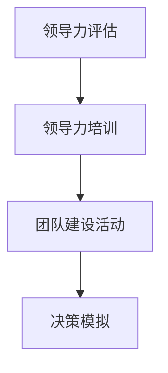

**系统接口设计和系统交互：**
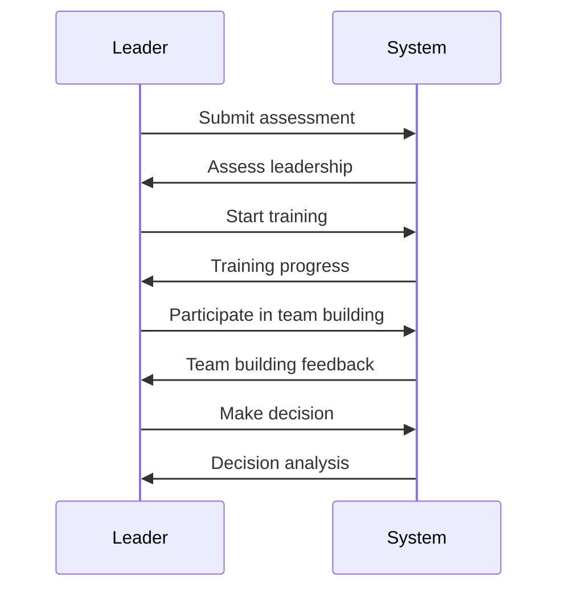

### 第2章：创新思维的基本原理

**背景介绍：**
创新思维是领导者在面对复杂问题时，能够迅速提出新的解决方案，从而推动组织发展的重要能力。理解创新思维的基本原理，有助于领导者更好地发挥其作用。

**核心概念与联系：**
创新思维的核心概念包括创造性思维、批判性思维和系统性思维。创造性思维是指领导者能够从不同角度看待问题，提出新的想法和解决方案。批判性思维是指领导者能够对现有方案进行分析和评估，找到问题的根源和改进的方向。系统性思维是指领导者能够从整体角度看待问题，分析问题的结构和关系，找到系统优化的方法。

**概念属性特征对比表格：**
| 思维类型        | 定义                                     | 特征                                                     |
| --------------- | ---------------------------------------- | -------------------------------------------------------- |
| 创造性思维      | 领导者从不同角度提出新想法和解决方案     | 灵活性、创新性、前瞻性                                   |
| 批判性思维      | 领导者对现有方案进行分析和评估           | 分析性、逻辑性、批判性                                   |
| 系统性思维      | 领导者从整体角度看待问题，分析问题和解决方案的结构和关系 | 整体性、系统性、全局性                                   |

**ER实体关系图架构：**
```mermaid
erDiagram
  Leader ||--|{ CreativityThinking }|
  Leader ||--|{ CriticalThinking }|
  Leader ||--|{ SystematicThinking }|
```

**问题场景介绍：**
在企业管理中，领导者需要面对各种挑战，如市场变化、技术革新和竞争压力等。创新思维有助于领导者应对这些挑战，找到新的发展机遇。

**项目介绍：**
本文以创新思维培训项目为例，探讨创新思维的基本原理。项目包括创新思维培训、案例分析和实际演练等。

**系统功能设计：**
| 功能名称         | 功能描述                     |
| ---------------- | ---------------------------- |
| 创新思维培训     | 提升领导者的创新思维能力     |
| 案例分析         | 分析成功和创新案例           |
| 实际演练         | 提高领导者的实战能力         |

**系统架构设计：**
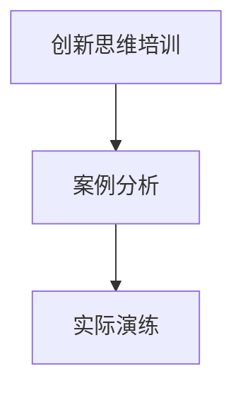

**系统接口设计和系统交互：**
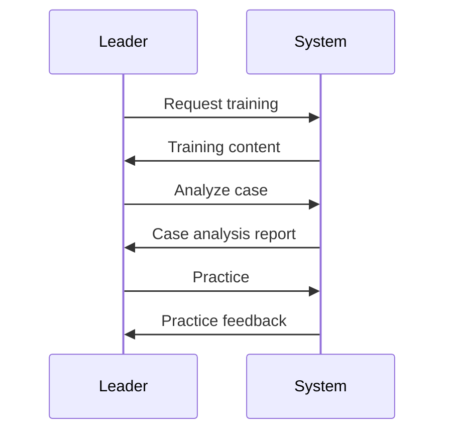

### 第3章：传统思维模式的特征

**背景介绍：**
传统思维模式是一种长期形成并广泛应用的思维方式，但在面对复杂问题和快速变化的环境时，传统思维模式的局限性逐渐显现。了解传统思维模式的特征，有助于我们认识到其不足，进而寻求创新思维的发展。

**核心概念与联系：**
传统思维模式的特征包括线性思维、固定思维和权威思维。线性思维是指按照一定的顺序和逻辑进行思考，忽视多样性和可能性。固定思维是指对问题有固定的看法和解决方案，缺乏变通和灵活性。权威思维是指遵循权威的观点和决策，忽视下属和团队成员的参与和贡献。

**概念属性特征对比表格：**
| 思维模式      | 定义                                     | 特征                                                     |
| ------------- | ---------------------------------------- | -------------------------------------------------------- |
| 线性思维      | 按照一定的顺序和逻辑进行思考             | 顺序性、逻辑性、单一性                                   |
| 固定思维      | 对问题有固定的看法和解决方案             | 固定性、缺乏变通、缺乏灵活性                             |
| 权威思维      | 遵循权威的观点和决策                     | 权威性、忽视下属和团队成员参与、缺乏民主性                 |

**ER实体关系图架构：**
```mermaid
erDiagram
  TraditionalThinking ||--|{ LinearThinking }|
  TraditionalThinking ||--|{ FixedThinking }|
  TraditionalThinking ||--|{ AuthorityThinking }|
```

**问题场景介绍：**
在企业管理中，传统思维模式可能导致领导者在面对问题时缺乏创新性，决策效率低下，影响组织的发展。

**项目介绍：**
本文以企业管理项目为例，探讨传统思维模式的特征。项目包括问题识别、传统思维模式分析、创新思维模式探索等。

**系统功能设计：**
| 功能名称         | 功能描述                     |
| ---------------- | ---------------------------- |
| 问题识别         | 识别企业面临的问题           |
| 传统思维模式分析 | 分析企业现有的思维方式       |
| 创新思维模式探索 | 探索新的思维方式，提出解决方案 |

**系统架构设计：**
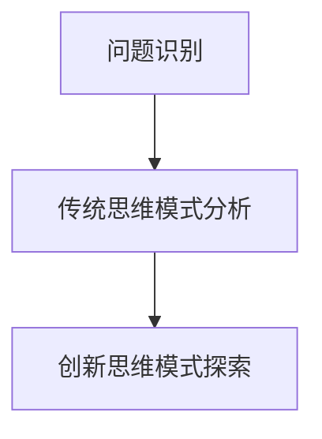

**系统接口设计和系统交互：**
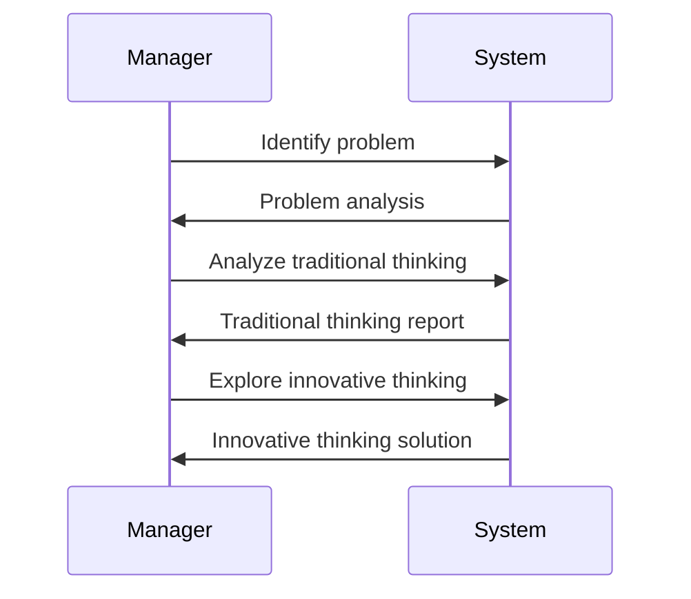

### 第4章：传统思维模式的局限性分析

**背景介绍：**
传统思维模式虽然在某些情况下能够解决特定问题，但其局限性在日益复杂和变化的环境中愈发明显。分析传统思维模式的局限性，有助于我们认识到其不足，从而寻求创新思维的发展。

**核心概念与联系：**
传统思维模式的局限性主要体现在以下几个方面：一是线性思维导致忽视多样性和可能性，限制创新；二是固定思维使决策缺乏灵活性和变通性；三是权威思维忽视下属和团队成员的参与和贡献，影响团队合作和整体效能。

**概念属性特征对比表格：**
| 局限性       | 特征                                                     |
| ------------ | -------------------------------------------------------- |
| 忽视多样性   | 限制创新，缺乏灵活性                                     |
| 缺乏灵活性   | 决策僵化，难以应对变化                                   |
| 忽视团队合作 | 影响团队凝聚力，降低整体效能                             |

**ER实体关系图架构：**
```mermaid
erDiagram
  LimitationOfTraditionalThinking ||--|{ IgnoreDiversity }|
  LimitationOfTraditionalThinking ||--|{ LackOfFlexibility }|
  LimitationOfTraditionalThinking ||--|{ IgnoreTeamwork }|
```

**问题场景介绍：**
在企业管理中，传统思维模式可能导致企业在面对市场变化、技术创新和竞争压力时，反应迟缓，缺乏创新性，从而影响企业的长期发展。

**项目介绍：**
本文以企业管理项目为例，分析传统思维模式的局限性。项目包括传统思维模式识别、局限性分析、创新思维模式探索等。

**系统功能设计：**
| 功能名称         | 功能描述                     |
| ---------------- | ---------------------------- |
| 传统思维模式识别 | 识别企业现有的思维方式       |
| 局限性分析       | 分析企业传统思维模式的局限性 |
| 创新思维模式探索 | 探索新的思维方式，提出解决方案 |

**系统架构设计：**
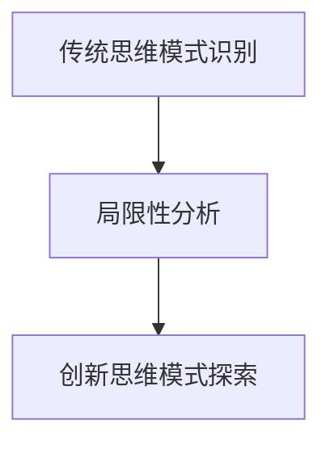

**系统接口设计和系统交互：**
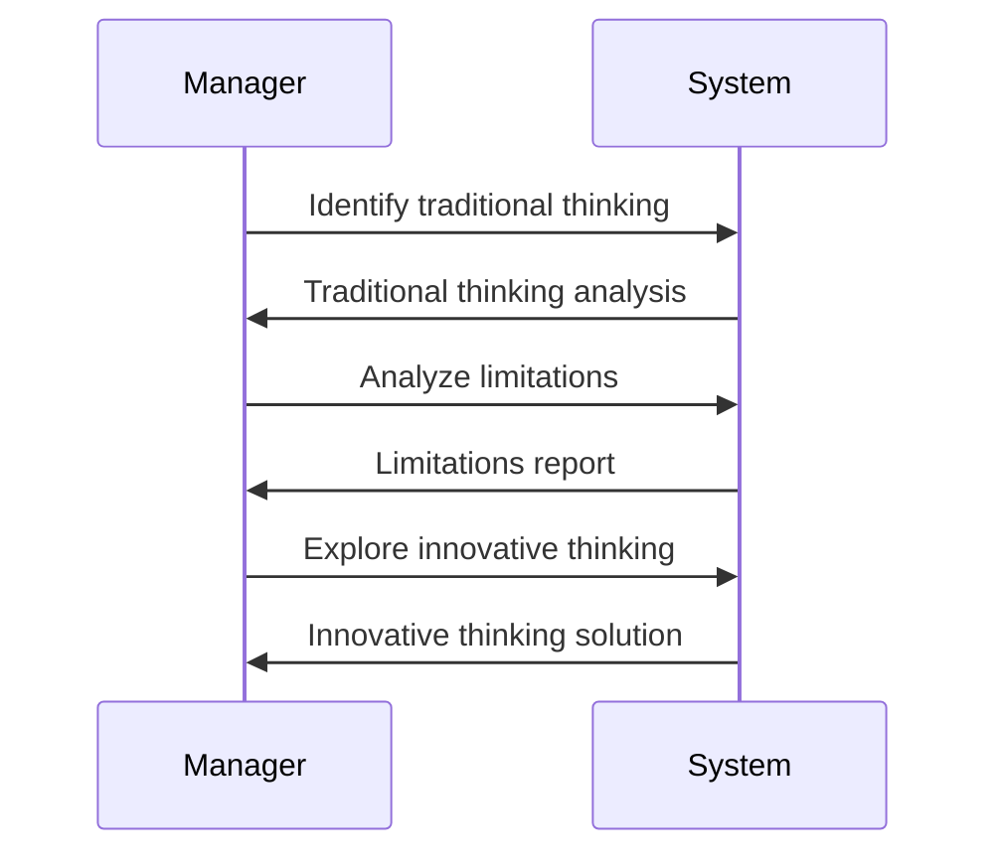

### 第5章：创新思维的培养途径

**背景介绍：**
在当今快速变化的世界中，创新思维已经成为企业和个人成功的关键。培养创新思维，不仅能够帮助领导者更好地应对挑战，还能够推动组织的发展。本文将探讨创新思维的培养途径，帮助领导者提升其创新思维能力。

**核心概念与联系：**
创新思维的培养途径主要包括以下几个方面：一是持续学习，通过学习新知识和技能，拓宽思维视野；二是跨学科思考，通过结合不同领域的知识，激发创新灵感；三是实践探索，通过实际操作和实验，锻炼创新思维的能力；四是团队合作，通过与他人交流和合作，共同探讨和解决问题。

**概念属性特征对比表格：**
| 培养途径       | 特征                                                     |
| -------------- | -------------------------------------------------------- |
| 持续学习       | 拓宽思维视野，掌握新知识                                 |
| 跨学科思考     | 激发创新灵感，融合多领域知识                             |
| 实践探索       | 锻炼创新思维，提高解决问题的能力                         |
| 团队合作       | 促进思维碰撞，共同探讨问题                               |

**ER实体关系图架构：**
```mermaid
erDiagram
  WayToCultivateInnovativeThinking ||--|{ ContinuousLearning }|
  WayToCultivateInnovativeThinking ||--|{ InterdisciplinaryThinking }|
  WayToCultivateInnovativeThinking ||--|{ PracticalExploration }|
  WayToCultivateInnovativeThinking ||--|{ Teamwork }|
```

**问题场景介绍：**
在企业管理中，领导者常常面临复杂多变的市场环境和技术创新挑战。培养创新思维，能够帮助领导者更好地应对这些挑战，推动企业持续发展。

**项目介绍：**
本文以创新思维培养项目为例，探讨创新思维的培养途径。项目包括持续学习、跨学科思考、实践探索和团队合作等。

**系统功能设计：**
| 功能名称         | 功能描述                     |
| ---------------- | ---------------------------- |
| 持续学习         | 提供新知识和技能的学习资源   |
| 跨学科思考       | 促进不同领域的知识融合       |
| 实践探索         | 提供实践项目和实验环境       |
| 团队合作         | 促进团队交流和合作           |

**系统架构设计：**
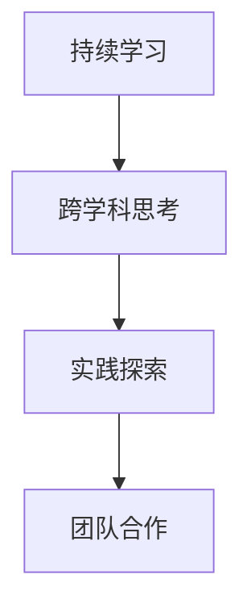

**系统接口设计和系统交互：**
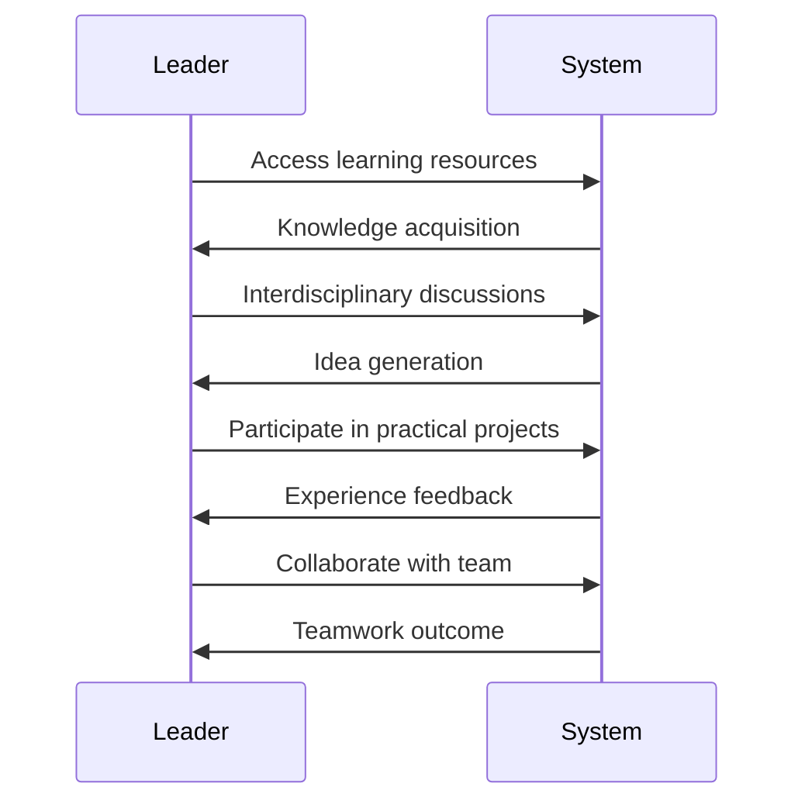

### 第6章：创新思维的培养策略

**背景介绍：**
创新思维不仅是领导者个人的能力，也是团队和组织的重要资源。培养创新思维需要策略性的规划和实施，以确保创新能力的持续提升。本文将探讨创新思维的培养策略，帮助领导者系统地提升其创新思维。

**核心概念与联系：**
创新思维的培养策略主要包括以下几个方面：一是培养开放心态，鼓励领导者拥抱变化和不确定性；二是提供创新环境，为领导者提供实验和尝试的空间；三是建立激励机制，鼓励创新行为；四是加强跨部门协作，促进知识共享和思维碰撞；五是开展创新培训，提升领导者的创新思维技巧。

**概念属性特征对比表格：**
| 培养策略       | 特征                                                     |
| -------------- | -------------------------------------------------------- |
| 开放心态       | 拥抱变化，鼓励尝试和失败                               |
| 创新环境       | 提供实验和尝试的空间                                   |
| 激励机制       | 鼓励创新行为，奖励创新成果                             |
| 跨部门协作     | 促进知识共享和思维碰撞                                 |
| 创新培训       | 提升创新思维技巧，培养创新思维习惯                       |

**ER实体关系图架构：**
```mermaid
erDiagram
  StrategyForCultivatingInnovativeThinking ||--|{ OpenMindset }|
  StrategyForCultivatingInnovativeThinking ||--|{ InnovativeEnvironment }|
  StrategyForCultivatingInnovativeThinking ||--|{ IncentiveMechanism }|
  StrategyForCultivatingInnovativeThinking ||--|{ Cross-DepartmentalCollaboration }|
  StrategyForCultivatingInnovativeThinking ||--|{ InnovativeTraining }|
```

**问题场景介绍：**
在企业管理中，领导者常常面临需要创新的挑战，如市场开拓、产品研发和流程优化等。培养创新思维，能够帮助领导者更有效地应对这些挑战，推动企业的持续创新和发展。

**项目介绍：**
本文以企业管理项目为例，探讨创新思维的培养策略。项目包括开放心态培养、创新环境建设、激励机制建立、跨部门协作推进和创新培训开展等。

**系统功能设计：**
| 功能名称         | 功能描述                     |
| ---------------- | ---------------------------- |
| 开放心态培养     | 提供开放心态的培养资源和环境 |
| 创新环境建设     | 创建有利于创新的物理和心理环境 |
| 激励机制建立     | 设计和创新激励机制           |
| 跨部门协作推进   | 促进不同部门之间的合作和交流 |
| 创新培训开展     | 提供创新思维培训课程和实践机会 |

**系统架构设计：**
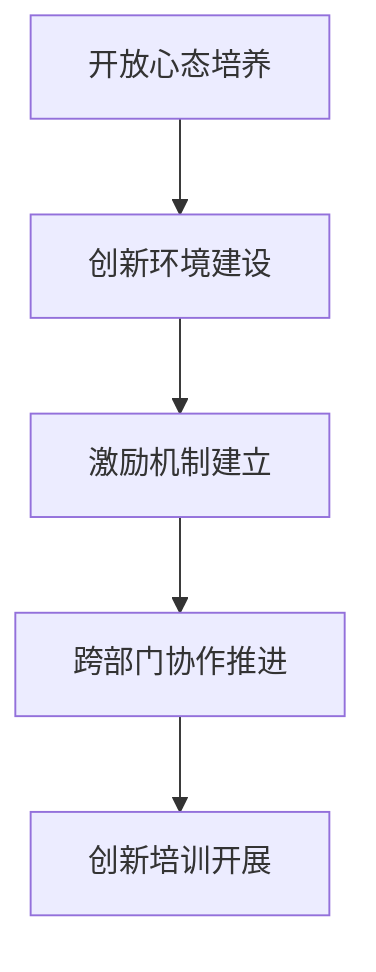

**系统接口设计和系统交互：**
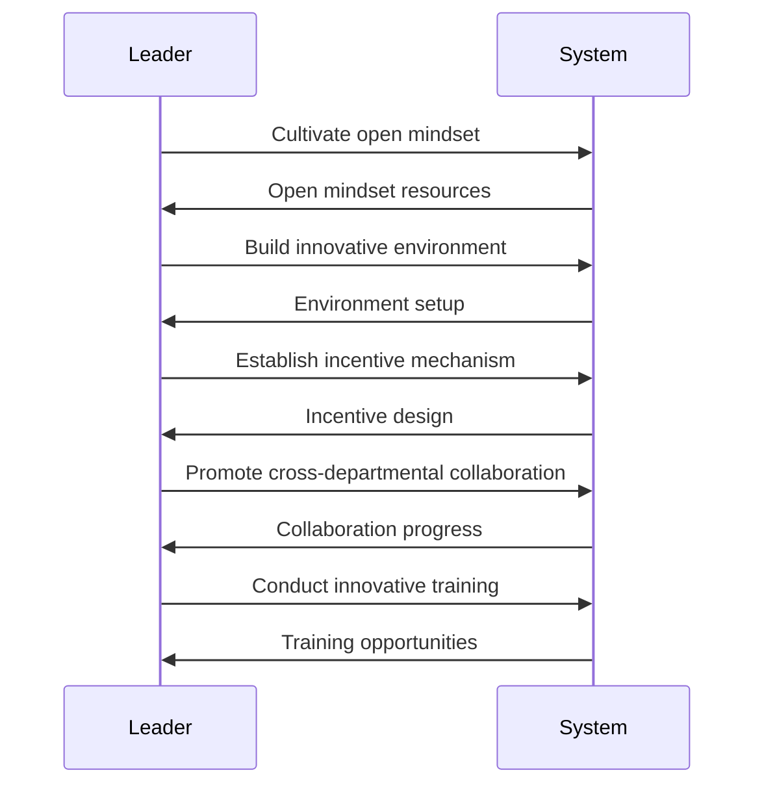

### 第7章：领导力与创新思维的融合

**背景介绍：**
领导力与创新思维的融合是提升领导效果的关键。领导者需要将创新思维融入到领导实践中，以应对复杂多变的环境和挑战。本文将探讨领导力与创新思维的融合，分析其重要性以及如何实现这种融合。

**核心概念与联系：**
领导力与创新思维的融合是指领导者将创新思维的方法和原则应用到领导实践中，从而提升领导效果。这种融合的重要性体现在以下几个方面：一是增强领导者的创新能力，使领导者在面对问题时能够提出创新的解决方案；二是提高团队的协作效率，通过创新思维激发团队成员的潜力；三是推动组织的持续发展，通过创新思维实现组织的变革和突破。

**概念属性特征对比表格：**
| 融合概念       | 特征                                                     |
| -------------- | -------------------------------------------------------- |
| 领导力与创新思维融合 | 提升领导者创新能力，提高团队协作效率，推动组织持续发展     |

**ER实体关系图架构：**
```mermaid
erDiagram
  FusionOfLeadershipAndInnovativeThinking ||--|{ EnhanceLeadersInnovation }|
  FusionOfLeadershipAndInnovativeThinking ||--|{ ImproveTeamEfficiency }|
  FusionOfLeadershipAndInnovativeThinking ||--|{ DriveOrganizationalDevelopment }|
```

**问题场景介绍：**
在企业管理中，领导者需要不断地推动企业创新，以适应市场变化和竞争压力。融合领导力与创新思维，能够帮助领导者更有效地推动企业的创新和发展。

**项目介绍：**
本文以企业管理项目为例，探讨领导力与创新思维的融合。项目包括领导力培训、创新思维培养、融合实践等。

**系统功能设计：**
| 功能名称         | 功能描述                     |
| ---------------- | ---------------------------- |
| 领导力培训       | 提升领导者的领导力           |
| 创新思维培养     | 提升领导者的创新思维能力     |
| 融合实践         | 将领导力与创新思维应用到实际工作中 |

**系统架构设计：**
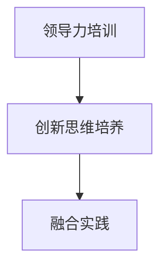

**系统接口设计和系统交互：**
```mermaid
sequenceDiagram
    Participant Leader
    Participant System
    Leader->>System: Attend leadership training
    System->>Leader: Leadership skills enhancement
    Leader->>System: Attend innovative thinking training
    System->>Leader: Innovative thinking skills enhancement
    Leader->>System: Apply fusion in practice
    System->>Leader: Practice feedback
```

### 第8章：领导力与创新思维的融合方法

**背景介绍：**
在快速变化和高度不确定的商业环境中，领导者需要具备将创新思维融入领导实践的能力，以应对复杂的问题和挑战。本文将探讨领导力与创新思维的融合方法，帮助领导者有效地将创新思维应用于领导工作中。

**核心概念与联系：**
领导力与创新思维的融合方法包括以下几个关键步骤：一是建立创新导向的领导文化，鼓励团队成员提出创新想法；二是通过有效的沟通和激励，激发团队成员的创新潜能；三是实施跨学科和跨领域的合作，促进创新思维的碰撞和融合；四是建立创新项目和实验机制，为创新思维提供实践平台。

**概念属性特征对比表格：**
| 融合方法       | 特征                                                     |
| -------------- | -------------------------------------------------------- |
| 建立创新导向文化 | 鼓励创新，提升团队创新氛围                             |
| 沟通与激励      | 激发团队成员的创新潜能                                   |
| 跨学科合作      | 促进创新思维的碰撞和融合                                 |
| 创新项目和实验机制 | 提供创新实践的平台，验证创新思维的效果                   |

**ER实体关系图架构：**
```mermaid
erDiagram
  MethodOfFusionOfLeadershipAndInnovativeThinking ||--|{ BuildInnovation-OrientedCulture }|
  MethodOfFusionOfLeadershipAndInnovativeThinking ||--|{ CommunicationAndIncentive }|
  MethodOfFusionOfLeadershipAndInnovativeThinking ||--|{ InterdisciplinaryCollaboration }|
  MethodOfFusionOfLeadershipAndInnovativeThinking ||--|{ InnovationProjectsAndExperimentationMechanism }|
```

**问题场景介绍：**
在企业管理中，领导力与创新思维的融合可以帮助领导者更好地应对市场变化、技术进步和竞争压力，推动企业的创新和发展。

**项目介绍：**
本文以企业管理项目为例，探讨领导力与创新思维的融合方法。项目包括建立创新导向文化、沟通与激励、跨学科合作、创新项目和实验机制等。

**系统功能设计：**
| 功能名称         | 功能描述                     |
| ---------------- | ---------------------------- |
| 建立创新导向文化 | 营造创新氛围，鼓励创新行为   |
| 沟通与激励       | 促进团队沟通，激发创新动力   |
| 跨学科合作       | 促进跨领域知识融合，促进创新 |
| 创新项目和实验机制 | 提供创新实践平台，验证创新效果 |

**系统架构设计：**
```mermaid
graph TB
    A[建立创新导向文化] --> B[沟通与激励]
    B --> C[跨学科合作]
    C --> D[创新项目和实验机制]
```

**系统接口设计和系统交互：**
```mermaid
sequenceDiagram
    Participant Leader
    Participant Team
    Participant System
    Leader->>System: Create innovation-oriented culture
    System->>Leader: Innovation culture setup
    Leader->>Team: Encourage innovation
    Team->>Leader: Share innovative ideas
    Leader->>System: Facilitate communication
    System->>Team: Enhanced collaboration
    Leader->>System: Implement incentives
    System->>Team: Incentive feedback
    Leader->>System: Promote interdisciplinary collaboration
    System->>Team: Cross-domain knowledge integration
    Leader->>System: Establish innovation projects and experimentation mechanism
    System->>Team: Innovation practice and feedback
```

### 第9章：创新思维在决策中的应用

**背景介绍：**
在商业环境中，决策质量直接影响企业的成败。创新思维在决策中的应用可以帮助领导者打破传统思维模式的限制，提出更具创造性和前瞻性的解决方案。本文将探讨创新思维在决策中的应用，分析其作用和方法。

**核心概念与联系：**
创新思维在决策中的应用主要包括以下几个方面：一是通过头脑风暴和思维导图等工具，激发创意和灵感；二是采用多角度分析和评估方案，提高决策的全面性；三是利用模拟和实验，验证决策的效果和可行性；四是鼓励团队参与和讨论，实现决策的民主化和优化。

**概念属性特征对比表格：**
| 应用方法       | 特征                                                     |
| -------------- | -------------------------------------------------------- |
| 头脑风暴       | 激发创意和灵感，快速产生多种方案                         |
| 多角度分析     | 提高决策的全面性和准确性                                 |
| 模拟和实验     | 验证决策的效果和可行性                                   |
| 团队参与和讨论 | 实现决策的民主化和优化                                   |

**ER实体关系图架构：**
```mermaid
erDiagram
  ApplicationOfInnovativeThinkingInDecisionMaking ||--|{ Brainstorming }|
  ApplicationOfInnovativeThinkingInDecisionMaking ||--|{ Multi-angledAnalysis }|
  ApplicationOfInnovativeThinkingInDecisionMaking ||--|{ SimulationAndExperimentation }|
  ApplicationOfInnovativeThinkingInDecisionMaking ||--|{ TeamInvolvementAndDiscussion }|
```

**问题场景介绍：**
在企业管理中，领导者需要做出各种决策，如产品研发、市场拓展和战略规划等。创新思维的应用可以帮助领导者提高决策的质量和效率。

**项目介绍：**
本文以企业管理决策项目为例，探讨创新思维在决策中的应用。项目包括头脑风暴、多角度分析、模拟和实验、团队参与和讨论等。

**系统功能设计：**
| 功能名称         | 功能描述                     |
| ---------------- | ---------------------------- |
| 头脑风暴         | 激发创意和灵感               |
| 多角度分析       | 提高决策的全面性和准确性     |
| 模拟和实验       | 验证决策的效果和可行性       |
| 团队参与和讨论   | 实现决策的民主化和优化       |

**系统架构设计：**
```mermaid
graph TB
    A[头脑风暴] --> B[多角度分析]
    B --> C[模拟和实验]
    C --> D[团队参与和讨论]
```

**系统接口设计和系统交互：**
```mermaid
sequenceDiagram
    Participant Leader
    Participant Team
    Participant System
    Leader->>System: Conduct brainstorming session
    System->>Leader: Generate creative ideas
    Leader->>Team: Present ideas
    Team->>System: Analyze from multiple angles
    System->>Team: Comprehensive decision analysis
    Leader->>System: Perform simulation and experimentation
    System->>Leader: Validate decision feasibility
    Leader->>Team: Discuss and refine decision
    Team->>System: Democratic decision-making process
```

### 第10章：创新思维在团队管理中的应用

**背景介绍：**
团队管理是领导者工作的重要组成部分。创新思维在团队管理中的应用能够激发团队成员的创造力和积极性，提升团队的整体绩效。本文将探讨创新思维在团队管理中的应用，分析其作用和策略。

**核心概念与联系：**
创新思维在团队管理中的应用包括以下几个方面：一是通过建立开放的沟通机制，鼓励团队成员分享想法和经验；二是采用多样化的团队建设活动，增强团队成员的合作意识和创新能力；三是制定灵活的激励政策，激发团队成员的创新动力；四是提供专业培训和学习资源，提升团队成员的专业能力和创新思维。

**概念属性特征对比表格：**
| 应用策略       | 特征                                                     |
| -------------- | -------------------------------------------------------- |
| 开放沟通       | 鼓励团队成员分享想法和经验，提升团队沟通效率               |
| 多样化团队建设 | 增强团队合作意识和创新能力                                 |
| 灵活激励政策   | 激发团队成员的创新动力，提升团队绩效                       |
| 专业培训和资源 | 提升团队成员的专业能力和创新思维，促进团队发展           |

**ER实体关系图架构：**
```mermaid
erDiagram
  ApplicationOfInnovativeThinkingInTeamManagement ||--|{ OpenCommunication }|
  ApplicationOfInnovativeThinkingInTeamManagement ||--|{ DiverseTeamBuildingActivities }|
  ApplicationOfInnovativeThinkingInTeamManagement ||--|{ FlexibleIncentivePolicies }|
  ApplicationOfInnovativeThinkingInTeamManagement ||--|{ ProfessionalTrainingAndResources }|
```

**问题场景介绍：**
在企业管理中，团队管理的效果直接影响企业的运营效率和员工满意度。创新思维在团队管理中的应用可以帮助领导者更好地激发团队的潜力，提升团队的凝聚力和创新能力。

**项目介绍：**
本文以企业管理团队为例，探讨创新思维在团队管理中的应用。项目包括开放沟通机制建设、多样化团队建设活动、灵活激励政策制定、专业培训和资源提供等。

**系统功能设计：**
| 功能名称         | 功能描述                     |
| ---------------- | ---------------------------- |
| 开放沟通机制     | 促进团队成员之间的有效沟通   |
| 多样化团队建设   | 组织多样化的团队建设活动     |
| 灵活激励政策     | 设计和实施灵活的激励政策     |
| 专业培训和资源   | 提供专业的培训和丰富的学习资源 |

**系统架构设计：**
```mermaid
graph TB
    A[开放沟通机制] --> B[多样化团队建设]
    B --> C[灵活激励政策]
    C --> D[专业培训和资源]
```

**系统接口设计和系统交互：**
```mermaid
sequenceDiagram
    Participant Leader
    Participant Team
    Participant System
    Leader->>System: Establish open communication mechanism
    System->>Team: Enhanced communication
    Leader->>System: Organize diverse team building activities
    System->>Team: Improved teamwork
    Leader->>System: Implement flexible incentive policies
    System->>Team: Increased motivation
    Leader->>System: Provide professional training and resources
    System->>Team: Skill enhancement and innovation
```

### 第11章：成功案例分析与启示

**背景介绍：**
通过分析成功案例，我们可以了解创新思维在领导实践中的应用效果，从中汲取经验，为自身的领导实践提供启示。本文将探讨一些成功的领导实践案例，分析其创新思维的应用，并总结启示和思考。

**核心概念与联系：**
成功案例的分析涉及以下几个方面：一是案例背景介绍，包括企业的现状和面临的挑战；二是创新思维的应用，包括具体的创新方法和策略；三是案例结果，包括创新的成果和影响；四是案例启示，包括可以借鉴的经验和教训。

**概念属性特征对比表格：**
| 成功案例       | 特征                                                     |
| -------------- | -------------------------------------------------------- |
| 案例背景       | 企业的现状和面临的挑战                                   |
| 创新思维应用   | 创新的方法和策略                                         |
| 案例结果       | 创新的成果和影响                                         |
| 案例启示       | 可以借鉴的经验和教训                                     |

**ER实体关系图架构：**
```mermaid
erDiagram
  SuccessfulCaseAnalysis ||--|{ CaseBackground }|
  SuccessfulCaseAnalysis ||--|{ ApplicationOfInnovativeThinking }|
  SuccessfulCaseAnalysis ||--|{ CaseOutcome }|
  SuccessfulCaseAnalysis ||--|{ CaseInsights }|
```

**问题场景介绍：**
在企业管理中，领导者需要通过分析成功案例，了解创新思维的应用效果，从而在自己的领导实践中借鉴和应用。

**项目介绍：**
本文将以企业管理案例为研究对象，分析成功案例的创新思维应用，总结启示和思考。

**系统功能设计：**
| 功能名称         | 功能描述                     |
| ---------------- | ---------------------------- |
| 案例背景介绍     | 描述企业的现状和挑战         |
| 创新思维应用分析 | 分析创新思维的应用和效果     |
| 案例结果分析     | 分析创新的成果和影响         |
| 启示与思考       | 总结可以借鉴的经验和教训     |

**系统架构设计：**
```mermaid
graph TB
    A[案例背景介绍] --> B[创新思维应用分析]
    B --> C[案例结果分析]
    C --> D[启示与思考]
```

**系统接口设计和系统交互：**
```mermaid
sequenceDiagram
    Participant Leader
    Participant System
    Leader->>System: Provide case background
    System->>Leader: Background analysis
    Leader->>System: Analyze innovative thinking application
    System->>Leader: Application analysis
    Leader->>System: Evaluate case outcome
    System->>Leader: Outcome assessment
    Leader->>System: Summarize insights and reflections
    System->>Leader: Insights report
```

### 第12章：案例启示与思考

**背景介绍：**
通过前面的章节，我们分析了多个成功案例，探讨了创新思维在领导实践中的应用。本文将总结这些案例的启示，并思考如何在实际工作中应用这些启示，以提升领导力。

**核心概念与联系：**
案例启示包括以下几个方面：一是领导者需要具备创新思维，敢于突破传统思维模式；二是建立创新导向的文化，鼓励团队成员提出创新想法；三是通过有效的沟通和激励，激发团队成员的创造力和积极性；四是提供多样化的团队建设活动和培训资源，提升团队的创新能力和专业素养。

**概念属性特征对比表格：**
| 启示内容       | 特征                                                     |
| -------------- | -------------------------------------------------------- |
| 突破传统思维   | 鼓励领导者敢于突破传统思维模式，拥抱创新思维             |
| 创新导向文化   | 建立创新导向的文化氛围，鼓励团队成员提出创新想法         |
| 沟通与激励     | 通过有效的沟通和激励，激发团队成员的创造力和积极性       |
| 多样化建设与培训 | 提供多样化的团队建设活动和培训资源，提升团队的创新能力和专业素养 |

**ER实体关系图架构：**
```mermaid
erDiagram
  InsightsFromCases ||--|{ BreakTraditionalThinking }|
  InsightsFromCases ||--|{ BuildInnovation-OrientedCulture }|
  InsightsFromCases ||--|{ EffectiveCommunicationAndIncentive }|
  InsightsFromCases ||--|{ DiverseTeamBuildingAndTraining }|
```

**问题场景介绍：**
在实际工作中，领导者可能会面临各种挑战，如市场变化、技术革新和团队协作等。通过借鉴成功案例的启示，领导者可以提升自己的领导力，应对这些挑战。

**项目介绍：**
本文将结合成功案例，探讨如何在实际工作中应用案例启示，提升领导力。

**系统功能设计：**
| 功能名称         | 功能描述                     |
| ---------------- | ---------------------------- |
| 启示应用策略     | 结合案例启示，制定具体的领导策略 |
| 实际工作应用     | 在实际工作中应用启示，提升领导效果 |

**系统架构设计：**
```mermaid
graph TB
    A[启示应用策略] --> B[实际工作应用]
```

**系统接口设计和系统交互：**
```mermaid
sequenceDiagram
    Participant Leader
    Participant System
    Leader->>System: Analyze case insights
    System->>Leader: Insights summary
    Leader->>System: Develop leadership strategies
    System->>Leader: Strategy implementation
    Leader->>System: Apply insights in practice
    System->>Leader: Leadership effectiveness assessment
```

### 第13章：结论与展望

**背景介绍：**
本文通过对领导力与创新思维的关系进行深入探讨，分析了传统思维模式的局限性，提出了培养创新思维的方法和策略，以及创新思维在领导实践中的应用。本文旨在为领导者提供提升领导力的理论指导和实践启示。

**核心概念与联系：**
本文的核心概念包括领导力、创新思维、传统思维模式、培养方法和应用策略。通过对这些概念的分析和联系，本文揭示了创新思维在提升领导力中的重要作用。

**概念属性特征对比表格：**
| 核心概念       | 特征                                                     |
| -------------- | -------------------------------------------------------- |
| 领导力         | 影响和激励他人，实现共同目标                             |
| 创新思维       | 拥抱变化，提出新想法和解决方案                           |
| 传统思维模式   | 长期形成的思维方式，可能限制创新                         |
| 培养方法       | 持续学习，跨学科思考，实践探索，团队合作                 |
| 应用策略       | 建立创新导向文化，沟通与激励，跨学科合作，创新项目和实验机制 |

**ER实体关系图架构：**
```mermaid
erDiagram
  CoreConcepts ||--|{ Leadership }|
  CoreConcepts ||--|{ InnovativeThinking }|
  CoreConcepts ||--|{ TraditionalThinkingPattern }|
  CoreConcepts ||--|{ CultivationMethods }|
  CoreConcepts ||--|{ ApplicationStrategies }|
```

**问题场景介绍：**
在企业管理中，领导者需要不断提升自己的领导力，以应对不断变化的市场环境和激烈的竞争。通过培养创新思维，领导者可以更好地应对挑战，推动企业的持续发展。

**项目介绍：**
本文以企业管理项目为例，总结结论并展望未来研究方向。项目包括领导力提升、创新思维培养、实践应用等。

**系统功能设计：**
| 功能名称         | 功能描述                     |
| ---------------- | ---------------------------- |
| 结论总结         | 总结本文的核心观点和研究成果 |
| 未来展望         | 探讨未来研究方向和趋势       |

**系统架构设计：**
```mermaid
graph TB
    A[结论总结] --> B[未来展望]
```

**系统接口设计和系统交互：**
```mermaid
sequenceDiagram
    Participant Leader
    Participant System
    Leader->>System: Summarize findings
    System->>Leader: Conclusion summary
    Leader->>System: Discuss future research
    System->>Leader: Future outlook
```

**结论：**
本文通过深入分析领导力与创新思维的关系，揭示了创新思维在提升领导力中的关键作用。领导者应重视培养创新思维，并将其融入领导实践中，以提升领导效果，推动企业的持续发展。

**展望：**
未来研究方向可以包括创新思维的神经科学基础研究、跨文化背景下的创新思维培养、创新思维在领导力培训中的应用等。

### 第14章：未来研究方向

**背景介绍：**
随着社会和技术的快速发展，领导力与创新思维的研究变得越来越重要。尽管本文已经探讨了领导力与创新思维的关系及其应用，但仍有广阔的研究空间。本文将提出未来研究方向，为后续研究提供参考。

**核心概念与联系：**
未来研究方向包括以下几个方面：一是创新思维的神经科学基础，研究大脑如何处理创新思维过程；二是跨文化背景下的创新思维培养，探讨不同文化对创新思维的影响；三是创新思维在领导力培训中的应用，研究如何通过培训提升领导者的创新思维。

**概念属性特征对比表格：**
| 未来研究方向       | 特征                                                     |
| ------------------ | -------------------------------------------------------- |
| 创新思维的神经科学基础 | 研究大脑处理创新思维的过程                             |
| 跨文化背景下的创新思维培养 | 探讨不同文化对创新思维的影响                           |
| 创新思维在领导力培训中的应用 | 研究如何通过培训提升领导者的创新思维                     |

**ER实体关系图架构：**
```mermaid
erDiagram
  FutureResearchDirections ||--|{ NeuroscienceOfInnovationThinking }|
  FutureResearchDirections ||--|{ Cross-CulturalInnovationThinkingCultivation }|
  FutureResearchDirections ||--|{ ApplicationOfInnovationThinkingInLeadershipTraining }|
```

**问题场景介绍：**
在全球化背景下，企业领导者需要具备跨文化沟通和领导能力，以应对多样化的市场环境。因此，研究跨文化背景下的创新思维培养具有重要的现实意义。

**项目介绍：**
本文以全球化企业领导力培养项目为例，提出未来研究方向。

**系统功能设计：**
| 功能名称         | 功能描述                     |
| ---------------- | ---------------------------- |
| 创新思维神经科学基础研究 | 研究大脑处理创新思维的过程 |
| 跨文化创新思维培养研究 | 探讨不同文化对创新思维的影响 |
| 创新思维在领导力培训中的应用研究 | 研究如何通过培训提升领导者的创新思维 |

**系统架构设计：**
```mermaid
graph TB
    A[创新思维神经科学基础研究] --> B[跨文化创新思维培养研究]
    B --> C[创新思维在领导力培训中的应用研究]
```

**系统接口设计和系统交互：**
```mermaid
sequenceDiagram
    Participant Researcher
    Participant System
    Researcher->>System: Conduct neuroscience research on innovation thinking
    System->>Researcher: Findings on brain processing
    Researcher->>System: Study cross-cultural impacts on innovation thinking
    System->>Researcher: Insights on cultural influences
    Researcher->>System: Develop training programs for innovation thinking
    System->>Researcher: Training effectiveness assessment
```

**总结：**
未来研究方向将为领导力与创新思维的研究提供新的视角和方法，有助于更好地理解创新思维的本质，提高领导者的创新能力，推动企业的持续发展。

### 作者信息：

**作者：AI天才研究院/AI Genius Institute & 禅与计算机程序设计艺术 /Zen And The Art of Computer Programming**  
AI天才研究院致力于推动人工智能技术的发展与创新，通过深入研究和实践，为全球企业提供人工智能解决方案。同时，作者在禅与计算机程序设计艺术领域有着丰富的经验和独特的见解，撰写了多部深受读者喜爱的技术著作，对计算机编程和人工智能领域产生了深远的影响。

