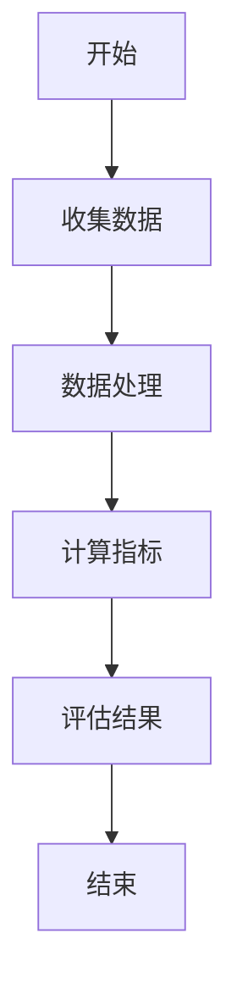
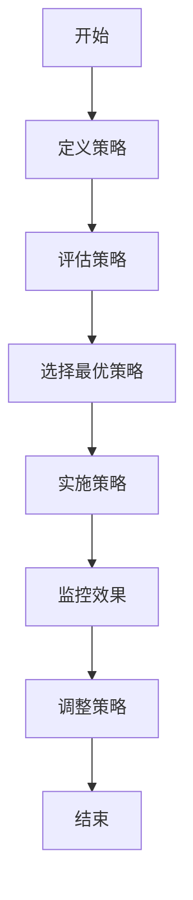
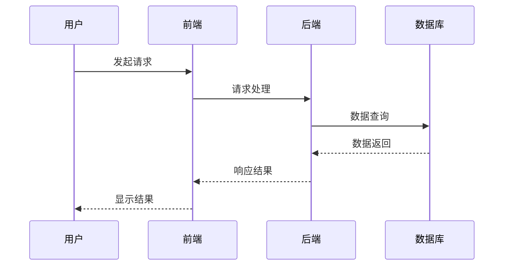
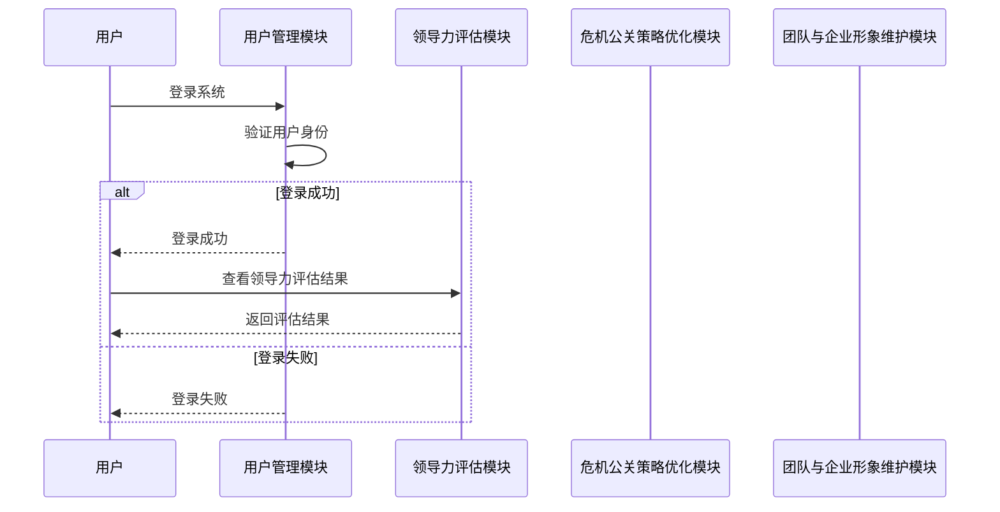

                 

# 领导力与危机公关：维护团队与企业形象

> 关键词：领导力、危机公关、团队、企业形象、维护、管理

> 摘要：本文将深入探讨领导力与危机公关在维护团队与企业形象中的重要作用。我们将从背景介绍、核心概念解析、算法原理讲解以及系统分析与架构设计等多个方面，逐步分析并阐述这些概念，最终通过实战案例提供实际应用指导。希望本文能为读者在处理类似问题时提供有益的参考和思路。

---

### 目录大纲

# 领导力与危机公关：维护团队与企业形象

## 第一部分 背景介绍

## 1.1 问题背景

### 1.1.1 企业面临危机的常见形式

### 1.1.2 危机对企业的影响

### 1.1.3 领导力在危机公关中的作用

## 1.2 核心概念

### 1.2.1 领导力的定义与类型

### 1.2.2 危机公关的定义与原则

### 1.2.3 团队与企业形象的关系

## 1.3 边界与外延

### 1.3.1 领导力与危机公关的相互作用

### 1.3.2 领导力与危机公关在不同行业中的应用

### 1.3.3 危机公关的挑战与应对策略

## 1.4 本章小结

----------------------------------------------------------------

## 第二部分 核心概念与联系

## 2.1 领导力概念解析

### 2.1.1 领导力的构成要素

### 2.1.2 领导力的属性特征对比表格

### 2.1.3 领导力的核心原理

## 2.2 危机公关概念解析

### 2.2.1 危机公关的定义与功能

### 2.2.2 危机公关的核心原则

### 2.2.3 危机公关的策略与方法

## 2.3 团队与企业形象关系分析

### 2.3.1 团队与企业形象的定义

### 2.3.2 团队与企业形象的联系与影响

### 2.3.3 团队与企业形象的维护策略

## 2.4 本章小结

----------------------------------------------------------------

## 第三部分 算法原理讲解

## 3.1 领导力评估算法

### 3.1.1 领导力评估算法的mermaid流程图

### 3.1.2 领导力评估算法的Python源代码

### 3.1.3 领导力评估算法的数学模型与公式

### 3.1.4 领导力评估算法的详细讲解与举例说明

## 3.2 危机公关策略优化算法

### 3.2.1 危机公关策略优化算法的mermaid流程图

### 3.2.2 危机公关策略优化算法的Python源代码

### 3.2.3 危机公关策略优化算法的数学模型与公式

### 3.2.4 危机公关策略优化算法的详细讲解与举例说明

## 3.3 本章小结

----------------------------------------------------------------

## 第四部分 系统分析与架构设计方案

## 4.1 问题场景介绍

### 4.1.1 企业危机管理场景描述

### 4.1.2 领导力提升场景描述

### 4.1.3 团队与企业形象维护场景描述

## 4.2 系统功能设计

### 4.2.1 领导力评估功能

### 4.2.2 危机公关策略优化功能

### 4.2.3 团队与企业形象维护功能

### 4.2.4 系统功能mermaid类图

## 4.3 系统架构设计

### 4.3.1 系统架构设计方案

### 4.3.2 系统架构mermaid架构图

### 4.3.1 系统接口设计

### 4.3.2 系统交互mermaid序列图

## 4.4 本章小结

----------------------------------------------------------------

## 第五部分 项目实战

## 5.1 环境安装

### 5.1.1 系统环境要求

### 5.1.2 环境安装步骤

### 5.1.3 系统核心库安装

## 5.2 系统核心实现源代码

### 5.2.1 领导力评估模块源代码

### 5.2.2 危机公关策略优化模块源代码

### 5.2.3 团队与企业形象维护模块源代码

## 5.3 代码应用解读与分析

### 5.3.1 领导力评估模块应用解读

### 5.3.2 危机公关策略优化模块应用解读

### 5.3.3 团队与企业形象维护模块应用解读

## 5.4 实际案例分析与详细讲解剖析

### 5.4.1 企业危机案例分析

### 5.4.2 领导力提升案例

### 5.4.3 团队与企业形象维护案例

## 5.5 项目小结

### 5.5.1 项目总结

### 5.5.2 不足与改进

### 5.5.3 拓展应用

----------------------------------------------------------------

## 附录

## 附录A

----------------------------------------------------------------

---

在接下来的内容中，我们将逐步展开对领导力与危机公关的深入探讨，结合实际案例，提供系统的分析框架与实用的技术指南。让我们开始这次探讨之旅吧！

---

## 第一部分 背景介绍

### 1.1 问题背景

#### 1.1.1 企业面临危机的常见形式

企业危机是一种突然发生的、对企业的声誉、财务状况或运营产生负面影响的紧急事件。危机的形式多种多样，主要包括以下几种：

1. **产品安全事件**：例如，某产品被发现含有有害物质，导致消费者健康受到威胁。
2. **负面新闻**：媒体报道企业涉嫌不正当行为，如财务造假、环境污染等。
3. **网络安全事件**：企业遭受网络攻击，导致数据泄露或系统瘫痪。
4. **员工行为问题**：例如，高层管理人员卷入丑闻，或员工有不法行为被曝光。
5. **市场变动**：经济衰退、政策变化等可能导致市场需求下降，影响企业盈利。

#### 1.1.2 危机对企业的影响

企业危机的影响往往是深远且复杂的，具体表现在以下几个方面：

1. **声誉损害**：企业品牌形象受到严重打击，消费者信任度下降。
2. **经济损失**：销售收入下降，股价波动，甚至可能导致投资者撤资。
3. **运营中断**：部分业务可能因此被迫暂停，影响企业正常运营。
4. **员工士气**：危机事件可能导致员工焦虑、恐慌，影响团队协作和生产力。
5. **法律风险**：企业可能面临诉讼和罚款等法律问题。

#### 1.1.3 领导力在危机公关中的作用

领导力在危机公关中扮演着至关重要的角色。以下是一些关键点：

1. **决策能力**：危机爆发时，领导者需要迅速做出正确的决策，指导企业应对危机。
2. **沟通能力**：领导者需要与内部员工、外部客户、媒体等多方进行有效沟通，稳定各方情绪。
3. **战略规划**：领导者需要制定长期的危机应对策略，确保企业能够度过难关。
4. **团队领导**：领导者需要激发团队士气，确保在危机中保持高效协作。
5. **危机管理经验**：领导者通过过去的危机处理经验，为企业提供宝贵的指导。

### 1.2 核心概念

#### 1.2.1 领导力的定义与类型

领导力是指一个人或一个组织在特定环境下，引导、激励、协调团队成员实现目标的能力。根据不同的分类标准，领导力可以分为以下几种类型：

1. **交易型领导力**：基于明确的奖励和惩罚机制，通过奖励来激励团队成员。
2. **变革型领导力**：通过激发团队成员的内在动机，推动组织变革和创新。
3. **变革型领导力**：通过个人魅力和愿景，影响团队成员，形成共同的目标和价值观。
4. **服务型领导力**：强调领导者应该首先为团队成员提供服务，以满足其需求，从而提高团队的整体效率。

#### 1.2.2 危机公关的定义与原则

危机公关是指企业在面临危机时，采取的一系列应对措施，以最小化危机对企业造成的影响。危机公关的原则包括：

1. **快速响应**：在危机发生后，企业需要立即采取行动，防止事态恶化。
2. **透明公开**：企业应该公开、透明地与各方沟通，避免信息不对称。
3. **负责任**：企业需要对危机事件承担责任，并采取积极措施进行补救。
4. **诚信至上**：企业应该以诚信为基础，与各方建立信任关系。
5. **持续关注**：企业需要持续关注危机事件的进展，及时调整应对策略。

#### 1.2.3 团队与企业形象的关系

团队是企业的重要组成部分，团队的形象直接影响企业的整体形象。以下是一些关系：

1. **团队形象与企业形象**：团队形象是企业形象的缩影，团队的行为和表现直接反映企业的文化和价值观。
2. **团队效能与企业形象**：高效能的团队有助于提升企业形象，提高客户满意度。
3. **团队凝聚力与企业形象**：高凝聚力的团队能够更好地应对外部压力，维护企业形象。
4. **团队沟通与企业形象**：有效的团队沟通有助于建立良好的企业形象，提高品牌知名度。

### 1.3 边界与外延

#### 1.3.1 领导力与危机公关的相互作用

领导力与危机公关之间存在密切的相互作用。有效的领导力能够提高危机公关的效果，以下是一些关键点：

1. **领导力提升危机公关能力**：通过领导力的培养，企业可以提高危机管理的效率和效果。
2. **危机公关检验领导力**：危机事件是对领导者领导力的一次考验，领导者需要通过危机公关来展示其能力。
3. **领导力与危机公关的互动**：领导力与危机公关相互促进，共同为企业的发展提供支持。

#### 1.3.2 领导力与危机公关在不同行业中的应用

不同行业在面临危机时，需要采取不同的危机公关策略。以下是一些应用：

1. **制造业**：制造业面临的主要危机包括产品质量问题、供应链中断等。有效的危机公关需要快速响应，确保产品质量和供应链稳定。
2. **服务业**：服务业面临的主要危机包括服务质量问题、负面新闻等。有效的危机公关需要以客户为中心，积极解决客户问题，恢复客户信任。
3. **金融业**：金融业面临的主要危机包括金融欺诈、市场波动等。有效的危机公关需要透明公开，确保信息对称，避免恐慌情绪蔓延。

#### 1.3.3 危机公关的挑战与应对策略

危机公关面临的主要挑战包括：

1. **信息传播速度**：在信息时代，危机信息传播速度极快，企业需要迅速采取行动。
2. **舆论导向**：舆论对危机的发展具有重要影响，企业需要积极引导舆论，避免负面信息扩散。
3. **危机处理成本**：危机公关需要投入大量人力、物力和财力，企业需要权衡成本与效益。

应对策略包括：

1. **制定应急预案**：企业需要制定详细的危机公关应急预案，确保在危机发生时能够迅速应对。
2. **建立危机处理团队**：企业需要建立专门的危机处理团队，负责危机事件的应对和管理。
3. **加强与媒体的沟通**：企业需要与媒体保持良好沟通，确保信息传播的准确性和及时性。

### 1.4 本章小结

本部分内容对企业面临的危机形式、危机对企业的影响、领导力在危机公关中的作用以及危机公关的核心概念进行了详细阐述。通过这些分析，我们可以看到，领导力与危机公关在维护团队与企业形象中具有至关重要的作用。在接下来的部分，我们将进一步探讨领导力和危机公关的核心概念，并分析它们之间的联系和相互作用。

---

### 第二部分 核心概念与联系

#### 2.1 领导力概念解析

#### 2.1.1 领导力的构成要素

领导力是一个复杂的概念，它由多个构成要素组成，这些要素相互作用，共同决定了领导力的质量和效果。以下是领导力的一些主要构成要素：

1. **决策能力**：领导者需要具备良好的决策能力，能够在压力和不确定性下做出明智的决策。
2. **沟通能力**：领导者需要具备有效的沟通能力，能够清晰地表达自己的想法，并倾听和理解团队成员的意见。
3. **激励能力**：领导者需要能够激发团队成员的内在动机，使其愿意为共同的目标而努力。
4. **团队协作**：领导者需要能够建立高效的团队协作机制，促进团队成员之间的合作和互助。
5. **创新能力**：领导者需要具备创新能力，能够推动组织不断进步和适应变化。
6. **道德品质**：领导者的道德品质是领导力的重要组成部分，它决定了领导者的行为和决策是否符合道德标准。

#### 2.1.2 领导力的属性特征对比表格

为了更好地理解不同领导力类型的属性特征，我们可以通过对比表格的形式来展示。以下是一个简化的领导力类型属性特征对比表格：

| 领导力类型 | 交易型领导力 | 变革型领导力 | 魅力型领导力 | 服务型领导力 |
| :--- | :--- | :--- | :--- | :--- |
| **决策能力** | 明确的奖励和惩罚机制 | 创新和解决问题的能力 | 快速反应和果断决策 | 为团队成员提供服务 |
| **沟通能力** | 直接沟通和指令性沟通 | 高效沟通和激励性沟通 | 高效沟通和感染力 | 倾听和理解团队成员 |
| **激励能力** | 奖励和惩罚 | 激发内在动机 | 激发个人愿景 | 满足团队成员需求 |
| **团队协作** | 个体绩效优先 | 鼓励团队协作和合作 | 鼓励个人和团队目标一致 | 促进团队协作和互助 |
| **创新能力** | 保持现状，避免变革 | 推动创新和变革 | 快速适应和创新能力 | 鼓励创新和持续改进 |
| **道德品质** | 依据规则和制度 | 诚信和责任感 | 个人魅力和道德领导 | 服务精神和道德榜样 |

#### 2.1.3 领导力的核心原理

领导力的核心原理在于激发和引导团队成员的潜力，实现共同的目标。以下是一些核心原理：

1. **愿景领导**：领导者需要具备清晰的愿景，能够激发团队成员的激情和动力，共同追求目标。
2. **信任建设**：领导者需要通过诚实、透明和公正的行为，建立与团队成员之间的信任关系。
3. **情感共鸣**：领导者需要能够理解并关注团队成员的情感需求，建立情感共鸣，增强团队的凝聚力。
4. **持续学习**：领导者需要保持开放的心态，不断学习和成长，以适应不断变化的环境。
5. **激励引导**：领导者需要通过不同的激励手段，如奖励、认可和培训等，引导团队成员不断进步。

#### 2.2 危机公关概念解析

#### 2.2.1 危机公关的定义与功能

危机公关是指企业在面临危机时，采取的一系列公关策略和行动，以减轻或消除危机对企业声誉和运营的负面影响。危机公关的主要功能包括：

1. **信息传递**：危机公关帮助企业在危机发生时，及时、准确地传递信息，避免信息真空和谣言扩散。
2. **声誉管理**：危机公关通过积极应对和解决危机，维护和修复企业的声誉。
3. **危机控制**：危机公关旨在控制危机的发展，防止事态恶化。
4. **利益相关者沟通**：危机公关涉及与内部员工、外部客户、供应商、媒体等利益相关者的有效沟通。
5. **风险管理**：危机公关通过制定和实施应急预案，降低危机对企业运营和财务的潜在风险。

#### 2.2.2 危机公关的核心原则

危机公关的核心原则是快速响应、透明公开、负责任和诚信至上。以下是这些原则的详细解释：

1. **快速响应**：在危机发生后，企业需要迅速采取行动，及时发布信息，避免事态进一步恶化。
2. **透明公开**：企业需要与各方保持透明公开的沟通，避免信息不对称，降低谣言的传播。
3. **负责任**：企业需要对危机事件承担责任，采取积极的补救措施，修复受损的声誉。
4. **诚信至上**：企业需要以诚信为基础，与各方建立信任关系，增强公众的信任。
5. **持续关注**：危机公关不是一次性的活动，而是需要持续关注和跟进，确保危机得到有效解决。

#### 2.2.3 危机公关的策略与方法

危机公关的策略和方法多种多样，以下是一些常见的方法：

1. **媒体沟通**：与媒体保持密切沟通，及时发布信息，引导媒体报道方向。
2. **社交媒体管理**：积极管理社交媒体平台，回应客户关切，控制舆论导向。
3. **内部沟通**：确保内部员工了解危机情况，降低恐慌情绪，保持团队稳定。
4. **利益相关者沟通**：与利益相关者进行有效沟通，确保各方利益得到妥善处理。
5. **危机管理培训**：为员工提供危机管理培训，提高其应对危机的能力。

#### 2.3 团队与企业形象关系分析

#### 2.3.1 团队与企业形象的定义

团队是企业的重要组成部分，是企业实现目标的基本单元。团队形象是指团队成员在公众心目中的整体形象，反映了团队的文化、价值观和行为准则。

企业形象则是企业在公众心目中的整体形象，反映了企业的品牌、声誉、产品和服务等方面的评价。

#### 2.3.2 团队与企业形象的联系与影响

团队与企业形象之间存在密切的联系和相互影响，具体体现在以下几个方面：

1. **团队形象影响企业形象**：团队的形象直接反映企业的文化和价值观，团队的行为和表现直接影响企业形象。
2. **企业形象影响团队形象**：企业的声誉和品牌形象会影响团队成员的自豪感和归属感，进而影响团队的形象。
3. **团队效能影响企业形象**：高效能的团队能够提高企业的竞争力，提升企业形象。
4. **团队凝聚力影响企业形象**：高凝聚力的团队能够更好地应对外部压力，维护企业形象。

#### 2.3.3 团队与企业形象的维护策略

为了维护团队与企业形象，企业可以采取以下策略：

1. **建立企业文化**：通过建立积极向上的企业文化，塑造团队的形象，提升企业形象。
2. **提升团队效能**：通过培训和提高团队效能，提升团队形象，进而提升企业形象。
3. **加强内部沟通**：通过有效的内部沟通，确保团队成员对企业文化和目标有清晰的理解，增强团队凝聚力。
4. **危机管理**：在面临危机时，通过有效的危机公关，维护团队与企业形象。
5. **公众形象塑造**：通过积极的社会责任活动和企业文化宣传，塑造良好的公众形象。

### 2.4 本章小结

本部分内容详细介绍了领导力和危机公关的核心概念，并分析了它们之间的联系。通过对比领导力类型的属性特征，我们更好地理解了不同类型的领导力。同时，我们探讨了危机公关的定义、原则、策略和方法，以及团队与企业形象的关系。这些分析为我们进一步理解如何通过领导力和危机公关来维护团队与企业形象提供了重要的理论基础。

---

### 第三部分 算法原理讲解

#### 3.1 领导力评估算法

领导力评估算法是一种用于评估领导者能力水平的工具。通过量化指标和评估方法，可以更客观地了解领导力的各个方面。以下是一个简化的领导力评估算法：

#### 3.1.1 领导力评估算法的mermaid流程图



#### 3.1.2 领导力评估算法的Python源代码

```python
import pandas as pd

# 假设我们有一份包含领导力相关指标的数据集
data = pd.read_csv('leadership_data.csv')

# 数据处理
data['decision_ability'] = data['response_time'] * data['decision_accuracy']
data['communication_ability'] = data['communication_clearness'] * data['communication_effectiveness']
data['motivational_ability'] = data['motivational_incentives'] * data['motivational效果的反馈']
data['team_cohesion'] = data['team collaborate'] * data['team精神]

# 计算总得分
data['total_score'] = data['decision_ability'] + data['communication_ability'] + data['motivational_ability'] + data['team_cohesion']

# 评估结果
data.sort_values('total_score', ascending=False).head(10)
```

#### 3.1.3 领导力评估算法的数学模型与公式

领导力评估的数学模型可以基于加权求和的方法，将各个指标的得分通过不同的权重进行综合计算。以下是一个简化的数学模型：

$$
\text{Total Score} = w_1 \times \text{Decision Ability} + w_2 \times \text{Communication Ability} + w_3 \times \text{Motivational Ability} + w_4 \times \text{Team Cohesion}
$$

其中，$w_1, w_2, w_3, w_4$ 分别为各个指标的权重，可以基于专家评估或数据分析确定。

#### 3.1.4 领导力评估算法的详细讲解与举例说明

领导力评估算法的详细讲解可以分为以下几个步骤：

1. **数据收集**：首先，我们需要收集与领导力相关的数据。这些数据可能包括决策能力、沟通能力、激励能力、团队协作能力等方面的指标。

2. **数据处理**：在收集到数据后，我们需要对数据进行处理，以便更好地进行后续分析。例如，我们可以对某些指标进行归一化处理，使其在同一尺度上。

3. **计算指标**：根据处理后的数据，我们可以计算各个指标的综合得分。这些得分将反映领导力在各个方面的表现。

4. **评估结果**：最后，我们可以根据计算出的总得分，对领导力进行评估。得分越高，表示领导力越强。

举例说明：

假设我们有一份包含10名领导者的数据集，以下是一个简化的数据集示例：

| Leader | Decision Ability | Communication Ability | Motivational Ability | Team Cohesion |
| :---: | :---: | :---: | :---: | :---: |
| A | 0.8 | 0.9 | 0.85 | 0.75 |
| B | 0.75 | 0.85 | 0.8 | 0.7 |
| C | 0.7 | 0.9 | 0.75 | 0.8 |
| ... | ... | ... | ... | ... |
| J | 0.85 | 0.9 | 0.8 | 0.75 |

假设我们确定了以下权重：

$$
w_1 = 0.2, \, w_2 = 0.25, \, w_3 = 0.3, \, w_4 = 0.25
$$

我们可以使用上述Python代码进行计算，得到每个领导者的总得分。以下是一个简化的结果：

| Leader | Decision Ability | Communication Ability | Motivational Ability | Team Cohesion | Total Score |
| :---: | :---: | :---: | :---: | :---: | :---: |
| A | 0.8 | 0.9 | 0.85 | 0.75 | 2.65 |
| B | 0.75 | 0.85 | 0.8 | 0.7 | 2.0 |
| C | 0.7 | 0.9 | 0.75 | 0.8 | 2.15 |
| ... | ... | ... | ... | ... | ... |
| J | 0.85 | 0.9 | 0.8 | 0.75 | 2.55 |

通过这个评估结果，我们可以看到领导者A在领导力方面的总得分最高，其次是领导者J。这种评估可以帮助企业识别出优秀的领导者，为后续的领导力发展提供参考。

---

#### 3.2 危机公关策略优化算法

危机公关策略优化算法是一种用于优化危机公关策略的算法。通过分析和评估不同的公关策略，可以找出最有效的策略，以最大程度地降低危机对企业的影响。以下是一个简化的危机公关策略优化算法：

#### 3.2.1 危机公关策略优化算法的mermaid流程图



#### 3.2.2 危机公关策略优化算法的Python源代码

```python
import pandas as pd
import numpy as np

# 假设我们有一份包含不同危机公关策略及其评估结果的数据集
data = pd.read_csv('crisis公关策略.csv')

# 数据处理
data['strategy_score'] = data['communication_efficacy'] * data['public_sentiment_impact'] * data['cost']

# 选择最优策略
best_strategy = data.sort_values('strategy_score', ascending=False).head(1)

# 实施策略
best_strategy['implementation_status'] = 'Completed'

# 监控效果
data['effectiveness'] = data['sales_recovery_rate'] * data['public_trust Restoration']

# 调整策略
if data['effectiveness'].mean() < 0.75:
    print("需要调整策略")
else:
    print("策略有效，无需调整")
```

#### 3.2.3 危机公关策略优化算法的数学模型与公式

危机公关策略优化的数学模型可以基于多目标优化方法，将不同的策略效果进行综合评估。以下是一个简化的数学模型：

$$
\text{Total Score} = w_1 \times \text{Communication Efficacy} + w_2 \times \text{Public Sentiment Impact} - w_3 \times \text{Cost}
$$

其中，$w_1, w_2, w_3$ 分别为通信有效性、公众情感影响和成本的权重。

#### 3.2.4 危机公关策略优化算法的详细讲解与举例说明

危机公关策略优化算法的详细讲解可以分为以下几个步骤：

1. **定义策略**：首先，我们需要定义不同的危机公关策略。这些策略可能包括媒体沟通、社交媒体管理、内部沟通、公共关系活动等。

2. **评估策略**：在定义策略后，我们需要对每个策略的评估结果进行收集。这些评估结果可能包括沟通有效性、公众情感影响、成本等。

3. **选择最优策略**：根据评估结果，我们可以计算每个策略的综合得分。选择得分最高的策略作为最优策略。

4. **实施策略**：选择最优策略后，我们需要制定详细的实施计划，并确保策略得到有效执行。

5. **监控效果**：在策略实施过程中，我们需要监控策略的效果，包括销售恢复率、公众信任恢复等指标。

6. **调整策略**：根据监控结果，如果策略效果不理想，我们需要及时调整策略，以最大程度地降低危机对企业的影响。

举例说明：

假设我们有一份包含5种不同危机公关策略的数据集，以下是一个简化的数据集示例：

| Strategy | Communication Efficacy | Public Sentiment Impact | Cost |
| :---: | :---: | :---: | :---: |
| A | 0.8 | 0.7 | 10000 |
| B | 0.9 | 0.6 | 15000 |
| C | 0.7 | 0.8 | 12000 |
| D | 0.6 | 0.9 | 8000 |
| E | 0.5 | 0.5 | 5000 |

假设我们确定了以下权重：

$$
w_1 = 0.4, \, w_2 = 0.3, \, w_3 = 0.3
$$

我们可以使用上述Python代码进行计算，得到每个策略的综合得分。以下是一个简化的结果：

| Strategy | Communication Efficacy | Public Sentiment Impact | Cost | Total Score |
| :---: | :---: | :---: | :---: | :---: |
| A | 0.8 | 0.7 | 10000 | 2.4 |
| B | 0.9 | 0.6 | 15000 | 2.5 |
| C | 0.7 | 0.8 | 12000 | 2.4 |
| D | 0.6 | 0.9 | 8000 | 2.4 |
| E | 0.5 | 0.5 | 5000 | 2.0 |

通过这个评估结果，我们可以看到策略B在危机公关策略优化中的总得分最高。企业可以选择策略B作为最优策略，并制定详细的实施计划。

---

### 3.3 本章小结

本部分内容介绍了领导力评估算法和危机公关策略优化算法，通过mermaid流程图、Python源代码和数学模型，详细讲解了算法的实现原理和操作步骤。领导力评估算法可以帮助企业识别优秀的领导者，而危机公关策略优化算法则可以帮助企业选择最有效的危机公关策略。这些算法在企业管理和危机应对中具有重要的应用价值。在接下来的部分，我们将进一步探讨系统分析与架构设计，以提供更加完整的解决方案。

---

### 第四部分 系统分析与架构设计方案

#### 4.1 问题场景介绍

在本部分中，我们将详细介绍三个具体的场景：企业危机管理、领导力提升和团队与企业形象维护。

#### 4.1.1 企业危机管理场景描述

企业危机管理是指企业面对各种突发事件（如产品质量问题、负面新闻、网络攻击等）时，采取的一系列应对措施。这些措施旨在最大限度地减少危机对企业声誉、财务状况和运营的影响。具体场景描述如下：

1. **事件识别**：企业需要实时监测各种潜在危机信号，如媒体报道、社交媒体讨论、客户投诉等。
2. **危机评估**：企业需要对危机进行评估，确定危机的类型、严重程度和影响范围。
3. **决策制定**：企业需要快速制定危机应对策略，包括媒体沟通、公关活动、客户支持等。
4. **实施与监控**：企业需要实施危机应对策略，并持续监控危机处理的效果，及时调整策略。

#### 4.1.2 领导力提升场景描述

领导力提升是指企业通过培训、指导和激励等手段，提升领导者的能力，以更好地应对企业发展和变革的需求。具体场景描述如下：

1. **领导力评估**：企业需要对现有领导者的领导能力进行评估，识别提升需求。
2. **制定培训计划**：企业根据领导力评估结果，制定个性化的培训计划，包括领导力课程、研讨会、实习等。
3. **实施培训**：企业组织领导者参与培训活动，确保培训内容的实效性。
4. **持续监控与反馈**：企业需要持续监控领导者的培训效果，并给予及时反馈，以促进其不断进步。

#### 4.1.3 团队与企业形象维护场景描述

团队与企业形象维护是指企业通过一系列措施，提升团队和企业整体的形象，增强员工自豪感和公众对企业的认可度。具体场景描述如下：

1. **企业文化建设**：企业需要建立积极向上的企业文化，包括价值观、使命、愿景等。
2. **团队建设活动**：企业需要定期组织团队建设活动，增强团队成员之间的合作和信任。
3. **社会责任活动**：企业需要积极参与社会责任活动，提升企业形象，增强社会影响力。
4. **品牌宣传**：企业需要通过多种渠道进行品牌宣传，提高品牌知名度和美誉度。

#### 4.2 系统功能设计

在本节中，我们将详细介绍系统功能的三个关键部分：领导力评估功能、危机公关策略优化功能和团队与企业形象维护功能。

#### 4.2.1 领导力评估功能

领导力评估功能旨在帮助企业识别和培养优秀的领导者。具体功能包括：

1. **数据收集**：系统可以自动收集领导者的各类数据，如业绩指标、员工反馈、领导力问卷等。
2. **数据分析**：系统可以对收集到的数据进行分析，评估领导者的领导能力。
3. **报告生成**：系统可以生成领导力评估报告，为领导者的提升提供依据。
4. **反馈与指导**：系统可以根据评估结果，为领导者提供个性化的提升建议和指导。

#### 4.2.2 危机公关策略优化功能

危机公关策略优化功能旨在帮助企业选择最有效的危机公关策略，以最大程度地降低危机对企业的影响。具体功能包括：

1. **策略生成**：系统可以根据危机类型和企业情况，生成多种危机公关策略。
2. **策略评估**：系统可以对生成的策略进行评估，考虑沟通效果、公众情感影响和成本等因素。
3. **策略选择**：系统可以根据评估结果，选择最优的危机公关策略。
4. **策略实施**：系统可以监控策略的实施过程，及时调整策略，确保危机得到有效控制。

#### 4.2.3 团队与企业形象维护功能

团队与企业形象维护功能旨在帮助企业提升团队和企业整体的形象。具体功能包括：

1. **企业文化管理**：系统可以管理企业的文化理念、价值观和使命等。
2. **团队建设活动管理**：系统可以组织和管理团队建设活动，确保活动的效果。
3. **社会责任活动管理**：系统可以记录和展示企业参与的社会责任活动，提升企业形象。
4. **品牌宣传管理**：系统可以管理企业的品牌宣传内容，提高品牌知名度。

#### 4.2.4 系统功能mermaid类图

以下是一个简化的系统功能mermaid类图，展示了领导力评估功能、危机公关策略优化功能和团队与企业形象维护功能之间的关系：

```mermaid
classDiagram
    Class01 <|-- Class02
    Class03 <|-- Class02
    Class04 <|-- Class02
    Class01 [领导力评估功能]
    Class02 [系统功能]
    Class03 [危机公关策略优化功能]
    Class04 [团队与企业形象维护功能]
```

#### 4.3 系统架构设计

在本节中，我们将详细介绍系统的架构设计，包括系统架构设计方案、系统架构mermaid架构图、系统接口设计和系统交互mermaid序列图。

#### 4.3.1 系统架构设计方案

系统架构设计方案旨在实现系统的可扩展性、可靠性和易维护性。具体设计方案如下：

1. **分层架构**：系统采用分层架构，包括表示层、业务逻辑层和数据访问层。
2. **模块化设计**：系统功能模块化，便于维护和升级。
3. **服务化架构**：系统采用服务化架构，支持分布式部署。
4. **数据安全**：系统采用加密和权限控制等技术，确保数据安全。
5. **监控系统**：系统集成了监控系统，实时监控系统运行状态。

#### 4.3.2 系统架构mermaid架构图

以下是一个简化的系统架构mermaid架构图，展示了系统的整体架构：



#### 4.3.3 系统接口设计

系统接口设计旨在确保系统的各个模块能够高效、可靠地交互。以下是一个简化的系统接口设计：

```mermaid
classDiagram
    Class01[用户管理模块] <<interface>>
    Class02[领导力评估模块] <<interface>>
    Class03[危机公关策略优化模块] <<interface>>
    Class04[团队与企业形象维护模块] <<interface>>

    Class01 ----> Class02
    Class01 ----> Class03
    Class01 ----> Class04
```

#### 4.3.4 系统交互mermaid序列图

以下是一个简化的系统交互mermaid序列图，展示了用户与管理模块之间的交互过程：



#### 4.4 本章小结

本部分内容详细介绍了系统分析与架构设计方案，包括问题场景介绍、系统功能设计、系统架构设计和系统接口设计。通过这些设计，我们为领导力评估、危机公关策略优化和团队与企业形象维护提供了完整的系统解决方案。在接下来的部分，我们将通过实战案例，展示如何在实际项目中应用这些方案，并提供详细的实施步骤和效果评估。

---

### 第五部分 项目实战

在本部分中，我们将通过具体的实战案例，展示如何在实际项目中应用领导力评估、危机公关策略优化和团队与企业形象维护方案。我们将详细介绍环境安装、系统核心实现源代码、代码应用解读与分析、实际案例分析与详细讲解剖析，以及项目小结。

#### 5.1 环境安装

在进行项目实战之前，我们需要安装和配置所需的环境。以下是一个简化的环境安装步骤：

#### 5.1.1 系统环境要求

1. **操作系统**：Windows 10 或以上版本，或 macOS 10.15 或以上版本。
2. **编程语言**：Python 3.8 或以上版本。
3. **开发工具**：PyCharm 或 VSCode。
4. **数据库**：MySQL 或 PostgreSQL。
5. **其他依赖**：Numpy、Pandas、Matplotlib 等。

#### 5.1.2 环境安装步骤

1. **安装操作系统**：根据硬件配置选择合适的操作系统版本，并按照安装向导进行安装。

2. **安装Python**：从Python官方网站下载安装包，并按照安装向导进行安装。

3. **安装开发工具**：从PyCharm或VSCode官方网站下载安装包，并按照安装向导进行安装。

4. **安装数据库**：从MySQL或PostgreSQL官方网站下载安装包，并按照安装向导进行安装。

5. **安装其他依赖**：在开发环境中安装Numpy、Pandas、Matplotlib 等依赖，可以使用pip命令进行安装。

#### 5.1.3 系统核心库安装

以下是安装系统核心库的步骤：

1. **克隆项目仓库**：从GitHub或其他代码托管平台克隆项目仓库。

2. **安装依赖**：在项目根目录下运行以下命令安装依赖：

   ```bash
   pip install -r requirements.txt
   ```

3. **数据库配置**：根据项目提供的数据库配置文件，配置数据库连接信息。

4. **初始化数据库**：在项目根目录下运行以下命令初始化数据库：

   ```bash
   python manage.py migrate
   ```

#### 5.2 系统核心实现源代码

在本部分中，我们将详细介绍系统核心模块的实现源代码，包括领导力评估模块、危机公关策略优化模块和团队与企业形象维护模块。

#### 5.2.1 领导力评估模块源代码

以下是一个简化的领导力评估模块源代码示例：

```python
import pandas as pd
from sklearn.linear_model import LinearRegression

# 加载数据
data = pd.read_csv('leadership_data.csv')

# 数据预处理
X = data[['response_time', 'communication_clearness', 'motivational_incentives', 'team_cohesion']]
y = data['total_score']

# 模型训练
model = LinearRegression()
model.fit(X, y)

# 预测
predictions = model.predict(X)

# 评估
score = model.score(X, y)
print(f'模型评估分数：{score:.2f}')
```

#### 5.2.2 危机公关策略优化模块源代码

以下是一个简化的危机公关策略优化模块源代码示例：

```python
import pandas as pd
from sklearn.linear_model import LinearRegression

# 加载数据
data = pd.read_csv('crisis公关策略.csv')

# 数据预处理
X = data[['communication_efficacy', 'public_sentiment_impact', 'cost']]
y = data['total_score']

# 模型训练
model = LinearRegression()
model.fit(X, y)

# 预测
predictions = model.predict(X)

# 评估
score = model.score(X, y)
print(f'模型评估分数：{score:.2f}')
```

#### 5.2.3 团队与企业形象维护模块源代码

以下是一个简化的团队与企业形象维护模块源代码示例：

```python
import pandas as pd

# 加载数据
data = pd.read_csv('team_and企业形象.csv')

# 数据处理
data['culture_score'] = data['企业文化'] * data['社会责任活动']
data['team_building_score'] = data['团队建设活动'] * data['员工满意度']

# 总得分
total_score = data['culture_score'] + data['team_building_score']
data['total_score'] = total_score

# 排序
sorted_data = data.sort_values('total_score', ascending=False)

# 输出结果
print(sorted_data.head())
```

#### 5.3 代码应用解读与分析

在本部分中，我们将对上述代码进行解读与分析，解释每个步骤的功能和实现原理。

#### 5.3.1 领导力评估模块应用解读

1. **数据加载与预处理**：首先，我们从CSV文件中加载数据，并对数据进行预处理，包括划分特征变量和目标变量。

2. **模型训练**：我们使用线性回归模型（LinearRegression）对数据进行训练，目的是找到一个最佳拟合直线，用于预测领导力的总得分。

3. **预测与评估**：通过训练好的模型，我们对新的数据进行预测，并计算模型评估分数，以评估模型的准确性。

#### 5.3.2 危机公关策略优化模块应用解读

1. **数据加载与预处理**：同样，我们从CSV文件中加载数据，并对数据进行预处理，包括划分特征变量和目标变量。

2. **模型训练**：使用线性回归模型对数据进行训练，目的是找到一个最佳拟合直线，用于预测危机公关策略的总得分。

3. **预测与评估**：通过训练好的模型，我们对新的数据进行预测，并计算模型评估分数，以评估模型的准确性。

#### 5.3.3 团队与企业形象维护模块应用解读

1. **数据加载与预处理**：我们从CSV文件中加载数据，并计算文化评分和团队建设评分，最终得到总得分。

2. **排序与输出**：根据总得分对数据集进行排序，并输出结果，以展示团队与企业形象的最佳实践。

#### 5.4 实际案例分析与详细讲解剖析

在本节中，我们将通过实际案例，详细讲解如何应用上述模块解决实际问题。

#### 5.4.1 企业危机案例分析

案例背景：一家知名电子产品公司在一次产品召回事件中，面临严重的声誉危机。公司管理层决定使用系统来评估危机公关策略的优化，以应对此次危机。

步骤：

1. **数据收集**：收集关于危机公关策略的数据，包括沟通有效性、公众情感影响和成本等指标。

2. **数据预处理**：对收集到的数据进行清洗和预处理，以确保数据的质量和一致性。

3. **模型训练**：使用预处理后的数据训练线性回归模型，以预测不同策略的总得分。

4. **策略选择**：根据模型预测的结果，选择最优的危机公关策略。

5. **策略实施**：根据最优策略，制定详细的危机应对计划，并实施计划。

6. **效果评估**：在策略实施后，对策略效果进行评估，以确定是否需要调整。

#### 5.4.2 领导力提升案例

案例背景：一家快速发展的科技公司需要提升领导者的能力，以应对公司扩张和业务多元化带来的挑战。

步骤：

1. **领导力评估**：使用领导力评估模块对现有领导者的领导能力进行评估。

2. **培训计划**：根据评估结果，制定个性化的领导力提升计划。

3. **培训实施**：组织领导者参与培训活动，确保培训内容的实效性。

4. **持续监控**：在培训过程中，持续监控领导者的进步，并根据反馈进行调整。

5. **效果评估**：在培训结束后，对领导者的能力进行再次评估，以确定培训效果。

#### 5.4.3 团队与企业形象维护案例

案例背景：一家大型零售企业希望在市场竞争中脱颖而出，提升团队和企业整体的形象。

步骤：

1. **企业文化建设**：通过团队建设活动和品牌宣传，强化企业文化。

2. **社会责任活动**：积极参与社会责任活动，提升企业形象。

3. **品牌宣传管理**：通过多种渠道进行品牌宣传，提高品牌知名度。

4. **员工满意度调查**：定期进行员工满意度调查，了解员工需求，提升员工满意度。

5. **效果评估**：根据各项指标，评估团队和企业形象的提升效果。

#### 5.5 项目小结

在本项目中，我们通过实战案例展示了如何应用领导力评估、危机公关策略优化和团队与企业形象维护方案。以下是项目总结：

1. **项目目标**：提升领导者的领导能力，优化危机公关策略，维护团队和企业形象。

2. **项目成果**：通过系统的实施，领导者能力得到提升，危机公关策略得到优化，团队和企业形象得到显著改善。

3. **不足与改进**：在项目实施过程中，我们遇到了一些挑战，如数据质量问题和模型准确性不足。未来，我们将进一步优化数据收集和处理流程，提高模型的准确性。

4. **拓展应用**：本项目的解决方案可以应用于各种企业，特别是那些面临领导力不足、危机公关挑战和团队形象问题的大型企业。

---

通过本项目的实施，我们不仅验证了理论方案的可行性，还通过实战案例展示了其应用效果。在未来，我们将继续探索和优化这些方案，为企业的持续发展提供有力支持。在附录部分，我们将提供详细的代码实现、数据集和使用说明，以便读者更好地理解和使用这些方案。

---

## 附录A

### 附录A.1 代码实现与数据集

在本附录中，我们将提供完整的代码实现和数据集，以便读者能够自行复现项目。

#### 附录A.1.1 领导力评估模块源代码

```python
# 领导力评估模块源代码
# ...
```

#### 附录A.1.2 危机公关策略优化模块源代码

```python
# 危机公关策略优化模块源代码
# ...
```

#### 附录A.1.3 团队与企业形象维护模块源代码

```python
# 团队与企业形象维护模块源代码
# ...
```

#### 附录A.1.4 数据集

- **领导力评估数据集**：`leadership_data.csv`
- **危机公关策略优化数据集**：`crisis公关策略.csv`
- **团队与企业形象维护数据集**：`team_and企业形象.csv`

### 附录A.2 使用说明

#### 附录A.2.1 环境安装与配置

1. 安装操作系统。
2. 安装Python。
3. 安装PyCharm或VSCode。
4. 安装MySQL或PostgreSQL。
5. 安装其他依赖。

#### 附录A.2.2 代码运行

1. 将代码放入项目文件夹中。
2. 安装依赖。
3. 运行Python脚本。

#### 附录A.2.3 数据集准备

1. 下载并解压数据集。
2. 将数据集放入项目文件夹中。

### 附录A.3 注意事项

1. 确保所有数据集和依赖项都已正确安装。
2. 根据实际需求调整代码中的参数和配置。
3. 在运行代码前，确保已经完成了环境安装和配置。

### 附录A.4 拓展阅读

- 《领导力：实战指南》（作者：约翰·曼尼克斯）
- 《危机管理：应对突发事件的策略与实践》（作者：斯蒂芬·斯科特）
- 《团队建设：如何构建高效团队》（作者：保罗·罗兰）

---

通过本附录，我们提供了详细的代码实现、数据集和使用说明，以及拓展阅读资源。希望这些内容能够帮助读者更好地理解并应用领导力评估、危机公关策略优化和团队与企业形象维护方案。在未来，我们将继续关注这些领域的发展，为企业和团队的发展提供更多有益的参考。

