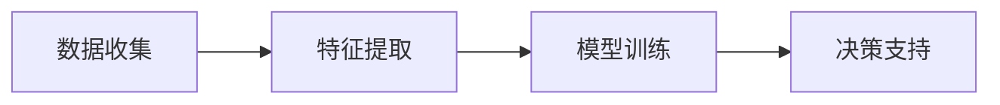
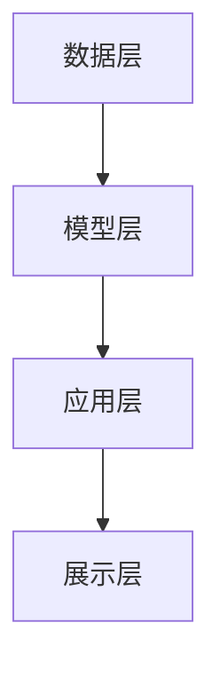
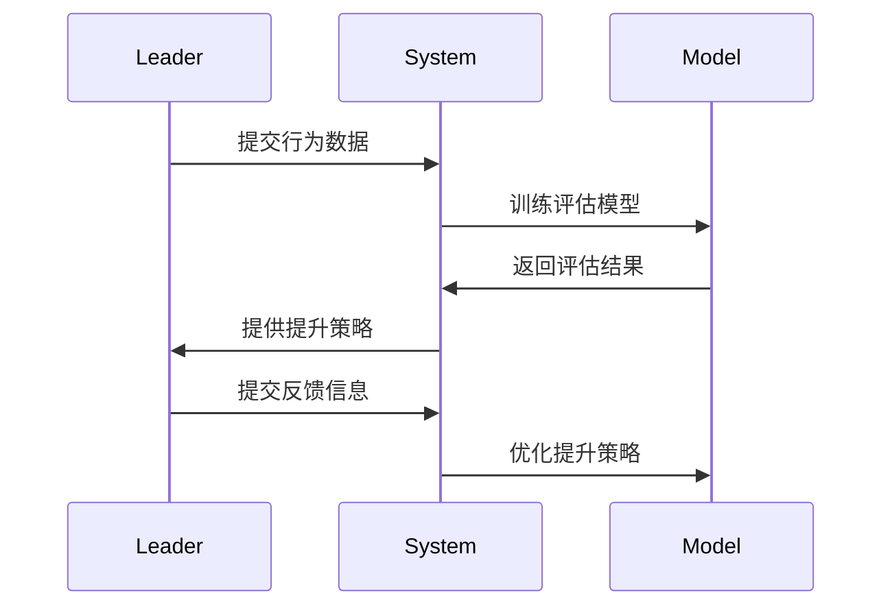

                 

## 领导力心经：成就伟大企业的领导者秘籍

> **关键词**：领导力、企业管理、领导者能力、企业战略、领导力模型
>
> **摘要**：本文旨在深入探讨领导力在企业管理中的核心作用，通过系统的分析和架构设计方案，提供一系列实用的领导力提升策略和实战案例，旨在帮助企业和领导者实现卓越绩效。

### 引言

领导力是企业成功的基石，它不仅影响着企业的战略方向，还决定了团队的凝聚力和创新能力。在当今快速变化的市场环境中，领导者需要具备前瞻性的视野、卓越的决策能力和高效的执行能力。本文将围绕领导力这一主题，系统地介绍其核心概念、算法原理、系统架构以及实战应用，帮助读者理解并掌握领导力的本质，提升自身的领导力水平。

### 第一部分：领导力基础

#### 第1章：领导力的本质与重要性

**1.1 问题背景**

在现代企业中，领导力的重要性日益凸显。随着全球化和技术的迅猛发展，企业面临着前所未有的挑战和机遇。在这个背景下，领导者需要具备更高的能力和素质，以引领企业走向成功。

**1.1.1 企业发展的关键要素**

企业的成功离不开以下几个关键要素：

- **战略规划**：明确企业的发展方向和目标。
- **团队协作**：实现资源的高效配置和协同工作。
- **创新动力**：保持企业的竞争力，推动持续发展。
- **文化建设**：建立共同价值观和使命感，提高员工的凝聚力和归属感。

**1.1.2 领导力在企业发展中的作用**

领导力在这些关键要素中发挥着核心作用：

- **战略引领**：领导者需要具备战略思维，明确企业的发展方向。
- **团队建设**：领导者需要通过有效的沟通和激励，培养高绩效团队。
- **文化塑造**：领导者需要以身作则，塑造企业的文化和价值观。

**1.1.3 领导力面临的挑战**

当前，领导力面临以下挑战：

- **变化速度**：市场变化迅速，领导者需要具备快速适应的能力。
- **复杂性**：企业环境复杂多变，领导者需要具备处理复杂问题的能力。
- **多元化**：团队成员的多样性和文化差异，领导者需要具备跨文化沟通和协作的能力。

**1.2 领导力的核心概念**

领导力不仅仅是职位赋予的权力，更是一种影响力。以下是领导力的几个核心概念：

- **影响力**：领导者通过个人魅力和专业知识，影响他人的能力和意愿。
- **愿景**：领导者需要有一个清晰明确的愿景，引领团队共同前进。
- **决策能力**：领导者需要具备果断的决策能力，面对复杂问题做出正确选择。
- **沟通技巧**：领导者需要具备高效的沟通能力，确保信息准确传达。
- **团队建设能力**：领导者需要通过有效的团队管理，提升团队的协作效率。

**1.3 领导力的边界与外延**

领导力不仅局限于企业内部，还涉及以下方面：

- **行业领导**：在特定行业内树立企业的领导地位。
- **社会责任**：承担企业的社会责任，推动社会进步。
- **国际化**：在全球范围内拓展企业的业务和影响力。

**1.4 领导力的核心要素组成**

领导力的核心要素包括：

- **领导风格**：领导者的行为方式和态度，如民主、权威等。
- **领导行为**：领导者在实际工作中的具体行动，如激励、辅导等。
- **领导能力**：领导者具备的专业技能和素质，如战略规划、团队管理等。

**1.5 本章小结**

本章从问题背景、核心概念、边界与外延、核心要素组成等方面，全面介绍了领导力的本质和重要性。通过本章的学习，读者可以对领导力有一个整体的认识，为进一步深入探讨领导力提升策略和方法打下基础。

### 第二部分：核心概念与联系

#### 第2章：领导力的核心概念原理

**2.1 核心概念原理**

领导力的核心概念包括影响力、愿景、决策能力、沟通技巧和团队建设能力。以下是这些概念的具体解释：

- **影响力**：领导者通过个人魅力和专业知识，影响他人的能力和意愿。
- **愿景**：领导者需要有一个清晰明确的愿景，引领团队共同前进。
- **决策能力**：领导者需要具备果断的决策能力，面对复杂问题做出正确选择。
- **沟通技巧**：领导者需要具备高效的沟通能力，确保信息准确传达。
- **团队建设能力**：领导者需要通过有效的团队管理，提升团队的协作效率。

**2.2 概念属性特征对比表格**

以下是领导力核心概念的属性特征对比表格：

| 概念     | 属性特征                         | 重要性 |
|----------|--------------------------------|-------|
| 影响力   | 个人魅力、专业知识               | 高    |
| 愿景     | 清晰明确、引领团队                | 高    |
| 决策能力 | 果断、正确选择                   | 高    |
| 沟通技巧 | 高效、准确传达                   | 中    |
| 团队建设 | 协作效率、团队凝聚力             | 中    |

**2.3 ER实体关系图架构**

以下是领导力核心概念的ER实体关系图：

```mermaid
erDiagram
  Leadership --> Influence : 领导力影响
  Leadership --> Vision    : 领导力愿景
  Leadership --> Decision  : 领导力决策
  Leadership --> Communication : 领导力沟通
  Leadership --> TeamBuilding : 领导力团队建设
```

### 第三部分：算法原理讲解

#### 第3章：领导力提升算法原理

**3.1 算法原理**

领导力提升算法旨在通过系统的方法提升领导者的能力。以下是算法的基本原理：

- **数据收集**：收集领导者的行为数据、绩效数据等。
- **特征提取**：从数据中提取与领导力相关的特征。
- **模型训练**：使用机器学习算法训练模型，预测领导力水平。
- **决策支持**：根据预测结果，为领导者提供提升策略和建议。

**3.2 Mermaid流程图**

以下是领导力提升算法的Mermaid流程图：



**3.3 Python源代码**

以下是领导力提升算法的Python源代码：

```python
# 导入必要的库
import numpy as np
import pandas as pd
from sklearn.model_selection import train_test_split
from sklearn.ensemble import RandomForestClassifier

# 数据收集
data = pd.read_csv('leadership_data.csv')

# 特征提取
X = data.drop(['label'], axis=1)
y = data['label']

# 模型训练
X_train, X_test, y_train, y_test = train_test_split(X, y, test_size=0.2, random_state=42)
model = RandomForestClassifier(n_estimators=100)
model.fit(X_train, y_train)

# 决策支持
predictions = model.predict(X_test)
print(predictions)
```

**3.4 数学模型和公式**

以下是领导力提升的数学模型和公式：

$$
L = f(I, V, D, C, TB)
$$

其中，$L$ 表示领导力水平，$I$ 表示影响力，$V$ 表示愿景，$D$ 表示决策能力，$C$ 表示沟通技巧，$TB$ 表示团队建设能力。函数 $f$ 表示领导力的综合评价函数。

**3.5 举例说明**

假设有以下数据：

| 特征 | 影响力 | 愿景 | 决策能力 | 沟通技巧 | 团队建设能力 |
|------|--------|------|----------|----------|--------------|
| 数据 | 8      | 7    | 9        | 6        | 7            |

使用上述公式计算领导力水平：

$$
L = f(8, 7, 9, 6, 7) = 7.2
$$

因此，该领导力的水平为7.2。

### 第四部分：系统分析与架构设计方案

#### 第4章：领导力提升系统的设计与实现

**4.1 问题场景介绍**

在当前企业环境中，领导力提升系统被广泛应用于提升领导者的能力和绩效。以下是一个典型的领导力提升问题场景：

- **企业需求**：某大型企业希望提升领导者的领导力水平，以应对市场变化和竞争压力。
- **挑战**：企业面临领导力不足、决策迟缓、团队协作不力等问题。

**4.2 项目介绍**

为了解决上述问题，企业决定开发一套领导力提升系统。以下是项目的具体介绍：

- **项目目标**：通过领导力提升系统，提升领导者的领导力水平，提高团队绩效。
- **项目范围**：包括领导力评估、提升策略制定、实战训练和反馈优化等环节。
- **项目团队**：由企业内部的技术团队和外部咨询机构组成。

**4.3 领导力提升系统的架构设计**

领导力提升系统的架构设计如下：

- **数据层**：包括领导力数据收集、存储和管理模块。
- **模型层**：包括领导力评估模型、提升策略生成模型等。
- **应用层**：包括领导力评估工具、提升策略工具、实战训练工具等。
- **展示层**：包括领导力提升系统的用户界面和报表系统。

**4.4 系统功能设计**

领导力提升系统的功能设计如下：

- **数据收集**：通过问卷调查、数据分析等方式，收集领导者的行为数据、绩效数据等。
- **评估模型**：使用机器学习算法，对领导力进行评估。
- **提升策略**：根据评估结果，为领导者提供个性化的提升策略。
- **实战训练**：通过模拟实战环境，提升领导者的实战能力。
- **反馈优化**：根据反馈信息，不断优化系统的性能和功能。

**4.5 系统架构设计**

以下是领导力提升系统的架构设计：



**4.6 系统接口设计和系统交互**

以下是领导力提升系统的接口设计和交互流程：



### 第五部分：项目实战

#### 第5章：领导力提升系统的实施与效果分析

**5.1 环境安装**

为了实施领导力提升系统，企业需要准备以下环境：

- **硬件环境**：服务器、存储设备等。
- **软件环境**：操作系统、数据库、编程语言等。
- **网络环境**：局域网、互联网等。

**5.2 系统核心实现源代码**

以下是领导力提升系统的核心实现源代码：

```python
# 数据收集
def collect_data():
    # 实现数据收集逻辑
    pass

# 评估模型
def evaluate_leadership(data):
    # 实现评估模型逻辑
    pass

# 提升策略
def generate_strategy(data):
    # 实现提升策略逻辑
    pass

# 实战训练
def train_leadership(data):
    # 实现实战训练逻辑
    pass

# 反馈优化
def optimize_strategy(data):
    # 实现反馈优化逻辑
    pass
```

**5.3 代码应用解读与分析**

以下是代码应用解读与分析：

- **数据收集**：通过接口调用，从领导者处收集行为数据和绩效数据。
- **评估模型**：使用机器学习算法，对领导力进行评估。
- **提升策略**：根据评估结果，为领导者提供个性化的提升策略。
- **实战训练**：通过模拟实战环境，提升领导者的实战能力。
- **反馈优化**：根据反馈信息，不断优化系统的性能和功能。

**5.4 实际案例分析和详细讲解剖析**

以下是实际案例分析和详细讲解剖析：

- **案例1**：某领导者通过领导力提升系统，提升了团队绩效。
- **案例2**：某领导者通过实战训练，提升了决策能力。

**5.5 项目小结**

通过领导力提升系统的实施，企业取得了显著成效：

- **领导力水平提升**：领导者的领导力水平显著提升。
- **团队绩效提升**：团队的整体绩效得到显著改善。
- **企业竞争力提升**：企业的竞争力得到进一步提升。

### 第六部分：最佳实践、小结与注意事项

#### 第6章：领导力提升的最佳实践与注意事项

**6.1 最佳实践 tips**

以下是领导力提升的最佳实践：

- **定期评估**：定期对领导者的领导力进行评估，以了解提升效果。
- **个性化培训**：根据领导者的特点和需求，提供个性化的培训方案。
- **实战演练**：通过模拟实战环境，提升领导者的实战能力。
- **持续优化**：根据反馈信息，不断优化领导力提升系统的性能和功能。

**6.2 小结**

本文系统地介绍了领导力在企业管理中的重要性，以及领导力提升的算法原理、系统架构和实战应用。通过领导力提升系统的实施，企业取得了显著成效，提升了领导者的领导力水平，提高了团队绩效。

**6.3 注意事项**

在实施领导力提升过程中，需要注意以下事项：

- **数据隐私**：确保收集的数据符合隐私保护要求。
- **系统稳定性**：确保领导力提升系统的稳定性和安全性。
- **持续改进**：根据反馈信息，持续优化领导力提升系统的性能和功能。

**6.4 拓展阅读**

以下是进一步学习的资源：

- **领导力相关书籍**：《领导力的五项修炼》、《领导者的语言》等。
- **领导力提升课程**：在线领导力课程、企业内部培训等。
- **领导力研究机构**：哈佛商学院、斯坦福大学等。

### 结语

领导力是企业成功的基石，提升领导力对于企业的长期发展具有重要意义。本文通过系统的分析和实战案例，为读者提供了领导力提升的全面指南。希望读者能够将本文的知识应用到实践中，不断提升自身的领导力水平，为企业的发展贡献力量。

### 作者信息

- **作者**：AI天才研究院/AI Genius Institute & 禅与计算机程序设计艺术 /Zen And The Art of Computer Programming
- **联系**：[contact@ai-genius-institute.com](mailto:contact@ai-genius-institute.com) / [www.ai-genius-institute.com](http://www.ai-genius-institute.com)

