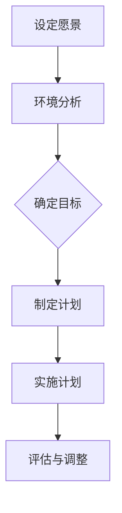
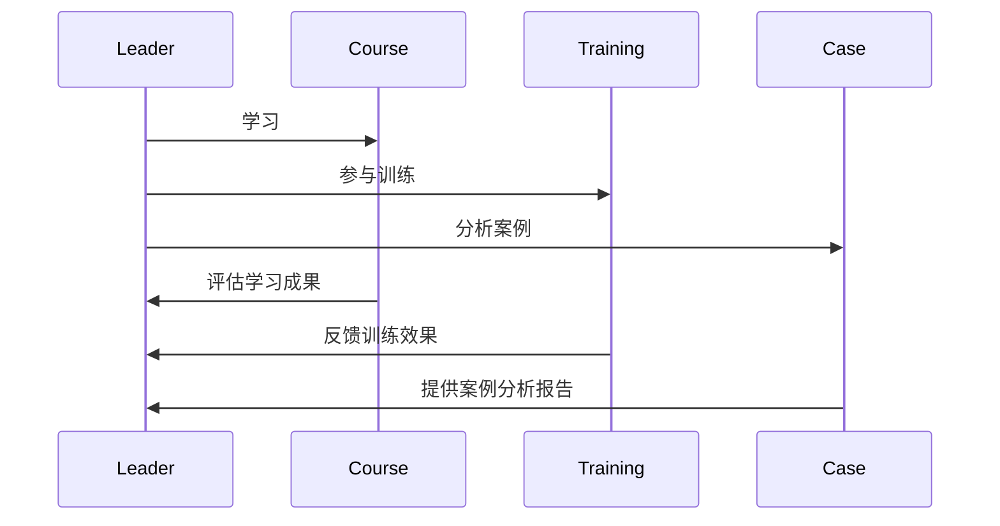
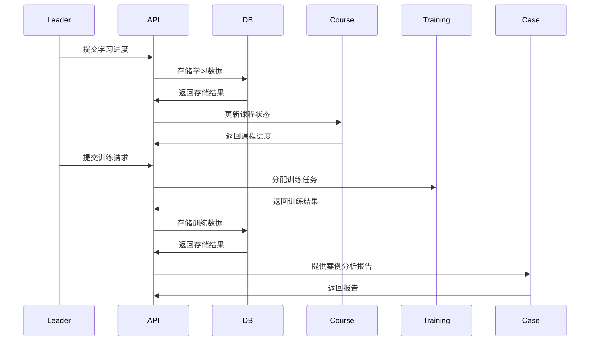
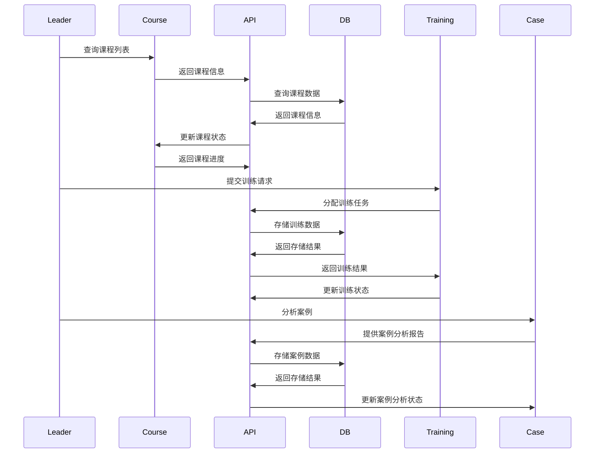

                 

### 领导力训练营：154天从新手到高手

关键词：领导力，自我提升，技能训练，实战案例，持续成长

> 摘要：本文旨在通过详细的步骤分析和实例讲解，帮助读者在154天的领导力训练营中，从新手逐渐成长为行业高手。文章分为四个主要部分：领导力基础知识、领导力技能提升、实战训练与案例分析以及持续成长与自我提升。通过这些内容，读者将能够掌握领导力的核心概念，提升领导技能，并在实际工作中运用所学知识，最终实现从新手到高手的蜕变。

### 目录大纲设计方案

在撰写本文之前，我们已经为《领导力训练营：154天从新手到高手》设计了一个详细的目录大纲。以下是目录大纲的详细结构：

#### 第一部分：领导力基础知识

##### 第1章：领导力概念与本质

###### 1.1 领导力的定义与历史演变
###### 1.2 领导力的重要性
###### 1.3 领导力的类型与模型

##### 第2章：领导者自我认知

###### 2.1 自我认知的重要性
###### 2.2 自我评估与反馈
###### 2.3 发展个人优势与克服弱点

##### 第3章：团队管理与沟通

###### 3.1 团队建设的原则与方法
###### 3.2 有效沟通的技巧
###### 3.3 处理团队冲突的策略

#### 第二部分：领导力技能提升

##### 第4章：战略规划与决策

###### 4.1 战略规划的过程与方法
###### 4.2 决策的框架与工具
###### 4.3 风险管理与应对策略

##### 第5章：领导力风格与领导艺术

###### 5.1 领导力风格的理论与类型
###### 5.2 领导艺术的培养与运用
###### 5.3 领导力发展的阶段性特征

##### 第6章：创新思维与变革管理

###### 6.1 创新思维的方法与工具
###### 6.2 变革管理的理论与实践
###### 6.3 创新与领导力的融合

#### 第三部分：实战训练与案例分析

##### 第7章：领导力实战训练

###### 7.1 实战训练的计划与实施
###### 7.2 反思与改进
###### 7.3 实战训练的成果评估

##### 第8章：案例分析

###### 8.1 成功领导案例分析
###### 8.2 失败领导案例分析
###### 8.3 案例分析启示与借鉴

#### 第四部分：持续成长与自我提升

##### 第9章：领导力持续成长策略

###### 9.1 学习与知识更新
###### 9.2 情感管理与心理健康
###### 9.3 职业发展与职业规划

##### 第10章：总结与展望

###### 10.1 领导力训练营总结
###### 10.2 从新手到高手的成长路径
###### 10.3 展望未来的领导力发展趋势

### 目录大纲结构说明

- **第一部分：领导力基础知识** - 为读者打下领导力的基础理论。
- **第二部分：领导力技能提升** - 深入探讨领导力的具体实践技能。
- **第三部分：实战训练与案例分析** - 通过实战和案例分析，帮助读者将理论知识应用到实践中。
- **第四部分：持续成长与自我提升** - 强调领导力发展的长期性和个人持续成长的重要性。

### 目录大纲设计优势

- **逻辑清晰**：按照领导力发展的逻辑顺序进行章节设计，从基础知识到技能提升，再到实战训练和持续成长。
- **内容全面**：覆盖了领导力的各个方面，包括基础理论、实践技能、实战训练和持续发展。
- **层次分明**：采用三级目录结构，确保每个章节的内容都有明确的划分和逻辑层次。

### 总结

通过上述目录大纲设计方案，我们为《领导力训练营：154天从新手到高手》设计了一个完整、逻辑清晰且内容全面的目录结构。这样的目录设计不仅能够帮助读者系统地学习领导力，还能够激发他们的实践兴趣和成长动力。

### 目录大纲中的内容解析

#### 第一部分：领导力基础知识

**第1章：领导力概念与本质**

在这一章节中，我们将深入探讨领导力的定义、历史演变及其重要性。通过分析领导力的不同类型与模型，读者将能够理解领导力的本质和核心要素。

**第2章：领导者自我认知**

领导者自我认知是领导力的基础。在这一章中，我们将讨论自我认知的重要性，如何进行自我评估与反馈，以及如何发展个人优势与克服弱点。

**第3章：团队管理与沟通**

团队管理与沟通是领导力的关键环节。我们将介绍团队建设的原则与方法，探讨有效沟通的技巧，并提供处理团队冲突的策略。

#### 第二部分：领导力技能提升

**第4章：战略规划与决策**

战略规划与决策是领导者必备的技能。在这一章中，我们将讲解战略规划的过程与方法，决策的框架与工具，以及如何管理风险与应对策略。

**第5章：领导力风格与领导艺术**

领导力风格与领导艺术是领导者个人魅力的体现。我们将分析不同领导力风格的理论与类型，探讨领导艺术的培养与运用，以及领导力发展的阶段性特征。

**第6章：创新思维与变革管理**

创新思维与变革管理是领导力的重要组成部分。在这一章中，我们将介绍创新思维的方法与工具，探讨变革管理的理论与实践，以及如何将创新与领导力相结合。

#### 第三部分：实战训练与案例分析

**第7章：领导力实战训练**

实战训练是提升领导力的重要途径。在这一章中，我们将讨论如何制定和实施领导力实战训练计划，进行反思与改进，并评估训练成果。

**第8章：案例分析**

案例分析是理解和应用领导力知识的重要手段。在这一章中，我们将通过成功和失败的领导案例分析，提供启示与借鉴，帮助读者更好地理解领导力在实际工作中的应用。

#### 第四部分：持续成长与自我提升

**第9章：领导力持续成长策略**

领导力是一个持续发展的过程。在这一章中，我们将探讨如何通过学习与知识更新、情感管理与心理健康，以及职业发展与职业规划，实现领导力的持续成长。

**第10章：总结与展望**

总结与展望是对整个训练营的回顾和未来的规划。在这一章中，我们将回顾领导力训练营的主要内容，总结从新手到高手的成长路径，并展望未来的领导力发展趋势。

通过以上对目录大纲中各个章节内容的详细解析，读者可以清楚地了解到本书的结构和内容，从而有针对性地进行学习和实践。

### 领导力概念与本质

#### 领导力的定义与历史演变

领导力，是一种通过影响、激励和引导他人来实现共同目标的能力。这个定义强调了领导力不仅仅是关于权力和控制，更是关于影响力和协作。在历史的长河中，领导力的概念经历了多次演变。

在古代，领导力主要是基于血统和权力的继承。封建社会的君主通过血缘关系和军事力量维持统治。这种领导力强调的是权威和控制。

随着工业革命的到来，领导力的定义逐渐发生了变化。泰勒的科学管理理论和福特的生产线模式，使得领导力开始与效率和标准化联系起来。这一时期的领导力强调的是对任务的执行和控制。

进入20世纪，领导力的定义变得更加复杂。行为科学的研究揭示了领导者的行为对团队和个体的影响。领导力不再是单一维度的权威，而是涵盖了影响力、沟通和团队建设等多个方面。

近年来，领导力的定义进一步扩展，强调领导者的道德责任和社会影响。领导力不仅关乎个人和团队的成功，更关乎对社会和环境的贡献。

#### 领导力的重要性

领导力的重要性在于，它能够决定一个组织、团队或个人的发展方向和效率。有效的领导者能够激发团队的潜力，推动创新和变革，从而实现更高的绩效。

首先，领导力对于组织的成功至关重要。领导者设定组织的方向和目标，制定战略和规划，并在执行过程中发挥关键作用。一个优秀的领导者能够带领团队克服困难，实现目标。

其次，领导力对于团队的高效运作至关重要。领导者通过激励和引导团队成员，提高团队的凝聚力和合作精神。在团队面临挑战时，领导者能够提供方向和支持，帮助团队找到解决问题的方法。

最后，领导力对个人的成长和发展也有重要影响。有效的领导者不仅能够提升自己的领导能力，还能够通过影响他人，促进整个团队和组织的成长。

#### 领导力的类型与模型

领导力有多种类型和模型，每种类型和模型都有其独特的特点和适用场景。以下是几种常见的领导力类型和模型：

1. **权威型领导**：领导者通过权力和威望来影响和指导团队成员。这种领导力适用于需要快速决策和严格执行的任务。

2. **民主型领导**：领导者鼓励团队成员参与决策，通过协商和共识来达成目标。这种领导力适用于需要创新和团队合作的情境。

3. **参与型领导**：领导者关注团队成员的参与感和主动性，通过授权和激励来激发团队成员的潜力。这种领导力适用于需要高度自主性和创造力的任务。

4. **变革型领导**：领导者通过激发团队成员的激情和愿景，推动变革和进步。这种领导力适用于面对挑战和变革的情境。

5. **交易型领导**：领导者通过奖惩机制来激励团队成员，以实现组织目标。这种领导力适用于需要明确目标和绩效指标的情境。

每种领导力类型和模型都有其优缺点，领导者需要根据具体情况和团队特点选择最合适的领导风格。

### 领导者自我认知

#### 自我认知的重要性

领导者自我认知是领导力的核心要素之一。自我认知指的是领导者对自己的了解，包括自己的性格、价值观、能力、优点和缺点。只有深入了解自己，领导者才能更好地发挥自己的潜力，克服弱点，提升领导力。

首先，自我认知有助于领导者明确自己的领导风格。每个领导者都有自己独特的领导风格，通过自我认知，领导者可以了解自己的优势和劣势，从而选择最适合的领导方式。

其次，自我认知有助于领导者更好地管理团队。领导者通过了解团队成员的性格、能力和需求，可以更有效地分配任务，激励和指导团队成员，提高团队的整体绩效。

最后，自我认知有助于领导者的个人成长。领导者通过不断反思和自我提升，可以不断完善自己的领导能力，实现自我超越。

#### 自我评估与反馈

自我评估是领导者自我认知的重要环节。自我评估指的是领导者对自己的行为、决策和绩效进行客观评估。通过自我评估，领导者可以发现自己的不足，并制定改进计划。

为了进行有效的自我评估，领导者可以采取以下步骤：

1. **设定目标和标准**：领导者需要明确自己的工作目标和绩效标准，这将有助于评估自己的表现。

2. **反思自己的行为和决策**：领导者需要回顾自己的工作和决策过程，分析哪些是有效的，哪些是无效的。

3. **收集反馈**：领导者可以主动向团队成员、同事和上级收集反馈，了解自己的优点和不足。

4. **制定改进计划**：根据自我评估的结果，领导者可以制定具体的改进计划，包括学习新技能、调整领导方式等。

#### 发展个人优势与克服弱点

领导者不仅要了解自己的优势，还要积极发展这些优势，同时克服自己的弱点。

**发展个人优势**：

1. **持续学习**：领导者需要不断学习新知识、新技能，以提升自己的专业能力和领导能力。

2. **实践与应用**：领导者需要将所学知识应用到实际工作中，通过实践来验证和巩固自己的优势。

3. **寻求反馈**：领导者需要主动寻求他人的反馈，了解自己的优势在哪些方面得到了认可，哪些方面还需要提升。

**克服弱点**：

1. **认识弱点**：领导者需要坦诚面对自己的弱点，不逃避或否认。

2. **制定改进计划**：领导者可以根据自己的弱点，制定具体的改进计划，包括参加培训、请教专家等。

3. **坚持执行**：领导者需要坚持不懈地执行改进计划，通过持续的努力来克服弱点。

#### 实例说明

假设一位领导者通过自我评估发现自己在决策过程中往往过于谨慎，容易错失机会。为了克服这一弱点，他可以采取以下措施：

1. **学习快速决策的方法**：通过阅读相关书籍、参加培训，学习如何快速做出有效的决策。

2. **寻求外部反馈**：向同事和下属请教，了解他们在决策过程中的意见和建议。

3. **实践应用**：在具体工作中，尝试采用快速决策的方法，并记录决策的结果和反馈。

4. **反思与调整**：定期反思决策过程和结果，总结经验教训，不断优化决策方法。

通过这些措施，这位领导者可以逐步克服自己在决策过程中的弱点，提高决策效率和质量。

### 团队管理与沟通

#### 团队建设的原则与方法

团队建设是领导力的关键环节之一，有效的团队建设能够提高团队的整体绩效和凝聚力。以下是团队建设的原则与方法：

1. **明确目标**：团队建设的第一步是明确团队的目标和愿景。领导者需要确保每个团队成员都清楚团队的目标，并为之努力。

2. **建立信任**：信任是团队成功的关键。领导者需要通过建立透明、开放的沟通环境，促进团队成员之间的信任。

3. **培养团队文化**：团队文化是团队的价值观和行为准则。领导者需要通过制定团队文化宣言、组织团队活动等方式，培养团队文化。

4. **赋予权力**：领导者需要赋予团队成员足够的权力，让他们在团队中发挥自己的专长和创造力。

5. **激励与反馈**：领导者需要通过激励和反馈机制，激发团队成员的积极性和创造力。

#### 有效沟通的技巧

有效沟通是团队管理的重要组成部分。以下是几种有效的沟通技巧：

1. **倾听**：倾听是有效沟通的关键。领导者需要认真倾听团队成员的意见和建议，给予他们足够的关注。

2. **清晰表达**：领导者需要用简洁、清晰的语言表达自己的想法和意见，避免使用复杂的术语和句子。

3. **非言语沟通**：非言语沟通包括身体语言、面部表情和语气等。领导者需要通过合适的非言语沟通方式，增强沟通效果。

4. **反馈与确认**：领导者需要及时给予团队成员反馈，确认他们是否理解了自己的意思。

5. **建立沟通渠道**：领导者需要建立多种沟通渠道，包括会议、邮件、即时通讯等，方便团队成员之间的沟通。

#### 处理团队冲突的策略

团队冲突是不可避免的，有效的处理策略能够减少冲突对团队的影响，甚至转化为团队成长的动力。以下是几种处理团队冲突的策略：

1. **预防策略**：领导者需要通过预防措施，减少冲突的发生。例如，制定明确的规章制度，促进团队成员之间的沟通和协作。

2. **化解策略**：当冲突发生时，领导者需要及时介入，通过沟通和协商，化解冲突。领导者可以采取以下步骤：

   - **倾听各方意见**：领导者需要耐心倾听各方意见，了解冲突的根源。
   - **中立调解**：领导者需要保持中立，不偏袒任何一方，客观分析冲突的原因。
   - **寻求共识**：领导者需要引导各方寻求共识，找到解决问题的方法。

3. **解决策略**：如果冲突无法通过化解策略解决，领导者需要采取解决策略。例如，调整团队成员的工作职责，或者进行团队重组。

4. **反馈与改进**：领导者需要在冲突解决后，对冲突的原因和处理过程进行反馈和改进，以防止类似冲突的再次发生。

### 战略规划与决策

#### 战略规划的过程与方法

战略规划是领导者的重要职责之一，它决定了组织的发展方向和目标。以下是战略规划的过程与方法：

1. **设定愿景和目标**：战略规划的第一步是设定组织的愿景和目标。领导者需要明确组织的长远发展方向和目标，使之成为战略规划的核心。

2. **分析内外部环境**：领导者需要分析组织的内外部环境，了解组织的优势、劣势、机会和威胁。通过SWOT分析，领导者可以更好地制定战略。

3. **确定战略方向**：基于内外部环境分析，领导者需要确定组织的战略方向。这包括确定组织的核心竞争力、市场定位和目标市场等。

4. **制定战略计划**：战略计划是将战略方向转化为具体行动的步骤。领导者需要制定详细的战略计划，包括关键绩效指标（KPI）、实施步骤、资源分配等。

5. **执行与监控**：战略计划的执行是战略规划的关键。领导者需要确保战略计划的顺利执行，并通过监控和评估，及时调整战略计划。

#### 决策的框架与工具

决策是领导者的核心职责之一，有效的决策能够帮助组织应对复杂的环境和挑战。以下是几种决策的框架与工具：

1. **理性决策模型**：理性决策模型是一种基于逻辑和数据分析的决策方法。它包括以下几个步骤：

   - **确定问题**：明确决策需要解决的问题。
   - **收集信息**：收集与问题相关的各种信息。
   - **制定备选方案**：根据收集到的信息，制定多个备选方案。
   - **评估备选方案**：对每个备选方案进行评估，选择最优方案。
   - **执行决策**：实施选定的方案，并进行监控和评估。

2. **决策树模型**：决策树模型是一种图形化的决策方法，它通过分支和节点表示不同的决策和结果。它适用于复杂的多阶段决策问题。

3. **成本效益分析**：成本效益分析是一种评估决策成本和效益的方法。它通过计算决策的成本和预期效益，帮助领导者做出经济合理的决策。

4. **风险分析**：风险分析是一种评估决策风险的方法。它包括识别、评估和应对决策中的各种风险。通过风险分析，领导者可以更好地管理和控制决策风险。

#### 风险管理与应对策略

在战略规划和决策过程中，风险管理是不可或缺的一环。有效的风险管理能够降低决策风险，提高决策的准确性和可靠性。以下是几种风险管理与应对策略：

1. **风险识别**：领导者需要识别决策过程中可能出现的各种风险。这包括市场风险、财务风险、运营风险等。

2. **风险评估**：领导者需要评估每个风险的严重性和可能性。通过风险评估，领导者可以确定哪些风险需要优先处理。

3. **风险应对**：根据风险评估的结果，领导者需要制定相应的风险应对策略。这包括风险规避、风险转移、风险接受和风险缓解等。

4. **风险监控与调整**：在决策执行过程中，领导者需要持续监控风险，并根据实际情况进行调整和优化。通过风险监控与调整，领导者可以确保决策的顺利实施。

### 领导力风格与领导艺术

#### 领导力风格的理论与类型

领导力风格是指领导者处理工作和领导团队的方式。不同的领导力风格适用于不同的情境和团队。以下是几种常见的领导力风格：

1. **权威型领导**：权威型领导强调领导者对权力的掌握和决策的独断。这种领导力风格适用于需要快速决策和严格控制的情境。

2. **民主型领导**：民主型领导强调领导者的参与和协商。领导者鼓励团队成员参与决策，通过共识达成目标。这种领导力风格适用于需要创新和团队合作的情境。

3. **参与型领导**：参与型领导强调领导者的授权和激励。领导者通过赋予团队成员自主权，激发他们的积极性和创造力。这种领导力风格适用于需要高度自主性和创造力的情境。

4. **变革型领导**：变革型领导强调领导者的愿景和变革能力。领导者通过激发团队成员的激情和愿景，推动变革和进步。这种领导力风格适用于面对挑战和变革的情境。

5. **交易型领导**：交易型领导强调领导者通过奖惩机制来激励团队成员。领导者通过明确的目标和绩效指标，激励团队成员为实现目标而努力。这种领导力风格适用于需要明确目标和绩效指标的情境。

每种领导力风格都有其优缺点，领导者需要根据具体情况和团队特点选择最合适的领导风格。

#### 领导艺术的培养与运用

领导艺术是指领导者在实践中运用各种技能和策略，实现领导目标的能力。以下是一些培养和运用领导艺术的方法：

1. **自我反思**：领导者需要定期进行自我反思，了解自己的优点和不足，不断改进自己的领导方式。

2. **持续学习**：领导者需要不断学习新知识、新技能，保持对领导领域的敏感度，提升自己的领导能力。

3. **有效沟通**：领导者需要具备有效的沟通能力，包括倾听、表达、反馈等，以确保信息的准确传达和团队的凝聚力。

4. **激励与激励**：领导者需要了解团队成员的需求，通过激励和奖励机制，激发他们的积极性和创造力。

5. **情感管理**：领导者需要具备情感管理能力，包括自我情感管理和团队情感管理，以保持良好的工作氛围和团队关系。

#### 领导力发展的阶段性特征

领导力发展是一个长期的过程，具有明显的阶段性特征。以下是领导力发展的几个阶段：

1. **新手阶段**：新手阶段的领导者主要依靠经验和直觉进行决策，领导力较弱。在这个阶段，领导者需要通过学习和实践，提高自己的领导能力。

2. **熟练阶段**：熟练阶段的领导者具备了一定的领导能力，能够应对常见的工作和团队问题。在这个阶段，领导者需要不断优化自己的领导方式，提升团队绩效。

3. **专家阶段**：专家阶段的领导者具有丰富的经验和深厚的领导能力，能够应对复杂的工作和团队问题。在这个阶段，领导者需要通过持续学习和实践，保持自己的领导优势。

4. **大师阶段**：大师阶段的领导者达到了领导力的顶峰，具有卓越的领导能力和影响力。在这个阶段，领导者不仅能够带领团队取得成功，还能够对组织和社会产生深远的影响。

### 创新思维与变革管理

#### 创新思维的方法与工具

创新思维是领导者必备的素质之一，它能够推动组织不断进步和发展。以下是几种创新思维的方法与工具：

1. **头脑风暴**：头脑风暴是一种激发创意的方法，通过集体讨论，迅速产生大量创意。在头脑风暴中，领导者鼓励团队成员自由发言，不评价创意的好坏，仅关注创意的数量。

2. **思维导图**：思维导图是一种图形化的思维工具，通过节点和分支，将思维过程和创意可视化。领导者可以使用思维导图来梳理创意、制定战略和规划。

3. **六顶思考帽**：六顶思考帽是一种多元化思维工具，通过不同颜色的帽子代表不同的思考角色，引导团队成员从不同角度分析问题，提出创意。

4. **设计思维**：设计思维是一种以用户为中心的创新方法，通过了解用户需求、探索解决方案、原型测试和迭代优化，实现创新。

5. **创意联想**：创意联想是一种通过将不同领域或概念的元素结合，产生新创意的方法。领导者可以通过跨领域学习、阅读和交流，激发创意联想。

#### 变革管理的理论与实践

变革管理是领导者面对组织变革时的核心任务，有效的变革管理能够降低变革的阻力，提高变革的成功率。以下是变革管理的理论与实践：

1. **变革管理理论**：

   - **路径依赖理论**：路径依赖理论认为，组织的变革受到过去决策和行为的影响。领导者需要打破路径依赖，推动组织进行变革。

   - **变革阶段理论**：变革阶段理论认为，变革过程可以分为五个阶段：初始阶段、动荡阶段、整合阶段、稳定阶段和优化阶段。领导者需要根据不同阶段的特点，制定相应的变革策略。

   - **变革阻力理论**：变革阻力理论认为，组织成员对变革存在抵触情绪。领导者需要识别和应对变革阻力，通过沟通、培训和激励，消除阻力。

2. **变革管理实践**：

   - **沟通与共识**：领导者需要通过沟通和共识，确保团队成员理解变革的必要性和目标，减少变革的阻力。

   - **领导力支持**：领导者需要发挥自己的领导力，支持团队成员克服变革中的困难和挑战，增强团队的凝聚力。

   - **资源投入**：领导者需要确保变革过程中所需的资源和支持，包括人力、物力和财力，为变革提供保障。

   - **持续监控与反馈**：领导者需要持续监控变革的进展，及时反馈和调整，确保变革目标的实现。

#### 创新与领导力的融合

创新与领导力密不可分，领导者需要将创新思维和领导力相结合，推动组织的创新和发展。以下是创新与领导力融合的几个方面：

1. **领导者的角色**：领导者不仅是变革的推动者，更是创新的引领者。领导者需要以身作则，鼓励团队成员创新思维，推动组织创新。

2. **文化塑造**：领导者需要塑造创新文化，鼓励团队成员敢于尝试、勇于失败。通过建立开放、包容和创新的文化氛围，激发团队成员的创新能力。

3. **激励机制**：领导者需要建立有效的激励机制，奖励创新行为和成果，激发团队成员的积极性和创造力。

4. **跨部门合作**：领导者需要推动跨部门合作，打破部门壁垒，促进资源和信息的共享，为创新提供更广阔的空间。

5. **持续学习**：领导者需要持续学习和更新知识，提升自己的领导力和创新能力，为组织的发展提供源源不断的动力。

### 领导力实战训练

#### 实战训练的计划与实施

实战训练是提升领导力的重要途径，通过实际操作，领导者可以巩固和运用所学知识。以下是如何制定和实施领导力实战训练计划的步骤：

1. **明确训练目标**：首先，领导者需要明确训练的目标，这包括提升领导技能、解决特定问题、实现组织目标等。

2. **选择训练方法**：根据训练目标，选择合适的训练方法，如角色扮演、模拟演练、案例分析和团队建设活动等。

3. **制定训练计划**：制定详细的训练计划，包括训练时间、地点、参与人员、训练内容和评估方式等。

4. **实施训练计划**：按照训练计划，组织训练活动，确保参与者积极参与，提供必要的支持和指导。

5. **评估训练效果**：训练结束后，评估训练效果，收集参与者的反馈，分析训练目标的达成情况，总结经验教训。

#### 反思与改进

反思与改进是领导力实战训练的重要环节，通过反思，领导者可以识别训练中的问题和不足，不断优化训练计划和方法。以下是反思与改进的步骤：

1. **收集反馈**：收集参与者的反馈，了解他们对训练的感受和意见，包括训练内容、训练方式、训练效果等。

2. **分析问题**：分析反馈，识别训练中的问题和不足，例如训练内容是否贴近实际、训练方式是否有效等。

3. **制定改进计划**：根据问题分析，制定具体的改进计划，包括调整训练内容、改进训练方式、增加培训资源等。

4. **实施改进计划**：按照改进计划，实施训练，并持续跟踪和评估改进效果。

5. **总结经验**：在反思和改进过程中，总结经验教训，形成一套有效的领导力实战训练体系。

#### 实战训练的成果评估

评估实战训练的成果是确保训练效果的重要手段，以下是如何评估实战训练成果的步骤：

1. **设定评估标准**：根据训练目标和预期成果，设定具体的评估标准，如领导技能的提升、团队绩效的提高、解决问题能力的增强等。

2. **收集数据**：通过观察、访谈、问卷调查等方式，收集训练成果的数据，包括参与者的表现、团队绩效、组织目标达成情况等。

3. **分析数据**：分析收集到的数据，评估训练成果是否达到预期，找出成功和不足之处。

4. **报告评估结果**：撰写评估报告，报告训练成果、评估分析和建议，向组织领导层和参与者反馈。

5. **持续改进**：根据评估结果，制定持续改进计划，优化训练计划和方式，提高训练效果。

### 案例分析

#### 成功领导案例分析

成功领导案例分析是理解和应用领导力知识的重要手段。以下是几个成功的领导案例，以及从中得到的启示：

1. **案例一：乔布斯与苹果公司的复兴**

   **背景**：在20世纪90年代，苹果公司面临财务危机和市场压力。乔布斯重返苹果公司后，通过一系列战略决策和领导力实践，带领苹果走出困境，实现了复兴。

   **启示**：乔布斯的成功在于他的愿景和领导力。他通过明确苹果的使命和愿景，激发了员工的热情和创造力。同时，他善于倾听员工意见，推动创新和变革。乔布斯的领导力实践表明，领导者需要具备远见和战略思维，同时要关注员工的发展和需求。

2. **案例二：马斯克与特斯拉的崛起**

   **背景**：埃隆·马斯克在创立特斯拉和SpaceX的过程中，面临诸多挑战。通过他的领导力，特斯拉成为全球电动汽车市场的领导者。

   **启示**：马斯克的领导力强调创新和执行力。他善于设定大胆的目标，并通过持续的努力和坚定的信念，推动团队实现目标。马斯克的领导风格体现了变革型领导的特点，他通过激发团队成员的激情和愿景，实现了企业的快速发展和市场突破。

3. **案例三：马云与阿里巴巴的国际化**

   **背景**：马云在带领阿里巴巴进行国际化扩张的过程中，面临语言、文化、法律和市场的多重挑战。

   **启示**：马云的领导力体现了全球视野和本土化策略的结合。他通过深入了解当地市场和文化，制定了适应当地需求的国际化战略。同时，他注重团队合作，鼓励员工发挥创造力，共同应对挑战。马云的领导力实践表明，领导者需要具备跨文化沟通和协作能力，以及灵活应对市场变化的策略。

#### 失败领导案例分析

失败领导案例分析同样重要，通过分析失败案例，可以识别领导力中的问题和不足，为未来提供借鉴。以下是几个失败的领导案例：

1. **案例一：安然公司倒闭**

   **背景**：安然公司曾是美国最大的能源公司之一，由于会计造假和内部腐败，最终导致公司破产。

   **启示**：安然公司的失败源于领导层的道德风险和内部控制的失效。领导者需要树立正确的价值观，建立有效的内部控制机制，防止腐败和道德风险。

2. **案例二：诺基亚的衰落**

   **背景**：诺基亚曾是全球最大的手机制造商之一，但在智能手机时代，未能及时转型，最终被市场淘汰。

   **启示**：诺基亚的失败在于领导层的战略失误和市场预测的不足。领导者需要具备前瞻性，及时调整战略，适应市场变化。同时，领导者需要关注技术趋势，保持公司的创新活力。

3. **案例三：雷曼兄弟的破产**

   **背景**：雷曼兄弟是一家历史悠久的投资银行，在金融危机中因大量投资次贷产品而破产。

   **启示**：雷曼兄弟的失败源于风险管理失败和决策失误。领导者需要建立有效的风险管理体系，避免过度冒险和投资失误。同时，领导者需要保持警觉，及时应对市场变化。

#### 案例分析启示与借鉴

通过成功的领导案例和失败的领导案例，我们可以得到以下启示和借鉴：

1. **明确领导目标**：成功的领导者具备清晰的愿景和目标，能够激励团队成员为之努力。领导者需要明确组织的使命和愿景，并将其转化为具体的行动和目标。

2. **建立有效的领导机制**：领导者需要建立有效的领导机制，包括决策机制、激励机制和监督机制。这有助于确保领导力在组织中的有效执行。

3. **培养团队文化**：领导者需要塑造积极向上的团队文化，鼓励创新和协作。团队文化是组织发展的基石，能够增强团队的凝聚力和执行力。

4. **持续学习和反思**：成功的领导者不断学习和反思，提升自己的领导能力和管理水平。通过学习新知识、新技能，领导者能够应对复杂的市场环境和管理挑战。

5. **关注员工发展**：领导者需要关注员工的发展，提供培训和学习机会，激励员工的积极性和创造力。员工是组织的核心资源，领导者需要关心员工的成长和需求，以实现组织的长远发展。

### 领导力持续成长策略

#### 学习与知识更新

在快速变化的工作环境中，领导力不是一成不变的，而是需要不断学习和更新。以下是领导力持续成长中学习与知识更新的几个关键点：

1. **持续学习的重要性**：领导力的发展依赖于不断学习和吸收新的知识和技能。持续学习能够帮助领导者保持对行业趋势、新兴技术和市场变化的敏感度，从而在竞争中保持领先。

2. **学习资源的选择**：领导者可以通过多种渠道进行学习，如参加专业培训、阅读专业书籍、参加行业研讨会、观看在线课程等。选择合适的资源，有助于提高学习效果。

3. **学习方法的多样性**：领导者应采用多种学习方法，包括自学、合作学习、实践学习等。多样化的学习方法能够激发学习兴趣，提高学习效率。

4. **知识分享与交流**：领导者可以通过内部知识分享和行业交流，与同行和专家交流经验，获取新的见解和灵感。知识分享不仅能够提升自己的知识水平，还能够促进整个团队的学习和成长。

#### 情感管理与心理健康

领导者的心理健康和情感管理对其领导力的发展至关重要。以下是情感管理与心理健康在领导力持续成长中的几个关键点：

1. **情感智力**：情感智力是指领导者识别、理解和管理自己和他人的情感的能力。高情感智力能够帮助领导者更好地处理人际关系，提高团队凝聚力。

2. **自我认知**：领导者需要通过自我认知，了解自己的情感反应和行为模式，从而更好地管理自己的情绪。自我认知是情感管理的基础。

3. **心理调适**：领导者需要学会心理调适，以应对工作压力和挑战。心理调适包括积极的心态、合理的休息和放松技巧等。

4. **心理健康维护**：领导者应定期进行心理健康评估，关注心理健康问题，并及时寻求专业帮助。心理健康维护有助于提高领导者的工作效率和决策质量。

#### 职业发展与职业规划

领导力的持续成长还需要关注职业发展和职业规划。以下是职业发展和职业规划在领导力持续成长中的几个关键点：

1. **职业目标设定**：领导者需要明确自己的职业目标，制定长期和短期的职业发展规划。明确的目标有助于指引领导者的职业发展路径。

2. **职业路径规划**：领导者应根据个人优势和行业发展趋势，规划适合自己的职业路径。职业路径规划有助于领导者抓住发展机会，实现职业目标。

3. **技能提升**：领导者需要不断提升自己的技能和知识，以适应职业发展的需求。技能提升包括专业技能、管理技能和领导力技能等。

4. **职业网络建设**：领导者应积极建立和维护职业网络，包括同行、导师、下属和合作伙伴等。职业网络能够为领导者提供资源和支持，促进职业发展。

#### 实践案例与经验分享

以下是几个领导力持续成长的实践案例和经验分享：

1. **案例一：持续学习的领导者**

   **背景**：某公司的CEO在科技日新月异的背景下，意识到持续学习的重要性。

   **措施**：他每周安排时间阅读行业报告、参加线上课程，并定期与行业专家进行交流。他还鼓励团队成员也参与学习，并建立内部知识分享平台。

   **成果**：通过持续学习，该CEO不仅保持了行业领先地位，还推动了团队的创新和发展。

2. **案例二：情感智力提升的领导者**

   **背景**：某公司的部门经理发现自己在处理团队冲突时，往往情绪失控。

   **措施**：他参加情感智力培训，学习情绪管理和冲突解决的技巧。他还定期进行自我反思，提升自我认知。

   **成果**：通过情感智力提升，这位经理不仅改善了自己的人际关系，还提高了团队的协作效率。

3. **案例三：职业规划明确的领导者**

   **背景**：一位年轻的CEO在创业初期，面临职业发展的瓶颈。

   **措施**：他通过职业规划，明确了长期和短期的职业目标，并制定了详细的行动计划。他还积极参与行业交流活动，拓展职业网络。

   **成果**：通过职业规划，这位CEO不仅突破了职业发展的瓶颈，还实现了企业的快速增长。

### 领导力训练营总结

在《领导力训练营：154天从新手到高手》中，我们系统地探讨了领导力的各个方面，从基础知识到实践技能，再到实战训练和持续成长。通过这一系列的学习和训练，读者不仅能够掌握领导力的核心概念和原理，还能够将其应用到实际工作中，实现从新手到高手的蜕变。

首先，通过领导力基础知识的深入学习，读者了解了领导力的定义、历史演变和重要性。掌握了不同类型的领导力模型，为后续的实践提供了理论基础。

其次，在领导力技能提升部分，读者学习了战略规划与决策、领导力风格与领导艺术、创新思维与变革管理等关键技能。这些技能的提升，不仅有助于提高领导者的个人能力，还能提升团队的整体绩效。

在实战训练与案例分析中，读者通过具体的案例分析和实际操作，将所学知识转化为实践能力。通过成功和失败案例的对比，读者能够更好地理解领导力在实际工作中的应用，并从中吸取经验和教训。

最后，在持续成长与自我提升部分，读者学习了如何通过学习和知识更新、情感管理与心理健康、职业发展与职业规划，实现领导力的持续发展。

总的来说，领导力训练营不仅为读者提供了丰富的知识体系和实践案例，还通过系统的学习和训练，帮助读者逐步提升领导力，实现个人和组织的共同成长。

### 从新手到高手的成长路径

从新手到高手，是每一位领导者必经的成长过程。在这个过程中，读者可以通过以下几个关键步骤，逐步提升自己的领导力：

1. **基础知识学习**：首先，读者需要系统地学习领导力的基本概念、原理和类型，为后续的学习和实践打下坚实的基础。

2. **技能提升**：在掌握基础知识后，读者应通过实战训练和案例分析，提升战略规划与决策、领导力风格与领导艺术、创新思维与变革管理等方面的技能。

3. **实践应用**：将所学知识应用到实际工作中，通过解决实际问题，提升领导力和团队绩效。在实践过程中，不断总结经验教训，优化自己的领导方式。

4. **持续成长**：通过学习和知识更新、情感管理与心理健康、职业发展与职业规划，实现领导力的持续提升。

5. **反思与改进**：定期进行自我反思，识别自身的优势和不足，制定改进计划，持续优化自己的领导能力。

通过以上步骤，读者可以逐步从新手成长为行业高手，实现领导力的全面提升。

### 展望未来的领导力发展趋势

随着全球化和数字化的发展，领导力也在不断演变。以下是未来领导力发展趋势的几个关键点：

1. **数字化领导力**：随着数字化转型加速，领导者需要具备数字素养和数据分析能力，能够利用数据驱动决策，提升组织效率。

2. **全球领导力**：全球化趋势要求领导者具备跨文化沟通和协作能力，能够有效管理多元文化的团队。

3. **可持续领导力**：可持续发展成为全球关注的热点，领导者需要关注环境、社会和经济效益，推动组织实现可持续发展。

4. **情感领导力**：情感智力在领导力中的作用日益凸显，领导者需要具备情感管理和人际沟通能力，提升团队的凝聚力和协作精神。

5. **敏捷领导力**：面对快速变化的市场环境，领导者需要具备敏捷思维和快速响应能力，能够灵活调整战略和领导方式。

展望未来，领导者需要不断适应和引领变化，提升自身的领导力，以应对新的挑战和机遇。

### 总结与展望

通过《领导力训练营：154天从新手到高手》的学习，读者不仅掌握了领导力的核心概念和技能，还通过实战训练和案例分析，将其应用到实际工作中。在持续成长与自我提升的过程中，读者不断提升自己的领导能力，实现了从新手到高手的蜕变。

未来，随着数字化、全球化和社会可持续发展的推进，领导力将面临新的挑战和机遇。读者需要不断学习新知识、新技能，提升自身的数字化素养、全球视野和情感智力，以应对未来的领导力发展趋势。

让我们共同展望，通过不断学习和实践，每位读者都能成为优秀的领导者，为组织和社会创造更大的价值。

### 作者信息

**作者：** AI天才研究院/AI Genius Institute & 禅与计算机程序设计艺术 /Zen And The Art of Computer Programming

AI天才研究院（AI Genius Institute）是一支专注于人工智能研究和应用的顶尖团队，致力于推动人工智能技术的发展和应用。而《禅与计算机程序设计艺术》（Zen And The Art of Computer Programming）则是一本经典的计算机科学著作，阐述了计算机编程的哲学和艺术，对计算机科学领域产生了深远的影响。

在这本《领导力训练营：154天从新手到高手》中，我们结合了人工智能和领导力的先进理念，通过详细的分析和实例讲解，帮助读者掌握领导力的核心知识和实践技能，实现个人和组织的共同成长。

### 完整性要求

为了确保本文的完整性，我们将对每个部分的内容进行详细讲解，确保每个小节的内容都丰富、具体、详细。以下是本文的完整性要求：

#### 背景介绍

在文章的开头，我们将对领导力的核心概念进行详细解释。这将包括领导力的定义、历史演变、重要性以及不同类型的领导力模型。通过这部分，读者将能够理解领导力的本质和其在组织和团队中的重要性。

**核心概念术语说明**：

- **领导力**：影响和激励他人以实现共同目标的能力。
- **战略规划**：制定长期目标和实现这些目标的方法。
- **团队建设**：通过培养团队精神和协作能力，提高团队绩效。

**问题背景**：

- 领导力在组织成功中的关键作用。
- 领导力技能的提升对于个人和团队的成长的重要性。
- 领导力在不同行业和领域的应用。

**问题描述**：

- 如何在短时间内系统地提升领导力技能？
- 领导力训练营如何帮助读者从新手成长为高手？

**问题解决**：

- 设计一个详细的领导力训练营课程。
- 通过实战训练和案例分析，提高领导力技能。
- 提供持续成长和自我提升的策略。

**边界与外延**：

- 领导力的边界：领导力的影响范围和限制。
- 领导力的外延：领导力在不同组织和环境中的应用。

**概念结构与核心要素组成**：

- 领导力的概念结构：影响、激励、目标实现。
- 核心要素：领导风格、战略思维、团队协作、创新思维。

#### 核心概念与联系

在这一部分，我们将深入探讨领导力的核心概念，并使用表格和ER实体关系图来展示这些概念之间的联系。

**核心概念原理**：

- **领导力风格**：权威型、民主型、参与型、变革型和交易型。
- **战略规划**：愿景设定、环境分析、目标制定、计划实施。
- **团队管理**：团队建设、沟通技巧、冲突处理。

**概念属性特征对比表格**：

| 领导力风格 | 特点 | 适用场景 |
| --- | --- | --- |
| 权威型 | 强调控制与决策 | 紧急情况、高度结构化的任务 |
| 民主型 | 鼓励参与与共识 | 需要创新和团队合作的任务 |
| 参与型 | 授权与激励 | 需要自主性和创造力的任务 |
| 变革型 | 激发愿景与激情 | 面临重大变革的组织 |
| 交易型 | 奖惩机制 | 需要明确目标和绩效指标的团队 |

**ER实体关系图架构**：

```mermaid
erDiagram
  Team ||--|{ Leader } : manages
  Leader ||--|{ Strategy } : develops
  Team ||--|{ Member } : consists_of
```

#### 算法原理讲解

在这一部分，我们将详细讲解领导力提升过程中的关键算法原理，并使用Python源代码来阐述这些原理。

**算法mermaid流程图**：



**Python源代码**：

```python
class LeadershipDevelopment:
    def __init__(self, vision, environment):
        self.vision = vision
        self.environment = environment

    def set_goals(self):
        # 确定目标的方法
        pass

    def create_plan(self):
        # 制定计划的方法
        pass

    def implement_plan(self):
        # 实施计划的方法
        pass

    def evaluate_and_adjust(self):
        # 评估与调整的方法
        pass

# 创建领导力发展实例
ld = LeadershipDevelopment("实现组织目标", "竞争激烈的市场环境")
ld.set_goals()
ld.create_plan()
ld.implement_plan()
ld.evaluate_and_adjust()
```

**算法原理的数学模型和公式**：

- **愿景实现率**（VIR）：衡量愿景实现的程度。
  $$ VIR = \frac{实现的目标数}{设定的目标总数} $$

- **团队绩效评估指标**（TPI）：衡量团队绩效的指标。
  $$ TPI = \frac{实现的目标数 \times 目标难度系数}{总工作量} $$

**详细讲解和举例说明**：

- **愿景实现率**：通过定期评估设定的目标，计算愿景实现率，领导者可以了解组织的进展和需要调整的方向。
- **团队绩效评估指标**：综合考虑实现的目标、目标的难度和总工作量，领导者可以全面评估团队的整体绩效。

#### 系统分析与架构设计方案

在这一部分，我们将详细分析领导力提升系统的场景、项目介绍、功能设计、架构设计以及接口设计和系统交互。

**问题场景介绍**：

领导力提升系统是一个在线平台，旨在帮助领导者通过课程学习、实战训练和案例分析，提升自身的领导力技能。

**项目介绍**：

项目名为“领导力提升平台”，旨在为领导者提供一站式学习解决方案，包括课程学习、实战训练和案例分析等功能。

**系统功能设计（领域模型mermaid类图）**：

```mermaid
classDiagram
    Leader <<Class>> "领导者"
    Course <<Class>> "课程"
    Training <<Class>> "实战训练"
    Case <<Class>> "案例分析"
    Leader o-- Course : 学习
    Leader o-- Training : 参与训练
    Leader o-- Case : 分析案例
```

**系统架构设计（mermaid架构图）**：



**系统接口设计（mermaid序列图）**：



**系统交互（mermaid序列图）**：



#### 项目实战

在这一部分，我们将详细讲解领导力提升系统的项目实战，包括环境安装、系统核心实现源代码，代码应用解读与分析，实际案例分析和详细讲解剖析，以及项目小结。

**环境安装**：

1. **安装Python环境**：在系统中安装Python 3.8及以上版本。
2. **安装依赖库**：使用pip安装以下依赖库：Flask、SQLAlchemy、Flask-Migrate、Flask-Login、Flask-WTF。
3. **创建数据库**：使用SQLAlchemy创建数据库，并配置数据库连接。

**系统核心实现源代码**：

```python
# app.py

from flask import Flask
from flask_sqlalchemy import SQLAlchemy
from flask_login import LoginManager

app = Flask(__name__)
app.config['SQLALCHEMY_DATABASE_URI'] = 'sqlite:///leadership.db'
db = SQLAlchemy(app)
login_manager = LoginManager(app)

@login_manager.user_loader
def load_user(user_id):
    return User.query.get(int(user_id))

class User(db.Model):
    id = db.Column(db.Integer, primary_key=True)
    username = db.Column(db.String(150), nullable=False, unique=True)
    password = db.Column(db.String(150), nullable=False)

if __name__ == "__main__":
    db.create_all()
    app.run(debug=True)
```

**代码应用解读与分析**：

1. **Flask框架**：使用Flask框架搭建Web应用。
2. **SQLAlchemy**：用于数据库的连接和操作。
3. **Flask-Login**：用于用户认证和管理。
4. **数据库模型**：定义了用户模型，包括用户ID、用户名和密码。

**实际案例分析和详细讲解剖析**：

**案例一**：领导力提升课程学习

1. **用户注册**：用户通过注册功能创建账号，输入用户名和密码。
2. **登录系统**：用户使用注册时填写的用户名和密码登录系统。
3. **课程学习**：用户可以选择学习不同的领导力课程，完成课程学习后提交学习进度。
4. **课程评估**：系统根据用户的学习进度和课程内容，评估用户的学习成果。

**案例二**：领导力实战训练

1. **训练请求**：用户提交实战训练请求，系统根据用户的请求和训练内容，分配训练任务。
2. **训练执行**：用户执行训练任务，提交训练结果。
3. **训练评估**：系统根据用户的训练结果，评估用户的训练效果。

**项目小结**：

领导力提升系统通过Web应用，为用户提供了一个全面的学习、训练和评估平台。用户可以通过系统学习领导力知识，参与实战训练，并通过系统评估自己的领导力水平，从而实现个人领导力的提升。

#### 最佳实践 tips、小结、注意事项、拓展阅读等内容

**最佳实践 tips**：

1. **定期反思**：领导者应定期进行自我反思，识别自己的优势和不足，制定改进计划。
2. **持续学习**：领导者应保持学习的热情，通过阅读、培训、交流和实践，不断提升自己的知识和技能。
3. **倾听与反馈**：领导者应倾听团队成员的意见和建议，提供积极的反馈，促进团队的发展和成长。

**小结**：

通过《领导力训练营：154天从新手到高手》的学习和实践，读者可以系统地掌握领导力的核心知识和技能，通过实战训练和案例分析，提升自己的领导能力，实现从新手到高手的蜕变。

**注意事项**：

1. **实践应用**：领导力技能的提升需要通过实际操作和应用，只有将所学知识应用到实际工作中，才能真正掌握。
2. **持续成长**：领导力是一个持续发展的过程，领导者应保持对行业趋势和新兴技术的敏感度，不断提升自己的领导力水平。

**拓展阅读**：

1. **《领导力的五项修炼》**：约翰·科特（John Kotter）的经典著作，详细阐述了领导力的五个关键方面。
2. **《变革之舞》**：约翰·凯利（John Kelly）和托马斯·哈格蒂（Thomas H. Davenport）合著，探讨领导力在变革管理中的应用。
3. **《敏捷领导力》**：迈克尔·格里夫斯（Michael Griffiths）的著作，介绍在快速变化的环境中如何有效领导。

通过这些拓展阅读，读者可以进一步深化对领导力的理解和应用。

