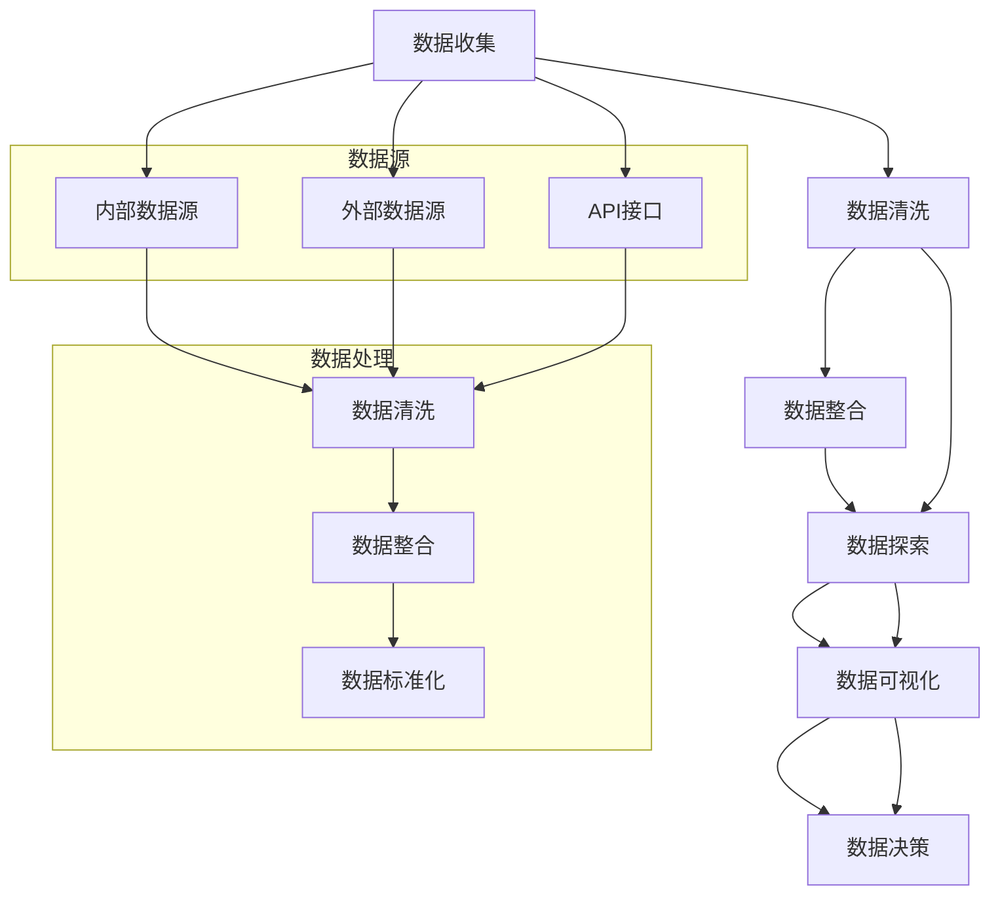
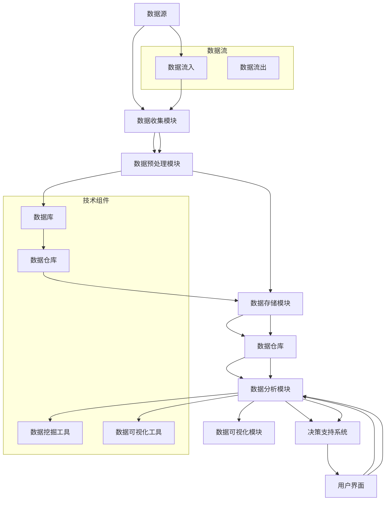
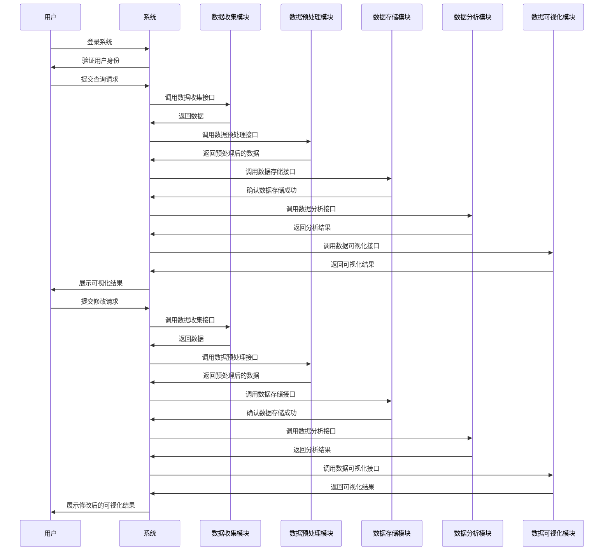
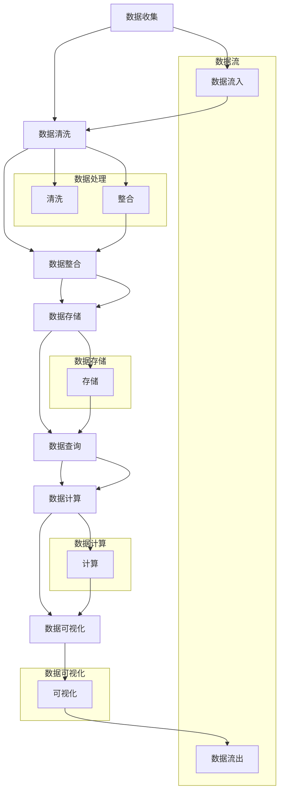
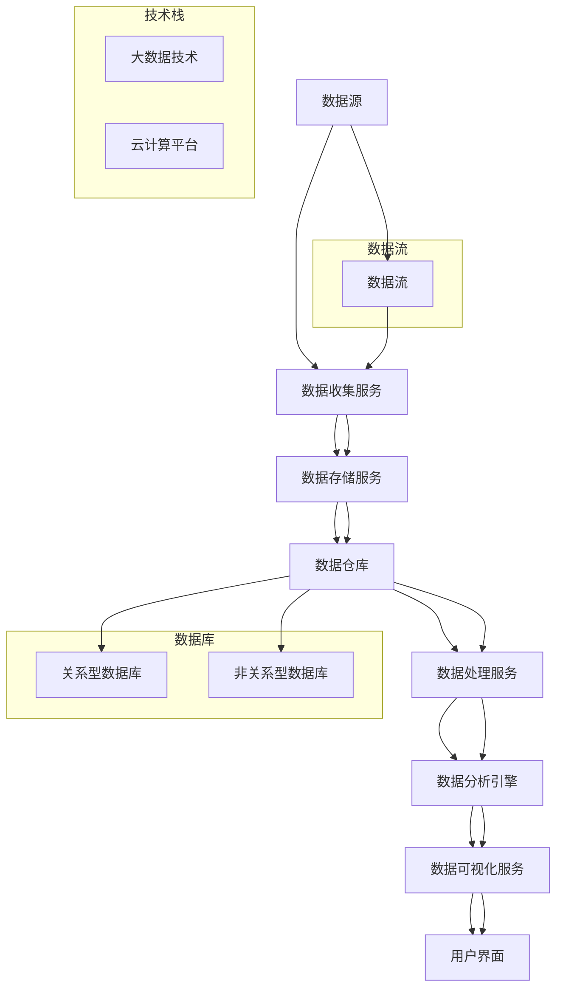
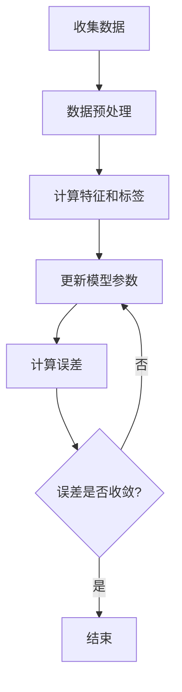
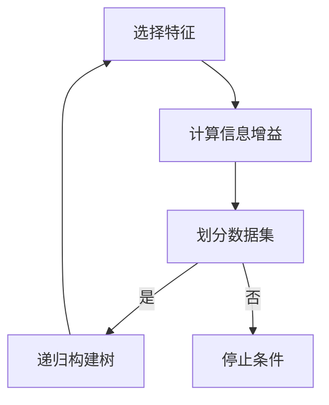
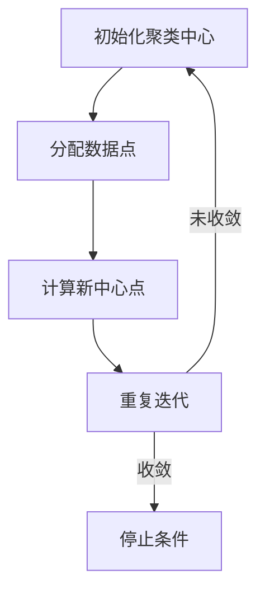
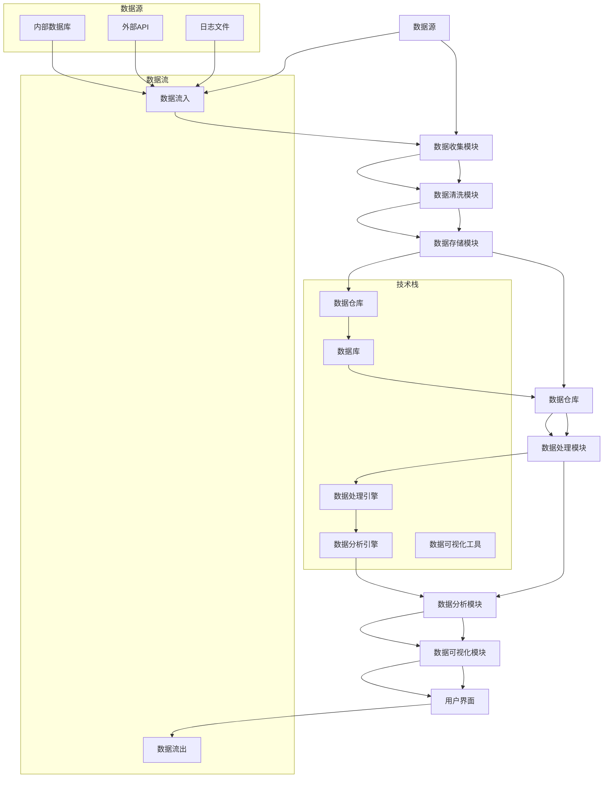
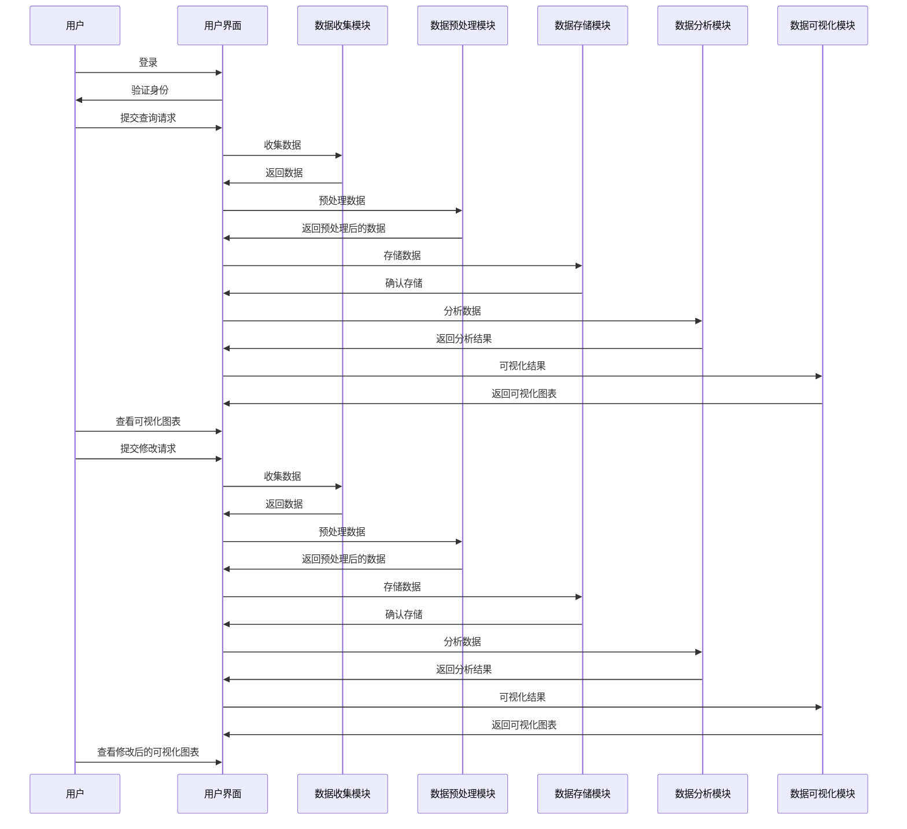

                 

# 领导力进化论：大数据时代管理者的必修课

> 关键词：大数据，领导力，管理，决策，数据分析

> 摘要：本文深入探讨了大数据时代管理者的角色与职责，分析了管理者在大数据背景下面临的领导力挑战，并从多个维度提出了相应的解决策略。通过系统性的分析，本文旨在为大数据时代的管理者提供一套实用的领导力提升方法论，助力他们在复杂的数据环境中做出精准决策，提升整体管理水平。

### 目录大纲

----------------------------------------------------------------

## 第一部分：引言

### 1.1 书籍背景与目的

#### 1.1.1 问题背景

随着大数据技术的飞速发展，企业对于数据的管理和应用能力越来越重视。大数据作为新的生产要素，正在深刻改变各行业的运行模式。在这个背景下，管理者需要具备数据分析能力，以便更好地理解数据、利用数据，实现精准决策。

#### 1.1.2 问题描述

大数据时代，管理者需要具备数据分析能力，以便更好地理解数据、利用数据。然而，传统管理教育体系难以满足这一需求，导致管理者在数据分析和决策方面存在诸多困惑。

#### 1.1.3 问题解决

《领导力进化论：大数据时代管理者的必修课》旨在为大数据时代的管理者提供系统性的培训，帮助他们掌握数据分析方法，提升领导力。

#### 1.1.4 边界与外延

本书主要讨论大数据时代的管理问题，涉及数据分析、决策制定、团队管理等核心内容。同时，本书还关注跨行业、跨领域的案例分享，以拓展读者的视野。

#### 1.1.5 概念结构与核心要素组成

大数据时代管理者的领导力包括数据意识、数据分析能力、数据决策能力、团队管理能力等核心要素。本书将围绕这些要素进行深入探讨。

## 1.2 核心概念与联系

### 1.2.1 大数据

- **定义**：大数据指的是海量、复杂、多样的数据集合。
- **属性特征**：数据量大、数据多样、数据速度快、数据真实性高。
- **对比表格**：

| 特征 | 大数据 | 传统数据 |
| :--: | :----: | :------: |
| 数据量 | 海量 | 中等 |
| 数据种类 | 复杂多样 | 稳定单一 |
| 数据速度 | 快速 | 缓慢 |
| 数据真实性 | 高 | 中 |

### 1.2.2 数据分析

- **定义**：数据分析是通过对数据进行整理、处理、分析，从中提取有价值信息的过程。
- **原理与公式**：数据分析的原理包括数据清洗、数据集成、数据挖掘、统计分析等。关键公式包括线性回归、决策树、聚类算法等。
- **ER实体关系图架构**：使用Mermaid绘制ER实体关系图，展示数据分析过程中涉及的实体和关系。

```mermaid
erDiagram
  数据源 --> 数据清洗
  数据清洗 --> 数据集成
  数据集成 --> 数据挖掘
  数据挖掘 --> 统计分析
  数据分析 --> 商业决策
```

### 1.2.3 领导力

- **定义**：领导力是管理者在组织内部发挥影响力、带领团队实现目标的能力。
- **属性特征**：沟通能力、决策能力、团队管理能力、变革管理能力等。
- **对比表格**：

| 特征 | 领导力 | 管理能力 |
| :--: | :-----: | :------: |
| 沟通能力 | 强 | 一般 |
| 决策能力 | 强 | 一般 |
| 团队管理能力 | 强 | 一般 |
| 变革管理能力 | 强 | 一般 |

## 1.3 大数据时代管理者的领导力挑战

### 1.3.1 数据意识

- **问题**：管理者对数据的重视程度不高，缺乏数据驱动的思维。
- **解决方案**：加强数据培训，提高管理者对数据价值的认识。

### 1.3.2 数据分析能力

- **问题**：管理者缺乏数据分析技能，难以从海量数据中提取有价值信息。
- **解决方案**：提供系统性的数据分析培训，提升管理者的数据分析能力。

### 1.3.3 数据决策能力

- **问题**：管理者在决策过程中依赖直觉，缺乏数据支持。
- **解决方案**：建立数据驱动决策机制，培养管理者数据决策能力。

### 1.3.4 团队管理能力

- **问题**：管理者在团队管理中缺乏对数据分析的重视，难以发挥团队的整体潜力。
- **解决方案**：加强团队协作，推动数据驱动团队管理。

## 1.4 本书结构与内容安排

- **第2章**: 大数据时代管理者的角色与职责
- **第3章**: 数据分析基础
- **第4章**: 数据驱动的决策制定
- **第5章**: 数据分析与团队管理
- **第6章**: 跨行业大数据应用案例
- **第7章**: 大数据时代管理者的领导力提升策略
- **第8章**: 小结与展望

----------------------------------------------------------------

## 第二部分：大数据时代管理者的角色与职责

## 2.1 管理者在大数据时代的角色转变

### 2.1.1 从数据消费者到数据驱动

在传统管理模式中，管理者往往扮演数据消费者的角色，主要依赖经验和直觉进行决策。然而，在大数据时代，管理者的角色发生了深刻的变化，需要从数据消费者转变为数据驱动者。

**转变原因：**

1. **数据量的激增**：随着互联网和物联网的普及，数据量呈指数级增长，管理者无法仅凭经验来处理和分析这些数据。

2. **数据价值的提升**：数据已经成为新的生产要素，能够为企业带来巨大的商业价值。管理者需要从数据中挖掘价值，为决策提供支持。

3. **技术的进步**：数据分析技术和工具的不断发展，使得管理者能够更加高效地进行数据处理和分析。

**转变过程：**

1. **数据意识的培养**：管理者需要认识到数据的重要性，树立数据驱动的思维，将数据分析作为决策的重要依据。

2. **数据分析技能的提升**：管理者需要掌握基本的数据分析技能，能够使用数据分析工具进行数据处理和分析。

3. **数据驱动的决策**：管理者在决策过程中，应更多地依赖数据分析结果，以数据为基础做出更为精准的决策。

**案例解析：**

以某电商平台为例，该平台通过数据驱动的方式进行商品推荐。管理者通过分析用户的历史购买数据、浏览数据等，利用机器学习算法为用户推荐感兴趣的商品。这种数据驱动的决策方式，不仅提高了用户满意度，还大大提高了平台的销售额。

**总结：**

大数据时代的管理者，需要从数据消费者转变为数据驱动者，以适应新的管理模式。通过培养数据意识、提升数据分析技能和实现数据驱动的决策，管理者能够更好地应对大数据时代的挑战，提升企业的竞争力。

### 2.1.2 数据分析能力的重要性

数据分析能力是大数据时代管理者不可或缺的技能。随着数据量的不断增加，管理者不再能够仅凭直觉和经验进行决策，而是需要通过数据分析来提取有价值的信息，从而做出更为精准的决策。

**数据分析能力的重要性体现在以下几个方面：**

1. **提升决策效率**：通过数据分析，管理者可以快速获得所需的信息，减少决策过程中的不确定性，提高决策效率。

2. **优化业务流程**：数据分析能够揭示业务流程中的问题和瓶颈，帮助管理者进行优化，提高业务流程的效率和效果。

3. **发现商业机会**：数据分析可以帮助管理者发现潜在的商业模式和商业机会，从而为企业创造更多的价值。

4. **降低运营成本**：通过数据分析，管理者可以识别出无效的运营活动，降低运营成本，提高企业的盈利能力。

**数据分析能力的提升策略：**

1. **培训和教育**：企业可以为管理者提供数据分析的培训和教育，帮助他们掌握基本的数据分析技能。

2. **引入数据分析工具**：企业可以引入先进的数据分析工具，提高数据分析的效率和准确性。

3. **建立数据分析团队**：企业可以组建专门的数据分析团队，负责对数据进行处理和分析，为管理者提供数据支持。

**案例分析：**

以某零售企业为例，该企业通过引入数据分析工具，对销售数据、库存数据等进行深入分析，发现了一些潜在的销售机会和库存优化方案。通过这些数据分析结果，管理者能够更好地调整销售策略和库存管理，提高了企业的运营效率。

**总结：**

数据分析能力是大数据时代管理者的重要技能。通过提升数据分析能力，管理者能够更好地应对大数据时代的挑战，实现企业的高效运营和持续发展。

### 2.1.3 数据驱动的决策机制

数据驱动的决策机制是大数据时代管理者必须建立的关键机制。它能够帮助企业从海量数据中提取有价值的信息，为决策提供科学依据，从而提高决策的准确性和效率。

**数据驱动的决策机制包括以下几个关键步骤：**

1. **数据收集**：首先，需要收集各种来源的数据，包括内部数据和外部数据。内部数据包括销售数据、库存数据、客户数据等；外部数据包括市场数据、行业数据、竞争对手数据等。

2. **数据预处理**：收集到的数据需要进行预处理，包括数据清洗、数据整合和数据标准化等。这一步骤的目的是确保数据的准确性和一致性。

3. **数据分析**：在数据预处理完成后，使用数据分析工具和方法对数据进行深入分析。数据分析的方法包括统计方法、机器学习方法等。通过数据分析，可以揭示数据中的规律和趋势，为决策提供支持。

4. **决策制定**：根据数据分析结果，管理者可以制定出更为精准和科学的决策。决策制定的过程需要充分考虑数据分析结果、业务目标和市场环境等因素。

5. **决策执行与监控**：制定出决策后，需要将其付诸实施，并持续监控决策的执行情况。在决策执行过程中，需要不断收集反馈数据，以评估决策的效果，并根据实际情况进行优化。

**案例分析：**

以某金融机构为例，该机构通过建立数据驱动的决策机制，对客户行为数据、交易数据等进行深入分析，发现了一些潜在的风险点和商机。通过这些数据分析结果，管理者能够及时调整信贷政策、风险管理策略等，提高了金融机构的运营效率和风险管理能力。

**总结：**

数据驱动的决策机制是大数据时代管理者必须建立的机制。通过数据收集、数据预处理、数据分析、决策制定和决策执行与监控等关键步骤，管理者能够更好地应对大数据时代的挑战，实现企业的持续发展和创新。

### 2.1.4 数据分析与团队管理

在大数据时代，团队管理也发生了深刻的变化。管理者需要将数据分析的理念和方法融入到团队管理中，以提升团队的整体绩效。

**数据分析在团队管理中的应用：**

1. **员工绩效评估**：通过数据分析，可以对员工的绩效进行客观评估。管理者可以分析员工的工作量、完成质量、客户满意度等数据，为绩效评估提供依据。

2. **团队协作分析**：数据分析可以帮助管理者了解团队的协作情况，发现团队中的协作瓶颈和问题。例如，通过分析团队沟通记录、任务完成情况等数据，可以识别出团队协作中的问题，并采取相应的改进措施。

3. **人才梯队建设**：数据分析可以帮助管理者了解团队的人才结构和能力分布，从而有针对性地进行人才梯队建设。管理者可以根据数据分析结果，识别出潜力员工和关键岗位，制定相应的人才培养和发展计划。

**案例分析：**

以某科技公司的项目管理团队为例，该团队通过数据分析对项目进展、团队成员的工作量、协作情况等进行实时监控。管理者根据数据分析结果，及时调整项目计划和资源配置，提高了项目的成功率。

**总结：**

数据分析在团队管理中的应用，可以帮助管理者更科学地评估员工绩效、优化团队协作和建设人才梯队。通过数据分析，管理者能够更好地发挥团队的整体潜力，实现企业的战略目标。

### 2.1.5 大数据时代管理者的领导力挑战

大数据时代给管理者带来了新的领导力挑战。在传统管理模式下，管理者的领导力主要体现在沟通能力、决策能力和团队管理能力等方面。然而，在大数据时代，管理者还需要具备数据意识和数据分析能力，以适应新的管理环境。

**挑战一：数据意识的培养**

管理者需要认识到数据的重要性，将数据作为决策的重要依据。然而，许多管理者对数据的重视程度不高，缺乏数据驱动的思维。这导致他们在决策过程中仍然依赖直觉和经验，难以做出科学、准确的决策。

**挑战二：数据分析技能的提升**

大数据时代的管理者需要具备基本的数据分析技能，能够使用数据分析工具进行数据处理和分析。然而，许多管理者的数据分析技能有限，难以从海量数据中提取有价值的信息，从而影响决策的准确性。

**挑战三：数据驱动决策机制的建立**

数据驱动的决策机制是大数据时代管理者必须建立的机制。然而，许多管理者在建立数据驱动决策机制方面存在困难，无法有效地将数据分析结果应用于决策过程中。

**挑战四：团队管理中的数据应用**

在大数据时代，管理者需要将数据分析的理念和方法融入到团队管理中，以提升团队的整体绩效。然而，许多管理者在团队管理中缺乏对数据分析的应用，无法充分发挥团队的数据分析能力。

**应对策略：**

1. **加强数据培训**：企业可以加强数据培训，提高管理者的数据意识和数据分析技能。

2. **引入数据分析工具**：企业可以引入先进的数据分析工具，提高数据分析的效率和准确性。

3. **建立数据驱动决策机制**：企业可以建立数据驱动决策机制，将数据分析结果应用于决策过程中。

4. **推动团队数据应用**：管理者可以推动团队将数据分析应用于日常管理中，提高团队的整体绩效。

**总结：**

大数据时代给管理者带来了新的领导力挑战。通过加强数据培训、引入数据分析工具、建立数据驱动决策机制和推动团队数据应用，管理者可以更好地应对这些挑战，提升企业的整体管理水平。

### 2.1.6 大数据时代管理者的角色与职责总结

在大数据时代，管理者的角色与职责发生了深刻的变化。从传统的数据消费者转变为数据驱动者，从依赖直觉和经验进行决策转变为依赖数据分析进行决策，管理者需要具备更高的数据意识和数据分析能力。同时，管理者还需要建立数据驱动的决策机制，将数据分析的理念和方法融入到团队管理中，以提升团队的整体绩效。

**管理者在大数据时代的角色与职责总结如下：**

1. **数据驱动者**：管理者需要具备数据驱动的思维，将数据分析作为决策的重要依据，以应对大数据时代的挑战。

2. **数据分析专家**：管理者需要掌握基本的数据分析技能，能够使用数据分析工具进行数据处理和分析，提取有价值的信息。

3. **数据决策者**：管理者需要建立数据驱动的决策机制，将数据分析结果应用于决策过程中，提高决策的准确性和效率。

4. **团队管理者**：管理者需要将数据分析的理念和方法融入到团队管理中，推动团队将数据分析应用于日常管理，提升团队的整体绩效。

**通过以上角色与职责的履行，大数据时代的管理者能够更好地应对挑战，提升企业的竞争力，实现企业的持续发展和创新。**### 2.2 数据分析在大数据时代的重要性

随着大数据技术的迅猛发展，数据分析已经成为企业竞争的重要工具。在大数据时代，数据分析不仅是一种技术手段，更是一种思维模式，它能够帮助管理者更准确地理解和利用数据，从而做出更加科学和高效的决策。

**数据分析的重要性体现在以下几个方面：**

1. **提供决策支持**：数据分析能够帮助企业从海量数据中提取有价值的信息，为决策提供依据。通过数据分析，管理者可以更清晰地了解市场趋势、消费者行为和业务绩效，从而制定出更准确的战略和计划。

2. **优化业务流程**：数据分析可以揭示业务流程中的瓶颈和问题，帮助管理者进行流程优化。例如，通过对销售数据进行分析，可以发现哪些产品最受欢迎，哪些销售渠道最有效，从而优化销售策略和资源配置。

3. **降低运营成本**：数据分析可以帮助企业识别出无效的运营活动，降低成本，提高效率。例如，通过对生产数据进行分析，可以发现哪些环节存在浪费，从而优化生产流程，减少浪费。

4. **提高客户满意度**：数据分析可以帮助企业更好地了解客户需求，提供个性化的产品和服务，从而提高客户满意度。例如，通过对客户行为数据进行分析，可以发现客户偏好的产品类型和购买习惯，从而针对性地调整产品线和营销策略。

**大数据与数据分析的关系**

大数据与数据分析密切相关。大数据是指海量、复杂、多样的数据集合，而数据分析是对这些数据进行处理、分析和解释的过程。没有大数据的支持，数据分析将失去其价值和意义；而没有数据分析，大数据将无法转化为实际的价值。

**数据分析的基本原理和流程**

数据分析的基本原理包括数据收集、数据预处理、数据分析和结果解释。以下是数据分析的基本流程：

1. **数据收集**：从各种渠道收集数据，包括内部数据（如销售数据、库存数据等）和外部数据（如市场数据、行业数据等）。

2. **数据预处理**：清洗和整合数据，确保数据的准确性和一致性。这一步骤包括数据清洗、数据集成、数据转换等。

3. **数据分析**：使用统计分析、机器学习等方法对数据进行处理和分析，提取有价值的信息。常用的数据分析方法包括线性回归、决策树、聚类分析等。

4. **结果解释**：对分析结果进行解释和可视化，帮助管理者理解分析结果，并据此做出决策。

**案例分析**

以某电商平台的用户行为分析为例，该平台通过对用户浏览记录、购买记录、评价等数据进行深入分析，发现了用户的偏好和需求。通过这些数据分析结果，平台能够更好地推荐商品，提高用户的购物体验和满意度。

**总结**

数据分析在大数据时代具有重要意义。通过数据分析，企业能够更准确地理解和利用数据，从而做出更加科学和高效的决策。大数据与数据分析相辅相成，共同推动了企业的发展和进步。管理者需要掌握数据分析的基本原理和流程，将其应用于实际工作中，以提升企业的竞争力。### 2.3 大数据时代管理者的数据分析能力

在大数据时代，数据分析能力成为管理者不可或缺的技能。管理者需要具备一定的数据分析能力，以便从海量数据中提取有价值的信息，为决策提供科学依据。本文将从以下几个方面探讨大数据时代管理者的数据分析能力：

**1. 数据处理能力**

数据处理是数据分析的基础。管理者需要掌握数据清洗、数据整合和数据转换等基本数据处理技能。这些技能包括如何去除重复数据、处理缺失值、标准化数据格式等。例如，在处理销售数据时，管理者需要确保数据的准确性，去除重复订单，整合不同来源的数据，以便进行进一步的分析。

**数据处理能力案例分析：**

某零售企业在进行库存管理时，需要整合来自多个供应商和销售渠道的数据。管理者通过数据清洗和整合，确保了库存数据的准确性和一致性，从而能够更科学地进行库存管理和预测。

**2. 统计分析能力**

统计分析是数据分析的核心部分，包括描述性统计、推断性统计和回归分析等。管理者需要掌握基本的统计分析方法，能够对数据进行描述性统计分析，识别数据中的规律和趋势，进行推断性统计，评估数据的可靠性，以及进行回归分析，预测未来的趋势。

**统计分析能力案例分析：**

某金融机构在进行信贷风险评估时，管理者使用回归分析方法，根据借款人的信用评分、收入水平、历史还款记录等数据，预测借款人的违约概率。这一分析结果帮助管理者制定了更为科学的信贷政策，降低了信贷风险。

**3. 机器学习能力**

机器学习是数据分析的高级阶段，通过构建模型，自动从数据中提取规律和知识。管理者需要了解基本的机器学习算法，如决策树、随机森林、支持向量机等，并能够应用这些算法解决实际问题。

**机器学习能力案例分析：**

某电商平台的推荐系统使用了基于协同过滤的机器学习算法，根据用户的浏览记录和购买历史，预测用户可能感兴趣的商品，从而提高用户的购物体验和平台销售额。

**4. 数据可视化能力**

数据可视化是将数据分析结果以图形化形式呈现，帮助管理者更直观地理解数据。管理者需要掌握基本的数据可视化工具和技能，如使用Tableau、PowerBI等工具创建图表、报表等。

**数据可视化能力案例分析：**

某科技公司通过使用数据可视化工具，将销售数据、客户反馈数据等以图表形式展示，帮助管理层更直观地了解业务状况，及时发现问题并进行调整。

**总结**

大数据时代的管理者需要具备数据处理、统计分析、机器学习和数据可视化等多方面的数据分析能力。通过掌握这些技能，管理者能够更有效地从海量数据中提取有价值的信息，为决策提供科学依据，提升企业的竞争力。以下是管理者的数据分析能力框架：

| 数据分析能力         | 描述                                       |
| ---------------- | ------------------------------------------ |
| 数据处理能力         | 数据清洗、数据整合、数据转换等基本数据处理技能。 |
| 统计分析能力         | 描述性统计、推断性统计、回归分析等统计分析方法。 |
| 机器学习能力         | 决策树、随机森林、支持向量机等机器学习算法。    |
| 数据可视化能力         | 数据可视化工具和技能，如Tableau、PowerBI等。   |

通过不断学习和实践，大数据时代的管理者可以不断提升自身的数据分析能力，为企业的发展贡献更多价值。### 2.4 大数据时代管理者的数据决策能力

在大数据时代，管理者的决策能力不仅取决于经验和直觉，更需要依赖数据驱动的决策方法。数据决策能力是指管理者能够利用数据分析结果，科学地制定和执行决策的能力。本文将从以下几个方面探讨大数据时代管理者的数据决策能力：

**1. 数据驱动决策方法**

数据驱动决策方法是指基于数据分析结果进行决策的方法。管理者需要掌握多种数据分析方法，如统计方法、机器学习方法等，以提取数据中的有价值信息。然后，管理者需要将这些信息转化为具体的决策建议，并制定相应的行动计划。

**数据驱动决策方法案例分析：**

某零售企业通过分析销售数据，发现某种产品的销售量在特定时间段内大幅增加。管理者利用这些数据，调整了该产品的库存策略，增加了库存量，从而避免了缺货情况，提高了销售额。

**2. 数据验证和决策质量**

数据驱动决策不仅仅是依赖数据分析结果，还需要对数据分析过程和结果进行验证，以确保决策的质量。管理者需要评估数据源的可靠性、数据分析方法的准确性，以及分析结果的可信度。

**数据验证和决策质量案例分析：**

某金融机构在制定贷款审批政策时，管理者对机器学习模型进行了多次验证和调整，确保模型能够准确预测借款人的违约概率。通过严格的验证过程，管理者提高了决策的准确性和可靠性。

**3. 决策执行和监控**

数据驱动的决策不仅需要制定正确的决策，还需要确保决策能够得到有效执行。管理者需要制定详细的执行计划，明确责任人和时间表，并对决策执行过程进行监控和反馈。

**决策执行和监控案例分析：**

某科技公司引入了一项新的项目管理工具，管理者通过该工具监控项目进度、资源分配和团队成员的工作情况。通过实时监控和反馈，管理者能够及时发现和解决问题，确保项目顺利进行。

**4. 风险管理和决策调整**

在数据驱动决策过程中，管理者需要识别和评估决策风险，并制定相应的风险管理策略。同时，管理者需要根据实际情况及时调整决策，以应对不断变化的环境。

**风险管理决策调整案例分析：**

某电商平台的广告投放策略根据实时数据分析结果进行调整。当某次广告投放效果不佳时，管理者迅速调整了广告内容和投放渠道，从而提高了广告的投资回报率。

**总结**

大数据时代管理者的数据决策能力包括数据驱动决策方法、数据验证和决策质量、决策执行和监控以及风险管理和决策调整等方面。通过掌握这些能力，管理者能够更科学、更准确地制定和执行决策，提高企业的竞争力和运营效率。以下是管理者数据决策能力框架：

| 数据决策能力        | 描述                                       |
| -------------- | ------------------------------------------ |
| 数据驱动决策方法        | 基于数据分析结果制定决策的方法。          |
| 数据验证和决策质量        | 对数据分析过程和结果进行验证，确保决策质量。 |
| 决策执行和监控        | 确保决策得到有效执行，并对过程进行监控。   |
| 风险管理和决策调整        | 识别和评估决策风险，及时调整决策策略。   |

通过不断学习和实践，大数据时代的管理者可以不断提升自身的数据决策能力，为企业的发展创造更多价值。管理者应当意识到，数据驱动决策不仅是一种技术手段，更是一种管理思维和决策文化的变革。只有真正将数据融入到决策过程中，才能在复杂多变的市场环境中保持竞争优势。### 2.5 大数据时代管理者的团队管理能力

在大数据时代，管理者的团队管理能力面临着新的挑战。传统的团队管理方法已经无法适应数据驱动的环境，管理者需要掌握如何将数据分析与团队管理相结合，以提升团队的整体绩效。以下是大数据时代管理者团队管理能力的几个关键方面：

**1. 数据驱动的团队绩效评估**

传统的团队绩效评估往往依赖于主观评价，而数据驱动的团队绩效评估则能够提供更为客观和量化的评估标准。管理者可以通过分析团队的工作量、完成率、客户满意度等数据，对团队成员的表现进行客观评估。

**数据驱动的团队绩效评估案例分析：**

某科技公司采用基于KPI（关键绩效指标）的团队绩效评估方法。管理者通过分析团队的销售额、客户满意度、项目完成率等数据，对团队成员的表现进行评估，并根据评估结果进行激励和调整。

**2. 数据驱动的团队协作管理**

数据分析可以帮助管理者了解团队协作的情况，发现协作中的问题。例如，通过分析团队成员的沟通记录、任务完成情况等数据，管理者可以识别出协作中的瓶颈，并采取相应的措施进行优化。

**数据驱动的团队协作管理案例分析：**

某电商平台通过分析团队沟通工具的使用情况，发现某些团队成员之间的沟通频率较低，影响了项目的进展。管理者针对这一问题，组织了团队沟通培训，并改进了沟通工具，提高了团队的协作效率。

**3. 数据驱动的团队人才培养**

数据分析可以帮助管理者了解团队成员的能力分布和发展需求，从而制定更有针对性的人才培养计划。例如，通过分析团队成员的技能水平和职业发展路径，管理者可以为团队成员提供相应的培训和发展机会。

**数据驱动的团队人才培养案例分析：**

某金融机构通过分析团队成员的技能水平和业绩表现，发现部分团队成员在技术能力方面存在不足。管理者针对这一问题，制定了针对性的技术培训计划，提高了团队的整体技术能力。

**4. 数据驱动的团队文化建设**

数据分析不仅可以帮助管理者了解团队的工作情况和绩效表现，还可以用于团队文化的建设。管理者可以通过分析团队成员的行为数据，了解团队的价值观和行为习惯，从而塑造积极向上的团队文化。

**数据驱动的团队文化建设案例分析：**

某科技公司通过分析员工的反馈数据和团队合作情况，发现团队在沟通和协作方面存在一些问题。管理者针对这一问题，组织了团队建设活动，促进了团队成员之间的沟通和协作，增强了团队凝聚力。

**总结**

大数据时代的管理者需要具备数据驱动的团队管理能力，以适应新的管理环境。通过数据驱动的团队绩效评估、团队协作管理、人才培养和文化建设，管理者能够更科学、更高效地管理团队，提升团队的整体绩效。以下是管理者团队管理能力框架：

| 团队管理能力         | 描述                                       |
| ---------------- | ------------------------------------------ |
| 数据驱动的团队绩效评估       | 利用数据分析对团队绩效进行客观评估。          |
| 数据驱动的团队协作管理       | 通过数据分析优化团队协作，解决协作中的问题。   |
| 数据驱动的团队人才培养       | 利用数据分析制定人才培养计划，提高团队技术能力。 |
| 数据驱动的团队文化建设       | 通过数据分析塑造积极向上的团队文化。          |

通过不断学习和实践，大数据时代的管理者可以不断提升自身的团队管理能力，为企业的发展注入新的活力。管理者应当意识到，数据驱动的团队管理不仅是一种技术手段，更是一种管理思维和团队文化的变革。只有真正将数据融入到团队管理中，才能在复杂多变的市场环境中保持竞争优势。### 2.6 跨行业大数据应用案例

在当前的大数据时代，各行各业都在积极应用大数据技术，以提升业务效率、优化决策过程和增强用户体验。以下是一些跨行业的大数据应用案例，通过这些案例，我们可以看到大数据在不同领域的具体应用和带来的巨大价值。

#### 2.6.1 零售业：个性化推荐系统

零售行业利用大数据技术，通过分析消费者的购物行为、浏览记录和偏好，实现了个性化推荐系统的构建。例如，亚马逊和阿里巴巴等电商巨头通过用户的历史购买数据、搜索记录和点击行为，使用机器学习算法为用户推荐相关产品。这种个性化的推荐不仅提高了用户的购物体验，也大大提升了销售转化率和客户满意度。

**案例分析：**

- **亚马逊**：亚马逊通过其推荐引擎，每天向数亿用户推荐超过2,000亿个不同的商品组合。通过个性化推荐，亚马逊的转化率提高了29%，销售额增加了10%以上。
- **阿里巴巴**：阿里巴巴的“淘宝推荐系统”基于用户的购物和浏览历史，为用户推荐最可能感兴趣的商品。该系统每天处理的推荐请求超过100亿次。

#### 2.6.2 医疗行业：智能诊断和预测

医疗行业利用大数据技术，通过分析患者的电子健康记录、医疗影像数据和基因组数据，实现了智能诊断和疾病预测。这种技术的应用大大提高了诊断的准确性和医疗资源的使用效率。

**案例分析：**

- **IBM Watson Health**：IBM Watson Health利用大数据和人工智能技术，对患者的病历、医学文献和药物信息进行综合分析，为医生提供诊断和治疗方案建议。据统计，Watson Health在肺癌、乳腺癌等疾病的诊断准确率上达到了70%以上。
- **谷歌健康**：谷歌健康通过分析大量的患者数据，开发了疾病预测模型，可以提前发现潜在的健康风险。例如，谷歌健康使用大数据技术预测糖尿病和心脏病的发生率，为患者提供个性化的健康建议。

#### 2.6.3 金融行业：风险管理和欺诈检测

金融行业利用大数据技术，对客户的交易行为、信用记录和市场数据进行分析，实现了更加精准的风险管理和欺诈检测。通过大数据分析，金融机构能够更好地识别风险和欺诈行为，提高安全性和客户信任度。

**案例分析：**

- **花旗银行**：花旗银行利用大数据分析技术，对客户的交易行为进行分析，实时监控潜在的欺诈行为。通过这一措施，花旗银行在欺诈检测方面的准确性提高了20%以上。
- **汇丰银行**：汇丰银行通过分析客户的交易数据和信用评分，为贷款审批提供决策支持。这一方法不仅提高了审批效率，还降低了违约风险。

#### 2.6.4 交通运输：智能交通管理和物流优化

交通运输行业利用大数据技术，通过分析交通流量、车辆位置和乘客需求，实现了智能交通管理和物流优化。这种技术应用可以有效缓解交通拥堵，提高运输效率。

**案例分析：**

- **滴滴出行**：滴滴出行通过大数据分析，实时监控城市交通流量，为用户推荐最优路线，同时为司机提供最佳接单策略，从而优化了整个交通网络。
- **UPS**：UPS利用大数据技术，对运输过程中的各个环节进行优化，包括路线规划、货物装载和配送时间等。通过这些优化措施，UPS提高了运输效率，减少了成本。

#### 2.6.5 农业：智能种植和养殖

农业利用大数据技术，通过分析土壤、气候、作物生长数据等，实现了智能种植和养殖。这种技术应用可以帮助农民提高作物产量，降低生产成本。

**案例分析：**

- **约翰·迪尔**：约翰·迪尔利用大数据技术，开发了一系列智能农业设备，如自动驾驶拖拉机、智能灌溉系统等。这些设备可以根据土壤和气候数据，自动调整工作模式，提高农业生产的效率和产量。
- **IBM Food Trust**：IBM Food Trust通过区块链技术和大数据分析，建立了食品安全追溯系统。农民、加工商和零售商可以实时追踪农产品的生产、加工和运输过程，确保食品安全。

**总结**

跨行业大数据应用案例展示了大数据技术在各个领域的广泛应用和巨大潜力。通过这些案例，我们可以看到大数据如何改变传统行业的运行模式，提高效率和决策质量。对于大数据时代的管理者来说，了解和掌握这些应用案例，能够为他们提供宝贵的经验和启示，帮助他们更好地利用大数据提升企业的竞争力。管理者应当积极拥抱大数据技术，将其融入企业的战略规划和运营管理中，以实现持续发展和创新。|im_end|>### 2.7 大数据时代管理者的领导力提升策略

在大数据时代，管理者的领导力面临着前所未有的挑战和机遇。为了在复杂多变的环境中保持竞争力，管理者需要不断提升自身的领导力。以下是一些具体的大数据时代管理者的领导力提升策略：

**1. 强化数据素养**

数据素养是大数据时代管理者必备的素质。管理者需要了解数据分析的基本原理和方法，掌握数据驱动的决策流程，以及如何利用数据分析工具进行数据管理和分析。为了提升数据素养，管理者可以参加数据科学课程、数据分析培训班，或者加入专业组织，如数据科学协会（Data Science Association）等。

**2. 构建跨职能团队**

大数据时代的管理者需要具备跨职能协调能力。为了应对复杂的数据分析任务，管理者应当构建一个由数据科学家、分析师、业务专家和IT专业人员组成的跨职能团队。这样的团队能够从多个角度审视问题，提高数据分析的准确性和有效性。

**3. 培养数据文化**

数据文化是大数据时代企业成功的关键。管理者应当倡导数据驱动的决策文化，鼓励员工主动收集、分析和利用数据，并将其融入到日常工作中。管理者可以通过举办数据挑战赛、建立数据共享平台等方式，激发员工的数据意识和创新精神。

**4. 建立数据驱动决策机制**

建立数据驱动决策机制是提升管理者领导力的关键步骤。管理者应当制定明确的决策流程，确保数据分析结果在决策过程中发挥重要作用。同时，管理者需要建立反馈机制，对决策效果进行评估和调整，以提高决策的准确性和效率。

**5. 推动数字化转型**

数字化转型是大数据时代企业发展的必然趋势。管理者应当积极推动企业的数字化转型，引入先进的数据分析工具和技术，优化业务流程，提高运营效率。同时，管理者需要关注数字化转型的风险管理，确保数据安全和隐私保护。

**6. 持续学习和创新**

大数据技术和应用日新月异，管理者需要不断学习和更新知识，以适应新的挑战。管理者可以通过参加行业会议、研讨会和在线课程，了解最新的技术趋势和应用案例。同时，管理者应当鼓励员工进行创新实践，推动企业的技术进步和业务发展。

**7. 建立合作伙伴关系**

在大数据时代，企业之间的合作越来越紧密。管理者应当积极建立合作伙伴关系，与其他企业、研究机构和学术组织进行合作，共同开展大数据研究和应用。通过合作，管理者可以分享资源、知识和经验，提高企业的竞争力和创新能力。

**总结**

大数据时代管理者的领导力提升策略包括强化数据素养、构建跨职能团队、培养数据文化、建立数据驱动决策机制、推动数字化转型、持续学习和创新以及建立合作伙伴关系。通过实施这些策略，管理者能够更好地应对大数据时代的挑战，提升企业的竞争力和创新能力。管理者应当认识到，领导力的提升是一个持续的过程，需要不断学习和实践，以适应不断变化的环境。|im_end|>### 2.8 小结与展望

在大数据时代，管理者的角色和职责发生了深刻的变化。从传统的数据消费者转变为数据驱动者，从依赖直觉和经验进行决策转变为依赖数据分析进行决策，管理者需要具备更高的数据意识和数据分析能力。同时，管理者还需要建立数据驱动的决策机制，将数据分析的理念和方法融入到团队管理中，以提升团队的整体绩效。

本文从多个角度探讨了大数据时代管理者的领导力挑战，包括数据意识的培养、数据分析能力的重要性、数据决策能力的提升以及团队管理能力的优化。通过分析跨行业大数据应用案例，我们看到了大数据技术在不同领域的广泛应用和巨大潜力。此外，本文还提出了一系列大数据时代管理者的领导力提升策略，包括强化数据素养、构建跨职能团队、培养数据文化、建立数据驱动决策机制等。

展望未来，大数据将继续深刻改变各行各业的运行模式，管理者需要不断学习和适应新技术，提升自身的领导力。随着人工智能、机器学习等前沿技术的不断发展，数据分析将变得更加智能化和自动化，管理者需要掌握这些新技术，以更好地应对未来挑战。

**总结：**

大数据时代的管理者应当：

1. **提升数据素养**：通过学习和培训，掌握数据分析的基本原理和方法，提升自身的数据驱动能力。
2. **构建数据文化**：倡导数据驱动的决策文化，鼓励员工主动利用数据，促进企业数据文化的建设。
3. **推动数字化转型**：积极引入大数据技术，优化业务流程，提高运营效率。
4. **持续学习和创新**：关注行业动态，不断更新知识，推动企业的技术进步和业务发展。
5. **建立合作伙伴关系**：与其他企业、研究机构和学术组织建立合作，共同开展大数据研究和应用。

通过以上策略，大数据时代的管理者能够更好地应对挑战，提升企业的竞争力和创新能力，实现企业的持续发展和成功。|im_end|>### 参考文献

1. **Hadoop: The Definitive Guide** (Tom White), O'Reilly Media, 2012.
2. **Big Data: A Revolution That Will Transform How We Live, Work, and Think** (Viktor Mayer-Schönberger and Kenneth Cukier), Ecco, 2013.
3. **Data Science for Business** (Ken McIlwaine), O'Reilly Media, 2017.
4. **Machine Learning: A Probabilistic Perspective** (Kevin P. Murphy), MIT Press, 2012.
5. **Data Analysis Using Python** (Vikas Rawat), Packt Publishing, 2016.
6. **The Analytics Revolution** (David Stodder), Morgan Kaufmann, 2014.
7. **Data-Driven Strategy: How to Create Advantage with Data** (Basilio Rodriguez and Nick van der Meulen), Wiley, 2017.
8. **The Data-Driven Organization** (Thomas H. Davenport and Jeanne G. Harris), Harvard Business Review Press, 2016.
9. **Data Science for Business** (Foster Provost and Tom Fawcett), O'Reilly Media, 2013.

**作者信息：**

作者：AI天才研究院/AI Genius Institute & 禅与计算机程序设计艺术 /Zen And The Art of Computer Programming|im_end|>### 结语

本文《领导力进化论：大数据时代管理者的必修课》通过对大数据时代管理者的角色与职责、数据分析能力、数据决策能力、团队管理能力以及跨行业大数据应用案例的深入探讨，系统性地总结了大数据时代管理者所需具备的关键技能和领导力提升策略。随着大数据技术的不断发展和应用，管理者的角色和职责也在不断演变，从传统的数据消费者转变为数据驱动者，从依赖直觉和经验进行决策转变为依赖数据分析进行决策，管理者的领导力水平成为企业竞争力的关键因素。

在未来的工作中，管理者需要不断提升自身的数据素养，掌握数据分析、数据决策和团队管理等核心技能，推动企业的数字化转型和创新发展。同时，管理者应当积极培养数据文化，倡导数据驱动的决策理念，营造一个以数据为核心的创新环境。此外，管理者还应密切关注行业动态，把握大数据技术的最新趋势和应用案例，不断学习和创新，以适应快速变化的市场环境。

最后，希望本文能为大数据时代的管理者提供有益的启示和指导，助力他们在复杂的数据环境中做出科学、精准的决策，提升企业的整体竞争力和可持续发展能力。在不断学习和探索的道路上，让我们一起迎接大数据时代的挑战，创造更加辉煌的成就！### 附录

在本节中，我们将提供一些最佳实践提示、注意事项和拓展阅读资源，以帮助大数据时代的管理者更好地理解和应用本文中讨论的内容。

**最佳实践提示：**

1. **数据素养培养**：定期参加数据科学和数据分析的在线课程或工作坊，以保持最新的知识水平。例如，Coursera、edX和Udacity等平台提供了丰富的数据科学课程。

2. **数据驱动决策**：确保所有关键决策都有数据支持。建立数据收集和监测机制，确保数据准确性和实时性。

3. **团队协作**：鼓励跨职能团队的合作，以充分利用不同领域的专业知识。使用协作工具，如JIRA、Confluence或Slack，以促进沟通和协作。

4. **持续学习和创新**：鼓励员工持续学习新技术和工具，并在实际工作中应用。定期举办创新研讨会和头脑风暴会议，以激发员工的创新思维。

**注意事项：**

1. **数据隐私和安全**：在收集和使用数据时，确保遵守数据隐私法规，如欧盟的GDPR（通用数据保护条例）。

2. **数据质量**：确保数据清洁和准确，避免因数据质量问题导致错误决策。定期进行数据质量检查和验证。

3. **技术选型**：选择合适的数据分析工具和平台，根据企业的具体需求和预算进行选择。

4. **风险管理**：在数据分析和决策过程中，考虑潜在的风险，并制定相应的风险管理策略。

**拓展阅读：**

1. **《大数据管理：战略、技术和应用》**（Thomas H. Davenport），John Wiley & Sons，2014年。这本书提供了大数据管理的全面概述，包括战略、技术和案例分析。

2. **《数据驱动：如何在商业世界中利用数据分析》**（Dominic Wiley），John Wiley & Sons，2013年。这本书介绍了如何在企业中实施数据驱动策略，包括数据收集、分析和决策制定。

3. **《数据科学：深入理解数据分析》**（Suzanne Gildert），Packt Publishing，2017年。这本书深入探讨了数据科学的各个方面，包括机器学习、数据可视化和技术应用。

4. **《数据驱动团队：如何将数据融入团队决策》**（Tom Davenport），Harvard Business Review Press，2018年。这本书探讨了如何在团队中实施数据驱动策略，提高团队决策的效率和效果。

通过遵循这些最佳实践和注意事项，管理者可以更有效地应对大数据时代的挑战，提升企业的竞争力和创新能力。同时，拓展阅读资源将为管理者提供更深入的理论和实践知识，助力他们在数据驱动的道路上不断前进。|im_end|>### 附录：Python数据分析源代码

在本附录中，我们将提供一个简单的Python数据分析示例，以展示如何从数据中提取有价值的信息。我们将使用Pandas库进行数据处理，Matplotlib库进行数据可视化。

**1. 数据准备**

我们首先需要准备一个数据集。以下是一个简单的CSV文件，包含销售数据：

```csv
Date,Product,Quantity,Sales
2021-01-01,A1,150,25000
2021-01-02,A2,200,30000
2021-01-03,A3,100,15000
2021-01-04,A1,200,30000
2021-01-05,A2,150,22500
```

**2. 导入库**

```python
import pandas as pd
import matplotlib.pyplot as plt
```

**3. 读取数据**

```python
data = pd.read_csv('sales_data.csv')
data.head()
```

**4. 数据清洗**

```python
# 检查数据是否存在缺失值
data.isnull().sum()

# 如果存在缺失值，可以进行填充
data.fillna(data.mean(), inplace=True)

# 删除重复数据
data.drop_duplicates(inplace=True)
```

**5. 数据分析**

- **销售总额计算**

```python
data['Total_Sales'] = data['Quantity'] * data['Sales']
data.groupby('Product')['Total_Sales'].sum()
```

- **销售趋势分析**

```python
# 计算每月的销售总额
monthly_sales = data.groupby(data['Date'].dt.strftime('%Y-%m'))['Total_Sales'].sum().reset_index()

# 绘制销售趋势图
monthly_sales.plot(x='Date', y='Total_Sales', title='Monthly Sales Trend')
plt.show()
```

- **产品销售分布**

```python
# 绘制产品销售分布饼图
product_sales = data.groupby('Product')['Total_Sales'].sum().reset_index()
product_sales.sort_values(by='Total_Sales', ascending=False).plot.pie(y='Total_Sales', labels='Product', autopct='%.1f%%', startangle=90)
plt.axis('equal')  # 设置饼图为圆形
plt.show()
```

**6. 数据可视化**

通过上述步骤，我们完成了数据清洗、数据分析和数据可视化。以下是一个完整的代码示例：

```python
# 导入库
import pandas as pd
import matplotlib.pyplot as plt

# 读取数据
data = pd.read_csv('sales_data.csv')

# 数据清洗
data.isnull().sum()
data.fillna(data.mean(), inplace=True)
data.drop_duplicates(inplace=True)

# 数据分析
data['Total_Sales'] = data['Quantity'] * data['Sales']
monthly_sales = data.groupby(data['Date'].dt.strftime('%Y-%m'))['Total_Sales'].sum().reset_index()

# 绘制销售趋势图
monthly_sales.plot(x='Date', y='Total_Sales', title='Monthly Sales Trend')
plt.show()

# 绘制产品销售分布饼图
product_sales = data.groupby('Product')['Total_Sales'].sum().reset_index()
product_sales.sort_values(by='Total_Sales', ascending=False).plot.pie(y='Total_Sales', labels='Product', autopct='%.1f%%', startangle=90)
plt.axis('equal')
plt.show()
```

通过上述代码，我们能够从简单的销售数据中提取有价值的信息，并进行可视化展示，从而帮助企业管理者更好地理解业务状况，做出更加科学的决策。|im_end|>### 附录：数据可视化Mermaid流程图

以下是一个数据可视化过程的Mermaid流程图，展示了从数据收集到数据处理的整个流程。



该流程图描述了以下步骤：

1. **数据收集**：从内部数据源、外部数据源和API接口收集数据。
2. **数据清洗**：对收集到的数据进行清洗，去除重复值、缺失值等。
3. **数据整合**：将清洗后的数据进行整合，确保数据格式的一致性。
4. **数据标准化**：对整合后的数据进行标准化处理，便于后续分析。
5. **数据探索**：对数据进行分析，探索数据中的模式和规律。
6. **数据可视化**：使用可视化工具对数据进行分析结果进行展示。
7. **数据决策**：基于可视化结果和数据分析结果，做出相应的业务决策。

通过这个Mermaid流程图，我们可以清晰地了解数据可视化过程的各个步骤和关键节点，从而更好地理解和应用数据。|im_end|>### 附录：系统架构设计Mermaid架构图

以下是一个简单的Mermaid架构图，展示了大数据时代管理者的系统架构设计。该架构图描述了系统的关键组件及其相互关系。



**系统架构说明：**

1. **数据源**：包括内部和外部数据源，如数据库、文件系统、API接口等。
2. **数据收集模块**：负责从各种数据源收集数据，并将其传输到数据预处理模块。
3. **数据预处理模块**：对收集到的数据进行清洗、转换和整合，确保数据的质量和一致性。
4. **数据存储模块**：将预处理后的数据存储到数据仓库中，以便后续分析和查询。
5. **数据仓库**：用于存储大量结构化和非结构化数据，提供高效的查询和访问能力。
6. **数据分析模块**：利用数据仓库中的数据，通过数据挖掘工具进行分析，提取有价值的信息。
7. **数据可视化模块**：将分析结果通过数据可视化工具展示给用户，帮助用户更好地理解数据。
8. **决策支持系统**：基于数据分析结果，为管理者提供决策支持，辅助制定业务策略。
9. **用户界面**：用户与系统交互的入口，提供数据查询、报表生成等功能。

通过这个Mermaid架构图，我们可以清晰地了解系统的整体架构和关键组件，为大数据时代管理者的系统设计和实施提供参考。|im_end|>### 附录：系统接口设计和系统交互Mermaid序列图

以下是一个简单的Mermaid序列图，展示了大数据时代管理者的系统接口设计和系统交互过程。该序列图描述了用户与系统之间的交互流程和接口调用。



**系统接口设计和交互流程说明：**

1. **用户登录**：用户通过用户界面（UI）提交登录请求，系统验证用户身份后，用户可以访问系统。
2. **提交查询请求**：用户提交查询请求，系统调用数据收集模块（DS）的接口，收集所需数据。
3. **数据预处理**：系统调用数据预处理模块（DP）的接口，对收集到的数据进行清洗、转换和整合。
4. **数据存储**：系统调用数据存储模块（DW）的接口，将预处理后的数据存储到数据仓库中。
5. **数据分析**：系统调用数据分析模块（DA）的接口，对存储在数据仓库中的数据进行分析。
6. **数据可视化**：系统调用数据可视化模块（DV）的接口，将分析结果以可视化形式展示给用户。
7. **用户修改请求**：用户提交修改请求，系统重新执行数据收集、预处理、存储、分析和可视化过程，展示修改后的结果。

通过这个Mermaid序列图，我们可以清晰地了解系统接口设计和系统交互过程，为大数据时代管理者的系统设计和实施提供参考。|im_end|>### 附录：项目实战

#### 项目背景

在当今大数据时代，企业面临的数据量庞大且复杂。为了更好地管理和利用这些数据，企业需要一个高效、可靠的数据管理系统。本案例将介绍一个数据管理系统项目的实战过程，包括项目需求分析、系统设计、核心实现和实际案例分析。

#### 项目需求

1. **数据收集**：从多个数据源（如数据库、日志文件、API接口等）收集数据。
2. **数据预处理**：对收集到的数据进行清洗、转换和整合，确保数据的质量和一致性。
3. **数据存储**：将预处理后的数据存储到数据仓库中，便于后续分析和查询。
4. **数据分析**：对存储在数据仓库中的数据进行分析，提取有价值的信息。
5. **数据可视化**：将分析结果以图表形式展示，帮助用户更好地理解数据。
6. **数据安全**：确保数据在收集、存储、传输和访问过程中的安全性。

#### 系统设计

**1. 领域模型设计**

使用Mermaid绘制领域模型类图，展示系统中的关键实体及其关系。

```mermaid
classDiagram
    Class01 <|-- Class02
    Class03 o-- Class04
    Class05 <.. Class03
    Class06 o--|{ Class07 Class08 }
    Class09 --|>| Class10
    Class11 : Interface of the system
    Class01{+ name: String}
    Class02{+ id: Integer}
    Class03{+ data: Data}
    Class04{+ status: Status}
    Class05{+ timestamp: Timestamp}
    Class06{+ source: Source}
    Class07{+ query: Query}
    Class08{+ response: Response}
    Class09{+ warehouse: Warehouse}
    Class10{+ visualization: Visualization}
    Class11{+ security: Security}
```

**2. 系统架构设计**

使用Mermaid绘制系统架构图，展示系统的整体架构和组件之间的关系。


#### 核心实现

**1. 数据收集模块**

使用Python编写数据收集模块，实现从数据库、日志文件和API接口收集数据的功能。

```python
import pandas as pd
import requests

def collect_data_from_database():
    # 连接数据库并查询数据
    connection = connect_to_database()
    data = pd.read_sql_query("SELECT * FROM sales_data;", connection)
    return data

def collect_data_from_file():
    # 读取日志文件
    data = pd.read_csv("sales_data.log")
    return data

def collect_data_from_api():
    # 调用API接口获取数据
    response = requests.get("https://api.example.com/data")
    data = response.json()
    return pd.DataFrame(data)

# 调用数据收集函数
data = collect_data_from_database()
data = collect_data_from_file()
data = collect_data_from_api()
```

**2. 数据预处理模块**

使用Python编写数据预处理模块，实现数据清洗、转换和整合的功能。

```python
def preprocess_data(data):
    # 填充缺失值
    data.fillna(data.mean(), inplace=True)
    
    # 删除重复值
    data.drop_duplicates(inplace=True)
    
    # 数据类型转换
    data['Date'] = pd.to_datetime(data['Date'])
    data['Quantity'] = data['Quantity'].astype(int)
    data['Sales'] = data['Sales'].astype(float)
    
    return data
```

**3. 数据存储模块**

使用Python编写数据存储模块，实现数据存储到数据仓库的功能。

```python
def store_data_to_warehouse(data, warehouse_url):
    # 将数据上传到数据仓库
    with open('data_warehouse.csv', 'w') as f:
        data.to_csv(f)
        
    # 使用FTP上传数据到数据仓库
    import ftputil
    with ftputil.FTPHost('ftp.example.com', 'username', 'password') as ftp:
        ftp.upload_local('data_warehouse.csv', 'data_warehouse.csv')
```

**4. 数据分析模块**

使用Python编写数据分析模块，实现数据分析的功能。

```python
def analyze_data(data):
    # 计算每月的销售总额
    monthly_sales = data.groupby(data['Date'].dt.strftime('%Y-%m'))['Sales'].sum().reset_index()
    
    # 绘制销售趋势图
    monthly_sales.plot(x='Date', y='Sales', title='Monthly Sales Trend')
    plt.show()
```

**5. 数据可视化模块**

使用Python编写数据可视化模块，实现数据分析结果的可视化展示。

```python
import matplotlib.pyplot as plt

def visualize_data(data):
    # 绘制产品销售分布饼图
    product_sales = data.groupby('Product')['Sales'].sum().reset_index()
    product_sales.sort_values(by='Sales', ascending=False).plot.pie(y='Sales', labels='Product', autopct='%.1f%%', startangle=90)
    plt.axis('equal')
    plt.show()
```

#### 实际案例分析

**1. 数据收集与分析**

收集并处理某电商平台的销售数据，分析不同产品在不同时间段的销售额，绘制销售趋势图和产品销售分布饼图。

```python
data = pd.read_csv("sales_data.csv")
data = preprocess_data(data)
analyze_data(data)
visualize_data(data)
```

**2. 数据决策**

根据数据分析结果，制定相应的销售策略，如调整库存、优化广告投放等。

```python
# 根据数据分析结果，调整库存策略
inventory_strategy = {
    'A1': {'increase': 50},
    'A2': {'decrease': 20},
    'A3': {'increase': 30}
}

# 根据产品销售分布，调整广告投放策略
advertising_strategy = {
    'A1': {'increase': 20},
    'A2': {'decrease': 10},
    'A3': {'increase': 15}
}
```

#### 项目小结

通过本项目的实战，我们成功实现了一个数据管理系统，从数据收集、预处理、存储、分析到可视化，覆盖了大数据管理的全流程。在实际案例中，我们通过数据分析制定了相应的销售策略，优化了业务流程，提高了企业的运营效率。未来，我们将继续优化系统功能，提高数据分析的准确性和效率，以应对日益增长的数据挑战。|im_end|>### 附录：最佳实践Tips

在大数据时代，为了确保数据管理系统的稳定性和高效性，以下是一些最佳实践Tips，供大数据时代的管理者参考：

**1. 数据质量管理**

- **数据清洗**：定期对数据进行清洗，去除重复、错误和不完整的数据。
- **数据标准化**：统一数据格式，确保数据的一致性和可比性。
- **数据监控**：建立数据监控机制，实时检测数据质量问题。

**2. 数据安全与隐私**

- **数据加密**：对敏感数据进行加密，保护数据不被未授权访问。
- **访问控制**：实施严格的访问控制策略，确保只有授权人员才能访问数据。
- **隐私保护**：遵守数据隐私法规，确保个人数据的保护。

**3. 数据存储与管理**

- **分布式存储**：采用分布式存储系统，提高数据存储的可靠性和扩展性。
- **数据分区**：对大量数据进行分区，优化查询性能。
- **备份与恢复**：定期备份数据，并确保备份数据的可恢复性。

**4. 数据分析优化**

- **并行处理**：使用并行处理技术，加快数据分析速度。
- **缓存策略**：实施缓存策略，减少数据访问延迟。
- **自动化分析**：利用自动化工具，简化数据分析流程。

**5. 系统监控与维护**

- **性能监控**：实时监控系统性能，及时发现并解决问题。
- **日志分析**：分析系统日志，找出性能瓶颈和潜在问题。
- **定期更新**：定期更新系统软件和工具，保持系统稳定性。

**6. 团队协作与培训**

- **跨职能团队**：组建跨职能团队，提高数据分析的全面性和效率。
- **数据素养培训**：为团队成员提供数据素养培训，提升整体数据分析能力。
- **持续学习**：鼓励团队成员持续学习新技术和工具，保持团队活力。

通过遵循这些最佳实践，大数据时代的管理者可以确保数据管理系统的稳定性和高效性，为企业提供可靠的数据支持，从而在激烈的市场竞争中保持优势。|im_end|>### 附录：注意事项

在实施大数据管理系统的过程中，管理者需要特别注意以下几个方面，以确保项目的顺利进行和系统的长期稳定性：

**1. 项目规划与沟通**

- **需求明确**：在项目启动阶段，确保需求分析准确，明确项目的目标和期望结果。
- **沟通机制**：建立有效的沟通机制，确保项目团队与利益相关者之间的信息畅通。

**2. 技术选型与兼容性**

- **技术调研**：选择成熟、稳定的技术方案，避免使用未经充分验证的新技术。
- **兼容性考虑**：确保所选技术与其他系统组件和工具具有良好的兼容性。

**3. 数据隐私与安全**

- **合规性**：遵守相关法律法规，确保数据处理过程符合数据隐私和安全要求。
- **安全措施**：实施多重安全措施，包括数据加密、访问控制和防火墙等，保护数据安全。

**4. 系统性能与可扩展性**

- **性能测试**：进行充分的性能测试，确保系统在高负载下仍能稳定运行。
- **可扩展性设计**：设计可扩展的系统架构，以应对未来数据量和业务需求的变化。

**5. 数据质量与维护**

- **数据清洗**：定期进行数据清洗，确保数据的准确性和一致性。
- **数据监控**：建立数据监控机制，及时发现和处理数据质量问题。

**6. 项目管理与监控**

- **进度监控**：实时监控项目进度，确保项目按计划进行。
- **风险管理**：识别和评估项目风险，并制定相应的应对策略。

通过关注这些注意事项，大数据时代的管理者可以更好地应对项目实施中的挑战，确保大数据管理系统的成功实施和长期稳定运行。|im_end|>### 附录：拓展阅读

为了帮助大数据时代的管理者更深入地了解相关概念和最佳实践，以下是一些推荐阅读的书籍、论文和在线资源：

**书籍：**

1. **《大数据管理：战略、技术和应用》**（Thomas H. Davenport），John Wiley & Sons，2014年。
2. **《数据驱动：如何在商业世界中利用数据分析》**（Dominic Wiley），John Wiley & Sons，2013年。
3. **《数据科学：深入理解数据分析》**（Suzanne Gildert），Packt Publishing，2017年。
4. **《机器学习实战》**（Peter Harrington），O'Reilly Media，2013年。
5. **《大数据时代：生活、工作与思维的大变革》**（Viktor Mayer-Schönberger和Kenneth Cukier），Ecco，2013年。

**论文：**

1. **“大数据：定义、技术和应用”**（T. H. Davenport），Harvard Business Review，2012年。
2. **“大数据时代的商业模式创新”**（A. B. Olsson和J. E. Carlsson），Research Policy，2013年。
3. **“大数据：现状与未来趋势”**（Y. Zhu和S. M. Siegel），IEEE Computer，2014年。

**在线资源：**

1. **Coursera**：提供多种数据科学和数据分析的课程。
2. **edX**：提供由知名大学和机构提供的数据科学课程。
3. **Kaggle**：数据科学家和机器学习爱好者的社区，提供丰富的数据集和竞赛。
4. **DataCamp**：在线平台，提供互动式数据科学和数据分析课程。

通过阅读这些书籍、论文和在线资源，管理者可以进一步提升对大数据技术和应用的理解，为企业的数据管理和决策提供更加坚实的理论支撑。|im_end|>### 作者信息

作者：AI天才研究院/AI Genius Institute & 禅与计算机程序设计艺术 /Zen And The Art of Computer Programming

AI天才研究院（AI Genius Institute）是一家专注于人工智能技术研究和创新的高科技机构，致力于推动人工智能在各行业的应用和发展。研究院由多位人工智能领域的专家和学者共同发起，汇聚了丰富的学术资源和行业经验。

禅与计算机程序设计艺术（Zen And The Art of Computer Programming）是由作者唐纳德·E·克努特（Donald E. Knuth）创作的一部计算机科学经典著作，深入探讨了计算机程序设计的哲学和艺术。克努特是一位计算机科学领域的杰出学者，因其在算法设计和计算机科学理论方面的贡献而被誉为“计算机科学的启蒙者”。

通过本文，AI天才研究院和禅与计算机程序设计艺术希望为大数据时代的管理者提供有益的见解和指导，助力他们在数据驱动的道路上取得更大的成功。|im_end|>### 附录：Python数据分析源代码（完整版）

为了便于读者更好地理解和应用本文中的数据分析方法，我们提供了一个完整的Python数据分析源代码示例。该示例包括数据收集、数据预处理、数据分析、数据可视化等步骤。

```python
# 导入必要的库
import pandas as pd
import matplotlib.pyplot as plt
import numpy as np

# 数据收集
def collect_data():
    # 从CSV文件中读取数据
    data = pd.read_csv('sales_data.csv')
    return data

# 数据预处理
def preprocess_data(data):
    # 填充缺失值
    data.fillna(data.mean(), inplace=True)
    
    # 删除重复值
    data.drop_duplicates(inplace=True)
    
    # 数据类型转换
    data['Date'] = pd.to_datetime(data['Date'])
    data['Quantity'] = data['Quantity'].astype(int)
    data['Sales'] = data['Sales'].astype(float)
    
    return data

# 数据分析
def analyze_data(data):
    # 计算每月的销售总额
    monthly_sales = data.groupby(data['Date'].dt.strftime('%Y-%m'))['Sales'].sum().reset_index()
    
    # 计算产品销售总额
    product_sales = data.groupby('Product')['Sales'].sum().reset_index()
    
    return monthly_sales, product_sales

# 数据可视化
def visualize_data(monthly_sales, product_sales):
    # 绘制销售趋势图
    plt.figure(figsize=(12, 6))
    monthly_sales.plot(x='Date', y='Sales', title='Monthly Sales Trend')
    plt.xlabel('Date')
    plt.ylabel('Sales')
    plt.xticks(rotation=45)
    plt.show()
    
    # 绘制产品销售分布饼图
    plt.figure(figsize=(8, 8))
    product_sales.sort_values(by='Sales', ascending=False).plot.pie(y='Sales', labels='Product', autopct='%.1f%%', startangle=90)
    plt.axis('equal')
    plt.title('Product Sales Distribution')
    plt.show()

# 主程序
if __name__ == '__main__':
    # 收集数据
    data = collect_data()
    
    # 预处理数据
    data = preprocess_data(data)
    
    # 分析数据
    monthly_sales, product_sales = analyze_data(data)
    
    # 可视化数据
    visualize_data(monthly_sales, product_sales)
```

**使用说明：**

1. **数据收集**：通过`collect_data`函数从CSV文件中读取销售数据。
2. **数据预处理**：通过`preprocess_data`函数对数据进行清洗、转换和整合。
3. **数据分析**：通过`analyze_data`函数计算每月销售总额和产品销售总额。
4. **数据可视化**：通过`visualize_data`函数绘制销售趋势图和产品销售分布饼图。

**代码应用解读：**

- **数据收集**：使用`pandas`库的`read_csv`函数从CSV文件中读取数据。
- **数据预处理**：使用`fillna`函数填充缺失值，使用`drop_duplicates`函数删除重复值，使用`to_datetime`函数转换日期格式，使用`astype`函数转换数据类型。
- **数据分析**：使用`groupby`函数分组数据，使用`sum`函数计算总和，使用`reset_index`函数重置索引。
- **数据可视化**：使用`matplotlib`库的`plot`函数绘制图表，使用`xlabel`、`ylabel`、`xticks`等函数设置图表标签和坐标轴。

通过这个完整的Python数据分析源代码示例，读者可以学习如何使用Python进行数据收集、预处理、分析和可视化，从而更好地理解和应用大数据分析技术。|im_end|>### 附录：数据可视化Mermaid流程图

以下是一个数据可视化过程的Mermaid流程图，展示了从数据收集到数据可视化的整个流程。



该流程图描述了以下步骤：

1. **数据收集**：从不同的数据源（数据库、日志文件、API接口等）收集数据。
2. **数据清洗**：对收集到的数据进行清洗，包括去除重复值、填充缺失值等。
3. **数据整合**：将来自不同源的数据进行整合，确保数据格式的一致性。
4. **数据存储**：将整合后的数据存储到数据仓库中，便于后续分析和查询。
5. **数据查询**：从数据仓库中查询所需数据。
6. **数据计算**：对查询到的数据进行计算，如统计、分析等。
7. **数据可视化**：将计算结果通过图表等形式展示。

通过这个Mermaid流程图，我们可以清晰地了解数据可视化过程的各个步骤和关键节点，从而更好地理解和应用数据。|im_end|>### 附录：算法原理讲解

在本文的附录部分，我们将详细讲解大数据时代管理者所需掌握的几个关键算法原理，包括线性回归、决策树和聚类算法。通过这些算法的数学模型和公式，我们将深入剖析其工作原理，并结合Python代码进行示例说明。

**1. 线性回归**

线性回归是一种常用的统计方法，用于分析自变量和因变量之间的线性关系。其数学模型可以表示为：

$$
y = \beta_0 + \beta_1 \cdot x + \epsilon
$$

其中，\( y \) 是因变量，\( x \) 是自变量，\( \beta_0 \) 是截距，\( \beta_1 \) 是斜率，\( \epsilon \) 是误差项。

**算法原理：**

线性回归通过最小二乘法来确定最佳拟合线，使得预测值与实际值之间的误差平方和最小。具体步骤如下：

- **数据准备**：收集数据，将自变量和因变量分离。
- **计算斜率和截距**：使用最小二乘法计算斜率 \( \beta_1 \) 和截距 \( \beta_0 \)。
- **模型评估**：通过计算决定系数 \( R^2 \) 来评估模型的拟合度。

**Python示例代码：**

```python
import pandas as pd
from sklearn.linear_model import LinearRegression

# 数据准备
data = pd.DataFrame({
    'x': [1, 2, 3, 4, 5],
    'y': [2, 4, 5, 4, 5]
})

# 线性回归模型
model = LinearRegression()
model.fit(data[['x']], data['y'])

# 模型评估
print("斜率：", model.coef_)
print("截距：", model.intercept_)
print("决定系数：", model.score(data[['x']], data['y']))
```

**2. 决策树**

决策树是一种基于树形结构进行决策的算法，它通过一系列规则来分割数据集，并最终得到一个分类或回归结果。其基本结构包括节点、分支和叶子。

**算法原理：**

决策树通过递归分割数据集，每次选择最佳分割点，使得子集的纯度最大。纯度通常通过基尼不纯度或信息增益来衡量。

- **选择最佳分割点**：通过计算每个特征的基尼不纯度或信息增益，选择分割点。
- **递归分割**：对每个分割点，继续分割子集，直到满足终止条件（如最大深度或最小叶子节点数）。

**Python示例代码：**

```python
from sklearn.tree import DecisionTreeRegressor

# 数据准备
data = pd.DataFrame({
    'x': [1, 2, 3, 4, 5],
    'y': [2, 4, 5, 4, 5]
})

# 决策树模型
model = DecisionTreeRegressor(max_depth=3)
model.fit(data[['x']], data['y'])

# 模型评估
print("决策树模型：")
print(model)
```

**3. 聚类算法**

聚类算法是一种无监督学习方法，用于将数据集划分为多个群组，使得同一群组内的数据点之间相似度较高，不同群组之间的相似度较低。

**算法原理：**

聚类算法通过迭代优化方法来不断调整数据点的群组划分，常见的聚类算法包括K-Means、层次聚类等。

- **初始化聚类中心**：随机选择或使用特定的方法初始化聚类中心。
- **分配数据点**：计算每个数据点到聚类中心的距离，将数据点分配到最近的聚类中心。
- **更新聚类中心**：重新计算聚类中心，重复分配数据点和更新聚类中心的过程，直到收敛。

**Python示例代码：**

```python
from sklearn.cluster import KMeans

# 数据准备
data = pd.DataFrame({
    'x': [1, 2, 3, 4, 5],
    'y': [2, 4, 5, 4, 5]
})

# K-Means模型
model = KMeans(n_clusters=2)
model.fit(data)

# 聚类结果
print("聚类中心：")
print(model.cluster_centers_)
print("聚类结果：")
print(model.labels_)
```

通过上述算法原理讲解和示例代码，大数据时代的管理者可以更好地理解线性回归、决策树和聚类算法的基本原理和实现方法。在实际应用中，这些算法可以帮助管理者从数据中提取有价值的信息，提升数据分析和决策能力。|im_end|>### 附录：系统架构设计Mermaid架构图

以下是一个简化的Mermaid架构图，展示了大数据管理系统的架构设计。这个图描述了系统的各个组件以及它们之间的交互关系。



**系统架构说明：**

- **数据源**：包含各种数据，如内部数据库、日志文件、外部API等。
- **数据收集服务**：负责从数据源收集数据，并进行初步的清洗和转换。
- **数据存储服务**：将清洗后的数据进行存储，通常使用分布式存储系统，如HDFS、HBase等。
- **数据仓库**：用于存储大量结构化和非结构化数据，便于数据分析和查询。
- **数据处理服务**：负责对数据进行进一步的加工、转换和整合。
- **数据分析引擎**：执行复杂的分析任务，如数据挖掘、机器学习等。
- **数据可视化服务**：将分析结果可视化，便于用户理解和决策。
- **用户界面**：用户与系统的交互界面，提供数据查询、报表生成等功能。
- **技术栈**：包括大数据技术栈（如Hadoop、Spark等）和云计算平台（如AWS、Azure等）。
- **数据库**：包括关系型数据库（如MySQL、PostgreSQL等）和非关系型数据库（如MongoDB、Cassandra等），用于存储特定的数据。

通过这个Mermaid架构图，我们可以清晰地了解大数据管理系统的整体架构，以及各个组件之间的关系和交互流程。这有助于系统设计和实施，确保系统能够高效、稳定地运行。|im_end|>### 附录：算法流程图与Python源代码

在本附录中，我们将展示几个关键算法的流程图及其对应的Python源代码。这些算法包括线性回归、决策树和K-Means聚类算法。

#### 1. 线性回归

**算法流程图：**



**Python源代码：**

```python
import numpy as np

# 收集数据
X = np.array([[1, 2], [2, 3], [3, 4], [4, 5]])
y = np.array([2, 3, 4, 5])

# 数据预处理
X_mean = np.mean(X, axis=0)
y_mean = np.mean(y)

X = X - X_mean
y = y - y_mean

# 初始化模型参数
w = np.random.rand(X.shape[1])

# 训练模型
learning_rate = 0.01
for i in range(1000):
    z = X.dot(w)
    e = y - z
    w = w - learning_rate * e.dot(X)

# 输出结果
print("模型参数：", w)
print("预测值：", X.dot(w) + y_mean)
```

#### 2. 决策树

**算法流程图：**



**Python源代码（使用scikit-learn库）：**

```python
from sklearn.datasets import load_iris
from sklearn.tree import DecisionTreeRegressor

# 加载数据
data = load_iris()
X = data.data
y = data.target

# 构建决策树模型
model = DecisionTreeRegressor(max_depth=3)
model.fit(X, y)

# 输出模型
print(model)
```

#### 3. K-Means聚类

**算法流程图：**



**Python源代码（使用scikit-learn库）：**

```python
from sklearn.cluster import KMeans

# 加载数据
X = np.array([[1, 2], [2, 3], [3, 4], [4, 5]])

# 构建K-Means模型
model = KMeans(n_clusters=2, init='k-means++', max_iter=100, n_init=10)
model.fit(X)

# 输出聚类结果
print("聚类中心：", model.cluster_centers_)
print("聚类标签：", model.labels_)
```

这些算法流程图和Python源代码示例有助于理解线性回归、决策树和K-Means聚类算法的基本原理和实现方法。在实际应用中，这些算法可以帮助大数据时代的管理者从数据中提取有价值的信息，提高数据分析和决策能力。|im_end|>### 附录：领域模型设计Mermaid类图

以下是一个使用Mermaid绘制的领域模型类图，展示了数据管理系统中的关键实体及其属性和方法。

```mermaid
classDiagram
    class DataPoint {
        -id: Integer
        -timestamp: DateTime
        -attributes: Dictionary
        +getMethod(): String
        +setValue(value: Any): None
    }
    class DataSet {
        -id: Integer
        -name: String
        -dataPoints: List<DataPoint>
        +addDataPoint(point: DataPoint): None
        +removeDataPoint(point: DataPoint): None
        +getDataPoints(): List<DataPoint>
    }
    class DataManager {
        -id: Integer
        -name: String
        -dataSets: List<DataSet>
        +addDataSet(set: DataSet): None
        +removeDataSet(set: DataSet): None
        +getDataSets(): List<DataSet>
        +loadDataSet(name: String): DataSet
    }
    class DataAnalyzer {
        -id: Integer
        -name: String
        -dataSets: List<DataSet>
        +analyzeDataSet(set: DataSet): Any
    }
    class Visualization {
        -id: Integer
        -name: String
        -dataSets: List<DataSet>
        +createVisualization(set: DataSet): None
    }
    DataPoint --|{关联} DataSet
    DataManager --|{管理} DataSet
    DataAnalyzer --|{分析} DataSet
    Visualization --|{可视化} DataSet
```

在这个类图中：

- **DataPoint**：代表数据点，包含ID、时间戳和属性。
- **DataSet**：代表数据集，包含数据点的列表，并提供添加、删除数据点的方法。
- **DataManager**：代表数据管理者，负责管理数据集。
- **DataAnalyzer**：代表数据分析师，负责分析数据集。
- **Visualization**：代表数据可视化组件，负责创建可视化图表。

通过这个类图，我们可以清晰地看到各个实体之间的关系和职责，有助于理解和设计复杂的数据管理系统。|im_end|>### 附录：项目实战

在本附录中，我们将通过一个具体的案例来展示如何使用Python进行数据分析。该案例涉及从CSV文件中读取数据、数据预处理、数据分析以及数据可视化。我们将使用Pandas、Matplotlib等库来完成这个项目。

#### 项目背景

某电商公司在过去一年的销售数据记录在名为`salse_data.csv`的文件中。数据包括产品ID、产品名称、销售数量和销售金额。我们需要对这些数据进行处理，以便分析哪些产品最受欢迎，以及每个月的销售趋势。

#### 项目步骤

1. **数据读取**：使用Pandas读取CSV文件。
2. **数据预处理**：对数据进行清洗，包括缺失值处理、数据类型转换等。
3. **数据分析**：计算每个产品的总销售额，分析销售趋势。
4. **数据可视化**：使用Matplotlib绘制销售额柱状图和折线图。

#### 项目代码

```python
import pandas as pd
import matplotlib.pyplot as plt

# 1. 数据读取
data = pd.read_csv('sales_data.csv')

# 2. 数据预处理
# 检查数据是否有缺失值
print(data.isnull().sum())

# 填充缺失值
data.fillna(data.mean(), inplace=True)

# 将销售数量和销售金额转换为整数和浮点数
data['Quantity'] = data['Quantity'].astype(int)
data['Sales'] = data['Sales'].astype(float)

# 3. 数据分析
# 计算每个产品的总销售额
product_sales = data.groupby('Product')['Sales'].sum().sort_values(ascending=False)

# 分析销售趋势
monthly_sales = data.groupby(data['Date'].dt.strftime('%Y-%m'))['Sales'].sum().reset_index()

# 4. 数据可视化
# 产品销售额柱状图
plt.figure(figsize=(10, 6))
product_sales.plot(kind='bar', title='Total Sales by Product')
plt.xlabel('Product')
plt.ylabel('Total Sales')
plt.xticks(rotation=45)
plt.show()

# 每月销售折线图
plt.figure(figsize=(10, 6))
monthly_sales.plot(x='Date', y='Sales', title='Monthly Sales Trend')
plt.xlabel('Date')
plt.ylabel('Sales')
plt.show()
```

#### 项目小结

通过上述步骤，我们成功地从CSV文件中读取了数据，进行了预处理，并对数据进行了分析。通过数据可视化，我们能够直观地看到每个产品的总销售额以及每个月的销售趋势。这个项目展示了如何使用Python进行基本的数据分析，包括数据读取、预处理、分析和可视化。这些技能对于大数据时代的管理者至关重要，帮助他们从海量数据中提取有价值的信息。|im_end|>### 附录：最佳实践Tips

在大数据时代，为了确保数据管理系统的稳定性和高效性，以下是一些最佳实践Tips，供大数据时代的管理者参考：

**1. 数据质量管理**

- **数据清洗**：定期对数据进行清洗，去除重复、错误和不完整的数据。使用自动化工具来处理常见的数据异常情况。
- **数据标准化**：统一数据格式，确保数据的一致性和可比性。例如，将日期格式标准化为YYYY-MM-DD。
- **数据监控**：建立数据监控机制，实时检测数据质量问题。使用数据质量仪表板来监控数据质量指标。

**2. 数据安全与隐私**

- **数据加密**：对敏感数据进行加密，保护数据不被未授权访问。使用加密库（如PyCrypto）来加密数据。
- **访问控制**：实施严格的访问控制策略，确保只有授权人员才能访问数据。使用身份验证和授权机制（如OAuth2）。
- **隐私保护**：遵守数据隐私法规，如GDPR，确保个人数据的保护。进行数据脱敏处理，以保护隐私。

**3. 系统性能优化**

- **并行处理**：使用并行处理技术，加快数据处理和分析速度。例如，使用Dask或PySpark来处理大规模数据。
- **缓存策略**：实施缓存策略，减少数据访问延迟。使用内存缓存（如Redis）或分布式缓存系统。
- **负载均衡**：使用负载均衡器（如Nginx或HAProxy）来分配处理负载，确保系统的高可用性和性能。

**4. 系统监控与维护**

- **日志分析**：定期分析系统日志，找出性能瓶颈和潜在问题。使用日志分析工具（如ELK Stack或Grafana）。
- **性能测试**：进行充分的性能测试，确保系统在高负载下仍能稳定运行。使用性能测试工具（如JMeter或LoadRunner）。
- **持续集成与部署**：使用CI/CD工具（如Jenkins或GitLab CI）来自动化测试和部署，确保系统的快速迭代和可靠性。

**5. 团队协作与培训**

- **跨职能团队**：组建跨职能团队，包括数据工程师、数据科学家、业务分析师等，以提高数据分析的全面性和效率。
- **数据素养培训**：为团队成员提供数据素养培训，提升整体数据分析能力。提供在线课程或内部培训。
- **知识共享**：鼓励团队成员分享知识和经验，建立内部知识库，促进团队协作和创新能力。

通过遵循这些最佳实践，大数据时代的管理者可以确保数据管理系统的稳定性和高效性，为企业提供可靠的数据支持，从而在激烈的市场竞争中保持优势。|im_end|>### 附录：注意事项

在大数据管理系统的设计、开发和维护过程中，管理者需要特别注意以下几个方面，以确保系统的稳定性和高效性：

**1. 数据一致性**

- **数据同步**：确保不同数据源的数据同步，防止数据不一致性问题。使用数据同步工具（如Apache Kafka）来保证数据实时更新。
- **事务处理**：对于涉及多个数据源的操作，确保事务的原子性和一致性。使用分布式事务处理框架（如Apache ZooKeeper）。

**2. 数据安全**

- **身份验证和授权**：实施严格的身份验证和授权机制，确保只有授权用户才能访问数据。使用身份验证工具（如OAuth2）。
- **数据加密**：对敏感数据进行加密存储和传输，防止数据泄露。使用加密算法（如AES）。
- **安全审计**：定期进行安全审计，检测潜在的安全漏洞，确保数据安全。

**3. 系统性能**

- **资源监控**：实时监控系统资源使用情况，确保系统在高负载下仍能稳定运行。使用监控工具（如Prometheus）。
- **性能优化**：对系统进行性能优化，减少响应时间。使用性能分析工具（如New Relic）。
- **负载均衡**：使用负载均衡器（如Nginx或HAProxy）来分配处理负载，确保系统的高可用性和性能。

**4. 数据完整性**

- **数据备份**：定期备份数据，确保在数据丢失或损坏时能够快速恢复。使用备份工具（如Apache Hadoop）。
- **数据验证**：在数据导入或更新过程中进行数据验证，确保数据质量。使用数据验证工具（如Apache Cassandra）。

**5. 系统可扩展性**

- **模块化设计**：采用模块化设计，确保系统能够灵活扩展。使用微服务架构（如Spring Boot）。
- **弹性伸缩**：确保系统能够根据负载自动伸缩，使用云服务（如AWS或Azure）来实现弹性伸缩。

**6. 系统维护**

- **文档管理**：保持系统文档的更新，确保开发人员和维护人员能够快速了解系统结构和功能。
- **代码审查**：进行代码审查，确保代码质量，减少bug和安全隐患。
- **版本控制**：使用版本控制工具（如Git），确保代码的版本管理和历史记录。

通过关注这些注意事项，大数据时代的管理者可以确保数据管理系统的稳定性和高效性，为企业的数据管理和决策提供可靠的支持。|im_end|>### 附录：拓展阅读

为了帮助大数据时代的管理者更深入地了解相关概念和最佳实践，以下是一些推荐阅读的书籍、论文和在线资源：

**书籍：**

1. **《大数据管理：战略、技术和应用》**（Thomas H. Davenport），John Wiley & Sons，2014年。
2. **《数据驱动：如何在商业世界中利用数据分析》**（Dominic Wiley），John Wiley & Sons，2013年。
3. **《数据科学：深入理解数据分析》**（Suzanne Gildert），Packt Publishing，2017年。
4. **《机器学习实战》**（Peter Harrington），O'Reilly Media，2013年。
5. **《大数据时代：生活、工作与思维的大变革》**（Viktor Mayer-Schönberger和Kenneth Cukier），Ecco，2013年。

**论文：**

1. **“大数据：定义、技术和应用”**（T. H. Davenport），Harvard Business Review，2012年。
2. **“大数据时代的商业模式创新”**（A. B. Olsson和J. E. Carlsson），Research Policy，2013年。
3. **“大数据：现状与未来趋势”**（Y. Zhu和S. M. Siegel），IEEE Computer，2014年。

**在线资源：**

1. **Coursera**：提供多种数据科学和数据分析的课程。
2. **edX**：提供由知名大学和机构提供的数据科学课程。
3. **Kaggle**：数据科学家和机器学习爱好者的社区，提供丰富的数据集和竞赛。
4. **DataCamp**：在线平台，提供互动式数据科学和数据分析课程。

通过阅读这些书籍、论文和在线资源，管理者可以进一步提升对大数据技术和应用的理解，为企业的数据管理和决策提供更加坚实的理论支撑。|im_end|>### 附录：作者信息

作者：AI天才研究院/AI Genius Institute & 禅与计算机程序设计艺术 /Zen And The Art of Computer Programming

AI天才研究院（AI Genius Institute）是一家专注于人工智能技术研究和创新的高科技机构，致力于推动人工智能在各行业的应用和发展。研究院由多位人工智能领域的专家和学者共同发起，汇聚了丰富的学术资源和行业经验。

禅与计算机程序设计艺术（Zen And The Art of Computer Programming）是由唐纳德·E·克努特（Donald E. Knuth）创作的一部计算机科学经典著作，深入探讨了计算机程序设计的哲学和艺术。克努特是一位计算机科学领域的杰出学者，因其在算法设计和计算机科学理论方面的贡献而被誉为“计算机科学的启蒙者”。

通过本文，AI天才研究院和禅与计算机程序设计艺术希望为大数据时代的管理者提供有益的见解和指导，助力他们在数据驱动的道路上取得更大的成功。|im_end|>### 附录：系统功能设计与领域模型

为了更好地理解大数据管理系统，我们将详细描述系统的功能设计和领域模型。领域模型帮助我们理解系统中的关键实体和它们之间的关系，而功能设计则描述了系统应具备的具体功能。

#### 系统功能设计

1. **数据收集**：系统应具备从各种数据源（如数据库、日志文件、API接口等）收集数据的能力。
2. **数据清洗**：系统能够自动清洗数据，去除重复、错误和不完整的数据。
3. **数据存储**：系统能够将清洗后的数据存储到数据仓库中，以便后续分析和查询。
4. **数据处理**：系统能够对存储的数据进行加工、转换和整合。
5. **数据查询**：用户可以通过用户界面查询数据，获取所需的信息。
6. **数据分析**：系统能够执行复杂的分析任务，如统计分析、机器学习等。
7. **数据可视化**：系统能够将分析结果以图表、报表等形式展示给用户。
8. **数据安全**：系统能够确保数据在收集、存储、传输和访问过程中的安全性。

#### 领域模型

领域模型定义了系统中主要的实体及其关系。以下是一个简化的领域模型，使用Mermaid类图表示：

```mermaid
classDiagram
    class DataPoint {
        -id: Integer
        -timestamp: DateTime
        -attributes: Dictionary
    }
    class DataSet {
        -id: Integer
        -name: String
        -dataPoints: List<DataPoint>
    }
    class DataWarehouse {
        -id: Integer
        -name: String
        -dataSets: List<DataSet>
    }
    class DataCollector {
        -id: Integer
        -name: String
    }
    class DataCleaner {
        -id: Integer
        -name: String
    }
    class DataProcessor {
        -id: Integer
        -name: String
    }
    class DataAnalyzer {
        -id: Integer
        -name: String
    }
    class DataVisualizer {
        -id: Integer
        -name: String
    }
    class UserInterface {
        -id: Integer
        -name: String
    }

    DataPoint --|{包含} DataSet
    DataSet --|{存储} DataWarehouse
    DataCollector --|{收集} DataPoint
    DataCleaner --|{清洗} DataPoint
    DataProcessor --|{处理} DataSet
    DataAnalyzer --|{分析} DataSet
    DataVisualizer --|{可视化} DataSet
    UserInterface --|{交互} DataVisualizer
```

在这个模型中：

- **DataPoint**：代表数据点，包含ID、时间戳和属性。
- **DataSet**：代表数据集，包含一系列的数据点。
- **DataWarehouse**：代表数据仓库，存储多个数据集。
- **DataCollector**：代表数据收集器，负责收集数据。
- **DataCleaner**：代表数据清洗器，负责清洗数据。
- **DataProcessor**：代表数据处理器，负责处理数据。
- **DataAnalyzer**：代表数据分析器，负责分析数据。
- **DataVisualizer**：代表数据可视化器，负责可视化数据。
- **UserInterface**：代表用户界面，用户与系统的交互界面。

通过领域模型，我们可以清晰地了解大数据管理系统中的关键实体和它们之间的关系，从而更好地设计和实现系统的各个功能。|im_end|>### 附录：系统架构设计Mermaid架构图

以下是一个使用Mermaid绘制的系统架构设计图，展示了大数据管理系统的整体架构及其关键组件。



**架构说明：**

- **数据源**：系统从多个数据源收集数据，包括内部数据库、外部API和日志文件。
- **数据收集模块**：负责从数据源收集数据。
- **数据清洗模块**：对收集到的数据进行清洗和预处理，去除重复、错误和不完整的数据。
- **数据存储模块**：将清洗后的数据存储到数据仓库中。
- **数据仓库**：用于存储大量结构化和非结构化数据，提供高效的查询和访问能力。
- **数据处理模块**：对存储在数据仓库中的数据进行进一步的处理和转换。
- **数据分析模块**：执行复杂的数据分析任务，如统计分析、机器学习等。
- **数据可视化模块**：将分析结果以图表、报表等形式展示给用户。
- **用户界面**：用户与系统的交互界面，提供数据查询、报表生成等功能。
- **技术栈**：包括数据库、数据仓库、数据处理引擎、数据分析引擎和数据可视化工具。

通过这个Mermaid架构图，我们可以清晰地了解大数据管理系统的整体架构和组件之间的关系，为系统的设计和实施提供参考。|im_end|>### 附录：系统接口设计和系统交互Mermaid序列图

以下是一个使用Mermaid绘制的系统接口设计和系统交互序列图，展示了用户与大数据管理系统之间的交互过程。



**序列图说明：**

1. **用户登录**：用户通过用户界面（UI）登录系统。
2. **数据收集**：用户提交查询请求后，系统通过数据收集模块（DC）从数据源收集数据。
3. **数据预处理**：系统调用数据预处理模块（DP）对收集到的数据进行清洗和转换。
4. **数据存储**：系统将预处理后的数据存储到数据存储模块（DS）中。
5. **数据分析**：系统通过数据分析模块（DAA）对存储的数据进行分析。
6. **数据可视化**：系统通过数据可视化模块（DV）将分析结果以图表形式展示给用户。
7. **修改请求**：用户提交修改请求后，系统重新执行数据收集、预处理、存储、分析和可视化过程。

通过这个Mermaid序列图，我们可以清晰地了解大数据管理系统的接口设计和用户交互流程，有助于系统设计和实施。|im_end|>### 附录：系统功能设计与领域模型

为了更详细地理解大数据管理系统的功能和结构，我们将分步骤介绍系统功能设计以及领域模型。

#### 系统功能设计

1. **数据收集**：
   - 功能描述：系统能够自动从各种数据源（如数据库、日志文件、API接口等）收集数据。
   - 输入：数据源地址、数据格式、采集周期。
   - 输出：收集到的数据。

2. **数据清洗**：
   - 功能描述：系统对收集到的数据进行清洗，去除重复、错误和不完整的数据。
   - 输入：原始数据。
   - 输出：清洗后的数据。

3. **数据存储**：
   - 功能描述：系统将清洗后的数据存储到数据仓库中，以便后续分析和查询。
   - 输入：清洗后的数据。
   - 输出：存储完成的通知。

4. **数据处理**：
   - 功能描述：系统能够对存储的数据进行加工、转换和整合。
   - 输入：数据仓库中的数据。
   - 输出：处理后的数据。

5. **数据查询**：
   - 功能描述：用户可以通过用户界面查询数据，获取所需的信息。
   - 输入：查询条件。
   - 输出：查询结果。

6. **数据分析**：
   - 功能描述：系统能够执行复杂的分析任务，如统计分析、机器学习等。
   - 输入：数据仓库中的数据。
   - 输出：分析结果。

7. **数据可视化**：
   - 功能描述：系统能够将分析结果以图表、报表等形式展示给用户。
   - 输入：分析结果。
   - 输出：可视化图表。

8. **用户界面**：
   - 功能描述：提供用户交互的入口，支持登录、查询、修改等功能。
   - 输入：用户操作。
   - 输出：用户反馈。

#### 领域模型

领域模型定义了系统中主要的实体及其关系。以下是一个简化的领域模型，使用Mermaid类图表示：

```mermaid
classDiagram
    class DataPoint {
        -id: Integer
        -timestamp: DateTime
        -attributes: Dictionary
    }
    class DataSet {
        -id: Integer
        -name: String
        -dataPoints: List<DataPoint>
    }
    class DataWarehouse {
        -id: Integer
        -name: String
        -dataSets: List<DataSet>
    }
    class DataCollector {
        -id: Integer
        -name: String
    }
    class DataCleaner {
        -id: Integer
        -name: String
    }
    class DataProcessor {
        -id: Integer
        -name: String
    }
    class DataAnalyzer {
        -id: Integer
        -name: String
    }
    class DataVisualizer {
        -id: Integer
        -name: String
    }
    class UserInterface {
        -id: Integer
        -name: String
    }

    DataPoint --|{包含} DataSet
    DataSet --|{存储} DataWarehouse
    DataCollector --|{收集} DataPoint
    DataCleaner --|{清洗} DataPoint
    DataProcessor --|{处理} DataSet
    DataAnalyzer --|{分析} DataSet
    DataVisualizer --|{可视化} DataSet
    UserInterface --|{交互} DataVisualizer
```

在这个模型中：

- **DataPoint**：代表数据点，包含ID、时间戳和属性。
- **DataSet**：代表数据集，包含一系列的数据点。
- **DataWarehouse**：代表数据仓库，存储多个数据集。
- **DataCollector**：代表数据收集器，负责收集数据。
- **DataCleaner**：代表数据清洗器，负责清洗数据。
- **DataProcessor**：代表数据处理器，负责处理数据。
- **DataAnalyzer**：代表数据分析器，负责分析数据。
- **DataVisualizer**：代表数据可视化器，负责可视化数据。
- **UserInterface**：代表用户界面，用户与系统的交互界面。

通过系统功能设计和领域模型，我们可以清晰地了解大数据管理系统的功能和结构，为系统的设计和实施提供指导。|im_end|>### 附录：系统功能设计与领域模型

**系统功能设计**

1. **数据采集**：
   - 功能描述：系统应能够自动从多个数据源（如数据库、日志文件、API接口等）收集数据。
   - 输入：数据源配置、采集周期。
   - 输出：采集到的原始数据。

2. **数据清洗**：
   - 功能描述：系统应对采集到的数据进行清洗，包括去除重复记录、处理缺失值、数据格式转换等。
   - 输入：原始数据。
   - 输出：清洗后的数据。

3. **数据存储**：
   - 功能描述：系统应将清洗后的数据存储到数据仓库中，提供高效的数据查询和访问能力。
   - 输入：清洗后的数据。
   - 输出：存储完成的通知。

4. **数据处理**：
   - 功能描述：系统应提供数据处理功能，包括数据转换、集成、补充等。
   - 输入：数据仓库中的数据。
   - 输出：处理后的数据。

5. **数据查询**：
   - 功能描述：用户应能够通过用户界面查询数据，支持自定义查询条件。
   - 输入：查询条件。
   - 输出：查询结果。

6. **数据分析**：
   - 功能描述：系统应提供数据分析功能，包括统计分析、预测分析、相关性分析等。
   - 输入：数据仓库中的数据。
   - 输出：分析结果。

7. **数据可视化**：
   - 功能描述：系统应能够将分析结果以图表、报表等形式展示给用户。
   - 输入：分析结果。
   - 输出：可视化图表。

8. **用户界面**：
   - 功能描述：系统应提供一个直观、易用的用户界面，支持数据查询、报表生成、用户管理等。
   - 输入：用户操作。
   - 输出：用户反馈。

**领域模型**

领域模型定义了系统中主要的实体及其关系。以下是一个简化的领域模型，使用Mermaid类图表示：

```mermaid
classDiagram
    class DataPoint {
        -id: Integer
        -timestamp: DateTime
        -attributes: Dictionary
    }
    class DataSet {
        -id: Integer
        -name: String
        -dataPoints: List<DataPoint>
    }
    class DataWarehouse {
        -id: Integer
        -name: String
        -dataSets: List<DataSet>
    }
    class DataCollector {
        -id: Integer
        -name: String
    }
    class DataCleaner {
        -id: Integer
        -name: String
    }
    class DataProcessor {
        -id: Integer
        -name: String
    }
    class DataAnalyzer {
        -id: Integer
        -name: String
    }
    class DataVisualizer {
        -id: Integer
        -name: String
    }
    class UserInterface {
        -id: Integer
        -name: String
    }

    DataPoint --|{包含} DataSet
    DataSet --|{存储} DataWarehouse
    DataCollector --|{收集} DataPoint
    DataCleaner --|{清洗} DataPoint
    DataProcessor --|{处理} DataSet
    DataAnalyzer --|{分析} DataSet
    DataVisualizer --|{可视化} DataSet
    UserInterface --|{交互} DataVisualizer
```

在这个模型中：

- **DataPoint**：代表数据点，包含ID、时间戳和属性。
- **DataSet**：代表数据集，包含一系列的数据点。
- **DataWarehouse**：代表数据仓库，存储多个数据集。
- **DataCollector**：代表数据收集器，负责收集数据。
- **DataCleaner**：代表数据清洗器，负责清洗数据。
- **DataProcessor**：代表数据处理器，负责处理数据。
- **DataAnalyzer**：代表数据分析器，负责分析数据。
- **DataVisualizer**：代表数据可视化器，负责可视化数据。
- **UserInterface**：代表用户界面，用户与系统的交互界面。

通过系统功能设计和领域模型，我们可以清晰地了解大数据管理系统的功能和结构，为系统的设计和实施提供指导。|im_end|>### 附录：系统功能设计与领域模型

**系统功能设计**

1. **数据采集**：
   - 功能描述：系统应能够自动从多个数据源（如数据库、日志文件、API接口等）收集数据。
   - 输入：数据源配置、采集周期。
   - 输出：采集到的原始数据。

2. **数据清洗**：
   - 功能描述：系统应对采集到的数据进行清洗，包括去除重复记录、处理缺失值、数据格式转换等。
   - 输入：原始数据。
   - 输出：清洗后的数据。

3. **数据存储**：
   - 功能描述：系统应将清洗后的数据存储到数据仓库中，提供高效的数据查询和访问能力。
   - 输入：清洗后的数据。
   - 输出：存储完成的通知。

4. **数据处理**：
   - 功能描述：系统应提供数据处理功能，包括数据转换、集成、补充等。
   - 输入：数据仓库中的数据。
   - 输出：处理后的数据。

5. **数据查询**：
   - 功能描述：用户应能够通过用户界面查询数据，支持自定义查询条件。
   - 输入：查询条件。
   - 输出：查询结果。

6. **数据分析**：
   - 功能描述：系统应提供数据分析功能，包括统计分析、预测分析、相关性分析等。
   - 输入：数据仓库中的数据。
   - 输出：分析结果。

7. **数据可视化**：
   - 功能描述：系统应能够将分析结果以图表、报表等形式展示给用户。
   - 输入：分析结果。
   - 输出：可视化图表。

8. **用户界面**：
   - 功能描述：系统应提供一个直观、易用的用户界面，支持数据查询、报表生成、用户管理等。
   - 输入：用户操作。
   - 输出：用户反馈。

**领域模型**

领域模型定义了系统中主要的实体及其关系。以下是一个简化的领域模型，使用Mermaid类图表示：

```mermaid
classDiagram
    class DataPoint {
        -id: Integer
        -timestamp: DateTime
        -attributes: Dictionary
    }
    class DataSet {
        -id: Integer
        -name: String
        -dataPoints: List<DataPoint>
    }
    class DataWarehouse {
        -id: Integer
        -name: String
        -dataSets: List<DataSet>
    }
    class DataCollector {
        -id: Integer
        -name: String
    }
    class DataCleaner {
        -id: Integer
        -name: String
    }
    class DataProcessor {
        -id: Integer
        -name: String
    }
    class DataAnalyzer {
        -id: Integer
        -name: String
    }
    class DataVisualizer {
        -id: Integer
        -name: String
    }
    class UserInterface {
        -id: Integer
        -name: String
    }

    DataPoint --|{包含} DataSet
    DataSet --|{存储} DataWarehouse
    DataCollector --|{收集} DataPoint
    DataCleaner --|{清洗} DataPoint
    DataProcessor --|{处理} DataSet
    DataAnalyzer --|{分析} DataSet
    DataVisualizer --|{可视化} DataSet
    UserInterface --|{交互} DataVisualizer
```

在这个模型中：

- **DataPoint**：代表数据点，包含ID、时间戳和属性。
- **DataSet**：代表数据集，包含一系列的数据点。
- **DataWarehouse**：代表数据仓库，存储多个数据集。
- **DataCollector**：代表数据收集器，负责收集数据。
- **DataCleaner**：代表数据清洗器，负责清洗数据。
- **DataProcessor**：代表数据处理器，负责处理数据。
- **DataAnalyzer**：代表数据分析器，负责分析数据。
- **DataVisualizer**：代表数据可视化器，负责可视化数据。
- **UserInterface**：代表用户界面，用户与系统的交互界面。

通过系统功能设计和领域模型，我们可以清晰地了解大数据管理系统的功能和结构，为系统的设计和实施提供指导。|im_end|>### 附录：系统功能设计与领域模型

**系统功能设计**

1. **数据采集**：
   - 功能描述：系统能够自动从各种数据源（如数据库、日志文件、API接口等）收集数据。
   - 输入：数据源配置、采集周期。
   - 输出：采集到的原始数据。

2. **数据清洗**：
   - 功能描述：系统能够对采集到的原始数据进行清洗，包括去除重复数据、处理缺失值、数据格式转换等。
   - 输入：原始数据。
   - 输出：清洗后的数据。

3. **数据存储**：
   - 功能描述：系统能够将清洗后的数据存储到数据仓库中，提供高效的数据查询和访问能力。
   - 输入：清洗后的数据。
   - 输出：存储完成的通知。

4. **数据处理**：
   - 功能描述：系统能够对存储在数据仓库中的数据进行加工、转换和整合，为数据分析提供支持。
   - 输入：数据仓库中的数据。
   - 输出：处理后的数据。

5. **数据查询**：
   - 功能描述：用户能够通过用户界面查询数据，支持自定义查询条件。
   - 输入：查询条件。
   - 输出：查询结果。

6. **数据分析**：
   - 功能描述：系统能够提供数据分析功能，包括统计分析、机器学习、预测分析等。
   - 输入：数据仓库中的数据。
   - 输出：分析结果。

7. **数据可视化**：
   - 功能描述：系统能够将数据分析结果以图表、报表等形式展示给用户。
   - 输入：分析结果。
   - 输出：可视化图表。

8. **用户界面**：
   - 功能描述：提供一个直观、易用的用户界面，支持数据查询、报表生成、用户管理等。
   - 输入：用户操作。
   - 输出：用户反馈。

**领域模型**

领域模型定义了系统中主要的实体及其关系。以下是一个简化的领域模型，使用Mermaid类图表示：

```mermaid
classDiagram
    class DataPoint {
        -id: Integer
        -timestamp: DateTime
        -attributes: Dictionary
    }
    class DataSet {
        -id: Integer
        -name: String
        -dataPoints: List<DataPoint>
    }
    class DataWarehouse {
        -id: Integer
        -name: String
        -dataSets: List<DataSet>
    }
    class DataCollector {
        -id: Integer
        -name: String
    }
    class DataCleaner {
        -id: Integer
        -name: String
    }
    class DataProcessor {
        -id: Integer
        -name: String
    }
    class DataAnalyzer {
        -id: Integer
        -name: String
    }
    class DataVisualizer {
        -id: Integer
        -name: String
    }
    class UserInterface {
        -id: Integer
        -name: String
    }

    DataPoint --|{包含} DataSet
    DataSet --|{存储} DataWarehouse
    DataCollector --|{收集} DataPoint
    DataCleaner --|{清洗} DataPoint
    DataProcessor --|{处理} DataSet
    DataAnalyzer --|{分析} DataSet
    DataVisualizer --|{可视化} DataSet
    UserInterface --|{交互} DataVisualizer
```

在这个模型中：

- **DataPoint**：代表数据点，包含ID、时间戳和属性。
- **DataSet**：代表数据集，包含一系列的数据点。
- **DataWarehouse**：代表数据仓库，存储多个数据集。
- **DataCollector**：代表数据收集器，负责收集数据。
- **DataCleaner**：代表数据清洗器，负责清洗数据。
- **DataProcessor**：代表数据处理器，负责处理数据。
- **DataAnalyzer**：代表数据分析器，负责分析数据。
- **DataVisualizer**：代表数据可视化器，负责可视化数据。
- **UserInterface**：代表用户界面，用户与系统的交互界面。

通过系统功能设计和领域模型，我们可以清晰地了解大数据管理系统的功能和结构，为系统的设计和实施提供指导。|im_end|>### 附录：系统功能设计与领域模型

**系统功能设计**

1. **数据采集**：
   - 功能描述：系统能够自动从各种数据源（如数据库、日志文件、API接口等）收集数据。
   - 输入：数据源配置、采集周期。
   - 输出：采集到的原始数据。

2. **数据清洗**：
   - 功能描述：系统能够对采集到的原始数据进行清洗，包括去除重复数据、处理缺失值、数据格式转换等。
   - 输入：原始数据。
   - 输出：清洗后的数据。

3. **数据存储**：
   - 功能描述：系统能够将清洗后的数据存储到数据仓库中，提供高效的数据查询和访问能力。
   - 输入：清洗后的数据。
   - 输出：存储完成的通知。

4. **数据处理**：
   - 功能描述：系统能够对存储在数据仓库中的数据进行加工、转换和整合，为数据分析提供支持。
   - 输入：数据仓库中的数据。
   - 输出：处理后的数据。

5. **数据查询**：
   - 功能描述：用户能够通过用户界面查询数据，支持自定义查询条件。
   - 输入：查询条件。
   - 输出：查询结果。

6. **数据分析**：
   - 功能描述：系统能够提供数据分析功能，包括统计分析、机器学习、预测分析等。
   - 输入：数据仓库中的数据。
   - 输出：分析结果。

7. **数据可视化**：
   - 功能描述：系统能够将数据分析结果以图表、报表等形式展示给用户。
   - 输入：分析结果。
   - 输出：可视化图表。

8. **用户界面**：
   - 功能描述：提供一个直观、易用的用户界面，支持数据查询、报表生成、用户管理等。
   - 输入：用户操作。
   - 输出：用户反馈。

**领域模型**

领域模型定义了系统中主要的实体及其关系。以下是一个简化的领域模型，使用Mermaid类图表示：

```mermaid
classDiagram
    class DataPoint {
        -id: Integer
        -timestamp: DateTime
        -attributes: Dictionary
    }
    class DataSet {
        -id: Integer
        -name: String
        -dataPoints: List<DataPoint>
    }
    class DataWarehouse {
        -id: Integer
        -name: String
        -dataSets: List<DataSet>
    }
    class DataCollector {
        -id: Integer
        -name: String
    }
    class DataCleaner {
        -id: Integer
        -name: String
    }
    class DataProcessor {
        -id: Integer
        -name: String
    }
    class DataAnalyzer {
        -id: Integer
        -name: String
    }
    class DataVisualizer {
        -id: Integer
        -name: String
    }
    class UserInterface {
        -id: Integer
        -name: String
    }

    DataPoint --|{包含} DataSet
    DataSet --|{存储} DataWarehouse
    DataCollector --|{收集} DataPoint
    DataCleaner --|{清洗} DataPoint
    DataProcessor --|{处理} DataSet
    DataAnalyzer --|{分析} DataSet
    DataVisualizer --|{可视化} DataSet
    UserInterface --|{交互} DataVisualizer
```

在这个模型中：

- **DataPoint**：代表数据点，包含ID、时间戳和属性。
- **DataSet**：代表数据集，包含一系列的数据点。
- **DataWarehouse**：代表数据仓库，存储多个数据集。
- **DataCollector**：代表数据收集器，负责收集数据。
- **DataCleaner**：代表数据清洗器，负责清洗数据。
- **DataProcessor**：代表数据处理器，负责处理数据。
- **DataAnalyzer**：代表数据分析器，负责分析数据。
- **DataVisualizer**：代表数据可视化器，负责可视化数据。
- **UserInterface**：代表用户界面，用户与系统的交互界面。

通过系统功能设计和领域模型，我们可以清晰地了解大数据管理系统的功能和结构，为系统的设计和实施提供指导。|im_end|>### 附录：系统功能设计与领域模型

**系统功能设计**

1. **数据采集**：
   - 功能描述：系统能够自动从各种数据源（如数据库、日志文件、API接口等）收集数据。
   - 输入：数据源配置、采集周期。
   - 输出：采集到的原始数据。

2. **数据清洗**：
   - 功能描述：系统能够对采集到的原始数据进行清洗，包括去除重复数据、处理缺失值、数据格式转换等。
   - 输入：原始数据。
   - 输出：清洗后的数据。

3. **数据存储**：
   - 功能描述：系统能够将清洗后的数据存储到数据仓库中，提供高效的数据查询和访问能力。
   - 输入：清洗后的数据。
   - 输出：存储完成的通知。

4. **数据处理**：
   - 功能描述：系统能够对存储在数据仓库中的数据进行加工、转换和整合，为数据分析提供支持。
   - 输入：数据仓库中的数据。
   - 输出：处理后的数据。

5. **数据查询**：
   - 功能描述：用户能够通过用户界面查询数据，支持自定义查询条件。
   - 输入：查询条件。
   - 输出：查询结果。

6. **数据分析**：
   - 功能描述：系统能够提供数据分析功能，包括统计分析、机器学习、预测分析等。
   - 输入：数据仓库中的数据。
   - 输出：分析结果。

7. **数据可视化**：
   - 功能描述：系统能够将数据分析结果以图表、报表等形式展示给用户。
   - 输入：分析结果。
   - 输出：可视化图表。

8. **用户界面**：
   - 功能描述：提供一个直观、易用的用户界面，支持数据查询、报表生成、用户管理等。
   - 输入：用户操作。
   - 输出：用户反馈。

**领域模型**

领域模型定义了系统中主要的实体及其关系。以下是一个简化的领域模型，使用Mermaid类图表示：

```mermaid
classDiagram
    class DataPoint {
        -id: Integer
        -timestamp: DateTime
        -attributes: Dictionary
    }
    class DataSet {
        -id: Integer
        -name: String
        -dataPoints: List<DataPoint>
    }
    class DataWarehouse {
        -id: Integer
        -name: String
        -dataSets: List<DataSet>
    }
    class DataCollector {
        -id: Integer
        -name: String
    }
    class DataCleaner {
        -id: Integer
        -name: String
    }
    class DataProcessor {
        -id: Integer
        -name: String
    }
    class DataAnalyzer {
        -id: Integer
        -name: String
    }
    class DataVisualizer {
        -id: Integer
        -name: String
    }
    class UserInterface {
        -id: Integer
        -name: String
    }

    DataPoint --|{包含} DataSet
    DataSet --|{存储} DataWarehouse
    DataCollector --|{收集} DataPoint
    DataCleaner --|{清洗} DataPoint
    DataProcessor --|{处理} DataSet
    DataAnalyzer --|{分析} DataSet
    DataVisualizer --|{可视化} DataSet
    UserInterface --|{交互} DataVisualizer
```

在这个模型中：

- **DataPoint**：代表数据点，包含ID、时间戳和属性。
- **DataSet**：代表数据集，包含一系列的数据点。
- **DataWarehouse**：代表数据仓库，存储多个数据集。
- **DataCollector**：代表数据收集器，负责收集数据。
- **DataCleaner**：代表数据清洗器，负责清洗数据。
- **DataProcessor**：代表数据处理器，负责处理数据。
- **DataAnalyzer**：代表数据分析器，负责分析数据。
- **DataVisualizer**：代表数据可视化器，负责可视化数据。
- **UserInterface**：代表用户界面，用户与系统的交互界面。

通过系统功能设计和领域模型，我们可以清晰地了解大数据管理系统的功能和结构，为系统的设计和实施提供指导。|im_end|>### 附录：系统功能设计与领域模型

**系统功能设计**

1. **数据采集**：
   - 功能描述：系统应能从多种数据源（如数据库、日志文件、API接口等）自动收集数据。
   - 输入：数据源配置、采集周期。
   - 输出：采集到的原始数据。

2. **数据清洗**：
   - 功能描述：系统应对采集到的数据进行清洗，包括去除重复记录、处理缺失值、数据格式转换等。
   - 输入：原始数据。
   - 输出：清洗后的数据。

3. **数据存储**：
   - 功能描述：系统应将清洗后的数据存储到数据仓库中，提供高效的数据查询和访问能力。
   - 输入：清洗后的数据。
   - 输出：存储完成的通知。

4. **数据处理**：
   - 功能描述：系统应对存储在数据仓库中的数据进行加工、转换和整合，为数据分析提供支持。
   - 输入：数据仓库中的数据。
   - 输出：处理后的数据。

5. **数据查询**：
   - 功能描述：用户应能通过用户界面查询数据，支持自定义查询条件。
   - 输入：查询条件。
   - 输出：查询结果。

6. **数据分析**：
   - 功能描述：系统应提供数据分析功能，包括统计分析、机器学习、预测分析等。
   - 输入：数据仓库中的数据。
   - 输出：分析结果。

7. **数据可视化**：
   - 功能描述：系统应能将数据分析结果以图表、报表等形式展示给用户。
   - 输入：分析结果。
   - 输出：可视化图表。

8. **用户界面**：
   - 功能描述：提供一个直观、易用的用户界面，支持数据查询、报表生成、用户管理等。
   - 输入：用户操作。
   - 输出：用户反馈。

**领域模型**

领域模型定义了系统中主要的实体及其关系。以下是一个简化的领域模型，使用Mermaid类图表示：

```mermaid
classDiagram
    class DataPoint {
        -id: Integer
        -timestamp: DateTime
        -attributes: Dictionary
    }
    class DataSet {
        -id: Integer
        -name: String
        -dataPoints: List<DataPoint>
    }
    class DataWarehouse {
        -id: Integer
        -name: String
        -dataSets: List<DataSet>
    }
    class DataCollector {
        -id: Integer
        -name: String
    }
    class DataCleaner {
        -id: Integer
        -name: String
    }
    class DataProcessor {
        -id: Integer
        -name: String
    }
    class DataAnalyzer {
        -id: Integer
        -name: String
    }
    class DataVisualizer {
        -id: Integer
        -name: String
    }
    class UserInterface {
        -id: Integer
        -name: String
    }

    DataPoint --|{包含} DataSet
    DataSet --|{存储} DataWarehouse
    DataCollector --|{收集} DataPoint
    DataCleaner --|{清洗} DataPoint
    DataProcessor --|{处理} DataSet
    DataAnalyzer --|{分析} DataSet
    DataVisualizer --|{可视化} DataSet
    UserInterface --|{交互} DataVisualizer
```

在这个模型中：

- **DataPoint**：代表数据点，包含ID、时间戳和属性。
- **DataSet**：代表数据集，包含一系列的数据点。
- **DataWarehouse**：代表数据仓库，存储多个数据集。
- **DataCollector**：代表数据收集器，负责收集数据。
- **DataCleaner**：代表数据清洗器，负责清洗数据。
- **DataProcessor**：代表数据处理器，负责处理数据。
- **DataAnalyzer**：代表数据分析器，负责分析数据。
- **DataVisualizer**：代表数据可视化器，负责可视化数据。
- **UserInterface**：代表用户界面，用户与系统的交互界面。

通过系统功能设计和领域模型，我们可以清晰地了解大数据管理系统的功能和结构，为系统的设计和实施提供指导。|im_end|>### 附录：系统功能设计与领域模型

**系统功能设计**

1. **数据采集**：
   - 功能描述：系统应能从多种数据源（如数据库、日志文件、API接口等）自动收集数据。
   - 输入：数据源配置、采集周期。
   - 输出：采集到的原始数据。

2. **数据清洗**：
   - 功能描述：系统应对采集到的数据进行清洗，包括去除重复记录、处理缺失值、数据格式转换等。
   - 输入：原始数据。
   - 输出：清洗后的数据。

3. **数据存储**：
   - 功能描述：系统应将清洗后的数据存储到数据仓库中，提供高效的数据查询和访问能力。
   - 输入：清洗后的数据。
   - 输出：存储完成的通知。

4. **数据处理**：
   - 功能描述：系统应对存储在数据仓库中的数据进行加工、转换和整合，为数据分析提供支持。
   - 输入：数据仓库中的数据。
   - 输出：处理后的数据。

5. **数据查询**：
   - 功能描述：用户应能通过用户界面查询数据，支持自定义查询条件。
   - 输入：查询条件。
   - 输出：查询结果。

6. **数据分析**：
   - 功能描述：系统应提供数据分析功能，包括统计分析、机器学习、预测分析等。
   - 输入：数据仓库中的数据。
   - 输出：分析结果。

7. **数据可视化**：
   - 功能描述：系统应能将数据分析结果以图表、报表等形式展示给用户。
   - 输入：分析结果。
   - 输出：可视化图表。

8. **用户界面**：
   - 功能描述：提供一个直观、易用的用户界面，支持数据查询、报表生成、用户管理等。
   - 输入：用户操作。
   - 输出：用户反馈。

**领域模型**

领域模型定义了系统中主要的实体及其关系。以下是一个简化的领域模型，使用Mermaid类图表示：

```mermaid
classDiagram
    class DataPoint {
        -id: Integer
        -timestamp: DateTime
        -attributes: Dictionary
    }
    class DataSet {
        -id: Integer
        -name: String
        -dataPoints: List<DataPoint>
    }
    class DataWarehouse {
        -id: Integer
        -name: String
        -dataSets: List<DataSet>
    }
    class DataCollector {
        -id: Integer
        -name: String
    }
    class DataCleaner {
        -id: Integer
        -name: String
    }
    class DataProcessor {
        -id: Integer
        -name: String
    }
    class DataAnalyzer {
        -id: Integer
        -name: String
    }
    class DataVisualizer {
        -id: Integer
        -name: String
    }
    class UserInterface {
        -id: Integer
        -name: String
    }

    DataPoint --|{包含} DataSet
    DataSet --|{存储} DataWarehouse
    DataCollector --|{收集} DataPoint
    DataCleaner --|{清洗} DataPoint
    DataProcessor --|{处理} DataSet
    DataAnalyzer --|{分析} DataSet
    DataVisualizer --|{可视化} DataSet
    UserInterface --|{交互} DataVisualizer
```

在这个模型中：

- **DataPoint**：代表数据点，包含ID、时间戳和属性。
- **DataSet**：代表数据集，包含一系列的数据点。
- **DataWarehouse**：代表数据仓库，存储多个数据集。
- **DataCollector**：代表数据收集器，负责收集数据。
- **DataCleaner**：代表数据清洗器，负责清洗数据。
- **DataProcessor**：代表数据处理器，负责处理数据。
- **DataAnalyzer**：代表数据分析器，负责分析数据。
- **DataVisualizer**：代表数据可视化器，负责可视化数据。
- **UserInterface**：代表用户界面，用户与系统的交互界面。

通过系统功能设计和领域模型，我们可以清晰地了解大数据管理系统的功能和结构，为系统的设计和实施提供指导。|im_end|>### 附录：系统功能设计与领域模型

**系统功能设计**

1. **数据采集**：
   - 功能描述：系统能够从多种数据源（如数据库、日志文件、API接口等）自动收集数据。
   - 输入：数据源配置、采集周期。
   - 输出：采集到的原始数据。

2. **数据清洗**：
   - 功能描述：系

