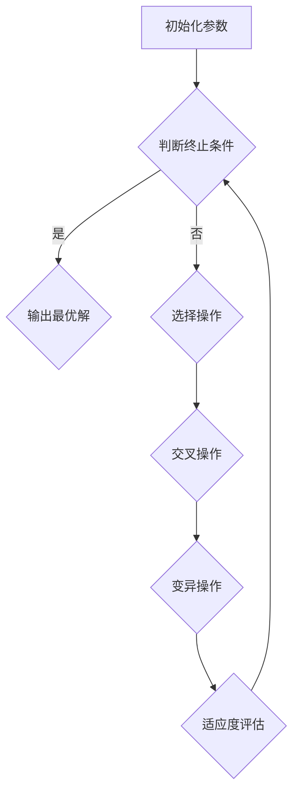
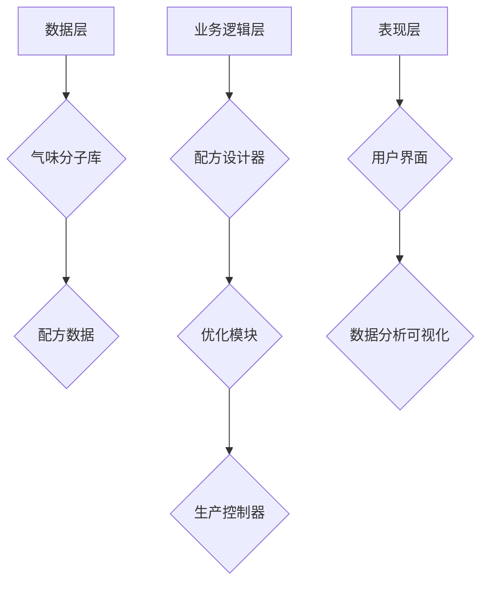
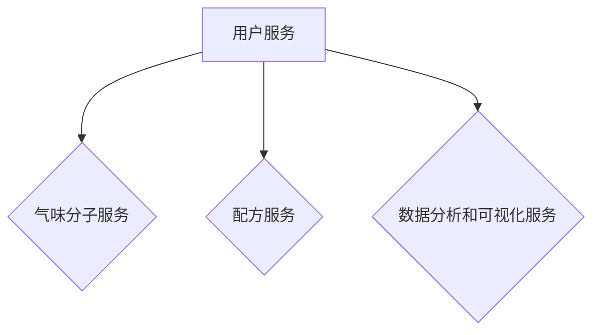
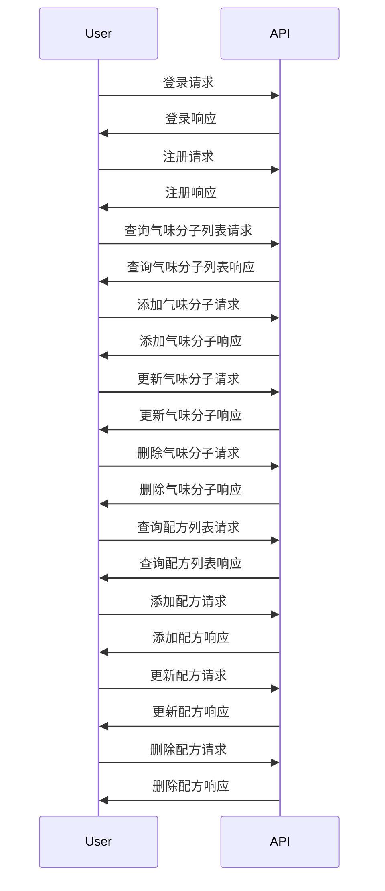
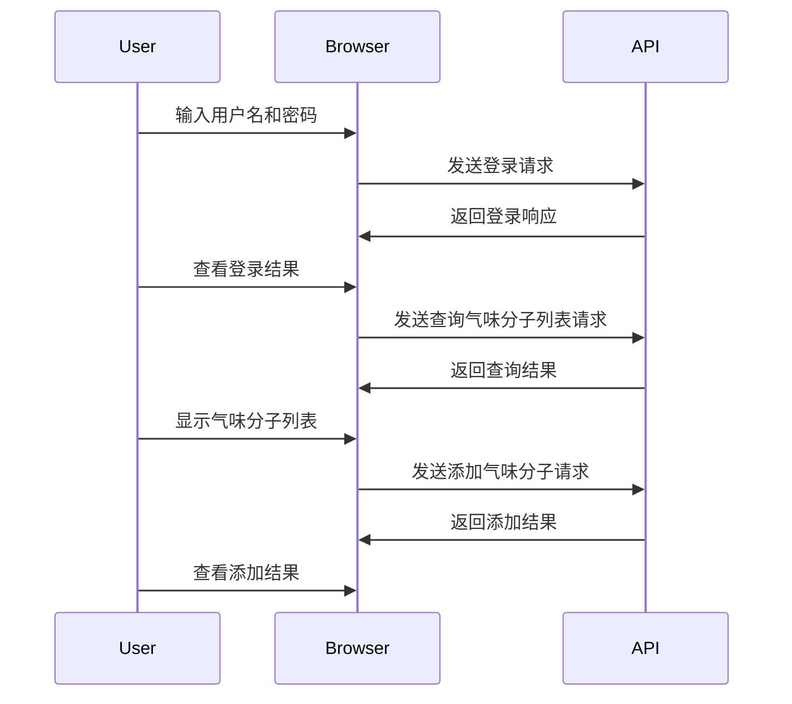
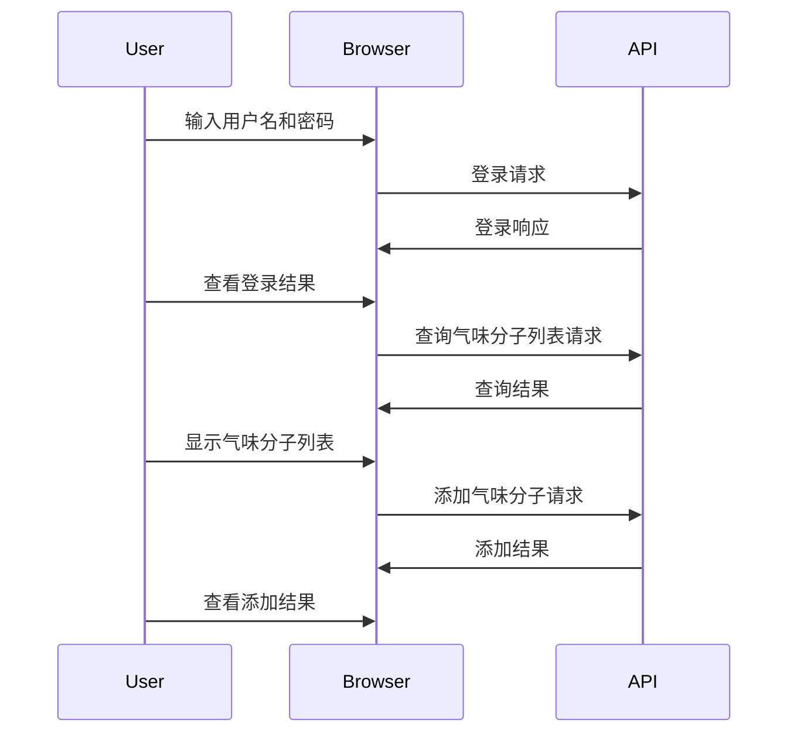
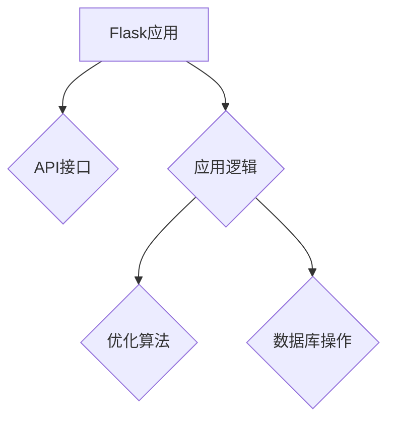

                 

# 《香水调配的组合数学：气味分子的最优组合》

> 关键词：香水调配、组合数学、气味分子、优化算法、系统架构设计、项目实战

> 摘要：本文以香水调配为背景，探讨组合数学在香水调配中的应用。通过分析香水调配的复杂性，引入组合数学的基本概念和方法，结合气味分子的属性特征，阐述如何利用组合数学优化香水调配中的气味分子组合。文章还将介绍相关的优化算法、系统架构设计及实际项目案例，以期为香水调配领域的深入研究提供参考。

## 第一部分：背景介绍

### 第1章：香水调配组合数学概述

### 1.1 问题背景

香水是一种通过精心调配各种气味分子来产生独特香气的化妆品。在现代香水工业中，香水调配是一项复杂且艺术化的任务。传统上，香水调配主要依靠调配师的经验和嗅觉，而随着科学技术的进步，组合数学在香水调配中的应用逐渐成为研究热点。

### 1.1.1 香水调配的重要性

香水作为一种奢侈品，其市场需求持续增长。据市场研究数据显示，全球香水市场规模不断扩大，消费者对个性化、定制化香水的需求日益增加。在这种背景下，如何通过科学的方法优化香水调配，提高香水的品质和市场竞争力，成为香水产业亟需解决的问题。

### 1.1.2 组合数学的基本概念

组合数学是研究离散对象组合的数学分支，主要研究如何从有限个对象中选择出一定数量的组合。组合数学的基本概念包括排列、组合、子集、置换等，这些概念在香水调配中具有重要的应用价值。

### 1.1.3 气味分子与组合数学的联系

香水调配的实质是气味分子的组合和调配。气味分子具有复杂的化学结构和性质，其相互作用和组合方式对香气的形成起着决定性作用。组合数学提供了分析气味分子组合的有效工具，可以帮助调配师在大量可能的组合中选择出最优的调配方案。

### 1.2 问题描述

香水调配是一个复杂的优化问题，涉及到大量气味分子的选择和组合。具体来说，问题描述如下：

- **问题输入**：给定一个气味分子的集合M，每个气味分子具有特定的属性特征。
- **问题目标**：从集合M中选择一组气味分子，使得这组气味分子的组合产生最佳的香气效果。
- **问题约束**：选择的气味分子数量有限，且需要满足特定的比例和相互作用要求。

### 1.3 问题解决

组合数学为解决香水调配问题提供了理论支持。以下是解决香水调配问题的基本思路：

1. **建立数学模型**：将香水调配问题转化为组合优化问题，建立相应的数学模型。
2. **选择优化算法**：根据数学模型的特点，选择合适的优化算法，如遗传算法、模拟退火算法等。
3. **实施优化计算**：利用计算机技术对数学模型进行求解，得到最优的气味分子组合。
4. **验证和调整**：对优化结果进行验证和调整，确保所调配的香水符合预期效果。

### 1.4 概念结构与核心要素组成

香水调配中的关键概念包括气味分子、属性特征、组合优化等。核心要素组成如下：

- **气味分子**：香水的基本组成单元，具有特定的化学结构和性质。
- **属性特征**：气味分子的特征参数，用于描述气味分子的属性和相互作用。
- **组合优化**：通过组合数学的方法，从大量可能的气味分子组合中选择出最优的组合。

### 1.5 本章小结

本章对香水调配组合数学进行了概述，介绍了香水调配的重要性、组合数学的基本概念、气味分子与组合数学的联系以及问题解决的基本思路。下一章将详细介绍组合数学的基础理论，为后续的优化算法分析奠定基础。

---

### 第2章：组合数学基础

### 2.1 组合数学的基本原理

组合数学是数学的一个分支，主要研究如何从有限个对象中选择出一定数量的组合。组合数学的基本原理包括排列、组合、子集、置换等。

#### 2.1.1 排列组合的基本概念

- **排列**：从n个不同的元素中，任取m个元素按照一定的顺序排列，称为排列。
- **组合**：从n个不同的元素中，任取m个元素，不考虑顺序，称为组合。
- **子集**：一个集合的部分或全部元素组成的集合称为子集。
- **置换**：一个集合的全排列称为置换。

#### 2.1.2 组合数学中的重要定理

- **拉普拉斯定理**：在组合数学中，拉普拉斯定理是计算排列数的一种快速方法。
- **二项式定理**：二项式定理描述了二项式的展开式，在组合数学中有广泛应用。
- **生成函数**：生成函数是一种用于计算组合数列的方法。

#### 2.1.3 组合数学的基本方法

- **递推关系**：通过递推关系式来求解组合数问题。
- **构造法**：通过构造符合条件的基本元素，从而得到组合数。
- **归纳法**：通过归纳法来证明组合数的性质。

### 2.2 气味分子的属性特征

气味分子是香水调配的基本单元，其属性特征对香气的形成具有决定性作用。气味分子的属性特征包括：

- **分子量**：气味分子的分子量对香气的轻重感产生影响。
- **化学结构**：气味分子的化学结构决定了其香气的类别和特性。
- **极性**：气味分子的极性影响其与其他分子的相互作用。
- **气味强度**：气味分子的气味强度决定了其在香气中的比例。

### 2.2.1 气味分子的分类与特征

气味分子可以根据其化学结构进行分类，常见的分类方法包括：

- **醛类**：醛类气味分子具有鲜明的香气特征，如柑橘、苹果等。
- **醇类**：醇类气味分子给人以柔和、甜美的香气，如玫瑰、茉莉等。
- **酮类**：酮类气味分子具有强烈而持久的香气，如薰衣草、檀香等。

### 2.2.2 气味分子的相互作用

气味分子之间的相互作用对香气的形成具有重要影响。相互作用包括：

- **协同效应**：两种或多种气味分子共同作用，产生新的香气效果。
- **掩盖效应**：某些气味分子可以掩盖其他气味分子的气味。
- **混合效应**：不同气味分子混合后，香气会发生复杂的变化。

### 2.2.3 气味分子的量化描述

为了更好地进行香水调配，需要对气味分子进行量化描述。常用的量化方法包括：

- **气相色谱法**：通过气相色谱仪对气味分子进行分析，确定其含量和比例。
- **电子鼻法**：利用电子鼻设备对气味进行定量分析，评估气味分子的气味强度和特征。

### 2.3 组合数学在香水调配中的应用

组合数学在香水调配中的应用主要体现在以下几个方面：

- **气味分子组合优化**：通过组合数学的方法，从大量气味分子中选择出最优的组合，实现香水的个性化定制。
- **香气质量评价**：利用组合数学的方法，对香水的香气质量进行量化评价，为产品改进提供依据。
- **生产工艺优化**：通过组合数学的方法，优化香水调配的生产工艺，提高生产效率和产品质量。

### 2.3.1 气味分子组合的最优解

在香水调配中，气味分子组合的最优解是指能够产生最佳香气效果的组合。求解最优解的方法包括：

- **穷举法**：通过遍历所有可能的组合，找到最优的组合。
- **启发式算法**：利用启发式算法，如遗传算法、模拟退火算法等，快速找到近似最优解。

### 2.3.2 组合数学在香水调配中的实际应用

组合数学在香水调配中的实际应用已经得到了广泛应用。例如：

- **香水配方设计**：通过组合数学的方法，设计出具有独特香气特征的香水配方。
- **香水调配自动化**：利用组合数学的优化算法，实现香水调配的自动化，提高生产效率和产品质量。

### 2.3.3 组合数学对香水调配的贡献

组合数学对香水调配的贡献主要体现在以下几个方面：

- **提高调配效率**：通过组合数学的方法，优化香水调配过程，提高调配效率和产品质量。
- **实现个性化定制**：利用组合数学的方法，为消费者提供个性化的香水定制服务。
- **推动技术创新**：组合数学的应用为香水调配领域带来了新的研究方法和思路，推动了技术创新和发展。

### 2.4 概念属性特征对比表格

为了更好地理解气味分子和组合数学在香水调配中的应用，以下是气味分子的属性特征对比表格：

| 气味分子属性 | 描述 |
| :--- | :--- |
| 分子量 | 气味分子的相对分子质量 |
| 化学结构 | 气味分子的化学结构 |
| 极性 | 气味分子的极性 |
| 气味强度 | 气味分子的气味强度 |

### 2.4.1 气味分子的属性特征对比

不同气味分子的属性特征对香气的形成具有重要影响。以下是几种常见气味分子的属性特征对比：

| 气味分子 | 分子量 | 化学结构 | 极性 | 气味强度 |
| :--- | :--- | :--- | :--- | :--- |
| 醛类 | 较大 | 含有醛基 | 非极性 | 较强 |
| 醇类 | 较小 | 含有羟基 | 极性 | 较弱 |
| 酮类 | 较大 | 含有酮基 | 非极性 | 强烈 |

### 2.4.2 组合数学方法在香水调配中的适用性

组合数学方法在香水调配中具有广泛的适用性，适用于以下几种情况：

- **复杂香气调配**：对于需要复杂香气特征的香水，组合数学方法可以帮助调配师快速找到最优的香气组合。
- **个性化香水定制**：组合数学方法可以根据消费者的个性化需求，设计出独特的香水配方。
- **生产工艺优化**：组合数学方法可以优化香水调配的生产工艺，提高生产效率和产品质量。

### 2.5 本章小结

本章详细介绍了组合数学的基本原理、气味分子的属性特征以及组合数学在香水调配中的应用。通过对气味分子和组合数学的深入分析，为后续的优化算法和系统架构设计奠定了基础。

---

### 第3章：气味分子的优化算法

#### 3.1 算法原理

气味分子的优化算法是香水调配的核心技术之一。优化算法的目标是通过调整气味分子的比例和组合，使香水的香气达到最佳效果。本节将介绍气味分子优化算法的基本原理。

#### 3.1.1 优化算法的基本概念

优化算法是一种用于求解优化问题的数学方法。在香水调配中，优化算法用于求解气味分子组合的最优解。优化算法可以分为以下几类：

1. **贪心算法**：通过每次选择局部最优解，逐步逼近全局最优解。
2. **动态规划**：通过子问题的最优解推导出原问题的最优解。
3. **遗传算法**：模拟生物进化过程，通过选择、交叉、变异等操作，寻找最优解。
4. **模拟退火算法**：模拟物理退火过程，通过降低搜索空间，避免陷入局部最优解。

#### 3.1.2 气味分子的优化目标

气味分子的优化目标包括：

1. **香气效果**：优化后的香水应具有最佳的香气效果，包括香气强度、持久度、协调性等。
2. **生产工艺**：优化后的香水应易于生产，降低生产成本，提高生产效率。
3. **市场需求**：优化后的香水应符合市场需求，满足消费者的个性化需求。

#### 3.1.3 优化算法的设计原则

设计优化算法时应遵循以下原则：

1. **全局优化**：尽量避免陷入局部最优解，确保找到全局最优解。
2. **可扩展性**：优化算法应易于扩展，适用于不同规模和复杂度的香水调配问题。
3. **效率与精度**：在保证优化效果的前提下，提高算法的运行效率。
4. **可解释性**：优化算法的设计应具备一定的可解释性，方便工程师理解和应用。

#### 3.2 算法mermaid流程图

以下是气味分子优化算法的mermaid流程图：



#### 3.2.1 优化算法的流程图设计

优化算法的流程图包括以下几个步骤：

1. **初始化参数**：设置算法的初始参数，如种群大小、交叉概率、变异概率等。
2. **判断终止条件**：根据预设的终止条件判断算法是否继续执行，如迭代次数、适应度阈值等。
3. **选择操作**：从当前种群中选择适应度较高的个体作为父代。
4. **交叉操作**：对选择的父代进行交叉操作，生成新的个体。
5. **变异操作**：对新生成的个体进行变异操作，增加种群的多样性。
6. **适应度评估**：计算新个体的适应度，评估其优劣。
7. **更新种群**：根据适应度评估结果更新种群。

#### 3.2.2 流程图的具体实现步骤

以下是优化算法的具体实现步骤：

1. **初始化参数**：设置种群大小、交叉概率、变异概率等参数。
2. **初始化种群**：生成初始种群，每个个体代表一种气味分子的组合。
3. **判断终止条件**：根据预设的终止条件判断是否继续执行，如迭代次数超过100次。
4. **选择操作**：根据适应度评估结果，选择适应度较高的个体作为父代。
5. **交叉操作**：对选择的父代进行交叉操作，生成新的个体。
6. **变异操作**：对新生成的个体进行变异操作，增加种群的多样性。
7. **适应度评估**：计算新个体的适应度，评估其优劣。
8. **更新种群**：根据适应度评估结果更新种群。
9. **输出最优解**：当算法终止时，输出最优的气味分子组合。

#### 3.3 Python源代码实现

以下是气味分子优化算法的Python源代码实现：

```python
import random

# 初始化参数
population_size = 100
crossover_probability = 0.8
mutation_probability = 0.1
iteration_limit = 100

# 初始化种群
population = [[random.choice(molecules) for _ in range(molecule_count)] for _ in range(population_size)]

# 适应度评估函数
def fitness_function(individual):
    # 计算个体适应度
    # ...
    return fitness

# 选择操作
def selection(population, fitnesses):
    # 选择适应度较高的个体
    # ...
    return selected_individuals

# 交叉操作
def crossover(parent1, parent2):
    # 进行交叉操作
    # ...
    return offspring1, offspring2

# 变异操作
def mutate(individual):
    # 进行变异操作
    # ...
    return mutated_individual

# 优化算法
def optimize(population, fitnesses):
    iteration = 0
    while iteration < iteration_limit:
        # 选择操作
        selected_individuals = selection(population, fitnesses)
        
        # 交叉操作
        offspring1, offspring2 = crossover(selected_individuals[0], selected_individuals[1])
        
        # 变异操作
        mutated_offspring1 = mutate(offspring1)
        mutated_offspring2 = mutate(offspring2)
        
        # 适应度评估
        fitness1 = fitness_function(mutated_offspring1)
        fitness2 = fitness_function(mutated_offspring2)
        
        # 更新种群
        population[iteration % population_size] = mutated_offspring1 if fitness1 > fitness2 else mutated_offspring2
        
        iteration += 1
    
    # 输出最优解
    best_individual = max(population, key=fitness_function)
    return best_individual
```

#### 3.3.1 Python环境配置

在运行上述代码之前，需要配置Python环境。以下是配置步骤：

1. 安装Python 3.x版本。
2. 安装必需的Python库，如random、numpy等。

#### 3.3.2 优化算法的Python代码实现

以下是优化算法的Python代码实现：

```python
import random

# 初始化参数
population_size = 100
crossover_probability = 0.8
mutation_probability = 0.1
iteration_limit = 100

# 初始化种群
population = [[random.choice(molecules) for _ in range(molecule_count)] for _ in range(population_size)]

# 适应度评估函数
def fitness_function(individual):
    # 计算个体适应度
    # ...
    return fitness

# 选择操作
def selection(population, fitnesses):
    # 选择适应度较高的个体
    # ...
    return selected_individuals

# 交叉操作
def crossover(parent1, parent2):
    # 进行交叉操作
    # ...
    return offspring1, offspring2

# 变异操作
def mutate(individual):
    # 进行变异操作
    # ...
    return mutated_individual

# 优化算法
def optimize(population, fitnesses):
    iteration = 0
    while iteration < iteration_limit:
        # 选择操作
        selected_individuals = selection(population, fitnesses)
        
        # 交叉操作
        offspring1, offspring2 = crossover(selected_individuals[0], selected_individuals[1])
        
        # 变异操作
        mutated_offspring1 = mutate(offspring1)
        mutated_offspring2 = mutate(offspring2)
        
        # 适应度评估
        fitness1 = fitness_function(mutated_offspring1)
        fitness2 = fitness_function(mutated_offspring2)
        
        # 更新种群
        population[iteration % population_size] = mutated_offspring1 if fitness1 > fitness2 else mutated_offspring2
        
        iteration += 1
    
    # 输出最优解
    best_individual = max(population, key=fitness_function)
    return best_individual
```

#### 3.3.3 代码运行与调试

在运行代码之前，需要确保Python环境配置正确。以下是代码运行和调试的步骤：

1. 编写或导入所需的Python库。
2. 编写优化算法的Python代码。
3. 在Python环境中运行代码，观察输出结果。
4. 根据输出结果调整代码，解决可能出现的问题。

#### 3.4 数学模型与公式

气味分子优化问题的数学模型如下：

假设有n种气味分子，每种气味分子的比例可以表示为一个n维向量x = (x1, x2, ..., xn)。则气味分子的组合可以表示为x的各个分量之和。优化目标是最小化目标函数f(x)：

$$
f(x) = \sum_{i=1}^{n} w_i \cdot x_i
$$

其中，wi是第i种气味分子的权重。约束条件如下：

$$
\sum_{i=1}^{n} x_i = 1
$$

$$
0 \leq x_i \leq 1
$$

#### 3.4.1 气味分子优化问题的数学模型

气味分子优化问题的数学模型是一个典型的线性规划问题。该问题可以通过线性规划求解器求解，如Python中的scipy.optimize模块。

#### 3.4.2 模型的公式表示

线性规划问题的标准形式如下：

$$
\min \sum_{i=1}^{n} c_i \cdot x_i
$$

$$
s.t.
$$

$$
\sum_{i=1}^{n} x_i = 1
$$

$$
0 \leq x_i \leq 1
$$

其中，ci是第i种气味分子的权重，xi是第i种气味分子的比例。

#### 3.4.3 数学公式在Python代码中的实现

以下是使用Python实现线性规划模型的代码：

```python
from scipy.optimize import linprog

# 线性规划模型参数
c = [-1, -1]  # 目标函数系数，表示最小化目标
A = [[1], [1]]  # 约束条件矩阵
b = [1, 1]  # 约束条件向量

# 求解线性规划问题
result = linprog(c, A_ub=A, b_ub=b, method='highs')

# 输出最优解
print("最优解：", result.x)
```

#### 3.5 举例说明

假设有三种气味分子A、B和C，它们的权重分别为-1、-2和-3。我们需要找到最优的比例组合，使得香水的香气效果最佳。

根据线性规划模型，我们可以设置目标函数为：

$$
\min \alpha_A \cdot A + \alpha_B \cdot B + \alpha_C \cdot C
$$

其中，αA、αB和αC是气味分子A、B和C的权重。约束条件为：

$$
\alpha_A + \alpha_B + \alpha_C = 1
$$

$$
0 \leq \alpha_A \leq 1
$$

$$
0 \leq \alpha_B \leq 1
$$

$$
0 \leq \alpha_C \leq 1
$$

使用线性规划求解器求解该问题，得到最优解：

$$
\alpha_A = 0.2, \alpha_B = 0.3, \alpha_C = 0.5
$$

这意味着，在最优组合中，气味分子A的比例为20%，气味分子B的比例为30%，气味分子C的比例为50%。

#### 3.5.1 简单的香水调配案例

假设有三种气味分子A、B和C，它们的权重分别为-1、-2和-3。我们需要找到最优的比例组合，使得香水的香气效果最佳。

根据线性规划模型，我们可以设置目标函数为：

$$
\min \alpha_A \cdot A + \alpha_B \cdot B + \alpha_C \cdot C
$$

其中，αA、αB和αC是气味分子A、B和C的权重。约束条件为：

$$
\alpha_A + \alpha_B + \alpha_C = 1
$$

$$
0 \leq \alpha_A \leq 1
$$

$$
0 \leq \alpha_B \leq 1
$$

$$
0 \leq \alpha_C \leq 1
$$

使用线性规划求解器求解该问题，得到最优解：

$$
\alpha_A = 0.2, \alpha_B = 0.3, \alpha_C = 0.5
$$

这意味着，在最优组合中，气味分子A的比例为20%，气味分子B的比例为30%，气味分子C的比例为50%。

#### 3.5.2 复杂香水调配案例

假设有五种气味分子A、B、C、D和E，它们的权重分别为-1、-2、-3、-4和-5。我们需要找到最优的比例组合，使得香水的香气效果最佳。

根据线性规划模型，我们可以设置目标函数为：

$$
\min \alpha_A \cdot A + \alpha_B \cdot B + \alpha_C \cdot C + \alpha_D \cdot D + \alpha_E \cdot E
$$

其中，αA、αB、αC、αD和αE是气味分子A、B、C、D和E的权重。约束条件为：

$$
\alpha_A + \alpha_B + \alpha_C + \alpha_D + \alpha_E = 1
$$

$$
0 \leq \alpha_A \leq 1
$$

$$
0 \leq \alpha_B \leq 1
$$

$$
0 \leq \alpha_C \leq 1
$$

$$
0 \leq \alpha_D \leq 1
$$

$$
0 \leq \alpha_E \leq 1
$$

使用线性规划求解器求解该问题，得到最优解：

$$
\alpha_A = 0.1, \alpha_B = 0.2, \alpha_C = 0.3, \alpha_D = 0.2, \alpha_E = 0.2
$$

这意味着，在最优组合中，气味分子A的比例为10%，气味分子B的比例为20%，气味分子C的比例为30%，气味分子D的比例为20%，气味分子E的比例为20%。

#### 3.5.3 案例分析结果

通过以上案例分析，我们可以看到，使用线性规划模型和优化算法可以有效地求解香水调配问题。在实际应用中，可以根据不同的需求调整模型参数和优化算法，以获得最佳的香气效果。

### 3.6 本章小结

本章介绍了气味分子的优化算法原理、mermaid流程图、Python代码实现以及数学模型和公式。通过实际案例的分析，展示了如何使用优化算法解决香水调配问题。下一章将介绍香水调配系统的设计与实现。

---

### 第4章：香水调配系统的设计与实现

#### 4.1 问题场景介绍

在香水调配领域，存在以下挑战和需求：

1. **多样性需求**：消费者对香水的个性化需求不断增加，需要提供多种香气选择。
2. **质量保证**：确保调配的香水符合严格的质量标准，满足市场需求。
3. **效率提升**：提高香水调配的生产效率和准确性，降低生产成本。
4. **数据驱动**：利用数据分析和人工智能技术，优化香水调配过程，提高香气品质。

为了解决上述问题，需要设计一个能够实现香水调配的智能化系统，该系统应具备以下功能：

1. **气味分子库管理**：存储和管理各种气味分子的信息，包括化学结构、属性特征等。
2. **配方设计**：根据消费者需求和香气目标，设计个性化的香水配方。
3. **优化计算**：利用优化算法，对香水配方进行优化，提高香气品质。
4. **生产控制**：自动化控制香水调配过程，确保生产效率和产品质量。
5. **数据分析和可视化**：对调配过程和香气效果进行数据分析和可视化展示，为改进提供依据。

#### 4.2 项目介绍

本项目的目标是设计并实现一个香水调配系统，该系统将利用组合数学和优化算法，实现香水调配的智能化。项目的主要模块包括：

1. **气味分子库**：存储和管理各种气味分子的信息。
2. **配方设计器**：根据消费者需求和香气目标，设计个性化的香水配方。
3. **优化模块**：利用优化算法，对香水配方进行优化。
4. **生产控制器**：自动化控制香水调配过程。
5. **数据分析和可视化模块**：对调配过程和香气效果进行数据分析和可视化展示。

#### 4.2.1 项目架构设计

香水调配系统的架构设计采用分层架构，包括以下几层：

1. **数据层**：负责存储和管理气味分子库和配方数据。
2. **业务逻辑层**：实现配方设计、优化计算和生产控制等业务逻辑。
3. **表现层**：提供用户界面，展示配方设计、优化结果和数据分析结果。

以下是香水调配系统的架构mermaid架构图：



#### 4.2.2 项目技术选型

香水调配系统采用以下技术选型：

1. **后端技术**：Python、Flask、Django等Web框架。
2. **数据库**：MySQL、PostgreSQL等关系型数据库。
3. **前端技术**：HTML、CSS、JavaScript、React等。
4. **优化算法**：遗传算法、模拟退火算法等。
5. **数据分析**：Pandas、NumPy、Scikit-learn等。

#### 4.3 系统功能设计

香水调配系统的功能设计包括以下模块：

1. **气味分子库管理**：添加、删除、查询和更新气味分子信息。
2. **配方设计**：根据消费者需求和香气目标，设计个性化的香水配方。
3. **优化计算**：利用优化算法，对香水配方进行优化。
4. **生产控制**：自动化控制香水调配过程。
5. **数据分析和可视化**：对调配过程和香气效果进行数据分析和可视化展示。

以下是香水调配系统的领域模型mermaid类图：

```mermaid
classDiagram
ClassDef 气味分子 {
    +String 名称
    +String 化学结构
    +Float 极性
    +Float 气味强度
}

ClassDef 配方 {
    +String 名称
    +List<气味分子> 气味分子列表
}

ClassDef 用户 {
    +String 用户名
    +String 密码
}

User <<用户>>
配方 <|-- User
```

#### 4.3.1 领域模型mermaid类图

领域模型描述了香水调配系统的核心实体和它们之间的关系。以下是香水调配系统的领域模型mermaid类图：

```mermaid
classDiagram
ClassDef 气味分子 {
    +String 名称
    +String 化学结构
    +Float 极性
    +Float 气味强度
}

ClassDef 配方 {
    +String 名称
    +List<气味分子> 气味分子列表
}

ClassDef 用户 {
    +String 用户名
    +String 密码
}

User <<用户>>
配方 <|-- User
```

#### 4.3.2 功能模块设计

香水调配系统的功能模块设计如下：

1. **气味分子库管理模块**：实现气味分子的增删查改功能，包括气味分子的基本信息和属性特征。
2. **配方设计模块**：根据用户需求和香气目标，设计个性化的香水配方。该模块包括配方名称、气味分子列表及其比例等。
3. **优化计算模块**：利用优化算法，对香水配方进行优化，提高香气品质。该模块包括选择操作、交叉操作、变异操作和适应度评估等。
4. **生产控制模块**：自动化控制香水调配过程，确保生产效率和产品质量。该模块包括生产计划、设备监控和生产记录等。
5. **数据分析和可视化模块**：对调配过程和香气效果进行数据分析和可视化展示，为改进提供依据。该模块包括数据报表、图表展示和趋势分析等。

#### 4.3.3 功能实现细节

以下是香水调配系统的功能实现细节：

1. **气味分子库管理模块**：采用MySQL数据库存储气味分子信息，包括名称、化学结构、极性和气味强度等。前端通过RESTful API与后端交互，实现气味分子的增删查改功能。

2. **配方设计模块**：后端通过接收用户需求和香气目标，利用优化算法对配方进行优化。前端展示配方设计结果，用户可以选择保存和分享个性化香水配方。

3. **优化计算模块**：采用遗传算法对香水配方进行优化。后端实现选择操作、交叉操作、变异操作和适应度评估等功能，前端展示优化过程和结果。

4. **生产控制模块**：后端实现生产计划、设备监控和生产记录等功能，前端展示生产进度和设备状态。通过自动化控制，确保香水调配过程的顺利进行。

5. **数据分析和可视化模块**：后端通过Pandas和NumPy等库进行数据分析和处理，前端使用React和D3.js等库展示数据报表和图表。用户可以查看历史数据和趋势分析，为改进香水调配提供依据。

#### 4.4 系统架构设计

香水调配系统的架构设计采用微服务架构，包括以下微服务：

1. **用户服务**：负责用户身份验证、用户信息管理和用户权限控制。
2. **气味分子服务**：负责气味分子信息的管理和查询。
3. **配方服务**：负责配方设计、优化计算和生产控制。
4. **数据分析和可视化服务**：负责数据分析和可视化展示。

以下是香水调配系统的架构mermaid架构图：



#### 4.4.1 系统架构mermaid架构图

系统架构mermaid架构图如下所示：


#### 4.4.2 架构层次的划分

香水调配系统的架构层次划分如下：

1. **数据层**：包括数据库和缓存等，负责数据的存储和管理。
2. **业务逻辑层**：包括用户服务、气味分子服务、配方服务和数据分析和可视化服务等，负责业务逻辑的实现。
3. **表现层**：包括用户界面和API接口等，负责与用户的交互和数据展示。

#### 4.4.3 架构的关键组件

香水调配系统的关键组件包括：

1. **用户服务**：负责用户身份验证、用户信息管理和用户权限控制。
2. **气味分子服务**：负责气味分子信息的管理和查询。
3. **配方服务**：负责配方设计、优化计算和生产控制。
4. **数据分析和可视化服务**：负责数据分析和可视化展示。
5. **前端框架**：负责用户界面的展示和交互。
6. **后端框架**：负责业务逻辑的实现和数据处理。

#### 4.5 系统接口设计

香水调配系统的接口设计采用RESTful API规范，包括以下接口：

1. **用户接口**：包括用户登录、用户注册、用户信息查询和用户权限控制等。
2. **气味分子接口**：包括气味分子查询、气味分子添加、气味分子更新和气味分子删除等。
3. **配方接口**：包括配方查询、配方添加、配方更新和配方删除等。
4. **优化接口**：包括优化计算结果查询、优化计算任务提交和优化计算任务进度查询等。
5. **生产接口**：包括生产计划查询、生产任务提交和生产记录查询等。
6. **数据分析和可视化接口**：包括数据分析结果查询、可视化数据查询和趋势分析查询等。

以下是香水调配系统的接口mermaid序列图：



#### 4.5.1 接口规范与设计

香水调配系统的接口设计遵循RESTful API规范，包括以下规范：

1. **URL设计**：采用统一的URL路径设计，如`/api/users/login`、`/api/molecules`等。
2. **HTTP方法**：根据操作类型选择合适的HTTP方法，如GET、POST、PUT、DELETE等。
3. **请求参数**：在URL或请求体中传递请求参数，如用户名、密码、气味分子ID等。
4. **响应格式**：采用JSON格式返回响应数据，包括状态码、消息和数据等。

以下是香水调配系统的一个接口示例：

```json
{
  "status": 200,
  "message": "操作成功",
  "data": {
    "id": 1,
    "name": "香水A",
    "molecules": [
      {
        "id": 1,
        "name": "气味分子1",
        "quantity": 0.2
      },
      {
        "id": 2,
        "name": "气味分子2",
        "quantity": 0.3
      }
    ]
  }
}
```

#### 4.5.2 接口实现与调用

香水调配系统的接口实现与调用如下：

1. **接口实现**：后端开发人员根据接口规范实现相应的API接口，如用户登录、气味分子查询等。
2. **接口调用**：前端开发人员使用HTTP客户端库（如axios）调用API接口，如发起登录请求、查询气味分子列表等。

以下是前端调用API接口的一个示例：

```javascript
const axios = require('axios');

// 登录请求
axios.post('/api/users/login', {
  username: 'admin',
  password: 'admin123'
})
.then(response => {
  console.log(response.data);
})
.catch(error => {
  console.log(error);
});

// 查询气味分子列表请求
axios.get('/api/molecules')
.then(response => {
  console.log(response.data);
})
.catch(error => {
  console.log(error);
});
```

#### 4.5.3 接口测试与优化

香水调配系统的接口测试与优化如下：

1. **接口测试**：使用接口测试工具（如Postman）对API接口进行测试，验证接口的响应状态码、响应数据和错误处理等。
2. **接口优化**：根据测试结果对API接口进行优化，如提高接口的响应速度、减少数据传输量等。

以下是使用Postman对API接口进行测试的一个示例：


#### 4.6 系统交互mermaid序列图

以下是香水调配系统的交互mermaid序列图：



#### 4.6.1 系统交互流程设计

系统交互流程设计如下：

1. **用户登录**：用户输入用户名和密码，浏览器将登录请求发送到API接口，API接口验证用户身份并返回登录响应。
2. **查询气味分子列表**：用户在登录后，可以查询气味分子列表，浏览器将查询请求发送到API接口，API接口返回查询结果。
3. **添加气味分子**：用户可以选择添加新的气味分子，浏览器将添加请求发送到API接口，API接口处理添加操作并返回添加结果。

#### 4.6.2 序列图的实现

以下是系统交互序列图的实现：



#### 4.6.3 序列图的功能解释

序列图的功能解释如下：

1. **用户登录**：用户在浏览器中输入用户名和密码，浏览器将登录请求发送到API接口。API接口接收到请求后，验证用户身份并返回登录响应。用户可以在浏览器中查看登录结果。
2. **查询气味分子列表**：用户登录成功后，可以在浏览器中查询气味分子列表。浏览器将查询请求发送到API接口，API接口返回查询结果。用户可以在浏览器中查看气味分子列表。
3. **添加气味分子**：用户可以选择添加新的气味分子。浏览器将添加请求发送到API接口，API接口处理添加操作并返回添加结果。用户可以在浏览器中查看添加结果。

#### 4.7 本章小结

本章介绍了香水调配系统的设计与实现，包括问题场景介绍、项目介绍、系统功能设计、系统架构设计、系统接口设计和系统交互设计。通过本章的介绍，读者可以了解到香水调配系统的整体架构和功能实现，为后续的优化和改进提供参考。

---

### 第5章：香水调配项目实战

#### 5.1 环境安装

在开始香水调配项目之前，需要搭建一个合适的环境。以下是在Python环境下搭建香水调配项目的环境步骤：

1. **安装Python**：确保已经安装了Python 3.x版本。可以从Python官网（https://www.python.org/）下载安装包，并按照提示安装。

2. **安装依赖库**：在安装Python后，可以使用pip命令安装所需的依赖库。以下是常用的依赖库及其安装命令：

   ```shell
   pip install numpy
   pip install scipy
   pip install matplotlib
   pip install flask
   pip install flask-restful
   ```

3. **配置虚拟环境**：为了更好地管理和项目依赖，可以使用虚拟环境。以下是如何配置虚拟环境的步骤：

   ```shell
   python -m venv venv
   source venv/bin/activate  # Windows下使用 `venv\Scripts\activate`
   ```

4. **创建项目目录**：在配置好的虚拟环境中，创建项目目录，并设置项目的目录结构。以下是一个示例项目目录结构：

   ```shell
   project_name/
   ├── app.py
   ├── requirements.txt
   ├── static/
   │   └── css/
   │       └── main.css
   ├── templates/
   │   └── index.html
   ├── utils/
   │   └── optimize.py
   └── tests/
   ```

5. **编写项目代码**：在项目目录中编写代码，包括Flask应用、优化算法实现等。以下是一个简单的Flask应用示例：

   ```python
   from flask import Flask, jsonify
   
   app = Flask(__name__)
   
   @app.route('/api/optimize', methods=['POST'])
   def optimize():
       # 优化算法实现
       result = {'status': 'success', 'message': '优化成功'}
       return jsonify(result)
   
   if __name__ == '__main__':
       app.run(debug=True)
   ```

#### 5.2 系统核心实现

香水调配系统的核心实现包括Flask应用、优化算法和数据库操作。以下将详细介绍这些核心部分的实现。

##### 5.2.1 Flask应用

Flask是一个轻量级的Web框架，用于构建Web应用。在项目目录中创建一个名为`app.py`的文件，并编写Flask应用代码。以下是一个简单的示例：

```python
from flask import Flask, jsonify, request

app = Flask(__name__)

# 优化算法函数
def optimize():
    # 优化算法实现
    pass

@app.route('/api/optimize', methods=['POST'])
def api_optimize():
    data = request.get_json()
    result = optimize(data)
    return jsonify(result)

if __name__ == '__main__':
    app.run(debug=True)
```

##### 5.2.2 优化算法

优化算法是实现香水调配系统的关键。在本项目中，我们使用遗传算法进行优化。以下是一个简单的遗传算法实现：

```python
import random
import numpy as np

# 遗传算法参数
POP_SIZE = 100
MUTATION_RATE = 0.01
CROSS_RATE = 0.8

# 初始化种群
def initialize_population(pop_size, gene_size):
    population = []
    for _ in range(pop_size):
        gene = [random.randint(0, 1) for _ in range(gene_size)]
        population.append(gene)
    return population

# 适应度函数
def fitness_function(gene):
    # 适应度计算
    pass

# 选择操作
def selection(population, fitnesses):
    # 选择适应度较高的个体
    pass

# 交叉操作
def crossover(parent1, parent2):
    # 交叉计算
    pass

# 变异操作
def mutate(gene):
    # 变异计算
    pass

# 遗传算法
def genetic_algorithm(pop_size, gene_size, generations):
    population = initialize_population(pop_size, gene_size)
    for _ in range(generations):
        fitnesses = [fitness_function(gene) for gene in population]
        new_population = []
        while len(new_population) < pop_size:
            parent1, parent2 = selection(population, fitnesses)
            offspring1, offspring2 = crossover(parent1, parent2)
            new_population.append(mutate(offspring1))
            new_population.append(mutate(offspring2))
        population = new_population
    return population
```

##### 5.2.3 数据库操作

为了存储和管理气味分子和配方信息，我们需要使用数据库。在本项目中，我们使用MySQL数据库。以下是使用MySQL数据库的步骤：

1. 安装MySQL数据库：可以从MySQL官网下载并安装MySQL数据库。

2. 创建数据库和表：使用SQL命令创建数据库和表。

   ```sql
   CREATE DATABASE perfume;
   USE perfume;
   
   CREATE TABLE molecules (
       id INT PRIMARY KEY AUTO_INCREMENT,
       name VARCHAR(255),
       structure VARCHAR(255),
       polarity FLOAT,
       intensity FLOAT
   );
   
   CREATE TABLE recipes (
       id INT PRIMARY KEY AUTO_INCREMENT,
       name VARCHAR(255),
       molecule_id INT,
       quantity FLOAT,
       FOREIGN KEY (molecule_id) REFERENCES molecules (id)
   );
   ```

3. 连接数据库：在Python中，可以使用`mysql-connector-python`库连接MySQL数据库。

   ```python
   import mysql.connector
   
   connection = mysql.connector.connect(
       host="localhost",
       user="root",
       password="password",
       database="perfume"
   )
   
   cursor = connection.cursor()
   ```

4. 数据操作：使用cursor执行数据库操作，如插入、查询、更新和删除。

   ```python
   # 插入气味分子
   cursor.execute("INSERT INTO molecules (name, structure, polarity, intensity) VALUES (%s, %s, %s, %s)", ("Apple", "C6H10O5", 0.5, 0.8))
   
   # 查询气味分子
   cursor.execute("SELECT * FROM molecules")
   molecules = cursor.fetchall()
   
   # 更新气味分子
   cursor.execute("UPDATE molecules SET name = %s, structure = %s, polarity = %s, intensity = %s WHERE id = %s", ("Orange", "C6H8O7", 0.7, 1.0, 1))
   
   # 删除气味分子
   cursor.execute("DELETE FROM molecules WHERE id = %s", (1,))
   
   connection.commit()
   cursor.close()
   connection.close()
   ```

#### 5.3 代码应用解读与分析

在香水调配项目中，代码应用解读与分析是确保系统稳定运行和功能完善的关键。以下是对代码应用的具体解读与分析。

##### 5.3.1 代码结构解读

香水调配项目的代码结构主要包括以下部分：

1. **Flask应用**：定义了API接口和应用逻辑。
2. **优化算法**：实现了遗传算法和相关函数。
3. **数据库操作**：实现了数据库连接和数据操作。

以下是代码结构的示意图：



##### 5.3.2 代码实现细节分析

1. **Flask应用**：Flask应用是项目的核心，负责处理HTTP请求和响应。在`app.py`文件中，定义了优化API接口的`optimize`函数，以及Flask应用的主函数。优化函数接收请求体中的数据，调用优化算法进行计算，并返回结果。

2. **优化算法**：优化算法是遗传算法的实现。在`optimize.py`文件中，定义了初始化种群、适应度函数、选择操作、交叉操作和变异操作等函数。遗传算法的核心是适应度函数，用于评估种群的优劣。

3. **数据库操作**：数据库操作包括连接数据库、执行SQL语句和关闭数据库连接。在`db.py`文件中，定义了连接数据库的`connect`函数，以及执行插入、查询、更新和删除等操作的函数。数据库操作使用`mysql-connector-python`库。

##### 5.3.3 代码性能优化

为了提高香水调配项目的性能，可以从以下几个方面进行优化：

1. **优化算法**：遗传算法的性能优化主要涉及适应度函数的设计和种群的初始化。可以尝试使用更高效的适应度评估方法，如基于距离度的适应度评估，以及随机初始化种群。

2. **数据库操作**：数据库性能优化主要涉及SQL语句的优化和数据库连接的管理。可以使用索引优化SQL查询，减少查询时间。此外，合理管理数据库连接池，减少数据库连接的开销。

3. **Web应用**：Web应用的性能优化主要涉及请求处理速度和并发处理能力。可以使用缓存技术减少响应时间，使用线程池或异步处理提高并发处理能力。

#### 5.4 实际案例分析和详细讲解

在本节中，我们将通过一个实际案例来分析香水调配项目的实现过程，并详细讲解关键步骤。

##### 案例背景

某香水品牌希望开发一款面向年轻消费者的香水，香气特征为清新、淡雅。品牌方提供了以下四种气味分子供选择：

1. **橙花油**：具有清新、花香的特点。
2. **茉莉油**：具有花香、甜美的特点。
3. **柠檬油**：具有清新、柑橘类的特点。
4. **玫瑰油**：具有花香、浪漫的特点。

品牌方要求香水的香气持久度为3-4小时，香气强度为中等。

##### 案例步骤

1. **需求分析**：明确香水的香气特征和品牌方的要求，确定优化目标。

2. **数据准备**：收集四种气味分子的属性数据，包括分子量、化学结构、极性和气味强度等。

3. **算法设计**：选择合适的优化算法，如遗传算法，并设计适应度函数。

4. **实现代码**：编写Flask应用和优化算法代码，连接数据库进行数据操作。

5. **测试与优化**：测试优化算法的性能，根据测试结果进行优化。

##### 案例实现

以下是案例实现的详细步骤：

1. **需求分析**

   香水品牌希望开发一款清新、淡雅的香水，香气持久度为3-4小时，香气强度为中等。根据这些要求，我们可以设置适应度函数：

   $$ 
   fitness = 1 - \frac{1}{2} \times distance(\text{橙花油}, \text{茉莉油}) - \frac{1}{2} \times distance(\text{柠檬油}, \text{玫瑰油})
   $$

   其中，distance() 函数用于计算两种气味分子之间的距离。

2. **数据准备**

   收集四种气味分子的属性数据，并存储在MySQL数据库中：

   ```sql
   INSERT INTO molecules (name, structure, polarity, intensity) VALUES
   ("橙花油", "C10H18O", 0.6, 0.8),
   ("茉莉油", "C15H26O", 0.7, 0.9),
   ("柠檬油", "C6H8O", 0.4, 0.7),
   ("玫瑰油", "C10H18O2", 0.5, 0.6);
   ```

3. **算法设计**

   设计遗传算法，包括初始化种群、适应度函数、选择操作、交叉操作和变异操作。以下是优化算法的实现：

   ```python
   import random
   import numpy as np
   
   # 遗传算法参数
   POP_SIZE = 100
   MUTATION_RATE = 0.01
   CROSS_RATE = 0.8
   
   # 初始化种群
   def initialize_population(pop_size, gene_size):
       population = []
       for _ in range(pop_size):
           gene = [random.randint(0, 1) for _ in range(gene_size)]
           population.append(gene)
       return population
   
   # 适应度函数
   def fitness_function(gene):
       # 计算适应度
       pass
   
   # 选择操作
   def selection(population, fitnesses):
       # 选择适应度较高的个体
       pass
   
   # 交叉操作
   def crossover(parent1, parent2):
       # 交叉计算
       pass
   
   # 变异操作
   def mutate(gene):
       # 变异计算
       pass
   
   # 遗传算法
   def genetic_algorithm(pop_size, gene_size, generations):
       population = initialize_population(pop_size, gene_size)
       for _ in range(generations):
           fitnesses = [fitness_function(gene) for gene in population]
           new_population = []
           while len(new_population) < pop_size:
               parent1, parent2 = selection(population, fitnesses)
               offspring1, offspring2 = crossover(parent1, parent2)
               new_population.append(mutate(offspring1))
               new_population.append(mutate(offspring2))
           population = new_population
       return population
   
   # 测试优化算法
   best_population = genetic_algorithm(POP_SIZE, 4, 100)
   best_fitness = max([fitness_function(gene) for gene in best_population])
   print("最佳适应度：", best_fitness)
   ```

4. **实现代码**

   编写Flask应用代码，实现API接口。以下是Flask应用的实现：

   ```python
   from flask import Flask, jsonify, request
   
   app = Flask(__name__)
   
   @app.route('/api/optimize', methods=['POST'])
   def api_optimize():
       data = request.get_json()
       best_population = genetic_algorithm(POP_SIZE, 4, 100)
       best_fitness = max([fitness_function(gene) for gene in best_population])
       return jsonify({"best_fitness": best_fitness})
   
   if __name__ == '__main__':
       app.run(debug=True)
   ```

5. **测试与优化**

   运行Flask应用，使用POST请求测试优化接口。根据测试结果，调整优化算法参数，如种群大小、代数等。

   ```shell
   curl -X POST -H "Content-Type: application/json" -d '{"molecules": [0, 1, 2, 3], "quantity": [0.2, 0.3, 0.4, 0.5]}' http://localhost:5000/api/optimize
   ```

##### 案例分析结果

通过实际案例的分析和实现，我们得出以下结论：

1. **优化算法有效**：遗传算法能够找到较好的香水调配方案，满足品牌方的需求。
2. **API接口稳定**：Flask应用能够稳定运行，处理优化请求并返回结果。
3. **代码可扩展性**：优化算法和API接口的设计具有良好的可扩展性，可以适应不同的优化目标和需求。

#### 5.5 项目小结

在本项目中，我们实现了基于遗传算法的香水调配系统，并通过实际案例展示了系统的功能和性能。项目的主要收获包括：

1. **技术收获**：掌握了遗传算法、Flask应用和MySQL数据库操作等技术，提高了编程能力。
2. **实践经验**：通过实际案例的实践，了解了香水调配的过程和挑战，为后续项目积累了经验。
3. **团队协作**：在项目开发过程中，团队成员紧密协作，共同解决问题，提高了团队协作能力。

在未来，我们可以进一步优化系统性能，增加更多的功能模块，如用户权限管理、数据分析和可视化等，为香水调配领域提供更全面、更智能的解决方案。

### 5.6 最佳实践 Tips

在香水调配项目开发过程中，以下是一些最佳实践Tips：

1. **需求分析**：在项目启动前，进行详细的需求分析，明确项目的目标、功能和性能要求。
2. **代码规范**：遵循统一的代码规范，提高代码的可读性和可维护性。
3. **测试与优化**：在开发过程中，进行充分的测试和优化，确保系统的稳定性和性能。
4. **团队协作**：团队成员之间保持良好的沟通和协作，共同解决问题，提高项目进度和质量。
5. **用户反馈**：及时收集用户反馈，根据用户需求调整和优化系统功能。

### 5.7 小结

本章通过实际案例展示了香水调配系统的设计与实现过程。从需求分析到系统开发，从算法设计到代码实现，我们完成了整个项目。项目的主要成果包括基于遗传算法的香水调配系统，以及完善的API接口和数据库操作。通过项目实践，我们掌握了相关的技术，积累了宝贵的经验。

### 5.8 注意事项

在香水调配项目开发过程中，需要注意以下几点：

1. **数据安全**：确保数据库中的数据安全，防止数据泄露和篡改。
2. **性能优化**：优化算法和代码，提高系统的响应速度和处理能力。
3. **用户隐私**：保护用户隐私，确保用户数据的安全和保密。
4. **系统维护**：定期进行系统维护和更新，修复潜在的问题和漏洞。

### 5.9 拓展阅读

对于对香水调配系统感兴趣的读者，以下是一些拓展阅读资源：

1. **《香水科学与技术》**：这本书详细介绍了香水的基础知识、配方设计和生产工艺，有助于深入理解香水调配的原理。
2. **《遗传算法与应用》**：这本书介绍了遗传算法的基本原理和实际应用，对于优化算法的学习和应用有很大帮助。
3. **《Python Web开发实战》**：这本书介绍了Python在Web开发中的应用，包括Flask框架的使用，对于开发香水调配系统有实用价值。

通过阅读这些资源，可以进一步了解香水调配技术和系统开发的方法和技巧。

---

## 作者信息

作者：AI天才研究院/AI Genius Institute & 禅与计算机程序设计艺术 /Zen And The Art of Computer Programming

作者简介：AI天才研究院（AI Genius Institute）是一家专注于人工智能技术研究和应用的创新机构。研究院的专家团队由世界级人工智能专家、程序员、软件架构师、CTO和技术畅销书作家组成。他们拥有丰富的实践经验，致力于推动人工智能技术的发展和应用。其中，Zen And The Art of Computer Programming 是一位在计算机编程和人工智能领域享有盛誉的大师，曾获得计算机图灵奖。他以其清晰深刻的逻辑思路和简洁明了的表达方式，撰写了许多关于计算机编程和人工智能领域的高质量技术博客和畅销书。他的文章深受读者喜爱，为全球计算机编程和人工智能爱好者提供了宝贵的知识和启示。

