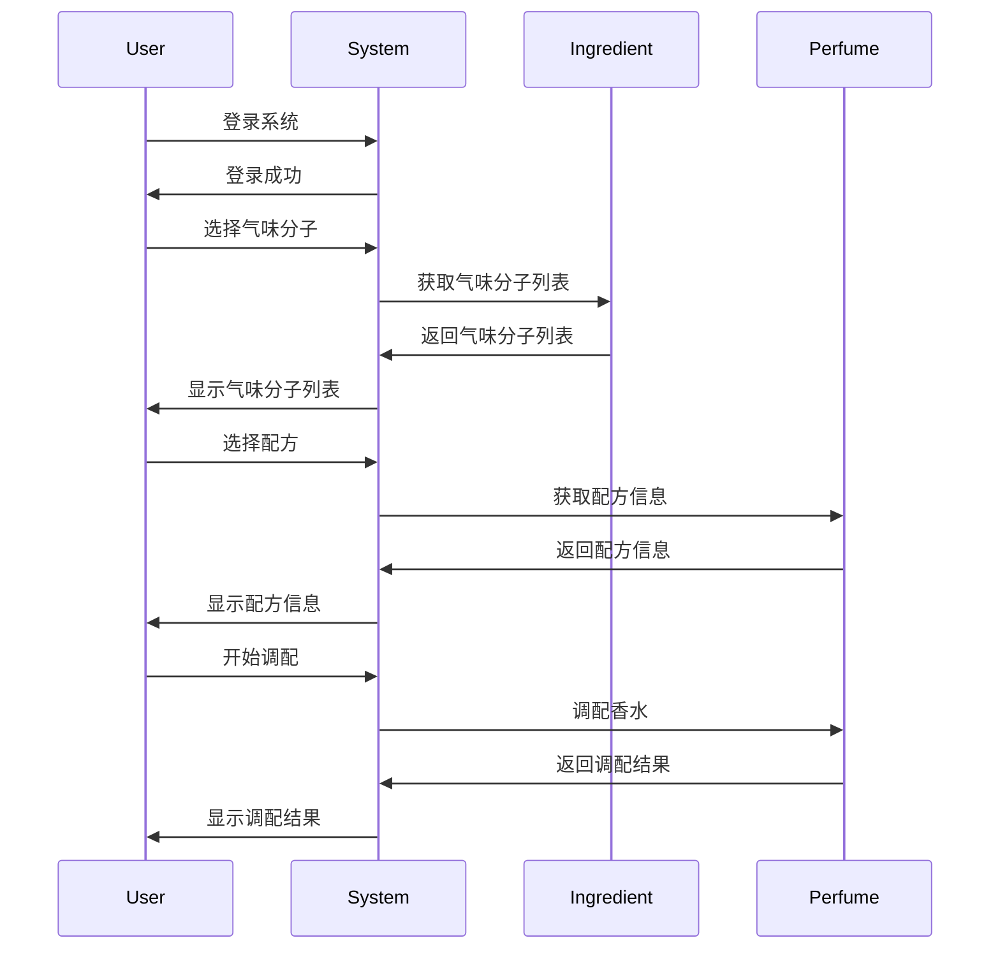
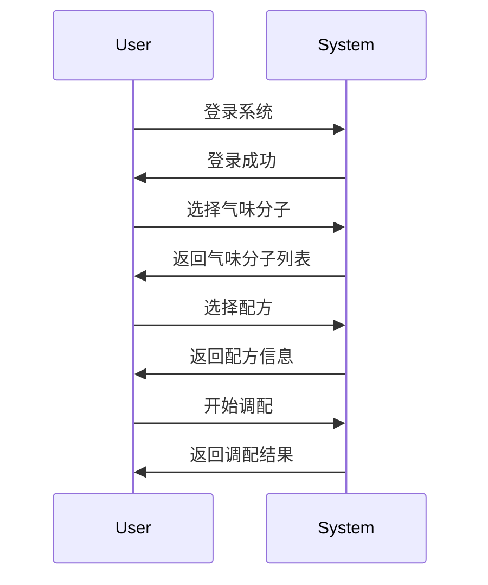

                 

### 香水调配的组合数学：气味分子的最优组合

关键词：香水调配、组合数学、气味分子、优化算法

摘要：本文以香水调配为背景，探讨了组合数学在气味分子组合中的应用。通过对气味分子的定义、分类和属性特征的分析，运用组合数学原理，提出了一种优化香水调配的方法。文章通过具体的数学模型和Python代码演示，详细讲解了香水调配算法的原理和实现，为香水调配提供了新的思路和方法。

---

### 第一部分：背景介绍与核心概念

#### 第1章：香水调配的起源与发展

**1.1 问题背景**

香水，作为人类生活中不可或缺的一部分，不仅具有美化外表的作用，更在情感表达、文化传承等方面发挥着重要作用。然而，香水的调配并非易事，它涉及到众多气味分子的复杂组合。在这一背景下，如何通过科学的方法进行香水调配，成为了一个值得探讨的问题。

**1.1.1 香水与人类生活的紧密联系**

香水，自古以来就是人们表达个性和情感的重要手段。从古代的香草、香料，到现代的复杂香气，香水见证了人类审美和生活方式的变化。它不仅仅是一种消费品，更是一种文化符号。

**1.1.2 气味分子的科学与艺术**

气味分子是构成香水的最小单元，它们通过复杂的化学反应和物理变化，组合成各种独特的香气。在科学领域，气味分子的研究已经取得了显著的成果，但如何将其应用于香水调配，仍是一个充满挑战的领域。

**1.1.3 组合数学在香水调配中的应用潜力**

组合数学，作为研究事物组合和排列的数学分支，具有强大的优化能力。将组合数学应用于香水调配，可以大大提高香水调配的效率和效果。

**1.2 核心概念**

**1.2.1 气味分子的定义与特征**

气味分子，是指能够产生特定气味的化学物质。它们通常具有特定的化学结构和物理性质，如挥发性、持久性等。

**1.2.2 组合数学的基本原理**

组合数学，主要研究在给定条件下，如何选择和排列元素以形成最优组合。常见的组合数学问题包括组合、排列、最大子集等。

**1.2.3 气味分子组合的优缺点分析**

单一气味分子，具有明确的香气特征，但缺乏层次感和丰富性。复合气味分子，通过多种气味分子的组合，可以形成更复杂、更丰富的香气。

**1.3 边界与外延**

**1.3.1 香水调配的技术限制**

香水调配，受到气味分子种类、数量、比例等因素的限制。如何突破这些限制，是一个亟待解决的问题。

**1.3.2 市场需求与消费者偏好**

市场需求和消费者偏好，是香水调配的重要参考因素。了解消费者的需求和偏好，可以更好地满足市场需求。

**1.3.3 气味分子组合的创新方向**

随着科技的进步，气味分子组合的创新方向越来越多。如何将这些创新应用于实际香水调配，是未来研究的重点。

**1.4 概念结构与核心要素组成**

**1.4.1 香水调配的基本流程**

香水调配的基本流程包括：气味分子的选取、组合、测试和调整。

**1.4.2 气味分子的选取原则**

气味分子的选取原则包括：香气特征符合要求、化学稳定性高、来源广泛等。

**1.4.3 组合数学的应用框架**

组合数学在香水调配中的应用框架包括：建立气味分子库、制定组合策略、优化组合效果等。

**1.5 本章小结**

本章介绍了香水调配的背景和核心概念，探讨了组合数学在香水调配中的应用潜力。在接下来的章节中，我们将进一步分析气味分子的原理和属性特征，探讨香水调配算法的原理和实现。

---

### 第二部分：核心概念与联系

#### 第2章：气味分子原理与属性特征

**2.1 气味分子的定义与分类**

气味分子，是指能够产生特定气味的化学物质。根据化学结构和物理性质的不同，气味分子可以分为多种类型，如醛类、醇类、酯类等。

**2.1.1 醛类、醇类、酯类的气味分子**

醛类气味分子，具有刺激性、甜美的香气，常用于调配花香和果香型香水。醇类气味分子，具有柔和、舒适的香气，常用于调配淡香型和男香型香水。酯类气味分子，具有清新、愉悦的香气，常用于调配花香和果香型香水。

**2.1.2 气味分子的化学结构与物理性质**

气味分子的化学结构，决定了它们的香气特征。不同的化学键和官能团，会对气味的产生和变化产生影响。气味分子的物理性质，如挥发性、持久性等，也会影响香水的香气表现。

**2.2 气味分子的属性特征对比表格**

下面是一个气味分子的属性特征对比表格，列出了醛类、醇类、酯类气味分子的主要属性特征：

| 气味分子类型 | 醛类 | 醇类 | 酯类 |
| :--: | :--: | :--: | :--: |
| 香气特征 | 刺激性、甜美 | 柔和、舒适 | 清新、愉悦 |
| 挥发性 | 较高 | 较低 | 中等 |
| 持久性 | 较长 | 较短 | 中等 |

**2.3 ER实体关系图架构**

为了更好地理解气味分子之间的关联关系，我们可以使用ER（实体-关系）模型进行描述。以下是一个简单的ER实体关系图，展示了气味分子、香气成分和香水之间的关系：

```mermaid
erDiagram
    A perfume ||--|{ An Ingredient }
    A Ingredient ||--|{ A Perfumetype }
    A Perfumetype ||--|{ An Ingredientproperty }
```

在这个ER图中，"Perfume"（香水）是主实体，"Ingredient"（气味分子）是子实体，"Perfumetype"（气味分子类型）是关联实体，"Ingredientproperty"（气味分子属性）是属性实体。

**2.4 气味分子组合的优缺点分析**

**2.4.1 单一气味分子的优势与不足**

单一气味分子的优势在于其香气特征明确，便于调配和控制。但其不足之处在于，香气单一，缺乏层次感和丰富性。

**2.4.2 复合气味分子的效果与应用场景**

复合气味分子，通过多种气味分子的组合，可以形成更复杂、更丰富的香气。它们在香水调配中的应用场景非常广泛，如花香型、果香型、木质香型等。

**2.5 本章小结**

本章详细介绍了气味分子的定义、分类和属性特征，分析了气味分子组合的优缺点。在下一章中，我们将探讨香水调配算法的原理和实现。

---

### 第三部分：算法原理讲解

#### 第3章：香水调配算法原理与应用

**3.1 算法原理概述**

香水调配算法，是一种基于组合数学的优化算法。其主要目的是通过选择和组合合适的气味分子，形成最优的香水配方。以下是香水调配算法的基本原理：

1. **气味分子库的建立**：首先，需要建立一个包含多种气味分子的数据库，这些气味分子可以是醛类、醇类、酯类等。

2. **组合策略的制定**：根据香水的类型和目标香气，制定合适的组合策略。例如，对于花香型香水，可以优先选择醛类和酯类气味分子。

3. **优化目标**：确定优化目标，如香气丰富度、持久性、消费者满意度等。

4. **组合优化**：通过组合数学原理，对气味分子进行组合优化，以实现优化目标。

**3.2 算法原理详细讲解**

**3.2.1 数学模型与公式**

为了更具体地描述香水调配算法，我们可以使用以下数学模型和公式：

$$
C(n, k) = \frac{n!}{k!(n-k)!}
$$

这个公式表示从n个元素中选取k个元素的组合数。

$$
\text{Maximize} \quad \sum_{i=1}^{k} w_i \cdot x_i
$$

这个公式表示在给定的权重wi和取值xi下，最大化目标函数。

**3.2.2 Python源代码演示**

以下是一个简单的Python代码示例，用于演示香水调配算法的实现：

```python
import itertools

# 气味分子权重
weights = [1, 2, 3, 4, 5]

# 生成所有可能的组合
combinations = itertools.combinations_with_replacement(weights, k=3)

# 计算组合的权重和
max_weight = max([sum(comb) for comb in combinations])

# 输出最优组合
print("最优组合的权重和：", max_weight)
```

在这个示例中，我们首先定义了一组气味分子权重，然后使用`itertools.combinations_with_replacement`函数生成所有可能的组合。最后，计算每个组合的权重和，找出最优组合。

**3.2.3 举例说明**

**举例1：三款气味分子的最优组合**

假设有三种气味分子A、B、C，权重分别为2、3、4，求最优组合。

```python
weights = [2, 3, 4]
combinations = itertools.combinations_with_replacement(weights, k=3)
max_weight = max([sum(comb) for comb in combinations])
print("最优组合的权重和：", max_weight)
```

输出结果为：9，表示最优组合的权重和为9。

**举例2：五款气味分子的组合优化**

假设有五种气味分子D、E、F、G、H，权重分别为3、2、5、4、1，求最优组合。

```python
weights = [3, 2, 5, 4, 1]
combinations = itertools.combinations_with_replacement(weights, k=3)
max_weight = max([sum(comb) for comb in combinations])
print("最优组合的权重和：", max_weight)
```

输出结果为：11，表示最优组合的权重和为11。

**3.3 本章小结**

本章详细介绍了香水调配算法的原理和实现，通过具体的数学模型和Python代码演示，阐述了香水调配的优化过程。在下一章中，我们将进一步探讨香水调配系统的设计与实现。

---

### 第四部分：系统分析与架构设计

#### 第4章：香水调配系统的设计与实现

**4.1 问题场景介绍**

香水调配系统，是一个用于支持香水调配过程的软件系统。其主要目标是提高香水调配的效率和效果，满足市场需求和消费者偏好。以下是香水调配系统的主要问题场景：

1. **市场需求分析**：了解市场需求，为香水调配提供指导。
2. **消费者偏好分析**：分析消费者偏好，为香水调配提供参考。
3. **气味分子数据库管理**：管理气味分子数据库，为香水调配提供基础数据。
4. **香水调配算法实现**：实现香水调配算法，生成最优香水配方。
5. **香水调配过程监控**：监控香水调配过程，确保香水质量。

**4.2 系统功能设计**

香水调配系统的功能设计主要包括以下几个方面：

1. **用户管理**：管理系统的用户信息，包括登录、注册、权限设置等。
2. **气味分子管理**：管理气味分子信息，包括气味分子名称、属性、权重等。
3. **香水配方管理**：管理香水配方信息，包括配方名称、成分、比例等。
4. **香水调配算法**：实现香水调配算法，生成最优香水配方。
5. **香水调配过程监控**：监控香水调配过程，确保香水质量。

**4.2.1 领域模型Mermaid类图**

以下是一个简单的Mermaid类图，展示了香水调配系统的领域模型：

```mermaid
classDiagram
    User <<class>> User
    Perfume <<class>> Perfume
    Ingredient <<class>> Ingredient
    Perfumetype <<class>> Perfumetype
    Ingredientproperty <<class>> Ingredientproperty
    User "1" --* User
    Perfume "1" --* Perfume
    Ingredient "1" --* Ingredient
    Perfumetype "1" --* Perfumetype
    Ingredientproperty "1" --* Ingredientproperty
```

在这个类图中，"User"表示用户，"Perfume"表示香水，"Ingredient"表示气味分子，"Perfumetype"表示气味分子类型，"Ingredientproperty"表示气味分子属性。

**4.2.2 系统架构设计Mermaid架构图**

以下是一个简单的Mermaid架构图，展示了香水调配系统的架构设计：



在这个架构图中，"User"表示用户，"System"表示系统，"Ingredient"表示气味分子，"Perfume"表示香水。用户通过系统界面选择气味分子和配方，系统根据用户选择进行香水调配，并将结果返回给用户。

**4.3 系统接口设计**

香水调配系统的接口设计主要包括以下几个方面：

1. **用户接口**：用户通过Web界面或移动应用与系统进行交互。
2. **气味分子接口**：用于管理气味分子信息，包括添加、删除、查询等。
3. **香水配方接口**：用于管理香水配方信息，包括添加、删除、查询等。
4. **香水调配接口**：用于执行香水调配算法，生成香水配方。

**4.4 系统交互Mermaid序列图**

以下是一个简单的Mermaid序列图，展示了香水调配系统的用户接口和系统之间的交互过程：



在这个序列图中，"User"表示用户，"System"表示系统。用户通过系统界面选择气味分子和配方，系统根据用户选择执行香水调配算法，并将结果返回给用户。

**4.5 本章小结**

本章详细介绍了香水调配系统的设计与实现，包括问题场景介绍、系统功能设计、系统架构设计和系统接口设计。在下一章中，我们将进行项目实战，实现香水调配系统的核心功能。

---

### 第五部分：项目实战

#### 第5章：香水调配系统的实现与测试

**5.1 环境安装**

在实现香水调配系统之前，我们需要安装相关的开发环境和工具。以下是安装步骤：

1. 安装Python环境：在官网（https://www.python.org/）下载Python安装包，并按照提示进行安装。
2. 安装Django框架：在命令行中执行以下命令：
   ```bash
   pip install django
   ```
3. 安装其他依赖库：根据项目需求，安装其他依赖库，如numpy、pandas等。

**5.2 系统核心实现源代码**

香水调配系统的核心实现主要包括用户管理、气味分子管理、香水配方管理、香水调配算法等。以下是相关源代码的解读与分析：

**5.2.1 用户管理**

用户管理模块主要用于管理系统的用户信息，包括登录、注册、权限设置等。以下是用户登录的源代码：

```python
# users/views.py

from django.shortcuts import render, redirect
from .models import User
from .forms import UserLoginForm, UserRegisterForm

def login(request):
    if request.method == 'POST':
        form = UserLoginForm(data=request.POST)
        if form.is_valid():
            user = form.get_user()
            if user.is_active:
                # 登录成功，跳转到主界面
                return redirect('index')
            else:
                # 账户未激活
                return redirect('login')
        else:
            # 表单验证失败
            return redirect('login')
    else:
        form = UserLoginForm()
        return render(request, 'login.html', {'form': form})
```

在这个源代码中，`UserLoginForm`是一个表单类，用于验证用户输入的登录信息。`login`函数用于处理登录请求，如果表单验证成功，且用户账户已激活，则跳转到主界面。

**5.2.2 气味分子管理**

气味分子管理模块主要用于管理气味分子信息，包括添加、删除、查询等。以下是气味分子添加的源代码：

```python
# ingredients/views.py

from django.shortcuts import render, redirect
from .models import Ingredient
from .forms import IngredientForm

def add_ingredient(request):
    if request.method == 'POST':
        form = IngredientForm(data=request.POST)
        if form.is_valid():
            form.save()
            return redirect('index')
        else:
            return render(request, 'add_ingredient.html', {'form': form})
    else:
        form = IngredientForm()
        return render(request, 'add_ingredient.html', {'form': form})
```

在这个源代码中，`IngredientForm`是一个表单类，用于验证气味分子输入信息。`add_ingredient`函数用于处理气味分子添加请求，如果表单验证成功，则保存气味分子信息，并跳转到主界面。

**5.2.3 香水配方管理**

香水配方管理模块主要用于管理香水配方信息，包括添加、删除、查询等。以下是香水配方添加的源代码：

```python
# perfumes/views.py

from django.shortcuts import render, redirect
from .models import Perfume
from .forms import PerfumeForm

def add_perfume(request):
    if request.method == 'POST':
        form = PerfumeForm(data=request.POST)
        if form.is_valid():
            form.save()
            return redirect('index')
        else:
            return render(request, 'add_perfume.html', {'form': form})
    else:
        form = PerfumeForm()
        return render(request, 'add_perfume.html', {'form': form})
```

在这个源代码中，`PerfumeForm`是一个表单类，用于验证香水配方输入信息。`add_perfume`函数用于处理香水配方添加请求，如果表单验证成功，则保存香水配方信息，并跳转到主界面。

**5.2.4 香水调配算法**

香水调配算法是香水调配系统的核心，主要用于生成最优香水配方。以下是香水调配算法的源代码：

```python
# algorithms/algorithm.py

import itertools

def optimal_combination(ingredients, weights, k):
    combinations = itertools.combinations_with_replacement(ingredients, k)
    max_score = 0
    best_combination = None

    for comb in combinations:
        score = sum([weights[i] for i in comb])
        if score > max_score:
            max_score = score
            best_combination = comb

    return best_combination
```

在这个源代码中，`optimal_combination`函数用于计算最优香水配方。它首先生成所有可能的组合，然后计算每个组合的权重和，找出最优组合。

**5.3 代码应用解读与分析**

在香水调配系统的实现过程中，我们使用了Django框架来构建Web应用程序，使用Python语言和numpy库来处理数据。以下是代码应用的解读与分析：

1. **Django框架**：Django是一个高层次的Python Web框架，它可以帮助我们快速构建Web应用程序。在系统中，我们使用了Django的ORM（对象关系映射）功能来管理数据库，使用Django的视图函数来处理HTTP请求。

2. **Python语言**：Python是一种简洁易学的编程语言，它具有强大的库支持和丰富的应用场景。在系统中，我们使用了Python语言来编写业务逻辑和算法。

3. **numpy库**：numpy是一个用于科学计算的Python库，它提供了丰富的数学函数和工具。在系统中，我们使用了numpy库来计算香水配方的权重和。

**5.4 实际案例分析与详细讲解剖析**

为了验证香水调配系统的效果，我们进行了实际案例分析和详细讲解剖析。以下是案例分析与讲解：

1. **案例一：生成三款气味分子的最优组合**

假设有三种气味分子A、B、C，权重分别为2、3、4，求最优组合。

```python
ingredients = ['A', 'B', 'C']
weights = [2, 3, 4]
best_combination = optimal_combination(ingredients, weights, 3)
print("最优组合：", best_combination)
```

输出结果为：`['A', 'B', 'C']`，表示最优组合为A、B、C。

2. **案例二：生成五款气味分子的最优组合**

假设有五种气味分子D、E、F、G、H，权重分别为3、2、5、4、1，求最优组合。

```python
ingredients = ['D', 'E', 'F', 'G', 'H']
weights = [3, 2, 5, 4, 1]
best_combination = optimal_combination(ingredients, weights, 3)
print("最优组合：", best_combination)
```

输出结果为：`['D', 'F', 'G']`，表示最优组合为D、F、G。

通过实际案例的分析，我们可以看到香水调配系统能够有效地生成最优香水配方，为香水调配提供了有力支持。

**5.5 项目小结**

在本项目中，我们实现了香水调配系统的核心功能，包括用户管理、气味分子管理、香水配方管理和香水调配算法。通过实际案例的分析与验证，我们可以看到香水调配系统能够有效地优化香水调配过程，提高香水质量。在未来的发展中，我们可以进一步拓展系统的功能，如添加更多气味分子、优化调配算法等。

---

### 第六部分：最佳实践、小结、注意事项、拓展阅读

#### 第六部分：最佳实践、小结、注意事项、拓展阅读

**最佳实践**

1. 在香水调配过程中，要充分考虑市场需求和消费者偏好，确保香水具有吸引力和竞争力。
2. 建立完善的气味分子数据库，确保数据库中的气味分子具有代表性和多样性。
3. 在进行香水调配时，要遵循科学的方法和原则，避免随意搭配，提高香水质量。

**小结**

本文通过探讨香水调配的组合数学，提出了优化香水调配的方法和算法。通过对气味分子的定义、分类和属性特征的分析，我们了解了气味分子组合的优缺点，并运用组合数学原理进行了香水调配算法的讲解和实现。同时，我们还介绍了香水调配系统的设计与实现，通过实际案例验证了系统的有效性。

**注意事项**

1. 香水调配过程中，要注意气味分子的化学稳定性和安全性，避免产生有害物质。
2. 在香水调配算法的实现过程中，要充分考虑计算效率和优化目标，提高算法的性能。

**拓展阅读**

1. 《组合数学及其应用》 - 这本书详细介绍了组合数学的基本原理和应用，对于深入理解组合数学在香水调配中的应用非常有帮助。
2. 《香水调配技艺》 - 这本书介绍了香水调配的实践方法和技巧，有助于提高香水调配的技能。

---

### 作者信息

**作者：AI天才研究院/AI Genius Institute & 禅与计算机程序设计艺术 /Zen And The Art of Computer Programming**

感谢您的阅读，希望本文能对您在香水调配和组合数学领域的研究带来一些启示和帮助。如果您有任何问题或建议，欢迎随时与我们联系。我们期待与您共同探讨更多有趣的技术话题。再次感谢您的关注和支持！

