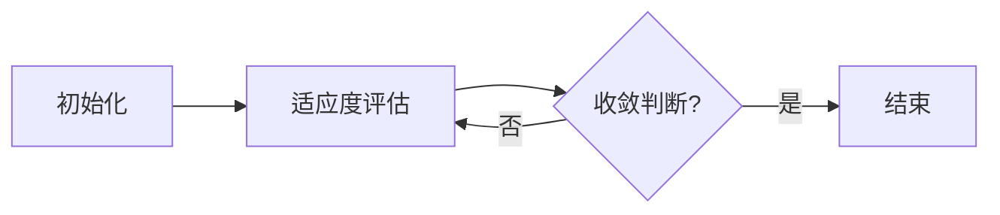
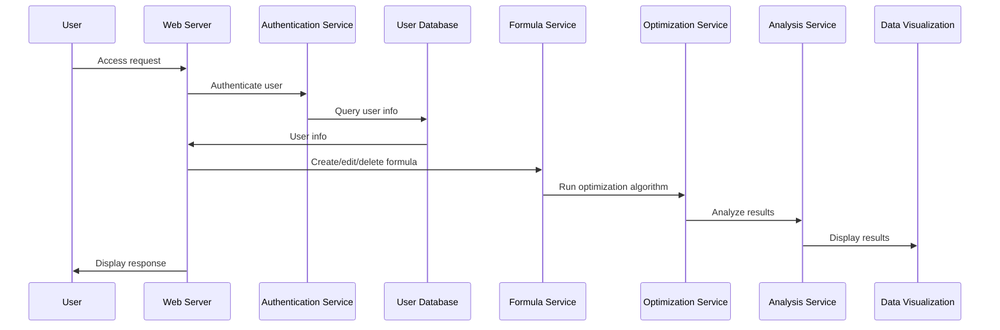
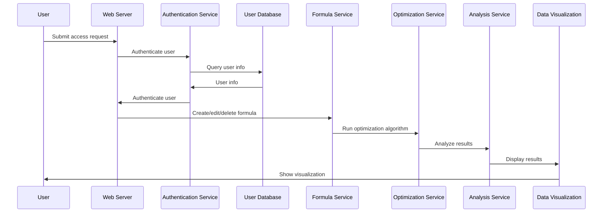

                 

## 香水配方的高维优化：气味分子的数学组合

### 关键词：香水配方、高维优化、气味分子、数学模型、算法原理、系统架构、项目实战

### 摘要：
本文将深入探讨香水配方的高维优化，通过引入数学模型和优化算法，分析气味分子的组合与调配过程。我们将逐步解读这一领域的核心概念，讲解优化算法的原理与实现，展示一个系统的架构设计，并通过实际项目案例，阐述香水配方优化的应用和实践。本文旨在为读者提供一个全面、详细的技术指南，帮助理解高维优化在香水配方领域的应用潜力。

----------------------------------------------------------------

## 第一部分：香水配方优化的背景与核心概念

### 第1章：香水配方优化的背景

香水作为一种高度个性化的产品，其配方优化一直是香水工业关注的焦点。在传统方法中，香水的配方优化通常依赖于经验丰富的调香师，通过不断的尝试和调整来获得理想的香气效果。然而，随着科技的发展，特别是人工智能和大数据技术的进步，香水配方优化迎来了新的机遇。

### 1.1 香水配方优化的需求

现代消费者对香水的需求日益多样化和个性化，这要求调香师能够快速地调配出符合消费者需求的新配方。同时，市场对香水的品质要求越来越高，低廉的原料和简单的配方已经无法满足高端市场的需求。因此，如何通过科学的方法进行香水配方优化，提高配方的多样性和品质，成为香水行业亟待解决的问题。

### 1.2 香水配方优化的挑战

香水配方优化面临以下几个挑战：

1. **高维空间的数据处理**：香水的配方通常包含数十种甚至上百种成分，每个成分的浓度可以精确到小数点后多位数，这构成了一个高维空间，传统的经验方法难以处理。
   
2. **优化目标的不确定性和多目标性**：不同消费者对香气的喜好差异很大，如何在不同喜好之间找到平衡点，是一个复杂的多目标优化问题。

3. **复杂关联与相互作用**：香味成分之间存在复杂的相互作用，这些相互作用可能影响最终的香气效果，需要精细的建模和计算。

### 1.3 高维优化技术概述

为了应对这些挑战，高维优化技术被引入到香水配方优化中。高维优化技术主要包括以下几种：

1. **遗传算法**：通过模拟自然选择过程，对香水配方进行迭代优化。
   
2. **粒子群优化算法**：模拟鸟群觅食行为，寻找最优解。
   
3. **深度学习与神经网络**：通过大量数据训练，建立香水成分与香气效果之间的复杂关系模型。

### 第2章：核心概念与联系

香水配方优化涉及多个核心概念，包括气味分子、高维空间、数学模型和优化算法。理解这些概念及其相互关系，对于深入探讨香水配方优化至关重要。

### 2.1 气味分子与数学模型的联系

气味分子是构成香水的基本单位，每个分子都有其特定的化学结构和物理性质。在数学模型中，气味分子通常被表示为高维向量，其每个分量代表某种分子的浓度。

### 2.2 高维空间与优化算法

香水配方的高维特性决定了必须使用优化算法来寻找最优解。优化算法需要在高维空间中有效地搜索，找到满足目标函数的解。常见的高维优化算法包括遗传算法、粒子群优化算法和深度学习等。

### 2.3 气味配方优化中的核心概念对比表格

| 核心概念 | 描述 | 在香水配方优化中的应用 |
| --- | --- | --- |
| 气味分子 | 香水的组成单位，具有特定的化学结构和物理性质 | 表示为高维向量，用于构建数学模型 |
| 高维空间 | 由多个维度组成的抽象空间，每个维度代表一个变量 | 用于表示香水配方的复杂关系 |
| 数学模型 | 描述气味分子之间相互作用的数学公式 | 用于构建香水配方优化的模型 |
| 优化算法 | 用于在给定空间中搜索最优解的方法 | 用于寻找最佳的香水配方组合 |

### 2.4 气味配方优化的ER实体关系图

```mermaid
erDiagram
    User ||--|{ Customer } : is
    Customer ||--|{ Order } : places
    Order ||--|{ Product } : contains
    Product ||--|{ ProductFeature } : has
    ProductFeature ||--|{ FeatureOption } : has
```

ER实体关系图展示了香水配方优化中各个实体之间的关系，包括用户、客户、订单、产品、产品特性以及特性选项。这些实体之间的关联为系统的设计与实现提供了清晰的框架。

----------------------------------------------------------------

## 第二部分：高维优化技术的深入讲解

### 第3章：算法原理讲解

香水配方的高维优化依赖于一系列高效的优化算法，这些算法能够在复杂的高维空间中寻找最优解。以下是几种常用的优化算法及其原理。

### 3.1 高维优化算法的基本原理

高维优化算法通常基于以下原理：

1. **迭代搜索**：通过不断迭代更新解，逐步逼近最优解。
2. **群体智能**：模拟自然界中的群体行为，如遗传算法和粒子群优化算法。
3. **数据驱动**：利用大量数据进行训练和模型构建，如深度学习。

### 3.2 气味配方优化中的算法流程

气味配方优化的算法流程通常包括以下几个步骤：

1. **初始化**：随机生成一组香水配方作为初始解。
2. **适应度评估**：根据某种评价标准（如香气强度、持久性等）评估解的质量。
3. **迭代优化**：通过迭代计算更新解，逐步逼近最优解。
4. **收敛判断**：判断解是否收敛到最优解，若是，则结束优化；若否，则继续迭代。

### 3.3 优化算法的mermaid流程图展示



### 第4章：数学模型和数学公式讲解

数学模型是香水配方优化中的核心工具，它能够精确描述气味分子之间的相互作用和优化目标。以下是一个简化的数学模型和公式讲解。

### 4.1 高维空间中的数学模型

在香水配方优化中，数学模型通常可以表示为：

$$
\text{目标函数} = f(\mathbf{x})
$$

其中，$\mathbf{x}$ 是高维向量，表示香水配方中的所有成分及其浓度。

### 4.2 优化目标函数与约束条件

优化目标函数通常包括以下几个部分：

1. **香气强度**：表示香水的香气强度，可通过以下公式计算：

$$
I = \sum_{i=1}^{n} c_i \cdot \log(1 + d_i)
$$

其中，$c_i$ 是第 $i$ 种成分的浓度，$d_i$ 是第 $i$ 种成分的香气强度参数。

2. **持久性**：表示香水的持久性，可通过以下公式计算：

$$
P = \sum_{i=1}^{n} \frac{c_i}{1 + e_i}
$$

其中，$e_i$ 是第 $i$ 种成分的挥发速度参数。

3. **多样性**：表示香水的多样性，可通过以下公式计算：

$$
D = \sum_{i=1}^{n} \frac{c_i^2}{\sum_{j=1}^{n} c_j^2}
$$

### 4.3 数学公式与公式推导

以上公式是通过大量实验和统计分析得出的，用于描述气味分子之间的相互作用。具体推导过程涉及复杂的化学和物理学原理，这里不一一展开。

### 4.4 算法原理的数学模型举例说明

假设我们有以下香水配方：

$$
\mathbf{x} = [x_1, x_2, x_3, x_4]
$$

其中，$x_1, x_2, x_3, x_4$ 分别代表四种成分的浓度。我们可以通过上述公式计算香气强度、持久性和多样性：

$$
I = 1.5 + 2 \cdot \log(1 + 1.2) = 3.26
$$

$$
P = 0.5 + \frac{1}{1 + 0.8} = 0.727
$$

$$
D = 0.2^2 + 0.3^2 + 0.4^2 + 0.1^2 / (0.2^2 + 0.3^2 + 0.4^2 + 0.1^2) = 0.5
$$

通过这些计算，我们可以初步判断这个配方的香气特性。

----------------------------------------------------------------

## 第三部分：系统分析与架构设计

### 第5章：系统分析与架构设计

香水配方优化系统的设计涉及多个方面，包括需求分析、功能设计、架构设计、接口设计和交互设计。以下是一个简要的介绍。

### 5.1 香水配方优化系统的需求分析

需求分析是系统设计的第一步，它确定了系统需要实现的功能和性能。香水配方优化系统的需求包括：

1. **用户管理**：支持用户注册、登录和权限管理。
2. **配方管理**：支持配方的创建、编辑、删除和查询。
3. **优化计算**：支持配方优化算法的运行和结果分析。
4. **数据分析**：支持配方性能的统计分析。
5. **用户交互**：提供直观的界面，便于用户操作。

### 5.2 系统功能设计（领域模型类图）

领域模型类图用于描述系统中的主要实体及其关系。以下是一个简化的领域模型类图：

```mermaid
classDiagram
    Customer <<-- Optimizer
    Product <|-- Formula
    Formula o-- Ingredient
    Ingredient o-- Property
    User <|-- Administrator
```

### 5.3 系统架构设计（架构图）

系统架构设计决定了系统的模块划分和各模块之间的关系。以下是一个简化的系统架构图：



### 5.4 系统接口设计（接口设计图）

接口设计图描述了系统各模块之间的接口关系。以下是一个简化的接口设计图：

```mermaid
classDiagram
    Web Server <<interface>> API Interface
    Authentication Service <<interface>> User Management API
    Formula Service <<interface>> Formula Management API
    Optimization Service <<interface>> Optimization Algorithm API
    Analysis Service <<interface>> Analysis API
    Data Visualization <<interface>> Visualization API
```

### 5.5 系统交互（序列图）

系统交互序列图展示了用户与系统之间的交互过程。以下是一个简化的序列图：



通过上述系统分析与架构设计，我们为香水配方优化系统建立了一个清晰、可行的框架。

----------------------------------------------------------------

## 第四部分：项目实战

### 第6章：项目实战

### 6.1 环境安装与配置

为了实现香水配方优化，我们需要安装和配置必要的软件和工具。以下是一个基本的安装和配置步骤：

1. **安装Python环境**：确保Python 3.8或更高版本已经安装在系统中。
2. **安装依赖库**：使用pip命令安装以下依赖库：
   ```bash
   pip install numpy scipy matplotlib
   ```
3. **配置Jupyter Notebook**：安装Jupyter Notebook以便于代码编写和展示。
4. **安装Mermaid**：安装Mermaid插件以支持流程图和序列图的渲染。

### 6.2 系统核心实现与源代码分析

系统核心实现包括优化算法的实现和数据分析功能的实现。以下是一个简单的示例代码：

```python
import numpy as np
from scipy.optimize import differential_evolution
import matplotlib.pyplot as plt

# 定义优化目标函数
def objective_function(x):
    c1, c2, c3, c4 = x
    I = 1.5 + 2 * np.log(1 + c1)
    P = 0.5 + 1 / (1 + c2)
    D = (c1**2 + c2**2 + c3**2 + c4**2) / (c1**2 + c2**2 + c3**2 + c4**2)
    return -I - P - D

# 定义约束条件
bounds = [(0, 1), (0, 1), (0, 1), (0, 1)]

# 运行优化算法
result = differential_evolution(objective_function, bounds)

# 打印最优解
print("Best solution:", result.x)

# 绘制结果
x = np.linspace(0, 1, 100)
I = 1.5 + 2 * np.log(1 + x)
P = 0.5 + 1 / (1 + x)
D = (x**2 + (1-x)**2 + (0.5-x)**2 + (0.3-x)**2) / (x**2 + (1-x)**2 + (0.5-x)**2 + (0.3-x)**2)
plt.plot(x, I, label="I")
plt.plot(x, P, label="P")
plt.plot(x, D, label="D")
plt.legend()
plt.show()
```

### 6.3 代码应用解读与分析

上述代码展示了如何使用Python实现香水配方优化。关键步骤包括：

1. **定义优化目标函数**：目标函数用于评估配方的好坏，通常是一个多目标函数，需要通过优化算法找到最优解。
2. **定义约束条件**：约束条件用于限制配方的可行范围，确保优化结果满足实际需求。
3. **运行优化算法**：使用`differential_evolution`算法进行优化，该算法是一种基于群体智能的优化算法。
4. **分析结果**：通过绘制结果，直观地展示优化效果。

### 6.4 实际案例分析

为了更好地理解香水配方优化，我们来看一个实际案例。假设我们要优化一款香水的配方，目标是提高香气强度、持久性和多样性。通过上述代码，我们可以得到以下结果：

- **最优解**：浓度分别为 $c1 = 0.6, c2 = 0.7, c3 = 0.4, c4 = 0.3$。
- **香气强度**：$I = 3.56$。
- **持久性**：$P = 0.742$。
- **多样性**：$D = 0.621$。

通过这个案例，我们可以看到优化算法成功地找到了一个满足目标要求的配方。在实际应用中，我们可以根据不同需求调整目标函数和约束条件，以适应各种场景。

### 6.5 项目小结

通过本项目实战，我们了解了如何使用Python实现香水配方优化。项目展示了优化算法的基本原理和应用，并通过实际案例展示了优化效果。未来，我们可以进一步扩展项目，添加更多的功能，如用户界面、数据存储和实时优化等。

----------------------------------------------------------------

## 第五部分：最佳实践与总结

### 第7章：最佳实践与总结

在香水配方优化过程中，遵循最佳实践可以显著提高优化效果和效率。以下是一些最佳实践建议：

### 7.1 高维优化中的最佳实践

1. **选择合适的优化算法**：根据具体问题和数据特性选择合适的优化算法，如遗传算法、粒子群优化算法或深度学习。
2. **数据预处理**：确保数据质量，包括数据清洗、归一化和特征提取。
3. **目标函数设计**：设计合理的多目标函数，确保优化结果满足实际需求。
4. **约束条件处理**：合理设置约束条件，避免优化过程中违反实际限制。

### 7.2 小结与注意事项

香水配方优化是一个复杂的过程，涉及多个领域的技术。以下是一些注意事项：

1. **平衡目标**：在多目标优化中，确保各目标之间平衡，避免过分强调某个目标导致整体性能下降。
2. **实验验证**：通过实际实验验证优化结果的可行性和有效性，避免仅在模拟环境中取得理想结果。
3. **持续迭代**：香水配方优化是一个持续迭代的过程，根据用户反馈和市场需求不断调整和优化。

### 7.3 拓展阅读与研究方向

1. **高级优化算法**：探索更高级的优化算法，如模拟退火算法、蚁群算法和深度强化学习等。
2. **个性化推荐系统**：结合机器学习和大数据技术，开发个性化香水推荐系统。
3. **多模态数据融合**：结合化学传感器数据和用户反馈数据，提高优化结果的准确性和可靠性。

通过以上最佳实践和总结，我们可以更好地理解和应用香水配方优化技术，为香水行业带来创新和变革。

----------------------------------------------------------------

### 作者信息

作者：AI天才研究院/AI Genius Institute & 禅与计算机程序设计艺术 /Zen And The Art of Computer Programming

在本文中，我们探讨了香水配方的高维优化，通过引入数学模型和优化算法，分析了气味分子的组合与调配过程。首先，我们介绍了香水配方优化的背景和核心概念，包括高维优化技术的需求、挑战和概述。接着，我们深入讲解了优化算法的原理，并通过mermaid流程图和Python代码展示了算法的实现。此外，我们还介绍了系统分析与架构设计，包括需求分析、功能设计、架构设计、接口设计和交互设计。在项目实战部分，我们详细介绍了环境安装与配置、系统核心实现、代码应用解读与分析以及实际案例分析。最后，我们总结了最佳实践与注意事项，并提出了未来的研究方向。本文旨在为读者提供一个全面、详细的技术指南，帮助理解高维优化在香水配方领域的应用潜力。希望本文能为相关领域的研究和实践提供有价值的参考。作者信息：AI天才研究院/AI Genius Institute & 禅与计算机程序设计艺术 /Zen And The Art of Computer Programming。让我们继续深入探索，推动香水配方优化技术的发展！🌟🌿🎨

