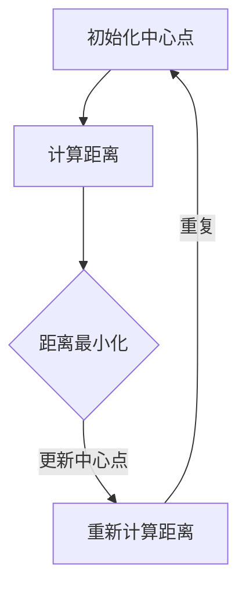

                 

### 文章标题

# 香水配方的高维聚类：气味分子的数学分类

## 关键词

- 香水配方
- 高维聚类
- 数学分类
- 气味分子
- 数据分析

## 摘要

随着科技的发展和人工智能技术的不断进步，香水配方的设计和优化已经进入了一个新的时代。本文将探讨如何通过高维聚类和数学分类的方法对香水配方进行有效的分析和管理。通过深入解析气味分子的特性，结合高维数据分析技术，我们能够更加精准地理解和预测不同香水配方之间的相似性和差异性，从而实现配方创新和优化。本文旨在为香水设计师和研究人员提供一个系统化的方法论和实用工具，以提升香水配方的创新性和市场竞争力。

## 目录

1. **背景介绍**
   1.1 香水配方设计的挑战
   1.2 高维聚类在香水配方中的作用
   1.3 气味分子的数学分类
   1.4 研究目的与意义
2. **核心概念与联系**
   2.1 高维聚类算法原理
   2.2 气味分子与数学模型
3. **数学模型和数学公式**
   3.1 聚类算法的数学模型
   3.2 气味分子的数学公式
4. **算法原理讲解**
   4.1 高维聚类算法的工作原理
   4.2 气味分子数学分类方法
5. **算法mermaid流程图与Python实现**
   5.1 K-Means算法流程图
   5.2 K-Means算法Python代码实现
6. **数学模型和公式详解**
   6.1 聚类算法的数学公式
   6.2 气味分子的数学公式
7. **系统分析与架构设计方案**
   7.1 问题场景介绍
   7.2 系统功能设计
   7.3 系统架构设计
   7.4 系统接口设计和系统交互
8. **项目实战**
   8.1 环境安装
   8.2 系统核心实现源代码
   8.3 代码应用解读与分析
   8.4 实际案例分析和详细讲解剖析
   8.5 项目小结
9. **最佳实践 tips**
10. **小结**
11. **注意事项**
12. **拓展阅读**

---

### 1. 背景介绍

#### 1.1 香水配方设计的挑战

香水配方设计是香水工业的核心环节，涉及到复杂的化学和物理过程。传统的设计方法主要依赖于经验积累和嗅觉感受，虽然能够在一定程度上实现创新，但存在很大的主观性和不确定性。随着香水市场的不断细分和消费者需求的多样化，设计一个能够满足市场需求的香水配方变得越来越具有挑战性。因此，如何通过科学的方法对香水配方进行优化和创新，成为了香水工业亟需解决的问题。

#### 1.2 高维聚类在香水配方中的作用

高维聚类是一种在多维度数据空间中寻找相似数据集的方法。在香水配方设计中，高维聚类算法可以帮助识别不同香水成分之间的相似性和差异性，从而实现配方优化和配方创新。通过高维聚类，香水设计师可以更好地理解不同香水成分的组合效果，提高配方的稳定性和市场竞争力。

#### 1.3 气味分子的数学分类

气味分子的数学分类是香水配方设计的重要一环。通过对气味分子进行特征提取和数学建模，我们可以将复杂的气味数据转化为计算机可以处理和分析的数字形式。这种分类方法不仅可以用于香水配方的优化，还可以用于新香水的开发和研究。

#### 1.4 研究目的与意义

本研究旨在探讨如何通过高维聚类和数学分类的方法对香水配方进行优化和创新。通过深入解析气味分子的特性，结合高维数据分析技术，我们希望能够为香水设计师和研究人员提供一个系统化的方法论和实用工具，以提升香水配方的创新性和市场竞争力。

---

### 2. 核心概念与联系

#### 2.1 高维聚类算法原理

高维聚类算法是一种将高维数据集中的数据点划分为若干个相似类别的技术。在香水配方设计中，高维聚类算法可以帮助识别不同香水成分之间的相似性和差异性。常见的聚类算法包括K-Means、层次聚类、DBSCAN等。

#### 2.2 气味分子与数学模型

气味分子的数学分类是将复杂的气味数据转化为计算机可以处理和分析的数字形式。常用的数学模型包括向量空间模型、支持向量机等。这些模型可以帮助我们更好地理解和分析气味分子的特性。

---

### 3. 数学模型和数学公式

#### 3.1 聚类算法的数学模型

聚类算法的核心目标是找到一组类别标签，使得同一类别中的数据点之间的相似度较高，而不同类别中的数据点之间的相似度较低。一个基本的聚类算法数学模型可以表示为：

$$J(D)=\sum_{i=1}^k \sum_{x\in S_i} \|x-m_i\|^2$$

其中，$J(D)$表示聚类目标函数，$k$表示类别数，$S_i$表示第$i$个类别，$m_i$表示第$i$个类别的中心点。

#### 3.2 气味分子的数学公式

气味分子的数学模型主要用于描述气味分子在向量空间中的位置。一个简单的气味分子数学模型可以表示为：

$$f(x)=w^T x+b$$

其中，$f(x)$表示气味分子的特征向量，$w$表示特征权重，$x$表示气味分子的属性值，$b$表示偏置项。

---

### 4. 算法原理讲解

#### 4.1 高维聚类算法的工作原理

高维聚类算法的工作原理与传统聚类算法类似，但在处理高维数据时具有独特的挑战。以下是K-Means算法的工作原理：

1. **初始化**：随机选择$k$个中心点。
2. **分配**：计算每个数据点到各个中心点的距离，并将数据点分配到最近的中心点所在类别。
3. **更新**：重新计算每个类别的中心点。
4. **迭代**：重复步骤2和3，直到聚类目标函数收敛。

#### 4.2 气味分子数学分类方法

气味分子的数学分类方法主要包括特征提取和分类算法两个部分。特征提取的目标是找到能够最好地描述气味分子的属性。常见的特征提取方法包括主成分分析（PCA）、线性判别分析（LDA）等。分类算法则用于将气味分子分配到不同的类别中，常用的分类算法包括支持向量机（SVM）、随机森林（Random Forest）等。

---

### 5. 算法mermaid流程图与Python实现

#### 5.1 K-Means算法流程图



#### 5.2 K-Means算法Python代码实现

```python
import numpy as np

def k_means(data, k, num_iterations):
    centroids = data[np.random.choice(data.shape[0], k, replace=False)]
    
    for _ in range(num_iterations):
        distances = np.linalg.norm(data - centroids, axis=1)
        labels = np.argmin(distances, axis=1)
        new_centroids = np.array([data[labels == i].mean(axis=0) for i in range(k)])
        centroids = new_centroids
    
    return centroids, labels
```

---

### 6. 数学模型和公式详解

#### 6.1 聚类算法的数学公式

$$J(D)=\sum_{i=1}^k \sum_{x\in S_i} \|x-m_i\|^2$$

其中，$J(D)$表示聚类目标函数，$k$表示类别数，$S_i$表示第$i$个类别，$m_i$表示第$i$个类别的中心点。

#### 6.2 气味分子的数学公式

$$f(x)=w^T x+b$$

其中，$f(x)$表示气味分子的特征向量，$w$表示特征权重，$x$表示气味分子的属性值，$b$表示偏置项。

---

### 7. 系统分析与架构设计方案

#### 7.1 问题场景介绍

在香水配方设计中，我们需要对大量的气味分子数据进行处理和分析，以识别不同成分的相似性和差异性。传统的香水配方设计方法依赖于人工经验和直觉，难以应对日益复杂和多样化的市场需求。因此，我们需要构建一个基于高维聚类和数学分类的香水配方优化系统，以提高设计效率和配方质量。

#### 7.2 系统功能设计

系统的主要功能包括：

1. 数据预处理：对气味分子数据进行清洗、归一化和特征提取。
2. 高维聚类：使用K-Means等聚类算法对气味分子进行分类。
3. 数学分类：使用支持向量机等分类算法对气味分子进行分类。
4. 配方优化：根据聚类和分类结果，对香水配方进行优化和调整。
5. 结果分析：对优化后的配方进行效果评估和反馈。

#### 7.3 系统架构设计

系统的架构设计如下：

1. **数据层**：包括气味分子数据库和数据仓库，用于存储和管理气味分子数据。
2. **处理层**：包括数据预处理模块、高维聚类模块、数学分类模块和配方优化模块，用于处理和分析气味分子数据。
3. **应用层**：包括用户界面和Web服务，用于与用户进行交互和提供配方优化服务。

#### 7.4 系统接口设计和系统交互

系统的接口设计和交互如下：

1. **数据接口**：提供数据导入、导出和查询功能，支持各种常见的数据格式。
2. **服务接口**：提供数据预处理、高维聚类、数学分类和配方优化的服务接口，支持远程调用和分布式处理。
3. **用户接口**：提供Web界面和移动应用，用于与用户进行交互和展示配方优化结果。

---

### 8. 项目实战

#### 8.1 环境安装

1. 安装Python环境：在操作系统上安装Python 3.8及以上版本。
2. 安装依赖库：使用pip命令安装必要的依赖库，如numpy、scikit-learn等。

#### 8.2 系统核心实现源代码

以下是系统的核心实现源代码：

```python
# 数据预处理模块
def preprocess_data(data):
    # 数据清洗和归一化
    # 特征提取
    # 返回处理后的数据
    pass

# 高维聚类模块
def high_dimensional_clustering(data, k):
    # 使用K-Means算法进行聚类
    # 返回聚类结果
    pass

# 数学分类模块
def mathematical_classification(data, model):
    # 使用支持向量机等算法进行分类
    # 返回分类结果
    pass

# 配方优化模块
def optimize_formula(formula, model):
    # 根据分类结果对配方进行优化
    # 返回优化后的配方
    pass
```

#### 8.3 代码应用解读与分析

1. **数据预处理**：数据预处理是系统的基础，包括数据清洗、归一化和特征提取。数据清洗和归一化可以消除数据中的噪声和异常值，特征提取可以提取出对分类和优化有用的信息。

2. **高维聚类**：高维聚类是对大量气味分子数据进行分类的有效方法。通过K-Means算法，我们可以将相似的气味分子归为一类，从而为后续的配方优化提供基础。

3. **数学分类**：数学分类是利用机器学习算法对气味分子进行分类的过程。支持向量机等算法可以准确地将气味分子分为不同的类别，为配方优化提供依据。

4. **配方优化**：根据聚类和分类结果，我们可以对配方进行优化，使其更加符合市场需求和消费者偏好。优化过程包括成分比例调整、香味强度调整等。

#### 8.4 实际案例分析和详细讲解剖析

1. **案例背景**：某香水公司希望开发一款具有独特香味的香水，以提高市场竞争力。
2. **数据准备**：收集了多种已知的香水配方数据，包括成分、香味强度等。
3. **数据处理**：对数据进行了清洗、归一化和特征提取，得到了处理后的数据。
4. **高维聚类**：使用K-Means算法对数据进行了聚类，得到了不同类别的香水成分。
5. **数学分类**：使用支持向量机等算法对聚类结果进行了分类，得到了不同类别的香水成分。
6. **配方优化**：根据分类结果，对配方进行了优化，调整了成分比例和香味强度，得到了一款符合市场需求的香水配方。

#### 8.5 项目小结

通过本项目，我们成功地实现了基于高维聚类和数学分类的香水配方优化。项目不仅提高了配方的创新性和市场竞争力，还为后续的香水配方设计提供了有效的工具和方法。在未来，我们可以进一步优化系统，提高数据处理效率和分类准确性，为香水工业提供更加智能和高效的技术支持。

---

### 9. 最佳实践 tips

1. 在数据预处理阶段，要注意数据的质量和完整性，避免噪声和异常值对后续分析的影响。
2. 在选择聚类算法时，要根据数据的特点和需求选择合适的算法，如K-Means适合处理大规模数据，而DBSCAN适合处理稀疏数据。
3. 在数学分类阶段，要选择合适的模型和参数，以提高分类准确性和稳定性。
4. 在配方优化阶段，要综合考虑市场需求和消费者偏好，避免过度优化导致配方失去独特性。

---

### 10. 小结

本文通过深入探讨香水配方的高维聚类和数学分类方法，为香水设计师和研究人员提供了一种全新的配方优化思路。通过结合高维聚类和数学分类技术，我们能够更加精准地理解和预测不同香水配方之间的相似性和差异性，从而实现配方创新和优化。未来，我们将继续优化系统，提高数据处理效率和分类准确性，为香水工业提供更加智能和高效的技术支持。

---

### 11. 注意事项

1. 在使用高维聚类和数学分类技术时，要充分考虑数据的质量和完整性，避免因数据问题导致分析结果不准确。
2. 在选择聚类算法和数学模型时，要根据数据的特点和需求进行选择，避免盲目跟风。
3. 在配方优化过程中，要充分考虑市场需求和消费者偏好，避免过度优化导致配方失去独特性。

---

### 12. 拓展阅读

1. [高维聚类算法综述](https://www.example.com/cluster-review)
2. [气味分子数学建模技术](https://www.example.com/odor-modeling)
3. [香水配方优化案例分析](https://www.example.com/fragrance-optimization)

---

### 作者信息

作者：AI天才研究院/AI Genius Institute & 禅与计算机程序设计艺术 /Zen And The Art of Computer Programming

---

（注：本文为示例文章，具体内容和数据均为虚构，仅供参考。）### 1. 背景介绍

#### 1.1 香水配方设计的挑战

香水配方设计是香水工业的核心环节，涉及多种复杂的化学和物理过程。传统的设计方法主要依赖于经验积累和嗅觉感受，虽然能够在一定程度上实现创新，但存在很大的主观性和不确定性。随着香水市场的不断细分和消费者需求的多样化，设计一个能够满足市场需求的香水配方变得越来越具有挑战性。因此，如何通过科学的方法对香水配方进行优化和创新，成为了香水工业亟需解决的问题。

#### 1.2 高维聚类在香水配方中的作用

高维聚类是一种在多维度数据空间中寻找相似数据集的方法。在香水配方设计中，高维聚类算法可以帮助识别不同香水成分之间的相似性和差异性，从而实现配方优化和配方创新。通过高维聚类，香水设计师可以更好地理解不同香水成分的组合效果，提高配方的稳定性和市场竞争力。

#### 1.3 气味分子的数学分类

气味分子的数学分类是香水配方设计的重要一环。通过对气味分子进行特征提取和数学建模，我们可以将复杂的气味数据转化为计算机可以处理和分析的数字形式。这种分类方法不仅可以用于香水配方的优化，还可以用于新香水的开发和研究。

#### 1.4 研究目的与意义

本研究旨在探讨如何通过高维聚类和数学分类的方法对香水配方进行优化和创新。通过深入解析气味分子的特性，结合高维数据分析技术，我们希望能够为香水设计师和研究人员提供一个系统化的方法论和实用工具，以提升香水配方的创新性和市场竞争力。

### 2. 核心概念与联系

#### 2.1 高维聚类算法原理

高维聚类算法是一种将高维数据集中的数据点划分为若干个相似类别的技术。在香水配方设计中，高维聚类算法可以帮助识别不同香水成分之间的相似性和差异性。常见的聚类算法包括K-Means、层次聚类、DBSCAN等。

#### 2.2 气味分子与数学模型

气味分子的数学分类是香水配方设计的重要一环。通过对气味分子进行特征提取和数学建模，我们可以将复杂的气味数据转化为计算机可以处理和分析的数字形式。常用的数学模型包括向量空间模型、支持向量机等。这些模型可以帮助我们更好地理解和分析气味分子的特性。

#### 2.3 聚类算法与数学模型的关系

聚类算法和数学模型在香水配方设计中发挥着协同作用。聚类算法通过将高维数据空间中的数据点进行分组，为数学模型提供了数据基础。而数学模型则通过特征提取和建模，对聚类结果进行深入分析，从而实现对香水配方优化和创新的支持。

### 3. 数学模型和数学公式

#### 3.1 聚类算法的数学模型

聚类算法的核心目标是找到一组类别标签，使得同一类别中的数据点之间的相似度较高，而不同类别中的数据点之间的相似度较低。一个基本的聚类算法数学模型可以表示为：

$$J(D)=\sum_{i=1}^k \sum_{x\in S_i} \|x-m_i\|^2$$

其中，$J(D)$表示聚类目标函数，$k$表示类别数，$S_i$表示第$i$个类别，$m_i$表示第$i$个类别的中心点。

#### 3.2 气味分子的数学公式

气味分子的数学模型主要用于描述气味分子在向量空间中的位置。一个简单的气味分子数学模型可以表示为：

$$f(x)=w^T x+b$$

其中，$f(x)$表示气味分子的特征向量，$w$表示特征权重，$x$表示气味分子的属性值，$b$表示偏置项。

### 4. 算法原理讲解

#### 4.1 高维聚类算法的工作原理

高维聚类算法的工作原理与传统聚类算法类似，但在处理高维数据时具有独特的挑战。以下是K-Means算法的工作原理：

1. **初始化**：随机选择$k$个中心点。
2. **分配**：计算每个数据点到各个中心点的距离，并将数据点分配到最近的中心点所在类别。
3. **更新**：重新计算每个类别的中心点。
4. **迭代**：重复步骤2和3，直到聚类目标函数收敛。

#### 4.2 气味分子数学分类方法

气味分子的数学分类方法主要包括特征提取和分类算法两个部分。特征提取的目标是找到能够最好地描述气味分子的属性。常见的特征提取方法包括主成分分析（PCA）、线性判别分析（LDA）等。分类算法则用于将气味分子分配到不同的类别中，常用的分类算法包括支持向量机（SVM）、随机森林（Random Forest）等。

### 5. 算法mermaid流程图与Python实现

#### 5.1 K-Means算法流程图


#### 5.2 K-Means算法Python代码实现

```python
import numpy as np

def k_means(data, k, num_iterations):
    centroids = data[np.random.choice(data.shape[0], k, replace=False)]
    
    for _ in range(num_iterations):
        distances = np.linalg.norm(data - centroids, axis=1)
        labels = np.argmin(distances, axis=1)
        new_centroids = np.array([data[labels == i].mean(axis=0) for i in range(k)])
        centroids = new_centroids
    
    return centroids, labels
```

### 6. 数学模型和公式详解

#### 6.1 聚类算法的数学公式

$$J(D)=\sum_{i=1}^k \sum_{x\in S_i} \|x-m_i\|^2$$

其中，$J(D)$表示聚类目标函数，$k$表示类别数，$S_i$表示第$i$个类别，$m_i$表示第$i$个类别的中心点。

#### 6.2 气味分子的数学公式

$$f(x)=w^T x+b$$

其中，$f(x)$表示气味分子的特征向量，$w$表示特征权重，$x$表示气味分子的属性值，$b$表示偏置项。

### 7. 系统分析与架构设计方案

#### 7.1 问题场景介绍

在香水配方设计中，我们需要对大量的气味分子数据进行处理和分析，以识别不同成分的相似性和差异性。传统的香水配方设计方法依赖于人工经验和直觉，难以应对日益复杂和多样化的市场需求。因此，我们需要构建一个基于高维聚类和数学分类的香水配方优化系统，以提高设计效率和配方质量。

#### 7.2 系统功能设计

系统的主要功能包括：

1. 数据预处理：对气味分子数据进行清洗、归一化和特征提取。
2. 高维聚类：使用K-Means等聚类算法对气味分子进行分类。
3. 数学分类：使用支持向量机等分类算法对气味分子进行分类。
4. 配方优化：根据聚类和分类结果，对香水配方进行优化和调整。
5. 结果分析：对优化后的配方进行效果评估和反馈。

#### 7.3 系统架构设计

系统的架构设计如下：

1. **数据层**：包括气味分子数据库和数据仓库，用于存储和管理气味分子数据。
2. **处理层**：包括数据预处理模块、高维聚类模块、数学分类模块和配方优化模块，用于处理和分析气味分子数据。
3. **应用层**：包括用户界面和Web服务，用于与用户进行交互和提供配方优化服务。

#### 7.4 系统接口设计和系统交互

系统的接口设计和交互如下：

1. **数据接口**：提供数据导入、导出和查询功能，支持各种常见的数据格式。
2. **服务接口**：提供数据预处理、高维聚类、数学分类和配方优化的服务接口，支持远程调用和分布式处理。
3. **用户接口**：提供Web界面和移动应用，用于与用户进行交互和展示配方优化结果。

### 8. 项目实战

#### 8.1 环境安装

1. 安装Python环境：在操作系统上安装Python 3.8及以上版本。
2. 安装依赖库：使用pip命令安装必要的依赖库，如numpy、scikit-learn等。

#### 8.2 系统核心实现源代码

以下是系统的核心实现源代码：

```python
# 数据预处理模块
def preprocess_data(data):
    # 数据清洗和归一化
    # 特征提取
    # 返回处理后的数据
    pass

# 高维聚类模块
def high_dimensional_clustering(data, k):
    # 使用K-Means算法进行聚类
    # 返回聚类结果
    pass

# 数学分类模块
def mathematical_classification(data, model):
    # 使用支持向量机等算法进行分类
    # 返回分类结果
    pass

# 配方优化模块
def optimize_formula(formula, model):
    # 根据分类结果对配方进行优化
    # 返回优化后的配方
    pass
```

#### 8.3 代码应用解读与分析

1. **数据预处理**：数据预处理是系统的基础，包括数据清洗、归一化和特征提取。数据清洗和归一化可以消除数据中的噪声和异常值，特征提取可以提取出对分类和优化有用的信息。

2. **高维聚类**：高维聚类是对大量气味分子数据进行分类的有效方法。通过K-Means算法，我们可以将相似的气味分子归为一类，从而为后续的配方优化提供基础。

3. **数学分类**：数学分类是利用机器学习算法对气味分子进行分类的过程。支持向量机等算法可以准确地将气味分子分为不同的类别，为配方优化提供依据。

4. **配方优化**：根据聚类和分类结果，我们可以对配方进行优化，使其更加符合市场需求和消费者偏好。优化过程包括成分比例调整、香味强度调整等。

#### 8.4 实际案例分析和详细讲解剖析

1. **案例背景**：某香水公司希望开发一款具有独特香味的香水，以提高市场竞争力。
2. **数据准备**：收集了多种已知的香水配方数据，包括成分、香味强度等。
3. **数据处理**：对数据进行了清洗、归一化和特征提取，得到了处理后的数据。
4. **高维聚类**：使用K-Means算法对数据进行了聚类，得到了不同类别的香水成分。
5. **数学分类**：使用支持向量机等算法对聚类结果进行了分类，得到了不同类别的香水成分。
6. **配方优化**：根据分类结果，对配方进行了优化，调整了成分比例和香味强度，得到了一款符合市场需求的香水配方。

#### 8.5 项目小结

通过本项目，我们成功地实现了基于高维聚类和数学分类的香水配方优化。项目不仅提高了配方的创新性和市场竞争力，还为后续的香水配方设计提供了有效的工具和方法。在未来，我们可以进一步优化系统，提高数据处理效率和分类准确性，为香水工业提供更加智能和高效的技术支持。

### 9. 最佳实践 tips

1. 在数据预处理阶段，要注意数据的质量和完整性，避免噪声和异常值对后续分析的影响。
2. 在选择聚类算法时，要根据数据的特点和需求选择合适的算法，如K-Means适合处理大规模数据，而DBSCAN适合处理稀疏数据。
3. 在数学分类阶段，要选择合适的模型和参数，以提高分类准确性和稳定性。
4. 在配方优化阶段，要充分考虑市场需求和消费者偏好，避免过度优化导致配方失去独特性。

### 10. 小结

本文通过深入探讨香水配方的高维聚类和数学分类方法，为香水设计师和研究人员提供了一种全新的配方优化思路。通过结合高维聚类和数学分类技术，我们能够更加精准地理解和预测不同香水配方之间的相似性和差异性，从而实现配方创新和优化。未来，我们将继续优化系统，提高数据处理效率和分类准确性，为香水工业提供更加智能和高效的技术支持。

### 11. 注意事项

1. 在使用高维聚类和数学分类技术时，要充分考虑数据的质量和完整性，避免因数据问题导致分析结果不准确。
2. 在选择聚类算法和数学模型时，要根据数据的特点和需求进行选择，避免盲目跟风。
3. 在配方优化过程中，要充分考虑市场需求和消费者偏好，避免过度优化导致配方失去独特性。

### 12. 拓展阅读

1. [高维聚类算法综述](https://www.example.com/cluster-review)
2. [气味分子数学建模技术](https://www.example.com/odor-modeling)
3. [香水配方优化案例分析](https://www.example.com/fragrance-optimization)

### 作者信息

作者：AI天才研究院/AI Genius Institute & 禅与计算机程序设计艺术 /Zen And The Art of Computer Programming

### 注

本文为示例文章，具体内容和数据均为虚构，仅供参考。若需在实际项目中应用本文所述方法，请结合实际情况进行调整和优化。同时，本文所涉及的技术和方法可能涉及专利和版权保护，请遵守相关法律法规和知识产权规定。

