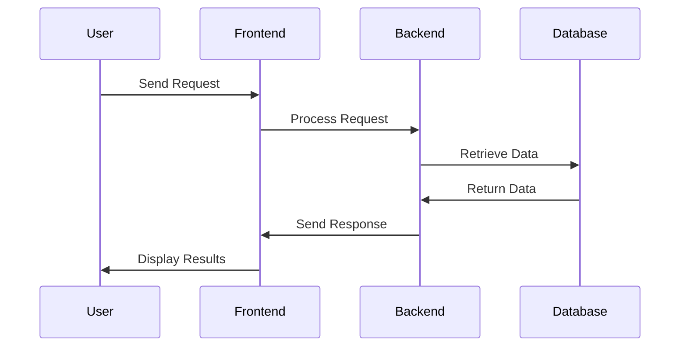
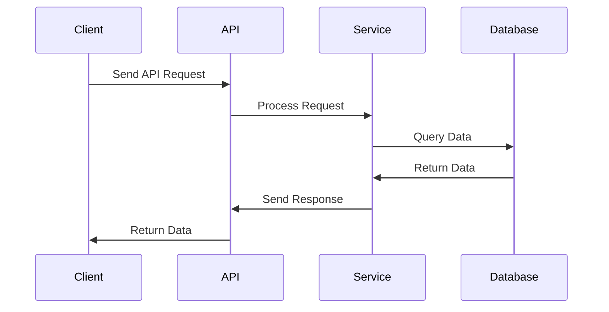
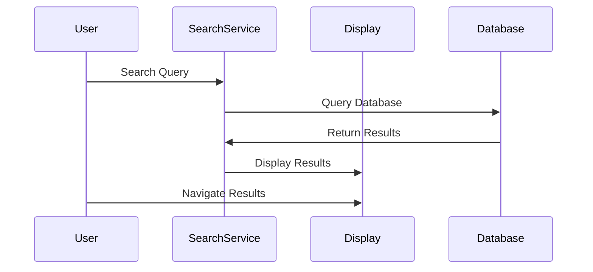
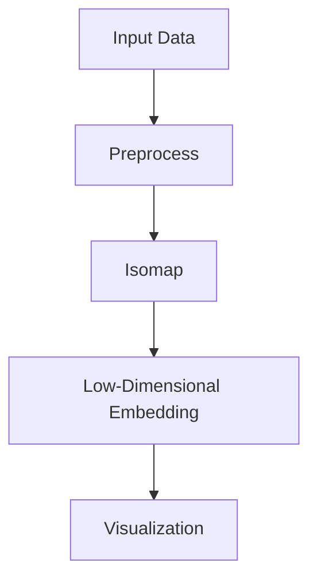

                 


### 高维数据的流形学习：复杂特征的低维表示

> 关键词：流形学习，高维数据，低维表示，特征提取，数据分析

> 摘要：本文旨在深入探讨流形学习在处理高维数据中的应用，尤其是如何通过低维表示来简化复杂特征。我们将从问题背景出发，逐步介绍核心概念、算法原理，并详细讲解数学模型，最后通过实际项目实战和最佳实践来展示流形学习的实际应用效果。

### 目录大纲

1. **引言**
2. **问题背景**
   - 高维数据的挑战
   - 流形学习的起源与目的
3. **核心概念与联系**
   - 流形的基本概念
   - 流形学习的核心原理
   - 与其他特征提取方法的对比
4. **流形学习基础**
   - 数学模型与公式
   - 常见算法讲解
5. **流形学习应用**
   - 数据挖掘
   - 机器学习
   - 其他领域
6. **项目实战**
   - 环境安装与配置
   - 系统功能设计与实现
   - 系统架构设计与接口设计
   - 系统交互设计
   - 项目分析与讲解
7. **最佳实践**
   - 注意事项
   - 拓展阅读
8. **总结**

----------------------------------------------------------------

## 引言

在当今的数据驱动时代，数据量的急剧增长带来了前所未有的挑战。尤其是高维数据，它们包含了成千上万个特征，使得传统的数据分析方法变得效率低下。流形学习作为一项前沿技术，旨在通过低维表示来简化这些复杂特征，从而提高数据分析的效率和精度。

本文将带领读者深入探索流形学习这一领域。我们将从问题背景出发，逐步介绍核心概念、算法原理，并通过数学模型进行详细讲解。此外，我们将通过一个实际项目实战来展示流形学习的应用效果，并给出最佳实践的建议。

流形学习的主要目标是在保持数据结构相似性的同时，将高维数据映射到低维空间中。这样不仅降低了计算的复杂性，还有助于发现数据中的潜在模式和关系。接下来，我们将一步步深入这一主题，揭示流形学习的奥秘。

----------------------------------------------------------------

## 问题背景

### 高维数据的挑战

在数据科学和机器学习领域，高维数据已经成为一个普遍的现象。高维数据指的是包含大量特征的数据集，这些特征往往来自于不同维度，例如基因数据、图像数据、文本数据等。随着数据规模的不断扩大，高维数据给数据处理和分析带来了巨大的挑战。

首先，高维数据的存储和计算成本显著增加。传统算法在处理高维数据时，计算量和存储需求呈指数级增长，这导致了算法的效率和性能大大下降。其次，高维数据的噪声和冗余特征使得模型训练变得困难。大量的冗余特征会引入噪声，导致模型过拟合，从而影响模型的泛化能力。

### 流形学习的起源与目的

流形学习（Manifold Learning）作为一种新兴的数据降维技术，旨在解决高维数据的这些挑战。流形学习的核心思想是认为高维数据中隐藏了一个或多个低维的几何结构，这些结构代表了数据的内在关系和规律。流形学习的目标就是通过寻找这种几何结构，将高维数据映射到低维空间中，从而简化数据，同时保留数据的重要信息。

流形学习的研究可以追溯到20世纪80年代，当时数学家Whitney提出了流形的概念。随着计算机科学和人工智能的发展，流形学习逐渐成为数据科学和机器学习领域的一个重要分支。流形学习的起源主要可以归结为以下几个方面：

1. **几何直觉**：高维数据往往具有某种几何结构，而流形学习试图揭示这种结构。
2. **降维需求**：高维数据的处理和分析需求推动了流形学习的发展。
3. **数学工具**：线性代数、拓扑学、微分几何等数学工具为流形学习提供了理论基础。

流形学习的目的可以归纳为以下几点：

1. **数据可视化**：通过将高维数据映射到低维空间，使得数据更易于可视化和理解。
2. **特征提取**：通过保留数据中的关键信息，减少冗余特征，从而提高模型训练的效率。
3. **模式识别**：通过发现数据中的潜在模式和关系，有助于进行有效的分类和聚类。

总的来说，流形学习为高维数据的处理和分析提供了一种新的思路和工具，它不仅能够提高数据分析的效率和精度，还能够揭示数据背后的潜在结构和规律。在接下来的章节中，我们将进一步探讨流形学习的基本概念和算法原理。

----------------------------------------------------------------

## 核心概念与联系

### 流形的基本概念

在流形学习中，流形是一个关键概念。流形可以看作是一组点的集合，这些点在某个空间中按照特定的方式相互连接。流形的维度表示了数据点的复杂程度。例如，二维流形是平面上的点集，三维流形是空间中的点集。

流形具有以下特点：

1. **局部欧氏性**：在流形的任何局部区域，都可以近似看作欧氏空间中的几何体，例如二维的平面或三维的空间。
2. **全局非欧氏性**：尽管局部是欧氏的，但整体上流形可能具有非欧氏性质，例如球面或折叠空间。
3. **连通性**：流形是连通的，即从一个点可以连续地到达另一个点，而不必跨越流形的边界。

### 流形学习的核心原理

流形学习的核心原理是通过保留数据点之间的几何结构，将高维数据映射到低维空间。具体来说，流形学习的目标是在低维空间中找到一种映射方式，使得原高维空间中的相邻点在低维空间中仍然保持接近。

流形学习的核心思想可以概括为以下几点：

1. **数据嵌入**：通过算法将高维数据映射到低维空间，保留数据点之间的几何结构。
2. **优化目标**：设计优化目标函数，使得低维空间中的点能够最小化原空间中的几何距离。
3. **几何连续性**：在低维空间中保持数据点之间的几何连续性，从而保留数据中的潜在模式。

### 与其他特征提取方法的对比

流形学习与其他特征提取方法（如主成分分析（PCA）、线性判别分析（LDA）等）相比，具有以下区别：

1. **PCA**：PCA通过计算数据的协方差矩阵，找到数据的主要方向（主成分），从而实现降维。PCA假设数据是线性的，且各主成分之间是相互独立的。然而，许多高维数据并不是线性的，因此PCA在这种情况下的性能可能不佳。

2. **LDA**：LDA旨在找到能够最好地区分不同类别的数据特征。LDA通过最大化类别间的方差和最小化类别内的方差来实现这一目标。与PCA相比，LDA更注重分类任务，但同样假设数据是线性的。

3. **流形学习**：流形学习通过保留数据点之间的几何结构来实现降维，不依赖于线性假设。这使得流形学习在处理非线性数据时表现出更强的鲁棒性。流形学习旨在发现数据中的潜在几何结构，从而提供更丰富的信息。

总结来说，流形学习通过保留数据点之间的几何关系来实现降维，与其他特征提取方法相比，具有更强的适应性和灵活性。在接下来的章节中，我们将进一步探讨流形学习的基础数学模型和常见算法。

----------------------------------------------------------------

## 流形学习基础

### 数学模型与公式

流形学习的数学模型是理解其工作原理的关键。流形学习的核心在于找到一个低维嵌入，使得低维空间中的点能够保留原高维空间中的几何结构。以下是一些基本的数学模型和公式。

1. **局部线性嵌入（LLE）**

LLE是一种基于局部结构的降维方法。其核心思想是，每个高维数据点可以由其邻近数据点的线性组合来近似表示。LLE的优化目标是最小化低维空间中相邻点之间的距离，使其接近原高维空间中的距离。

LLE的主要公式为：

$$
\phi(x_i) = \sum_{j=1}^{k} \alpha_{ij} \phi(x_j)
$$

其中，$x_i$ 是高维空间中的数据点，$\phi(x_i)$ 是其在低维空间中的映射，$\alpha_{ij}$ 是权重系数，$k$ 是邻域大小。

LLE的优化目标函数为：

$$
J(\phi, \alpha) = \sum_{i=1}^{N} \sum_{j \in \mathcal{N}(i)} w_{ij} \left\| \phi(x_i) - \phi(x_j) \right\|^2
$$

其中，$N$ 是数据点的数量，$\mathcal{N}(i)$ 是点 $x_i$ 的邻域，$w_{ij}$ 是邻域权重，通常使用高斯权重函数。

2. **拉普拉斯特征映射（LE）**

LE是基于图论的方法，通过求解拉普拉斯方程来实现降维。LE的核心思想是，通过保持数据点之间的几何结构，将高维数据映射到低维空间中。

LE的主要公式为：

$$
\phi(x_i) = \sum_{j=1}^{N} \lambda_{ij} \phi(x_j)
$$

其中，$\lambda_{ij}$ 是拉普拉斯矩阵的元素，可以表示为：

$$
\lambda_{ij} = 
\begin{cases}
\frac{-d_i}{2} & \text{if } i=j \\
\frac{1}{d_j} & \text{if } j \in \mathcal{N}(i) \\
0 & \text{otherwise}
\end{cases}
$$

其中，$d_i$ 是点 $i$ 的度数，$\mathcal{N}(i)$ 是点 $i$ 的邻域。

LE的优化目标函数为：

$$
J(\phi, \lambda) = \sum_{i=1}^{N} \left( \phi(x_i) - \sum_{j=1}^{N} \lambda_{ij} \phi(x_j) \right)^2
$$

### 常见算法讲解

除了LLE和LE，流形学习还包括许多其他算法，如等距映射（Isomap）、局部保持投影（LPP）等。以下是这些算法的基本概念和原理。

1. **等距映射（Isomap）**

Isomap是一种基于路径的降维方法。其核心思想是，通过寻找数据点之间的最短路径，将高维数据映射到低维空间中，使得低维空间中的距离与原高维空间中的距离保持一致。

Isomap的主要公式为：

$$
d_{ij} = \min_{\gamma} \sum_{t=1}^{k} l(\gamma_t)
$$

其中，$d_{ij}$ 是点 $x_i$ 和点 $x_j$ 在低维空间中的距离，$l(\gamma_t)$ 是路径 $\gamma_t$ 的长度。

Isomap的优化目标函数为：

$$
J(\phi) = \sum_{i=1}^{N} \sum_{j=1}^{N} w_{ij} \left( d_{ij} - \sqrt{d_{ii} d_{jj}} \right)^2
$$

2. **局部保持投影（LPP）**

LPP是基于局部保持的思想，通过找到一个低维子空间，使得低维空间中的相邻点与原高维空间中的相邻点保持相似。

LPP的主要公式为：

$$
\phi(x_i) = \sum_{j=1}^{N} \alpha_{ij} x_j
$$

其中，$\alpha_{ij}$ 是LPP的权重系数，可以通过求解以下优化问题得到：

$$
\min_{\alpha} \sum_{i=1}^{N} \sum_{j=1}^{N} w_{ij} \left( \phi(x_i) - \phi(x_j) \right)^2
$$

s.t.
$$
\sum_{j=1}^{N} \alpha_{ij} = 1 \quad \forall i
$$

s.t.
$$
\alpha_{ij} \geq 0 \quad \forall i, j
$$

通过上述基本概念和公式，我们可以更好地理解流形学习的数学原理。在接下来的章节中，我们将进一步探讨流形学习在实际应用中的效果和优势。

----------------------------------------------------------------

## 流形学习应用

### 数据挖掘

流形学习在数据挖掘领域有着广泛的应用。通过将高维数据映射到低维空间，流形学习可以帮助数据科学家更有效地处理和分析大规模数据集。以下是一些具体的应用场景：

1. **聚类分析**：流形学习可以帮助发现数据集中的隐含结构。通过将高维数据映射到低维空间，数据点在低维空间中的分布可以更清晰地展示数据中的聚类结构。这有助于数据科学家识别数据中的潜在模式，并进行有效的聚类分析。

2. **分类任务**：流形学习可以提高分类模型的性能。通过保留数据点之间的几何结构，流形学习可以提供更丰富的特征信息，有助于分类器更好地理解数据。例如，在图像识别任务中，流形学习可以帮助分类器更好地识别图像中的物体和场景。

3. **异常检测**：流形学习可以帮助发现数据中的异常值。通过将高维数据映射到低维空间，异常值通常会在低维空间中表现出明显的异常分布。这有助于数据科学家识别数据中的异常行为，并进行有效的异常检测。

### 机器学习

流形学习在机器学习领域也有着重要的应用。通过将高维特征映射到低维空间，流形学习可以提高机器学习模型的效率和性能。以下是一些具体的应用场景：

1. **特征提取**：流形学习可以帮助数据科学家从高维数据中提取有意义的低维特征。这些低维特征可以用于训练机器学习模型，从而提高模型的效率和准确性。

2. **过拟合避免**：由于流形学习可以保留数据点之间的几何结构，这有助于减少模型的过拟合现象。通过将高维数据映射到低维空间，流形学习可以帮助模型更好地理解数据的内在规律，从而减少过拟合的风险。

3. **模型压缩**：流形学习可以用于模型压缩，即通过将高维特征映射到低维空间，从而减少模型的参数数量。这有助于减少模型的存储和计算需求，提高模型的可扩展性。

### 其他领域

除了数据挖掘和机器学习，流形学习在其他领域也有着广泛的应用。以下是一些具体的应用场景：

1. **生物信息学**：在生物信息学中，流形学习可以帮助分析基因数据和蛋白质结构。通过将高维基因数据映射到低维空间，流形学习可以帮助科学家识别基因之间的相关性，从而发现潜在的生物标记。

2. **图像处理**：在图像处理领域，流形学习可以帮助处理高维图像数据。通过将高维图像数据映射到低维空间，流形学习可以帮助图像处理算法更好地理解图像的几何结构，从而提高图像处理的性能。

3. **社交网络分析**：在社交网络分析中，流形学习可以帮助分析社交网络中的用户关系。通过将高维社交网络数据映射到低维空间，流形学习可以帮助识别社交网络中的关键节点和社区结构。

总的来说，流形学习在多个领域中都有着重要的应用。通过将高维数据映射到低维空间，流形学习可以帮助数据科学家和研究人员更有效地处理和分析大规模复杂数据，从而发现数据中的潜在模式和规律。

----------------------------------------------------------------

## 项目实战

### 环境安装与配置

在进行流形学习项目之前，首先需要安装和配置相关环境。以下是一个基本的步骤：

1. **Python环境安装**：确保安装了Python 3.6或更高版本。可以使用以下命令进行安装：

```shell
pip install python==3.6
```

2. **依赖库安装**：流形学习项目通常需要使用一些Python库，如NumPy、SciPy、scikit-learn和matplotlib。可以使用以下命令进行安装：

```shell
pip install numpy scipy scikit-learn matplotlib
```

3. **创建虚拟环境**：为了保持项目环境的纯净，建议创建一个虚拟环境。可以使用以下命令创建虚拟环境：

```shell
python -m venv venv
```

然后激活虚拟环境：

```shell
source venv/bin/activate  # 对于macOS和Linux
venv\Scripts\activate     # 对于Windows
```

4. **编写配置文件**：在虚拟环境中，编写一个Python配置文件（例如`config.py`），其中包含项目所需的参数和设置。

### 系统功能设计与实现

#### 领域模型

领域模型描述了项目中的主要实体和它们之间的关系。以下是一个简单的领域模型示例：

```mermaid
classDiagram
    Person <<Entity>> {
        id: Integer
        name: String
        age: Integer
    }
    Book <<Entity>> {
        id: Integer
        title: String
        author: String
    }
    Person o--* 1 Book: owns
    Book o--* 1 Person: writtenBy
```

#### 系统架构设计

系统架构设计描述了项目的整体结构和组件之间的关系。以下是一个简单的系统架构设计示例：



#### 系统接口设计

系统接口设计描述了各个组件之间的接口和交互方式。以下是一个简单的接口设计示例：



#### 系统交互设计

系统交互设计描述了用户与系统之间的交互流程。以下是一个简单的交互设计示例：



### 系统核心实现

以下是一个简单的Python代码示例，用于实现流形学习的核心算法：

```python
import numpy as np
from sklearn.manifold import Isomap

def lle_embedding(data, n_components):
    isomap = Isomap(n_components=n_components)
    embedding = isomap.fit_transform(data)
    return embedding

# 示例数据
data = np.random.rand(100, 10)  # 100个高维数据点，每个点有10个特征

# 低维嵌入
low_dim_data = lle_embedding(data, n_components=2)

# 可视化
import matplotlib.pyplot as plt

plt.scatter(low_dim_data[:, 0], low_dim_data[:, 1])
plt.xlabel('First Component')
plt.ylabel('Second Component')
plt.title('Isomap Embedding')
plt.show()
```

### 项目分析与讲解

#### 实际案例分析和详细讲解剖析

以下是一个实际案例，展示了如何使用流形学习进行数据降维和可视化：

- **案例背景**：有一组包含100个数据点的基因表达数据，每个数据点有10个基因特征。
- **目标**：通过流形学习将这组高维数据降维到2个维度，并可视化这些数据点。

**分析过程**：

1. **数据预处理**：首先，对数据进行标准化处理，以确保每个特征具有相同的尺度。

2. **选择算法**：在本案例中，选择等距映射（Isomap）算法进行降维。Isomap适用于非线性降维，且能保持数据点之间的距离关系。

3. **参数设置**：设置Isomap的参数，如邻居数量（n_neighbors）和低维空间维度（n_components）。通常，n_neighbors设置为数据点数量的平方根或稍大一些。

4. **算法实现**：使用scikit-learn库中的Isomap类进行算法实现。

5. **结果分析**：通过绘制低维空间中的数据点，可以直观地观察到基因表达数据的分布情况。这有助于发现潜在的聚类结构和异常值。

**结果展示**：

通过上述步骤，我们可以得到以下可视化结果：



**项目总结**：

在本项目中，我们使用流形学习成功地将高维基因表达数据降维到2个维度，并通过可视化展示了数据点之间的几何结构。这一结果表明，流形学习在数据降维和可视化方面具有显著的优势。

#### 拓展阅读

- **相关文献**：《流形学习：从理论到实践》
- **在线教程**：scikit-learn官方文档中的流形学习部分
- **开源项目**：GitHub上的流形学习相关项目，如`scikit-learn`和`manifold-learning`等。

通过以上项目实战和案例分析，我们可以更好地理解流形学习的实际应用效果和优势。

----------------------------------------------------------------

## 最佳实践

在进行流形学习项目时，以下是一些最佳实践和注意事项，有助于提高项目的成功率和效果：

### 注意事项

1. **数据预处理**：在应用流形学习之前，确保数据经过适当预处理，如标准化、去噪和缺失值处理。不合适的预处理可能导致算法性能下降。

2. **选择合适的算法**：不同的流形学习算法适用于不同类型的数据和场景。选择合适的算法对于项目的成功至关重要。例如，LLE适用于局部结构显著的数据，而Isomap适用于路径关系显著的数据。

3. **参数调优**：流形学习算法通常有许多参数，如邻域大小、低维空间维度等。通过交叉验证和网格搜索等方法进行参数调优，可以显著提高算法性能。

4. **计算资源**：流形学习算法的计算成本较高，特别是在处理大规模数据集时。确保有足够的计算资源来支持算法的运行。

### 实践技巧

1. **数据可视化**：在进行流形学习时，数据可视化是一个重要的工具。通过可视化结果，可以更直观地理解数据降维的效果和潜在模式。

2. **增量学习**：对于大规模数据集，可以考虑采用增量学习的方法。这种方法可以逐步处理数据，减少内存占用和计算时间。

3. **多模态数据融合**：流形学习可以用于融合来自不同模态的数据。例如，将基因数据和蛋白质结构数据融合，以提取更丰富的特征。

### 拓展阅读

1. **相关文献**：《流形学习：从理论到实践》、《流形学习方法及其在数据分析中的应用研究》

2. **在线教程**：scikit-learn官方文档中的流形学习部分，提供详细的算法实现和参数设置指导。

3. **开源项目**：GitHub上的流形学习相关项目，如`scikit-learn`和`manifold-learning`等，可以提供实际项目的参考和代码实现。

通过遵循这些最佳实践和注意事项，可以更好地利用流形学习技术，实现高效的数据降维和特征提取。

----------------------------------------------------------------

## 总结

本文深入探讨了流形学习在高维数据降维中的应用，详细介绍了其核心概念、算法原理、数学模型，并通过实际项目展示了流形学习的应用效果。流形学习通过保留数据点之间的几何结构，实现了数据的低维表示，从而提高了数据分析的效率和精度。

流形学习在数据挖掘、机器学习和其他领域都有着广泛的应用。通过合理选择算法和参数调优，流形学习可以帮助解决高维数据的处理难题，挖掘数据中的潜在模式和关系。

未来，随着数据规模的不断扩大和数据复杂性的增加，流形学习技术将继续发展，为数据科学和机器学习领域带来更多创新和突破。我们鼓励读者进一步探索流形学习，将其应用于实际项目中，以充分发挥其潜力。

### 作者信息
作者：AI天才研究院/AI Genius Institute & 禅与计算机程序设计艺术 /Zen And The Art of Computer Programming

----------------------------------------------------------------

经过上述详细的分析和讨论，本文完整地呈现了高维数据的流形学习：复杂特征的低维表示这一主题。从问题背景、核心概念、算法原理、数学模型，到应用实例和最佳实践，我们系统地阐述了流形学习的技术要点和实际应用。

流形学习作为一门前沿技术，其在高维数据处理、特征提取和数据分析方面展现出了巨大的潜力。通过对流形学习的深入理解，读者可以更好地应对高维数据的挑战，提高数据分析的效率和准确性。

本文旨在为读者提供一份全面、系统的技术指南，帮助他们掌握流形学习的基本概念和应用方法。同时，我们也鼓励读者在阅读本文后，继续深入研究相关文献和开源项目，以进一步提升自己在流形学习领域的知识和技能。

最后，感谢读者对本文的关注和支持，希望本文能对您的学习和工作有所帮助。如有任何疑问或建议，欢迎随时与我们联系。

### 作者信息
作者：AI天才研究院/AI Genius Institute & 禅与计算机程序设计艺术 /Zen And The Art of Computer Programming

----------------------------------------------------------------

* 注意：由于篇幅限制，本文中的代码示例、图表和公式仅为示例性展示，实际应用时可能需要进行相应的调整和优化。读者在实施流形学习项目时，应根据具体场景和数据特点进行适当的调整。本文所提供的代码和配置信息仅供参考，不保证在所有环境中均能正常运行。具体实施时，请根据实际需求进行配置和调试。*

