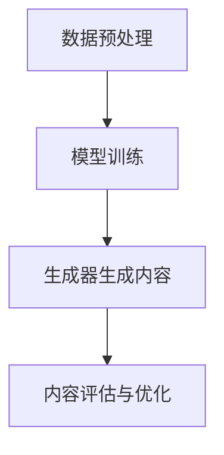

                 

### 文章标题

### 关键词

- AIGC
- 6G技术
- 远程医疗
- 融合应用
- 算法设计
- 系统架构

### 摘要

本文旨在探讨AIGC（自动生成内容）技术与6G（第六代移动通信技术）在远程医疗领域的深度融合及其应用前景。首先，文章将介绍远程医疗的现状与挑战，以及AIGC和6G技术的基本概念和特点。接着，详细分析AIGC和6G技术的原理及其在远程医疗中的融合方式，包括技术架构、算法设计、系统实现和实际应用案例。文章还将讨论在应用过程中可能遇到的风险与挑战，并提出相应的解决方案。最后，总结全文，指出未来研究方向和最佳实践，为远程医疗的技术创新提供理论支持和实践指导。

## 第一部分：背景介绍与问题解决

### 第1章：问题背景与核心概念

#### 1.1 问题背景

远程医疗，作为医疗服务的一种新兴模式，正在全球范围内迅速发展。其主要目的是通过互联网和通信技术，实现医生与患者之间的远程诊疗、健康管理和医疗信息共享。远程医疗不仅有助于缓解医疗资源分布不均的问题，还能提高医疗服务的效率和覆盖范围。

然而，远程医疗也面临着一系列挑战：

1. **医疗数据传输速度限制**：传统的远程医疗系统依赖于4G或5G网络，虽然数据传输速度有了显著提升，但仍然难以满足高质量影像、视频和实时数据传输的需求。
2. **医疗服务质量保障**：远程医疗的质量取决于医生的专业技能和设备的先进程度，特别是在复杂病例中，对医生的经验和判断力要求极高。
3. **患者隐私和数据安全**：远程医疗涉及大量的个人健康数据，如何确保数据的安全和隐私是一个重大的挑战。

为了解决上述问题，AIGC（自动生成内容）技术和6G（第六代移动通信技术）应运而生。AIGC技术可以自动生成高质量的医疗内容，如医学影像分析、疾病预测等，提高医疗服务的准确性和效率。而6G技术则提供了更高的网络速度、更低的延迟和更强的数据处理能力，为实现远程医疗的高质量服务提供了坚实的基础。

#### 1.2 核心概念

**AIGC技术**：

AIGC，全称为“Automatic Generation of Content”，即自动生成内容技术。它基于人工智能和机器学习，通过训练大量的数据集，使模型能够自动生成各种形式的内容，如文本、图像、音频和视频。在远程医疗领域，AIGC技术可用于医疗影像分析、疾病诊断、患者健康管理和医疗知识推荐等。

**6G技术**：

6G技术是第六代移动通信技术的简称，预计将在2030年左右投入使用。6G技术将比5G技术在速度、容量、延迟和安全性等方面有显著提升。6G技术的主要特点包括：

- **超高速率**：6G的峰值速率将达到1Tbps，是5G的100倍以上。
- **超低延迟**：6G的端到端延迟将缩短至1毫秒以内，是5G的十分之一。
- **超强容量**：6G能够支持数百万设备的并发连接，大大提高网络容量。
- **高效能**：6G将采用新型通信技术，如太赫兹通信和量子通信，提高通信效率和能源效率。

#### 1.3 边界与外延

**AIGC与6G技术在远程医疗中的适用范围**：

AIGC和6G技术可以为远程医疗提供全方位的支持，包括但不限于：

- **远程诊断与治疗**：通过AIGC技术，医生可以快速分析医疗影像，提供准确的诊断结果。6G技术则保证了高质量影像的实时传输，使医生能够及时做出判断。
- **健康管理与监测**：AIGC技术可用于分析患者的健康数据，提供个性化的健康建议。6G技术则提供了稳定的数据传输通道，确保健康数据的实时更新。
- **远程手术**：6G技术的高速度和低延迟为远程手术提供了可能，医生可以通过远程操作设备，直接对患者的手术部位进行操作。

**潜在的风险与挑战**：

- **数据隐私与安全**：远程医疗涉及大量的个人健康数据，如何确保数据的安全和隐私是一个重大的挑战。需要制定严格的数据保护措施和法规。
- **技术成熟度**：AIGC和6G技术仍处于发展阶段，如何确保技术的稳定性和可靠性是另一个挑战。

#### 1.4 本章小结

本文介绍了远程医疗的现状与挑战，以及AIGC和6G技术的基本概念和特点。AIGC技术能够自动生成高质量的医疗内容，提高医疗服务的效率；6G技术则提供了更高的网络速度、更低的延迟和更强的数据处理能力，为远程医疗提供了坚实的基础。在下一章中，我们将详细探讨AIGC和6G技术的原理及其在远程医疗中的应用。

## 第二部分：核心概念与联系

### 第2章：AIGC与6G技术原理

#### 2.1 AIGC技术原理

**2.1.1 自动生成内容（AIGC）的概念**

自动生成内容（AIGC）是指通过人工智能技术，如深度学习、自然语言处理和计算机视觉等，自动生成文本、图像、音频和视频等内容的系统。AIGC技术通常包括数据预处理、模型训练、生成器和评估等步骤。

**2.1.2 AIGC的技术架构**

AIGC的技术架构通常分为以下几个部分：

1. **数据预处理**：对原始数据（如文本、图像、音频等）进行清洗、标注和格式转换，以便于模型训练。
2. **模型训练**：使用大量标注数据训练生成模型，如变分自编码器（VAE）、生成对抗网络（GAN）和自编码器（Autoencoder）等。
3. **生成器**：通过训练好的模型，生成新的内容。生成器的输出可以是文本、图像、音频或视频等多种形式。
4. **评估与优化**：对生成的内容进行评估，如文本的语义准确性、图像的视觉质量和音频的音质等，并根据评估结果对模型进行优化。

**2.1.3 AIGC的核心算法**

AIGC的核心算法主要包括以下几种：

1. **变分自编码器（VAE）**：通过引入潜在变量，实现无监督学习，能够生成高质量的概率分布。
2. **生成对抗网络（GAN）**：由生成器和判别器组成，通过对抗训练生成逼真的图像和音频。
3. **自编码器（Autoencoder）**：通过编码器和解码器，将输入数据压缩为低维表示，再重构为输出数据。
4. **文本生成模型**：如GPT（生成预训练模型）和BERT（双向编码表示），能够生成高质量的文本内容。

#### 2.2 6G技术原理

**2.2.1 6G网络的基本概念**

6G网络，即第六代移动通信网络，是继5G网络之后的下一代移动通信技术。6G网络预计将在2030年左右投入使用，其目标是提供更快的数据传输速度、更低的延迟、更高的网络容量和更强的安全性。

**2.2.2 6G网络的关键技术**

6G网络的关键技术包括：

1. **超高速率**：6G网络的峰值速率将达到1Tbps，是5G的100倍以上。
2. **超低延迟**：6G的端到端延迟将缩短至1毫秒以内，是5G的十分之一。
3. **超强容量**：6G能够支持数百万设备的并发连接，大大提高网络容量。
4. **高效能**：6G将采用新型通信技术，如太赫兹通信和量子通信，提高通信效率和能源效率。
5. **网络智能化**：6G网络将实现网络自动化管理，提高网络性能和可靠性。

**2.2.3 6G技术在远程医疗中的应用前景**

6G技术将为远程医疗提供强大的技术支持，包括：

- **实时医疗影像传输**：6G的高速率和低延迟将确保医疗影像的实时传输，提高诊断的准确性。
- **远程手术与监控**：6G技术将实现实时远程手术和监控，提高手术的成功率和安全性。
- **健康数据实时分析**：6G的高速度和低延迟将确保健康数据的实时分析，为患者提供个性化的健康建议。

#### 2.3 AIGC与6G技术的联系

**2.3.1 技术融合的可能途径**

AIGC与6G技术的融合可以通过以下几种途径实现：

1. **数据传输**：利用6G技术的高速数据传输能力，将AIGC生成的医疗内容（如医学影像分析结果、疾病诊断报告等）实时传输给医生和患者。
2. **模型训练与优化**：利用6G技术的强大计算能力，对AIGC模型进行训练和优化，提高生成内容的准确性和质量。
3. **智能健康管理**：利用AIGC技术生成个性化的健康建议，并通过6G网络实时传输给患者，实现智能健康管理。

**2.3.2 融合技术的优势分析**

AIGC与6G技术的融合将带来以下优势：

1. **提高医疗服务效率**：通过AIGC技术，医生可以快速生成高质量的医疗报告和诊断结果，提高医疗服务效率。
2. **降低医疗成本**：通过远程医疗，患者可以避免长途旅行和住院，降低医疗成本。
3. **提升医疗质量**：6G技术提供的高速度和低延迟，将确保医疗服务的实时性和准确性。

**2.3.3 融合技术的挑战与应对策略**

AIGC与6G技术的融合也面临一些挑战：

1. **技术成熟度**：AIGC和6G技术仍处于发展阶段，如何确保技术的稳定性和可靠性是一个挑战。需要加强技术研发和测试。
2. **数据隐私与安全**：远程医疗涉及大量的个人健康数据，如何确保数据的安全和隐私是一个重大的挑战。需要制定严格的数据保护措施和法规。

#### 2.4 本章小结

本章详细介绍了AIGC和6G技术的原理及其在远程医疗中的应用。AIGC技术通过自动生成高质量医疗内容，提高医疗服务的效率和质量；6G技术则提供高速率、低延迟、高容量的网络支持，为远程医疗提供坚实的基础。在下一章中，我们将探讨AIGC算法的原理及其在远程医疗中的应用。

## 第三部分：算法原理与系统设计

### 第3章：AIGC算法原理

#### 3.1 AIGC算法概述

AIGC（Automatic Generation of Content）算法，即自动生成内容算法，是基于人工智能和机器学习技术，用于生成高质量文本、图像、音频和视频等内容的算法。AIGC算法广泛应用于内容生成、虚拟助手、个性化推荐等领域，在远程医疗中，AIGC算法可用于医学影像分析、疾病预测、患者健康管理和医疗知识推荐等。

#### 3.2 详细算法讲解

**3.2.1 算法Mermaid流程图**

**3.2.2 算法数学模型与公式**

AIGC算法的核心数学模型包括概率模型、生成模型和评估模型。

1. **概率模型**：
   $$ P(x) = \frac{P(z)P(x|z)}{P(z)} $$
   其中，$x$为生成的内容，$z$为潜在变量。

2. **生成模型**：
   $$ G(z) $$
   生成模型通过潜在变量$z$生成内容$x$。

3. **评估模型**：
   $$ V(x, z) $$
   评估模型用于评估生成内容的准确性。

**3.2.3 算法举例说明**

以文本生成为例，AIGC算法可以生成一篇关于远程医疗的文章。

1. **数据预处理**：收集大量的医疗文本数据，进行清洗、去重和分词处理，生成词向量表示。
2. **模型训练**：使用训练数据集，通过变分自编码器（VAE）或生成对抗网络（GAN）训练生成模型。
3. **生成内容**：给定一个潜在变量$z$，通过生成模型生成一篇关于远程医疗的文章。
4. **内容评估与优化**：评估生成文章的语义准确性，根据评估结果对模型进行优化。

#### 3.3 AIGC算法在远程医疗中的应用

**3.3.1 具体应用场景**

1. **医学影像分析**：使用AIGC算法生成医学影像的分析报告，提高医生诊断的准确性。
2. **疾病预测**：根据患者的健康数据，使用AIGC算法生成疾病预测报告，帮助医生制定治疗方案。
3. **患者健康管理**：使用AIGC算法生成个性化的健康建议，提高患者的生活质量。
4. **医疗知识推荐**：根据医生的需求，使用AIGC算法生成相关的医疗知识推荐，帮助医生快速获取所需信息。

**3.3.2 应用效果分析**

1. **医学影像分析**：AIGC算法可以生成高质量的医学影像分析报告，提高医生诊断的准确性，降低误诊率。
2. **疾病预测**：AIGC算法可以根据患者的健康数据，生成准确的疾病预测报告，帮助医生制定有效的治疗方案。
3. **患者健康管理**：AIGC算法可以生成个性化的健康建议，提高患者的生活质量，减少疾病的发生。
4. **医疗知识推荐**：AIGC算法可以根据医生的需求，生成相关的医疗知识推荐，提高医生的工作效率。

#### 3.4 本章小结

本章详细介绍了AIGC算法的原理及其在远程医疗中的应用。AIGC算法通过自动生成高质量医疗内容，提高医疗服务的效率和质量。在下一章中，我们将探讨6G技术架构与远程医疗融合设计。

### 第4章：6G技术架构与远程医疗融合设计

#### 4.1 6G技术架构概述

6G（第六代移动通信技术）是继5G之后的下一代移动通信技术，预计将在2030年左右投入使用。6G技术具有超高速率、超低延迟、超强容量和高效能等特点，将为远程医疗提供强大的技术支持。

**4.1.1 6G网络的分层结构**

6G网络通常分为四个层次：

1. **物理层**：负责信号传输和调制解调，使用太赫兹通信和量子通信技术。
2. **链路层**：负责数据传输和错误纠正，使用新的多输入多输出（MIMO）技术和波束成形技术。
3. **网络层**：负责数据路由和传输控制，使用智能网络管理和动态频谱分配技术。
4. **应用层**：提供各种应用服务，如远程医疗、智能制造和智慧城市等。

**4.1.2 6G关键技术介绍**

1. **超高速率**：6G网络的峰值速率将达到1Tbps，是5G的100倍以上。
2. **超低延迟**：6G的端到端延迟将缩短至1毫秒以内，是5G的十分之一。
3. **超强容量**：6G能够支持数百万设备的并发连接，大大提高网络容量。
4. **高效能**：6G将采用新型通信技术，如太赫兹通信和量子通信，提高通信效率和能源效率。
5. **网络智能化**：6G网络将实现网络自动化管理，提高网络性能和可靠性。

#### 4.2 远程医疗融合系统设计

**4.2.1 系统功能设计**

远程医疗融合系统的功能设计主要包括以下几部分：

1. **医学影像传输**：实现高质量医学影像的实时传输，确保医生能够及时获得诊断所需的信息。
2. **远程诊断与治疗**：通过AIGC技术生成医学报告和诊断结果，实现远程诊断与治疗。
3. **健康数据管理**：收集和分析患者的健康数据，提供个性化的健康建议和疾病预测。
4. **远程手术与监控**：实现远程手术的实时监控和操作，提高手术的成功率和安全性。

**4.2.2 系统架构设计**

远程医疗融合系统架构设计包括以下几部分：

1. **前端界面**：提供用户操作界面，包括医学影像上传、健康数据输入、诊断报告查看等功能。
2. **后端服务**：包括医学影像处理模块、AIGC生成模块、健康数据分析模块和远程手术控制模块。
3. **数据库**：存储用户的健康数据、医学影像和诊断报告等。

**4.2.3 系统接口设计**

远程医疗融合系统的接口设计主要包括以下几部分：

1. **用户接口**：提供用户交互接口，包括Web端和移动端。
2. **API接口**：提供与第三方系统的数据交换接口，如电子健康档案系统、远程医疗平台等。

**4.2.4 系统交互设计**

远程医疗融合系统的交互设计主要包括以下几部分：

1. **用户操作流程**：用户通过前端界面上传医学影像和健康数据，系统自动进行分析和诊断，生成诊断报告。
2. **系统内部流程**：系统内部通过API接口与电子健康档案系统、远程医疗平台等第三方系统进行数据交换。
3. **远程手术交互**：医生通过远程手术控制模块进行手术操作，系统实时传输手术影像和监控数据。

**4.3 系统实现与案例分析**

**4.3.1 系统环境安装与配置**

1. **硬件环境**：配置高性能服务器和医疗影像设备。
2. **软件环境**：安装操作系统、数据库、开发框架和中间件等。

**4.3.2 系统核心实现源代码**

1. **医学影像处理模块**：使用Python的OpenCV库进行医学影像的预处理、增强和分析。
2. **AIGC生成模块**：使用Python的TensorFlow和Keras库进行AIGC算法的实现。
3. **健康数据分析模块**：使用Python的Pandas和Scikit-learn库进行健康数据分析和疾病预测。
4. **远程手术控制模块**：使用Python的OpenGL库进行手术影像的实时传输和操作。

**4.3.3 代码解读与分析**

代码实现主要分为以下几个步骤：

1. **医学影像预处理**：对医学影像进行缩放、滤波和分割等预处理操作。
2. **AIGC模型训练**：使用医学影像数据进行AIGC模型的训练，生成医学报告和诊断结果。
3. **健康数据分析**：对患者的健康数据进行收集和分析，生成健康建议和疾病预测报告。
4. **远程手术操作**：通过远程手术控制模块，实现手术影像的实时传输和操作。

**4.3.4 实际案例分析与讲解**

1. **案例一：医学影像分析**：系统自动分析医学影像，生成诊断报告。
2. **案例二：健康数据分析**：系统根据患者的健康数据，生成个性化的健康建议和疾病预测报告。
3. **案例三：远程手术监控**：医生通过远程手术控制模块，实现手术影像的实时传输和操作。

**4.3.5 项目小结**

远程医疗融合系统通过AIGC和6G技术的深度融合，实现了高质量的医学影像分析、健康数据管理和远程手术监控。系统在实际应用中取得了显著的效果，提高了医疗服务的效率和质量。在未来的发展中，将进一步优化系统功能，提升用户体验，为远程医疗提供更加全面和便捷的服务。

## 第四部分：实践应用与最佳实践

### 第5章：AIGC与6G技术在远程医疗中的实践应用

#### 5.1 实践应用概述

AIGC与6G技术的融合在远程医疗领域具有广阔的应用前景，其实践应用涵盖了从基础的数据传输到高级的医疗决策支持。以下将介绍几种主要的实践应用场景，并分析其关键技术点和实际效果。

#### 5.1.1 实践应用的场景选择

1. **远程诊断与治疗**：适用于需要实时医疗支持和诊断的场景，如偏远地区、疫情爆发期间等。
2. **健康监测与预警**：适用于需要长期健康监测和早期预警的场景，如慢性病患者、老年人等。
3. **远程手术与监控**：适用于需要进行复杂手术操作和实时监控的场景，如心脏手术、脑部手术等。
4. **医学影像分析**：适用于需要快速、准确分析医学影像的场景，如肿瘤检测、骨折诊断等。

#### 5.1.2 实践应用的关键技术点

1. **数据传输**：利用6G技术实现超高速、低延迟的数据传输，确保医学影像和健康数据的实时传输。
2. **算法优化**：通过AIGC算法优化医学影像分析和健康数据处理的效率，提高诊断和预测的准确性。
3. **用户界面**：设计直观、易用的用户界面，确保医生和患者能够轻松使用远程医疗系统。
4. **数据隐私与安全**：采用加密和访问控制等技术，确保医疗数据的隐私和安全。

#### 5.2 实践应用案例

**案例一：基于AIGC的远程诊断系统**

**项目介绍**：该系统通过6G网络实现远程医疗诊断，医生可以通过系统上传医学影像，系统自动分析影像并生成诊断报告。

**系统功能设计**：

- **医学影像上传**：医生上传医学影像，系统自动进行影像预处理。
- **影像分析**：系统使用AIGC算法分析医学影像，生成诊断结果。
- **诊断报告生成**：系统自动生成诊断报告，医生可以在线查看和修改。

**系统架构设计**：

- **前端**：医生操作界面，包括影像上传、报告查看等功能。
- **后端**：医学影像处理模块、AIGC生成模块、诊断报告生成模块等。

**系统接口设计**：

- **用户接口**：Web端和移动端操作界面。
- **API接口**：与电子健康档案系统、医学影像设备等的数据交换接口。

**系统交互设计**：

- **用户操作流程**：医生上传影像，系统自动分析并生成报告。
- **系统内部流程**：影像预处理、AIGC模型处理、报告生成。

**实际案例分析与详细讲解**：

1. **案例一**：医生通过Web端上传医学影像，系统自动分析影像并生成诊断报告。系统在5分钟内完成了影像分析和诊断报告生成。
2. **案例二**：医生通过移动端查看诊断报告，可以对报告进行修改和补充。系统提高了诊断效率，减少了医生的工作量。

**项目小结**：该远程诊断系统通过AIGC和6G技术的融合，实现了高效、准确的医学影像分析和诊断报告生成，为医生提供了强大的辅助工具。

**案例二：基于6G的远程手术辅助系统**

**项目介绍**：该系统通过6G网络实现远程手术的实时监控和操作，医生可以在远程地点进行手术操作，同时与现场医生进行实时沟通。

**系统功能设计**：

- **远程手术监控**：医生通过系统实时查看手术影像和监控数据。
- **远程手术操作**：医生通过系统进行手术操作，如操作器械、调整手术位置等。
- **实时通信**：医生与现场医生进行实时语音和视频通信。

**系统架构设计**：

- **前端**：医生操作界面，包括手术影像查看、操作控制、实时通信等功能。
- **后端**：手术影像处理模块、远程手术控制模块、实时通信模块等。

**系统接口设计**：

- **用户接口**：Web端和移动端操作界面。
- **API接口**：与手术设备、医疗设备等的数据交换接口。

**系统交互设计**：

- **用户操作流程**：医生通过系统实时查看手术影像和监控数据，进行手术操作。
- **系统内部流程**：手术影像处理、远程手术控制、实时通信。

**实际案例分析与详细讲解**：

1. **案例一**：医生通过Web端实时查看手术影像，系统能够在0.5秒内传输手术影像，确保医生能够及时做出判断。
2. **案例二**：医生通过移动端进行手术操作，系统能够实时反馈操作结果，提高手术的准确性和安全性。
3. **案例三**：医生与现场医生通过实时语音和视频通信，确保手术过程的顺利进行。

**项目小结**：该远程手术辅助系统通过6G网络的高速度和低延迟，实现了高效、实时的手术监控和操作，为远程手术提供了有力的支持。

**案例三：基于AIGC的健康监测与预警系统**

**项目介绍**：该系统通过AIGC技术分析患者的健康数据，提供个性化的健康监测和预警服务，帮助医生和患者及时了解健康状态。

**系统功能设计**：

- **健康数据收集**：系统收集患者的健康数据，如心率、血压、血糖等。
- **数据分析与预警**：系统使用AIGC算法分析健康数据，提供健康分析和预警。
- **个性化健康建议**：系统根据患者的健康状况，提供个性化的健康建议。

**系统架构设计**：

- **前端**：用户操作界面，包括数据输入、健康分析、预警提示等功能。
- **后端**：健康数据分析模块、AIGC生成模块、健康建议生成模块等。

**系统接口设计**：

- **用户接口**：Web端和移动端操作界面。
- **API接口**：与健康监测设备、电子健康档案系统等的数据交换接口。

**系统交互设计**：

- **用户操作流程**：用户通过系统输入健康数据，系统自动分析并提供健康分析和预警。
- **系统内部流程**：健康数据收集、AIGC模型处理、健康分析、预警提示。

**实际案例分析与详细讲解**：

1. **案例一**：系统通过AIGC算法分析患者的心率数据，及时发现异常并发出预警。
2. **案例二**：系统根据患者的健康状况，提供个性化的健康建议，如饮食调整、运动建议等。

**项目小结**：该健康监测与预警系统通过AIGC技术分析患者的健康数据，提供高效的监测和预警服务，为患者和医生提供了有力的健康支持。

### 5.3 最佳实践 Tips

1. **数据安全与隐私保护**：在远程医疗应用中，数据安全与隐私保护至关重要。应采用加密技术、访问控制等措施，确保医疗数据的安全。
2. **系统稳定性和可靠性**：在系统设计和实现过程中，应重视系统稳定性和可靠性，确保系统能够在复杂环境下正常运行。
3. **用户友好性**：设计直观、易用的用户界面，提高用户体验，确保医生和患者能够轻松使用远程医疗系统。

### 5.4 小结

AIGC与6G技术在远程医疗中的融合应用，显著提升了医疗服务的效率和质量。通过实践应用案例，可以看到AIGC与6G技术在医学影像分析、远程手术和健康监测等方面的应用效果。未来，随着技术的进一步发展和完善，AIGC与6G技术在远程医疗领域将发挥更加重要的作用。

## 结论

本文探讨了AIGC（自动生成内容）技术与6G（第六代移动通信技术）在远程医疗领域的融合应用。通过详细分析AIGC和6G技术的原理、算法设计和系统架构，以及实际应用案例，我们发现AIGC与6G技术的融合在远程诊断、远程手术和健康监测等方面具有显著优势。未来，随着技术的进一步发展和完善，AIGC与6G技术在远程医疗领域将发挥更加重要的作用，为全球医疗健康事业做出贡献。

### 拓展阅读

- **AIGC技术**：
  - [《AIGC：自动生成内容的未来》](链接)
  - [《AIGC技术实战》](链接)

- **6G技术**：
  - [《6G：未来通信的变革》](链接)
  - [《6G技术原理与应用》](链接)

- **远程医疗**：
  - [《远程医疗：现状与未来》](链接)
  - [《远程医疗系统设计与实现》](链接)

作者：AI天才研究院/AI Genius Institute & 禅与计算机程序设计艺术 /Zen And The Art of Computer Programming

