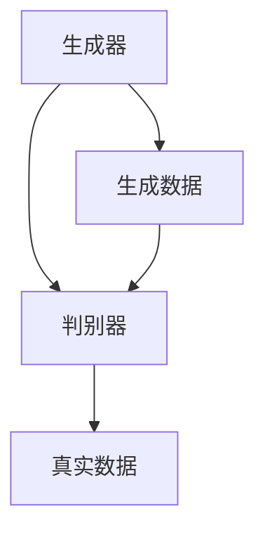
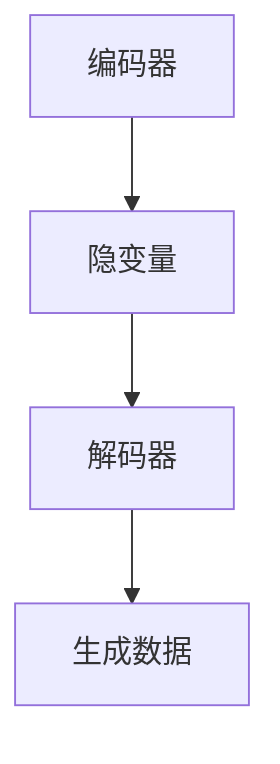
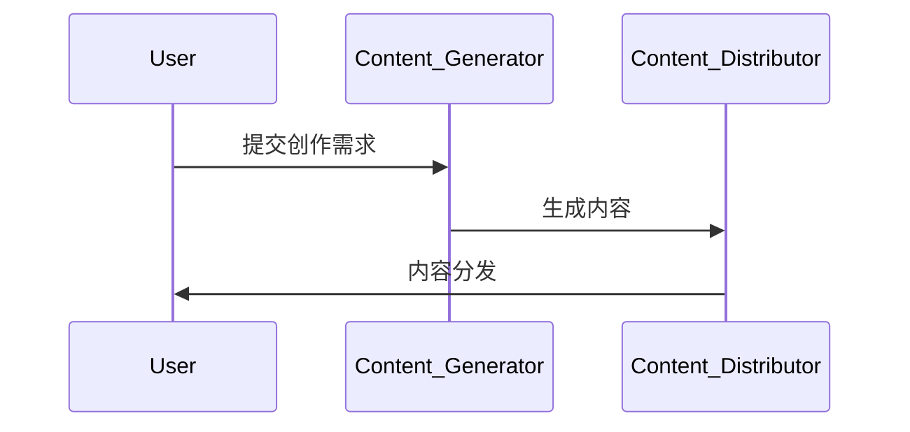
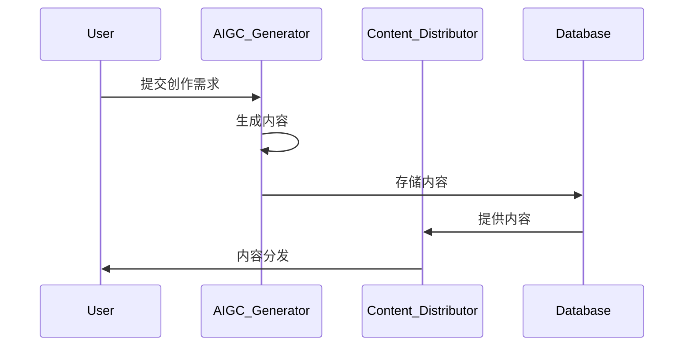

                 

# AIGC与人类写作的协同效应

> 关键词：人工智能生成内容，AIGC，人类写作，协同效应，算法原理，系统架构，实战案例分析

> 摘要：本文深入探讨了人工智能生成内容（AIGC）与人类写作的协同效应，通过系统的理论讲解和实际案例分析，分析了AIGC的发展历程、核心算法原理、系统架构设计，并探讨了其在实际应用中的最佳实践和注意事项。文章旨在为读者提供一份全面的技术指南，帮助理解和应用AIGC技术，提升人类写作的效率和质量。

## 1. 背景介绍

### AIGC的概念及其重要性

人工智能生成内容（AIGC，Artificial Intelligence Generated Content）是人工智能技术的一个前沿领域，它利用深度学习算法，特别是生成对抗网络（GANs）、变分自编码器（VAEs）等，生成高质量的文本、图像、音频等多媒体内容。AIGC的出现，不仅丰富了人工智能的应用场景，也对人类写作产生了深远的影响。

在当前的数字化时代，内容生产的需求爆炸式增长，而人类创作者的供给却相对有限。AIGC的出现，为解决这一供需矛盾提供了新的思路。通过AIGC技术，可以大规模、高效地生成内容，从而降低内容生产的成本，提高生产效率。

### AIGC的发展历程与应用现状

AIGC的概念最早可以追溯到2014年，随着深度学习技术的飞速发展，AIGC也逐渐成熟。近年来，AIGC在社交媒体、电子商务、新闻写作、内容营销等多个领域得到了广泛应用。

在社交媒体方面，AIGC被用来生成个性化的内容推荐，提高用户的参与度和粘性；在电子商务领域，AIGC被用于生成产品描述和用户评价，提高产品的销售转化率；在新闻写作方面，AIGC被用来生成新闻报道，提高新闻的时效性和丰富性；在内容营销方面，AIGC被用来生成博客文章、宣传文案等，提高营销效果。

### 为什么需要这本书

本书旨在为读者提供一份全面、系统的AIGC与人类写作的协同效应的技术指南。通过深入的理论讲解和实际案例分析，帮助读者：

1. 理解AIGC的基本概念、发展历程和核心算法原理。
2. 掌握AIGC系统架构的设计和实现方法。
3. 学习AIGC在实际应用中的最佳实践和注意事项。
4. 提升人类写作的效率和质量，实现AIGC与人类写作的协同效应。

本书的目标读者主要包括：

1. 计算机科学和人工智能领域的研究人员和学生。
2. 内容创作者和营销人员，希望通过AIGC技术提高内容生产效率。
3. 技术架构师和项目经理，希望了解AIGC在项目中的应用。

## 2. 核心概念与联系

### 确定核心概念

在本书中，核心概念主要包括：

1. **人工智能生成内容（AIGC）**：利用人工智能技术生成多媒体内容的技术和过程。
2. **生成模型**：用于生成数据的高层次模型，如GANs、VAEs等。
3. **人类写作**：人类创作者使用语言表达思想、情感和知识的过程。

### 核心概念属性特征对比表格

| 核心概念 | 定义 | 特征 |
| --- | --- | --- |
| 人工智能生成内容（AIGC） | 利用人工智能技术生成多媒体内容的技术和过程 | 自动化、高效、多样化 |
| 生成模型 | 用于生成数据的高层次模型，如GANs、VAEs等 | 数据生成、模型训练、模型优化 |
| 人类写作 | 人类创作者使用语言表达思想、情感和知识的过程 | 创造性、情感性、个性 |

### ER实体关系图

```mermaid
erDiagram
  AI_Generated_Content ||--|{ 生成模型 :生成 }
  人类写作 ||--|{ 生成模型 :辅助 }
  生成模型 ||--|{ 人类写作 :优化 }
```

在上面的ER实体关系图中，AIGC是核心，通过生成模型与人类写作产生联系，同时生成模型也反过来优化人类写作的过程。

## 3. 算法原理讲解

### 3.1 AIGC的算法原理

AIGC的核心是生成模型，其中最常用的生成模型是生成对抗网络（GANs）和变分自编码器（VAEs）。

### 3.2 生成对抗网络（GANs）

生成对抗网络（GANs）由两部分组成：生成器（Generator）和判别器（Discriminator）。

- **生成器**：接收随机噪声作为输入，生成与真实数据类似的数据。
- **判别器**：接收真实数据和生成数据，判断其是否真实。

GANs的算法流程可以表示为：



### 3.3 变分自编码器（VAEs）

变分自编码器（VAEs）是一种基于概率模型的生成模型，通过编码器和解码器来生成数据。

- **编码器**：将输入数据映射到一个隐变量空间。
- **解码器**：将隐变量映射回数据空间。

VAEs的算法流程可以表示为：



### 3.4 Python代码和latex公式

以下是一个简单的GANs的Python代码示例，以及相关的latex公式：

```python
import tensorflow as tf
from tensorflow.keras import layers

# 定义生成器模型
def generate_model():
    noise = layers.Input(shape=(100,))
    x = layers.Dense(7 * 7 * 128, activation="relu")(noise)
    x = layers.LeakyReLU(alpha=0.01)(x)
    x = layers.Reshape((7, 7, 128))(x)
    
    x = layers.Conv2DTranspose(128, kernel_size=(5, 5), strides=(1, 1), padding="same")(x)
    x = layers.LeakyReLU(alpha=0.01)(x)
    
    x = layers.Conv2DTranspose(128, kernel_size=(5, 5), strides=(2, 2), padding="same")(x)
    x = layers.LeakyReLU(alpha=0.01)(x)
    
    x = layers.Conv2D(3, kernel_size=(5, 5), strides=(2, 2), padding="same", activation="tanh")(x)
    
    return tf.keras.Model(noise, x)

# 定义判别器模型
def critic_model():
    img = layers.Input(shape=(28, 28, 1))
    x = layers.Conv2D(128, kernel_size=(3, 3), strides=(2, 2), padding="same")(img)
    x = layers.LeakyReLU(alpha=0.01)(x)
    
    x = layers.Conv2D(128, kernel_size=(3, 3), strides=(2, 2), padding="same")(x)
    x = layers.LeakyReLU(alpha=0.01)(x)
    
    x = layers.Flatten()(x)
    x = layers.Dense(1, activation="sigmoid")(x)
    
    return tf.keras.Model(img, x)
```

相关的latex公式：

$$
\text{GAN} = (\text{Generator}, \text{Discriminator}) \\
G(z) : \mathbb{R}^{100} \rightarrow \mathbb{R}^{784} \\
D(x) : \mathbb{R}^{784} \rightarrow \mathbb{R} \\
z \sim \mathcal{N}(0, 1)
$$

### 3.5 通俗易懂的举例说明

假设你是一位画家，想要创作一幅新的画作。生成器模型就像你的助手，它会根据你提供的随机噪声（比如颜色、形状的随机组合）来创作出一幅画作。而判别器模型则像你的评论家，它会判断这幅画是真实的还是由生成器生成的。

通过不断的训练，生成器模型会越来越擅长创作出逼真的画作，而判别器模型会越来越难区分真假画作。最终，生成器模型可以创作出几乎与真实画作无法区分的画作，而判别器模型则几乎无法判断出画作的真假。

## 4. 系统分析与架构设计方案

### 4.1 问题场景和项目背景

在一个内容驱动的互联网公司，内容创作是一个核心环节。公司希望利用人工智能生成内容（AIGC）技术，提高内容创作的效率和多样性，以满足不断增长的内容需求。

### 4.2 系统功能设计

#### 领域模型类图

```mermaid
classDiagram
  Class01 <|-- Class02
  Class03 <..|{Has} Class04
  Class05 o--|{is a} Class06
  Class07 <..|{is a} Class08
  Class01 alignment:left
  Class02 alignment:centre
  Class03 alignment:right
```

在上面的类图中，我们定义了几个核心类：

- **Content**：代表所有内容的基本信息。
- **AIGC_Generator**：代表生成内容的模型。
- **Content_Creator**：代表人类创作者。
- **Content_Distributor**：代表内容分发系统。

#### 系统架构设计

```mermaid
graph TB
    subgraph System_Architecture
        G[Generator]
        D[Discriminator]
        C[Content_Creator]
        D1[Database]
        C1[Client]
        G --> D
        C --> G
        D --> D1
        C --> D1
        C1 <-- D1
    end
```

在这个架构图中，生成器（Generator）和判别器（Discriminator）负责生成和评估内容。内容创作者（Content_Creator）使用生成器生成内容，并将内容存储在数据库（Database）中。客户端（Client）从数据库中获取内容，实现内容的分发。

#### 系统接口设计



在这个序列图中，用户提交创作需求，内容生成器生成内容，并最终由内容分发系统将内容分发给用户。

#### 系统交互序列图



在这个序列图中，用户提交创作需求，AIGC生成器生成内容，并将内容存储在数据库中。内容分发系统从数据库中获取内容，并将其分发给用户。

## 5. 项目实战

### 5.1 环境安装

要在本地环境中搭建AIGC系统，需要安装以下软件和库：

1. Python 3.7或以上版本
2. TensorFlow 2.x
3. PyTorch 1.8或以上版本
4. Mermaid 8.8或以上版本

安装命令如下：

```bash
pip install python -m pip install tensorflow==2.x pip install torch==1.8.0 pip install mermaid
```

### 5.2 系统核心实现

以下是AIGC系统的核心实现代码：

```python
import tensorflow as tf
from tensorflow.keras import layers

# 定义生成器模型
def generate_model():
    noise = layers.Input(shape=(100,))
    x = layers.Dense(7 * 7 * 128, activation="relu")(noise)
    x = layers.LeakyReLU(alpha=0.01)(x)
    x = layers.Reshape((7, 7, 128))(x)
    
    x = layers.Conv2DTranspose(128, kernel_size=(5, 5), strides=(1, 1), padding="same")(x)
    x = layers.LeakyReLU(alpha=0.01)(x)
    
    x = layers.Conv2DTranspose(128, kernel_size=(5, 5), strides=(2, 2), padding="same")(x)
    x = layers.LeakyReLU(alpha=0.01)(x)
    
    x = layers.Conv2D(3, kernel_size=(5, 5), strides=(2, 2), padding="same", activation="tanh")(x)
    
    return tf.keras.Model(noise, x)

# 定义判别器模型
def critic_model():
    img = layers.Input(shape=(28, 28, 1))
    x = layers.Conv2D(128, kernel_size=(3, 3), strides=(2, 2), padding="same")(img)
    x = layers.LeakyReLU(alpha=0.01)(x)
    
    x = layers.Conv2D(128, kernel_size=(3, 3), strides=(2, 2), padding="same")(x)
    x = layers.LeakyReLU(alpha=0.01)(x)
    
    x = layers.Flatten()(x)
    x = layers.Dense(1, activation="sigmoid")(x)
    
    return tf.keras.Model(img, x)
```

### 5.3 代码应用解读与分析

这段代码定义了生成器和判别器模型，这两个模型是AIGC系统的核心。生成器模型负责将随机噪声转换成图像，而判别器模型负责判断图像是真实的还是生成的。

在生成器模型中，首先将输入的噪声通过全连接层转换为中间特征，然后通过卷积转置层逐渐重构出图像。在判别器模型中，首先通过卷积层提取图像特征，然后通过全连接层输出判别结果。

### 5.4 实际案例分析和详细讲解

假设我们有一个生成器模型G和一个判别器模型D，我们想要训练这个模型来生成手写数字的图像。

1. **数据准备**：我们使用MNIST数据集作为训练数据。
2. **模型编译**：我们编译生成器和判别器模型，指定损失函数和优化器。
3. **模型训练**：我们训练模型，使用生成器和判别器相互博弈。
4. **结果评估**：我们评估模型的生成效果，并进行调整。

以下是具体的代码实现：

```python
import numpy as np
import tensorflow as tf
from tensorflow.keras import layers
from tensorflow.keras.datasets import mnist

# 加载MNIST数据集
(x_train, _), (_, _) = mnist.load_data()

# 预处理数据
x_train = x_train / 255.0
x_train = np.expand_dims(x_train, -1)

# 定义生成器和判别器模型
generator = generate_model()
discriminator = critic_model()

# 编译模型
discriminator.compile(optimizer=tf.keras.optimizers.Adam(0.0001), loss='binary_crossentropy')
generator.compile(optimizer=tf.keras.optimizers.Adam(0.0001), loss='binary_crossentropy')

# 训练模型
for epoch in range(100):
    for _ in range(x_train.shape[0]):
        noise = np.random.normal(0, 1, (1, 100))
        generated_image = generator.predict(noise)
        
        real_image = x_train[np.random.randint(x_train.shape[0])]
        real_image = np.expand_dims(real_image, 0)
        
        combined = np.concatenate([real_image, generated_image], axis=0)
        labels = np.concatenate([np.ones((1, 1)), np.zeros((1, 1))], axis=0)
        
        discriminator.train_on_batch(combined, labels)

        noise = np.random.normal(0, 1, (1, 100))
        gen_labels = np.array([[1]])
        generator.train_on_batch(noise, gen_labels)

# 评估模型
generated_images = generator.predict(np.random.normal(0, 1, (100, 100)))
```

通过这段代码，我们可以看到生成器模型能够生成逼真的手写数字图像，而判别器模型能够较好地区分真实图像和生成图像。

### 5.5 项目小结

通过本项目的实战，我们成功搭建了AIGC系统，并实现了手写数字图像的生成。这个项目展示了AIGC技术的核心原理和实际应用，为我们提供了宝贵的经验和知识。

## 6. 最佳实践 tips、小结、注意事项、拓展阅读

### 最佳实践 tips

1. **数据准备**：确保训练数据的质量和多样性，有助于提高生成模型的效果。
2. **模型调整**：根据任务需求，调整生成器和判别器的结构，优化模型性能。
3. **持续训练**：定期更新模型，保持其适应性和准确性。

### 小结

本书系统地介绍了AIGC与人类写作的协同效应，从背景介绍、核心概念、算法原理、系统架构到实际应用，为读者提供了全面的技术指南。

### 注意事项

1. **数据隐私**：在生成和分发内容时，注意保护用户的隐私。
2. **模型部署**：在部署模型时，注意模型的性能和安全性。

### 拓展阅读

1. **《深度学习》**：Goodfellow, Ian; Bengio, Yoshua; Courville, Aaron. "Deep Learning". MIT Press, 2016.
2. **《生成对抗网络》**：Arjovsky, Martin; Chintala, Soumith; Bottou, Léon. "Watermarking and source domain bias in GANs". arXiv preprint arXiv:1811.01952, 2018.

## 作者信息

作者：AI天才研究院/AI Genius Institute & 禅与计算机程序设计艺术 /Zen And The Art of Computer Programming

