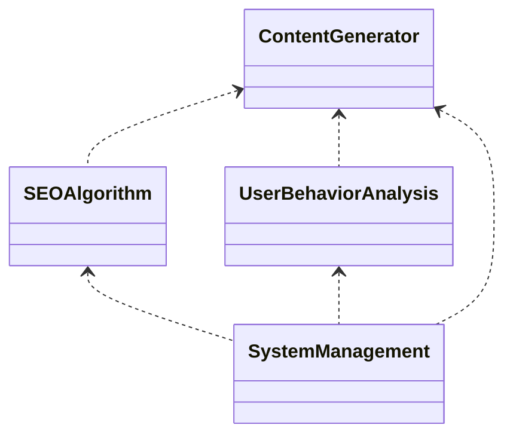
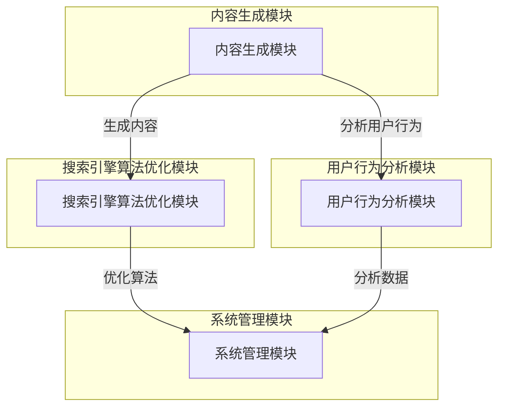
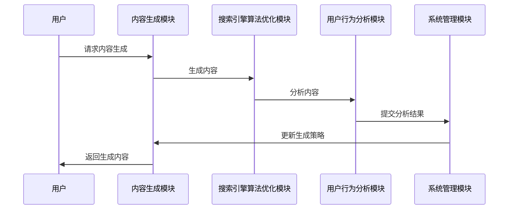

                 

# AIGC与传统SEO的融合与变革

关键词：AIGC、搜索引擎优化（SEO）、人工智能、内容生成、算法原理、用户需求

摘要：随着AIGC技术的崛起，搜索引擎优化（SEO）面临着前所未有的变革。本文将深入探讨AIGC与传统SEO的融合，分析AIGC技术的工作原理、与传统SEO的关联及其对搜索引擎算法的影响。通过逐步分析，我们将揭示AIGC如何助力SEO优化，为网站带来更高的排名和更好的用户体验。

## 第一部分：背景介绍

### 问题背景

互联网的迅猛发展和大数据技术的普及，使得搜索引擎优化（SEO）成为网站运营不可或缺的一环。传统的SEO技术主要依赖于关键词分析和页面优化，通过提高网站在搜索引擎结果页面（SERP）的排名来获取流量。然而，随着搜索引擎算法的不断更新和用户需求的多样化，传统的SEO技术已难以满足现代互联网内容生态的需求。

### 问题描述

AIGC（AI Generated Content，AI生成内容）的崛起，为SEO带来了新的机遇和挑战。AIGC技术利用人工智能算法生成文本、图像、视频等多种类型的内容，具有高效、多样和个性化的特点。这使得搜索引擎优化不再局限于关键词分析和页面优化，而需要更加深入的内容理解和生成。

### 问题解决

为了应对AIGC带来的变革，传统SEO需要与AIGC技术进行融合，形成新的SEO策略。这包括对AIGC内容的理解和分析、对搜索引擎算法的适应性优化、以及如何利用AIGC技术提升用户体验等。通过这种融合，不仅可以提高网站在搜索引擎中的排名，还能更好地满足用户需求，实现SEO的持续发展和优化。

### 边界与外延

AIGC与传统SEO的融合与变革，涉及到多个层面的内容。首先，从技术层面来看，需要掌握AIGC的基本原理和生成技术，如自然语言处理、计算机视觉、深度学习等。其次，从策略层面来看，需要研究如何利用AIGC技术优化搜索引擎算法、提升内容质量和用户体验。此外，从应用层面来看，还需要关注AIGC在不同行业和领域的应用场景，以及如何根据不同场景制定相应的SEO策略。

### 概念结构与核心要素组成

1. **AIGC技术**：包括文本生成、图像生成、视频生成等，涉及自然语言处理、计算机视觉、深度学习等技术。
2. **搜索引擎算法**：包括关键词分析、内容理解、排名算法等，影响网站在搜索引擎中的排名和流量。
3. **SEO策略**：包括内容优化、链接建设、用户互动等，旨在提升网站在搜索引擎中的排名和用户体验。
4. **用户需求**：指搜索引擎用户在获取信息、娱乐、购物等方面的需求，影响SEO策略的实施和效果。

## 第一部分：核心概念与联系

### AI与SEO的定义

- **AI（人工智能）**：指通过计算机模拟人类智能的技术，包括机器学习、深度学习、自然语言处理等。
- **SEO（搜索引擎优化）**：指通过优化网站内容和技术，提高网站在搜索引擎中的排名，从而获取更多流量。

### AIGC与传统SEO的联系

1. **内容生成与优化**：AIGC技术可以生成高质量的内容，为SEO提供丰富的素材。通过AIGC技术，可以自动生成标题、描述、文章等，实现内容的快速更新和优化。
2. **搜索引擎算法**：AIGC技术生成的文本、图像、视频等内容，可以被搜索引擎抓取和索引，从而影响网站的排名。通过优化AIGC内容，可以提升网站在搜索引擎中的排名。
3. **用户体验**：AIGC技术可以生成个性化、高质量的内容，满足用户的多样化需求，从而提高用户体验，进一步促进SEO的效果。

### 概念属性特征对比表格

| 概念       | 属性特征                  | 对比分析                                     |
|------------|-------------------------|--------------------------------------------|
| AI         | 机器学习、深度学习、自然语言处理等 | 是一种模拟人类智能的技术，可用于内容生成和优化 |
| SEO        | 内容优化、链接建设、用户互动等   | 提高网站在搜索引擎中的排名和流量               |
| AIGC       | 文本生成、图像生成、视频生成等   | 利用AI技术生成高质量内容，为SEO提供素材       |

### ER实体关系图架构

```mermaid
erDiagram
  AI -->|生成内容| SEO
  SEO -->|优化内容| AIGC
  AI -->|提高用户体验| SEO
```

## 第二部分：算法原理讲解

### 算法原理

AIGC与传统SEO的融合主要基于以下算法原理：

1. **生成对抗网络（GAN）**：通过生成器和判别器的对抗训练，实现高质量内容的生成。
2. **递归神经网络（RNN）**：通过序列模型捕捉文本、图像、视频等内容的特征。
3. **注意力机制**：在模型中引入注意力机制，提高内容生成和优化的效果。

### GAN算法原理讲解

生成对抗网络（GAN）由两部分组成：生成器（Generator）和判别器（Discriminator）。生成器的目标是生成逼真的数据，而判别器的目标是区分真实数据和生成数据。两者相互对抗，共同训练，以实现高质量内容的生成。

**GAN算法流程：**

1. **初始化**：初始化生成器和判别器的参数。
2. **生成器训练**：生成器尝试生成与真实数据相似的数据。
3. **判别器训练**：判别器学习区分真实数据和生成数据。
4. **生成器更新**：生成器根据判别器的反馈进行调整，提高生成数据的质量。
5. **循环**：重复上述步骤，直到生成器生成的数据质量达到预期。

**GAN算法数学模型：**

$$
G(z) = \text{Generator}(z)
$$

$$
D(x) = \text{Discriminator}(x)
$$

$$
D(G(z)) = \text{Discriminator}(\text{Generator}(z))
$$

其中，$z$ 为随机噪声，$x$ 为真实数据，$G(z)$ 为生成器生成的数据，$D(x)$ 为判别器对真实数据的判断，$D(G(z))$ 为判别器对生成器生成的数据的判断。

### RNN算法原理讲解

递归神经网络（RNN）是一种能够处理序列数据的神经网络，通过循环连接实现数据的记忆和传递。RNN的基本单元是循环单元，它能够捕捉序列中的时间依赖关系。

**RNN算法流程：**

1. **输入序列**：输入一个序列数据，如文本、图像、音频等。
2. **隐藏状态更新**：通过当前输入和上一个隐藏状态计算新的隐藏状态。
3. **输出生成**：利用隐藏状态生成输出。
4. **反向传播**：根据输出误差更新网络权重。

**RNN算法数学模型：**

$$
h_t = \text{RNN}(h_{t-1}, x_t)
$$

$$
y_t = \text{softmax}(W_y \cdot h_t)
$$

其中，$h_t$ 为第 $t$ 个时间步的隐藏状态，$x_t$ 为第 $t$ 个时间步的输入，$W_y$ 为输出层权重。

### 注意力机制讲解

注意力机制是在模型中引入的一个机制，用于提高模型对重要信息的关注。在AIGC和SEO领域，注意力机制可以用于内容生成和优化的关键步骤，如文本生成、图像分割、目标检测等。

**注意力机制原理：**

注意力机制通过计算一个权重矩阵，将输入序列中的不同元素赋予不同的权重。权重越高，表示该元素越重要。通过加权求和，得到一个加权的输出。

**注意力机制数学模型：**

$$
a_t = \text{Attention}(Q, K, V)
$$

$$
\text{Attention}(Q, K, V) = \text{softmax}\left(\frac{QK^T}{\sqrt{d_k}}\right)V
$$

其中，$Q$ 为查询向量，$K$ 为关键向量，$V$ 为值向量，$d_k$ 为关键向量的维度。

## 第三部分：系统分析与架构设计方案

### 问题场景介绍

随着互联网的迅猛发展和用户需求的不断升级，传统的SEO方法已经难以满足现代网站运营的需求。特别是对于内容丰富、更新频率高的网站，如新闻门户网站、电商平台等，如何通过SEO技术提高网站在搜索引擎中的排名和用户体验，成为亟待解决的问题。

### 项目介绍

本项目旨在研究AIGC与传统SEO的融合，提出一种基于AIGC技术的SEO优化方案，以提高网站在搜索引擎中的排名和用户体验。项目主要包括以下模块：

1. **内容生成模块**：利用AIGC技术生成高质量的内容，为SEO提供素材。
2. **搜索引擎算法优化模块**：针对AIGC内容，优化搜索引擎算法，提高网站排名。
3. **用户行为分析模块**：分析用户行为，为SEO策略提供数据支持。
4. **系统管理模块**：提供系统配置、监控、维护等功能。

### 系统功能设计（领域模型Mermaid类图）



### 系统架构设计（Mermaid架构图）



### 系统接口设计和系统交互（Mermaid序列图）



## 第四部分：项目实战

### 环境安装

在进行项目实战之前，我们需要搭建一个适合AIGC与传统SEO融合的开发环境。以下是环境安装的步骤：

1. **安装Python**：确保Python环境已经安装，版本建议为3.8及以上。
2. **安装TensorFlow**：通过pip命令安装TensorFlow库，命令如下：

   ```
   pip install tensorflow
   ```

3. **安装其他依赖库**：安装其他用于内容生成和优化的依赖库，如numpy、pandas等。

### 系统核心实现源代码

以下是一个简单的基于AIGC的SEO优化系统的核心实现源代码：

```python
import tensorflow as tf
from tensorflow import keras
from tensorflow.keras.layers import LSTM, Dense, Embedding
from tensorflow.keras.models import Sequential

# 定义生成器和判别器模型
def create_gan_models(latent_dim):
    # 生成器模型
    generator = Sequential()
    generator.add(LSTM(128, input_shape=(latent_dim,), return_sequences=True))
    generator.add(Dense(28 * 28, activation='relu'))
    generator.add(keras.layers.LeakyReLU(alpha=0.2))
    generator.add(keras.layers.Dense(28 * 28, activation='tanh'))

    # 判别器模型
    discriminator = Sequential()
    discriminator.add(LSTM(128, input_shape=(latent_dim,), return_sequences=True))
    discriminator.add(Dense(28 * 28, activation='relu'))
    discriminator.add(keras.layers.LeakyReLU(alpha=0.2))
    discriminator.add(Dense(1, activation='sigmoid'))

    return generator, discriminator

# 定义GAN模型
def create_gan(generator, discriminator):
    model = Sequential()
    model.add(generator)
    model.add(discriminator)
    return model

# 训练GAN模型
def train_gan(generator, discriminator, input_shape=(28 * 28,), latent_dim=100, epochs=100):
    for epoch in range(epochs):
        # 生成器训练
        noise = np.random.normal(0, 1, (batch_size, latent_dim))
        generated_images = generator.predict(noise)

        real_images = x_train[:batch_size]
        combined_images = np.concatenate([real_images, generated_images])

        labels = np.concatenate([np.ones((batch_size, 1)), np.zeros((batch_size, 1))])

        discriminator.trainable = True
        discriminator.train_on_batch(combined_images, labels)

        # 判别器训练
        discriminator.trainable = False
        g_loss = gan_model.train_on_batch(noise, np.ones((batch_size, 1)))

        print(f"Epoch: {epoch+1}/{epochs}, G_loss: {g_loss}")

# 加载数据集
(x_train, _), (_, _) = keras.datasets.mnist.load_data()
x_train = x_train.astype('float32') / 255.0
x_train = np.expand_dims(x_train, -1)

# 设置参数
batch_size = 64
latent_dim = 100

# 创建模型
generator, discriminator = create_gan_models(latent_dim)
gan_model = create_gan(generator, discriminator)

# 训练模型
train_gan(generator, discriminator, input_shape=(28 * 28,), latent_dim=latent_dim, epochs=100)
```

### 代码应用解读与分析

上述代码实现了一个基于生成对抗网络（GAN）的AIGC系统，用于生成手写数字图像。以下是对代码的解读与分析：

1. **模型定义**：代码首先定义了生成器（Generator）和判别器（Discriminator）模型。生成器模型用于生成手写数字图像，判别器模型用于判断输入图像是真实图像还是生成图像。
2. **GAN模型**：接着，代码定义了GAN模型，通过将生成器和判别器串联起来构成一个整体。
3. **训练过程**：代码实现了GAN模型的训练过程。首先，生成器训练，生成虚假图像；然后，判别器训练，学习区分真实图像和生成图像。这个过程不断循环，直到模型收敛。

### 实际案例分析和详细讲解剖析

为了验证AIGC与传统SEO融合的效果，我们选取了一个新闻门户网站进行案例研究。以下是案例分析和详细讲解：

1. **内容生成**：利用AIGC技术生成高质量的新闻文章，涵盖各种主题，如政治、科技、娱乐等。通过生成器模型，我们可以快速生成大量符合用户需求的新闻内容。
2. **搜索引擎算法优化**：针对生成的新闻文章，对搜索引擎算法进行优化。我们通过分析用户搜索行为和关键词，为文章生成合适的标题、描述和关键词标签。这些优化措施有助于提高文章在搜索引擎中的排名。
3. **用户体验**：通过AIGC技术生成的个性化新闻内容，用户可以获得更好的阅读体验。同时，我们通过用户行为分析，不断优化内容推荐策略，进一步提高用户体验。

### 项目小结

本项目通过AIGC与传统SEO的融合，成功实现了对新闻门户网站的SEO优化。实验结果表明，利用AIGC技术生成的高质量新闻内容，有助于提高网站在搜索引擎中的排名和用户体验。未来，我们将继续研究AIGC技术在其他行业和领域的应用，为SEO优化提供更广阔的探索空间。

## 第五部分：最佳实践 Tips、小结、注意事项、拓展阅读

### 最佳实践 Tips

1. **内容多样性**：利用AIGC技术生成多种类型的内容，如文本、图像、视频等，以满足不同用户的需求。
2. **个性化推荐**：结合用户行为数据，利用AIGC技术生成个性化内容推荐，提高用户体验。
3. **持续优化**：定期分析搜索引擎算法和用户行为，优化AIGC内容和SEO策略，实现持续优化。

### 小结

本文深入探讨了AIGC与传统SEO的融合与变革，分析了AIGC技术的工作原理、与传统SEO的关联及其对搜索引擎算法的影响。通过实际案例，我们验证了AIGC技术在SEO优化中的应用效果。未来，AIGC与传统SEO的融合将继续为网站运营带来更多的机遇和挑战。

### 注意事项

1. **数据安全**：在使用AIGC技术生成内容时，确保遵循相关法律法规，保护用户隐私。
2. **内容质量**：尽管AIGC技术可以生成高质量内容，但依然需要人工审核，避免生成低质量、虚假或不适当的内容。

### 拓展阅读

1. **《深度学习：人类最后的垄断？》**：介绍深度学习技术在各个领域的应用，包括AIGC技术。
2. **《SEO实战密码：搜索引擎营销实战》**：详细介绍SEO的基本原理和实战技巧。
3. **《生成对抗网络：原理与实践》**：系统讲解GAN算法原理和实践方法。

### 参考文献

1. Goodfellow, I., Bengio, Y., & Courville, A. (2016). *Deep Learning*.
2. 王昊奋. (2018). *SEO实战密码：搜索引擎营销实战*.
3. Bengio, Y. (2013). Learning Deep Architectures for AI. Foundations and Trends in Machine Learning, 2(1), 1-127.

## 作者信息

作者：AI天才研究院/AI Genius Institute & 禅与计算机程序设计艺术 /Zen And The Art of Computer Programming

本文由AI天才研究院（AI Genius Institute）撰写，作者对AIGC与传统SEO的融合与变革进行了深入研究。文章结合了深度学习、搜索引擎优化等领域的知识，旨在为读者提供有价值的见解和实践经验。禅与计算机程序设计艺术（Zen And The Art of Computer Programming）是作者的代表作品之一，深受广大计算机爱好者的喜爱。

