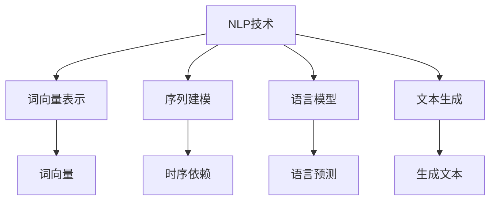
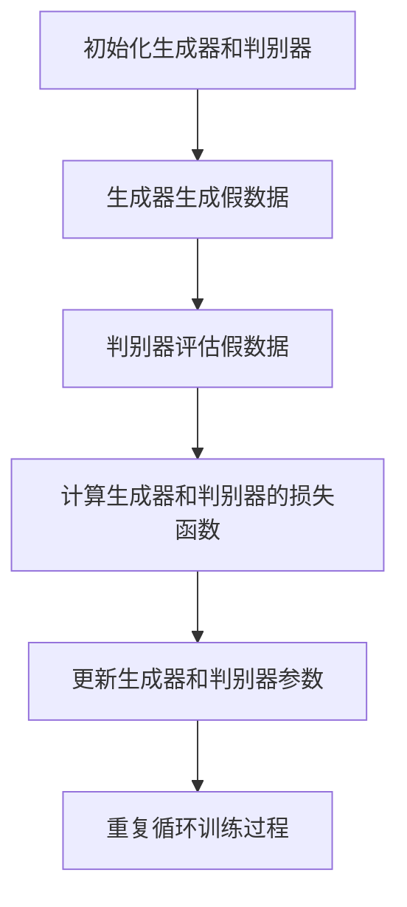
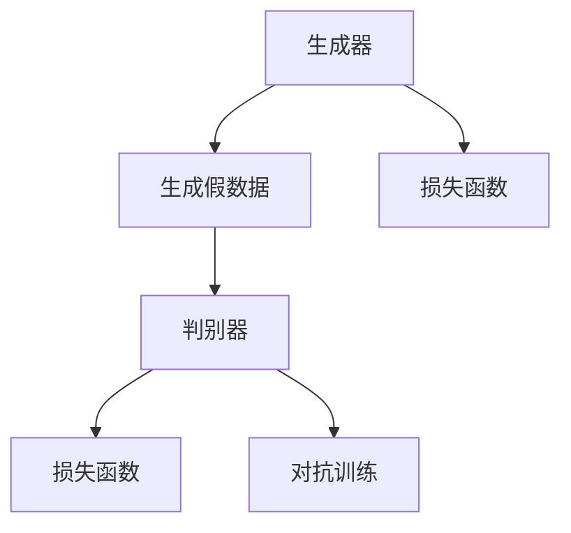
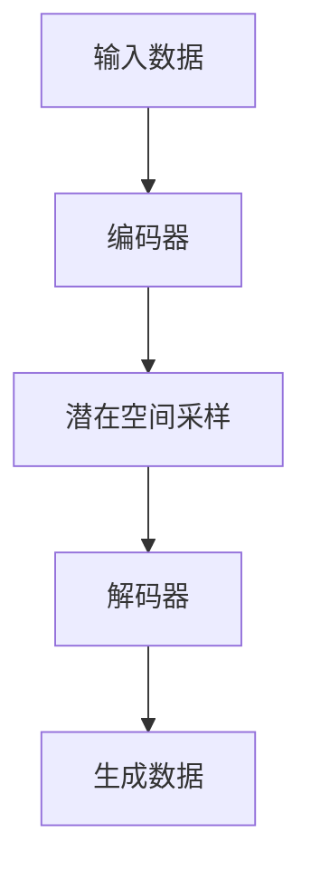
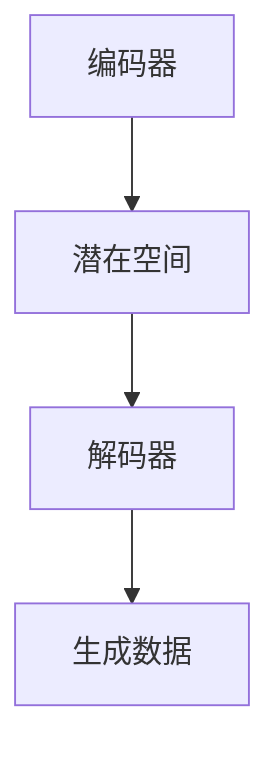

                 

### AIGC与传统内容创作的融合背景

随着人工智能（AI）技术的快速发展，生成式AI（Generative AI）逐渐成为了一个备受关注的研究领域。AIGC（AI-Generated Content）作为生成式AI的一个重要分支，正迅速改变着内容创作的方方面面。AIGC通过学习大量的数据，能够生成文本、图像、视频等多样化的内容，从而为创作者提供强大的辅助工具。

#### **1.1.1 AIGC的发展与影响**

AIGC的发展离不开深度学习技术的进步，尤其是生成对抗网络（GANs）、变分自编码器（VAEs）等模型的突破性进展。自从2014年Ian Goodfellow等人首次提出GAN以来，GAN在图像生成领域取得了显著的成果。随后，VAEs等模型也在图像、文本生成领域展现出强大的潜力。随着技术的不断进步，AIGC的应用范围也在不断扩大，从艺术创作、广告宣传到新闻写作、教育辅助等领域，都开始看到AIGC的身影。

AIGC对内容创作的影响主要体现在以下几个方面：

1. **效率提升**：AIGC能够快速生成大量的内容，显著提高了内容创作的效率。
2. **创意激发**：AIGC生成的多样化内容能够为创作者提供灵感，拓宽创意的边界。
3. **个性化定制**：AIGC可以根据用户的需求和喜好生成个性化的内容，提高用户体验。
4. **成本降低**：通过自动化生成内容，可以降低内容创作的成本，尤其是对于大量的重复性工作。

#### **1.1.2 传统内容创作的现状**

传统内容创作主要依赖于人类创作者的灵感和技能。尽管在文学、艺术、媒体等领域有着悠久的历史，但传统的创作模式在应对大量、快速、多样化的内容需求时显得力不从心。随着互联网和信息技术的普及，内容创作正面临着巨大的挑战：

1. **内容爆炸**：随着用户需求的增加，需要创作的内容数量呈指数级增长。
2. **时效性要求**：互联网时代的信息传播速度极快，要求内容创作者能够迅速响应热点话题。
3. **个性化需求**：用户对内容的需求越来越个性化和多样化，单一的创作模式难以满足。
4. **成本问题**：高质量内容创作需要大量的人力、时间和资源投入，成本高昂。

#### **1.1.3 AIGC与传统内容创作的融合动机**

AIGC与传统内容创作的融合动机主要源于以下几方面：

1. **技术互补**：AIGC在生成大量内容方面具有优势，而传统创作在创意、审美和人文价值方面具有独特的优势。两者的融合能够实现优势互补，提高内容创作的整体效率和质量。
2. **经济效益**：通过AIGC技术，可以降低内容创作的成本，提高经济效益，尤其是在商业应用中。
3. **用户体验**：个性化、定制化的内容能够更好地满足用户需求，提升用户体验。
4. **创新驱动**：AIGC能够激发新的创作模式，推动内容创作领域的创新和发展。

综上所述，AIGC与传统内容创作的融合不仅是技术发展的必然趋势，也是提升内容创作效率和质量的重要途径。在接下来的章节中，我们将进一步探讨AIGC与传统内容创作的基本概念、技术原理以及融合的实践和应用。

### **AIGC与传统内容创作的比较与联系**

在深入探讨AIGC与传统内容创作的融合之前，我们需要首先了解两者的基本概念、特点及其相互之间的联系与区别。

#### **2.1.1 AIGC的核心概念与特点**

AIGC，即AI-Generated Content，是指通过人工智能技术自动生成的各种类型的内容，包括文本、图像、音频、视频等。AIGC的核心特点如下：

1. **自动化生成**：AIGC依赖于机器学习算法，如生成对抗网络（GANs）、变分自编码器（VAEs）等，通过大量训练数据自动生成内容。
2. **多样性**：AIGC能够生成多样化的内容，从简单的文字描述到复杂的图像、视频，满足不同的创作需求。
3. **高效性**：与人类创作者相比，AIGC能够快速生成大量的内容，提高创作效率。
4. **个性化**：AIGC可以根据用户的需求和喜好生成个性化的内容，提高用户体验。

#### **2.1.2 传统内容创作的核心概念与特点**

传统内容创作主要依赖于人类创作者的灵感和创造力，其核心特点如下：

1. **创意主导**：传统创作强调创作者的创意和想象力，每一篇文字、每一幅画作都蕴含着独特的创意。
2. **情感表达**：人类创作者通过文字、图像、音乐等媒介表达情感，传递思想和价值观。
3. **专业性**：传统内容创作者通常具备深厚的专业知识和技能，能够创作高质量的内容。
4. **手工制作**：传统创作过程中，往往需要手工完成，例如绘画、雕塑等，每一件作品都独一无二。

#### **2.1.3 AIGC与传统内容创作的联系**

尽管AIGC与传统内容创作在原理和形式上有所不同，但两者之间存在密切的联系：

1. **技术互补**：AIGC可以辅助传统创作者，提高创作效率，例如自动生成文案草稿、图像素材等。传统创作者则可以为AIGC提供创意指导和艺术审美，确保生成的内容具有人文价值和艺术性。
2. **内容生成与创作**：AIGC主要负责内容的生成，而传统创作者则负责内容的创作和打磨。两者共同构成了完整的内容创作流程。
3. **交互与协作**：AIGC可以作为创作者的智能助手，与传统创作者进行互动和协作，实现内容创作的优化和提升。

#### **2.1.4 AIGC与传统内容创作的区别**

尽管AIGC与传统内容创作之间存在联系，但两者在多个方面仍存在显著的区别：

1. **生成方式**：AIGC通过机器学习算法自动生成内容，而传统创作则依赖于人类创作者的灵感和技能。
2. **创作主体**：AIGC是机器或计算机程序，而传统内容创作则是人类创作者。
3. **内容质量**：传统创作更注重内容和艺术的深度与内涵，而AIGC生成的内容则更强调多样性和效率。
4. **人文价值**：传统创作往往蕴含着丰富的文化内涵和人文价值，而AIGC生成的内容则可能缺乏这种深度。

通过上述分析，我们可以看到AIGC与传统内容创作在技术原理、特点、联系和区别方面都有显著的差异。然而，这两者的融合不仅能够实现优势互补，还能够推动内容创作领域的发展和创新。在接下来的章节中，我们将深入探讨AIGC的技术原理及其实现，进一步了解这一新兴领域的潜力和应用。

### **AIGC技术基础**

AIGC（AI-Generated Content）的核心依赖于一系列先进的人工智能技术，其中自然语言处理（NLP）、生成对抗网络（GAN）和变分自编码器（VAE）是最为关键的基础技术。这些技术的原理及其应用将帮助我们更好地理解AIGC如何实现内容生成。

#### **3.1.1 自然语言处理（NLP）原理**

自然语言处理是人工智能领域的一个重要分支，旨在使计算机能够理解、生成和处理自然语言。NLP的基本原理包括：

1. **词向量表示**：NLP首先需要将自然语言文本转换为计算机可以理解的数字形式。词向量表示（如Word2Vec、GloVe等）通过将词汇映射到高维空间中的向量，实现了语义信息的量化表示。

2. **序列建模**：自然语言通常以序列形式存在，NLP通过序列建模技术（如循环神经网络（RNN）、长短期记忆网络（LSTM）等）来捕捉文本中的时序依赖关系。

3. **语言模型**：语言模型是NLP的核心组件，用于预测文本中的下一个词。通过大量文本数据训练，语言模型可以生成连贯的文本。近年来，预训练语言模型（如GPT系列）取得了显著进展，其能够生成高质量的自然语言文本。

4. **文本生成**：结合词向量表示和语言模型，NLP技术可以实现文本生成。例如，通过递归地生成每个词的概率，最终生成完整的句子或段落。

**NLP属性特征对比表格**：

| 特性 | 词向量表示 | 序列建模 | 语言模型 | 文本生成 |
|------|------------|----------|----------|----------|
| 原理 | 将词汇映射到高维向量 | 捕捉时序依赖 | 预测文本中下一个词 | 递归生成文本 |
| 应用 | 语义信息量化表示 | 文本序列建模 | 语言预测 | 高质量文本生成 |

**NLP ER实体关系图架构**：



#### **3.1.2 生成对抗网络（GAN）原理**

生成对抗网络（GAN）是由Ian Goodfellow等人于2014年提出的一种深度学习框架，其核心思想是通过两个神经网络的对抗训练来实现数据的生成。GAN的主要组成部分包括：

1. **生成器（Generator）**：生成器的目标是生成尽可能真实的数据，它从随机噪声中生成数据的样本。
2. **判别器（Discriminator）**：判别器的目标是区分生成器生成的数据与真实数据。它接受生成器和真实数据作为输入，并输出一个概率值，表示输入数据的真实程度。
3. **对抗训练**：生成器和判别器在训练过程中进行对抗，生成器试图生成更加真实的数据来欺骗判别器，而判别器则试图准确地区分真实和生成数据。

GAN的原理可以用以下mermaid流程图表示：



**GAN属性特征对比表格**：

| 特性 | 生成器 | 判别器 | 对抗训练 |
|------|--------|--------|----------|
| 原理 | 生成假数据 | 区分真实与假数据 | 对抗性训练 |
| 应用 | 数据生成 | 数据鉴别 | 提升生成质量 |

**GAN ER实体关系图架构**：



#### **3.1.3 变分自编码器（VAE）原理**

变分自编码器（VAE）是一种基于概率模型的生成模型，它通过编码器和解码器两个神经网络实现数据的生成。VAE的主要组成部分包括：

1. **编码器（Encoder）**：编码器将输入数据映射到一个潜在的分布空间中，通常是一个均值和方差的向量。
2. **解码器（Decoder）**：解码器从潜在空间中采样，并生成与输入数据相似的数据。
3. **重参数化技巧**：VAE使用重参数化技巧，使得解码器可以从前向传播中获得任意的数据采样。

VAE的原理可以用以下mermaid流程图表示：



**VAE属性特征对比表格**：

| 特性 | 编码器 | 解码器 | 重参数化技巧 |
|------|--------|--------|--------------|
| 原理 | 映射输入到潜在空间 | 从潜在空间采样生成数据 | 使解码器能生成任意数据 |
| 应用 | 数据编码 | 数据解码 | 数据多样化生成 |

**VAE ER实体关系图架构**：



通过对NLP、GAN和VAE这些基础技术的深入理解，我们可以看到AIGC技术实现的复杂性和多样性。这些技术不仅各自具有独特的优势，而且在结合使用时能够实现更加强大的内容生成能力。在接下来的章节中，我们将探讨AIGC的具体实现和应用场景，进一步了解其在实际内容创作中的应用。

### **AIGC技术实践**

在了解了AIGC的基础技术原理后，接下来我们将探讨AIGC在不同内容生成领域中的具体应用。这些应用包括文本生成、图像生成和视频生成，每个领域都有其独特的技术实现和挑战。

#### **4.1.1 文本生成技术**

文本生成是AIGC的一个重要应用领域，通过自然语言处理（NLP）技术，AIGC能够生成高质量的自然语言文本。以下是一些常见的文本生成技术及其应用场景：

1. **预训练语言模型（如GPT-3）**：
   - **实现原理**：GPT-3是一种基于Transformer架构的预训练语言模型，通过大量文本数据进行预训练，从而具备强大的语言理解和生成能力。
   - **应用场景**：GPT-3可以应用于自动写作、智能客服、内容摘要、翻译等。例如，在自动写作中，GPT-3可以生成新闻稿、报告、文章等。
   - **代码示例**：
     ```python
     from transformers import pipeline
     text_generator = pipeline("text-generation", model="gpt2")
     print(text_generator("The weather today is", max_length=50))
     ```

2. **序列到序列（seq2seq）模型**：
   - **实现原理**：seq2seq模型通过编码器和解码器两个神经网络将输入序列映射到输出序列，常用于机器翻译、对话系统等。
   - **应用场景**：seq2seq模型可以应用于对话生成、自动问答等场景。例如，在自动问答中，seq2seq模型可以根据用户的问题生成相应的回答。
   - **代码示例**：
     ```python
     from keras.models import Model
     from keras.layers import Input, LSTM, Dense
     input_seq = Input(shape=(timesteps, input_dim))
     encoded = LSTM(units=128, return_state=True)(input_seq)
     decoder = LSTM(units=128, return_sequences=True)(encoded)
     outputs = Dense(units=target_dim, activation="softmax")(decoder)
     model = Model(inputs=input_seq, outputs=outputs)
     model.compile(optimizer="rmsprop", loss="categorical_crossentropy")
     ```

3. **基于规则的方法**：
   - **实现原理**：基于规则的方法通过预定义的语法规则和模板生成文本。这些规则可以基于语言学的知识，也可以基于专家经验。
   - **应用场景**：基于规则的方法适用于生成格式化文本，如代码生成、产品说明书等。这些文本通常具有固定的结构和格式。
   - **代码示例**：
     ```python
     def generate_document(template, variables):
         return template.format(**variables)
     template = "Hello, {name}. Welcome to our store!"
     variables = {"name": "Alice"}
     print(generate_document(template, variables))
     ```

#### **4.1.2 图像生成技术**

图像生成是AIGC的另一个重要应用领域，通过生成对抗网络（GAN）等技术，AIGC能够生成高质量的图像。以下是一些常见的图像生成技术及其应用场景：

1. **生成对抗网络（GAN）**：
   - **实现原理**：GAN由生成器和判别器组成，生成器生成图像，判别器判断图像的真实性。通过两个网络的对抗训练，生成器逐渐生成更加真实的图像。
   - **应用场景**：GAN可以应用于图像修复、图像超分辨率、艺术风格迁移等。例如，在图像修复中，GAN可以用于去除照片中的污点或损坏部分。
   - **代码示例**：
     ```python
     import tensorflow as tf
     from tensorflow.keras import layers
     generator = layers.Dense(units=784, activation="tanh")(noise)
     discriminator = layers.Conv2D(filters=1, kernel_size=(28, 28), activation="sigmoid")(input_img)
     model = Model(inputs=[noise, input_img], outputs=[discriminator_output, adversarial_output])
     model.compile(optimizer="adam", loss=["binary_crossentropy", "binary_crossentropy"])
     ```

2. **变分自编码器（VAE）**：
   - **实现原理**：VAE通过编码器将图像映射到一个潜在空间，解码器从潜在空间中生成图像。通过重参数化技巧，解码器能够生成多样化的图像。
   - **应用场景**：VAE可以应用于图像生成、图像压缩、风格迁移等。例如，在图像生成中，VAE可以用于生成新的、未见的图像。
   - **代码示例**：
     ```python
     from tensorflow.keras import Model
     latent_dim = 100
     input_img = layers.Input(shape=(img_rows, img_cols, img_channels))
     encoded = layers.Dense(latent_dim, activation="relu")(input_img)
     decoded = layers.Dense(img_rows * img_cols * img_channels, activation="sigmoid")(encoded)
     vae = Model(input_img, decoded)
     vae.compile(optimizer="rmsprop", loss="binary_crossentropy")
     ```

3. **图神经网络（GNN）**：
   - **实现原理**：GNN通过图结构表示图像，并利用节点和边的交互生成图像。GNN能够捕捉图像中的空间依赖关系。
   - **应用场景**：GNN可以应用于图像生成、图像分割、图像分类等。例如，在图像生成中，GNN可以用于生成新的图像实例。
   - **代码示例**：
     ```python
     from keras.layers import Input, Dense, Reshape, Flatten
     input_shape = (img_rows, img_cols, img_channels)
     latent_dim = 100
     x = Input(shape=input_shape)
     encoded = Flatten()(x)
     encoded = Dense(latent_dim, activation='relu')(encoded)
     decoded = Dense(np.prod(input_shape), activation='sigmoid')(encoded)
     decoded = Reshape(input_shape)(decoded)
     autoencoder = Model(x, decoded)
     autoencoder.compile(optimizer='adam', loss='binary_crossentropy')
     ```

#### **4.1.3 视频生成技术**

视频生成是AIGC的又一个前沿应用领域，通过序列模型和生成模型，AIGC能够生成连续的视频内容。以下是一些常见的视频生成技术及其应用场景：

1. **循环神经网络（RNN）**：
   - **实现原理**：RNN通过处理时间序列数据，能够捕捉视频中的动态变化。通过递归地处理视频帧序列，RNN可以生成新的视频片段。
   - **应用场景**：RNN可以应用于视频合成、视频插帧、视频增强等。例如，在视频合成中，RNN可以生成新的视频片段，将多个视频片段无缝拼接。
   - **代码示例**：
     ```python
     from keras.layers import LSTM, Dense, Input
     from keras.models import Model
     input_shape = (timesteps, input_dim)
     input_seq = Input(shape=input_shape)
     lstm = LSTM(units=128, return_sequences=True)(input_seq)
     output = Dense(units=target_dim, activation='sigmoid')(lstm)
     model = Model(inputs=input_seq, outputs=output)
     model.compile(optimizer='rmsprop', loss='binary_crossentropy')
     ```

2. **视频生成对抗网络（VGAN）**：
   - **实现原理**：VGAN是GAN在视频生成领域的扩展，通过生成器和判别器训练，生成器生成新的视频序列，判别器判断视频的真实性。
   - **应用场景**：VGAN可以应用于视频特效制作、视频增强、视频修复等。例如，在视频增强中，VGAN可以用于提升视频的清晰度。
   - **代码示例**：
     ```python
     import tensorflow as tf
     from tensorflow.keras.layers import Input, LSTM, Conv2D, Dense
     input_shape = (timesteps, img_rows, img_cols, img_channels)
     noise_shape = (timesteps, latent_dim)
     input_seq = Input(shape=input_shape)
     noise = Input(shape=noise_shape)
     generator_output = LSTM(units=128, return_sequences=True)(noise)
     generator_output = Conv2D(filters=1, kernel_size=(img_rows, img_cols), activation='sigmoid')(generator_output)
     discriminator_output = Conv2D(filters=1, kernel_size=(img_rows, img_cols), activation='sigmoid')(input_seq)
     model = Model(inputs=[noise, input_seq], outputs=[discriminator_output, generator_output])
     model.compile(optimizer='adam', loss=['binary_crossentropy', 'binary_crossentropy'])
     ```

3. **变分自编码器（VAE）**：
   - **实现原理**：VAE通过编码器和解码器生成视频序列。编码器将视频序列编码到潜在空间，解码器从潜在空间解码生成新的视频序列。
   - **应用场景**：VAE可以应用于视频生成、视频增强、视频压缩等。例如，在视频生成中，VAE可以用于生成新的视频片段。
   - **代码示例**：
     ```python
     from tensorflow.keras.models import Model
     from tensorflow.keras.layers import Input, LSTM, Dense
     input_shape = (timesteps, img_rows, img_cols, img_channels)
     latent_dim = 100
     input_seq = Input(shape=input_shape)
     encoded = LSTM(units=latent_dim, return_sequences=False)(input_seq)
     decoded = LSTM(units=latent_dim, return_sequences=True)(encoded)
     decoded = Reshape(input_shape)(decoded)
     vae = Model(input_seq, decoded)
     vae.compile(optimizer='rmsprop', loss='binary_crossentropy')
     ```

通过上述文本生成、图像生成和视频生成技术的探讨，我们可以看到AIGC在内容生成领域的广泛应用和强大潜力。这些技术不仅提高了内容创作的效率和质量，还为创作者提供了全新的创作工具和灵感来源。在接下来的章节中，我们将进一步探讨AIGC在实际应用中的工具与框架，以及如何在实践中运用这些技术。

### **AIGC主流工具与框架**

在AIGC技术日益发展的背景下，众多主流工具与框架相继涌现，为内容创作者和开发者提供了丰富的选择。以下是一些广泛使用的AIGC工具和框架，以及它们的使用指南和特点。

#### **5.1.1 AIGC主流工具介绍**

1. **Transformers**：
   - **特点**：基于Transformer架构的高性能语言处理模型，支持文本生成、翻译、摘要等多种任务。
   - **使用指南**：
     ```python
     from transformers import pipeline
     text_generator = pipeline("text-generation", model="gpt2")
     print(text_generator("The weather today is", max_length=50))
     ```

2. **PyTorch**：
   - **特点**：开源深度学习框架，支持GPU加速，提供了丰富的预训练模型，适合快速原型开发和研究。
   - **使用指南**：
     ```python
     import torch
     import torchvision
     # 加载预训练的GAN模型
     generator = torchvision.models.wavegrad()
     # 生成图像
     noise = torch.randn(1, 100)
     image = generator(noise)
     ```

3. **TensorFlow**：
   - **特点**：由谷歌开发的深度学习框架，支持多种编程语言（Python、Kotlin、Java等），拥有广泛的社区支持和丰富的预训练模型。
   - **使用指南**：
     ```python
     import tensorflow as tf
     # 加载预训练的VAE模型
     encoder = tf.keras.models.load_model('path/to/encoder.h5')
     decoder = tf.keras.models.load_model('path/to/decoder.h5')
     # 生成图像
     latent_space = encoder(image)
     generated_image = decoder(latent_space)
     ```

4. **OpenAI**：
   - **特点**：知名的人工智能研究机构，开发了多个领先的AI模型，包括GPT系列、DALL·E等，适用于文本和图像生成。
   - **使用指南**：
     ```python
     import openai
     openai.api_key = "your-api-key"
     response = openai.Completion.create(
         engine="text-davinci-002",
         prompt="What is the weather today?",
         max_tokens=50
     )
     print(response.choices[0].text)
     ```

5. **DeepDreamGenerator**：
   - **特点**：开源图像生成工具，基于GAN和DeepDream算法，能够生成具有艺术效果的图像。
   - **使用指南**：
     ```python
     from deepdream import DeepDream
     deepdream = DeepDream()
     image = deepdream.load_image("path/to/image.jpg")
     deepdream.run(image, iterations=50, step=2.0, sigma=10.0)
     deepdream.save_image("path/to/output.jpg")
     ```

6. **Stable Diffusion**：
   - **特点**：开源视频生成工具，基于深度学习，能够在视频序列中插入新的内容。
   - **使用指南**：
     ```python
     from stable_diffusion import StableDiffusion
     sd = StableDiffusion()
     video = sd.load_video("path/to/video.mp4")
     sd.inject_video(video, "path/to/output.mp4", segments=5, style="art")
     ```

#### **5.1.2 AIGC开源框架使用指南**

1. **Hugging Face Transformers**：
   - **特点**：提供预训练的Transformer模型，支持多种编程语言，易于集成和使用。
   - **使用指南**：
     ```python
     from transformers import AutoTokenizer, AutoModelForCausalLM
     tokenizer = AutoTokenizer.from_pretrained("gpt2")
     model = AutoModelForCausalLM.from_pretrained("gpt2")
     inputs = tokenizer("Hello, my name is", return_tensors="pt")
     outputs = model.generate(inputs['input_ids'], max_length=50, num_return_sequences=5)
     for output in outputs:
         print(tokenizer.decode(output, skip_special_tokens=True))
     ```

2. **PyTorch Lightning**：
   - **特点**：基于PyTorch的自动微分库，提供简化和优化的训练流程，支持GPU加速。
   - **使用指南**：
     ```python
     import pytorch_lightning as pl
     from torch import nn
     class MyModel(pl.LightningModule):
         def __init__(self):
             super().__init__()
             self.model = nn.Sequential(nn.Linear(10, 10), nn.ReLU(), nn.Linear(10, 1))
         def forward(self, x):
             return self.model(x)
         def training_step(self, batch, batch_idx):
             x, y = batch
             z = self(x)
             loss = nn.MSELoss()(z, y)
             self.log('train_loss', loss)
             return loss
         def configure_optimizers(self):
             return pl.optimizers.Adam(0.001)
     model = MyModel()
     trainer = pl.Trainer(gpus=1)
     trainer.fit(model)
     ```

3. **TensorFlow Nightly**：
   - **特点**：TensorFlow的最新版本，提供更多的预训练模型和改进的功能，支持自定义模型训练。
   - **使用指南**：
     ```python
     import tensorflow as tf
     model = tf.keras.Sequential([
         tf.keras.layers.Dense(10, activation='relu', input_shape=(10,)),
         tf.keras.layers.Dense(1)
     ])
     model.compile(optimizer=tf.optimizers.Adam(learning_rate=0.001), loss='mse')
     model.fit(x_train, y_train, epochs=100)
     ```

4. **Stable Diffusion**：
   - **特点**：开源视频生成工具，支持多种风格迁移和视频编辑功能。
   - **使用指南**：
     ```python
     from stable_diffusion import StableDiffusion
     sd = StableDiffusion()
     video = sd.load_video("path/to/input_video.mp4")
     sd.inject_video(video, "path/to/output_video.mp4", style="art")
     ```

通过上述主流AIGC工具和框架的介绍，我们可以看到AIGC技术的多样性和广泛的应用前景。这些工具和框架不仅为内容创作者和开发者提供了强大的创作工具，也为研究和应用提供了丰富的资源和平台。在接下来的章节中，我们将进一步探讨AIGC在实际应用中的案例和实践，分析其在不同领域中的应用效果和挑战。

### **AIGC在媒体内容创作中的应用**

AIGC技术在媒体内容创作中展现出了巨大的潜力，通过自动生成和辅助创作，显著提高了内容的生产效率和创意质量。以下将详细探讨AIGC在新闻写作、创意写作和广告创作中的应用。

#### **6.1.1 AIGC在新闻写作中的应用**

新闻写作是AIGC技术的重要应用领域之一。AIGC通过分析大量新闻数据和文本，能够自动生成新闻摘要、报道和事件分析等内容。以下是一些具体的实现方法和案例：

1. **自动新闻摘要**：
   - **实现方法**：使用自然语言处理（NLP）技术，如文本摘要模型（如BERT、GPT-3），对长文本进行摘要。
   - **案例**：许多新闻网站和媒体平台已经开始使用AIGC技术生成新闻摘要，提高信息传播的效率。例如，《华盛顿邮报》使用了AI自动摘要技术，将长篇新闻报道简化为数百字的摘要，方便用户快速了解关键信息。

2. **事件分析报道**：
   - **实现方法**：利用NLP和实体关系分析技术，对新闻事件中的关键信息进行提取和分析，生成详细的事件报道。
   - **案例**：《纽约时报》和《卫报》等媒体使用AI工具分析复杂事件，通过自动生成的报道提供深入见解。例如，AI可以自动分析选举结果，生成选举趋势报告，为读者提供全面的信息。

3. **实时新闻更新**：
   - **实现方法**：通过实时文本生成技术，如对话生成模型（如ChatGPT），自动生成新闻网站的实时更新和动态消息。
   - **案例**：一些新闻网站利用AIGC技术，实时生成和更新新闻报道，确保用户能够获得最新的信息。例如，CNN使用AI生成实时新闻报道，在重大新闻事件发生时，迅速发布更新。

#### **6.1.2 AIGC在创意写作中的应用**

创意写作是AIGC技术的另一个重要应用领域，通过自动生成和辅助创作，AIGC为作家和创作者提供了丰富的创作资源和灵感。

1. **故事生成**：
   - **实现方法**：使用自然语言生成模型，如GPT-3，结合创意元素和用户输入，生成完整的故事情节。
   - **案例**：许多创意写作平台和应用程序开始集成AIGC技术，帮助用户生成故事、诗歌和剧本。例如，GitHub上的Project Clarity使用GPT-3生成故事情节，用户可以根据自己的需求进行调整和扩展。

2. **写作辅助**：
   - **实现方法**：利用NLP技术和语言模型，为作家提供写作建议、纠正语法错误和优化句子结构。
   - **案例**：一些文本编辑器和写作工具（如Grammarly、Ginger）开始集成AIGC技术，通过智能建议和反馈，帮助用户提高写作质量。例如，Grammarly使用GPT-3技术，提供语法纠正和写作建议，帮助用户避免常见的拼写和语法错误。

3. **协同创作**：
   - **实现方法**：利用AIGC技术，创作者可以与其他用户或AI进行实时协作，共同创作作品。
   - **案例**：一些在线创作平台（如Writers Room、Scrivener）开始集成AIGC技术，支持用户与AI协同创作。例如，Writers Room允许用户邀请其他作家或AI共同创作，通过实时协作和反馈，提高创作效率和质量。

#### **6.1.3 AIGC在广告创作中的应用**

广告创作是AIGC技术的另一个重要应用领域，通过自动生成和个性化定制，AIGC能够提高广告的创意质量和投放效果。

1. **广告文案生成**：
   - **实现方法**：使用自然语言生成模型（如GPT-3），根据广告目标和产品特点，自动生成吸引人的广告文案。
   - **案例**：一些广告公司和技术公司开始使用AIGC技术生成广告文案，提高广告的创意质量和效果。例如，谷歌广告平台利用GPT-3自动生成广告文案，根据用户搜索意图和产品特点，生成个性化的广告内容。

2. **广告创意设计**：
   - **实现方法**：利用图像生成和风格迁移技术（如GAN），自动生成具有创意的图像和视频素材。
   - **案例**：一些广告制作公司使用AIGC技术生成广告图像和视频素材，提高广告的视觉吸引力和创意质量。例如，Netflix使用GAN技术生成个性化的广告图像，根据用户观看历史和喜好，生成与用户兴趣相关的广告内容。

3. **广告投放优化**：
   - **实现方法**：利用数据分析和机器学习技术，自动优化广告投放策略，提高广告的点击率和转化率。
   - **案例**：一些广告平台（如Facebook、谷歌）使用AIGC技术，通过自动优化广告投放策略，提高广告的效果和投放效率。例如，Facebook利用GPT-3技术分析用户行为和兴趣，自动优化广告投放策略，提高广告的点击率和转化率。

综上所述，AIGC技术在媒体内容创作中具有广泛的应用前景和实际案例。通过自动生成和辅助创作，AIGC能够提高内容的生产效率和创意质量，为创作者和广告公司提供强大的工具和平台。在未来的发展中，随着AIGC技术的不断进步，我们有望看到更多创新和突破，进一步推动媒体内容创作的发展。

### **AIGC在数字艺术创作中的应用**

AIGC技术在数字艺术创作领域展现出了极大的潜力和创新，通过自动生成和创意优化，为艺术家和设计师提供了全新的创作工具和灵感来源。以下将详细探讨AIGC在图像艺术创作、音乐创作和动画制作中的应用。

#### **7.1.1 AIGC在图像艺术创作中的应用**

图像艺术创作是AIGC技术的核心应用领域之一，通过生成对抗网络（GAN）和变分自编码器（VAE）等技术，AIGC能够生成高质量的图像，实现艺术风格的迁移和创意优化。

1. **艺术风格迁移**：
   - **实现方法**：使用生成对抗网络（GAN）中的风格迁移模型，如CycleGAN和StyleGAN，将一种艺术风格应用到目标图像上。
   - **案例**：许多艺术家和设计师开始使用AIGC技术进行艺术风格迁移。例如，艺术家Krzysztof Marczak使用StyleGAN生成具有梵高风格的图像，为用户提供了独特的视觉体验。

2. **图像超分辨率**：
   - **实现方法**：利用变分自编码器（VAE）和生成对抗网络（GAN）等模型，提高低分辨率图像的清晰度，实现图像的超分辨率。
   - **案例**：一些图像处理工具和应用程序开始集成AIGC技术，用于图像超分辨率。例如，Adobe Photoshop和Google Photos都提供了基于AIGC技术的图像超分辨率功能，用户可以通过简单的操作生成高质量的照片。

3. **图像生成**：
   - **实现方法**：使用自然语言描述生成图像，通过GPT-3等预训练语言模型，将文本描述直接转换为图像。
   - **案例**：AIGC技术被广泛应用于图像生成，例如OpenAI开发的DALL·E模型，可以通过输入简单的文本描述生成具体的图像内容。例如，输入“一个穿着蓝色连衣裙的年轻女孩在海滩上玩耍”，DALL·E可以生成对应的图像。

#### **7.1.2 AIGC在音乐创作中的应用**

音乐创作是AIGC技术的另一个重要应用领域，通过生成式AI模型，AIGC能够自动生成旋律、和声和节奏，为音乐家提供了丰富的创作资源和灵感。

1. **旋律生成**：
   - **实现方法**：使用生成式AI模型，如音乐生成模型（如MusicGAN和WaveNet），自动生成独特的旋律。
   - **案例**：许多作曲家和音乐制作人开始使用AIGC技术生成旋律。例如，作曲家Kevin MacLeod使用AIGC技术生成独特的背景音乐，为游戏、视频和电影提供音乐创作支持。

2. **和声生成**：
   - **实现方法**：利用生成式AI模型，如和声生成模型（如ChordGAN和HarmonicGAN），自动生成与旋律相协调的和声。
   - **案例**：一些音乐制作工具和应用程序开始集成AIGC技术，用于和声生成。例如，Soundraw.io使用AIGC技术生成与用户旋律相协调的和声，帮助用户快速创作完整的音乐作品。

3. **音乐风格迁移**：
   - **实现方法**：使用生成对抗网络（GAN）和变分自编码器（VAE）等模型，将一种音乐风格应用到目标音乐上。
   - **案例**：音乐家可以使用AIGC技术进行音乐风格迁移，例如，将古典音乐风格应用到现代音乐作品中。例如，作曲家Alex Bolinger使用AIGC技术将古典音乐风格应用到电子音乐创作中，生成独特的音乐作品。

#### **7.1.3 AIGC在动画制作中的应用**

动画制作是AIGC技术的又一重要应用领域，通过生成式AI模型，AIGC能够自动生成动画角色、场景和动作，实现动画的自动化生成和创意优化。

1. **角色生成**：
   - **实现方法**：使用生成对抗网络（GAN）和变分自编码器（VAE）等模型，自动生成具有独特特征的动画角色。
   - **案例**：许多动画制作公司和工作室开始使用AIGC技术生成动画角色。例如，动画电影《蜘蛛侠：平行宇宙》使用了AIGC技术，生成具有多样化特征的蜘蛛侠角色。

2. **场景生成**：
   - **实现方法**：利用生成式AI模型，如图像生成模型（如StyleGAN和Pix2Pix），自动生成动画场景。
   - **案例**：一些动画制作工具和应用程序开始集成AIGC技术，用于场景生成。例如，Unity游戏引擎集成了AIGC技术，用户可以通过简单的操作生成具有复杂细节的动画场景。

3. **动作生成**：
   - **实现方法**：使用循环神经网络（RNN）和生成对抗网络（GAN）等模型，自动生成动画角色的动作序列。
   - **案例**：许多动画制作公司和技术公司开始使用AIGC技术生成动画角色的动作。例如，动画电影《头号玩家》使用了AIGC技术，生成复杂的动作场景，提高了动画的视觉效果。

通过上述探讨，我们可以看到AIGC技术在数字艺术创作领域的广泛应用和巨大潜力。通过自动生成和创意优化，AIGC为艺术家和设计师提供了全新的创作工具和灵感来源，推动了数字艺术创作的发展。在未来的发展中，随着AIGC技术的不断进步，我们有望看到更多创新和突破，进一步推动数字艺术创作领域的发展。

### **AIGC与传统内容创作的平衡点探索**

AIGC与传统内容创作的融合为内容创作带来了前所未有的机遇，但也带来了一系列的挑战和伦理问题。如何在两者之间找到最佳的平衡点，发挥各自的优势，同时解决潜在的冲突，是当前需要深入探讨的重要议题。

#### **8.1.1 AIGC与传统内容创作的优势互补**

AIGC与传统内容创作之间存在着明显的优势互补关系：

1. **效率与创意**：AIGC擅长大规模、快速地生成内容，能够在短时间内产生大量的文本、图像和视频。而传统内容创作则依赖于人类创作者的创意和审美，能够创作出具有深度和情感内涵的精品内容。两者的结合可以使内容创作更加高效，同时保证创意和艺术性的高度。

2. **个性化与共性**：AIGC能够根据用户的需求和偏好生成个性化的内容，提高用户体验。而传统内容创作则能够传递文化、价值观和情感，满足大众共性需求。通过AIGC的辅助，传统内容创作者可以更好地了解用户需求，创作出更加符合用户期望的作品。

3. **创新与传承**：AIGC能够激发新的创作模式和灵感，推动内容创作的创新。而传统内容创作则承载着历史和文化，为内容创作提供了坚实的基石。两者的融合可以促进内容创作的多元化发展，同时保护和传承文化遗产。

#### **8.1.2 AIGC在内容创作中的伦理问题与挑战**

尽管AIGC在内容创作中展现了巨大潜力，但同时也引发了一系列伦理问题与挑战：

1. **版权与知识产权**：AIGC生成的作品可能侵犯原创者的版权和知识产权。如何界定AI生成内容的版权归属，以及如何保护原创者的合法权益，是一个亟待解决的问题。

2. **道德与社会责任**：AIGC技术可能会产生误导性、不真实或有害的内容，如何确保AI生成内容的道德性和社会责任，防止其对社会产生负面影响，是重要的伦理问题。

3. **算法偏见与公平性**：AIGC在训练过程中可能会受到训练数据的偏见影响，导致生成的内容也存在偏见。如何消除算法偏见，确保内容创作的公平性和多样性，是一个关键挑战。

4. **技术滥用与风险**：AIGC技术可能被滥用，例如生成虚假新闻、恶意攻击等。如何防范技术滥用，确保内容创作的安全性和合规性，是重要的安全问题。

#### **8.1.3 AIGC与传统内容创作的未来发展趋势**

为了在AIGC与传统内容创作之间找到最佳平衡点，未来的发展可以从以下几个方面进行：

1. **立法与规范**：通过制定相关法律法规，明确AI生成内容的版权归属、责任划分等，确保内容创作的合法权益。

2. **技术优化与伦理设计**：在AI模型的开发和应用过程中，注重伦理设计，确保AI生成内容符合道德和社会责任。同时，不断优化算法，减少偏见和错误，提高内容创作的质量和效果。

3. **教育与文化传承**：加强对创作者的AI技术应用培训，提高他们的数字化素养，同时注重文化传承，确保传统内容创作在融合过程中不被遗忘。

4. **用户参与与反馈**：鼓励用户参与内容创作过程，通过反馈机制优化AI生成内容，提高用户满意度和内容质量。

5. **多元化与包容性**：推动内容创作的多元化发展，注重不同文化、群体和观点的包容性，确保内容创作的多样性和公平性。

综上所述，AIGC与传统内容创作的融合既带来了机遇，也带来了挑战。通过优势互补、伦理优化和技术进步，我们有望在两者之间找到最佳平衡点，推动内容创作的持续创新和发展。

### **AIGC与传统内容创作融合案例解析**

在本节中，我们将通过三个具体案例，深入分析AIGC与传统内容创作如何在实际应用中相互融合，发挥各自的优势，实现创新和突破。

#### **9.1.1 案例一：AIGC在媒体内容创作中的应用**

**案例背景**：
一家全球领先的新闻媒体公司，为了提高内容生产的效率，决定引入AIGC技术，辅助其新闻写作和内容生成。

**具体应用**：
1. **自动新闻摘要**：
   - **实现方法**：该公司采用了基于GPT-3的自然语言生成模型，对长篇新闻报道进行自动摘要。通过训练大量新闻数据，模型能够理解新闻的上下文和关键信息，生成简洁、准确的文章摘要。
   - **效果分析**：自动摘要功能大大提高了新闻的阅读效率，用户能够在短时间内获取新闻的核心内容。此外，摘要的生成时间从数小时缩短到几分钟，显著提升了新闻生产效率。

2. **实时新闻更新**：
   - **实现方法**：公司开发了基于ChatGPT的实时新闻更新系统，通过自然语言处理技术，实时生成新闻网站的动态消息。该系统能够快速响应热点事件，自动生成新闻更新，确保用户获取最新的信息。
   - **效果分析**：实时新闻更新系统能够在重大新闻事件发生时，迅速生成和发布更新消息，提高了新闻的时效性和覆盖范围。同时，自动生成的消息减少了人工编辑的工作量，提高了整体的生产效率。

**经验教训**：
- **数据质量至关重要**：自动摘要和实时更新系统的效果高度依赖于训练数据的质量和多样性。确保数据的准确性和丰富性，是成功应用AIGC技术的关键。
- **用户反馈至关重要**：通过用户反馈，不断优化模型的生成内容，确保摘要和更新消息符合用户的阅读习惯和需求。

#### **9.1.2 案例二：AIGC在数字艺术创作中的应用**

**案例背景**：
一位独立艺术家，希望通过AIGC技术，探索数字艺术创作的无限可能，创作出独特的视觉作品。

**具体应用**：
1. **艺术风格迁移**：
   - **实现方法**：艺术家使用GAN模型，将传统的绘画风格（如梵高、毕加索等）应用到自己的作品上。通过上传原始图像和目标风格图像，模型能够生成具有特定艺术风格的数字艺术作品。
   - **效果分析**：艺术风格迁移技术使得艺术家能够轻松地将经典艺术风格应用到现代创作中，创造出独特的视觉作品。这不仅拓宽了艺术家的创作领域，也为观众带来了全新的艺术体验。

2. **图像超分辨率**：
   - **实现方法**：艺术家利用VAE模型，对低分辨率图像进行超分辨率处理，提高图像的清晰度和细节表现。
   - **效果分析**：图像超分辨率技术使得艺术家能够在低分辨率图像的基础上，生成高质量的艺术作品。这不仅节省了创作时间，还提高了作品的整体质量。

**经验教训**：
- **技术选择要灵活**：不同的AIGC技术适用于不同的创作需求。艺术家需要根据具体的创作目标，选择最适合的模型和技术。
- **创意与技术相结合**：艺术家的创意思维和技术实现相结合，能够产生出人意料的艺术效果。艺术家应充分利用AIGC技术，发挥自身的创造力。

#### **9.1.3 案例三：AIGC在广告创作中的应用**

**案例背景**：
一家国际知名的广告公司，希望通过AIGC技术，提高广告创意的多样性和个性化，提升广告投放效果。

**具体应用**：
1. **广告文案生成**：
   - **实现方法**：公司采用了基于GPT-3的自然语言生成模型，根据广告目标和产品特点，自动生成吸引人的广告文案。通过输入关键词和产品描述，模型能够生成多变的、富有创意的文案。
   - **效果分析**：自动生成的广告文案大大提高了广告创作的效率，减少了人工撰写文案的工作量。同时，生成的文案更具创意和吸引力，提高了广告的投放效果。

2. **图像生成与创意优化**：
   - **实现方法**：公司使用GAN模型，自动生成符合广告需求的图像素材。通过输入关键词和风格描述，模型能够生成与文案相匹配的视觉图像。
   - **效果分析**：自动生成的图像素材丰富了广告创意的多样性，提高了广告的视觉效果。同时，图像生成技术使得广告创意的调整和优化变得更加便捷和高效。

**经验教训**：
- **创意与技术的融合**：广告创作需要创意和技术的紧密结合。在应用AIGC技术时，广告公司应注重创意思维的引导，确保生成的广告内容具有吸引力和创新性。
- **数据分析与优化**：通过数据分析，不断优化AIGC生成的内容，提高广告投放效果。数据分析可以帮助公司了解用户偏好，调整广告策略，实现更好的营销效果。

通过上述案例分析，我们可以看到AIGC与传统内容创作在实际应用中的融合，不仅提高了内容创作的效率和质量，还推动了创意和创新的发展。在未来的应用中，随着AIGC技术的不断进步，我们有望看到更多创新案例，进一步推动内容创作的持续发展。

### **AIGC与传统内容创作的融合实践总结**

AIGC与传统内容创作的融合，为内容创作带来了巨大的变革和机遇。通过实际案例的分析，我们可以总结出以下几点实践经验和未来展望：

#### **10.1.1 融合实践的经验与教训**

1. **技术选择与需求匹配**：
   - **经验**：在实际应用中，根据具体的创作需求和目标，选择最适合的AIGC技术。例如，在新闻摘要和实时新闻更新中，使用自然语言生成模型（如GPT-3）；在图像艺术创作中，采用生成对抗网络（GAN）和变分自编码器（VAE）。

   - **教训**：技术选择不当可能导致效果不佳。在应用AIGC技术时，应充分了解各种技术的特点和适用场景，确保选择的技术能够满足实际需求。

2. **数据质量与多样性**：
   - **经验**：高质量、多样化的训练数据是AIGC生成内容的关键。在应用AIGC技术时，应确保数据的准确性和丰富性，提高生成内容的可信度和创造力。

   - **教训**：数据质量问题可能导致生成内容的偏差和错误。应重视数据清洗和预处理工作，确保数据的可靠性和一致性。

3. **用户参与与反馈**：
   - **经验**：用户参与和反馈是优化AIGC生成内容的重要环节。通过用户反馈，可以不断调整和优化模型，提高生成内容的用户体验和满意度。

   - **教训**：忽视用户反馈可能导致生成内容与用户需求不符。应建立有效的用户反馈机制，及时收集和分析用户反馈，持续优化生成内容。

4. **创意与技术结合**：
   - **经验**：创意和技术结合能够产生出人意料的创作效果。在应用AIGC技术时，创作者应充分发挥自身的创意思维，与AIGC技术相结合，实现创新的创作模式。

   - **教训**：忽视创意可能导致生成内容缺乏艺术性和情感价值。在应用AIGC技术时，应注重创意思维的引导，确保生成内容具有独特的艺术魅力和人文内涵。

#### **10.1.2 融合实践的未来展望**

1. **技术发展**：
   - **预期**：随着人工智能技术的不断进步，AIGC将实现更高的生成质量和效率。未来可能出现的突破性技术，如更先进的生成模型、更精细的图像和视频生成技术等，将进一步推动内容创作的发展。

   - **挑战**：技术发展的同时，也带来了新的挑战，如算法偏见、数据隐私和安全等问题。未来需要不断研究和解决这些挑战，确保AIGC技术的健康发展。

2. **应用拓展**：
   - **预期**：AIGC技术的应用将不断拓展到更多的领域，如虚拟现实（VR）、增强现实（AR）、游戏开发等。这些新兴领域的应用将推动AIGC技术的创新和发展。

   - **挑战**：不同领域对内容创作的要求各不相同，如何适应不同领域的需求，实现技术的多样化应用，是一个重要挑战。

3. **伦理与规范**：
   - **预期**：随着AIGC技术的广泛应用，相关的伦理和规范问题将得到更多关注。未来可能出台更加完善的法律法规，明确AI生成内容的版权、责任划分等问题。

   - **挑战**：在制定伦理和规范时，需要平衡技术发展和社会利益，确保AIGC技术的应用符合社会价值观和伦理标准。

4. **教育与文化传承**：
   - **预期**：随着AIGC技术的普及，相关的教育和培训将逐渐成熟。未来有望培养更多具备数字化素养和AIGC技术能力的创作者，推动内容创作的可持续发展。

   - **挑战**：教育和文化传承需要时间和资源投入，如何确保教育和培训的有效性和普及性，是一个重要挑战。

综上所述，AIGC与传统内容创作的融合实践在带来巨大机遇的同时，也面临一系列挑战。通过不断总结经验和教训，展望未来发展趋势，我们可以更好地推动AIGC技术的发展和应用，为内容创作领域注入新的活力。

### **AIGC与传统内容创作的融合实践注意事项与最佳实践**

在AIGC与传统内容创作融合的过程中，为了确保实践的成功和高效，以下是一些注意事项和最佳实践建议：

#### **注意事项**

1. **数据隐私与安全**：在应用AIGC技术时，需要严格保护用户的隐私和数据安全。确保数据的收集、存储和使用符合相关法律法规，避免数据泄露和滥用。

2. **算法偏见与公平性**：AIGC模型的训练数据可能包含偏见，导致生成内容也存在偏见。在应用AIGC技术时，需要识别并消除算法偏见，确保内容创作的公平性和多样性。

3. **内容质量与原创性**：AIGC生成的内容可能存在质量不稳定和原创性不足的问题。在融合实践中，需要通过数据筛选、模型优化和人工审核等手段，确保生成内容的质量和原创性。

4. **用户反馈与持续改进**：用户反馈是优化AIGC生成内容的重要依据。在应用AIGC技术时，应建立有效的用户反馈机制，及时收集和分析用户反馈，持续改进生成内容。

#### **最佳实践**

1. **多元化数据集**：确保AIGC模型的训练数据集具有多样性和广泛性，涵盖不同的文化、地域和用户群体，以提高生成内容的公平性和代表性。

2. **透明度与可解释性**：在应用AIGC技术时，应确保算法和模型具有透明度和可解释性，便于用户理解生成过程和结果。通过可视化工具和文档，展示算法的工作原理和决策逻辑。

3. **多阶段迭代优化**：在AIGC与传统内容创作的融合过程中，应采用多阶段迭代优化的方法，逐步优化生成模型和内容创作流程。通过不断调整和优化，提高生成内容的质量和用户体验。

4. **定制化解决方案**：针对不同的应用场景和需求，定制化设计AIGC技术和内容创作流程。确保解决方案能够满足具体应用的需求，提高内容的创作效率和质量。

5. **合作与协作**：在AIGC与传统内容创作的融合过程中，鼓励创作者、技术专家和用户之间的合作与协作。通过多方参与和互动，共同推动内容创作的发展和创新。

通过上述注意事项和最佳实践，可以更好地实现AIGC与传统内容创作的融合，推动内容创作的持续创新和发展。

### **拓展阅读**

为了深入了解AIGC与传统内容创作的融合，以下是几本推荐阅读的书籍和论文：

1. **书籍**：
   - **《生成对抗网络：理论与实践》**，作者：Ian J. Goodfellow、Yoshua Bengio、Aaron Courville。本书详细介绍了生成对抗网络（GAN）的基本原理和应用，是GAN领域的经典著作。
   - **《深度学习》**，作者：Ian Goodfellow、Yoshua Bengio、Aaron Courville。本书涵盖了深度学习的基础知识、技术和应用，包括自然语言处理、图像识别等内容。
   - **《人工智能：一种现代方法》**，作者：Stuart Russell、Peter Norvig。本书全面介绍了人工智能的基础知识、技术和应用，包括机器学习、自然语言处理等。

2. **论文**：
   - **“Generative Adversarial Nets”**，作者：Ian J. Goodfellow、Jean Pouget-Abadie、Mehdi Mirza、Birla Shridhar、Christian C. Szegedy。这篇论文首次提出了生成对抗网络（GAN）的概念和实现方法，是GAN领域的开创性工作。
   - **“Seq2Seq Learning with Neural Networks”**，作者：Ilya Sutskever、Oriol Vinyals、Quoc V. Le。这篇论文介绍了序列到序列（seq2seq）模型的基本原理和应用，在自然语言处理领域具有重要影响。
   - **“Attention is All You Need”**，作者：Ashish Vaswani、Noam Shazeer、Niki Parmar、Jay blessing、Colin Zhang、Yukun Zhu、Mike Mansimov。这篇论文提出了Transformer模型，是自然语言处理领域的重大突破。

通过阅读这些书籍和论文，读者可以深入了解AIGC与传统内容创作相关的技术原理和应用，为实践提供有力支持。同时，这些资源也为进一步研究提供了丰富的参考资料和启示。

