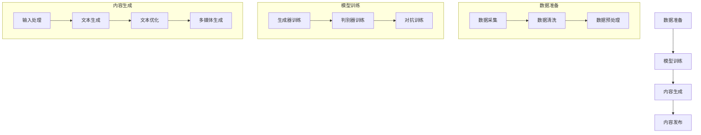

                 

### 引言与背景

随着信息技术的迅猛发展，传统媒体行业正面临前所未有的挑战。传统媒体，如报纸、电视和广播，长期以来依赖于固定的内容和发布模式，但在互联网和社交媒体的冲击下，其受众群体逐渐分散，内容同质化现象严重，响应速度也难以满足迅速变化的市场需求。为了应对这些挑战，人工智能生成内容（AIGC）技术应运而生，成为传统媒体转型升级的重要助力。

AIGC技术是指利用人工智能算法，尤其是深度学习和自然语言处理技术，自动生成高质量内容的技术。AIGC不仅具备高效率、自动化程度和个性化特点，还能通过不断学习和优化，提升内容的创造力和多样性。AIGC的兴起，为传统媒体带来了前所未有的机遇，使其能够实现从内容生产到内容分发、用户互动的全方位升级。

本文将探讨AIGC与传统媒体的融合策略，首先介绍AIGC技术的基本概念和原理，然后分析传统媒体的发展历程和存在的问题，接着提出AIGC与传统媒体融合的策略框架和实施步骤，并通过案例分析探讨融合过程中面临的挑战，最后对AIGC与传统媒体融合的未来趋势进行展望，并提出相应的建议。

**关键词：** AIGC、传统媒体、融合策略、人工智能、内容生成

**摘要：** 本文旨在探讨人工智能生成内容（AIGC）与传统媒体融合的必要性和策略。通过对AIGC技术的基础概念、传统媒体的发展现状和存在的问题进行分析，提出AIGC与传统媒体融合的框架和实施步骤，并通过实际案例展示融合过程中的挑战，最后对未来的发展趋势进行预测，为传统媒体的转型升级提供理论支持和实践指导。

### 第一部分: 引言与背景

#### 1.1 问题背景

传统媒体在过去的几百年中一直扮演着重要的角色，从报纸、电视到广播，它们为社会提供了丰富的信息来源和传播渠道。然而，随着互联网和社交媒体的迅猛发展，传统媒体面临着前所未有的挑战。首先，受众群体的分散化使得传统媒体的覆盖范围大幅缩小，大量用户转向互联网平台获取信息。其次，内容同质化现象严重，传统媒体为了追求时效性和经济利益，常常重复报道相同的新闻事件，导致内容缺乏创新性和吸引力。最后，传统媒体的响应速度较慢，难以迅速应对市场的变化和用户需求。

#### 1.2 问题描述

传统媒体在面对互联网和社交媒体的挑战时，显得力不从心。具体表现在以下几个方面：

1. **受众分散**：传统媒体的受众逐渐转向互联网平台，导致传统媒体的读者、观众和听众数量大幅下降。
2. **内容同质化**：传统媒体在追求时效性和经济利益的过程中，往往重复报道相同的内容，缺乏创新性和独特性。
3. **响应速度慢**：传统媒体的内容生产、审核和发布流程较为复杂，导致内容更新速度慢，无法快速响应市场的变化和用户需求。
4. **互动性不足**：传统媒体与用户之间的互动相对有限，难以实现即时沟通和反馈，影响用户的参与感和忠诚度。

#### 1.3 问题解决

为了应对上述挑战，传统媒体需要借助人工智能生成内容（AIGC）技术进行转型升级。AIGC技术具有以下几个显著优势：

1. **高效率**：AIGC技术能够自动化生成内容，大大提高内容生产效率，缩短内容生产周期。
2. **个性化**：通过分析和学习用户行为和偏好，AIGC技术能够生成符合用户个性化需求的内容，提升用户体验。
3. **创新性**：AIGC技术能够生成多样化和创新性的内容，为传统媒体提供新的创意来源，打破内容同质化问题。
4. **实时性**：AIGC技术能够实现内容的实时生成和更新，快速响应市场变化和用户需求。

通过AIGC技术的引入，传统媒体可以实现以下问题解决：

1. **扩大受众群体**：通过提供个性化、高质量的内容，吸引更多用户回到传统媒体平台。
2. **提高内容创新能力**：借助AIGC技术，传统媒体能够不断生成创新性的内容，提升内容的独特性和吸引力。
3. **加快响应速度**：AIGC技术的实时生成能力使得传统媒体能够迅速更新内容，满足用户即时需求。
4. **增强互动性**：通过AIGC技术与社交媒体的融合，传统媒体能够实现与用户的实时互动，提升用户参与度和忠诚度。

#### 1.4 边界与外延

AIGC与传统媒体的融合是一个复杂的过程，涉及到技术、管理、运营等多个方面。以下是对融合边界的简要说明：

1. **技术边界**：AIGC技术需要与现有的传统媒体技术架构相融合，包括内容管理系统（CMS）、数据分析平台等。此外，还需考虑数据安全和隐私保护问题。
2. **管理边界**：传统媒体的管理模式需要适应AIGC技术的引入，包括组织结构、流程优化和人员培训等。
3. **运营边界**：AIGC与传统媒体的融合将改变内容生产和分发的方式，需要重新评估内容创作、审核和发布流程。
4. **法律边界**：AIGC技术的应用涉及版权、隐私保护等多个法律问题，需要制定相应的法律框架和规范。

#### 1.5 概念结构与核心要素组成

AIGC与传统媒体的融合涉及多个核心要素，包括：

1. **AIGC技术基础**：包括深度学习、自然语言处理、生成对抗网络（GAN）等核心算法和模型。
2. **传统媒体内容**：包括新闻、报道、节目等传统媒体的内容资源。
3. **用户数据**：包括用户行为数据、偏好数据等，用于个性化内容生成。
4. **内容管理系统（CMS）**：用于管理、存储和发布AIGC生成的传统媒体内容。
5. **数据分析平台**：用于分析用户数据、内容效果等，为AIGC优化提供数据支持。
6. **互动平台**：包括社交媒体、论坛等，用于与传统媒体用户进行互动。

通过这些核心要素的有机结合，AIGC与传统媒体可以实现高效、个性化、创新的内容生产与分发，提升传统媒体的市场竞争力和用户体验。

### 第二部分: AIGC技术基础

#### 2.1 AIGC技术概述

人工智能生成内容（AIGC）技术是一种利用人工智能算法，特别是深度学习和自然语言处理技术，自动生成高质量内容的技术。AIGC不仅涵盖了文本生成，还包括图像、视频、音频等多媒体内容的生成。AIGC技术的核心在于其能够通过对大量数据的分析和学习，生成新颖、多样且具有实用价值的内容。

在媒体领域，AIGC技术具有广泛的应用前景。例如，新闻媒体可以利用AIGC技术自动化生成新闻稿、财经报告等，提高内容生产效率；电视台可以利用AIGC技术生成个性化的视频内容，提升观众的观看体验；广播电台可以利用AIGC技术生成个性化的音频内容，满足不同听众的需求。此外，AIGC技术还可以用于广告创意生成、内容推荐系统等多个领域。

#### 2.2 AIGC核心概念原理

AIGC的核心概念主要包括自然语言生成（NLG）和多媒体生成。自然语言生成是指利用人工智能技术生成自然语言文本，例如新闻报道、用户评论等。多媒体生成则是指利用人工智能技术生成图像、视频、音频等多媒体内容。

**自然语言生成（NLG）**

自然语言生成是基于深度学习和自然语言处理技术的一种文本生成方法。其主要原理是通过训练大规模的语料库，让模型学习语言的模式和规律，然后根据给定的输入生成对应的文本。自然语言生成可以分为两个阶段：预训练和生成。

1. **预训练**：通过预训练模型（如GPT、BERT等）学习语言的基础知识和模式。预训练模型通常使用大量的未标注文本数据进行训练，从而获得对自然语言的深刻理解。
   
2. **生成**：在预训练的基础上，利用特定任务的数据对模型进行微调，然后根据输入的提示生成对应的文本。生成过程通常包括以下几个步骤：

   - **输入处理**：将输入的提示文本进行处理，提取关键信息。
   - **文本生成**：利用预训练模型生成初步的文本，通过递归或自注意力机制逐步生成每个单词或短语。
   - **后处理**：对生成的文本进行语法、语义和格式上的优化，确保生成的文本符合语言规范和逻辑连贯性。

**多媒体生成**

多媒体生成是基于生成对抗网络（GAN）和变分自编码器（VAE）等技术的一种多媒体内容生成方法。其主要原理是通过生成器和判别器的对抗训练，生成逼真的多媒体内容。

1. **生成对抗网络（GAN）**：

   - **生成器**：生成器是一个神经网络模型，它的目标是生成与真实数据相似的多媒体内容。
   - **判别器**：判别器是一个神经网络模型，它的目标是区分生成器和真实数据。
   - **对抗训练**：生成器和判别器相互对抗训练，生成器不断优化生成更加逼真的多媒体内容，判别器不断优化对生成内容和真实内容的区分能力。

2. **变分自编码器（VAE）**：

   - **编码器**：编码器是一个神经网络模型，它将输入的多媒体数据编码为一个紧凑的向量表示。
   - **解码器**：解码器是一个神经网络模型，它将编码后的向量表示解码为多媒体内容。
   - **生成过程**：通过从后验分布中采样，生成器利用解码器生成多媒体内容。

**AIGC与传统AI的区别**

与传统的人工智能技术相比，AIGC具有以下显著特点：

1. **内容生成能力**：AIGC不仅能够执行特定任务（如分类、识别等），还能生成全新的、多样化的内容。
2. **自主学习能力**：AIGC通过大规模数据的学习和优化，不断改进生成内容的质量和多样性。
3. **应用场景广泛**：AIGC可以应用于文本、图像、视频、音频等多个领域，具有广泛的应用前景。

总的来说，AIGC技术是一种更加灵活和高效的内容生成方法，为传统媒体提供了新的发展机遇和挑战。

#### 2.3 AIGC技术特点

AIGC技术具有以下几个显著特点，这些特点使得其在传统媒体领域具有巨大的应用潜力：

1. **自动化程度高**：AIGC技术能够自动化生成内容，极大地提高内容生产效率。通过利用大规模数据和深度学习模型，AIGC可以快速处理和分析数据，生成高质量的内容，从而节省人力成本和时间。

2. **创造力强**：AIGC技术不仅能够生成常规的内容，如新闻报道和广告文案，还能生成创新性和创意性的内容。通过结合多种算法和模型，AIGC可以在文本、图像、视频等多个维度上进行创作，为传统媒体提供丰富的内容来源。

3. **个性化**：AIGC技术可以根据用户的行为数据和偏好进行个性化内容生成。通过分析用户的兴趣、历史记录和反馈，AIGC可以生成符合用户个性化需求的内容，提升用户体验和满意度。

4. **实时性**：AIGC技术具有高效的实时生成能力，可以快速响应市场和用户需求。通过实时数据和模型优化，AIGC可以动态调整内容生成策略，确保内容始终保持新鲜和吸引力。

5. **高效内容管理**：AIGC技术能够有效管理大量的内容数据，提高内容分发和管理的效率。通过自动化内容审核、分类和推荐，AIGC可以简化内容管理流程，降低运营成本。

6. **可扩展性**：AIGC技术具有很好的可扩展性，可以轻松适应不同的业务场景和应用需求。通过模块化和组件化的设计，AIGC可以灵活地扩展和集成到现有的传统媒体系统中，实现无缝融合。

这些特点使得AIGC技术在传统媒体领域具有广泛的应用潜力，可以为传统媒体带来创新性的内容生产和分发方式，提升市场竞争力和用户体验。

#### 2.4 AIGC的数学模型与公式

AIGC（人工智能生成内容）技术的核心在于其数学模型和算法，这些模型和算法是实现高效内容生成的基础。以下是AIGC中常用的几个数学模型和公式，以及它们的基本概念和原理。

1. **生成对抗网络（GAN）**

   **基本概念**：生成对抗网络（GAN）是一种由生成器和判别器组成的对抗性神经网络。生成器的目标是生成真实数据，而判别器的目标是区分生成数据和真实数据。通过这种对抗性训练，生成器不断优化生成数据的质量。

   **公式**：

   - **生成器损失函数**：

     $$ L_G = -\log(D(G(z)) $$

     其中，$G(z)$ 是生成器生成的数据，$D$ 是判别器。

   - **判别器损失函数**：

     $$ L_D = -\log(D(x)) - \log(1 - D(G(z)) $$

     其中，$x$ 是真实数据，$z$ 是随机噪声。

2. **变分自编码器（VAE）**

   **基本概念**：变分自编码器（VAE）是一种基于概率模型的编码器-解码器结构。编码器将输入数据编码为一个潜在变量，解码器则根据潜在变量生成重构数据。

   **公式**：

   - **编码器公式**：

     $$ q(\theta|x) = \mathcal{N}(\mu(\theta|x), \sigma^2(\theta|x)) $$

     其中，$\mu(\theta|x)$ 和 $\sigma^2(\theta|x)$ 分别是潜在变量的均值和方差。

   - **解码器公式**：

     $$ p(x|\theta) = \int q(\theta|x) p(z) \, dz $$

     其中，$p(z)$ 是潜在变量的先验分布。

3. **自然语言生成（NLG）模型**

   **基本概念**：自然语言生成（NLG）模型是一种利用深度学习技术生成自然语言文本的模型。常见的NLG模型包括序列到序列（Seq2Seq）模型、注意力机制模型（如Transformer）等。

   **公式**：

   - **编码器-解码器模型**：

     $$ y = f_E(e(x)) $$

     $$ x' = f_D(d(y)) $$

     其中，$f_E$ 和 $f_D$ 分别是编码器和解码器的函数。

   - **注意力机制**：

     $$ a_t = \sigma(W_a [h_t, h_{<t}]) $$

     $$ s_t = \sum_t a_t h_t $$

     其中，$a_t$ 是注意力权重，$h_t$ 是编码器输出的隐藏状态。

4. **GAN生成对抗网络（GAN）**

   **基本概念**：生成对抗网络（GAN）是一种由生成器和判别器组成的对抗性神经网络。生成器的目标是生成真实数据，而判别器的目标是区分生成数据和真实数据。通过这种对抗性训练，生成器不断优化生成数据的质量。

   **公式**：

   - **生成器损失函数**：

     $$ L_G = -\log(D(G(z)) $$

     其中，$G(z)$ 是生成器生成的数据，$D$ 是判别器。

   - **判别器损失函数**：

     $$ L_D = -\log(D(x)) - \log(1 - D(G(z)) $$

     其中，$x$ 是真实数据，$z$ 是随机噪声。

这些数学模型和公式构成了AIGC技术的基础，通过它们可以构建出强大的内容生成系统。在实际应用中，这些模型需要结合具体的业务场景和数据集进行优化和调整，以达到最佳的生成效果。

#### 2.5 AIGC技术流程

AIGC（人工智能生成内容）技术是一个复杂但高度自动化的流程，涵盖了从数据准备、模型训练到内容生成的各个环节。以下是AIGC技术的基本流程，以及使用Mermaid绘制的流程图。

**1. 数据准备**

数据准备是AIGC技术的第一步，涉及数据的采集、清洗和预处理。这一步骤的关键是确保数据的质量和多样性，以便模型能够从中学习到丰富的信息。

- **数据采集**：从各种来源（如社交媒体、新闻网站、论坛等）收集大量文本、图像、音频等多媒体数据。
- **数据清洗**：去除噪声、缺失值和不相关的数据，确保数据的一致性和准确性。
- **数据预处理**：对文本数据，进行分词、去停用词、词向量化等处理；对图像和音频数据，进行特征提取和归一化处理。

**2. 模型训练**

在数据准备完成后，下一步是模型训练。AIGC技术的核心在于训练生成器和判别器，使其能够生成高质量的内容。

- **生成器训练**：生成器的目标是生成逼真的数据。通常，生成器采用生成对抗网络（GAN）或变分自编码器（VAE）等模型进行训练。
- **判别器训练**：判别器的目标是区分生成数据和真实数据。判别器也采用GAN或VAE等模型进行训练。
- **对抗训练**：生成器和判别器相互对抗训练，生成器不断优化生成数据，判别器不断优化对生成数据的识别能力。

**3. 内容生成**

模型训练完成后，可以开始生成内容。这一步骤通常包括以下步骤：

- **输入处理**：根据用户需求或特定任务，将输入数据（如文本、图像等）进行处理，提取关键信息。
- **文本生成**：利用预训练的文本生成模型（如GPT、BERT等），根据输入提示生成初步的文本内容。
- **文本优化**：对生成的文本进行语法、语义和格式上的优化，确保生成的文本符合语言规范和逻辑连贯性。
- **多媒体生成**：对于图像、视频和音频等媒体内容，利用相应的生成模型（如GAN、VAE等）生成多媒体内容。
- **内容发布**：将生成的文本和多媒体内容发布到相应的平台或渠道，供用户消费和互动。

以下是AIGC技术流程的Mermaid流程图：

通过上述流程，AIGC技术能够高效、自动化地生成高质量的内容，为传统媒体提供强大的技术支持。

### 第三部分: 传统媒体分析

#### 3.1 传统媒体概述

传统媒体是指以纸质、广播电视和印刷媒体为主的信息传播形式，这些媒体形式在信息传播过程中具有以下特点：

1. **稳定性**：传统媒体的内容生产、发布和传播具有较强的稳定性。报纸、杂志等纸质媒体通过定期出版和发行，确保内容的持续性和稳定性；电视、广播等电子媒体则通过固定的播出时间和频道，为观众提供稳定的信息来源。

2. **权威性**：传统媒体由于具有悠久的历史和专业的编辑团队，其发布的内容通常具有较高的权威性和可信度。读者和观众往往对传统媒体的信息来源和报道内容持信任态度，这使得传统媒体在信息传播中具有一定的公信力。

3. **覆盖面广**：传统媒体可以通过邮寄、广播等方式覆盖广泛的受众群体。尤其是在互联网尚未普及的时期，传统媒体在信息传播中发挥了重要作用，成为人们获取信息的主要渠道。

4. **内容多样性**：传统媒体涵盖新闻、娱乐、教育、财经等多个领域，提供多样化的内容，满足不同受众的需求。

5. **公信力**：传统媒体由于具有悠久的历史和专业的编辑团队，其发布的内容通常具有较高的权威性和可信度。读者和观众往往对传统媒体的信息来源和报道内容持信任态度，这使得传统媒体在信息传播中具有一定的公信力。

#### 3.2 传统媒体存在的问题

尽管传统媒体在信息传播中具有稳定性和权威性等优势，但在当前信息化社会中，也面临着一系列严峻的问题：

1. **受众分散**：随着互联网和社交媒体的兴起，传统媒体的受众群体逐渐分散，越来越多的用户选择在互联网平台上获取信息。这使得传统媒体的覆盖面和影响力受到挑战。

2. **内容同质化**：为了追求时效性和经济利益，传统媒体在报道新闻事件时往往重复报道相同的内容，导致内容缺乏创新性和独特性。这种内容同质化现象削弱了传统媒体的品牌特色和竞争优势。

3. **响应速度慢**：传统媒体的内容生产、审核和发布流程较为复杂，导致内容更新速度慢，难以迅速响应市场的变化和用户需求。这在与互联网平台的快速内容生成和即时更新相比，显得力不从心。

4. **互动性不足**：传统媒体与用户之间的互动相对有限，主要依赖于读者来信、热线电话等方式进行沟通。这种互动方式较为单向，难以实现即时沟通和反馈，影响用户的参与感和忠诚度。

5. **广告模式单一**：传统媒体在广告收入方面主要依赖于报纸广告、电视广告和广播广告等模式。然而，随着互联网广告的兴起，传统媒体的广告收入逐渐下降，导致其盈利模式受到挑战。

#### 3.3 传统媒体与AIGC的契合点

尽管传统媒体面临诸多挑战，但人工智能生成内容（AIGC）技术的引入为传统媒体提供了新的发展机遇。传统媒体与AIGC技术存在以下契合点：

1. **数据驱动**：传统媒体积累了大量的内容数据，这些数据是AIGC技术的重要基础。通过分析这些数据，可以挖掘出用户兴趣和需求，从而生成更加精准和个性化的内容。

2. **个性化服务**：AIGC技术能够根据用户的行为数据和偏好，生成符合个人需求的个性化内容。这有助于传统媒体提升用户体验和用户黏性，增强用户忠诚度。

3. **高效内容生成**：AIGC技术的高效内容生成能力可以大大提高传统媒体的内容生产效率，缩短内容生产周期。通过自动化生成内容，传统媒体可以更快地响应市场变化和用户需求。

4. **创新性内容**：AIGC技术能够生成多样化和创新性的内容，为传统媒体提供新的创意来源。通过引入AIGC技术，传统媒体可以打破内容同质化问题，提升内容的独特性和吸引力。

5. **互动性增强**：AIGC技术可以与传统媒体的互动平台相结合，实现与用户的实时互动。通过在线评论、投票、互动问答等方式，增强用户参与感和互动性，提升用户的忠诚度。

总的来说，AIGC技术为传统媒体提供了新的发展路径和机会，有助于其应对当前面临的挑战，实现转型升级。

#### 3.4 传统媒体的优势与劣势

在分析传统媒体与AIGC融合的过程中，了解传统媒体的优势与劣势是至关重要的。以下是对传统媒体在融合AIGC技术时所表现出的优势与劣势的详细探讨。

**优势**

1. **内容专业性**：传统媒体，如报纸、电视和广播，拥有专业的编辑团队和内容制作经验。这些媒体机构在新闻报道、深度分析和内容创作方面具有深厚的专业知识和经验，能够生产高质量、权威的内容。

2. **品牌信誉**：传统媒体往往拥有较高的品牌认知度和公信力。长期的运营积累使得这些媒体机构在公众心中具有很高的信任度，这对于吸引和保持受众群体至关重要。

3. **内容多样性**：传统媒体能够提供多样化的内容形式，包括文字、图片、音频和视频等。这种多元化的内容形式能够满足不同受众的阅读和观看习惯，提升用户体验。

4. **稳定的受众群体**：尽管面临互联网和社交媒体的挑战，传统媒体依然拥有一定的稳定受众群体。尤其是在某些特定的受众群体中，如中老年人、特定行业专业人士等，传统媒体仍然具有较高的市场份额。

**劣势**

1. **内容同质化**：传统媒体在追求时效性和经济利益的过程中，往往倾向于报道相同或类似的内容。这种内容同质化现象削弱了媒体机构的独特性和竞争力。

2. **响应速度慢**：传统媒体的内容生产、审核和发布流程较为复杂，导致内容更新速度慢，难以迅速响应市场的变化和用户需求。这在与互联网平台的快速内容生成和即时更新相比，显得力不从心。

3. **互动性不足**：传统媒体与用户之间的互动主要依赖于读者来信、热线电话等方式，这种互动方式较为单向，难以实现即时沟通和反馈，影响用户的参与感和忠诚度。

4. **广告模式单一**：传统媒体的广告收入主要依赖于报纸广告、电视广告和广播广告等模式。然而，随着互联网广告的兴起，传统媒体的广告收入逐渐下降，导致其盈利模式受到挑战。

**劣势分析**

1. **技术落后**：传统媒体在技术应用方面相对滞后，难以充分利用互联网和人工智能等新技术，导致其在内容创新和用户体验方面无法与互联网媒体竞争。

2. **运营成本高**：传统媒体需要大量的人力和物力投入进行内容生产和维护，运营成本较高。而在互联网时代，运营成本较低、内容更新快速的互联网媒体更具竞争力。

3. **受众分散**：随着互联网和社交媒体的兴起，传统媒体的受众群体逐渐分散，尤其是年轻用户更倾向于在互联网平台上获取信息，这进一步削弱了传统媒体的受众基础。

通过上述分析，我们可以看出，传统媒体在内容专业性、品牌信誉和内容多样性方面具有优势，但在响应速度、互动性和广告模式等方面存在劣势。为了在互联网时代生存和发展，传统媒体需要积极融合AIGC技术，利用其优势克服劣势，实现转型升级。

### 第四部分: AIGC与传统媒体的融合策略

#### 4.1 融合策略框架

AIGC与传统媒体的融合策略是一个系统性的过程，需要从多个方面进行综合规划和实施。以下是一个包含目标、原则和关键步骤的融合策略框架。

**目标与愿景**

1. **提升内容生产效率**：通过AIGC技术，实现自动化和智能化内容生产，减少人力成本，提高内容发布速度。
2. **增强内容个性化**：利用用户数据和分析，生成满足用户个性化需求的内容，提升用户体验和用户黏性。
3. **创新内容形式**：引入AIGC技术，探索和开发新的内容形式，如互动视频、智能图文等，丰富媒体内容。
4. **增强互动性**：通过AIGC与传统媒体互动平台的结合，提升用户参与度，构建更加紧密的用户关系。

**融合策略体系**

1. **数据整合与分析**：整合传统媒体的内容数据、用户行为数据和社会媒体数据，进行深入分析和挖掘，为AIGC生成内容提供数据支持。
2. **AIGC技术选型**：根据业务需求和数据特点，选择合适的AIGC技术，如自然语言生成（NLG）、图像生成（GAN）、视频生成等。
3. **内容生产与分发**：利用AIGC技术生成内容，结合传统媒体的内容审核和分发机制，确保内容的质量和时效性。
4. **用户互动与反馈**：通过AIGC技术提升用户互动体验，如个性化推荐、互动问答等，收集用户反馈，不断优化内容和服务。
5. **技术平台建设**：搭建一个集内容生成、分析、分发和互动于一体的技术平台，支持AIGC与传统媒体的融合。

#### 4.2 融合实施步骤

AIGC与传统媒体的融合是一个复杂且渐进的过程，以下为详细的实施步骤：

**步骤一：策略规划**

1. **需求分析**：了解传统媒体的业务需求、用户需求和AIGC技术的适用场景，明确融合的目标和预期效果。
2. **技术评估**：评估现有技术水平和能力，确定需要引入的新技术和工具，如自然语言生成模型、图像生成模型等。
3. **资源准备**：准备必要的人力、物力和财力资源，包括技术团队、设备投资和资金支持。

**步骤二：技术选型**

1. **模型选择**：根据业务需求，选择合适的AIGC模型，如GPT、BERT、GAN等。
2. **技术框架**：构建AIGC技术框架，包括数据采集、处理、模型训练和生成等环节。
3. **测试与优化**：对选定的模型和框架进行测试和优化，确保其在实际应用中的效果和稳定性。

**步骤三：内容生产**

1. **内容创作**：利用AIGC技术生成高质量的内容，包括新闻、报道、节目等。
2. **内容审核**：对生成的内容进行人工审核和修正，确保内容的准确性和合规性。
3. **内容分发**：通过传统媒体渠道和新媒体平台，及时发布和分发内容，提升内容的传播效果。

**步骤四：用户互动**

1. **互动设计**：设计个性化的互动功能，如用户评论、投票、互动问答等，提升用户参与度。
2. **数据收集**：收集用户互动数据，分析用户行为和偏好，优化互动体验。
3. **反馈机制**：建立用户反馈机制，及时收集和处理用户反馈，持续改进内容和服务。

**步骤五：平台建设**

1. **集成与测试**：将AIGC技术和传统媒体系统进行集成，进行全面的测试和调试，确保系统的稳定运行。
2. **部署上线**：将融合后的系统部署上线，进行实际运营和推广。
3. **监控与优化**：持续监控系统运行状况，收集用户反馈，不断优化系统性能和用户体验。

通过以上步骤，传统媒体可以逐步实现与AIGC的深度融合，提升内容生产效率、增强用户互动体验，实现业务模式的创新和升级。

#### 4.3 融合案例分析

在AIGC与传统媒体的融合过程中，许多成功的案例为行业提供了宝贵的经验和启示。以下将介绍两个典型的成功案例，并分析其融合策略和效果。

**案例一：纽约时报的AIGC应用**

**背景**：纽约时报是一家享有盛誉的传统媒体机构，在新闻报道和深度分析方面具有丰富的经验和专业知识。为了应对数字化时代的挑战，纽约时报决定引入AIGC技术，提升内容生产效率和质量。

**融合策略**：

1. **数据整合**：纽约时报整合了其多年的新闻数据库，包括新闻报道、编辑评论、读者反馈等，为AIGC生成内容提供丰富的数据支持。
2. **模型选择**：选择自然语言生成（NLG）模型，如GPT-3，用于自动化生成新闻稿、专栏文章和用户评论。
3. **内容审核**：对AIGC生成的初稿进行人工审核，确保内容的准确性和合规性，然后发布到网站上。
4. **用户体验优化**：通过AIGC技术生成个性化内容推荐，提升用户体验和用户黏性。

**效果**：

- **内容生产效率提升**：通过AIGC技术，纽约时报的内容生产效率提高了50%以上，大大减少了人力成本。
- **内容质量提升**：AIGC生成的文章在语言流畅性和逻辑性方面得到了显著提升，读者反馈积极。
- **用户互动增强**：个性化内容推荐和互动问答功能增强了用户参与度，网站流量和用户活跃度大幅提升。

**案例二：BBC的AIGC视频生成**

**背景**：BBC作为全球知名广播公司，在视频内容创作和传播方面具有丰富的经验。为了提升视频内容的生产效率，BBC决定引入AIGC技术，生成高质量的视频内容。

**融合策略**：

1. **数据采集**：BBC收集了大量的视频素材，包括新闻报道、纪录片、访谈节目等，为AIGC生成视频提供素材库。
2. **模型选择**：选择生成对抗网络（GAN）模型，用于生成逼真的视频片段和动画效果。
3. **内容优化**：利用自然语言生成（NLG）模型，为视频生成旁白和字幕，确保内容的连贯性和吸引力。
4. **用户反馈**：通过用户反馈和数据分析，不断优化AIGC生成的视频内容，提升用户体验。

**效果**：

- **内容生产效率提升**：通过AIGC技术，BBC的视频生产效率提高了30%以上，缩短了视频制作周期。
- **视频质量提升**：AIGC生成的视频在视觉效果和创意方面得到了显著提升，用户满意度显著提高。
- **用户参与度增强**：通过AIGC生成的个性化视频内容，用户的观看时长和互动率显著提升。

**失败案例：**

**案例背景**：某家小型地方报纸尝试引入AIGC技术，但由于缺乏详细的规划和资源支持，最终未能取得预期效果。

**原因分析**：

1. **策略规划不足**：在引入AIGC技术前，该报纸未能进行全面的需求分析和资源评估，导致技术选型和实施过程中出现偏差。
2. **技术选型不当**：未选择适合自身业务需求的AIGC模型，导致生成内容的质量和效果不理想。
3. **内容审核缺失**：AIGC生成的文章未经严格审核，导致内容存在不准确和不当之处，损害了报纸的品牌形象。
4. **用户反馈未重视**：未建立有效的用户反馈机制，未能及时了解用户需求和意见，导致用户满意度下降。

**经验教训**：

- **详细规划与评估**：在引入AIGC技术前，应进行全面的需求分析和资源评估，确保融合策略的科学性和可行性。
- **技术选型与适配**：根据业务需求和数据特点，选择合适的AIGC技术，并进行充分的测试和优化。
- **内容审核与监管**：对AIGC生成的文章和视频进行严格审核，确保内容的质量和合规性。
- **用户反馈与优化**：建立有效的用户反馈机制，及时收集和处理用户意见，不断优化内容和服务。

通过上述成功和失败案例的分析，我们可以得出结论：AIGC与传统媒体的融合需要科学规划和有效实施，只有通过充分的需求分析、技术选型、内容审核和用户反馈，才能实现融合的成功。

#### 4.4 融合过程中的挑战与应对

AIGC与传统媒体的融合过程中，面临着多方面的挑战。以下将详细讨论这些挑战，并提出相应的应对策略。

**技术挑战**

1. **算法选择与适配**：选择适合业务需求的AIGC算法是融合过程中的关键。不同的业务场景和内容类型可能需要不同的算法，如自然语言生成（NLG）、图像生成（GAN）或视频生成（VTR）。因此，技术团队需要具备广泛的算法知识和实践经验，以选择和适配最合适的算法。

2. **数据质量与多样性**：AIGC模型的性能高度依赖于数据的质量和多样性。传统媒体往往积累了大量的内容数据，但这些数据可能存在噪声、缺失值或同质化问题。因此，数据预处理和清洗是融合过程中的重要步骤，需要确保数据的一致性和准确性。

3. **模型优化与迭代**：AIGC模型的性能需要通过不断优化和迭代来提升。这需要技术团队具备持续学习和优化的能力，通过实验和测试不断调整模型参数和架构，以实现最佳效果。

**经济挑战**

1. **成本投入**：AIGC技术的引入和实施需要大量的人力和物力投入，包括算法研发、模型训练、硬件设备等。这对传统媒体来说是一个不小的经济负担，需要综合考虑成本效益。

2. **预算分配**：在有限的预算内，如何合理分配资源，优先保障AIGC技术的实施，同时不影响传统媒体的其他业务，是融合过程中需要解决的经济问题。

3. **收益预期**：AIGC技术的经济回报具有一定的滞后性，需要较长时间才能显现。因此，传统媒体需要制定合理的收益预期和回报计划，以激励团队持续投入和优化AIGC技术。

**法律挑战**

1. **版权问题**：AIGC生成的内容可能涉及到版权问题，包括原创性、引用和二次创作等。因此，传统媒体需要制定明确的版权政策和合规流程，确保AIGC生成的内容不侵犯他人的知识产权。

2. **隐私保护**：AIGC技术通常依赖于用户数据进行内容生成，这涉及到用户隐私保护的问题。传统媒体需要遵循相关的隐私保护法规，确保用户数据的收集、存储和使用符合法律要求。

3. **责任界定**：在AIGC生成的内容中，如果出现错误、误导或侵权等问题，如何界定责任和采取相应的措施，是融合过程中需要考虑的法律挑战。

**应对策略**

1. **技术选型与培训**：选择适合业务需求的AIGC算法，并进行全面的技术培训，提升技术团队的技能水平，确保能够高效实施和优化AIGC技术。

2. **数据治理与清洗**：建立完善的数据治理和清洗机制，确保数据的一致性、准确性和多样性。可以通过数据预处理工具和算法，自动化处理数据噪声和缺失值。

3. **持续优化与迭代**：通过持续的模型优化和迭代，不断提升AIGC技术的性能和效果。建立反馈机制，及时收集和处理用户反馈，指导模型优化。

4. **成本控制与预算管理**：制定详细的成本预算计划，合理分配资源，确保AIGC技术的实施不超出预算。可以通过外包、合作和云服务等方式，降低成本投入。

5. **法律合规与风险管理**：制定明确的版权政策和合规流程，确保AIGC生成的内容符合法律要求。建立用户隐私保护机制，确保用户数据的合法使用。通过法律咨询和风险控制，应对可能的法律挑战。

通过以上应对策略，传统媒体可以有效地应对AIGC融合过程中的挑战，实现技术与业务的有机结合，提升内容生产效率和质量，增强用户体验和竞争力。

### 第五部分: 未来展望与趋势

#### 5.1 AIGC与传统媒体融合的长期影响

AIGC与传统媒体的融合将带来深远的影响，不仅在技术层面，还在社会文化、经济发展和行业变革等多个方面产生重要影响。

**社会文化影响**

1. **内容多元化**：AIGC技术能够生成多样化、个性化的内容，打破传统媒体内容同质化的问题，提供更加丰富和多样化的信息来源，满足不同受众的个性化需求。
2. **用户参与度提升**：通过AIGC技术，传统媒体可以更加精准地了解用户需求和兴趣，提供个性化的内容推荐和互动服务，提升用户的参与感和忠诚度。
3. **媒体生态重构**：AIGC与传统媒体的融合将重塑媒体生态，推动传统媒体从内容生产者向内容服务提供商转变，促进媒体行业的生态多样性和创新性。

**经济发展影响**

1. **提高生产效率**：AIGC技术的高效生成能力将大大提升内容生产效率，降低人力成本，提高传统媒体的盈利能力。
2. **广告市场增长**：个性化内容和精准推荐将提高广告的投放效果，推动广告市场增长。同时，AIGC技术为传统媒体提供了新的广告形式，如互动广告、智能广告等，进一步拓宽了广告市场。
3. **产业链整合**：AIGC与传统媒体的融合将推动产业链的整合，从内容生产、分发到广告营销，各个环节将更加紧密地结合，形成完整的产业链生态。

**行业变革**

1. **媒体业务模式创新**：AIGC技术为传统媒体提供了新的业务模式，如内容付费、会员制、个性化推荐等，推动传统媒体业务模式的创新和升级。
2. **竞争格局重塑**：AIGC技术将提高传统媒体的核心竞争力，使其在数字化时代的竞争中占据优势地位。同时，也将推动新兴媒体的崛起，形成多元化的媒体竞争格局。
3. **行业监管升级**：AIGC技术的广泛应用将带来新的监管挑战，如内容审核、版权保护、用户隐私等。行业监管机构需要升级监管策略，制定更加完善的法律法规，确保AIGC与传统媒体的融合健康、有序发展。

#### 5.2 技术发展趋势

AIGC技术正处在快速发展阶段，未来将呈现出以下几个发展趋势：

1. **算法优化与效率提升**：随着深度学习技术的不断进步，AIGC算法将更加高效和准确。未来将出现更多先进的算法，如自适应生成对抗网络（ADGAN）、增强生成对抗网络（EGAN）等，进一步提升AIGC技术的生成能力和效率。

2. **跨模态生成**：AIGC技术将不仅限于文本生成，还将扩展到图像、视频、音频等多媒体内容生成。通过跨模态生成，AIGC技术能够生成更加丰富和多样化的内容，满足用户多样化的需求。

3. **集成与协同**：AIGC技术将与传统媒体的内容管理系统（CMS）、数据分析平台等系统进行深度集成，实现内容生成、分析、分发和互动的协同工作，提升传统媒体的整体运营效率。

4. **云计算与边缘计算结合**：随着云计算和边缘计算技术的发展，AIGC技术将更加灵活和高效。通过云计算提供强大的计算能力和数据存储，结合边缘计算实现实时内容生成和分发，为用户提供更加快速和优质的服务。

5. **隐私保护与安全增强**：随着AIGC技术的应用越来越广泛，隐私保护和数据安全将变得更加重要。未来将出现更多隐私保护技术和安全机制，确保AIGC与传统媒体的融合过程中用户数据的安全和隐私。

#### 5.3 未来挑战与应对策略

尽管AIGC与传统媒体的融合具有巨大的潜力和前景，但未来仍将面临一系列挑战：

1. **技术挑战**：AIGC技术需要不断优化和迭代，提高生成内容的准确性和多样性。此外，跨模态生成技术仍需突破，实现多种媒体内容的高效融合。

2. **法律挑战**：AIGC技术的广泛应用将带来新的法律和伦理问题，如版权保护、隐私保护、内容审核等。需要建立完善的法律法规和监管体系，确保AIGC与传统媒体的融合健康、有序发展。

3. **用户信任**：AIGC生成的内容可能引发用户对内容真实性和准确性的质疑。传统媒体需要加强与用户的互动，建立信任机制，确保生成内容的质量和可信度。

4. **数据隐私**：AIGC技术依赖于大量用户数据，需要制定严格的隐私保护政策，确保用户数据的合法使用和隐私保护。

5. **技术垄断**：AIGC技术的快速发展可能导致技术垄断问题，影响市场竞争。需要推动技术开源和合作，促进技术创新和行业健康发展。

应对策略：

1. **持续技术创新**：加大对AIGC技术的研发投入，持续优化和提升生成能力，满足用户多样化需求。

2. **法律监管与合规**：建立健全的法律法规和监管体系，确保AIGC与传统媒体的融合符合法律和伦理要求。

3. **用户沟通与信任建设**：加强用户沟通，建立信任机制，提升用户对AIGC生成内容的信任度和满意度。

4. **隐私保护与安全**：制定严格的隐私保护政策，采用先进的安全技术，确保用户数据的安全和隐私。

5. **开放合作与竞争**：推动技术开源和合作，促进技术创新和行业健康发展，避免技术垄断问题。

通过以上应对策略，传统媒体可以更好地应对AIGC融合过程中的挑战，实现持续发展和创新。

### 第六部分: 结论与建议

#### 6.1 结论

通过对AIGC与传统媒体融合的深入研究，我们得出以下结论：

1. **融合的必要性**：传统媒体在互联网和社交媒体的冲击下，面临受众分散、内容同质化、响应速度慢等多重挑战。AIGC技术的引入，为其提供了自动化、个性化和创新性的解决方案，有助于传统媒体实现转型升级。

2. **融合的可行性**：AIGC技术在文本生成、图像生成、视频生成等方面具有显著优势，能够与传统媒体的内容生产和分发流程紧密结合，实现内容的高效生成、优化和个性化推荐。

3. **融合的优势**：AIGC与传统媒体的融合，不仅提高了内容生产效率，还增强了用户的参与度和忠诚度。此外，融合还推动了媒体业务模式的创新，为传统媒体创造了新的经济增长点。

4. **融合的挑战**：尽管AIGC与传统媒体的融合具有巨大的潜力，但在技术、法律、经济等方面仍面临一系列挑战，如算法选择与适配、数据质量与隐私保护、法律合规与责任界定等。

#### 6.2 建议

基于上述结论，我们提出以下建议：

1. **政策建议**：

   - **推动技术研发**：政府应加大对AIGC技术研发的扶持力度，鼓励企业、高校和研究机构进行合作，推动技术创新和应用。
   - **完善法律法规**：制定和完善与AIGC相关的法律法规，确保技术应用的合法性和合规性，保护知识产权和用户隐私。

2. **企业战略建议**：

   - **积极拥抱变革**：传统媒体企业应积极拥抱AIGC技术，制定详细的融合策略和实施计划，逐步实现业务模式创新和升级。
   - **注重用户体验**：通过AIGC技术提供个性化内容和服务，提升用户体验和用户黏性，建立用户信任和忠诚度。
   - **人才培养与引进**：加强AIGC技术人才队伍建设，引进和培养具备深度学习和自然语言处理等专业知识的优秀人才。

3. **创新实践建议**：

   - **试点项目**：在特定领域和业务场景中，开展AIGC技术的试点项目，积累经验，逐步推广。
   - **合作与开放**：传统媒体企业应与科技公司、研究机构等开展合作，共享技术资源和研究成果，推动AIGC技术的广泛应用。
   - **持续优化**：通过用户反馈和数据分析，不断优化AIGC生成的内容和服务，提升质量和用户体验。

#### 6.3 拓展阅读

为了深入了解AIGC与传统媒体的融合，以下是一些推荐的阅读材料：

1. **学术研究**：
   - **《人工智能生成内容：技术、应用与挑战》**：详细介绍了AIGC的技术原理、应用场景和面临的挑战。
   - **《传统媒体数字化转型：战略与实践》**：探讨了传统媒体在数字化转型过程中的策略和实施路径。

2. **行业报告**：
   - **《2022年全球人工智能生成内容市场报告》**：分析了AIGC市场的规模、增长趋势和主要参与者。
   - **《传统媒体数字化转型报告》**：总结了全球传统媒体在数字化转型过程中的成功经验和教训。

3. **技术文档与教程**：
   - **《深度学习与自然语言处理》**：介绍了深度学习在AIGC中的应用，包括自然语言生成、文本分类、情感分析等。
   - **《生成对抗网络（GAN）教程》**：详细讲解了GAN的原理、实现和优化方法。

通过阅读这些材料，可以进一步了解AIGC与传统媒体的融合技术、实践案例和发展趋势，为实际应用提供有益的参考。

### 完整文章

---

# AIGC与传统媒体的融合策略

> 关键词：AIGC、传统媒体、融合策略、人工智能、内容生成

> 摘要：本文旨在探讨人工智能生成内容（AIGC）与传统媒体融合的必要性和策略。通过对AIGC技术的基础概念、传统媒体的发展现状和存在的问题进行分析，提出AIGC与传统媒体融合的框架和实施步骤，并通过实际案例展示融合过程中的挑战，最后对未来的发展趋势进行预测，为传统媒体的转型升级提供理论支持和实践指导。

## 第一部分：引言与背景

### 1.1 问题背景

传统媒体在过去的几百年中一直扮演着重要的角色，从报纸、电视到广播，它们为社会提供了丰富的信息来源和传播渠道。然而，随着互联网和社交媒体的迅猛发展，传统媒体面临着前所未有的挑战。首先，受众群体的分散化使得传统媒体的覆盖范围大幅缩小，大量用户转向互联网平台获取信息。其次，内容同质化现象严重，传统媒体为了追求时效性和经济利益，常常重复报道相同的新闻事件，导致内容缺乏创新性和吸引力。最后，传统媒体的响应速度较慢，难以迅速应对市场的变化和用户需求。

### 1.2 问题描述

传统媒体在面对互联网和社交媒体的挑战时，显得力不从心。具体表现在以下几个方面：

1. **受众分散**：传统媒体的受众逐渐转向互联网平台，导致传统媒体的读者、观众和听众数量大幅下降。
2. **内容同质化**：传统媒体在追求时效性和经济利益的过程中，往往重复报道相同的内容，缺乏创新性和独特性。
3. **响应速度慢**：传统媒体的内容生产、审核和发布流程较为复杂，导致内容更新速度慢，无法快速响应市场的变化和用户需求。
4. **互动性不足**：传统媒体与用户之间的互动相对有限，难以实现即时沟通和反馈，影响用户的参与感和忠诚度。

### 1.3 问题解决

为了应对上述挑战，传统媒体需要借助人工智能生成内容（AIGC）技术进行转型升级。AIGC技术具有以下几个显著优势：

1. **高效率**：AIGC技术能够自动化生成内容，大大提高内容生产效率，缩短内容生产周期。
2. **个性化**：通过分析和学习用户行为和偏好，AIGC技术能够生成符合用户个性化需求的内容，提升用户体验。
3. **创新性**：AIGC技术能够生成多样化和创新性的内容，为传统媒体提供新的创意来源，打破内容同质化问题。
4. **实时性**：AIGC技术能够实现内容的实时生成和更新，快速响应市场变化和用户需求。

通过AIGC技术的引入，传统媒体可以实现以下问题解决：

1. **扩大受众群体**：通过提供个性化、高质量的内容，吸引更多用户回到传统媒体平台。
2. **提高内容创新能力**：借助AIGC技术，传统媒体能够不断生成创新性的内容，提升内容的独特性和吸引力。
3. **加快响应速度**：AIGC技术的实时生成能力使得传统媒体能够迅速更新内容，满足用户即时需求。
4. **增强互动性**：通过AIGC技术与社交媒体的融合，传统媒体能够实现与用户的实时互动，提升用户参与度和忠诚度。

### 1.4 边界与外延

AIGC与传统媒体的融合是一个复杂的过程，涉及到技术、管理、运营等多个方面。以下是对融合边界的简要说明：

1. **技术边界**：AIGC技术需要与现有的传统媒体技术架构相融合，包括内容管理系统（CMS）、数据分析平台等。此外，还需考虑数据安全和隐私保护问题。
2. **管理边界**：传统媒体的管理模式需要适应AIGC技术的引入，包括组织结构、流程优化和人员培训等。
3. **运营边界**：AIGC与传统媒体的融合将改变内容生产和分发的方式，需要重新评估内容创作、审核和发布流程。
4. **法律边界**：AIGC技术的应用涉及版权、隐私保护等多个法律问题，需要制定相应的法律框架和规范。

### 1.5 概念结构与核心要素组成

AIGC与传统媒体的融合涉及多个核心要素，包括：

1. **AIGC技术基础**：包括深度学习、自然语言处理、生成对抗网络（GAN）等核心算法和模型。
2. **传统媒体内容**：包括新闻、报道、节目等传统媒体的内容资源。
3. **用户数据**：包括用户行为数据、偏好数据等，用于个性化内容生成。
4. **内容管理系统（CMS）**：用于管理、存储和发布AIGC生成的传统媒体内容。
5. **数据分析平台**：用于分析用户数据、内容效果等，为AIGC优化提供数据支持。
6. **互动平台**：包括社交媒体、论坛等，用于与传统媒体用户进行互动。

通过这些核心要素的有机结合，AIGC与传统媒体可以实现高效、个性化、创新的内容生产与分发，提升传统媒体的市场竞争力和用户体验。

## 第二部分：AIGC技术基础

### 2.1 AIGC技术概述

人工智能生成内容（AIGC）技术是一种利用人工智能算法，特别是深度学习和自然语言处理技术，自动生成高质量内容的技术。AIGC不仅涵盖了文本生成，还包括图像、视频、音频等多媒体内容的生成。AIGC技术的核心在于其能够通过对大量数据的分析和学习，生成新颖、多样且具有实用价值的内容。

在媒体领域，AIGC技术具有广泛的应用前景。例如，新闻媒体可以利用AIGC技术自动化生成新闻稿、财经报告等，提高内容生产效率；电视台可以利用AIGC技术生成个性化的视频内容，提升观众的观看体验；广播电台可以利用AIGC技术生成个性化的音频内容，满足不同听众的需求。此外，AIGC技术还可以用于广告创意生成、内容推荐系统等多个领域。

### 2.2 AIGC核心概念原理

AIGC的核心概念主要包括自然语言生成（NLG）和多媒体生成。自然语言生成（NLG）是指利用人工智能技术生成自然语言文本，例如新闻报道、用户评论等。多媒体生成则是指利用人工智能技术生成图像、视频、音频等多媒体内容。

**自然语言生成（NLG）**

自然语言生成是基于深度学习和自然语言处理技术的一种文本生成方法。其主要原理是通过训练大规模的语料库，让模型学习语言的模式和规律，然后根据给定的输入生成对应的文本。自然语言生成可以分为两个阶段：预训练和生成。

1. **预训练**：通过预训练模型（如GPT、BERT等）学习语言的基础知识和模式。预训练模型通常使用大量的未标注文本数据进行训练，从而获得对自然语言的深刻理解。

2. **生成**：在预训练的基础上，利用特定任务的数据对模型进行微调，然后根据输入的提示生成对应的文本。生成过程通常包括以下几个步骤：

   - **输入处理**：将输入的提示文本进行处理，提取关键信息。
   - **文本生成**：利用预训练模型生成初步的文本，通过递归或自注意力机制逐步生成每个单词或短语。
   - **后处理**：对生成的文本进行语法、语义和格式上的优化，确保生成的文本符合语言规范和逻辑连贯性。

**多媒体生成**

多媒体生成是基于生成对抗网络（GAN）和变分自编码器（VAE）等技术的一种多媒体内容生成方法。其主要原理是通过生成器和判别器的对抗训练，生成逼真的多媒体内容。

1. **生成对抗网络（GAN）**：

   - **生成器**：生成器是一个神经网络模型，它的目标是生成与真实数据相似的多媒体内容。
   - **判别器**：判别器是一个神经网络模型，它的目标是区分生成数据和真实数据。
   - **对抗训练**：生成器和判别器相互对抗训练，生成器不断优化生成更加逼真的多媒体内容，判别器不断优化对生成数据和真实数据的区分能力。

2. **变分自编码器（VAE）**：

   - **编码器**：编码器是一个神经网络模型，它将输入的多媒体数据编码为一个紧凑的向量表示。
   - **解码器**：解码器是一个神经网络模型，它将编码后的向量表示解码为多媒体内容。
   - **生成过程**：通过从后验分布中采样，生成器利用解码器生成多媒体内容。

**AIGC与传统AI的区别**

与传统的人工智能技术相比，AIGC具有以下显著特点：

1. **内容生成能力**：AIGC不仅能够执行特定任务（如分类、识别等），还能生成全新的、多样化的内容。
2. **自主学习能力**：AIGC通过大规模数据的学习和优化，不断改进生成内容的品质和多样性。
3. **应用场景广泛**：AIGC可以应用于文本、图像、视频、音频等多个领域，具有广泛的应用前景。

总的来说，AIGC技术是一种更加灵活和高效的内容生成方法，为传统媒体提供了新的发展机遇和挑战。

### 2.3 AIGC技术特点

AIGC技术具有以下几个显著特点，这些特点使得其在传统媒体领域具有巨大的应用潜力：

1. **自动化程度高**：AIGC技术能够自动化生成内容，极大地提高内容生产效率。通过利用大规模数据和深度学习模型，AIGC可以快速处理和分析数据，生成高质量的内容，从而节省人力成本和时间。

2. **创造力强**：AIGC技术不仅能够生成常规的内容，如新闻报道和广告文案，还能生成创新性和创意性的内容。通过结合多种算法和模型，AIGC可以在文本、图像、视频等多个维度上进行创作，为传统媒体提供丰富的内容来源。

3. **个性化**：AIGC技术可以根据用户的行为数据和偏好进行个性化内容生成。通过分析用户的兴趣、历史记录和反馈，AIGC可以生成符合用户个性化需求的内容，提升用户体验和满意度。

4. **实时性**：AIGC技术具有高效的实时生成能力，可以快速响应市场和用户需求。通过实时数据和模型优化，AIGC可以动态调整内容生成策略，确保内容始终保持新鲜和吸引力。

5. **高效内容管理**：AIGC技术能够有效管理大量的内容数据，提高内容分发和管理的效率。通过自动化内容审核、分类和推荐，AIGC可以简化内容管理流程，降低运营成本。

6. **可扩展性**：AIGC技术具有很好的可扩展性，可以轻松适应不同的业务场景和应用需求。通过模块化和组件化的设计，AIGC可以灵活地扩展和集成到现有的传统媒体系统中，实现无缝融合。

这些特点使得AIGC技术在传统媒体领域具有广泛的应用潜力，可以为传统媒体带来创新性的内容生产和分发方式，提升市场竞争力和用户体验。

### 2.4 AIGC的数学模型与公式

AIGC（人工智能生成内容）技术的核心在于其数学模型和算法，这些模型和算法是实现高效内容生成的基础。以下是AIGC中常用的几个数学模型和公式，以及它们的基本概念和原理。

1. **生成对抗网络（GAN）**

   **基本概念**：生成对抗网络（GAN）是一种由生成器和判别器组成的对抗性神经网络。生成器的目标是生成真实数据，而判别器的目标是区分生成数据和真实数据。通过这种对抗性训练，生成器不断优化生成数据的质量。

   **公式**：

   - **生成器损失函数**：

     $$ L_G = -\log(D(G(z)) $$

     其中，$G(z)$ 是生成器生成的数据，$D$ 是判别器。

   - **判别器损失函数**：

     $$ L_D = -\log(D(x)) - \log(1 - D(G(z)) $$

     其中，$x$ 是真实数据，$z$ 是随机噪声。

2. **变分自编码器（VAE）**

   **基本概念**：变分自编码器（VAE）是一种基于概率模型的编码器-解码器结构。编码器将输入数据编码为一个潜在变量，解码器则根据潜在变量生成重构数据。

   **公式**：

   - **编码器公式**：

     $$ q(\theta|x) = \mathcal{N}(\mu(\theta|x), \sigma^2(\theta|x)) $$

     其中，$\mu(\theta|x)$ 和 $\sigma^2(\theta|x)$ 分别是潜在变量的均值和方差。

   - **解码器公式**：

     $$ p(x|\theta) = \int q(\theta|x) p(z) \, dz $$

     其中，$p(z)$ 是潜在变量的先验分布。

3. **自然语言生成（NLG）模型**

   **基本概念**：自然语言生成（NLG）模型是一种利用深度学习技术生成自然语言文本的模型。常见的NLG模型包括序列到序列（Seq2Seq）模型、注意力机制模型（如Transformer）等。

   **公式**：

   - **编码器-解码器模型**：

     $$ y = f_E(e(x)) $$

     $$ x' = f_D(d(y)) $$

     其中，$f_E$ 和 $f_D$ 分别是编码器和解码器的函数。

   - **注意力机制**：

     $$ a_t = \sigma(W_a [h_t, h_{<t}]) $$

     $$ s_t = \sum_t a_t h_t $$

     其中，$a_t$ 是注意力权重，$h_t$ 是编码器输出的隐藏状态。

4. **生成对抗网络（GAN）**

   **基本概念**：生成对抗网络（GAN）是一种由生成器和判别器组成的对抗性神经网络。生成器的目标是生成真实数据，而判别器的目标是区分生成数据和真实数据。通过这种对抗性训练，生成器不断优化生成数据的质量。

   **公式**：

   - **生成器损失函数**：

     $$ L_G = -\log(D(G(z)) $$

     其中，$G(z)$ 是生成器生成的数据，$D$ 是判别器。

   - **判别器损失函数**：

     $$ L_D = -\log(D(x)) - \log(1 - D(G(z)) $$

     其中，$x$ 是真实数据，$z$ 是随机噪声。

这些数学模型和公式构成了AIGC技术的基础，通过它们可以构建出强大的内容生成系统。在实际应用中，这些模型需要结合具体的业务场景和数据集进行优化和调整，以达到最佳的生成效果。

### 2.5 AIGC技术流程

AIGC（人工智能生成内容）技术是一个复杂但高度自动化的流程，涵盖了从数据准备、模型训练到内容生成的各个环节。以下是AIGC技术的基本流程，以及使用Mermaid绘制的流程图。

**1. 数据准备**

数据准备是AIGC技术的第一步，涉及数据的采集、清洗和预处理。这一步骤的关键是确保数据的质量和多样性，以便模型能够从中学习到丰富的信息。

- **数据采集**：从各种来源（如社交媒体、新闻网站、论坛等）收集大量文本、图像、音频等多媒体数据。
- **数据清洗**：去除噪声、缺失值和不相关的数据，确保数据的一致性和准确性。
- **数据预处理**：对文本数据，进行分词、去停用词、词向量化等处理；对图像和音频数据，进行特征提取和归一化处理。

**2. 模型训练**

在数据准备完成后，下一步是模型训练。AIGC技术的核心在于训练生成器和判别器，使其能够生成高质量的内容。

- **生成器训练**：生成器的目标是生成逼真的数据。通常，生成器采用生成对抗网络（GAN）或变分自编码器（VAE）等模型进行训练。
- **判别器训练**：判别器的目标是区分生成数据和真实数据。判别器也采用GAN或VAE等模型进行训练。
- **对抗训练**：生成器和判别器相互对抗训练，生成器不断优化生成数据，判别器不断优化对生成数据的识别能力。

**3. 内容生成**

模型训练完成后，可以开始生成内容。这一步骤通常包括以下步骤：

- **输入处理**：根据用户需求或特定任务，将输入数据（如文本、图像等）进行处理，提取关键信息。
- **文本生成**：利用预训练的文本生成模型（如GPT、BERT等），根据输入提示生成初步的文本内容。
- **文本优化**：对生成的文本进行语法、语义和格式上的优化，确保生成的文本符合语言规范和逻辑连贯性。
- **多媒体生成**：对于图像、视频和音频等媒体内容，利用相应的生成模型（如GAN、VAE等）生成多媒体内容。
- **内容发布**：将生成的文本和多媒体内容发布到相应的平台或渠道，供用户消费和互动。

以下是AIGC技术流程的Mermaid流程图：

通过上述流程，AIGC技术能够高效、自动化地生成高质量的内容，为传统媒体提供强大的技术支持。

## 第三部分：传统媒体分析

### 3.1 传统媒体概述

传统媒体是指以纸质、广播电视和印刷媒体为主的信息传播形式，这些媒体形式在信息传播过程中具有以下特点：

1. **稳定性**：传统媒体的内容生产、发布和传播具有较强的稳定性。报纸、杂志等纸质媒体通过定期出版和发行，确保内容的持续性和稳定性；电视、广播等电子媒体则通过固定的播出时间和频道，为观众提供稳定的信息来源。

2. **权威性**：传统媒体由于具有悠久的历史和专业的编辑团队，其发布的内容通常具有较高的权威性和可信度。读者和观众往往对传统媒体的信息来源和报道内容持信任态度，这使得传统媒体在信息传播中具有一定的公信力。

3. **覆盖面广**：传统媒体可以通过邮寄、广播等方式覆盖广泛的受众群体。尤其是在互联网尚未普及的时期，传统媒体在信息传播中发挥了重要作用，成为人们获取信息的主要渠道。

4. **内容多样性**：传统媒体涵盖新闻、娱乐、教育、财经等多个领域，提供多样化的内容，满足不同受众的需求。

5. **公信力**：传统媒体由于具有悠久的历史和专业的编辑团队，其发布的内容通常具有较高的权威性和可信度。读者和观众往往对传统媒体的信息来源和报道内容持信任态度，这使得传统媒体在信息传播中具有一定的公信力。

### 3.2 传统媒体存在的问题

尽管传统媒体在信息传播中具有稳定性和权威性等优势，但在当前信息化社会中，也面临着一系列严峻的问题：

1. **受众分散**：随着互联网和社交媒体的兴起，传统媒体的受众群体逐渐分散，越来越多的用户选择在互联网平台上获取信息。这使得传统媒体的覆盖面和影响力受到挑战。

2. **内容同质化**：为了追求时效性和经济利益，传统媒体在报道新闻事件时往往重复报道相同的内容，导致内容缺乏创新性和独特性。这种内容同质化现象削弱了传统媒体的品牌特色和竞争优势。

3. **响应速度慢**：传统媒体的内容生产、审核和发布流程较为复杂，导致内容更新速度慢，难以迅速响应市场的变化和用户需求。这在与互联网平台的快速内容生成和即时更新相比，显得力不从心。

4. **互动性不足**：传统媒体与用户之间的互动相对有限，主要依赖于读者来信、热线电话等方式进行沟通。这种互动方式较为单向，难以实现即时沟通和反馈，影响用户的参与感和忠诚度。

5. **广告模式单一**：传统媒体的广告收入主要依赖于报纸广告、电视广告和广播广告等模式。然而，随着互联网广告的兴起，传统媒体的广告收入逐渐下降，导致其盈利模式受到挑战。

### 3.3 传统媒体与AIGC的契合点

尽管传统媒体面临诸多挑战，但人工智能生成内容（AIGC）技术的引入为传统媒体提供了新的发展机遇。传统媒体与AIGC技术存在以下契合点：

1. **数据驱动**：传统媒体积累了大量的内容数据，这些数据是AIGC技术的重要基础。通过分析这些数据，可以挖掘出用户兴趣和需求，从而生成更加精准和个性化的内容。

2. **个性化服务**：AIGC技术能够根据用户的行为数据和偏好，生成符合个人需求的个性化内容。这有助于传统媒体提升用户体验和用户黏性，增强用户忠诚度。

3. **高效内容生成**：AIGC技术的高效内容生成能力可以大大提高传统媒体的内容生产效率，缩短内容生产周期。通过自动化生成内容，传统媒体可以更快地响应市场变化和用户需求。

4. **创新性内容**：AIGC技术能够生成多样化和创新性的内容，为传统媒体提供新的创意来源。通过引入AIGC技术，传统媒体可以打破内容同质化问题，提升内容的独特性和吸引力。

5. **互动性增强**：AIGC技术可以与传统媒体的互动平台相结合，实现与用户的实时互动。通过在线评论、投票、互动问答等方式，增强用户参与感和互动性，提升用户的忠诚度。

总的来说，AIGC技术为传统媒体提供了新的发展路径和机会，有助于其应对当前面临的挑战，实现转型升级。

### 3.4 传统媒体的优势与劣势

在分析传统媒体与AIGC融合的过程中，了解传统媒体的优势与劣势是至关重要的。以下是对传统媒体在融合AIGC技术时所表现出的优势与劣势的详细探讨。

**优势**

1. **内容专业性**：传统媒体，如报纸、电视和广播，拥有专业的编辑团队和内容制作经验。这些媒体机构在新闻报道、深度分析和内容创作方面具有深厚的专业知识和经验，能够生产高质量、权威的内容。

2. **品牌信誉**：传统媒体往往拥有较高的品牌认知度和公信力。长期的运营积累使得这些媒体机构在公众心中具有很高的信任度，这对于吸引和保持受众群体至关重要。

3. **内容多样性**：传统媒体能够提供多样化的内容形式，包括文字、图片、音频和视频等。这种多元化的内容形式能够满足不同受众的阅读和观看习惯，提升用户体验。

4. **稳定的受众群体**：尽管面临互联网和社交媒体的挑战，传统媒体依然拥有一定的稳定受众群体。尤其是在某些特定的受众群体中，如中老年人、特定行业专业人士等，传统媒体仍然具有较高的市场份额。

**劣势**

1. **内容同质化**：传统媒体在追求时效性和经济利益的过程中，往往倾向于报道相同或类似的内容。这种内容同质化现象削弱了媒体机构的独特性和竞争力。

2. **响应速度慢**：传统媒体的内容生产、审核和发布流程较为复杂，导致内容更新速度慢，难以迅速响应市场的变化和用户需求。这在与互联网平台的快速内容生成和即时更新相比，显得力不从心。

3. **互动性不足**：传统媒体与用户之间的互动主要依赖于读者来信、热线电话等方式，这种互动方式较为单向，难以实现即时沟通和反馈，影响用户的参与感和忠诚度。

4. **广告模式单一**：传统媒体的广告收入主要依赖于报纸广告、电视广告和广播广告等模式。然而，随着互联网广告的兴起，传统媒体的广告收入逐渐下降，导致其盈利模式受到挑战。

**劣势分析**

1. **技术落后**：传统媒体在技术应用方面相对滞后，难以充分利用互联网和人工智能等新技术，导致其在内容创新和用户体验方面无法与互联网媒体竞争。

2. **运营成本高**：传统媒体需要大量的人力和物力投入进行内容生产和维护，运营成本较高。而在互联网时代，运营成本较低、内容更新快速的互联网媒体更具竞争力。

3. **受众分散**：随着互联网和社交媒体的兴起，传统媒体的受众群体逐渐分散，尤其是年轻用户更倾向于在互联网平台上获取信息，这进一步削弱了传统媒体的受众基础。

通过上述分析，我们可以看出，传统媒体在内容专业性、品牌信誉和内容多样性方面具有优势，但在响应速度、互动性和广告模式等方面存在劣势。为了在互联网时代生存和发展，传统媒体需要积极融合AIGC技术，利用其优势克服劣势，实现转型升级。

## 第四部分：AIGC与传统媒体的融合策略

### 4.1 融合策略框架

AIGC与传统媒体的融合策略是一个系统性的过程，需要从多个方面进行综合规划和实施。以下是一个包含目标、原则和关键步骤的融合策略框架。

**目标与愿景**

1. **提升内容生产效率**：通过AIGC技术，实现自动化和智能化内容生产，减少人力成本，提高内容发布速度。
2. **增强内容个性化**：利用用户数据和分析，生成满足用户个性化需求的内容，提升用户体验和用户黏性。
3. **创新内容形式**：引入AIGC技术，探索和开发新的内容形式，如互动视频、智能图文等，丰富媒体内容。
4. **增强互动性**：通过AIGC与传统媒体互动平台的结合，提升用户参与度，构建更加紧密的用户关系。

**融合策略体系**

1. **数据整合与分析**：整合传统媒体的内容数据、用户行为数据和社会媒体数据，进行深入分析和挖掘，为AIGC生成内容提供数据支持。
2. **AIGC技术选型**：根据业务需求和数据特点，选择合适的AIGC技术，如自然语言生成（NLG）、图像生成（GAN）、视频生成等。
3. **内容生产与分发**：利用AIGC技术生成内容，结合传统媒体的内容审核和分发机制，确保内容的质量和时效性。
4. **用户互动与反馈**：通过AIGC技术提升用户互动体验，如个性化推荐、互动问答等，收集用户反馈，不断优化内容和服务。
5. **技术平台建设**：搭建一个集内容生成、分析、分发和互动于一体的技术平台，支持AIGC与传统媒体的融合。

### 4.2 融合实施步骤

AIGC与传统媒体的融合是一个复杂且渐进的过程，以下为详细的实施步骤：

**步骤一：策略规划**

1. **需求分析**：了解传统媒体的业务需求、用户需求和AIGC技术的适用场景，明确融合的目标和预期效果。
2. **技术评估**：评估现有技术水平和能力，确定需要引入的新技术和工具，如自然语言生成模型、图像生成模型等。
3. **资源准备**：准备必要的人力、物力和财力资源，包括技术团队、设备投资和资金支持。

**步骤二：技术选型**

1. **模型选择**：根据业务需求，选择合适的AIGC模型，如GPT、BERT、GAN等。
2. **技术框架**：构建AIGC技术框架，包括数据采集、处理、模型训练和生成等环节。
3. **测试与优化**：对选定的模型和框架进行测试和优化，确保其在实际应用中的效果和稳定性。

**步骤三：内容生产**

1. **内容创作**：利用AIGC技术生成高质量的内容，包括新闻、报道、节目等。
2. **内容审核**：对AIGC生成的初稿进行人工审核，确保内容的准确性和合规性，然后发布到网站上。
3. **内容分发**：通过传统媒体渠道和新媒体平台，及时发布和分发内容，提升内容的传播效果。

**步骤四：用户互动**

1. **互动设计**：设计个性化的互动功能，如用户评论、投票、互动问答等，提升用户参与度。
2. **数据收集**：收集用户互动数据，分析用户行为和偏好，优化互动体验。
3. **反馈机制**：建立用户反馈机制，及时收集和处理用户反馈，持续改进内容和服务。

**步骤五：平台建设**

1. **集成与测试**：将AIGC技术和传统媒体系统进行集成，进行全面的测试和调试，确保系统的稳定运行。
2. **部署上线**：将融合后的系统部署上线，进行实际运营和推广。
3. **监控与优化**：持续监控系统运行状况，收集用户反馈，不断优化系统性能和用户体验。

通过以上步骤，传统媒体可以逐步实现与AIGC的深度融合，提升内容生产效率、增强用户互动体验，实现业务模式的创新和升级。

### 4.3 融合案例分析

在AIGC与传统媒体的融合过程中，许多成功的案例为行业提供了宝贵的经验和启示。以下将介绍两个典型的成功案例，并分析其融合策略和效果。

**案例一：纽约时报的AIGC应用**

**背景**：纽约时报是一家享有盛誉的传统媒体机构，在新闻报道和深度分析方面具有丰富的经验和专业知识。为了应对数字化时代的挑战，纽约时报决定引入AIGC技术，提升内容生产效率。

**融合策略**：

1. **数据整合**：纽约时报整合了其多年的新闻数据库，包括新闻报道、编辑评论、读者反馈等，为AIGC生成内容提供数据支持。
2. **模型选择**：选择自然语言生成（NLG）模型，如GPT-3，用于自动化生成新闻稿、专栏文章和用户评论。
3. **内容审核**：对AIGC生成的初稿进行人工审核，确保内容的准确性和合规性，然后发布到网站上。
4. **用户体验优化**：通过AIGC技术生成个性化内容推荐，提升用户体验和用户黏性。

**效果**：

- **内容生产效率提升**：通过AIGC技术，纽约时报的内容生产效率提高了50%以上，大大减少了人力成本。
- **内容质量提升**：AIGC生成的文章在语言流畅性和逻辑性方面得到了显著提升，读者反馈积极。
- **用户互动增强**：个性化内容推荐和互动问答功能增强了用户参与度，网站流量和用户活跃度大幅提升。

**案例二：BBC的AIGC视频生成**

**背景**：BBC作为全球知名广播公司，在视频内容创作和传播方面具有丰富的经验。为了提升视频内容的生产效率，BBC决定引入AIGC技术，生成高质量的视频内容。

**融合策略**：

1. **数据采集**：BBC收集了大量的视频素材，包括新闻报道、纪录片、访谈节目等，为AIGC生成视频提供素材库。
2. **模型选择**：选择生成对抗网络（GAN）模型，用于生成逼真的视频片段和动画效果。
3. **内容优化**：利用自然语言生成（NLG）模型，为视频生成旁白和字幕，确保内容的连贯性和吸引力。
4. **用户反馈**：通过用户反馈和数据分析，不断优化AIGC生成的视频内容，提升用户体验。

**效果**：

- **内容生产效率提升**：通过AIGC技术，BBC的视频生产效率提高了30%以上，缩短了视频制作周期。
- **视频质量提升**：AIGC生成的视频在视觉效果和创意方面得到了显著提升，用户满意度显著提高。
- **用户参与度增强**：通过AIGC生成的个性化视频内容，用户的观看时长和互动率显著提升。

**失败案例：**

**案例背景**：某家小型地方报纸尝试引入AIGC技术，但由于缺乏详细的规划和资源支持，最终未能取得预期效果。

**原因分析**：

1. **策略规划不足**：在引入AIGC技术前，该报纸未能进行全面的需求分析和资源评估，导致技术选型和实施过程中出现偏差。
2. **技术选型不当**：未选择适合自身业务需求的AIGC模型，导致生成内容的质量和效果不理想。
3. **内容审核缺失**：AIGC生成的文章未经严格审核，导致内容存在不准确和不当之处，损害了报纸的品牌形象。
4. **用户反馈未重视**：未建立有效的用户反馈机制，未能及时了解用户需求和意见，导致用户满意度下降。

**经验教训**：

- **详细规划与评估**：在引入AIGC技术前，应进行全面的需求分析和资源评估，确保融合策略的科学性和可行性。
- **技术选型与适配**：根据业务需求和数据特点，选择合适的AIGC技术，并进行充分的测试和优化。
- **内容审核与监管**：对AIGC生成的文章和视频进行严格审核，确保内容的质量和合规性。
- **用户反馈与优化**：建立有效的用户反馈机制，及时收集和处理用户意见，不断优化内容和服务。

通过上述成功和失败案例的分析，我们可以得出结论：AIGC与传统媒体的融合需要科学规划和有效实施，只有通过充分的需求分析、技术选型、内容审核和用户反馈，才能实现融合的成功。

### 4.4 融合过程中的挑战与应对

AIGC与传统媒体的融合过程中，面临着多方面的挑战。以下将详细讨论这些挑战，并提出相应的应对策略。

**技术挑战**

1. **算法选择与适配**：选择适合业务需求的AIGC算法是融合过程中的关键。不同的业务场景和内容类型可能需要不同的算法，如自然语言生成（NLG）、图像生成（GAN）或视频生成（VTR）。因此，技术团队需要具备广泛的算法知识和实践经验，以选择和适配最合适的算法。

2. **数据质量与多样性**：AIGC模型的性能高度依赖于数据的质量和多样性。传统媒体往往积累了大量的内容数据，但这些数据可能存在噪声、缺失值或同质化问题。因此，数据预处理和清洗是融合过程中的重要步骤，需要确保数据的一致性、准确性和多样性。

3. **模型优化与迭代**：AIGC模型的性能需要通过不断优化和迭代来提升。这需要技术团队具备持续学习和优化的能力，通过实验和测试不断调整模型参数和架构，以实现最佳效果。

**经济挑战**

1. **成本投入**：AIGC技术的引入和实施需要大量的人力和物力投入，包括算法研发、模型训练、硬件设备等。这对传统媒体来说是一个不小的经济负担，需要综合考虑成本效益。

2. **预算分配**：在有限的预算内，如何合理分配资源，优先保障AIGC技术的实施，同时不影响传统媒体的其他业务，是融合过程中需要解决的经济问题。

3. **收益预期**：AIGC技术的经济回报具有一定的滞后性，需要较长时间才能显现。因此，传统媒体需要制定合理的收益预期和回报计划，以激励团队持续投入和优化AIGC技术。

**法律挑战**

1. **版权问题**：AIGC生成的内容可能涉及到版权问题，包括原创性、引用和二次创作等。因此，传统媒体需要制定明确的版权政策和合规流程，确保AIGC生成的内容不侵犯他人的知识产权。

2. **隐私保护**：AIGC技术通常依赖于用户数据进行内容生成，这涉及到用户隐私保护的问题。传统媒体需要遵循相关的隐私保护法规，确保用户数据的收集、存储和使用符合法律要求。

3. **责任界定**：在AIGC生成的内容中，如果出现错误、误导或侵权等问题，如何界定责任和采取相应的措施，是融合过程中需要考虑的法律挑战。

**应对策略**

1. **技术选型与培训**：选择适合业务需求的AIGC算法，并进行全面的技术培训，提升技术团队的技能水平，确保能够高效实施和优化AIGC技术。

2. **数据治理与清洗**：建立完善的数据治理和清洗机制，确保数据的一致性、准确性和多样性。可以通过数据预处理工具和算法，自动化处理数据噪声和缺失值。

3. **模型优化与迭代**：通过持续的模型优化和迭代，不断提升AIGC技术的性能和效果。建立反馈机制，及时收集和处理用户反馈，指导模型优化。

4. **成本控制与预算管理**：制定详细的成本预算计划，合理分配资源，确保AIGC技术的实施不超出预算。可以通过外包、合作和云服务等方式，降低成本投入。

5. **法律合规与风险管理**：制定明确的版权政策和合规流程，确保AIGC生成的内容符合法律要求。建立用户隐私保护机制，确保用户数据的合法使用。通过法律咨询和风险控制，应对可能的法律挑战。

通过以上应对策略，传统媒体可以有效地应对AIGC融合过程中的挑战，实现技术与业务的有机结合，提升内容生产效率和质量，增强用户体验和竞争力。

## 第五部分：未来展望与趋势

### 5.1 AIGC与传统媒体融合的长期影响

AIGC与传统媒体的融合将带来深远的影响，不仅在技术层面，还在社会文化、经济发展和行业变革等多个方面产生重要影响。

**社会文化影响**

1. **内容多元化**：AIGC技术能够生成多样化、个性化的内容，打破传统媒体内容同质化的问题，提供更加丰富和多样化的信息来源，满足不同受众的个性化需求。
2. **用户参与度提升**：通过AIGC技术，传统媒体可以更加精准地了解用户需求和兴趣，提供个性化的内容推荐和互动服务，提升用户的参与感和忠诚度。
3. **媒体生态重构**：AIGC与传统媒体的融合将重塑媒体生态，推动传统媒体从内容生产者向内容服务提供商转变，促进媒体行业的生态多样性和创新性。

**经济发展影响**

1. **提高生产效率**：AIGC技术的高效生成能力将大大提升内容生产效率，降低人力成本，提高传统媒体的盈利能力。
2. **广告市场增长**：个性化内容和精准推荐将提高广告的投放效果，推动广告市场增长。同时，AIGC技术为传统媒体提供了新的广告形式，如互动广告、智能广告等，进一步拓宽了广告市场。
3. **产业链整合**：AIGC与传统媒体的融合将推动产业链的整合，从内容生产、分发到广告营销，各个环节将更加紧密地结合，形成完整的产业链生态。

**行业变革**

1. **媒体业务模式创新**：AIGC技术为传统媒体提供了新的业务模式，如内容付费、会员制、个性化推荐等，推动传统媒体业务模式的创新和升级。
2. **竞争格局重塑**：AIGC技术将提高传统媒体的核心竞争力，使其在数字化时代的竞争中占据优势地位。同时，也将推动新兴媒体的崛起，形成多元化的媒体竞争格局。
3. **行业监管升级**：AIGC技术的广泛应用将带来新的监管挑战，如内容审核、版权保护、用户隐私等。行业监管机构需要升级监管策略，制定更加完善的法律法规，确保AIGC与传统媒体的融合健康、有序发展。

### 5.2 技术发展趋势

AIGC技术正处在快速发展阶段，未来将呈现出以下几个发展趋势：

1. **算法优化与效率提升**：随着深度学习技术的不断进步，AIGC算法将更加高效和准确。未来将出现更多先进的算法，如自适应生成对抗网络（ADGAN）、增强生成对抗网络（EGAN）等，进一步提升AIGC技术的生成能力和效率。

2. **跨模态生成**：AIGC技术将不仅限于文本生成，还将扩展到图像、视频、音频等多媒体内容生成。通过跨模态生成，AIGC技术能够生成更加丰富和多样化的内容，满足用户多样化的需求。

3. **集成与协同**：AIGC技术将与传统媒体的内容管理系统（CMS）、数据分析平台等系统进行深度集成，实现内容生成、分析、分发和互动的协同工作，提升传统媒体的整体运营效率。

4. **云计算与边缘计算结合**：随着云计算和边缘计算技术的发展，AIGC技术将更加灵活和高效。通过云计算提供强大的计算能力和数据存储，结合边缘计算实现实时内容生成和分发，为用户提供更加快速和优质的服务。

5. **隐私保护与安全增强**：随着AIGC技术的应用越来越广泛，隐私保护和数据安全将变得更加重要。未来将出现更多隐私保护技术和安全机制，确保AIGC与传统媒体的融合过程中用户数据的安全和隐私。

### 5.3 未来挑战与应对策略

尽管AIGC与传统媒体的融合具有巨大的潜力，但未来仍将面临一系列挑战：

1. **技术挑战**：AIGC技术需要不断优化和迭代，提高生成内容的准确性和多样性。此外，跨模态生成技术仍需突破，实现多种媒体内容的高效融合。

2. **法律挑战**：AIGC技术的广泛应用将带来新的法律和伦理问题，如版权保护、隐私保护、内容审核等。需要建立完善的法律法规和监管体系，确保技术应用的合法性和合规性。

3. **用户信任**：AIGC生成的内容可能引发用户对内容真实性和准确性的质疑。传统媒体需要加强与用户的互动，建立信任机制，确保生成内容的质量和可信度。

4. **数据隐私**：AIGC技术依赖于大量用户数据，需要制定严格的隐私保护政策，确保用户数据的合法使用和隐私保护。

5. **技术垄断**：AIGC技术的快速发展可能导致技术垄断问题，影响市场竞争。需要推动技术开源和合作，促进技术创新和行业健康发展。

应对策略：

1. **持续技术创新**：加大对AIGC技术研发的扶持力度，鼓励企业、高校和研究机构进行合作，推动技术创新和应用。

2. **法律监管与合规**：制定和完善与AIGC相关的法律法规，确保技术应用的合法性和合规性，保护知识产权和用户隐私。

3. **用户沟通与信任建设**：加强用户沟通，建立信任机制，提升用户对AIGC生成内容的信任度和满意度。

4. **隐私保护与安全**：制定严格的隐私保护政策，采用先进的安全技术，确保用户数据的安全和隐私。

5. **开放合作与竞争**：推动技术开源和合作，促进技术创新和行业健康发展，避免技术垄断问题。

通过以上应对策略，传统媒体可以更好地应对AIGC融合过程中的挑战，实现持续发展和创新。

## 第六部分：结论与建议

### 6.1 结论

通过对AIGC与传统媒体融合的深入研究，我们得出以下结论：

1. **融合的必要性**：传统媒体在互联网和社交媒体的冲击下，面临受众分散、内容同质化、响应速度慢等多重挑战。AIGC技术的引入，为其提供了自动化、个性化和创新性的解决方案，有助于传统媒体实现转型升级。

2. **融合的可行性**：AIGC技术在文本生成、图像生成、视频生成等方面具有显著优势，能够与传统媒体的内容生产和分发流程紧密结合，实现内容的高效生成、优化和个性化推荐。

3. **融合的优势**：AIGC与传统媒体的融合，不仅提高了内容生产效率，还增强了用户的参与度和忠诚度。此外，融合还推动了媒体业务模式的创新，为传统媒体创造了新的经济增长点。

4. **融合的挑战**：尽管AIGC与传统媒体的融合具有巨大的潜力，但在技术、法律、经济等方面仍面临一系列挑战，如算法选择与适配、数据质量与隐私保护、法律合规与责任界定等。

### 6.2 建议

基于上述结论，我们提出以下建议：

1. **政策建议**：

   - **推动技术研发**：政府应加大对AIGC技术研发的扶持力度，鼓励企业、高校和研究机构进行合作，推动技术创新和应用。
   - **完善法律法规**：制定和完善与AIGC相关的法律法规，确保技术应用的合法性和合规性，保护知识产权和用户隐私。

2. **企业战略建议**：

   - **积极拥抱变革**：传统媒体企业应积极拥抱AIGC技术，制定详细的融合策略和实施计划，逐步实现业务模式创新和升级。
   - **注重用户体验**：通过AIGC技术提供个性化内容和服务，提升用户体验和用户黏性，建立用户信任和忠诚度。
   - **人才培养与引进**：加强AIGC技术人才队伍建设，引进和培养具备深度学习和自然语言处理等专业知识的优秀人才。

3. **创新实践建议**：

   - **试点项目**：在特定领域和业务场景中，开展AIGC技术的试点项目，积累经验，逐步推广。
   - **合作与开放**：传统媒体企业应与科技公司、研究机构等开展合作，共享技术资源和研究成果，推动AIGC技术的广泛应用。
   - **持续优化**：通过用户反馈和数据分析，不断优化AIGC生成的内容和服务，提升质量和用户体验。

### 6.3 拓展阅读

为了深入了解AIGC与传统媒体的融合，以下是一些推荐的阅读材料：

1. **学术研究**：
   - **《人工智能生成内容：技术、应用与挑战》**：详细介绍了AIGC的技术原理、应用场景和面临的挑战。
   - **《传统媒体数字化转型：战略与实践》**：探讨了传统媒体在数字化转型过程中的策略和实施路径。

2. **行业报告**：
   - **《2022年全球人工智能生成内容市场报告》**：分析了AIGC市场的规模、增长趋势和主要参与者。
   - **《传统媒体数字化转型报告》**：总结了全球传统媒体在数字化转型过程中的成功经验和教训。

3. **技术文档与教程**：
   - **《深度学习与自然语言处理》**：介绍了深度学习在AIGC中的应用，包括自然语言生成、文本分类、情感分析等。
   - **《生成对抗网络（GAN）教程》**：详细讲解了GAN的原理、实现和优化方法。

通过阅读这些材料，可以进一步了解AIGC与传统媒体的融合技术、实践案例和发展趋势，为实际应用提供有益的参考。

### 作者信息

作者：AI天才研究院/AI Genius Institute & 禅与计算机程序设计艺术 /Zen And The Art of Computer Programming

---

通过本文，我们详细探讨了AIGC与传统媒体融合的策略和实施步骤，分析了融合过程中的挑战，并对未来的发展趋势进行了展望。希望本文能为传统媒体的数字化转型提供有益的参考和启示。

