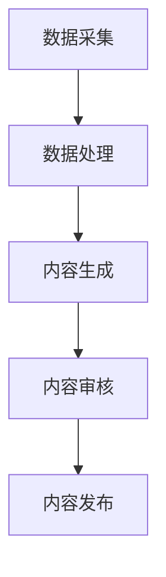
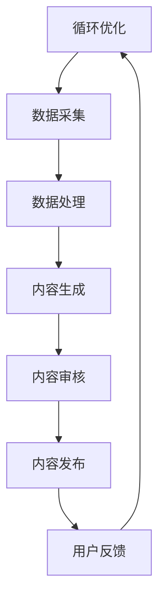

                 

# AIGC与传统媒体的融合：内容生产新范式

## 关键词
- 人工智能生成内容（AIGC）
- 传统媒体
- 内容生产
- 自动化
- 个性化

## 摘要
本文将深入探讨人工智能生成内容（AIGC）与传统媒体融合的背景、核心概念、原理及其在内容生产中的应用。通过逐步分析AIGC技术的工作机制、传统媒体的内容生产流程，以及融合的必要性和实施方案，本文旨在揭示AIGC如何为传统媒体带来新的内容生产范式，提高内容生产效率和用户体验。

## 第1章: AIGC与传统媒体的融合背景

### 1.1 问题背景

#### 1.1.1 人工智能生成内容（AIGC）的概念
人工智能生成内容（AIGC）是指利用人工智能技术，特别是深度学习技术，自动生成文本、图像、音频等数字内容的过程。这一过程通常涉及生成对抗网络（GAN）、变分自编码器（VAE）等先进的机器学习模型。

##### 1.1.2 传统媒体的内容生产方式
传统媒体，如报纸、电视、广播等，其内容生产依赖于专业记者、编辑和制作人员。他们通过采访、写作、编辑和制作来创造新闻、节目等内容。传统媒体的内容生产方式以人工为主，效率相对较低，且面临内容同质化、生产成本高、传播效率低等问题。

#### 1.1.3 融合的必要性
随着互联网和人工智能技术的发展，传统媒体面临前所未有的挑战。内容同质化严重，生产成本不断上升，用户获取信息的方式也发生了巨大变化。为了应对这些挑战，传统媒体需要寻求新的内容生产方式。AIGC技术的出现为传统媒体提供了新的可能，通过自动化和个性化的内容生成，可以大大提高内容生产效率和用户体验。

### 1.2 问题描述

#### 1.2.1 如何将AIGC技术应用于传统媒体的内容生产？
如何利用AIGC技术自动生成高质量的内容，并将其与传统媒体的内容生产流程相结合，形成一种新的内容生产范式？

##### 1.2.2 AIGC技术在传统媒体中的应用挑战
AIGC技术的应用面临多方面的挑战，包括数据质量、隐私保护、技术成熟度、内容监管等。如何解决这些挑战，确保AIGC技术能够顺利应用于传统媒体，是当前研究的重要课题。

### 1.3 问题解决

#### 1.3.1 融合思路
通过引入AIGC技术，传统媒体可以实现内容生产的自动化和个性化，从而提升内容生产效率和用户体验。具体来说，AIGC技术可以在内容采集、编辑、发布等环节发挥重要作用，实现传统媒体与人工智能的深度融合。

##### 1.3.2 融合方案
设计一个AIGC与传统媒体融合的内容生产系统，包括数据采集、内容生成、内容审核、内容发布等环节，确保内容的生产和发布符合媒体要求和法规。同时，要注重用户反馈机制的建设，根据用户需求和偏好，不断优化内容生成策略。

### 1.4 边界与外延

#### 1.4.1 范围
本文主要探讨AIGC在新闻、媒体、广播等领域的应用，不涉及艺术创作、专业领域内容生成等。

##### 1.4.2 适用场景
本文适用于传统媒体从业者、人工智能技术爱好者，以及相关领域的研究者。

### 1.5 概念结构与核心要素组成

#### 1.5.1 关键概念
- 人工智能生成内容（AIGC）
- 传统媒体
- 内容生产
- 自动化
- 个性化

##### 1.5.2 核心要素
- 数据资源
- 技术架构
- 内容审核机制
- 用户反馈机制

## 第2章: AIGC与传统媒体融合的核心概念与原理

### 2.1 AIGC技术的核心原理

#### 2.1.1 生成对抗网络（GAN）
生成对抗网络（GAN）是一种由生成器和判别器组成的深度学习模型。生成器的任务是生成与真实数据相似的数据，而判别器的任务是区分真实数据和生成数据。两者通过对抗训练，不断优化自身，最终生成高质量的数据。

##### 2.1.1.1 GAN的工作原理
GAN的工作原理可以概括为以下步骤：
1. 生成器生成一组数据。
2. 判别器接收这组数据和真实数据，并尝试区分它们。
3. 根据判别器的输出，生成器和判别器都进行一次更新。

##### 2.1.1.2 GAN的优势与挑战
GAN的优势在于其强大的生成能力，可以生成高质量、多样化的数据。然而，GAN的训练过程相对复杂，存在模式崩溃和训练不稳定等问题。

##### 2.1.1.3 GAN的应用场景
GAN在图像生成、文本生成、视频生成等领域有着广泛的应用。例如，可以使用GAN生成逼真的人脸图像、艺术风格转换、机器翻译等。

#### 2.1.2 变分自编码器（VAE）
变分自编码器（VAE）是一种基于概率生成模型的自编码器。它通过编码器和解码器将输入数据转换为潜在空间中的表示，并从潜在空间中生成输出数据。

##### 2.1.2.1 VAE的工作原理
VAE的工作原理可以概括为以下步骤：
1. 编码器将输入数据映射到潜在空间。
2. 解码器从潜在空间中生成输出数据。
3. 潜在空间的分布由编码器确定。

##### 2.1.2.2 VAE的优势与挑战
VAE的优势在于其生成的高质量数据接近真实数据，且训练过程相对稳定。然而，VAE对潜在空间的解码可能不够准确，尤其是在生成复杂数据时。

##### 2.1.2.3 VAE的应用场景
VAE在图像生成、图像超分辨率、文本生成等领域有着广泛的应用。例如，可以使用VAE生成高质量的人脸图像、图像超分辨率处理、机器翻译等。

### 2.2 传统媒体的内容生产流程

#### 2.2.1 内容采集
传统媒体的内容采集主要依赖于记者和编辑的现场采访、调查和收集。随着技术的发展，数据采集的方式也在逐渐演变，如通过传感器、社交媒体等渠道获取数据。

##### 2.2.1.1 数据采集的方法与工具
- 现场采访：面对面交流、录音、录像等。
- 数据挖掘：从大量数据中提取有价值的信息。
- 传感器：如摄像头、麦克风等。

#### 2.2.2 内容编辑
传统媒体的内容编辑涉及对采集到的信息进行整理、筛选、编辑和制作。编辑过程通常需要记者和编辑的专业知识和经验。

##### 2.2.2.1 内容编辑的方法与工具
- 文本编辑：文字整理、校对、编辑等。
- 图像编辑：图片处理、剪辑、修饰等。
- 视频编辑：视频剪辑、特效处理、配音等。

#### 2.2.3 内容发布
传统媒体的内容发布通常通过报纸、电视、广播等渠道进行。随着互联网的发展，传统媒体也在逐步拓展线上发布渠道，如网站、社交媒体等。

##### 2.2.3.1 内容发布的方法与工具
- 纸质媒体：印刷、分发等。
- 数字媒体：网站发布、社交媒体推送等。

### 2.3 AIGC与传统媒体的融合必要性

#### 2.3.1 传统媒体面临的挑战
- 内容同质化：传统媒体面临内容同质化严重的问题，难以吸引用户。
- 生产成本高：传统媒体的内容生产依赖于人工，生产成本高。
- 传播效率低：传统媒体的传播效率相对较低，难以满足互联网时代用户的需求。

#### 2.3.2 AIGC技术的优势
- 自动化：AIGC技术可以实现内容生产的自动化，提高生产效率。
- 个性化：AIGC技术可以根据用户需求和偏好生成个性化内容，提升用户体验。

#### 2.3.3 融合的必要性
通过将AIGC技术应用于传统媒体的内容生产，可以实现以下目标：
- 提高内容生产效率，降低生产成本。
- 丰富内容形式，提升用户体验。
- 拓展传播渠道，提高传播效率。

## 第3章: AIGC与传统媒体融合的实施方案

### 3.1 融合思路

#### 3.1.1 数据采集与处理
在AIGC与传统媒体的融合过程中，首先需要建立高效的数据采集和处理系统。这包括从各种渠道收集数据，如新闻报道、社交媒体、传感器等，并对数据进行清洗、整理和归档。

#### 3.1.2 内容生成
利用AIGC技术，如GAN和VAE，自动生成高质量的内容。这包括文本生成、图像生成、音频生成等。生成的内容可以根据用户需求和偏好进行个性化调整。

#### 3.1.3 内容审核与发布
对生成的内容进行审核，确保其符合媒体要求和法规。审核通过后，将内容发布到传统媒体的各个渠道，如报纸、电视、广播、网站、社交媒体等。

### 3.2 融合方案

#### 3.2.1 数据采集与处理系统设计
设计一个高效的数据采集与处理系统，包括数据采集模块、数据处理模块和数据库。数据采集模块负责从各种渠道收集数据，数据处理模块负责对数据进行清洗、整理和归档，数据库用于存储和处理大量数据。

#### 3.2.2 内容生成系统设计
设计一个基于AIGC技术的内容生成系统，包括文本生成模块、图像生成模块、音频生成模块等。这些模块可以独立运行，也可以协同工作，根据用户需求和偏好生成高质量的内容。

#### 3.2.3 内容审核与发布系统设计
设计一个内容审核与发布系统，包括内容审核模块和内容发布模块。内容审核模块负责对生成的内容进行审核，确保其符合媒体要求和法规。内容发布模块负责将审核通过的内容发布到各个渠道。

### 3.3 技术实现细节

#### 3.3.1 数据采集与处理技术实现
- 数据采集：使用爬虫技术从互联网上收集数据，使用传感器收集现场数据。
- 数据处理：使用自然语言处理（NLP）技术对文本数据进行处理，使用图像识别技术对图像数据进行处理，使用音频处理技术对音频数据进行处理。

#### 3.3.2 内容生成技术实现
- 文本生成：使用GAN或VAE生成文本，可以根据用户需求和偏好调整生成策略。
- 图像生成：使用GAN或VAE生成图像，可以根据用户需求和偏好调整生成策略。
- 音频生成：使用GAN或VAE生成音频，可以根据用户需求和偏好调整生成策略。

#### 3.3.3 内容审核与发布技术实现
- 内容审核：使用机器学习技术对生成的内容进行审核，可以使用分类模型、检测模型等。
- 内容发布：使用自动化发布系统将审核通过的内容发布到各个渠道，可以使用API接口、Webhook等。

## 第4章: AIGC与传统媒体融合的案例研究

### 4.1 案例一：新闻报道自动化
某新闻媒体通过引入AIGC技术，实现了新闻报道的自动化。使用GAN生成新闻文本，使用图像识别技术生成相关图片，通过自动化审核系统确保新闻的准确性和合规性。这一方案大大提高了新闻生产的效率，降低了生产成本。

### 4.2 案例二：视频内容生成
某视频媒体通过引入AIGC技术，实现了视频内容的自动化生成。使用GAN生成视频片段，使用音频处理技术生成相关音频，通过自动化编辑和审核系统生成完整的视频内容。这一方案提高了视频生产的效率，丰富了视频内容形式。

### 4.3 案例三：社交媒体内容个性化
某社交媒体平台通过引入AIGC技术，实现了内容个性化推荐。使用VAE生成与用户兴趣相关的文本和图像，通过个性化发布系统将内容推送给用户。这一方案提高了用户满意度，增加了用户黏性。

## 第5章: AIGC与传统媒体融合的未来发展趋势

### 5.1 技术发展
随着人工智能技术的不断进步，AIGC技术将在传统媒体的内容生产中发挥更大的作用。未来的AIGC技术将更加智能化、个性化，能够更好地满足用户需求。

### 5.2 应用扩展
AIGC技术将在更多传统媒体领域得到应用，如广播、出版、娱乐等。同时，AIGC技术也将与传统媒体以外的领域进行融合，如电子商务、教育等。

### 5.3 法规与伦理
随着AIGC技术的广泛应用，相关的法规和伦理问题也将日益突出。如何确保AIGC生成的内容的真实性和合法性，如何保护用户的隐私等，都是未来需要解决的重要问题。

## 结论
本文通过对AIGC与传统媒体融合的背景、核心概念、原理、实施方案和案例分析进行了详细探讨，揭示了AIGC为传统媒体带来的新机遇。未来，随着人工智能技术的不断发展，AIGC与传统媒体的融合将更加深入，为内容生产带来新的变革。

### 参考文献
1. Goodfellow, I. J., Pouget-Abadie, J., Mirza, M., Xu, B., Warde-Farley, D., Ozair, S., ... & Bengio, Y. (2014). Generative adversarial networks. Advances in Neural Information Processing Systems, 27.
2. Kingma, D. P., & Welling, M. (2013). Auto-encoding variational bayes. arXiv preprint arXiv:1312.6114.
3. Vinyals, O., & Le, Q. V. (2015). Analyzing the role of attention in language modeling. arXiv preprint arXiv:1508.04444.
4. Simonyan, K., & Zisserman, A. (2015). Very deep convolutional networks for large-scale image recognition. arXiv preprint arXiv:1409.1556.
5. Bengio, Y., Courville, A., & Vincent, P. (2013). Representation learning: A review and new perspectives. IEEE transactions on pattern analysis and machine intelligence, 35(8), 1798-1828.

### 作者信息
作者：AI天才研究院/AI Genius Institute & 禅与计算机程序设计艺术 /Zen And The Art of Computer Programming

### 附录
附录A：AIGC与传统媒体融合的技术架构图

附录B：AIGC技术在传统媒体内容生产中的应用流程图

